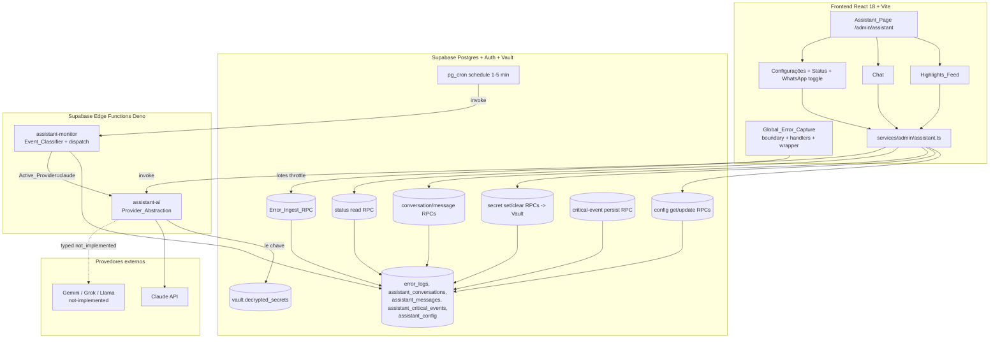
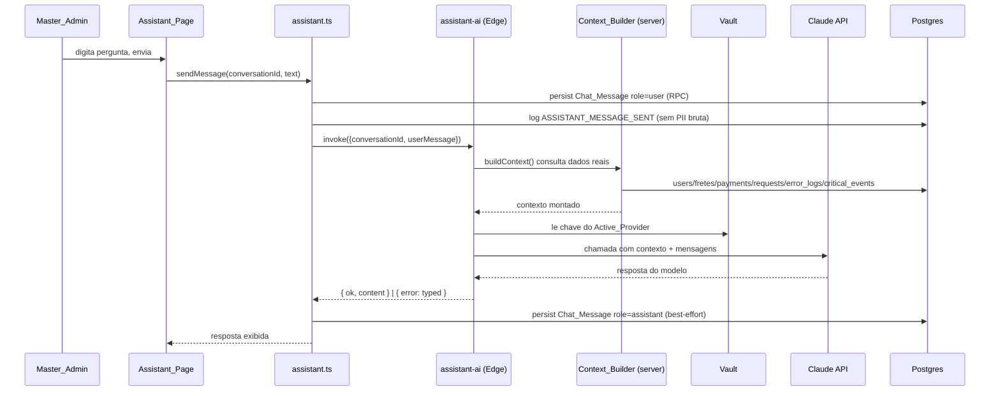

# Design Document — Assistente de IA do Painel Admin (`admin-assistant`)

## Overview

Este documento descreve o design do módulo **Assistente** (`/admin/assistant`), o assistente de IA
pessoal do Master_Admin do FreteGO. O módulo entrega, numa única página em layout compacto, três
seções (Mural de Destaques, Chat e Configurações) e quatro pilares de back-end: captura global de
erros do frontend, montagem automática de contexto a partir de dados reais do Supabase, abstração
plugável de provedor de IA (Claude funcional; Gemini/Grok/Llama estruturais) e monitoramento
autônomo de eventos críticos via `pg_cron` + Edge Function.

O design respeita integralmente os padrões herdados do painel admin (`admin-foundation`, migration
030) e as decisões conscientes do dono registradas em `requirements.md`:

- **Acesso total e sem máscara**: o Context_Builder envia dados reais (inclusive PII e pagamento) ao
  provedor de IA externo, por decisão consciente do dono. Esta ressalva (LGPD_Notice) é exibida nas
  Configurações.
- **Segredos sempre criptografados**: chaves de API e futuras credenciais de WhatsApp vivem no
  Supabase Vault (extensão `supabase_vault`, migration 042b). A chave **nunca** chega ao frontend; é
  lida apenas server-side pela AI_Edge_Function.
- **Owner_Only_Gate**: todo o módulo (UI + RPC + RLS) é restrito ao papel `SUPER_ADMIN`.

### Princípios de design herdados (reuso, sem reinvenção)

| Padrão | Origem | Aplicação neste módulo |
| --- | --- | --- |
| `executeAdminMutation` (audit-by-construction) | `audit.ts` | Toda mutação de config, chave, toggle e envio de mensagem |
| `is_admin_with_permission` (RBAC server-side) | migration 030 | Gate em todas as RPCs do módulo |
| Gating em duas camadas (UI + RPC) | `admin-patterns.md` §2 | `useAdminPermission('ASSISTANT_VIEW'/'ASSISTANT_EDIT')` + check SQL |
| `Stealth_404` | `AdminGuard` | Acesso sem `ASSISTANT_VIEW` cai em 404 stealth |
| Versionamento otimista (`updated_at` + `STALE_VERSION`) | `admin-patterns.md` §3 | Update de `assistant_config` |
| Degradação parcial (`Promise.allSettled`) | `admin-patterns.md` §6 | Mural falha isolado das demais seções |
| Migration idempotente com `DO $check$` | `admin-patterns.md` §9 | Migration 047 |
| RPC Security Posture | `admin-patterns.md` §10 | `SECURITY DEFINER` + `search_path` + `REVOKE`/`GRANT` |
| Compact_Layout_Pattern | `project-conventions.md` | Sem `<h1>`, controles `text-xs px-2.5 py-1` |
| Vault server-side para segredos | migration 042b | `provider keys` e credenciais WhatsApp |

### Escopo

- **Dentro**: rota e gating, permissões RBAC, captura global de erros, mural, chat com Context_Builder,
  configurações (provedor + chave + status + WhatsApp toggle + LGPD), abstração de provedor com
  Claude funcional, classificador determinístico de eventos, thresholds configuráveis, monitor
  agendado, migration 047 idempotente + rollback, duas Edge Functions, acessibilidade.
- **Fora** (estrutura entregue inativa/estrutural): envio real de WhatsApp (toggle off, dispatcher
  no-op); clientes Gemini/Grok/Llama (retornam erro tipado de não implementado); remediação
  automática (apenas sugestão); módulo Marketing/Meta.

## Architecture

### Visão de alto nível



### Fluxo: envio de mensagem no chat (Context_Builder)



### Fluxo: monitor autônomo (pg_cron)

```mermaid
sequenceDiagram
  participant CRON as pg_cron (1-5 min)
  participant MON as assistant-monitor (Edge)
  participant DB as Postgres
  participant CLS as Event_Classifier (pure)
  participant AIEF as assistant-ai
  participant WA as WhatsApp_Dispatcher (no-op)

  CRON->>MON: invoke
  MON->>DB: coleta sinais recentes (janela)
  MON->>CLS: classify(signals, config.thresholds)
  CLS-->>MON: Critical_Event[] | []
  alt nenhum crítico
    MON-->>CRON: conclui sem publicar nem chamar IA
  else há crítico(s) não notificados
    MON->>DB: dedup por identidade; persiste Critical_Event
    MON->>AIEF: gera mensagem (o quê/onde/sugestão)
    MON->>DB: publica Chat_Message role=assistant + Highlight
    MON->>DB: log ASSISTANT_CRITICAL_EVENT_DETECTED
    MON->>WA: dispatch(event) [toggle off => no-op]
  end
```

### Camadas e responsabilidades

1. **Frontend puro/lógico** (`src/services/admin/assistant.ts`): tipos, helpers puros
   (validação de domínio de `role`, validação de threshold, máscara de chave, formatação de
   highlight) e wrappers de RPC/Edge. A lógica pura é o alvo principal dos testes de propriedade.
2. **Frontend UI** (`src/components/admin/assistant/*`, `src/pages/admin/assistant/*`): renderização
   compacta, acessível e responsiva; gating de UI via `useAdminPermission`.
3. **Captura global** (`src/services/admin/errorCapture.ts` + bootstrap em `main.tsx`/`App.tsx`):
   boundary + handlers globais + wrapper de rede, com batch/throttle e recursion-guard.
4. **Banco** (migration 047): tabelas, RLS Owner_Only_Gate, RPCs `SECURITY DEFINER`, seed de config,
   agendamento `pg_cron`.
5. **Edge Functions** (`supabase/functions/assistant-ai`, `supabase/functions/assistant-monitor`):
   única camada que toca a chave do provedor; Context_Builder e classificador rodam server-side.

### Decisão: lógica pura compartilhada entre frontend e Edge

O `Event_Classifier` e os helpers puros de domínio precisam ser exercitados por testes de
propriedade (Vitest, ambiente Node). As Edge Functions rodam em Deno. Para evitar divergência sem
introduzir um passo de build cross-runtime, a **fonte canônica da lógica pura** fica em
`src/services/admin/assistant.ts` (e um módulo irmão `assistantClassifier.ts`), testada pelo Vitest.
A Edge Function `assistant-monitor` mantém uma cópia da mesma especificação determinística; as
propriedades de corretude descrevem o contrato (entradas → classificação) que ambos os lados devem
honrar, e o teste de propriedade valida a implementação canônica TypeScript. Não há nova dependência
npm: Claude é chamado via `fetch` dentro da Edge Function.

## Components and Interfaces

### 1. RBAC — Permission_Matrix + `is_admin_with_permission`

**`src/services/admin/permissions.ts`** — acrescentar duas ações ao enum e concedê-las só a
`SUPER_ADMIN` (que já retorna `true` para tudo via `SUPER_ADMIN: () => true`). As demais roles negam
por não constarem em seus conjuntos:

```ts
export const ADMIN_ACTIONS = [
  // ...existentes...
  'ASSISTANT_VIEW',
  'ASSISTANT_EDIT',
] as const;
```

Como `ADMIN: (a) => ALL.has(a) && !ADMIN_DENY.has(a)` permitiria qualquer ação nova ao papel `ADMIN`,
**adicionar** `ASSISTANT_VIEW` e `ASSISTANT_EDIT` ao conjunto `ADMIN_DENY` para garantir negação a
`ADMIN`. `FINANCEIRO`/`SUPORTE`/`MODERADOR` já negam por allowlist. Resultado: somente `SUPER_ADMIN`
concede.

**SQL `is_admin_with_permission`** (migration 047, `CREATE OR REPLACE`): preservar o corpo existente
e garantir que `ASSISTANT_VIEW`/`ASSISTANT_EDIT` só passem para `SUPER_ADMIN`. Como o ramo
`a.role = 'ADMIN' AND p_action NOT IN (...)` concederia ao `ADMIN`, incluir as duas ações na lista de
exclusão do ramo `ADMIN`:

```sql
OR (a.role = 'ADMIN' AND p_action NOT IN
     ('USER_DELETE','ADMIN_ROLE_GRANT','ADMIN_ROLE_REVOKE',
      'ASSISTANT_VIEW','ASSISTANT_EDIT'))
```

O ramo `SUPER_ADMIN` já cobre as duas ações. Anônimo (`auth.uid()` nulo) não tem linha em `active`,
logo retorna `false` (deny-by-default preservado).

### 2. Global_Error_Capture

**`src/services/admin/errorCapture.ts`** — módulo singleton instalável uma vez:

```ts
export type ErrorType =
  | 'react_render'
  | 'window_error'
  | 'unhandled_rejection'
  | 'console_error'
  | 'request_failure';

export interface ErrorLogDraft {
  errorType: ErrorType;
  route: string;            // location.pathname no momento
  message: string;
  stack: string | null;
  affectedUserId: string | null; // null se sem sessão
  occurredAt: string;       // ISO timestamp
}

export interface CaptureConfig {
  maxBatchSize: number;     // ex.: 20
  flushIntervalMs: number;  // ex.: 5000
  maxQueue: number;         // hard cap anti-flood, ex.: 200
}

export function installGlobalErrorCapture(cfg?: Partial<CaptureConfig>): () => void;
export function captureError(draft: ErrorLogDraft): void; // enfileira, nunca lança
```

Mecanismos:

- **React boundary**: componente `AppErrorBoundary` (reuso/superset de `components/ErrorBoundary.tsx`)
  envolve a árvore em `App.tsx`; `componentDidCatch` chama `captureError({ errorType: 'react_render' })`.
- **window handlers**: `window.addEventListener('error', …)` → `window_error`;
  `window.addEventListener('unhandledrejection', …)` → `unhandled_rejection`.
- **console.error intercept**: substitui `console.error` por wrapper que chama o original e enfileira
  um `console_error`. Um guard booleano `isReentrant` evita recursão quando o próprio envio logar erro.
- **fetch/Supabase wrapper**: `window.fetch` é embrulhado; respostas com `!response.ok` ou rejeições
  de rede geram `request_failure`. O endpoint da própria Error_Ingest_RPC é **excluído** do wrapper
  para não realimentar o laço.

Anti-flood e anti-recursão:

- Fila em memória com `maxQueue` (descarta excedente silenciosamente).
- `flush()` agrupa até `maxBatchSize` e chama `ingestErrorLogs(batch)` no máximo a cada
  `flushIntervalMs` (throttle por timer).
- Todo o caminho de captura é `try/catch` mudo: qualquer falha de captura/envio é descartada sem
  relançar (Req 3.8) e sem reentrar (flag de reentrância global).

### 3. Error_Ingest_RPC

`rpc_assistant_ingest_errors(p_batch jsonb)` — `SECURITY DEFINER`, `search_path=public`. **Exceção
controlada** ao Owner_Only_Gate: aceita inserts de qualquer usuário `authenticated` (a captura ocorre
para qualquer sessão; sessão anônima envia `affected_user_id` nulo), mas valida estritamente:

- Cada item: `error_type` ∈ domínio fechado; caso contrário **rejeita o item** (não a transação).
- Aplica limite anti-flood por chamada (ex.: ignora itens além de N por chamada e marca `throttled`).
- Não exige `is_admin_with_permission` (ingestão precisa funcionar para todos). A **leitura** de
  `error_logs` permanece Owner_Only_Gate via RLS.
- `REVOKE ALL FROM PUBLIC` + `GRANT EXECUTE TO authenticated`.

Retorno: `{ inserted: int, rejected: int, throttled: boolean }`.

### 4. Assistant_Service (`src/services/admin/assistant.ts`)

Tipos e helpers puros + wrappers. Assinaturas principais:

```ts
// Domínios fechados
export type AiProvider = 'claude' | 'gemini' | 'grok' | 'llama';
export type ChatRole = 'user' | 'assistant' | 'system';
export type CriticalEventType =
  | 'page_error_rate' | 'request_failure_rate' | 'unauthorized_access_attempt'
  | 'failed_login_burst' | 'payment_failure' | 'db_performance_drop';
export type Severity = 'info' | 'warning' | 'critical';

// ----- Helpers puros (alvo de PBT) -----
export function isValidChatRole(role: string): role is ChatRole;
export function assertChatRole(role: string): ChatRole;       // lança se fora do domínio
export function isValidThreshold(n: unknown): boolean;        // inteiro >= 1
export function isValidCronInterval(n: unknown): boolean;     // inteiro 1..5
export function isValidErrorType(t: string): t is ErrorType;
export function maskApiKey(raw: string): string;              // nunca retorna bruto
export function summarizeHighlight(ev: CriticalEvent): Highlight;

// ----- Wrappers (RPC/Edge) -----
export function getConfig(): Promise<AssistantConfigView>;
export function updateConfig(patch: ConfigPatch, expectedUpdatedAt: string): Promise<ConfigResult>;
export function setProviderKey(provider: AiProvider, rawKey: string): Promise<{ ok: true }>;
export function clearProviderKey(provider: AiProvider): Promise<{ ok: true }>;
export function getStatus(): Promise<AssistantStatus>;
export function listConversations(): Promise<ConversationSummary[]>;
export function loadConversation(id: string): Promise<ChatMessage[]>; // ASC cronológico
export function sendMessage(conversationId: string | null, text: string): Promise<SendResult>;
export function listHighlights(): Promise<Highlight[]>; // DESC cronológico
```

`ConfigPatch` aceita `activeProvider`, `thresholds`, `cronIntervalMinutes`, `whatsappToggle`. Cada
mutação usa `executeAdminMutation` com a `action` correspondente (`ASSISTANT_CONFIG_UPDATED`,
`ASSISTANT_WHATSAPP_TOGGLED`, `ASSISTANT_PROVIDER_KEY_UPDATED`, `ASSISTANT_PROVIDER_KEY_CLEARED`,
`ASSISTANT_MESSAGE_SENT`), com `before`/`after` omitindo valores brutos de segredo e PII.

### 5. Provider_Abstraction (Edge `assistant-ai`)

Interface comum no Deno da Edge Function:

```ts
interface AiInvokeInput { context: string; messages: { role: ChatRole; content: string }[]; }
type AiInvokeResult =
  | { ok: true; content: string; model: string }
  | { ok: false; error: 'provider_not_implemented' | 'provider_call_failed' | 'missing_api_key';
      provider: AiProvider; detail?: string };

interface AiProviderClient { invoke(input: AiInvokeInput, apiKey: string): Promise<AiInvokeResult>; }

function selectProviderClient(provider: AiProvider): AiProviderClient;
```

- `claude` → `ClaudeClient` (chama a API Anthropic via `fetch`; lê `model` da config; retorna
  `{ ok: true, content }`). Falha do cliente Claude → `{ ok: false, error: 'provider_call_failed' }`
  **sem fallback** para outro provedor (Req 8.3).
- `gemini`/`grok`/`llama` → cliente stub que retorna
  `{ ok: false, error: 'provider_not_implemented', provider }` sem tocar segredos (Req 8.5).
- A Edge lê a chave do Active_Provider **exclusivamente do Vault** (`vault.decrypted_secrets` por
  nome `assistant_provider_key_<provider>`); se ausente → `missing_api_key` (Req 8.7, 7.7).
- Adicionar um provedor = implementar `AiProviderClient` e registrá-lo em `selectProviderClient`, sem
  tocar Context_Builder nem o fluxo de chat (Req 8.6).

### 6. Context_Builder (server-side, dentro de `assistant-ai`)

```ts
async function buildContext(userMessage: string, sb: SupabaseClient): Promise<string>;
```

Consulta dados reais via service-role client (a Edge usa `SUPABASE_SERVICE_ROLE_KEY`): contagens e
amostras recentes de `users`/`motoristas`/`embarcadores`, `fretes` (ativos/sem aceite), `payments`,
requisições/erros (`error_logs`) e `assistant_critical_events`. Monta um bloco textual de contexto
**sem máscara** (decisão do dono). Nota de segurança: PII real é enviada ao provedor externo por
escolha consciente; mitigação: a chamada passa só pela Edge, a chave fica no Vault e o frontend nunca
vê a chave nem chama o provedor diretamente.

### 7. Monitor_Edge_Function (`assistant-monitor`) + WhatsApp_Dispatcher

- Invocada pelo `pg_cron`. Autentica via Bearer `SERVICE_ROLE_KEY` (padrão da função de push).
- Coleta sinais recentes na janela de avaliação, monta `ClassifierSignals`, chama `Event_Classifier`.
- Para cada Critical_Event **não notificado** (dedup por identidade do evento na janela — chave
  estável `type + scope + bucket de tempo`): persiste em `assistant_critical_events`, gera a mensagem
  automática (o quê/onde/sugestão — apenas sugere, não remedia), publica `Chat_Message` role
  `assistant` + Highlight, e loga `ASSISTANT_CRITICAL_EVENT_DETECTED`.
- Common_Event → não persiste, não publica, não chama IA (Req 9.4).
- `WhatsApp_Dispatcher.dispatch(event)`: **no-op while toggle off** (Req 13.3/13.4). Seam pronto para
  a futura Evolution API sem alterar o fluxo de detecção (Req 13.6).
- Erros internos são logados e a função conclui sem interromper execuções futuras (Req 12.6).

### 8. Event_Classifier (lógica pura determinística)

```ts
export interface ThresholdConfig {
  page_error_rate: number;        // >= 1
  request_failure_rate: number;   // >= 1
  failed_login_burst: number;     // >= 1
}
export interface ClassifierSignals {
  pageErrorCount: number;
  requestFailureCount: number;
  failedLoginsByIp: Record<string, number>; // contagem por IP, NÃO somada entre IPs
  unauthorizedAccessCount: number;           // > 0 dispara
  paymentFailureCount: number;               // > 0 dispara
  dbPerformanceDrop: boolean;                // true dispara
  newSignups: number;                        // Common_Event, nunca dispara
  postedFretes: number;                      // Common_Event, nunca dispara
}
export interface DetectedEvent {
  type: CriticalEventType;
  severity: Severity;
  summary: string;
  scope: string; // ex.: ip:1.2.3.4 ou global
}
export function classifyEvents(signals: ClassifierSignals, thresholds: ThresholdConfig): DetectedEvent[];
```

Regras:

- Pura e determinística: mesma entrada ⇒ mesma saída, sem efeitos colaterais (Req 9.1).
- Somente tipos do domínio `Critical_Event_Type` (Req 9.2). `newSignups`/`postedFretes` jamais
  produzem evento (Req 9.3).
- Thresholds (`page_error_rate`, `request_failure_rate`, `failed_login_burst`): evento sse contagem
  observada **≥** threshold; caso contrário, nenhum (Req 10.2/10.3).
- `failed_login_burst`: avaliado **por IP**; cada IP cuja contagem ≥ threshold gera um evento próprio
  (`scope = ip:<addr>`); IPs distintos não são somados (Req 11.2/11.3/11.4).
- `unauthorized_access_attempt`, `payment_failure`, `db_performance_drop`: presença do sinal dispara
  (Req 11.1/11.5/11.6).
- Cada evento carrega `type`, `severity` e `summary` (Req 9.6).

### 9. Frontend UI

- `src/pages/admin/assistant/AssistantPage.tsx`: orquestra três seções na ordem Mural → Chat →
  Configurações; sem `<h1>` grande; `Promise.allSettled` para isolar falha do Mural.
- `src/components/admin/assistant/HighlightsFeed.tsx`: read-only, ordem DESC, item com
  categoria/resumo/severidade/timestamp; clique navega à conversa; estado vazio informativo; erro
  isolado com botão **Tentar novamente** (reuso `DashboardBlockError`).
- `src/components/admin/assistant/AssistantChat.tsx`: histórico ASC, input rotulado (`aria-label`),
  novas mensagens com `role="status"`; degradação se persistência falhar.
- `src/components/admin/assistant/AssistantSettings.tsx`: seletor de Active_Provider, campo de chave
  (mostra só `is_set`+máscara), thresholds, intervalo cron, status em tempo real, `WhatsApp_Toggle`,
  LGPD_Notice. Read-only sem `ASSISTANT_EDIT` (oculta Salvar).
- `src/components/admin/assistant/AssistantStatus.tsx`: ativo/inativo, provider+modelo, últimos
  Critical_Event; inativo quando `is_set=false` com orientação para configurar a chave.
- Registro de rota em `AdminLayoutRoute.tsx` (`path="assistant"`) e item na `AdminSidebar`
  (`/admin/assistant`, `permission: 'ASSISTANT_VIEW'`).

## Data Models

### Tabelas (migration 047)

```sql
-- error_logs
id uuid PK default gen_random_uuid()
error_type text NOT NULL CHECK (error_type IN
  ('react_render','window_error','unhandled_rejection','console_error','request_failure'))
route text
message text
stack text
affected_user_id uuid NULL REFERENCES users(id) ON DELETE SET NULL
occurred_at timestamptz NOT NULL DEFAULT now()
created_at timestamptz NOT NULL DEFAULT now()
-- índices: (occurred_at DESC), (error_type, occurred_at DESC)

-- assistant_conversations
id uuid PK default gen_random_uuid()
title text NOT NULL DEFAULT 'Conversa'
created_at timestamptz NOT NULL DEFAULT now()
updated_at timestamptz NOT NULL DEFAULT now()

-- assistant_messages
id uuid PK default gen_random_uuid()
conversation_id uuid NOT NULL REFERENCES assistant_conversations(id) ON DELETE CASCADE
role text NOT NULL CHECK (role IN ('user','assistant','system'))
content text NOT NULL
created_at timestamptz NOT NULL DEFAULT now()
-- índice: (conversation_id, created_at ASC)

-- assistant_critical_events
id uuid PK default gen_random_uuid()
event_type text NOT NULL CHECK (event_type IN
  ('page_error_rate','request_failure_rate','unauthorized_access_attempt',
   'failed_login_burst','payment_failure','db_performance_drop'))
severity text NOT NULL CHECK (severity IN ('info','warning','critical'))
summary text NOT NULL
scope text NOT NULL DEFAULT 'global'
dedup_key text NOT NULL              -- identidade do evento na janela (anti-republicação)
conversation_id uuid NULL REFERENCES assistant_conversations(id) ON DELETE SET NULL
detected_at timestamptz NOT NULL DEFAULT now()
notified_at timestamptz NULL
-- UNIQUE (dedup_key) para deduplicação idempotente

-- assistant_config (registro único)
id boolean PK DEFAULT true CHECK (id)   -- garante single row
active_provider text NOT NULL DEFAULT 'claude' CHECK (active_provider IN
  ('claude','gemini','grok','llama'))
model text NOT NULL DEFAULT 'claude-3-5-sonnet-latest'
threshold_page_error_rate int NOT NULL DEFAULT 10 CHECK (threshold_page_error_rate >= 1)
threshold_request_failure_rate int NOT NULL DEFAULT 10 CHECK (threshold_request_failure_rate >= 1)
threshold_failed_login_burst int NOT NULL DEFAULT 5 CHECK (threshold_failed_login_burst >= 1)
cron_interval_minutes int NOT NULL DEFAULT 1 CHECK (cron_interval_minutes BETWEEN 1 AND 5)
whatsapp_toggle boolean NOT NULL DEFAULT false
updated_at timestamptz NOT NULL DEFAULT now()
-- Segredos NÃO ficam aqui; chaves vão para o Vault.
```

Segredos no Vault (nomes): `assistant_provider_key_claude`, `assistant_provider_key_gemini`,
`assistant_provider_key_grok`, `assistant_provider_key_llama`, e futura `assistant_whatsapp_*`.
`assistant_config` expõe apenas `is_set` derivado (via RPC que consulta a existência do segredo), não
o valor.

### RLS

Todas as tabelas com RLS habilitada. `assistant_conversations`, `assistant_messages`,
`assistant_critical_events`, `assistant_config`: `SELECT/INSERT/UPDATE/DELETE` apenas quando
`is_admin_with_permission('ASSISTANT_VIEW')` (e `ASSISTANT_EDIT` para escrita de config). `error_logs`:
leitura sob `ASSISTANT_VIEW`; **inserção** ocorre só pela Error_Ingest_RPC (`SECURITY DEFINER`), sem
policy de insert direto para `authenticated`.

### RPCs (migration 047 — todas `SECURITY DEFINER`, `search_path=public`, `REVOKE`/`GRANT`)

| RPC | Permissão | Função |
| --- | --- | --- |
| `rpc_assistant_ingest_errors(p_batch jsonb)` | `authenticated` (exceção controlada) | persiste lotes, valida domínio, anti-flood |
| `rpc_assistant_get_config()` | `ASSISTANT_VIEW` | retorna config + `is_set` por provider (sem bruto) |
| `rpc_assistant_update_config(p_patch jsonb, p_expected_updated_at)` | `ASSISTANT_EDIT` | update otimista, valida thresholds≥1 e cron 1..5 |
| `rpc_assistant_set_secret(p_provider, p_raw)` | `ASSISTANT_EDIT` | grava no Vault; audit só metadados |
| `rpc_assistant_clear_secret(p_provider)` | `ASSISTANT_EDIT` | apaga do Vault; `is_set=false` |
| `rpc_assistant_list_conversations()` | `ASSISTANT_VIEW` | sumários DESC |
| `rpc_assistant_load_conversation(p_id)` | `ASSISTANT_VIEW` | mensagens ASC |
| `rpc_assistant_post_message(p_conversation_id, p_role, p_content)` | `ASSISTANT_VIEW` | valida `role`, insere, toca `updated_at` |
| `rpc_assistant_persist_critical_event(p_event jsonb)` | service-role/monitor | insere com dedup `ON CONFLICT (dedup_key) DO NOTHING` |
| `rpc_assistant_get_status()` | `ASSISTANT_VIEW` | ativo/inativo, provider+modelo, últimos eventos |

Toda RPC gated: `auth.uid()` nulo ⇒ `permission_denied`; sem permissão ⇒ grava
`ASSISTANT_VIEW_DENIED` (`before` nulo, `after` = `{user_id, reason}`) e aborta.

### Cron_Job (pg_cron, idempotente)

```sql
-- desagenda anterior se existir, depois agenda — evita duplicidade em reexecução
SELECT cron.unschedule('assistant_monitor_job')
  WHERE EXISTS (SELECT 1 FROM cron.job WHERE jobname='assistant_monitor_job');
SELECT cron.schedule('assistant_monitor_job', '* * * * *',  -- 1 min (dentro de 1..5)
  $$ SELECT net.http_post(url := <edge_url>/functions/v1/assistant-monitor, headers := ...) $$);
```

URL e service key lidos do Vault (padrão 042b). Rollback (`047_..._rollback.sql`) faz
`cron.unschedule` + `DROP` das tabelas/funções, documentado e não auto-aplicado.

## Correctness Properties

Uma propriedade é uma característica ou comportamento que deve valer em **todas** as execuções
válidas do sistema — uma afirmação formal sobre o que o software deve fazer. Propriedades são a ponte
entre a especificação legível por humanos (os critérios de aceitação) e garantias de corretude
verificáveis por máquina (testes baseados em propriedade com fast-check).

As propriedades abaixo derivam do prework de critérios de aceitação. Os critérios classificados como
EXAMPLE, EDGE_CASE, INTEGRATION ou SMOKE são cobertos pela estratégia de testes (testes de exemplo,
edge, integração e smoke) e não geram propriedades universais. As redundâncias foram consolidadas
conforme a reflexão de propriedades.

### Property 1: Owner_Only_Gate — ASSISTANT_VIEW/EDIT concedidas exclusivamente a SUPER_ADMIN

*For any* `AdminRole` do domínio e *for any* ação em `{ASSISTANT_VIEW, ASSISTANT_EDIT}`,
`hasPermission(role, action)` retorna verdadeiro se e somente se `role === 'SUPER_ADMIN'`.

**Validates: Requirements 1.4, 1.5, 2.1, 2.2**

### Property 2: Deny-by-default fora do domínio de ações

*For any* `AdminRole` e *for any* string que **não** pertence a `ADMIN_ACTIONS`,
`hasPermission(role, str)` retorna falso.

**Validates: Requirements 2.5**

### Property 3: Forma e domínio do Error_Log capturado

*For any* erro capturado (mensagem, stack opcional, rota, sessão opcional, tipo gerado dentro do
domínio), o draft produzido por `buildErrorDraft` contém `occurredAt` (timestamp ISO), `errorType`
pertencente ao domínio fechado, `route`, `affectedUserId` (string ou `null`, sem falhar quando não há
sessão) e `stack` (`string` ou `null`).

**Validates: Requirements 3.5, 3.6**

### Property 4: Batching e throttling respeitam os limites para qualquer sequência de capturas

*For any* sequência finita de capturas de erro e *for any* configuração válida
(`maxBatchSize`, `maxQueue`), nenhum lote enviado excede `maxBatchSize`, a fila nunca retém mais que
`maxQueue` itens (excedentes descartados), e o total enviado é menor ou igual ao total enfileirado.

**Validates: Requirements 3.7**

### Property 5: Captura é silenciosa, não lança e não reentra

*For any* entrada de captura e *for any* sink que lança exceção, `captureError`/`flush` nunca propaga
exceção à aplicação e nunca invoca o sink de forma reentrante (guard de reentrância impede laço).

**Validates: Requirements 3.8**

### Property 6: Ingestão particiona o lote pelo domínio fechado de Error_Type

*For any* lote de itens de erro com `error_type` arbitrário, a validação de ingestão aceita
exatamente os itens cujo `error_type` pertence ao domínio fechado e rejeita os demais, com
`inserted + rejected === total` e nenhum item de tipo inválido aceito.

**Validates: Requirements 3.9, 3.10**

### Property 7: Highlights ordenados cronologicamente decrescente

*For any* lista de `Highlight`, `sortHighlights` produz uma permutação ordenada de forma não-crescente
por timestamp (cada item tem timestamp maior ou igual ao seguinte).

**Validates: Requirements 4.1**

### Property 8: Derivação de Highlight a partir de Critical_Event

*For any* `CriticalEvent`, o `Highlight` derivado por `summarizeHighlight` contém categoria, resumo,
severidade e timestamp não vazios; quando a conversa referenciada não existe, a view resultante não
possui link de navegação e a derivação não lança.

**Validates: Requirements 4.4, 6.5**

### Property 9: Domínio fechado do papel de Chat_Message

*For any* string, `isValidChatRole` retorna verdadeiro se e somente se a string pertence a
`{user, assistant, system}`; `assertChatRole` retorna o papel para valores do domínio e lança para
qualquer valor fora dele.

**Validates: Requirements 5.5**

### Property 10: Carregamento de histórico ordenado cronologicamente crescente

*For any* conjunto de `ChatMessage` com `created_at` arbitrários, a normalização de carga ordena as
mensagens de forma não-decrescente por `created_at` (ordem ASC).

**Validates: Requirements 5.7**

### Property 11: Não-vazamento de segredo em saídas legíveis

*For any* chave de API bruta não vazia e *for any* `ConfigPatch`, nenhuma saída destinada ao frontend
ou ao audit contém o valor bruto: `getConfigView` retorna apenas `is_set` e a máscara
(`maskApiKey(raw)` nunca é igual ao bruto e não contém o bruto como substring para chaves de tamanho
relevante), e `buildConfigAudit(patch)` não inclui valores brutos de segredo.

**Validates: Requirements 7.4, 7.5, 14.5**

### Property 12: Atividade do assistente depende da presença da chave do Active_Provider

*For any* configuração, `computeActive(config)` retorna verdadeiro se e somente se o `is_set` do
`active_provider` é verdadeiro.

**Validates: Requirements 7.7**

### Property 13: Validação do domínio fechado de AI_Provider

*For any* string, `isValidProvider` retorna verdadeiro se e somente se pertence a
`{claude, gemini, grok, llama}`.

**Validates: Requirements 7.1**

### Property 14: Seleção e resultado tipado da Provider_Abstraction

*For any* `AiProvider` configurado como `Active_Provider`, `selectProviderClient(provider)` retorna o
cliente cujo identificador é igual a `provider`; o cliente de `claude` produz um resultado
`{ ok: true }` (com fetch simulado) e os clientes de `gemini`/`grok`/`llama` produzem
`{ ok: false, error: 'provider_not_implemented' }` sem referenciar nenhum segredo.

**Validates: Requirements 8.2, 8.4, 8.5**

### Property 15: Determinismo do Event_Classifier

*For any* `ClassifierSignals` e *for any* `ThresholdConfig`, duas invocações consecutivas de
`classifyEvents(signals, thresholds)` produzem resultados iguais (função pura, sem efeitos
colaterais).

**Validates: Requirements 9.1**

### Property 16: Saída do classificador é tipada e completa

*For any* `ClassifierSignals` e `ThresholdConfig`, todo `DetectedEvent` retornado tem `type`
pertencente ao domínio `Critical_Event_Type`, e os campos `type`, `severity` e `summary` não vazios.

**Validates: Requirements 9.2, 9.6**

### Property 17: Eventos comuns nunca disparam classificação crítica

*For any* valores de `newSignups` e `postedFretes` e *for any* configuração, quando os sinais
críticos estão ausentes (contagens abaixo do threshold e flags negativas), `classifyEvents` retorna
lista vazia — cadastros e fretes postados jamais produzem Critical_Event.

**Validates: Requirements 9.3**

### Property 18: Avaliação bicondicional por threshold

*For any* sinal baseado em threshold (`page_error_rate`, `request_failure_rate`) com contagem
observada `count` e `threshold` válido (inteiro ≥ 1), o classificador inclui o evento daquele tipo se
e somente se `count >= threshold`.

**Validates: Requirements 10.2, 10.3**

### Property 19: Agregação de falhas de login independente por IP

*For any* mapa de falhas de login por IP e *for any* `threshold` de `failed_login_burst`, o
classificador gera um evento `failed_login_burst` (com `scope` daquele IP) exatamente para os IPs
cuja contagem individual é maior ou igual ao threshold; quando todas as contagens individuais são
menores que o threshold, nenhum evento é gerado mesmo que a soma de todos os IPs exceda o threshold.

**Validates: Requirements 11.2, 11.3, 11.4**

### Property 20: Sinais diretos disparam o tipo correspondente

*For any* `ClassifierSignals`, quando `unauthorizedAccessCount > 0` o classificador inclui um evento
`unauthorized_access_attempt`; quando `paymentFailureCount > 0`, inclui `payment_failure`; quando
`dbPerformanceDrop` é verdadeiro, inclui `db_performance_drop`.

**Validates: Requirements 11.1, 11.5, 11.6**

### Property 21: Validação de Critical_Threshold (inteiro ≥ 1)

*For any* valor, `isValidThreshold` retorna verdadeiro se e somente se o valor é um inteiro maior ou
igual a 1; `updateConfig` rejeita thresholds fora desse intervalo antes de persistir.

**Validates: Requirements 10.5**

### Property 22: Validação do intervalo do Cron_Job (inteiro 1..5)

*For any* valor, `isValidCronInterval` retorna verdadeiro se e somente se é um inteiro no intervalo
fechado de 1 a 5.

**Validates: Requirements 10.6**

### Property 23: Mensagem automática de Critical_Event descreve o quê/onde/sugestão sem remediar

*For any* `DetectedEvent`, `buildCriticalMessage(event)` produz um texto que inclui a descrição do que
aconteceu, onde ocorreu (`scope`) e uma sugestão de correção, e não executa nenhuma ação de
remediação (função pura, sem efeitos colaterais).

**Validates: Requirements 12.4**

### Property 24: Deduplicação de eventos já notificados é idempotente

*For any* conjunto de eventos já notificados (`already`) e *for any* lote de eventos candidatos,
`dedupNewEvents(already, batch)` nunca retorna um evento cuja `dedup_key` já está em `already`, e
reaplicar a deduplicação sobre o resultado é idempotente (`dedup(dedup(x)) === dedup(x)`).

**Validates: Requirements 12.7**

### Property 25: WhatsApp_Dispatcher é no-op enquanto o toggle está desligado

*For any* `DetectedEvent`, `whatsappDispatch(event, { whatsappToggle: false })` retorna um resultado
no-op (`{ sent: false }`) e não realiza nenhuma chamada de envio.

**Validates: Requirements 13.3, 13.4**

## Error Handling

### Frontend — Global_Error_Capture

- **Recursion guard**: flag global `__assistantCaptureReentrant`. Se `true`, `captureError` retorna
  imediatamente. Isso evita que um erro lançado dentro do envio gere nova captura (Req 3.8).
- **Sink à prova de falha**: o envio (`ingestErrorLogs`) é envolvido em `try/catch` mudo; falha de
  rede/RPC é descartada (o erro do site não pode quebrar por causa do logger).
- **Endpoint próprio excluído**: o wrapper de `fetch` ignora chamadas à Error_Ingest_RPC para não
  realimentar a fila.
- **Overflow**: ao exceder `maxQueue`, novos itens são descartados silenciosamente (sem alerta).

### Frontend — Chat e Mural

- **Falha de persistência da resposta** (Req 5.4): a resposta da IA é exibida ao usuário; a
  persistência `assistant` é best-effort, sem retry automático; a conversa em curso é preservada.
- **Erro/indisponibilidade do provedor** (Req 5.6): a UI exibe mensagem amigável (`role="alert"`); a
  `Chat_Message` `user` já persistida permanece.
- **Falha isolada do Mural** (Req 4.7): `Promise.allSettled` isola o carregamento; só o Mural mostra
  `DashboardBlockError` com **Tentar novamente**; Chat e Configurações renderizam normalmente.
- **Versão obsoleta de config** (`STALE_VERSION`): toast neutro + refetch, padrão admin §3.

### Servidor — RPCs

- `auth.uid()` nulo ⇒ `RAISE permission_denied` (`ERRCODE 42501`).
- Sem permissão ⇒ grava `ASSISTANT_VIEW_DENIED` (`before` nulo, `after = {user_id, reason}`) e aborta
  (Req 5.9, 14.4).
- `rpc_assistant_update_config`: valida thresholds (≥1) e cron (1..5); valor inválido ⇒ `RAISE`
  com erro tipado, sem persistir (Req 10.5, 10.6).
- `rpc_assistant_post_message`: valida `role` no domínio; fora ⇒ `RAISE` (Req 5.5).
- Update otimista com `expected_updated_at`; 0 linhas ⇒ `STALE_VERSION`.

### Servidor — Edge Functions

- **assistant-ai**: chave ausente ⇒ `missing_api_key`; provider não implementado ⇒
  `provider_not_implemented`; falha do Claude ⇒ `provider_call_failed` **sem fallback** (Req 8.3).
  Nenhum erro expõe segredo.
- **assistant-monitor**: erro durante a execução é logado (e capturado por `try/catch` por evento) e
  a função conclui sem interromper execuções agendadas futuras (Req 12.6). Persistência de evento usa
  `ON CONFLICT (dedup_key) DO NOTHING` para idempotência (Req 12.7).

### Migration 047

- `DO $check$` aborta com mensagem clara se a migration 030 ou a extensão `supabase_vault` estiverem
  ausentes (Req 15.4). Todo o conteúdo em um único `BEGIN; ... COMMIT;` (Req 15.2). Agendamento
  `pg_cron` idempotente (unschedule-then-schedule) evita duplicidade (Req 15.8).

## Testing Strategy

Abordagem dupla, conforme convenções do projeto (`project-conventions.md`): **testes de propriedade**
(fast-check) para as propriedades universais e **testes de exemplo/edge/integração** para o restante.

### Biblioteca e configuração de PBT

- Biblioteca: **fast-check** (já no projeto), executada via **Vitest**. Não implementar PBT do zero.
- Mínimo **100 iterações** por teste de propriedade (`fc.assert(fc.property(...), { numRuns: 100 })`).
- Cada teste de propriedade é tag-eado com comentário referenciando a propriedade do design no
  formato: `// Feature: admin-assistant, Property N: <texto da propriedade>`.
- Cada propriedade de corretude é implementada por **um único** teste de propriedade.
- Convenções obrigatórias do projeto:
  - `vi.mock` é **hoisted**: não referenciar variáveis externas no factory; expor spies via
    `(globalThis as Record<string, unknown>).__nomeDoSpy = ...`.
  - `fc.stringOf` não existe: usar `fc.string({ minLength, maxLength }).filter(...)`.
  - Geradores de amostras válidas de domínio fechado (provider, role, error_type, event_type,
    severity) via `fc.constantFrom(...)`.

### Mapa Propriedade → arquivo de teste

Arquivos em `src/__tests__/admin/assistant/` (sufixo `.property.test.ts`):

| Propriedade | Arquivo | Alvo |
| --- | --- | --- |
| 1, 2 | `cp1Rbac.property.test.ts` | `permissions.ts` (`hasPermission`) |
| 3 | `cp3ErrorDraft.property.test.ts` | `errorCapture.buildErrorDraft` |
| 4 | `cp4Batching.property.test.ts` | `errorCapture` (timers fake) |
| 5 | `cp5SilentCapture.property.test.ts` | `errorCapture.captureError` |
| 6 | `cp6IngestDomain.property.test.ts` | `assistant.partitionErrorBatch` |
| 7 | `cp7HighlightsOrder.property.test.ts` | `assistant.sortHighlights` |
| 8 | `cp8HighlightDerive.property.test.ts` | `assistant.summarizeHighlight` |
| 9 | `cp9ChatRole.property.test.ts` | `assistant.isValidChatRole/assertChatRole` |
| 10 | `cp10HistoryOrder.property.test.ts` | `assistant.normalizeHistory` |
| 11 | `cp11SecretLeak.property.test.ts` | `assistant.maskApiKey/getConfigView/buildConfigAudit` |
| 12 | `cp12Active.property.test.ts` | `assistant.computeActive` |
| 13 | `cp13Provider.property.test.ts` | `assistant.isValidProvider` |
| 14 | `cp14ProviderSelect.property.test.ts` | `assistantProvider.selectProviderClient` |
| 15 | `cp15Determinism.property.test.ts` | `assistantClassifier.classifyEvents` |
| 16 | `cp16ClassifierShape.property.test.ts` | `classifyEvents` |
| 17 | `cp17CommonNeverCritical.property.test.ts` | `classifyEvents` |
| 18 | `cp18Threshold.property.test.ts` | `classifyEvents` |
| 19 | `cp19PerIpAggregation.property.test.ts` | `classifyEvents` |
| 20 | `cp20DirectSignals.property.test.ts` | `classifyEvents` |
| 21 | `cp21ThresholdValidation.property.test.ts` | `assistant.isValidThreshold` |
| 22 | `cp22CronValidation.property.test.ts` | `assistant.isValidCronInterval` |
| 23 | `cp23CriticalMessage.property.test.ts` | `assistant.buildCriticalMessage` |
| 24 | `cp24Dedup.property.test.ts` | `assistant.dedupNewEvents` |
| 25 | `cp25WhatsappNoop.property.test.ts` | `assistant.whatsappDispatch` |

### Geradores fast-check (resumo)

```ts
const roleGen = fc.constantFrom('SUPER_ADMIN','ADMIN','SUPORTE','FINANCEIRO','MODERADOR');
const providerGen = fc.constantFrom('claude','gemini','grok','llama');
const roleMsgGen = fc.constantFrom('user','assistant','system');
const errorTypeGen = fc.constantFrom(
  'react_render','window_error','unhandled_rejection','console_error','request_failure');
const thresholdGen = fc.integer({ min: 1, max: 1000 });
const cronGen = fc.integer({ min: 1, max: 5 });
const ipGen = fc.constantFrom('1.2.3.4','10.0.0.1','192.168.0.2','203.0.113.7','172.16.5.9');
const failedLoginsByIpGen = fc.dictionary(ipGen, fc.integer({ min: 0, max: 50 }));
```

### Testes de exemplo, edge, integração e smoke (não-PBT)

- **Exemplo (Vitest + Testing Library)**: registro de rota (1.1), render gated (1.2/1.6),
  ausência de `<h1>` (1.7), ordem das seções (1.8), captura por boundary/window/console/fetch
  (3.1–3.4), mural read-only (4.2) e navegação (4.3), persistência de resposta (5.3), CRUD de
  conversa/mensagem (6.1/6.2/6.4), `updateConfig`/toggle disparam `executeAdminMutation` com a
  `action` correta (7.2/10.4/13.5), status (7.6), modo leitura sem `ASSISTANT_EDIT` (7.8),
  LGPD_Notice (7.9), toggle + aviso inativo (13.2), acessibilidade (16.1–16.4).
- **Edge**: sem permissão na UI ⇒ Stealth404 (1.3), mural vazio (4.5), falha de persistência da
  resposta (5.4), erro do provedor (5.6), Claude falha sem fallback (8.3), highlight com conversa
  ausente (6.5).
- **Integração (1–3 exemplos, com mocks/banco efêmero)**: `is_admin_with_permission` paridade e
  anônimo (2.3/2.4), Context_Builder consulta fontes (5.1/5.2), `ASSISTANT_VIEW_DENIED` (5.9/14.4),
  RLS Owner_Only_Gate (6.6/14.7), Edge lê Vault e é a única a usar a chave (8.7/14.2), set/clear
  secret no Vault + audit (7.3/14.6), monitor: coleta→classifica→persiste→publica/dedup/log
  (9.4/9.5/12.2/12.3/12.5/12.6/12.8), `updated_at` touch (6.3), idempotência da migration (15.3) e
  do agendamento cron (15.8).
- **Smoke (execução única)**: presença/forma da migration 047 (15.1/15.2/15.5/15.6/15.7/15.9/15.10),
  `DO $check$` (15.4), cron agendado (12.1), schema de thresholds/toggle (10.1/13.1), seam WhatsApp e
  Vault reservado (13.6/13.7), contraste WCAG AA por revisão manual (16.5). A validação WCAG AA
  completa requer teste manual com tecnologias assistivas e revisão de especialista.

### Cobertura complementar

Testes de propriedade cobrem as garantias universais (lógica pura: RBAC, classificador, validações,
não-vazamento de segredo, ordenação, dedup). Testes de exemplo/edge cobrem interações de UI e casos
específicos. Testes de integração cobrem RLS, Vault, Edge Functions e idempotência de migration —
áreas onde PBT não é apropriado (I/O externo, configuração, infraestrutura).
