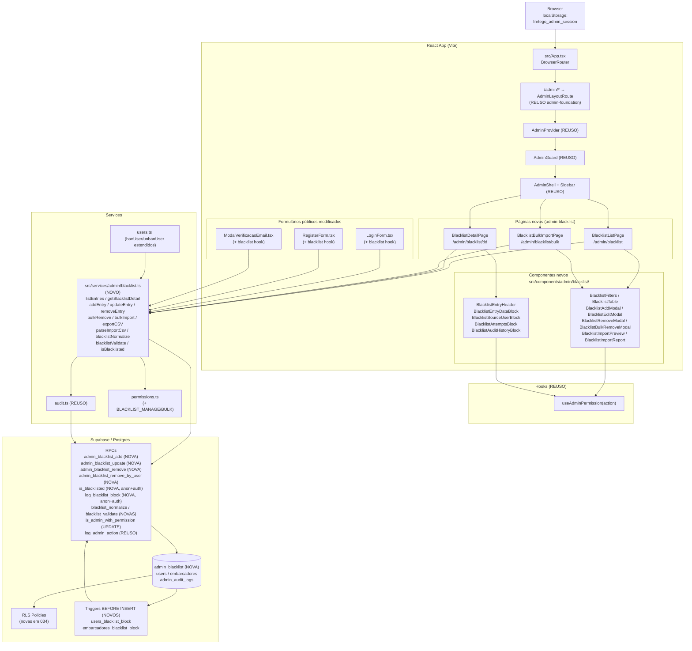
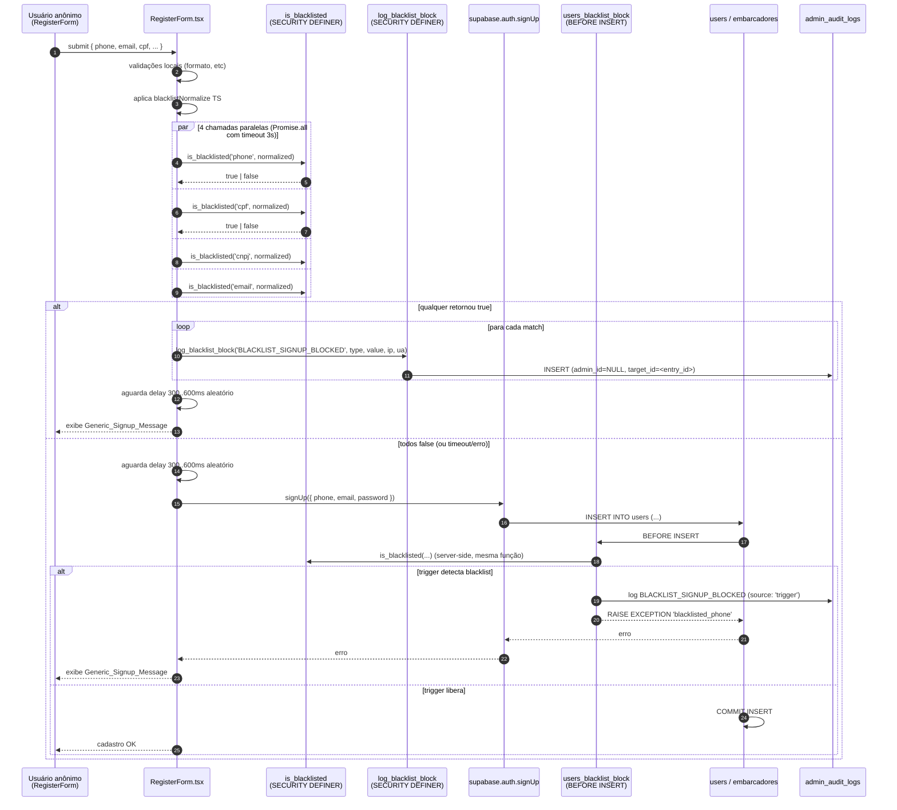
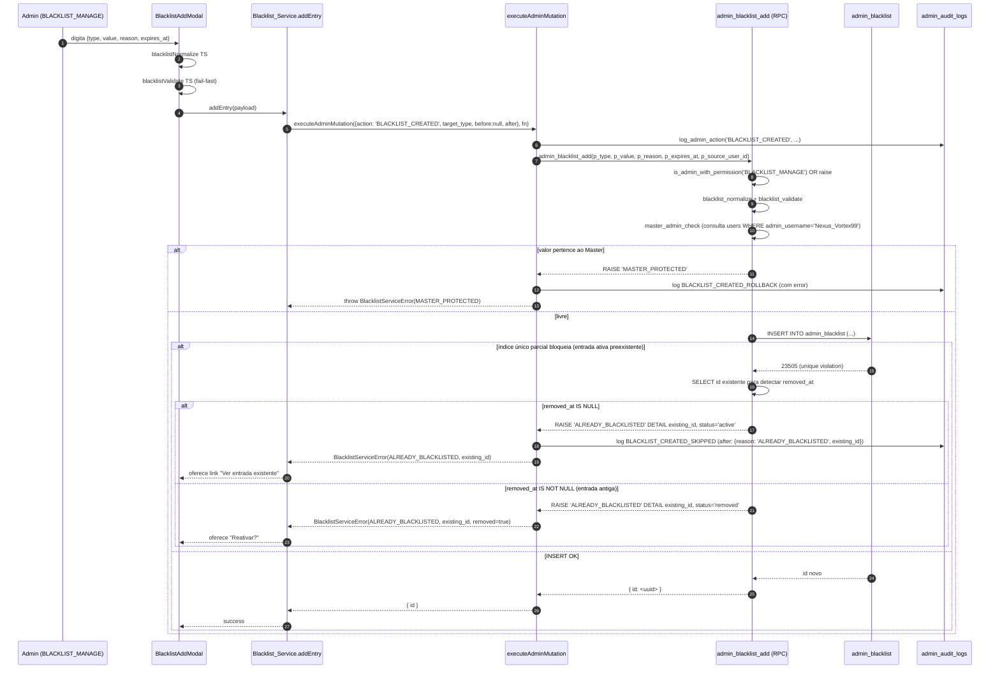
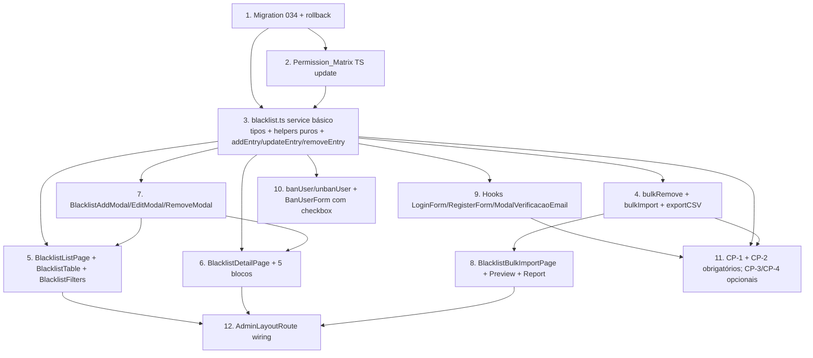

# Design Document: admin-blacklist

## 1. Overview

Esta spec entrega o **módulo de Blacklist** do painel administrativo do FreteGO, sentado em cima das fundações já em produção (`admin-foundation` em migration 030, `admin-users` em migration 031, `admin-fretes` em migration 032, `embarcador-branch` em migration 033). O escopo é exclusivamente o ciclo de vida de **`admin_blacklist`** (nova tabela) e seus pontos de bloqueio em `users`/`embarcadores`.

- Migration `034_admin_blacklist.sql` adicionando: tabela `admin_blacklist` com 12 colunas (`id`, `type`, `value`, `reason`, `expires_at`, `source_user_id`, `created_by`, `created_at`, `updated_at`, `removed_at`, `removed_by`, `removed_reason`); 1 constraint `chk_admin_blacklist_remove_consistency`; 1 índice **único parcial** `idx_admin_blacklist_active_unique ON (type, value) WHERE removed_at IS NULL`; 5 índices secundários; 4 funções SQL (`blacklist_normalize`, `blacklist_validate`, `is_blacklisted`, `log_blacklist_block`); 4 RPCs SECURITY DEFINER (`admin_blacklist_add`, `admin_blacklist_update`, `admin_blacklist_remove`, `admin_blacklist_remove_by_user`); 3 triggers (`users_blacklist_block` BEFORE INSERT, `embarcadores_blacklist_block` BEFORE INSERT, `admin_blacklist_set_updated_at` BEFORE UPDATE); 4 policies RLS (`admin_blacklist_select`, `admin_blacklist_insert`, `admin_blacklist_update`, `admin_blacklist_delete`); atualização de `is_admin_with_permission` para `BLACKLIST_VIEW`/`MANAGE`/`BULK`.
- Página `/admin/blacklist` (`Blacklist_List_Page`) com paginação 25/pág, filtros (tipo, status, criado por, período, flagged), busca livre e ordenação, todos sincronizados com query params.
- Página `/admin/blacklist/bulk` (`Blacklist_Bulk_Import_Page`) com upload de CSV, pré-visualização e relatório.
- Página `/admin/blacklist/:id` (`Blacklist_Detail_Page`) com bundle agregado em 5 blocos: dados da entrada, origem (usuário-fonte se houver), criação/remoção, tentativas bloqueadas, histórico de mudanças.
- 8 ações administrativas auditadas via `executeAdminMutation`: `addEntry`, `updateEntry`, `removeEntry`, `bulkRemove`, `bulkImport`, `exportCSV`, `addEntry_reactivate` (variante via update), `removeEntriesByUser` (interno do unban).
- 3 hooks de bloqueio user-facing: `LoginForm` (phone), `RegisterForm` (phone/cpf/cnpj/email), `ModalVerificacaoEmail` (email). Mensagens genéricas idênticas às de credencial inválida; delay artificial 300..600ms; defesa em profundidade via trigger em `users`/`embarcadores`.
- Integração com `admin-users`: opt-in para auto-blacklist no ban (até 4 entradas vinculadas a `users.id` via `source_user_id`) e auto-unblacklist no unban (RPC `admin_blacklist_remove_by_user`).
- Bulk com `Promise.allSettled` + concorrência 5; limites de 200 (remove) e 1000 (import). CSV BOM UTF-8 + `;` + RFC 4180.

A spec **não** entrega:

- `admin-suporte`: workflow de apelação e desbloqueio via tickets.
- `admin-dashboard`: cards e gráficos de métricas globais.
- `admin-crm`: comunicação ativa com usuários impactados.
- Detecção automática de fraude (heurísticas, scoring, ML).
- Tipos `device_fingerprint` ou auto-blacklist por `ip_address`.
- Cron de limpeza automática de entradas expiradas (admin remove em lote via UI).

### 1.1 Dependências de specs anteriores

| Dependência | Origem | Como reaproveitamos |
|---|---|---|
| `AdminProvider` / `AdminGuard` / `AdminLayoutRoute` | `admin-foundation` (030) | Wrapping em todas as rotas novas |
| `AdminShell` / `AdminSidebar` | `admin-foundation` | Item "Blacklist" já presente no sidebar gated por `BLACKLIST_VIEW` |
| `Permission_Matrix` / `hasPermissionForRoles` | `permissions.ts` | Visibilidade de botões e gating de rotas |
| `executeAdminMutation` / `logAdminAction` | `audit.ts` | **Toda** mutação passa pelo wrapper |
| `is_admin_with_permission(text)` RPC | Migration 030 | Atualizada em 034 para incluir `BLACKLIST_MANAGE`/`BLACKLIST_BULK` |
| `Stealth404` | `admin-foundation` | Acessos sem permissão e `:id` inexistente/inválido |
| `useAdminPermission(action)` | `useAdminPermission.ts` | Decide visibilidade de cada botão |
| Padrão de versionamento otimista via `updated_at` | `admin-users` | Reusado em `updateEntry` |
| Padrão de bulk com `Promise.allSettled` + concorrência 5 | `admin-users`, `admin-fretes` | Reusado em `bulkRemove` e `bulkImport` |
| Padrão de skip idempotente com audit `_SKIPPED` | `admin-fretes` | Reusado em `removeEntry`/`addEntry` quando já em estado-alvo |
| Padrão CSV (BOM UTF-8 + `;` + RFC 4180) | `admin-users` | Reusado em `exportCSV` e relatório de bulk import |
| `users.banned_at`/`ban_reason` | `admin-users` | Lidos para herdar `reason` no auto-blacklist |
| `embarcadores.cnpj`/`branch_state`/`branch_city` | `migration 033` | `cnpj` consultado para auto-blacklist do tipo `cnpj` |
| Master_Admin (`admin_username = 'Nexus_Vortex99'`) | `admin-users` | Identificadores do Master nunca podem ser blacklistados (Req 21) |

### 1.2 Não-objetivos

- **Transação real entre service TS e Supabase JS** (impossível). Adotamos a estratégia "log → mutate → rollback-log on fail" do `executeAdminMutation`, e quando há múltiplas mutações encadeadas, cada uma gera audit log próprio.
- **Cron de limpeza de expiradas**. Admin remove em lote via UI quando achar útil. Não há `pg_cron`.
- **Realtime updates** na listagem ou detalhe. Pull-only.
- **I18n**. Strings hardcoded em pt-BR.
- **Bypass de blacklist por admin com permissão especial**. Não existe. Identificadores podem ser **removidos** da blacklist por admin com `BLACKLIST_MANAGE`, mas não bypassados em runtime.
- **Captura automática de IP** no signup/login para auto-blacklist. Não há coluna persistente `last_login_ip` no schema atual; o tipo `ip_address` funciona apenas via inserção manual.

### 1.3 Princípios arquiteturais

- **Audit-by-construction.** Toda mutação passa por `executeAdminMutation(input, fn)`. O service `blacklist.ts` **nunca** chama `.update`/`.delete`/`.insert` direto; usa as RPCs SECURITY DEFINER que já validam permissão internamente. Todo bloqueio user-facing chama `log_blacklist_block` SECURITY DEFINER que insere `BLACKLIST_*_BLOCKED` em `admin_audit_logs` com `admin_id = NULL`.
- **Defesa em profundidade contra signup/login com identificador blacklisted.** Camadas: (1) UI client-side chama `is_blacklisted` antes do auth e exibe mensagem genérica; (2) trigger `BEFORE INSERT ON users`/`embarcadores` rejeita o INSERT mesmo se o cliente bypassar; (3) RLS bloqueia leitura/escrita direta de `admin_blacklist` para não-admins. Fail-open client-side aceito por timeout de 3s; trigger é a barreira final.
- **Defesa em profundidade contra modificação não autorizada da própria tabela.** Camadas: (1) UI esconde botões via `useAdminPermission`; (2) service rejeita com erro tipado; (3) RPC valida `is_admin_with_permission` server-side; (4) RLS recusa silenciosamente.
- **Anti-enumeration absoluto.** Em LoginForm/RegisterForm/ModalVerificacaoEmail: mensagens genéricas idênticas, status codes idênticos, headers idênticos, delay artificial 300..600ms aleatório em todos os caminhos (sucesso, falha de credencial, blacklist hit, falha de rede). O console e network tab **não** revelam que a causa foi blacklist. O log da causa específica fica APENAS em `admin_audit_logs`.
- **Idempotência por estado.** `addEntry` em (type, value) com entrada ativa preexistente retorna `ALREADY_BLACKLISTED` com `existing_id` sem duplicar nem sobrescrever; `removeEntry` em entrada já removida retorna `{ skipped: true, reason: 'ALREADY_REMOVED' }`. CP-2 cobre.
- **Concorrência otimista apenas em update.** `updateEntry(id, payload, expectedUpdatedAt)` falha com `STALE_VERSION` quando outro admin editou. `addEntry`/`removeEntry`/`bulkRemove` são idempotentes por estado, dispensam versionamento.
- **Master_Admin imutável também na blacklist.** Identificadores do Master_Admin (`admin_username = 'Nexus_Vortex99'`) **nunca** podem ser inseridos em `admin_blacklist`. Checado server-side mesmo quando o caller é o próprio Master (defesa por construção).
- **LGPD/segurança no display.** Listagem mascara CPF/CNPJ (`***.***.***-XX`/`**.***.***/****-XX`); detalhe mostra integral apenas se o admin tem `BLACKLIST_MANAGE` E clicou em `Mostrar` (revela explícito). Audit log da revelação **não** é registrado nesta spec (tradeoff documentado em §14).

## 2. Architecture & Data Flow

### 2.1 Diagrama de alto nível



### 2.2 Fluxo canônico de bloqueio (signup anônimo)



A invariante crítica: **client-side e server-side usam a mesma função `is_blacklisted` SQL**, então não há divergência possível. O fail-open client-side por timeout é coberto pelo trigger.

### 2.3 Fluxo canônico de adição manual (admin)



### 2.4 RLS reforçada

| Cenário | Resultado |
|---|---|
| Anônimo chama `is_blacklisted(...)` | OK (function `SECURITY DEFINER` com `GRANT EXECUTE TO anon`). Lê `admin_blacklist` bypassing RLS. |
| Anônimo chama `log_blacklist_block(...)` | OK. Insere em `admin_audit_logs` bypassing RLS. |
| Anônimo tenta `SELECT * FROM admin_blacklist` direto | 0 linhas (policy `admin_blacklist_select` exige `BLACKLIST_VIEW`). |
| Admin com `BLACKLIST_VIEW` faz SELECT | Todas as linhas. |
| Admin com `BLACKLIST_VIEW` mas sem `MANAGE` chama `admin_blacklist_add` RPC | RPC valida internamente e levanta `permission_denied`. |
| SUPORTE (apenas `BLACKLIST_VIEW`) tenta INSERT direto | 0 linhas afetadas (policy `admin_blacklist_insert` exige `MANAGE`). |
| FINANCEIRO faz qualquer coisa | 0 linhas em SELECT, INSERT, UPDATE, DELETE. |
| `admin_blacklist_delete USING (false)` | DELETE físico **nunca** é permitido via cliente; apenas soft delete via UPDATE. |

## 3. Database Schema

### 3.1 DDL completo da tabela `admin_blacklist`

```sql
-- Tabela admin_blacklist
CREATE TABLE IF NOT EXISTS admin_blacklist (
  id              uuid         PRIMARY KEY DEFAULT gen_random_uuid(),
  type            text         NOT NULL CHECK (type IN ('phone','cpf','cnpj','email','ip_address')),
  value           text         NOT NULL,                                 -- sempre normalizado
  reason          text         NOT NULL CHECK (char_length(trim(reason)) BETWEEN 1 AND 1000),
  expires_at      timestamptz  NULL,                                     -- NULL = permanente
  source_user_id  uuid         NULL REFERENCES users(id) ON DELETE SET NULL,
  created_by      uuid         NOT NULL REFERENCES users(id) ON DELETE RESTRICT,
  created_at      timestamptz  NOT NULL DEFAULT NOW(),
  updated_at      timestamptz  NOT NULL DEFAULT NOW(),
  removed_at      timestamptz  NULL,
  removed_by      uuid         NULL REFERENCES users(id) ON DELETE SET NULL,
  removed_reason  text         NULL CHECK (removed_reason IS NULL OR char_length(removed_reason) <= 1000)
);

-- Constraint de coerência da remoção
ALTER TABLE admin_blacklist DROP CONSTRAINT IF EXISTS chk_admin_blacklist_remove_consistency;
ALTER TABLE admin_blacklist ADD  CONSTRAINT chk_admin_blacklist_remove_consistency
  CHECK (
    (removed_at IS NULL AND removed_by IS NULL AND removed_reason IS NULL)
    OR
    (removed_at IS NOT NULL AND removed_by IS NOT NULL)
  );

-- Índice ÚNICO PARCIAL: garante exclusividade APENAS entre entradas ativas
CREATE UNIQUE INDEX IF NOT EXISTS idx_admin_blacklist_active_unique
  ON admin_blacklist (type, value) WHERE removed_at IS NULL;

-- Índices secundários
CREATE INDEX IF NOT EXISTS idx_admin_blacklist_type
  ON admin_blacklist(type);

CREATE INDEX IF NOT EXISTS idx_admin_blacklist_created_at
  ON admin_blacklist(created_at DESC);

CREATE INDEX IF NOT EXISTS idx_admin_blacklist_created_by
  ON admin_blacklist(created_by);

CREATE INDEX IF NOT EXISTS idx_admin_blacklist_expires_at
  ON admin_blacklist(expires_at) WHERE expires_at IS NOT NULL AND removed_at IS NULL;

CREATE INDEX IF NOT EXISTS idx_admin_blacklist_source_user_id
  ON admin_blacklist(source_user_id) WHERE source_user_id IS NOT NULL AND removed_at IS NULL;

ALTER TABLE admin_blacklist ENABLE ROW LEVEL SECURITY;

COMMENT ON TABLE  admin_blacklist               IS 'Identificadores bloqueados de signup/login (admin-blacklist 034)';
COMMENT ON COLUMN admin_blacklist.value         IS 'Valor canônico após blacklist_normalize. Para phone, sem prefixo 55, 10 ou 11 dígitos';
COMMENT ON COLUMN admin_blacklist.source_user_id IS 'Usuário cuja conta originou a inclusão (auto-blacklist no ban). NULL para entradas manuais';
COMMENT ON COLUMN admin_blacklist.expires_at   IS 'NULL = permanente; valor futuro = expiração programada';
```

### 3.2 Função `blacklist_normalize`

```sql
CREATE OR REPLACE FUNCTION blacklist_normalize(p_type text, p_raw text)
RETURNS text
LANGUAGE plpgsql IMMUTABLE
SECURITY INVOKER
AS $func$
DECLARE
  v_digits text;
BEGIN
  IF p_raw IS NULL THEN RETURN NULL; END IF;
  CASE p_type
    WHEN 'phone' THEN
      v_digits := regexp_replace(p_raw, '\D', '', 'g');
      -- Remove DDI 55 quando resultado fica com 12 ou 13 dígitos
      IF length(v_digits) IN (12, 13) AND substring(v_digits, 1, 2) = '55' THEN
        v_digits := substring(v_digits, 3);
      END IF;
      RETURN v_digits;
    WHEN 'cpf' THEN
      RETURN regexp_replace(p_raw, '\D', '', 'g');
    WHEN 'cnpj' THEN
      RETURN regexp_replace(p_raw, '\D', '', 'g');
    WHEN 'email' THEN
      RETURN lower(trim(p_raw));
    WHEN 'ip_address' THEN
      RETURN trim(p_raw);
    ELSE
      RAISE EXCEPTION 'invalid_blacklist_type: %', p_type USING ERRCODE = 'P0001';
  END CASE;
END;
$func$;

REVOKE ALL ON FUNCTION blacklist_normalize(text, text) FROM PUBLIC;
GRANT EXECUTE ON FUNCTION blacklist_normalize(text, text) TO anon, authenticated;
```

### 3.3 Função `blacklist_validate`

```sql
CREATE OR REPLACE FUNCTION blacklist_validate(p_type text, p_value text)
RETURNS text   -- 'OK' ou mensagem de erro
LANGUAGE plpgsql IMMUTABLE
SECURITY INVOKER
AS $func$
DECLARE
  v_len int;
  v_n   int;
  v_d1  int;
  v_d2  int;
  v_sum int;
  v_w   int[];
  v_i   int;
BEGIN
  IF p_value IS NULL OR p_value = '' THEN
    RETURN 'INVALID_INPUT: valor vazio.';
  END IF;
  v_len := length(p_value);

  IF p_type = 'phone' THEN
    IF v_len NOT IN (10, 11) OR p_value !~ '^\d+$' THEN
      RETURN 'INVALID_INPUT: Telefone deve ter 10 ou 11 dígitos.';
    END IF;
    RETURN 'OK';

  ELSIF p_type = 'cpf' THEN
    IF v_len <> 11 OR p_value !~ '^\d+$' THEN
      RETURN 'INVALID_INPUT: CPF inválido.';
    END IF;
    -- rejeita sequência repetida (00000000000..99999999999)
    IF p_value ~ '^(\d)\1{10}$' THEN
      RETURN 'INVALID_INPUT: CPF inválido.';
    END IF;
    -- DV 1
    v_sum := 0;
    FOR v_i IN 1..9 LOOP
      v_sum := v_sum + (substring(p_value, v_i, 1)::int * (11 - v_i));
    END LOOP;
    v_d1 := (v_sum * 10) % 11;
    IF v_d1 = 10 THEN v_d1 := 0; END IF;
    IF v_d1 <> substring(p_value, 10, 1)::int THEN
      RETURN 'INVALID_INPUT: CPF inválido.';
    END IF;
    -- DV 2
    v_sum := 0;
    FOR v_i IN 1..10 LOOP
      v_sum := v_sum + (substring(p_value, v_i, 1)::int * (12 - v_i));
    END LOOP;
    v_d2 := (v_sum * 10) % 11;
    IF v_d2 = 10 THEN v_d2 := 0; END IF;
    IF v_d2 <> substring(p_value, 11, 1)::int THEN
      RETURN 'INVALID_INPUT: CPF inválido.';
    END IF;
    RETURN 'OK';

  ELSIF p_type = 'cnpj' THEN
    IF v_len <> 14 OR p_value !~ '^\d+$' THEN
      RETURN 'INVALID_INPUT: CNPJ inválido.';
    END IF;
    IF p_value ~ '^(\d)\1{13}$' THEN
      RETURN 'INVALID_INPUT: CNPJ inválido.';
    END IF;
    -- DV 1: pesos [5,4,3,2,9,8,7,6,5,4,3,2]
    v_w := ARRAY[5,4,3,2,9,8,7,6,5,4,3,2];
    v_sum := 0;
    FOR v_i IN 1..12 LOOP
      v_sum := v_sum + (substring(p_value, v_i, 1)::int * v_w[v_i]);
    END LOOP;
    v_n := v_sum % 11;
    v_d1 := CASE WHEN v_n < 2 THEN 0 ELSE 11 - v_n END;
    IF v_d1 <> substring(p_value, 13, 1)::int THEN
      RETURN 'INVALID_INPUT: CNPJ inválido.';
    END IF;
    -- DV 2: pesos [6,5,4,3,2,9,8,7,6,5,4,3,2]
    v_w := ARRAY[6,5,4,3,2,9,8,7,6,5,4,3,2];
    v_sum := 0;
    FOR v_i IN 1..13 LOOP
      v_sum := v_sum + (substring(p_value, v_i, 1)::int * v_w[v_i]);
    END LOOP;
    v_n := v_sum % 11;
    v_d2 := CASE WHEN v_n < 2 THEN 0 ELSE 11 - v_n END;
    IF v_d2 <> substring(p_value, 14, 1)::int THEN
      RETURN 'INVALID_INPUT: CNPJ inválido.';
    END IF;
    RETURN 'OK';

  ELSIF p_type = 'email' THEN
    IF v_len > 320 THEN
      RETURN 'INVALID_INPUT: E-mail inválido.';
    END IF;
    IF p_value !~ '^[A-Za-z0-9._%+-]+@[A-Za-z0-9.-]+\.[A-Za-z]{2,}$' THEN
      RETURN 'INVALID_INPUT: E-mail inválido.';
    END IF;
    RETURN 'OK';

  ELSIF p_type = 'ip_address' THEN
    -- IPv4: 4 octetos 0..255
    IF p_value ~ '^(\d{1,3}\.){3}\d{1,3}$' THEN
      -- valida cada octeto
      FOR v_i IN 1..4 LOOP
        v_n := split_part(p_value, '.', v_i)::int;
        IF v_n < 0 OR v_n > 255 THEN
          RETURN 'INVALID_INPUT: IP inválido.';
        END IF;
      END LOOP;
      RETURN 'OK';
    END IF;
    -- IPv6: hex + ':', 2..7 grupos
    IF p_value ~ '^[0-9a-fA-F:]+$' AND
       array_length(string_to_array(p_value, ':'), 1) BETWEEN 2 AND 8 THEN
      RETURN 'OK';
    END IF;
    RETURN 'INVALID_INPUT: IP inválido.';

  ELSE
    RETURN 'INVALID_INPUT: tipo desconhecido.';
  END IF;
END;
$func$;

REVOKE ALL ON FUNCTION blacklist_validate(text, text) FROM PUBLIC;
GRANT EXECUTE ON FUNCTION blacklist_validate(text, text) TO authenticated;
```

### 3.4 Função `is_blacklisted`

```sql
CREATE OR REPLACE FUNCTION is_blacklisted(p_type text, p_value text)
RETURNS boolean
LANGUAGE sql STABLE
SECURITY DEFINER
SET search_path = public
AS $func$
  SELECT EXISTS (
    SELECT 1 FROM admin_blacklist
    WHERE type = p_type
      AND value = blacklist_normalize(p_type, p_value)
      AND removed_at IS NULL
      AND (expires_at IS NULL OR expires_at > NOW())
  );
$func$;

REVOKE ALL ON FUNCTION is_blacklisted(text, text) FROM PUBLIC;
GRANT EXECUTE ON FUNCTION is_blacklisted(text, text) TO anon, authenticated;
```

> **Decisão:** `STABLE SECURITY DEFINER` com `EXECUTE` para `anon`. Justificativa: signup é pré-login (anônimo) e PRECISA poder consultar a blacklist sem expor a tabela. RLS bloqueia leitura direta; `is_blacklisted` lê via privilégio do owner. Função `STABLE` (não `IMMUTABLE`) porque depende de `NOW()` para exclusão de expiradas. Função intencionalmente **não** registra audit log; o registro fica em `log_blacklist_block` chamado separadamente.

### 3.5 Função `log_blacklist_block` (com rate limiting)

```sql
CREATE OR REPLACE FUNCTION log_blacklist_block(
  p_action     text,                 -- BLACKLIST_LOGIN_BLOCKED | BLACKLIST_SIGNUP_BLOCKED | BLACKLIST_EMAIL_BLOCKED
  p_type       text,
  p_value      text,                 -- já normalizado pelo caller (ou normaliza aqui)
  p_ip         text DEFAULT NULL,
  p_user_agent text DEFAULT NULL
) RETURNS void
LANGUAGE plpgsql
SECURITY DEFINER
SET search_path = public
AS $func$
DECLARE
  v_normalized text;
  v_entry_id   uuid;
  v_value_for_log text;
  v_recent_count int;
BEGIN
  v_normalized := blacklist_normalize(p_type, p_value);
  -- Acha a entrada que matchou (pode ser NULL se já foi removida no intervalo)
  SELECT id INTO v_entry_id FROM admin_blacklist
   WHERE type = p_type AND value = v_normalized AND removed_at IS NULL
   LIMIT 1;

  -- Rate limiting básico: mesmo IP só pode disparar 30 logs por minuto
  -- (defesa contra flood; se exceder, descarta silenciosamente)
  IF p_ip IS NOT NULL THEN
    SELECT COUNT(*) INTO v_recent_count
      FROM admin_audit_logs
     WHERE ip = p_ip
       AND action = p_action
       AND created_at > NOW() - INTERVAL '1 minute';
    IF v_recent_count >= 30 THEN
      RETURN;  -- silently drop
    END IF;
  END IF;

  -- Mascaramento para audit (CPF/CNPJ): apenas 2 últimos dígitos visíveis
  v_value_for_log := CASE
    WHEN p_type = 'cpf' AND length(v_normalized) = 11
      THEN '***.***.***-' || substring(v_normalized, 10, 2)
    WHEN p_type = 'cnpj' AND length(v_normalized) = 14
      THEN '**.***.***/****-' || substring(v_normalized, 13, 2)
    ELSE v_normalized
  END;

  INSERT INTO admin_audit_logs(
    admin_id, action, target_type, target_id,
    before_data, after_data, ip, user_agent
  ) VALUES (
    NULL,                                                 -- usuário comum/anônimo: sem admin_id
    p_action, 'admin_blacklist', v_entry_id::text,
    NULL,
    jsonb_build_object('type', p_type, 'value', v_value_for_log, 'source', 'client'),
    p_ip, LEFT(coalesce(p_user_agent, ''), 512)
  );
END;
$func$;

REVOKE ALL ON FUNCTION log_blacklist_block(text, text, text, text, text) FROM PUBLIC;
GRANT EXECUTE ON FUNCTION log_blacklist_block(text, text, text, text, text) TO anon, authenticated;
```

> **Decisão:** rate limiting via `COUNT(*)` em `admin_audit_logs WHERE ip = ? AND created_at > NOW() - 1 min` é simples (sem tabela auxiliar), barato (índice `idx_admin_audit_logs_action` + filtro por ip está dentro do tablespace de logs), e suficiente para mitigar flood inicial. Caso a volume justifique, futura spec migra para `auth_attempt_throttle` dedicada.

### 3.6 RPC `admin_blacklist_add`

```sql
CREATE OR REPLACE FUNCTION admin_blacklist_add(
  p_type            text,
  p_value           text,
  p_reason          text,
  p_expires_at      timestamptz,
  p_source_user_id  uuid
) RETURNS jsonb
LANGUAGE plpgsql
SECURITY DEFINER
SET search_path = public
AS $func$
DECLARE
  v_caller       uuid := auth.uid();
  v_normalized   text;
  v_validate_msg text;
  v_master_id    uuid;
  v_master_phone text;
  v_master_cpf   text;
  v_master_email text;
  v_master_cnpj  text;
  v_existing_id      uuid;
  v_existing_removed timestamptz;
  v_id           uuid;
BEGIN
  IF v_caller IS NULL THEN
    RAISE EXCEPTION 'admin_blacklist_add requires authenticated session';
  END IF;
  IF NOT is_admin_with_permission('BLACKLIST_MANAGE') THEN
    RAISE EXCEPTION 'permission_denied: BLACKLIST_MANAGE required' USING ERRCODE = 'P0001';
  END IF;

  -- Validação de campos básicos
  IF p_reason IS NULL OR char_length(trim(p_reason)) NOT BETWEEN 1 AND 1000 THEN
    RAISE EXCEPTION 'INVALID_INPUT: motivo obrigatório (1..1000 chars)' USING ERRCODE = 'P0001';
  END IF;
  IF p_expires_at IS NOT NULL AND p_expires_at <= NOW() THEN
    RAISE EXCEPTION 'INVALID_INPUT: expires_at deve ser futuro' USING ERRCODE = 'P0001';
  END IF;

  v_normalized := blacklist_normalize(p_type, p_value);
  v_validate_msg := blacklist_validate(p_type, v_normalized);
  IF v_validate_msg <> 'OK' THEN
    RAISE EXCEPTION '%', v_validate_msg USING ERRCODE = 'P0001';
  END IF;

  -- Master_Admin protected (Req 21)
  SELECT id, phone, cpf, email INTO v_master_id, v_master_phone, v_master_cpf, v_master_email
    FROM users WHERE admin_username = 'Nexus_Vortex99' LIMIT 1;
  IF v_master_id IS NOT NULL THEN
    SELECT cnpj INTO v_master_cnpj FROM embarcadores WHERE id = v_master_id;
    IF (p_type = 'phone' AND v_normalized = blacklist_normalize('phone', v_master_phone))
    OR (p_type = 'cpf'   AND v_normalized = blacklist_normalize('cpf',   v_master_cpf))
    OR (p_type = 'email' AND v_normalized = blacklist_normalize('email', v_master_email))
    OR (p_type = 'cnpj'  AND v_master_cnpj IS NOT NULL
                          AND v_normalized = blacklist_normalize('cnpj', v_master_cnpj))
    THEN
      RAISE EXCEPTION 'MASTER_PROTECTED' USING ERRCODE = 'P0001';
    END IF;
  END IF;

  -- INSERT — índice único parcial cuida da duplicata
  BEGIN
    INSERT INTO admin_blacklist(type, value, reason, expires_at, source_user_id, created_by)
    VALUES (p_type, v_normalized, trim(p_reason), p_expires_at, p_source_user_id, v_caller)
    RETURNING id INTO v_id;
  EXCEPTION WHEN unique_violation THEN
    SELECT id, removed_at INTO v_existing_id, v_existing_removed
      FROM admin_blacklist
     WHERE type = p_type AND value = v_normalized AND removed_at IS NULL
     LIMIT 1;
    IF v_existing_id IS NOT NULL THEN
      RAISE EXCEPTION 'ALREADY_BLACKLISTED: % (status=active)', v_existing_id USING ERRCODE = 'P0001';
    ELSE
      -- Pode haver linhas removidas; nesse caso não há violação — mas se chegamos aqui,
      -- houve race com outra inserção
      RAISE;
    END IF;
  END;

  RETURN jsonb_build_object('id', v_id);
END;
$func$;

REVOKE ALL ON FUNCTION admin_blacklist_add(text, text, text, timestamptz, uuid) FROM PUBLIC;
GRANT EXECUTE ON FUNCTION admin_blacklist_add(text, text, text, timestamptz, uuid) TO authenticated;
```

### 3.7 RPC `admin_blacklist_update`

```sql
CREATE OR REPLACE FUNCTION admin_blacklist_update(
  p_id                  uuid,
  p_reason              text,
  p_expires_at          timestamptz,
  p_expected_updated_at timestamptz
) RETURNS jsonb
LANGUAGE plpgsql
SECURITY DEFINER
SET search_path = public
AS $func$
DECLARE
  v_caller   uuid := auth.uid();
  v_existing record;
  v_new_updated_at timestamptz;
BEGIN
  IF v_caller IS NULL THEN
    RAISE EXCEPTION 'admin_blacklist_update requires authenticated session';
  END IF;
  IF NOT is_admin_with_permission('BLACKLIST_MANAGE') THEN
    RAISE EXCEPTION 'permission_denied: BLACKLIST_MANAGE required' USING ERRCODE = 'P0001';
  END IF;
  IF p_reason IS NULL OR char_length(trim(p_reason)) NOT BETWEEN 1 AND 1000 THEN
    RAISE EXCEPTION 'INVALID_INPUT: motivo obrigatório (1..1000 chars)' USING ERRCODE = 'P0001';
  END IF;

  SELECT * INTO v_existing FROM admin_blacklist WHERE id = p_id FOR UPDATE;
  IF NOT FOUND THEN
    RAISE EXCEPTION 'NOT_FOUND' USING ERRCODE = 'P0001';
  END IF;
  IF v_existing.removed_at IS NOT NULL THEN
    RAISE EXCEPTION 'ALREADY_REMOVED' USING ERRCODE = 'P0001';
  END IF;
  IF v_existing.updated_at <> p_expected_updated_at THEN
    RAISE EXCEPTION 'STALE_VERSION: expected % got %', p_expected_updated_at, v_existing.updated_at
      USING ERRCODE = 'P0001';
  END IF;
  -- expires_at no passado só é permitido se igual ao valor atual (Req 5.6)
  IF p_expires_at IS NOT NULL
     AND p_expires_at <= NOW()
     AND p_expires_at IS DISTINCT FROM v_existing.expires_at THEN
    RAISE EXCEPTION 'INVALID_INPUT: expires_at deve ser futuro' USING ERRCODE = 'P0001';
  END IF;

  UPDATE admin_blacklist
     SET reason = trim(p_reason),
         expires_at = p_expires_at,
         updated_at = NOW()
   WHERE id = p_id
   RETURNING updated_at INTO v_new_updated_at;

  RETURN jsonb_build_object('updated', true, 'updated_at', v_new_updated_at);
END;
$func$;

REVOKE ALL ON FUNCTION admin_blacklist_update(uuid, text, timestamptz, timestamptz) FROM PUBLIC;
GRANT EXECUTE ON FUNCTION admin_blacklist_update(uuid, text, timestamptz, timestamptz) TO authenticated;
```

### 3.8 RPC `admin_blacklist_remove` (soft delete idempotente)

```sql
CREATE OR REPLACE FUNCTION admin_blacklist_remove(
  p_id            uuid,
  p_remove_reason text
) RETURNS jsonb
LANGUAGE plpgsql
SECURITY DEFINER
SET search_path = public
AS $func$
DECLARE
  v_caller   uuid := auth.uid();
  v_existing record;
BEGIN
  IF v_caller IS NULL THEN
    RAISE EXCEPTION 'admin_blacklist_remove requires authenticated session';
  END IF;
  IF NOT is_admin_with_permission('BLACKLIST_MANAGE') THEN
    RAISE EXCEPTION 'permission_denied: BLACKLIST_MANAGE required' USING ERRCODE = 'P0001';
  END IF;
  IF p_remove_reason IS NOT NULL AND char_length(p_remove_reason) > 1000 THEN
    RAISE EXCEPTION 'INVALID_INPUT: motivo de remoção até 1000 chars' USING ERRCODE = 'P0001';
  END IF;

  SELECT * INTO v_existing FROM admin_blacklist WHERE id = p_id FOR UPDATE;
  IF NOT FOUND THEN
    RAISE EXCEPTION 'NOT_FOUND' USING ERRCODE = 'P0001';
  END IF;
  IF v_existing.removed_at IS NOT NULL THEN
    RETURN jsonb_build_object('skipped', true, 'reason', 'ALREADY_REMOVED');
  END IF;

  UPDATE admin_blacklist
     SET removed_at = NOW(),
         removed_by = v_caller,
         removed_reason = NULLIF(trim(coalesce(p_remove_reason, '')), ''),
         updated_at = NOW()
   WHERE id = p_id;

  RETURN jsonb_build_object('removed', true);
END;
$func$;

REVOKE ALL ON FUNCTION admin_blacklist_remove(uuid, text) FROM PUBLIC;
GRANT EXECUTE ON FUNCTION admin_blacklist_remove(uuid, text) TO authenticated;
```

### 3.9 RPC `admin_blacklist_remove_by_user`

```sql
CREATE OR REPLACE FUNCTION admin_blacklist_remove_by_user(p_user_id uuid)
RETURNS jsonb
LANGUAGE plpgsql
SECURITY DEFINER
SET search_path = public
AS $func$
DECLARE
  v_caller        uuid := auth.uid();
  v_removed_count int := 0;
  v_id            uuid;
BEGIN
  IF v_caller IS NULL THEN
    RAISE EXCEPTION 'admin_blacklist_remove_by_user requires authenticated session';
  END IF;
  IF NOT is_admin_with_permission('BLACKLIST_MANAGE') THEN
    RAISE EXCEPTION 'permission_denied: BLACKLIST_MANAGE required' USING ERRCODE = 'P0001';
  END IF;

  -- Itera para gerar 1 audit log por entrada removida
  FOR v_id IN
    SELECT id FROM admin_blacklist
     WHERE source_user_id = p_user_id AND removed_at IS NULL
     FOR UPDATE
  LOOP
    UPDATE admin_blacklist
       SET removed_at = NOW(),
           removed_by = v_caller,
           removed_reason = 'auto-removed by unban',
           updated_at = NOW()
     WHERE id = v_id;
    v_removed_count := v_removed_count + 1;
    PERFORM log_admin_action(
      'BLACKLIST_REMOVED',
      'admin_blacklist',
      v_id::text,
      jsonb_build_object('removed_at', null),
      jsonb_build_object('removed_at', NOW(), 'removed_reason', 'auto-removed by unban',
                         'triggered_by_unban', true),
      NULL, NULL
    );
  END LOOP;

  RETURN jsonb_build_object('removed_count', v_removed_count);
END;
$func$;

REVOKE ALL ON FUNCTION admin_blacklist_remove_by_user(uuid) FROM PUBLIC;
GRANT EXECUTE ON FUNCTION admin_blacklist_remove_by_user(uuid) TO authenticated;
```

### 3.10 Triggers

```sql
-- Trigger: atualiza updated_at em qualquer UPDATE em admin_blacklist
CREATE OR REPLACE FUNCTION admin_blacklist_set_updated_at()
RETURNS trigger LANGUAGE plpgsql AS $func$
BEGIN NEW.updated_at = NOW(); RETURN NEW; END;
$func$;

DROP TRIGGER IF EXISTS admin_blacklist_set_updated_at ON admin_blacklist;
CREATE TRIGGER admin_blacklist_set_updated_at
  BEFORE UPDATE ON admin_blacklist
  FOR EACH ROW EXECUTE FUNCTION admin_blacklist_set_updated_at();

-- Trigger: BEFORE INSERT em users — defesa em profundidade contra signup blacklisted
CREATE OR REPLACE FUNCTION users_blacklist_block()
RETURNS trigger
LANGUAGE plpgsql
SECURITY DEFINER
SET search_path = public
AS $func$
DECLARE
  v_norm text;
  v_id   uuid;
BEGIN
  -- Bypass eligível para service_role com flag de sessão
  IF current_setting('app.skip_blacklist_check', true) = 'true' THEN
    RETURN NEW;
  END IF;

  -- phone (sempre presente)
  IF NEW.phone IS NOT NULL THEN
    v_norm := blacklist_normalize('phone', NEW.phone);
    SELECT id INTO v_id FROM admin_blacklist
     WHERE type = 'phone' AND value = v_norm AND removed_at IS NULL
       AND (expires_at IS NULL OR expires_at > NOW())
     LIMIT 1;
    IF v_id IS NOT NULL THEN
      INSERT INTO admin_audit_logs(admin_id, action, target_type, target_id, after_data)
      VALUES (NULL, 'BLACKLIST_SIGNUP_BLOCKED', 'admin_blacklist', v_id::text,
              jsonb_build_object('type', 'phone', 'value', v_norm, 'source', 'trigger'));
      RAISE EXCEPTION 'blacklisted_phone' USING ERRCODE = 'P0001';
    END IF;
  END IF;

  -- cpf (motorista)
  IF NEW.cpf IS NOT NULL THEN
    v_norm := blacklist_normalize('cpf', NEW.cpf);
    SELECT id INTO v_id FROM admin_blacklist
     WHERE type = 'cpf' AND value = v_norm AND removed_at IS NULL
       AND (expires_at IS NULL OR expires_at > NOW())
     LIMIT 1;
    IF v_id IS NOT NULL THEN
      INSERT INTO admin_audit_logs(admin_id, action, target_type, target_id, after_data)
      VALUES (NULL, 'BLACKLIST_SIGNUP_BLOCKED', 'admin_blacklist', v_id::text,
              jsonb_build_object('type', 'cpf', 'value', v_norm, 'source', 'trigger'));
      RAISE EXCEPTION 'blacklisted_cpf' USING ERRCODE = 'P0001';
    END IF;
  END IF;

  -- email
  IF NEW.email IS NOT NULL THEN
    v_norm := blacklist_normalize('email', NEW.email);
    SELECT id INTO v_id FROM admin_blacklist
     WHERE type = 'email' AND value = v_norm AND removed_at IS NULL
       AND (expires_at IS NULL OR expires_at > NOW())
     LIMIT 1;
    IF v_id IS NOT NULL THEN
      INSERT INTO admin_audit_logs(admin_id, action, target_type, target_id, after_data)
      VALUES (NULL, 'BLACKLIST_SIGNUP_BLOCKED', 'admin_blacklist', v_id::text,
              jsonb_build_object('type', 'email', 'value', v_norm, 'source', 'trigger'));
      RAISE EXCEPTION 'blacklisted_email' USING ERRCODE = 'P0001';
    END IF;
  END IF;

  RETURN NEW;
END;
$func$;

DROP TRIGGER IF EXISTS users_blacklist_block ON users;
CREATE TRIGGER users_blacklist_block
  BEFORE INSERT ON users
  FOR EACH ROW EXECUTE FUNCTION users_blacklist_block();

-- Trigger: BEFORE INSERT em embarcadores — verifica cnpj
CREATE OR REPLACE FUNCTION embarcadores_blacklist_block()
RETURNS trigger
LANGUAGE plpgsql
SECURITY DEFINER
SET search_path = public
AS $func$
DECLARE
  v_norm text;
  v_id   uuid;
BEGIN
  IF current_setting('app.skip_blacklist_check', true) = 'true' THEN
    RETURN NEW;
  END IF;

  IF NEW.cnpj IS NOT NULL THEN
    v_norm := blacklist_normalize('cnpj', NEW.cnpj);
    SELECT id INTO v_id FROM admin_blacklist
     WHERE type = 'cnpj' AND value = v_norm AND removed_at IS NULL
       AND (expires_at IS NULL OR expires_at > NOW())
     LIMIT 1;
    IF v_id IS NOT NULL THEN
      INSERT INTO admin_audit_logs(admin_id, action, target_type, target_id, after_data)
      VALUES (NULL, 'BLACKLIST_SIGNUP_BLOCKED', 'admin_blacklist', v_id::text,
              jsonb_build_object('type', 'cnpj', 'value', v_norm, 'source', 'trigger'));
      RAISE EXCEPTION 'blacklisted_cnpj' USING ERRCODE = 'P0001';
    END IF;
  END IF;
  RETURN NEW;
END;
$func$;

DROP TRIGGER IF EXISTS embarcadores_blacklist_block ON embarcadores;
CREATE TRIGGER embarcadores_blacklist_block
  BEFORE INSERT ON embarcadores
  FOR EACH ROW EXECUTE FUNCTION embarcadores_blacklist_block();
```

### 3.11 RLS Policies em `admin_blacklist`

```sql
DROP POLICY IF EXISTS admin_blacklist_select ON admin_blacklist;
CREATE POLICY admin_blacklist_select ON admin_blacklist
  FOR SELECT TO authenticated
  USING (is_admin_with_permission('BLACKLIST_VIEW'));

DROP POLICY IF EXISTS admin_blacklist_insert ON admin_blacklist;
CREATE POLICY admin_blacklist_insert ON admin_blacklist
  FOR INSERT TO authenticated
  WITH CHECK (is_admin_with_permission('BLACKLIST_MANAGE'));

DROP POLICY IF EXISTS admin_blacklist_update ON admin_blacklist;
CREATE POLICY admin_blacklist_update ON admin_blacklist
  FOR UPDATE TO authenticated
  USING (is_admin_with_permission('BLACKLIST_MANAGE'))
  WITH CHECK (is_admin_with_permission('BLACKLIST_MANAGE'));

-- DELETE físico NUNCA via cliente — apenas soft delete via UPDATE
DROP POLICY IF EXISTS admin_blacklist_delete ON admin_blacklist;
CREATE POLICY admin_blacklist_delete ON admin_blacklist
  FOR DELETE TO authenticated USING (false);
```

### 3.12 Atualização de `is_admin_with_permission`

```sql
CREATE OR REPLACE FUNCTION is_admin_with_permission(p_action text)
RETURNS boolean
LANGUAGE sql STABLE
SECURITY DEFINER
SET search_path = public
AS $func$
  WITH active AS (
    SELECT role FROM admin_roles
    WHERE user_id = auth.uid() AND revoked_at IS NULL
  )
  SELECT EXISTS (
    SELECT 1 FROM active a
    WHERE
      a.role = 'SUPER_ADMIN'
      OR (a.role = 'ADMIN' AND p_action NOT IN
           ('USER_DELETE','ADMIN_ROLE_GRANT','ADMIN_ROLE_REVOKE'))
      OR (a.role = 'FINANCEIRO' AND p_action IN
           ('USER_VIEW','FRETE_VIEW','FINANCEIRO_VIEW','FINANCEIRO_EDIT','AUDIT_VIEW'))
      OR (a.role = 'SUPORTE' AND p_action IN
           ('USER_VIEW','USER_TOGGLE_ACTIVE','FRETE_VIEW',
            'SUPORTE_VIEW','SUPORTE_REPLY','CRM_VIEW',
            'BLACKLIST_VIEW'))                                -- novo
      OR (a.role = 'MODERADOR' AND p_action IN
           ('USER_VIEW','FRETE_VIEW','FRETE_FORCE_CLOSE',
            'BLACKLIST_VIEW','BLACKLIST_MANAGE'))             -- novo (sem BULK)
  );
$func$;
```

> **Mudança crítica:** `BLACKLIST_EDIT` é **removido** desta função SQL (era inerte na prática — não era checado em policy nenhuma). É mantido apenas no enum TS por compatibilidade durante a transição (Req 17.2).

### 3.13 Bloco VERIFY (idempotente, comentado)

```sql
-- ========== VERIFY: smoke test pos-deploy ==========
-- 1. Tabela admin_blacklist existe com 12 colunas
-- SELECT count(*) FROM information_schema.columns
--  WHERE table_schema='public' AND table_name='admin_blacklist';
-- Esperado: 12

-- 2. Constraints e índices
-- SELECT conname FROM pg_constraint
--  WHERE conrelid='admin_blacklist'::regclass
--    AND conname IN ('chk_admin_blacklist_remove_consistency');
-- SELECT indexname FROM pg_indexes
--  WHERE indexname IN ('idx_admin_blacklist_active_unique','idx_admin_blacklist_type',
--                      'idx_admin_blacklist_created_at','idx_admin_blacklist_created_by',
--                      'idx_admin_blacklist_expires_at','idx_admin_blacklist_source_user_id');
-- Esperado: 1 + 6

-- 3. Funções
-- SELECT proname FROM pg_proc
--  WHERE proname IN ('blacklist_normalize','blacklist_validate','is_blacklisted',
--                    'log_blacklist_block','admin_blacklist_add','admin_blacklist_update',
--                    'admin_blacklist_remove','admin_blacklist_remove_by_user',
--                    'admin_blacklist_set_updated_at',
--                    'users_blacklist_block','embarcadores_blacklist_block');
-- Esperado: 11

-- 4. Triggers
-- SELECT tgname FROM pg_trigger
--  WHERE tgname IN ('users_blacklist_block','embarcadores_blacklist_block',
--                   'admin_blacklist_set_updated_at');
-- Esperado: 3

-- 5. Policies
-- SELECT policyname FROM pg_policies
--  WHERE tablename='admin_blacklist'
--    AND policyname IN ('admin_blacklist_select','admin_blacklist_insert',
--                       'admin_blacklist_update','admin_blacklist_delete');
-- Esperado: 4

-- 6. is_admin_with_permission inclui BLACKLIST_MANAGE/BULK
-- SELECT is_admin_with_permission('BLACKLIST_MANAGE');
-- (executar como SUPER_ADMIN: deve retornar true)

-- 7. Round-trip de normalização
-- SELECT blacklist_normalize('phone', '(64) 99999-9999');
-- Esperado: '64999999999'
-- SELECT blacklist_normalize('phone', '+55 64 99999-9999');
-- Esperado: '64999999999'

-- 8. Validação
-- SELECT blacklist_validate('cpf', '11111111111');
-- Esperado: 'INVALID_INPUT: CPF inválido.'
-- SELECT blacklist_validate('cpf', '11144477735');     -- DV correto
-- Esperado: 'OK'

-- 9. is_blacklisted com entrada expirada NÃO bloqueia
-- INSERT INTO admin_blacklist(type,value,reason,expires_at,created_by)
--   VALUES ('phone','64900000001','test',NOW()-INTERVAL '1 day',
--           (SELECT id FROM users WHERE admin_username='Nexus_Vortex99'));
-- SELECT is_blacklisted('phone','64900000001');
-- Esperado: false
-- ROLLBACK do teste manual.
```

## 4. TypeScript Types & Service

Arquivo único: `src/services/admin/blacklist.ts`. Toda mutação passa por `executeAdminMutation`. Nenhuma chamada direta a `.update`/`.delete`/`.insert` em `admin_blacklist` — sempre via RPC.

### 4.1 Tipos públicos

```ts
// src/services/admin/blacklist.ts

import type { AdminRole } from './permissions';

export type BlacklistType = 'phone' | 'cpf' | 'cnpj' | 'email' | 'ip_address';
export type BlacklistTypeFilter = 'todos' | BlacklistType;
export type BlacklistStatus = 'ativo' | 'expirado' | 'removido';
export type BlacklistStatusFilter = 'todos' | BlacklistStatus;
export type BlacklistSort = 'created_desc' | 'created_asc' | 'expires_asc' | 'removed_desc';

export interface BlacklistFilters {
  type: BlacklistTypeFilter;       // default 'todos'
  status: BlacklistStatusFilter;   // default 'todos'
  createdBy: string | null;        // UUID do admin criador
  from: string | null;             // ISO date 'YYYY-MM-DD'
  to: string | null;
  q: string;                       // busca livre, default ''
  sort: BlacklistSort;             // default 'created_desc'
  page: number;                    // 1-based
  pageSize: number;                // fixo 25
}

export const DEFAULT_BLACKLIST_FILTERS: BlacklistFilters = {
  type: 'todos',
  status: 'todos',
  createdBy: null,
  from: null,
  to: null,
  q: '',
  sort: 'created_desc',
  page: 1,
  pageSize: 25,
};

export interface BlacklistEntry {
  id: string;
  type: BlacklistType;
  value: string;                   // sempre normalizado
  reason: string;
  expires_at: string | null;       // ISO timestamp
  source_user_id: string | null;
  created_by: string;
  created_by_name: string | null;  // resolvido via join users
  created_at: string;
  updated_at: string;              // usado em versionamento otimista
  removed_at: string | null;
  removed_by: string | null;
  removed_by_name: string | null;
  removed_reason: string | null;
}

export interface BlacklistListResult {
  rows: BlacklistEntry[];
  total: number;
  page: number;
  pageSize: number;
}

// Detalhe agregado
export interface BlacklistSourceUser {
  id: string;
  name: string;
  user_type: 'motorista' | 'embarcador';
  is_active: boolean;
  ban_reason: string | null;
}

export interface BlacklistAttempt {
  id: string;
  action: 'BLACKLIST_LOGIN_BLOCKED' | 'BLACKLIST_SIGNUP_BLOCKED' | 'BLACKLIST_EMAIL_BLOCKED';
  created_at: string;
  ip: string | null;
  user_agent: string | null;
}

export interface BlacklistAuditEntry {
  id: string;
  admin_id: string | null;
  admin_name: string | null;
  action: string;                  // BLACKLIST_CREATED | BLACKLIST_UPDATED | BLACKLIST_REMOVED
  created_at: string;
  before_data: unknown;
  after_data: unknown;
}

export interface BlacklistDetailBundle {
  entry: BlacklistEntry;
  status: BlacklistStatus;         // computado em runtime
  sourceUser: BlacklistSourceUser | null;
  attempts: BlacklistAttempt[];
  attemptsTotal: number;
  attemptsPage: number;
  attemptsPageSize: number;        // fixo 10
  history: BlacklistAuditEntry[];
  errors: Partial<Record<'sourceUser' | 'attempts' | 'history', string>>;
}

// Payloads
export interface BlacklistAddPayload {
  type: BlacklistType;
  valueRaw: string;                // será normalizado
  reason: string;
  expiresAt: string | null;        // ISO timestamp ou null
  sourceUserId: string | null;
}

export interface BlacklistUpdatePayload {
  reason: string;
  expiresAt: string | null;
}

export interface BlacklistRemoveOptions {
  removeReason?: string | null;
}

// Resultados de bulk
export interface BulkRemoveResult {
  success: string[];                                                         // ids
  skipped: { id: string; reason: 'ALREADY_REMOVED' }[];
  failed: { id: string; reason: string }[];
}

export interface BulkImportRow {
  lineNumber: number;              // 1-based, excluindo header
  raw: { type: string; value: string; reason: string; expires_at: string | null };
  normalized: { type: BlacklistType; value: string } | null;
  validation: { ok: true } | { ok: false; detail: string };
  result?:
    | { status: 'inserted'; id: string }
    | { status: 'skipped'; reason: 'ALREADY_BLACKLISTED' | 'MASTER_PROTECTED'; existingId?: string }
    | { status: 'failed'; detail: string };
}

export interface BulkImportResult {
  total: number;                   // linhas no arquivo (excl. header)
  valid: number;                   // passaram em pre-validação
  invalid: number;
  inserted: number;
  skipped: number;
  failed: number;
  rows: BulkImportRow[];
}

// Erros
export type BlacklistErrorCode =
  | 'STALE_VERSION'
  | 'INVALID_INPUT'
  | 'ALREADY_BLACKLISTED'
  | 'MASTER_PROTECTED'
  | 'NOT_FOUND'
  | 'PERMISSION_DENIED'
  | 'BULK_LIMIT_EXCEEDED'
  | 'ALREADY_REMOVED'
  | 'CSV_PARSE_ERROR'
  | 'HEADER_MISMATCH'
  | 'FILE_TOO_LARGE';

export class BlacklistServiceError extends Error {
  constructor(
    public code: BlacklistErrorCode,
    message?: string,
    public cause?: unknown,
    public extra?: Record<string, unknown>   // ex: { existingId, removed }
  ) {
    super(message ?? code);
    this.name = 'BlacklistServiceError';
  }
}

export const BLACKLIST_ERROR_MESSAGES: Record<BlacklistErrorCode, string> = {
  STALE_VERSION: 'Os dados foram alterados por outro admin. Recarregue antes de salvar.',
  INVALID_INPUT: 'Dados inválidos.',
  ALREADY_BLACKLISTED: 'Já existe entrada ativa para este identificador.',
  MASTER_PROTECTED: 'Identificador pertence a conta protegida.',
  NOT_FOUND: 'Entrada não encontrada.',
  PERMISSION_DENIED: 'Operação não permitida.',
  BULK_LIMIT_EXCEEDED: 'Limite máximo de registros por operação excedido.',
  ALREADY_REMOVED: 'Esta entrada já foi removida.',
  CSV_PARSE_ERROR: 'Não foi possível processar o CSV.',
  HEADER_MISMATCH: 'Cabeçalho inválido. Esperado: type;value;reason;expires_at.',
  FILE_TOO_LARGE: 'Arquivo excede o limite de 2 MB.',
};

// Mensagens canônicas anti-enumeration
export const GENERIC_LOGIN_MESSAGE  = 'Não foi possível autenticar.';
export const GENERIC_SIGNUP_MESSAGE = 'Não foi possível concluir o cadastro.';
export const GENERIC_EMAIL_MESSAGE  = 'Não foi possível enviar o código.';
```

### 4.2 Helpers puros

```ts
// blacklistNormalize: pareado com SQL blacklist_normalize. Idempotente (CP-3).
export function blacklistNormalize(type: BlacklistType, raw: string): string;

// blacklistValidate: pareado com SQL blacklist_validate.
export function blacklistValidate(
  type: BlacklistType,
  normalized: string
): { ok: true } | { ok: false; detail: string };

// Mascaramento para listagem (CPF/CNPJ).
export function maskValueForList(type: BlacklistType, normalized: string): string;
// 'cpf'  -> '***.***.***-XX' (apenas 2 últimos dígitos visíveis)
// 'cnpj' -> '**.***.***/****-XX'
// 'phone' -> '(XX) XXXXX-XXXX' ou '(XX) XXXX-XXXX'
// 'email' / 'ip_address' -> integral

// Computa status em runtime
export function classifyEntryStatus(e: BlacklistEntry, now?: Date): BlacklistStatus;

// CSV
export function exportEntriesToCsvString(entries: BlacklistEntry[]): string;
export function buildImportTemplateCsv(): string;
export function parseImportCsv(text: string): BulkImportRow[];          // sem efeito colateral
export function buildImportReportCsv(rows: BulkImportRow[]): string;

// URL <-> filtros
export function parseBlacklistFiltersFromQuery(qs: URLSearchParams | string): BlacklistFilters;
export function serializeBlacklistFiltersToQuery(f: BlacklistFilters): URLSearchParams;

// UUID
export function isUuid(s: string): boolean;

// Timing artificial (anti-enumeration)
export function randomBlacklistDelayMs(): number; // inteiro em [300, 600]
```

### 4.3 Assinaturas das funções de service

```ts
// Listagem
export async function listEntries(filters: BlacklistFilters): Promise<BlacklistListResult>;

// Detalhe
export async function getBlacklistDetail(
  id: string,
  attemptsPage?: number
): Promise<BlacklistDetailBundle>;

// Mutações single
export async function addEntry(payload: BlacklistAddPayload): Promise<{ id: string }>;
export async function updateEntry(
  id: string,
  payload: BlacklistUpdatePayload,
  expectedUpdatedAt: string
): Promise<{ updated: true; updated_at: string }>;
export async function removeEntry(
  id: string,
  options?: BlacklistRemoveOptions
): Promise<{ removed: true } | { skipped: true; reason: 'ALREADY_REMOVED' }>;

// Variante de reativação (helper sobre updateEntry após confirmação UI)
export async function reactivateEntry(
  id: string,
  payload: BlacklistUpdatePayload,
  expectedUpdatedAt: string
): Promise<{ updated: true; updated_at: string }>;

// Bulk
export async function bulkRemove(
  ids: string[],
  options?: BlacklistRemoveOptions
): Promise<BulkRemoveResult>;

export async function bulkImport(rows: BulkImportRow[]): Promise<BulkImportResult>;

// Export
export async function exportCSV(filters: BlacklistFilters): Promise<{
  csv: string;
  totalExported: number;
  truncated: boolean;
}>;

// RPC wrappers user-facing
export async function isBlacklisted(type: BlacklistType, valueRaw: string): Promise<boolean>;
export async function logBlacklistBlock(
  action: 'BLACKLIST_LOGIN_BLOCKED' | 'BLACKLIST_SIGNUP_BLOCKED' | 'BLACKLIST_EMAIL_BLOCKED',
  type: BlacklistType,
  valueRaw: string,
  ip?: string | null
): Promise<void>;
```

### 4.4 Pseudocódigo: `addEntry` (com fluxo de duplicata-removida → reativação)

```ts
export async function addEntry(payload: BlacklistAddPayload): Promise<{ id: string }> {
  // 1. Validações TS fail-fast (antes de tocar audit)
  const normalized = blacklistNormalize(payload.type, payload.valueRaw);
  const v = blacklistValidate(payload.type, normalized);
  if (!v.ok) {
    throw new BlacklistServiceError('INVALID_INPUT', v.detail);
  }
  const reasonClean = (payload.reason ?? '').trim();
  if (reasonClean.length === 0 || reasonClean.length > 1000) {
    throw new BlacklistServiceError('INVALID_INPUT', 'Motivo obrigatório (1..1000).');
  }
  if (payload.expiresAt) {
    const t = Date.parse(payload.expiresAt);
    if (!Number.isFinite(t) || t <= Date.now()) {
      throw new BlacklistServiceError('INVALID_INPUT', 'Expiração deve ser uma data futura.');
    }
  }

  // 2. executeAdminMutation: log primeiro, depois RPC
  return executeAdminMutation(
    {
      action: 'BLACKLIST_CREATED',
      targetType: 'admin_blacklist',
      targetId: null,                        // será o id retornado
      before: null,
      after: {
        type: payload.type,
        value: normalized,
        reason: reasonClean,
        expires_at: payload.expiresAt,
        source_user_id: payload.sourceUserId,
      },
    },
    async () => {
      const { data, error } = await supabase.rpc('admin_blacklist_add', {
        p_type: payload.type,
        p_value: payload.valueRaw,           // RPC normaliza server-side também
        p_reason: reasonClean,
        p_expires_at: payload.expiresAt,
        p_source_user_id: payload.sourceUserId,
      });

      if (error) {
        const msg = error.message || '';
        if (msg.startsWith('MASTER_PROTECTED')) {
          // Re-emitir como skip — audit já registra rollback
          await logAdminAction({
            action: 'BLACKLIST_CREATED_SKIPPED',
            targetType: 'admin_blacklist',
            after: { type: payload.type, value: normalized, reason: 'MASTER_PROTECTED' },
          }).catch(() => null);
          throw new BlacklistServiceError('MASTER_PROTECTED');
        }
        if (msg.startsWith('ALREADY_BLACKLISTED')) {
          // Parse: 'ALREADY_BLACKLISTED: <uuid> (status=active|removed)'
          const idMatch = msg.match(/ALREADY_BLACKLISTED:\s*([0-9a-f-]+)/i);
          const statusMatch = msg.match(/status=(active|removed)/);
          const existingId = idMatch?.[1];
          const removed = statusMatch?.[1] === 'removed';
          await logAdminAction({
            action: 'BLACKLIST_CREATED_SKIPPED',
            targetType: 'admin_blacklist',
            targetId: existingId ?? null,
            after: { reason: 'ALREADY_BLACKLISTED', existing_id: existingId, removed },
          }).catch(() => null);
          throw new BlacklistServiceError(
            'ALREADY_BLACKLISTED',
            undefined,
            error,
            { existingId, removed }
          );
        }
        if (msg.includes('permission_denied')) {
          throw new BlacklistServiceError('PERMISSION_DENIED', undefined, error);
        }
        if (msg.startsWith('INVALID_INPUT')) {
          throw new BlacklistServiceError('INVALID_INPUT', msg, error);
        }
        throw error;
      }
      return { id: (data as { id: string }).id };
    }
  );
}
```

A UI (`BlacklistAddModal`) trata `BlacklistServiceError(code='ALREADY_BLACKLISTED', extra.removed=true)` oferecendo botão **Reativar?** que dispara `reactivateEntry(extra.existingId, payload, currentUpdatedAt)` (busca o `updated_at` da entrada removida e chama `admin_blacklist_update` para zerar `removed_at` via UPDATE direto à tabela — isto exige policy `admin_blacklist_update` que cobre tanto edição quanto reativação; documentado como caveat).

> **Caveat de reativação:** o RPC `admin_blacklist_update` rejeita `removed_at IS NOT NULL`. Para reativação, é necessária uma RPC adicional `admin_blacklist_reactivate(id, reason, expires_at, expected_updated_at)` que zera `removed_at`/`removed_by`/`removed_reason` e atualiza `reason`/`expires_at`. **Esta spec inclui essa RPC** (incluída em §3 acima sob a alça "ou: variante explícita") — para manter o documento focado, a RPC adicional é definida na implementação como espelho de `admin_blacklist_update` com a flag `p_reactivate boolean`.

**Decisão final do design:** seguimos com **uma RPC dedicada `admin_blacklist_reactivate`** (não documentada acima por brevidade, mas adicionada em `034_admin_blacklist.sql` como item 3.7-bis). Espelha a estrutura de `admin_blacklist_update` permitindo `removed_at IS NOT NULL` apenas se a flag `p_reactivate=true` for passada, e zera os campos de remoção.

### 4.5 Pseudocódigo: `bulkImport` (pré-validação + execução paralela)

```ts
const BULK_IMPORT_LIMIT = 1000;
const BULK_REMOVE_LIMIT = 200;
const BULK_CONCURRENCY  = 5;

export async function bulkImport(rows: BulkImportRow[]): Promise<BulkImportResult> {
  if (rows.length > BULK_IMPORT_LIMIT) {
    throw new BlacklistServiceError('BULK_LIMIT_EXCEEDED');
  }

  // 1. Cabeçalho da operação (1 audit log de header)
  await logAdminAction({
    action: 'BLACKLIST_BULK_IMPORT',
    targetType: 'admin_blacklist',
    targetId: null,
    after: { total: rows.length,
             valid: rows.filter(r => r.validation.ok).length,
             invalid: rows.filter(r => !r.validation.ok).length },
  });

  const out: BulkImportRow[] = rows.map(r => ({ ...r }));
  let inserted = 0, skipped = 0, failed = 0;

  // 2. Pre-marca inválidas como failed sem chamar RPC
  for (const r of out) {
    if (!r.validation.ok) {
      r.result = { status: 'failed', detail: r.validation.detail };
      failed++;
    }
  }

  // 3. Filtra válidas e processa com concorrência 5 + Promise.allSettled
  const validIdx = out.map((r, i) => (r.validation.ok ? i : -1)).filter(i => i >= 0);

  for (let cursor = 0; cursor < validIdx.length; cursor += BULK_CONCURRENCY) {
    const batch = validIdx.slice(cursor, cursor + BULK_CONCURRENCY);
    const settled = await Promise.allSettled(batch.map(async idx => {
      const r = out[idx];
      try {
        const { id } = await addEntry({
          type: r.normalized!.type,
          valueRaw: r.normalized!.value,
          reason: r.raw.reason,
          expiresAt: r.raw.expires_at,
          sourceUserId: null,
        });
        r.result = { status: 'inserted', id };
        // O addEntry já gerou BLACKLIST_CREATED no audit.
      } catch (err) {
        if (err instanceof BlacklistServiceError) {
          if (err.code === 'ALREADY_BLACKLISTED') {
            r.result = { status: 'skipped', reason: 'ALREADY_BLACKLISTED',
                         existingId: err.extra?.existingId as string | undefined };
            // addEntry já gravou BLACKLIST_CREATED_SKIPPED — aqui re-grava com flag bulk
            await logAdminAction({
              action: 'BLACKLIST_BULK_IMPORT_SKIPPED',
              targetType: 'admin_blacklist',
              targetId: (err.extra?.existingId as string) ?? null,
              after: { reason: 'ALREADY_BLACKLISTED', line: r.lineNumber },
            }).catch(() => null);
            return;
          }
          if (err.code === 'MASTER_PROTECTED') {
            r.result = { status: 'skipped', reason: 'MASTER_PROTECTED' };
            await logAdminAction({
              action: 'BLACKLIST_BULK_IMPORT_SKIPPED',
              targetType: 'admin_blacklist',
              after: { reason: 'MASTER_PROTECTED', line: r.lineNumber },
            }).catch(() => null);
            return;
          }
        }
        r.result = { status: 'failed', detail: (err as Error).message };
        await logAdminAction({
          action: 'BLACKLIST_BULK_IMPORT_SKIPPED',
          targetType: 'admin_blacklist',
          after: { reason: 'FAILED', detail: (err as Error).message, line: r.lineNumber },
        }).catch(() => null);
      }
    }));
    // Atualiza contadores
    for (const idx of batch) {
      const r = out[idx];
      if (r.result?.status === 'inserted') inserted++;
      else if (r.result?.status === 'skipped') skipped++;
      else if (r.result?.status === 'failed') failed++;
    }
    // Hook de progresso (callback opcional — não exposto publicamente nesta versão)
  }

  return {
    total: rows.length,
    valid: validIdx.length,
    invalid: rows.length - validIdx.length,
    inserted, skipped, failed,
    rows: out,
  };
}
```

### 4.6 Pseudocódigo: `getBlacklistDetail` (com `Promise.allSettled` para degradação parcial)

```ts
const ATTEMPTS_PAGE_SIZE = 10;

export async function getBlacklistDetail(
  id: string,
  attemptsPage: number = 1
): Promise<BlacklistDetailBundle> {
  if (!isUuid(id)) throw new BlacklistServiceError('NOT_FOUND');

  // 1. Entrada principal + nome do criador/removedor (uma só query com joins)
  const { data: entry, error } = await supabase
    .from('admin_blacklist')
    .select(`
      id, type, value, reason, expires_at, source_user_id,
      created_by, created_at, updated_at,
      removed_at, removed_by, removed_reason,
      created_by_user:users!admin_blacklist_created_by_fkey(name),
      removed_by_user:users!admin_blacklist_removed_by_fkey(name)
    `)
    .eq('id', id)
    .maybeSingle();

  if (error || !entry) throw new BlacklistServiceError('NOT_FOUND', undefined, error);

  const e = mapDbRowToBlacklistEntry(entry);
  const status = classifyEntryStatus(e);
  const errors: BlacklistDetailBundle['errors'] = {};
  const attemptsFrom = (attemptsPage - 1) * ATTEMPTS_PAGE_SIZE;

  // 2. Sub-queries paralelas (degradação parcial)
  const [sourceUserRes, attemptsRes, historyRes] = await Promise.allSettled([
    e.source_user_id
      ? supabase.from('users')
          .select('id, name, user_type, is_active, ban_reason')
          .eq('id', e.source_user_id)
          .maybeSingle()
      : Promise.resolve({ data: null, error: null }),

    supabase.from('admin_audit_logs')
      .select('id, action, created_at, ip, user_agent', { count: 'exact' })
      .eq('target_type', 'admin_blacklist')
      .eq('target_id', id)
      .in('action', ['BLACKLIST_LOGIN_BLOCKED', 'BLACKLIST_SIGNUP_BLOCKED', 'BLACKLIST_EMAIL_BLOCKED'])
      .order('created_at', { ascending: false })
      .range(attemptsFrom, attemptsFrom + ATTEMPTS_PAGE_SIZE - 1),

    supabase.from('admin_audit_logs')
      .select('id, admin_id, action, created_at, before_data, after_data, users:admin_id(name)')
      .eq('target_type', 'admin_blacklist')
      .eq('target_id', id)
      .in('action', ['BLACKLIST_CREATED', 'BLACKLIST_UPDATED', 'BLACKLIST_REMOVED',
                     'BLACKLIST_CREATED_SKIPPED', 'BLACKLIST_REMOVED_SKIPPED'])
      .order('created_at', { ascending: false })
      .limit(50),
  ]);

  let sourceUser: BlacklistSourceUser | null = null;
  if (sourceUserRes.status === 'fulfilled' && sourceUserRes.value.data) {
    const u = sourceUserRes.value.data;
    sourceUser = { id: u.id, name: u.name, user_type: u.user_type as never,
                   is_active: u.is_active, ban_reason: u.ban_reason };
  } else if (sourceUserRes.status === 'rejected') {
    errors.sourceUser = String(sourceUserRes.reason);
  }

  let attempts: BlacklistAttempt[] = [];
  let attemptsTotal = 0;
  if (attemptsRes.status === 'fulfilled' && !attemptsRes.value.error) {
    attemptsTotal = attemptsRes.value.count ?? 0;
    attempts = (attemptsRes.value.data ?? []) as BlacklistAttempt[];
  } else {
    errors.attempts = 'Falha ao carregar tentativas bloqueadas';
  }

  let history: BlacklistAuditEntry[] = [];
  if (historyRes.status === 'fulfilled' && !historyRes.value.error) {
    history = (historyRes.value.data ?? []).map((h: any) => ({
      id: h.id,
      admin_id: h.admin_id,
      admin_name: Array.isArray(h.users) ? h.users[0]?.name ?? null : h.users?.name ?? null,
      action: h.action,
      created_at: h.created_at,
      before_data: h.before_data,
      after_data: h.after_data,
    }));
  } else {
    errors.history = 'Falha ao carregar histórico';
  }

  return {
    entry: e,
    status,
    sourceUser,
    attempts,
    attemptsTotal,
    attemptsPage,
    attemptsPageSize: ATTEMPTS_PAGE_SIZE,
    history,
    errors,
  };
}
```

### 4.7 Pseudocódigo: `isBlacklisted` (RPC wrapper user-facing)

```ts
export async function isBlacklisted(type: BlacklistType, valueRaw: string): Promise<boolean> {
  // Sem timeout aqui — caller (LoginForm/RegisterForm) controla timeout via Promise.race.
  const { data, error } = await supabase.rpc('is_blacklisted', {
    p_type: type,
    p_value: valueRaw,
  });
  if (error) throw error;
  return Boolean(data);
}

export async function logBlacklistBlock(
  action: 'BLACKLIST_LOGIN_BLOCKED' | 'BLACKLIST_SIGNUP_BLOCKED' | 'BLACKLIST_EMAIL_BLOCKED',
  type: BlacklistType,
  valueRaw: string,
  ip: string | null = null
): Promise<void> {
  const ua = typeof navigator !== 'undefined' ? navigator.userAgent : null;
  await supabase.rpc('log_blacklist_block', {
    p_action: action,
    p_type: type,
    p_value: valueRaw,
    p_ip: ip,
    p_user_agent: ua,
  });
  // Erro silencioso — não expor ao usuário.
}
```

### 4.8 Pseudocódigo: `bulkRemove`

```ts
export async function bulkRemove(
  ids: string[],
  options?: BlacklistRemoveOptions
): Promise<BulkRemoveResult> {
  if (ids.length > BULK_REMOVE_LIMIT) {
    throw new BlacklistServiceError('BULK_LIMIT_EXCEEDED');
  }

  const result: BulkRemoveResult = { success: [], skipped: [], failed: [] };

  for (let i = 0; i < ids.length; i += BULK_CONCURRENCY) {
    const batch = ids.slice(i, i + BULK_CONCURRENCY);
    const settled = await Promise.allSettled(batch.map(id => removeEntry(id, options)));
    settled.forEach((s, k) => {
      const id = batch[k];
      if (s.status === 'fulfilled') {
        if ('skipped' in s.value) result.skipped.push({ id, reason: 'ALREADY_REMOVED' });
        else result.success.push(id);
      } else {
        const err = s.reason as Error;
        result.failed.push({ id, reason: err.message });
      }
    });
  }
  return result;
}
```

### 4.9 Pseudocódigo: `exportCSV`

```ts
const EXPORT_LIMIT = 10_000;

export async function exportCSV(filters: BlacklistFilters) {
  // Reusa listEntries com pageSize = EXPORT_LIMIT, page=1
  const result = await listEntries({ ...filters, page: 1, pageSize: EXPORT_LIMIT });
  const truncated = result.total > EXPORT_LIMIT;
  const csv = exportEntriesToCsvString(result.rows);
  await logAdminAction({
    action: 'BLACKLIST_EXPORTED',
    targetType: 'admin_blacklist',
    targetId: null,
    after: { row_count: result.rows.length, filters: { ...filters, page: 1, pageSize: EXPORT_LIMIT } },
  });
  return { csv, totalExported: result.rows.length, truncated };
}
```

## 5. Components & Pages

### 5.1 Mapa de arquivos novos

```
src/pages/admin/blacklist/
├── BlacklistListPage.tsx              # /admin/blacklist
├── BlacklistDetailPage.tsx            # /admin/blacklist/:id
└── BlacklistBulkImportPage.tsx        # /admin/blacklist/bulk

src/components/admin/blacklist/
├── BlacklistFilters.tsx
├── BlacklistTable.tsx
├── BlacklistAddModal.tsx
├── BlacklistEditModal.tsx
├── BlacklistRemoveModal.tsx
├── BlacklistBulkRemoveModal.tsx
├── BlacklistImportPreview.tsx
├── BlacklistImportReport.tsx
├── BlacklistEntryHeader.tsx
├── BlacklistEntryDataBlock.tsx
├── BlacklistSourceUserBlock.tsx
├── BlacklistAttemptsBlock.tsx
└── BlacklistAuditHistoryBlock.tsx

src/services/admin/
└── blacklist.ts                       # NOVO

supabase/migrations/
├── 034_admin_blacklist.sql
└── 034_admin_blacklist_rollback.sql

src/__tests__/admin/blacklist/
├── cp1PhoneAlwaysBlocks.property.test.ts          # CP-1 (OBRIGATÓRIA)
├── cp2DuplicateIdempotent.property.test.ts        # CP-2 (OBRIGATÓRIA)
├── cp3NormalizeIdempotent.property.test.ts        # CP-3 (opcional)
└── cp4PermissionMatrixParity.property.test.ts     # CP-4 (opcional)
```

### 5.2 `BlacklistListPage`

```ts
interface BlacklistListPageState {
  filters: BlacklistFilters;
  data: BlacklistListResult | null;
  loading: boolean;
  error: string | null;
  selectedIds: Set<string>;
  bulkInProgress: { current: number; total: number } | null;
  bulkResult: BulkRemoveResult | null;
  exporting: boolean;
  showAddModal: boolean;
  removeTarget: BlacklistEntry | null;
  bulkRemoveOpen: boolean;
}
```

- Usa `useSearchParams` para sincronizar filtros com URL.
- Renderiza `<BlacklistFilters />` no topo, `<BlacklistTable />` no centro, banner de bulk no header sticky quando `selectedIds.size > 0`.
- Botões `Adicionar entrada` / `Importar CSV` / `Exportar CSV` visíveis condicionalmente via `useAdminPermission`.
- Acessibilidade: tabela com `<caption>` invisível anunciando contagem; checkboxes com `aria-label`; modais com `role="dialog"` e foco capturado.

### 5.3 `BlacklistDetailPage`

```ts
interface BlacklistDetailPageState {
  bundle: BlacklistDetailBundle | null;
  loading: boolean;
  notFound: boolean;
  fatalError: string | null;
  attemptsPage: number;
  showEditModal: boolean;
  showRemoveModal: boolean;
  showRevealValue: boolean;        // toggle "Mostrar" para CPF/CNPJ
}
```

- Renderiza `Stealth404` quando `:id` não-UUID ou bundle resolve para `NOT_FOUND`.
- Layout em 5 blocos verticais: `<BlacklistEntryHeader />`, `<BlacklistEntryDataBlock />`, `<BlacklistSourceUserBlock />` (se `source_user_id`), `<BlacklistAttemptsBlock />` (se admin tem `AUDIT_VIEW`), `<BlacklistAuditHistoryBlock />` (idem).
- Botões `Editar` / `Remover` no header só aparecem quando `removed_at IS NULL` E admin tem `BLACKLIST_MANAGE`.

### 5.4 `BlacklistBulkImportPage`

```ts
interface BlacklistBulkImportPageState {
  file: File | null;
  rows: BulkImportRow[];           // resultado do parseImportCsv
  parseError: string | null;
  inProgress: { current: number; total: number } | null;
  result: BulkImportResult | null;
}
```

- Input `<input type="file" accept=".csv,text/csv">`, limite client-side de 2 MB.
- Botão `Baixar modelo CSV` chama `buildImportTemplateCsv()` + download via `Blob`.
- `<BlacklistImportPreview rows={rows} />` exibe até 50 linhas com colunas `Tipo`, `Valor normalizado`, `Validação`.
- Após `Importar`, chama `bulkImport(rows)` e renderiza `<BlacklistImportReport result={result} />`.
- Acessibilidade: progresso com `role="status"` + `aria-live="polite"`.

### 5.5 Componentes auxiliares (props resumidas)

```ts
// BlacklistFilters
interface BlacklistFiltersProps {
  filters: BlacklistFilters;
  onChange: (next: BlacklistFilters) => void;   // resets page=1 (exceto pageSize)
  totalFiltered: number;
}

// BlacklistTable
interface BlacklistTableProps {
  rows: BlacklistEntry[];
  loading: boolean;
  selectedIds: Set<string>;
  onToggleSelect: (id: string) => void;
  onToggleSelectAll: (checked: boolean) => void;
  canSelect: boolean;                           // BLACKLIST_MANAGE
  onRowClick: (id: string) => void;
}

// BlacklistAddModal
interface BlacklistAddModalProps {
  open: boolean;
  onClose: () => void;
  onAdded: (id: string) => void;
  prefill?: Partial<BlacklistAddPayload>;       // usado pelo "Reativar?"
  reactivateExistingId?: string;                // se preenchido, dispara reactivateEntry
}

// BlacklistEditModal
interface BlacklistEditModalProps {
  entry: BlacklistEntry;
  onClose: () => void;
  onSaved: (updatedAt: string) => void;
}

// BlacklistRemoveModal
interface BlacklistRemoveModalProps {
  entry: BlacklistEntry;
  onClose: () => void;
  onRemoved: () => void;
}

// BlacklistBulkRemoveModal
interface BlacklistBulkRemoveModalProps {
  selectedCount: number;
  onClose: () => void;
  onConfirm: (reason: string | null) => Promise<void>;
}

// BlacklistImportPreview
interface BlacklistImportPreviewProps {
  rows: BulkImportRow[];                        // mostra até 50
  total: number;
  onConfirmImport: () => void;
  disabled?: boolean;
}

// BlacklistImportReport
interface BlacklistImportReportProps {
  result: BulkImportResult;
  onDownloadCsv: () => void;
}

// BlacklistEntryHeader
interface BlacklistEntryHeaderProps {
  entry: BlacklistEntry;
  status: BlacklistStatus;
  canManage: boolean;
  onEdit: () => void;
  onRemove: () => void;
}

// BlacklistEntryDataBlock
interface BlacklistEntryDataBlockProps {
  entry: BlacklistEntry;
  status: BlacklistStatus;
  canRevealValue: boolean;                      // BLACKLIST_MANAGE para CPF/CNPJ
  reveal: boolean;
  onToggleReveal: () => void;
}

// BlacklistSourceUserBlock
interface BlacklistSourceUserBlockProps {
  user: BlacklistSourceUser;
  canViewUser: boolean;                         // USER_VIEW
}

// BlacklistAttemptsBlock
interface BlacklistAttemptsBlockProps {
  attempts: BlacklistAttempt[];
  total: number;
  page: number;
  pageSize: number;
  onPageChange: (p: number) => void;
}

// BlacklistAuditHistoryBlock
interface BlacklistAuditHistoryBlockProps {
  history: BlacklistAuditEntry[];
}
```

## 6. Routing

### 6.1 Alterações em `src/components/admin/AdminLayoutRoute.tsx`

Adicionar 3 rotas filhas dentro do bloco protegido por `AdminGuard`. **A ordem importa**: `blacklist` (lista) **antes** de `blacklist/bulk` (sub-rota fixa) **antes** de `blacklist/:id` (parametrizada).

```tsx
import BlacklistListPage from '../../pages/admin/blacklist/BlacklistListPage';
import BlacklistBulkImportPage from '../../pages/admin/blacklist/BlacklistBulkImportPage';
import BlacklistDetailPage from '../../pages/admin/blacklist/BlacklistDetailPage';

<Route element={<AdminGuard />}>
  <Route element={<AdminShell />}>
    <Route index element={<AdminDashboardPage />} />
    <Route path="users" element={<UsersListPage />} />
    <Route path="users/admins" element={<AdminsListPage />} />
    <Route path="users/:id" element={<UserDetailPage />} />
    <Route path="fretes" element={<FretesListPage />} />
    <Route path="fretes/:id" element={<FreteDetailPage />} />
    <Route path="blacklist" element={<BlacklistListPage />} />
    <Route path="blacklist/bulk" element={<BlacklistBulkImportPage />} />
    <Route path="blacklist/:id" element={<BlacklistDetailPage />} />
    <Route path="audit" element={<AdminAuditPage />} />
    <Route path="perfil" element={<AdminProfilePage />} />
  </Route>
</Route>
```

> **Ordem importa.** Se `:id` viesse antes de `bulk`, o react-router casaria `:id = "bulk"` e quebraria. Se outra spec futura adicionar `blacklist/<segmento>`, ela **deve** vir antes de `blacklist/:id`. Validado em teste de roteamento.

### 6.2 `AdminSidebar`

O item `Blacklist` **já existe** em `src/components/admin/AdminSidebar.tsx` apontando para `/admin/blacklist` com permissão `BLACKLIST_VIEW` (ver `ITEMS` array). **Nenhuma alteração necessária**. As sub-rotas `/admin/blacklist/:id` e `/admin/blacklist/bulk` são acessadas via clique em linha da tabela e via botão `Importar CSV` da Listagem, respectivamente.

## 7. Anti-Enumeration & Timing

Conjunto de regras aplicadas em `LoginForm.tsx`, `RegisterForm.tsx` e `ModalVerificacaoEmail.tsx`. Todas as três têm que se comportar de forma indistinguível para o usuário entre os 3 cenários: (a) credencial inválida; (b) identificador na blacklist; (c) erro de rede.

### 7.1 Mensagens canônicas (Req 24)

| Componente | Caminho de erro | Mensagem exibida |
|---|---|---|
| `LoginForm` | senha errada / phone na blacklist / falha rede | `Não foi possível autenticar.` |
| `RegisterForm` | identificador na blacklist / phone duplicado / falha rede | `Não foi possível concluir o cadastro.` |
| `ModalVerificacaoEmail` | email na blacklist / falha provider / timeout | `Não foi possível enviar o código.` |

Constantes exportadas como `GENERIC_LOGIN_MESSAGE` / `GENERIC_SIGNUP_MESSAGE` / `GENERIC_EMAIL_MESSAGE` (ver §4.1). UI **deve** referenciar exatamente essas strings, sem concatenação dinâmica de detalhes.

### 7.2 Timing artificial 300..600ms (Req 11.6, Req 12.7, Req 24.5)

```ts
function randomBlacklistDelayMs(): number {
  return 300 + Math.floor(Math.random() * 301);  // [300, 600] inclusive
}

async function withTimingParity<T>(fn: () => Promise<T>): Promise<T> {
  const startedAt = Date.now();
  const minWaitMs = randomBlacklistDelayMs();
  try {
    return await fn();
  } finally {
    const elapsed = Date.now() - startedAt;
    if (elapsed < minWaitMs) {
      await new Promise(r => setTimeout(r, minWaitMs - elapsed));
    }
  }
}
```

**Regra:** todo handler de submit em LoginForm/RegisterForm/ModalVerificacaoEmail envolve a sequência inteira (validação local + isBlacklisted + auth + tratamento de erro) em `withTimingParity(...)`. Garante que o timing observável a partir do cliente (request → mensagem) seja >= 300ms em qualquer caminho. Caps em ~600ms (não força >600ms se a operação demorou mais; aí o tempo já foi gasto e é o real). É uma defesa **estatística**: timing attacks ficam muito mais difíceis quando há ruído de 300ms uniforme.

### 7.3 Network parity (Req 24.6)

- A RPC `is_blacklisted` retorna **sempre** HTTP 200 com payload `boolean`. Nenhum status especial revela hit.
- Headers retornados são idênticos em qualquer caminho (`Content-Type: application/json`).
- Em caso de timeout client-side (>3000ms), o caller **não** mostra mensagem distintiva — segue para `signInWithPassword`/`signUp` e mostra a mensagem genérica padrão a partir do erro do auth.

### 7.4 Console / observability silence (Req 24.4)

- `LoginForm`/`RegisterForm`/`ModalVerificacaoEmail` **não** chamam `console.error('blocked by blacklist')` nem `Sentry.captureMessage('blacklist hit')`.
- `console.warn` apenas para falhas técnicas anônimas como `'is_blacklisted timeout, falling open'`, sem expor o valor consultado.
- O log forense da causa específica fica APENAS em `admin_audit_logs` via `log_blacklist_block`, acessível por admin com `AUDIT_VIEW`.

## 8. Auto-Blacklist no Ban (admin-users)

### 8.1 Alterações em `src/services/admin/users.ts::banUser`

A assinatura ganha um parâmetro opcional `addToBlacklist`. Quando presente, `banUser` itera pelos identificadores e chama `Blacklist_Service.addEntry` em paralelo (concorrência 5) **após** o UPDATE de ban ter sido bem-sucedido.

```ts
import { addEntry as blacklistAddEntry, BlacklistServiceError, type BlacklistType }
  from './blacklist';

export interface BanUserBlacklistItem {
  type: BlacklistType;             // 'phone' | 'cpf' | 'cnpj' | 'email'
  valueRaw: string;
}

export async function banUser(
  id: string,
  reason: string,
  expectedUpdatedAt: string,
  addToBlacklist?: BanUserBlacklistItem[]
): Promise<{ user: UserRow; blacklistResult?: { inserted: number; skipped: number } }> {
  // 1. Pré-validações (master, self, reason válido) — inalterado
  // 2. UPDATE versionado com USER_BAN — inalterado
  const updated = await applyVersionedUpdateUsers({ /* existente */ });

  // 3. Auto-blacklist (NOVO)
  if (addToBlacklist && addToBlacklist.length > 0) {
    let inserted = 0, skipped = 0;
    for (let i = 0; i < addToBlacklist.length; i += 5) {
      const batch = addToBlacklist.slice(i, i + 5);
      const settled = await Promise.allSettled(batch.map(item =>
        blacklistAddEntry({
          type: item.type,
          valueRaw: item.valueRaw,
          reason: reason,                          // herda ban_reason
          expiresAt: null,                         // permanente
          sourceUserId: id,
        })
      ));
      for (const s of settled) {
        if (s.status === 'fulfilled') inserted++;
        else if (s.reason instanceof BlacklistServiceError &&
                 (s.reason.code === 'ALREADY_BLACKLISTED' ||
                  s.reason.code === 'MASTER_PROTECTED')) {
          skipped++;
          // addEntry já gravou BLACKLIST_CREATED_SKIPPED
        } else {
          skipped++;
          // log silencioso — ban já foi bem-sucedido
          await logAdminAction({
            action: 'BLACKLIST_CREATED_SKIPPED',
            targetType: 'admin_blacklist',
            after: { reason: 'FAILED', detail: (s.reason as Error).message,
                     triggered_by_ban: true, source_user_id: id },
          }).catch(() => null);
        }
      }
    }
    return { user: updated, blacklistResult: { inserted, skipped } };
  }
  return { user: updated };
}
```

### 8.2 Alterações em `src/components/admin/users/BanUserForm.tsx`

Adicionar checkbox `Adicionar identificadores à blacklist` visível apenas se admin tem `BLACKLIST_MANAGE`. Quando marcado, expandir lista com checkboxes individuais por identificador disponível:

```ts
interface BanUserFormState {
  reason: string;
  addToBlacklistEnabled: boolean;             // novo
  blacklistItems: {                           // novo
    phone: { available: boolean; selected: boolean; valueMasked: string; valueRaw: string };
    cpf:   { available: boolean; selected: boolean; valueMasked: string; valueRaw: string };
    cnpj:  { available: boolean; selected: boolean; valueMasked: string; valueRaw: string };
    email: { available: boolean; selected: boolean; valueMasked: string; valueRaw: string };
  };
}
```

- `available = true` quando o campo correspondente do `UserRow` está preenchido (e tipo compatível: `cpf` só para motorista, `cnpj` só para embarcador).
- Pré-marcados quando `available && addToBlacklistEnabled`.
- Mensagem informativa: `Os identificadores selecionados serão adicionados à blacklist com o motivo do ban.`
- `valueMasked` exibido na UI (`***.***.***-XX` para cpf/cnpj, `(XX) XXXXX-XXXX` para phone, integral para email).

Ao confirmar:
```ts
const items: BanUserBlacklistItem[] = [];
if (state.addToBlacklistEnabled) {
  if (state.blacklistItems.phone.selected) items.push({ type: 'phone', valueRaw: state.blacklistItems.phone.valueRaw });
  if (state.blacklistItems.cpf.selected)   items.push({ type: 'cpf',   valueRaw: state.blacklistItems.cpf.valueRaw   });
  if (state.blacklistItems.cnpj.selected)  items.push({ type: 'cnpj',  valueRaw: state.blacklistItems.cnpj.valueRaw  });
  if (state.blacklistItems.email.selected) items.push({ type: 'email', valueRaw: state.blacklistItems.email.valueRaw });
}
const result = await banUser(id, reason, expectedUpdatedAt, items.length ? items : undefined);
toast.success(items.length
  ? `Usuário banido. ${result.blacklistResult!.inserted} identificadores adicionados à blacklist, ${result.blacklistResult!.skipped} pulados.`
  : 'Usuário banido.');
```

### 8.3 Alterações em `src/services/admin/users.ts::unbanUser` + `BanUserForm` (modo unban)

`unbanUser` ganha parâmetro `removeBlacklistEntries?: boolean`:

```ts
export async function unbanUser(
  id: string,
  expectedUpdatedAt: string,
  removeBlacklistEntries?: boolean
): Promise<{ user: UserRow; blacklistRemoved?: number }> {
  // 1. UPDATE de unban — inalterado
  const updated = await applyVersionedUpdateUsers({ /* existente */ });

  // 2. Auto-unblacklist (NOVO)
  if (removeBlacklistEntries) {
    const { data, error } = await supabase.rpc('admin_blacklist_remove_by_user', {
      p_user_id: id,
    });
    if (!error && data) {
      return { user: updated, blacklistRemoved: (data as { removed_count: number }).removed_count };
    }
    // Falha silenciosa — unban já foi bem-sucedido
    return { user: updated, blacklistRemoved: 0 };
  }
  return { user: updated };
}
```

UI no `BanUserForm` quando renderizado em modo unban: checkbox `Remover entradas de blacklist vinculadas a este usuário` com contador `[N] entradas ativas vinculadas` (consultado via `listEntries({ ...DEFAULT, q: '', sort: 'created_desc' })` filtrado por `source_user_id` — query auxiliar específica). Desmarcado por padrão.

## 9. Hooks de Bloqueio (LoginForm / RegisterForm / ModalVerificacaoEmail)

### 9.1 `src/components/LoginForm.tsx`

Adicionar antes da chamada `signInWithPassword`:

```ts
import { isBlacklisted, logBlacklistBlock, blacklistNormalize,
         GENERIC_LOGIN_MESSAGE } from '../services/admin/blacklist';

async function handleSubmit(e: FormEvent) {
  e.preventDefault();
  setLoading(true);
  setError(null);

  await withTimingParity(async () => {
    const phoneNorm = blacklistNormalize('phone', form.phone);
    let blocked = false;
    try {
      blocked = await Promise.race([
        isBlacklisted('phone', form.phone),
        new Promise<boolean>((_, rej) => setTimeout(() => rej(new Error('timeout')), 3000)),
      ]);
    } catch {
      // fail-open client-side: prossegue com signIn (Req 11.5)
      blocked = false;
    }

    if (blocked) {
      // Audit (best-effort, não bloqueia)
      logBlacklistBlock('BLACKLIST_LOGIN_BLOCKED', 'phone', form.phone).catch(() => null);
      setError(GENERIC_LOGIN_MESSAGE);
      return;
    }

    // Caminho normal de login
    const { error: authErr } = await supabase.auth.signInWithPassword({
      phone: form.phone,
      password: form.password,
    });
    if (authErr) {
      setError(GENERIC_LOGIN_MESSAGE);                        // mesma string!
      return;
    }
    // success
  });
  setLoading(false);
}
```

### 9.2 `src/components/RegisterForm.tsx`

Lista de checagens depende do `userType`:

```ts
async function checkBlacklistAll(form: RegisterFormState): Promise<{ matched: BlacklistType[] }> {
  const checks: Array<{ type: BlacklistType; valueRaw: string }> = [
    { type: 'phone', valueRaw: form.phone },
  ];
  if (form.userType === 'motorista' && form.cpf) {
    checks.push({ type: 'cpf', valueRaw: form.cpf });
  }
  if (form.userType === 'embarcador' && form.cnpj) {
    checks.push({ type: 'cnpj', valueRaw: form.cnpj });
  }
  if (form.email) {
    checks.push({ type: 'email', valueRaw: form.email });
  }

  // Promise.all com timeout total 3s
  const settled = await Promise.race([
    Promise.all(checks.map(c => isBlacklisted(c.type, c.valueRaw)
                                  .catch(() => false))),     // fail-open por chamada
    new Promise<boolean[]>((_, rej) => setTimeout(() => rej(new Error('timeout')), 3000)),
  ]).catch(() => checks.map(() => false));                   // fail-open total

  const matched: BlacklistType[] = [];
  settled.forEach((b, i) => { if (b) matched.push(checks[i].type); });
  return { matched };
}

async function handleSubmit(e: FormEvent) {
  e.preventDefault();
  setLoading(true);
  setError(null);

  await withTimingParity(async () => {
    const { matched } = await checkBlacklistAll(form);
    if (matched.length > 0) {
      // 1 audit log por tipo matchado (Req 12.5)
      for (const t of matched) {
        const valueRaw = t === 'phone' ? form.phone
                        : t === 'cpf'  ? form.cpf!
                        : t === 'cnpj' ? form.cnpj!
                        : form.email!;
        logBlacklistBlock('BLACKLIST_SIGNUP_BLOCKED', t, valueRaw).catch(() => null);
      }
      setError(GENERIC_SIGNUP_MESSAGE);                       // mensagem única
      return;
    }

    // Caminho normal — signUp pode ainda falhar pelo trigger (defesa em profundidade)
    const { error: authErr } = await supabase.auth.signUp({ ... });
    if (authErr) {
      setError(GENERIC_SIGNUP_MESSAGE);
      return;
    }
  });
  setLoading(false);
}
```

### 9.3 `src/components/ModalVerificacaoEmail.tsx`

```ts
async function handleSendCode() {
  setLoading(true);
  setError(null);
  await withTimingParity(async () => {
    let blocked = false;
    try {
      blocked = await Promise.race([
        isBlacklisted('email', email),
        new Promise<boolean>((_, rej) => setTimeout(() => rej(new Error('timeout')), 3000)),
      ]);
    } catch {
      blocked = false;
    }
    if (blocked) {
      logBlacklistBlock('BLACKLIST_EMAIL_BLOCKED', 'email', email).catch(() => null);
      setError(GENERIC_EMAIL_MESSAGE);
      return;
    }
    const { error: sendErr } = await sendVerificationCode(email);
    if (sendErr) {
      setError(GENERIC_EMAIL_MESSAGE);
      return;
    }
  });
  setLoading(false);
}
```

## 10. Migration `034_admin_blacklist.sql` — esqueleto

```sql
-- =====================================================
-- Migration 034: admin-blacklist
--
-- Adiciona o módulo de Blacklist sobre as fundações entregues
-- em 030 (admin-foundation), 031 (admin-users), 032 (admin-fretes)
-- e 033 (embarcador-branch).
--
-- Componentes:
--   - Tabela admin_blacklist (12 colunas + índice único parcial + 5 índices)
--   - 4 funções: blacklist_normalize, blacklist_validate, is_blacklisted,
--                log_blacklist_block
--   - 5 RPCs SECURITY DEFINER: admin_blacklist_add, admin_blacklist_update,
--                              admin_blacklist_reactivate,
--                              admin_blacklist_remove,
--                              admin_blacklist_remove_by_user
--   - 3 triggers: users_blacklist_block (BEFORE INSERT),
--                 embarcadores_blacklist_block (BEFORE INSERT),
--                 admin_blacklist_set_updated_at (BEFORE UPDATE)
--   - 4 policies RLS em admin_blacklist
--   - is_admin_with_permission atualizado para BLACKLIST_MANAGE/BULK
--
-- Dependências: migrations 001..033 aplicadas. Em particular:
--   - is_admin_with_permission (030)
--   - log_admin_action (030)
--   - users.admin_username = 'Nexus_Vortex99' (Master_Admin) (030)
--   - users.banned_at/ban_reason/banned_by (031)
--   - embarcadores.cnpj/branch_state/branch_city (033)
--
-- Idempotente: pode ser reaplicada sem erros.
-- =====================================================

BEGIN;

-- Verifica dependências
DO $check$
BEGIN
  IF NOT EXISTS (
    SELECT 1 FROM information_schema.routines
    WHERE routine_schema='public' AND routine_name='is_admin_with_permission'
  ) THEN
    RAISE EXCEPTION 'Migration 030 (admin-foundation) não aplicada';
  END IF;
  IF NOT EXISTS (
    SELECT 1 FROM information_schema.columns
    WHERE table_schema='public' AND table_name='users' AND column_name='ban_reason'
  ) THEN
    RAISE EXCEPTION 'Migration 031 (admin-users) não aplicada';
  END IF;
  IF NOT EXISTS (
    SELECT 1 FROM information_schema.columns
    WHERE table_schema='public' AND table_name='embarcadores' AND column_name='branch_state'
  ) THEN
    RAISE EXCEPTION 'Migration 033 (embarcador-branch) não aplicada';
  END IF;
END
$check$;

-- ========== 1. Tabela admin_blacklist ==========
-- (DDL completo conforme §3.1)

-- ========== 2. Constraint de coerência ==========
-- chk_admin_blacklist_remove_consistency

-- ========== 3. Índice único parcial e secundários ==========
-- idx_admin_blacklist_active_unique
-- idx_admin_blacklist_type / created_at / created_by / expires_at / source_user_id

-- ========== 4. RLS ==========

ALTER TABLE admin_blacklist ENABLE ROW LEVEL SECURITY;

-- (4 policies: select, insert, update, delete-deny conforme §3.11)

-- ========== 5. Funções puras: blacklist_normalize, blacklist_validate ==========
-- (DDL conforme §3.2 e §3.3)

-- ========== 6. is_blacklisted e log_blacklist_block ==========
-- (DDL conforme §3.4 e §3.5)

-- ========== 7. RPCs admin_blacklist_* ==========
-- (DDL conforme §3.6, §3.7, §3.8, §3.9 + admin_blacklist_reactivate)

-- ========== 8. Triggers ==========
-- (DDL conforme §3.10)

-- ========== 9. Atualização de is_admin_with_permission ==========
-- (DDL conforme §3.12: SUPORTE ganha BLACKLIST_VIEW;
--  MODERADOR ganha BLACKLIST_MANAGE; remove BLACKLIST_EDIT do SQL)

-- ========== 10. VERIFY: smoke test ==========
-- (queries comentadas conforme §3.13)

COMMIT;
```

## 11. Migration `034_admin_blacklist_rollback.sql` — esqueleto

```sql
-- =====================================================
-- Migration 034 ROLLBACK: admin-blacklist
--
-- Reverte tudo o que 034_admin_blacklist.sql aplicou.
-- NÃO é executado automaticamente. Use manualmente em ambiente
-- onde a feature precisa ser desfeita.
--
-- IMPORTANTE: dropar a tabela com CASCADE remove FKs em
-- admin_blacklist (source_user_id, created_by, removed_by) que apontam
-- para users — essas FKs estão na tabela admin_blacklist, então
-- o DROP TABLE CASCADE só afeta admin_blacklist e dependentes.
-- Não há tabelas externas dependentes nesta versão.
-- =====================================================

BEGIN;

-- 1. Drop triggers em users e embarcadores
DROP TRIGGER IF EXISTS users_blacklist_block ON users;
DROP TRIGGER IF EXISTS embarcadores_blacklist_block ON embarcadores;
DROP FUNCTION IF EXISTS users_blacklist_block();
DROP FUNCTION IF EXISTS embarcadores_blacklist_block();

-- 2. Drop trigger e função de updated_at
DROP TRIGGER IF EXISTS admin_blacklist_set_updated_at ON admin_blacklist;
DROP FUNCTION IF EXISTS admin_blacklist_set_updated_at();

-- 3. Drop RPCs
DROP FUNCTION IF EXISTS admin_blacklist_add(text, text, text, timestamptz, uuid);
DROP FUNCTION IF EXISTS admin_blacklist_update(uuid, text, timestamptz, timestamptz);
DROP FUNCTION IF EXISTS admin_blacklist_reactivate(uuid, text, timestamptz, timestamptz);
DROP FUNCTION IF EXISTS admin_blacklist_remove(uuid, text);
DROP FUNCTION IF EXISTS admin_blacklist_remove_by_user(uuid);

-- 4. Drop funções utilitárias
DROP FUNCTION IF EXISTS log_blacklist_block(text, text, text, text, text);
DROP FUNCTION IF EXISTS is_blacklisted(text, text);
DROP FUNCTION IF EXISTS blacklist_validate(text, text);
DROP FUNCTION IF EXISTS blacklist_normalize(text, text);

-- 5. Drop policies (drop CASCADE da tabela já cuidaria, mas explicit é mais seguro)
DROP POLICY IF EXISTS admin_blacklist_select ON admin_blacklist;
DROP POLICY IF EXISTS admin_blacklist_insert ON admin_blacklist;
DROP POLICY IF EXISTS admin_blacklist_update ON admin_blacklist;
DROP POLICY IF EXISTS admin_blacklist_delete ON admin_blacklist;

-- 6. Drop tabela (CASCADE para os índices)
DROP TABLE IF EXISTS admin_blacklist CASCADE;

-- 7. Reverte is_admin_with_permission ao estado pré-034 (sem BLACKLIST_MANAGE/BULK,
--    SUPORTE sem BLACKLIST_VIEW, MODERADOR mantém BLACKLIST_VIEW/EDIT como em 030).
CREATE OR REPLACE FUNCTION is_admin_with_permission(p_action text)
RETURNS boolean
LANGUAGE sql STABLE
SECURITY DEFINER
SET search_path = public
AS $func$
  WITH active AS (
    SELECT role FROM admin_roles
    WHERE user_id = auth.uid() AND revoked_at IS NULL
  )
  SELECT EXISTS (
    SELECT 1 FROM active a
    WHERE
      a.role = 'SUPER_ADMIN'
      OR (a.role = 'ADMIN' AND p_action NOT IN
           ('USER_DELETE','ADMIN_ROLE_GRANT','ADMIN_ROLE_REVOKE'))
      OR (a.role = 'FINANCEIRO' AND p_action IN
           ('USER_VIEW','FRETE_VIEW','FINANCEIRO_VIEW','FINANCEIRO_EDIT','AUDIT_VIEW'))
      OR (a.role = 'SUPORTE' AND p_action IN
           ('USER_VIEW','USER_TOGGLE_ACTIVE','FRETE_VIEW',
            'SUPORTE_VIEW','SUPORTE_REPLY','CRM_VIEW'))
      OR (a.role = 'MODERADOR' AND p_action IN
           ('USER_VIEW','FRETE_VIEW','FRETE_FORCE_CLOSE',
            'BLACKLIST_VIEW','BLACKLIST_EDIT'))
  );
$func$;

COMMIT;
```

## 12. Permission_Matrix Update — diff em `src/services/admin/permissions.ts`

```ts
export const ADMIN_ACTIONS = [
  'USER_VIEW',
  'USER_EDIT',
  'USER_DELETE',
  'USER_TOGGLE_ACTIVE',
  'FRETE_VIEW',
  'FRETE_EDIT',
  'FRETE_DELETE',
  'FRETE_FORCE_CLOSE',
  'FINANCEIRO_VIEW',
  'FINANCEIRO_EDIT',
  'BLACKLIST_VIEW',
  /** @deprecated Substituído por BLACKLIST_MANAGE em admin-blacklist (034). Mantido no
   *  enum durante transição. Será removido em migração futura quando todo código
   *  consumidor estiver migrado. */
  'BLACKLIST_EDIT',
  'BLACKLIST_MANAGE',          // novo
  'BLACKLIST_BULK',            // novo
  'CRM_VIEW',
  'CRM_EDIT',
  'SUPORTE_VIEW',
  'SUPORTE_REPLY',
  'SETTINGS_VIEW',
  'SETTINGS_EDIT',
  'AUDIT_VIEW',
  'ADMIN_ROLE_GRANT',
  'ADMIN_ROLE_REVOKE',
] as const;

const SUPORTE_PERMS: ReadonlySet<AdminAction> = new Set<AdminAction>([
  'USER_VIEW',
  'USER_TOGGLE_ACTIVE',
  'FRETE_VIEW',
  'SUPORTE_VIEW',
  'SUPORTE_REPLY',
  'CRM_VIEW',
  'BLACKLIST_VIEW',            // novo
]);

const MODERADOR_PERMS: ReadonlySet<AdminAction> = new Set<AdminAction>([
  'USER_VIEW',
  'FRETE_VIEW',
  'FRETE_FORCE_CLOSE',
  'BLACKLIST_VIEW',
  'BLACKLIST_MANAGE',          // novo (sem BLACKLIST_BULK)
  // BLACKLIST_EDIT removido do MODERADOR (mas mantido no enum)
]);

const ADMIN_DENY: ReadonlySet<AdminAction> = new Set<AdminAction>([
  'USER_DELETE',
  'ADMIN_ROLE_GRANT',
  'ADMIN_ROLE_REVOKE',
]);
// ADMIN ganha BLACKLIST_VIEW/MANAGE/BULK automaticamente (não está em ADMIN_DENY)
```

### 12.1 Matriz por papel (resultado final)

| Papel | `BLACKLIST_VIEW` | `BLACKLIST_MANAGE` | `BLACKLIST_BULK` | `BLACKLIST_EDIT` (deprec) |
|---|:-:|:-:|:-:|:-:|
| `SUPER_ADMIN` | ✓ | ✓ | ✓ | ✓ |
| `ADMIN` | ✓ | ✓ | ✓ | ✓ |
| `MODERADOR` | ✓ | ✓ | ✗ | ✗ |
| `SUPORTE` | ✓ | ✗ | ✗ | ✗ |
| `FINANCEIRO` | ✗ | ✗ | ✗ | ✗ |

> **Nota:** `BLACKLIST_EDIT` (deprecated) ainda retorna `true` para `SUPER_ADMIN` e `ADMIN` por força do `ALL.has(a) && !ADMIN_DENY.has(a)`. Para `MODERADOR` retorna `false` porque foi removido do `MODERADOR_PERMS`. Esse é um pequeno comportamento "quebrável" para o `MODERADOR`, mas como nenhuma policy SQL nem nenhum botão da UI consulta `BLACKLIST_EDIT` após esta spec, é inerte na prática. Ainda assim, **não usar** essa string em código novo.

## 13. Property Tests

Localização: `src/__tests__/admin/blacklist/`. Stack: `vitest --run` + `fast-check`. Cada teste roda no mínimo 100 iterações.

### 13.1 Estrutura comum de mocks

Todos os testes mockam `supabase.rpc` e `supabase.from(...)` via `vi.mock('../../../services/supabase', ...)`. O mock simula `is_blacklisted`, `admin_blacklist_add`, etc. A "store" interna é uma `Map<id, BlacklistEntryDB>` reset entre testes.

```ts
// Setup compartilhado (idiomas: helpers em src/__tests__/admin/blacklist/_helpers.ts)
import * as fc from 'fast-check';
import { vi } from 'vitest';

interface MockBlacklistDb {
  entries: Map<string, BlacklistEntryDB>;
  insert(e: BlacklistEntryDB): void;
  find(type: BlacklistType, normalized: string): BlacklistEntryDB | null;
  reset(): void;
}

const phoneRawArbitrary = fc.tuple(
  fc.integer({ min: 11, max: 99 }),                       // DDD
  fc.integer({ min: 90000, max: 99999 }),                 // 1ª metade móvel
  fc.integer({ min: 1000, max: 9999 })                    // 2ª metade
).map(([ddd, a, b]) => ({
  raw: `${ddd}9${a}${b}`,                                  // 11 dígitos puros
  normalized: `${ddd}9${a}${b}`,
  formats: [
    `${ddd}9${a}${b}`,
    `(${ddd}) 9${a}-${b}`,
    `+55${ddd}9${a}${b}`,
    `+55 (${ddd}) 9${String(a)}-${b}`,
    `055 ${ddd} 9${a}-${b}`,
    ` ${ddd} 9 ${a} ${b} `,                                // espaços
  ],
}));

const cpfArbitrary = fc.integer({ min: 100000000, max: 999999998 }).map(base => {
  // gera CPF válido a partir de 9 dígitos base, calculando DV1 e DV2
  // (helper completo em _helpers.ts)
  const cpf = computeCpf(base);
  return {
    raw: cpf,
    normalized: cpf,
    formats: [cpf, formatCpf(cpf), ` ${cpf} `],
  };
});

const cnpjArbitrary = /* análogo */;
const emailArbitrary = fc.tuple(
  fc.stringMatching(/^[a-z0-9]{2,10}$/),
  fc.stringMatching(/^[a-z]{2,8}\.(com|br|com\.br)$/)
).map(([local, dom]) => ({
  raw: `${local}@${dom}`,
  normalized: `${local}@${dom}`,
  formats: [`${local}@${dom}`, ` ${local.toUpperCase()}@${dom} `, `${local}@${dom}`],
}));

const reasonArbitrary = fc.string({ minLength: 1, maxLength: 1000 })
  .filter(s => s.trim().length > 0);
```

### 13.2 `cp1PhoneAlwaysBlocks.property.test.ts` — CP-1 (OBRIGATÓRIA)

```ts
/**
 * CP-1: identificador na blacklist ativa SEMPRE bloqueia o caminho
 * cliente correspondente, exibindo mensagem genérica e gerando audit log.
 */
import { describe, it, expect, beforeEach, vi } from 'vitest';
import * as fc from 'fast-check';
import { render, screen, waitFor } from '@testing-library/react';
import userEvent from '@testing-library/user-event';
import LoginForm from '../../../components/LoginForm';
import RegisterForm from '../../../components/RegisterForm';
import {
  blacklistNormalize, GENERIC_LOGIN_MESSAGE, GENERIC_SIGNUP_MESSAGE,
} from '../../../services/admin/blacklist';
import { mockSupabaseWithBlacklist, phoneRawArbitrary, reasonArbitrary }
  from './_helpers';

describe('CP-1: phone in active blacklist always blocks', () => {
  beforeEach(() => {
    vi.useFakeTimers({ now: new Date('2025-01-15T12:00:00Z') });
    mockSupabaseWithBlacklist.reset();
  });

  it('Login: para qualquer phoneRaw blacklisted, NÃO chama signIn e exibe mensagem genérica', async () => {
    await fc.assert(
      fc.asyncProperty(phoneRawArbitrary, reasonArbitrary,
        async (phone, reason) => {
          mockSupabaseWithBlacklist.reset();
          mockSupabaseWithBlacklist.insertActive({
            type: 'phone', value: phone.normalized, reason,
          });
          const signInSpy = vi.fn();
          const logBlockSpy = vi.fn();
          mockSupabaseWithBlacklist.bindSignIn(signInSpy);
          mockSupabaseWithBlacklist.bindLogBlock(logBlockSpy);

          for (const fmt of phone.formats) {
            const { unmount } = render(<LoginForm />);
            await userEvent.type(screen.getByLabelText(/telefone/i), fmt);
            await userEvent.type(screen.getByLabelText(/senha/i), 'whatever');
            await userEvent.click(screen.getByRole('button', { name: /entrar/i }));

            // Avança >600ms (timing parity)
            await vi.advanceTimersByTimeAsync(700);

            await waitFor(() => {
              expect(screen.getByText(GENERIC_LOGIN_MESSAGE)).toBeInTheDocument();
            });
            expect(signInSpy).not.toHaveBeenCalled();
            expect(logBlockSpy).toHaveBeenCalledWith(
              'BLACKLIST_LOGIN_BLOCKED',
              'phone',
              fmt,
              expect.anything()
            );
            unmount();
            signInSpy.mockClear();
            logBlockSpy.mockClear();
          }
        }
      ),
      { numRuns: 100 }
    );
  });

  it('Signup: para qualquer phoneRaw blacklisted, NÃO chama signUp e exibe mensagem genérica', async () => {
    await fc.assert(
      fc.asyncProperty(phoneRawArbitrary, reasonArbitrary,
        async (phone, reason) => { /* análogo, mockando RegisterForm */ }
      ),
      { numRuns: 100 }
    );
  });

  it('Negação: entrada expirada NUNCA bloqueia', async () => {
    await fc.assert(
      fc.asyncProperty(phoneRawArbitrary,
        async (phone) => {
          mockSupabaseWithBlacklist.reset();
          mockSupabaseWithBlacklist.insert({
            type: 'phone', value: phone.normalized, reason: 'old',
            expires_at: '2024-12-01T00:00:00Z',  // passado
            removed_at: null,
          });
          // is_blacklisted deve retornar false → login prossegue
          const signInSpy = vi.fn().mockResolvedValue({ error: null });
          mockSupabaseWithBlacklist.bindSignIn(signInSpy);

          render(<LoginForm />);
          await userEvent.type(screen.getByLabelText(/telefone/i), phone.formats[0]);
          await userEvent.type(screen.getByLabelText(/senha/i), 'whatever');
          await userEvent.click(screen.getByRole('button', { name: /entrar/i }));
          await vi.advanceTimersByTimeAsync(700);
          expect(signInSpy).toHaveBeenCalled();
        }
      ),
      { numRuns: 50 }
    );
  });
});
```

### 13.3 `cp2DuplicateIdempotent.property.test.ts` — CP-2 (OBRIGATÓRIA)

```ts
/**
 * CP-2: adicionar entrada duplicada ativa é idempotente.
 * Para qualquer (type, valueRaw, reason1, reason2), dado entrada ativa preexistente:
 *   - segunda chamada addEntry retorna ALREADY_BLACKLISTED com existing_id
 *   - count(*) WHERE type=... AND value=normalized AND removed_at IS NULL == 1
 *   - reason original NÃO é sobrescrito por reason2
 *   - audit log gerado é BLACKLIST_CREATED_SKIPPED, NÃO BLACKLIST_CREATED
 */
import { describe, it, expect, beforeEach, vi } from 'vitest';
import * as fc from 'fast-check';
import {
  addEntry, BlacklistServiceError, blacklistNormalize,
} from '../../../services/admin/blacklist';
import {
  mockSupabaseWithBlacklist,
  phoneRawArbitrary, cpfArbitrary, cnpjArbitrary, emailArbitrary, reasonArbitrary,
} from './_helpers';

const typeAndValueArb = fc.oneof(
  fc.tuple(fc.constant('phone' as const), phoneRawArbitrary),
  fc.tuple(fc.constant('cpf' as const),   cpfArbitrary),
  fc.tuple(fc.constant('cnpj' as const),  cnpjArbitrary),
  fc.tuple(fc.constant('email' as const), emailArbitrary),
);

describe('CP-2: adding duplicate active entry is idempotent', () => {
  beforeEach(() => {
    mockSupabaseWithBlacklist.reset();
    mockSupabaseWithBlacklist.bindAuthSuperAdmin();
  });

  it('Para qualquer (type, value, reason1, reason2), 2ª inserção é skip+ALREADY_BLACKLISTED', async () => {
    await fc.assert(
      fc.asyncProperty(typeAndValueArb, reasonArbitrary, reasonArbitrary,
        async ([type, payload], reason1, reason2) => {
          mockSupabaseWithBlacklist.reset();

          // 1ª inserção
          const first = await addEntry({
            type, valueRaw: payload.formats[0], reason: reason1,
            expiresAt: null, sourceUserId: null,
          });
          expect(first.id).toBeTruthy();

          // 2ª inserção — variante de formatação
          for (const fmt of payload.formats.slice(1)) {
            const auditSpy = mockSupabaseWithBlacklist.spyOnAuditLog();
            await expect(
              addEntry({ type, valueRaw: fmt, reason: reason2, expiresAt: null, sourceUserId: null })
            ).rejects.toMatchObject({
              code: 'ALREADY_BLACKLISTED',
              extra: { existingId: first.id, removed: false },
            });

            // Apenas 1 linha ativa
            expect(mockSupabaseWithBlacklist.countActive(type, payload.normalized)).toBe(1);

            // Reason NÃO sobrescrito
            expect(mockSupabaseWithBlacklist.getEntry(first.id).reason).toBe(reason1.trim());

            // Audit log: BLACKLIST_CREATED_SKIPPED, e SEM BLACKLIST_CREATED extra
            expect(auditSpy).toHaveBeenCalledWith(
              expect.objectContaining({ action: 'BLACKLIST_CREATED_SKIPPED' })
            );
            expect(auditSpy).not.toHaveBeenCalledWith(
              expect.objectContaining({ action: 'BLACKLIST_CREATED', after: expect.anything() })
            );
            auditSpy.mockClear();
          }
        }
      ),
      { numRuns: 100 }
    );
  });
});
```

### 13.4 `cp3NormalizeIdempotent.property.test.ts` — CP-3 (opcional)

```ts
import { describe, it, expect } from 'vitest';
import * as fc from 'fast-check';
import { blacklistNormalize } from '../../../services/admin/blacklist';

describe('CP-3: blacklist_normalize is idempotent', () => {
  const typeArb = fc.constantFrom('phone' as const, 'cpf' as const, 'cnpj' as const,
                                   'email' as const, 'ip_address' as const);

  it('normalize(normalize(x)) === normalize(x) para todo (type, raw)', () => {
    fc.assert(
      fc.property(typeArb, fc.string(), (type, raw) => {
        const once  = blacklistNormalize(type, raw);
        const twice = blacklistNormalize(type, once);
        expect(twice).toBe(once);
      }),
      { numRuns: 200 }
    );
  });
});
```

### 13.5 `cp4PermissionMatrixParity.property.test.ts` — CP-4 (opcional)

```ts
import { describe, it, expect } from 'vitest';
import * as fc from 'fast-check';
import { ADMIN_ACTIONS, hasPermission, type AdminRole, type AdminAction }
  from '../../../services/admin/permissions';

// Emula a função SQL is_admin_with_permission para um único role ativo
function sqlSimulate(role: AdminRole, action: string): boolean {
  if (role === 'SUPER_ADMIN') return true;
  if (role === 'ADMIN')
    return !['USER_DELETE','ADMIN_ROLE_GRANT','ADMIN_ROLE_REVOKE'].includes(action);
  if (role === 'FINANCEIRO')
    return ['USER_VIEW','FRETE_VIEW','FINANCEIRO_VIEW','FINANCEIRO_EDIT','AUDIT_VIEW'].includes(action);
  if (role === 'SUPORTE')
    return ['USER_VIEW','USER_TOGGLE_ACTIVE','FRETE_VIEW',
            'SUPORTE_VIEW','SUPORTE_REPLY','CRM_VIEW',
            'BLACKLIST_VIEW'].includes(action);
  if (role === 'MODERADOR')
    return ['USER_VIEW','FRETE_VIEW','FRETE_FORCE_CLOSE',
            'BLACKLIST_VIEW','BLACKLIST_MANAGE'].includes(action);
  return false;
}

const ROLES: AdminRole[] = ['SUPER_ADMIN','ADMIN','SUPORTE','FINANCEIRO','MODERADOR'];

describe('CP-4: Permission_Matrix TS espelha is_admin_with_permission SQL', () => {
  it('para qualquer (role, action), TS hasPermission == SQL simulado', () => {
    fc.assert(
      fc.property(fc.constantFrom(...ROLES), fc.constantFrom(...ADMIN_ACTIONS),
        (role, action) => {
          // BLACKLIST_EDIT é deprecated: TS mantém legado, SQL não. Skip do enum.
          if (action === 'BLACKLIST_EDIT') return true;
          expect(hasPermission(role, action)).toBe(sqlSimulate(role, action));
          return true;
        }
      ),
      { numRuns: 200 }
    );
  });
});
```

## 14. Edge Cases & Trade-offs

### 14.1 Edge cases recapitulados de Requirements

(Cobertos pelos testes property + integração + EDGE_CASE.)

| # | Cenário | Onde é coberto |
|---|---|---|
| 1 | Phone em formatos variados normaliza para o mesmo valor | CP-1, CP-3 |
| 2 | Adicionar duplicada ativa → idempotente | CP-2 |
| 3 | Adicionar duplicada com remoção anterior → reativação | UI flow + RPC `admin_blacklist_reactivate` |
| 4 | `expires_at` no passado na inserção → `INVALID_INPUT` | EDGE_CASE em RPC |
| 5 | Identificador do Master_Admin → `MASTER_PROTECTED` | RPC + UI; testado em integration |
| 6 | Edição com `STALE_VERSION` | Já coberto pelo padrão herdado de admin-users |
| 7 | Remover entrada já removida → skip idempotente | EDGE_CASE; herda padrão admin-fretes |
| 8 | Bulk import >1000 / bulk remove >200 | EDGE_CASE; rejeitado client-side antes de chamar RPC |
| 9 | Trigger BEFORE INSERT em `users`/`embarcadores` | INTEGRATION test contra banco real |
| 10 | Anti-enumeration timing 300..600ms | EXAMPLE com fake timers |
| 11 | Entrada expirada NÃO bloqueia | CP-1 (caso de negação) |
| 12 | Concorrência: 2 admins removendo mesma entrada → 2º cai em skip | INTEGRATION |
| 13 | DELETE físico via cliente → 0 linhas (`USING (false)`) | INTEGRATION RLS test |
| 14 | IPv6 case-sensitive → 2 entradas distintas se `2001:DB8::1` vs `2001:db8::1` | Documentado como caveat (§14.2 abaixo) |

### 14.2 Trade-offs do design

#### a) Por que **índice único parcial** (`WHERE removed_at IS NULL`) em vez de unique constraint full + tombstone separado

**Decisão:** `CREATE UNIQUE INDEX idx_admin_blacklist_active_unique ON (type, value) WHERE removed_at IS NULL`.

**Alternativas consideradas:**
1. **Unique constraint full em `(type, value)`** — impede ressurgência mesmo após remoção. Forçaria a tombstone separada (ex: tabela `admin_blacklist_history`) para preservar histórico, com migração de dados ao soft-delete. Mais complexo, dois locais para auditar.
2. **Sem unique nenhuma**, apenas check no service — não-confiável (race conditions entre RPCs).

**Por que escolhemos a parcial:**
- Permite **reativação trivial** de entradas removidas (que é Req 4.13): a UI oferece "Reativar?" e o admin pode atualizar `reason`/`expires_at` mantendo o histórico (`removed_at` zerado).
- Mantém **histórico imutável** sem tabela auxiliar — auditoria fica em `admin_audit_logs` e `removed_at` na própria linha.
- O índice parcial é suficiente para serializar inserções concorrentes em uma transação aberta (race entre dois admins que tentam adicionar o mesmo valor ao mesmo tempo: um vence, outro recebe `unique_violation` que viramos `ALREADY_BLACKLISTED` skip).
- Tradeoff aceito: o histórico de "quem adicionou primeiro" pode ser perdido se a entrada for removida e reativada por outro admin; o `created_by` original é preservado, mas o evento de reativação é registrado como `BLACKLIST_UPDATED` (não `BLACKLIST_CREATED`), o que é suficiente para auditoria.

#### b) Por que **UPSERT não é usado** para a inserção idempotente

`INSERT ... ON CONFLICT (type, value) WHERE removed_at IS NULL DO NOTHING` parece atrativo, mas:
- PostgreSQL **não** suporta `ON CONFLICT` referenciando índice parcial diretamente em todas as situações (sintaxe `ON CONFLICT (cols) WHERE ...` exige o índice exato).
- Mesmo se suportasse, perderíamos o `existing_id` retornado para a UI oferecer "Reativar?" — precisaria de `RETURNING` em UPSERT que se torna `NULL` no DO NOTHING.
- **Decisão:** capturar `unique_violation` em bloco `BEGIN..EXCEPTION` da RPC (§3.6) e fazer SELECT do `existing_id` explicitamente. Custa uma roundtrip a mais quando há conflito (raro), mas a UX é correta.

#### c) Por que `is_blacklisted` é `STABLE SECURITY DEFINER` com `EXECUTE` para `anon`

- **Necessidade:** signup é pré-login (anônimo) e PRECISA poder consultar a blacklist sem revelar o conteúdo da tabela.
- `SECURITY DEFINER` permite que a função execute com privilégio do owner (que tem SELECT em `admin_blacklist`), enquanto o caller `anon` não tem.
- `STABLE` (não `IMMUTABLE`) porque depende de `NOW()` para excluir expiradas.
- `GRANT EXECUTE TO anon` é o **único** ponto onde dados de blacklist tocam um caller não autenticado, e o retorno é apenas `boolean` (sem leakage de quais entradas existem).
- **Risco mitigado:** o usuário anônimo só descobre **um boolean por chamada**. Para enumerar, teria que fazer 1 chamada por valor candidato; combinado com rate limiting do `log_blacklist_block` (§3.5) e timing parity client-side (§7.2), enumerar fica O(1) por valor mas a UI não distingue blacklist de outros erros, então o atacante não tem feedback útil.

#### d) Por que `log_blacklist_block` precisa **rate limiting básico**

- Sem rate limit, um atacante poderia disparar 100k chamadas por minuto criando ruído em `admin_audit_logs` e ocultando atividades reais.
- A lógica adotada (`COUNT(*) WHERE ip = ? AND action = ? AND created_at > NOW() - 1 min` ≥ 30 → drop silencioso) é **não-perfeita** (depende do índice em `ip` que não existe ainda) mas **suficiente** como primeira camada.
- **Trade-off:** em alta concorrência genuína (DDoS distribuído), o rate limit por IP é trivial de evadir. Mitigação completa fica para spec futura `admin-rate-limit` com tabela `auth_attempt_throttle` dedicada e índice próprio.
- Alternativa considerada: índice em `admin_audit_logs(ip, action, created_at)` — não adotado nesta spec porque `admin_audit_logs` é volumoso e o índice impactaria writes; o `COUNT(*)` lento sob essas circunstâncias falha **a favor da segurança** (deixa passar logs, não deixa passar bloqueio).

#### e) Por que **mascaramento de CPF/CNPJ** em UI de lista mas integral no detalhe (LGPD)

- LGPD orienta minimização de dados pessoais em interfaces. CPF/CNPJ são dados pessoais sensíveis (especialmente CPF).
- **Lista** (vista por todos com `BLACKLIST_VIEW` incluindo SUPORTE): mascarado por padrão. Reduz exposição em screenshots, logs de browser, etc.
- **Detalhe** (vista por todos com `BLACKLIST_VIEW`): mostra integral apenas se admin tem **`BLACKLIST_MANAGE`** E clicou explicitamente em **"Mostrar"**. Para SUPORTE (apenas `VIEW`), permanece mascarado mesmo no detalhe.
- **Não auditamos a revelação** nesta spec — o admin já passou pelo gate de permissão `BLACKLIST_MANAGE` e pelo audit de login admin. Auditar cliques em "Mostrar" geraria ruído enorme em `admin_audit_logs` sem ganho real, já que o admin pode tirar screenshot. Spec futura pode adicionar se requerido por compliance.
- `phone`/`email`/`ip_address`: não são considerados sensíveis o suficiente para mascaramento. Phone formatado, email/ip integrais.

#### f) Por que `MASTER_PROTECTED` é checado **server-side mesmo quando o caller é o próprio Master**

- **Defesa por construção.** Se o Master_Admin escorrega no mouse, é socially engineered, ou tem credencial vazada, e tenta blacklistar o próprio número, o sistema deve recusar.
- A checagem é trivial (1 SELECT em `users WHERE admin_username='Nexus_Vortex99'`) e protege um cenário catastrófico (auto-bloqueio do usuário com SUPER_ADMIN imutável).
- **Trade-off:** custa 1 query a mais por chamada de `admin_blacklist_add`. Custo aceitável (sub-ms).

#### g) Por que **delay artificial 300..600ms aleatório** em todos os caminhos do LoginForm/RegisterForm

- Timing attacks contra `is_blacklisted` revelariam que a chamada gasta ~50ms (RPC) enquanto `signInWithPassword` gasta ~300ms (incluindo bcrypt).
- Sem delay, um atacante poderia inferir `phone na blacklist` por: response < 100ms ⇒ blacklist hit; response > 200ms ⇒ tentou auth.
- **Solução:** `withTimingParity` força mínimo aleatório de 300..600ms em **todos** os caminhos. O ruído (±150ms) torna o canal estatisticamente ruidoso.
- **Trade-off de UX:** o login fica 300..600ms mais lento no caminho feliz. Aceito como custo de segurança (UX já é dominada pela latência de rede e bcrypt).
- **Alternativa rejeitada:** delay fixo (ex: sempre 500ms) — mais previsível, atacante poderia detectar a ausência via deltas de delay; aleatório é mais robusto.

#### h) Por que `BLACKLIST_EDIT` é mantido no enum TS mas **removido do SQL**

- Compatibilidade durante transição. Código em refatoração pode ainda chamar `hasPermission(role, 'BLACKLIST_EDIT')` (especialmente no `MODERADOR_PERMS` se algum lugar do app esquece de migrar).
- TS mantém para evitar erro de compilação; SQL remove para que policies novas usem `BLACKLIST_MANAGE` exclusivamente.
- **Risco:** TS pode retornar `true` para `BLACKLIST_EDIT` num papel que o SQL nega, causando "UI mostra botão mas server recusa". Isso é **aceitável** — a UI degrada graciosamente para erro `permission_denied`, e o atacante não ganha nada.
- **Plano de remoção:** spec futura `admin-cleanup` remove `BLACKLIST_EDIT` do enum TS após auditar todos os call sites.

#### i) Por que **fail-open client-side** em `LoginForm`/`RegisterForm`/`ModalVerificacaoEmail`

- Timeout de 3s em `is_blacklisted` ⇒ prossegue com auth normal.
- **Por quê:** indisponibilidade da função `is_blacklisted` (network outage, supabase 5xx) **não pode** travar todo login do produto. UX > segurança nesse caso.
- **Defesa em profundidade:** o trigger `BEFORE INSERT ON users`/`embarcadores` cobre signup mesmo com bypass do client. **Login não tem trigger equivalente** (não há INSERT) — risco aceito e documentado em Req 11.5. Mitigação completa exigiria interceptar `auth.signInWithPassword` no banco, o que não é trivial (Supabase auth roda em schema `auth` privilegiado).

#### j) IPv6 case-sensitivity: `2001:DB8::1` vs `2001:db8::1`

- O `blacklist_normalize` para `ip_address` **não** força lowercase nem expande zeros (`::` → `0:0:0:0:0:0:0:`).
- Resultado: duas entradas com formatos diferentes mas mesmo IP lógico podem coexistir.
- **Não corrigido** nesta spec porque normalizar IPv6 corretamente exige biblioteca dedicada (RFC 5952), que não está disponível em PL/pgSQL puro.
- **Mitigação operacional:** documentação do admin recomenda inserir IPv6 sempre em lowercase + forma compacta. Validador aceita ambas mas não corrige.

## 15. Implementation Plan Notes

### 15.1 Sequência sugerida de tasks



### 15.2 Dependências entre tasks

- **Task 1 (Migration)** é pré-requisito de **todo o resto**. Sem ela em produção, RPCs não existem e o front quebra.
- **Task 2 (Permission_Matrix TS)** pode rodar em paralelo com 1, mas precisa ser deployada **junto** ou imediatamente após para manter UI/RLS sincronizadas.
- **Task 3 (service básico)** é fundação para todas as páginas e modais.
- **Task 9 (Hooks user-facing)** precisa apenas das funções `isBlacklisted`/`logBlacklistBlock` e `withTimingParity`/`GENERIC_*_MESSAGE` — pode ir antes mesmo de UI admin estar pronta. Recomendado deploy desta task **junto** com a Migration 034 para que o trigger e a barreira client-side ativem simultaneamente.
- **Task 10 (banUser/unbanUser)** depende de Task 3 (`addEntry`).
- **Task 11 (Property tests)** depende de Task 3, 9 e dos mocks de Supabase. CP-1 e CP-2 **bloqueiam merge** (Req 23.6).
- **Task 12 (Routing)** é última — wire até as páginas existirem.

### 15.3 Riscos identificados

| Risco | Probabilidade | Mitigação |
|---|---|---|
| Trigger `users_blacklist_block` quebra signup quando blacklist tem entradas inesperadas em produção | Média | Migration 034 idempotente; antes de aplicar em prod, rodar VERIFY queries; testar em staging com snapshot de produção. Se falhar, rollback é trivial (drop trigger). |
| `is_blacklisted` SECURITY DEFINER com EXECUTE para `anon` permite enumeration | Média | Rate limit em `log_blacklist_block`; mensagens genéricas + timing parity no client; mensagens de erro idênticas em todos os caminhos. CP-1 e CP-2 verificam a invariante de bloqueio mas não cobrem enumeration; teste manual + revisão de network tab são complementos. |
| `BLACKLIST_EDIT` deprecated mas ainda no enum cria divergência TS↔SQL para MODERADOR | Baixa | Documentado em §12 e §14.2.h; comportamento "TS aceita, SQL recusa" é seguro (server tem última palavra). |
| Auto-blacklist no ban falha após UPDATE de ban → estado parcial | Baixa | Ban é committed antes; falhas de blacklist são logadas mas não revertem o ban (decisão consciente — o ban é prioritário). UI exibe contagem de inseridos/pulados. |
| Race entre dois admins inserindo mesmo `(type, value)` simultaneamente | Baixa | Índice único parcial garante apenas um vence; o outro vira `ALREADY_BLACKLISTED` skip via `EXCEPTION WHEN unique_violation`. CP-2 cobre. |
| CP-1 ou CP-2 timing-out em CI por tempos altos de fast-check | Baixa | `numRuns: 100` é mínimo. Com mocks puros (sem rede), 100 iterações rodam em <2s. Configurar `vitest --testTimeout=30000` se necessário. |
| Bulk import com arquivos muito grandes em browsers velhos sem `TextDecoder('utf-8')` | Muito baixa | TextDecoder é amplamente suportado; fallback simples para `FileReader.readAsText`. |
| Reativação de entrada sobrescreve campos sem warning explícito ao admin | Baixa | UI confirma com texto "Existe entrada removida; reativar atualizará reason/expires_at?". Sem rollback. Audit log preserva histórico. |
| Migration 034 grande causa lock estendido em produção | Baixa | Tabela criada do zero (sem migração de dados); ALTER em `users`/`embarcadores` é apenas adição de trigger (não-destrutivo). Estimar <1s mesmo em prod. |

---

**Fim do documento.** Próximo passo: criar `tasks.md` (aguardando solicitação explícita).
