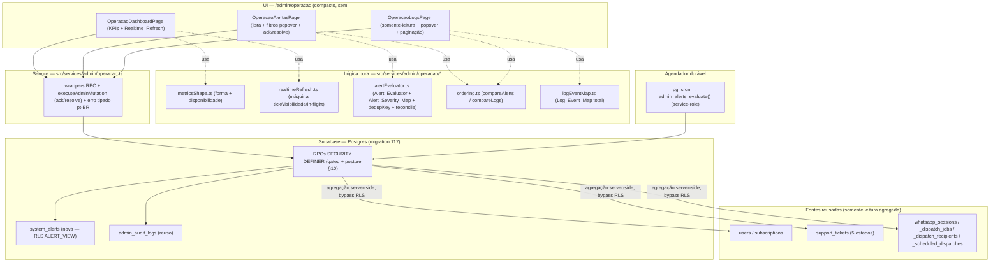
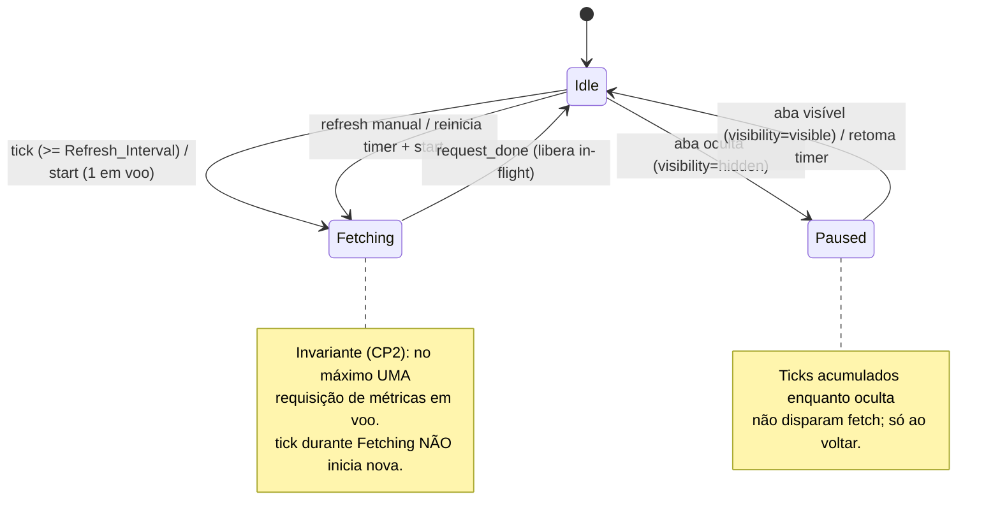
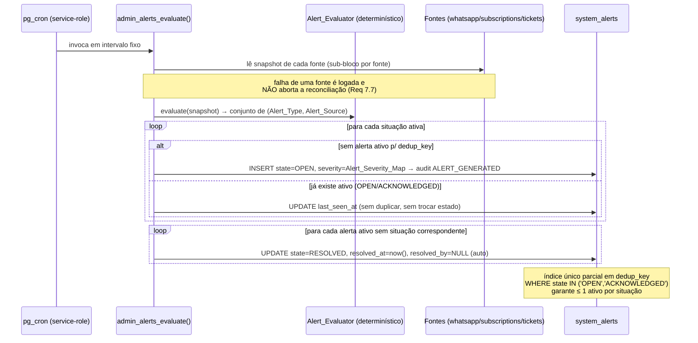

# Design Document — Central de Operação (`admin-central-operacao`)

## Visão geral (Overview)

A **Central de Operação** (`Central_Operacao`) entrega o "centro de comando" do dono em
`/admin/operacao`, compondo três subsistemas que andam juntos e que **reusam** infraestrutura já em
produção, sem recriá-la:

- **`Operations_Dashboard`** (parte 7) — painel operacional em tempo real com os onze
  `Operations_KPI`, atualização automática (`Realtime_Refresh`) e degradação parcial herdada de
  `admin-dashboard` (migration 036).
- **`Alerts_Center`** (parte 8) — sistema de alertas que **gera** (`Alert_Evaluator` +
  reconciliação durável via `pg_cron`), **deduplica**, **auto-resolve** e permite **reconhecer/
  resolver** os seis `Alert_Type` derivados de fontes reais (`whatsapp-automation`,
  `assinaturas-pagamento`, `suporte-inteligente`).
- **`Logs_Viewer`** (parte 9) — visualizador somente-leitura que lê `admin_audit_logs` e demais
  fontes via um `Log_Event_Map` total, com filtros em popover e paginação.

Toda a entrega adere integralmente aos steerings `project-conventions`, `admin-patterns` e
`testing-governance`. A prosa, a UI e as mensagens user-facing ficam em **pt-BR**; action codes,
error codes e identifiers em **inglês** (UPPER_SNAKE). A regra de ouro de `admin-patterns` vale aqui:
**toda decisão de leitura/escrita sensível é decidida no servidor** (RLS + RPC `SECURITY DEFINER`),
com gating em duas camadas (UI `useAdminPermission` + servidor `is_admin_with_permission`).

As Correctness Properties desta spec do painel são **obrigatórias** — **CP1..CP10 sem asterisco**;
apenas **CP11\*** (atualização instantânea via realtime) é **opcional** (com `*`), por depender de uma
assinatura de tempo real que pode não estar disponível em todos os ambientes.

### O que esta spec NÃO faz (não-objetivos)

- **Não** substitui a página analítica `/admin` (`admin-dashboard`, migration 036): adiciona uma
  superfície nova em `/admin/operacao` e uma RPC nova `admin_operations_metrics`, sem tocar a RPC
  `admin_dashboard_metrics` nem seus componentes.
- **Não** recria as tabelas de `whatsapp-automation` (092+), `suporte-inteligente` (115),
  `notifications-hub` (041) nem `assinaturas-pagamento` (055/057/060): apenas **lê** essas fontes de
  forma agregada, sem afrouxar RLS nem reescrever dados.
- **Não** inventa fontes inexistentes. Quando um KPI ou tipo de log não tem fonte disponível hoje
  (`USERS_ONLINE` sem `Presence_Source`; `LOGOUT`/`CLIENT_CREATED` sem emissor), a superfície **degrada
  com honestidade** (`available = false` / conjunto vazio) e a dependência é declarada como futura.
- **Não** implementa a quarta spec (`admin-ia-supervisora`, migration 118 reservada) nem mecanismos
  de presença de cliente final (sistema de presença é dependência futura).
- **Não** expõe PII bruta, conteúdo de mensagens nem segredos de integração em nenhuma superfície,
  bundle, `detail` de alerta, `summary` de log, trace ou audit.

### Princípios de reuso (não duplicar, não quebrar)

| Origem | O que reusamos | Como esta spec amplia |
| --- | --- | --- |
| `admin-dashboard` (036) | Padrão `Dashboard_Service.getMetrics` (uma RPC `jsonb` única), degradação parcial via `Promise.allSettled`/`bundle.errors[bloco]`, `Dashboard_KPI_Card` compacto, `Dashboard_Block_Error` com "Tentar novamente", `formatNumber` (pt-BR) | Adiciona a RPC `admin_operations_metrics` e a superfície `/admin/operacao` com os KPIs operacionais que faltam (online, tickets por estado, mensagens enviadas/programadas/erro) **com** `Realtime_Refresh` |
| `whatsapp-automation` (092+) | Fontes de mensagens (`whatsapp_dispatch_recipients` em `SENT`/`FAILED`/`PENDING`, `whatsapp_scheduled_dispatches`) e de alertas (`whatsapp_sessions` em `DISCONNECTED`/`EXPIRED`, `whatsapp_dispatch_jobs` em `PAUSED`/`FAILED`); domínios `session_status`/`dispatch_status`/`recipient_status` | **Lê** essas fontes sem recriar tabelas nem afrouxar RLS; degrada quando o módulo não está presente |
| `notifications-hub` (041) + `suporte-inteligente` (115) | `support_tickets.status` no domínio de cinco estados (`open`/`in_progress`/`waiting_customer`/`resolved`/`closed`); tickets aguardando atendimento humano | KPIs de tickets e alerta `CUSTOMER_AWAITING` derivam dessas fontes, sem recriar o hub nem o console |
| `assinaturas-pagamento` (055/057/060) | `subscriptions.status` (`active`/`past_due`/`suspended`/`canceled`) e `next_charge_at`/`grace_ends_at` | Contagens agregadas (`SUBSCRIPTIONS_ACTIVE`/`SUBSCRIPTIONS_EXPIRED`) e alerta `SUBSCRIPTION_EXPIRING`, **sem** expor PII nem detalhes de cobrança |
| `admin-foundation` (030) + `admin-patterns` | `AdminGuard`/`Stealth_404`, `useAdminPermission`, `is_admin_with_permission`, `executeAdminMutation`, `admin_audit_logs`, versionamento otimista (`expected_updated_at`/`STALE_VERSION`), idempotência `_SKIPPED`, RPC security posture (§10), master `Nexus_Vortex99` imutável, UI compacta (sem `<h1>`, popover `SlidersHorizontal`, paginação `10/50/100`) | Aplicado sem reinvenção em todas as RPCs, serviços e telas desta spec |
| `src/__tests__/_helpers/` | `generators.ts` (`safeText`, `validEmail`, `uuidLike`, `fc.constantFrom`), `authAssertions.ts` (`expectPermissionDenied`/`expectRejectsPermissionDenied`), `logAssertions.ts` (`expectNoSecrets`/`expectStructuredLog`), `auditAssertions.ts` (`expectAuditPersisted`/`expectViewDenied`), `antiEnumeration.ts` | Reusados como estão; **nunca** reimplementados (Req 15.5) |

---

## Arquitetura (Architecture)

### Camadas (página → service → RPC/RLS → tabelas)



### Fluxo do `Realtime_Refresh` (parte 7)



### Fluxo de geração/reconciliação de alertas (parte 8)



### Matriz de cenários de RLS e gating

| Caller / cenário | `Operations_Metrics_RPC` | `Alerts_List_RPC` | `Alert_Acknowledge`/`Resolve` | `Logs_List_RPC` | `SELECT system_alerts` (RLS) |
| --- | --- | --- | --- | --- | --- |
| `anon` (`auth.uid()` nulo) | `permission_denied` (42501) | `permission_denied` | `permission_denied` | `permission_denied` | 0 linhas (sem policy p/ `anon`) |
| `authenticated` não-admin / Cliente | `permission_denied` + `DASHBOARD_VIEW_DENIED` | `permission_denied` + `ALERT_VIEW_DENIED` | `permission_denied` + `ALERT_VIEW_DENIED` | `permission_denied` + `LOG_VIEW_DENIED` | 0 linhas (RLS `ALERT_VIEW` falso) |
| `SUPORTE`/`FINANCEIRO`/`MODERADOR` | depende de `DASHBOARD_VIEW` (matriz herdada) | negado (`ALERT_VIEW` não concedido) | negado (`ALERT_ACK`/`ALERT_RESOLVE` não concedido) | negado (`LOG_VIEW` não concedido) | 0 linhas (RLS `ALERT_VIEW` falso) |
| `ADMIN` | permitido (tem `DASHBOARD_VIEW`) | permitido | permitido | permitido | linhas visíveis |
| `SUPER_ADMIN` | permitido (wildcard) | permitido | permitido | permitido | linhas visíveis |
| `pg_cron` (service-role) | n/a | n/a | n/a (somente `admin_alerts_evaluate`) | n/a | bypass RLS (owner) |
| Sem permissão **e** input inválido | `permission_denied` (precedência sobre validação — CP7) | `permission_denied` | `permission_denied` | `permission_denied` | — |

Escrita em `system_alerts` é **exclusivamente** via RPC `SECURITY DEFINER` (a policy `FOR ALL
USING(false)` bloqueia DML direto de qualquer role `authenticated`; o `SELECT` admin é permitido por
política permissiva separada). Nenhuma RPC é exposta ao role `anon`.

---

## Modelo de dados (Data Models) — migration 117

Numeração confirmada (Req 14, `project-conventions`): `115`/`115b` pertencem a `suporte-inteligente`,
`116` a `admin-cliente-360`, `118` reservada à quarta spec. Esta entrega ocupa **117**
(`supabase/migrations/117_admin_central_operacao.sql`) com par documentado
`117_admin_central_operacao_rollback.sql`. Uma eventual segunda migration usaria o sufixo
`117b_...`, preservando o `118`.

A migration é **idempotente** (`CREATE TABLE IF NOT EXISTS`, `CREATE INDEX IF NOT EXISTS`,
`CREATE OR REPLACE FUNCTION`, `DROP POLICY IF EXISTS` antes de `CREATE POLICY`), envolvida em
`BEGIN; ... COMMIT;`, com bloco defensivo `DO $check$` validando dependências antes de qualquer DDL.

### 1. Bloco defensivo `DO $check$` (dependências 030/036/041/055/092/115)

```sql
BEGIN;

DO $check$
BEGIN
  -- admin-foundation (030): RBAC + audit
  IF NOT EXISTS (SELECT 1 FROM information_schema.routines
                 WHERE routine_schema='public' AND routine_name='is_admin_with_permission') THEN
    RAISE EXCEPTION 'Migration 030 (admin-foundation) nao aplicada: is_admin_with_permission ausente';
  END IF;
  IF NOT EXISTS (SELECT 1 FROM information_schema.tables
                 WHERE table_schema='public' AND table_name='admin_audit_logs') THEN
    RAISE EXCEPTION 'Migration 030 (admin-foundation) nao aplicada: admin_audit_logs ausente';
  END IF;
  -- admin-dashboard (036): DASHBOARD_VIEW reusada (sanidade da fundacao de metricas)
  IF NOT EXISTS (SELECT 1 FROM information_schema.routines
                 WHERE routine_schema='public' AND routine_name='admin_dashboard_metrics') THEN
    RAISE EXCEPTION 'Migration 036 (admin-dashboard) nao aplicada: admin_dashboard_metrics ausente';
  END IF;
  -- base de usuarios (001) + assinaturas (055)
  IF NOT EXISTS (SELECT 1 FROM information_schema.tables
                 WHERE table_schema='public' AND table_name='users') THEN
    RAISE EXCEPTION 'Tabela users ausente -- schema inesperado';
  END IF;
  IF NOT EXISTS (SELECT 1 FROM information_schema.tables
                 WHERE table_schema='public' AND table_name='subscriptions') THEN
    RAISE EXCEPTION 'Migration 055 (assinaturas-pagamento) nao aplicada: subscriptions ausente';
  END IF;
  -- notifications-hub (041) / suporte-inteligente (115): tickets de suporte
  IF NOT EXISTS (SELECT 1 FROM information_schema.tables
                 WHERE table_schema='public' AND table_name='support_tickets') THEN
    RAISE EXCEPTION 'Migration 041/115 nao aplicada: support_tickets ausente';
  END IF;
END
$check$;

-- whatsapp-automation (092+): fontes de mensagens e de alertas. Pode NAO estar
-- presente em todos os ambientes; a ausencia NAO aborta a migration (degradacao
-- honesta em runtime). Apenas registramos um aviso informativo.
DO $whatsapp_note$
BEGIN
  IF NOT EXISTS (SELECT 1 FROM information_schema.tables
                 WHERE table_schema='public' AND table_name='whatsapp_sessions') THEN
    RAISE NOTICE 'whatsapp-automation (092) ausente: KPIs de mensagens e alertas de WhatsApp degradam para indisponivel/omitido.';
  END IF;
END
$whatsapp_note$;
```

> **Decisão — dependência "dura" vs "macia"**: `030/036/055/041(115)` são **duras** (a Central de
> Operação não faz sentido sem RBAC, audit, assinaturas e tickets) e abortam a migration se
> ausentes. `092` (WhatsApp) é **macia**: a presença é checada **em runtime** dentro de cada RPC
> (sub-bloco por fonte), permitindo que o painel degrade honestamente (`available = false` / tipo de
> alerta omitido) onde o módulo não está instalado (Req 8.7, 3.8).

### 2. Tabela `system_alerts` (Req 6.1–6.3, 6.5, 6.8)

```sql
CREATE TABLE IF NOT EXISTS system_alerts (
  id              uuid PRIMARY KEY DEFAULT gen_random_uuid(),
  alert_type      text NOT NULL
    CHECK (alert_type IN ('WHATSAPP_DISCONNECTED','CAMPAIGN_PAUSED','CAMPAIGN_ERROR',
                          'INTEGRATION_FAILURE','SUBSCRIPTION_EXPIRING','CUSTOMER_AWAITING')),
  severity        text NOT NULL
    CHECK (severity IN ('CRITICAL','WARNING','INFO')),
  state           text NOT NULL DEFAULT 'OPEN'
    CHECK (state IN ('OPEN','ACKNOWLEDGED','RESOLVED')),
  source_type     text NOT NULL,                 -- 'whatsapp_session','dispatch_job','integration','subscription','support_ticket'
  source_id       text NOT NULL,                 -- instance_id / dispatch_id / key / user_id / ticket_id (string, sem PII)
  dedup_key       text NOT NULL,                 -- = alert_type||':'||source_type||':'||source_id (Alert_Dedup_Key)
  title           text NOT NULL,                 -- rotulo pt-BR curto, sem PII
  detail          jsonb NOT NULL DEFAULT '{}'::jsonb,  -- contexto nao sensivel (contadores, timestamps, ids de origem)
  first_seen_at   timestamptz NOT NULL DEFAULT now(),
  last_seen_at    timestamptz NOT NULL DEFAULT now(),
  acknowledged_at timestamptz,
  acknowledged_by uuid REFERENCES users(id) ON DELETE SET NULL,
  resolved_at     timestamptz,
  resolved_by     uuid REFERENCES users(id) ON DELETE SET NULL,  -- NULL = resolucao automatica
  created_at      timestamptz NOT NULL DEFAULT now(),
  updated_at      timestamptz NOT NULL DEFAULT now()
);

-- Indice unico PARCIAL: no maximo UM alerta ativo por situacao (Req 6.5, base de CP4).
CREATE UNIQUE INDEX IF NOT EXISTS uq_system_alerts_active_dedup
  ON system_alerts (dedup_key)
  WHERE state IN ('OPEN','ACKNOWLEDGED');

-- Indices de listagem/ordenacao (Req 8.8): severidade + last_seen_at desc.
CREATE INDEX IF NOT EXISTS idx_system_alerts_list
  ON system_alerts (state, severity, last_seen_at DESC);
CREATE INDEX IF NOT EXISTS idx_system_alerts_type
  ON system_alerts (alert_type, last_seen_at DESC);

-- Trigger de updated_at (reusa funcao generica de touch se existir; senao cria local).
CREATE OR REPLACE FUNCTION operacao_touch_updated_at()
RETURNS trigger LANGUAGE plpgsql AS $touch$
BEGIN
  NEW.updated_at := now();
  RETURN NEW;
END;
$touch$;

DROP TRIGGER IF EXISTS trg_system_alerts_touch ON system_alerts;
CREATE TRIGGER trg_system_alerts_touch
  BEFORE UPDATE ON system_alerts
  FOR EACH ROW EXECUTE FUNCTION operacao_touch_updated_at();
```

> **Decisão — `source_id text`**: a origem é heterogênea (`instance_id` uuid, `dispatch_id` uuid,
> `user_id` uuid, `integration key` texto, `ticket_id` uuid). Modelar como `text` evita acoplar a
> tabela a um único tipo e mantém a `dedup_key` determinística e legível. `source_id` **nunca**
> carrega PII — para `SUBSCRIPTION_EXPIRING` é o `user_id` (identificador opaco), e `detail` jamais
> inclui e-mail/telefone/CPF/CNPJ nem valores de cobrança (Req 6.8, 8.5, 13.4).

### 3. RLS de `system_alerts` (Req 6.6, 6.7) — admin-only, escrita só por RPC

```sql
ALTER TABLE system_alerts ENABLE ROW LEVEL SECURITY;

-- SELECT: somente admin com ALERT_VIEW (Req 6.6). Nega anon/cliente/nao-admin (Req 6.7).
DROP POLICY IF EXISTS system_alerts_select_admin ON system_alerts;
CREATE POLICY system_alerts_select_admin ON system_alerts
  FOR SELECT TO authenticated
  USING (is_admin_with_permission('ALERT_VIEW'));

-- DML direto bloqueado para TODOS os roles: INSERT/UPDATE/DELETE so via RPC SECURITY DEFINER
-- (que roda como owner e ignora RLS). Politica permissiva separada do SELECT acima:
-- para SELECT, as duas politicas sao combinadas por OR => admin com ALERT_VIEW le; para
-- INSERT/UPDATE/DELETE so esta se aplica => sempre negado.
DROP POLICY IF EXISTS system_alerts_no_dml ON system_alerts;
CREATE POLICY system_alerts_no_dml ON system_alerts
  FOR ALL TO authenticated
  USING (false) WITH CHECK (false);
```

> **Decisão — par de policies (SELECT permissivo + `FOR ALL USING(false)`)**: replica o padrão de
> `subscriptions` (055). Como as políticas permissivas do mesmo comando se combinam por **OR**, o
> `SELECT` de um admin com `ALERT_VIEW` é permitido; `INSERT/UPDATE/DELETE` recaem apenas na política
> `USING(false)` e ficam bloqueados para qualquer role `authenticated`. As mutações legítimas passam
> pelas RPCs `SECURITY DEFINER`, que executam como owner e contornam a RLS (Req 6.6, 9.3, 9.4).

### 4. RBAC — ações novas (`ALERT_VIEW`, `ALERT_ACK`, `ALERT_RESOLVE`, `LOG_VIEW`)

`is_admin_with_permission` (036) é recriada **preservando todas as branches existentes** e mantendo a
concessão das ações novas **somente** a `SUPER_ADMIN` (wildcard) e `ADMIN` (allow-all menos
deny-list). As novas ações **não** entram na deny-list do `ADMIN` (logo `ADMIN` as recebe) e **não**
entram nas allowlists de `SUPORTE`/`FINANCEIRO`/`MODERADOR` (logo são **negadas por construção** —
deny-by-default, Req 2.3, 2.6).

```sql
CREATE OR REPLACE FUNCTION is_admin_with_permission(p_action text)
RETURNS boolean
LANGUAGE sql STABLE
SECURITY DEFINER
SET search_path = public
AS $func$
  WITH active AS (
    SELECT role FROM admin_roles
    WHERE user_id = auth.uid() AND revoked_at IS NULL
  )
  SELECT EXISTS (
    SELECT 1 FROM active a
    WHERE
      a.role = 'SUPER_ADMIN'
      -- ADMIN: allow-all menos deny-list. ALERT_*/LOG_VIEW NAO estao na deny-list
      -- => concedidas ao ADMIN. ASSISTANT_* permanecem negadas (exclusivas do dono).
      OR (a.role = 'ADMIN' AND p_action NOT IN
           ('USER_DELETE','ADMIN_ROLE_GRANT','ADMIN_ROLE_REVOKE',
            'ASSISTANT_VIEW','ASSISTANT_EDIT'))
      OR (a.role = 'FINANCEIRO' AND p_action IN
           ('USER_VIEW','FRETE_VIEW','FINANCEIRO_VIEW','FINANCEIRO_EDIT',
            'AUDIT_VIEW','DASHBOARD_VIEW'))
      OR (a.role = 'SUPORTE' AND p_action IN
           ('USER_VIEW','USER_TOGGLE_ACTIVE','FRETE_VIEW',
            'SUPORTE_VIEW','SUPORTE_REPLY','CRM_VIEW',
            'BLACKLIST_VIEW','DASHBOARD_VIEW'))
      OR (a.role = 'MODERADOR' AND p_action IN
           ('USER_VIEW','FRETE_VIEW','FRETE_FORCE_CLOSE',
            'BLACKLIST_VIEW','BLACKLIST_MANAGE'))
  );
$func$;

REVOKE ALL ON FUNCTION is_admin_with_permission(text) FROM PUBLIC;
GRANT EXECUTE ON FUNCTION is_admin_with_permission(text) TO authenticated;
```

> **Nota (Req 2.5)**: como toda branch depende de `admin_roles` filtrada por `auth.uid()`, um caller
> anônimo (`auth.uid()` nulo) não casa com nenhuma linha e a função retorna **falso** para
> `ALERT_VIEW`/`ALERT_ACK`/`ALERT_RESOLVE`/`LOG_VIEW` — sem branch especial.

**Espelho no frontend** `src/services/admin/permissions.ts`:

```ts
// Acrescentar ao enum ADMIN_ACTIONS (concedidas a SUPER_ADMIN via wildcard e
// a ADMIN via allow-all; NAO entram em ADMIN_DENY; NAO entram nos *_PERMS de
// SUPORTE/FINANCEIRO/MODERADOR => deny-by-default para esses papeis).
export const ADMIN_ACTIONS = [
  // ...existentes...
  'ALERT_VIEW',
  'ALERT_ACK',
  'ALERT_RESOLVE',
  'LOG_VIEW',
] as const;
// ADMIN_DENY permanece inalterada (sem ALERT_*/LOG_VIEW).
// FINANCEIRO_PERMS / SUPORTE_PERMS / MODERADOR_PERMS permanecem inalterados.
// hasPermission(role, action) ja nega qualquer string fora do enum (Req 2.6, base de CP8).
```

### 5. Tabelas reusadas (somente leitura agregada)

A migration **não altera** estas tabelas; as RPCs as leem de forma agregada (contagens/snapshots),
server-side, via `SECURITY DEFINER` (contornando RLS, mas expondo **apenas** contagens e marcadores).

| Tabela (origem) | Colunas relevantes | Uso nesta spec |
| --- | --- | --- |
| `users` (001/055) | `user_type`, `created_at`, `subscription_status`, `trial_ends_at` | `USERS_TOTAL`, `SIGNUPS_TODAY` (`Today_Window`) |
| `subscriptions` (055) | `user_id`, `status`, `next_charge_at`, `grace_ends_at` | `SUBSCRIPTIONS_ACTIVE` (`status='active'`), `SUBSCRIPTIONS_EXPIRED` (`status IN ('past_due','suspended','canceled')`), alerta `SUBSCRIPTION_EXPIRING` (`status='active'` e `next_charge_at` em `Expiring_Window`) |
| `support_tickets` (041/115) | `status` (5 estados), `responder_mode`, `updated_at` | `TICKETS_OPEN`/`TICKETS_IN_PROGRESS`/`TICKETS_RESOLVED`; alerta `CUSTOMER_AWAITING` (não terminal aguardando humano além de `Awaiting_Threshold`) |
| `whatsapp_dispatch_recipients` (092) | `status` (`SENT`/`FAILED`/`PENDING`), `sent_at` | `MESSAGES_SENT`/`MESSAGES_ERROR` (`Today_Window`) |
| `whatsapp_scheduled_dispatches` (092) | `scheduled_at`, `executed_at` | `MESSAGES_SCHEDULED` (pendentes futuros: `executed_at IS NULL AND scheduled_at > now()`) |
| `whatsapp_sessions` (092) | `instance_id`, `status` (`DISCONNECTED`/`EXPIRED`) | alerta `WHATSAPP_DISCONNECTED` |
| `whatsapp_dispatch_jobs` (092) | `id`, `status` (`PAUSED`/`FAILED`), `failure_code` | alertas `CAMPAIGN_PAUSED` / `CAMPAIGN_ERROR` |
| `admin_audit_logs` (030) | `action`, `admin_id`, `target_type`, `target_id`, `created_at` | fonte primária do `Logs_Viewer` (via `Log_Event_Map`) |

> **`USERS_ONLINE`**: não há `Presence_Source` hoje. O KPI é computado como `available = false`
> (texto `indisponível`), **nunca** `0`, e a fonte de presença é declarada dependência futura
> (Req 3.7, 3.8). Quando existir, será uma contagem de atividade dentro do `Online_Window` sem
> identificar quais Clientes (Req 5.6).

### 6. Bloco `-- VERIFY` e rollback

```sql
-- ============================================================================
-- VERIFY (smoke test manual — descomentar pontualmente)
-- ============================================================================
/*
-- 1. Tabela e indice unico parcial existem
SELECT to_regclass('public.system_alerts');
SELECT indexname FROM pg_indexes WHERE indexname = 'uq_system_alerts_active_dedup';

-- 2. RLS habilitada + policies
SELECT relrowsecurity FROM pg_class WHERE relname = 'system_alerts';      -- t
SELECT polname FROM pg_policy WHERE polrelid = 'public.system_alerts'::regclass;

-- 3. RBAC reconhece as acoes novas (sessao SUPER_ADMIN/ADMIN => true; demais => false)
SELECT is_admin_with_permission('ALERT_VIEW'), is_admin_with_permission('LOG_VIEW');

-- 4. RPCs presentes
SELECT proname FROM pg_proc WHERE proname IN
  ('admin_operations_metrics','admin_alerts_evaluate','admin_alerts_list',
   'admin_alert_acknowledge','admin_alert_resolve','admin_logs_list');

-- 5. GRANT/REVOKE sem anon
SELECT proname, proacl FROM pg_proc WHERE proname = 'admin_operations_metrics';
*/

COMMIT;
```

O par **`117_admin_central_operacao_rollback.sql`** (documentado, **não** auto-aplicado) reverte na
ordem inversa: `DROP FUNCTION` das seis RPCs e de `operacao_touch_updated_at`; `DROP POLICY` de
`system_alerts`; `DROP INDEX` (`uq_system_alerts_active_dedup`, `idx_system_alerts_list`,
`idx_system_alerts_type`); `DROP TABLE system_alerts`; e restaura `is_admin_with_permission` para a
versão da migration 036 (sem as ações novas). **Não** toca em `users`, `subscriptions`,
`support_tickets`, `admin_audit_logs` nem nas tabelas de `whatsapp-automation` (Req 14.7, 14.8).

---

## Componentes e interfaces (Components and Interfaces)

### A. Núcleo de lógica pura — `src/services/admin/operacao/` (alvo das propriedades)

Funções puras, determinísticas, sem I/O (unit + property). São o alvo direto de CP1–CP10.

#### A.1 `metricsShape.ts` — forma do bundle + disponibilidade (alvo de **CP1**)

```ts
export type OperationsKpiKey =
  | 'USERS_TOTAL' | 'USERS_ONLINE' | 'SIGNUPS_TODAY'
  | 'SUBSCRIPTIONS_ACTIVE' | 'SUBSCRIPTIONS_EXPIRED'
  | 'TICKETS_OPEN' | 'TICKETS_IN_PROGRESS' | 'TICKETS_RESOLVED'
  | 'MESSAGES_SENT' | 'MESSAGES_SCHEDULED' | 'MESSAGES_ERROR';

export type OperationsGroupKey = 'users' | 'subscriptions' | 'tickets' | 'messages';

/** Dashboard_KPI reusado de admin-dashboard: value=null nunca exibido como 0. */
export interface DashboardKpi {
  value: number | null;
  available: boolean;
}

export interface OperationsMetricsBundle {
  meta: { generatedAt: string; onlineWindowSec: number };
  kpis: Record<OperationsKpiKey, DashboardKpi>;
  errors: Partial<Record<OperationsGroupKey, string>>;
}

/** Mapa fixo KPI → grupo de degradação (Partial_Degradation). */
export const KPI_GROUP: Readonly<Record<OperationsKpiKey, OperationsGroupKey>> = {
  USERS_TOTAL: 'users', USERS_ONLINE: 'users', SIGNUPS_TODAY: 'users',
  SUBSCRIPTIONS_ACTIVE: 'subscriptions', SUBSCRIPTIONS_EXPIRED: 'subscriptions',
  TICKETS_OPEN: 'tickets', TICKETS_IN_PROGRESS: 'tickets', TICKETS_RESOLVED: 'tickets',
  MESSAGES_SENT: 'messages', MESSAGES_SCHEDULED: 'messages', MESSAGES_ERROR: 'messages',
};

export const OPERATIONS_KPI_KEYS = Object.keys(KPI_GROUP) as OperationsKpiKey[];

/** Entrada crua por KPI: contagem + disponibilidade da fonte. */
export interface RawKpi { value: number | null; available: boolean }

/** Builder puro de um KPI: fonte indisponível => {value:null, available:false}. */
export function buildKpi(raw: RawKpi | null | undefined): DashboardKpi {
  if (!raw || raw.available !== true) return { value: null, available: false };
  return { value: raw.value == null ? null : Number(raw.value), available: true };
}

/**
 * Adapta o bundle cru (saída da RPC) para o contrato público, aplicando
 * Partial_Degradation: para todo grupo presente em `errors`, TODOS os seus
 * KPIs viram {value:null, available:false} (nunca 0). Determinístico e total.
 */
export function adaptOperationsBundle(raw: {
  meta?: Partial<OperationsMetricsBundle['meta']>;
  kpis?: Partial<Record<OperationsKpiKey, RawKpi>>;
  errors?: Partial<Record<OperationsGroupKey, string>>;
}): OperationsMetricsBundle {
  const errors = { ...(raw.errors ?? {}) };
  const kpis = {} as Record<OperationsKpiKey, DashboardKpi>;
  for (const key of OPERATIONS_KPI_KEYS) {
    const group = KPI_GROUP[key];
    kpis[key] = group in errors ? { value: null, available: false } : buildKpi(raw.kpis?.[key]);
  }
  return {
    meta: {
      generatedAt: String(raw.meta?.generatedAt ?? ''),
      onlineWindowSec: Number(raw.meta?.onlineWindowSec ?? 300),
    },
    kpis,
    errors,
  };
}
```

#### A.2 `realtimeRefresh.ts` — máquina do `Realtime_Refresh` (alvo de **CP2**)

Máquina determinística que decide **quando** iniciar uma requisição de métricas, garantindo **uma
única em voo**, pausa por visibilidade e reinício de timer no refresh manual.

```ts
export const REFRESH_FLOOR_MS = 10_000;      // piso de seguranca (Req 4.5)
export const DEFAULT_INTERVAL_MS = 30_000;   // valor inicial (Req 4.1)

export interface RefreshState {
  intervalMs: number;     // sempre >= REFRESH_FLOOR_MS
  elapsedMs: number;      // tempo desde o ultimo start (so corre quando visivel)
  visible: boolean;
  inFlight: boolean;      // ha uma requisicao de metricas em voo
}

export type RefreshEvent =
  | { kind: 'tick'; deltaMs: number }
  | { kind: 'visibility'; visible: boolean }
  | { kind: 'manual' }
  | { kind: 'request_done' };

export interface RefreshDecision { state: RefreshState; startFetch: boolean }

export function initRefresh(intervalMs = DEFAULT_INTERVAL_MS): RefreshState {
  return { intervalMs: Math.max(REFRESH_FLOOR_MS, intervalMs), elapsedMs: 0, visible: true, inFlight: false };
}

/** Único ponto que pode emitir startFetch; nunca o faz com inFlight=true (CP2). */
export function reduce(state: RefreshState, event: RefreshEvent): RefreshDecision {
  switch (event.kind) {
    case 'visibility':
      return { state: { ...state, visible: event.visible }, startFetch: false };
    case 'tick': {
      if (!state.visible) return { state, startFetch: false };           // pausado (Req 4.2)
      const elapsedMs = state.elapsedMs + Math.max(0, event.deltaMs);
      if (elapsedMs >= state.intervalMs && !state.inFlight) {            // dispara 1 em voo (Req 4.3)
        return { state: { ...state, elapsedMs: 0, inFlight: true }, startFetch: true };
      }
      return { state: { ...state, elapsedMs }, startFetch: false };
    }
    case 'manual': {
      if (state.inFlight) return { state: { ...state, elapsedMs: 0 }, startFetch: false }; // reinicia timer; sem sobrepor
      return { state: { ...state, elapsedMs: 0, inFlight: true }, startFetch: true };      // imediato + reinicia (Req 4.4)
    }
    case 'request_done':
      return { state: { ...state, inFlight: false }, startFetch: false };
  }
}
```

#### A.3 `alertEvaluator.ts` — `Alert_Evaluator` + `Alert_Severity_Map` + `dedupKey` + reconciliação (alvo de **CP3/CP4/CP5**)

```ts
export type AlertType =
  | 'WHATSAPP_DISCONNECTED' | 'CAMPAIGN_PAUSED' | 'CAMPAIGN_ERROR'
  | 'INTEGRATION_FAILURE' | 'SUBSCRIPTION_EXPIRING' | 'CUSTOMER_AWAITING';
export type AlertSeverity = 'CRITICAL' | 'WARNING' | 'INFO';
export type AlertState = 'OPEN' | 'ACKNOWLEDGED' | 'RESOLVED';

/** Alert_Severity_Map: determinístico Alert_Type → Alert_Severity (Req 6.4). */
export const ALERT_SEVERITY_MAP: Readonly<Record<AlertType, AlertSeverity>> = {
  WHATSAPP_DISCONNECTED: 'CRITICAL',
  CAMPAIGN_ERROR: 'CRITICAL',
  INTEGRATION_FAILURE: 'CRITICAL',
  CAMPAIGN_PAUSED: 'WARNING',
  SUBSCRIPTION_EXPIRING: 'WARNING',
  CUSTOMER_AWAITING: 'WARNING',
};

export interface AlertSource { sourceType: string; sourceId: string }
export interface ActiveSituation { alertType: AlertType; source: AlertSource; severity: AlertSeverity }

/** Alert_Dedup_Key determinística (Req 6.5). */
export function dedupKey(t: AlertType, s: AlertSource): string {
  return `${t}:${s.sourceType}:${s.sourceId}`;
}

/** Snapshot das fontes. Campo ausente (undefined) = módulo não presente => omite o tipo (Req 8.7). */
export interface EvaluatorInput {
  whatsappSessions?: ReadonlyArray<{ instanceId: string; status: string }>;
  dispatchJobs?: ReadonlyArray<{ dispatchId: string; status: string }>;
  integrations?: ReadonlyArray<{ key: string; failures: number }>;
  subscriptions?: ReadonlyArray<{ userId: string; status: string; nextChargeAt: string | null }>;
  awaitingTickets?: ReadonlyArray<{ ticketId: string; state: string; waitingMinutes: number }>;
  config: {
    now: string;
    expiringWindowDays: number;     // Expiring_Window (default 3)
    awaitingThresholdMin: number;   // Awaiting_Threshold
    integrationFailureThreshold: number;
  };
}

function push(out: ActiveSituation[], alertType: AlertType, sourceType: string, sourceId: string): void {
  out.push({ alertType, source: { sourceType, sourceId }, severity: ALERT_SEVERITY_MAP[alertType] });
}

/**
 * Alert_Evaluator: determinístico. Para o mesmo snapshot, produz sempre o mesmo
 * conjunto de situações ativas (ordenado por dedupKey para estabilidade — CP3).
 */
export function evaluate(input: EvaluatorInput): ActiveSituation[] {
  const out: ActiveSituation[] = [];
  for (const s of input.whatsappSessions ?? [])
    if (s.status === 'DISCONNECTED' || s.status === 'EXPIRED')
      push(out, 'WHATSAPP_DISCONNECTED', 'whatsapp_session', s.instanceId);
  for (const j of input.dispatchJobs ?? []) {
    if (j.status === 'PAUSED') push(out, 'CAMPAIGN_PAUSED', 'dispatch_job', j.dispatchId);
    if (j.status === 'FAILED') push(out, 'CAMPAIGN_ERROR', 'dispatch_job', j.dispatchId);
  }
  for (const i of input.integrations ?? [])
    if (i.failures >= input.config.integrationFailureThreshold)
      push(out, 'INTEGRATION_FAILURE', 'integration', i.key);
  for (const sub of input.subscriptions ?? [])
    if (sub.status === 'active' && withinExpiring(sub.nextChargeAt, input.config))
      push(out, 'SUBSCRIPTION_EXPIRING', 'subscription', sub.userId);
  for (const t of input.awaitingTickets ?? [])
    if (t.state !== 'resolved' && t.state !== 'closed' && t.waitingMinutes >= input.config.awaitingThresholdMin)
      push(out, 'CUSTOMER_AWAITING', 'support_ticket', t.ticketId);
  return out.sort((a, b) => dedupKey(a.alertType, a.source).localeCompare(dedupKey(b.alertType, b.source)));
}

function withinExpiring(nextChargeAt: string | null, cfg: EvaluatorInput['config']): boolean {
  if (!nextChargeAt) return false;
  const due = Date.parse(nextChargeAt), now = Date.parse(cfg.now);
  if (Number.isNaN(due) || Number.isNaN(now)) return false;
  const horizon = now + cfg.expiringWindowDays * 86_400_000;
  return due >= now && due <= horizon;
}

// ── Reconciliação (modelo puro espelhado pela Alerts_Evaluate_RPC) ──
export interface ExistingActiveAlert { dedupKey: string; state: 'OPEN' | 'ACKNOWLEDGED' }
export interface ReconcilePlan {
  toOpen: ActiveSituation[];   // situações ativas sem alerta ativo correspondente
  toTouch: string[];           // dedup keys ativos a atualizar last_seen_at
  toResolve: string[];         // dedup keys ativos sem situação => auto-resolver
}

/**
 * Reconcilia o conjunto de alertas ativos com as situações do evaluator.
 * Idempotente sob reaplicação (CP4) e auto-resolve consistente (CP5).
 */
export function reconcile(existing: ReadonlyArray<ExistingActiveAlert>, situations: ReadonlyArray<ActiveSituation>): ReconcilePlan {
  const existingKeys = new Set(existing.map((e) => e.dedupKey));
  const situationKeys = new Set(situations.map((s) => dedupKey(s.alertType, s.source)));
  const toOpen = situations.filter((s) => !existingKeys.has(dedupKey(s.alertType, s.source)));
  const toTouch = [...situationKeys].filter((k) => existingKeys.has(k)).sort();
  const toResolve = [...existingKeys].filter((k) => !situationKeys.has(k)).sort();
  return { toOpen, toTouch, toResolve };
}
```

#### A.4 `ordering.ts` — ordenação total de alertas e logs (alvo de **CP9**)

```ts
import type { AlertSeverity } from './alertEvaluator';

export const SEVERITY_RANK: Readonly<Record<AlertSeverity, number>> = { CRITICAL: 0, WARNING: 1, INFO: 2 };

export interface AlertRow { id: string; severity: AlertSeverity; lastSeenAt: string }
export interface LogRow { id: string; occurredAt: string; eventType: string }

/** Ordem total: severidade asc, depois last_seen_at desc, depois id asc (desempate estável). */
export function compareAlerts(a: AlertRow, b: AlertRow): number {
  if (SEVERITY_RANK[a.severity] !== SEVERITY_RANK[b.severity])
    return SEVERITY_RANK[a.severity] - SEVERITY_RANK[b.severity];
  if (a.lastSeenAt !== b.lastSeenAt) return a.lastSeenAt < b.lastSeenAt ? 1 : -1; // desc
  return a.id < b.id ? -1 : a.id > b.id ? 1 : 0;                                  // tiebreak estável
}

/** Ordem total: occurred_at desc, depois event_type asc, depois id asc. */
export function compareLogs(a: LogRow, b: LogRow): number {
  if (a.occurredAt !== b.occurredAt) return a.occurredAt < b.occurredAt ? 1 : -1; // desc
  if (a.eventType !== b.eventType) return a.eventType < b.eventType ? -1 : 1;
  return a.id < b.id ? -1 : a.id > b.id ? 1 : 0;
}
```

#### A.5 `logEventMap.ts` — `Log_Event_Map` total + rótulos (alvo de **CP10**)

```ts
export type LogEventType =
  | 'LOGIN' | 'LOGOUT' | 'DISPATCH_STARTED' | 'DISPATCH_COMPLETED' | 'ERROR_OCCURRED'
  | 'CLIENT_CREATED' | 'PLAN_CHANGED' | 'AI_REPLIED' | 'HUMAN_TAKEOVER';

export const LOG_EVENT_TYPES = [
  'LOGIN','LOGOUT','DISPATCH_STARTED','DISPATCH_COMPLETED','ERROR_OCCURRED',
  'CLIENT_CREATED','PLAN_CHANGED','AI_REPLIED','HUMAN_TAKEOVER',
] as const satisfies readonly LogEventType[];

/**
 * Log_Event_Map: total e determinístico. Cada tipo resolve para o conjunto de
 * action codes que o originam em admin_audit_logs. Tipos SEM emissor presente
 * resolvem para [] (conjunto vazio) — sem fabricar registros (Req 11.3).
 * Os action codes são resolvidos contra os módulos emissores; códigos ainda
 * não emitidos simplesmente não casam nenhuma linha (fallback seguro).
 */
export const LOG_EVENT_MAP: Readonly<Record<LogEventType, readonly string[]>> = {
  LOGIN: ['ADMIN_LOGIN_SUCCESS'],                                  // admin-foundation 030 (confirmado)
  LOGOUT: [],                                                      // sem emissor de logout de cliente hoje (dep. futura)
  DISPATCH_STARTED: ['WHATSAPP_DISPATCH_STARTED'],                 // whatsapp-automation 092+
  DISPATCH_COMPLETED: ['WHATSAPP_DISPATCH_COMPLETED'],             // whatsapp-automation 092+
  ERROR_OCCURRED: ['JOB_FAILED', 'WHATSAPP_DISPATCH_FAILED'],      // *_FAILED + erro estruturado
  CLIENT_CREATED: [],                                              // sem emissor de criação de conta de cliente hoje (dep. futura)
  PLAN_CHANGED: ['SUBSCRIPTION_PLAN_CHANGED'],                     // assinaturas-pagamento / admin-subscriptions 055/057/060
  AI_REPLIED: ['SUPORTE_AI_REPLY', 'WHATSAPP_AI_REPLY'],           // suporte-inteligente 115 + whatsapp 092+
  HUMAN_TAKEOVER: ['SUPORTE_HANDOFF', 'WHATSAPP_HUMAN_TAKEOVER'],  // suporte-inteligente 115 + whatsapp 092+
};

/** Rótulos pt-BR fixos por tipo (Req 11.5). */
export const LOG_EVENT_LABEL: Readonly<Record<LogEventType, string>> = {
  LOGIN: 'Login realizado', LOGOUT: 'Logout',
  DISPATCH_STARTED: 'Disparo iniciado', DISPATCH_COMPLETED: 'Disparo concluído',
  ERROR_OCCURRED: 'Erro ocorrido', CLIENT_CREATED: 'Cliente criado',
  PLAN_CHANGED: 'Plano alterado', AI_REPLIED: 'IA respondeu', HUMAN_TAKEOVER: 'Atendimento humano assumiu',
};

/** Total: definida para todo LogEventType; [] quando sem emissor (Req 11.2, 11.3). */
export function resolveActionCodes(t: LogEventType): readonly string[] {
  return LOG_EVENT_MAP[t];
}
```

### B. RPCs `SECURITY DEFINER` (postura `admin-patterns` §10)

Todas seguem a posture: header `SET search_path = public`; `auth.uid() IS NULL ⇒ RAISE
permission_denied (42501)`; `is_admin_with_permission(...)` com **log negativo** antes de abortar;
validações de input **após** o gating (precedência de `permission_denied` — CP7); `REVOKE ALL FROM
PUBLIC` + `GRANT EXECUTE TO authenticated` (a `admin_alerts_evaluate` também `GRANT ... TO
service_role` para o `pg_cron`). O audit **positivo** de ack/resolve é gravado pela camada TS via
`executeAdminMutation`; `ALERT_GENERATED`, `_SKIPPED` e `*_VIEW_DENIED` são gravados **dentro** das
RPCs.

| RPC | Gating | Retorno | Log negativo | Notas |
| --- | --- | --- | --- | --- |
| `admin_operations_metrics(p_online_window_sec int DEFAULT 300)` | `DASHBOARD_VIEW` (reusada) | `jsonb` `Operations_Metrics_Bundle` (`{ meta, kpis, errors }`) | `DASHBOARD_VIEW_DENIED` | `STABLE`; cada grupo (`users`/`subscriptions`/`tickets`/`messages`) em **sub-bloco** `BEGIN..EXCEPTION` → falha vira `errors[grupo]` e KPIs do grupo `available=false` (Req 4.7, 5.1–5.6); só contagens, sem PII |
| `admin_alerts_evaluate()` | **service-role** (`pg_cron`) **ou** `ALERT_VIEW` (sob demanda) | `jsonb` `{ opened, touched, resolved }` | `ALERT_VIEW_DENIED` (caminho admin) | `VOLATILE`; cada fonte em sub-bloco (falha logada, não aborta — Req 7.7); insere `OPEN`+`ALERT_GENERATED`, atualiza `last_seen_at`, auto-resolve (`resolved_by=NULL`); idempotente pelo índice único parcial (Req 7.2–7.5) |
| `admin_alerts_list(p_state text, p_type text, p_severity text, p_limit int, p_offset int)` | `ALERT_VIEW` | `jsonb` `{ items[], total }` | `ALERT_VIEW_DENIED` | ordena por `severity` então `last_seen_at DESC` com desempate por `id` (CP9); `p_limit ∈ {10,50,100}` (default 10); backstop por RLS |
| `admin_alert_acknowledge(p_id uuid, p_expected_updated_at timestamptz)` | `ALERT_ACK` | `{ ok, updated_at }` \| `{ skipped, reason:'ALREADY_ACKNOWLEDGED' }` | `ALERT_VIEW_DENIED` | `OPEN→ACKNOWLEDGED` com `expected_updated_at` (`STALE_VERSION`); `RESOLVED` não retorna a `ACKNOWLEDGED` (Req 9.8); `_SKIPPED` grava `ALERT_ACK_SKIPPED` na RPC; audit positivo `ALERT_ACK` via TS |
| `admin_alert_resolve(p_id uuid, p_expected_updated_at timestamptz)` | `ALERT_RESOLVE` | `{ ok, updated_at }` \| `{ skipped, reason:'ALREADY_RESOLVED' }` | `ALERT_VIEW_DENIED` | `OPEN`/`ACKNOWLEDGED → RESOLVED` (`resolved_by = auth.uid()`); `STALE_VERSION`; `_SKIPPED` grava `ALERT_RESOLVE_SKIPPED`; audit positivo `ALERT_RESOLVE` via TS |
| `admin_logs_list(p_event_types text[], p_from timestamptz, p_to timestamptz, p_actor uuid, p_target_type text, p_limit int, p_offset int)` | `LOG_VIEW` | `jsonb` `{ items[], total }` | `LOG_VIEW_DENIED` | resolve `Log_Event_Map` → `action IN (...)`; ordena `occurred_at DESC` + desempate estável (CP9); `summary` sem PII/segredos (Req 12.4); `p_limit ∈ {10,50,100}` |

**Esqueleto canônico** (aplicado a todas; exemplo no `admin_alert_acknowledge`):

```sql
CREATE OR REPLACE FUNCTION admin_alert_acknowledge(p_id uuid, p_expected_updated_at timestamptz)
RETURNS jsonb
LANGUAGE plpgsql SECURITY DEFINER
SET search_path = public
AS $func$
DECLARE
  v_caller uuid := auth.uid();
  v_state  text;
  v_updated timestamptz;
  v_rows   int;
BEGIN
  -- 1) auth
  IF v_caller IS NULL THEN
    RAISE EXCEPTION 'permission_denied: missing auth.uid()' USING ERRCODE = '42501';
  END IF;
  -- 2) gating + log negativo (precedência sobre validação de input — CP7)
  IF NOT is_admin_with_permission('ALERT_ACK') THEN
    INSERT INTO admin_audit_logs(admin_id, action, target_type, target_id, before_data, after_data)
    VALUES (v_caller, 'ALERT_VIEW_DENIED', 'system_alerts', p_id, NULL,
            jsonb_build_object('user_id', v_caller, 'reason', 'permission_denied'));
    RAISE EXCEPTION 'permission_denied: ALERT_ACK required' USING ERRCODE = '42501';
  END IF;
  -- 3) pre-fetch p/ distinguir NOT_FOUND / _SKIPPED / STALE_VERSION
  SELECT state, updated_at INTO v_state, v_updated FROM system_alerts WHERE id = p_id;
  IF NOT FOUND THEN
    RAISE EXCEPTION 'NOT_FOUND: alert %', p_id USING ERRCODE = 'P0002';
  END IF;
  IF v_state = 'ACKNOWLEDGED' THEN
    INSERT INTO admin_audit_logs(admin_id, action, target_type, target_id, before_data, after_data)
    VALUES (v_caller, 'ALERT_ACK_SKIPPED', 'system_alerts', p_id, NULL,
            jsonb_build_object('reason','ALREADY_ACKNOWLEDGED'));
    RETURN jsonb_build_object('skipped', true, 'reason', 'ALREADY_ACKNOWLEDGED');
  END IF;
  IF v_state = 'RESOLVED' THEN                          -- terminal: não retorna a ACKNOWLEDGED (Req 9.8)
    RAISE EXCEPTION 'INVALID_STATE_TRANSITION: RESOLVED cannot be acknowledged' USING ERRCODE = 'P0001';
  END IF;
  -- 4) mutação com versionamento otimista
  UPDATE system_alerts
     SET state = 'ACKNOWLEDGED', acknowledged_at = now(), acknowledged_by = v_caller, updated_at = now()
   WHERE id = p_id AND state = 'OPEN' AND updated_at = p_expected_updated_at;
  GET DIAGNOSTICS v_rows = ROW_COUNT;
  IF v_rows = 0 THEN
    RAISE EXCEPTION 'STALE_VERSION' USING ERRCODE = 'P0001';
  END IF;
  SELECT updated_at INTO v_updated FROM system_alerts WHERE id = p_id;
  RETURN jsonb_build_object('ok', true, 'updated_at', v_updated);
END;
$func$;

REVOKE ALL ON FUNCTION admin_alert_acknowledge(uuid, timestamptz) FROM PUBLIC;
GRANT EXECUTE ON FUNCTION admin_alert_acknowledge(uuid, timestamptz) TO authenticated;
```

A `admin_alerts_evaluate` adota o sub-bloco por fonte (degradação sem abortar):

```sql
-- dentro de admin_alerts_evaluate(): para cada fonte, isola falha e segue (Req 7.7)
BEGIN
  -- ... lê whatsapp_sessions, monta situações WHATSAPP_DISCONNECTED ...
EXCEPTION WHEN OTHERS THEN
  INSERT INTO admin_audit_logs(admin_id, action, target_type, target_id, before_data, after_data)
  VALUES (NULL, 'ALERT_SOURCE_FAILED', 'whatsapp_sessions', NULL, NULL,
          jsonb_build_object('source','whatsapp_sessions','sqlstate', SQLSTATE));  -- sem PII/segredos
END;
```

### C. Service layer — `src/services/admin/operacao.ts`

Wrappers finos sobre as RPCs, reusando o estilo de `dashboard.ts` (adaptação de bundle, timeout,
erro tipado pt-BR) e `executeAdminMutation` para o ack/resolve (audit-by-construction).

```ts
export type OperacaoErrorCode =
  | 'PERMISSION_DENIED' | 'STALE_VERSION' | 'NOT_FOUND'
  | 'INVALID_STATE_TRANSITION' | 'INVALID_INPUT' | 'TIMEOUT' | 'NETWORK' | 'UNKNOWN';

export const OPERACAO_ERROR_MESSAGES: Record<OperacaoErrorCode, string> = {
  PERMISSION_DENIED: 'Você não tem permissão para esta operação.',
  STALE_VERSION: 'Outro admin atualizou este alerta. Recarregando.',
  NOT_FOUND: 'Alerta não encontrado.',
  INVALID_STATE_TRANSITION: 'Este alerta não pode mudar para esse estado.',
  INVALID_INPUT: 'Dados inválidos.',
  TIMEOUT: 'A consulta demorou demais. Tente novamente.',
  NETWORK: 'Falha de conexão. Verifique sua internet e tente novamente.',
  UNKNOWN: 'Não foi possível concluir a operação.',
};

export class OperacaoError extends Error {
  constructor(public code: OperacaoErrorCode, message: string, public extra?: Record<string, unknown>) {
    super(message); this.name = 'OperacaoError';
  }
}

// Leitura (reusa adaptOperationsBundle de operacao/metricsShape.ts)
export async function getOperationsMetrics(onlineWindowSec = 300): Promise<OperationsMetricsBundle> { /* rpc + adapt + timeout */ }
export async function listAlerts(filters: AlertFilters, page: number, pageSize: 10 | 50 | 100): Promise<{ items: SystemAlert[]; total: number }> { /* ... */ }
export async function listLogs(filters: LogFilters, page: number, pageSize: 10 | 50 | 100): Promise<{ items: LogEntry[]; total: number }> { /* ... */ }

// Mutação gated (audit-by-construction via executeAdminMutation; _SKIPPED não passa pelo wrapper)
export async function acknowledgeAlert(id: string, expectedUpdatedAt: string): Promise<MutationResult> {
  return executeAdminMutation(
    { action: 'ALERT_ACK', targetType: 'system_alerts', targetId: id,
      before: { state: 'OPEN' }, after: { state: 'ACKNOWLEDGED' } },
    async () => {
      const { data, error } = await supabase.rpc('admin_alert_acknowledge', {
        p_id: id, p_expected_updated_at: expectedUpdatedAt,
      });
      if (error) throw mapOperacaoError(error);
      return data as MutationResult;
    }
  );
}
export async function resolveAlert(id: string, expectedUpdatedAt: string): Promise<MutationResult> { /* action ALERT_RESOLVE */ }

type MutationResult =
  | { ok: true; updated_at: string }
  | { skipped: true; reason: 'ALREADY_ACKNOWLEDGED' | 'ALREADY_RESOLVED' };
```

`mapOperacaoError` espelha o `mapPgErrorToCode` de `dashboard.ts`/`tickets.ts`: `42501` →
`PERMISSION_DENIED`; `STALE_VERSION`/`INVALID_STATE_TRANSITION`/`NOT_FOUND` por prefixo de mensagem;
default `UNKNOWN`. **Avaliação manual** de alertas (sob demanda) chama `admin_alerts_evaluate` e é
gated por `ALERT_VIEW`.

### D. UI / Componentes — `src/components/admin/operacao/` + páginas em `src/pages/admin/operacao/`

Padrão **compacto** (`project-conventions`): **sem `<h1>`** grande; filtros em **popover** via botão
`SlidersHorizontal`; paginação `10/50/100` (default `10`); botões `text-xs px-2.5 py-1`; KPI label
`text-[10px] uppercase`, valor `text-base sm:text-lg font-semibold`; mobile (`<768px`) vira **cards
single-column**.

| Componente / página | Papel | Gating |
| --- | --- | --- |
| `OperacaoDashboardPage` (`/admin/operacao`) | orquestra os onze `Dashboard_KPI_Card`, aplica `Realtime_Refresh` (via `realtimeRefresh.reduce`), botão de atualização manual | `DASHBOARD_VIEW` ⇒ senão `Stealth_404` (Req 1.2, 1.3) |
| `OperacaoKpiGrid` / `DashboardKpiCard` (reuso) | grid responsivo; `available=false` exibe `indisponível`; valores com `formatNumber` pt-BR (Req 3.9, 3.10) | — |
| `DashboardBlockError` (reuso) | erro isolado por grupo com "Tentar novamente" (Req 4.8, 4.9) | — |
| `OperacaoAlertasPage` (`/admin/operacao/alertas`) | lista ordenada (`compareAlerts`), filtros popover (estado/tipo/severidade), paginação; botão "Avaliar agora" (gated `ALERT_VIEW`) | `ALERT_VIEW` ⇒ senão `Stealth_404` (Req 1.4, 1.5) |
| `AlertSeverityBadge` / `AlertStateBadge` | marcadores pt-BR (`CRÍTICO`/`ALERTA`/`INFO`; `Aberto`/`Reconhecido`/`Resolvido`) | — |
| `AlertActionsCell` | botão **Reconhecer** (visível só com `ALERT_ACK`, alerta `OPEN`) e **Resolver** (visível só com `ALERT_RESOLVE`, `OPEN`/`ACKNOWLEDGED`); envia `expected_updated_at` | `ALERT_ACK` / `ALERT_RESOLVE` (Req 9.1, 9.2) |
| `OperacaoLogsPage` (`/admin/operacao/logs`) | tabela **somente-leitura** (`compareLogs`), filtros popover (tipo/datas/ator/alvo), paginação; estado vazio `Nenhum registro encontrado.` | `LOG_VIEW` ⇒ senão `Stealth_404` (Req 1.6, 1.7, 10.6, 10.7) |
| `AdminSidebar` (reuso) | item `Operação` → `/admin/operacao`, gated por `DASHBOARD_VIEW` (Req 1.8) | `DASHBOARD_VIEW` |

Comportamentos-chave: **atualização automática** do dashboard via `Realtime_Refresh` (pausa em aba
oculta, uma requisição em voo, manual reinicia timer); **degradação parcial** por grupo
(`DashboardBlockError` só no grupo com `errors[grupo]`); **mutações de alerta** com toast neutro em
`_SKIPPED` e refetch em `STALE_VERSION`; **logs** sem qualquer controle de mutação (Req 10.6).

---

## Correctness Properties

*Uma propriedade é uma característica ou comportamento que deve valer em todas as execuções válidas do
sistema — uma afirmação formal sobre o que o software deve fazer. As propriedades são a ponte entre a
especificação legível por humanos (os critérios de aceitação em EARS) e garantias de corretude
verificáveis por máquina (testes baseados em propriedade com fast-check).*

As propriedades abaixo derivam do prework de critérios de aceitação. Critérios classificados como
EXAMPLE, EDGE_CASE, INTEGRATION ou SMOKE são cobertos pela Testing Strategy (exemplo, edge,
integração e smoke) e não geram propriedades universais. As redundâncias foram consolidadas conforme
a reflexão de propriedades (uma property por invariante único: não há um CP por KPI, por tipo de
alerta ou por RPC). **CP1..CP10 são obrigatórias (sem asterisco)**; **CP11\*** é opcional.

Cada propriedade é implementada por **um único** teste de propriedade fast-check (mín. **100**
iterações), arquivo em `src/__tests__/admin/operacao/`, com a tag
`// Feature: admin-central-operacao, Property N`.

### Property 1 (CP1): Determinismo das métricas operacionais

*Para qualquer* estado das fontes (contagens cruas por KPI e marcadores de disponibilidade),
`adaptOperationsBundle` produz sempre o **mesmo** `Operations_Metrics_Bundle` (mesmos valores e
mesmos marcadores), e todo KPI sem fonte presente resulta em `{ value: null, available: false }` —
**nunca** `{ value: 0, available: true }`; um grupo em `errors` força todos os seus KPIs a
indisponíveis.

**Validates: Requirements 3.2, 3.3, 3.4, 3.5, 3.6, 3.7, 3.8, 5.4, 15.4**

- Arquivo: `cp1_metrics_shape.property.test.ts`
- Alvo: `operacao/metricsShape.ts` (`adaptOperationsBundle`, `buildKpi`).
- Geradores: registro cru por `OperationsKpiKey` com `value ∈ fc.option(fc.nat())` e
  `available: fc.boolean()`; subconjunto aleatório de grupos em `errors`.

### Property 2 (CP2): Não-sobreposição do `Realtime_Refresh`

*Para qualquer* sequência finita de eventos (`tick` com `deltaMs`, `visibility`, `manual`,
`request_done`) aplicada a `realtimeRefresh.reduce` a partir de `initRefresh`, nunca há mais de uma
requisição de métricas em voo ao mesmo tempo (o redutor **nunca** emite `startFetch` enquanto
`inFlight` é verdadeiro), atualizações automáticas só ocorrem com a aba visível e após
`intervalMs >= REFRESH_FLOOR_MS`, e a atualização manual zera o temporizador (`elapsedMs = 0`).

**Validates: Requirements 4.1, 4.2, 4.3, 4.4, 4.5**

- Arquivo: `cp2_realtime_refresh.property.test.ts`
- Alvo: `operacao/realtimeRefresh.ts` (`reduce`, `initRefresh`).
- Geradores: `fc.array(eventGen)`; `intervalGen` incluindo valores abaixo do piso (edge 4.5);
  contador externo de in-flight (incrementa em `startFetch`, decrementa em `request_done`) que nunca
  excede 1.

### Property 3 (CP3): Determinismo do `Alert_Evaluator`

*Para qualquer* snapshot de fontes, `evaluate` produz sempre o **mesmo** conjunto de
`(Alert_Type, Alert_Source)` ativos, com severidade fixada por `ALERT_SEVERITY_MAP`, mapeando cada um
dos seis tipos à sua fonte/estado corretos; quando o campo de uma fonte está ausente (módulo não
presente), nenhum alerta daquele tipo é produzido (omissão sem fabricação).

**Validates: Requirements 6.4, 7.1, 8.1, 8.2, 8.3, 8.4, 8.5, 8.6, 8.7**

- Arquivo: `cp3_alert_evaluator.property.test.ts`
- Alvo: `operacao/alertEvaluator.ts` (`evaluate`, `ALERT_SEVERITY_MAP`, `dedupKey`).
- Geradores: snapshots com arrays opcionais (`fc.option(..., { nil: undefined })`) de sessões/jobs/
  integrações/assinaturas/tickets; status via `fc.constantFrom`; `now`/janelas fixas. Asserções:
  duas chamadas iguais ⇒ saída igual; toda situação tem `severity === ALERT_SEVERITY_MAP[type]`;
  fonte ausente ⇒ zero itens daquele tipo.

### Property 4 (CP4): Deduplicação e idempotência da reconciliação

*Para qualquer* conjunto de situações ativas e qualquer conjunto de alertas ativos existentes,
`reconcile` não propõe abrir um alerta para uma `Alert_Dedup_Key` que já está ativa (no máximo um
ativo por situação) e é **idempotente**: após aplicar o plano (abrir `toOpen`, tocar `toTouch`),
reconciliar de novo sobre o mesmo estado das fontes produz `toOpen` vazio, apenas `toTouch`, e nenhum
`toResolve` para situações ainda ativas.

**Validates: Requirements 6.5, 7.2, 7.3, 7.5**

- Arquivo: `cp4_reconcile_dedup.property.test.ts`
- Alvo: `operacao/alertEvaluator.ts` (`reconcile`, `dedupKey`).
- Geradores: lista de `ActiveSituation` e lista de `ExistingActiveAlert` (subconjunto/superconjunto
  das chaves). Asserção de idempotência: aplicar `toOpen` ao conjunto existente e reconciliar de novo
  ⇒ `toOpen.length === 0` e `toResolve.length === 0`.

### Property 5 (CP5): Auto-resolução consistente

*Para qualquer* conjunto de alertas ativos e situações ativas, toda `Alert_Dedup_Key` ativa que
**não** corresponde a nenhuma situação ativa aparece em `toResolve` (será transicionada para
`RESOLVED`), e toda chave que ainda corresponde a uma situação ativa **não** aparece em `toResolve`
(permanece inalterada).

**Validates: Requirements 7.4, 7.5**

- Arquivo: `cp5_auto_resolve.property.test.ts`
- Alvo: `operacao/alertEvaluator.ts` (`reconcile`).
- Geradores: chaves ativas particionadas aleatoriamente em "ainda ativa" vs "extinta". Asserção:
  `toResolve` é exatamente o conjunto das extintas; nenhuma ainda-ativa em `toResolve`.

### Property 6 (CP6): Idempotência e versionamento de ack/resolve

*Para qualquer* alerta e qualquer sequência de operações de reconhecimento/resolução, reconhecer um
alerta já `ACKNOWLEDGED` ou resolver um já `RESOLVED` retorna `_SKIPPED`
(`ALREADY_ACKNOWLEDGED`/`ALREADY_RESOLVED`) sem mutar; um `expected_updated_at` divergente retorna
`STALE_VERSION` sem mutar; e N reconhecimentos sobre um alerta `OPEN` produzem exatamente **1**
transição efetiva (`ALERT_ACK`) e **N-1** `ALERT_ACK_SKIPPED` (analogamente para resolução), com
`RESOLVED` tratado como terminal que não retorna a `ACKNOWLEDGED`.

**Validates: Requirements 9.3, 9.4, 9.5, 9.6, 9.7, 9.8**

- Arquivo: `cp6_ack_resolve_reducer.property.test.ts`
- Alvo: redutor puro `operacao/alertLifecycle.ts` (`applyAlertOp`) que modela o ciclo
  `OPEN → ACKNOWLEDGED → RESOLVED` espelhando a semântica das RPCs `admin_alert_acknowledge`/
  `admin_alert_resolve` (sem I/O).
- Geradores: estado inicial (`OPEN`/`ACKNOWLEDGED`/`RESOLVED`), sequência de ops (`ack`/`resolve`) e
  `expected_updated_at` (correto vs divergente). Asserção sobre contagem de efeitos e estados finais.

### Property 7 (CP7): Precedência de `permission_denied`

*Para qualquer* RPC desta spec e *para qualquer* caller sem a permissão exigida, o resultado é
`permission_denied` **mesmo** na presença simultânea de erro de validação de input, e
**independentemente** do papel do caller — preservando o deny-by-default (a verificação de permissão
precede a de input).

**Validates: Requirements 2.7, 9.9, 9.10, 12.5, 13.1**

- Arquivo: `cp7_permission_precedence.property.test.ts`
- Alvo: camada de service/guard (mock da RPC que aplica gating **antes** da validação, lançando
  `permission_denied` mesmo com input inválido).
- Geradores: papel sem permissão + input inválido (`safeText`, números fora de range, `uuidLike`
  malformado).
- Helper: `authAssertions.expectPermissionDenied` / `expectRejectsPermissionDenied`.

### Property 8 (CP8): Isolamento e não-vazamento

*Para qualquer* caller sem a permissão exigida (`DASHBOARD_VIEW`/`ALERT_VIEW`/`LOG_VIEW`), nenhuma RPC
desta spec retorna dados (recusa com `permission_denied`); `system_alerts` retorna zero linhas via RLS
para `anon`, `authenticated` não-admin ou Cliente; e *para qualquer* `Operations_Metrics_Bundle`,
`detail` de `System_Alert` ou `summary` de `Log_Entry`, a saída não contém PII bruta (e-mail,
telefone, CPF, CNPJ), conteúdo de mensagens nem segredos.

**Validates: Requirements 5.1, 5.4, 6.6, 6.7, 6.8, 12.1, 12.4, 12.6, 13.2, 13.3, 13.4**

- Arquivo: `cp8_isolation_no_leak.property.test.ts`
- Alvo: construtores puros de `detail`/`summary`/bundle do service + guard de leitura (mock).
- Geradores: payloads de origem injetando PII e segredos (via `validEmail`, `validPhone`, `validCpf`,
  `validCnpj` e padrões de chave) que **não** devem aparecer na saída.
- Helper: `logAssertions.expectNoSecrets`; `authAssertions.expectPermissionDenied` para o gating.

### Property 9 (CP9): Ordenação determinística de alertas e logs

*Para qualquer* conjunto de `System_Alert`, `compareAlerts` define uma ordem **total** (ordenar por
severidade, depois `last_seen_at` decrescente, depois `id`) — antissimétrica, transitiva e estável; e
*para qualquer* conjunto de `Log_Entry`, `compareLogs` define uma ordem total (`occurred_at`
decrescente, depois desempate estável). Em ambos, ordenar qualquer permutação do mesmo conjunto
produz sempre a **mesma** sequência.

**Validates: Requirements 8.8, 10.2**

- Arquivo: `cp9_ordering.property.test.ts`
- Alvo: `operacao/ordering.ts` (`compareAlerts`, `compareLogs`, `SEVERITY_RANK`).
- Geradores: arrays de linhas com `severity`/`lastSeenAt`/`id` e `occurredAt`/`eventType`/`id`
  (timestamps e ids podendo empatar). Asserções: total/antissimetria/transitividade e que
  `sort(perm(xs))` é idêntico para qualquer permutação.

### Property 10 (CP10): Totalidade do `Log_Event_Map`

*Para todo* `Log_Event_Type` do domínio fechado, `resolveActionCodes` é **total** e determinística
(retorna sempre o mesmo conjunto de action codes), e os tipos sem fonte emissora presente (`LOGOUT`,
`CLIENT_CREATED`) resolvem para o **conjunto vazio** — sem erro e sem fabricar registros.

**Validates: Requirements 11.1, 11.2, 11.3**

- Arquivo: `cp10_log_event_map.property.test.ts`
- Alvo: `operacao/logEventMap.ts` (`LOG_EVENT_MAP`, `resolveActionCodes`, `LOG_EVENT_TYPES`).
- Geradores: `fc.constantFrom(...LOG_EVENT_TYPES)`. Asserções: definido para todo tipo; determinismo;
  `LOGOUT`/`CLIENT_CREATED` ⇒ `[]`.

### Property 11\* (CP11\*, opcional): Atualização instantânea de alertas via realtime

*Para qualquer* inserção de um novo `System_Alert`, quando uma assinatura de tempo real em
`system_alerts` está disponível, o indicador de alertas do `Alerts_Center` é atualizado sem aguardar o
próximo `Refresh_Interval`.

**Validates: Requirement 4.1 (complementar)**

- Arquivo: `cp11_realtime_indicator.property.test.ts` (opcional)
- Alvo: handler puro de evento realtime (mock do canal Supabase Realtime), afirmando que um evento de
  `INSERT` propaga ao contador do indicador independentemente do temporizador. Opcional por depender
  de infraestrutura de tempo real externa.

---

## Error Handling

Padrões reusados (admin-dashboard / admin-patterns / testing-governance):

| Cenário | Tratamento |
| --- | --- |
| `auth.uid()` nulo | `RAISE permission_denied` (42501) em **toda** RPC gated (Req 1.10, 13.2) |
| Sem permissão (caminho negativo) | log negativo na RPC (`DASHBOARD_VIEW_DENIED` / `ALERT_VIEW_DENIED` / `LOG_VIEW_DENIED`, `before=NULL`, `after={user_id, reason}`) → `permission_denied`; **precedência** sobre validação de input (CP7, Req 9.10, 12.5, 13.1) |
| `expected_updated_at` divergente | `STALE_VERSION` (P0001) → toast "Outro admin atualizou este alerta. Recarregando." + refetch (Req 9.5) |
| Ack de alerta já `ACKNOWLEDGED` / resolve de já `RESOLVED` | `{ skipped:true, reason:'ALREADY_ACKNOWLEDGED'|'ALREADY_RESOLVED' }` + `ALERT_ACK_SKIPPED`/`ALERT_RESOLVE_SKIPPED` gravado **na RPC**; toast neutro (Req 9.6, 9.7) |
| Ack de alerta `RESOLVED` (terminal) | `INVALID_STATE_TRANSITION` (P0001) — `RESOLVED` não retorna a `ACKNOWLEDGED` (Req 9.8) |
| Fonte de KPI indisponível | sub-bloco do grupo registra `errors[grupo]`; KPIs do grupo `available=false` (texto `indisponível`), **nunca** `0`; demais grupos seguem (Req 4.7, 4.8, 3.8) |
| `Presence_Source` ausente (`USERS_ONLINE`) | KPI `available=false`; dependência futura declarada; nunca exibe `0` como contagem (Req 3.8) |
| Falha de avaliação de uma fonte de alerta | sub-bloco `BEGIN..EXCEPTION` loga `ALERT_SOURCE_FAILED` (sem PII/segredos) e **prossegue** com as demais fontes; não aborta a reconciliação (Req 7.7) |
| Fonte de alerta ausente (módulo não instalado) | `Alert_Evaluator` **omite** os alertas daquele tipo, sem fabricar (Req 8.7) |
| Falha de audit logging | **não** bloqueia a mutação (decisão oficial `testing-governance`); `executeAdminMutation` grava intenção + `_ROLLBACK` em falha |
| Master `Nexus_Vortex99` | mutações de alerta **não** tocam `users`; a proteção do Master (trigger `users_protect_master` + `assertNotMasterNorSelf`) é a autoridade em qualquer toque a `users`, preservando a imutabilidade por construção (Req 13.6) |
| Falha de carregamento da lista/painel | erro isolado com "Tentar novamente", sem derrubar a navegação (Req 4.8, 10.8, 15.4) |
| Input de filtro inválido (front) | bloqueia o envio **e** exibe mensagem pt-BR; o backend revalida e rejeita (defesa em profundidade — Req 15.1, 15.2) |
| `p_limit` fora de `{10,50,100}` | RPC fixa o limite ao conjunto, aplicando `10` quando ausente/ inválido (Req 10.5) |

Mensagens técnicas em inglês (error codes); user-facing em pt-BR (`OPERACAO_ERROR_MESSAGES`). A
validação de input é a **única** condição que bloqueia o envio de formulário; a falta de permissão é
tratada antes (precedência).

---

## Testing Strategy

Abordagem dupla (`testing-governance` + `project-conventions`): **property-based** (fast-check) para
invariantes universais e **exemplo/edge/integração/smoke** para o restante. PBT **aplica-se** ao
núcleo de lógica pura desta spec (forma de métricas, máquina de refresh, evaluator/reconciliação,
redutor de ack/resolve, ordenação e mapeamento de eventos — todos determinísticos). IaC/migração, RLS
e wiring de `pg_cron` ficam em integração/smoke.

### Biblioteca e configuração PBT
- **fast-check** via **Vitest** (não implementar PBT do zero); mín. **100** iterações por propriedade
  (`fc.assert(fc.property(...), { numRuns: 100 })`).
- Cada propriedade ⇒ **um** teste, tag `// Feature: admin-central-operacao, Property N`.
- Convenções obrigatórias do projeto: `vi.mock` **hoisted** (spies via
  `(globalThis as Record<string, unknown>).__spy`); `fc.stringOf` **não existe** (usar
  `fc.string({ minLength, maxLength }).filter(...)`); PII/email/phone via `fc.constantFrom` (templates
  fixos válidos).
- **Helpers canônicos reusados** (`src/__tests__/_helpers/`): `generators.ts`
  (`safeText`, `validEmail`, `validPhone`, `validCpf`, `validCnpj`, `uuidLike`); `authAssertions.ts`
  (`expectPermissionDenied`, `expectRejectsPermissionDenied`); `logAssertions.ts`
  (`expectNoSecrets`, `expectStructuredLog`); `auditAssertions.ts`
  (`expectAuditPersisted`, `expectViewDenied`, `expectMutationSucceedsDespiteAuditFailure`);
  `antiEnumeration.ts`.
- Geradores locais de domínio (`src/__tests__/admin/operacao/_generators.ts`): `kpiKeyGen`,
  `rawKpiGen`, `refreshEventGen`, `alertTypeGen` (`fc.constantFrom(...)`), `evaluatorInputGen`,
  `alertRowGen`, `logRowGen`, `logEventTypeGen` (`fc.constantFrom(...LOG_EVENT_TYPES)`).

### Mapa Propriedade → arquivo (em `src/__tests__/admin/operacao/`)
| Propriedade | Arquivo | Alvo |
| --- | --- | --- |
| CP1 | `cp1_metrics_shape.property.test.ts` | `metricsShape.adaptOperationsBundle` |
| CP2 | `cp2_realtime_refresh.property.test.ts` | `realtimeRefresh.reduce` |
| CP3 | `cp3_alert_evaluator.property.test.ts` | `alertEvaluator.evaluate` + `ALERT_SEVERITY_MAP` |
| CP4 | `cp4_reconcile_dedup.property.test.ts` | `alertEvaluator.reconcile` (idempotência/dedup) |
| CP5 | `cp5_auto_resolve.property.test.ts` | `alertEvaluator.reconcile` (auto-resolve) |
| CP6 | `cp6_ack_resolve_reducer.property.test.ts` | `alertLifecycle.applyAlertOp` (model-based) |
| CP7 | `cp7_permission_precedence.property.test.ts` | service/guard + `authAssertions` |
| CP8 | `cp8_isolation_no_leak.property.test.ts` | construtores de `detail`/`summary`/bundle + `logAssertions` |
| CP9 | `cp9_ordering.property.test.ts` | `ordering.compareAlerts` / `compareLogs` |
| CP10 | `cp10_log_event_map.property.test.ts` | `logEventMap.resolveActionCodes` |
| CP11* | `cp11_realtime_indicator.property.test.ts` | handler de evento realtime (mock) — opcional |

### Testes unitários (exemplo/edge)
`metricsShape` (formatação pt-BR via `formatNumber`, indisponível≠0), `realtimeRefresh` (piso de
intervalo — edge 4.5), `alertEvaluator` (cada um dos seis tipos com fonte concreta), `ordering`
(empates), `logEventMap` (rótulos pt-BR fixos — Req 11.5); render gated (`Stealth_404` sem permissão,
item `Operação` na sidebar, ausência de `<h1>`, popover `SlidersHorizontal`, paginação default 10),
estado vazio dos logs (`Nenhum registro encontrado.`), somente-leitura dos logs (sem controles de
mutação), visibilidade dos controles de ack/resolve por permissão; formulário de filtro inválido
bloqueado **e** mensagem pt-BR (Req 15.1, 15.2).

### Cenários de falha (negativos)
`STALE_VERSION`; `INVALID_STATE_TRANSITION` (ack de `RESOLVED`); idempotência `_SKIPPED`
(ack/resolve); `permission_denied` com validação simultânea (precedência — CP7); fonte de KPI/alerta
indisponível ⇒ degradação (`available=false` / tipo omitido); falha de uma fonte de alerta não aborta
a reconciliação; falha de audit não bloqueia a mutação (`expectMutationSucceedsDespiteAuditFailure`).

### Testes de integração (`tests/`, branch Supabase efêmero — só CI)
RLS de `system_alerts` (admin com `ALERT_VIEW` lê; `anon`/`authenticated` não-admin/Cliente recebem 0
linhas — Req 6.6, 6.7); gating das RPCs com log negativo **persistido**
(`DASHBOARD_VIEW_DENIED`/`ALERT_VIEW_DENIED`/`LOG_VIEW_DENIED` via `expectViewDenied`); paridade
`is_admin_with_permission` ↔ `Permission_Matrix` para as quatro ações novas + caller anônimo;
**idempotência da migration 117** (reaplicar não falha nem duplica objetos/índice único parcial);
`pg_cron` de reconciliação (`admin_alerts_evaluate` por service-role + sob demanda por `ALERT_VIEW`);
deduplicação/auto-resolve end-to-end (segunda execução não cria 2º ativo; situação extinta vira
`RESOLVED`); **isolamento entre contas** (Cliente nunca acessa métricas/alertas/logs); audit positivo
`ALERT_ACK`/`ALERT_RESOLVE` **persistido** em `admin_audit_logs` (`expectAuditPersisted`); master
`Nexus_Vortex99` imutável.

### Smoke (execução única)
Presença/forma da migration 117 + par rollback; bloco `DO $check$`; `GRANT/REVOKE` sem `anon`;
RPC security posture (`SET search_path = public`); domínios fechados (`CHECK`) de
`alert_type`/`severity`/`state`; índice único parcial presente.

### Validação em duas pontas e Regression_Suite
Toda validação ocorre no **frontend e no backend** (mesma regra — Req 15.1). Os testes unit/property/
falha desta spec são **incorporados à Regression_Suite** (Req 15.6, 15.7): qualquer falha (inclusive
flaky que só passou após retry) bloqueia merge e deploy. Ao tocar qualquer `Critical_Module`
(`tests/coverage.config.ts`), a cobertura mínima é mantida (Req 15.8).

---

## Segurança e observabilidade

- **Isolamento por `auth.uid()` / RLS**: `system_alerts` tem RLS admin-only (`ALERT_VIEW` no SELECT;
  DML direto bloqueado). As leituras agregadas de fontes (`users`, `subscriptions`, `support_tickets`,
  `whatsapp_*`) ocorrem server-side em RPC `SECURITY DEFINER`, expondo **apenas** contagens e
  marcadores — nenhum Cliente acessa dados operacionais nem de outra conta (Req 5.1, 6.6, 6.7, 12.6,
  13.3).
- **Gating em duas camadas**: UI (`useAdminPermission` + `Stealth_404`) + RPC
  (`is_admin_with_permission` com log negativo). O servidor decide; o front nunca autoriza sozinho
  (`admin-patterns` §2, §10). Precedência de `permission_denied` sobre validação (CP7).
- **Master imutável**: `Nexus_Vortex99` protegido pelo trigger `users_protect_master` e
  `assertNotMasterNorSelf`; as mutações desta spec (ack/resolve) **não** tocam `users`, preservando a
  imutabilidade por construção (Req 13.6).
- **Não-vazamento de PII/segredos**: `Operations_Metrics_Bundle` (só agregados), `system_alerts.detail`
  (contexto não sensível: ids de origem, contadores, timestamps) e `Log_Entry.summary` (rótulos e
  identificadores não sensíveis) **nunca** carregam e-mail/telefone/CPF/CNPJ, conteúdo de mensagens
  nem segredos — validado por `expectNoSecrets` (CP8). Logs estruturados são contínuos e sem PII
  (Req 5.5, 6.8, 12.4, 13.4).
- **Audit-by-construction**: ack/resolve via `executeAdminMutation` com action codes em inglês
  UPPER_SNAKE; os demais registros são gravados nas próprias RPCs:
  - Positivos (mutação): `ALERT_ACK`, `ALERT_RESOLVE`.
  - Geração/idempotência (na RPC): `ALERT_GENERATED`, `ALERT_ACK_SKIPPED`, `ALERT_RESOLVE_SKIPPED`.
  - Negativos (gating): `DASHBOARD_VIEW_DENIED`, `ALERT_VIEW_DENIED`, `LOG_VIEW_DENIED`.
  - Operacional (degradação): `ALERT_SOURCE_FAILED` (sem PII/segredos).
  A verificação de auditoria só passa quando o registro está **persistido** em `admin_audit_logs`; a
  falha de audit **não** bloqueia a mutação (`testing-governance`).
- **RPC posture (§10)**: `SET search_path = public`; `auth.uid()` não nulo; `is_admin_with_permission`
  quando aplicável; `REVOKE ALL FROM PUBLIC` + `GRANT EXECUTE TO authenticated`
  (`admin_alerts_evaluate` também `TO service_role` para o `pg_cron`); nunca exposta ao `anon`
  (Req 5.3, 12.3, 13.5).
