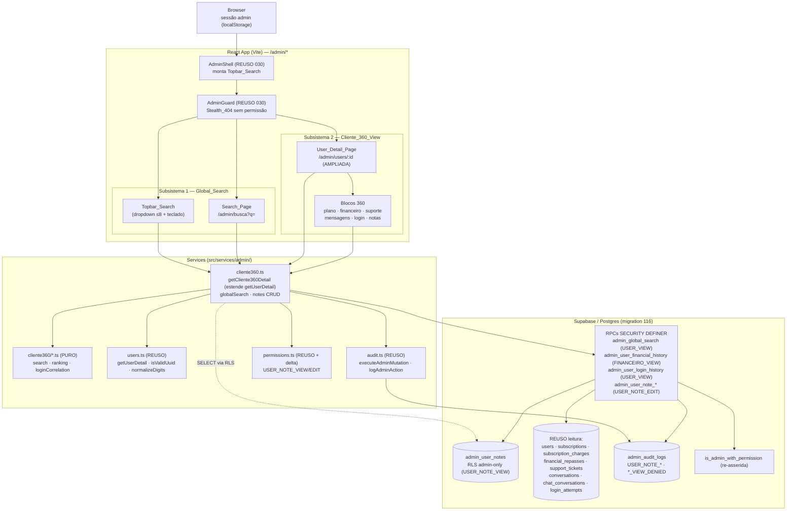
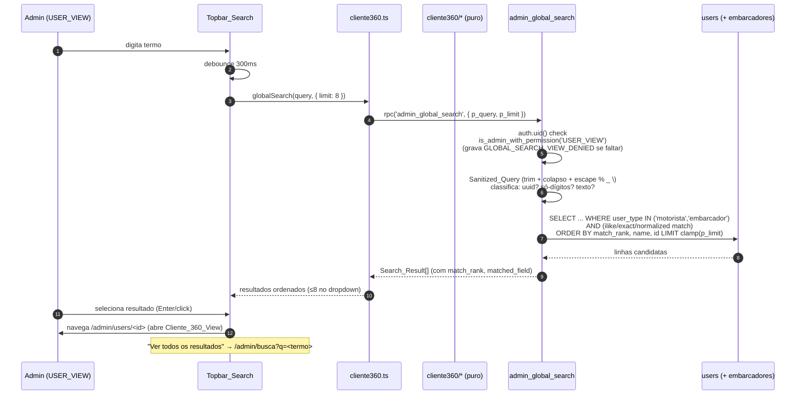
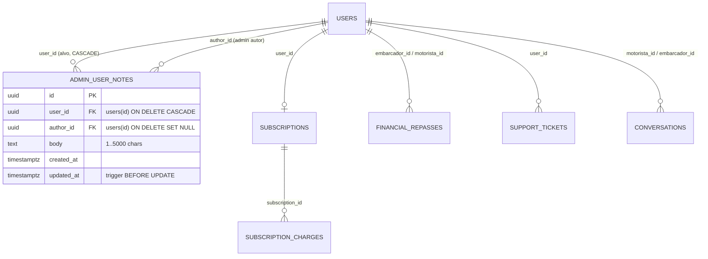

# Design Document — Cliente 360 (`admin-cliente-360`)

## Visão geral (Overview)

O módulo **Cliente 360** entrega duas capacidades complementares ao painel admin do FreteGO,
montadas **por cima** do que já está em produção, sem recriar nem quebrar módulos existentes:

1. **Pesquisa Global (`Global_Search`)** — uma barra única na barra superior do `AdminShell`
   (`Topbar_Search`) e uma página dedicada `/admin/busca` (`Search_Page`) onde o administrador
   localiza qualquer Cliente por **Nome, E-mail, Telefone, ID ou Empresa**, com resultados
   unificados, ordenação determinística por relevância e navegação direta para o Cliente.
2. **Visão 360 do Cliente (`Cliente_360_View`)** — a rota **já existente** `/admin/users/:id` é
   **ampliada** para consolidar, em uma única tela, todo o histórico do Cliente: dados cadastrais,
   data de cadastro, plano atual, histórico financeiro, histórico de suporte, histórico de
   mensagens, histórico de login e observações internas.

A entrega adere integralmente aos steerings `project-conventions`, `admin-patterns` e
`testing-governance`. Texto e mensagens user-facing em **pt-BR**; action codes, error codes e
identifiers em **inglês** (UPPER_SNAKE). As Correctness Properties do painel são **obrigatórias**
(CP-1..CP-8, sem asterisco); a CP-9 é **opcional** (marcada com `*`).

### O que esta spec NÃO faz (não-objetivos)

- **Não recria** a listagem/busca de usuários de `admin-users` (`listUsers`/`User_Search`): a
  `Global_Search` **complementa**, não substitui.
- **Não recria** os blocos já entregues por `getUserDetail` (`cadastrais`, `documentos`, `fretes`,
  `avaliações`, metadados de `chat`): a `Cliente_360_View` **adiciona** blocos ao mesmo bundle.
- **Não recria** o módulo Financeiro (`admin-financeiro` 037) nem o de assinaturas
  (`assinaturas-pagamento` 055/057/060): **lê** dessas fontes via RPC gated.
- **Não recria** o console de suporte (`suporte-inteligente` 115) nem o hub de notificações
  (`notifications-hub` 041): **lê** `support_tickets`/`support_ticket_messages`.
- **Não inventa** fonte de eventos de login bem-sucedido por Cliente: o histórico de login deriva
  de `login_attempts` (migration 005), baseado em **tentativas**, limitado à janela de retenção
  (~30 dias). A ausência de fonte dedicada é declarada como dependência futura (Requirement 12).
- **Não expõe** conteúdo bruto de mensagens de chat, nem PII em logs, nem `Internal_Note` a
  qualquer superfície acessível ao Cliente.

### Reuso obrigatório (não duplicar, não quebrar)

| Origem | O que reusamos | Como esta spec amplia |
| --- | --- | --- |
| `admin-foundation` (030) + steering `admin-patterns` | `AdminGuard`/`AdminShell`/`AdminSidebar`/`Stealth_404`, `useAdminPermission`, `is_admin_with_permission`, `executeAdminMutation`/`logAdminAction`, versionamento otimista, `_SKIPPED`, RPC security posture, master `Nexus_Vortex99` imutável, degradação parcial | Aplicado sem reinvenção a todas as RPCs/serviços/UI; `Topbar_Search` é montado no `AdminShell`; gating em duas camadas |
| `admin-users` (031) — `getUserDetail`, `UserDetailBundle`, `/admin/users/:id`, helpers puros `isValidUuid`/`normalizeDigits` | `Cliente_360_Service` **estende** `getUserDetail` (mesmo `Promise.allSettled`, mesmo mapa `errors`, mesmo `Source_Block`); reusa `isValidUuid`/`normalizeDigits` em vez de recriar | Adiciona blocos `plano`/`financeiro`/`suporte`/`mensagens`/`login`/`notas`; a página de detalhe ganha os novos componentes de bloco |
| `admin-financeiro` (037) + `assinaturas-pagamento` (055/057/060) | Leituras de `subscriptions`, `subscription_charges`, `financial_repasses`; rótulo de plano em `users.subscription_status`/`is_subscribed`/`trial_ends_at`; padrão `FINANCEIRO_VIEW`/`FINANCEIRO_VIEW_DENIED` | `Financial_History_RPC` lê essas tabelas sob `SECURITY DEFINER` sem afrouxar a RLS delas |
| `notifications-hub` (041) + `suporte-inteligente` (115) | `support_tickets`/`support_ticket_messages`, `Status_Display_Map`, link `/admin/suporte/:id`, gating `SUPORTE_VIEW`/`SUPORTE_REPLY` | Bloco `suporte` agrega tickets do Cliente; bloco `mensagens` agrega metadados (sem conteúdo) |
| chat de frete `conversations`/`messages` (008) e chat de suporte `chat_conversations`/`chat_messages` | Metadados de conversa (contagem, datas) | Bloco `mensagens` unifica ambas as fontes, sem expor conteúdo |
| `login_attempts` (005) | Colunas `phone`/`ip_address`/`user_agent`/`success`/`failure_reason`/`created_at`; RLS service-role | `Login_History_RPC` correlaciona por telefone normalizado sob `SECURITY DEFINER` |
| `permissions.ts` (030) | `ADMIN_ACTIONS`/`Permission_Matrix`/`ADMIN_DENY`/`*_PERMS` | Acrescenta `USER_NOTE_VIEW`/`USER_NOTE_EDIT` (só SUPER_ADMIN + ADMIN) |
| helpers de teste `src/__tests__/_helpers/` | `generators.ts` (`validPhone`/`validEmail`/`validCpf`/`uuidLike`/`safeText`), `authAssertions.ts` (`expectPermissionDenied`), `logAssertions.ts` (`expectNoSecrets`) | Reusados nos property tests; nunca reimplementados |

### Entrega completa

- **Migration `116_admin_cliente_360.sql`** (idempotente, `BEGIN; ... COMMIT;`, `DO $check$`
  defensivo, bloco `-- VERIFY`) + par documentado `116_admin_cliente_360_rollback.sql`
  (não auto-aplicado). Cria a tabela `admin_user_notes`, suas policies RLS, re-assere
  `is_admin_with_permission` (preservando grants anteriores e reconhecendo as ações novas) e as
  RPCs `admin_global_search`, `admin_user_financial_history`, `admin_user_login_history`,
  `admin_user_note_create`/`_update`/`_delete`. 115/115b pertencem a `suporte-inteligente`;
  117/118 ficam reservados às próximas specs. Eventual segunda migration usaria `116b_...`.
- **Service** `src/services/admin/cliente360.ts` (`Cliente_360_Service` + wrappers de busca e de
  CRUD de notas) e **funções puras** em `src/services/admin/cliente360/` (`search.ts`,
  `ranking.ts`, `loginCorrelation.ts`) — alvo das Correctness Properties.
- **UI**: `Topbar_Search` no `AdminShell`, página `/admin/busca` (`Search_Page`), e componentes de
  bloco da Visão 360 em `src/components/admin/cliente360/`, reusando o layout de detalhe existente.
- **Testes**: unit + property (CP-1..CP-8, CP-9*) em `src/__tests__/admin/cliente-360/`, cenários
  de falha e integração de RLS/SECURITY DEFINER em `tests/`.

## Arquitetura (Architecture)

### Dois subsistemas, mesmas camadas

A spec é composta por dois subsistemas independentes na navegação, mas que compartilham as mesmas
camadas (página → service → RPC/RLS → tabelas) e a mesma postura de segurança. O `Global_Search`
desemboca, ao selecionar um resultado, na `Cliente_360_View`.



### Fluxo canônico — Pesquisa Global (Topbar → resultado → Visão 360)



### Fluxo canônico — Visão 360 com degradação parcial e gating por bloco

```mermaid
sequenceDiagram
    autonumber
    participant U as Admin
    participant Page as User_Detail_Page
    participant Hook as useAdminPermission
    participant Svc as cliente360.ts
    participant Base as getUserDetail (REUSO)
    participant RPCf as admin_user_financial_history
    participant RPCl as admin_user_login_history
    participant Notes as admin_user_notes (RLS)

    U->>Page: GET /admin/users/:id
    Page->>Hook: lê caps (FINANCEIRO_VIEW, SUPORTE_VIEW, USER_NOTE_VIEW, SUPORTE_REPLY)
    Page->>Svc: getCliente360Detail(id, caps)
    Svc->>Base: getUserDetail(id)  (Source_Block = cadastrais)
    alt id inválido / inexistente / user_type='admin'
        Base-->>Svc: throw NOT_FOUND
        Svc-->>Page: NOT_FOUND
        Page->>U: Stealth_404
    else encontrado
        Base-->>Svc: bundle base (cadastrais, documentos, fretes, avaliações, chat)
        par blocos novos (Promise.allSettled, isolados)
            Svc->>Svc: plano (label de users, USER_VIEW)
            Svc->>RPCf: financeiro — só se caps.financeiro
            Svc->>RPCl: login (USER_VIEW)
            Svc->>Svc: suporte — só se caps.suporte
            Svc->>Svc: mensagens (metadados, sem conteúdo)
            Svc->>Notes: notas — só se caps.notas (SELECT via RLS)
        end
        Svc-->>Page: Cliente_360_Bundle (blocos sem permissão OMITIDOS)
        Page->>U: renderiza todos os blocos; erro isolado por bloco com "Tentar novamente"
    end
```

### RLS e gating (matriz de cenários)

| Cenário | Resultado |
| --- | --- |
| Admin sem `USER_VIEW` vê o painel | `AdminShell` **oculta** a `Topbar_Search`; `/admin/busca` e `/admin/users/:id` ⇒ `Stealth_404` |
| Não-admin chama `admin_global_search` via PostgREST | RPC grava `GLOBAL_SEARCH_VIEW_DENIED` e `RAISE permission_denied` (42501) |
| `admin_global_search` retorna `user_type='admin'` | Nunca: o `WHERE` restringe a `{motorista,embarcador}` (CP-2) |
| Admin com `USER_VIEW` mas sem `FINANCEIRO_VIEW` abre a Visão 360 | Bloco `financeiro` **omitido** do bundle (sem PII parcial); RPC self-gate grava `FINANCEIRO_VIEW_DENIED` se chamada direta |
| Admin sem `SUPORTE_VIEW` | Bloco `suporte` **omitido**; demais blocos renderizam |
| Admin sem `USER_NOTE_VIEW` | Bloco `notas` **omitido**; RLS de `admin_user_notes` retorna zero linhas |
| Cliente/`anon`/não-admin lê `admin_user_notes` direto | RLS ⇒ zero linhas (CP-6) |
| Falha de um bloco (timeout) que não é o `Source_Block` | `errors[bloco]` preenchido; UI mostra erro só naquele bloco (CP-4) |
| `auth.uid()` nulo em qualquer RPC | `RAISE permission_denied` antes do check de papel |
| Edição de nota com `expected_updated_at` divergente | `STALE_VERSION` sem mutar (CP-7) |
| Remoção de nota inexistente | `{ skipped: true, reason: 'ALREADY_REMOVED' }` + `USER_NOTE_DELETE_SKIPPED` (CP-7) |
| Nota cujo `user_id` alvo é o Master_Admin | Recusada com a precedência de imutabilidade do projeto |


## Modelo de dados (Data Models) — migration 116

A migration `116_admin_cliente_360.sql` é a **próxima numeração livre** (no disco a maior é 114;
115/115b pertencem a `suporte-inteligente`; 117/118 ficam reservados). É envolvida em
`BEGIN; ... COMMIT;`, **idempotente** (`CREATE TABLE IF NOT EXISTS`, `CREATE INDEX IF NOT EXISTS`,
`CREATE OR REPLACE FUNCTION`, `DROP POLICY IF EXISTS` antes de `CREATE POLICY`), abre com bloco
defensivo `DO $check$` e fecha com bloco `-- VERIFY` comentado. Apenas **uma** tabela nova é criada
(`admin_user_notes`); todas as demais tabelas são **lidas**, nunca reescritas (Requirement 16.8).

### ER (delta)



### 1. Bloco defensivo `DO $check$`

Valida que todas as dependências de leitura/escrita existem antes de qualquer DDL (Requirement 16.3).
Falha com mensagem clara apontando a migration ausente.

```sql
BEGIN;

DO $check$
BEGIN
  -- Fundação (030)
  IF NOT EXISTS (SELECT 1 FROM information_schema.routines
                 WHERE routine_schema='public' AND routine_name='is_admin_with_permission') THEN
    RAISE EXCEPTION 'Migration 030 (admin-foundation) nao aplicada: is_admin_with_permission ausente';
  END IF;
  IF NOT EXISTS (SELECT 1 FROM information_schema.tables
                 WHERE table_schema='public' AND table_name='admin_audit_logs') THEN
    RAISE EXCEPTION 'Migration 030 (admin-foundation) nao aplicada: admin_audit_logs ausente';
  END IF;
  -- users + colunas de assinatura (055)
  IF NOT EXISTS (SELECT 1 FROM information_schema.columns
                 WHERE table_schema='public' AND table_name='users'
                   AND column_name='subscription_status') THEN
    RAISE EXCEPTION 'Migration 055 (assinaturas-pagamento) nao aplicada: users.subscription_status ausente';
  END IF;
  -- Financeiro / assinaturas
  PERFORM 1 FROM information_schema.tables WHERE table_schema='public' AND table_name='subscriptions';
  IF NOT FOUND THEN RAISE EXCEPTION 'Migration 055 nao aplicada: subscriptions ausente'; END IF;
  PERFORM 1 FROM information_schema.tables WHERE table_schema='public' AND table_name='subscription_charges';
  IF NOT FOUND THEN RAISE EXCEPTION 'Migration 055 nao aplicada: subscription_charges ausente'; END IF;
  PERFORM 1 FROM information_schema.tables WHERE table_schema='public' AND table_name='financial_repasses';
  IF NOT FOUND THEN RAISE EXCEPTION 'Migration 037 (admin-financeiro) nao aplicada: financial_repasses ausente'; END IF;
  -- Suporte (041/115)
  PERFORM 1 FROM information_schema.tables WHERE table_schema='public' AND table_name='support_tickets';
  IF NOT FOUND THEN RAISE EXCEPTION 'Migration 041 (notifications-hub) nao aplicada: support_tickets ausente'; END IF;
  -- Chat de frete (008)
  PERFORM 1 FROM information_schema.tables WHERE table_schema='public' AND table_name='conversations';
  IF NOT FOUND THEN RAISE EXCEPTION 'Migration 008 (chat) nao aplicada: conversations ausente'; END IF;
  -- Login attempts (005)
  PERFORM 1 FROM information_schema.tables WHERE table_schema='public' AND table_name='login_attempts';
  IF NOT FOUND THEN RAISE EXCEPTION 'Migration 005 (security-tables) nao aplicada: login_attempts ausente'; END IF;
END
$check$;
```

### 2. Tabela `admin_user_notes` (Requirement 13.1)

```sql
CREATE TABLE IF NOT EXISTS admin_user_notes (
  id          uuid        PRIMARY KEY DEFAULT gen_random_uuid(),
  user_id     uuid        NOT NULL REFERENCES users(id) ON DELETE CASCADE,
  author_id   uuid        NULL     REFERENCES users(id) ON DELETE SET NULL,
  body        text        NOT NULL CHECK (char_length(body) BETWEEN 1 AND 5000),
  created_at  timestamptz NOT NULL DEFAULT NOW(),
  updated_at  timestamptz NOT NULL DEFAULT NOW()
);

CREATE INDEX IF NOT EXISTS idx_admin_user_notes_user_created
  ON admin_user_notes (user_id, created_at DESC);

COMMENT ON TABLE  admin_user_notes            IS 'Observacoes internas do admin sobre um Cliente. NUNCA visiveis ao Cliente (admin-cliente-360 / 116).';
COMMENT ON COLUMN admin_user_notes.user_id    IS 'Cliente alvo. ON DELETE CASCADE: excluir o Cliente remove suas notas.';
COMMENT ON COLUMN admin_user_notes.author_id  IS 'Admin autor. ON DELETE SET NULL: preserva a nota mesmo se o autor for excluido.';
COMMENT ON COLUMN admin_user_notes.body       IS 'Corpo 1..5000 chars (validado tambem na RPC e no frontend).';
```

- **`user_id ON DELETE CASCADE`**: as notas pertencem ao Cliente; excluir o Cliente as remove (não
  há nota órfã sem alvo). **`author_id ON DELETE SET NULL`**: preserva o histórico interno mesmo se
  o admin autor for removido (a nota não some, só perde o vínculo de autoria).
- O `body` tem `CHECK` de tamanho **na tabela** (última linha de defesa), **na RPC** (servidor) e
  **no frontend** (UX) — defesa em profundidade alinhada a `testing-governance`.

#### Trigger `updated_at`

Reusa o padrão de `trigger_set_updated_at()` da fundação quando disponível; o design declara a
função idempotente para não depender de detalhes de outra migration:

```sql
CREATE OR REPLACE FUNCTION admin_user_notes_set_updated_at()
RETURNS trigger
LANGUAGE plpgsql
SET search_path = public
AS $func$
BEGIN
  NEW.updated_at := NOW();
  RETURN NEW;
END;
$func$;

DROP TRIGGER IF EXISTS trg_admin_user_notes_updated_at ON admin_user_notes;
CREATE TRIGGER trg_admin_user_notes_updated_at
  BEFORE UPDATE ON admin_user_notes
  FOR EACH ROW EXECUTE FUNCTION admin_user_notes_set_updated_at();
```

### 3. RLS de `admin_user_notes` — admin-only (Requirements 13.4, 13.5, CP-6)

A política de SELECT exige `is_admin_with_permission('USER_NOTE_VIEW')`. **Nenhuma** policy concede
acesso a `anon`, a usuário comum ou ao próprio Cliente. Mutações diretas via PostgREST são bloqueadas
— toda escrita passa pelas RPCs `SECURITY DEFINER` (que bypassam RLS por design). Isso garante que
um Cliente jamais leia (CP-6) nem escreva notas.

```sql
ALTER TABLE admin_user_notes ENABLE ROW LEVEL SECURITY;

-- SELECT: apenas admin com USER_NOTE_VIEW.
DROP POLICY IF EXISTS admin_user_notes_select ON admin_user_notes;
CREATE POLICY admin_user_notes_select ON admin_user_notes
  FOR SELECT TO authenticated
  USING (is_admin_with_permission('USER_NOTE_VIEW'));

-- INSERT/UPDATE/DELETE diretos bloqueados: somente via RPC SECURITY DEFINER.
DROP POLICY IF EXISTS admin_user_notes_no_direct_write ON admin_user_notes;
CREATE POLICY admin_user_notes_no_direct_write ON admin_user_notes
  FOR ALL TO authenticated
  USING (false) WITH CHECK (false);
```

> **Nota sobre composição de policies.** Em Postgres, múltiplas policies permissivas para o mesmo
> comando são combinadas por `OR`. Para evitar que `admin_user_notes_no_direct_write` (FOR ALL)
> conflite com o SELECT, a política de escrita é declarada como `RESTRICTIVE` na migration real
> (`CREATE POLICY ... AS RESTRICTIVE FOR ALL ... USING (false)`), de modo que SELECT continue regido
> apenas por `admin_user_notes_select` e INSERT/UPDATE/DELETE diretos fiquem sempre negados. As RPCs
> `SECURITY DEFINER` não passam por RLS, então o CRUD legítimo segue funcionando.

### 4. RBAC — ações novas `USER_NOTE_VIEW` / `USER_NOTE_EDIT` (Requirements 13.2, 13.3)

**Frontend (`src/services/admin/permissions.ts`):** acrescentar as duas ações ao enum `ADMIN_ACTIONS`.
**Não** incluí-las em `FINANCEIRO_PERMS`, `SUPORTE_PERMS`, `MODERADOR_PERMS` nem em `ADMIN_DENY`.
Com isso: `SUPER_ADMIN` (wildcard `() => true`) e `ADMIN` (allow-all menos `ADMIN_DENY`) as recebem;
`SUPORTE`/`FINANCEIRO`/`MODERADOR` (allowlists fechadas) as negam por construção (deny-by-default).
`hasPermission` continua retornando `false` para qualquer string fora do enum.

```ts
export const ADMIN_ACTIONS = [
  // ... ações existentes ...
  'MARKETING_VIEW',
  'MARKETING_EDIT',
  // admin-cliente-360 (116): observacoes internas. Concedidas a SUPER_ADMIN
  // (wildcard) e ADMIN (allow-all menos ADMIN_DENY). NAO entram em ADMIN_DENY
  // nem nos *_PERMS de SUPORTE/FINANCEIRO/MODERADOR (negacao por construcao).
  'USER_NOTE_VIEW',
  'USER_NOTE_EDIT',
] as const;
```

**Backend (`is_admin_with_permission`):** a função é **re-asserida** via `CREATE OR REPLACE`,
preservando integralmente o corpo vigente (base 030 + deny-list de marketing/assistant de 048 + o
grant `FAQ_VIEW` que `suporte-inteligente`/115 adiciona ao papel `SUPORTE`). Os action codes
`USER_NOTE_VIEW`/`USER_NOTE_EDIT` **não exigem ramo próprio**: o `ADMIN` os recebe porque não estão
na deny-list, e o `SUPER_ADMIN` pelo wildcard; os três papéis de allowlist fechada não os listam,
logo são negados. A re-asserção torna o grant explícito e auto-documentado, e o `DO $check$` garante
que 115 já rodou (preservando o grant de FAQ).

```sql
CREATE OR REPLACE FUNCTION is_admin_with_permission(p_action text)
RETURNS boolean
LANGUAGE sql STABLE
SECURITY DEFINER
SET search_path = public
AS $func$
  WITH active AS (
    SELECT role FROM admin_roles
    WHERE user_id = auth.uid() AND revoked_at IS NULL
  )
  SELECT EXISTS (
    SELECT 1 FROM active a
    WHERE
      a.role = 'SUPER_ADMIN'
      -- ADMIN: allow-all menos deny-list. USER_NOTE_VIEW/EDIT NAO estao na
      -- deny-list => ADMIN os recebe (Req 13.3). USER_DELETE e gestao de
      -- papeis/assistant permanecem negados.
      OR (a.role = 'ADMIN' AND p_action NOT IN
           ('USER_DELETE','ADMIN_ROLE_GRANT','ADMIN_ROLE_REVOKE',
            'ASSISTANT_VIEW','ASSISTANT_EDIT'))
      OR (a.role = 'FINANCEIRO' AND p_action IN
           ('USER_VIEW','FRETE_VIEW','FINANCEIRO_VIEW','FINANCEIRO_EDIT','AUDIT_VIEW'))
      -- SUPORTE: allowlist + FAQ_VIEW (preservado de 115). NAO inclui USER_NOTE_*.
      OR (a.role = 'SUPORTE' AND p_action IN
           ('USER_VIEW','USER_TOGGLE_ACTIVE','FRETE_VIEW',
            'SUPORTE_VIEW','SUPORTE_REPLY','CRM_VIEW','FAQ_VIEW'))
      OR (a.role = 'MODERADOR' AND p_action IN
           ('USER_VIEW','FRETE_VIEW','FRETE_FORCE_CLOSE',
            'BLACKLIST_VIEW','BLACKLIST_EDIT'))
  );
$func$;
```

> **Decisão.** Não criamos um ramo `OR (a.role IN ('SUPER_ADMIN','ADMIN') AND p_action IN
> ('USER_NOTE_VIEW','USER_NOTE_EDIT'))` porque seria redundante com o wildcard/allow-all e poderia
> mascarar regressões na deny-list. O comportamento desejado (só SUPER_ADMIN + ADMIN) é exatamente o
> que a estrutura atual produz. A CP-8 e os testes de integração de RLS confirmam o grant efetivo.

### 5. Tabelas reusadas (somente leitura) — colunas relevantes

| Tabela (migration) | Colunas lidas | RLS atual | Como esta spec lê |
| --- | --- | --- | --- |
| `users` (base/031/055) | `id, user_type, name, email, phone, cpf, profile_photo_url, subscription_status, is_subscribed, trial_ends_at, created_at, admin_username` | admin via `USER_VIEW` | `getUserDetail` (cadastrais) + select do rótulo de plano |
| `embarcadores` (base) | `cnpj, company_name` | admin via `USER_VIEW` | join em `getUserDetail` e no match de empresa da busca |
| `subscriptions` (055) | `plan, payment_method, status, next_charge_at, grace_ends_at, started_at` | select-own | `admin_user_financial_history` (SECURITY DEFINER) |
| `subscription_charges` (055) | `amount, payment_method, status, period_start, period_end, paid_at, created_at` | select-own | `admin_user_financial_history` |
| `financial_repasses` (037) | `valor_bruto, commission_value, valor_liquido, status, closed_at, paid_at, embarcador_id, motorista_id` | `USING(false)` | `admin_user_financial_history` (único caminho de leitura) |
| `support_tickets` (041) | `id, subject, status, priority, created_at, updated_at, user_id` | owner ou admin `SUPORTE_VIEW` | bloco `suporte` |
| `support_ticket_messages` (041) | `ticket_id, created_at` (apenas contagem) | idem | contagem por ticket no bloco `suporte` |
| `conversations`/`messages` (008) | `id, motorista_id, embarcador_id`; `conversation_id, sender_id, created_at` (metadados) | participantes/admin | bloco `mensagens` (sem `content`) |
| `chat_conversations`/`chat_messages` | `id, user_id`; `created_at, is_admin` (metadados) | admin via `USER_VIEW` | bloco `mensagens` (reusa `fetchChatMetadata`) |
| `login_attempts` (005) | `phone, ip_address, user_agent, success, failure_reason, created_at` | `USING(false)` (service-role) | `admin_user_login_history` (único caminho de leitura) |


## Componentes e interfaces (Components and Interfaces)

### A. RPCs `SECURITY DEFINER` (postura padrão + log negativo)

Todas seguem a RPC Security Posture (`admin-patterns` §10): header `SET search_path = public`;
`auth.uid() IS NULL ⇒ RAISE permission_denied (42501)`; `is_admin_with_permission(...)` com **log
negativo** antes de abortar; validação de input (domínios/ranges/clamp); `REVOKE ALL FROM PUBLIC` +
`GRANT EXECUTE TO authenticated`; nunca expostas a `anon`. O audit **positivo** das mutações é
gravado pela camada TS via `executeAdminMutation`; os `_SKIPPED` gravam o log **dentro** da RPC.

| RPC | Gating | Retorno | Log negativo |
| --- | --- | --- | --- |
| `admin_global_search(p_query text, p_limit int)` | `USER_VIEW` | `jsonb` array de `Search_Result` | `GLOBAL_SEARCH_VIEW_DENIED` |
| `admin_user_financial_history(p_user_id uuid, p_limit int)` | `FINANCEIRO_VIEW` | `jsonb { plan, charges[], repasses[] }` | `FINANCEIRO_VIEW_DENIED` |
| `admin_user_login_history(p_user_id uuid, p_limit int)` | `USER_VIEW` | `jsonb { attempts[], retention_days }` | `USER_VIEW_DENIED` |
| `admin_user_note_create(p_user_id uuid, p_body text)` | `USER_NOTE_EDIT` | `jsonb { id, created_at, updated_at }` | `USER_NOTE_VIEW_DENIED` |
| `admin_user_note_update(p_note_id uuid, p_body text, p_expected_updated_at timestamptz)` | `USER_NOTE_EDIT` | `jsonb { ok, updated_at }` \| `STALE_VERSION` | `USER_NOTE_VIEW_DENIED` |
| `admin_user_note_delete(p_note_id uuid)` | `USER_NOTE_EDIT` | `jsonb { ok }` \| `{ skipped, reason:'ALREADY_REMOVED' }` | `USER_NOTE_VIEW_DENIED` |

> Leitura de notas (lista) **não** tem RPC dedicada: é um `SELECT` direto gated pela policy
> `admin_user_notes_select` (`USER_NOTE_VIEW`), conforme Requirement 13.4/13.6.

#### A.1 `admin_global_search` (Requirements 2, 3, 4)

`Search_Result` = `{ id, user_type, name, email, phone, company_name, matched_field, match_rank }`.
A ordenação total e determinística é garantida **no SQL** (`ORDER BY match_rank, name, id`) e
**replicada** na função pura `compareSearchResults` (para teste e para reordenação no cliente).

```sql
CREATE OR REPLACE FUNCTION admin_global_search(p_query text, p_limit int DEFAULT 20)
RETURNS jsonb
LANGUAGE plpgsql STABLE
SECURITY DEFINER
SET search_path = public
AS $func$
DECLARE
  v_caller   uuid := auth.uid();
  v_raw      text := COALESCE(p_query, '');
  v_norm     text;          -- trim + colapso de espacos
  v_escaped  text;          -- escape de % _ \ para ILIKE
  v_digits   text;          -- somente digitos (telefone/cpf)
  v_is_uuid  boolean := false;
  v_uuid     uuid;
  v_limit    int;
  v_result   jsonb;
BEGIN
  IF v_caller IS NULL THEN
    RAISE EXCEPTION 'permission_denied: missing auth.uid()' USING ERRCODE = '42501';
  END IF;

  IF NOT is_admin_with_permission('USER_VIEW') THEN
    INSERT INTO admin_audit_logs(admin_id, action, target_type, target_id, before_data, after_data)
    VALUES (v_caller, 'GLOBAL_SEARCH_VIEW_DENIED', NULL, NULL, NULL,
            jsonb_build_object('user_id', v_caller, 'reason', 'permission_denied'));
    RAISE EXCEPTION 'permission_denied: USER_VIEW required' USING ERRCODE = '42501';
  END IF;

  -- clamp do limit em [1,50], default 20 quando ausente/fora (Req 2.8)
  v_limit := COALESCE(p_limit, 20);
  IF v_limit < 1 OR v_limit > 50 THEN v_limit := 20; END IF;

  -- Sanitized_Query: trim + colapso de espacos internos (Req 2.2)
  v_norm := regexp_replace(btrim(v_raw), '\s+', ' ', 'g');

  -- deteccao de UUID exato (Req 2.6, 3.1)
  BEGIN
    v_uuid := v_norm::uuid; v_is_uuid := true;
  EXCEPTION WHEN others THEN v_is_uuid := false;
  END;

  v_digits := regexp_replace(v_norm, '\D', '', 'g');

  -- query vazia/curta e nao-UUID => conjunto vazio sem erro (Req 2.3)
  IF NOT v_is_uuid AND char_length(v_norm) < 2 THEN
    RETURN '[]'::jsonb;
  END IF;

  -- escape dos curingas de ILIKE: \ primeiro, depois % e _ (Req 2.2, CP-3)
  v_escaped := replace(replace(replace(v_norm, '\', '\\'), '%', '\%'), '_', '\_');

  WITH base AS (
    SELECT u.id, u.user_type, u.name, u.email, u.phone,
           e.company_name,
           regexp_replace(COALESCE(u.phone,''), '\D', '', 'g') AS phone_digits,
           regexp_replace(COALESCE(u.cpf,''),   '\D', '', 'g') AS cpf_digits
    FROM users u
    LEFT JOIN embarcadores e ON e.user_id = u.id
    WHERE u.user_type IN ('motorista','embarcador')   -- exclui admin (Req 2.7, CP-2)
  ),
  matched AS (
    SELECT b.*,
      -- matched_field e match_rank determinísticos (Req 3.1-3.3)
      CASE
        WHEN v_is_uuid AND b.id = v_uuid                                   THEN 'id'
        WHEN b.email IS NOT NULL AND lower(b.email) = lower(v_norm)        THEN 'email'
        WHEN char_length(v_digits) >= 8 AND b.phone_digits = v_digits      THEN 'phone'
        WHEN b.name ILIKE v_escaped || '%' ESCAPE '\'                      THEN 'name'
        WHEN b.company_name ILIKE v_escaped || '%' ESCAPE '\'              THEN 'company_name'
        WHEN b.name ILIKE '%' || v_escaped || '%' ESCAPE '\'              THEN 'name'
        WHEN b.email ILIKE '%' || v_escaped || '%' ESCAPE '\'            THEN 'email'
        WHEN b.company_name ILIKE '%' || v_escaped || '%' ESCAPE '\'      THEN 'company_name'
        WHEN char_length(v_digits) >= 8
             AND (b.phone_digits ILIKE '%'||v_digits||'%'
                  OR b.cpf_digits ILIKE '%'||v_digits||'%')               THEN 'phone'
        ELSE NULL
      END AS matched_field,
      CASE
        WHEN (v_is_uuid AND b.id = v_uuid)
          OR (b.email IS NOT NULL AND lower(b.email) = lower(v_norm))
          OR (char_length(v_digits) >= 8 AND b.phone_digits = v_digits)   THEN 0
        WHEN b.name ILIKE v_escaped || '%' ESCAPE '\'
          OR b.company_name ILIKE v_escaped || '%' ESCAPE '\'             THEN 1
        ELSE 2
      END AS match_rank
    FROM base b
  )
  SELECT COALESCE(jsonb_agg(to_jsonb(m) - 'phone_digits' - 'cpf_digits'
                            ORDER BY m.match_rank ASC, m.name ASC, m.id ASC), '[]'::jsonb)
  INTO v_result
  FROM (
    SELECT * FROM matched WHERE matched_field IS NOT NULL
    ORDER BY match_rank ASC, name ASC, id ASC
    LIMIT v_limit
  ) m;

  RETURN v_result;
END;
$func$;

REVOKE ALL ON FUNCTION admin_global_search(text, int) FROM PUBLIC;
GRANT EXECUTE ON FUNCTION admin_global_search(text, int) TO authenticated;
```

Notas de design:
- **Ordem total determinística** (Req 3.4, 3.5, CP-1): `match_rank ASC → name ASC → id ASC`. Como
  `id` é único, o desempate é total — a mesma busca sobre os mesmos dados sempre retorna a mesma
  sequência.
- **Sanitização anti-curinga** (Req 2.2, CP-3): `\`, `%` e `_` são escapados e o `ILIKE` usa
  `ESCAPE '\'`. Um termo como `50%` não vira curinga.
- **Privacidade** (Req 4.5): o `Search_Query` bruto **não** é logado; o path negativo grava apenas
  `{ user_id, reason }`. `phone_digits`/`cpf_digits` são colunas de trabalho removidas do JSON final.
- **Telefone/CPF** (Req 2.5): só entram no match quando `v_digits` tem ≥ 8 dígitos.

#### A.2 `admin_user_financial_history` (Requirement 9)

Lê `subscriptions`, `subscription_charges` (do `p_user_id`) e `financial_repasses` (onde
`embarcador_id = p_user_id` **ou** `motorista_id = p_user_id`) sob `SECURITY DEFINER`, **sem**
afrouxar a RLS dessas tabelas para os demais roles. Clampa `p_limit` em intervalo seguro (default 50,
máximo 200). Retorna `{ plan, charges[], repasses[] }`, charges/repasses ordenados por data
decrescente.

```sql
CREATE OR REPLACE FUNCTION admin_user_financial_history(p_user_id uuid, p_limit int DEFAULT 50)
RETURNS jsonb
LANGUAGE plpgsql STABLE
SECURITY DEFINER
SET search_path = public
AS $func$
DECLARE
  v_caller uuid := auth.uid();
  v_limit  int  := LEAST(GREATEST(COALESCE(p_limit, 50), 1), 200);
  v_plan   jsonb;
  v_charges jsonb;
  v_repasses jsonb;
BEGIN
  IF v_caller IS NULL THEN
    RAISE EXCEPTION 'permission_denied: missing auth.uid()' USING ERRCODE = '42501';
  END IF;
  IF NOT is_admin_with_permission('FINANCEIRO_VIEW') THEN
    INSERT INTO admin_audit_logs(admin_id, action, target_type, target_id, before_data, after_data)
    VALUES (v_caller, 'FINANCEIRO_VIEW_DENIED', 'users', p_user_id::text, NULL,
            jsonb_build_object('user_id', v_caller, 'reason', 'permission_denied'));
    RAISE EXCEPTION 'permission_denied: FINANCEIRO_VIEW required' USING ERRCODE = '42501';
  END IF;

  SELECT to_jsonb(s) - 'asaas_customer_id' - 'asaas_subscription_id'
    INTO v_plan
  FROM subscriptions s WHERE s.user_id = p_user_id;

  SELECT COALESCE(jsonb_agg(to_jsonb(c) - 'asaas_payment_id'
                            ORDER BY c.created_at DESC), '[]'::jsonb)
    INTO v_charges
  FROM (SELECT * FROM subscription_charges WHERE user_id = p_user_id
        ORDER BY created_at DESC LIMIT v_limit) c;

  SELECT COALESCE(jsonb_agg(jsonb_build_object(
            'id', r.id, 'valor_bruto', r.valor_bruto, 'commission_value', r.commission_value,
            'valor_liquido', r.valor_liquido, 'status', r.status,
            'closed_at', r.closed_at, 'paid_at', r.paid_at,
            'role', CASE WHEN r.embarcador_id = p_user_id THEN 'embarcador' ELSE 'motorista' END)
            ORDER BY r.closed_at DESC), '[]'::jsonb)
    INTO v_repasses
  FROM (SELECT * FROM financial_repasses
        WHERE embarcador_id = p_user_id OR motorista_id = p_user_id
        ORDER BY closed_at DESC LIMIT v_limit) r;

  RETURN jsonb_build_object('plan', v_plan, 'charges', v_charges, 'repasses', v_repasses);
END;
$func$;

REVOKE ALL ON FUNCTION admin_user_financial_history(uuid, int) FROM PUBLIC;
GRANT EXECUTE ON FUNCTION admin_user_financial_history(uuid, int) TO authenticated;
```

#### A.3 `admin_user_login_history` (Requirement 12, CP-9*)

Correlaciona `login_attempts` pelo **telefone normalizado** (somente dígitos) do Cliente. Como a RLS
de `login_attempts` é `USING(false)` (service-role), só esta RPC `SECURITY DEFINER` consegue lê-la —
sem afrouxar a RLS para ninguém. Retorna estrutura mesmo sem telefone (lista vazia) e informa a
janela de retenção (~30 dias).

```sql
CREATE OR REPLACE FUNCTION admin_user_login_history(p_user_id uuid, p_limit int DEFAULT 50)
RETURNS jsonb
LANGUAGE plpgsql STABLE
SECURITY DEFINER
SET search_path = public
AS $func$
DECLARE
  v_caller uuid := auth.uid();
  v_limit  int  := LEAST(GREATEST(COALESCE(p_limit, 50), 1), 200);
  v_digits text;
  v_attempts jsonb;
BEGIN
  IF v_caller IS NULL THEN
    RAISE EXCEPTION 'permission_denied: missing auth.uid()' USING ERRCODE = '42501';
  END IF;
  IF NOT is_admin_with_permission('USER_VIEW') THEN
    INSERT INTO admin_audit_logs(admin_id, action, target_type, target_id, before_data, after_data)
    VALUES (v_caller, 'USER_VIEW_DENIED', 'users', p_user_id::text, NULL,
            jsonb_build_object('user_id', v_caller, 'reason', 'permission_denied'));
    RAISE EXCEPTION 'permission_denied: USER_VIEW required' USING ERRCODE = '42501';
  END IF;

  SELECT regexp_replace(COALESCE(phone,''), '\D', '', 'g') INTO v_digits
  FROM users WHERE id = p_user_id;

  IF v_digits IS NULL OR char_length(v_digits) = 0 THEN
    RETURN jsonb_build_object('attempts', '[]'::jsonb, 'retention_days', 30, 'has_phone', false);
  END IF;

  SELECT COALESCE(jsonb_agg(jsonb_build_object(
            'created_at', la.created_at, 'success', la.success,
            'failure_reason', la.failure_reason,
            'ip_address', la.ip_address, 'user_agent', la.user_agent)
            ORDER BY la.created_at DESC), '[]'::jsonb)
    INTO v_attempts
  FROM (SELECT * FROM login_attempts
        WHERE regexp_replace(COALESCE(phone,''), '\D', '', 'g') = v_digits
        ORDER BY created_at DESC LIMIT v_limit) la;

  RETURN jsonb_build_object('attempts', v_attempts, 'retention_days', 30, 'has_phone', true);
END;
$func$;

REVOKE ALL ON FUNCTION admin_user_login_history(uuid, int) FROM PUBLIC;
GRANT EXECUTE ON FUNCTION admin_user_login_history(uuid, int) TO authenticated;
```

#### A.4 CRUD de `Internal_Note` (Requirements 13, 14, 15.3, CP-5, CP-7)

Postura comum às três RPCs de mutação: `auth.uid()` → gating `USER_NOTE_EDIT` (com `USER_NOTE_VIEW_DENIED`)
→ **proteção do Master_Admin** (recusa nota cujo `user_id` alvo seja `Nexus_Vortex99`) → validação de
input. A **precedência de `permission_denied`** (CP-5) é estrutural: o check de permissão ocorre
**antes** de qualquer validação de `body`/`expected_updated_at`, então a falta de permissão sempre
vence um input inválido simultâneo.

```sql
-- CREATE (Req 14.2, 14.3, 14.9)
CREATE OR REPLACE FUNCTION admin_user_note_create(p_user_id uuid, p_body text)
RETURNS jsonb
LANGUAGE plpgsql SECURITY DEFINER SET search_path = public
AS $func$
DECLARE
  v_caller uuid := auth.uid();
  v_id uuid; v_now timestamptz;
BEGIN
  IF v_caller IS NULL THEN
    RAISE EXCEPTION 'permission_denied: missing auth.uid()' USING ERRCODE = '42501';
  END IF;
  IF NOT is_admin_with_permission('USER_NOTE_EDIT') THEN          -- precedencia (CP-5)
    INSERT INTO admin_audit_logs(admin_id, action, target_type, target_id, before_data, after_data)
    VALUES (v_caller, 'USER_NOTE_VIEW_DENIED', 'admin_user_notes', p_user_id::text, NULL,
            jsonb_build_object('user_id', v_caller, 'reason', 'permission_denied'));
    RAISE EXCEPTION 'permission_denied: USER_NOTE_EDIT required' USING ERRCODE = '42501';
  END IF;
  -- Master imutavel: nota nao pode ter como alvo o master (Req 14.9)
  IF EXISTS (SELECT 1 FROM users WHERE id = p_user_id AND admin_username = 'Nexus_Vortex99') THEN
    RAISE EXCEPTION 'master_admin_immutable' USING ERRCODE = 'P0001';
  END IF;
  IF p_body IS NULL OR char_length(btrim(p_body)) < 1 OR char_length(p_body) > 5000 THEN
    RAISE EXCEPTION 'invalid_input: body length must be 1..5000' USING ERRCODE = 'P0001';
  END IF;

  INSERT INTO admin_user_notes(user_id, author_id, body)
  VALUES (p_user_id, v_caller, p_body)
  RETURNING id, updated_at INTO v_id, v_now;

  RETURN jsonb_build_object('id', v_id, 'created_at', v_now, 'updated_at', v_now);
END;
$func$;

-- UPDATE (Req 14.4, 14.5: STALE_VERSION)
CREATE OR REPLACE FUNCTION admin_user_note_update(
  p_note_id uuid, p_body text, p_expected_updated_at timestamptz)
RETURNS jsonb
LANGUAGE plpgsql SECURITY DEFINER SET search_path = public
AS $func$
DECLARE
  v_caller uuid := auth.uid();
  v_rows int; v_now timestamptz;
BEGIN
  IF v_caller IS NULL THEN
    RAISE EXCEPTION 'permission_denied: missing auth.uid()' USING ERRCODE = '42501';
  END IF;
  IF NOT is_admin_with_permission('USER_NOTE_EDIT') THEN
    INSERT INTO admin_audit_logs(admin_id, action, target_type, target_id, before_data, after_data)
    VALUES (v_caller, 'USER_NOTE_VIEW_DENIED', 'admin_user_notes', p_note_id::text, NULL,
            jsonb_build_object('user_id', v_caller, 'reason', 'permission_denied'));
    RAISE EXCEPTION 'permission_denied: USER_NOTE_EDIT required' USING ERRCODE = '42501';
  END IF;
  IF p_body IS NULL OR char_length(btrim(p_body)) < 1 OR char_length(p_body) > 5000 THEN
    RAISE EXCEPTION 'invalid_input: body length must be 1..5000' USING ERRCODE = 'P0001';
  END IF;

  UPDATE admin_user_notes
     SET body = p_body  -- updated_at e tocado pelo trigger
   WHERE id = p_note_id
     AND updated_at = p_expected_updated_at
  RETURNING updated_at INTO v_now;
  GET DIAGNOSTICS v_rows = ROW_COUNT;

  IF v_rows = 0 THEN
    -- distingue inexistencia de divergencia de versao
    IF NOT EXISTS (SELECT 1 FROM admin_user_notes WHERE id = p_note_id) THEN
      RAISE EXCEPTION 'not_found' USING ERRCODE = 'P0001';
    END IF;
    RAISE EXCEPTION 'STALE_VERSION' USING ERRCODE = 'P0001';
  END IF;

  RETURN jsonb_build_object('ok', true, 'updated_at', v_now);
END;
$func$;

-- DELETE idempotente (Req 14.6, 14.7, 14.10, CP-7)
CREATE OR REPLACE FUNCTION admin_user_note_delete(p_note_id uuid)
RETURNS jsonb
LANGUAGE plpgsql SECURITY DEFINER SET search_path = public
AS $func$
DECLARE
  v_caller uuid := auth.uid();
  v_rows int;
BEGIN
  IF v_caller IS NULL THEN
    RAISE EXCEPTION 'permission_denied: missing auth.uid()' USING ERRCODE = '42501';
  END IF;
  IF NOT is_admin_with_permission('USER_NOTE_EDIT') THEN
    INSERT INTO admin_audit_logs(admin_id, action, target_type, target_id, before_data, after_data)
    VALUES (v_caller, 'USER_NOTE_VIEW_DENIED', 'admin_user_notes', p_note_id::text, NULL,
            jsonb_build_object('user_id', v_caller, 'reason', 'permission_denied'));
    RAISE EXCEPTION 'permission_denied: USER_NOTE_EDIT required' USING ERRCODE = '42501';
  END IF;

  -- idempotencia EXCLUSIVAMENTE na inexistencia (Req 14.7, 14.10)
  IF NOT EXISTS (SELECT 1 FROM admin_user_notes WHERE id = p_note_id) THEN
    INSERT INTO admin_audit_logs(admin_id, action, target_type, target_id, before_data, after_data)
    VALUES (v_caller, 'USER_NOTE_DELETE_SKIPPED', 'admin_user_notes', p_note_id::text, NULL,
            jsonb_build_object('reason', 'ALREADY_REMOVED'));
    RETURN jsonb_build_object('skipped', true, 'reason', 'ALREADY_REMOVED');
  END IF;

  DELETE FROM admin_user_notes WHERE id = p_note_id;   -- qualquer outro erro propaga normalmente
  GET DIAGNOSTICS v_rows = ROW_COUNT;
  RETURN jsonb_build_object('ok', true, 'deleted', v_rows);
END;
$func$;

REVOKE ALL ON FUNCTION admin_user_note_create(uuid, text)             FROM PUBLIC;
REVOKE ALL ON FUNCTION admin_user_note_update(uuid, text, timestamptz) FROM PUBLIC;
REVOKE ALL ON FUNCTION admin_user_note_delete(uuid)                    FROM PUBLIC;
GRANT EXECUTE ON FUNCTION admin_user_note_create(uuid, text)             TO authenticated;
GRANT EXECUTE ON FUNCTION admin_user_note_update(uuid, text, timestamptz) TO authenticated;
GRANT EXECUTE ON FUNCTION admin_user_note_delete(uuid)                    TO authenticated;
```

> O audit **positivo** (`USER_NOTE_CREATE`/`USER_NOTE_UPDATE`/`USER_NOTE_DELETE`) é gravado pela
> camada TS via `executeAdminMutation` (audit-by-construction); o `USER_NOTE_DELETE_SKIPPED` é
> gravado **dentro** da RPC (não há mutação real), conforme `admin-patterns` §1/§4.

### 6. `-- VERIFY` e rollback

O bloco final `-- VERIFY` (comentado) faz smoke test: confere a tabela, a policy, o trigger e a
existência das 6 funções, e checa o grant efetivo (`SELECT is_admin_with_permission('USER_NOTE_VIEW')`
sob um admin). O par `116_admin_cliente_360_rollback.sql` (documentado, **não** auto-aplicado) faz, na
ordem inversa: `DROP FUNCTION` das 6 RPCs e do trigger, `DROP POLICY`, `DROP TABLE admin_user_notes`,
e re-`CREATE OR REPLACE` de `is_admin_with_permission` para o corpo anterior (sem alteração funcional,
já que o grant é por construção). O rollback **não** toca dados das tabelas reusadas.


### B. `Cliente_360_Service` — estende `getUserDetail` (Requirements 6, 7, 15)

`src/services/admin/cliente360.ts` **não recria** o detalhe: chama `getUserDetail(id)` (de
`admin-users`) como `Source_Block` e **acrescenta** os blocos novos ao bundle, com a mesma mecânica
de degradação parcial (`Promise.allSettled` + mapa `errors`). O `Source_Block` (`cadastrais`) é o
**único** autorizado a lançar `NOT_FOUND` (Req 7.4); os demais blocos, ao falharem, apenas preenchem
`errors[bloco]`.

```ts
import { getUserDetail, type UserDetailBundle, isValidUuid } from './users';
import { supabase } from '../supabase';
import { executeAdminMutation } from './audit';
import { assignMatchRank, compareSearchResults } from './cliente360/ranking';
import { sanitizeQuery, classifyQueryKind } from './cliente360/search';

/** Permissões resolvidas no componente via useAdminPermission e passadas ao service. */
export interface Cliente360Caps {
  financeiro: boolean;   // FINANCEIRO_VIEW
  suporte: boolean;      // SUPORTE_VIEW
  notas: boolean;        // USER_NOTE_VIEW
  suporteReply: boolean; // SUPORTE_REPLY (link "abrir conversa")
}

export interface PlanoLabel {
  subscription_status: string;       // trial|active|past_due|canceled|blocked
  is_subscribed: boolean;
  trial_ends_at: string | null;
  // enriquecido pela Financial_History_RPC quando caps.financeiro:
  plan?: string | null;
  payment_method?: string | null;
  next_charge_at?: string | null;
  grace_ends_at?: string | null;
}

export interface FinancialHistory { plan: unknown; charges: ChargeRow[]; repasses: RepasseRow[]; }
export interface SupportHistory { tickets: SupportTicketMeta[]; }
export interface MessageHistory { frete: ConversationMeta[]; suporteChat: UserChatMetadata[]; }
export interface LoginHistory { attempts: LoginAttemptRow[]; retentionDays: number; hasPhone: boolean; }
export interface InternalNote { id: string; body: string; author_id: string | null; author_name: string | null; created_at: string; updated_at: string; }

/**
 * Bundle 360: estende UserDetailBundle. Blocos gated AUSENTES (undefined)
 * quando o caller nao tem permissao (CP-8: omissao sem PII parcial).
 */
export interface Cliente360Bundle extends UserDetailBundle {
  plano: PlanoLabel | null;
  financeiro?: FinancialHistory;     // omitido sem FINANCEIRO_VIEW
  suporte?: SupportHistory;          // omitido sem SUPORTE_VIEW
  mensagens: MessageHistory | null;  // sempre presente (USER_VIEW); vazio != omitido
  login: LoginHistory | null;        // sempre presente (USER_VIEW)
  notas?: InternalNote[];            // omitido sem USER_NOTE_VIEW
  errors: UserDetailBundle['errors'] &
    Partial<Record<'plano' | 'financeiro' | 'suporte' | 'mensagens' | 'login' | 'notas', string>>;
}

export async function getCliente360Detail(id: string, caps: Cliente360Caps): Promise<Cliente360Bundle> {
  // Source_Block: unica fonte de NOT_FOUND (UUID invalido / inexistente / user_type='admin')
  const base = await getUserDetail(id); // throws NOT_FOUND => pagina renderiza Stealth_404

  const errors: Cliente360Bundle['errors'] = { ...base.errors };

  // Blocos novos, isolados. Os gated so sao SOLICITADOS quando ha permissao (CP-8);
  // as RPCs ainda self-gate server-side (defesa em profundidade).
  const [planoR, finR, supR, msgR, loginR, notasR] = await Promise.allSettled([
    fetchPlanoLabel(id, caps.financeiro),
    caps.financeiro ? fetchFinancialHistory(id) : Promise.resolve(undefined),
    caps.suporte ? fetchSupportHistory(id) : Promise.resolve(undefined),
    fetchMessageHistory(id, base.user.user_type),
    fetchLoginHistory(id),
    caps.notas ? fetchInternalNotes(id) : Promise.resolve(undefined),
  ]);

  const bundle: Cliente360Bundle = { ...base, plano: null, mensagens: null, login: null, errors };
  bind(planoR, (v) => (bundle.plano = v), () => (errors.plano = 'Bloco indisponível.'));
  if (caps.financeiro) bind(finR, (v) => (bundle.financeiro = v), () => (errors.financeiro = 'Bloco indisponível.'));
  if (caps.suporte) bind(supR, (v) => (bundle.suporte = v), () => (errors.suporte = 'Bloco indisponível.'));
  bind(msgR, (v) => (bundle.mensagens = v), () => (errors.mensagens = 'Bloco indisponível.'));
  bind(loginR, (v) => (bundle.login = v), () => (errors.login = 'Bloco indisponível.'));
  if (caps.notas) bind(notasR, (v) => (bundle.notas = v), () => (errors.notas = 'Bloco indisponível.'));
  return bundle;
}
```

- **Gating por bloco** (Req 15.1, CP-8): `financeiro→FINANCEIRO_VIEW`, `suporte→SUPORTE_VIEW`,
  `notas→USER_NOTE_VIEW`; todos exigem `USER_VIEW` (a página já está sob `AdminGuard`+`USER_VIEW`).
  Sem a permissão, o bloco é **omitido** do bundle (chave `undefined`), nunca retornado com PII
  parcial. As RPCs self-gate (Req 9.1, 12.1) — se um bloco gated for solicitado sem permissão (ex:
  caps divergente do servidor), a RPC grava o `*_VIEW_DENIED` e nega.
- **Omissão vs vazio vs erro** (Req 7.6, 7.7): bloco **omitido** = sem permissão (chave ausente);
  bloco **vazio** = presente com lista vazia (estado vazio na UI); bloco em **erro** = `errors[bloco]`
  preenchido (UI mostra só o erro e **suprime** o estado vazio enquanto o erro persistir).
- **Mutações de nota** passam por `executeAdminMutation` (audit-by-construction); o wrapper grava
  `USER_NOTE_CREATE`/`UPDATE`/`DELETE`. O `_SKIPPED` vem do retorno da RPC.

```ts
export async function createNote(userId: string, body: string): Promise<{ id: string; updated_at: string }>;
export async function updateNote(noteId: string, body: string, expectedUpdatedAt: string): Promise<{ updated_at: string }>;
export async function deleteNote(noteId: string): Promise<{ ok: true } | { skipped: true; reason: 'ALREADY_REMOVED' }>;

export async function globalSearch(query: string, opts?: { limit?: number }): Promise<SearchResult[]>;
```

### C. Funções puras testáveis — `src/services/admin/cliente360/` (Requirement 5)

São o **alvo principal** das Correctness Properties. Sem I/O, determinísticas, espelham a lógica do
SQL. Reusam `normalizeDigits`/`isValidUuid` de `admin-users` em vez de recriá-los.

```ts
// search.ts
export type QueryKind = 'empty' | 'uuid' | 'digits' | 'text';

/** trim + colapso de espacos internos. Espelha regexp_replace(btrim(q),'\s+',' ','g'). */
export function normalizeQuery(raw: string): string;

/** Escapa \ % _ para uso seguro em ILIKE (\ primeiro). Espelha o escape do SQL. (CP-3) */
export function escapeIlike(s: string): string;

/** trim + colapso + escape, em um passo (Sanitized_Query). */
export function sanitizeQuery(raw: string): { normalized: string; escaped: string; digits: string };

/** Classifica o termo: vazio/curto, UUID exato, só-dígitos(>=8) ou texto. (Req 2.3, 2.5, 2.6) */
export function classifyQueryKind(normalized: string): QueryKind;

// ranking.ts
export interface SearchCandidate {
  id: string; user_type: 'motorista' | 'embarcador';
  name: string; email: string | null; phone: string | null;
  company_name: string | null; cpf: string | null;
}
export interface SearchResult extends Omit<SearchCandidate, 'cpf'> {
  matched_field: 'id' | 'email' | 'phone' | 'name' | 'company_name';
  match_rank: 0 | 1 | 2;
}

/** Atribui matched_field + match_rank determinístico a um candidato. null se não casa. (Req 3.1-3.3) */
export function assignMatchRank(cand: SearchCandidate, sanitized: ReturnType<typeof sanitizeQuery>, kind: QueryKind): SearchResult | null;

/** Comparador de ordenação TOTAL: match_rank ASC → name ASC → id ASC. (Req 3.4, CP-1) */
export function compareSearchResults(a: SearchResult, b: SearchResult): number;

/** Pipeline puro completo (usado no teste e como fallback de reordenação no cliente). */
export function runSearch(candidates: SearchCandidate[], rawQuery: string, limit: number): SearchResult[];

// loginCorrelation.ts
/** Telefone -> somente dígitos, para correlacionar login_attempts. Espelha regexp_replace(\D). (CP-9*) */
export function normalizePhoneForCorrelation(phone: string | null): string;

/** true sse o phone normalizado da tentativa == phone normalizado do Cliente. (CP-9*) */
export function loginAttemptMatchesUser(attemptPhone: string | null, userPhone: string | null): boolean;
```

### D. UI / Componentes (Requirements 1, 5, 6, 8–14, 17)

Padrão **compacto** de `project-conventions`: sem `<h1>` grande; botões `text-xs px-2.5 py-1`;
mobile vira cards single-column; estados de erro por bloco reusam `DashboardBlockError`
(`onRetry={onRefresh}`).

#### D.1 Pesquisa Global

| Componente | Local | Papel |
| --- | --- | --- |
| `TopbarSearch` | `src/components/admin/busca/TopbarSearch.tsx` (montado no `AdminShell`) | Campo na barra superior; **só renderiza** quando `useAdminPermission('USER_VIEW')` (Req 1.1, 1.2); debounce 300ms (Req 2.1); dropdown com ≤8 resultados de maior relevância + ação "Ver todos os resultados" (Req 5.2); navegação por teclado (↑/↓, **Enter** seleciona, **Esc** fecha — Req 5.3); Enter no campo navega a `/admin/busca?q=` (Req 1.8) |
| `SearchResultItem` | `src/components/admin/busca/` | Renderiza nome, tipo, e-mail, telefone, empresa e o `Search_Field` que casou (Req 2.9); link para `/admin/users/<id>` (Req 5.1, 5.4) |
| `SearchPage` | `src/pages/admin/busca/SearchPage.tsx` (rota `/admin/busca`) | `AdminGuard`+`USER_VIEW` ⇒ senão `Stealth_404` (Req 1.4, 1.5); sem `<h1>` (Req 1.7); lê `?q=` e **reexecuta** a busca no load/reload (Req 1.9); estado vazio `Nenhum cliente encontrado.` (Req 2.10) |

#### D.2 Visão 360 (ampliando a `User_Detail_Page` existente)

A página `/admin/users/:id` de `admin-users` é estendida: após os blocos atuais (cadastrais,
documentos, fretes, avaliações, chat) são renderizados os novos. A página usa `useAdminPermission`
para montar `Cliente360Caps` e passar a `getCliente360Detail`.

| Componente | Bloco / Requisito |
| --- | --- |
| `PlanoBlock` | `plano` — rótulo de `users` (Req 8.3); enriquecido com `subscriptions` quando `FINANCEIRO_VIEW` (Req 8.4, 8.5); indica ausência de assinatura paga (Req 8.6). Data de cadastro de `users.created_at` (Req 8.2) |
| `FinanceiroBlock` | `financeiro` — cobranças (`subscription_charges`) e repasses (`financial_repasses`) ordenados por data desc (Req 9.2, 9.3); **oculto por completo** sem `FINANCEIRO_VIEW` (Req 9.4); erro isolado (Req 9.7) |
| `SuporteBlock` | `suporte` — tickets com assunto/status/prioridade/datas + contagem de mensagens + marcador de status do mapeamento de `suporte-inteligente` (Req 10.1, 10.2); link `/admin/suporte/<ticket_id>` (Req 10.4); **oculto** sem `SUPORTE_VIEW` (Req 10.3); vazio `Nenhum atendimento registrado.` (Req 10.5) |
| `MensagensBlock` | `mensagens` — metadados (total, última msg, última resposta de admin) de chat de frete + chat de suporte, **sem conteúdo** (Req 11.2, 11.3); link "abrir conversa" só com `SUPORTE_REPLY` (Req 11.4); **sempre visível** com vazio `Nenhuma conversa registrada.` (Req 11.5) |
| `LoginBlock` | `login` — tentativas com data/resultado/motivo/IP/user-agent desc (Req 12.3); placeholder `Sem telefone cadastrado para correlacionar logins.` sem ocultar a seção (Req 12.5); nota de retenção ~30 dias e base em tentativas (Req 12.6) |
| `NotasBlock` + `NotaEditor` | `notas` — lista de `Internal_Note` (corpo, autor, data) desc com `USER_NOTE_VIEW` (Req 13.6); **oculto** sem `USER_NOTE_VIEW` (Req 13.7); controles criar/editar/remover só com `USER_NOTE_EDIT` (Req 14.1) |

**Validação frontend espelhando o backend** (Req 17.1, 17.2): o `NotaEditor` valida `body` 1–5000
(trim) em pt-BR, inline. Alinhado à governança (`testing-governance`): a UI **pode** manter o botão
de submit habilitado para permitir a tentativa, mas o **envio efetivo ao backend é bloqueado**
enquanto o input for inválido **e** uma mensagem de erro em pt-BR é exibida (ambos). O backend
revalida e rejeita (defesa em profundidade). Em `STALE_VERSION`, toast `Outro admin atualizou.
Recarregando.` + refetch; em skip de remoção, toast neutro `Esta nota já estava removida.`.

**Estados por bloco** (Req 7.3, 7.6, 7.7): cada bloco tem três estados mutuamente exclusivos —
**carregando** (skeleton), **erro** (`DashboardBlockError` com "Tentar novamente", suprimindo o vazio)
e **conteúdo/vazio**. Blocos gated ausentes do bundle simplesmente **não renderizam** (sem placeholder
que revele a existência do dado).


## Correctness Properties (Propriedades de Corretude)

*Uma propriedade é uma característica ou comportamento que deve valer em todas as execuções válidas
do sistema — uma afirmação formal sobre o que o sistema deve fazer. Propriedades são a ponte entre a
especificação legível por humanos e garantias de corretude verificáveis por máquina.*

As propriedades CP-1..CP-8 são **obrigatórias** (sem `*`); a CP-9 é **opcional** (`*`). Cada uma é
implementada por **um** property test fast-check (mínimo 100 iterações) em
`src/__tests__/admin/cliente-360/cp<N>_<nome>.property.test.ts`, reusando os helpers canônicos de
`src/__tests__/_helpers/` (geradores com `fc.constantFrom` para PII — `validPhone`/`validEmail`/
`validCpf`/`uuidLike` — `safeText` para texto, **nunca** `fc.stringOf`; `expectPermissionDenied`;
`expectNoSecrets`). Cada teste é etiquetado:
`// Feature: admin-cliente-360, Property <N>: <texto>`.

### Property 1: Determinismo e ordenação total da busca

*Para toda* lista de candidatos e *todo* `Search_Query`, `runSearch` produz uma sequência cuja ordem
respeita estritamente `match_rank ASC → name ASC → id ASC`, atribui `match_rank` 0 a correspondências
exatas de `id`/`email`/`phone`, 1 a prefixos de `name`/`company_name` e 2 às demais substrings, e
retorna **exatamente a mesma sequência** quando reexecutada ou quando a lista de entrada é permutada
(ordem total e determinística; `id` único garante desempate total).

**Validates: Requirements 2.4, 2.5, 2.6, 3.1, 3.2, 3.3, 3.4, 3.5**

- Geradores: `fc.array` de candidatos com `name`=`safeText(1,40)`, `email`=`validEmail`,
  `phone`=`validPhone`, `id`=`uuidLike`, `company_name` opcional; query derivada de um candidato
  (prefixo/substring/email/uuid) e queries aleatórias.
- Alvo: `cliente360/ranking.ts` (`assignMatchRank`, `compareSearchResults`, `runSearch`).
- Técnica: invariante de ordenação (par a par) + idempotência (`runSearch(x) == runSearch(x)`) +
  invariância a permutação da entrada.

### Property 2: Isolamento da busca (sem admin, sem vazamento sem permissão)

*Para todo* conjunto de dados e *todo* `Search_Query`, nenhum `Search_Result` retornado por
`runSearch`/`admin_global_search` tem `user_type = 'admin'`; e *para todo* caller que não satisfaz
`USER_VIEW` (incluindo qualquer papel e o caso `auth.uid()` nulo), a busca resulta em
`permission_denied` sem emitir nenhum `Search_Result`.

**Validates: Requirements 2.7, 4.1, 4.4, 4.6**

- Geradores: candidatos com `user_type` ∈ `fc.constantFrom('motorista','embarcador','admin')`; papéis
  ∈ `fc.constantFrom('SUPER_ADMIN','ADMIN','SUPORTE','FINANCEIRO','MODERADOR', null)`.
- Alvo: `runSearch` (filtro de `admin`) + camada de autorização do service/RPC com mock.
- Asserções: nenhum resultado `admin`; `expectPermissionDenied` para callers sem `USER_VIEW`.

### Property 3: Sanitização e fronteiras da query

*Para toda* `Search_Query`, a `Sanitized_Query` aplica `trim`, colapsa espaços internos e **escapa**
os curingas de `ILIKE` (`%`, `_`, `\`) de modo que nenhum curinga do usuário atue como curinga; e
*para toda* query cuja forma normalizada tem menos de 2 caracteres e não é um UUID, a busca retorna
um conjunto **vazio sem erro**; e *para todo* `p_limit` (inteiro, ausente ou fora de faixa), o limite
efetivo pertence a `[1, 50]` (padrão 20).

**Validates: Requirements 2.2, 2.3, 2.8**

- Geradores: strings arbitrárias incluindo `%`, `_`, `\`, espaços múltiplos e vazias
  (`fc.string({maxLength:60})`); `p_limit` ∈ `fc.integer()` ∪ `fc.constantFrom(undefined, 0, -5, 999)`.
- Alvo: `cliente360/search.ts` (`normalizeQuery`, `escapeIlike`, `classifyQueryKind`) + clamp de limit.
- Técnica: idempotência do escape; ausência de curinga ativo; fronteira do tamanho; clamp.

### Property 4: Degradação parcial por bloco

*Para toda* combinação de blocos que falham na montagem do `Cliente_360_Bundle`, a falha de qualquer
`Detail_Block` distinto do `Source_Block` (a) **não** derruba os demais blocos, (b) registra
`errors[bloco]` exatamente para os blocos que falharam e (c) faz a UI daquele bloco exibir **apenas**
o erro (suprimindo o estado vazio); e **somente** o `Source_Block` (`cadastrais`) pode propagar
`NOT_FOUND`.

**Validates: Requirements 7.1, 7.2, 7.3, 7.4, 7.6, 7.7, 9.7, 10.6, 11.6, 12.7, 17.3, 17.4**

- Geradores: `fc.record` de flags de falha por bloco (`plano`/`financeiro`/`suporte`/`mensagens`/
  `login`/`notas` → boolean) + flag de falha do `Source_Block`.
- Alvo: `getCliente360Detail` com fetchers mockados (resolve/reject por flag).
- Asserções: blocos não falhos presentes; `errors` == conjunto de falhos; `NOT_FOUND` só quando o
  Source falha; render de bloco (erro XOR vazio).

### Property 5: Precedência de `permission_denied`

*Para toda* RPC desta spec, quando ocorrem **simultaneamente** falta de permissão e erro de validação
de input (ex.: `body` fora de 1–5000, `expected_updated_at` divergente, `p_user_id` ausente), o
resultado é `permission_denied` — a falha de permissão tem precedência sobre a de validação,
independentemente do papel do caller e inclusive com `auth.uid()` nulo.

**Validates: Requirements 1.6, 6.7, 9.1, 12.1, 14.8, 15.3, 15.6**

- Geradores: pares `(temPermissão=false, inputInválido=true)` com `body` ∈ `safeText`/strings
  fora de faixa; papéis variados; `auth.uid()` nulo/presente.
- Alvo: wrappers de RPC do service com mock que simula a ordem servidor (gating antes de validação).
- Asserções: `expectPermissionDenied` mesmo com input inválido presente.

### Property 6: Observações internas nunca expostas a não-admin

*Para toda* leitura de `admin_user_notes` por um caller que seja `anon`, `authenticated` não-admin ou
o próprio Cliente alvo, o resultado é **zero linhas** (RLS), e nenhuma `Internal_Note` aparece em
qualquer superfície acessível ao Cliente (rota pública ou autenticada não-admin).

**Validates: Requirements 13.5, 13.8, 15.5**

- Geradores: callers ∈ `fc.constantFrom('anon','cliente_dono','outro_cliente','admin_sem_note_view')`;
  notas geradas com `body`=`safeText(1,5000)`, `user_id`/`author_id`=`uuidLike`.
- Alvo: camada de acesso a notas (model de RLS no teste de service; RLS real no teste de integração
  `tests/`).
- Asserções: zero linhas para todos os callers não-admin-com-`USER_NOTE_VIEW`.

### Property 7: Idempotência e versionamento das notas

*Para toda* `Internal_Note`: editar com `expected_updated_at` divergente retorna `STALE_VERSION` sem
mutar; remover uma nota **inexistente** retorna `{ skipped: true, reason: 'ALREADY_REMOVED' }` sem
mutar (e grava `USER_NOTE_DELETE_SKIPPED`), enquanto **qualquer outra** condição de erro na remoção
**falha normalmente** (sem tratar como skip); e *para toda* sequência de N remoções da mesma nota
existente, exatamente **1** `USER_NOTE_DELETE` e **N−1** `USER_NOTE_DELETE_SKIPPED` são produzidos.

**Validates: Requirements 14.5, 14.7, 14.10**

- Geradores: N ∈ `fc.integer({min:1,max:8})`; `expected_updated_at` correto vs divergente
  (`fc.date`); condição de erro ∈ `fc.constantFrom('inexistente','erro_db')`.
- Alvo: `deleteNote`/`updateNote` do service com RPC mockada (model-based do contador de logs).
- Asserções: contagem `1` DELETE + `N−1` SKIPPED; `STALE_VERSION` na divergência; erro não-inexistência propaga.

### Property 8: Privacidade por bloco (omissão sem PII parcial)

*Para toda* combinação de permissões do caller, o bloco `financeiro` só compõe o `Cliente_360_Bundle`
quando o caller tem `FINANCEIRO_VIEW`, o `suporte` só com `SUPORTE_VIEW` e o `notas` só com
`USER_NOTE_VIEW`; na ausência da permissão correspondente, o bloco é **omitido** (chave ausente),
**sem** retornar PII parcial daquele bloco; e o grant das ações `USER_NOTE_VIEW`/`USER_NOTE_EDIT` é
verdadeiro **apenas** para `SUPER_ADMIN` e `ADMIN`.

**Validates: Requirements 8.4, 8.5, 9.4, 10.3, 13.2, 13.3, 13.7, 15.1, 15.2**

- Geradores: `fc.record` de caps (`financeiro`/`suporte`/`notas` → boolean); papéis ∈
  `fc.constantFrom` dos 5 papéis para `hasPermission`.
- Alvo: `getCliente360Detail` (composição condicional) + `permissions.ts` (`hasPermission`).
- Asserções: presença do bloco ⇔ permissão; ausência ⇒ chave `undefined` (sem PII); grant de notas
  só para SUPER_ADMIN/ADMIN.

### Property 9*: Correlação de login por telefone (opcional)

*Para todo* Cliente e *toda* tentativa em `login_attempts`, a `Login_History_RPC` inclui a tentativa
**se e somente se** o telefone normalizado (somente dígitos) da tentativa é igual ao telefone
normalizado do Cliente; quando o Cliente não tem telefone, o conjunto de tentativas é vazio.

**Validates: Requirements 12.2**

- Geradores: `phone` do Cliente e das tentativas ∈ `validPhone` ∪ `fc.constantFrom(null,'',' ')`,
  com variações de máscara/formatação do mesmo número.
- Alvo: `cliente360/loginCorrelation.ts` (`normalizePhoneForCorrelation`, `loginAttemptMatchesUser`).
- Asserções: match sse dígitos iguais; vazio sem telefone; invariância a formatação.

> **Reflexão de redundância.** As propriedades foram consolidadas a partir do prework: CP-1 absorve
> matching/rank/ordenação (2.4–2.6, 3.x); CP-2 absorve isolamento de admin + deny (2.7, 4.1/4.4/4.6);
> CP-3 absorve sanitização + fronteiras + clamp (2.2/2.3/2.8); CP-4 absorve toda a degradação parcial
> (7.x + falha de blocos 9.7/10.6/11.6/12.7 + 17.3/17.4); CP-5 unifica precedência de permissão; CP-6
> unifica isolamento de notas; CP-7 unifica idempotência+versionamento; CP-8 unifica privacidade por
> bloco + grant RBAC. A validação de `body` 1–5000 (14.3/17.1/17.2) e o não-vazamento de PII em logs
> (4.5/15.4) **não** viram CP do painel: a primeira é coberta por unit/cenários de falha (validação
> frontend+backend) e a segunda é asserção transversal (`expectNoSecrets`) nos demais testes —
> evitando propriedades redundantes.


## Tratamento de erros (Error Handling)

Toda operação trata o erro de forma segura, registra de forma estruturada (sem PII bruta nem
segredos) e mantém o restante do sistema operável (Requirement 17.3). O service mapeia erros de RPC/
PostgREST para um `Cliente360Error` tipado com `code`, reusando o padrão de `tickets.ts`/`users.ts`
(`mapPostgresError`). Mensagens user-facing em pt-BR; codes em inglês.

| Code | Origem | Mensagem UI (pt-BR) | Tratamento |
| --- | --- | --- | --- |
| `permission_denied` (42501) | RPC (gating ou `auth.uid()` nulo) | Navegação ⇒ `Stealth_404`; bloco gated ⇒ **omitido** | Precedência sobre validação (CP-5); grava `*_VIEW_DENIED` |
| `NOT_FOUND` | `getUserDetail` (Source_Block) | `Stealth_404` | Único bloco que derruba a página (CP-4) |
| `STALE_VERSION` (P0001) | `admin_user_note_update` | `Outro admin atualizou. Recarregando.` + refetch | Não muta; UI relê `updated_at` |
| `ALREADY_REMOVED` (skip) | `admin_user_note_delete` | `Esta nota já estava removida.` (toast neutro) | Não é erro; idempotência só na inexistência (CP-7) |
| `invalid_input` (P0001) | RPCs de nota (`body` 1–5000) | `A observação deve ter entre 1 e 5000 caracteres.` | Frontend bloqueia envio; backend revalida (Req 14.3, 17.2) |
| `master_admin_immutable` (P0001) | RPCs de nota (alvo = master) | `Master_Admin é imutável.` | Recusa antes de qualquer escrita (Req 14.9) |
| `BLOCK_UNAVAILABLE` | bloco != Source_Block | `<DashboardBlockError onRetry={onRefresh} />` no bloco | `errors[bloco]` preenchido; demais blocos seguem (CP-4) |

**Degradação multi-bloco** (Req 17.4): mesmo com várias fontes fora ao mesmo tempo, a
`Cliente_360_View` renderiza os blocos disponíveis e isola os indisponíveis; nunca há falha total da
tela (exceto `NOT_FOUND` no Source_Block, que vira `Stealth_404`).

**Não-vazamento** (Req 4.5, 15.4): nenhum caminho (sucesso ou erro) registra `Search_Query` bruto,
e-mail, telefone, CPF/CNPJ, conteúdo de mensagem ou segredos em logs estruturados, traces ou
`admin_audit_logs`. Os logs negativos gravam apenas `{ user_id, reason }`. Validado por
`expectNoSecrets`.

## Estratégia de testes (Testing Strategy)

PBT **se aplica** a esta feature: o núcleo de busca/ranking/sanitização/correlação são **funções
puras** com espaço de input grande, e as invariantes de degradação/idempotência/privacidade/
precedência são modeláveis. A biblioteca é **fast-check** (já no projeto); **não** se implementa PBT
do zero. Abordagem dupla **unit + property**, com cenários de falha e validação **frontend e backend**.

### Onde cada teste vive

- **Código puro / regras de negócio** → `src/__tests__/admin/cliente-360/` (roda no pre-commit + CI).
  Property tests: `cp<N>_<nome>.property.test.ts`.
- **Integração Supabase / RLS / SECURITY DEFINER / idempotência de migration** → `tests/` (só CI,
  branch Supabase efêmero).

### Property tests (CP-1..CP-8 obrigatórias; CP-9* opcional)

- Mínimo **100 iterações** por property test (randomização).
- Cada teste referencia a propriedade do design: `// Feature: admin-cliente-360, Property <N>: <texto>`.
- Cada CP é **um único** property test. Geradores reusam `_helpers/generators.ts` (PII via
  `fc.constantFrom`: `validPhone`/`validEmail`/`validCpf`; texto via `safeText`; ids via `uuidLike`;
  **nunca** `fc.stringOf`). Asserções de autorização via `expectPermissionDenied`; de não-vazamento
  via `expectNoSecrets`.

| CP | Arquivo | Alvo | Geradores principais |
| --- | --- | --- | --- |
| CP-1 | `cp1_busca_determinismo.property.test.ts` | `ranking.runSearch`/`compareSearchResults` | candidatos (`safeText`,`validEmail`,`validPhone`,`uuidLike`) |
| CP-2 | `cp2_busca_isolamento.property.test.ts` | `runSearch` + autorização | `user_type` e papéis via `fc.constantFrom` |
| CP-3 | `cp3_sanitizacao_fronteiras.property.test.ts` | `search.*` + clamp | strings com `% _ \`, vazias; `p_limit` inteiro/fora |
| CP-4 | `cp4_degradacao_parcial.property.test.ts` | `getCliente360Detail` (fetchers mock) | `fc.record` de flags de falha por bloco |
| CP-5 | `cp5_precedencia_permission_denied.property.test.ts` | wrappers de RPC (mock) | `(semPermissão, inputInválido)` |
| CP-6 | `cp6_notas_isolamento.property.test.ts` | acesso a notas (model RLS) | callers não-admin via `fc.constantFrom` |
| CP-7 | `cp7_notas_idempotencia_versionamento.property.test.ts` | `deleteNote`/`updateNote` (mock) | N remoções; `expected_updated_at` ok/divergente |
| CP-8 | `cp8_privacidade_por_bloco.property.test.ts` | `getCliente360Detail` + `hasPermission` | `fc.record` de caps; 5 papéis |
| CP-9* | `cp9_login_correlacao.property.test.ts` | `loginCorrelation.*` | `validPhone` ∪ `null/''`; variações de máscara |

### Unit tests (exemplos e edge cases)

- **Sanitização**: `normalizeQuery`/`escapeIlike` em casos concretos (`"  a  b "`, `"50%_x\\y"`).
- **Match_Rank**: exemplos de cada rank (id exato, email exato, prefixo, substring).
- **Ordenação**: empates de `match_rank`/`name` resolvidos por `id`.
- **Normalização de telefone**: `(62) 99999-8888` vs `6299998888` casam.
- **Render de blocos**: `PlanoBlock`/`FinanceiroBlock`/`SuporteBlock`/`MensagensBlock`/`LoginBlock`/
  `NotasBlock` em estados carregando/erro/vazio/conteúdo (e omissão sem permissão).
- **Validação do `NotaEditor`**: 1–5000 (trim), só-espaços rejeitado, mensagem pt-BR exibida.

### Cenários de falha (caminhos negativos, limites)

- Query vazia/curta (`<2`, não-UUID) ⇒ `[]` sem erro; query só com curingas ⇒ sem curinga ativo.
- Sem permissão ⇒ `permission_denied` com **precedência** sobre validação simultânea.
- Bloco `financeiro`/`suporte`/`notas` **omitido** sem a permissão respectiva (sem PII parcial).
- `STALE_VERSION` na edição; `ALREADY_REMOVED` **só** na inexistência; outro erro na remoção propaga.
- `NOT_FOUND` **só** no Source_Block (`:id` inválido/`admin`/inexistente ⇒ `Stealth_404`).
- Nota com alvo = Master_Admin ⇒ recusa imutável.

### Integração (`tests/`, branch efêmero)

- **RLS de `admin_user_notes`**: `anon`, cliente dono, outro cliente e admin sem `USER_NOTE_VIEW`
  ⇒ **zero linhas**; admin com `USER_NOTE_VIEW` ⇒ lê; nenhum role escreve direto (só RPC).
- **`Financial_History_RPC`/`Login_History_RPC`** leem sob `SECURITY DEFINER` **sem afrouxar** a RLS
  de `subscriptions`/`subscription_charges`/`financial_repasses`/`login_attempts` para outros roles
  (um cliente continua sem ler dados de outro).
- **Master imutável**: criar nota com `user_id` = master ⇒ recusada.
- **Isolamento entre contas**: busca/financeiro/login de um Cliente nunca retorna dados de outro.
- **Idempotência da migration 116**: aplicar 2× no branch efêmero não erra nem duplica objetos; o
  `DO $check$` falha claramente quando uma dependência está ausente; rollback reverte sem tocar dados.
- **Grant RBAC efetivo**: `is_admin_with_permission('USER_NOTE_VIEW'/'USER_NOTE_EDIT')` verdadeiro só
  para SUPER_ADMIN/ADMIN; falso para SUPORTE/FINANCEIRO/MODERADOR.

### Regression_Suite e cobertura

- Os novos testes entram na `Regression_Suite`; qualquer falha (inclusive flaky que só passou após
  retry) **bloqueia merge e deploy** (`testing-governance`).
- Ao tocar `permissions.ts` (Critical_Module), a cobertura mínima de `tests/coverage.config.ts` é
  mantida; o service `cliente360.ts` e as funções puras entram com cobertura alta por serem alvo das CPs.

## Segurança e observabilidade

- **Gating em duas camadas** (`admin-patterns` §2): UI esconde (não desabilita) Topbar/blocos/controles
  via `useAdminPermission`; as RPCs decidem server-side via `is_admin_with_permission` e gravam log
  negativo (`GLOBAL_SEARCH_VIEW_DENIED`, `FINANCEIRO_VIEW_DENIED`, `USER_VIEW_DENIED`,
  `USER_NOTE_VIEW_DENIED`). O servidor é a autoridade — nunca confiar só no front.
- **Precedência de `permission_denied`** (CP-5): o check de permissão precede toda validação de input
  em todas as RPCs; falta de permissão sempre vence input inválido simultâneo.
- **Privacidade por bloco** (CP-8): blocos `financeiro`/`suporte`/`notas` são **omitidos** do bundle
  sem a permissão respectiva — nunca PII parcial.
- **Notas internas** (CP-6): `admin_user_notes` é admin-only por RLS; **nunca** visível ao Cliente,
  em nenhuma rota pública ou autenticada não-admin; escrita só via RPC `SECURITY DEFINER`.
- **Master_Admin imutável**: nenhuma nota pode ter o master como alvo (recusa com precedência de
  imutabilidade do projeto).
- **Não-vazamento de PII/segredos**: nenhuma camada loga `Search_Query` bruto, e-mail/telefone/CPF/
  CNPJ, conteúdo de mensagem ou segredos; conteúdo de mensagens **nunca** é exposto no bloco
  `mensagens`; validado por `expectNoSecrets`.
- **RPC security posture** (`admin-patterns` §10): `SET search_path = public`, `auth.uid()` checado,
  `is_admin_with_permission` quando aplicável, `REVOKE ALL FROM PUBLIC` + `GRANT EXECUTE TO
  authenticated`, nunca exposta a `anon`. `login_attempts`/`financial_repasses` (RLS `USING(false)`)
  só são lidas pelas RPCs `SECURITY DEFINER` desta spec, sem afrouxar a RLS dessas tabelas.
