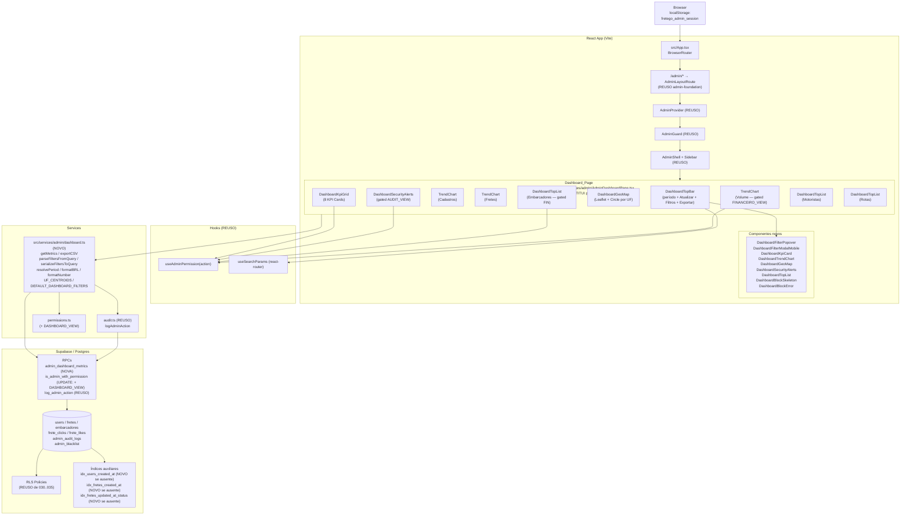
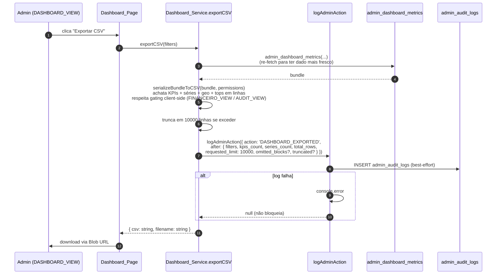

# Design Document: admin-dashboard

## 1. Overview

Esta spec entrega o **módulo de Dashboard Analítico** do painel administrativo do FreteGO, sentado em cima das fundações já em produção (`admin-foundation` em migration 030, `admin-users` em 031, `admin-fretes` em 032, `embarcador-branch` em 033, `admin-blacklist` em 035). O escopo é exclusivamente o ciclo de vida do `AdminDashboardPage` — substituir o placeholder atual por um dashboard analítico real, ponto central de observabilidade do FreteGO.

- Migration `036_admin_dashboard.sql` adicionando: 1 RPC agregadora (`admin_dashboard_metrics`) `STABLE SECURITY DEFINER` que retorna `jsonb` com todos os KPIs, séries, agregações geográficas, alertas de segurança e top listas em uma única chamada; atualização de `is_admin_with_permission` para incluir nova action `DASHBOARD_VIEW`; 3 índices auxiliares (`idx_users_created_at`, `idx_fretes_created_at`, `idx_fretes_updated_at_status`) criados apenas se ausentes.
- Página `/admin` (rota índice) substituindo `src/pages/admin/AdminDashboardPage.tsx` placeholder por `Dashboard_Page` real.
- Novo serviço `src/services/admin/dashboard.ts` centralizando: tipos públicos, helpers puros (URL ↔ filtros, formatadores, CSV), `getMetrics(filters)` (wrapper da RPC com timeout + cache), `exportCSV(filters)` (achata o `Dashboard_Metrics_Bundle` em CSV `BOM UTF-8 + ; + RFC 4180`).
- 1 ação administrativa auditada via `logAdminAction`: `DASHBOARD_EXPORTED`. **Não há mutações de banco** nesta spec — apenas leitura agregada via RPC + log isolado de export.
- 9 componentes novos em `src/components/admin/dashboard/` (5 blocos + 1 popover + 1 modal mobile + 1 chart SVG inline + 1 mapa Leaflet wrapper).
- **Nenhuma nova dependência npm**: gráficos são SVG inline puros; mapa reusa `leaflet` `^1.9.4` + `react-leaflet` `^4.2.1` já em `package.json` (mesmo conjunto usado por `MapaFretes.tsx`).
- Permission_Matrix ganha `DASHBOARD_VIEW` (SUPER_ADMIN, ADMIN, SUPORTE, FINANCEIRO; MODERADOR negado). Blocos sensíveis (volume, top embarcadores) gated por `FINANCEIRO_VIEW` adicional. Alertas de segurança gated por `AUDIT_VIEW`. **Gating é aplicado server-side** na própria RPC (sub-objetos retornam `null` quando ausente), em adição ao gating de UI.

A spec **não** entrega:

- Realtime updates (pull-only com botão `Atualizar`).
- Alertas configuráveis com thresholds (apenas leitura agregada).
- Drill-down profundo dentro do dashboard (cliques em KPIs apenas navegam para módulos correspondentes).
- Granularidade hora/minuto (mínimo é dia).
- Gráficos comparativos multi-período arbitrários (apenas `período atual` vs. `período anterior` automaticamente derivado).
- Export em PDF (apenas CSV).
- I18n (strings hardcoded em pt-BR).
- Bibliotecas de gráficos externas (recharts/visx/chart.js absentes do projeto e não introduzidas).

### 1.1 Dependências de specs anteriores

| Dependência | Origem | Como reaproveitamos |
|---|---|---|
| `AdminProvider` / `AdminGuard` / `AdminLayoutRoute` | `admin-foundation` (030) | Wrapping da rota `/admin` (índice) sem alteração |
| `AdminShell` / `AdminSidebar` | `admin-foundation` | Item "Dashboard" já presente no sidebar |
| `Permission_Matrix` / `hasPermissionForRoles` | `permissions.ts` | Visibilidade de blocos e gating de export |
| `executeAdminMutation` / `logAdminAction` | `audit.ts` | `logAdminAction` para `DASHBOARD_EXPORTED` (sem mutação) |
| `is_admin_with_permission(text)` RPC | Migration 030 | Atualizada em 036 para incluir `DASHBOARD_VIEW` |
| `Stealth404` | `admin-foundation` | Acesso sem permissão |
| `useAdminPermission(action)` | `useAdminPermission.ts` | Decide visibilidade de cada bloco e botão |
| `Leaflet` + `react-leaflet` (`MapContainer`, `TileLayer`, `Circle`, `Popup`) | `package.json` + `MapaFretes.tsx` | Reusados pelo `Dashboard_Geo_Map` sem patch |
| Padrão CSV (BOM UTF-8 + `;` + RFC 4180, truncamento 10000) | `admin-users`, `admin-blacklist` | Reusado em `exportCSV` |
| Padrão de degradação parcial (`Promise.allSettled` + erros isolados por bloco) | `getUserDetail`, `getBlacklistDetail` | Reusado em `Dashboard_Page` para sub-blocos |
| Padrão compacto pós-cleanup (sem `<h1>`, popover de filtros, `text-xs px-2.5 py-1`) | `UsersListPage`, `FretesListPage`, `BlacklistListPage` | Reusado integralmente |
| `users.user_type` / `users.is_active` / `users.created_at` | Schema base (001) | Lidos pela RPC para KPIs e séries |
| `embarcadores.branch_state` | `embarcador-branch` (033) | Filtro de UF e geo agregado para embarcadores |
| `fretes.status` / `fretes.value` / `fretes.origin` / `fretes.destination` | Schema base (001) | Agregações de fretes, volume e top rotas |
| `frete_clicks` / `frete_likes` | Migrations 001 / 021 | Top motoristas por interações |
| `admin_audit_logs.action` / `created_at` / `target_type` / `target_id` | `admin-foundation` (030) | KPIs de logins admin, alertas de segurança, lista de alertas recentes |

### 1.2 Não-objetivos

- **Mutação de dados via dashboard**. Apenas leitura agregada + 1 log de export. Qualquer ação corretiva requer navegar para módulo específico.
- **Cache server-side ou materialized view**. A RPC computa em tempo real a cada chamada; o cache é client-side via `useMemo` por chave de filtros. Caso a volume/latência justifique no futuro, materialized views com `REFRESH MATERIALIZED VIEW CONCURRENTLY` periódico viram spec independente.
- **Realtime subscriptions** em métricas. Pull-only.
- **Métricas históricas além de 365 dias**. Limite server-side; UI bloqueia antes.
- **Análise preditiva / forecasting**. Apenas agregação descritiva no período.
- **Comparações multi-período arbitrárias**. Apenas atual vs. anterior derivado.
- **PDF/Excel export**. Apenas CSV.
- **Gráficos interativos avançados** (zoom, brush, anotações). Linha + área simples, hover com tooltip.
- **Reuso direto de `MapaFretes.tsx`**. Aquele componente é otimizado para listagem de fretes individuais com pins. O `Dashboard_Geo_Map` agrega por estado com círculos proporcionais — design diferente. Compartilham apenas `MapContainer`/`TileLayer` da `react-leaflet`.

### 1.3 Princípios arquiteturais

- **Audit-by-construction**, restrita a export. Toda mutação admin do FreteGO passa por `executeAdminMutation`. Esta spec não tem mutações de banco; o único side-effect rastreado é o download de CSV, gravado via `logAdminAction({ action: 'DASHBOARD_EXPORTED', after: {...} })` antes de retornar o CSV. Erro no log NÃO bloqueia o download (best-effort com `console.error`).
- **Gating em duas camadas**. UI esconde blocos via `useAdminPermission`; RPC `admin_dashboard_metrics` valida `is_admin_with_permission('DASHBOARD_VIEW')` server-side e retorna `null` em sub-objetos sensíveis quando o admin não tem `FINANCEIRO_VIEW` ou `AUDIT_VIEW`. Defesa em profundidade: mesmo que a UI seja contornada via DevTools, a RPC não vaza dados financeiros para SUPORTE.
- **Audit log de bypass**. Tentativa de chamar a RPC sem `DASHBOARD_VIEW` (ex: SUPORTE com `userType=embarcador` mas tentando `volume`) **não** levanta erro — sub-objeto vem `null` silenciosamente. Tentativa direta sem `DASHBOARD_VIEW` levanta `permission_denied` E grava log `DASHBOARD_VIEW_DENIED` com `before=NULL, after={ user_id, reason }`.
- **Degradação parcial**. Cada bloco do `Dashboard_Page` lê seu sub-objeto do `Dashboard_Metrics_Bundle`. Se um sub-objeto vier `null` ou ausente, apenas aquele bloco renderiza `Dashboard_Block_Error` — os demais continuam normalmente. CP-2 cobre formalmente.
- **Determinismo**. Para o mesmo input `(p_from, p_to, p_user_type, p_uf)` E o mesmo estado de banco, a RPC retorna **sempre** o mesmo `jsonb`. CP-1 cobre formalmente. Não há randomização, não há ordem instável (todos os `ORDER BY` incluem tiebreaker por `id`).
- **Período fechado-fechado**. `from <= created_at <= to` em todas as agregações. Bordas inclusivas para evitar discrepância entre dias.
- **Zero-fill obrigatório nas séries**. Quando o período tem `N` dias, cada série temporal retorna **exatamente** `N` pontos, com `value=0` em dias sem dados. RPC usa `generate_series(p_from::date, p_to::date, '1 day')` LEFT JOIN com agregações. Garante alinhamento entre séries multi-line e tabela alternativa.
- **Sem dependências novas**. Gráficos SVG inline (≈80 linhas TSX por chart) e mapa via `react-leaflet` já presente. `package.json` permanece igual.
- **Padrão compacto pós-cleanup**. SEM `<h1>` grande no topo; filtros em popover via botão de ícone (`SlidersHorizontal`); botões `text-xs px-2.5 py-1`.

## 2. Architecture & Data Flow

### 2.1 Diagrama de alto nível



### 2.2 Fluxo canônico de carga (admin abre `/admin`)

```mermaid
sequenceDiagram
    autonumber
    participant Admin as Admin (DASHBOARD_VIEW)
    participant Page as Dashboard_Page
    participant Cache as cache useMemo<br/>(client-side)
    participant Svc as Dashboard_Service.getMetrics
    participant RPC as admin_dashboard_metrics<br/>(STABLE SECURITY DEFINER)
    participant Audit as admin_audit_logs

    Admin->>Page: navega /admin
    Page->>Page: lê URL → parseFiltersFromQuery → filters atuais<br/>(default: period='7d', userType='all', uf=null)
    Page->>Page: renderiza DashboardSkeleton em todos os blocos<br/>(aria-busy=true, aria-live=polite)
    Page->>Cache: lookup JSON.stringify(filters)
    alt cache hit
        Cache-->>Page: bundle (sem RPC)
        Page->>Page: renderiza blocos com dados cached
    else cache miss
        Page->>Svc: getMetrics(filters)
        Svc->>Svc: resolvePeriod(filters) → { p_from, p_to }
        Svc->>RPC: admin_dashboard_metrics(p_from, p_to, p_user_type, p_uf)<br/>timeout 10s no client (Promise.race)
        RPC->>RPC: auth.uid() check
        RPC->>RPC: is_admin_with_permission('DASHBOARD_VIEW') OR raise+log<br/>(DASHBOARD_VIEW_DENIED)
        RPC->>RPC: validar (p_to - p_from) <= 365 days
        RPC->>RPC: validar p_user_type / p_uf
        RPC->>RPC: agregar via CTEs (kpis, series, geo, security_alerts, tops)
        RPC->>RPC: gating server-side<br/>(omite volume/top_embarcadores se !FINANCEIRO_VIEW;<br/>omite logins/alertas se !AUDIT_VIEW)
        RPC-->>Svc: jsonb com Dashboard_Metrics_Bundle
        Svc->>Cache: store bundle
        Svc-->>Page: bundle
        Page->>Page: renderiza cada bloco do bundle
    end
    Note over Page: Cada bloco lê seu sub-objeto.<br/>Sub-objeto null/missing ⇒ DashboardBlockError isolado.<br/>Demais blocos renderizam normalmente.
```

### 2.3 Fluxo canônico de export



### 2.4 RLS e gating

| Cenário | Resultado |
|---|---|
| MODERADOR navega para `/admin` (rota índice) | `AdminGuard` chama `hasPermissionForRoles(['MODERADOR'], 'DASHBOARD_VIEW')` ⇒ `false` ⇒ `Stealth_404`. |
| SUPORTE chama RPC `admin_dashboard_metrics` | RPC valida `is_admin_with_permission('DASHBOARD_VIEW')` ⇒ `true` (SUPORTE tem). Sub-objeto `volume`, `top_embarcadores`, `series.volume_diario` retornam `null` (sem `FINANCEIRO_VIEW`). Demais campos populados. |
| Caller anônimo via service-role bypassando UI tenta `admin_dashboard_metrics(...)` | RPC `auth.uid() IS NULL` ⇒ `RAISE permission_denied`. |
| Admin com `DASHBOARD_VIEW` mas sem `AUDIT_VIEW` chama RPC | Sub-objetos `kpis.logins_admin`, `kpis.alertas_seguranca_24h`, `security_alerts` retornam `null`. Demais populados. |
| FINANCEIRO chama RPC | Tem `DASHBOARD_VIEW` + `FINANCEIRO_VIEW`. Sub-objetos financeiros populados. Sub-objetos de auditoria (`security_alerts`) `null` (FINANCEIRO tem `AUDIT_VIEW`? Sim, conforme `permissions.ts`: `FINANCEIRO_PERMS` inclui `AUDIT_VIEW`). Tudo populado. |
| MODERADOR força chamada direta da RPC via Supabase client (bypass de UI) | RPC valida `is_admin_with_permission('DASHBOARD_VIEW')` ⇒ `false`. Insere log `DASHBOARD_VIEW_DENIED` (admin_id=auth.uid(), action=DASHBOARD_VIEW_DENIED, after={user_id, reason}) e `RAISE permission_denied`. |

## 3. Database Schema & RPC

### 3.1 Índices auxiliares (criados apenas se ausentes)

```sql
CREATE INDEX IF NOT EXISTS idx_users_created_at
  ON users(created_at DESC);

CREATE INDEX IF NOT EXISTS idx_fretes_created_at
  ON fretes(created_at DESC);

CREATE INDEX IF NOT EXISTS idx_fretes_updated_at_status
  ON fretes(updated_at DESC) WHERE status = 'encerrado';
```

> **Decisão:** os 3 índices podem já existir em alguma migration anterior; `IF NOT EXISTS` torna a aplicação idempotente. O `idx_fretes_updated_at_status` é parcial (só fretes encerrados) — reduz tamanho e acelera o KPI "Fretes encerrados" e o cálculo de volume agregado. `idx_admin_audit_logs_created_at` e `idx_admin_audit_logs_action` já existem em 030 e são reusados.

### 3.2 Atualização de `is_admin_with_permission`

```sql
CREATE OR REPLACE FUNCTION is_admin_with_permission(p_action text)
RETURNS boolean
LANGUAGE plpgsql STABLE SECURITY DEFINER
SET search_path = public
AS $func$
DECLARE
  v_user_id uuid := auth.uid();
  v_role text;
BEGIN
  IF v_user_id IS NULL THEN RETURN false; END IF;

  SELECT user_type INTO v_role FROM users WHERE id = v_user_id;
  IF v_role IS NULL THEN RETURN false; END IF;

  -- Mapping atualizado: inclui DASHBOARD_VIEW na matriz
  -- (SUPER_ADMIN/ADMIN/SUPORTE/FINANCEIRO ganham; MODERADOR não)
  RETURN CASE v_role
    WHEN 'SUPER_ADMIN' THEN true
    WHEN 'ADMIN' THEN p_action NOT IN (
      'USER_DELETE','ADMIN_ROLE_GRANT','ADMIN_ROLE_REVOKE'
    )
    WHEN 'FINANCEIRO' THEN p_action IN (
      'USER_VIEW','FRETE_VIEW','FINANCEIRO_VIEW','FINANCEIRO_EDIT',
      'AUDIT_VIEW','DASHBOARD_VIEW'
    )
    WHEN 'SUPORTE' THEN p_action IN (
      'USER_VIEW','USER_TOGGLE_ACTIVE','FRETE_VIEW',
      'SUPORTE_VIEW','SUPORTE_REPLY','CRM_VIEW',
      'BLACKLIST_VIEW','DASHBOARD_VIEW'
    )
    WHEN 'MODERADOR' THEN p_action IN (
      'USER_VIEW','FRETE_VIEW','FRETE_FORCE_CLOSE',
      'BLACKLIST_VIEW','BLACKLIST_MANAGE'
    )
    ELSE false
  END;
END;
$func$;
```

> **Decisão:** mantemos a mesma assinatura e estrutura da função vinda de 030/031/032/035. Apenas `SUPORTE` e `FINANCEIRO` ganham `DASHBOARD_VIEW`. `MODERADOR` continua sem. Idempotente via `CREATE OR REPLACE`.

### 3.3 Schema do retorno da RPC `admin_dashboard_metrics`

```typescript
type Dashboard_Metrics_Bundle = {
  meta: {
    from: string;             // ISO 8601
    to: string;               // ISO 8601
    user_type: 'all' | 'motorista' | 'embarcador';
    uf: string | null;
    previous_from: string;    // ISO 8601 (Dashboard_Period_Previous)
    previous_to: string;      // ISO 8601
    days: number;             // count(generate_series(from::date, to::date))
    generated_at: string;     // NOW() ISO
  };

  kpis: {
    usuarios_ativos:           { value: number, previous_value: number };
    novos_cadastros:           { value: number, previous_value: number };
    fretes_ativos:             { value: number, previous_value: number };
    fretes_postados:           { value: number, previous_value: number };
    fretes_encerrados:         { value: number, previous_value: number };
    taxa_conversao_pct:        { value: number | null, previous_value: number | null };  // null se postados=0
    volume_transacionado:      { value: number, previous_value: number } | null;          // null se !FINANCEIRO_VIEW
    logins_admin:              { value: number, previous_value: number } | null;          // null se !AUDIT_VIEW
    alertas_seguranca_24h:     { value: number, previous_value: number } | null;          // null se !AUDIT_VIEW
  };

  series: {
    cadastros_motoristas:  { date: string, value: number }[];   // length === meta.days
    cadastros_embarcadores:{ date: string, value: number }[];   // length === meta.days
    fretes_postados:       { date: string, value: number }[];   // length === meta.days
    fretes_encerrados:     { date: string, value: number }[];   // length === meta.days
    volume_diario:         { date: string, value: number }[] | null;  // null se !FINANCEIRO_VIEW
  };

  geo: {
    fretes_ativos:    { uf: string, count: number }[];   // 0..27 itens, ordenado por count DESC
    usuarios_ativos:  { uf: string, motoristas: number, embarcadores: number, total: number }[];
  };

  security_alerts: {
    items: {
      action: string,
      count: number,
      last_at: string,        // ISO 8601
      sample_target_id: string | null
    }[]
  } | null;   // null se !AUDIT_VIEW

  top_embarcadores: {
    items: {
      id: string,
      name: string,
      volume_total: number,
      fretes_encerrados: number
    }[]
  } | null;   // null se !FINANCEIRO_VIEW

  top_motoristas: {
    items: {
      id: string,
      name: string,
      cliques: number,
      curtidas: number,
      total: number
    }[]
  };

  top_rotas: {
    items: {
      origin: string,
      destination: string,
      label: string,        // `${origin} → ${destination}`
      count: number
    }[]
  };
};
```

### 3.4 Função `admin_dashboard_metrics` — esqueleto

```sql
CREATE OR REPLACE FUNCTION admin_dashboard_metrics(
  p_from      timestamptz,
  p_to        timestamptz,
  p_user_type text,
  p_uf        text
) RETURNS jsonb
LANGUAGE plpgsql
STABLE
SECURITY DEFINER
SET search_path = public
AS $func$
DECLARE
  v_caller       uuid := auth.uid();
  v_has_fin      boolean;
  v_has_audit    boolean;
  v_prev_from    timestamptz;
  v_prev_to      timestamptz;
  v_days         int;
  v_uf_set       text[] := ARRAY[
    'AC','AL','AP','AM','BA','CE','DF','ES','GO','MA','MT','MS','MG',
    'PA','PB','PR','PE','PI','RJ','RN','RS','RO','RR','SC','SP','SE','TO'
  ];
  v_result       jsonb;
BEGIN
  -- 1) Auth check
  IF v_caller IS NULL THEN
    RAISE EXCEPTION 'permission_denied: missing auth.uid()' USING ERRCODE = '42501';
  END IF;

  -- 2) Permission check + log de denial
  IF NOT is_admin_with_permission('DASHBOARD_VIEW') THEN
    INSERT INTO admin_audit_logs(admin_id, action, target_type, target_id, before_data, after_data)
    VALUES (v_caller, 'DASHBOARD_VIEW_DENIED', NULL, NULL, NULL,
            jsonb_build_object('user_id', v_caller, 'reason', 'permission_denied'));
    RAISE EXCEPTION 'permission_denied: DASHBOARD_VIEW required' USING ERRCODE = '42501';
  END IF;

  -- 3) Validações de input
  IF p_to < p_from THEN
    RAISE EXCEPTION 'INVALID_PERIOD: p_to must be >= p_from' USING ERRCODE = '22023';
  END IF;
  IF (p_to - p_from) > INTERVAL '365 days' THEN
    RAISE EXCEPTION 'INVALID_PERIOD: max 365 days' USING ERRCODE = '22023';
  END IF;
  IF coalesce(p_user_type, 'all') NOT IN ('all','motorista','embarcador') THEN
    RAISE EXCEPTION 'INVALID_USER_TYPE: %', p_user_type USING ERRCODE = '22023';
  END IF;
  IF p_uf IS NOT NULL AND NOT (p_uf = ANY(v_uf_set)) THEN
    RAISE EXCEPTION 'INVALID_UF: %', p_uf USING ERRCODE = '22023';
  END IF;

  -- 4) Resolver gating granular
  v_has_fin   := is_admin_with_permission('FINANCEIRO_VIEW');
  v_has_audit := is_admin_with_permission('AUDIT_VIEW');

  -- 5) Período anterior derivado
  v_prev_to   := p_from;
  v_prev_from := p_from - (p_to - p_from);
  v_days      := GREATEST(1, (p_to::date - p_from::date) + 1);

  -- 6) Agregações via WITH (...) sub-CTEs
  --    [Ver §3.5 para detalhes de cada CTE]
  WITH
    -- KPIs período atual
    kpi_current AS (...),
    -- KPIs período anterior (mesma estrutura, com v_prev_from..v_prev_to)
    kpi_previous AS (...),
    -- Séries diárias com generate_series + LEFT JOIN para zero-fill
    series_cad_mot AS (...),
    series_cad_emb AS (...),
    series_fre_post AS (...),
    series_fre_enc AS (...),
    series_volume AS (...),
    -- Geo agregado por UF
    geo_fretes AS (...),
    geo_usuarios AS (...),
    -- Alertas de segurança (24h fixo, ignora p_from/p_to)
    sec_alerts AS (...),
    -- Top listas
    top_emb AS (...),
    top_mot AS (...),
    top_rot AS (...)
  SELECT jsonb_build_object(
    'meta', jsonb_build_object(
      'from', p_from, 'to', p_to,
      'user_type', coalesce(p_user_type, 'all'),
      'uf', p_uf,
      'previous_from', v_prev_from, 'previous_to', v_prev_to,
      'days', v_days,
      'generated_at', NOW()
    ),
    'kpis', jsonb_build_object(
      'usuarios_ativos',       jsonb_build_object('value', (SELECT usuarios_ativos FROM kpi_current),
                                                  'previous_value', (SELECT usuarios_ativos FROM kpi_previous)),
      'novos_cadastros',       jsonb_build_object('value', (SELECT novos_cadastros FROM kpi_current),
                                                  'previous_value', (SELECT novos_cadastros FROM kpi_previous)),
      'fretes_ativos',         jsonb_build_object('value', (SELECT fretes_ativos FROM kpi_current),
                                                  'previous_value', (SELECT fretes_ativos FROM kpi_previous)),
      'fretes_postados',       jsonb_build_object('value', (SELECT fretes_postados FROM kpi_current),
                                                  'previous_value', (SELECT fretes_postados FROM kpi_previous)),
      'fretes_encerrados',     jsonb_build_object('value', (SELECT fretes_encerrados FROM kpi_current),
                                                  'previous_value', (SELECT fretes_encerrados FROM kpi_previous)),
      'taxa_conversao_pct',    jsonb_build_object('value', (SELECT taxa_conversao FROM kpi_current),
                                                  'previous_value', (SELECT taxa_conversao FROM kpi_previous)),
      'volume_transacionado',  CASE WHEN v_has_fin THEN
        jsonb_build_object('value', (SELECT volume FROM kpi_current),
                           'previous_value', (SELECT volume FROM kpi_previous))
        ELSE 'null'::jsonb END,
      'logins_admin',          CASE WHEN v_has_audit THEN
        jsonb_build_object('value', (SELECT logins FROM kpi_current),
                           'previous_value', (SELECT logins FROM kpi_previous))
        ELSE 'null'::jsonb END,
      'alertas_seguranca_24h', CASE WHEN v_has_audit THEN
        jsonb_build_object('value', (SELECT alertas FROM kpi_current),
                           'previous_value', (SELECT alertas FROM kpi_previous))
        ELSE 'null'::jsonb END
    ),
    'series', jsonb_build_object(
      'cadastros_motoristas',   (SELECT coalesce(jsonb_agg(jsonb_build_object('date', d, 'value', v) ORDER BY d), '[]'::jsonb) FROM series_cad_mot),
      'cadastros_embarcadores', (SELECT coalesce(jsonb_agg(jsonb_build_object('date', d, 'value', v) ORDER BY d), '[]'::jsonb) FROM series_cad_emb),
      'fretes_postados',        (SELECT coalesce(jsonb_agg(jsonb_build_object('date', d, 'value', v) ORDER BY d), '[]'::jsonb) FROM series_fre_post),
      'fretes_encerrados',      (SELECT coalesce(jsonb_agg(jsonb_build_object('date', d, 'value', v) ORDER BY d), '[]'::jsonb) FROM series_fre_enc),
      'volume_diario',          CASE WHEN v_has_fin THEN
        (SELECT coalesce(jsonb_agg(jsonb_build_object('date', d, 'value', v) ORDER BY d), '[]'::jsonb) FROM series_volume)
        ELSE 'null'::jsonb END
    ),
    'geo', jsonb_build_object(
      'fretes_ativos',
        (SELECT coalesce(jsonb_agg(jsonb_build_object('uf', uf, 'count', cnt) ORDER BY cnt DESC, uf), '[]'::jsonb) FROM geo_fretes),
      'usuarios_ativos',
        (SELECT coalesce(jsonb_agg(jsonb_build_object('uf', uf, 'motoristas', m, 'embarcadores', e, 'total', m+e) ORDER BY (m+e) DESC, uf), '[]'::jsonb) FROM geo_usuarios)
    ),
    'security_alerts', CASE WHEN v_has_audit THEN
      jsonb_build_object('items',
        (SELECT coalesce(jsonb_agg(jsonb_build_object('action', action, 'count', cnt, 'last_at', last_at, 'sample_target_id', sample_target_id) ORDER BY last_at DESC), '[]'::jsonb) FROM sec_alerts))
      ELSE 'null'::jsonb END,
    'top_embarcadores', CASE WHEN v_has_fin THEN
      jsonb_build_object('items',
        (SELECT coalesce(jsonb_agg(jsonb_build_object('id', id, 'name', name, 'volume_total', volume_total, 'fretes_encerrados', fretes_count) ORDER BY volume_total DESC, id), '[]'::jsonb) FROM top_emb))
      ELSE 'null'::jsonb END,
    'top_motoristas', jsonb_build_object('items',
      (SELECT coalesce(jsonb_agg(jsonb_build_object('id', id, 'name', name, 'cliques', cliques, 'curtidas', curtidas, 'total', cliques+curtidas) ORDER BY (cliques+curtidas) DESC, id), '[]'::jsonb) FROM top_mot)),
    'top_rotas', jsonb_build_object('items',
      (SELECT coalesce(jsonb_agg(jsonb_build_object('origin', origin, 'destination', destination, 'label', origin || ' → ' || destination, 'count', cnt) ORDER BY cnt DESC, origin, destination), '[]'::jsonb) FROM top_rot))
  ) INTO v_result;

  RETURN v_result;
END;
$func$;

REVOKE ALL ON FUNCTION admin_dashboard_metrics(timestamptz, timestamptz, text, text) FROM PUBLIC;
GRANT EXECUTE ON FUNCTION admin_dashboard_metrics(timestamptz, timestamptz, text, text) TO authenticated;
```

> **Decisão:** uma única RPC consolidando todas as agregações. Tradeoff: query mais longa, mas evita 9+ round-trips e simplifica cache no client. O `STABLE` garante que dentro da mesma transação a função pode ser chamada múltiplas vezes com mesmo input retornando mesmo output (otimização do planner). Tiebreakers em todos os `ORDER BY` (`uf`, `id`, `(origin, destination)`) garantem **determinismo** estrito (CP-1).

### 3.5 Detalhe das CTEs

#### `kpi_current` (e `kpi_previous` por simetria)

```sql
kpi_current AS (
  SELECT
    -- Usuários ativos: sempre conta total atual; UF só se aplica a embarcador
    (SELECT COUNT(*) FROM users u
       LEFT JOIN embarcadores e ON e.id = u.id
       WHERE u.is_active = true
         AND (p_user_type = 'all' OR u.user_type = p_user_type)
         AND (p_uf IS NULL
              OR (u.user_type = 'embarcador' AND e.branch_state = p_uf)
              OR u.user_type = 'motorista'   -- motorista ignora UF
             )
    ) AS usuarios_ativos,

    -- Novos cadastros no período
    (SELECT COUNT(*) FROM users u
       LEFT JOIN embarcadores e ON e.id = u.id
       WHERE u.created_at >= p_from AND u.created_at <= p_to
         AND (p_user_type = 'all' OR u.user_type = p_user_type)
         AND (p_uf IS NULL
              OR (u.user_type = 'embarcador' AND e.branch_state = p_uf)
              OR u.user_type = 'motorista'
             )
    ) AS novos_cadastros,

    -- Fretes ativos (snapshot atual)
    (SELECT COUNT(*) FROM fretes f
       LEFT JOIN embarcadores e ON e.id = f.embarcador_id
       WHERE f.status = 'ativo'
         AND (p_uf IS NULL OR e.branch_state = p_uf)
    ) AS fretes_ativos,

    -- Fretes postados no período
    (SELECT COUNT(*) FROM fretes f
       LEFT JOIN embarcadores e ON e.id = f.embarcador_id
       WHERE f.created_at >= p_from AND f.created_at <= p_to
         AND (p_uf IS NULL OR e.branch_state = p_uf)
    ) AS fretes_postados,

    -- Fretes encerrados no período (filtro por updated_at)
    (SELECT COUNT(*) FROM fretes f
       LEFT JOIN embarcadores e ON e.id = f.embarcador_id
       WHERE f.status = 'encerrado'
         AND f.updated_at >= p_from AND f.updated_at <= p_to
         AND (p_uf IS NULL OR e.branch_state = p_uf)
    ) AS fretes_encerrados,

    -- Taxa de conversão
    (SELECT
       CASE WHEN postados = 0 THEN NULL
            ELSE ROUND((encerrados::numeric / postados::numeric) * 100, 2)
       END
       FROM (
         SELECT
           (SELECT COUNT(*) FROM fretes f LEFT JOIN embarcadores e ON e.id = f.embarcador_id
              WHERE f.created_at >= p_from AND f.created_at <= p_to
                AND (p_uf IS NULL OR e.branch_state = p_uf)) AS postados,
           (SELECT COUNT(*) FROM fretes f LEFT JOIN embarcadores e ON e.id = f.embarcador_id
              WHERE f.status = 'encerrado'
                AND f.updated_at >= p_from AND f.updated_at <= p_to
                AND (p_uf IS NULL OR e.branch_state = p_uf)) AS encerrados
       ) t
    ) AS taxa_conversao,

    -- Volume transacionado (NULL será mascarado no jsonb_build_object com v_has_fin)
    (SELECT COALESCE(SUM(f.value), 0) FROM fretes f
       LEFT JOIN embarcadores e ON e.id = f.embarcador_id
       WHERE f.status = 'encerrado'
         AND f.updated_at >= p_from AND f.updated_at <= p_to
         AND (p_uf IS NULL OR e.branch_state = p_uf)
    ) AS volume,

    -- Logins admin (mascarado por v_has_audit no build final)
    (SELECT COUNT(*) FROM admin_audit_logs
       WHERE action = 'ADMIN_LOGIN_SUCCESS'
         AND created_at >= p_from AND created_at <= p_to
    ) AS logins,

    -- Alertas de segurança 24h FIXO (ignora p_from/p_to)
    (SELECT COUNT(*) FROM admin_audit_logs
       WHERE action IN (
         'ADMIN_LOGIN_FAILURE','BLACKLIST_LOGIN_BLOCKED','BLACKLIST_SIGNUP_BLOCKED',
         'BLACKLIST_EMAIL_BLOCKED','ADMIN_STEALTH_BLOCK','ADMIN_LOCKOUT'
       )
       AND created_at > NOW() - INTERVAL '24 hours'
    ) AS alertas
)
```

`kpi_previous` é estruturalmente idêntico, trocando `p_from`/`p_to` por `v_prev_from`/`v_prev_to` em todos os filtros temporais. **Exceções**:

- `usuarios_ativos`: snapshot atual de `is_active=true`. Para `previous_value`, usa `is_active=true` no momento atual também — não há tabela de histórico. **Tradeoff aceito** (UI exibe variação como `0` quando `value === previous_value`; documentado em §14).
- `fretes_ativos`: mesma lógica acima — sempre snapshot atual.
- `alertas_seguranca_24h`: período anterior é `NOW() - 48h .. NOW() - 24h` (janela de 24h imediatamente anterior).

#### `series_cad_mot`, `series_cad_emb`, `series_fre_post`, `series_fre_enc`, `series_volume` (zero-fill)

```sql
series_cad_mot AS (
  SELECT d::date AS d, COALESCE(c.cnt, 0) AS v
  FROM generate_series(p_from::date, p_to::date, '1 day') d
  LEFT JOIN (
    SELECT date_trunc('day', u.created_at)::date AS bucket, COUNT(*) AS cnt
    FROM users u
    LEFT JOIN embarcadores e ON e.id = u.id
    WHERE u.user_type = 'motorista'
      AND u.created_at >= p_from AND u.created_at <= p_to
      AND (p_user_type IN ('all','motorista'))   -- série some quando filtro=embarcador
    GROUP BY 1
  ) c ON c.bucket = d::date
)
```

Semelhante para `embarcadores`, `fretes_postados`, `fretes_encerrados`, `volume_diario`. **Garante** `length === v_days` em toda série (zero-fill em dias sem dados). Quando `p_user_type = 'embarcador'`, `series_cad_mot` retorna todos zeros (frontend pode esconder a série).

#### `geo_fretes` e `geo_usuarios`

```sql
geo_fretes AS (
  SELECT e.branch_state AS uf, COUNT(*) AS cnt
  FROM fretes f
  JOIN embarcadores e ON e.id = f.embarcador_id
  WHERE f.status = 'ativo'
    AND e.branch_state IS NOT NULL
    AND (p_uf IS NULL OR e.branch_state = p_uf)
  GROUP BY e.branch_state
),

geo_usuarios AS (
  SELECT
    e.branch_state AS uf,
    SUM(CASE WHEN u.user_type = 'motorista' THEN 1 ELSE 0 END) AS m,
    SUM(CASE WHEN u.user_type = 'embarcador' THEN 1 ELSE 0 END) AS e_count
  FROM users u
  LEFT JOIN embarcadores e ON e.id = u.id
  WHERE u.is_active = true
    AND e.branch_state IS NOT NULL
    AND (p_uf IS NULL OR e.branch_state = p_uf)
    AND (p_user_type = 'all' OR u.user_type = p_user_type)
  GROUP BY e.branch_state
)
```

> **Tradeoff:** UF de motorista é derivada da `branch_state` do embarcador associado quando esse motorista tem fretes encerrados. **Sem dados de UF para motoristas independentes**. Documentado em §14.

#### `sec_alerts` (24h fixo)

```sql
sec_alerts AS (
  SELECT
    action,
    COUNT(*) AS cnt,
    MAX(created_at) AS last_at,
    (ARRAY_AGG(target_id ORDER BY created_at DESC))[1] AS sample_target_id
  FROM admin_audit_logs
  WHERE action IN (
    'ADMIN_LOGIN_FAILURE','ADMIN_LOCKOUT','ADMIN_STEALTH_BLOCK',
    'BLACKLIST_LOGIN_BLOCKED','BLACKLIST_SIGNUP_BLOCKED','BLACKLIST_EMAIL_BLOCKED',
    'USER_BANNED'
  )
  AND created_at > NOW() - INTERVAL '24 hours'
  GROUP BY action
  ORDER BY MAX(created_at) DESC
  LIMIT 10
)
```

#### `top_emb`, `top_mot`, `top_rot`

```sql
top_emb AS (
  SELECT
    u.id, u.name,
    COALESCE(SUM(f.value), 0) AS volume_total,
    COUNT(f.id) AS fretes_count
  FROM users u
  JOIN embarcadores e ON e.id = u.id
  LEFT JOIN fretes f ON f.embarcador_id = u.id
    AND f.status = 'encerrado'
    AND f.updated_at >= p_from AND f.updated_at <= p_to
  WHERE u.user_type = 'embarcador'
    AND (p_uf IS NULL OR e.branch_state = p_uf)
  GROUP BY u.id, u.name
  HAVING COUNT(f.id) > 0
  ORDER BY volume_total DESC, u.id
  LIMIT 5
),

top_mot AS (
  SELECT
    u.id, u.name,
    COALESCE(c.cliques, 0) AS cliques,
    COALESCE(l.curtidas, 0) AS curtidas
  FROM users u
  LEFT JOIN (
    SELECT fc.motorista_id, COUNT(*) AS cliques
    FROM frete_clicks fc
    WHERE fc.clicked_at >= p_from AND fc.clicked_at <= p_to
    GROUP BY fc.motorista_id
  ) c ON c.motorista_id = u.id
  LEFT JOIN (
    SELECT fl.motorista_id, COUNT(*) AS curtidas
    FROM frete_likes fl
    WHERE fl.created_at >= p_from AND fl.created_at <= p_to
    GROUP BY fl.motorista_id
  ) l ON l.motorista_id = u.id
  WHERE u.user_type = 'motorista'
    AND (COALESCE(c.cliques,0) + COALESCE(l.curtidas,0)) > 0
  ORDER BY (COALESCE(c.cliques,0) + COALESCE(l.curtidas,0)) DESC, u.id
  LIMIT 5
),

top_rot AS (
  SELECT
    LOWER(TRIM(f.origin))      AS origin,
    LOWER(TRIM(f.destination)) AS destination,
    COUNT(*)                   AS cnt
  FROM fretes f
  LEFT JOIN embarcadores e ON e.id = f.embarcador_id
  WHERE f.created_at >= p_from AND f.created_at <= p_to
    AND f.origin IS NOT NULL AND f.destination IS NOT NULL
    AND (p_uf IS NULL OR e.branch_state = p_uf)
  GROUP BY 1, 2
  ORDER BY cnt DESC, origin, destination
  LIMIT 5
)
```


## 4. Service Layer

### 4.1 Tipos públicos (`src/services/admin/dashboard.ts` — parte 1)

```typescript
import { supabase } from '../supabase';
import { logAdminAction } from './audit';

export type DashboardPeriodPreset = 'today' | '7d' | '30d' | 'custom';
export type DashboardUserType = 'all' | 'motorista' | 'embarcador';

export const UF_BR = [
  'AC','AL','AP','AM','BA','CE','DF','ES','GO','MA','MT','MS','MG',
  'PA','PB','PR','PE','PI','RJ','RN','RS','RO','RR','SC','SP','SE','TO'
] as const;
export type UF = (typeof UF_BR)[number];

export interface DashboardFilters {
  period: DashboardPeriodPreset;
  from: string | null;     // YYYY-MM-DD, só usado quando period='custom'
  to: string | null;       // YYYY-MM-DD
  userType: DashboardUserType;
  uf: UF | null;
}

export const DEFAULT_DASHBOARD_FILTERS: DashboardFilters = {
  period: '7d',
  from: null,
  to: null,
  userType: 'all',
  uf: null,
};

export interface DashboardKPI {
  value: number | null;
  previousValue: number | null;
  deltaPct: number | null;            // null quando previous === 0 (evita divisão por zero)
  deltaDirection: 'up' | 'down' | 'flat';
}

export interface DashboardSeriesPoint {
  date: string;     // YYYY-MM-DD
  value: number;
}

export interface DashboardGeoBucket {
  uf: UF;
  count: number;                                 // para fretes_ativos
  motoristas?: number;                           // só preenchido em geo.usuarios_ativos
  embarcadores?: number;
  total?: number;
}

export interface DashboardSecurityAlert {
  action: string;
  count: number;
  lastAt: string;                                // ISO 8601
  sampleTargetId: string | null;
  label: string;                                 // pt-BR (resolvido client-side)
  severity: 'info' | 'warn' | 'high';
}

export interface DashboardTopListItem {
  id: string;
  name: string;
  primaryValue: number;
  primaryLabel: string;                          // ex: "R$ 45.000,00" ou "12 interações"
  secondary?: string;                            // ex: "5 fretes encerrados"
  link: string;                                  // /admin/users/<id> | /admin/fretes?...
}

export interface DashboardMetricsBundle {
  meta: {
    from: string;
    to: string;
    userType: DashboardUserType;
    uf: UF | null;
    previousFrom: string;
    previousTo: string;
    days: number;
    generatedAt: string;
  };
  kpis: {
    usuariosAtivos: DashboardKPI;
    novosCadastros: DashboardKPI;
    fretesAtivos: DashboardKPI;
    fretesPostados: DashboardKPI;
    fretesEncerrados: DashboardKPI;
    taxaConversaoPct: DashboardKPI;              // value pode ser null
    volumeTransacionado: DashboardKPI | null;    // null quando !FINANCEIRO_VIEW
    loginsAdmin: DashboardKPI | null;            // null quando !AUDIT_VIEW
    alertasSeguranca24h: DashboardKPI | null;    // null quando !AUDIT_VIEW
  };
  series: {
    cadastrosMotoristas: DashboardSeriesPoint[];
    cadastrosEmbarcadores: DashboardSeriesPoint[];
    fretesPostados: DashboardSeriesPoint[];
    fretesEncerrados: DashboardSeriesPoint[];
    volumeDiario: DashboardSeriesPoint[] | null; // null quando !FINANCEIRO_VIEW
  };
  geo: {
    fretesAtivos: DashboardGeoBucket[];
    usuariosAtivos: DashboardGeoBucket[];
  };
  securityAlerts: { items: DashboardSecurityAlert[] } | null;  // null quando !AUDIT_VIEW
  topEmbarcadores: { items: DashboardTopListItem[] } | null;   // null quando !FINANCEIRO_VIEW
  topMotoristas: { items: DashboardTopListItem[] };
  topRotas: { items: DashboardTopListItem[] };

  // Erros de bloco (preenchidos quando RPC retornou parcial OU validação client-side falhou)
  errors: Partial<Record<DashboardBlockKey, string>>;
}

export type DashboardBlockKey =
  | 'kpis'
  | 'cadastros'
  | 'fretes'
  | 'volume'
  | 'geo'
  | 'security_alerts'
  | 'top_embarcadores'
  | 'top_motoristas'
  | 'top_rotas';

export type DashboardErrorCode =
  | 'PERMISSION_DENIED'
  | 'INVALID_PERIOD'
  | 'INVALID_USER_TYPE'
  | 'INVALID_UF'
  | 'TIMEOUT'
  | 'NETWORK'
  | 'UNKNOWN';

export class DashboardServiceError extends Error {
  constructor(
    public code: DashboardErrorCode,
    message: string,
    public extra?: Record<string, unknown>
  ) {
    super(message);
    this.name = 'DashboardServiceError';
  }
}

export const DASHBOARD_ERROR_MESSAGES: Record<DashboardErrorCode, string> = {
  PERMISSION_DENIED: 'Você não tem permissão para acessar o painel.',
  INVALID_PERIOD: 'Período inválido. Selecione no máximo 365 dias.',
  INVALID_USER_TYPE: 'Tipo de usuário inválido.',
  INVALID_UF: 'UF inválida.',
  TIMEOUT: 'A consulta demorou demais. Tente novamente.',
  NETWORK: 'Falha de conexão. Verifique sua internet e tente novamente.',
  UNKNOWN: 'Não foi possível carregar os dados do painel.',
};
```

### 4.2 Helpers puros

```typescript
/**
 * Resolve um Dashboard_Filters em { from: ISO, to: ISO } absoluto.
 * - 'today'  → início do dia atual UTC .. NOW()
 * - '7d'     → NOW() - 7d .. NOW()
 * - '30d'    → NOW() - 30d .. NOW()
 * - 'custom' → from + 'T00:00:00Z' .. to + 'T23:59:59Z'
 */
export function resolvePeriod(f: DashboardFilters, now = new Date()):
  { from: string; to: string } {
  const to = now;
  let from: Date;
  switch (f.period) {
    case 'today': {
      from = new Date(now); from.setUTCHours(0, 0, 0, 0); break;
    }
    case '7d': {
      from = new Date(now.getTime() - 7 * 24 * 3600 * 1000); break;
    }
    case '30d': {
      from = new Date(now.getTime() - 30 * 24 * 3600 * 1000); break;
    }
    case 'custom': {
      if (!f.from || !f.to) throw new DashboardServiceError('INVALID_PERIOD', 'custom requer from/to');
      return {
        from: `${f.from}T00:00:00Z`,
        to: `${f.to}T23:59:59Z`,
      };
    }
  }
  return { from: from.toISOString(), to: to.toISOString() };
}

/**
 * Variação percentual com tratamento de divisão por zero.
 * - previous === 0 && value > 0  → null (UI exibe "Novo")
 * - previous === 0 && value === 0 → null (UI exibe "—")
 * - caso geral → ((value - previous) / previous) * 100, arredondado a 1 decimal
 */
export function computeDelta(value: number, previous: number): {
  deltaPct: number | null;
  deltaDirection: 'up' | 'down' | 'flat';
} {
  if (previous === 0) return { deltaPct: null, deltaDirection: 'flat' };
  const pct = Math.round(((value - previous) / previous) * 1000) / 10;
  return {
    deltaPct: pct,
    deltaDirection: pct > 0.1 ? 'up' : pct < -0.1 ? 'down' : 'flat',
  };
}

export function formatBRL(n: number): string {
  return new Intl.NumberFormat('pt-BR', { style: 'currency', currency: 'BRL' }).format(n);
}

export function formatNumber(n: number): string {
  return new Intl.NumberFormat('pt-BR').format(n);
}

export function formatDate(iso: string): string {
  return new Date(iso).toLocaleDateString('pt-BR', { day: '2-digit', month: '2-digit', year: 'numeric' });
}

/**
 * Filtros ↔ URL params (round-trip: parse(serialize(f)) === f para todo f válido).
 */
export function parseFiltersFromQuery(qs: URLSearchParams): DashboardFilters {
  const period = qs.get('period');
  const from = qs.get('from');
  const to = qs.get('to');
  const userType = qs.get('userType');
  const uf = qs.get('uf');

  const validPeriod: DashboardPeriodPreset =
    period === 'today' || period === '7d' || period === '30d' || period === 'custom'
      ? period : '7d';
  const validUserType: DashboardUserType =
    userType === 'all' || userType === 'motorista' || userType === 'embarcador'
      ? userType : 'all';
  const validUf: UF | null = uf && (UF_BR as readonly string[]).includes(uf) ? (uf as UF) : null;
  const isISODate = (s: string | null) => !!s && /^\d{4}-\d{2}-\d{2}$/.test(s);

  return {
    period: validPeriod,
    from: validPeriod === 'custom' && isISODate(from) ? from : null,
    to: validPeriod === 'custom' && isISODate(to) ? to : null,
    userType: validUserType,
    uf: validUf,
  };
}

export function serializeFiltersToQuery(f: DashboardFilters): URLSearchParams {
  const qs = new URLSearchParams();
  if (f.period !== '7d') qs.set('period', f.period);
  if (f.period === 'custom' && f.from) qs.set('from', f.from);
  if (f.period === 'custom' && f.to) qs.set('to', f.to);
  if (f.userType !== 'all') qs.set('userType', f.userType);
  if (f.uf) qs.set('uf', f.uf);
  return qs;
}

/**
 * Centroides aproximados das 27 UFs (latitude, longitude) — coordenadas
 * estáticas usadas pelo Dashboard_Geo_Map para posicionar Circles.
 */
export const UF_CENTROIDS: Record<UF, [number, number]> = {
  AC: [-9.0238, -70.812],   AL: [-9.5713, -36.782],   AP: [1.4138, -51.7700],
  AM: [-3.4168, -65.8561],  BA: [-12.5797, -41.7007], CE: [-5.4984, -39.3206],
  DF: [-15.8267, -47.9218], ES: [-19.1834, -40.3089], GO: [-15.827, -49.836],
  MA: [-5.4209, -45.4347],  MT: [-12.6819, -56.9211], MS: [-20.7722, -54.7852],
  MG: [-18.5122, -44.555],  PA: [-3.4168, -52.0],     PB: [-7.2399, -36.7819],
  PR: [-24.4842, -51.8149], PE: [-8.8137, -36.9541],  PI: [-7.7183, -42.7289],
  RJ: [-22.9099, -43.2095], RN: [-5.7945, -36.3541],  RS: [-30.0346, -53.2],
  RO: [-10.83, -63.34],     RR: [2.7376, -62.0751],   SC: [-27.2423, -50.2189],
  SP: [-22.19, -48.79],     SE: [-10.5741, -37.3857], TO: [-10.1753, -48.2982],
};

/**
 * Resolve label pt-BR e severidade de cada action de Dashboard_Security_Alert.
 */
export function resolveAlertLabel(action: string): { label: string; severity: 'info' | 'warn' | 'high' } {
  switch (action) {
    case 'ADMIN_LOGIN_FAILURE':       return { label: 'Tentativa de login admin falhou',       severity: 'high' };
    case 'ADMIN_LOCKOUT':             return { label: 'Conta admin bloqueada após tentativas', severity: 'high' };
    case 'ADMIN_STEALTH_BLOCK':       return { label: 'Acesso furtivo bloqueado',              severity: 'warn' };
    case 'BLACKLIST_LOGIN_BLOCKED':   return { label: 'Login bloqueado por blacklist',         severity: 'warn' };
    case 'BLACKLIST_SIGNUP_BLOCKED':  return { label: 'Cadastro bloqueado por blacklist',      severity: 'warn' };
    case 'BLACKLIST_EMAIL_BLOCKED':   return { label: 'E-mail bloqueado por blacklist',        severity: 'info' };
    case 'USER_BANNED':               return { label: 'Usuário banido',                         severity: 'warn' };
    default:                           return { label: action,                                   severity: 'info' };
  }
}
```

### 4.3 `getMetrics(filters)` — wrapper da RPC

```typescript
/**
 * Chamada à RPC admin_dashboard_metrics com timeout 10s + tratamento de erro tipado.
 * Não aplica cache (cache fica no Dashboard_Page via useMemo).
 */
export async function getMetrics(filters: DashboardFilters): Promise<DashboardMetricsBundle> {
  const { from, to } = resolvePeriod(filters);

  const rpcPromise = supabase.rpc('admin_dashboard_metrics', {
    p_from: from,
    p_to: to,
    p_user_type: filters.userType,
    p_uf: filters.uf,
  });

  const timeout = new Promise<never>((_, reject) =>
    setTimeout(() => reject(new DashboardServiceError('TIMEOUT', 'RPC timeout (10s)')), 10_000)
  );

  let raw: unknown;
  try {
    const { data, error } = await Promise.race([rpcPromise, timeout]) as Awaited<typeof rpcPromise>;
    if (error) {
      const code = mapPgErrorToCode(error);
      throw new DashboardServiceError(code, error.message, { error });
    }
    raw = data;
  } catch (err) {
    if (err instanceof DashboardServiceError) throw err;
    throw new DashboardServiceError('NETWORK', (err as Error)?.message ?? 'unknown');
  }

  return adaptBundle(raw as Record<string, unknown>);
}

function mapPgErrorToCode(error: { message: string; code?: string }): DashboardErrorCode {
  const msg = error.message ?? '';
  if (msg.includes('permission_denied'))   return 'PERMISSION_DENIED';
  if (msg.startsWith('INVALID_PERIOD'))    return 'INVALID_PERIOD';
  if (msg.startsWith('INVALID_USER_TYPE')) return 'INVALID_USER_TYPE';
  if (msg.startsWith('INVALID_UF'))        return 'INVALID_UF';
  return 'UNKNOWN';
}

/**
 * Adapta o jsonb da RPC para DashboardMetricsBundle, computando deltaPct/deltaDirection
 * em cada KPI e populando `errors: {}` vazio.
 *
 * Implementa degradação parcial: sub-objeto ausente/null ⇒ entrada em errors[bloco].
 */
function adaptBundle(raw: Record<string, unknown>): DashboardMetricsBundle {
  const errors: DashboardMetricsBundle['errors'] = {};

  const kpiOrError = <T>(key: DashboardBlockKey, value: unknown, build: (v: any) => T): T | null => {
    if (value == null) { errors[key] = 'Bloco indisponível.'; return null; }
    try { return build(value); } catch (e) {
      errors[key] = (e as Error).message; return null;
    }
  };

  const buildKPI = (k: any): DashboardKPI => {
    const value = Number(k.value ?? 0);
    const prev = Number(k.previous_value ?? 0);
    const { deltaPct, deltaDirection } = computeDelta(value, prev);
    return { value, previousValue: prev, deltaPct, deltaDirection };
  };

  const buildSeries = (s: any): DashboardSeriesPoint[] =>
    Array.isArray(s) ? s.map((p) => ({ date: String(p.date), value: Number(p.value) })) : [];

  // ... (segue construindo cada sub-objeto, anotando em errors quando falha)
  // omitido por brevidade — implementação direta seguindo o schema de §3.3.
  return /* DashboardMetricsBundle */ ({} as DashboardMetricsBundle);
}
```

### 4.4 `exportCSV(bundle, filters, perms)`

```typescript
/**
 * Serializa o bundle em CSV padrão admin (BOM UTF-8 + ; + RFC 4180).
 * Trunca em 10000 linhas. Loga DASHBOARD_EXPORTED.
 */
export async function exportCSV(
  filters: DashboardFilters,
  perms: { hasFinanceiro: boolean; hasAudit: boolean }
): Promise<{ csv: string; filename: string; truncated: boolean }> {
  const bundle = await getMetrics(filters);
  const lines: string[][] = [['secao', 'chave', 'valor', 'valor_anterior', 'variacao_pct']];

  // KPIs
  const pushKPI = (key: string, kpi: DashboardKPI | null) => {
    if (!kpi) return;
    lines.push(['KPIs', key, String(kpi.value ?? ''), String(kpi.previousValue ?? ''),
      kpi.deltaPct === null ? '' : String(kpi.deltaPct)]);
  };
  pushKPI('usuarios_ativos',       bundle.kpis.usuariosAtivos);
  pushKPI('novos_cadastros',       bundle.kpis.novosCadastros);
  pushKPI('fretes_ativos',         bundle.kpis.fretesAtivos);
  pushKPI('fretes_postados',       bundle.kpis.fretesPostados);
  pushKPI('fretes_encerrados',     bundle.kpis.fretesEncerrados);
  pushKPI('taxa_conversao_pct',    bundle.kpis.taxaConversaoPct);
  if (perms.hasFinanceiro) pushKPI('volume_transacionado', bundle.kpis.volumeTransacionado);
  if (perms.hasAudit)      pushKPI('logins_admin',         bundle.kpis.loginsAdmin);
  if (perms.hasAudit)      pushKPI('alertas_seguranca_24h',bundle.kpis.alertasSeguranca24h);

  // Series
  const pushSeries = (name: string, s: DashboardSeriesPoint[] | null) => {
    if (!s) return;
    for (const p of s) lines.push(['Series', `${name}:${p.date}`, String(p.value), '', '']);
  };
  pushSeries('cadastros_motoristas',   bundle.series.cadastrosMotoristas);
  pushSeries('cadastros_embarcadores', bundle.series.cadastrosEmbarcadores);
  pushSeries('fretes_postados',        bundle.series.fretesPostados);
  pushSeries('fretes_encerrados',      bundle.series.fretesEncerrados);
  if (perms.hasFinanceiro) pushSeries('volume_diario', bundle.series.volumeDiario);

  // Geo
  for (const g of bundle.geo.fretesAtivos)    lines.push(['Geo', `${g.uf}:fretes_ativos`,   String(g.count), '', '']);
  for (const g of bundle.geo.usuariosAtivos)  lines.push(['Geo', `${g.uf}:usuarios_total`,  String(g.total ?? 0), '', '']);

  // Tops
  if (perms.hasFinanceiro && bundle.topEmbarcadores) {
    for (const i of bundle.topEmbarcadores.items)
      lines.push(['TopEmbarcadores', i.id, i.primaryLabel, '', '']);
  }
  for (const i of bundle.topMotoristas.items) lines.push(['TopMotoristas', i.id, i.primaryLabel, '', '']);
  for (const i of bundle.topRotas.items)      lines.push(['TopRotas',      i.id, i.primaryLabel, '', '']);

  // Truncate
  const truncated = lines.length > 10_000;
  if (truncated) lines.length = 10_000;

  // RFC 4180 com separador `;` + BOM UTF-8
  const csv = '\uFEFF' + lines.map((row) => row.map(csvEscape).join(';')).join('\r\n');

  // Log audit best-effort (não bloqueia)
  const omitted: string[] = [];
  if (!perms.hasFinanceiro) omitted.push('volume', 'volume_diario', 'top_embarcadores');
  if (!perms.hasAudit) omitted.push('logins_admin', 'alertas_seguranca_24h', 'security_alerts');
  try {
    await logAdminAction({
      action: 'DASHBOARD_EXPORTED',
      after: {
        filters: { ...filters, resolved: resolvePeriod(filters) },
        kpis_count: 9,
        series_count: 5,
        total_rows: lines.length,
        requested_limit: 10_000,
        omitted_blocks: omitted.length ? omitted : undefined,
        truncated: truncated || undefined,
      },
    });
  } catch (e) {
    // best-effort; não bloqueia o download
    console.error('[admin/dashboard] DASHBOARD_EXPORTED log failed', e);
  }

  const filename = filenameForExport(filters, bundle.meta);
  return { csv, filename, truncated };
}

function csvEscape(v: string): string {
  if (/[";\n\r]/.test(v)) return `"${v.replace(/"/g, '""')}"`;
  return v;
}

function filenameForExport(f: DashboardFilters, meta: DashboardMetricsBundle['meta']): string {
  const fromDate = meta.from.slice(0, 10);
  const toDate = meta.to.slice(0, 10);
  return `dashboard_${fromDate}_a_${toDate}.csv`;
}
```

## 5. Componentes

### 5.1 Dashboard_Page (`src/pages/admin/AdminDashboardPage.tsx`)

Layout grid responsivo, isolando carga inicial e cada bloco.

```tsx
export default function AdminDashboardPage() {
  const [searchParams, setSearchParams] = useSearchParams();
  const [filters, setFilters] = useState<DashboardFilters>(() => parseFiltersFromQuery(searchParams));
  const [refreshKey, setRefreshKey] = useState(0);
  const { allowed: hasDashboardView } = useAdminPermission('DASHBOARD_VIEW');
  const { allowed: hasFinanceiro } = useAdminPermission('FINANCEIRO_VIEW');
  const { allowed: hasAudit } = useAdminPermission('AUDIT_VIEW');

  if (!hasDashboardView) return <Stealth404 />;

  const cacheKey = useMemo(() => JSON.stringify({ filters, refreshKey }), [filters, refreshKey]);

  const [state, setState] = useState<{ status: 'idle' | 'loading' | 'ready' | 'error';
                                       bundle?: DashboardMetricsBundle;
                                       error?: DashboardServiceError }>({ status: 'loading' });

  useEffect(() => {
    let cancelled = false;
    setState({ status: 'loading' });
    getMetrics(filters)
      .then((b) => { if (!cancelled) setState({ status: 'ready', bundle: b }); })
      .catch((e: DashboardServiceError) => { if (!cancelled) setState({ status: 'error', error: e }); });
    return () => { cancelled = true; };
  }, [cacheKey]);

  // Sincroniza URL
  useEffect(() => { setSearchParams(serializeFiltersToQuery(filters), { replace: true }); }, [filters]);

  const onRefresh = () => setRefreshKey((k) => k + 1);

  return (
    <div className="space-y-3">
      <DashboardTopBar
        filters={filters}
        onChangeFilters={setFilters}
        onRefresh={onRefresh}
        onExport={() => exportCSV(filters, { hasFinanceiro, hasAudit }).then(downloadBlob)}
        canExport={state.status === 'ready'}
      />
      {/* Grid responsivo */}
      <div className="grid grid-cols-1 md:grid-cols-2 xl:grid-cols-4 gap-3">
        <DashboardKpiGrid bundle={state.bundle} loading={state.status === 'loading'} error={state.error} />
        {/* ...demais blocos */}
      </div>
    </div>
  );
}
```

### 5.2 DashboardTopBar

Barra superior compacta com período resolvido + 3 botões.

```tsx
<div className="flex flex-wrap items-center gap-2">
  <span className="text-xs text-gray-500">Período: <span className="text-gray-300">{describePeriod(filters)}</span></span>
  <button onClick={onRefresh}     className="text-xs px-2.5 py-1 rounded-md bg-gray-800/60">Atualizar</button>
  <DashboardFilterPopover filters={filters} onChange={onChangeFilters} />
  <button onClick={onExport} disabled={!canExport}
          className="text-xs px-2.5 py-1 rounded-md bg-cyan-600 disabled:opacity-50"
          title={!canExport ? 'Aguarde os dados carregarem.' : ''}>
    Exportar CSV
  </button>
</div>
```

### 5.3 DashboardKpiGrid + DashboardKpiCard

`DashboardKpiCard` reutilizável: label, valor formatado, badge de variação.

```tsx
function DashboardKpiCard({ label, kpi, formatter, link, ariaSuffix }: {
  label: string;
  kpi: DashboardKPI | null;
  formatter: (n: number) => string;
  link?: string;
  ariaSuffix?: string;
}) {
  if (!kpi) return null;  // omissão silenciosa quando RPC retornou null (gating server-side)
  const valueStr = kpi.value === null ? '—' : formatter(kpi.value);
  const ariaLabel = `${label}: ${valueStr}${kpi.deltaPct !== null ? `, variação ${kpi.deltaPct}%` : ''}${ariaSuffix ? `, ${ariaSuffix}` : ''}`;
  return (
    <Link to={link ?? '#'} role="region" aria-label={ariaLabel}
          className="rounded-lg border border-gray-800 bg-gray-900 p-3 hover:border-cyan-700 transition focus:outline-none focus:ring-2 focus:ring-cyan-700">
      <div className="text-[10px] uppercase tracking-wider text-gray-500 mb-1">{label}</div>
      <div className="text-lg font-semibold text-gray-100">{valueStr}</div>
      <DeltaBadge deltaPct={kpi.deltaPct} direction={kpi.deltaDirection} previousValue={kpi.previousValue} />
    </Link>
  );
}
```

### 5.4 DashboardTrendChart (SVG inline, sem dependência)

```tsx
interface TrendChartProps {
  series: { name: string; color: string; points: DashboardSeriesPoint[] }[];
  formatter?: (n: number) => string;
  height?: number;
  ariaLabel: string;
  showAsTable: boolean;
  onToggleTable: () => void;
}

function DashboardTrendChart({ series, formatter = formatNumber, height = 192, ariaLabel, showAsTable, onToggleTable }: TrendChartProps) {
  if (showAsTable) {
    return (
      <table className="text-xs w-full">
        <caption className="sr-only">{ariaLabel}</caption>
        <thead><tr><th>Data</th>{series.map(s => <th key={s.name}>{s.name}</th>)}</tr></thead>
        <tbody>
          {series[0]?.points.map((_, i) => (
            <tr key={i}>
              <td>{formatDate(series[0].points[i].date)}</td>
              {series.map(s => <td key={s.name}>{formatter(s.points[i]?.value ?? 0)}</td>)}
            </tr>
          ))}
        </tbody>
      </table>
    );
  }

  // SVG inline:
  // - viewBox 100% width × height
  // - linha por série + área com fill-opacity 0.1
  // - eixo X com até 7 labels uniformes (formato dd/MM)
  // - eixo Y com 4 ticks (0, max/3, 2max/3, max)
  // - hover renderiza ponto destacado e tooltip absoluto
  // (~80 linhas TSX puras; sem libs)
  return (
    <div className="relative" style={{ height }}>
      <svg role="img" viewBox={`0 0 1000 ${height}`} preserveAspectRatio="none" className="w-full h-full">
        <title>{ariaLabel}</title>
        {/* axes + linhas + áreas */}
      </svg>
      <button onClick={onToggleTable} className="absolute top-1 right-1 text-[10px] text-gray-500 hover:text-cyan-400">
        Mostrar como tabela
      </button>
    </div>
  );
}
```

### 5.5 DashboardGeoMap

Reusa `react-leaflet` igual ao `MapaFretes.tsx` — mas em vez de Marker individual, usa `Circle` com raio proporcional.

```tsx
const BR_CENTER: [number, number] = [-14.235, -51.9253];

function DashboardGeoMap({ buckets, mode, onModeChange }: {
  buckets: DashboardGeoBucket[];
  mode: 'fretes' | 'usuarios';
  onModeChange: (m: 'fretes' | 'usuarios') => void;
}) {
  return (
    <div className="rounded-lg border border-gray-800 bg-gray-900 overflow-hidden">
      <div className="flex items-center justify-between p-2">
        <ToggleGroup value={mode} onChange={onModeChange}
                     options={[{ value: 'fretes', label: 'Fretes ativos' }, { value: 'usuarios', label: 'Usuários ativos' }]} />
        <button className="text-[10px] text-gray-500 hover:text-cyan-400">Mostrar como tabela</button>
      </div>
      <MapContainer center={BR_CENTER} zoom={4} className="h-80" scrollWheelZoom={false}>
        <TileLayer url="https://{s}.tile.openstreetmap.org/{z}/{x}/{y}.png"
                   attribution='© <a href="https://www.openstreetmap.org/copyright">OpenStreetMap</a>' />
        {buckets.map((b) => (
          <Circle key={b.uf}
                  center={UF_CENTROIDS[b.uf]}
                  radius={Math.sqrt(mode === 'fretes' ? b.count : (b.total ?? 0)) * 30000}
                  pathOptions={{ color: '#0891b2', fillOpacity: 0.4 }}>
            <Popup>
              <strong>{b.uf}</strong><br/>
              {mode === 'fretes' ? `Fretes ativos: ${b.count}` : (
                <>
                  Motoristas: {b.motoristas}<br/>
                  Embarcadores: {b.embarcadores}<br/>
                  Total: {b.total}
                </>
              )}
              <br/>
              <Link to={`/admin/${mode === 'fretes' ? 'fretes' : 'users'}?uf=${b.uf}`}>Ver detalhes</Link>
            </Popup>
          </Circle>
        ))}
      </MapContainer>
    </div>
  );
}
```

### 5.6 DashboardSecurityAlerts, DashboardTopList, DashboardBlockSkeleton, DashboardBlockError

- `DashboardSecurityAlerts`: lista vertical de até 10 itens com ícone severidade + label + count + timestamp relativo. Cada item é `<Link to={`/admin/audit?action=${action}&from=${24h_ago}`}>`.
- `DashboardTopList`: card genérico com `title` + `items: DashboardTopListItem[]` + estado vazio (`Sem dados no período.`).
- `DashboardBlockSkeleton`: bloco cinza animado com `aria-busy="true"`.
- `DashboardBlockError`: bloco com ícone `⚠`, mensagem `Dados indisponíveis`, botão `Tentar novamente` que dispara `onRetry` callback do parent. `role="alert"`.

## 6. Estado, fluxo e cache

| Estado | Origem | Quando muda |
|---|---|---|
| `filters: DashboardFilters` | `useState` no `Dashboard_Page` | Usuário altera filtros (debounced 300ms) |
| `searchParams` | `useSearchParams` (react-router) | Sincronizado bidirecionalmente com `filters` |
| `refreshKey: number` | `useState` no `Dashboard_Page` | Botão `Atualizar` incrementa |
| `cacheKey: string` | `useMemo` em `JSON.stringify({ filters, refreshKey })` | Recalcula quando filtros ou refreshKey mudam |
| `state: { status, bundle?, error? }` | `useState` no `Dashboard_Page` | `useEffect([cacheKey])` dispara re-fetch |
| `cancelled` flag | Local no `useEffect` | True quando o effect é desmontado antes da Promise resolver — descarta resultado obsoleto |

**Cache** é apenas via reordenação interna: o `useMemo(cacheKey)` evita re-computação imediata dentro do mesmo render. A entre-render preservation é por `useState` em `state.bundle`. Não há lib de cache externa (TanStack Query, SWR) — projeto não usa nenhuma; manter padrão simples.

## 7. Schema de erros

```
DashboardServiceError
├── PERMISSION_DENIED   → admin sem DASHBOARD_VIEW (UI cai em Stealth_404 antes; só ocorre via bypass)
├── INVALID_PERIOD      → from > to ou >365 dias (validado client-side; defesa-em-profundidade no server)
├── INVALID_USER_TYPE   → valor fora de {all, motorista, embarcador}
├── INVALID_UF          → UF fora do UF_BR
├── TIMEOUT             → Promise.race com 10s expirou
├── NETWORK             → erro genérico de rede / Supabase JS rejected
└── UNKNOWN             → erro de RPC com mensagem inesperada
```

UI mapeia code → mensagem via `DASHBOARD_ERROR_MESSAGES`. Em todos os casos, blocos isolados ainda podem renderizar dados parciais via `bundle.errors[bloco]`.

## 8. Integração com a UI existente

- **Sidebar** (`AdminSidebar.tsx`): item "Dashboard" já existe (`/admin`), com `end={true}` para casar apenas com a rota índice. **Sem alterações**. O gating por `DASHBOARD_VIEW` precisa ser adicionado na entrada do sidebar (definir `permission: 'DASHBOARD_VIEW'` no `MenuItem` de Dashboard). Se ainda não está gated, esta spec adiciona o gating em `AdminSidebar.tsx`.
- **AdminLayoutRoute**: rota `/admin` (índice) já mapeia para `AdminDashboardPage`. **Sem alterações** — apenas o componente é substituído.
- **AdminProvider / AdminGuard**: nenhuma alteração.
- **useAdminPermission**: nenhuma alteração; usado pelo `Dashboard_Page` e cards.

## 9. Mobile

- `<768px`: layout single-column (`grid-cols-1`).
- Filtros viram `Dashboard_Filter_Modal_Mobile` full-screen com botões `Aplicar` / `Cancelar` no rodapé fixo.
- Gráficos mantêm `h-48`; mapa mantém `h-80`.
- Barra superior empilhada: linha 1 contador de período, linha 2 botões (`Atualizar`, filtros, `Exportar`).
- KPI cards: `text-xs` para labels, `text-base` para valores (em desktop é `text-lg`).
- Detecção de breakpoint via Tailwind (`md:` prefix); sem JS de viewport.

## 10. Acessibilidade

- Cada `Dashboard_KPI_Card` tem `role="region"` + `aria-label` agregando label + valor + variação.
- `Dashboard_Trend_Chart` tem `role="img"` no `<svg>` + `<title>` interno + toggle `Mostrar como tabela`.
- `Dashboard_Geo_Map` oferece toggle `Mostrar como tabela` para acessibilidade equivalente.
- `Dashboard_Skeleton` tem `aria-busy="true"` + `aria-live="polite"`.
- `Dashboard_Block_Error` tem `role="alert"`.
- `Dashboard_Filter_Popover` tem `role="dialog"`, foco inicial no primeiro campo, `Esc` fecha.
- `Dashboard_Filter_Modal_Mobile` tem `role="dialog"`, `aria-modal="true"`.
- Foco navegável por `Tab` em ordem lógica: barra superior → KPIs → gráficos → mapa → alertas → tops.
- Cores nunca são o único meio de transmitir informação: variação `up` adiciona `▲`, `down` adiciona `▼`, `flat` adiciona `=`.
- Contraste WCAG AA: cyan-600 sobre gray-900, verde-500/vermelho-500 sobre gray-900, cinza-100 sobre gray-900.

## 11. CSV export — formato canônico

- BOM UTF-8 (`\uFEFF`) prefixado.
- Separador `;` (compatível Excel pt-BR).
- RFC 4180: campos com `"`, `;`, `\n`, `\r` envolvidos em aspas duplas; `"` interno duplicado.
- Quebra de linha `\r\n`.
- Cabeçalho fixo: `secao;chave;valor;valor_anterior;variacao_pct`.
- Truncamento em 10000 linhas (incluindo cabeçalho).
- Filename: `dashboard_<from>_a_<to>.csv` (datas em YYYY-MM-DD).

## 12. Performance

- Uma única RPC consolidada evita N+1 round-trips.
- `STABLE` permite o planner reusar resultado dentro da mesma transação.
- Índices auxiliares aceleram filtros temporais. Período máximo 365 dias bound o pior-caso.
- Cache client-side via `useMemo(cacheKey)` evita re-fetch quando filtros não mudam.
- Debounce 300ms em mudanças de filtros agrega edições rápidas em uma única chamada.
- Skeleton aparece em <50ms (não bloqueia primeira pintura).
- `Promise.race` com timeout 10s evita pendurar UI em caso de instabilidade do banco.

## 13. Correctness Properties (Property-Based Testing)

Esta seção formaliza os 4 candidatos a propriedades. Os 2 marcados como "obrigatórios" (CP-1, CP-2) são property tests bloqueantes em `tasks.md` (sem asterisco). Os demais (CP-3, CP-4) são opcionais (com asterisco).

### CP-1 — KPI determinístico (OBRIGATÓRIO)

**Tese:** Para o mesmo conjunto de dados de entrada e mesmos `Dashboard_Filters`, `Dashboard_Service.getMetrics(filters)` retorna **sempre** os mesmos valores.

**Formalização:**

> Sejam `D` um snapshot fixo do estado de banco e `f: DashboardFilters`. Para todo par de chamadas consecutivas `getMetrics(f)` realizadas sobre `D` sem mutações intermediárias e sem o relógio cruzar uma fronteira de segundo, vale:
>
> ```
> getMetrics(f) === getMetrics(f)
> ```
>
> exceto pelos campos `meta.generatedAt` e variações em `kpis.alertasSeguranca24h` decorrentes do filtro `NOW() - 24h` (estes são excluídos da comparação na PBT).

**Geradores fast-check:**

- `arbDashboardFilters`: gera tuplas `(period, from?, to?, userType, uf?)` cobrindo todos os 4 presets, `userType ∈ {'all','motorista','embarcador'}`, `uf ∈ UF_BR ∪ {null}`. Para `period === 'custom'`, `from <= to` e `(to - from) <= 365 days`.
- `arbDataset`: gera arrays mockados de `users`, `embarcadores`, `fretes`, `frete_clicks`, `frete_likes`, `admin_audit_logs` com permutações cobrindo edge cases (zero rows, 1 row, N=100 rows, dados em UFs diferentes, dados fora do período).

**Property:**

```typescript
fc.assert(
  fc.asyncProperty(arbDashboardFilters, arbDataset, async (filters, dataset) => {
    setupMockSupabase(dataset);
    const r1 = await getMetrics(filters);
    const r2 = await getMetrics(filters);
    expect(stripVolatile(r1)).toStrictEqual(stripVolatile(r2));
  }),
  { numRuns: 50 }
);

function stripVolatile(b: DashboardMetricsBundle): unknown {
  const { meta, kpis, ...rest } = b;
  return {
    ...rest,
    meta: { ...meta, generatedAt: '<stripped>' },
    kpis: { ...kpis, alertasSeguranca24h: '<stripped>' },
  };
}
```

**Falhas de implementação que CP-1 captura:**

- `ORDER BY` sem tiebreaker nas top lists (linhas com mesmo `count` retornadas em ordem instável).
- Uso de `now()` dentro de agregações de período (deveria usar `p_from`/`p_to`).
- `generate_series` mal alinhado com filtro `created_at` (off-by-one no zero-fill).

### CP-2 — Degradação parcial (OBRIGATÓRIO)

**Tese:** Se um sub-objeto do `Dashboard_Metrics_Bundle` falha (vem `null` ou `undefined`), os demais blocos continuam renderizando corretamente, cada um com seu próprio estado de erro/sucesso isolado.

**Formalização:**

> Seja `B` um `DashboardMetricsBundle` válido. Seja `B'` derivado de `B` por substituir um sub-objeto arbitrário (escolhido pelo gerador) por `null`. Quando `Dashboard_Page` recebe `B'`:
>
> 1. O bloco correspondente renderiza `Dashboard_Block_Error`.
> 2. Todos os outros blocos renderizam dados normalmente (idênticos aos que renderizariam para `B`).
> 3. Nenhum bloco lança exceção que escape para `ErrorBoundary` global.

**Geradores fast-check:**

- `arbBundle`: gera `DashboardMetricsBundle` válido com todos os blocos populados.
- `arbBlockKey`: amostra uniforme de `DashboardBlockKey`.

**Property:**

```typescript
fc.assert(
  fc.property(arbBundle, arbBlockKey, (bundle, blockToFail) => {
    const corrupted = corruptBlock(bundle, blockToFail);
    const { container } = render(<DashboardPage initialBundle={corrupted} />);
    // Bloco que falhou exibe Dashboard_Block_Error
    expect(within(container.querySelector(`[data-block="${blockToFail}"]`)!).getByRole('alert')).toBeInTheDocument();
    // Demais blocos NÃO exibem Dashboard_Block_Error
    DASHBOARD_BLOCK_KEYS.filter(k => k !== blockToFail).forEach((k) => {
      const block = container.querySelector(`[data-block="${k}"]`);
      if (block && shouldRender(k, corrupted)) {
        expect(within(block).queryByRole('alert')).toBeNull();
      }
    });
  }),
  { numRuns: 30 }
);
```

**Falhas de implementação que CP-2 captura:**

- Bug de propagar erro de um bloco para o ErrorBoundary global ao invés de isolar.
- Falta de checagem de `null` em algum sub-objeto antes de acessar `.items`.
- Acoplamento incorreto entre `useEffect` de blocos diferentes.

### CP-3 — Variação percentual idempotente (OPCIONAL)

**Tese:** `computeDelta(value, previous)` é função pura: para todo par `(value, previous)`, sempre retorna o mesmo resultado.

**Property:**

```typescript
fc.assert(
  fc.property(fc.integer({ min: 0, max: 1_000_000 }), fc.integer({ min: 0, max: 1_000_000 }),
    (v, p) => {
      const r1 = computeDelta(v, p);
      const r2 = computeDelta(v, p);
      expect(r1).toStrictEqual(r2);
    })
);
```

### CP-4 — RPC retorna jsonb com schema estável (OPCIONAL — integração)

**Tese:** Para qualquer input válido, a RPC `admin_dashboard_metrics` retorna jsonb que satisfaz o schema documentado em §3.3 (todas as chaves obrigatórias presentes; gating null nos sub-objetos esperados).

**Property:** Integração; gated por env var `RUN_SUPABASE_INTEGRATION=1`. Skipa em CI default.

```typescript
fc.assert(
  fc.asyncProperty(arbDashboardFilters, async (filters) => {
    if (process.env.RUN_SUPABASE_INTEGRATION !== '1') return;
    const { data } = await supabase.rpc('admin_dashboard_metrics', { ... });
    expect(validateBundleSchema(data)).toBe(true);
  })
);
```

## 14. Tradeoffs documentados

- **Histórico de `users.is_active`**: Não há tabela de histórico em `is_active`. KPI "Usuários ativos" para período anterior usa snapshot atual. UI exibe `0%` de variação. Documentado.
- **UF de motoristas**: motoristas não têm coluna de UF. Geo agrega motoristas via `embarcadores.branch_state` apenas quando associados via fretes encerrados. Motoristas independentes ficam ausentes do mapa. Documentado.
- **Top rotas com origin/destination texto livre**: agregação usa `LOWER(TRIM(...))` para reduzir variação trivial. Variações sintáticas (acentos, abreviações) ficam separadas — admin pode normalizar manualmente filtrando em `/admin/fretes`. Spec futura `frete-routes-canonical` pode introduzir tabela de rotas canônicas.
- **`Dashboard_Geo_Map` sem suporte completo a teclado**: Leaflet tem suporte limitado de teclado nativo. Toggle `Mostrar como tabela` é o caminho acessível principal.
- **Gráficos SVG inline em vez de lib externa**: tradeoff entre simplicidade (sem dependência) e features (sem zoom/brush/anotações). Aceito para MVP do dashboard. Spec futura pode introduzir `recharts` se necessidade justificar.
- **Cache só por sessão**: sem TTL absoluto nem invalidação automática. Admin clica `Atualizar` quando quer dados frescos. Aceito para simplicidade.
- **Variação `previousValue=0`**: convencionado retornar `null` em vez de `Infinity`. UI exibe `Novo` ou `—`. Documentado.
- **`alertas_seguranca_24h` ignora filtro de período**: por design, alertas são sempre janela fixa de 24h. Filtro do dashboard não afeta esse KPI/bloco. Documentado.
- **Export síncrono**: arquivos grandes (até 10000 linhas) podem demorar segundos a serializar. Sem feedback de progresso intermediário; aceito porque o limite é baixo.
- **Sem `usuarios_ativos` por hora/minuto**: granularidade mínima é dia. Documentado.

## 15. Plano de migração e deploy

1. Aplicar `036_admin_dashboard.sql` em ambiente de dev.
2. Validar via bloco `-- VERIFY` descomentado pontualmente.
3. Atualizar `permissions.ts` com `DASHBOARD_VIEW`.
4. Implementar serviço, componentes e página.
5. Testes obrigatórios (CP-1, CP-2) verdes.
6. `npx tsc --noEmit` sem erros, `npm run build` limpa.
7. Deploy em staging.
8. Smoke manual: SUPER_ADMIN, ADMIN, SUPORTE, FINANCEIRO, MODERADOR.
9. Em caso de problema crítico, executar `036_admin_dashboard_rollback.sql` (DROP da função, reverter `is_admin_with_permission`, índices podem ficar — são auxiliares idempotentes).
