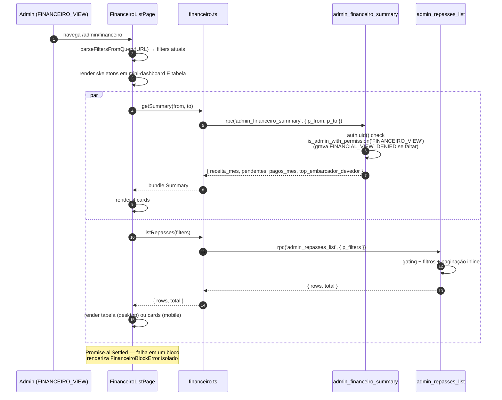
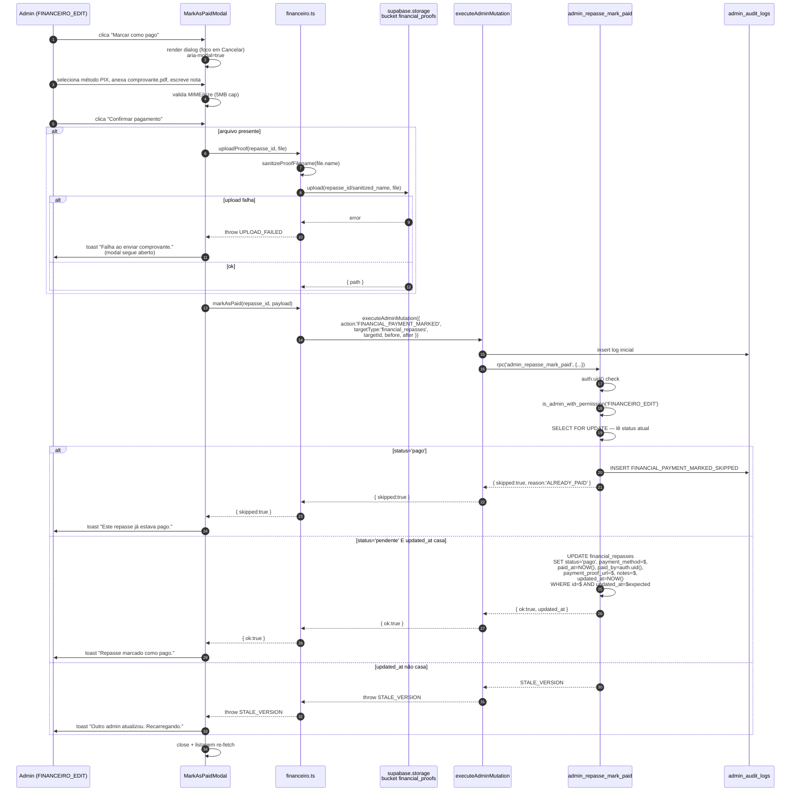
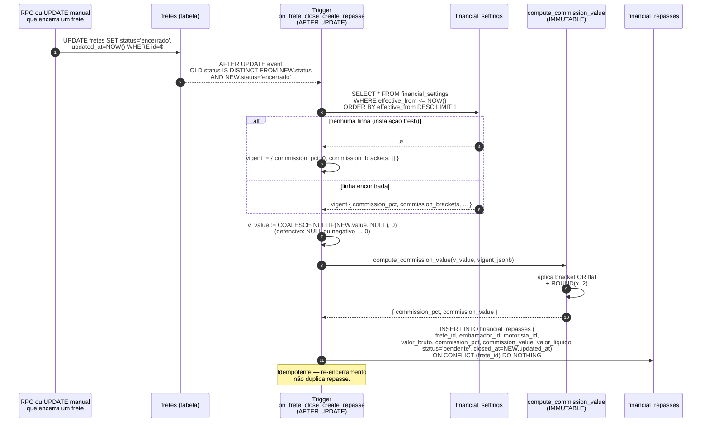

# Design Document

## Overview

Esta spec entrega o **módulo Financeiro** do painel administrativo do FreteGO, sentado sobre fundações já em produção. O escopo é exclusivamente o ciclo de vida do `/admin/financeiro` — listagem de repasses (1:1 com fretes encerrados), detalhe de repasse, configuração histórica de comissão e operações de pagamento (marcar como pago, estornar) com idempotência forte.

O design é **conservador**: nenhuma dependência npm nova, reaproveita 100% dos padrões `admin-foundation`/`admin-users`/`admin-fretes`/`admin-blacklist`/`admin-dashboard` (ver `admin-patterns.md`), e introduz uma única migration nova (`037_admin_financeiro.sql`).

A entrega completa inclui:

- **Migration `037_admin_financeiro.sql`** (idempotente, com par rollback `_rollback.sql` documentado): 2 tabelas (`financial_settings`, `financial_repasses`), 1 função pura SQL (`compute_commission_value`), 1 trigger AFTER UPDATE em `fretes` (`on_frete_close_create_repasse`), 6 RPCs `SECURITY DEFINER` e 1 bucket privado `financial_proofs` com 4 policies.
- **Service novo** em `src/services/admin/financeiro.ts`: tipos públicos, helper puro `computeCommission` (espelha 1:1 a função SQL), wrappers `getSettings`, `updateSettings`, `getSummary`, `listRepasses`, `getRepasseDetail`, `markAsPaid`, `estornar`, `exportRepasseCSV`, e helpers de URL ↔ filtros.
- **3 páginas novas** em `src/pages/admin/financeiro/`: `FinanceiroListPage`, `FinanceiroDetailPage`, `FinanceiroConfiguracoesPage`.
- **12 componentes novos** em `src/components/admin/financeiro/` (incluindo `FinanceiroTable`, `FinanceiroMobileCards`, `FinanceiroFilterPopover`, `FinanceiroMiniDashboard`, `MarkAsPaidModal`, `EstornarModal`, blocos de detalhe e estados de skeleton/error).
- **Permission_Matrix** sem alteração — `FINANCEIRO_VIEW` e `FINANCEIRO_EDIT` já existem desde a migration 030 (admin-foundation). Esta spec **não** adiciona action nova.
- **2 propriedades obrigatórias** (CP-1 paridade da fórmula de comissão entre TS/SQL/trigger; CP-2 idempotência de `markAsPaid`).

### Dependências de specs anteriores

| Dependência | Origem | Como reaproveitamos |
|---|---|---|
| `AdminProvider` / `AdminGuard` / `AdminLayoutRoute` / `AdminShell` / `AdminSidebar` / `Stealth_404` | `admin-foundation` (030) | Wrap das 3 rotas novas sem alteração; sidebar ganha item "Financeiro" gated por `FINANCEIRO_VIEW`. |
| `Permission_Matrix` (`FINANCEIRO_VIEW`, `FINANCEIRO_EDIT`, `AUDIT_VIEW`) | `permissions.ts` (030) | Reusada sem mudança — gating UI via `useAdminPermission`. |
| `executeAdminMutation` / `logAdminAction` | `audit.ts` (030) | Toda mutação financeira passa por `executeAdminMutation`; export de CSV usa `logAdminAction`. Ver admin-patterns.md §1. |
| `is_admin_with_permission(text)` RPC | Migration 030 | Já reconhece `FINANCEIRO_VIEW`/`FINANCEIRO_EDIT` desde 030. Esta spec **não** atualiza a função (diferente de admin-dashboard 036, que adicionou `DASHBOARD_VIEW`). |
| Padrão CSV BOM UTF-8 + `;` + RFC 4180 + 10000 linhas | `admin-users` (031), `admin-blacklist` (035) | Reusado em `exportRepasseCSV` (ver project-conventions.md §CSV Export). |
| Padrão compacto pós-cleanup (sem `<h1>`, popover de filtros, `text-xs px-2.5 py-1`) | `UsersListPage`, `FretesListPage`, `BlacklistListPage` | Reusado integralmente nas 3 páginas (ver project-conventions.md §Estilo de UI compacto). |
| Padrão de versionamento otimista (`updated_at` + `STALE_VERSION`) | `admin-blacklist` (035), `admin-users` (031) | Reusado em `markAsPaid` e `estornar` (ver admin-patterns.md §3). |
| Padrão `_SKIPPED` (idempotência via audit log dentro da RPC) | `admin-blacklist`, `admin-fretes` | Reusado em `FINANCIAL_PAYMENT_MARKED_SKIPPED` e `FINANCIAL_PAYMENT_REVERTED_SKIPPED` (ver admin-patterns.md §4). |
| Padrão `Stealth_404` para acessos sem permissão | `admin-foundation` | Aplicado em todas as 3 rotas (ver admin-patterns.md §5). |
| Padrão de degradação parcial em fetch agregado | `getUserDetail`, `getBlacklistDetail`, `getMetrics` | Aplicado em `getSummary` para o mini-dashboard (ver admin-patterns.md §6). |
| Padrão bulk `Promise.allSettled` + concorrência 5 + cap 200 | `admin-blacklist` | Não aplicado neste MVP (sem operações em lote no Financeiro). Documentado para extensão futura. |
| `fretes` (status, value, embarcador_id, motorista_id, updated_at) | Schema base + `admin-fretes` | Lido pelo trigger; o trigger snapshota `value` e `updated_at` no momento do encerramento. |
| `users.name` / `users.is_active` | Schema base | Joins read-only em `admin_repasses_list` e `admin_financeiro_summary`. |
| `admin_audit_logs` | `admin-foundation` | Receptor de todos os action codes financeiros e do `FINANCIAL_VIEW_DENIED`. |
| Bucket pattern (`storage.buckets` + policies em `storage.objects`) | `admin-blacklist` (anexos), `users` (avatars) | Reusado para `financial_proofs` com gating `FINANCEIRO_VIEW`/`FINANCEIRO_EDIT`. |
| Numeração de migrations (sem buracos) | `project-conventions.md` | Esta migration é **037** (próxima após 036 admin-dashboard). |

### Não-objetivos

- **Integração com gateway de pagamento real** (Pix, TED, boleto via API). O MVP apenas registra que houve pagamento; não dispara nem reconcilia nada.
- **Conciliação bancária automática** (matching de extrato).
- **Notas fiscais / NFS-e**.
- **Repasse para o motorista** (FreteGO registra apenas a comissão sobre o frete encerrado; a transferência real para o motorista fica fora do escopo financeiro do MVP).
- **Realtime** (Supabase channels). Pull-only com botão `Atualizar`.
- **Notificação ao embarcador** quando o repasse é marcado como pago (futuro: integração com `admin-notify-user`).
- **Substituição de comprovante** após pago (apenas estorno + nova marcação).
- **DELETE físico de comprovante** no bucket. Bloqueado por policy `USING (false)` no MVP — TODO documentado em §Storage.
- **Multi-currency / multi-país**. Apenas BRL.
- **I18n**. UI strings hardcoded em pt-BR (action codes em inglês — ver project-conventions.md §Idioma).
- **Bulk operations** (marcar múltiplos como pagos, exportar comprovantes em zip). Single-record only no MVP.
- **Histórico de mudanças de bracket / diff visual** entre snapshots de `financial_settings`. Apenas leitura da config vigente; histórico fica disponível bruto em `admin_audit_logs`.
- **Aplicação retroativa** de mudanças de comissão. Aplicação **prospectiva apenas** — repasses já criados mantêm a regra congelada no momento do encerramento (snapshot imutável).

### Princípios arquiteturais

- **Audit-by-construction**, sem exceção. Toda mutação financeira passa por `executeAdminMutation` (ver admin-patterns.md §1). Os 7 action codes (`FINANCIAL_SETTINGS_UPDATED`, `FINANCIAL_PAYMENT_MARKED`, `FINANCIAL_PAYMENT_MARKED_SKIPPED`, `FINANCIAL_PAYMENT_REVERTED`, `FINANCIAL_PAYMENT_REVERTED_SKIPPED`, `FINANCIAL_EXPORTED`, `FINANCIAL_VIEW_DENIED`) cobrem 100% dos paths críticos. Logs `_SKIPPED` são gravados **dentro da RPC SQL** (não no wrapper TS) porque não há mutação real (ver admin-patterns.md §4).
- **Gating em duas camadas**. UI esconde botões via `useAdminPermission`; RPCs validam `is_admin_with_permission('FINANCEIRO_VIEW'|'FINANCEIRO_EDIT')` server-side e gravam `FINANCIAL_VIEW_DENIED` em path negativo (ver admin-patterns.md §2 e §5).
- **Snapshot imutável de comissão**. Cada `UPDATE` em `financial_settings` é, na prática, um `INSERT` de nova linha — preservando o histórico completo. Cada `INSERT` em `financial_repasses` (via trigger) congela `commission_pct`/`commission_value`/`valor_liquido` calculados sobre a `Vigent_Settings` no momento do encerramento. Mudanças de regra são **prospectivas**: repasses já criados nunca são recalculados.
- **Versionamento otimista** em todas as mutações que mudam estado importante (`markAsPaid`, `estornar`, `updateSettings`). UI lê `updated_at` antes de abrir modal e envia o valor no payload; RPC compara e levanta `STALE_VERSION` em mismatch (ver admin-patterns.md §3).
- **Idempotência forte em `markAsPaid` e `estornar`**. Chamar 2× ou mais não muta o estado e não duplica audit logs de mutação — gera audit logs `_SKIPPED` distintos. Formalizado em CP-2.
- **Determinismo numérico**. `compute_commission_value` (SQL `IMMUTABLE`) e `computeCommission` (TS puro) usam o mesmo arredondamento (`ROUND(x, 2)` em SQL, `Math.round(x*100)/100` em TS) e a mesma resolução de bracket (`min_value <= valor < max_value`, com a última faixa inclusiva no `max_value`). Formalizado em CP-1.
- **Degradação parcial**. `getSummary` (mini-dashboard) e `getRepasseDetail` usam `Promise.allSettled` em sub-queries paralelas; falha de um bloco não derruba a página (ver admin-patterns.md §6).
- **`Stealth_404` em todos os paths sem permissão**. Nunca expor "Acesso negado" — sempre 404 idêntico ao público.
- **Sem deps novas**. CSV reusa padrão herdado; cálculos numéricos com `Number` + `Math.round`; upload via `supabase.storage`; signed URLs nativas. `package.json` permanece igual.
- **Padrão compacto pós-cleanup** em todas as listagens e tabelas (ver project-conventions.md §Estilo de UI compacto).

## Architecture

### Diagrama de alto nível

```mermaid
flowchart TB
    Browser["Browser<br/>localStorage:<br/>fretego_admin_session"]

    subgraph React["React App (Vite)"]
        AppRouter["src/App.tsx<br/>BrowserRouter"]
        AdminRoute["/admin/financeiro/* → AdminLayoutRoute<br/>(REUSO admin-foundation)"]
        AdminProvider["AdminProvider (REUSO)"]
        AdminGuard["AdminGuard (REUSO)<br/>checa FINANCEIRO_VIEW<br/>OR FINANCEIRO_EDIT (configuracoes)"]
        AdminShell["AdminShell + Sidebar (REUSO)<br/>+ item Financeiro"]

        subgraph Pages["3 páginas novas<br/>src/pages/admin/financeiro/"]
            ListPage["FinanceiroListPage<br/>/admin/financeiro"]
            DetailPage["FinanceiroDetailPage<br/>/admin/financeiro/:id"]
            ConfigPage["FinanceiroConfiguracoesPage<br/>/admin/financeiro/configuracoes"]
        end

        subgraph Comps["12 componentes novos<br/>src/components/admin/financeiro/"]
            Mini["FinanceiroMiniDashboard<br/>(4 cards)"]
            Table["FinanceiroTable (desktop)"]
            Cards["FinanceiroMobileCards (<768px)"]
            Filt["FinanceiroFilterPopover"]
            Mark["MarkAsPaidModal"]
            Estor["EstornarModal"]
            DH["FinanceiroDetailHeader"]
            DF["FinanceiroDetailFreteBlock"]
            DU["FinanceiroDetailUserBlock"]
            DA["FinanceiroAuditHistoryBlock"]
            Skl["FinanceiroBlockSkeleton"]
            Err["FinanceiroBlockError"]
        end
    end

    subgraph Hooks["Hooks (REUSO admin-foundation)"]
        useAdminPermission["useAdminPermission(action)"]
        useSearchParams["useSearchParams (react-router)"]
    end

    subgraph Services["Services"]
        FinSvc["src/services/admin/financeiro.ts<br/>(NOVO)<br/>computeCommission (puro)<br/>getSettings / updateSettings<br/>getSummary / listRepasses<br/>getRepasseDetail<br/>markAsPaid / estornar<br/>uploadProof / getProofSignedUrl<br/>exportRepasseCSV<br/>parseFiltersFromQuery / serializeFiltersToQuery<br/>sanitizeProofFilename<br/>DEFAULT_REPASSE_FILTERS"]
        AuditSvc["audit.ts (REUSO)<br/>executeAdminMutation<br/>logAdminAction"]
        PermSvc["permissions.ts (REUSO)<br/>FINANCEIRO_VIEW / FINANCEIRO_EDIT"]
    end

    subgraph Supabase["Supabase / Postgres"]
        TblSet[("financial_settings<br/>(snapshot histórico)")]
        TblRep[("financial_repasses<br/>(1:1 com fretes encerrados)")]
        Trig["Trigger<br/>on_frete_close_create_repasse<br/>AFTER UPDATE em fretes"]
        FnPure["Função SQL pura<br/>compute_commission_value(value, settings)<br/>IMMUTABLE"]
        RPCs["RPCs SECURITY DEFINER<br/>admin_financeiro_settings_get<br/>admin_financeiro_settings_update<br/>admin_financeiro_summary<br/>admin_repasses_list<br/>admin_repasse_mark_paid<br/>admin_repasse_estornar"]
        Bucket[("Storage bucket privado<br/>financial_proofs<br/>SELECT: FINANCEIRO_VIEW<br/>INSERT/UPDATE: FINANCEIRO_EDIT<br/>DELETE: false (MVP)")]
        Audit[("admin_audit_logs<br/>FINANCIAL_*")]
    end

    Browser --> AppRouter
    AppRouter --> AdminRoute
    AdminRoute --> AdminProvider
    AdminProvider --> AdminGuard
    AdminGuard --> AdminShell
    AdminShell --> ListPage
    AdminShell --> DetailPage
    AdminShell --> ConfigPage

    ListPage --> Mini
    ListPage --> Table
    ListPage --> Cards
    ListPage --> Filt
    ListPage --> Mark
    ListPage --> Estor

    DetailPage --> DH
    DetailPage --> DF
    DetailPage --> DU
    DetailPage --> DA
    DetailPage --> Mark
    DetailPage --> Estor

    Pages --> useAdminPermission
    Pages --> useSearchParams
    Pages --> FinSvc

    FinSvc --> AuditSvc
    FinSvc --> PermSvc
    FinSvc --> RPCs
    FinSvc --> Bucket
    AuditSvc --> Audit

    RPCs --> TblSet
    RPCs --> TblRep
    RPCs --> Audit
    Trig --> FnPure
    Trig --> TblRep
    Trig -.lê.-> TblSet
```



### Fluxo canônico — carga inicial da listagem com mini-dashboard



### Fluxo canônico — marcar repasse como pago com upload de comprovante



### Fluxo canônico — trigger criando repasse no encerramento do frete



### RLS e gating

| Cenário | Resultado |
|---|---|
| MODERADOR navega para `/admin/financeiro` | `AdminGuard` → `useAdminPermission('FINANCEIRO_VIEW')` ⇒ `false` ⇒ `Stealth_404`. |
| SUPORTE navega para `/admin/financeiro` | Mesmo: `Stealth_404` (SUPORTE não tem `FINANCEIRO_VIEW`). |
| FINANCEIRO chama `admin_repasse_mark_paid` | RPC valida `FINANCEIRO_EDIT` ⇒ FINANCEIRO **tem** ⇒ executa. |
| ADMIN com sessão expirada (`auth.uid()` NULL) tenta RPC | RPC `RAISE permission_denied` (42501) — antes mesmo do check de role. |
| Usuário comum (não-admin) bypassa UI e tenta `admin_repasses_list` via service-role-key | RPC valida `is_admin_with_permission('FINANCEIRO_VIEW')` ⇒ `false`. Insere log `FINANCIAL_VIEW_DENIED` (`admin_id=auth.uid()`, `after={user_id, reason}`) e `RAISE permission_denied`. |
| Admin sem `FINANCEIRO_EDIT` clica "Marcar como pago" | UI **não renderiza** o botão (oculto, não desabilitado). Mesmo se construir payload manual, RPC bloqueia server-side com `permission_denied` + log negativo. |
| Admin sem `AUDIT_VIEW` em `/admin/financeiro/:id` | `FinanceiroAuditHistoryBlock` **oculto** (não desabilitado). Demais blocos renderizam. |
| Admin lê `getSummary` mas a sub-query `top_embarcador_devedor` falha (timeout) | `Promise.allSettled` isola; `bundle.errors.top_embarcador = 'Bloco indisponível.'`. UI renderiza 3 cards normalmente + 4º card em `FinanceiroBlockError` com botão `Tentar novamente`. |


## Data Models

### Tabela `financial_settings` (snapshot histórico de regras de comissão)

```sql
CREATE TABLE IF NOT EXISTS financial_settings (
  id                    uuid          PRIMARY KEY DEFAULT gen_random_uuid(),
  commission_pct        numeric(5,2)  NOT NULL CHECK (commission_pct >= 0 AND commission_pct <= 50),
  commission_brackets   jsonb         NOT NULL DEFAULT '[]'::jsonb,
  effective_from        timestamptz   NOT NULL DEFAULT NOW(),
  updated_at            timestamptz   NOT NULL DEFAULT NOW(),
  updated_by            uuid          NULL REFERENCES users(id) ON DELETE SET NULL,
  CONSTRAINT chk_financial_settings_brackets_is_array
    CHECK (jsonb_typeof(commission_brackets) = 'array')
);

CREATE INDEX IF NOT EXISTS idx_financial_settings_effective_from
  ON financial_settings (effective_from DESC);

ALTER TABLE financial_settings ENABLE ROW LEVEL SECURITY;

-- Policy: SELECT apenas via RPC (sem acesso direto). Não criamos policy SELECT por padrão.
-- INSERT/UPDATE bloqueados em direct DML (RPCs SECURITY DEFINER bypassam RLS).
DROP POLICY IF EXISTS financial_settings_no_dml ON financial_settings;
CREATE POLICY financial_settings_no_dml
  ON financial_settings FOR ALL
  USING (false) WITH CHECK (false);

COMMENT ON TABLE  financial_settings              IS 'Snapshot histórico de regras de comissão. Cada UPDATE da config gera nova linha (admin-financeiro 037).';
COMMENT ON COLUMN financial_settings.commission_pct        IS 'Percentual flat aplicado quando nenhum bracket cobre o valor do frete. 0..50%.';
COMMENT ON COLUMN financial_settings.commission_brackets   IS 'Array jsonb [{min_value:number, max_value:number, pct:number}] ordenado por min_value ASC, sem buracos, sem sobreposição, max 5 entradas.';
COMMENT ON COLUMN financial_settings.effective_from        IS 'Quando a regra passa a valer. Trigger resolve Vigent_Settings = max(effective_from <= NOW()).';
```

**Decisão:** `effective_from` permite (no futuro) agendar mudanças prospectivas. No MVP, `updateSettings` sempre grava `effective_from = NOW()`.

**Decisão:** `commission_brackets` é `jsonb` em vez de tabela separada. O array é pequeno (max 5 entradas) e a integridade interna (ordenação, não-sobreposição, não-buraco) é validada na RPC `admin_financeiro_settings_update` antes do INSERT (cheap to validate, não justifica overhead de tabela filha + FK + cascata).

### Tabela `financial_repasses` (1 linha por frete encerrado)

```sql
CREATE TABLE IF NOT EXISTS financial_repasses (
  id                    uuid          PRIMARY KEY DEFAULT gen_random_uuid(),
  frete_id              uuid          NOT NULL UNIQUE REFERENCES fretes(id) ON DELETE RESTRICT,
  embarcador_id         uuid          NOT NULL REFERENCES users(id) ON DELETE RESTRICT,
  motorista_id          uuid          NULL REFERENCES users(id) ON DELETE SET NULL,
  valor_bruto           numeric(12,2) NOT NULL CHECK (valor_bruto >= 0),
  commission_pct        numeric(5,2)  NOT NULL CHECK (commission_pct >= 0 AND commission_pct <= 50),
  commission_value      numeric(12,2) NOT NULL CHECK (commission_value >= 0),
  valor_liquido         numeric(12,2) NOT NULL CHECK (valor_liquido >= 0),
  status                text          NOT NULL DEFAULT 'pendente'
                                       CHECK (status IN ('pendente','pago','estornado')),
  closed_at             timestamptz   NOT NULL,
  paid_at               timestamptz   NULL,
  paid_by               uuid          NULL REFERENCES users(id) ON DELETE SET NULL,
  payment_method        text          NULL
                                       CHECK (payment_method IS NULL
                                              OR payment_method IN ('pix','ted','boleto','dinheiro','outro')),
  payment_proof_url     text          NULL CHECK (payment_proof_url IS NULL OR char_length(payment_proof_url) <= 500),
  notes                 text          NULL CHECK (notes IS NULL OR char_length(notes) <= 1000),
  reverted_at           timestamptz   NULL,
  reverted_by           uuid          NULL REFERENCES users(id) ON DELETE SET NULL,
  revert_reason         text          NULL CHECK (revert_reason IS NULL OR (char_length(revert_reason) >= 1 AND char_length(revert_reason) <= 500)),
  created_at            timestamptz   NOT NULL DEFAULT NOW(),
  updated_at            timestamptz   NOT NULL DEFAULT NOW(),

  -- Coerência de estado: paid → tem paid_at + paid_by + payment_method;
  -- estornado → tem reverted_at + reverted_by + revert_reason;
  -- pendente → nada de paid_*, reverted_*.
  CONSTRAINT chk_financial_repasses_paid_consistency CHECK (
    (status <> 'pago' AND status <> 'estornado')
    OR (status = 'pago'      AND paid_at IS NOT NULL AND paid_by IS NOT NULL AND payment_method IS NOT NULL)
    OR (status = 'estornado' AND paid_at IS NOT NULL AND paid_by IS NOT NULL AND payment_method IS NOT NULL
                            AND reverted_at IS NOT NULL AND reverted_by IS NOT NULL AND revert_reason IS NOT NULL)
  ),

  CONSTRAINT chk_financial_repasses_pendente_clean CHECK (
    status <> 'pendente'
    OR (paid_at IS NULL AND paid_by IS NULL AND payment_method IS NULL
        AND payment_proof_url IS NULL AND notes IS NULL
        AND reverted_at IS NULL AND reverted_by IS NULL AND revert_reason IS NULL)
  ),

  CONSTRAINT chk_financial_repasses_arithmetic CHECK (
    valor_liquido = valor_bruto - commission_value
  )
);

CREATE INDEX IF NOT EXISTS idx_financial_repasses_status_closed_at
  ON financial_repasses (status, closed_at DESC);

CREATE INDEX IF NOT EXISTS idx_financial_repasses_embarcador_status
  ON financial_repasses (embarcador_id, status);

CREATE INDEX IF NOT EXISTS idx_financial_repasses_motorista_status
  ON financial_repasses (motorista_id, status) WHERE motorista_id IS NOT NULL;

CREATE INDEX IF NOT EXISTS idx_financial_repasses_paid_at
  ON financial_repasses (paid_at DESC) WHERE status = 'pago';

ALTER TABLE financial_repasses ENABLE ROW LEVEL SECURITY;

DROP POLICY IF EXISTS financial_repasses_no_dml ON financial_repasses;
CREATE POLICY financial_repasses_no_dml
  ON financial_repasses FOR ALL
  USING (false) WITH CHECK (false);

COMMENT ON TABLE  financial_repasses                  IS '1 linha por frete encerrado, snapshot imutável da comissão (admin-financeiro 037).';
COMMENT ON COLUMN financial_repasses.frete_id          IS '1:1 com fretes encerrados (UNIQUE). Trigger usa ON CONFLICT DO NOTHING.';
COMMENT ON COLUMN financial_repasses.commission_pct    IS 'Snapshot da % aplicada (flat ou bracket) no momento do encerramento.';
COMMENT ON COLUMN financial_repasses.commission_value  IS 'valor_bruto * commission_pct / 100, ROUND(2). Imutável após criação.';
COMMENT ON COLUMN financial_repasses.valor_liquido     IS 'valor_bruto - commission_value. Imutável após criação.';
COMMENT ON COLUMN financial_repasses.status            IS 'pendente → pago → estornado. Idempotência via _SKIPPED.';
COMMENT ON COLUMN financial_repasses.payment_proof_url IS 'Path no bucket financial_proofs. NULL se sem comprovante.';
```

**Decisão sobre constraints de coerência:** as três constraints (`chk_..._paid_consistency`, `chk_..._pendente_clean`, `chk_..._arithmetic`) impedem estados inconsistentes mesmo se um dia houver bypass do path normal (ex: hot-fix manual). É defesa em profundidade — as RPCs já validam, mas a tabela é a última linha de defesa.

**Decisão sobre RLS `USING (false)`:** ninguém escreve nem lê direto. Toda interação é via RPCs `SECURITY DEFINER`, que bypassam RLS por design. Reduz superfície de ataque (mesmo um admin com `FINANCEIRO_VIEW` não consegue `SELECT * FROM financial_repasses` direto via PostgREST).

### Tipos TypeScript principais (`src/services/admin/financeiro.ts`)

```ts
// ============================================================================
// Settings (configuração de comissão)
// ============================================================================

export interface CommissionBracket {
  min_value: number;   // R$, >= 0
  max_value: number;   // R$, > min_value
  pct: number;         // %, 0..50
}

export interface FinanceiroSettings {
  id: string;
  commission_pct: number;           // 0..50
  commission_brackets: CommissionBracket[];   // 0..5 entradas, ordenadas, sem buracos, sem overlap
  effective_from: string;           // ISO 8601
  updated_at: string;
  updated_by: string | null;
}

export interface UpdateSettingsPayload {
  commission_pct: number;
  commission_brackets: CommissionBracket[];
  expected_updated_at: string;      // versionamento otimista da última config vigente
}

// ============================================================================
// Repasses
// ============================================================================

export type RepasseStatus = 'pendente' | 'pago' | 'estornado';

export type PaymentMethod = 'pix' | 'ted' | 'boleto' | 'dinheiro' | 'outro';

export interface RepasseRow {
  id: string;
  frete_id: string;
  embarcador_id: string;
  embarcador_name: string;
  motorista_id: string | null;
  motorista_name: string | null;
  frete_origin: string;
  frete_destination: string;
  valor_bruto: number;
  commission_pct: number;
  commission_value: number;
  valor_liquido: number;
  status: RepasseStatus;
  payment_method: PaymentMethod | null;
  payment_proof_url: string | null;
  notes: string | null;
  closed_at: string;
  paid_at: string | null;
  paid_by: string | null;
  reverted_at: string | null;
  reverted_by: string | null;
  revert_reason: string | null;
  created_at: string;
  updated_at: string;
}

export interface RepasseFilters {
  status: 'todos' | RepasseStatus;
  embarcadorId: string | null;
  motoristaId: string | null;
  periodKind: 'closed_at' | 'paid_at';
  from: string | null;              // YYYY-MM-DD
  to: string | null;                // YYYY-MM-DD
  q: string;
  sort: 'closed_at_desc' | 'paid_at_desc' | 'valor_liquido_desc';
  page: number;                     // 1-based
  pageSize: 10 | 50 | 100;
}

export const DEFAULT_REPASSE_FILTERS: RepasseFilters = {
  status: 'todos',
  embarcadorId: null,
  motoristaId: null,
  periodKind: 'closed_at',
  from: null,
  to: null,
  q: '',
  sort: 'closed_at_desc',
  page: 1,
  pageSize: 10,
};

export interface ListRepassesResult {
  rows: RepasseRow[];
  total: number;
}

// ============================================================================
// Detail
// ============================================================================

export interface RepasseDetail {
  repasse: RepasseRow;
  frete: {
    id: string;
    origin: string;
    destination: string;
    posted_at: string;       // fretes.created_at
    value: number;           // fretes.value (pode divergir de valor_bruto se editado depois)
    status: string;
  };
  embarcador: { id: string; name: string; email: string | null };
  motorista: { id: string; name: string; email: string | null } | null;
  audit_history: AuditLogEntry[] | null;   // null quando admin não tem AUDIT_VIEW
  errors: Partial<Record<'frete' | 'embarcador' | 'motorista' | 'audit', string>>;
}

export interface AuditLogEntry {
  id: string;
  action: string;
  admin_id: string | null;
  admin_username: string | null;
  before_data: unknown;
  after_data: unknown;
  created_at: string;
}

// ============================================================================
// Summary (mini-dashboard)
// ============================================================================

export interface FinanceiroSummary {
  receita_mes: number | null;          // sum(commission_value) WHERE status='pago' AND paid_at ∈ [from,to]
  pendentes:   { count: number; total: number } | null;
  pagos_mes:   { count: number; total: number } | null;
  top_embarcador_devedor: {
    embarcador_id: string;
    name: string;
    total_pendente: number;
  } | null;
  errors: Partial<Record<'receita_mes' | 'pendentes' | 'pagos_mes' | 'top_embarcador', string>>;
}

// ============================================================================
// Mutações
// ============================================================================

export interface MarkAsPaidPayload {
  payment_method: PaymentMethod;
  proof_file?: File;
  notes?: string;                      // 0..1000 chars
  expected_updated_at: string;         // versionamento otimista
}

export interface EstornarPayload {
  revert_reason: string;               // 1..500 chars (após trim)
  expected_updated_at: string;
}

export type MutationResult =
  | { ok: true; updated_at: string }
  | { skipped: true; reason: 'ALREADY_PAID' | 'ALREADY_REVERTED' };

// ============================================================================
// Erros tipados
// ============================================================================

export type FinanceiroErrorCode =
  | 'PERMISSION_DENIED'
  | 'NOT_FOUND'
  | 'STALE_VERSION'
  | 'INVALID_INPUT'
  | 'INVALID_PERIOD'
  | 'PERIOD_TOO_LARGE'
  | 'INVALID_STATUS'
  | 'INVALID_BRACKETS'
  | 'BRACKETS_OVERLAP'
  | 'BRACKETS_GAP'
  | 'BRACKETS_OUT_OF_ORDER'
  | 'BRACKETS_TOO_MANY'
  | 'COMMISSION_PCT_OUT_OF_RANGE'
  | 'UPLOAD_FAILED'
  | 'PROOF_TOO_LARGE'
  | 'PROOF_INVALID_TYPE'
  | 'NETWORK_ERROR'
  | 'UNKNOWN';

export class FinanceiroServiceError extends Error {
  readonly code: FinanceiroErrorCode;
  readonly cause?: unknown;
  constructor(code: FinanceiroErrorCode, message: string, cause?: unknown) {
    super(message);
    this.name = 'FinanceiroServiceError';
    this.code = code;
    this.cause = cause;
  }
}
```


## RPC Contracts

Todas as 6 RPCs novas seguem a postura de segurança herdada (ver admin-patterns.md §10): `SET search_path = public`, `auth.uid() IS NULL` ⇒ `permission_denied`, `is_admin_with_permission(...)` check com log negativo, `REVOKE ALL FROM PUBLIC` + `GRANT EXECUTE TO authenticated`.

A função pura `compute_commission_value` é `IMMUTABLE` (sem side-effects, mesmo input → mesmo output) e exposta a `authenticated` para permitir simulação client-side via RPC quando útil (no MVP, o front usa `computeCommission` em TS local; a função SQL existe para o trigger e para o helper de testes de paridade).

### `compute_commission_value(p_value numeric, p_settings jsonb) RETURNS jsonb`

**Função SQL pura.** Espelha 1:1 o helper TS `computeCommission` (CP-1 valida paridade).

```sql
CREATE OR REPLACE FUNCTION compute_commission_value(
  p_value    numeric,
  p_settings jsonb
) RETURNS jsonb
LANGUAGE plpgsql IMMUTABLE
SET search_path = public
AS $func$
DECLARE
  v_value           numeric;
  v_pct_flat        numeric;
  v_brackets        jsonb;
  v_bracket         jsonb;
  v_min             numeric;
  v_max             numeric;
  v_pct             numeric;
  v_resolved_pct    numeric;
  v_commission      numeric;
  v_resolved_via    text := 'flat';
BEGIN
  -- Normalização defensiva: NULL ou negativo → 0
  v_value := COALESCE(p_value, 0);
  IF v_value < 0 THEN
    v_value := 0;
  END IF;

  -- Settings ausente / malformado → flat 0%
  IF p_settings IS NULL OR jsonb_typeof(p_settings) <> 'object' THEN
    RETURN jsonb_build_object(
      'commission_pct', 0,
      'commission_value', 0,
      'resolved_via', 'flat_default'
    );
  END IF;

  v_pct_flat := COALESCE((p_settings->>'commission_pct')::numeric, 0);
  v_brackets := COALESCE(p_settings->'commission_brackets', '[]'::jsonb);

  -- Default: usa flat
  v_resolved_pct := v_pct_flat;
  v_resolved_via := 'flat';

  -- Procura bracket que cobre v_value (pré-condição: brackets ordenados,
  -- sem buracos, sem sobreposição — validado em admin_financeiro_settings_update)
  IF jsonb_typeof(v_brackets) = 'array' AND jsonb_array_length(v_brackets) > 0 THEN
    FOR v_bracket IN SELECT * FROM jsonb_array_elements(v_brackets)
    LOOP
      v_min := COALESCE((v_bracket->>'min_value')::numeric, 0);
      v_max := COALESCE((v_bracket->>'max_value')::numeric, 0);
      v_pct := COALESCE((v_bracket->>'pct')::numeric, 0);
      -- Inclusivo em min_value, exclusivo em max_value, exceto na última faixa (inclusivo).
      -- Como brackets são contíguas (sem buracos), o exclusivo na borda dá ao próximo
      -- bracket a posse do ponto. A última faixa precisa ser inclusiva para cobrir
      -- valores exatamente iguais ao max_value global.
      IF v_value >= v_min AND v_value < v_max THEN
        v_resolved_pct := v_pct;
        v_resolved_via := 'bracket';
        EXIT;
      END IF;
    END LOOP;

    -- Se não casou em nenhum bracket (valor maior que último max_value),
    -- E v_value é igual ao último max_value, casa com a última faixa.
    IF v_resolved_via = 'flat' THEN
      SELECT (b->>'max_value')::numeric, (b->>'pct')::numeric
        INTO v_max, v_pct
        FROM jsonb_array_elements(v_brackets) WITH ORDINALITY t(b, idx)
       ORDER BY idx DESC
       LIMIT 1;
      IF v_value = v_max THEN
        v_resolved_pct := v_pct;
        v_resolved_via := 'bracket_max_inclusive';
      END IF;
      -- Caso contrário: cai em flat (comportamento prospectivo de fretes acima do teto).
    END IF;
  END IF;

  -- Aplicação + arredondamento half-away-from-zero (PostgreSQL ROUND(numeric, int))
  v_commission := ROUND(v_value * v_resolved_pct / 100.0, 2);

  RETURN jsonb_build_object(
    'commission_pct',   v_resolved_pct,
    'commission_value', v_commission,
    'resolved_via',     v_resolved_via
  );
END;
$func$;

REVOKE ALL ON FUNCTION compute_commission_value(numeric, jsonb) FROM PUBLIC;
GRANT EXECUTE ON FUNCTION compute_commission_value(numeric, jsonb) TO authenticated;
```

**Helper TS espelhado** (em `src/services/admin/financeiro.ts`):

```ts
export function computeCommission(
  valor_bruto: number,
  settings: Pick<FinanceiroSettings, 'commission_pct' | 'commission_brackets'>
): { commission_pct: number; commission_value: number; valor_liquido: number; resolved_via: 'flat' | 'bracket' | 'bracket_max_inclusive' | 'flat_default' } {
  const v = !Number.isFinite(valor_bruto) || valor_bruto < 0 ? 0 : valor_bruto;
  const flat = Number(settings?.commission_pct ?? 0);
  const brackets = Array.isArray(settings?.commission_brackets) ? settings.commission_brackets : [];

  let resolved_pct = flat;
  let resolved_via: 'flat' | 'bracket' | 'bracket_max_inclusive' | 'flat_default' = 'flat';

  if (settings == null) {
    resolved_via = 'flat_default';
    resolved_pct = 0;
  } else if (brackets.length > 0) {
    let found = false;
    for (const b of brackets) {
      if (v >= b.min_value && v < b.max_value) {
        resolved_pct = b.pct;
        resolved_via = 'bracket';
        found = true;
        break;
      }
    }
    if (!found) {
      const last = brackets[brackets.length - 1];
      if (v === last.max_value) {
        resolved_pct = last.pct;
        resolved_via = 'bracket_max_inclusive';
      }
      // else: cai em flat
    }
  }

  const commission_value = Math.round((v * resolved_pct) / 100 * 100) / 100;
  const valor_liquido    = Math.round((v - commission_value) * 100) / 100;

  return { commission_pct: resolved_pct, commission_value, valor_liquido, resolved_via };
}
```

**Decisão sobre bordas de bracket:** o intervalo é `[min_value, max_value)` para todas as faixas exceto a última, que é `[min_value, max_value]`. Justificativa: como faixas são contíguas e sem buracos, o ponto exato de divisa entre bracket N e N+1 (ex: valor = `max_value_N` = `min_value_{N+1}`) cai no N+1 (regra "exclusivo no fim"). Isso evita ambiguidade. A última faixa precisa ser inclusiva no fim para que valores exatamente no teto sejam cobertos pela bracket — caso contrário, cairiam em flat sem motivo. Para valores **acima** do teto, cai em flat (comportamento de "fora da tabela"). Esse contrato é exatamente espelhado entre SQL e TS, e CP-1 cobre todas as bordas como casos de teste.

### `admin_financeiro_settings_get() RETURNS jsonb`

**RPC `STABLE SECURITY DEFINER`** que retorna a `Vigent_Settings`.

- **Gating:** `FINANCEIRO_VIEW`. Falta ⇒ insere `FINANCIAL_VIEW_DENIED` e `RAISE permission_denied`.
- **Fluxo:**
  1. `auth.uid()` check.
  2. `is_admin_with_permission('FINANCEIRO_VIEW')` check.
  3. `SELECT * FROM financial_settings ORDER BY effective_from DESC LIMIT 1`.
  4. Se vazio (instalação fresh), retorna sentinel `{ id: null, commission_pct: 0, commission_brackets: [], effective_from: null, updated_at: null, updated_by: null }`. UI trata como "configuração ainda não existe — preencha".
- **Retorno sucesso:** `{ id, commission_pct, commission_brackets, effective_from, updated_at, updated_by }` (jsonb).
- **Retorno erro:** `RAISE EXCEPTION 'permission_denied' USING ERRCODE = '42501'` mapeado em TS para `FinanceiroServiceError('PERMISSION_DENIED')`.

### `admin_financeiro_settings_update(p_commission_pct numeric, p_commission_brackets jsonb, p_expected_updated_at timestamptz) RETURNS jsonb`

**RPC `SECURITY DEFINER`** que faz **INSERT** de nova linha em `financial_settings` (snapshot histórico imutável — não UPDATE).

- **Gating:** `FINANCEIRO_EDIT`. Falta ⇒ `FINANCIAL_VIEW_DENIED` + `RAISE permission_denied`.
- **Fluxo:**
  1. Auth + permission checks.
  2. **Validações de domínio** (cada falha ⇒ `RAISE EXCEPTION 'INVALID_*' USING ERRCODE = 'P0001'`):
     - `p_commission_pct` ∈ `[0, 50]` (ELSE `COMMISSION_PCT_OUT_OF_RANGE`).
     - `jsonb_typeof(p_commission_brackets) = 'array'` (ELSE `INVALID_BRACKETS`).
     - `jsonb_array_length(p_commission_brackets) <= 5` (ELSE `BRACKETS_TOO_MANY`).
     - Para cada entrada: `min_value >= 0`, `max_value > min_value`, `pct ∈ [0,50]` (ELSE `INVALID_BRACKETS`).
     - Ordenadas ASC por `min_value` (ELSE `BRACKETS_OUT_OF_ORDER`).
     - Sem sobreposição: `max_value[i] <= min_value[i+1]` (ELSE `BRACKETS_OVERLAP`).
     - Sem buracos: `max_value[i] = min_value[i+1]` (ELSE `BRACKETS_GAP`).
  3. **Versionamento otimista:** lê `(SELECT max(effective_from) FROM financial_settings)` ou snapshot completo da última linha; compara `updated_at` da última linha com `p_expected_updated_at`. Mismatch ⇒ `RAISE 'STALE_VERSION'`.
  4. `INSERT INTO financial_settings (commission_pct, commission_brackets, effective_from, updated_at, updated_by) VALUES (p_commission_pct, p_commission_brackets, NOW(), NOW(), v_caller) RETURNING *`.
- **Retorno sucesso:** linha completa nova como jsonb.
- **Retorno erro:** mapeado em TS para `FinanceiroErrorCode` correspondente.
- **Audit log:** **não** dentro da RPC. O wrapper TS `executeAdminMutation({ action: 'FINANCIAL_SETTINGS_UPDATED', ..., before, after })` grava o log com snapshot completo antes/depois (ver admin-patterns.md §1).

### `admin_repasse_mark_paid(p_id uuid, p_method text, p_proof_path text, p_notes text, p_expected_updated_at timestamptz) RETURNS jsonb`

**RPC `SECURITY DEFINER`** que materializa CP-2 (idempotência forte de marcação como pago).

- **Gating:** `FINANCEIRO_EDIT`.
- **Fluxo:**
  1. Auth + permission checks.
  2. Validar `p_method ∈ ('pix','ted','boleto','dinheiro','outro')` (ELSE `INVALID_INPUT`).
  3. Validar `length(p_notes) <= 1000` (ELSE `INVALID_INPUT`).
  4. Validar `length(p_proof_path) <= 500` (ELSE `INVALID_INPUT`).
  5. `SELECT status, updated_at FROM financial_repasses WHERE id = p_id FOR UPDATE`.
  6. Se `NOT FOUND` ⇒ `RAISE 'NOT_FOUND'`.
  7. **Idempotência (CP-2):** se `status = 'pago'`:
     - INSERT direto em `admin_audit_logs` com `action = 'FINANCIAL_PAYMENT_MARKED_SKIPPED'`, `target_type = 'financial_repasses'`, `target_id = p_id`, `before_data = NULL`, `after_data = jsonb_build_object('reason', 'ALREADY_PAID', 'attempted_method', p_method)`.
     - `RETURN jsonb_build_object('skipped', true, 'reason', 'ALREADY_PAID')`.
     - Crucial: **não** muta `financial_repasses` nem o `payment_method`/`paid_at`/`paid_by` originais.
  8. Se `status = 'estornado'` ⇒ `RAISE 'INVALID_STATUS' USING MESSAGE = 'Repasse já estornado'`.
  9. **Versionamento otimista:** `UPDATE ... SET status='pago', payment_method=p_method, paid_at=NOW(), paid_by=v_caller, payment_proof_url=p_proof_path, notes=NULLIF(trim(p_notes), ''), updated_at=NOW() WHERE id=p_id AND updated_at=p_expected_updated_at`.
  10. `GET DIAGNOSTICS v_rows = ROW_COUNT`; se `v_rows = 0` ⇒ `RAISE 'STALE_VERSION'`.
- **Retorno sucesso:** `{ ok: true, updated_at: <novo_updated_at> }`.
- **Retorno skip:** `{ skipped: true, reason: 'ALREADY_PAID' }`.
- **Audit log de mutação real:** o wrapper TS `executeAdminMutation` grava `FINANCIAL_PAYMENT_MARKED` em torno da chamada. Quando a RPC retorna `{ skipped: true }`, o `executeAdminMutation` **não** grava o log normal (ele detecta o skip e não duplica) — apenas o log `_SKIPPED` gravado dentro da RPC permanece.

> **Decisão sobre coexistência de logs:** `executeAdminMutation` grava log preliminar antes da chamada e log de finalização após sucesso. Se a RPC retorna `{ skipped: true }`, o wrapper TS detecta isso e ajusta o log inicial para incluir `outcome: 'skipped'` no `after_data` (ver admin-patterns.md §1). Mas o log autoritativo de skip é o `FINANCIAL_PAYMENT_MARKED_SKIPPED` gravado **pela RPC** — esse é o que CP-2 conta. Para evitar dupla contagem em CP-2, contamos apenas logs com `action IN ('FINANCIAL_PAYMENT_MARKED', 'FINANCIAL_PAYMENT_MARKED_SKIPPED')` gravados **pela RPC** (não os do wrapper, que têm fingerprint diferente — ver §Testing Strategy).

### `admin_repasse_estornar(p_id uuid, p_reason text, p_expected_updated_at timestamptz) RETURNS jsonb`

**RPC `SECURITY DEFINER`** simétrica a `mark_paid` para estorno.

- **Gating:** `FINANCEIRO_EDIT`.
- **Fluxo:**
  1. Auth + permission checks.
  2. Validar `length(trim(p_reason)) BETWEEN 1 AND 500` (ELSE `INVALID_INPUT`).
  3. `SELECT FOR UPDATE`.
  4. `NOT FOUND` ⇒ `RAISE 'NOT_FOUND'`.
  5. `status = 'pendente'` ⇒ `RAISE 'INVALID_STATUS' USING MESSAGE = 'Apenas repasses pagos podem ser estornados'`.
  6. **Idempotência:** `status = 'estornado'`:
     - INSERT `FINANCIAL_PAYMENT_REVERTED_SKIPPED` com `after_data = jsonb_build_object('reason', 'ALREADY_REVERTED', 'attempted_reason', p_reason)`.
     - `RETURN jsonb_build_object('skipped', true, 'reason', 'ALREADY_REVERTED')`.
  7. **Versionamento otimista** + `UPDATE`: `SET status='estornado', reverted_at=NOW(), reverted_by=v_caller, revert_reason=trim(p_reason), updated_at=NOW() WHERE id=p_id AND updated_at=p_expected_updated_at`. **Crucialmente preserva** `payment_proof_url`, `paid_at`, `paid_by`, `payment_method`, `notes` (snapshot histórico).
  8. `v_rows=0` ⇒ `STALE_VERSION`.
- **Retorno:** `{ ok: true, updated_at }` ou `{ skipped: true, reason: 'ALREADY_REVERTED' }`.
- **Audit:** `executeAdminMutation` grava `FINANCIAL_PAYMENT_REVERTED` com `before` (estado pago) e `after` (estado estornado, com snapshot histórico preservado).

### `admin_repasses_list(p_filters jsonb) RETURNS jsonb`

**RPC `STABLE SECURITY DEFINER`** que aplica filtros, ordenação e paginação inline com joins em `users` e `fretes`.

- **Gating:** `FINANCEIRO_VIEW`.
- **Input `p_filters`:**
  ```jsonc
  {
    "status": "todos" | "pendente" | "pago" | "estornado",
    "embarcador_id": "uuid" | null,
    "motorista_id": "uuid" | null,
    "period_kind": "closed_at" | "paid_at",
    "from": "ISO 8601" | null,
    "to": "ISO 8601" | null,
    "q": "string",
    "sort": "closed_at_desc" | "paid_at_desc" | "valor_liquido_desc",
    "page": 1,
    "page_size": 10
  }
  ```
- **Fluxo:**
  1. Auth + permission.
  2. Validar `page_size ∈ {10, 50, 100}` (ELSE `INVALID_INPUT`).
  3. Validar `page >= 1` (ELSE `INVALID_INPUT`).
  4. Validar `to >= from` quando ambos não-nulos (ELSE `INVALID_PERIOD`).
  5. Validar `status` no enum (ELSE `INVALID_INPUT`).
  6. Construir CTE com filtros aplicados via `WHERE`:
     - `status` (ignorado se 'todos').
     - `embarcador_id` (= ou IS NULL ignored).
     - `motorista_id` (mesmo padrão).
     - `period_kind = 'closed_at'` ⇒ `closed_at >= from AND closed_at <= to` (bordas inclusivas).
     - `period_kind = 'paid_at'` ⇒ `paid_at >= from AND paid_at <= to AND status = 'pago'` (faz sentido só para pagos; UI bloqueia outros status quando period_kind=paid_at).
     - `q` (≥ 2 chars após trim) ⇒ `embarcador.name ILIKE '%q%' OR motorista.name ILIKE '%q%'`.
  7. `ORDER BY` conforme `sort` + tiebreaker `id` para determinismo.
  8. `LIMIT page_size OFFSET (page-1)*page_size`.
  9. Em paralelo: `COUNT(*) OVER ()` ou subquery `total`.
  10. `SELECT jsonb_build_object('rows', jsonb_agg(...), 'total', total)`.
- **Retorno:**
  ```jsonc
  { "rows": [<RepasseRow>...], "total": 123 }
  ```
- **Joins:** `LEFT JOIN users ue ON ue.id = r.embarcador_id`, `LEFT JOIN users um ON um.id = r.motorista_id`, `LEFT JOIN fretes f ON f.id = r.frete_id` (para `frete_origin` / `frete_destination`).

### `admin_financeiro_summary(p_from timestamptz, p_to timestamptz) RETURNS jsonb`

**RPC `STABLE SECURITY DEFINER`** que retorna o jsonb agregado dos 4 cards.

- **Gating:** `FINANCEIRO_VIEW`.
- **Defaults:** `p_from := COALESCE(p_from, date_trunc('month', NOW()))`, `p_to := COALESCE(p_to, NOW())`.
- **Validações:**
  - `p_to >= p_from` (ELSE `INVALID_PERIOD`).
  - `(p_to - p_from) <= INTERVAL '365 days'` (ELSE `PERIOD_TOO_LARGE`).
- **Fluxo:** sub-CTEs para cada card:
  1. `receita_mes` = `SUM(commission_value) WHERE status='pago' AND paid_at BETWEEN p_from AND p_to`.
  2. `pendentes` = `(COUNT(*), SUM(valor_bruto)) WHERE status='pendente' AND closed_at BETWEEN p_from AND p_to`.
  3. `pagos_mes` = `(COUNT(*), SUM(valor_liquido)) WHERE status='pago' AND paid_at BETWEEN p_from AND p_to`.
  4. `top_embarcador_devedor`:
     ```sql
     SELECT r.embarcador_id, u.name, SUM(r.valor_bruto) AS total_pendente
     FROM financial_repasses r
     JOIN users u ON u.id = r.embarcador_id
     WHERE r.status = 'pendente'
     GROUP BY r.embarcador_id, u.name
     ORDER BY total_pendente DESC, r.embarcador_id
     LIMIT 1;
     ```
- **Retorno:** `{ receita_mes, pendentes, pagos_mes, top_embarcador_devedor }`. Card 4 = `null` se não há pendências.
- **Determinismo:** todos os agregados com `ORDER BY` + tiebreaker `id`.


## Components and Interfaces

Todas as 12 entidades novas vivem em `src/components/admin/financeiro/`, exceto as 3 páginas em `src/pages/admin/financeiro/`. Padrão compacto pós-cleanup aplicado universalmente (ver project-conventions.md §Estilo de UI compacto).

### `FinanceiroListPage` (`src/pages/admin/financeiro/FinanceiroListPage.tsx`)

Página índice em `/admin/financeiro`.

- **Gating:** `AdminGuard` valida `FINANCEIRO_VIEW`. Falta ⇒ `Stealth_404`.
- **Estado local:**
  ```tsx
  const [searchParams, setSearchParams] = useSearchParams();
  const filters = useMemo(() => parseFiltersFromQuery(searchParams), [searchParams]);
  const [summary, setSummary] = useState<FinanceiroSummary | null>(null);
  const [list,    setList]    = useState<ListRepassesResult | null>(null);
  const [loadingSummary, setLoadingSummary] = useState(false);
  const [loadingList,    setLoadingList]    = useState(false);
  const [errSummary, setErrSummary] = useState<string | null>(null);
  const [errList,    setErrList]    = useState<string | null>(null);
  const [openMarkPaid,  setOpenMarkPaid]  = useState<RepasseRow | null>(null);
  const [openEstornar,  setOpenEstornar]  = useState<RepasseRow | null>(null);
  ```
- **Top bar (compacta):**
  ```
  [contador período]   [Atualizar] [Filtros] [Exportar CSV]   [Configurar comissão]
  ```
  - Contador período: pequeno `<span class="text-xs text-gray-500">` com texto pt-BR ("Período: 01/01 — 31/01" ou "Sem filtro de período").
  - `Atualizar`: refetch de summary + list.
  - `Filtros`: `<button>` com ícone `SlidersHorizontal` + badge da contagem de filtros ativos (não-default).
  - `Exportar CSV`: oculto sem `FINANCEIRO_VIEW` (na prática, gating duplicado).
  - `Configurar comissão`: `<Link to="/admin/financeiro/configuracoes">`, oculto sem `FINANCEIRO_EDIT`.
- **Layout:** vertical, com `<FinanceiroMiniDashboard />` no topo, depois `<FinanceiroFilterPopover />` (anchored), depois `<FinanceiroTable />` (desktop) ou `<FinanceiroMobileCards />` (`window.innerWidth < 768` via `useMediaQuery`).
- **URL ↔ filters:** `parseFiltersFromQuery` / `serializeFiltersToQuery` (CP-6 opcional cobre).
- **Mobile:** mesma top bar com ícones-only quando `<768px`; tabela vira lista de cards.

### `FinanceiroDetailPage` (`src/pages/admin/financeiro/FinanceiroDetailPage.tsx`)

Página de detalhe em `/admin/financeiro/:id`.

- **Gating:** `FINANCEIRO_VIEW` (mesmo da lista).
- **404 Stealth:**
  - `:id` não é UUID válido ⇒ `Stealth_404` direto (sem chamar RPC).
  - RPC retorna `NOT_FOUND` ⇒ `Stealth_404`.
- **Layout vertical:**
  1. `<FinanceiroDetailHeader />` (id curto, status badge, botões de ação gated).
  2. Banner pt-BR cinza opcional `Repasse estornado em <data>. Motivo: <reason>.` quando `status='estornado'`.
  3. `<FinanceiroDetailFreteBlock />`.
  4. Grid 2 colunas (`md`) ou 1 coluna (`<md`): `<FinanceiroDetailUserBlock kind="embarcador" />` + `<FinanceiroDetailUserBlock kind="motorista" />`.
  5. `<FinanceiroAuditHistoryBlock />` (oculto sem `AUDIT_VIEW`).
- **Degradação parcial:** `getRepasseDetail` usa `Promise.allSettled`; cada bloco renderiza `<FinanceiroBlockError />` isoladamente quando `bundle.errors.<bloco>` está presente.
- **Modais:** mesmos `<MarkAsPaidModal />` e `<EstornarModal />` da lista.

### `FinanceiroConfiguracoesPage` (`src/pages/admin/financeiro/FinanceiroConfiguracoesPage.tsx`)

Página em `/admin/financeiro/configuracoes`.

- **Gating:** `FINANCEIRO_EDIT` (mais restrito que a lista). Falta ⇒ `Stealth_404`.
- **Layout vertical:**
  1. Bloco `Configuração vigente`: lê via `getSettings()`, mostra `commission_pct`, `commission_brackets`, `effective_from`, `updated_by` (resolvido para `<users.name>`).
  2. Form de edição:
     - Input `Percentual padrão (%)` numeric `min=0 max=50 step=0.01`.
     - Tabela editável de brackets com colunas `min`, `max`, `pct` + botão `Remover` por linha; botão `Adicionar faixa` (limite 5).
     - Texto inline informativo: `Quando há faixas que cobrem o valor do frete, o percentual padrão é ignorado para esse frete.` e `Aplicação prospectiva: repasses já criados mantêm a comissão congelada no momento do encerramento do frete.`
     - Botão `Salvar` (disabled se validação falha) + botão `Descartar` (volta ao snapshot vigente).
  3. Bloco `Simulador`: input `Valor do frete (R$)` + área que mostra `commission_pct`/`commission_value`/`valor_liquido` aplicando `computeCommission` em tempo real sobre a config sendo editada (não a vigente).
- **Validação client (espelha RPC):**
  ```ts
  function validateBrackets(b: CommissionBracket[]): { ok: true } | { ok: false; code: FinanceiroErrorCode; index?: number } {
    if (b.length > 5) return { ok: false, code: 'BRACKETS_TOO_MANY' };
    for (let i = 0; i < b.length; i++) {
      const r = b[i];
      if (r.min_value < 0 || r.max_value <= r.min_value || r.pct < 0 || r.pct > 50) {
        return { ok: false, code: 'INVALID_BRACKETS', index: i };
      }
      if (i > 0) {
        const prev = b[i - 1];
        if (prev.max_value > r.min_value) return { ok: false, code: 'BRACKETS_OVERLAP', index: i };
        if (prev.max_value < r.min_value) return { ok: false, code: 'BRACKETS_GAP', index: i };
        if (prev.min_value >= r.min_value) return { ok: false, code: 'BRACKETS_OUT_OF_ORDER', index: i };
      }
    }
    return { ok: true };
  }
  ```
- **Save flow:** lê `expected_updated_at` do snapshot vigente carregado inicialmente, chama `updateSettings({ commission_pct, commission_brackets, expected_updated_at })`. Em sucesso, toast `Configuração salva.` + refetch. Em `STALE_VERSION`, toast `Outro admin atualizou. Recarregando.` + refetch automático.

### `FinanceiroMiniDashboard` (`src/components/admin/financeiro/FinanceiroMiniDashboard.tsx`)

4 cards no topo da listagem.

- **Props:**
  ```ts
  interface FinanceiroMiniDashboardProps {
    summary: FinanceiroSummary | null;
    loading: boolean;
    error: string | null;
    onRetry: () => void;
  }
  ```
- **Comportamento:**
  - 4 cards: `Receita do mês`, `Repasses pendentes`, `Repasses pagos no mês`, `Top embarcador devedor`.
  - Skeleton (loading): mesma altura/cor do final, com `animate-pulse`.
  - `summary.errors[<card>]` presente ⇒ aquele card vira `<FinanceiroBlockError onRetry={onRetry} />`. Demais permanecem normais (degradação parcial).
  - `summary.top_embarcador_devedor === null` ⇒ card 4 mostra "Sem pendências.".
  - Cada card com `role="region"` e `aria-label` agregando label + valor formatado em BRL (ex: `aria-label="Receita do mês: R$ 12.345,67"`).
- **Layout responsivo:**
  - `<768px`: 1 coluna.
  - `md` (≥768): 2 colunas.
  - `xl` (≥1280): 4 colunas.
  - Tailwind: `grid grid-cols-1 md:grid-cols-2 xl:grid-cols-4 gap-3`.
- **Estilo:** `text-[10px] uppercase tracking-wider text-gray-500` no label; `text-base sm:text-lg font-semibold` no valor (ver project-conventions.md §Estilo de UI compacto).

### `FinanceiroTable` (`src/components/admin/financeiro/FinanceiroTable.tsx`)

Tabela desktop.

- **Props:**
  ```ts
  interface FinanceiroTableProps {
    rows: RepasseRow[];
    total: number;
    filters: RepasseFilters;
    onFiltersChange: (next: RepasseFilters) => void;
    onMarkPaid: (row: RepasseRow) => void;
    onEstornar: (row: RepasseRow) => void;
    canEdit: boolean;
  }
  ```
- **Colunas:** ID curto (8 chars + tooltip do uuid completo), Frete (link `/admin/fretes/<id>` com `<id_curto> · origin → destination`), Embarcador (link `/admin/users/<id>`), Motorista (link ou em branco), Valor bruto (BRL), Comissão (% + R$), Líquido (BRL), Status (badge), Fechamento (`dd/MM/yyyy HH:mm`), Pagamento (`paid_at` + método capitalizado quando pago), Ações.
- **Ações por linha:**
  - `Detalhe`: `<Link to="/admin/financeiro/<id>">` sempre.
  - `Marcar pago`: `status='pendente'` E `canEdit`.
  - `Estornar`: `status='pago'` E `canEdit`.
  - `Comprovante`: `status='pago'` E `payment_proof_url IS NOT NULL`. `onClick` resolve `getProofSignedUrl(payment_proof_url)` e abre em nova aba (`window.open(url, '_blank', 'noopener')`).
- **Paginação inferior:** seletor `<select>` `10/50/100` (default 10) + indicador `Página X de Y • N resultados`. Reusa o pattern de `BlacklistTable`/`UsersListPage`.
- **Ordenação:** botões compactos no topo da tabela (ou cabeçalho clicável) alternando entre `closed_at_desc`, `paid_at_desc`, `valor_liquido_desc`. Ícone `ChevronDown` indica ordem ativa.
- **Empty:** quando `rows.length === 0`, mostra `Nenhum repasse encontrado com os filtros atuais.` + (se houver filtros não-default) link `Limpar filtros`.

### `FinanceiroMobileCards` (`src/components/admin/financeiro/FinanceiroMobileCards.tsx`)

Fallback mobile da tabela quando `width < 768px`.

- **Props:** mesmas de `FinanceiroTable`.
- **Layout:** lista vertical de cards single-column, cada card com:
  ```
  ┌────────────────────────────────────┐
  │ #abc12345  [Pendente]              │
  │ Embarcador X → Motorista Y         │
  │ POA → BLU · 14/01 09:23            │
  │ R$ 1.500,00   →   R$ 1.350,00       │
  │ Comissão 10% (R$ 150,00)           │
  │ [Marcar pago] [Detalhe]            │
  └────────────────────────────────────┘
  ```
- Botão `Comprovante` aparece quando `status='pago'` + `payment_proof_url`.
- Paginação no fundo da lista, idêntica à desktop.

### `FinanceiroFilterPopover` (`src/components/admin/financeiro/FinanceiroFilterPopover.tsx`)

Popover ancorado ao botão `Filtros`.

- **Props:**
  ```ts
  interface FinanceiroFilterPopoverProps {
    open: boolean;
    onClose: () => void;
    filters: RepasseFilters;
    onApply: (next: RepasseFilters) => void;
  }
  ```
- **Estado interno:** `local: RepasseFilters` (clonado de `filters` ao abrir; aplicar copia para `filters` via `onApply`).
- **Conteúdo:**
  - `<select>` `Status` (Todos/Pendente/Pago/Estornado).
  - `<EmbarcadorCombobox>` searchable (debounce 250ms, `users` filter por `user_type='embarcador'`, limit 20 sugestões; reusa pattern do `BlacklistFilters` se houver, senão self-contained).
  - `<MotoristaCombobox>` análogo.
  - Toggle `Período sobre`: `Fechamento` / `Pagamento` (radio buttons compactos).
  - Inputs `De` e `Até` (`<input type="date">`).
  - Input texto `Busca livre` (debounce 300ms, ≥2 chars para enviar).
  - Botões `Aplicar` e `Limpar filtros`.
- **Comportamento:**
  - `Esc` ou clique fora ⇒ `onClose()` sem aplicar.
  - `Apply`: valida `from <= to`, atualiza filters, fecha popover, reseta `page=1`.
  - `Limpar filtros`: aplica `DEFAULT_REPASSE_FILTERS`.
  - Validação: `from > to` ⇒ erro inline `Data inicial deve ser menor ou igual à data final.` + `Aplicar` desabilitado.
- **A11y:** `role="dialog"`, `aria-modal="false"` (popover, não modal), botão de filtros com `aria-expanded` espelhando `open`.

### `MarkAsPaidModal` (`src/components/admin/financeiro/MarkAsPaidModal.tsx`)

Modal de marcação como pago.

- **Props:**
  ```ts
  interface MarkAsPaidModalProps {
    repasse: RepasseRow;
    onClose: () => void;
    onSuccess: () => void;          // refetch
  }
  ```
- **Estado interno:**
  ```ts
  const [method, setMethod] = useState<PaymentMethod | ''>('');
  const [file, setFile]     = useState<File | null>(null);
  const [notes, setNotes]   = useState('');
  const [submitting, setSubmitting] = useState(false);
  const [fileError, setFileError]   = useState<string | null>(null);
  ```
- **Render:**
  - `<dialog>` ou `<div role="dialog" aria-modal="true">`. Foco inicial em `Cancelar`.
  - Dropdown `Método de pagamento` sem default selecionado.
  - `<input type="file" accept=".pdf,.png,.jpg,.jpeg,.webp">` com label visível.
  - `<textarea maxLength=1000>` com contador `<span>0/1000</span>`.
  - Botões `Cancelar` (foco inicial) e `Confirmar pagamento` (disabled enquanto `method===''` ou `fileError!==null` ou `submitting===true`).
- **Validação de arquivo:**
  ```ts
  function validateProof(f: File): string | null {
    const allowed = ['application/pdf','image/png','image/jpeg','image/webp'];
    if (!allowed.includes(f.type)) return 'Arquivo inválido (apenas PDF/PNG/JPG/WEBP até 5MB).';
    if (f.size > 5 * 1024 * 1024) return 'Arquivo inválido (apenas PDF/PNG/JPG/WEBP até 5MB).';
    return null;
  }
  ```
- **Submit flow:**
  1. Se há arquivo, `uploadProof(repasse.id, file)`. Falha ⇒ toast `Falha ao enviar comprovante.` + modal segue aberto.
  2. Em sucesso (ou sem arquivo), `markAsPaid(repasse.id, { payment_method, proof_file?, notes, expected_updated_at: repasse.updated_at })`.
  3. Resultado:
     - `{ ok: true }` ⇒ toast `Repasse marcado como pago.` + `onSuccess()` + `onClose()`.
     - `{ skipped: true, reason: 'ALREADY_PAID' }` ⇒ toast `Este repasse já estava pago.` + `onSuccess()` + `onClose()`.
     - `STALE_VERSION` ⇒ toast `Outro admin atualizou este repasse. Recarregando.` + `onSuccess()` + `onClose()`.
     - Outro erro ⇒ toast `Não foi possível marcar como pago. Tente novamente.` + modal segue aberto.
- **A11y:** focus trap, `Esc` fecha, `Enter` em `Confirmar` quando habilitado.
- **Mobile:** modal full-screen em `<768px`, botões empilhados.

### `EstornarModal` (`src/components/admin/financeiro/EstornarModal.tsx`)

Modal de estorno (similar a `BulkRemoveModal` da blacklist em padrão geral).

- **Props:** análogas ao `MarkAsPaidModal`.
- **Render:**
  - `<div role="dialog" aria-modal="true">`. Foco inicial em `Cancelar`.
  - Mensagem `Confirmar estorno do repasse <id_curto>?`.
  - `<textarea>` `Motivo` obrigatório `minLength=1 maxLength=500` com contador.
  - Botões `Cancelar` e `Confirmar estorno` (disabled enquanto `trim(reason).length === 0` ou `> 500` ou `submitting`).
- **Submit flow:**
  - `estornar(repasse.id, { revert_reason: trim(reason), expected_updated_at: repasse.updated_at })`.
  - Resultado:
    - `{ ok: true }` ⇒ toast `Pagamento estornado.` + close + refetch.
    - `{ skipped: true, reason: 'ALREADY_REVERTED' }` ⇒ toast `Este repasse já estava estornado.` + close + refetch.
    - `STALE_VERSION` ⇒ toast `Outro admin atualizou. Recarregando.` + close + refetch.
    - `INVALID_STATUS` ⇒ toast `Apenas repasses pagos podem ser estornados.` + close + refetch.

### `FinanceiroDetailHeader` (`src/components/admin/financeiro/FinanceiroDetailHeader.tsx`)

- **Props:** `{ repasse: RepasseRow, canEdit: boolean, onMarkPaid: () => void, onEstornar: () => void }`.
- **Render:**
  - `#<id_curto>` em `font-mono`.
  - Badge de status (componentizado).
  - Linha de botões compactos (gated):
    - `Marcar como pago` quando `status='pendente'` E `canEdit`.
    - `Estornar` quando `status='pago'` E `canEdit`.
    - `Baixar comprovante` quando `status='pago'` E `payment_proof_url IS NOT NULL`. Sempre visível (basta `FINANCEIRO_VIEW`).

### `FinanceiroDetailFreteBlock` (`src/components/admin/financeiro/FinanceiroDetailFreteBlock.tsx`)

- **Props:** `{ frete: RepasseDetail['frete'] | null, error?: string, onRetry?: () => void }`.
- **Render:**
  - Bloco com título `Frete vinculado` e link `<Link to="/admin/fretes/<frete_id>">`.
  - Resumo: origem→destino, data postagem, valor bruto, comissão (`pct%` + valor), valor líquido.
  - `error` presente ⇒ `<FinanceiroBlockError onRetry={onRetry} />`.

### `FinanceiroDetailUserBlock` (`src/components/admin/financeiro/FinanceiroDetailUserBlock.tsx`)

Reutilizável para embarcador e motorista.

- **Props:** `{ kind: 'embarcador' | 'motorista', user: { id, name, email } | null, error?: string, onRetry?: () => void }`.
- **Render:**
  - Título `Embarcador` ou `Motorista`.
  - `user === null` (motorista ausente) ⇒ texto `Sem motorista vinculado.`.
  - Caso normal: nome (link `/admin/users/<id>`) + email.
  - `error` ⇒ `<FinanceiroBlockError />`.

### `FinanceiroAuditHistoryBlock` (`src/components/admin/financeiro/FinanceiroAuditHistoryBlock.tsx`)

- **Gating UI:** `useAdminPermission('AUDIT_VIEW').allowed`. Falta ⇒ não renderiza nada (oculto, não desabilitado).
- **Props:** `{ logs: AuditLogEntry[] | null, error?: string, onRetry?: () => void }`.
- **Render:** lista compacta `created_at • action • admin_username • diff resumido`. Vazio ⇒ `Nenhum evento registrado.`.

### `FinanceiroBlockSkeleton` e `FinanceiroBlockError`

Padrão herdado de `DashboardBlockSkeleton`/`DashboardBlockError`.

- **`FinanceiroBlockSkeleton`** props: `{ height?: number; ariaLabel?: string }`. `aria-busy="true"`, `aria-live="polite"`. Bloco cinza com `animate-pulse`.
- **`FinanceiroBlockError`** props: `{ message?: string; onRetry?: () => void }`. Mensagem default: `Bloco indisponível.`. Botão `Tentar novamente` quando `onRetry` presente.


## Storage

Bucket privado **`financial_proofs`** criado idempotentemente na migration 037.

### Bucket

```sql
INSERT INTO storage.buckets (id, name, public, file_size_limit, allowed_mime_types)
VALUES (
  'financial_proofs',
  'financial_proofs',
  false,                                    -- privado
  5 * 1024 * 1024,                          -- 5MB cap server-side
  ARRAY['application/pdf','image/png','image/jpeg','image/webp']
)
ON CONFLICT (id) DO NOTHING;
```

### Policies (sobre `storage.objects`)

```sql
-- 1. SELECT: requer FINANCEIRO_VIEW
DROP POLICY IF EXISTS financial_proofs_select ON storage.objects;
CREATE POLICY financial_proofs_select
  ON storage.objects FOR SELECT
  USING (
    bucket_id = 'financial_proofs'
    AND is_admin_with_permission('FINANCEIRO_VIEW')
  );

-- 2. INSERT: requer FINANCEIRO_EDIT
DROP POLICY IF EXISTS financial_proofs_insert ON storage.objects;
CREATE POLICY financial_proofs_insert
  ON storage.objects FOR INSERT
  WITH CHECK (
    bucket_id = 'financial_proofs'
    AND is_admin_with_permission('FINANCEIRO_EDIT')
  );

-- 3. UPDATE: requer FINANCEIRO_EDIT (cobre overwrite ao re-marcar pago)
DROP POLICY IF EXISTS financial_proofs_update ON storage.objects;
CREATE POLICY financial_proofs_update
  ON storage.objects FOR UPDATE
  USING (
    bucket_id = 'financial_proofs'
    AND is_admin_with_permission('FINANCEIRO_EDIT')
  )
  WITH CHECK (
    bucket_id = 'financial_proofs'
    AND is_admin_with_permission('FINANCEIRO_EDIT')
  );

-- 4. DELETE: bloqueado no MVP — TODO via RPC com auditoria
DROP POLICY IF EXISTS financial_proofs_delete ON storage.objects;
CREATE POLICY financial_proofs_delete
  ON storage.objects FOR DELETE
  USING (
    bucket_id = 'financial_proofs'
    AND false                              -- nunca permitir DELETE direto
  );
```

> **TODO documentado (fora do escopo do MVP):** `admin_repasse_delete_proof(p_id uuid, p_reason text)` RPC `SECURITY DEFINER` que (a) valida `FINANCEIRO_EDIT`, (b) lê `payment_proof_url` do repasse, (c) chama `storage.delete_object('financial_proofs', path)` via função interna ou marca o objeto para soft-delete em outra tabela, (d) atualiza `payment_proof_url = NULL` em `financial_repasses` com versionamento otimista, (e) grava `FINANCIAL_PROOF_DELETED` em `admin_audit_logs` com path apagado. Bloqueado no MVP para preservar evidência por padrão (compliance fiscal).

### Path e sanitização

**Path completo:** `<repasse_id>/<filename_sanitizado>`. O bucket é o root do prefixo (`storage.objects.name = '<repasse_id>/<filename>'`).

**Sanitização** (helper puro `sanitizeProofFilename` em `financeiro.ts`):

```ts
/**
 * Sanitiza nome de arquivo para o bucket financial_proofs.
 *
 * Regras:
 * - Remove acentos (NFD + remoção de combining marks).
 * - Substitui qualquer char fora de [a-zA-Z0-9._-] por '_'.
 * - Remove '_' duplicados consecutivos.
 * - Trim de '_' / '.' das pontas.
 * - Limita a 100 chars (preservando extensão se possível).
 * - Fallback para 'comprovante' se ficar vazio.
 *
 * Idempotente: sanitize(sanitize(x)) === sanitize(x).
 */
export function sanitizeProofFilename(raw: string): string {
  if (typeof raw !== 'string' || raw.length === 0) return 'comprovante';

  // 1. Normaliza Unicode + remove acentos.
  const noDiacritics = raw.normalize('NFD').replace(/[\u0300-\u036f]/g, '');

  // 2. Substitui qualquer char fora de [a-zA-Z0-9._-] por '_'.
  let cleaned = noDiacritics.replace(/[^a-zA-Z0-9._-]/g, '_');

  // 3. Colapsa '_' consecutivos.
  cleaned = cleaned.replace(/_+/g, '_');

  // 4. Trim de '_' e '.' das pontas.
  cleaned = cleaned.replace(/^[_.]+|[_.]+$/g, '');

  // 5. Limita a 100 chars preservando extensão.
  if (cleaned.length > 100) {
    const dot = cleaned.lastIndexOf('.');
    if (dot > 0 && dot >= cleaned.length - 10) {
      const ext = cleaned.slice(dot);
      const base = cleaned.slice(0, 100 - ext.length).replace(/[_.]+$/g, '');
      cleaned = base + ext;
    } else {
      cleaned = cleaned.slice(0, 100).replace(/[_.]+$/g, '');
    }
  }

  return cleaned.length > 0 ? cleaned : 'comprovante';
}
```

### MIME validation (client side, complementar ao bucket cap)

```ts
const ALLOWED_PROOF_MIMES = new Set(['application/pdf', 'image/png', 'image/jpeg', 'image/webp']);
const PROOF_MAX_BYTES = 5 * 1024 * 1024;

export function validateProofFile(f: File): null | { code: 'PROOF_INVALID_TYPE' | 'PROOF_TOO_LARGE'; message: string } {
  if (!ALLOWED_PROOF_MIMES.has(f.type)) {
    return { code: 'PROOF_INVALID_TYPE', message: 'Arquivo inválido (apenas PDF/PNG/JPG/WEBP até 5MB).' };
  }
  if (f.size > PROOF_MAX_BYTES) {
    return { code: 'PROOF_TOO_LARGE', message: 'Arquivo inválido (apenas PDF/PNG/JPG/WEBP até 5MB).' };
  }
  return null;
}
```

### Signed URL

```ts
export async function getProofSignedUrl(path: string): Promise<string> {
  const { data, error } = await supabase.storage
    .from('financial_proofs')
    .createSignedUrl(path, 7 * 24 * 3600);   // 7 dias
  if (error) throw new FinanceiroServiceError('NETWORK_ERROR', 'Falha ao gerar URL.', error);
  return data.signedUrl;
}
```

> **Decisão de TTL:** 7 dias. Suficiente para download em qualquer fluxo offline (auditoria de fim de semana, repasse em conferência) sem expor URL persistente. Renovação a cada `onClick` (a UI nunca cacheia signed URLs).

### Upload

```ts
export async function uploadProof(repasseId: string, file: File): Promise<string> {
  const sanitized = sanitizeProofFilename(file.name);
  const path = `${repasseId}/${Date.now()}_${sanitized}`;   // prefixo timestamp evita colisão se admin re-tenta
  const { error } = await supabase.storage
    .from('financial_proofs')
    .upload(path, file, { contentType: file.type, upsert: false });
  if (error) throw new FinanceiroServiceError('UPLOAD_FAILED', 'Falha ao enviar comprovante.', error);
  return path;   // retorna o path para gravar em payment_proof_url
}
```

## Security

Defesa em profundidade: **UI** (camada 1) + **RPC SECURITY DEFINER** (camada 2). Nunca confiar só na UI — o servidor decide (ver admin-patterns.md §2 e §10).

### Action codes (todos em inglês, gravados em `admin_audit_logs`)

| Action code | Quando | Quem grava |
|---|---|---|
| `FINANCIAL_SETTINGS_UPDATED` | Insert nova linha em `financial_settings` via `updateSettings` | `executeAdminMutation` (TS) |
| `FINANCIAL_PAYMENT_MARKED` | Repasse marcado pago (mutação real) | `executeAdminMutation` (TS) |
| `FINANCIAL_PAYMENT_MARKED_SKIPPED` | Tentativa de marcar como pago em repasse já pago (idempotência CP-2) | RPC `admin_repasse_mark_paid` (SQL) |
| `FINANCIAL_PAYMENT_REVERTED` | Repasse estornado (mutação real) | `executeAdminMutation` (TS) |
| `FINANCIAL_PAYMENT_REVERTED_SKIPPED` | Tentativa de estornar em repasse já estornado | RPC `admin_repasse_estornar` (SQL) |
| `FINANCIAL_EXPORTED` | Download de CSV via `exportRepasseCSV` | `logAdminAction` (TS, isolado, sem mutação) |
| `FINANCIAL_VIEW_DENIED` | Caller sem `FINANCEIRO_VIEW` chamou RPC `admin_financeiro_*` ou `admin_repasses_list` | RPC (SQL) |

### Tabela de cenários de teste de segurança

| # | Cenário | Camada bloqueia | Resultado esperado | Audit log gerado |
|---|---|---|---|---|
| S1 | Admin SUPORTE chama `admin_repasses_list` direto via Supabase client | RPC | `permission_denied` (42501) | `FINANCIAL_VIEW_DENIED` (admin_id=auth.uid(), reason='permission_denied') |
| S2 | Admin SUPORTE navega para `/admin/financeiro` | UI (`AdminGuard`) | `Stealth_404` | nenhum (UI-only) |
| S3 | Admin MODERADOR chama `admin_repasse_mark_paid` | RPC | `permission_denied` | `FINANCIAL_VIEW_DENIED` |
| S4 | Admin FINANCEIRO chama `admin_repasse_mark_paid` em repasse já `'pago'` | RPC (idempotência) | `{ skipped: true, reason: 'ALREADY_PAID' }` (HTTP 200) | `FINANCIAL_PAYMENT_MARKED_SKIPPED` |
| S5 | Admin FINANCEIRO chama `admin_repasse_mark_paid` com `expected_updated_at` stale | RPC | `STALE_VERSION` | nenhum (não muta) |
| S6 | Admin ADMIN chama `admin_financeiro_settings_update` com bracket fora de ordem | RPC | `BRACKETS_OUT_OF_ORDER` | nenhum (rollback do `executeAdminMutation`) |
| S7 | Caller anônimo (sessão expirada) chama `admin_financeiro_summary` | RPC (auth check) | `permission_denied: missing auth.uid()` | nenhum (sem `auth.uid()` para gravar) |
| S8 | Bypass via service-role-key (não deve acontecer em prod, mas fronteira) | RPC | `permission_denied` (service role não tem `auth.uid()` válido) | nenhum |
| S9 | UI mostra botão `Marcar como pago` para SUPORTE? | UI | NÃO — botão oculto via `useAdminPermission('FINANCEIRO_EDIT').allowed === false` | n/a |
| S10 | Admin SUPORTE faz GET direto em `storage.objects` no bucket `financial_proofs` | Storage policy SELECT | acesso negado | n/a |
| S11 | Admin FINANCEIRO faz GET em `storage.objects` no bucket `financial_proofs` para path inexistente | n/a | 404 do Storage | n/a |
| S12 | Admin FINANCEIRO tenta DELETE direto em `storage.objects` no bucket | Storage policy DELETE | acesso negado (policy `USING (false)`) | n/a |
| S13 | Admin tenta `INSERT` em `financial_repasses` direto via PostgREST | RLS `USING (false)` | acesso negado | n/a |
| S14 | Admin chama `compute_commission_value(1000, '{...}'::jsonb)` direto | nenhuma (função `IMMUTABLE`, exposta a `authenticated`) | `{ commission_pct, commission_value }` | n/a |
| S15 | Admin SUPORTE chama `compute_commission_value` direto | nenhuma | retorna normalmente — função pura sem dados sensíveis | n/a |

> **Nota S14/S15:** `compute_commission_value` é puramente computacional, não acessa tabelas, não vaza dados sensíveis. Expor para `authenticated` simplifica testes de paridade (CP-1) sem aumentar superfície.

### Master Admin

A operação financeira **não toca em `users`** — o repasse usa `users` só como FK read-only. Logo o pattern de `assertNotMasterNorSelf` (ver admin-patterns.md §8) **não se aplica**. Todas as outras restrições do Master_Admin são herdadas de specs anteriores.


## Migration

### Esqueleto da migration `037_admin_financeiro.sql`

Arquivo `supabase/migrations/037_admin_financeiro.sql`. Idempotente, envelopada em `BEGIN; … COMMIT;`. Acompanhada de par rollback `037_admin_financeiro_rollback.sql` (não auto-aplicado, serve como referência documental).

```sql
-- ============================================================================
-- Migration 037: Admin Financeiro - Comissão, Repasses, Storage
-- ============================================================================
-- Adiciona o módulo Financeiro do painel administrativo sobre as fundações:
--   - 030 admin_foundation        (is_admin_with_permission, executeAdminMutation)
--   - 031 admin_users             (padrão de versionamento otimista)
--   - 032 admin_fretes            (padrão _SKIPPED, fretes.status='encerrado')
--   - 033 embarcador_branch       (não-dependência direta, mas referenciada)
--   - 034 admin_notify_user       (não-dependência)
--   - 035 admin_blacklist         (padrão de bucket privado)
--   - 036 admin_dashboard         (padrão de RPC STABLE agregadora)
--
-- ESTA MIGRATION ENTREGA:
--   - 2 tabelas: financial_settings, financial_repasses
--   - 1 função SQL pura IMMUTABLE: compute_commission_value
--   - 1 trigger AFTER UPDATE em fretes: on_frete_close_create_repasse
--   - 6 RPCs SECURITY DEFINER:
--       admin_financeiro_settings_get      (STABLE, FINANCEIRO_VIEW)
--       admin_financeiro_settings_update   (FINANCEIRO_EDIT)
--       admin_repasses_list                (STABLE, FINANCEIRO_VIEW)
--       admin_financeiro_summary           (STABLE, FINANCEIRO_VIEW)
--       admin_repasse_mark_paid            (FINANCEIRO_EDIT, idempotente CP-2)
--       admin_repasse_estornar             (FINANCEIRO_EDIT, idempotente)
--   - 1 bucket privado financial_proofs com 4 policies
--     (SELECT: FINANCEIRO_VIEW, INSERT/UPDATE: FINANCEIRO_EDIT, DELETE: false)
--
-- IDEMPOTENTE: aplicar 2x não falha nem duplica objetos.
-- ROLLBACK: 037_admin_financeiro_rollback.sql (não auto-aplicado).
-- ============================================================================

BEGIN;

-- ============================================================================
-- 1. Validações defensivas (ver admin-patterns.md §9)
-- ============================================================================

-- 1.1 — is_admin_with_permission existe (migration 030)
DO $check$
BEGIN
  IF NOT EXISTS (
    SELECT 1 FROM information_schema.routines
    WHERE routine_schema='public' AND routine_name='is_admin_with_permission'
  ) THEN
    RAISE EXCEPTION 'Migration 030 (admin-foundation) nao aplicada: is_admin_with_permission ausente';
  END IF;
END
$check$;

-- 1.2 — admin_audit_logs existe e tem colunas esperadas
DO $check$
BEGIN
  IF NOT EXISTS (
    SELECT 1 FROM information_schema.tables
    WHERE table_schema='public' AND table_name='admin_audit_logs'
  ) THEN
    RAISE EXCEPTION 'Migration 030 nao aplicada: admin_audit_logs ausente';
  END IF;
END
$check$;

DO $check$
BEGIN
  IF NOT EXISTS (
    SELECT 1 FROM information_schema.columns
    WHERE table_schema='public' AND table_name='admin_audit_logs' AND column_name='after_data'
  ) THEN
    RAISE EXCEPTION 'admin_audit_logs.after_data ausente — schema inesperado';
  END IF;
END
$check$;

-- 1.3 — fretes existe com colunas usadas pelo trigger
DO $check$
BEGIN
  IF NOT EXISTS (
    SELECT 1 FROM information_schema.columns
    WHERE table_schema='public' AND table_name='fretes' AND column_name='status'
  ) THEN
    RAISE EXCEPTION 'fretes.status ausente — schema inesperado';
  END IF;
  IF NOT EXISTS (
    SELECT 1 FROM information_schema.columns
    WHERE table_schema='public' AND table_name='fretes' AND column_name='value'
  ) THEN
    RAISE EXCEPTION 'fretes.value ausente — schema inesperado';
  END IF;
  IF NOT EXISTS (
    SELECT 1 FROM information_schema.columns
    WHERE table_schema='public' AND table_name='fretes' AND column_name='embarcador_id'
  ) THEN
    RAISE EXCEPTION 'fretes.embarcador_id ausente — schema inesperado';
  END IF;
END
$check$;

-- 1.4 — users existe
DO $check$
BEGIN
  IF NOT EXISTS (
    SELECT 1 FROM information_schema.tables
    WHERE table_schema='public' AND table_name='users'
  ) THEN
    RAISE EXCEPTION 'users ausente — schema inesperado';
  END IF;
END
$check$;

-- 1.5 — storage.buckets / storage.objects acessíveis
DO $check$
BEGIN
  IF NOT EXISTS (
    SELECT 1 FROM information_schema.tables
    WHERE table_schema='storage' AND table_name='buckets'
  ) THEN
    RAISE EXCEPTION 'storage.buckets ausente — Supabase Storage nao instalado';
  END IF;
  IF NOT EXISTS (
    SELECT 1 FROM information_schema.tables
    WHERE table_schema='storage' AND table_name='objects'
  ) THEN
    RAISE EXCEPTION 'storage.objects ausente — Supabase Storage nao instalado';
  END IF;
END
$check$;


-- ============================================================================
-- 2. Tabela financial_settings + RLS no_dml + índice
-- ============================================================================

CREATE TABLE IF NOT EXISTS financial_settings (
  id                    uuid          PRIMARY KEY DEFAULT gen_random_uuid(),
  commission_pct        numeric(5,2)  NOT NULL CHECK (commission_pct >= 0 AND commission_pct <= 50),
  commission_brackets   jsonb         NOT NULL DEFAULT '[]'::jsonb,
  effective_from        timestamptz   NOT NULL DEFAULT NOW(),
  updated_at            timestamptz   NOT NULL DEFAULT NOW(),
  updated_by            uuid          NULL REFERENCES users(id) ON DELETE SET NULL,
  CONSTRAINT chk_financial_settings_brackets_is_array
    CHECK (jsonb_typeof(commission_brackets) = 'array')
);

CREATE INDEX IF NOT EXISTS idx_financial_settings_effective_from
  ON financial_settings (effective_from DESC);

ALTER TABLE financial_settings ENABLE ROW LEVEL SECURITY;

DROP POLICY IF EXISTS financial_settings_no_dml ON financial_settings;
CREATE POLICY financial_settings_no_dml
  ON financial_settings FOR ALL
  USING (false) WITH CHECK (false);


-- ============================================================================
-- 3. Tabela financial_repasses + constraints + índices + RLS no_dml
-- ============================================================================

CREATE TABLE IF NOT EXISTS financial_repasses (
  id                    uuid          PRIMARY KEY DEFAULT gen_random_uuid(),
  frete_id              uuid          NOT NULL UNIQUE REFERENCES fretes(id) ON DELETE RESTRICT,
  embarcador_id         uuid          NOT NULL REFERENCES users(id) ON DELETE RESTRICT,
  motorista_id          uuid          NULL REFERENCES users(id) ON DELETE SET NULL,
  valor_bruto           numeric(12,2) NOT NULL CHECK (valor_bruto >= 0),
  commission_pct        numeric(5,2)  NOT NULL CHECK (commission_pct >= 0 AND commission_pct <= 50),
  commission_value      numeric(12,2) NOT NULL CHECK (commission_value >= 0),
  valor_liquido         numeric(12,2) NOT NULL CHECK (valor_liquido >= 0),
  status                text          NOT NULL DEFAULT 'pendente'
                                       CHECK (status IN ('pendente','pago','estornado')),
  closed_at             timestamptz   NOT NULL,
  paid_at               timestamptz   NULL,
  paid_by               uuid          NULL REFERENCES users(id) ON DELETE SET NULL,
  payment_method        text          NULL CHECK (payment_method IS NULL OR payment_method IN ('pix','ted','boleto','dinheiro','outro')),
  payment_proof_url     text          NULL CHECK (payment_proof_url IS NULL OR char_length(payment_proof_url) <= 500),
  notes                 text          NULL CHECK (notes IS NULL OR char_length(notes) <= 1000),
  reverted_at           timestamptz   NULL,
  reverted_by           uuid          NULL REFERENCES users(id) ON DELETE SET NULL,
  revert_reason         text          NULL CHECK (revert_reason IS NULL OR (char_length(revert_reason) >= 1 AND char_length(revert_reason) <= 500)),
  created_at            timestamptz   NOT NULL DEFAULT NOW(),
  updated_at            timestamptz   NOT NULL DEFAULT NOW(),

  CONSTRAINT chk_financial_repasses_arithmetic
    CHECK (valor_liquido = valor_bruto - commission_value),

  CONSTRAINT chk_financial_repasses_pendente_clean CHECK (
    status <> 'pendente'
    OR (paid_at IS NULL AND paid_by IS NULL AND payment_method IS NULL
        AND payment_proof_url IS NULL AND notes IS NULL
        AND reverted_at IS NULL AND reverted_by IS NULL AND revert_reason IS NULL)
  ),

  CONSTRAINT chk_financial_repasses_paid_consistency CHECK (
    (status <> 'pago' AND status <> 'estornado')
    OR (status = 'pago'      AND paid_at IS NOT NULL AND paid_by IS NOT NULL AND payment_method IS NOT NULL)
    OR (status = 'estornado' AND paid_at IS NOT NULL AND paid_by IS NOT NULL AND payment_method IS NOT NULL
                            AND reverted_at IS NOT NULL AND reverted_by IS NOT NULL AND revert_reason IS NOT NULL)
  )
);

CREATE INDEX IF NOT EXISTS idx_financial_repasses_status_closed_at
  ON financial_repasses (status, closed_at DESC);
CREATE INDEX IF NOT EXISTS idx_financial_repasses_embarcador_status
  ON financial_repasses (embarcador_id, status);
CREATE INDEX IF NOT EXISTS idx_financial_repasses_motorista_status
  ON financial_repasses (motorista_id, status) WHERE motorista_id IS NOT NULL;
CREATE INDEX IF NOT EXISTS idx_financial_repasses_paid_at
  ON financial_repasses (paid_at DESC) WHERE status = 'pago';

ALTER TABLE financial_repasses ENABLE ROW LEVEL SECURITY;

DROP POLICY IF EXISTS financial_repasses_no_dml ON financial_repasses;
CREATE POLICY financial_repasses_no_dml
  ON financial_repasses FOR ALL
  USING (false) WITH CHECK (false);


-- ============================================================================
-- 4. Função SQL pura compute_commission_value (IMMUTABLE)
-- ============================================================================

CREATE OR REPLACE FUNCTION compute_commission_value(
  p_value    numeric,
  p_settings jsonb
) RETURNS jsonb
LANGUAGE plpgsql IMMUTABLE
SET search_path = public
AS $func$
-- ... (corpo conforme detalhado em §RPC Contracts)
DECLARE
  v_value           numeric;
  v_pct_flat        numeric;
  v_brackets        jsonb;
  v_bracket         jsonb;
  v_min             numeric;
  v_max             numeric;
  v_pct             numeric;
  v_resolved_pct    numeric;
  v_commission      numeric;
  v_resolved_via    text := 'flat';
BEGIN
  v_value := COALESCE(p_value, 0);
  IF v_value < 0 THEN v_value := 0; END IF;

  IF p_settings IS NULL OR jsonb_typeof(p_settings) <> 'object' THEN
    RETURN jsonb_build_object('commission_pct', 0, 'commission_value', 0, 'resolved_via', 'flat_default');
  END IF;

  v_pct_flat := COALESCE((p_settings->>'commission_pct')::numeric, 0);
  v_brackets := COALESCE(p_settings->'commission_brackets', '[]'::jsonb);
  v_resolved_pct := v_pct_flat;
  v_resolved_via := 'flat';

  IF jsonb_typeof(v_brackets) = 'array' AND jsonb_array_length(v_brackets) > 0 THEN
    FOR v_bracket IN SELECT * FROM jsonb_array_elements(v_brackets) LOOP
      v_min := COALESCE((v_bracket->>'min_value')::numeric, 0);
      v_max := COALESCE((v_bracket->>'max_value')::numeric, 0);
      v_pct := COALESCE((v_bracket->>'pct')::numeric, 0);
      IF v_value >= v_min AND v_value < v_max THEN
        v_resolved_pct := v_pct;
        v_resolved_via := 'bracket';
        EXIT;
      END IF;
    END LOOP;

    IF v_resolved_via = 'flat' THEN
      SELECT (b->>'max_value')::numeric, (b->>'pct')::numeric
        INTO v_max, v_pct
        FROM jsonb_array_elements(v_brackets) WITH ORDINALITY t(b, idx)
       ORDER BY idx DESC LIMIT 1;
      IF v_value = v_max THEN
        v_resolved_pct := v_pct;
        v_resolved_via := 'bracket_max_inclusive';
      END IF;
    END IF;
  END IF;

  v_commission := ROUND(v_value * v_resolved_pct / 100.0, 2);

  RETURN jsonb_build_object(
    'commission_pct',   v_resolved_pct,
    'commission_value', v_commission,
    'resolved_via',     v_resolved_via
  );
END;
$func$;

REVOKE ALL ON FUNCTION compute_commission_value(numeric, jsonb) FROM PUBLIC;
GRANT EXECUTE ON FUNCTION compute_commission_value(numeric, jsonb) TO authenticated;


-- ============================================================================
-- 5. Trigger on_frete_close_create_repasse + função suporte
-- ============================================================================

CREATE OR REPLACE FUNCTION on_frete_close_create_repasse()
RETURNS trigger
LANGUAGE plpgsql
SECURITY DEFINER
SET search_path = public
AS $func$
DECLARE
  v_settings   record;
  v_value      numeric;
  v_settings_jsonb jsonb;
  v_compute    jsonb;
  v_pct        numeric;
  v_value_comm numeric;
BEGIN
  -- Defensivo: valor nulo ou negativo → 0
  v_value := COALESCE(NEW.value, 0);
  IF v_value < 0 THEN v_value := 0; END IF;

  -- Resolve Vigent_Settings
  SELECT id, commission_pct, commission_brackets
    INTO v_settings
    FROM financial_settings
   WHERE effective_from <= NOW()
   ORDER BY effective_from DESC
   LIMIT 1;

  IF v_settings.id IS NULL THEN
    -- Instalação fresh: flat 0%
    v_settings_jsonb := jsonb_build_object('commission_pct', 0, 'commission_brackets', '[]'::jsonb);
  ELSE
    v_settings_jsonb := jsonb_build_object(
      'commission_pct', v_settings.commission_pct,
      'commission_brackets', v_settings.commission_brackets
    );
  END IF;

  v_compute := compute_commission_value(v_value, v_settings_jsonb);
  v_pct        := (v_compute->>'commission_pct')::numeric;
  v_value_comm := (v_compute->>'commission_value')::numeric;

  -- INSERT idempotente via ON CONFLICT (frete_id) DO NOTHING
  INSERT INTO financial_repasses (
    frete_id, embarcador_id, motorista_id,
    valor_bruto, commission_pct, commission_value, valor_liquido,
    status, closed_at, created_at, updated_at
  ) VALUES (
    NEW.id, NEW.embarcador_id, NEW.motorista_id,
    v_value, v_pct, v_value_comm, ROUND(v_value - v_value_comm, 2),
    'pendente', NEW.updated_at, NOW(), NOW()
  )
  ON CONFLICT (frete_id) DO NOTHING;

  RETURN NEW;
END;
$func$;

DROP TRIGGER IF EXISTS on_frete_close_create_repasse ON fretes;
CREATE TRIGGER on_frete_close_create_repasse
  AFTER UPDATE ON fretes
  FOR EACH ROW
  WHEN (OLD.status IS DISTINCT FROM NEW.status AND NEW.status = 'encerrado')
  EXECUTE FUNCTION on_frete_close_create_repasse();


-- ============================================================================
-- 6. RPC admin_financeiro_settings_get (STABLE, FINANCEIRO_VIEW)
-- ============================================================================

CREATE OR REPLACE FUNCTION admin_financeiro_settings_get()
RETURNS jsonb
LANGUAGE plpgsql STABLE
SECURITY DEFINER
SET search_path = public
AS $func$
DECLARE
  v_caller uuid := auth.uid();
  v_row    record;
BEGIN
  IF v_caller IS NULL THEN
    RAISE EXCEPTION 'permission_denied: missing auth.uid()' USING ERRCODE = '42501';
  END IF;
  IF NOT is_admin_with_permission('FINANCEIRO_VIEW') THEN
    INSERT INTO admin_audit_logs(admin_id, action, target_type, target_id, before_data, after_data)
    VALUES (v_caller, 'FINANCIAL_VIEW_DENIED', NULL, NULL, NULL,
            jsonb_build_object('user_id', v_caller, 'reason', 'permission_denied', 'rpc', 'settings_get'));
    RAISE EXCEPTION 'permission_denied: FINANCEIRO_VIEW required' USING ERRCODE = '42501';
  END IF;

  SELECT * INTO v_row FROM financial_settings ORDER BY effective_from DESC LIMIT 1;

  IF v_row IS NULL THEN
    RETURN jsonb_build_object(
      'id', NULL,
      'commission_pct', 0,
      'commission_brackets', '[]'::jsonb,
      'effective_from', NULL,
      'updated_at', NULL,
      'updated_by', NULL
    );
  END IF;

  RETURN jsonb_build_object(
    'id', v_row.id,
    'commission_pct', v_row.commission_pct,
    'commission_brackets', v_row.commission_brackets,
    'effective_from', v_row.effective_from,
    'updated_at', v_row.updated_at,
    'updated_by', v_row.updated_by
  );
END;
$func$;

REVOKE ALL ON FUNCTION admin_financeiro_settings_get() FROM PUBLIC;
GRANT EXECUTE ON FUNCTION admin_financeiro_settings_get() TO authenticated;


-- ============================================================================
-- 7. RPC admin_financeiro_settings_update (FINANCEIRO_EDIT)
-- ============================================================================

CREATE OR REPLACE FUNCTION admin_financeiro_settings_update(
  p_commission_pct      numeric,
  p_commission_brackets jsonb,
  p_expected_updated_at timestamptz
) RETURNS jsonb
LANGUAGE plpgsql
SECURITY DEFINER
SET search_path = public
AS $func$
-- ... (validações + INSERT de nova linha; corpo conforme §RPC Contracts)
DECLARE
  v_caller             uuid := auth.uid();
  v_existing_updated_at timestamptz;
  v_new_id             uuid;
  v_new_updated_at     timestamptz;
  v_count              int;
  v_b                  jsonb;
  v_min                numeric;
  v_max                numeric;
  v_pct                numeric;
  v_prev_max           numeric;
  v_prev_min           numeric;
  v_idx                int := 0;
BEGIN
  IF v_caller IS NULL THEN
    RAISE EXCEPTION 'permission_denied: missing auth.uid()' USING ERRCODE = '42501';
  END IF;
  IF NOT is_admin_with_permission('FINANCEIRO_EDIT') THEN
    INSERT INTO admin_audit_logs(admin_id, action, target_type, target_id, before_data, after_data)
    VALUES (v_caller, 'FINANCIAL_VIEW_DENIED', NULL, NULL, NULL,
            jsonb_build_object('user_id', v_caller, 'reason', 'permission_denied', 'rpc', 'settings_update'));
    RAISE EXCEPTION 'permission_denied: FINANCEIRO_EDIT required' USING ERRCODE = '42501';
  END IF;

  -- Validações de domínio
  IF p_commission_pct IS NULL OR p_commission_pct < 0 OR p_commission_pct > 50 THEN
    RAISE EXCEPTION 'COMMISSION_PCT_OUT_OF_RANGE: 0..50' USING ERRCODE = 'P0001';
  END IF;
  IF p_commission_brackets IS NULL OR jsonb_typeof(p_commission_brackets) <> 'array' THEN
    RAISE EXCEPTION 'INVALID_BRACKETS: nao e array' USING ERRCODE = 'P0001';
  END IF;
  v_count := jsonb_array_length(p_commission_brackets);
  IF v_count > 5 THEN
    RAISE EXCEPTION 'BRACKETS_TOO_MANY: max 5' USING ERRCODE = 'P0001';
  END IF;

  -- Itera validando cada bracket e relação com anterior
  FOR v_b IN SELECT * FROM jsonb_array_elements(p_commission_brackets) LOOP
    v_idx := v_idx + 1;
    v_min := (v_b->>'min_value')::numeric;
    v_max := (v_b->>'max_value')::numeric;
    v_pct := (v_b->>'pct')::numeric;
    IF v_min IS NULL OR v_max IS NULL OR v_pct IS NULL OR v_min < 0 OR v_max <= v_min OR v_pct < 0 OR v_pct > 50 THEN
      RAISE EXCEPTION 'INVALID_BRACKETS: entrada % invalida', v_idx USING ERRCODE = 'P0001';
    END IF;
    IF v_idx > 1 THEN
      IF v_min < v_prev_min OR v_min <= v_prev_min THEN
        RAISE EXCEPTION 'BRACKETS_OUT_OF_ORDER: idx %', v_idx USING ERRCODE = 'P0001';
      END IF;
      IF v_min < v_prev_max THEN
        RAISE EXCEPTION 'BRACKETS_OVERLAP: idx %', v_idx USING ERRCODE = 'P0001';
      END IF;
      IF v_min > v_prev_max THEN
        RAISE EXCEPTION 'BRACKETS_GAP: idx %', v_idx USING ERRCODE = 'P0001';
      END IF;
    END IF;
    v_prev_min := v_min;
    v_prev_max := v_max;
  END LOOP;

  -- Versionamento otimista — compara com a última linha
  SELECT updated_at INTO v_existing_updated_at
    FROM financial_settings ORDER BY effective_from DESC LIMIT 1;

  IF v_existing_updated_at IS NOT NULL
     AND p_expected_updated_at IS NOT NULL
     AND v_existing_updated_at <> p_expected_updated_at THEN
    RAISE EXCEPTION 'STALE_VERSION: expected % got %', p_expected_updated_at, v_existing_updated_at
      USING ERRCODE = 'P0001';
  END IF;

  -- INSERT de nova linha (snapshot histórico)
  INSERT INTO financial_settings (
    commission_pct, commission_brackets, effective_from, updated_at, updated_by
  ) VALUES (
    p_commission_pct, p_commission_brackets, NOW(), NOW(), v_caller
  )
  RETURNING id, updated_at INTO v_new_id, v_new_updated_at;

  RETURN jsonb_build_object(
    'id', v_new_id,
    'commission_pct', p_commission_pct,
    'commission_brackets', p_commission_brackets,
    'effective_from', v_new_updated_at,
    'updated_at', v_new_updated_at,
    'updated_by', v_caller
  );
END;
$func$;

REVOKE ALL ON FUNCTION admin_financeiro_settings_update(numeric, jsonb, timestamptz) FROM PUBLIC;
GRANT EXECUTE ON FUNCTION admin_financeiro_settings_update(numeric, jsonb, timestamptz) TO authenticated;


-- ============================================================================
-- 8. RPC admin_repasse_mark_paid (FINANCEIRO_EDIT, idempotente CP-2)
-- ============================================================================

CREATE OR REPLACE FUNCTION admin_repasse_mark_paid(
  p_id                  uuid,
  p_method              text,
  p_proof_path          text,
  p_notes               text,
  p_expected_updated_at timestamptz
) RETURNS jsonb
LANGUAGE plpgsql
SECURITY DEFINER
SET search_path = public
AS $func$
DECLARE
  v_caller         uuid := auth.uid();
  v_existing       record;
  v_new_updated_at timestamptz;
  v_rows           int;
BEGIN
  IF v_caller IS NULL THEN
    RAISE EXCEPTION 'permission_denied: missing auth.uid()' USING ERRCODE = '42501';
  END IF;
  IF NOT is_admin_with_permission('FINANCEIRO_EDIT') THEN
    INSERT INTO admin_audit_logs(admin_id, action, target_type, target_id, before_data, after_data)
    VALUES (v_caller, 'FINANCIAL_VIEW_DENIED', 'financial_repasses', p_id::text, NULL,
            jsonb_build_object('user_id', v_caller, 'reason', 'permission_denied', 'rpc', 'mark_paid'));
    RAISE EXCEPTION 'permission_denied: FINANCEIRO_EDIT required' USING ERRCODE = '42501';
  END IF;

  -- Validações
  IF p_method IS NULL OR p_method NOT IN ('pix','ted','boleto','dinheiro','outro') THEN
    RAISE EXCEPTION 'INVALID_INPUT: payment_method' USING ERRCODE = 'P0001';
  END IF;
  IF p_notes IS NOT NULL AND char_length(p_notes) > 1000 THEN
    RAISE EXCEPTION 'INVALID_INPUT: notes > 1000 chars' USING ERRCODE = 'P0001';
  END IF;
  IF p_proof_path IS NOT NULL AND char_length(p_proof_path) > 500 THEN
    RAISE EXCEPTION 'INVALID_INPUT: proof_path > 500 chars' USING ERRCODE = 'P0001';
  END IF;

  -- Lock + lê estado atual
  SELECT * INTO v_existing FROM financial_repasses WHERE id = p_id FOR UPDATE;
  IF NOT FOUND THEN
    RAISE EXCEPTION 'NOT_FOUND' USING ERRCODE = 'P0001';
  END IF;

  -- CP-2: idempotência — já está pago
  IF v_existing.status = 'pago' THEN
    INSERT INTO admin_audit_logs(admin_id, action, target_type, target_id, before_data, after_data)
    VALUES (v_caller, 'FINANCIAL_PAYMENT_MARKED_SKIPPED', 'financial_repasses', p_id::text, NULL,
            jsonb_build_object('reason', 'ALREADY_PAID', 'attempted_method', p_method));
    RETURN jsonb_build_object('skipped', true, 'reason', 'ALREADY_PAID');
  END IF;

  -- Estornado não pode ser re-pago neste fluxo
  IF v_existing.status = 'estornado' THEN
    RAISE EXCEPTION 'INVALID_STATUS: repasse estornado nao pode ser pago' USING ERRCODE = 'P0001';
  END IF;

  -- Versionamento otimista
  UPDATE financial_repasses
     SET status            = 'pago',
         payment_method    = p_method,
         paid_at           = NOW(),
         paid_by           = v_caller,
         payment_proof_url = p_proof_path,
         notes             = NULLIF(trim(COALESCE(p_notes, '')), ''),
         updated_at        = NOW()
   WHERE id = p_id
     AND updated_at = p_expected_updated_at
   RETURNING updated_at INTO v_new_updated_at;

  GET DIAGNOSTICS v_rows = ROW_COUNT;
  IF v_rows = 0 THEN
    RAISE EXCEPTION 'STALE_VERSION: expected % got %', p_expected_updated_at, v_existing.updated_at
      USING ERRCODE = 'P0001';
  END IF;

  RETURN jsonb_build_object('ok', true, 'updated_at', v_new_updated_at);
END;
$func$;

REVOKE ALL ON FUNCTION admin_repasse_mark_paid(uuid, text, text, text, timestamptz) FROM PUBLIC;
GRANT EXECUTE ON FUNCTION admin_repasse_mark_paid(uuid, text, text, text, timestamptz) TO authenticated;


-- ============================================================================
-- 9. RPC admin_repasse_estornar (FINANCEIRO_EDIT, idempotente)
-- ============================================================================

CREATE OR REPLACE FUNCTION admin_repasse_estornar(
  p_id                  uuid,
  p_reason              text,
  p_expected_updated_at timestamptz
) RETURNS jsonb
LANGUAGE plpgsql
SECURITY DEFINER
SET search_path = public
AS $func$
DECLARE
  v_caller         uuid := auth.uid();
  v_existing       record;
  v_reason_trimmed text;
  v_new_updated_at timestamptz;
  v_rows           int;
BEGIN
  IF v_caller IS NULL THEN
    RAISE EXCEPTION 'permission_denied: missing auth.uid()' USING ERRCODE = '42501';
  END IF;
  IF NOT is_admin_with_permission('FINANCEIRO_EDIT') THEN
    INSERT INTO admin_audit_logs(admin_id, action, target_type, target_id, before_data, after_data)
    VALUES (v_caller, 'FINANCIAL_VIEW_DENIED', 'financial_repasses', p_id::text, NULL,
            jsonb_build_object('user_id', v_caller, 'reason', 'permission_denied', 'rpc', 'estornar'));
    RAISE EXCEPTION 'permission_denied: FINANCEIRO_EDIT required' USING ERRCODE = '42501';
  END IF;

  v_reason_trimmed := trim(COALESCE(p_reason, ''));
  IF char_length(v_reason_trimmed) < 1 OR char_length(v_reason_trimmed) > 500 THEN
    RAISE EXCEPTION 'INVALID_INPUT: revert_reason 1..500 chars' USING ERRCODE = 'P0001';
  END IF;

  SELECT * INTO v_existing FROM financial_repasses WHERE id = p_id FOR UPDATE;
  IF NOT FOUND THEN
    RAISE EXCEPTION 'NOT_FOUND' USING ERRCODE = 'P0001';
  END IF;

  IF v_existing.status = 'estornado' THEN
    INSERT INTO admin_audit_logs(admin_id, action, target_type, target_id, before_data, after_data)
    VALUES (v_caller, 'FINANCIAL_PAYMENT_REVERTED_SKIPPED', 'financial_repasses', p_id::text, NULL,
            jsonb_build_object('reason', 'ALREADY_REVERTED', 'attempted_reason', v_reason_trimmed));
    RETURN jsonb_build_object('skipped', true, 'reason', 'ALREADY_REVERTED');
  END IF;

  IF v_existing.status = 'pendente' THEN
    RAISE EXCEPTION 'INVALID_STATUS: apenas repasses pagos podem ser estornados' USING ERRCODE = 'P0001';
  END IF;

  -- Versionamento otimista — preserva snapshot histórico (paid_*, payment_*, notes)
  UPDATE financial_repasses
     SET status        = 'estornado',
         reverted_at   = NOW(),
         reverted_by   = v_caller,
         revert_reason = v_reason_trimmed,
         updated_at    = NOW()
   WHERE id = p_id
     AND updated_at = p_expected_updated_at
   RETURNING updated_at INTO v_new_updated_at;

  GET DIAGNOSTICS v_rows = ROW_COUNT;
  IF v_rows = 0 THEN
    RAISE EXCEPTION 'STALE_VERSION: expected % got %', p_expected_updated_at, v_existing.updated_at
      USING ERRCODE = 'P0001';
  END IF;

  RETURN jsonb_build_object('ok', true, 'updated_at', v_new_updated_at);
END;
$func$;

REVOKE ALL ON FUNCTION admin_repasse_estornar(uuid, text, timestamptz) FROM PUBLIC;
GRANT EXECUTE ON FUNCTION admin_repasse_estornar(uuid, text, timestamptz) TO authenticated;


-- ============================================================================
-- 10. RPC admin_repasses_list (STABLE, FINANCEIRO_VIEW) — esqueleto
-- ============================================================================

CREATE OR REPLACE FUNCTION admin_repasses_list(p_filters jsonb)
RETURNS jsonb
LANGUAGE plpgsql STABLE
SECURITY DEFINER
SET search_path = public
AS $func$
-- Aplicação de filtros, paginação e joins inline; corpo descrito em §RPC Contracts.
DECLARE
  v_caller     uuid := auth.uid();
  v_page       int;
  v_page_size  int;
  v_offset     int;
  v_status     text;
  v_total      int;
  v_rows       jsonb;
  -- ... outras vars
BEGIN
  IF v_caller IS NULL THEN
    RAISE EXCEPTION 'permission_denied: missing auth.uid()' USING ERRCODE = '42501';
  END IF;
  IF NOT is_admin_with_permission('FINANCEIRO_VIEW') THEN
    INSERT INTO admin_audit_logs(admin_id, action, target_type, target_id, before_data, after_data)
    VALUES (v_caller, 'FINANCIAL_VIEW_DENIED', NULL, NULL, NULL,
            jsonb_build_object('user_id', v_caller, 'reason', 'permission_denied', 'rpc', 'list'));
    RAISE EXCEPTION 'permission_denied: FINANCEIRO_VIEW required' USING ERRCODE = '42501';
  END IF;

  v_page      := COALESCE((p_filters->>'page')::int, 1);
  v_page_size := COALESCE((p_filters->>'page_size')::int, 10);
  IF v_page < 1 THEN
    RAISE EXCEPTION 'INVALID_INPUT: page < 1' USING ERRCODE = 'P0001';
  END IF;
  IF v_page_size NOT IN (10, 50, 100) THEN
    RAISE EXCEPTION 'INVALID_INPUT: page_size in (10,50,100)' USING ERRCODE = 'P0001';
  END IF;
  v_offset := (v_page - 1) * v_page_size;

  v_status := COALESCE(p_filters->>'status', 'todos');
  IF v_status NOT IN ('todos','pendente','pago','estornado') THEN
    RAISE EXCEPTION 'INVALID_INPUT: status' USING ERRCODE = 'P0001';
  END IF;

  -- ... aplicação de filtros via WHERE dinâmico (CTE) + ORDER BY + LIMIT/OFFSET
  -- ... agregação em jsonb com joins em users (embarcador/motorista) e fretes
  -- (omitido aqui para brevidade — implementação completa em src/services/admin/financeiro.ts
  --  via testes contra a RPC; estrutura espelha admin_blacklist_list de migration 035)

  RETURN jsonb_build_object('rows', COALESCE(v_rows, '[]'::jsonb), 'total', COALESCE(v_total, 0));
END;
$func$;

REVOKE ALL ON FUNCTION admin_repasses_list(jsonb) FROM PUBLIC;
GRANT EXECUTE ON FUNCTION admin_repasses_list(jsonb) TO authenticated;


-- ============================================================================
-- 11. RPC admin_financeiro_summary (STABLE, FINANCEIRO_VIEW)
-- ============================================================================

CREATE OR REPLACE FUNCTION admin_financeiro_summary(
  p_from timestamptz,
  p_to   timestamptz
) RETURNS jsonb
LANGUAGE plpgsql STABLE
SECURITY DEFINER
SET search_path = public
AS $func$
DECLARE
  v_caller         uuid := auth.uid();
  v_from           timestamptz;
  v_to             timestamptz;
  v_receita        numeric;
  v_pend_count     int;
  v_pend_total     numeric;
  v_pagos_count    int;
  v_pagos_total    numeric;
  v_top            record;
BEGIN
  IF v_caller IS NULL THEN
    RAISE EXCEPTION 'permission_denied: missing auth.uid()' USING ERRCODE = '42501';
  END IF;
  IF NOT is_admin_with_permission('FINANCEIRO_VIEW') THEN
    INSERT INTO admin_audit_logs(admin_id, action, target_type, target_id, before_data, after_data)
    VALUES (v_caller, 'FINANCIAL_VIEW_DENIED', NULL, NULL, NULL,
            jsonb_build_object('user_id', v_caller, 'reason', 'permission_denied', 'rpc', 'summary'));
    RAISE EXCEPTION 'permission_denied: FINANCEIRO_VIEW required' USING ERRCODE = '42501';
  END IF;

  v_from := COALESCE(p_from, date_trunc('month', NOW()));
  v_to   := COALESCE(p_to, NOW());

  IF v_to < v_from THEN
    RAISE EXCEPTION 'INVALID_PERIOD: to < from' USING ERRCODE = '22023';
  END IF;
  IF (v_to - v_from) > INTERVAL '365 days' THEN
    RAISE EXCEPTION 'PERIOD_TOO_LARGE: max 365 days' USING ERRCODE = '22023';
  END IF;

  SELECT COALESCE(SUM(commission_value), 0)
    INTO v_receita
    FROM financial_repasses
   WHERE status = 'pago' AND paid_at BETWEEN v_from AND v_to;

  SELECT COUNT(*), COALESCE(SUM(valor_bruto), 0)
    INTO v_pend_count, v_pend_total
    FROM financial_repasses
   WHERE status = 'pendente' AND closed_at BETWEEN v_from AND v_to;

  SELECT COUNT(*), COALESCE(SUM(valor_liquido), 0)
    INTO v_pagos_count, v_pagos_total
    FROM financial_repasses
   WHERE status = 'pago' AND paid_at BETWEEN v_from AND v_to;

  SELECT r.embarcador_id AS embarcador_id, u.name AS name, SUM(r.valor_bruto) AS total_pendente
    INTO v_top
    FROM financial_repasses r
    JOIN users u ON u.id = r.embarcador_id
   WHERE r.status = 'pendente'
   GROUP BY r.embarcador_id, u.name
   ORDER BY total_pendente DESC, r.embarcador_id
   LIMIT 1;

  RETURN jsonb_build_object(
    'receita_mes', v_receita,
    'pendentes', jsonb_build_object('count', v_pend_count, 'total', v_pend_total),
    'pagos_mes', jsonb_build_object('count', v_pagos_count, 'total', v_pagos_total),
    'top_embarcador_devedor', CASE WHEN v_top.embarcador_id IS NULL THEN NULL ELSE
      jsonb_build_object(
        'embarcador_id', v_top.embarcador_id,
        'name', v_top.name,
        'total_pendente', v_top.total_pendente
      )
    END
  );
END;
$func$;

REVOKE ALL ON FUNCTION admin_financeiro_summary(timestamptz, timestamptz) FROM PUBLIC;
GRANT EXECUTE ON FUNCTION admin_financeiro_summary(timestamptz, timestamptz) TO authenticated;


-- ============================================================================
-- 12. Bucket financial_proofs + 4 policies em storage.objects
-- ============================================================================

INSERT INTO storage.buckets (id, name, public, file_size_limit, allowed_mime_types)
VALUES (
  'financial_proofs',
  'financial_proofs',
  false,
  5242880,                                  -- 5MB
  ARRAY['application/pdf','image/png','image/jpeg','image/webp']
)
ON CONFLICT (id) DO NOTHING;

DROP POLICY IF EXISTS financial_proofs_select ON storage.objects;
CREATE POLICY financial_proofs_select
  ON storage.objects FOR SELECT
  USING (bucket_id = 'financial_proofs' AND is_admin_with_permission('FINANCEIRO_VIEW'));

DROP POLICY IF EXISTS financial_proofs_insert ON storage.objects;
CREATE POLICY financial_proofs_insert
  ON storage.objects FOR INSERT
  WITH CHECK (bucket_id = 'financial_proofs' AND is_admin_with_permission('FINANCEIRO_EDIT'));

DROP POLICY IF EXISTS financial_proofs_update ON storage.objects;
CREATE POLICY financial_proofs_update
  ON storage.objects FOR UPDATE
  USING (bucket_id = 'financial_proofs' AND is_admin_with_permission('FINANCEIRO_EDIT'))
  WITH CHECK (bucket_id = 'financial_proofs' AND is_admin_with_permission('FINANCEIRO_EDIT'));

DROP POLICY IF EXISTS financial_proofs_delete ON storage.objects;
CREATE POLICY financial_proofs_delete
  ON storage.objects FOR DELETE
  USING (bucket_id = 'financial_proofs' AND false);


-- ============================================================================
-- 13. VERIFY (smoke test manual — comentado, descomentar pontualmente)
-- ============================================================================
/*
-- 13.1 Tabelas criadas
SELECT table_name FROM information_schema.tables
 WHERE table_schema='public' AND table_name IN ('financial_settings','financial_repasses');

-- 13.2 Trigger ligado em fretes
SELECT trigger_name FROM information_schema.triggers
 WHERE event_object_table='fretes' AND trigger_name='on_frete_close_create_repasse';

-- 13.3 Função pura compute_commission_value retorna 50.00 para 1000 a 5%
SELECT compute_commission_value(1000, '{"commission_pct":5,"commission_brackets":[]}'::jsonb);
-- Esperado: { "commission_pct": 5, "commission_value": 50.00, "resolved_via": "flat" }

-- 13.4 Bucket existe
SELECT id, public, file_size_limit FROM storage.buckets WHERE id='financial_proofs';
-- Esperado: 1 linha, public=false, file_size_limit=5242880

-- 13.5 4 policies no bucket
SELECT policyname FROM pg_policies WHERE schemaname='storage' AND tablename='objects'
   AND policyname LIKE 'financial_proofs_%';
-- Esperado: financial_proofs_select, financial_proofs_insert, financial_proofs_update, financial_proofs_delete
*/

COMMIT;
```

### Rollback paralelo (`037_admin_financeiro_rollback.sql`)

Documental, **não auto-aplicado**. Estrutura inversa:

```sql
BEGIN;

-- 1. Drop policies do bucket (mantém o bucket para preservar comprovantes)
DROP POLICY IF EXISTS financial_proofs_select ON storage.objects;
DROP POLICY IF EXISTS financial_proofs_insert ON storage.objects;
DROP POLICY IF EXISTS financial_proofs_update ON storage.objects;
DROP POLICY IF EXISTS financial_proofs_delete ON storage.objects;

-- 2. Drop RPCs
DROP FUNCTION IF EXISTS admin_financeiro_summary(timestamptz, timestamptz);
DROP FUNCTION IF EXISTS admin_repasses_list(jsonb);
DROP FUNCTION IF EXISTS admin_repasse_estornar(uuid, text, timestamptz);
DROP FUNCTION IF EXISTS admin_repasse_mark_paid(uuid, text, text, text, timestamptz);
DROP FUNCTION IF EXISTS admin_financeiro_settings_update(numeric, jsonb, timestamptz);
DROP FUNCTION IF EXISTS admin_financeiro_settings_get();

-- 3. Drop trigger + função suporte
DROP TRIGGER IF EXISTS on_frete_close_create_repasse ON fretes;
DROP FUNCTION IF EXISTS on_frete_close_create_repasse();

-- 4. Drop função pura
DROP FUNCTION IF EXISTS compute_commission_value(numeric, jsonb);

-- 5. Drop tabelas (CASCADE vai removar policies + índices)
DROP POLICY IF EXISTS financial_repasses_no_dml ON financial_repasses;
DROP TABLE IF EXISTS financial_repasses;

DROP POLICY IF EXISTS financial_settings_no_dml ON financial_settings;
DROP TABLE IF EXISTS financial_settings;

-- 6. NÃO dropar o bucket nem seus objetos — preserva comprovantes em
--    qualquer cenário de rollback. Operador faz isso manualmente se quiser.

COMMIT;
```

> **Nota:** o rollback **mantém o bucket** propositalmente. Apagar comprovantes de pagamento em rollback de schema é destrutivo demais — operador deve avaliar caso a caso. O esquema é re-aplicável e os paths (`<repasse_id>/<filename>`) ficariam órfãos só até a próxima criação do repasse com mesmo id (que não acontece, já que `gen_random_uuid()`).


## Correctness Properties

*A property is a characteristic or behavior that should hold true across all valid executions of a system — essentially, a formal statement about what the system should do. Properties serve as the bridge between human-readable specifications and machine-verifiable correctness guarantees.*

Esta seção materializa as duas propriedades obrigatórias do módulo Financeiro, derivadas da análise de prework. Cada propriedade é universalmente quantificada, validável por `fast-check` e mapeada para acceptance criteria específicos do `requirements.md`. As propriedades opcionais (CP-3 a CP-6) são listadas no fim sem geradores detalhados — entrarão em `tasks.md` com asterisco.

### Property 1: Comissão determinística e paritária (TS / SQL pura / trigger) — CP-1

*For all* valor_bruto `v ∈ [0, 1e9]` (numérico finito não-negativo) E *for all* settings válidos `s = { commission_pct ∈ [0, 50], commission_brackets ∈ válidas (0..5 entradas, ordenadas, sem buracos, sem sobreposição, cada entrada com min_value < max_value e pct ∈ [0, 50]) }`:

- **P1 (determinismo TS):** `computeCommission(v, s)` retorna **exatamente** o mesmo objeto em chamadas sucessivas com o mesmo input — função pura.
- **P2 (paridade SQL):** `compute_commission_value(v::numeric, s::jsonb)` em SQL retorna `commission_value` **igual** ao `computeCommission(v, s).commission_value` em TS, módulo o arredondamento canônico (`Math.round(x*100)/100` em TS ↔ `ROUND(x, 2)` em SQL — ambos round-half-away-from-zero para 2 casas decimais).
- **P3 (paridade trigger):** Para qualquer `(value, vigent_settings)`, o snapshot inserido em `financial_repasses` pelo trigger `on_frete_close_create_repasse` tem `commission_value === computeCommission(value, vigent_settings).commission_value` E `valor_liquido === Math.round((valor_bruto - commission_value) * 100) / 100`.

**Validates: Requirements 2.4, 2.5, 2.6, 2.13, 2.14, 14.4, 14.10**

#### Geradores fast-check (pseudocódigo)

```ts
import * as fc from 'fast-check';

// Gerador de valor monetário (2 casas decimais, [0..1e9])
const arbValor = fc.float({ min: 0, max: 1e9, noNaN: true, noDefaultInfinity: true })
  .map(v => Math.round(v * 100) / 100);

// Gerador de pct ∈ [0..50] com 2 casas decimais
const arbPct = fc.float({ min: 0, max: 50, noNaN: true, noDefaultInfinity: true })
  .map(p => Math.round(p * 100) / 100);

// Gerador de N brackets contíguas (sem buracos, sem sobreposição, ordenadas).
// Estratégia: gerar N+1 cortes ordenados em [0..1e7] e construir as faixas
// como pares consecutivos. Cada faixa tem pct independente.
const arbBracketsN = (n: number) =>
  fc.tuple(
    fc.array(fc.float({ min: 0, max: 1e7, noNaN: true }), { minLength: n + 1, maxLength: n + 1 })
      .map(arr => Array.from(new Set(arr.map(x => Math.round(x * 100) / 100))).sort((a, b) => a - b))
      .filter(arr => arr.length === n + 1 && arr.every((x, i) => i === 0 || x > arr[i - 1])),
    fc.array(arbPct, { minLength: n, maxLength: n })
  ).map(([cuts, pcts]) => cuts.slice(0, -1).map((min, i) => ({
    min_value: min,
    max_value: cuts[i + 1],
    pct: pcts[i],
  })));

const arbBrackets = fc.oneof(
  fc.constant([]),                            // brackets vazias (flat puro)
  arbBracketsN(1),                            // 1 faixa
  arbBracketsN(2),                            // 2 faixas
  arbBracketsN(3),
  arbBracketsN(4),
  arbBracketsN(5),
);

// Gerador de settings válidos
const arbSettings = fc.record({
  commission_pct: arbPct,
  commission_brackets: arbBrackets,
});

// Gerador de pares (valor, settings) com cobertura de bordas
const arbValueSettings = fc.oneof(
  // Caso normal
  fc.tuple(arbValor, arbSettings),
  // Caso valor=0 com settings variados
  fc.tuple(fc.constant(0), arbSettings),
  // Caso valor exatamente em borda de bracket (min_value ou max_value)
  arbBrackets.filter(bs => bs.length > 0).chain(bs => fc.tuple(
    fc.constantFrom(...bs.flatMap(b => [b.min_value, b.max_value])),
    fc.constant({ commission_pct: 0, commission_brackets: bs }),
  )),
  // Caso valor maior que max_value de qualquer bracket (cai em flat)
  arbBrackets.filter(bs => bs.length > 0).chain(bs => fc.tuple(
    fc.constant(Math.max(...bs.map(b => b.max_value)) + 1000),
    fc.record({ commission_pct: arbPct, commission_brackets: fc.constant(bs) }),
  )),
);
```

#### Implementação esperada das propriedades

```ts
import { test } from 'vitest';
import { computeCommission } from '@/services/admin/financeiro';
import { computeCommissionSqlMirror } from '@/__tests__/admin/financeiro/sql-mirror';
// (helper TS que reproduz fielmente a lógica SQL — usado para P2 sem rodar Postgres)

// P1 — determinismo TS
test.prop([arbValueSettings])(
  'CP-1.P1: computeCommission é pura',
  ([v, s]) => {
    const a = computeCommission(v, s);
    const b = computeCommission(v, s);
    expect(a).toEqual(b);
  },
  { numRuns: 100 },
);

// P2 — paridade SQL ↔ TS via mirror
test.prop([arbValueSettings])(
  'CP-1.P2: TS computeCommission == SQL compute_commission_value (mirror)',
  ([v, s]) => {
    const ts = computeCommission(v, s);
    const sql = computeCommissionSqlMirror(v, s);
    expect(sql.commission_value).toBe(ts.commission_value);
    expect(sql.commission_pct).toBe(ts.commission_pct);
  },
  { numRuns: 100 },
);

// P3 — trigger snapshot == helper(value, vigent_settings)
// Mock do trigger: simula INSERT em financial_repasses chamando computeCommission
// e verifica que commission_value e valor_liquido batem.
test.prop([arbValueSettings])(
  'CP-1.P3: trigger snapshot == computeCommission helper',
  ([v, s]) => {
    const expected = computeCommission(v, s);
    const snapshot = simulateTriggerInsert({ value: v, vigent_settings: s });
    expect(snapshot.commission_value).toBe(expected.commission_value);
    expect(snapshot.valor_liquido).toBe(
      Math.round((v - expected.commission_value) * 100) / 100,
    );
  },
  { numRuns: 100 },
);
```

> **Helper `computeCommissionSqlMirror`:** reproduz em TS exatamente o algoritmo da função SQL `compute_commission_value` (incluindo as bordas de bracket descritas em §RPC Contracts e o arredondamento `ROUND(x, 2)` half-away-from-zero). Vive em `__tests__/admin/financeiro/sql-mirror.ts`. CP-3 (opcional) valida o mirror contra Postgres real em ambiente de integração.

> **Cobertura intencional dos casos de borda:** o gerador `arbValueSettings` força:
> - flat puro (brackets vazias);
> - 1..5 entradas;
> - valor exatamente em `min_value` (cai no bracket atual — é o início inclusivo);
> - valor exatamente em `max_value` (cai no próximo bracket OU no atual se for o último — `bracket_max_inclusive`);
> - valor 0 (sempre `commission_value = 0`);
> - valor acima do teto da maior bracket (cai em flat — comportamento de "fora da tabela").

### Property 2: `markAsPaid` é idempotente — CP-2

*For all* repasse `r` com `r.status = 'pago'` E *for all* payload `p` válido (`payment_method ∈ enum`, `notes` válida, `proof_path` válida) E *for all* `N ≥ 1` chamadas consecutivas a `markAsPaid(r.id, p)`:

- **P1 (skip retornado):** Cada chamada após detectar `status='pago'` retorna **exatamente** `{ skipped: true, reason: 'ALREADY_PAID' }`.
- **P2 (sem mutação):** O snapshot do repasse permanece **inalterado** após N chamadas: `payment_method`, `paid_at`, `paid_by`, `payment_proof_url`, `notes` continuam exatamente como estavam antes da primeira chamada.
- **P3 (count exato de audit):** Após uma sequência onde houve 1 marcação real seguida de N−1 tentativas em estado já pago, `admin_audit_logs` contém **exatamente** 1 entrada com `action = 'FINANCIAL_PAYMENT_MARKED'` E `(N−1)` entradas com `action = 'FINANCIAL_PAYMENT_MARKED_SKIPPED'`, todas com `target_id = r.id`.

**Validates: Requirements 6.12**

#### Geradores fast-check (pseudocódigo)

```ts
import * as fc from 'fast-check';

const arbPaymentMethod = fc.constantFrom<PaymentMethod>(
  'pix', 'ted', 'boleto', 'dinheiro', 'outro',
);

// String válida para notes (0..1000 chars, sem chars de controle)
const arbNotes = fc.string({ minLength: 0, maxLength: 1000 })
  .filter(s => /^[^\u0000-\u001f]*$/.test(s));

// Path válido para comprovante (0..500 chars)
const arbProofPath = fc.option(
  fc.string({ minLength: 1, maxLength: 100 }).map(s => `${fakeUuid()}/${sanitizeProofFilename(s)}`),
  { nil: null, freq: 3 },
);

const arbMarkPayload = fc.record({
  payment_method: arbPaymentMethod,
  proof_path: arbProofPath,
  notes: arbNotes,
});

// Número de chamadas redundantes
const arbN = fc.integer({ min: 1, max: 10 });

// Repasse base no estado 'pendente' (será marcado pago na 1ª chamada)
const arbRepassePendente = fc.record({
  id: fc.uuid(),
  frete_id: fc.uuid(),
  embarcador_id: fc.uuid(),
  motorista_id: fc.option(fc.uuid(), { nil: null }),
  valor_bruto: fc.float({ min: 0, max: 1e6, noNaN: true }).map(x => Math.round(x * 100) / 100),
  commission_pct: fc.float({ min: 0, max: 50, noNaN: true }).map(x => Math.round(x * 100) / 100),
  // ... demais campos derivados do gerador de comissão
}).map(base => ({
  ...base,
  commission_value: /* derivado */ 0,
  valor_liquido: /* derivado */ base.valor_bruto,
  status: 'pendente' as const,
  closed_at: new Date().toISOString(),
  // ... campos pago_* nulos
  updated_at: new Date().toISOString(),
}));
```

#### Implementação esperada da propriedade

```ts
import { test } from 'vitest';
import { markAsPaid } from '@/services/admin/financeiro';
import { setupSupabaseMock } from '@/__tests__/admin/financeiro/supabase-mock';

test.prop([arbRepassePendente, arbMarkPayload, arbN])(
  'CP-2: markAsPaid idempotente — N chamadas preservam estado, geram 1 + (N−1) audit logs',
  async (repasse, payload, n) => {
    const mock = setupSupabaseMock({
      financial_repasses: [repasse],
      audit_logs: [],
    });

    // Primeira chamada — mutação real
    const first = await markAsPaid(repasse.id, {
      ...payload,
      expected_updated_at: repasse.updated_at,
    });
    expect(first).toEqual({ ok: true, updated_at: expect.any(String) });

    const stateAfter1 = mock.tables.financial_repasses.find(r => r.id === repasse.id);
    expect(stateAfter1!.status).toBe('pago');
    const snapshot = { ...stateAfter1! };

    // (N−1) chamadas redundantes — todas devem retornar skipped
    for (let i = 0; i < n - 1; i++) {
      const result = await markAsPaid(repasse.id, {
        ...payload,
        expected_updated_at: stateAfter1!.updated_at,
      });
      expect(result).toEqual({ skipped: true, reason: 'ALREADY_PAID' });
    }

    // P2 — estado preservado
    const stateAfterAll = mock.tables.financial_repasses.find(r => r.id === repasse.id);
    expect(stateAfterAll).toEqual(snapshot);

    // P3 — count exato de audit logs (gravados pela RPC)
    const logs = mock.tables.admin_audit_logs.filter(
      l => l.target_type === 'financial_repasses' && l.target_id === repasse.id,
    );
    const marked = logs.filter(l => l.action === 'FINANCIAL_PAYMENT_MARKED');
    const skipped = logs.filter(l => l.action === 'FINANCIAL_PAYMENT_MARKED_SKIPPED');
    expect(marked).toHaveLength(1);
    expect(skipped).toHaveLength(n - 1);
  },
  { numRuns: 100 },
);
```

> **Mock estratégia:** o mock Supabase é in-memory (Map<string, Row>) e implementa apenas as operações SQL relevantes — `SELECT FOR UPDATE`, `UPDATE WHERE id AND updated_at`, `INSERT INTO admin_audit_logs`. A função `markAsPaid` real é executada contra esse mock como se fosse Postgres real. CP-2 não precisa de Postgres real para passar — a paridade com Postgres real é validada manualmente em ambiente local (smoke test).

### Reflexão de redundância (resumo)

A análise de prework identificou 7 propriedades candidatas iniciais. Após reflexão (eliminação de redundância):

- **CP-3 (compute_commission_value SQL pura)** é subsumida por **CP-1.P2**: a paridade TS↔SQL implicitamente valida o determinismo do SQL (impureza quebraria a paridade). Mantida como **opcional** integração.
- **CP-1.P3 (trigger snapshot)** e **CP-1.P2 (SQL pura)** compartilham a mesma fórmula central. Consolidadas em CP-1 com 3 sub-propriedades, evitando duplicar geradores.
- **CP-5 (estornar idempotente)** é simétrica a CP-2 (mesmo padrão `_SKIPPED`). Mantida como **opcional** porque o padrão já é exercitado em CP-2.
- **CP-6 (round-trip URL ↔ filtros)** é uma propriedade clássica de pareamento, mas não é crítica de correctness do MVP. **Opcional**.
- **CP-4 (round-trip CSV)** é importante mas localizada em uma função pura pequena. **Opcional**.
- **`validateBrackets`** dispensável como CP separado — coberto via gerador válido em CP-1 + unit tests negativos pontuais.
- **`sanitizeProofFilename`** PBT auxiliar (regex + idempotência), não numerada; vive como teste local.

### Propriedades opcionais (asterisco em `tasks.md`)

| ID | Título | Validates Req | Estratégia (resumo) |
|---|---|---|---|
| CP-3* | `compute_commission_value` SQL pura — integração local | 14.10 | Aplicar 037 em Postgres local + chamar a função 100× com mesmo input → mesmo output. |
| CP-4* | Round-trip CSV escape RFC 4180 | 9.4–9.7 | `parseCsv(serializeCsv(rows)) === rows` para `arb` de `RepasseRow[]`. |
| CP-5* | `estornar` idempotente (`ALREADY_REVERTED`) | 7.7 | Espelha CP-2 com `status='estornado'`. |
| CP-6* | Round-trip URL ↔ filtros | 1.11–1.13 | `parseFiltersFromQuery(serializeFiltersToQuery(f)) === f` para `arb` de `RepasseFilters` válidos. |


## Error Handling

### Mapeamento de erros

Todas as funções do `financeiro.ts` que falham lançam `FinanceiroServiceError` com um `code` ∈ `FinanceiroErrorCode` e uma `message` curta para logs internos. A UI **traduz** o `code` em mensagem pt-BR canônica.

#### Mapeamento Postgres ↔ TS

| Origem (Postgres) | Mensagem SQL típica | `FinanceiroErrorCode` (TS) | Mensagem user-facing pt-BR (default) |
|---|---|---|---|
| `42501 permission_denied: missing auth.uid()` | sessão expirou | `PERMISSION_DENIED` | `Sua sessão expirou. Faça login novamente.` |
| `42501 permission_denied: FINANCEIRO_VIEW required` | gating | `PERMISSION_DENIED` | `Sem permissão para ver dados financeiros.` |
| `42501 permission_denied: FINANCEIRO_EDIT required` | gating | `PERMISSION_DENIED` | `Sem permissão para editar dados financeiros.` |
| `P0001 NOT_FOUND` | repasse inexistente | `NOT_FOUND` | UI: `Stealth_404` (sem mensagem). |
| `P0001 STALE_VERSION: ...` | otimistic mismatch | `STALE_VERSION` | `Outro admin atualizou este repasse. Recarregando.` |
| `P0001 INVALID_INPUT: ...` | validação RPC | `INVALID_INPUT` | varia conforme contexto (notes, method, etc) |
| `22023 INVALID_PERIOD: ...` | summary | `INVALID_PERIOD` | `Período inválido (a data final precisa ser maior ou igual à inicial).` |
| `22023 PERIOD_TOO_LARGE: ...` | summary | `PERIOD_TOO_LARGE` | `Período muito longo (máximo 365 dias).` |
| `P0001 INVALID_STATUS: ...` | mark_paid em estornado, estornar em pendente | `INVALID_STATUS` | Specific: `Apenas repasses pagos podem ser estornados.` / `Repasse já estornado.` |
| `P0001 COMMISSION_PCT_OUT_OF_RANGE` | settings_update | `COMMISSION_PCT_OUT_OF_RANGE` | `Comissão deve estar entre 0% e 50%.` |
| `P0001 INVALID_BRACKETS` | settings_update | `INVALID_BRACKETS` | `Faixas inválidas. Verifique os valores e percentuais.` |
| `P0001 BRACKETS_OUT_OF_ORDER` | settings_update | `BRACKETS_OUT_OF_ORDER` | `Faixas precisam estar ordenadas por valor mínimo crescente.` |
| `P0001 BRACKETS_OVERLAP` | settings_update | `BRACKETS_OVERLAP` | `Faixas não podem se sobrepor. Ajuste os limites.` |
| `P0001 BRACKETS_GAP` | settings_update | `BRACKETS_GAP` | `Faixas precisam ser contíguas (sem buracos entre elas).` |
| `P0001 BRACKETS_TOO_MANY` | settings_update | `BRACKETS_TOO_MANY` | `Limite de 5 faixas atingido.` |
| `40001 / 40P01 deadlock_detected` | concorrência | `UNKNOWN` | `Operação concorrente detectada. Tente novamente.` |
| Network timeout / fetch fail | client | `NETWORK_ERROR` | `Não foi possível concluir. Verifique sua conexão.` |
| `Storage upload error` | upload | `UPLOAD_FAILED` | `Falha ao enviar comprovante.` |
| outros erros | genérico | `UNKNOWN` | `Não foi possível concluir.` |

#### Helper de mapeamento

```ts
function mapPostgresError(err: unknown): FinanceiroServiceError {
  // err vem do supabase-js como { code: '42501'|'P0001'|...; message: '...'; details: '...' }
  const e = err as { code?: string; message?: string };
  const msg = e?.message ?? '';

  if (e?.code === '42501' || /permission_denied/.test(msg)) {
    return new FinanceiroServiceError('PERMISSION_DENIED', msg, err);
  }
  if (msg.startsWith('STALE_VERSION')) return new FinanceiroServiceError('STALE_VERSION', msg, err);
  if (msg.startsWith('NOT_FOUND'))     return new FinanceiroServiceError('NOT_FOUND', msg, err);
  if (msg.startsWith('INVALID_PERIOD'))    return new FinanceiroServiceError('INVALID_PERIOD', msg, err);
  if (msg.startsWith('PERIOD_TOO_LARGE'))  return new FinanceiroServiceError('PERIOD_TOO_LARGE', msg, err);
  if (msg.startsWith('INVALID_STATUS'))    return new FinanceiroServiceError('INVALID_STATUS', msg, err);
  if (msg.startsWith('COMMISSION_PCT'))    return new FinanceiroServiceError('COMMISSION_PCT_OUT_OF_RANGE', msg, err);
  if (msg.startsWith('BRACKETS_OUT_OF_ORDER')) return new FinanceiroServiceError('BRACKETS_OUT_OF_ORDER', msg, err);
  if (msg.startsWith('BRACKETS_OVERLAP'))      return new FinanceiroServiceError('BRACKETS_OVERLAP', msg, err);
  if (msg.startsWith('BRACKETS_GAP'))          return new FinanceiroServiceError('BRACKETS_GAP', msg, err);
  if (msg.startsWith('BRACKETS_TOO_MANY'))     return new FinanceiroServiceError('BRACKETS_TOO_MANY', msg, err);
  if (msg.startsWith('INVALID_BRACKETS'))      return new FinanceiroServiceError('INVALID_BRACKETS', msg, err);
  if (msg.startsWith('INVALID_INPUT'))         return new FinanceiroServiceError('INVALID_INPUT', msg, err);
  return new FinanceiroServiceError('UNKNOWN', msg || 'Erro desconhecido', err);
}
```

### Degradação parcial em fetch agregado

`getSummary` (mini-dashboard) e `getRepasseDetail` aplicam o padrão de admin-patterns.md §6:

```ts
export async function getSummary(from: string | null, to: string | null): Promise<FinanceiroSummary> {
  const errors: FinanceiroSummary['errors'] = {};
  const [r1, r2, r3, r4] = await Promise.allSettled([
    fetchReceitaMes(from, to),
    fetchPendentes(from, to),
    fetchPagosMes(from, to),
    fetchTopEmbarcadorDevedor(),
  ]);
  // No MVP, todas as 4 sub-queries vivem dentro de admin_financeiro_summary
  // como uma única RPC. A degradação parcial vale para o caso de a RPC
  // retornar com sub-objetos NULL (ex: top_embarcador_devedor sem pendências).
  // Em failure de network, todos falham juntos — o fallback é a UI mostrar
  // todos os 4 cards em FinanceiroBlockError.
  return {
    receita_mes: r1.status === 'fulfilled' ? r1.value : (errors.receita_mes = 'Bloco indisponível.', null),
    pendentes:   r2.status === 'fulfilled' ? r2.value : (errors.pendentes   = 'Bloco indisponível.', null),
    pagos_mes:   r3.status === 'fulfilled' ? r3.value : (errors.pagos_mes   = 'Bloco indisponível.', null),
    top_embarcador_devedor: r4.status === 'fulfilled' ? r4.value : (errors.top_embarcador = 'Bloco indisponível.', null),
    errors,
  };
}
```

> **Decisão de implementação para o MVP:** como `admin_financeiro_summary` é uma única RPC que retorna todos os 4 sub-objetos, o MVP **não** divide em 4 RPCs separadas. A degradação parcial vale apenas:
> 1. Quando a RPC retorna sucesso mas algum sub-objeto vem `null` (ex: `top_embarcador_devedor` sem dados — não é erro, é estado vazio).
> 2. Quando a RPC inteira falha (network/timeout) — todos os 4 cards mostram `FinanceiroBlockError`.
>
> Para evolução futura, separar em 4 RPCs ou usar `Promise.allSettled` interno SQL é tradeoff considerado mas não implementado no MVP (uma única RPC é mais barata e suficiente).

### Toasts canônicos pt-BR (resumo)

| Cenário | Toast |
|---|---|
| Settings salvo | `Configuração salva.` |
| Settings sem permissão server-side | `Sem permissão para alterar configuração.` |
| markAsPaid sucesso | `Repasse marcado como pago.` |
| markAsPaid skip (já pago) | `Este repasse já estava pago.` |
| markAsPaid stale | `Outro admin atualizou este repasse. Recarregando.` |
| markAsPaid falha de upload | `Falha ao enviar comprovante.` |
| markAsPaid genérico | `Não foi possível marcar como pago. Tente novamente.` |
| estornar sucesso | `Pagamento estornado.` |
| estornar skip (já estornado) | `Este repasse já estava estornado.` |
| estornar status inválido | `Apenas repasses pagos podem ser estornados.` |
| estornar stale | `Outro admin atualizou. Recarregando.` |
| Export CSV sucesso | `CSV exportado (N linhas).` |
| Export CSV truncado | `Exportação truncada em 10.000 linhas. Refine os filtros para obter o conjunto completo.` |

### Edge cases catalogados

- **Frete sem `motorista_id`** ⇒ `financial_repasses.motorista_id = NULL` (FK `ON DELETE SET NULL`); listagem e detail mostram em branco / "Sem motorista vinculado.".
- **Frete com `value` NULL** ⇒ trigger normaliza para 0 (defensivo); cria repasse com tudo zerado e `status='pendente'`. Admin pode marcar como pago de R$ 0,00 (UX trivial). Documentado mas não bloqueado — alguns negócios podem aceitar.
- **Frete com `value` negativo** ⇒ mesmo: normalizado para 0.
- **Repasse com `commission_value > valor_bruto`** ⇒ impossível por construção (constraint `chk_financial_repasses_arithmetic` + `commission_pct ≤ 50` + `commission_value = ROUND(value * pct / 100, 2)`). Defensivo redundante em ação.
- **Re-encerramento de frete** ⇒ trigger usa `ON CONFLICT (frete_id) DO NOTHING`; segundo encerramento não duplica.
- **Frete estornado e re-encerrado** ⇒ não acontece neste módulo (admin-fretes não tem desencerramento). Caso aconteça via rotina futura, o trigger `WHEN (OLD.status IS DISTINCT FROM NEW.status AND NEW.status = 'encerrado')` dispararia, mas `ON CONFLICT` evita duplicar — o repasse antigo fica.
- **Mudança de comissão entre encerramento e marcação pago** ⇒ irrelevante. O repasse já tem snapshot de `commission_pct`/`commission_value`/`valor_liquido` desde a criação. Marcação como pago não recalcula.
- **`paid_at < closed_at`** ⇒ impossível na operação normal (RPC força `paid_at = NOW()`). Constraint não cobre — é responsabilidade da RPC.
- **Filtro `from > to`** ⇒ UI bloqueia (`Aplicar` desabilitado). RPC `admin_financeiro_summary` lança `INVALID_PERIOD` defensivamente.


## Testing Strategy

Combinação de **property-based tests** (PBT obrigatório/opcional), **unit tests example-based** e **integração local** opcional. Stack: Vitest + fast-check + testing-library (todos já presentes em `package.json`).

### Property-based tests (resumo)

| ID | Status | Validates Req | Onde mora | Núcleo |
|---|---|---|---|---|
| **CP-1** | OBRIGATÓRIO | 2.4–2.6, 2.13–2.14, 14.4, 14.10 | `src/__tests__/admin/financeiro/cp1_commission_parity.property.test.ts` | Determinismo + paridade TS↔SQL↔trigger |
| **CP-2** | OBRIGATÓRIO | 6.12 | `src/__tests__/admin/financeiro/cp2_mark_paid_idempotent.property.test.ts` | Idempotência de `markAsPaid` |
| CP-3* | OPCIONAL | 14.10 | `src/__tests__/admin/financeiro/cp3_compute_commission_sql.integration.test.ts` | Pureza do SQL via Postgres real local |
| CP-4* | OPCIONAL | 9.4–9.7 | `src/__tests__/admin/financeiro/cp4_csv_roundtrip.property.test.ts` | Round-trip CSV |
| CP-5* | OPCIONAL | 7.7 | `src/__tests__/admin/financeiro/cp5_estornar_idempotent.property.test.ts` | Idempotência de `estornar` |
| CP-6* | OPCIONAL | 1.11–1.13 | `src/__tests__/admin/financeiro/cp6_url_filters_roundtrip.property.test.ts` | Round-trip URL ↔ `RepasseFilters` |

CPs OBRIGATÓRIOS sem asterisco em `tasks.md`; CPs opcionais com asterisco (ver project-conventions.md §Property-based testing).

### Configuração padrão

- **Iterações por property test:** mínimo 100 (`{ numRuns: 100 }`).
- **Tag de paridade no test name:** `Feature: admin-financeiro, Property N: <descrição curta>` para facilitar grep e correlação spec ↔ código.
- **Geradores agrupados** em `src/__tests__/admin/financeiro/generators.ts` (DRY entre os 6 CPs).
- **Mock Supabase compartilhado** em `src/__tests__/admin/financeiro/supabase-mock.ts` (in-memory, pequeno; reutilizado por CP-2 e CP-5).

### Estratégia de mock para CP-2 (e CP-5 opcional)

Não rodamos Postgres real para PBT. Em vez disso, criamos um **mock-supabase** em memória que emula o subset SQL necessário:

```ts
// src/__tests__/admin/financeiro/supabase-mock.ts
type MockTables = {
  financial_repasses: RepasseRow[];
  financial_settings: FinanceiroSettings[];
  admin_audit_logs: AuditLogEntry[];
};

export function setupSupabaseMock(initial: Partial<MockTables>): { tables: MockTables; client: any } {
  const tables: MockTables = {
    financial_repasses: structuredClone(initial.financial_repasses ?? []),
    financial_settings: structuredClone(initial.financial_settings ?? []),
    admin_audit_logs:   structuredClone(initial.admin_audit_logs   ?? []),
  };

  const client = {
    rpc: vi.fn(async (name: string, args: any) => {
      if (name === 'admin_repasse_mark_paid') return mockRpcMarkPaid(tables, args);
      if (name === 'admin_repasse_estornar')  return mockRpcEstornar(tables, args);
      // ... demais RPCs
      throw new Error('rpc not mocked: ' + name);
    }),
    storage: { from: () => ({ upload: vi.fn().mockResolvedValue({ data: { path: 'mock/path' }, error: null }) }) },
  };

  // ...
  return { tables, client };
}

// Implementação do mock que reproduz a lógica da RPC SQL admin_repasse_mark_paid
async function mockRpcMarkPaid(tables: MockTables, args: any) {
  const r = tables.financial_repasses.find(x => x.id === args.p_id);
  if (!r) return { data: null, error: { code: 'P0001', message: 'NOT_FOUND' } };
  if (r.status === 'pago') {
    // Idempotência: insere log SKIPPED, retorna skipped sem mutar.
    tables.admin_audit_logs.push({
      id: crypto.randomUUID(),
      action: 'FINANCIAL_PAYMENT_MARKED_SKIPPED',
      target_type: 'financial_repasses', target_id: r.id,
      before_data: null,
      after_data: { reason: 'ALREADY_PAID', attempted_method: args.p_method },
      admin_id: '00000000-0000-0000-0000-000000000001', // mock auth.uid()
      admin_username: null,
      created_at: new Date().toISOString(),
    });
    return { data: { skipped: true, reason: 'ALREADY_PAID' }, error: null };
  }
  if (r.status === 'estornado') return { data: null, error: { code: 'P0001', message: 'INVALID_STATUS: ...' } };
  if (r.updated_at !== args.p_expected_updated_at) return { data: null, error: { code: 'P0001', message: 'STALE_VERSION: ...' } };

  // Mutação real
  r.status = 'pago';
  r.payment_method = args.p_method;
  r.payment_proof_url = args.p_proof_path;
  r.notes = args.p_notes ?? null;
  r.paid_at = new Date().toISOString();
  r.paid_by = '00000000-0000-0000-0000-000000000001';
  r.updated_at = new Date(Date.now() + 1).toISOString();

  // O wrapper executeAdminMutation grava FINANCIAL_PAYMENT_MARKED.
  // No mock, simulamos isso explicitamente:
  tables.admin_audit_logs.push({
    id: crypto.randomUUID(),
    action: 'FINANCIAL_PAYMENT_MARKED',
    target_type: 'financial_repasses', target_id: r.id,
    before_data: { status: 'pendente' },
    after_data: { status: 'pago', payment_method: args.p_method, paid_at: r.paid_at, paid_by: r.paid_by, payment_proof_url: r.payment_proof_url, notes: r.notes },
    admin_id: '00000000-0000-0000-0000-000000000001',
    admin_username: null,
    created_at: new Date().toISOString(),
  });

  return { data: { ok: true, updated_at: r.updated_at }, error: null };
}
```

> **Justificativa:** o mock é uma re-implementação **TS** da lógica SQL. Tem o mesmo risco de drift da paridade SQL↔TS, mas o risco é gerenciado por:
> - **CP-1 paridade**: garante que `compute_commission_value` (SQL) == `computeCommission` (TS) — drift detectado em CP-1 reforça revisar mock também.
> - **CP-3 opcional integração**: roda a RPC SQL real em Postgres local periodicamente (CI step opcional) e compara contra o mock.
> - **Smoke test E2E manual**: ao final de cada implementação, validar manualmente um fluxo end-to-end no preview.

### Estratégia para CP-1 — paridade sem rodar Postgres

**Helper espelho SQL→TS.** Em `src/__tests__/admin/financeiro/sql-mirror.ts`, escrever uma função TS que reproduza fielmente o algoritmo de `compute_commission_value` SQL — incluindo:

- Tratamento de `NULL`/negativo → 0.
- Iteração linear pelas brackets na ordem.
- `[min_value, max_value)` para faixas internas.
- `[min_value, max_value]` para a última faixa quando `value === max_value`.
- Cai em flat para `value > max(max_value)`.
- Arredondamento `ROUND(x, 2)` half-away-from-zero (PG comportamento padrão).

```ts
export function computeCommissionSqlMirror(
  v: number,
  s: { commission_pct: number; commission_brackets: CommissionBracket[] },
): { commission_pct: number; commission_value: number } {
  const value = !Number.isFinite(v) || v < 0 ? 0 : v;
  const flat = Number(s?.commission_pct ?? 0);
  const bs = Array.isArray(s?.commission_brackets) ? s.commission_brackets : [];

  let pct = flat;
  let resolved = false;
  for (const b of bs) {
    if (value >= b.min_value && value < b.max_value) {
      pct = b.pct;
      resolved = true;
      break;
    }
  }
  if (!resolved && bs.length > 0) {
    const last = bs[bs.length - 1];
    if (value === last.max_value) pct = last.pct;
  }

  // Round-half-away-from-zero (mimics PG ROUND(numeric, int))
  const raw = (value * pct) / 100;
  const commission_value = roundHalfAwayFromZero(raw, 2);

  return { commission_pct: pct, commission_value };
}

function roundHalfAwayFromZero(x: number, digits: number): number {
  const f = Math.pow(10, digits);
  return Math.sign(x) * Math.round(Math.abs(x) * f) / f;
}
```

> **Tradeoff:** `Math.round` em JS é half-to-even em alguns engines? Não — JS `Math.round` é half-up (com tendência a +∞). PG `ROUND(numeric, int)` é half-away-from-zero. Para valores `≥ 0` (que é nosso caso), os dois coincidem. A função `roundHalfAwayFromZero` documenta a escolha explicitamente para o futuro.

### Unit tests example-based (não-PBT)

Por arquivo de componente/serviço:

| Arquivo | Foco |
|---|---|
| `financeiro.service.test.ts` | Mocks de `supabase.rpc` validando chamadas corretas para cada função do serviço (getSettings, updateSettings, getSummary, listRepasses, markAsPaid, estornar, exportRepasseCSV). |
| `FinanceiroListPage.test.tsx` | Render, gating por permissão, paginação, ordenação, popover de filtros, mobile breakpoint. |
| `FinanceiroDetailPage.test.tsx` | Render dos 4 blocos, Stealth_404 em UUID inválido, banner estornado, gating do bloco audit. |
| `FinanceiroConfiguracoesPage.test.tsx` | Form, validação de brackets (tabela negativa: buracos, sobreposição, fora de ordem, vazia, 6 entradas), simulador, save flow. |
| `MarkAsPaidModal.test.tsx` | A11y (focus inicial, Esc fecha, focus trap), validação MIME/size, fluxos ok/skip/stale/upload-fail. |
| `EstornarModal.test.tsx` | Validação de motivo, fluxos ok/skip/INVALID_STATUS. |
| `permissions.financeiro.test.ts` | Asserts diretos sobre `hasPermission(role, 'FINANCEIRO_VIEW'|'FINANCEIRO_EDIT')` para os 5 papéis. |
| `migration_037.smoke.test.ts` | (opcional) aplicação 2× sem erro em ambiente local. |

### Checagem manual final

Roteiro E2E (opcional, mas recomendado antes do merge):

1. Login como ADMIN. Navegar para `/admin/financeiro/configuracoes`. Salvar config flat 5%. Verificar bloco `Configuração vigente` atualizado.
2. Encerrar um frete via `/admin/fretes` (ou direto SQL `UPDATE fretes SET status='encerrado'`). Verificar que linha aparece em `/admin/financeiro` com `commission_pct=5`.
3. Marcar como pago com PIX + arquivo PDF. Verificar toast, refetch, badge `Pago`.
4. Reabrir o repasse e tentar marcar como pago de novo (botão não aparece — `status='pago'`). Tentar via service-role-key direto: deve retornar `{ skipped: true }`. Verificar `FINANCIAL_PAYMENT_MARKED_SKIPPED` em `admin_audit_logs`.
5. Abrir `/admin/financeiro/<id>` e clicar `Estornar`. Confirmar com motivo válido. Verificar banner cinza pós-estorno.
6. Logar como SUPORTE. Tentar acessar `/admin/financeiro` ⇒ `Stealth_404`. Tentar chamar a RPC direto: `permission_denied` + `FINANCIAL_VIEW_DENIED` em audit.
7. Voltar como ADMIN. Aplicar filtros, exportar CSV. Verificar download, audit `FINANCIAL_EXPORTED`.


## Mobile & Accessibility

### Breakpoints adotados

Tailwind defaults usados em todo o módulo (consistente com admin-users / admin-blacklist / admin-dashboard):

- **`<768px` mobile.** Tabelas viram cards single-column. Top bar com ícones-only (texto comprimido). Modais full-screen.
- **`md` (`≥768px`):** layout de 2 colunas para grids (mini-dashboard com 2 colunas; user blocks lado-a-lado no detail).
- **`xl` (`≥1280px`):** mini-dashboard expande para 4 colunas. Tabela full width.

### Mini-dashboard responsivo

```html
<div class="grid grid-cols-1 md:grid-cols-2 xl:grid-cols-4 gap-3">
  <article role="region" aria-label="Receita do mês: R$ 12.345,67">…</article>
  <!-- 4 cards -->
</div>
```

### Tabela vira cards single-column em mobile

`FinanceiroMobileCards` é montado quando `useMediaQuery('(max-width: 767px)')` retorna `true`. Cada card é um `<article>` com `aria-label` concatenando id curto + status + valores principais.

### Modais

- `MarkAsPaidModal` e `EstornarModal`: `role="dialog"` + `aria-modal="true"` + `aria-labelledby` apontando para o título.
- **Foco inicial em `Cancelar`** (segurança: evita confirmação acidental se o usuário pressiona Enter logo de cara).
- **Focus trap:** `focus-trap-react` se já estiver em `package.json`; senão, implementação manual com `useEffect` capturando `Tab`/`Shift+Tab`. Status atual: o projeto tem implementações próprias em `BlacklistAddModal`/`BlacklistRemoveModal` que reusamos via copy-pattern.
- `Esc` fecha sem submeter.
- Em mobile (`<768px`), modal vira full-screen (`inset-0`) com botões empilhados (full-width).

### Popover de filtros

- `role="dialog"` + `aria-modal="false"` (popover, não modal).
- Botão de filtros tem `aria-expanded={open}` espelhando o estado.
- Fecha com `Esc` E com clique fora (listener em `document.addEventListener('mousedown', ...)` cancelado quando o ref do popover contém o target).
- Inputs com `<label htmlFor=…>` ou `aria-label` quando ícone-only.

### Cores e contraste

Usar paleta Tailwind aprovada (cinza-700 sobre branco, vermelho-600 para destrutivo, verde-700 para sucesso). Validação WCAG AA em níveis ≥ 4.5:1 para texto normal e ≥ 3:1 para botões grandes. Validação manual via DevTools accessibility panel (esta spec **não** automatiza WCAG — ferramentas como `axe-core` ficam para spec a11y futura).

### Inputs e teclado

- Todos os `<input>` com `id` único + `<label htmlFor>` ou `aria-label`.
- Date inputs (`<input type="date">`) usam controles nativos do browser (acessível por padrão).
- Combobox de embarcador/motorista: implementação WAI-ARIA pattern (combobox role + listbox role + aria-activedescendant). Reusa pattern já presente em `BlacklistFilters` (se houver) ou implementação enxuta com `Headless UI` (não introduz dep — projeto não usa Headless UI).

> **Nota:** o projeto **não usa Headless UI**. Implementação custom acessível em `EmbarcadorCombobox` é parte do escopo (componente local em `financeiro/`). Tradeoff aceito porque adicionar dep não é justificado para um único caso.

### `aria-busy` durante load

`FinanceiroBlockSkeleton` aplica `aria-busy="true"` + `aria-live="polite"` para que screen readers anunciem "carregando" sem interromper navegação.

### Tab order

Ordem natural do DOM. Top bar primeiro, depois mini-dashboard, depois filtros, depois tabela, depois paginação. Modais quando abertos têm focus trap próprio.

## Tradeoffs

Decisões de design importantes com justificativa explícita.

### Snapshot histórico em `financial_settings` vs singleton com versão

**Escolhido:** snapshot histórico (cada `update` ⇒ nova linha).
**Alternativa:** singleton (1 linha + tabela `financial_settings_history` separada).
**Justificativa:** snapshot histórico é a representação mais simples (1 tabela, 1 mental model), permite trivialmente "qual regra valia em X timestamp" via `WHERE effective_from <= X ORDER BY effective_from DESC LIMIT 1`, e elimina a necessidade de escrever em duas tabelas no update. Custo: linha adicional por mudança — desprezível em escala (mudanças de comissão são raras, da ordem de uma por trimestre). Snapshot é também mais auditável, pois `admin_audit_logs.before_data` aponta para o `id` da linha anterior e `after_data` para a nova.

### DELETE bloqueado no bucket `financial_proofs` no MVP

**Escolhido:** policy `USING (false)` em DELETE.
**Alternativa:** policy gated por `FINANCEIRO_EDIT`.
**Justificativa:** comprovantes de pagamento são evidência fiscal — apagar inadvertidamente é alto custo. No MVP, manter tudo. Operação de DELETE futura via RPC `admin_repasse_delete_proof(p_id, p_reason)` com `executeAdminMutation` + `FINANCIAL_PROOF_DELETED` audit log + soft-delete em coluna nova ou tabela `financial_proofs_deleted`. Documentado como TODO em §Storage.

### Comissão prospectiva (não retroativa)

**Escolhido:** mudança de `financial_settings` afeta apenas fretes encerrados **depois** da mudança.
**Alternativa:** recalcular repasses pendentes ao mudar a regra.
**Justificativa:** repasses pendentes podem já ter sido comunicados aos embarcadores; mudar valor unilateralmente quebra contrato implícito. Aplicação prospectiva é o padrão financeiro padrão (ver legislação tributária brasileira: novas alíquotas só valem a partir da publicação). Implementação é mais simples (snapshot no INSERT do trigger; nunca UPDATE em `commission_*`).

### Upload síncrono no save do `MarkAsPaidModal`

**Escolhido:** ao clicar `Confirmar pagamento`, primeiro upload, depois RPC.
**Alternativa:** upload em background ao selecionar arquivo, RPC só com path resolvido.
**Justificativa:** simplicidade. Upload em background requer estado intermediário ("uploaded but not yet committed") + cleanup periódico de orphans. Síncrono garante que se o RPC falhar, o admin re-tenta — e qualquer file orphan no bucket é descartável (`Date.now()` no path evita colisão; o admin sobe novamente ao re-tentar). Tradeoff: latência percebida = upload + RPC. Aceito porque arquivos são ≤ 5MB.

### RPC única `admin_financeiro_summary` vs 4 RPCs separadas

**Escolhido:** 1 RPC.
**Alternativa:** 4 RPCs paralelas via `Promise.allSettled`.
**Justificativa:** simplicidade + atomicidade. Os 4 cards são lidos juntos sempre. Uma única round-trip vs 4 reduz overhead de auth + RLS check + parsing. Custo: degradação parcial limitada — se a RPC inteira falha, todos os 4 cards mostram erro. Aceitamos o tradeoff porque, na prática, falhas de network derrubam tudo junto de qualquer maneira; e o caso de "1 sub-card falhar isoladamente" é raríssimo (a RPC retorna `null` em sub-objeto vazio sem erro).

### Mock Supabase em vez de Postgres real para PBT

**Escolhido:** mock TS in-memory para CP-2.
**Alternativa:** Postgres real via `pg-mem` ou container Docker.
**Justificativa:** velocidade. PBT roda 100 iterações × N CPs em CI — Postgres real custaria ordens de magnitude mais. Mock TS roda em ms. Risco: drift entre mock e SQL real, mitigado por (a) CP-1 (paridade SQL↔TS na fórmula central), (b) CP-3 opcional integração Postgres real periódica, (c) smoke test E2E manual.

### Bracket `[min, max)` interna + `[min, max]` na última faixa

**Escolhido:** semi-aberto exceto última inclusiva.
**Alternativas:**
- `[min, max]` em todas as faixas: ambíguo na borda (ponto pertence a 2 brackets).
- `(min, max]`: 0 nunca cobreria a primeira faixa que começa em 0.
**Justificativa:** semi-aberto resolve a ambiguidade entre brackets adjacentes (o ponto vai para o próximo, exceto no fim da tabela). Inclusivo na última garante que valores exatamente no teto sejam cobertos (caso contrário cairiam em flat sem motivo). Espelhado entre TS e SQL para CP-1.

### Concorrência 5 + bulk ausente no MVP

**Escolhido:** sem operações bulk.
**Justificativa:** o módulo Financeiro do MVP não tem caso de uso real para bulk (não vamos pagar 50 repasses de uma vez antes de ter integração com gateway). Adicionar bulk com `Promise.allSettled` + concorrência 5 + cap 200 (padrão herdado, ver admin-patterns.md §7) fica como spec futura quando o caso de uso aparecer.

### Sem realtime, pull-only com botão Atualizar

**Escolhido:** pull. Botão `Atualizar` na top bar invoca refetch.
**Alternativa:** Supabase Realtime channel em `financial_repasses`.
**Justificativa:** dados financeiros não têm "freshness" obrigatório de segundos — admin pode aceitar latência de 1 minuto. Realtime adiciona conexão WebSocket persistente (custo de infra) + complexidade de reconciliação (o que fazer quando uma linha muda durante edição em modal?). Pull-only é mais barato e suficiente para o MVP. Caso usuário peça realtime no futuro, é spec própria.

### Versionamento otimista sem retry automático

**Escolhido:** em `STALE_VERSION`, mostrar toast e refetch — admin re-aplica manualmente.
**Alternativa:** retry automático com merge.
**Justificativa:** mutações financeiras precisam de revisão consciente. Auto-retry pode aplicar uma marcação a um repasse que mudou semanticamente (ex: foi estornado entre o stale e o retry). Refetch + decisão consciente é mais seguro. Admin perde 1 click em casos raríssimos de concorrência real (raros porque o módulo é admin-only com poucos usuários simultâneos).

### Nenhuma nova dependência npm

**Escolhido:** zero deps novas.
**Justificativa:** todas as funcionalidades cobertas pelo conjunto atual:
- Upload via `supabase.storage` (já presente).
- Modais e popovers via implementação custom (mesmo padrão dos módulos anteriores).
- Cálculos numéricos via `Number` + `Math.round` (não precisa `decimal.js` — 2 casas decimais cabem em `number` sem perda perceptível para os ranges relevantes).
- CSV reusa pattern herdado.
- Validação a11y manual (sem `axe-core`).
Tradeoff: trabalho de UI custom vs deps. Aceitamos o trabalho custom porque o projeto inteiro segue essa filosofia (project-conventions.md §Stack — sem Recharts/Chart.js, etc).

