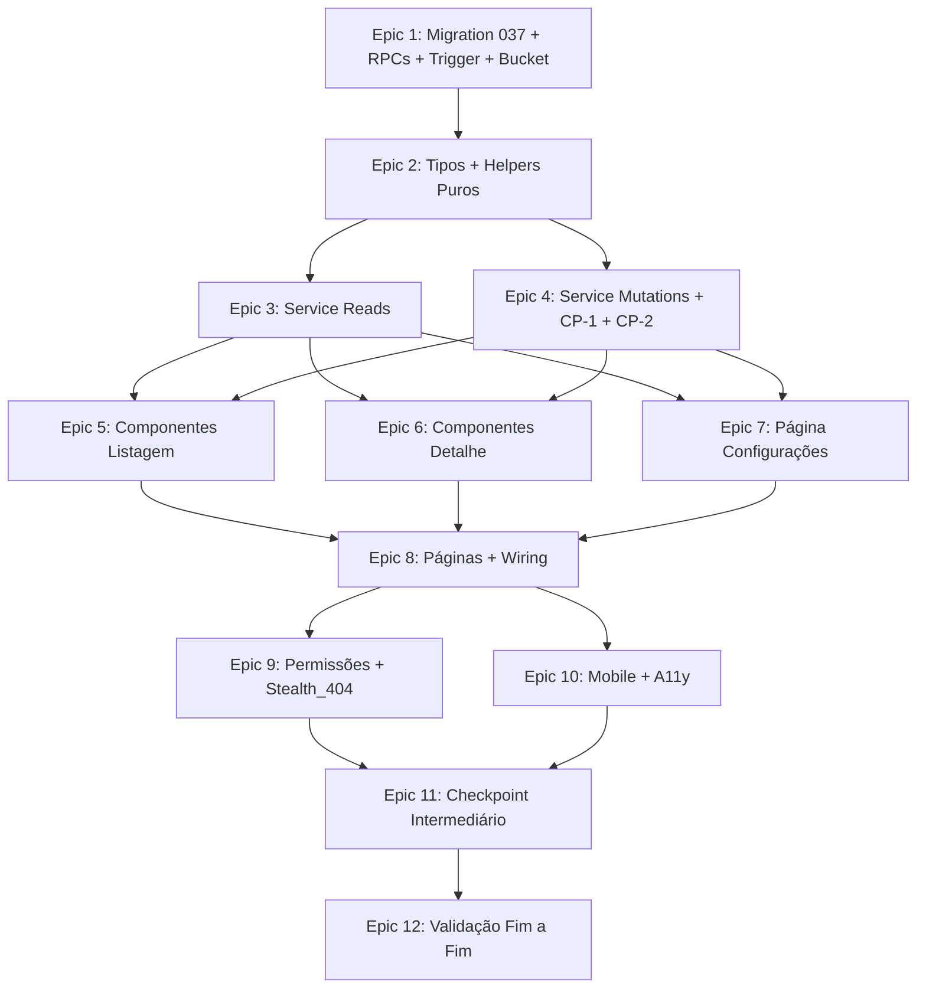

# Implementation Plan

## Overview

Plano de implementação do módulo Financeiro do painel admin, organizado em 12 epics. Cada task referencia requisitos do `requirements.md` (Reqs X.Y) e propriedades de correção do `design.md` (CP-N).

Convenções herdadas (não redocumentar — ver `project-conventions.md` e `admin-patterns.md`):
- Migrations idempotentes com `BEGIN/COMMIT` e `DO $check$` defensivo.
- pt-BR em UI/comentários; action codes e error codes em inglês.
- Padrão compacto pós-cleanup (sem `<h1>` grande, popover de filtros, paginação 10/50/100, botões `text-xs px-2.5 py-1`).
- CSV: BOM UTF-8 + `;` + RFC 4180 + truncamento 10000 linhas.
- Property tests obrigatórios (CP-1, CP-2) **NÃO** levam asterisco. Opcionais (CP-3 a CP-6) levam `*`.
- Toda mutação passa por `executeAdminMutation`; idempotência via `_SKIPPED` log dentro da RPC.
- Versionamento otimista via `updated_at` + `STALE_VERSION`.

## Tasks

- [ ] 1. Migration 037 e contratos base de banco
  - [x] 1.1 Criar `supabase/migrations/037_admin_financeiro.sql`
    - Cabeçalho com objetivo, dependências de migrations 030–036.
    - Envolver em `BEGIN; ... COMMIT;`.
    - 5 blocos `DO $check$ ... $check$` defensivos validando: (a) `is_admin_with_permission(text)` existe; (b) `admin_audit_logs` existe com `after_data`; (c) `fretes.status`, `fretes.value`, `fretes.embarcador_id` existem; (d) `users` existe; (e) `storage.buckets` e `storage.objects` acessíveis.
    - Cada bloco levanta `EXCEPTION` clara quando dependência ausente.
    - _Requirements: 13.1, 13.2, 13.3, 13.4, 13.7_

  - [x] 1.2 Criar tabela `financial_settings` com snapshot histórico
    - 6 colunas: `id`, `commission_pct numeric(5,2) CHECK (>=0 AND <=50)`, `commission_brackets jsonb DEFAULT '[]'`, `effective_from timestamptz DEFAULT NOW()`, `updated_at`, `updated_by uuid REFERENCES users(id) ON DELETE SET NULL`.
    - Constraint `chk_financial_settings_brackets_is_array` (`jsonb_typeof = 'array'`).
    - Índice `idx_financial_settings_effective_from` em `(effective_from DESC)`.
    - `ENABLE ROW LEVEL SECURITY`.
    - Policy `financial_settings_no_dml` `FOR ALL USING (false) WITH CHECK (false)` — toda interação via RPC `SECURITY DEFINER`.
    - `COMMENT ON TABLE` e nas colunas críticas.
    - _Requirements: 2.12, 13.3_

  - [x] 1.3 Criar tabela `financial_repasses` (1:1 com fretes encerrados)
    - 18 colunas conforme schema em design §Data Models.
    - 3 constraints de coerência: `chk_financial_repasses_arithmetic` (`valor_liquido = valor_bruto - commission_value`), `chk_financial_repasses_pendente_clean` (estado pendente sem campos de paid/reverted), `chk_financial_repasses_paid_consistency` (estado pago/estornado com campos coerentes).
    - 4 índices: `idx_financial_repasses_status_closed_at`, `idx_financial_repasses_embarcador_status`, `idx_financial_repasses_motorista_status WHERE motorista_id IS NOT NULL`, `idx_financial_repasses_paid_at WHERE status='pago'`.
    - `ENABLE ROW LEVEL SECURITY`.
    - Policy `financial_repasses_no_dml` `USING (false) WITH CHECK (false)`.
    - `COMMENT ON TABLE` e nas colunas críticas.
    - _Requirements: 13.3_

  - [x] 1.4 Criar função pura `compute_commission_value(numeric, jsonb)` `IMMUTABLE`
    - Implementação espelhada por `computeCommission` (TS) — paridade obrigatória CP-1.
    - Tratamento defensivo: `NULL` ou negativo → `0`.
    - Settings ausente/malformado → flat 0% com `resolved_via='flat_default'`.
    - Iteração linear pelas brackets: intervalo `[min, max)` exceto última (inclusivo no `max`).
    - Cai em flat para valores acima do teto da maior bracket.
    - Arredondamento `ROUND(v_value * v_resolved_pct / 100.0, 2)`.
    - Retorna `jsonb_build_object('commission_pct', ..., 'commission_value', ..., 'resolved_via', ...)`.
    - `REVOKE ALL FROM PUBLIC` + `GRANT EXECUTE TO authenticated`.
    - _Requirements: 2.4, 2.5, 2.13, 2.14, 14.4, 14.10, CP-1_

  - [x] 1.5 Criar trigger `on_frete_close_create_repasse` AFTER UPDATE em `fretes`
    - Função suporte `on_frete_close_create_repasse() RETURNS trigger SECURITY DEFINER SET search_path=public`.
    - Dispara apenas quando `OLD.status IS DISTINCT FROM NEW.status AND NEW.status = 'encerrado'`.
    - Resolve `Vigent_Settings` via `SELECT ... FROM financial_settings ORDER BY effective_from DESC LIMIT 1`.
    - Defensivo: settings vazio ⇒ flat 0%; `value` NULL ou negativo ⇒ 0.
    - Chama `compute_commission_value(value, settings_jsonb)`.
    - `INSERT INTO financial_repasses (...) ON CONFLICT (frete_id) DO NOTHING` — idempotente em re-encerramento.
    - `DROP TRIGGER IF EXISTS` + `CREATE TRIGGER`.
    - _Requirements: 14.1, 14.2, 14.3, 14.4, 14.5, 14.6, 14.7, 14.8, 14.9_

  - [x] 1.6 RPC `admin_financeiro_settings_get()` `STABLE SECURITY DEFINER`
    - Auth check + `is_admin_with_permission('FINANCEIRO_VIEW')`.
    - Falha de gating ⇒ INSERT `FINANCIAL_VIEW_DENIED` em `admin_audit_logs` + `RAISE permission_denied`.
    - `SELECT * FROM financial_settings ORDER BY effective_from DESC LIMIT 1`.
    - Vazio ⇒ retorna sentinel `{ id: null, commission_pct: 0, commission_brackets: [], ...}`.
    - `REVOKE ALL FROM PUBLIC` + `GRANT EXECUTE TO authenticated`.
    - _Requirements: 2.2, 11.1, 11.4_

  - [x] 1.7 RPC `admin_financeiro_settings_update(numeric, jsonb, timestamptz)` `SECURITY DEFINER`
    - Auth check + `FINANCEIRO_EDIT` gating + `FINANCIAL_VIEW_DENIED` em path negativo.
    - Validações de domínio (cada falha = `RAISE EXCEPTION ... USING ERRCODE = 'P0001'`):
      - `commission_pct ∈ [0, 50]` ⇒ `COMMISSION_PCT_OUT_OF_RANGE`.
      - `jsonb_typeof = 'array'` ⇒ `INVALID_BRACKETS`.
      - `jsonb_array_length <= 5` ⇒ `BRACKETS_TOO_MANY`.
      - Cada entrada: `min_value >= 0`, `max_value > min_value`, `pct ∈ [0,50]` ⇒ `INVALID_BRACKETS`.
      - Ordenadas ASC por `min_value` ⇒ `BRACKETS_OUT_OF_ORDER`.
      - Sem sobreposição (`max[i] <= min[i+1]`) ⇒ `BRACKETS_OVERLAP`.
      - Sem buracos (`max[i] = min[i+1]`) ⇒ `BRACKETS_GAP`.
    - Versionamento otimista vs última linha de `financial_settings`.
    - **INSERT** de nova linha (snapshot histórico — não UPDATE).
    - Retorna linha completa nova.
    - _Requirements: 2.4, 2.5, 2.6, 2.9, 2.12_

  - [x] 1.8 RPC `admin_repasse_mark_paid(uuid, text, text, text, timestamptz)` `SECURITY DEFINER`
    - Auth + `FINANCEIRO_EDIT` gating + `FINANCIAL_VIEW_DENIED`.
    - Validações: `payment_method ∈ enum`, `notes <= 1000 chars`, `proof_path <= 500 chars`.
    - `SELECT FOR UPDATE` no repasse.
    - `NOT FOUND` ⇒ `RAISE 'NOT_FOUND'`.
    - **CP-2 idempotência:** `status = 'pago'` ⇒ INSERT `FINANCIAL_PAYMENT_MARKED_SKIPPED` com `after_data = jsonb_build_object('reason','ALREADY_PAID','attempted_method',p_method)` + `RETURN { skipped: true, reason: 'ALREADY_PAID' }` (não muta).
    - `status = 'estornado'` ⇒ `RAISE 'INVALID_STATUS'`.
    - Versionamento otimista: `UPDATE ... WHERE id=$ AND updated_at=$expected`.
    - `ROW_COUNT = 0` ⇒ `RAISE 'STALE_VERSION'`.
    - Retorna `{ ok: true, updated_at }`.
    - _Requirements: 6.7, 6.10, 6.11, 6.12, 6.13, CP-2_

  - [x] 1.9 RPC `admin_repasse_estornar(uuid, text, timestamptz)` `SECURITY DEFINER`
    - Auth + `FINANCEIRO_EDIT` gating + `FINANCIAL_VIEW_DENIED`.
    - Validar `length(trim(reason)) BETWEEN 1 AND 500`.
    - `SELECT FOR UPDATE`.
    - `NOT FOUND` ⇒ `NOT_FOUND`.
    - `status = 'pendente'` ⇒ `INVALID_STATUS` (apenas pagos podem ser estornados).
    - Idempotência: `status = 'estornado'` ⇒ INSERT `FINANCIAL_PAYMENT_REVERTED_SKIPPED` + `RETURN { skipped: true, reason: 'ALREADY_REVERTED' }`.
    - Versionamento otimista + UPDATE.
    - **Preserva snapshot histórico**: `payment_proof_url`, `paid_at`, `paid_by`, `payment_method`, `notes` mantidos.
    - Popula `reverted_at = NOW()`, `reverted_by = v_caller`, `revert_reason = trim(reason)`.
    - _Requirements: 7.5, 7.6, 7.7, 7.8, 7.9_

  - [x] 1.10 RPC `admin_repasses_list(jsonb)` `STABLE SECURITY DEFINER`
    - Auth + `FINANCEIRO_VIEW` gating + `FINANCIAL_VIEW_DENIED`.
    - Validar `page >= 1`, `page_size ∈ {10, 50, 100}`, `status ∈ {todos, pendente, pago, estornado}`, `to >= from` quando ambos não-nulos.
    - WHERE dinâmico aplicando: `status` (skip se 'todos'), `embarcador_id`, `motorista_id`, `period_kind` (`closed_at` OU `paid_at` quando `status='pago'`), `q` ILIKE em embarcador/motorista name (≥ 2 chars).
    - JOINs com `users` (embarcador_name, motorista_name) e `fretes` (origin, destination).
    - `ORDER BY` conforme `sort` + tiebreaker `id` para determinismo.
    - `LIMIT page_size OFFSET (page-1)*page_size`.
    - Retorna `jsonb_build_object('rows', jsonb_agg(...), 'total', count_total)`.
    - _Requirements: 1.10, 3.1, 3.2, 3.3, 3.4, 4.5_

  - [x] 1.11 RPC `admin_financeiro_summary(timestamptz, timestamptz)` `STABLE SECURITY DEFINER`
    - Auth + `FINANCEIRO_VIEW` gating.
    - Defaults: `from = COALESCE(p_from, date_trunc('month', NOW()))`, `to = COALESCE(p_to, NOW())`.
    - Validações: `to >= from` (`INVALID_PERIOD`), `(to - from) <= INTERVAL '365 days'` (`PERIOD_TOO_LARGE`).
    - 4 sub-queries:
      - `receita_mes` = SUM(commission_value) WHERE status='pago' AND paid_at ∈ [from, to].
      - `pendentes` = (count, sum(valor_bruto)) WHERE status='pendente' AND closed_at ∈ [from, to].
      - `pagos_mes` = (count, sum(valor_liquido)) WHERE status='pago' AND paid_at ∈ [from, to].
      - `top_embarcador_devedor` = top 1 por SUM(valor_bruto) WHERE status='pendente' (com tiebreaker id).
    - Card 4 = `null` se sem pendências.
    - Retorna `jsonb_build_object(...)`.
    - _Requirements: 5.1, 5.2, 5.3, 5.4, 5.7, 5.9_

  - [x] 1.12 Bucket privado `financial_proofs` + 4 policies
    - `INSERT INTO storage.buckets (id, name, public, file_size_limit, allowed_mime_types) VALUES ('financial_proofs', 'financial_proofs', false, 5242880, ARRAY['application/pdf','image/png','image/jpeg','image/webp']) ON CONFLICT (id) DO NOTHING`.
    - 4 policies em `storage.objects`:
      - `financial_proofs_select` SELECT — `bucket_id = 'financial_proofs' AND is_admin_with_permission('FINANCEIRO_VIEW')`.
      - `financial_proofs_insert` INSERT — `FINANCEIRO_EDIT` em WITH CHECK.
      - `financial_proofs_update` UPDATE — `FINANCEIRO_EDIT` em USING e WITH CHECK.
      - `financial_proofs_delete` DELETE — `USING (false)` (bloqueado no MVP).
    - Idempotente via `DROP POLICY IF EXISTS` antes de cada `CREATE POLICY`.
    - _Requirements: 10.1, 10.2, 10.3, 10.4, 10.5_

  - [x] 1.13 Bloco `-- VERIFY` pós-deploy comentado
    - SELECTs documentando: tabelas existem; trigger ligado em `fretes`; `compute_commission_value(1000, '{"commission_pct":5,...}')` retorna `commission_value=50.00`; bucket existe com 4 policies.
    - Comentado com `/* ... */` — smoke test executável manualmente após deploy.
    - _Requirements: 13.8_

  - [ ]* 1.14 Smoke test de idempotência
    - Doc em `supabase/migrations/_test_idempotency_037.sql` que aplica a migration 2x e valida que a segunda execução não falha e não duplica objetos.
    - _Requirements: 13.3_

  - [x] 1.15 Criar `supabase/migrations/037_admin_financeiro_rollback.sql`
    - DROP de todas as policies, RPCs, trigger + função suporte, função pura, e tabelas (em ordem reversa de dependência).
    - **Mantém o bucket `financial_proofs`** e seus objetos para preservar comprovantes — operador decide manualmente.
    - **Não** é auto-aplicado; serve como referência.
    - _Requirements: 13.5, 13.6_

- [ ] 2. Tipos públicos e helpers puros do service
  - [x] 2.1 Criar `src/services/admin/financeiro.ts` parte 1 — tipos públicos
    - Enums: `RepasseStatus`, `PaymentMethod`.
    - Interfaces: `CommissionBracket`, `FinanceiroSettings`, `RepasseRow`, `RepasseFilters`, `ListRepassesResult`, `RepasseDetail`, `FinanceiroSummary`, `MarkAsPaidPayload`, `EstornarPayload`, `MutationResult`, `AuditLogEntry`, `UpdateSettingsPayload`.
    - `DEFAULT_REPASSE_FILTERS` constante.
    - Classe `FinanceiroServiceError` com `code: FinanceiroErrorCode`.
    - Tabela de mensagens canônicas pt-BR `FINANCEIRO_ERROR_MESSAGES`.
    - _Requirements: 4.1–4.6, 6.2_

  - [x] 2.2 Helpers puros e testáveis
    - `computeCommission(valor_bruto, settings): { commission_pct, commission_value, valor_liquido, resolved_via }` — paritário com SQL CP-1.
    - `validateBrackets(brackets): { ok: true } | { ok: false, code, index? }` — valida ordem, sem buracos, sem sobreposição, ranges.
    - `sanitizeProofFilename(raw): string` — remove acentos, regex `[^a-zA-Z0-9._-] → _`, colapsa `_+`, trim, max 100 chars (preserva extensão), fallback `comprovante`. **Idempotente**.
    - `validateProofFile(file): null | { code, message }` — MIME ∈ {PDF, PNG, JPG, WEBP} + size ≤ 5MB.
    - `parseFiltersFromQuery(qs)` / `serializeFiltersToQuery(f)` — validação de domínio + omissão de defaults.
    - `formatBRL(n)`, `formatNumber(n)`, `formatDate(iso)`, `formatPaymentMethod(m)`, `formatRelativeTime(iso)`.
    - _Requirements: 1.11, 1.12, 1.13, 2.5, 6.4, CP-1_

  - [x] 2.3 Helper `mapPostgresError`
    - Mapeia código + mensagem Postgres para `FinanceiroErrorCode` tipado.
    - 12 mapeamentos: PERMISSION_DENIED, NOT_FOUND, STALE_VERSION, INVALID_PERIOD, PERIOD_TOO_LARGE, INVALID_STATUS, COMMISSION_PCT_OUT_OF_RANGE, BRACKETS_*, INVALID_BRACKETS, INVALID_INPUT, UNKNOWN.
    - Centralizado em `src/services/admin/financeiro.ts` ou `src/services/admin/financeiro-errors.ts`.

- [ ] 3. Service core: leituras
  - [x] 3.1 `getSettings(): Promise<FinanceiroSettings>`
    - Wrapper RPC `admin_financeiro_settings_get`.
    - Mapeia erro Postgres via `mapPostgresError`.
    - Retorna `Vigent_Settings` ou sentinel quando vazio.
    - _Requirements: 2.2_

  - [x] 3.2 `listRepasses(filters: RepasseFilters): Promise<ListRepassesResult>`
    - Wrapper RPC `admin_repasses_list(p_filters jsonb)`.
    - Converte camelCase TS → snake_case JSON antes de enviar.
    - Mapeia resposta para `RepasseRow[]` com `total: number`.
    - _Requirements: 3.1–3.4, 4.5_

  - [x] 3.3 `getSummary(from, to): Promise<FinanceiroSummary>`
    - Wrapper RPC `admin_financeiro_summary`.
    - Degradação parcial via `bundle.errors[<card>]` quando sub-objeto vier null/inválido.
    - _Requirements: 5.1, 5.7, 5.8, 5.9_

  - [x] 3.4 `getRepasseDetail(id: string): Promise<RepasseDetail>`
    - Validar UUID antes de chamar RPC; UUID inválido ⇒ `FinanceiroServiceError('NOT_FOUND')` (UI converte em Stealth_404).
    - Sub-queries em `Promise.allSettled`: repasse principal, frete, embarcador, motorista (se aplicável), audit history (gated AUDIT_VIEW).
    - Falha de bloco preenche `bundle.errors[<bloco>]`; demais blocos continuam.
    - Bloco principal (`repasse`) é o único que pode lançar `NOT_FOUND` global.
    - _Requirements: 8.1, 8.2, 8.3_

  - [x] 3.5 `getProofSignedUrl(path: string): Promise<string>`
    - Wrapper `supabase.storage.from('financial_proofs').createSignedUrl(path, 7 * 24 * 3600)`.
    - Erro mapeado para `FinanceiroServiceError('NETWORK_ERROR')`.
    - _Requirements: 10.7_

  - [ ]* 3.6 Property test CP-3 opcional (compute_commission_value SQL puro via Postgres local)
    - Integração: gated por env var `RUN_SUPABASE_INTEGRATION=1`. Skipa em CI default.
    - Aplica migration 037 em Postgres local + chama função 100x com mesmo input + valida outputs idênticos.
    - **Validates: Requirements 14.10**

- [ ] 4. Service core: mutações
  - [x] 4.1 `updateSettings(payload, expected_updated_at): Promise<FinanceiroSettings>`
    - Pré-validação client via `validateBrackets`; falhas mapeadas para `FinanceiroErrorCode` antes da RPC.
    - `executeAdminMutation` com `action='FINANCIAL_SETTINGS_UPDATED'`, `targetType='financial_settings'`, `targetId=<novo_id>`, `before` = config anterior completa, `after` = nova config.
    - Wrapper RPC `admin_financeiro_settings_update(p_commission_pct, p_commission_brackets, p_expected_updated_at)`.
    - Em `STALE_VERSION`, propaga erro tipado; UI faz refetch.
    - _Requirements: 2.9, 2.12_

  - [x] 4.2 `uploadProof(repasse_id: string, file: File): Promise<string>`
    - `sanitizeProofFilename(file.name)`.
    - Path: `<repasse_id>/<Date.now()>_<sanitized>` (timestamp evita colisão em re-tentativa).
    - `supabase.storage.from('financial_proofs').upload(path, file, { contentType: file.type, upsert: false })`.
    - Erro ⇒ `FinanceiroServiceError('UPLOAD_FAILED')`.
    - Retorna o `path` para gravar em `payment_proof_url`.
    - _Requirements: 10.6, 10.7, 10.8_

  - [x] 4.3 `markAsPaid(id, payload): Promise<MutationResult>`
    - Pré-validação client: `validateProofFile` se há arquivo; `notes <= 1000 chars`.
    - Se há arquivo, chama `uploadProof` antes (síncrono).
    - `executeAdminMutation` com `action='FINANCIAL_PAYMENT_MARKED'`, `targetType='financial_repasses'`, `targetId=id`, `before={status:'pendente'}`, `after={status:'pago', payment_method, paid_at, paid_by, payment_proof_url, notes}`.
    - Wrapper RPC `admin_repasse_mark_paid`.
    - Detecta `{ skipped: true, reason: 'ALREADY_PAID' }` e propaga sem erro (`MutationResult` aceita ambos).
    - `STALE_VERSION` ⇒ `FinanceiroServiceError('STALE_VERSION')`.
    - _Requirements: 6.7, 6.8, 6.9, 6.10, 6.12, 6.13, CP-2_

  - [x] 4.4 `estornar(id, payload): Promise<MutationResult>`
    - Pré-validação client: `revert_reason` 1..500 chars (após trim).
    - `executeAdminMutation` com `action='FINANCIAL_PAYMENT_REVERTED'`, `before={status:'pago'}`, `after={status:'estornado', reverted_at, reverted_by, revert_reason}`.
    - Wrapper RPC `admin_repasse_estornar`.
    - Trata `{ skipped: true, reason: 'ALREADY_REVERTED' }`, `INVALID_STATUS`, `STALE_VERSION`.
    - _Requirements: 7.4, 7.5, 7.6, 7.7, 7.8_

  - [x] 4.5 `exportRepasseCSV(filters): Promise<{ csv, filename, total }>`
    - `listRepasses` paginando até atingir 10000 linhas ou `total`.
    - CSV com cabeçalho `id;frete_id;embarcador_name;motorista_name;valor_bruto;commission_pct;commission_value;valor_liquido;status;closed_at;paid_at;payment_method` + BOM UTF-8 + `;` + RFC 4180 + `\r\n`.
    - Filename `financeiro_<YYYYMMDD>_<HHmm>.csv`.
    - `logAdminAction` com `action='FINANCIAL_EXPORTED'`, `after={ filters, row_count, truncated }`.
    - _Requirements: 9.2, 9.3, 9.4, 9.5, 9.6, 9.7, 9.8, 9.9, 9.10_

  - [~] 4.6 Property test CP-1 OBRIGATÓRIA (paridade comissão TS↔SQL↔trigger)
    - `src/__tests__/admin/financeiro/cp1_commission_parity.property.test.ts` + helper `sql-mirror.ts`.
    - 3 sub-propriedades:
      - **P1 (determinismo TS):** `computeCommission(v, s) === computeCommission(v, s)`.
      - **P2 (paridade TS↔SQL):** `computeCommissionSqlMirror(v, s).commission_value === computeCommission(v, s).commission_value`.
      - **P3 (paridade trigger):** snapshot do trigger (simulado em mock) === `computeCommission(value, vigent_settings)`.
    - Geradores fast-check cobrindo: flat puro (brackets vazias), 1..5 entradas, valor=0, valor em borda min/max, valor fora de bracket (cai em flat).
    - Mínimo 100 iterações (`{ numRuns: 100 }`).
    - **Validates: Requirements 2.4, 2.5, 2.6, 2.13, 2.14, 14.4, 14.10**

  - [ ] 4.7 Property test CP-2 OBRIGATÓRIA (markAsPaid idempotente)
    - `src/__tests__/admin/financeiro/cp2_mark_paid_idempotent.property.test.ts` + mock supabase in-memory `supabase-mock.ts`.
    - 3 sub-propriedades:
      - **P1 (skip retornado):** N≥1 chamadas após primeira marcação retornam `{ skipped: true, reason: 'ALREADY_PAID' }`.
      - **P2 (sem mutação):** snapshot do repasse permanece inalterado após N chamadas (`payment_method`, `paid_at`, `paid_by`, `payment_proof_url`, `notes`).
      - **P3 (count exato audit):** exatamente 1 `FINANCIAL_PAYMENT_MARKED` + (N-1) `FINANCIAL_PAYMENT_MARKED_SKIPPED` em `admin_audit_logs` para o `target_id=repasse.id`.
    - Geradores: `arbRepassePendente`, `arbMarkPayload`, `arbN ∈ [1..10]`.
    - `{ numRuns: 100 }`.
    - **Validates: Requirements 6.12**

  - [ ]* 4.8 Property test CP-4 opcional — round-trip CSV
    - `parseCsv(serializeCsv(rows)) === rows` para `arb` de `RepasseRow[]`.
    - **Validates: Requirements 9.4, 9.5, 9.6, 9.7**

  - [ ]* 4.9 Property test CP-5 opcional — `estornar` idempotente
    - Espelha CP-2 com `status='estornado'` e action `FINANCIAL_PAYMENT_REVERTED_SKIPPED`.
    - **Validates: Requirements 7.7**

  - [ ]* 4.10 Property test CP-6 opcional — round-trip URL ↔ filtros
    - `parseFiltersFromQuery(serializeFiltersToQuery(f)) === f` para `arb` de `RepasseFilters` válidos.
    - **Validates: Requirements 1.11, 1.12, 1.13**

- [ ] 5. Componentes da listagem
  - [ ] 5.1 `src/components/admin/financeiro/FinanceiroBlockSkeleton.tsx` + `FinanceiroBlockError.tsx`
    - Skeleton: bloco `animate-pulse` com `aria-busy="true"` + `aria-live="polite"`. Props `{ height?, ariaLabel? }`.
    - Error: bloco com mensagem (default `Bloco indisponível.`) + botão `Tentar novamente`. Props `{ message?, onRetry? }`.
    - _Requirements: 12.x_

  - [ ] 5.2 `FinanceiroMiniDashboard.tsx`
    - 4 cards (Receita do mês, Repasses pendentes, Repasses pagos no mês, Top embarcador devedor).
    - Cada card com `role="region"` + `aria-label` agregando label + valor BRL.
    - Layout responsivo: `grid-cols-1 md:grid-cols-2 xl:grid-cols-4 gap-3`.
    - Loading: skeletons com mesma altura/cor final.
    - Degradação parcial: `summary.errors[<card>]` ⇒ aquele card vira `FinanceiroBlockError onRetry`. Demais permanecem.
    - `top_embarcador_devedor === null` ⇒ "Sem pendências.".
    - _Requirements: 5.1, 5.5, 5.6, 5.7, 5.8_

  - [ ] 5.3 `FinanceiroFilterPopover.tsx`
    - Padrão herdado de `BlacklistFilters` / `FretesFilters` (popover compacto com botão de ícone `SlidersHorizontal`).
    - Conteúdo: `<select>` Status, `<EmbarcadorCombobox>` searchable (debounce 250ms), `<MotoristaCombobox>` análogo, toggle `Período sobre` (Fechamento/Pagamento), inputs `De`/`Até` (`<input type="date">`), input texto `q` (debounce 300ms).
    - Validação: `from > to` ⇒ erro inline + botão `Aplicar` desabilitado.
    - `Aplicar` reseta `page=1`. `Limpar filtros` aplica `DEFAULT_REPASSE_FILTERS`.
    - `Esc` ou clique fora fecha sem aplicar.
    - `role="dialog"`, `aria-modal="false"`, botão com `aria-expanded`.
    - Badge com contagem de filtros ativos no botão.
    - _Requirements: 4.1, 4.2, 4.3, 4.4, 4.5, 4.6, 4.7, 4.8, 4.9_

  - [ ] 5.4 `FinanceiroTable.tsx` (desktop)
    - Colunas: ID curto (8 chars + tooltip uuid), Frete (link `/admin/fretes/<id>`), Embarcador (link `/admin/users/<id>`), Motorista (link ou em branco), Valor bruto (BRL), Comissão (% + R$), Líquido (BRL), Status (badge), Fechamento (`dd/MM/yyyy HH:mm`), Pagamento (`paid_at` + método capitalizado quando pago), Ações.
    - Ações: `Detalhe` sempre, `Marcar pago` se pendente + canEdit, `Estornar` se pago + canEdit, `Comprovante` se pago + payment_proof_url.
    - Ordenação: botões compactos no topo entre `closed_at_desc`, `paid_at_desc`, `valor_liquido_desc` (ícone `ChevronDown`).
    - Paginação inferior: seletor `<select>` 10/50/100 + `Página X de Y · N resultados`.
    - Empty: `Nenhum repasse encontrado com os filtros atuais.` + link `Limpar filtros` quando há filtros não-default.
    - _Requirements: 3.1, 3.2, 3.3, 3.4, 3.5, 3.6, 3.7, 3.8, 3.9, 3.10, 3.11, 3.12, 3.13, 3.14, 3.15_

  - [ ] 5.5 `FinanceiroMobileCards.tsx` (`<768px`)
    - Lista de cards single-column com mesmo conteúdo essencial da tabela.
    - Cada card é `<article>` com `aria-label` contendo id curto + status + valores.
    - Botões `Marcar pago` / `Detalhe` / `Comprovante` empilhados.
    - Paginação no fundo, idêntica desktop.
    - _Requirements: 12.5_

  - [ ] 5.6 `MarkAsPaidModal.tsx`
    - `role="dialog"`, `aria-modal="true"`, `aria-labelledby`.
    - Foco inicial em `Cancelar`.
    - Dropdown `Método de pagamento` sem default.
    - `<input type="file" accept=".pdf,.png,.jpg,.jpeg,.webp">` com label visível.
    - `<textarea maxLength=1000>` com contador `0/1000`.
    - Validação MIME/size via `validateProofFile`.
    - Submit flow: upload sync (se há arquivo) → markAsPaid → toast + close + refetch.
    - Trata `{ ok: true }` (toast verde), `{ skipped: true }` (toast neutro), `STALE_VERSION` (toast + refetch), `UPLOAD_FAILED` (toast + modal segue aberto).
    - Focus trap (reusa pattern dos modais blacklist).
    - `Esc` fecha sem submeter.
    - Mobile: full-screen com botões empilhados.
    - _Requirements: 6.1, 6.2, 6.3, 6.4, 6.5, 6.6, 6.7, 6.8, 6.9, 6.10, 6.11_

  - [ ] 5.7 `EstornarModal.tsx`
    - `role="dialog"`, foco inicial em `Cancelar`.
    - Mensagem `Confirmar estorno do repasse <id_curto>?`.
    - `<textarea>` `Motivo` `minLength=1 maxLength=500` com contador.
    - Submit flow: estornar → toast + close + refetch.
    - Trata `{ ok: true }`, `{ skipped: true, reason: 'ALREADY_REVERTED' }`, `INVALID_STATUS`, `STALE_VERSION`.
    - _Requirements: 7.1, 7.2, 7.3, 7.4, 7.5, 7.10_

- [ ] 6. Componentes do detalhe
  - [ ] 6.1 `FinanceiroDetailHeader.tsx`
    - `#<id_curto>` em `font-mono` + badge de status.
    - Botões compactos gated:
      - `Marcar como pago` quando `status='pendente'` E `canEdit`.
      - `Estornar` quando `status='pago'` E `canEdit`.
      - `Baixar comprovante` quando `status='pago'` E `payment_proof_url` (visível com `FINANCEIRO_VIEW`).
    - Banner cinza pós-estorno: `Repasse estornado em <data>. Motivo: <reason>.`
    - _Requirements: 8.4, 8.5, 8.6, 8.7_

  - [ ] 6.2 `FinanceiroDetailFreteBlock.tsx`
    - Título `Frete vinculado` + link `/admin/fretes/<frete_id>`.
    - Resumo: origem→destino, data postagem, valor bruto, comissão, valor líquido.
    - `error` ⇒ `<FinanceiroBlockError />`.
    - _Requirements: 8.1_

  - [ ] 6.3 `FinanceiroDetailUserBlock.tsx`
    - Reutilizável para embarcador e motorista (`kind: 'embarcador' | 'motorista'`).
    - `user === null` (motorista ausente) ⇒ texto `Sem motorista vinculado.`.
    - Caso normal: nome (link `/admin/users/<id>`) + email.
    - _Requirements: 8.1_

  - [ ] 6.4 `FinanceiroAuditHistoryBlock.tsx`
    - Gating UI via `useAdminPermission('AUDIT_VIEW').allowed`. Sem permissão ⇒ não renderiza nada.
    - Lista compacta `created_at • action • admin_username • diff resumido`.
    - Vazio ⇒ `Nenhum evento registrado.`.
    - _Requirements: 8.8, 8.9_

- [ ] 7. Página de configurações
  - [ ] 7.1 `src/pages/admin/financeiro/FinanceiroConfiguracoesPage.tsx`
    - Gating: `useAdminPermission('FINANCEIRO_EDIT')`. Sem ⇒ `Stealth_404`.
    - Layout vertical com 3 blocos.
    - _Requirements: 1.6_

  - [ ] 7.2 Form de edição
    - Input `Percentual padrão (%)` numeric `min=0 max=50 step=0.01`.
    - Tabela editável de brackets com colunas `min`, `max`, `pct` + botão `Remover` por linha.
    - Botão `Adicionar faixa` (limite 5).
    - Botão `Salvar` (disabled se validação falha) + botão `Descartar`.
    - _Requirements: 2.1, 2.5_

  - [ ] 7.3 Validação client espelhando RPC
    - Helper `validateBrackets` que retorna `{ ok: true } | { ok: false, code, index? }`.
    - Erros mostrados inline na linha conflitante.
    - `commission_pct ∉ [0, 50]` ⇒ erro inline + botão `Salvar` desabilitado.
    - _Requirements: 2.4, 2.5, 2.6_

  - [ ] 7.4 Bloco `Configuração vigente`
    - Lê via `getSettings()`.
    - Mostra `commission_pct`, `commission_brackets`, `effective_from`, `updated_by` (resolvido para `users.name`).
    - _Requirements: 2.2_

  - [ ] 7.5 Bloco `Simulador`
    - Input `Valor do frete (R$)`.
    - Preview live de `commission_pct`, `commission_value`, `valor_liquido` aplicando `computeCommission` sobre a config sendo editada (não vigente).
    - _Requirements: 2.3_

  - [ ] 7.6 Save flow
    - `executeAdminMutation` via `updateSettings`.
    - Em `STALE_VERSION` ⇒ toast `Outro admin atualizou. Recarregando.` + refetch automático.
    - Em sucesso ⇒ toast `Configuração salva.` + refetch.
    - Em `permission_denied` ⇒ toast `Sem permissão para alterar configuração.`.
    - _Requirements: 2.9, 2.10, 2.11_

  - [ ] 7.7 Mensagens informativas inline
    - `Quando há faixas que cobrem o valor do frete, o percentual padrão é ignorado para esse frete.`
    - `Aplicação prospectiva: repasses já criados mantêm a comissão congelada no momento do encerramento do frete.`
    - _Requirements: 2.7, 2.8_

- [ ] 8. Páginas e wiring
  - [ ] 8.1 `src/pages/admin/financeiro/FinanceiroListPage.tsx`
    - Top bar: contador período, `Atualizar`, `Filtros` (popover), `Exportar CSV` (gated FINANCEIRO_VIEW), `Configurar comissão` (gated FINANCEIRO_EDIT).
    - URL ↔ filters via `parseFiltersFromQuery` / `serializeFiltersToQuery`.
    - Mobile breakpoint detection (renderiza `FinanceiroTable` desktop ou `FinanceiroMobileCards`).
    - Composição: `FinanceiroMiniDashboard` no topo + `FinanceiroFilterPopover` + tabela/cards.
    - Modais `MarkAsPaidModal` e `EstornarModal` controlados localmente.
    - Gating: `FINANCEIRO_VIEW` via `AdminGuard`. Sem ⇒ `Stealth_404`.
    - _Requirements: 1.1, 1.4, 1.7, 1.8, 1.9, 1.10, 1.11, 1.12, 1.13, 1.14, 3.x_

  - [ ] 8.2 `src/pages/admin/financeiro/FinanceiroDetailPage.tsx`
    - Path param `:id`. Validar UUID antes de chamar RPC. UUID inválido ou `NOT_FOUND` ⇒ `Stealth_404`.
    - Compõe os 4 blocos: header, frete, embarcador, motorista, audit history.
    - Banner `Repasse estornado em <data>. Motivo: <reason>.` quando `status='estornado'`.
    - Modais `MarkAsPaidModal` e `EstornarModal` controlados localmente.
    - Após mutação bem-sucedida, refetch detail.
    - Degradação parcial por bloco.
    - _Requirements: 1.3, 1.5, 8.1, 8.2, 8.3, 8.7_

  - [ ] 8.3 Atualizar `src/components/admin/AdminLayoutRoute.tsx`
    - Adicionar 3 rotas filhas dentro do bloco `<AdminGuard><AdminShell>...`:
      - `financeiro` (lista)
      - `financeiro/configuracoes`
      - `financeiro/:id` (detalhe)
    - **Atenção à ordem:** `financeiro` antes de `financeiro/configuracoes` antes de `financeiro/:id`. Caso contrário, `:id` casaria com `configuracoes` e renderizaria a página errada.
    - Importar as 3 páginas.
    - _Requirements: 1.1, 1.2, 1.3_

  - [ ] 8.4 Confirmar item Financeiro no AdminSidebar
    - Verificar que `src/components/admin/AdminSidebar.tsx` já tem item Financeiro com `permission: 'FINANCEIRO_VIEW'`. Se não tiver, adicionar.
    - _Requirements: 1.15_

  - [ ]* 8.5 Test de roteamento
    - `src/__tests__/admin/financeiro/routing.test.tsx` garantindo que `financeiro` casa com lista, `financeiro/configuracoes` com config, `financeiro/<uuid>` com detalhe. Regressão da ordem das rotas.

- [ ] 9. Permissões e Stealth_404
  - [ ] 9.1 Verificar Permission_Matrix existente
    - `FINANCEIRO_VIEW` em SUPER_ADMIN, ADMIN, FINANCEIRO; `FINANCEIRO_EDIT` em SUPER_ADMIN, ADMIN. SUPORTE/MODERADOR não têm.
    - **Sem mudança em `permissions.ts`** — apenas confirmação.
    - _Requirements: 11.1, 11.2, 11.3_

  - [ ] 9.2 Confirmar AdminGuard checa permissão correta
    - `/admin/financeiro` e `/admin/financeiro/:id` ⇒ `FINANCEIRO_VIEW`.
    - `/admin/financeiro/configuracoes` ⇒ `FINANCEIRO_EDIT`.
    - Sem permissão ⇒ `Stealth_404` (não `Acesso negado`).
    - _Requirements: 1.4, 1.5, 1.6, 1.7, 11.6_

  - [ ]* 9.3 Test de integração de gating server-side
    - Postgres local + chamadas com diferentes papéis validando `FINANCIAL_VIEW_DENIED` em audit + `permission_denied` retornado.

- [ ] 10. Mobile e Acessibilidade
  - [ ] 10.1 `useMediaQuery` para mobile breakpoint
    - Hook `useMediaQuery('(max-width: 767px)')` em `src/hooks/useMediaQuery.ts` (criar se não existe).
    - Usado por `FinanceiroListPage` para alternar entre `FinanceiroTable` e `FinanceiroMobileCards`.
    - _Requirements: 12.1, 12.5_

  - [ ] 10.2 Modais full-screen em mobile
    - `MarkAsPaidModal` e `EstornarModal` ocupam viewport inteira em `<768px` com `inset-0`.
    - Botões empilhados full-width.
    - _Requirements: 12.3_

  - [ ] 10.3 Focus trap nos modais
    - Reusa pattern dos modais da blacklist (`focus-trap` manual com `useEffect` capturando Tab/Shift+Tab).
    - `Esc` fecha sem submeter.
    - `role="dialog"`, `aria-modal="true"`, `aria-labelledby`.
    - _Requirements: 12.3, 12.7_

  - [ ] 10.4 ARIA em estados dinâmicos
    - Skeletons: `aria-busy="true"` + `aria-live="polite"`.
    - Botão filtros: `aria-expanded={open}`.
    - Cards do mini-dashboard: `role="region"` + `aria-label`.
    - Inputs: `<label htmlFor>` ou `aria-label`.
    - _Requirements: 12.2, 12.4, 12.6, 12.8, 12.9_

- [ ] 11. Checkpoint intermediário
  - [ ] 11.1 `npx tsc --noEmit` zero erros
  - [ ] 11.2 `npx vitest --run` com property tests obrigatórios verdes (4.6 CP-1 + 4.7 CP-2)
  - [ ] 11.3 `npm run build` limpa
  - [ ] 11.4 Smoke manual: aplicar migration 037 em ambiente dev + bloco VERIFY descomentado pontualmente

- [ ] 12. Validação fim a fim e migração
  - [ ]* 12.1 Roteiro E2E manual em `docs/admin-financeiro-e2e.md`
    - Sequência: login ADMIN → configurar comissão flat 5% → encerrar frete via `/admin/fretes` → ver repasse pendente em `/admin/financeiro` → marcar como pago com PIX + PDF → tentar marcar de novo via DevTools (skip) → estornar com motivo → exportar CSV.
    - Casos negativos: SUPORTE em `/admin/financeiro` ⇒ Stealth_404; MODERADOR em `/admin/financeiro/configuracoes` ⇒ Stealth_404; admin sem `FINANCEIRO_EDIT` não vê botão `Marcar pago`.
    - Validar audit logs: `FINANCIAL_SETTINGS_UPDATED`, `FINANCIAL_PAYMENT_MARKED`, `FINANCIAL_PAYMENT_MARKED_SKIPPED`, `FINANCIAL_PAYMENT_REVERTED`, `FINANCIAL_EXPORTED`.

  - [ ] 12.2 Aplicar migration `037_admin_financeiro.sql` em Supabase de dev
    - Push para GitHub ou aplicação manual via Supabase Studio.
    - Rodar bloco `-- VERIFY` descomentado pontualmente.
    - Validar todos os SELECTs retornando esperado.
    - _Requirements: 13.1, 13.2, 13.3, 13.7, 13.8_

  - [ ] 12.3 Checkpoint final
    - `npx tsc --noEmit` zero erros.
    - `npm run build` limpa.
    - `npx vitest --run` todas as suítes verdes (opcionais skipadas se não implementadas; obrigatórias 4.6 CP-1 e 4.7 CP-2 verdes).

## Notes

- Sub-tasks marcadas com `*` são opcionais (testes de propriedade complementares, smoke tests, roteiros manuais e docs auxiliares). O agente de implementação **NÃO** as executa automaticamente; podem ser puladas para um MVP mais rápido.
- Sub-tasks 4.6 (CP-1, paridade comissão TS↔SQL↔trigger) e 4.7 (CP-2, markAsPaid idempotente) **NÃO** levam asterisco — são property tests obrigatórios e bloqueiam merge conforme `requirements.md` § Padrões de Sucesso e `design.md` §Correctness Properties.
- Cada property test referencia uma propriedade específica do `design.md` (CP-N) e os requisitos que ela valida.
- Migration 037 inclui rollback paralelo (`037_admin_financeiro_rollback.sql`) que documenta DROP de toda a estrutura criada — exceto o bucket `financial_proofs` e seus objetos, que são preservados para evidência fiscal.
- Padrões herdados sem modificação (ver `admin-patterns.md`): audit-by-construction via `executeAdminMutation`, RBAC server-side via `is_admin_with_permission`, versionamento otimista, idempotência `_SKIPPED`, `Stealth_404`, degradação parcial em fetch agregado, padrão compacto pós-cleanup, CSV BOM UTF-8 + `;` + RFC 4180 + truncamento 10000.
- Permission_Matrix **não** muda — `FINANCEIRO_VIEW` e `FINANCEIRO_EDIT` já existem desde a migration 030.
- Workflow de spec encerra após a criação do `tasks.md`. Para começar a executar, abra o arquivo e clique em "Start task" ao lado de cada item.


## Task Dependency Graph

Ordem natural de execução. Tasks dentro do mesmo épico podem ser paralelizadas se não houver dependência cruzada explícita; entre épicos, respeitar a ordem.



**Nós críticos (gargalos):**
- **1.4** (`compute_commission_value` SQL) bloqueia **2.2** (`computeCommission` TS) e **4.6** (CP-1).
- **1.8** (RPC `admin_repasse_mark_paid`) bloqueia **4.3** (`markAsPaid`) e **4.7** (CP-2).
- **2.1** (tipos públicos) bloqueia tudo de `Service` (Epics 3 e 4).
- **8.3** (rotas no `AdminLayoutRoute`) é último passo de wiring antes do checkpoint.

**Paralelização possível:**
- Epic 5 (componentes listagem) e Epic 6 (componentes detalhe) podem rodar em paralelo após Epic 3+4.
- CP-1 (4.6) e CP-2 (4.7) podem ser escritos em paralelo após 4.4 estar pronto.
- Tasks de skeleton/error (5.1) podem ser feitas primeiro pra desbloquear demais componentes.


```json
{
  "waves": [
    { "wave": 1, "tasks": ["1.1", "1.2", "1.3", "1.4", "1.5", "1.6", "1.7", "1.8", "1.9", "1.10", "1.11", "1.12", "1.13", "1.15"] },
    { "wave": 2, "tasks": ["2.1", "2.2", "2.3"] },
    { "wave": 3, "tasks": ["3.1", "3.2", "3.3", "3.4", "3.5"] },
    { "wave": 4, "tasks": ["4.1", "4.2", "4.3", "4.4", "4.5", "4.6", "4.7"] },
    { "wave": 5, "tasks": ["5.1", "5.2", "5.3", "5.4", "5.5", "5.6", "5.7", "6.1", "6.2", "6.3", "6.4", "7.1", "7.2", "7.3", "7.4", "7.5", "7.6", "7.7"] },
    { "wave": 6, "tasks": ["8.1", "8.2", "8.3", "8.4"] },
    { "wave": 7, "tasks": ["9.1", "9.2", "10.1", "10.2", "10.3", "10.4"] },
    { "wave": 8, "tasks": ["11.1", "11.2", "11.3", "11.4"] },
    { "wave": 9, "tasks": ["12.2", "12.3"] }
  ]
}
```
