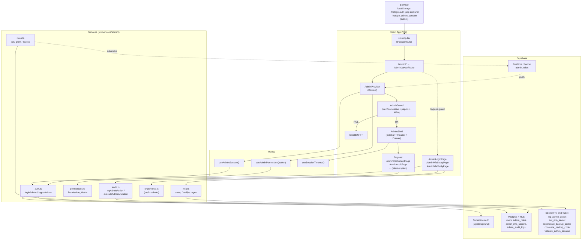
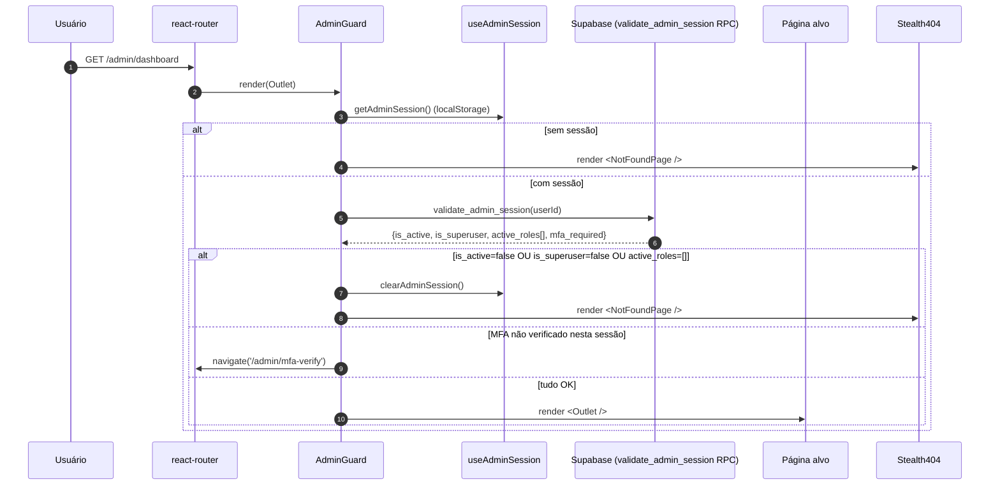
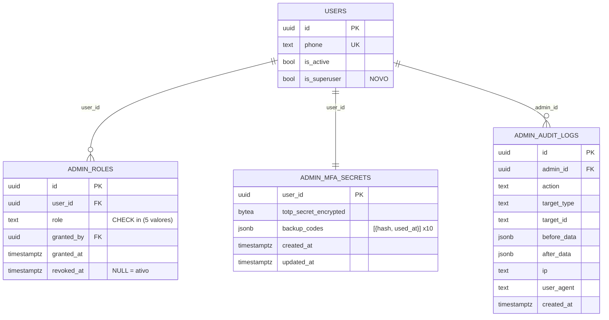
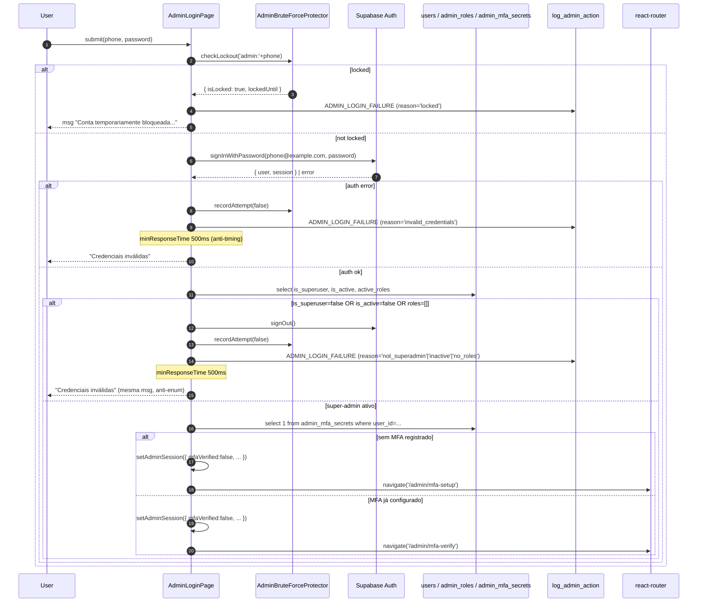
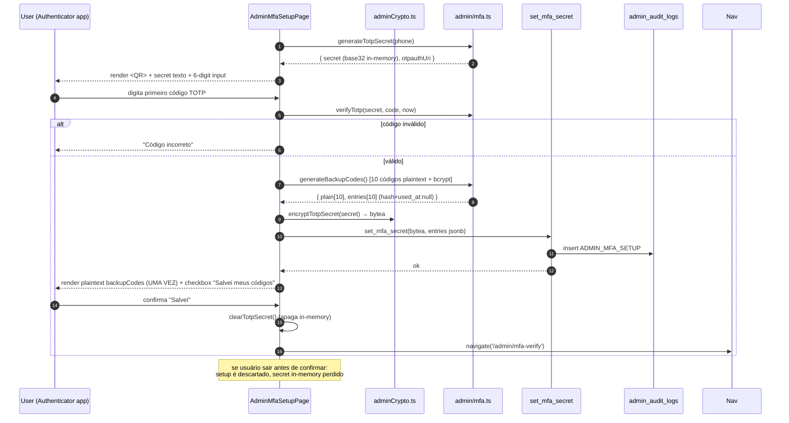
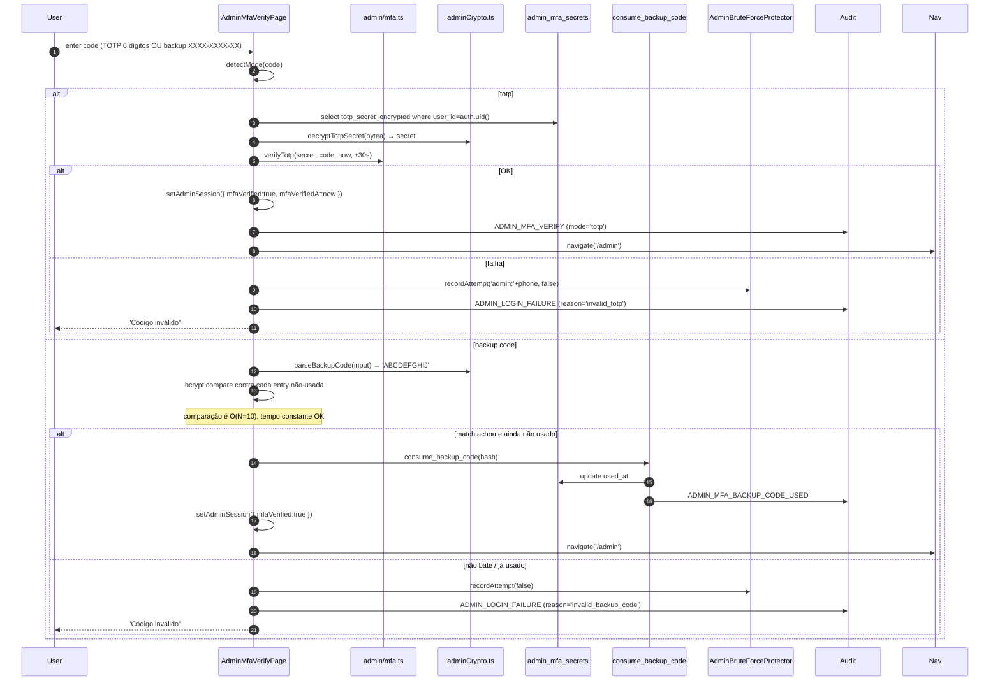
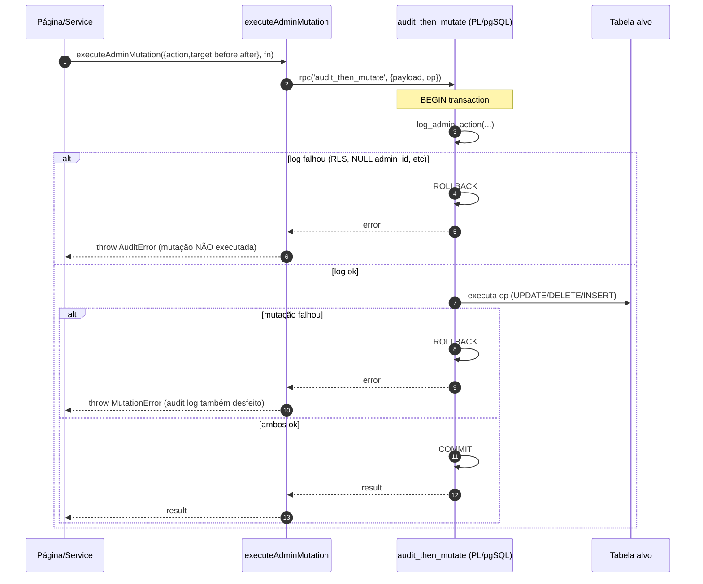

# Design Document: admin-foundation

## 1. Overview

Esta spec entrega a **fundação do painel administrativo** (`/admin/*`) do FreteGO. O escopo é estritamente de infraestrutura de segurança e UX:

- Migration `030_admin_foundation.sql` com 3 novas tabelas (`admin_roles`, `admin_mfa_secrets`, `admin_audit_logs`), 1 coluna nova em `users` (`is_superuser`) e 5 funções `SECURITY DEFINER`.
- Sessão admin isolada em `localStorage` (`fretego_admin_session`) com timeout de 30min.
- MFA TOTP obrigatório (com 10 backup codes), seguindo RFC 6238.
- RBAC com 5 papéis (`SUPER_ADMIN`, `ADMIN`, `SUPORTE`, `FINANCEIRO`, `MODERADOR`) via `Permission_Matrix` puramente determinística.
- Auditoria imutável: toda mutação admin passa por `executeAdminMutation` que envolve `log_admin_action` e a operação principal na mesma transação.
- Stealth 404: usuário não-Super_Admin não distingue `/admin/*` de qualquer rota inexistente.
- Lockout via `BruteForceProtector` estendido com prefixo `admin:`.
- Layout dark próprio (sidebar fixa desktop, drawer mobile), separado do tema do app comum.

**Não-objetivos** (cada um vira spec separada que depende desta):

- Conteúdo dos cards/gráficos do dashboard (`admin-dashboard`).
- CRUD completo de usuários (`admin-users`).
- CRUD de fretes administrativo (`admin-fretes`).
- Financeiro (`admin-financeiro`).
- Blacklist e moderação (`admin-blacklist`).
- CRM (`admin-crm`).
- Suporte / tickets (`admin-suporte`).
- Configurações da plataforma e settings de IA (`admin-settings`).

A arquitetura desta spec foi pensada para que cada uma das specs acima reutilize:

1. `AdminProvider` para sessão e papéis.
2. `useAdminPermission(action)` para esconder/desabilitar UI.
3. `executeAdminMutation` para garantir audit log.
4. `Permission_Matrix` como única fonte de verdade de RBAC.

## 2. Arquitetura Geral

### 2.1 Diagrama de alto nível



### 2.2 Princípios arquiteturais

- **Defesa em profundidade.** Toda checagem de permissão acontece em 3 camadas: (1) UI esconde botão via `useAdminPermission`; (2) serviço front recusa antes de chamar Supabase; (3) RLS no Postgres bloqueia mesmo com token válido. A spec assume que (3) é a barreira final e nunca confia só em (1) ou (2).
- **Audit-by-construction.** Mutações nunca tocam tabelas diretamente. Todas passam por `executeAdminMutation(action, fn)` que abre transação, chama `log_admin_action(...)` e só então executa `fn`. Se qualquer passo falhar, ROLLBACK total — não existe estado em que `before_data` foi gravado mas a mutação principal não, nem o contrário.
- **Sessão isolada.** A chave `fretego_admin_session` é distinta de `fretego-auth` (do app comum). Logout admin não desloga o app comum e vice-versa. Isto é deliberado: o admin pode estar testando algo como motorista em outra aba.
- **Stealth por padrão.** Toda falha de autorização em `/admin/*` renderiza o **mesmo** componente que uma URL inexistente do app. O componente é resolvido a partir de uma única fonte (`NotFoundPage`), de modo que mudanças visuais futuras não criam vazamento de existência por divergência.
- **Sem segredo no front.** A chave `VITE_ADMIN_MFA_KEY` cifra/decifra o `TOTP_Secret` somente em memória durante setup e verify. O segredo cifrado vive em `bytea` no banco e nunca volta em texto para o front após o setup. Backup codes ficam apenas como hash bcrypt em `jsonb`.

### 2.3 Fluxo lógico de uma navegação `/admin/*`



## 3. Componentes e Interfaces

### 3.1 Mapa de arquivos novos

```
supabase/migrations/
└── 030_admin_foundation.sql                        # toda a infra de banco

src/components/admin/
├── AdminProvider.tsx                               # Context com sessão + papéis
├── AdminGuard.tsx                                  # Route guard, decide Stealth404 vs Outlet
├── AdminLayoutRoute.tsx                            # Wrapper: AdminProvider + AdminGuard + AdminShell
├── AdminShell.tsx                                  # Sidebar + Header + main + drawer
├── AdminSidebar.tsx                                # Lista de itens + permission filter
├── AdminHeader.tsx                                 # Nome + papéis + SessionTimer + logout
├── SessionTimer.tsx                                # Countdown 1s + modal aviso 5min
├── Stealth404.tsx                                  # Re-export do <NotFoundPage />
├── MfaSetupForm.tsx                                # QR + secret + 1º TOTP + backup codes
└── MfaVerifyForm.tsx                               # input TOTP|backup code

src/pages/
├── NotFoundPage.tsx                                # NOVA — 404 padrão do app inteiro
└── admin/
    ├── AdminLoginPage.tsx
    ├── AdminMfaSetupPage.tsx
    ├── AdminMfaVerifyPage.tsx
    └── AdminAuditPage.tsx

src/services/admin/
├── auth.ts                                         # loginAdmin, logoutAdmin, refresh, validateSession
├── mfa.ts                                          # generateTotpSecret, verifyTotp, generateBackupCodes, setupMfa, verifyMfa, regenerateBackupCodes
├── permissions.ts                                  # Permission_Matrix + hasPermission(role, action) + hasPermissionForRoles
├── audit.ts                                        # logAdminAction, executeAdminMutation, querying helpers
├── roles.ts                                        # listAdmins, grantRole, revokeRole, subscribeRoleChanges
└── bruteForce.ts                                   # AdminBruteForceProtector (prefix 'admin:')

src/hooks/
├── useAdminSession.ts                              # estado de sessão + lastActivity tracking
├── useAdminPermission.ts                           # checa Permission_Matrix
└── useSessionTimeout.ts                            # countdown + modal aviso 5min

src/utils/
└── adminCrypto.ts                                  # AES-256-GCM via WebCrypto + base32 + format/parseBackupCode

src/__tests__/admin/
├── permissions.property.test.ts                    # CP-3, CP-4, CP-14
├── adminCrypto.property.test.ts                    # CP-6, CP-7
├── audit.property.test.ts                          # CP-2, CP-8, CP-12
├── bruteForce.property.test.ts                     # CP-5
├── totp.property.test.ts                           # CP-10
├── backupCodes.property.test.ts                    # CP-9
├── stealth404.test.tsx                             # CP-1, CP-11 (snapshot)
└── session.property.test.ts                        # CP-13
```

### 3.2 Contratos públicos (TypeScript)

```ts
// src/services/admin/permissions.ts
export type AdminRole = 'SUPER_ADMIN' | 'ADMIN' | 'SUPORTE' | 'FINANCEIRO' | 'MODERADOR';

export type AdminAction =
  | 'USER_VIEW' | 'USER_EDIT' | 'USER_DELETE' | 'USER_TOGGLE_ACTIVE'
  | 'FRETE_VIEW' | 'FRETE_EDIT' | 'FRETE_DELETE' | 'FRETE_FORCE_CLOSE'
  | 'FINANCEIRO_VIEW' | 'FINANCEIRO_EDIT'
  | 'BLACKLIST_VIEW' | 'BLACKLIST_EDIT'
  | 'CRM_VIEW' | 'CRM_EDIT'
  | 'SUPORTE_VIEW' | 'SUPORTE_REPLY'
  | 'SETTINGS_VIEW' | 'SETTINGS_EDIT'
  | 'AUDIT_VIEW'
  | 'ADMIN_ROLE_GRANT' | 'ADMIN_ROLE_REVOKE';

export function hasPermission(role: AdminRole, action: AdminAction | string): boolean;
export function hasPermissionForRoles(roles: AdminRole[], action: AdminAction | string): boolean;
```

```ts
// src/services/admin/auth.ts
export interface AdminSession {
  userId: string;
  accessToken: string;
  refreshToken: string;
  expiresAt: number;        // epoch ms (Supabase token)
  lastActivityAt: number;   // epoch ms (atualizado por throttle)
  roles: AdminRole[];
  mfaVerified: boolean;
  mfaVerifiedAt: number | null;
}

export interface AdminLoginResult {
  step: 'mfa-setup' | 'mfa-verify' | 'denied';
  reason?: 'invalid_credentials' | 'inactive' | 'no_roles' | 'locked';
  lockoutMessage?: string;
}

export async function loginAdmin(phone: string, password: string): Promise<AdminLoginResult>;
export async function logoutAdmin(): Promise<void>;
export async function validateAdminSession(): Promise<{
  isValid: boolean;
  reason?: 'inactive' | 'no_roles' | 'expired' | 'mfa_required';
  roles: AdminRole[];
}>;
export function getAdminSession(): AdminSession | null;
export function setAdminSession(s: AdminSession): void;
export function clearAdminSession(): void;
```

```ts
// src/services/admin/mfa.ts
export interface BackupCodeEntry { hash: string; usedAt: string | null; }

export async function generateTotpSecret(phone: string): Promise<{ secret: string; otpauthUri: string }>;
export async function generateBackupCodes(): Promise<{ plain: string[]; entries: BackupCodeEntry[] }>;
export async function completeMfaSetup(args: {
  userId: string;
  totpSecret: string;
  firstTotpCode: string;
  backupEntries: BackupCodeEntry[];
}): Promise<void>;
export async function verifyMfa(args: {
  userId: string;
  code: string;            // pode ser TOTP 6 dígitos OU backup code XXXX-XXXX-XX
}): Promise<{ ok: true; usedBackupCode: boolean } | { ok: false; reason: 'invalid' | 'no_secret' }>;
export async function regenerateBackupCodes(userId: string): Promise<{ plain: string[] }>;
```

```ts
// src/services/admin/audit.ts
export type AdminActionLog =
  | 'ADMIN_LOGIN_SUCCESS' | 'ADMIN_LOGIN_FAILURE' | 'ADMIN_LOGOUT'
  | 'ADMIN_LOCKOUT' | 'ADMIN_STEALTH_BLOCK'
  | 'ADMIN_MFA_SETUP' | 'ADMIN_MFA_VERIFY' | 'ADMIN_MFA_BACKUP_CODE_USED'
  | 'ADMIN_MFA_BACKUP_CODES_REGENERATED' | 'ADMIN_MFA_RESET'
  | 'ADMIN_ROLE_GRANTED' | 'ADMIN_ROLE_REVOKED'
  | 'AUDIT_VIEW' | 'AUDIT_EXPORT'
  | string; // string union aberta por extensibilidade

export interface LogAdminActionInput {
  action: AdminActionLog;
  targetType?: string | null;
  targetId?: string | null;
  before?: unknown;
  after?: unknown;
}

export async function logAdminAction(input: LogAdminActionInput): Promise<void>;

/**
 * Executa uma mutação admin garantindo que o audit log seja gravado
 * dentro da MESMA transação que a mutação principal. Se qualquer um
 * dos dois falhar, ambos são revertidos.
 */
export async function executeAdminMutation<T>(
  input: LogAdminActionInput,
  fn: () => Promise<T>
): Promise<T>;

export function serializeAuditData(o: unknown): unknown;     // round-trippable JSON
export function deserializeAuditData(s: unknown): unknown;
```

```ts
// src/utils/adminCrypto.ts
export async function encryptTotpSecret(plain: string): Promise<Uint8Array>;
export async function decryptTotpSecret(cipher: Uint8Array): Promise<string>;
export function formatBackupCode(raw: string): string;       // 'ABCDEFGHIJ' -> 'ABCD-EFGH-IJ'
export function parseBackupCode(formatted: string): string;  // aceita c/ ou s/ hífen, normaliza pra UPPER
export function generateRandomBackupCode(): string;          // 10 chars [A-HJ-NP-Z2-9]
export function isValidBase32(s: string): boolean;
```

```ts
// src/components/admin/AdminProvider.tsx
export interface AdminContextValue {
  adminUser: { id: string; name: string; phone: string } | null;
  roles: AdminRole[];
  hasPermission: (action: AdminAction | string) => boolean;
  logout: () => Promise<void>;
  sessionTimeRemaining: number; // ms até expirar por inatividade
  refreshRoles: () => Promise<void>;
}
export const AdminContext: React.Context<AdminContextValue | null>;
export function AdminProvider({ children }: { children: React.ReactNode }): JSX.Element;
```

### 3.3 Política de wiring de rotas

`src/App.tsx` ganha um único bloco `<Route path="/admin/*" element={<AdminLayoutRoute />} />` cujo elemento monta `AdminProvider` e renderiza `<Routes>` interno:

```tsx
// src/components/admin/AdminLayoutRoute.tsx (esqueleto)
<AdminProvider>
  <Routes>
    <Route path="login" element={<AdminLoginPage />} />
    <Route path="mfa-setup" element={<AdminMfaSetupPage />} />
    <Route path="mfa-verify" element={<AdminMfaVerifyPage />} />
    <Route element={<AdminGuard />}>{/* wrapper que renderiza Outlet OU Stealth404 */}
      <Route element={<AdminShell />}>
        <Route index element={<AdminDashboardPage />} />     {/* placeholder até admin-dashboard */}
        <Route path="audit" element={<AdminAuditPage />} />
        {/* demais filhos virão em specs futuras */}
      </Route>
    </Route>
    <Route path="*" element={<Stealth404 />} />
  </Routes>
</AdminProvider>
```

E também é adicionada em `App.tsx` uma rota catch-all global:

```tsx
<Route path="*" element={<NotFoundPage />} />
```

`Stealth404.tsx` é literalmente:

```tsx
import NotFoundPage from '../../pages/NotFoundPage';
export default function Stealth404() { return <NotFoundPage />; }
```

Isto garante CP-11 por construção: o conteúdo é o **mesmo componente**, não cópia.


## 4. Modelo de Dados

### 4.1 Diagrama ER



### 4.2 SQL completo (`030_admin_foundation.sql`)

O arquivo é idempotente (`IF NOT EXISTS`, `CREATE OR REPLACE`, blocos `DO $$`). Todo o conteúdo abaixo fica envolto em `BEGIN; ... COMMIT;`.

#### 4.2.1 Cabeçalho e dependências

```sql
-- =====================================================
-- Migration 030: admin-foundation
--
-- Cria a infraestrutura de banco do painel administrativo:
--   - users.is_superuser
--   - admin_roles
--   - admin_mfa_secrets
--   - admin_audit_logs
--   - funções SECURITY DEFINER:
--       log_admin_action, set_mfa_secret, regenerate_backup_codes,
--       consume_backup_code, validate_admin_session,
--       is_admin_with_permission
--
-- Dependências: migrations 001..029 aplicadas, em particular:
--   - users (001)
--   - extensão pgcrypto (já habilitada em 001)
--
-- IMPORTANTE: a promoção inicial de Super_Admins é manual.
-- Veja o bloco BOOTSTRAP comentado ao final deste arquivo.
-- =====================================================

BEGIN;
```

#### 4.2.2 Coluna `is_superuser`

```sql
ALTER TABLE users
  ADD COLUMN IF NOT EXISTS is_superuser BOOLEAN NOT NULL DEFAULT false;

CREATE INDEX IF NOT EXISTS idx_users_is_superuser
  ON users(id) WHERE is_superuser = true;

-- Bloqueia mutação direta de is_superuser via API: nenhuma policy
-- existente concede UPDATE em is_superuser. Como reforço, criamos
-- trigger que reverte qualquer tentativa que altere is_superuser
-- a partir de uma sessão que não seja SUPER_ADMIN ativo.
CREATE OR REPLACE FUNCTION protect_is_superuser()
RETURNS trigger
LANGUAGE plpgsql
SECURITY DEFINER
SET search_path = public
AS $$
BEGIN
  IF (OLD.is_superuser IS DISTINCT FROM NEW.is_superuser) THEN
    IF NOT EXISTS (
      SELECT 1 FROM admin_roles ar
      WHERE ar.user_id = auth.uid()
        AND ar.role = 'SUPER_ADMIN'
        AND ar.revoked_at IS NULL
    ) THEN
      RAISE EXCEPTION 'forbidden: only SUPER_ADMIN can change is_superuser';
    END IF;
  END IF;
  RETURN NEW;
END;
$$;

DROP TRIGGER IF EXISTS users_protect_is_superuser ON users;
CREATE TRIGGER users_protect_is_superuser
  BEFORE UPDATE ON users
  FOR EACH ROW EXECUTE FUNCTION protect_is_superuser();
```

> **Nota.** O trigger usa `SECURITY DEFINER` mas só faz checagem read-only. RLS ainda é a barreira primária; o trigger evita escalada caso alguma política futura conceda UPDATE genérico em `users` por engano.

#### 4.2.3 Tabela `admin_roles`

```sql
CREATE TABLE IF NOT EXISTS admin_roles (
  id           uuid PRIMARY KEY DEFAULT gen_random_uuid(),
  user_id      uuid NOT NULL REFERENCES users(id) ON DELETE CASCADE,
  role         text NOT NULL CHECK (role IN (
                  'SUPER_ADMIN','ADMIN','SUPORTE','FINANCEIRO','MODERADOR'
                )),
  granted_by   uuid NOT NULL REFERENCES users(id) ON DELETE RESTRICT,
  granted_at   timestamptz NOT NULL DEFAULT now(),
  revoked_at   timestamptz NULL,
  revoked_by   uuid NULL REFERENCES users(id) ON DELETE SET NULL
);

-- Apenas 1 registro ATIVO por (user_id, role)
CREATE UNIQUE INDEX IF NOT EXISTS uq_admin_roles_active
  ON admin_roles(user_id, role) WHERE revoked_at IS NULL;

CREATE INDEX IF NOT EXISTS idx_admin_roles_user_active
  ON admin_roles(user_id) WHERE revoked_at IS NULL;

ALTER TABLE admin_roles ENABLE ROW LEVEL SECURITY;
```

#### 4.2.4 Tabela `admin_mfa_secrets`

```sql
CREATE TABLE IF NOT EXISTS admin_mfa_secrets (
  user_id                 uuid PRIMARY KEY REFERENCES users(id) ON DELETE CASCADE,
  totp_secret_encrypted   bytea NOT NULL,
  -- backup_codes: JSONB array com EXATAMENTE 10 elementos:
  --   [{ "hash": "$2a$10$...", "used_at": null | "ISO timestamp" }, ...]
  backup_codes            jsonb NOT NULL,
  created_at              timestamptz NOT NULL DEFAULT now(),
  updated_at              timestamptz NOT NULL DEFAULT now(),
  CONSTRAINT chk_backup_codes_count CHECK (jsonb_array_length(backup_codes) = 10)
);

CREATE OR REPLACE FUNCTION set_updated_at()
RETURNS trigger LANGUAGE plpgsql AS $$
BEGIN NEW.updated_at = now(); RETURN NEW; END $$;

DROP TRIGGER IF EXISTS admin_mfa_secrets_set_updated_at ON admin_mfa_secrets;
CREATE TRIGGER admin_mfa_secrets_set_updated_at
  BEFORE UPDATE ON admin_mfa_secrets
  FOR EACH ROW EXECUTE FUNCTION set_updated_at();

ALTER TABLE admin_mfa_secrets ENABLE ROW LEVEL SECURITY;
```

#### 4.2.5 Tabela `admin_audit_logs`

```sql
CREATE TABLE IF NOT EXISTS admin_audit_logs (
  id           uuid PRIMARY KEY DEFAULT gen_random_uuid(),
  admin_id     uuid NOT NULL REFERENCES users(id) ON DELETE RESTRICT,
  action       text NOT NULL,
  target_type  text NULL,
  target_id    text NULL,
  before_data  jsonb NULL,
  after_data   jsonb NULL,
  ip           text NULL,
  user_agent   text NULL,
  created_at   timestamptz NOT NULL DEFAULT now()
);

CREATE INDEX IF NOT EXISTS idx_admin_audit_logs_created_at
  ON admin_audit_logs(created_at DESC);
CREATE INDEX IF NOT EXISTS idx_admin_audit_logs_admin_id
  ON admin_audit_logs(admin_id);
CREATE INDEX IF NOT EXISTS idx_admin_audit_logs_action
  ON admin_audit_logs(action);
CREATE INDEX IF NOT EXISTS idx_admin_audit_logs_target
  ON admin_audit_logs(target_type, target_id);

ALTER TABLE admin_audit_logs ENABLE ROW LEVEL SECURITY;
```

#### 4.2.6 Helper RBAC: `is_admin_with_permission`

```sql
-- Espelha a Permission_Matrix do TS no banco. Usado pelas policies
-- e por funções SECURITY DEFINER. Mantido em sync com o TS via teste
-- de paridade (CP-3 + CP-4 cobrem o lado TS; rlsValidation testa o SQL).
CREATE OR REPLACE FUNCTION is_admin_with_permission(p_action text)
RETURNS boolean
LANGUAGE sql STABLE
SECURITY DEFINER
SET search_path = public
AS $$
  WITH active AS (
    SELECT role
    FROM admin_roles
    WHERE user_id = auth.uid() AND revoked_at IS NULL
  )
  SELECT EXISTS (
    SELECT 1 FROM active a
    WHERE
      -- SUPER_ADMIN tem TUDO
      a.role = 'SUPER_ADMIN'
      OR (a.role = 'ADMIN' AND p_action NOT IN
           ('USER_DELETE','ADMIN_ROLE_GRANT','ADMIN_ROLE_REVOKE'))
      OR (a.role = 'FINANCEIRO' AND p_action IN
           ('USER_VIEW','FRETE_VIEW','FINANCEIRO_VIEW','FINANCEIRO_EDIT','AUDIT_VIEW'))
      OR (a.role = 'SUPORTE' AND p_action IN
           ('USER_VIEW','USER_TOGGLE_ACTIVE','FRETE_VIEW',
            'SUPORTE_VIEW','SUPORTE_REPLY','CRM_VIEW'))
      OR (a.role = 'MODERADOR' AND p_action IN
           ('USER_VIEW','FRETE_VIEW','FRETE_FORCE_CLOSE',
            'BLACKLIST_VIEW','BLACKLIST_EDIT'))
  );
$$;
```

#### 4.2.7 RLS — `admin_roles`

```sql
-- SELECT: o próprio Super_Admin vê seus papéis;
--         quem tem ADMIN_ROLE_GRANT vê todos.
DROP POLICY IF EXISTS admin_roles_select ON admin_roles;
CREATE POLICY admin_roles_select ON admin_roles
  FOR SELECT TO authenticated
  USING (
    user_id = auth.uid()
    OR is_admin_with_permission('ADMIN_ROLE_GRANT')
  );

-- INSERT/UPDATE: somente SUPER_ADMIN ativo
DROP POLICY IF EXISTS admin_roles_insert ON admin_roles;
CREATE POLICY admin_roles_insert ON admin_roles
  FOR INSERT TO authenticated
  WITH CHECK (is_admin_with_permission('ADMIN_ROLE_GRANT'));

DROP POLICY IF EXISTS admin_roles_update ON admin_roles;
CREATE POLICY admin_roles_update ON admin_roles
  FOR UPDATE TO authenticated
  USING (is_admin_with_permission('ADMIN_ROLE_REVOKE'))
  WITH CHECK (is_admin_with_permission('ADMIN_ROLE_REVOKE'));

-- DELETE bloqueado: revogação é via UPDATE revoked_at
DROP POLICY IF EXISTS admin_roles_delete ON admin_roles;
CREATE POLICY admin_roles_delete ON admin_roles
  FOR DELETE TO authenticated USING (false);
```

#### 4.2.8 RLS — `admin_mfa_secrets`

```sql
-- Admin só lê o próprio MFA
DROP POLICY IF EXISTS admin_mfa_select ON admin_mfa_secrets;
CREATE POLICY admin_mfa_select ON admin_mfa_secrets
  FOR SELECT TO authenticated
  USING (user_id = auth.uid());

-- INSERT bloqueado pelo client (vai por SECURITY DEFINER set_mfa_secret)
DROP POLICY IF EXISTS admin_mfa_insert ON admin_mfa_secrets;
CREATE POLICY admin_mfa_insert ON admin_mfa_secrets
  FOR INSERT TO authenticated WITH CHECK (false);

-- UPDATE bloqueado pelo client (vai por SECURITY DEFINER)
DROP POLICY IF EXISTS admin_mfa_update ON admin_mfa_secrets;
CREATE POLICY admin_mfa_update ON admin_mfa_secrets
  FOR UPDATE TO authenticated USING (false) WITH CHECK (false);

-- DELETE: só SUPER_ADMIN ativo (caminho de "reset MFA via SQL")
DROP POLICY IF EXISTS admin_mfa_delete ON admin_mfa_secrets;
CREATE POLICY admin_mfa_delete ON admin_mfa_secrets
  FOR DELETE TO authenticated
  USING (is_admin_with_permission('ADMIN_ROLE_GRANT'));
```

#### 4.2.9 RLS — `admin_audit_logs` (imutável)

```sql
-- SELECT: apenas quem tem AUDIT_VIEW
DROP POLICY IF EXISTS admin_audit_select ON admin_audit_logs;
CREATE POLICY admin_audit_select ON admin_audit_logs
  FOR SELECT TO authenticated
  USING (is_admin_with_permission('AUDIT_VIEW'));

-- INSERT bloqueado pelo client (vai por SECURITY DEFINER log_admin_action)
DROP POLICY IF EXISTS admin_audit_insert ON admin_audit_logs;
CREATE POLICY admin_audit_insert ON admin_audit_logs
  FOR INSERT TO authenticated WITH CHECK (false);

-- UPDATE/DELETE: NEGADO para TODOS (incluindo SUPER_ADMIN)
DROP POLICY IF EXISTS admin_audit_update ON admin_audit_logs;
CREATE POLICY admin_audit_update ON admin_audit_logs
  FOR UPDATE TO authenticated USING (false) WITH CHECK (false);

DROP POLICY IF EXISTS admin_audit_delete ON admin_audit_logs;
CREATE POLICY admin_audit_delete ON admin_audit_logs
  FOR DELETE TO authenticated USING (false);
```

> Retenção de 365 dias é responsabilidade de um job externo (cron do Supabase ou job Edge Function). Esta spec não implementa o job; apenas reserva o índice `idx_admin_audit_logs_created_at` para que ele seja eficiente.

#### 4.2.10 Funções `SECURITY DEFINER`

```sql
-- 1. log_admin_action: única forma de inserir em admin_audit_logs
CREATE OR REPLACE FUNCTION log_admin_action(
  p_action      text,
  p_target_type text DEFAULT NULL,
  p_target_id   text DEFAULT NULL,
  p_before      jsonb DEFAULT NULL,
  p_after       jsonb DEFAULT NULL,
  p_ip          text DEFAULT NULL,
  p_user_agent  text DEFAULT NULL
) RETURNS uuid
LANGUAGE plpgsql
SECURITY DEFINER
SET search_path = public
AS $$
DECLARE
  v_id uuid;
  v_admin uuid := auth.uid();
BEGIN
  IF v_admin IS NULL THEN
    RAISE EXCEPTION 'log_admin_action requires authenticated session';
  END IF;
  -- Confirma que o usuário é Super_Admin (mesmo que perdeu papéis)
  IF NOT EXISTS (SELECT 1 FROM users u WHERE u.id = v_admin AND u.is_superuser = true) THEN
    RAISE EXCEPTION 'log_admin_action requires is_superuser';
  END IF;

  INSERT INTO admin_audit_logs(
    admin_id, action, target_type, target_id,
    before_data, after_data, ip, user_agent
  ) VALUES (
    v_admin, p_action, p_target_type, p_target_id,
    p_before, p_after, p_ip, LEFT(coalesce(p_user_agent,''), 512)
  )
  RETURNING id INTO v_id;

  RETURN v_id;
END;
$$;

REVOKE ALL ON FUNCTION log_admin_action(text,text,text,jsonb,jsonb,text,text) FROM PUBLIC;
GRANT EXECUTE ON FUNCTION log_admin_action(text,text,text,jsonb,jsonb,text,text) TO authenticated;
```

```sql
-- 2. set_mfa_secret: grava o segredo cifrado e os 10 backup codes hashados.
--    Falha se já existir registro (forçar uso de regenerate).
CREATE OR REPLACE FUNCTION set_mfa_secret(
  p_totp_encrypted bytea,
  p_backup_codes   jsonb       -- [{hash, used_at:null}] x 10
) RETURNS void
LANGUAGE plpgsql
SECURITY DEFINER
SET search_path = public
AS $$
DECLARE v_uid uuid := auth.uid();
BEGIN
  IF v_uid IS NULL THEN
    RAISE EXCEPTION 'set_mfa_secret requires authenticated session';
  END IF;
  IF NOT EXISTS (SELECT 1 FROM users u WHERE u.id = v_uid AND u.is_superuser = true) THEN
    RAISE EXCEPTION 'set_mfa_secret requires is_superuser';
  END IF;
  IF jsonb_array_length(p_backup_codes) <> 10 THEN
    RAISE EXCEPTION 'backup_codes must have exactly 10 entries';
  END IF;

  INSERT INTO admin_mfa_secrets(user_id, totp_secret_encrypted, backup_codes)
  VALUES (v_uid, p_totp_encrypted, p_backup_codes);

  PERFORM log_admin_action('ADMIN_MFA_SETUP', 'admin_mfa_secrets', v_uid::text, NULL, NULL, NULL, NULL);
END;
$$;

REVOKE ALL ON FUNCTION set_mfa_secret(bytea, jsonb) FROM PUBLIC;
GRANT EXECUTE ON FUNCTION set_mfa_secret(bytea, jsonb) TO authenticated;
```

```sql
-- 3. regenerate_backup_codes
CREATE OR REPLACE FUNCTION regenerate_backup_codes(
  p_backup_codes jsonb
) RETURNS void
LANGUAGE plpgsql
SECURITY DEFINER
SET search_path = public
AS $$
DECLARE v_uid uuid := auth.uid();
BEGIN
  IF v_uid IS NULL THEN
    RAISE EXCEPTION 'regenerate_backup_codes requires authenticated session';
  END IF;
  IF jsonb_array_length(p_backup_codes) <> 10 THEN
    RAISE EXCEPTION 'backup_codes must have exactly 10 entries';
  END IF;

  UPDATE admin_mfa_secrets
     SET backup_codes = p_backup_codes
   WHERE user_id = v_uid;

  IF NOT FOUND THEN
    RAISE EXCEPTION 'no MFA secret to regenerate';
  END IF;

  PERFORM log_admin_action('ADMIN_MFA_BACKUP_CODES_REGENERATED',
                           'admin_mfa_secrets', v_uid::text, NULL, NULL, NULL, NULL);
END;
$$;

REVOKE ALL ON FUNCTION regenerate_backup_codes(jsonb) FROM PUBLIC;
GRANT EXECUTE ON FUNCTION regenerate_backup_codes(jsonb) TO authenticated;
```

```sql
-- 4. consume_backup_code
--    Marca um backup code como usado pelo HASH bcrypt.
--    Retorna true se consumiu, false se não encontrou ou já estava usado.
CREATE OR REPLACE FUNCTION consume_backup_code(
  p_hash text
) RETURNS boolean
LANGUAGE plpgsql
SECURITY DEFINER
SET search_path = public
AS $$
DECLARE
  v_uid uuid := auth.uid();
  v_codes jsonb;
  v_new_codes jsonb := '[]'::jsonb;
  v_consumed boolean := false;
  v_entry jsonb;
BEGIN
  IF v_uid IS NULL THEN
    RAISE EXCEPTION 'consume_backup_code requires authenticated session';
  END IF;

  SELECT backup_codes INTO v_codes FROM admin_mfa_secrets WHERE user_id = v_uid;
  IF v_codes IS NULL THEN
    RETURN false;
  END IF;

  FOR v_entry IN SELECT * FROM jsonb_array_elements(v_codes) LOOP
    IF NOT v_consumed
       AND (v_entry->>'hash') = p_hash
       AND (v_entry->>'used_at') IS NULL THEN
      v_new_codes := v_new_codes ||
        jsonb_build_object('hash', v_entry->>'hash',
                           'used_at', to_jsonb(now()::text));
      v_consumed := true;
    ELSE
      v_new_codes := v_new_codes || v_entry;
    END IF;
  END LOOP;

  IF v_consumed THEN
    UPDATE admin_mfa_secrets SET backup_codes = v_new_codes WHERE user_id = v_uid;
    PERFORM log_admin_action('ADMIN_MFA_BACKUP_CODE_USED',
                             'admin_mfa_secrets', v_uid::text, NULL, NULL, NULL, NULL);
  END IF;

  RETURN v_consumed;
END;
$$;

REVOKE ALL ON FUNCTION consume_backup_code(text) FROM PUBLIC;
GRANT EXECUTE ON FUNCTION consume_backup_code(text) TO authenticated;
```

```sql
-- 5. validate_admin_session
--    Devolve, em uma única chamada, tudo que o AdminGuard precisa
--    para autorizar a navegação atual.
CREATE OR REPLACE FUNCTION validate_admin_session()
RETURNS TABLE(
  is_active     boolean,
  is_superuser  boolean,
  active_roles  text[],
  has_mfa       boolean
)
LANGUAGE sql STABLE
SECURITY DEFINER
SET search_path = public
AS $$
  SELECT
    u.is_active,
    u.is_superuser,
    coalesce(array_agg(ar.role) FILTER (WHERE ar.revoked_at IS NULL), ARRAY[]::text[]),
    EXISTS (SELECT 1 FROM admin_mfa_secrets m WHERE m.user_id = u.id)
  FROM users u
  LEFT JOIN admin_roles ar ON ar.user_id = u.id
  WHERE u.id = auth.uid()
  GROUP BY u.is_active, u.is_superuser, u.id;
$$;

REVOKE ALL ON FUNCTION validate_admin_session() FROM PUBLIC;
GRANT EXECUTE ON FUNCTION validate_admin_session() TO authenticated;
```

#### 4.2.11 BOOTSTRAP (comentado)

```sql
-- =====================================================
-- BOOTSTRAP — DESCOMENTE E EDITE PARA PROMOVER O 1º SUPER_ADMIN
-- Execute em um único psql com role de service_role / postgres.
-- =====================================================
-- DO $$
-- DECLARE
--   v_admin_id uuid := '<<<UUID DO USUÁRIO>>>'; -- pegue de users.id
-- BEGIN
--   UPDATE users SET is_superuser = true WHERE id = v_admin_id;
--   INSERT INTO admin_roles(user_id, role, granted_by)
--   VALUES (v_admin_id, 'SUPER_ADMIN', v_admin_id)
--   ON CONFLICT DO NOTHING;
-- END $$;

COMMIT;
```

### 4.3 Modelo TypeScript da `Admin_Session` em localStorage

```ts
// chave: 'fretego_admin_session'
interface AdminSessionStored {
  v: 1;                          // schema version
  userId: string;
  accessToken: string;
  refreshToken: string;
  expiresAt: number;             // ms epoch (token Supabase)
  lastActivityAt: number;        // ms epoch
  roles: AdminRole[];            // snapshot; revalidado em validateAdminSession()
  mfaVerified: boolean;
  mfaVerifiedAt: number | null;
}
```

Eventos que mutam:

- `loginAdmin` → cria com `mfaVerified=false`.
- `verifyMfa OK` → seta `mfaVerified=true, mfaVerifiedAt=now`.
- `useAdminSession` listener throttled (60s) atualiza `lastActivityAt` em `mousemove|keydown|scroll|touchstart`.
- `logoutAdmin` ou timeout → remove a chave.


## 5. Permission_Matrix

A matriz é a única fonte de verdade do RBAC do front. Vive em `src/services/admin/permissions.ts` e é espelhada na função SQL `is_admin_with_permission` (seção 4.2.6).

```ts
// src/services/admin/permissions.ts
export type AdminRole = 'SUPER_ADMIN' | 'ADMIN' | 'SUPORTE' | 'FINANCEIRO' | 'MODERADOR';

export const ADMIN_ACTIONS = [
  'USER_VIEW', 'USER_EDIT', 'USER_DELETE', 'USER_TOGGLE_ACTIVE',
  'FRETE_VIEW', 'FRETE_EDIT', 'FRETE_DELETE', 'FRETE_FORCE_CLOSE',
  'FINANCEIRO_VIEW', 'FINANCEIRO_EDIT',
  'BLACKLIST_VIEW', 'BLACKLIST_EDIT',
  'CRM_VIEW', 'CRM_EDIT',
  'SUPORTE_VIEW', 'SUPORTE_REPLY',
  'SETTINGS_VIEW', 'SETTINGS_EDIT',
  'AUDIT_VIEW',
  'ADMIN_ROLE_GRANT', 'ADMIN_ROLE_REVOKE',
] as const;
export type AdminAction = (typeof ADMIN_ACTIONS)[number];

const ALL: ReadonlySet<AdminAction> = new Set(ADMIN_ACTIONS);

const FINANCEIRO_PERMS: ReadonlySet<AdminAction> = new Set<AdminAction>([
  'USER_VIEW', 'FRETE_VIEW', 'FINANCEIRO_VIEW', 'FINANCEIRO_EDIT', 'AUDIT_VIEW',
]);

const SUPORTE_PERMS: ReadonlySet<AdminAction> = new Set<AdminAction>([
  'USER_VIEW', 'USER_TOGGLE_ACTIVE', 'FRETE_VIEW',
  'SUPORTE_VIEW', 'SUPORTE_REPLY', 'CRM_VIEW',
]);

const MODERADOR_PERMS: ReadonlySet<AdminAction> = new Set<AdminAction>([
  'USER_VIEW', 'FRETE_VIEW', 'FRETE_FORCE_CLOSE',
  'BLACKLIST_VIEW', 'BLACKLIST_EDIT',
]);

const ADMIN_DENY: ReadonlySet<AdminAction> = new Set<AdminAction>([
  'USER_DELETE', 'ADMIN_ROLE_GRANT', 'ADMIN_ROLE_REVOKE',
]);

export const Permission_Matrix: Readonly<Record<AdminRole, (a: AdminAction) => boolean>> = {
  SUPER_ADMIN: () => true,
  ADMIN:       (a) => ALL.has(a) && !ADMIN_DENY.has(a),
  FINANCEIRO:  (a) => FINANCEIRO_PERMS.has(a),
  SUPORTE:     (a) => SUPORTE_PERMS.has(a),
  MODERADOR:   (a) => MODERADOR_PERMS.has(a),
};

/** Pure. Deny by default para qualquer string fora do enum. */
export function hasPermission(role: AdminRole, action: AdminAction | string): boolean {
  if (!ALL.has(action as AdminAction)) return false;
  return Permission_Matrix[role](action as AdminAction);
}

/** União: true se qualquer papel ativo permite. */
export function hasPermissionForRoles(roles: AdminRole[], action: AdminAction | string): boolean {
  return roles.some((r) => hasPermission(r, action));
}
```

## 6. Fluxos

### 6.1 Login Admin



### 6.2 MFA Setup (primeiro acesso)



### 6.3 MFA Verify



### 6.4 Audit Log envolvendo mutação



> **Implementação concreta.** Como o cliente Supabase JS não expõe transações multi-statement, `executeAdminMutation` adota uma das estratégias abaixo, em ordem de preferência:
>
> 1. **Mutação dentro de uma RPC `SECURITY DEFINER`.** Para ações que tocam tabelas controladas por nós (ex.: `grant_admin_role(p_user, p_role)`), a função PL/pgSQL chama `log_admin_action` antes da mutação, dentro do mesmo `BEGIN/COMMIT` implícito da RPC. Esta é a opção principal e cobre todas as mutações administrativas.
> 2. **Pattern "log → mutate → rollback-on-fail no log de saga"**. Para mutações ainda não wrappeadas em RPC: `executeAdminMutation` chama `log_admin_action`, depois a mutação. Se a mutação falhar, gera `log_admin_action` adicional com `action='<ACTION>_ROLLBACK'` e propaga o erro. Esta variante é considerada *transitória* — toda nova mutação admin deve nascer com a sua RPC dedicada.
>
> A interface pública é a mesma (`executeAdminMutation`), e os testes (CP-2) validam que o invariante "1 audit log por mutação bem-sucedida" se mantém em ambas as estratégias.

### 6.5 Navegação `/admin/*` (validação de sessão)

Já documentado em §2.3. Pontos-chave:

- `validate_admin_session()` é **uma RPC só** que retorna `(is_active, is_superuser, active_roles, has_mfa)`.
- `AdminGuard` chama essa RPC no `useEffect` ao montar e em cada mudança de pathname.
- Realtime channel `admin_roles` (subscription em `AdminProvider`) também aciona `refreshRoles()` para atualizar UI sem esperar a próxima navegação.

## 7. Stealth 404 — Plano

### 7.1 Estado atual

`src/App.tsx` **não tem rota catch-all**. Hoje uma URL inexistente (`/foo-bar`) cai em "página em branco" do router. Precisamos primeiro **criar a 404 padrão do app** para que o Stealth funcione.

### 7.2 Plano

1. Criar `src/pages/NotFoundPage.tsx` com:
   - `<title>` "Página não encontrada — FreteGO"
   - layout simples, classes Tailwind do app comum (não do tema dark do admin)
   - link para `/`
2. Adicionar `<Route path="*" element={<NotFoundPage />} />` em `App.tsx`, **antes** do `<Route path="/admin/*">`. (Ordem irrelevante em react-router v6, mas mantém legibilidade.)
3. Criar `src/components/admin/Stealth404.tsx` que apenas re-exporta `NotFoundPage`:

   ```tsx
   import NotFoundPage from '../../pages/NotFoundPage';
   export default function Stealth404() { return <NotFoundPage />; }
   ```

4. `AdminGuard` renderiza `<Stealth404 />` quando: sessão inválida, não-superuser, inativo, sem papéis.
5. `AdminLayoutRoute` define `<Route path="*" element={<Stealth404 />} />` interna, para qualquer subrota `/admin/<inexistente>` cair na mesma 404.
6. Logging: `AdminGuard`, ao detectar `is_superuser=false` ou `roles=[]` para um usuário **autenticado**, chama `logAdminAction({ action: 'ADMIN_STEALTH_BLOCK', targetType: 'route', targetId: location.pathname })`. Para usuário **não autenticado** (sem sessão Supabase), o log é gravado anonimamente via Edge Function ou simplesmente **omitido** (decisão: omitir, para evitar storm de logs vindo de bots; alerta de Req 19 é baseado em `ADMIN_LOGIN_FAILURE`/`ADMIN_LOCKOUT`).

### 7.3 Snapshot test

`src/__tests__/admin/stealth404.test.tsx`:

- Renderiza `<MemoryRouter initialEntries={['/foo-bar-inexistente']}><App /></MemoryRouter>` → snapshot A.
- Renderiza `<MemoryRouter initialEntries={['/admin/dashboard']}><App /></MemoryRouter>` com sessão de usuário comum (não superuser) → snapshot B.
- `expect(snapshotA).toBe(snapshotB)`.
- Repete o teste com usuário não autenticado (sem token).

Isto cobre CP-1 e CP-11.

## 8. Sessão Admin com Timeout

### 8.1 Modelo

```ts
const ADMIN_SESSION_KEY = 'fretego_admin_session';
const SESSION_TIMEOUT_MS = 30 * 60 * 1000;        // 30 min
const SESSION_WARNING_MS = 5 * 60 * 1000;         // aviso aos 5 min restantes
const ACTIVITY_THROTTLE_MS = 60 * 1000;           // 1 update/min
```

### 8.2 Tracking de atividade

```ts
// useAdminSession.ts (esqueleto)
useEffect(() => {
  let lastWrite = 0;
  const handler = () => {
    const now = Date.now();
    if (now - lastWrite < ACTIVITY_THROTTLE_MS) return;
    lastWrite = now;
    const s = getAdminSession();
    if (!s) return;
    setAdminSession({ ...s, lastActivityAt: now });
  };
  const events: (keyof DocumentEventMap)[] = ['mousemove','keydown','scroll','touchstart'];
  events.forEach(e => window.addEventListener(e, handler, { passive: true }));
  return () => events.forEach(e => window.removeEventListener(e, handler));
}, []);
```

### 8.3 Countdown e modal

`SessionTimer` (no `AdminHeader`) lê `lastActivityAt` a cada 1s, computa `remaining = SESSION_TIMEOUT_MS - (now - lastActivityAt)`:

- `remaining > SESSION_WARNING_MS` → exibe `MM:SS` em verde.
- `0 < remaining ≤ SESSION_WARNING_MS` → exibe em vermelho **e** dispara modal "Sua sessão vai expirar em N minutos. [Continuar logado]".
- "Continuar logado" → exige reentrada de TOTP atual → atualiza `lastActivityAt = now`. Sem reentrada de TOTP, o modal mantém o timer correndo (não congela).
- `remaining ≤ 0` → fullscreen "Sessão expirada" → 3s → `clearAdminSession()` + `navigate('/admin/login')`.

### 8.4 Validação a cada navegação

`AdminGuard` chama `validate_admin_session()` em todo `useEffect([pathname])`. Isto cobre o caso "admin foi desativado em runtime" e "todos os papéis revogados em runtime" (CP-13, Req 7.7, Req 13.9, 13.10).

### 8.5 Multi-aba

- `setAdminSession` faz `localStorage.setItem`.
- `useAdminSession` escuta `window.addEventListener('storage', ...)` para refletir mudanças de outra aba (logout em uma aba → todas as abas perdem sessão na próxima validação).

## 9. Lockout (Brute Force)

### 9.1 Estratégia de extensão do `BruteForceProtector`

O `BruteForceProtector` atual usa `phone` como chave bruta. Estender exigiria refatorar todo o módulo. Opção adotada: criar `src/services/admin/bruteForce.ts` que **delega** ao `BruteForceProtector` existente passando uma chave virtual `admin:${phone}`. Como o módulo atual constrói a chave via `getKey(phone) = 'brute_force:' + phone`, basta passar `'admin:' + phone` no lugar do `phone` original — a chave final no banco vira `brute_force:admin:5511...`, garantindo isolamento dos contadores do app comum.

```ts
// src/services/admin/bruteForce.ts
import BruteForceProtector, { LockoutStatus } from '../bruteForceProtector';

const ADMIN_PREFIX = 'admin:';

export const AdminBruteForceProtector = {
  async recordAttempt(phone: string, ip: string, success: boolean, userId?: string) {
    return BruteForceProtector.recordAttempt(ADMIN_PREFIX + phone, ip, success, userId);
  },
  async checkLockout(phone: string): Promise<LockoutStatus> {
    return BruteForceProtector.checkLockout(ADMIN_PREFIX + phone);
  },
  getLockoutMessage(lockedUntil: Date): string {
    return BruteForceProtector.getLockoutMessage(lockedUntil);
  },
  async unlockAccount(phone: string) {
    return BruteForceProtector.unlockAccount(ADMIN_PREFIX + phone);
  },
};
```

Vantagens:

- Não toca código existente.
- Reaproveita as tabelas `login_attempts` e `account_lockouts` (chaves com prefix são naturalmente segregadas).
- Threshold de 5 tentativas e lockout de 30min são herdados (atendem Req 15.3, 15.4).
- Reset em login bem-sucedido também herdado.

### 9.2 Quando registrar tentativa

| Evento | `recordAttempt` |
|---|---|
| Senha errada no `/admin/login` | `false` |
| Senha certa mas usuário não é superuser/inativo/sem papéis | `false` (anti-enum) |
| TOTP errado em `/admin/mfa-verify` | `false` |
| Backup code errado em `/admin/mfa-verify` | `false` |
| Login + MFA OK | `true` (reset) |

### 9.3 Dashboard alerta (Req 19)

`AdminDashboardPage` (placeholder nesta spec, conteúdo na spec `admin-dashboard`) já consulta `admin_audit_logs`:

```sql
SELECT count(*) FROM admin_audit_logs
WHERE action = 'ADMIN_LOGIN_FAILURE' AND created_at > now() - interval '24h';
```

E renderiza card vermelho se `>= 10`.

## 10. Crypto Helpers

### 10.1 Variável de ambiente

`.env`:

```
VITE_ADMIN_MFA_KEY=<base64 de 32 bytes — gere com `openssl rand -base64 32`>
```

`.env.example` ganha entrada documentando que **não** deve ser commitada e que mudanças nela invalidam todos os MFA já configurados (forçando reset por SQL).

### 10.2 AES-256-GCM via WebCrypto

```ts
// src/utils/adminCrypto.ts (núcleo)
const KEY_BYTES = 32;
const IV_BYTES = 12;

async function loadKey(): Promise<CryptoKey> {
  const b64 = import.meta.env.VITE_ADMIN_MFA_KEY;
  if (!b64) throw new Error('VITE_ADMIN_MFA_KEY ausente');
  const raw = Uint8Array.from(atob(b64), (c) => c.charCodeAt(0));
  if (raw.byteLength !== KEY_BYTES) throw new Error('VITE_ADMIN_MFA_KEY deve ter 32 bytes');
  return crypto.subtle.importKey('raw', raw, { name: 'AES-GCM' }, false, ['encrypt', 'decrypt']);
}

export async function encryptTotpSecret(plain: string): Promise<Uint8Array> {
  const key = await loadKey();
  const iv = crypto.getRandomValues(new Uint8Array(IV_BYTES));
  const data = new TextEncoder().encode(plain);
  const buf = await crypto.subtle.encrypt({ name: 'AES-GCM', iv }, key, data);
  // Layout: IV(12) || ciphertext(?) || authTag(16)  — WebCrypto já anexa o tag no final do buf
  const cipher = new Uint8Array(IV_BYTES + buf.byteLength);
  cipher.set(iv, 0);
  cipher.set(new Uint8Array(buf), IV_BYTES);
  return cipher;
}

export async function decryptTotpSecret(cipher: Uint8Array): Promise<string> {
  if (cipher.byteLength < IV_BYTES + 16) throw new Error('MFA_DECRYPT_FAILED');
  const key = await loadKey();
  const iv = cipher.slice(0, IV_BYTES);
  const data = cipher.slice(IV_BYTES);
  try {
    const buf = await crypto.subtle.decrypt({ name: 'AES-GCM', iv }, key, data);
    return new TextDecoder().decode(buf);
  } catch {
    throw new Error('MFA_DECRYPT_FAILED');
  }
}
```

### 10.3 Backup codes — formato e parsing

```ts
const BACKUP_ALPHABET = 'ABCDEFGHJKLMNPQRSTUVWXYZ23456789'; // sem 0/O/1/I/L

export function generateRandomBackupCode(): string {
  const arr = new Uint32Array(10);
  crypto.getRandomValues(arr);
  return Array.from(arr, (n) => BACKUP_ALPHABET[n % BACKUP_ALPHABET.length]).join('');
}

export function formatBackupCode(raw: string): string {
  // 'ABCDEFGHIJ' -> 'ABCD-EFGH-IJ'
  return `${raw.slice(0, 4)}-${raw.slice(4, 8)}-${raw.slice(8, 10)}`;
}

export function parseBackupCode(formatted: string): string {
  return formatted.replace(/-/g, '').toUpperCase();
}
```

### 10.4 Hash dos backup codes

```ts
import bcrypt from 'bcryptjs';
const BCRYPT_COST = 10; // intencionalmente menor que o de senha (12) — backup codes são 50 bits de entropia

export async function hashBackupCode(plain: string): Promise<string> {
  const salt = await bcrypt.genSalt(BCRYPT_COST);
  return bcrypt.hash(plain, salt);
}
```

### 10.5 Base32 helpers (TOTP)

`otplib` faz a codificação base32 internamente. `isValidBase32` é exposto apenas para os geradores fast-check de CP-6:

```ts
export function isValidBase32(s: string): boolean {
  return /^[A-Z2-7]+=*$/.test(s) && s.replace(/=+$/, '').length % 8 === 0;
}
```


## 11. Correctness Properties

*A property is a characteristic or behavior that should hold true across all valid executions of a system — essentially, a formal statement about what the system should do. Properties serve as the bridge between human-readable specifications and machine-verifiable correctness guarantees.*

PBT é apropriado aqui porque o coração desta spec é composto de funções puras, transformações reversíveis e invariantes universais sobre conjuntos de inputs grandes:

- **`Permission_Matrix`** é função pura `(role, action) → bool`.
- **Crypto helpers** (AES-GCM, base32, formatBackupCode) têm round-trips testáveis.
- **TOTP** tem janela temporal bem definida.
- **Stealth 404** é invariante visual sobre rotas arbitrárias.
- **Audit log** é invariante "1 mutação ↔ 1 log" sobre conjuntos arbitrários de mutações.
- **Sessão admin** tem invariantes de validação dependentes de estado de banco.

Pontos onde **não** usamos PBT (cobertos por unit/integration/snapshot tests):

- Layout/responsividade da sidebar (visual).
- RLS policies (testados por integração com cliente Supabase real, em `rlsValidation`).
- Idempotência da migration (smoke test em CI).
- Validação de schema das tabelas (smoke).

As 14 propriedades abaixo correspondem 1-para-1 às CP-1..CP-14 dos requisitos. Cada uma referencia explicitamente os Acceptance Criteria que valida.

---

### Property 1: Stealth 404 para Não-Super_Admin

*For any* usuário `u` com `u.is_superuser ∈ {false, undefined}` e *for any* rota `r` em `/admin/*` exceto `/admin/login`, `/admin/mfa-setup` e `/admin/mfa-verify`, o componente renderizado por `AdminGuard(u, r)` é `<NotFoundPage />` (referência idêntica, não cópia).

**Validates: Requirements 2.1, 2.2, 2.6, 5.9, 7.7, 13.9, 13.10, 20.7**

### Property 2: Toda Mutação Admin Gera Audit Log

*For any* chamada bem-sucedida a `executeAdminMutation({action, ...}, fn)`, existe exatamente 1 registro em `admin_audit_logs` com a mesma `action`, criado dentro do mesmo intervalo transacional. *For any* chamada que falhe em `fn`, existem 0 registros novos em `admin_audit_logs` (a transação foi revertida).

**Validates: Requirements 11.5, 11.6, 5.6, 6.3, 7.6, 12.8, 15.6, 17.6**

### Property 3: Permission_Matrix é Função Pura

*For all* pares `(role, action)` com `role ∈ AdminRole` e `action ∈ AdminAction`, chamadas repetidas a `hasPermission(role, action)` produzem o mesmo valor booleano (determinismo, ausência de side-effect, ausência de `undefined`/`null`).

**Validates: Requirements 8.1, 8.8**

### Property 4: União de Permissões para Múltiplos Papéis

*For all* conjuntos `R ⊆ AdminRole` e *for all* `a: AdminAction`, `hasPermissionForRoles(R, a) === R.some(r => hasPermission(r, a))`. Em particular, `hasPermissionForRoles([], a) === false`.

**Validates: Requirements 7.3, 7.4, 8.3, 8.4, 8.5, 8.6, 8.7, 9.3, 9.4**

### Property 5: Lockout Bloqueia Mesmo com Credencial Correta

*For all* `phone p` e *for all* `N >= 5` tentativas falhas em janela < 30 minutos, qualquer chamada subsequente a `loginAdmin(p, senha_correta)` ou `verifyMfa(...)` em até 30 minutos retorna `{ step: 'denied', reason: 'locked' }`, mesmo que a credencial seja exata.

**Validates: Requirements 3.8, 5.5, 15.2, 15.3, 15.4**

### Property 6: Round-Trip de Cifragem do TOTP_Secret

*For all* strings base32 válidas `s` (alfabeto `A-Z2-7`, comprimento múltiplo de 8, `16 ≤ |s| ≤ 256`), `await decryptTotpSecret(await encryptTotpSecret(s)) === s`.

Adicionalmente, *for all* ciphertexts produzidos por `encryptTotpSecret` e *for all* mutações que alterem ao menos 1 byte (incluindo o IV), `decryptTotpSecret` lança `MFA_DECRYPT_FAILED`.

**Validates: Requirements 4.10, 17.1, 18.1, 18.2, 18.3, 18.4**

### Property 7: Round-Trip de Backup Code Format

*For all* strings `c` de 10 caracteres do alfabeto `[A-HJ-NP-Z2-9]` (sem `0/O/1/I/L`), `parseBackupCode(formatBackupCode(c)) === c`.

Adicionalmente, *for all* representações `c'` da mesma string (com hífen, sem hífen, lowercase, com whitespace nas pontas), `parseBackupCode(c') === c.toUpperCase()`.

**Validates: Requirements 4.5, 18.5, 18.6, 18.7**

### Property 8: Round-Trip JSON de Audit Data

*For all* valores `o` JSON-serializáveis (`fc.jsonValue()`), `deserializeAuditData(serializeAuditData(o))` é deep-equal a `o`.

**Validates: Requirements 11.3, 11.7**

### Property 9: Backup Code Idempotência de Consumo

*For all* `code` válido em `admin_mfa_secrets.backup_codes` com `used_at = null`, a primeira chamada a `consume_backup_code(hash(code))` retorna `true` e marca `used_at = now()`. *For all* chamadas subsequentes ao mesmo `hash`, o resultado é `false` e `used_at` permanece com o valor da primeira chamada (não é sobrescrito).

**Validates: Requirements 5.4, 17.2**

### Property 10: TOTP Tolerância de Janela

*For all* `secret` base32 válido e *for all* `t ∈ {now-30s, now, now+30s}`, `verifyTotp(secret, generateTotp(secret, t), now) === true`. *For all* `t ∈ {now-60s, now+60s}`, o resultado é `false`.

**Validates: Requirement 5.3**

### Property 11: Stealth 404 Idêntica à 404 Padrão

*For all* rotas `r` em `/admin/*` (exceto `/admin/login`, `/admin/mfa-setup`, `/admin/mfa-verify`) renderizadas por usuário não-Super_Admin, e *for all* rotas `r'` inexistentes fora de `/admin`, o HTML renderizado tem `document.title`, conteúdo de `<main>` e classes do root idênticos (snapshot equality).

**Validates: Requirements 2.3, 2.5, 2.6**

### Property 12: Audit Log é Imutável

*For all* registros `l` em `admin_audit_logs` e *for all* roles `r ∈ AdminRole`, qualquer tentativa de `UPDATE` ou `DELETE` em `l` via cliente Supabase autenticado como `r` retorna erro RLS, e `l` permanece estruturalmente inalterado no banco.

**Validates: Requirement 10.5**

### Property 13: Sessão Admin Invalida ao Mudar Estado do Usuário

*For all* `Admin_Session` válida de um Super_Admin `u`, se `u.is_active = false` OU `u.active_roles = []`, então a próxima chamada a `validateAdminSession()` retorna `{ isValid: false }` (com `reason ∈ {'inactive', 'no_roles'}`) e o `AdminGuard` redireciona para `<Stealth404 />`.

**Validates: Requirements 7.7, 13.9, 13.10**

### Property 14: Deny by Default em Permission_Matrix

*For all* strings `s` que **não** pertencem ao enum `AdminAction`, e *for all* roles `r ∈ AdminRole`, `hasPermission(r, s) === false`. Em particular, `hasPermissionForRoles(R, s) === false` para qualquer `R`.

**Validates: Requirement 8.9**


## 12. Error Handling

### 12.1 Hierarquia de erros

```ts
// src/services/admin/errors.ts
export class AdminError extends Error {
  constructor(message: string, public code: AdminErrorCode, public statusCode = 400) {
    super(message);
    this.name = 'AdminError';
  }
}

export type AdminErrorCode =
  | 'INVALID_CREDENTIALS'      // anti-enumeração: 1 mensagem para vários cenários
  | 'ACCOUNT_LOCKED'
  | 'NOT_SUPERUSER'            // nunca exposto ao front (mapeia para INVALID_CREDENTIALS)
  | 'INACTIVE'                 // nunca exposto ao front (mapeia para INVALID_CREDENTIALS)
  | 'NO_ROLES'                 // nunca exposto ao front (mapeia para INVALID_CREDENTIALS)
  | 'MFA_REQUIRED'
  | 'MFA_INVALID'
  | 'MFA_DECRYPT_FAILED'
  | 'BACKUP_CODE_INVALID'
  | 'SESSION_EXPIRED'
  | 'AUDIT_LOG_FAILED'
  | 'AUDIT_SERIALIZATION_FAILED'
  | 'PERMISSION_DENIED';
```

### 12.2 Mapeamento por camada

| Cenário | Erro interno | Mensagem ao usuário | Audit log |
|---|---|---|---|
| Senha errada | `INVALID_CREDENTIALS` | "Credenciais inválidas" | `ADMIN_LOGIN_FAILURE` (`reason='invalid_password'`) |
| Usuário não-superuser | `NOT_SUPERUSER` (interno) | "Credenciais inválidas" (anti-enum) | `ADMIN_LOGIN_FAILURE` (`reason='not_superadmin'`) |
| Usuário inativo | `INACTIVE` (interno) | "Credenciais inválidas" | `ADMIN_LOGIN_FAILURE` (`reason='inactive'`) |
| Usuário sem papéis | `NO_ROLES` (interno) | "Credenciais inválidas" | `ADMIN_LOGIN_FAILURE` (`reason='no_roles'`) |
| Conta bloqueada | `ACCOUNT_LOCKED` | "Conta temporariamente bloqueada. Tente novamente em N minutos." | `ADMIN_LOGIN_FAILURE` (`reason='locked'`) |
| TOTP inválido | `MFA_INVALID` | "Código inválido" | `ADMIN_LOGIN_FAILURE` (`reason='invalid_totp'`) |
| Backup code inválido/usado | `BACKUP_CODE_INVALID` | "Código inválido" | `ADMIN_LOGIN_FAILURE` (`reason='invalid_backup_code'`) |
| Falha de decifragem (chave trocada, ciphertext corrompido) | `MFA_DECRYPT_FAILED` | "Erro ao validar MFA. Contate o administrador." | `ADMIN_LOGIN_FAILURE` (`reason='mfa_decrypt_failed'`) |
| Sessão expirou | `SESSION_EXPIRED` | "Sua sessão expirou. Faça login novamente." | `ADMIN_LOGOUT` (`reason='timeout'`) |
| Mutação sem permissão | `PERMISSION_DENIED` | (toast) "Você não tem permissão para essa ação." | (a depender do caso, log da tentativa) |
| Falha em `log_admin_action` | `AUDIT_LOG_FAILED` | "Erro ao registrar ação. Tente novamente." | (não há, pois o próprio log falhou) |
| Serialização circular em `before/after` | `AUDIT_SERIALIZATION_FAILED` | (transparente; log é gravado com placeholder) | log com `before_data = {error:'serialization_failed', preview:...}` |

### 12.3 Anti-timing

Toda falha de autenticação (qualquer um dos cenários acima exceto `ACCOUNT_LOCKED`, que é resposta cedo) passa por `await ensureMinResponseTime(start, 500)` antes de responder, copiando o pattern já usado em `src/services/auth.ts`.

### 12.4 Erros de cifragem

Caso `decryptTotpSecret` lance `MFA_DECRYPT_FAILED`:

- O admin é redirecionado para uma tela de erro estática (não para `/admin/login` para evitar loop).
- A tela explica: "Possível mudança da chave de cifragem. Reset do MFA necessário via SQL."
- Audit log é gravado.
- Documentado em `RECOVERY.md` (criado na fase de tasks).

## 13. Testing Strategy

### 13.1 Pirâmide

| Camada | Quantidade alvo | Ferramentas |
|---|---|---|
| Property tests (PBT) | 14 propriedades + 3-5 mini-PBTs auxiliares | `vitest` + `fast-check` |
| Unit tests (example) | ~30 (1-2 por requisito não coberto por CP) | `vitest` |
| Integration (RLS, RPC) | ~15 (por function/policy) | `vitest` + cliente Supabase real (suite `security/rlsValidation`) |
| Snapshot/UI | 4-6 | `vitest` + `happy-dom` |
| Smoke (migration, config) | 2 | `vitest` + script SQL |

### 13.2 PBT — diretório e mapping

`src/__tests__/admin/`:

| Arquivo | Cobre |
|---|---|
| `permissions.property.test.ts` | CP-3, CP-4, CP-14 |
| `adminCrypto.property.test.ts` | CP-6, CP-7 |
| `audit.property.test.ts` | CP-2 (com mocks de Supabase), CP-8, CP-12 (via mock RLS), + mini-PBTs Req 12.4 e Req 16.3 |
| `bruteForce.property.test.ts` | CP-5 (com mock de tempo) |
| `totp.property.test.ts` | CP-10 |
| `backupCodes.property.test.ts` | CP-9 (com mock de banco) |
| `stealth404.test.tsx` | CP-1, CP-11 (snapshot equality) |
| `session.property.test.ts` | CP-13 + invariante de timeout (Req 13.4) |

**Configuração**:
- `numRuns: 100` mínimo por property test (configurado em cada `fc.assert`).
- Cada teste tem comentário no formato:
  ```ts
  // Feature: admin-foundation, Property 3: Permission_Matrix é Função Pura
  ```
- Geradores reutilizados em `src/__tests__/admin/_arbitraries.ts`:
  ```ts
  export const arbAdminRole = fc.constantFrom<AdminRole>('SUPER_ADMIN','ADMIN','SUPORTE','FINANCEIRO','MODERADOR');
  export const arbAdminAction = fc.constantFrom<AdminAction>(...ADMIN_ACTIONS);
  export const arbBase32 = fc.stringMatching(/^[A-Z2-7]{16,256}$/).filter(s => s.length % 8 === 0);
  export const arbBackupCodeChars = fc.stringMatching(/^[A-HJ-NP-Z2-9]{10}$/);
  export const arbAdminRoute = fc.tuple(
    fc.stringMatching(/^[a-z][a-z0-9-/]{0,30}$/),
    fc.option(fc.stringMatching(/^[a-z]+=[a-z0-9]+$/), { nil: '' })
  ).map(([p, q]) => `/admin/${p}${q ? '?' + q : ''}`);
  ```

### 13.3 Mocking

- **Supabase**: usar `vi.mock('../../services/supabase')` + factory que devolve um stub mínimo. Para testes de RPC (`log_admin_action`, `consume_backup_code`), o stub mantém estado em memória para que CP-2 e CP-9 possam verificar invariantes de transição.
- **Tempo**: `vi.useFakeTimers()` em CP-5, CP-10, CP-13 (timeout de sessão).
- **WebCrypto**: jsdom/happy-dom 20+ já expõem `crypto.subtle`; nada extra.

### 13.4 Integração RLS (não-PBT)

Adicionar em `src/__tests__/security/rlsValidation.test.ts`:

```ts
describe('admin-foundation RLS', () => {
  test('admin_audit_logs UPDATE rejeitado para SUPER_ADMIN');         // CP-12 (real DB)
  test('admin_audit_logs DELETE rejeitado para SUPER_ADMIN');         // CP-12
  test('admin_audit_logs INSERT rejeitado direto pelo client');       // Req 10.4
  test('admin_audit_logs SELECT permitido apenas com AUDIT_VIEW');    // Req 10.3
  test('admin_mfa_secrets SELECT só do próprio user');                 // Req 17.3
  test('admin_mfa_secrets UPDATE direto rejeitado');                   // Req 17.4
  test('admin_mfa_secrets DELETE só por SUPER_ADMIN');                 // Req 17.5
  test('admin_roles INSERT/UPDATE só por SUPER_ADMIN');                // Req 7.5
  test('users.is_superuser não pode ser alterada por authenticated');  // Req 1.5
});
```

### 13.5 Smoke

`src/__tests__/admin/migration.smoke.test.ts`:

```ts
test('migration 030 é idempotente', async () => {
  await applyMigration('030_admin_foundation.sql');
  await applyMigration('030_admin_foundation.sql'); // 2ª vez não deve erro
  // assert tabelas, índices, policies presentes
});
```

### 13.6 Não usar PBT para...

- **Renderização da sidebar**: testes de exemplo cobrem as combinações relevantes.
- **Layout responsivo**: Lighthouse + visual review.
- **Idempotência da migration**: smoke test (acima).
- **Integração com Supabase Auth**: 1 teste E2E manual ao bootstrap.

## 14. Plano de Migração e Bootstrap

### 14.1 Sequência de aplicação

| Ambiente | Passos |
|---|---|
| **Dev** | 1. `supabase db reset` (ou aplicar incrementalmente). 2. Aplicar `030_admin_foundation.sql`. 3. Inserir manualmente 1 usuário via `register()`. 4. Editar bloco BOOTSTRAP, descomentar e rodar com role `service_role`/`postgres`. 5. Login em `/admin/login` → setup MFA. |
| **Staging** | 1. Backup do banco. 2. Aplicar migration via `supabase db push` ou SQL direto. 3. Bootstrap do admin de staging conforme runbook. 4. Smoke test do login. |
| **Prod** | 1. Backup completo. 2. Janela de manutenção curta (a migration é puramente aditiva, não toca dados existentes). 3. Aplicar migration. 4. Bootstrap dos super-admins definidos pelo time (lista em local seguro). 5. Cada admin faz primeiro login + setup MFA. 6. Verificar `admin_audit_logs` tem entradas `ADMIN_MFA_SETUP`. |

### 14.2 Variáveis de ambiente

`.env` (e `.env.example` com placeholder):

```env
# Chave AES-256 base64 (32 bytes). NUNCA commitar valor real.
# Gere com: openssl rand -base64 32
VITE_ADMIN_MFA_KEY=
```

A chave deve ser **diferente** entre dev/staging/prod. Trocar a chave invalida todos os MFAs configurados (decryptTotpSecret falhará); o caminho de recuperação é reset por SQL.

### 14.3 Bootstrap script

`scripts/bootstrap-superadmin.sql` (criado na fase de tasks; design referencia o conteúdo):

```sql
-- Uso: psql ... -f scripts/bootstrap-superadmin.sql -v admin_id='<UUID>'
DO $$
DECLARE v_admin_id uuid := :'admin_id';
BEGIN
  UPDATE users SET is_superuser = true WHERE id = v_admin_id;
  INSERT INTO admin_roles(user_id, role, granted_by)
  VALUES (v_admin_id, 'SUPER_ADMIN', v_admin_id)
  ON CONFLICT DO NOTHING;

  RAISE NOTICE 'Bootstrap concluído para %', v_admin_id;
END $$;
```

## 15. Observabilidade e Troubleshooting

### 15.1 Métricas a monitorar

| Métrica | Origem | Frequência | Alvo |
|---|---|---|---|
| `admin_login_attempts_per_day` | `admin_audit_logs` `ADMIN_LOGIN_*` | diária | base normal estabelecida em primeiras 2 semanas |
| `admin_login_failures_24h` | `admin_audit_logs` `ADMIN_LOGIN_FAILURE` | tempo real (dashboard) | < 10/dia em operação normal |
| `admin_lockouts_24h` | `admin_audit_logs` `ADMIN_LOCKOUT` | tempo real | 0/dia |
| `admin_stealth_blocks_24h` | `admin_audit_logs` `ADMIN_STEALTH_BLOCK` | tempo real | qualquer pico = investigar |
| `admin_mfa_resets_30d` | `ADMIN_MFA_RESET` | semanal | <= 1 reset/30d em operação normal |
| `admin_backup_codes_used_30d` | `ADMIN_MFA_BACKUP_CODE_USED` | semanal | <= 2/30d/admin |

### 15.2 Queries de diagnóstico

```sql
-- Tentativas falhadas por admin nas últimas 24h
SELECT admin_id, count(*)
FROM admin_audit_logs
WHERE action = 'ADMIN_LOGIN_FAILURE' AND created_at > now() - interval '24h'
GROUP BY admin_id ORDER BY 2 DESC;

-- Lockouts ativos
SELECT phone, locked_until
FROM account_lockouts
WHERE phone LIKE 'admin:%' AND locked_until > now();

-- Quem tem qual papel ativo
SELECT u.name, u.phone, ar.role
FROM admin_roles ar JOIN users u ON u.id = ar.user_id
WHERE ar.revoked_at IS NULL ORDER BY u.name;

-- Backup codes restantes por admin
SELECT user_id,
  10 - (SELECT count(*) FROM jsonb_array_elements(backup_codes) e
        WHERE e->>'used_at' IS NOT NULL) AS restantes
FROM admin_mfa_secrets;
```

### 15.3 Procedimentos de recuperação

Documentados em `.kiro/specs/admin-foundation/RECOVERY.md` (criado na fase de tasks). Resumo:

- **Admin perdeu TOTP e backup codes**:
  ```sql
  -- Executado por OUTRO super-admin via psql
  DELETE FROM admin_mfa_secrets WHERE user_id = '<UUID>';
  -- Próximo login do admin cairá em /admin/mfa-setup novamente
  ```
- **Admin bloqueado por brute force, mas precisa entrar agora**:
  ```sql
  DELETE FROM account_lockouts WHERE phone = 'admin:<phone>';
  DELETE FROM login_attempts WHERE phone = 'admin:<phone>';
  ```
- **Suspeita de comprometimento da `VITE_ADMIN_MFA_KEY`**:
  1. Gerar nova chave.
  2. `DELETE FROM admin_mfa_secrets;` (todos vão refazer setup).
  3. Atualizar variável de ambiente em todas as instâncias.
  4. Notificar todos os super-admins.
- **Suspeita de comprometimento de uma conta**:
  ```sql
  UPDATE users SET is_active = false, is_superuser = false WHERE id = '<UUID>';
  UPDATE admin_roles SET revoked_at = now(), revoked_by = '<auditor>' WHERE user_id = '<UUID>';
  DELETE FROM admin_mfa_secrets WHERE user_id = '<UUID>';
  ```

### 15.4 Logs em produção

- Console logs do front são úteis em dev. Em prod, eles são suprimidos por convenção do projeto (já usado em `bruteForceProtector` com `console.warn`).
- A fonte de verdade de auditoria é **sempre** `admin_audit_logs`.

## 16. Não-Objetivos

Esta spec **não** entrega:

| Capacidade | Spec dependente |
|---|---|
| Cards e gráficos do dashboard com dados reais | `admin-dashboard` |
| CRUD de usuários (busca, edição, ban, soft delete) | `admin-users` |
| CRUD administrativo de fretes (busca, edição, fechamento forçado) | `admin-fretes` |
| Tela de financeiro (faturamento, planos, refunds) | `admin-financeiro` |
| Blacklist de telefones, CPFs, CNPJs | `admin-blacklist` |
| CRM (leads, follow-ups, anotações) | `admin-crm` |
| Suporte / tickets (inbox, replies, status) | `admin-suporte` |
| Configurações da plataforma e settings de IA | `admin-settings` |

Esta spec entrega **a fundação** para que cada uma das specs acima:

1. Reuse `AdminProvider` + `AdminGuard` para autenticação e autorização.
2. Use `useAdminPermission(action)` para esconder/desabilitar UI por papel.
3. Chame `executeAdminMutation(...)` para garantir auditoria automática.
4. Adicione novos `AdminAction` na enum `ADMIN_ACTIONS` e atualize `Permission_Matrix` + `is_admin_with_permission` na mesma migration que introduz a feature.
5. Acesse `admin_audit_logs` para inspeção via `/admin/audit`.

## 17. Decisões de Design e Rationales

| Decisão | Rationale |
|---|---|
| Sessão admin separada (`fretego_admin_session`) | Isolamento de timeout (admin = 30min, app = padrão Supabase) e UX (admin pode estar logado como motorista em outra aba para QA). Custo: duplicar a lógica de refresh; mitigado por `useAdminSession`. |
| `Stealth404 = <NotFoundPage />` por re-export | Garante CP-11 por construção: não é "página parecida", é o **mesmo** componente. Mudanças visuais futuras na 404 são automaticamente refletidas. |
| `is_admin_with_permission` espelhado em SQL | Permite que policies RLS sejam ricas (não só "auth.uid()"), mantendo defesa em profundidade. Custo: 2 fontes de verdade — mitigado pelo teste de paridade no CI. |
| `executeAdminMutation` por RPC `SECURITY DEFINER` (estratégia 1) | Única forma de garantir transacionalidade audit ↔ mutação no Supabase JS. Aceitável porque toda mutação admin é centralizada e nasce já com sua RPC. |
| Backup codes com bcrypt cost 10 (não 12) | Backup codes têm ~50 bits de entropia (10 chars do alfabeto sem ambíguos = log2(32^10) = 50). Cost 10 é adequado. Cost 12 seria desperdício de CPU em consume_backup_code (10 comparações por verificação). |
| AES-GCM no front (WebCrypto) em vez de Edge Function | Reduz latência do setup MFA e elimina superfície de ataque adicional. A chave fica em variável de ambiente no client; o pior caso (chave vaza) não compromete senhas — só permite ler TOTP_Secret_em_memória se o atacante já tem leitura do banco. |
| Permission_Matrix como `Set<>` lookups, não `Record<role, Record<action, bool>>` | Mais conciso, deduplicado e legível; o teste CP-3 garante que retornos são boolean estritos. |
| Multi-aba via `storage` event em vez de BroadcastChannel | Menor superfície de bug (storage event é universal); polling em `validate_admin_session` cobre o que falta. |
| Realtime de `admin_roles` em vez de polling | Reflexão imediata de revogação de papéis (Req 9.6); custo trivial (poucos events/dia). |

## 18. Riscos e Mitigações

| Risco | Severidade | Mitigação |
|---|---|---|
| Chave `VITE_ADMIN_MFA_KEY` perdida em rotação de credenciais | Alta | Procedimento documentado em RECOVERY.md, force MFA reset em massa. |
| Drift entre `Permission_Matrix` (TS) e `is_admin_with_permission` (SQL) | Média | Teste de paridade no CI: para todos os pares (role, action), `hasPermission` (TS) === `is_admin_with_permission` (chamada via RPC mock). |
| Realtime `admin_roles` deixa de funcionar (Supabase down) | Baixa | Fallback: `validate_admin_session` em cada navegação faz refresh dos papéis. |
| Bot scanner descobre `/admin/login` (rota pública) | Média | Lockout em 5 tentativas + `ADMIN_LOGIN_FAILURE` no dashboard + IPs visíveis em audit. |
| Admin esquece de fazer logout em estação compartilhada | Alta | Timeout de 30min + modal aviso aos 5min + reentrada de TOTP em "Continuar logado". |
| Confusão entre "admin do app" (`user_type='admin'`) e "super-admin" | Média | Glossário explícito em requirements.md; `is_superuser` é flag separada e única que dá acesso ao painel. |

## 19. Critério de "Pronto" para esta Spec

A spec é considerada implementada quando:

1. Migration `030_admin_foundation.sql` aplica limpa em banco zerado e em banco já com 030 (idempotência).
2. Login em `/admin/login` com super-admin promovido via BOOTSTRAP funciona ponta a ponta (senha → setup MFA → dashboard placeholder).
3. As 14 properties (CP-1..CP-14) passam com pelo menos 100 iterações cada.
4. Os testes RLS (`rlsValidation.test.ts`) passam para todas as policies novas.
5. Snapshot test de Stealth 404 confirma igualdade visual com 404 padrão.
6. Layout dark renderiza corretamente em mobile (>=360px) e desktop.
7. `RECOVERY.md` está escrito.
8. `useAdminPermission` é exportado e funciona dentro de `<AdminProvider>`.

Itens 2-7 viram tarefas explícitas na fase de tasks.
