# Design Document: admin-fretes

## 1. Overview

Esta spec entrega o **módulo de Gestão de Fretes** do painel administrativo do FreteGO, sentado em cima das fundações já em produção (`admin-foundation` em migration 030 + `admin-users` em migration 031). O escopo é exclusivamente o ciclo de vida administrativo de **`fretes`** e **`frete_clicks`**:

- Migration `032_admin_fretes.sql` adicionando 5 colunas em `fretes` (`cancel_reason`, `flagged_for_review`, `flagged_reason`, `flagged_at`, `flagged_by`), 2 constraints de coerência, 1 índice parcial em `flagged_for_review`, 1 RPC `admin_delete_frete(uuid)` SECURITY DEFINER e 5 policies RLS adicionais (`fretes_admin_select`, `fretes_admin_update`, `fretes_admin_delete`, `frete_clicks_admin_select`, `frete_clicks_admin_delete`) preservando intactas as policies do app comum.
- Página `/admin/fretes` (`Fretes_List_Page`) com paginação 25/página, filtros (`Frete_Status_Filter`, `Frete_Embarcador_Filter`, `Frete_Period_Filter`, `Apenas sinalizados`), busca livre (`Frete_Search` em `origin/destination/cargo_type`) e ordenação (`Frete_Sort`), tudo sincronizado com query params da URL.
- Página `/admin/fretes/:id` (`Frete_Detail_Page`) com bundle agregado em 7 blocos: dados do frete, embarcador, motoristas interessados, métricas, sinalização, histórico de mudanças, mapas estáticos.
- 11 ações administrativas auditadas via `executeAdminMutation`: `editFrete`, `forceCloseFrete`, `cancelFrete`, `reactivateFrete`, `deleteFrete`, `flagFrete`, `unflagFrete`, `moderateSpecifications`, `bulkClose`, `bulkCancel`, `exportFretesCSV`.
- Bulk actions com concorrência limitada (`Promise.allSettled`, máx 5 paralelas, máx 200 alvos), 1 audit log por target, com classificação correta de skip por estado-alvo (`ALREADY_IN_TARGET_STATE`) ou transição inválida (`INVALID_STATUS_TRANSITION`).
- Export CSV client-side com escape RFC 4180, separador `;`, BOM UTF-8 (compatibilidade Excel BR) e limite de 10.000 linhas.
- Versionamento otimista (`expectedUpdatedAt`) **apenas** em `editFrete`. Demais mutações são idempotentes ou de transição de estado verificável.
- Hard-delete com cascade contado: `admin_delete_frete(uuid)` deleta `frete_clicks` explicitamente antes de `fretes`, retornando contagem em `jsonb`, para que o audit log preserve o número exato de cliques apagados.
- Reforço de RLS: novas policies em `fretes` e `frete_clicks` baseadas em `is_admin_with_permission(text)`, com defesa em profundidade idêntica ao módulo `admin-users` (UI esconde, service rejeita, banco recusa).

A spec **não** entrega:

- Cards de métricas globais ou gráficos de fretes por período (vai em `admin-dashboard`).
- Aprovação/conciliação de pagamentos relacionados ao frete (vai em `admin-finance`).
- Listagem de fretes do embarcador X agrupados por embarcador (já entregue em `admin-users` no bloco `User_Fretes`).
- Fluxo de matching ou contratação automática.
- Auditoria de cliques em si (apenas exposição leitura no detalhe).

### 1.1 Dependências

| Dependência | Origem | Como reaproveitamos |
|---|---|---|
| `AdminProvider` / `AdminGuard` / `AdminLayoutRoute` | `admin-foundation` (migration 030) | Wrapping em todas as rotas novas, sem modificar |
| `AdminShell` / `AdminSidebar` | `admin-foundation` | Item "Fretes" já presente; sub-rotas reusam o mesmo shell |
| `Permission_Matrix` / `hasPermissionForRoles` | `src/services/admin/permissions.ts` | Visibilidade de botões e gating de rotas |
| `executeAdminMutation` / `logAdminAction` | `src/services/admin/audit.ts` | Wrapping de toda mutação nova; **nenhuma** chamada direta a `supabase.from('fretes').update/delete` |
| `is_admin_with_permission(text)` RPC | Migration 030 | Toda nova policy RLS desta spec referencia essa função |
| `Stealth404` | `admin-foundation` | Renderizado quando `:id` inválido, não-existente ou permissão ausente |
| `useAdminPermission(action)` | `src/hooks/useAdminPermission.ts` | Decide visibilidade de cada botão em todas as páginas novas |
| Padrão de versionamento otimista | `admin-users` (migration 031, `users.ts`) | Reusado em `editFrete` com `WHERE id=$1 AND updated_at=$2` |
| Padrão de bulk com `Promise.allSettled` + concorrência 5 | `admin-users` (`users.ts::bulkToggleActive`) | Reusado em `bulkClose` e `bulkCancel` |
| Padrão de CSV (BOM UTF-8 + `;` + RFC 4180) | `admin-users` (`users.ts::exportUsersToCsvString`) | Reusado em `exportFretesCSV` com cabeçalho específico |
| `users.is_active` / `users.ban_reason` | Migration 031 | Lidos para validar `EMBARCADOR_INACTIVE` antes de reativar |
| `frete_clicks` (`ON DELETE CASCADE` em `frete_id`) | Migration 001 | Já existe; mantido. RPC `admin_delete_frete` deleta explicitamente para contagem |

### 1.2 Não-objetivos

- **Transação real** entre service TS e Supabase JS (impossível). Adotamos a estratégia "log → mutate → rollback-log on fail" já consolidada em `executeAdminMutation`. Para a exclusão, a RPC `admin_delete_frete` agrupa as duas exclusões em uma transação Postgres própria.
- **Edição em lote**. Bulk só atinge `forceClose` e `cancelFrete`. Edição em lote (mudar `cargo_type` de N fretes) não é objetivo.
- **Soft-delete**. Toda exclusão é hard-delete. Não há flag `deleted_at` em `fretes`.
- **Reordenação ou drag-and-drop** na listagem.
- **Realtime updates**. Listagem e detalhe são pull. Não há subscribe a mudanças. (Podem ser adicionados em spec futura sem impacto neste design.)
- **I18n**. Todos os textos saem em pt-BR hardcoded. I18n é spec futura.
- Performance otimizada para >100k fretes ativos. Limite de produção atual é ~10k; cobre paginação 25/pág, busca `ILIKE` e export até 10k.

### 1.3 Princípios arquiteturais

- **Audit-by-construction.** Toda mutação passa por `executeAdminMutation(input, fn)`. O serviço `fretes.ts` **nunca** chama `.update`, `.delete`, `.insert` diretamente sem o wrapper. Falha em `fn` aciona rollback-log automático (`*_ROLLBACK`). CP-8 cobre essa invariante.
- **Defesa em profundidade.** Toda mutação destrutiva é validada em 3 camadas: (1) UI esconde botão via `useAdminPermission` + checagens locais (status atual, `flagged_for_review`); (2) `Fretes_Service` recusa antes de tocar Supabase com erros tipados (`INVALID_INPUT`, `EMBARCADOR_INACTIVE`, `INVALID_STATUS_TRANSITION`); (3) RLS no Postgres bloqueia mesmo com bypass. CP-1, CP-2 e CP-9 cobrem as duas primeiras camadas.
- **Concorrência otimista.** Edições críticas (apenas `editFrete`) recebem `expectedUpdatedAt` e são executadas com `WHERE id=$1 AND updated_at=$2`. Se 0 linhas afetadas, dispara `STALE_VERSION`. Mutações que só mudam `status` ou `flagged_for_review` são idempotentes ou de transição verificável e dispensam versionamento (Req 16.5). CP-7 cobre a invariante de detecção em `editFrete`.
- **RLS como barreira final.** Toda nova policy desta spec usa `is_admin_with_permission('FRETE_*')`. Mesmo que o front seja bypassado (chamando o cliente Supabase de fora), o banco recusa silenciosamente (`0 linhas afetadas`).
- **Estado terminal protegido.** A `cancel_reason` só é gravada quando `status = 'cancelado'`. A constraint `chk_fretes_cancel_reason_consistency` garante que `cancel_reason IS NULL` quando `status != 'cancelado'`. Reativar limpa `cancel_reason` para `NULL`.
- **Idempotência por estado.** Operações de transição de estado (`forceClose`, `cancelFrete`, `reactivateFrete`, `flagFrete`, `unflagFrete`, `moderateSpecifications`) são idempotentes: se o frete já está no estado-alvo, registram `*_SKIPPED` e retornam `{ skipped: true }` sem tocar o banco e sem lançar erro. CP-1 cobre isso para `forceClose`.
- **Stealth por padrão.** Falha de autorização ou `:id` inválido em `/admin/fretes/*` renderiza `<Stealth404 />` (mesmo componente da admin-foundation, `NotFoundPage`). Sem divergência visual entre "rota não existe" e "você não tem permissão".

## 2. Arquitetura geral

### 2.1 Diagrama de alto nível

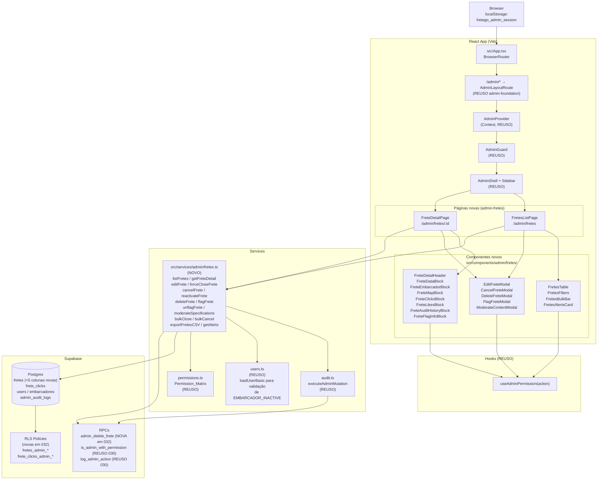

### 2.2 Fluxo lógico canônico

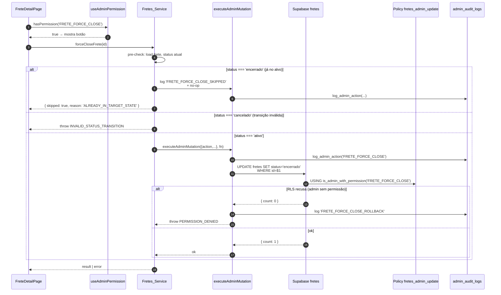

A RLS é a **última barreira**: mesmo que `pre-check` no service falhe (bug), a policy ainda bloqueia. A simetria entre service e RLS é coberta por testes de integração (não-PBT).

### 2.3 RLS reforçada

Toda query em `src/services/admin/fretes.ts` que toca `fretes` ou `frete_clicks` é executada com o JWT do admin logado. As novas policies (Req 13) usam `is_admin_with_permission(action)`, que já consulta `admin_roles WHERE user_id = auth.uid() AND revoked_at IS NULL`. O resultado é simétrico em 4 cenários:

| Cenário | Resultado RLS |
|---|---|
| `auth.uid()` é motorista comum | Apenas fretes com `status = 'ativo'` (policy de app comum, preservada) |
| `auth.uid()` é embarcador comum | Apenas próprios fretes (policy de app comum, preservada) |
| `auth.uid()` é admin com `FRETE_VIEW` | **Todas** as linhas (nova policy `fretes_admin_select`) |
| `auth.uid()` é admin SUPORTE tentando `DELETE` em `fretes` | 0 linhas afetadas (silently denied — SUPORTE não tem `FRETE_DELETE`) |
| `auth.uid()` é admin MODERADOR tentando `UPDATE specifications` | 0 linhas afetadas (silently denied — MODERADOR tem `FRETE_FORCE_CLOSE` mas não `FRETE_EDIT`) |

A policy `fretes_admin_update` é deliberadamente larga (`FRETE_EDIT OR FRETE_FORCE_CLOSE`) para que tanto edição quanto mudança de status passem; a granularidade de **qual coluna** pode ser alterada é responsabilidade do service (`editFrete` valida que `embarcador_id` não muda, etc.) e da Permission_Matrix (botões escondidos para quem não tem `FRETE_EDIT`).

## 3. Componentes e Interfaces (TypeScript)

### 3.1 Mapa de arquivos novos

```
supabase/migrations/
├── 032_admin_fretes.sql                          # migration desta spec
└── 032_admin_fretes_rollback.sql                 # rollback documentado (não auto-aplicado)

src/services/admin/
└── fretes.ts                                     # NOVO — service único da spec

src/pages/admin/fretes/
├── FretesListPage.tsx                            # /admin/fretes
└── FreteDetailPage.tsx                           # /admin/fretes/:id

src/components/admin/fretes/
├── FretesTable.tsx
├── FretesFilters.tsx
├── FretesBulkBar.tsx
├── FretesAlertsCard.tsx
├── EditFreteModal.tsx
├── CancelFreteModal.tsx
├── DeleteFreteModal.tsx
├── FlagFreteModal.tsx
├── ModerateContentModal.tsx
├── FreteDetailHeader.tsx
├── FreteDataBlock.tsx
├── FreteEmbarcadorBlock.tsx
├── FreteMapBlock.tsx
├── FreteClicksBlock.tsx
├── FreteLikesBlock.tsx
├── FreteAuditHistoryBlock.tsx
└── FreteFlagInfoBlock.tsx

src/__tests__/admin/fretes/
├── forceCloseIdempotent.property.test.ts         # CP-1 (OBRIGATÓRIO)
├── cancelRequiresReason.property.test.ts         # CP-2 (OBRIGATÓRIO)
├── filtersRoundTrip.property.test.ts             # CP-3 (opcional)
├── csvRoundTrip.property.test.ts                 # CP-4 (opcional)
├── bulkSkip.property.test.ts                     # CP-5 (opcional)
├── permissionVisibility.property.test.ts         # CP-6 (opcional)
├── optimisticVersion.property.test.ts            # CP-7 (opcional)
├── auditByConstruction.property.test.ts          # CP-8 (opcional)
├── reactivateBlocked.property.test.ts            # CP-9 (opcional)
├── conversionInRange.property.test.ts            # CP-10 (opcional)
├── statusFilterClassification.property.test.ts   # CP-11 (opcional)
└── permissionMatrixFrete.property.test.ts        # CP-12 (opcional)
```

### 3.2 Wiring no `AdminLayoutRoute`

`src/components/admin/AdminLayoutRoute.tsx` ganha 2 rotas filhas dentro do bloco protegido por `AdminGuard`. A ordem segue Req 15.4: `fretes` (lista) **antes** de `fretes/:id` (detalhe).

```tsx
// (esqueleto — apenas linhas adicionadas)
import FretesListPage from '../../pages/admin/fretes/FretesListPage';
import FreteDetailPage from '../../pages/admin/fretes/FreteDetailPage';

<Route element={<AdminGuard />}>
  <Route element={<AdminShell />}>
    <Route index element={<AdminDashboardPage />} />
    <Route path="users" element={<UsersListPage />} />
    <Route path="users/admins" element={<AdminsListPage />} />
    <Route path="users/:id" element={<UserDetailPage />} />
    <Route path="fretes" element={<FretesListPage />} />
    <Route path="fretes/:id" element={<FreteDetailPage />} />
    <Route path="audit" element={<AdminAuditPage />} />
    <Route path="perfil" element={<AdminProfilePage />} />
  </Route>
</Route>
```

> **Ordem importa.** Caso futuras specs adicionem `fretes/<segmento>` (ex: `fretes/relatorios`), elas **devem** vir antes de `fretes/:id`, senão o react-router casa `:id = "relatorios"` e quebra. Validado em teste de roteamento.

### 3.3 `AdminSidebar`

O item "Fretes" já existe em `AdminSidebar.tsx` apontando para `/admin/fretes` com permissão `FRETE_VIEW` — **nenhuma alteração necessária**. A sub-rota `/admin/fretes/:id` é navegada via clique em linha da tabela (não há link direto na sidebar).

### 3.4 Contratos públicos: `src/services/admin/fretes.ts`

```ts
// src/services/admin/fretes.ts

import type { AdminRole } from './permissions';

// ===================== Tipos públicos =====================

export type FreteStatus = 'ativo' | 'encerrado' | 'cancelado';
export type FreteStatusFilter = 'todos' | FreteStatus;
export type FreteSort =
  | 'created_desc'   // padrão
  | 'created_asc'
  | 'value_desc'
  | 'value_asc'
  | 'clicks_desc';

export interface FretesFilters {
  status: FreteStatusFilter;       // default: 'todos'
  embarcadorId: string | null;     // UUID ou null, default: null
  from: string | null;             // ISO date YYYY-MM-DD ou null
  to: string | null;               // ISO date YYYY-MM-DD ou null
  q: string;                       // busca livre, default: ''
  sort: FreteSort;                 // default: 'created_desc'
  flagged: boolean;                // default: false
  page: number;                    // 1-based, default: 1
  pageSize: number;                // fixo 25 nesta spec
}

export const DEFAULT_FRETES_FILTERS: FretesFilters = {
  status: 'todos',
  embarcadorId: null,
  from: null,
  to: null,
  q: '',
  sort: 'created_desc',
  flagged: false,
  page: 1,
  pageSize: 25,
};

export interface FreteRow {
  id: string;
  embarcador_id: string;
  embarcador_name: string | null;     // resolvido via join users
  embarcador_cnpj: string | null;     // resolvido via join embarcadores
  origin: string;
  destination: string;
  cargo_type: string;
  vehicle_type: string;
  weight: number;
  value: number;
  deadline: string;                   // ISO date
  loading_time: number;               // minutos
  unloading_time: number;             // minutos
  specifications: string | null;
  status: FreteStatus;
  cancel_reason: string | null;       // novo (032)
  flagged_for_review: boolean;        // novo (032)
  flagged_reason: string | null;      // novo (032)
  flagged_at: string | null;          // novo (032)
  flagged_by: string | null;          // novo (032)
  views_count: number;
  clicks_count: number;
  created_at: string;
  updated_at: string;                 // usado em versionamento otimista
}

export interface FretesListResult {
  rows: FreteRow[];
  total: number;
  page: number;
  pageSize: number;
}

// ===================== Detalhe consolidado =====================

export interface FreteEmbarcadorSnapshot {
  id: string;
  name: string;
  email: string | null;
  phone: string;
  cnpj: string | null;
  company_name: string | null;
  is_active: boolean;
  ban_reason: string | null;
}

export interface FreteClickRow {
  click_id: string;
  motorista_id: string;
  motorista_name: string;
  motorista_phone: string;
  clicked_at: string;
}

export interface FreteAuditEntry {
  id: string;
  admin_id: string;
  admin_name: string | null;
  action: string;
  created_at: string;
  before_data: unknown;
  after_data: unknown;
}

export interface FreteMetrics {
  views_count: number;
  clicks_count: number;
  days_active: number;                // (NOW() - created_at) em dias, floor
  estimated_conversion: number | null; // % com 2 casas; null se views_count = 0
}

export interface FreteDetailBundle {
  frete: FreteRow;
  embarcador: FreteEmbarcadorSnapshot | null;
  clicks: FreteClickRow[];
  clicksTotal: number;
  clicksPage: number;
  clicksPageSize: number;             // fixo 10
  metrics: FreteMetrics;
  history: FreteAuditEntry[];         // até 50 mais recentes
  // resultados parciais — cada bloco pode falhar isoladamente
  errors: Partial<Record<'embarcador' | 'clicks' | 'history', string>>;
}

// ===================== Alertas (FretesAlertsCard) =====================

export interface FretesAlerts {
  flaggedCount: number;               // count(*) WHERE flagged_for_review=true
  expiredActiveCount: number;         // count(*) WHERE status='ativo' AND deadline < hoje
  noClicksRecentCount: number;        // status='ativo' AND clicks_count=0 AND created_at < now()-7d
}

// ===================== Bulk =====================

export interface BulkResult {
  success: string[];                  // freteIds
  skipped: { id: string; reason: BulkSkipReason }[];
  failed: { id: string; reason: string }[];
}

export type BulkSkipReason =
  | 'ALREADY_IN_TARGET_STATE'
  | 'INVALID_STATUS_TRANSITION'
  | 'EMBARCADOR_INACTIVE';

// ===================== Erros =====================

export type FretesErrorCode =
  | 'STALE_VERSION'
  | 'EMBARCADOR_INACTIVE'
  | 'INVALID_INPUT'
  | 'INVALID_STATUS_TRANSITION'
  | 'TERMINAL_STATE_FIELD_LOCKED'
  | 'DEADLINE_IN_PAST'
  | 'ALREADY_CLOSED'
  | 'NOT_FOUND'
  | 'PERMISSION_DENIED'
  | 'BULK_LIMIT_EXCEEDED';

export class FretesServiceError extends Error {
  constructor(
    public code: FretesErrorCode,
    message?: string,
    public cause?: unknown
  ) {
    super(message ?? code);
    this.name = 'FretesServiceError';
  }
}

export const FRETES_ERROR_MESSAGES: Record<FretesErrorCode, string> = {
  STALE_VERSION: 'Os dados foram alterados por outro admin. Recarregue antes de salvar.',
  EMBARCADOR_INACTIVE: 'Embarcador está desativado ou banido. Reative o embarcador antes.',
  INVALID_INPUT: 'Dados inválidos.',
  INVALID_STATUS_TRANSITION: 'Transição de status não permitida.',
  TERMINAL_STATE_FIELD_LOCKED: 'Frete em estado terminal não permite alterar este campo.',
  DEADLINE_IN_PAST: 'Prazo deve ser igual ou maior que hoje.',
  ALREADY_CLOSED: 'Frete já está encerrado.',
  NOT_FOUND: 'Frete não encontrado.',
  PERMISSION_DENIED: 'Operação não permitida.',
  BULK_LIMIT_EXCEEDED: 'Máximo de 200 fretes por operação.',
};

// ===================== Edição =====================

export interface EditFretePayload {
  origin: string;
  origin_lat: number;
  origin_lng: number;
  destination: string;
  destination_lat: number;
  destination_lng: number;
  cargo_type: string;
  vehicle_type: string;
  weight: number;
  value: number;
  deadline: string;                   // ISO date
  loading_time: number;
  unloading_time: number;
  specifications: string | null;
}

// ===================== Assinaturas =====================

export async function listFretes(
  filters: FretesFilters
): Promise<FretesListResult>;

export async function getFreteDetail(
  id: string,
  clicksPage?: number
): Promise<FreteDetailBundle>;

export async function editFrete(
  id: string,
  data: EditFretePayload,
  expectedUpdatedAt: string
): Promise<FreteRow>;

export async function forceCloseFrete(
  id: string
): Promise<{ ok: true } | { skipped: true; reason: 'ALREADY_IN_TARGET_STATE' }>;

export async function cancelFrete(
  id: string,
  reason: string
): Promise<{ ok: true } | { skipped: true; reason: 'ALREADY_IN_TARGET_STATE' }>;

export async function reactivateFrete(
  id: string
): Promise<{ ok: true } | { skipped: true; reason: 'ALREADY_IN_TARGET_STATE' }>;

export async function deleteFrete(
  id: string,
  options: { confirmedKeyword: 'EXCLUIR' }
): Promise<{ deleted: true; clicksDeleted: number }>;

export async function flagFrete(
  id: string,
  reason: string
): Promise<{ ok: true }>;

export async function unflagFrete(
  id: string
): Promise<{ ok: true }>;

export async function moderateSpecifications(
  id: string
): Promise<{ ok: true } | { skipped: true; reason: 'ALREADY_MODERATED' }>;

export async function bulkClose(
  ids: string[]
): Promise<BulkResult>;

export async function bulkCancel(
  ids: string[],
  reason: string
): Promise<BulkResult>;

export async function exportFretesCSV(
  filters: FretesFilters
): Promise<{ csv: string; totalExported: number; truncated: boolean }>;

export async function getAlerts(): Promise<FretesAlerts>;

// ===================== URL ↔ filtros =====================

export function parseFretesFiltersFromQuery(
  qs: URLSearchParams | string
): FretesFilters;

export function serializeFretesFiltersToQuery(
  filters: FretesFilters
): URLSearchParams;

// ===================== Helpers puros (testáveis) =====================

export function classifyFreteStatus(f: Pick<FreteRow, 'status'>): FreteStatus;

export function exportFretesToCsvString(rows: FreteRow[]): string;

export function isUuid(s: string): boolean;

export function calculateMetrics(args: {
  views_count: number;
  clicks_count: number;
  created_at: string;
  now?: Date;
}): FreteMetrics;

export const SPECIFICATIONS_PLACEHOLDER = '[Conteúdo removido por moderação]';
```

### 3.5 Tabela de erros e UI

| Code | Origem | Mensagem UI (toast) |
|---|---|---|
| `STALE_VERSION` | service (count = 0 após `WHERE updated_at = ?`) | `Os dados foram alterados por outro admin. Recarregue antes de salvar.` (com botão `Recarregar`) |
| `EMBARCADOR_INACTIVE` | service (pre-check em `reactivateFrete`) | `Embarcador está desativado ou banido. Reative o embarcador antes de reativar o frete.` |
| `INVALID_INPUT` | service (validação de payload, motivo vazio, embarcador_id divergente) | Mensagem específica por campo no modal; toast genérico `Dados inválidos.` |
| `INVALID_STATUS_TRANSITION` | service (`forceClose` em `cancelado`) | `Não é possível encerrar um frete cancelado. Reative-o primeiro.` |
| `TERMINAL_STATE_FIELD_LOCKED` | service (tentativa de editar campo em `cancelado`) | `Frete cancelado. Reative antes de editar.` |
| `DEADLINE_IN_PAST` | service (validação payload de edição) | `Prazo deve ser igual ou maior que hoje.` |
| `NOT_FOUND` | service (`:id` UUID válido mas inexistente) | Não exibido como toast; redireciona para Stealth404 |
| `PERMISSION_DENIED` | RLS retornou 0 linhas em mutação | `Operação não permitida.` |
| `BULK_LIMIT_EXCEEDED` | service | `Máximo de 200 fretes por operação.` |

Todas as mensagens são em pt-BR e renderizadas via toast do `react-hot-toast` já em uso no projeto.

### 3.6 Páginas — props e estados

#### `FretesListPage`

```ts
// Sem props (página de rota). Usa useSearchParams() do react-router.
interface FretesListPageState {
  filters: FretesFilters;            // espelho de useSearchParams
  data: FretesListResult | null;
  alerts: FretesAlerts | null;
  loading: boolean;
  error: string | null;
  selectedIds: Set<string>;          // bulk selection
  bulkInProgress: { current: number; total: number } | null;
  bulkResult: BulkResult | null;     // mostrado em modal de resumo
  exporting: boolean;
}
```

#### `FreteDetailPage`

```ts
// Path param: id (UUID v4).
interface FreteDetailPageState {
  bundle: FreteDetailBundle | null;
  loading: boolean;
  notFound: boolean;                 // → renderiza Stealth404
  // Modais
  editing: boolean;
  cancelling: boolean;
  deleting: boolean;
  flagging: boolean;
  moderating: boolean;
  reactivating: boolean;
  closingForce: boolean;
  // Erro top-level (página)
  fatalError: string | null;
  // Paginação de cliques
  clicksPage: number;
}
```

### 3.7 Componentes — contratos resumidos

```ts
// FretesTable
interface FretesTableProps {
  rows: FreteRow[];
  loading: boolean;
  selectedIds: Set<string>;
  onToggleSelect: (id: string) => void;
  onToggleSelectAll: (checked: boolean) => void;
  canSelect: boolean;                // permissão FRETE_FORCE_CLOSE
  onRowClick: (id: string) => void;  // navega para detalhe
}

// FretesFilters
interface FretesFiltersProps {
  filters: FretesFilters;
  onChange: (next: FretesFilters) => void;  // reseta page=1 exceto pageSize
  totalFiltered: number;
}

// FretesBulkBar
interface FretesBulkBarProps {
  selectedCount: number;
  onClose: () => void;
  onCancel: () => void;
  onClear: () => void;
  disabled?: boolean;                // selectedCount > 200
  inProgress?: { current: number; total: number };
}

// FretesAlertsCard
interface FretesAlertsCardProps {
  alerts: FretesAlerts | null;
  onClickFlagged: () => void;        // aplica filtro flagged=1
}

// EditFreteModal
interface EditFreteModalProps {
  frete: FreteRow;
  onClose: () => void;
  onSaved: (updated: FreteRow) => void;
}

// CancelFreteModal
interface CancelFreteModalProps {
  frete: FreteRow;
  onClose: () => void;
  onCancelled: () => void;
}

// DeleteFreteModal
interface DeleteFreteModalProps {
  frete: FreteRow;
  clicksCount: number;               // pré-buscado
  onClose: () => void;
  onDeleted: () => void;
}

// FlagFreteModal
interface FlagFreteModalProps {
  frete: FreteRow;
  mode: 'flag' | 'unflag';
  onClose: () => void;
  onChanged: () => void;
}

// ModerateContentModal
interface ModerateContentModalProps {
  frete: FreteRow;
  onClose: () => void;
  onModerated: () => void;
}

// FreteDetailHeader / FreteDataBlock / FreteEmbarcadorBlock /
// FreteMapBlock / FreteClicksBlock / FreteLikesBlock /
// FreteAuditHistoryBlock / FreteFlagInfoBlock
// → recebem o slice correspondente do FreteDetailBundle
//   e exibem error/empty/loading isolados
```


## 4. Modelo de dados

### 4.1 Diagrama ER (deltas)

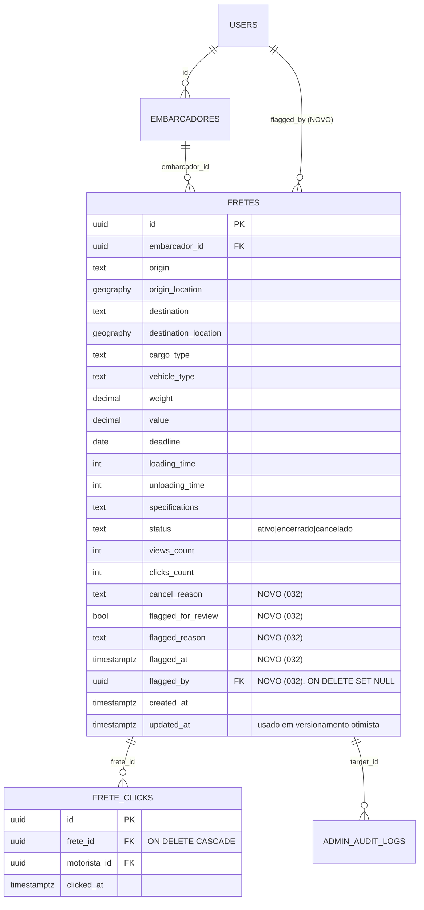

Apenas `fretes` recebe colunas novas. As policies são adicionadas em `fretes` e `frete_clicks` mas o **schema** de `frete_clicks` não muda. Não há triggers novos nesta spec — toda a defesa em profundidade é via service + RLS + RPC SECURITY DEFINER.

### 4.2 SQL completo: `032_admin_fretes.sql`

Toda a migration é envolta em `BEGIN; ... COMMIT;` e idempotente via `IF NOT EXISTS` / `CREATE OR REPLACE` / `DROP POLICY IF EXISTS`. O bloco `-- VERIFY` final faz smoke test.

#### 4.2.1 Cabeçalho e validação de dependências (030 + 031)

```sql
-- =====================================================
-- Migration 032: admin-fretes
--
-- Adiciona o módulo de gestão de fretes sobre as fundações
-- entregues em 030_admin_foundation.sql e 031_admin_users.sql.
--
-- Componentes:
--   - fretes.cancel_reason / flagged_for_review / flagged_reason /
--     flagged_at / flagged_by
--   - Constraint chk_fretes_flag_consistency
--   - Constraint chk_fretes_cancel_reason_consistency
--   - Constraint chk_fretes_cancel_reason_length
--   - Constraint chk_fretes_flagged_reason_length
--   - Índice parcial idx_fretes_flagged
--   - Função admin_delete_frete(uuid) SECURITY DEFINER
--   - Policies RLS adicionais em fretes e frete_clicks
--
-- Dependências: migrations 001..031 aplicadas. Em particular:
--   - is_admin_with_permission(text) (030)
--   - log_admin_action(...) (030)
--   - users.is_active / users.ban_reason (031)
--
-- IMPORTANTE: a exclusão de frete via admin_delete_frete deleta
-- explicitamente as linhas em frete_clicks ANTES de fretes para
-- que a contagem de cliques apagados seja capturada e gravada
-- no audit log da camada TS. A FK ON DELETE CASCADE permanece
-- em frete_clicks como salvaguarda.
--
-- Idempotente: pode ser reaplicada sem erros.
-- =====================================================

BEGIN;

-- Garante que a migration 030 está aplicada
DO $check$
BEGIN
  IF NOT EXISTS (
    SELECT 1 FROM information_schema.routines
    WHERE routine_schema = 'public' AND routine_name = 'is_admin_with_permission'
  ) THEN
    RAISE EXCEPTION 'Migration 030 (admin-foundation) não está aplicada';
  END IF;
END
$check$;

-- Garante que a migration 031 está aplicada (precisamos de users.ban_reason)
DO $check$
BEGIN
  IF NOT EXISTS (
    SELECT 1 FROM information_schema.columns
    WHERE table_schema='public' AND table_name='users' AND column_name='ban_reason'
  ) THEN
    RAISE EXCEPTION 'Migration 031 (admin-users) não está aplicada';
  END IF;
END
$check$;
```

#### 4.2.2 Colunas novas em `fretes`

```sql
ALTER TABLE fretes
  ADD COLUMN IF NOT EXISTS cancel_reason        TEXT NULL,
  ADD COLUMN IF NOT EXISTS flagged_for_review   BOOLEAN NOT NULL DEFAULT false,
  ADD COLUMN IF NOT EXISTS flagged_reason       TEXT NULL,
  ADD COLUMN IF NOT EXISTS flagged_at           TIMESTAMPTZ NULL,
  ADD COLUMN IF NOT EXISTS flagged_by           UUID NULL
                                                REFERENCES users(id) ON DELETE SET NULL;
```

#### 4.2.3 Constraints de coerência

```sql
-- ban_reason e cancel_reason são textos livres do admin. Limitamos tamanho
-- para evitar payloads abusivos que estourem o audit log.
ALTER TABLE fretes DROP CONSTRAINT IF EXISTS chk_fretes_cancel_reason_length;
ALTER TABLE fretes ADD  CONSTRAINT chk_fretes_cancel_reason_length
  CHECK (cancel_reason IS NULL OR char_length(cancel_reason) <= 1000);

ALTER TABLE fretes DROP CONSTRAINT IF EXISTS chk_fretes_flagged_reason_length;
ALTER TABLE fretes ADD  CONSTRAINT chk_fretes_flagged_reason_length
  CHECK (flagged_reason IS NULL OR char_length(flagged_reason) <= 500);

-- cancel_reason só existe quando status = 'cancelado'
-- (estado terminal protegido — Req design 1.3).
ALTER TABLE fretes DROP CONSTRAINT IF EXISTS chk_fretes_cancel_reason_consistency;
ALTER TABLE fretes ADD  CONSTRAINT chk_fretes_cancel_reason_consistency
  CHECK (
    (status = 'cancelado' AND cancel_reason IS NOT NULL)
    OR
    (status <> 'cancelado' AND cancel_reason IS NULL)
  );

-- flag_for_review: 4 colunas andam juntas (Req 11.2).
ALTER TABLE fretes DROP CONSTRAINT IF EXISTS chk_fretes_flag_consistency;
ALTER TABLE fretes ADD  CONSTRAINT chk_fretes_flag_consistency
  CHECK (
    (flagged_for_review = false
       AND flagged_reason IS NULL
       AND flagged_at IS NULL
       AND flagged_by IS NULL)
    OR
    (flagged_for_review = true
       AND flagged_reason IS NOT NULL
       AND flagged_at IS NOT NULL)
  );
```

> **Por que `flagged_by` pode ser NULL mesmo com `flagged_for_review = true`?**
> Porque a FK é `ON DELETE SET NULL`: se o admin que sinalizou for excluído depois, o registro fica órfão de `flagged_by` mas a sinalização permanece. Isto é deliberado — o histórico em `admin_audit_logs` preserva quem foi e a flag continua válida.

#### 4.2.4 Índice parcial em `flagged_for_review`

```sql
-- Índice parcial usado pelo filtro Apenas sinalizados (Req 11.10)
-- e pelo card de alertas (FretesAlertsCard).
CREATE INDEX IF NOT EXISTS idx_fretes_flagged
  ON fretes(id) WHERE flagged_for_review = true;

-- Também precisamos de índices que cobrem as queries de listagem.
-- Estes podem já existir em migrations anteriores; idempotente:
CREATE INDEX IF NOT EXISTS idx_fretes_status_created
  ON fretes(status, created_at DESC);

CREATE INDEX IF NOT EXISTS idx_fretes_embarcador_created
  ON fretes(embarcador_id, created_at DESC);

-- Para o filtro "fretes ativos com deadline expirada"
CREATE INDEX IF NOT EXISTS idx_fretes_active_deadline
  ON fretes(deadline) WHERE status = 'ativo';
```

#### 4.2.5 Cascade explícita em `frete_clicks`

A FK em `frete_clicks.frete_id` já tem `ON DELETE CASCADE` desde migration 001 (verificado em `001_initial_schema.sql:78-80`). Esta migration **não modifica a FK**. A RPC `admin_delete_frete` deleta `frete_clicks` explicitamente para capturar a contagem; a CASCADE permanece como salvaguarda em caso de bypass.

```sql
-- Verifica que a FK existe e tem ON DELETE CASCADE.
-- Bloco DO defensivo: se por algum motivo a FK foi recriada sem CASCADE
-- em migration intermediária, este bloco corrige.
DO $fk$
DECLARE
  v_action text;
BEGIN
  SELECT confdeltype INTO v_action
  FROM pg_constraint
  WHERE conname = 'frete_clicks_frete_id_fkey'
     OR (conrelid = 'frete_clicks'::regclass
         AND contype = 'f'
         AND array_length(conkey, 1) = 1
         AND attname(conrelid, conkey[1]) = 'frete_id')
  LIMIT 1;

  IF v_action IS NULL THEN
    RAISE NOTICE 'frete_clicks.frete_id FK não encontrada — schema inesperado';
  ELSIF v_action <> 'c' THEN
    RAISE NOTICE 'frete_clicks.frete_id FK encontrada sem ON DELETE CASCADE (action=%); recriando', v_action;
    ALTER TABLE frete_clicks DROP CONSTRAINT frete_clicks_frete_id_fkey;
    ALTER TABLE frete_clicks ADD  CONSTRAINT frete_clicks_frete_id_fkey
      FOREIGN KEY (frete_id) REFERENCES fretes(id) ON DELETE CASCADE;
  END IF;
END
$fk$;

-- Helper para o bloco acima.
CREATE OR REPLACE FUNCTION attname(p_relid oid, p_attnum smallint)
RETURNS text LANGUAGE sql STABLE AS $$
  SELECT attname FROM pg_attribute WHERE attrelid = p_relid AND attnum = p_attnum;
$$;
```

> **Nota.** O helper `attname(oid, smallint)` é local a esta migration e usado apenas no bloco `DO $fk$`. Se já existir, `CREATE OR REPLACE` é idempotente.

#### 4.2.6 Função `admin_delete_frete(p_frete_id uuid)`

```sql
-- Deleta um frete em hard-delete, capturando contagem de cliques apagados.
-- Verifica permissão FRETE_DELETE do caller. Verifica existência.
-- Returns counters em jsonb.
CREATE OR REPLACE FUNCTION admin_delete_frete(p_frete_id uuid)
RETURNS jsonb
LANGUAGE plpgsql
SECURITY DEFINER
SET search_path = public
AS $func$
DECLARE
  v_caller         uuid := auth.uid();
  v_clicks_deleted integer := 0;
  v_existed        boolean;
BEGIN
  IF v_caller IS NULL THEN
    RAISE EXCEPTION 'admin_delete_frete requires authenticated session';
  END IF;
  IF NOT is_admin_with_permission('FRETE_DELETE') THEN
    RAISE EXCEPTION 'permission_denied: FRETE_DELETE required';
  END IF;

  SELECT EXISTS (SELECT 1 FROM fretes WHERE id = p_frete_id) INTO v_existed;
  IF NOT v_existed THEN
    RAISE EXCEPTION 'not_found';
  END IF;

  -- Lock no frete para evitar concorrência com outras mutações.
  PERFORM 1 FROM fretes WHERE id = p_frete_id FOR UPDATE;

  -- Apaga cliques explicitamente capturando count (Req 8.7).
  DELETE FROM frete_clicks WHERE frete_id = p_frete_id;
  GET DIAGNOSTICS v_clicks_deleted = ROW_COUNT;

  -- Apaga frete (CASCADE em frete_clicks é redundante mas segura).
  DELETE FROM fretes WHERE id = p_frete_id;

  RETURN jsonb_build_object(
    'deleted', true,
    'clicks_deleted', v_clicks_deleted
  );
END;
$func$;

REVOKE ALL ON FUNCTION admin_delete_frete(uuid) FROM PUBLIC;
GRANT EXECUTE ON FUNCTION admin_delete_frete(uuid) TO authenticated;
```

> **Nota sobre logs.** A RPC **não** loga `FRETE_DELETE` internamente. O log principal é responsabilidade do `executeAdminMutation` na camada TS. A camada TS adiciona um segundo log `FRETE_DELETE_CASCADE_CLICKS` com a contagem retornada (Req 8.9) — é uma assimetria deliberada com `admin_delete_user` (que loga apenas `FRETE_AUTO_CANCEL` derivado). Esta convenção é validada por CP-8.

#### 4.2.7 Policies RLS adicionais

A estratégia é **policies separadas** (não combinar com OR no `USING` existente) para preservar a policy do app comum intacta. Toda nova policy é `DROP POLICY IF EXISTS` + `CREATE POLICY` para idempotência.

```sql
-- ========== fretes ==========

-- Admin com FRETE_VIEW vê todas as linhas (independente de status)
DROP POLICY IF EXISTS fretes_admin_select ON fretes;
CREATE POLICY fretes_admin_select ON fretes
  FOR SELECT TO authenticated
  USING (is_admin_with_permission('FRETE_VIEW'));

-- Admin com FRETE_EDIT (edição) OU FRETE_FORCE_CLOSE (mudar status,
-- sinalizar, moderar specifications) pode UPDATE.
-- A granularidade fina (qual coluna pode mudar) é responsabilidade
-- do service TS e da Permission_Matrix do front.
DROP POLICY IF EXISTS fretes_admin_update ON fretes;
CREATE POLICY fretes_admin_update ON fretes
  FOR UPDATE TO authenticated
  USING (
    is_admin_with_permission('FRETE_EDIT')
    OR is_admin_with_permission('FRETE_FORCE_CLOSE')
  )
  WITH CHECK (
    is_admin_with_permission('FRETE_EDIT')
    OR is_admin_with_permission('FRETE_FORCE_CLOSE')
  );

-- DELETE direto bloqueado por policy: a única forma é via RPC
-- admin_delete_frete que checa permissão internamente.
-- Mantemos a policy permissiva para FRETE_DELETE como salvaguarda
-- caso a RPC seja contornada (defesa em profundidade).
DROP POLICY IF EXISTS fretes_admin_delete ON fretes;
CREATE POLICY fretes_admin_delete ON fretes
  FOR DELETE TO authenticated
  USING (is_admin_with_permission('FRETE_DELETE'));

-- ========== frete_clicks ==========

-- Admin com FRETE_VIEW pode ler cliques (Req 13.4).
DROP POLICY IF EXISTS frete_clicks_admin_select ON frete_clicks;
CREATE POLICY frete_clicks_admin_select ON frete_clicks
  FOR SELECT TO authenticated
  USING (is_admin_with_permission('FRETE_VIEW'));

-- DELETE direto bloqueado por padrão pela policy de app comum.
-- Adicionamos policy explícita para FRETE_DELETE para que a RPC
-- admin_delete_frete consiga apagar (defesa em profundidade caso
-- search_path da RPC seja alterado em runtime).
DROP POLICY IF EXISTS frete_clicks_admin_delete ON frete_clicks;
CREATE POLICY frete_clicks_admin_delete ON frete_clicks
  FOR DELETE TO authenticated
  USING (is_admin_with_permission('FRETE_DELETE'));
```

> **Por que não uma policy `FOR ALL`?**
> Mantemos `SELECT`, `UPDATE`, `DELETE` separadas para granularidade. Isto também preserva a policy de `INSERT` do app comum (embarcador cria próprio frete) intacta — admin **não pode** inserir `fretes` por essa via. Se for necessário criar fretes manualmente em alguma spec futura, será via RPC dedicada.

#### 4.2.8 Bloco `-- VERIFY` final

```sql
-- =====================================================
-- VERIFY: smoke test pós-deploy. Executar manualmente após
-- aplicar a migration. Todos os SELECTs devem retornar
-- conforme esperado nos comentários.
-- =====================================================

-- 1. Colunas novas em fretes
SELECT column_name, data_type, is_nullable
FROM information_schema.columns
WHERE table_schema = 'public' AND table_name = 'fretes'
  AND column_name IN ('cancel_reason','flagged_for_review',
                      'flagged_reason','flagged_at','flagged_by');
-- Esperado: 5 linhas

-- 2. Constraints novas
SELECT conname FROM pg_constraint
WHERE conname IN (
  'chk_fretes_cancel_reason_length',
  'chk_fretes_cancel_reason_consistency',
  'chk_fretes_flagged_reason_length',
  'chk_fretes_flag_consistency'
);
-- Esperado: 4 linhas

-- 3. Índices novos
SELECT indexname FROM pg_indexes
WHERE indexname IN (
  'idx_fretes_flagged',
  'idx_fretes_status_created',
  'idx_fretes_embarcador_created',
  'idx_fretes_active_deadline'
);
-- Esperado: 4 linhas

-- 4. RPC nova
SELECT proname FROM pg_proc
WHERE proname = 'admin_delete_frete';
-- Esperado: 1 linha

-- 5. Policies RLS adicionais
SELECT tablename, policyname FROM pg_policies
WHERE policyname IN (
  'fretes_admin_select','fretes_admin_update','fretes_admin_delete',
  'frete_clicks_admin_select','frete_clicks_admin_delete'
)
ORDER BY tablename, policyname;
-- Esperado: 5 linhas

-- 6. FK frete_clicks.frete_id continua com ON DELETE CASCADE
SELECT confdeltype FROM pg_constraint
WHERE conrelid = 'frete_clicks'::regclass
  AND contype = 'f'
  AND array_position(conkey, (
    SELECT attnum FROM pg_attribute
    WHERE attrelid = 'frete_clicks'::regclass AND attname = 'frete_id'
  )) IS NOT NULL;
-- Esperado: 'c' (CASCADE)

COMMIT;
```

## 5. Permission_Matrix aplicada à spec

A `Permission_Matrix` é fonte única (`src/services/admin/permissions.ts`, espelhada em `is_admin_with_permission`). A tabela abaixo materializa **apenas** as ações relevantes a esta spec:

| Ação / botão na UI | Permissão exigida | SUPER_ADMIN | ADMIN | SUPORTE | FINANCEIRO | MODERADOR |
|---|---|:---:|:---:|:---:|:---:|:---:|
| Acesso a `/admin/fretes` (lista) e `/admin/fretes/:id` | `FRETE_VIEW` | ✅ | ✅ | ✅ | ✅ | ✅ |
| Botão `Editar` | `FRETE_EDIT` | ✅ | ✅ | ❌ | ❌ | ❌ |
| Botão `Reativar frete` | `FRETE_EDIT` | ✅ | ✅ | ❌ | ❌ | ❌ |
| Botão `Sinalizar / Remover sinalização` | `FRETE_EDIT` | ✅ | ✅ | ❌ | ❌ | ❌ |
| Botão `Moderar conteúdo` (specifications) | `FRETE_EDIT` | ✅ | ✅ | ❌ | ❌ | ❌ |
| Botão `Forçar encerramento` | `FRETE_FORCE_CLOSE` | ✅ | ✅ | ❌ | ❌ | ✅ |
| Botão `Forçar cancelamento` | `FRETE_FORCE_CLOSE` | ✅ | ✅ | ❌ | ❌ | ✅ |
| Bulk encerrar / cancelar | `FRETE_FORCE_CLOSE` | ✅ | ✅ | ❌ | ❌ | ✅ |
| Botão `Excluir frete` (hard-delete) | `FRETE_DELETE` | ✅ | ❌ | ❌ | ❌ | ❌ |
| Botão `Exportar CSV` | `FRETE_VIEW` | ✅ | ✅ | ✅ | ✅ | ✅ |
| Bloco `Histórico de Mudanças` (audit) | `AUDIT_VIEW` | ✅ | ✅ | ❌ | ✅ | ❌ |
| Link `Ver perfil` (embarcador / motorista) | `USER_VIEW` | ✅ | ✅ | ✅ | ✅ | ✅ |

Consequências práticas:

- `MODERADOR` vê a lista, abre detalhe, pode encerrar/cancelar fretes e fazer bulk dessas ações. **Não** pode editar dados, sinalizar, moderar specifications, reativar nem excluir.
- `SUPORTE` e `FINANCEIRO` são modo readonly: vêem listagem e detalhe, exportam CSV, mas não têm botão de mutação algum.
- `ADMIN` é equivalente a `SUPER_ADMIN` exceto em `FRETE_DELETE` (apenas SUPER_ADMIN pode hard-delete).
- `SUPER_ADMIN` vê tudo e pode fazer tudo.

CP-6 valida que a tabela acima é exatamente o que a UI exibe. CP-12 valida a `Permission_Matrix` para as 4 ações `FRETE_*`.

## 6. Fluxos

### 6.1 Listagem `/admin/fretes` com filtros + paginação + URL params

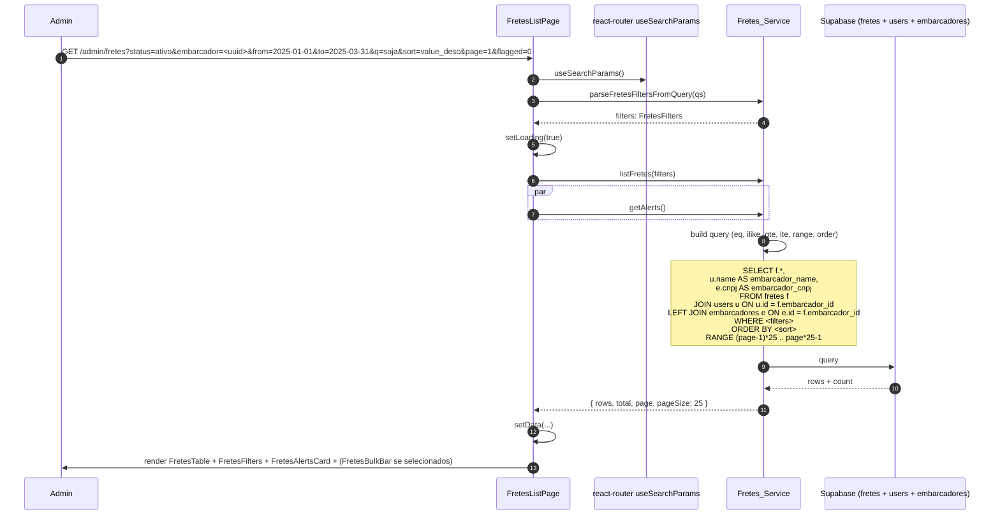

Mudança de filtro:

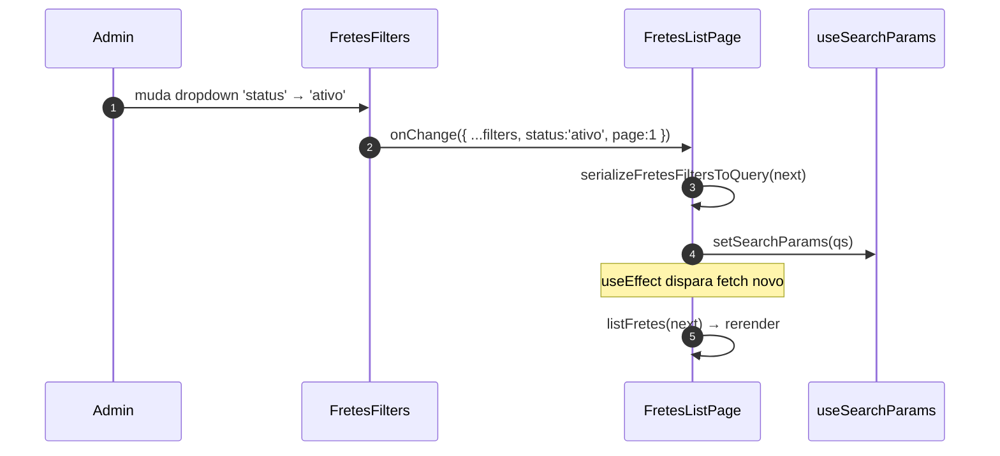

Debounce de 300ms só se aplica ao campo `q` (busca livre). Mudança em dropdowns dispara imediatamente. Mudança em data range valida `from > to` antes de disparar (Req 2.6).

### 6.2 Edição com versionamento otimista (path STALE_VERSION)

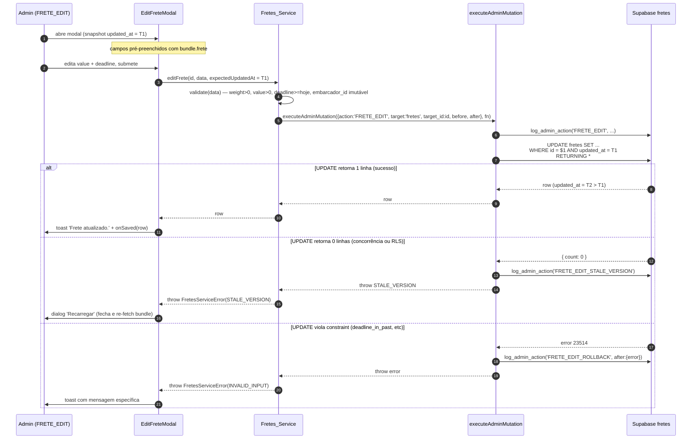

### 6.3 Forçar encerramento idempotente (skip path)

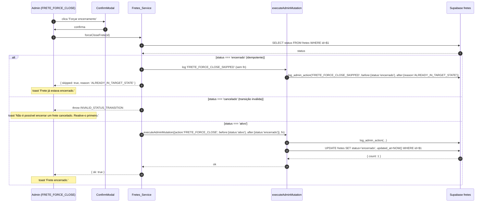

CP-1 valida o caminho idempotente (status já `encerrado`).

### 6.4 Cancelamento com motivo obrigatório (path INVALID_INPUT)

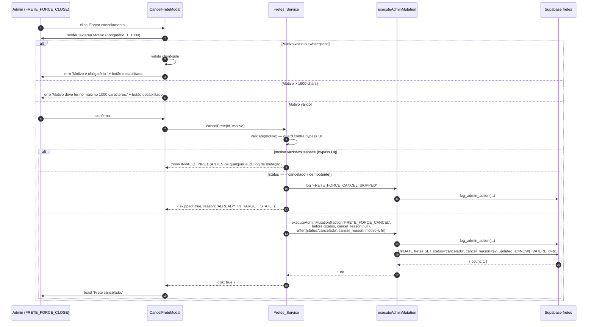

CP-2 valida o caminho `INVALID_INPUT` para todos os casos de motivo vazio/whitespace.

### 6.5 Reativação com bloqueio EMBARCADOR_INACTIVE

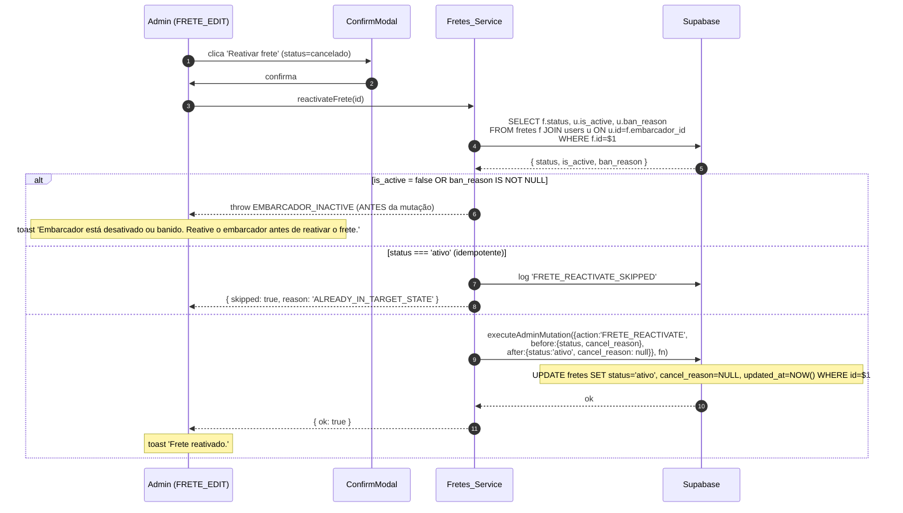

CP-9 valida o caminho `EMBARCADOR_INACTIVE`.

### 6.6 Exclusão via RPC com cascade contado

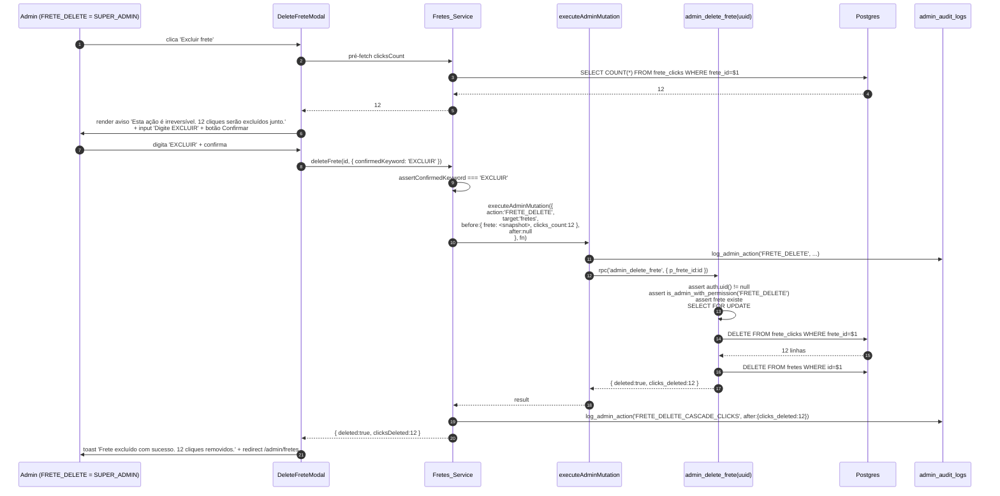

> **Observação sobre logs.** Total de logs por exclusão bem-sucedida: 2 (`FRETE_DELETE` + `FRETE_DELETE_CASCADE_CLICKS`). Em caso de falha pós-`FRETE_DELETE`, total: 2 (`FRETE_DELETE` + `FRETE_DELETE_ROLLBACK`). A separação é deliberada para preservar a contagem de cliques no audit trail mesmo em hard-delete.

### 6.7 Bulk action com Promise.allSettled e skip de status mistos

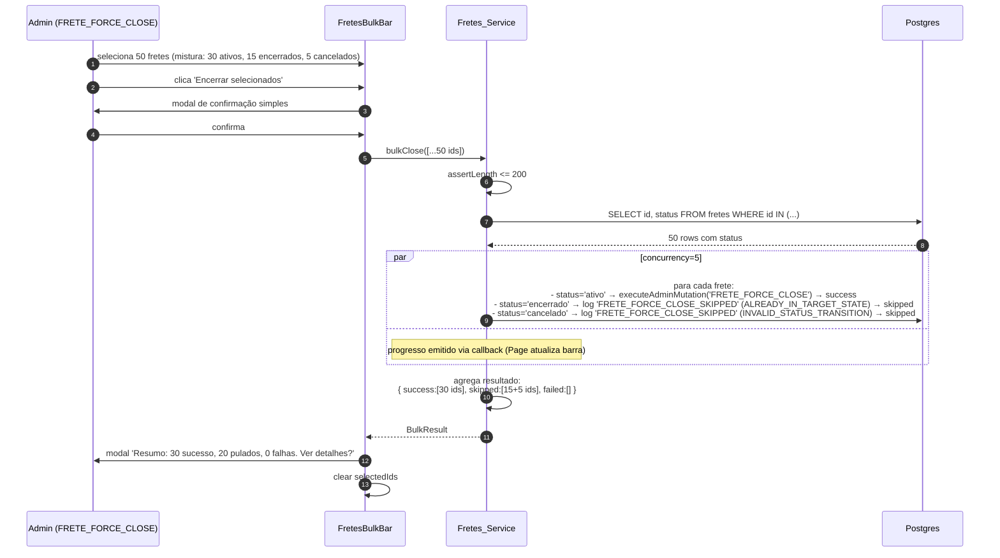

Implementação da concorrência (esqueleto, reaproveitando padrão de `users.ts::bulkToggleActive`):

```ts
async function bulkClose(ids: string[]): Promise<BulkResult> {
  if (ids.length > 200) throw new FretesServiceError('BULK_LIMIT_EXCEEDED');

  // Pre-fetch de status para classificar skip vs success cedo
  const statusById = await loadStatuses(ids);

  const tasks = ids.map((id) => async (): Promise<BulkOutcome> => {
    const status = statusById.get(id);
    if (!status) {
      return { kind: 'failed', id, reason: 'NOT_FOUND' };
    }
    if (status === 'encerrado') {
      await logAdminAction({
        action: 'FRETE_FORCE_CLOSE_SKIPPED',
        targetType: 'fretes', targetId: id,
        before: { status }, after: { reason: 'ALREADY_IN_TARGET_STATE' },
      });
      return { kind: 'skipped', id, reason: 'ALREADY_IN_TARGET_STATE' };
    }
    if (status === 'cancelado') {
      await logAdminAction({
        action: 'FRETE_FORCE_CLOSE_SKIPPED',
        targetType: 'fretes', targetId: id,
        before: { status }, after: { reason: 'INVALID_STATUS_TRANSITION' },
      });
      return { kind: 'skipped', id, reason: 'INVALID_STATUS_TRANSITION' };
    }
    try {
      await executeAdminMutation(
        { action: 'FRETE_FORCE_CLOSE', targetType: 'fretes', targetId: id,
          before: { status: 'ativo' }, after: { status: 'encerrado' } },
        async () => {
          const { error } = await supabase
            .from('fretes')
            .update({ status: 'encerrado', updated_at: new Date().toISOString() })
            .eq('id', id);
          if (error) throw error;
        }
      );
      return { kind: 'success', id };
    } catch (err) {
      return { kind: 'failed', id, reason: (err as Error).message };
    }
  });

  return await runWithConcurrency(tasks, 5);
}
```

CP-5 valida o invariante de skip por estado-alvo e por transição inválida.

### 6.8 Moderação de specifications (idempotente via ALREADY_MODERATED)

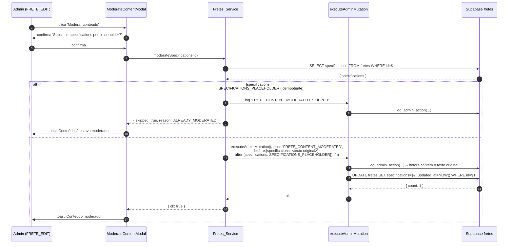

> **Importante.** O `before_data` do audit log contém o texto **original** das specifications. Isto é deliberado: preserva a trilha de auditoria do conteúdo removido. O risco é vazamento de PII via audit log (§12 Riscos).

### 6.9 Sinalizar / remover sinalização (flagged_for_review)

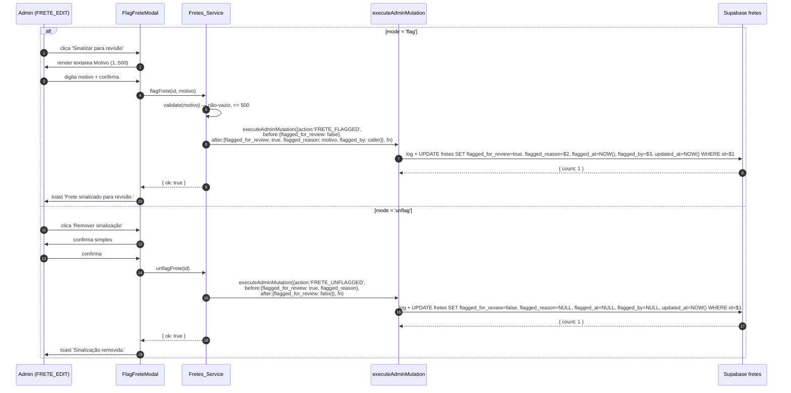


## 7. Detalhamento de UI

Todos os textos abaixo são em pt-BR. Estilo: tema dark do admin (mesmo do `AdminShell`), classes Tailwind já em uso (`bg-gray-950`, `text-gray-200`, `border-gray-800`, etc).

### 7.1 `FretesListPage` — `/admin/fretes`

```
┌────────────────────────────────────────────────────────────────────────┐
│ Fretes                                                  [Exportar CSV]  │
│ Total: 1.247 fretes (filtrados)                                         │
│ ┌─────────────────────────────────────────────────────────────────┐   │
│ │ ⚠️  Alertas:                                                      │   │
│ │   • 12 fretes sinalizados para revisão     [Ver sinalizados]      │   │
│ │   • 38 fretes ativos com prazo vencido                            │   │
│ │   • 5 fretes ativos sem cliques há 7 dias                         │   │
│ └─────────────────────────────────────────────────────────────────┘   │
├────────────────────────────────────────────────────────────────────────┤
│ Status: [Todos ▾]  Embarcador: [🔍 Pesquisar...]                       │
│ Período: [📅 De ___ ] até [📅 ___ ]   ☐ Apenas sinalizados             │
│ Ordenar: [Mais recentes ▾]   Buscar: [origem, destino, tipo de carga]  │
├────────────────────────────────────────────────────────────────────────┤
│ ☐ │ ID    │ Origem → Destino   │ Carga    │ Valor    │ Status │ ⚑ │ ⋯ │
├───┼───────┼────────────────────┼──────────┼──────────┼────────┼───┼───┤
│ ☐ │ a3f8… │ SP → RJ            │ Soja     │ R$ 5.500 │ Ativo  │   │ → │
│ ☐ │ b1c4… │ MG → BA            │ Cimento  │ R$ 8.200 │ Encerr.│ ⚑ │ → │
│ ☐ │ d9e2… │ RS → PR            │ Frigorif.│ R$12.000 │ Cancel.│   │ → │
│ ...                                                                     │
├────────────────────────────────────────────────────────────────────────┤
│ Página 1 de 50          [<] 1 2 3 ... 50 [>]                            │
└────────────────────────────────────────────────────────────────────────┘
```

Quando há fretes selecionados:

```
┌────────────────────────────────────────────────────────────────────────┐
│ 12 fretes selecionados   [Encerrar selecionados] [Cancelar selec.] [✕] │
└────────────────────────────────────────────────────────────────────────┘
```

**Estados:**

- **Loading inicial.** Skeleton de 25 linhas com `aria-busy="true"` no `<tbody>`. Filtros mantêm-se interativos.
- **Loading de mudança de filtro.** Mantém linhas anteriores com opacidade 0.5 (não vai para skeleton, evita flicker).
- **Erro de rede.** Banner vermelho `Não foi possível carregar fretes.` + botão `Tentar novamente`.
- **Vazio.** `<div role="status">Nenhum frete encontrado com os filtros atuais.</div>` (Req 1.8).
- **Bulk em progresso.** Barra superior `Processando [K] de [N]...` + spinner. Filtros e tabela bloqueados.
- **Bulk concluído.** Modal `Resumo: 30 sucesso, 20 pulados, 0 falhas` com link `Ver detalhes` que abre lista expansível dos pulados/falhos com motivos (`ALREADY_IN_TARGET_STATE`, `INVALID_STATUS_TRANSITION`).
- **Bulk com >200 selecionados.** Botões de bulk desabilitados, tooltip `Máximo de 200 por operação.` (Req 9.13).

**Atalhos de teclado:**

- `/` foca o input de busca.
- `Esc` no input de busca limpa o `q`.
- `Shift+Click` em uma linha selecionada estende seleção até a linha clicada.
- `Ctrl+A` quando o foco está na tabela seleciona todos da página atual.

**Acessibilidade (Req 18):**

- `<table>` com `<caption className="sr-only">Lista de fretes do FreteGO</caption>`.
- `<th scope="col">` em todas as colunas.
- Checkbox de header com `aria-label="Selecionar todos os fretes da página"`.
- Cada checkbox de linha com `aria-label={`Selecionar frete ${row.origin} → ${row.destination}`}`.
- Ícone ⚑ (flagged) com `aria-label="Sinalizado para revisão"`.
- Botão de exportar com `aria-label="Exportar lista filtrada para CSV"`.
- Linhas focáveis via `tabIndex={0}` com `Enter` para abrir detalhe.
- Skeleton com `aria-busy="true"`.
- Estado vazio com `role="status"`.

### 7.2 `FreteDetailPage` — `/admin/fretes/:id`

Layout em 2 colunas em desktop (cabeçalho full-width, depois 1/3 + 2/3), 1 coluna em mobile:

```
┌────────────────────────────────────────────────────────────────────────┐
│ ← Voltar para fretes                                                    │
│ ┌──────────────────────────────────────────────────────────────────┐ │
│ │ Frete #a3f8b2c1                                       [Status: Ativo]│
│ │ SP, São Paulo → RJ, Rio de Janeiro                          ⚑ Sob revisão│
│ │ ─────────────────────────────────────────────────────────────────│ │
│ │ [Editar] [Forçar encerramento] [Forçar cancelamento]              │ │
│ │ [Sinalizar] [Moderar conteúdo] [Excluir frete]                    │ │
│ └──────────────────────────────────────────────────────────────────┘ │
├────────────────────────────────────────────────────────────────────────┤
│ ┌────────────────────────┐  ┌────────────────────────────────────────┐│
│ │ [Sinalização]          │  │ [Dados do Frete]                       ││
│ │ ⚑ Sob revisão          │  │ Tipo de carga: Soja                    ││
│ │ Motivo: Suspeita de    │  │ Veículo: Caminhão Bitruck              ││
│ │   golpe                │  │ Peso: 25.000 kg                         ││
│ │ Sinalizado em:         │  │ Valor: R$ 5.500,00                     ││
│ │   12/03/25 14:32       │  │ Prazo: 25/03/2025                       ││
│ │ Por: João Admin        │  │ Carga: 60 min   Descarga: 90 min        ││
│ │ [Remover sinalização]  │  │ Especificações: Lorem ipsum...          ││
│ └────────────────────────┘  │   [Moderar conteúdo]                    ││
│                              │ Cadastrado: 10/03/25  Atualizado: 12/03 ││
│ ┌────────────────────────┐  └────────────────────────────────────────┘│
│ │ [Embarcador]           │                                              │
│ │ Acme Logística Ltda    │  ┌────────────────────────────────────────┐│
│ │ CNPJ 12.345.678/...    │  │ [Mapa do trajeto]                      ││
│ │ contato@acme.com       │  │   📍 Origem  ━━━━━━  📍 Destino         ││
│ │ (11) 99999-9999        │  └────────────────────────────────────────┘│
│ │ [Ver perfil]           │                                              │
│ └────────────────────────┘  ┌────────────────────────────────────────┐│
│                              │ [Métricas]                             ││
│ ┌────────────────────────┐  │ Visualizações: 142                     ││
│ │ [Motoristas Interess.] │  │ Cliques: 23                             ││
│ │ (23 motoristas)        │  │ Dias ativo: 5                           ││
│ │ • Pedro M. · há 2d  →  │  │ Conversão estimada: 16,20%             ││
│ │ • Carlos S. · há 1d →  │  └────────────────────────────────────────┘│
│ │ ...                    │                                              │
│ │ Página 1 de 3 [< 1 2 3 >]│                                            │
│ └────────────────────────┘                                              │
├────────────────────────────────────────────────────────────────────────┤
│ [Histórico de Mudanças]                                                 │
│ • 12/03/25 14:32 · João Admin · FRETE_FLAGGED · [Ver detalhes]          │
│ • 11/03/25 09:15 · Maria Admin · FRETE_EDIT  · [Ver detalhes]           │
│ ...                                                                      │
└────────────────────────────────────────────────────────────────────────┘
```

**Estados:**

- **Loading inicial.** Skeleton de cabeçalho + 7 blocos com `aria-busy="true"`.
- **`:id` inválido (não-UUID).** Renderiza `<Stealth404 />` sem chamar banco (Req 3.3 / Req 15.2).
- **`:id` UUID válido mas inexistente.** Renderiza `<Stealth404 />` (Req 3.4 / Req 15.3).
- **Erro em sub-bloco (degradação parcial).** Bloco específico exibe estado de erro local; demais blocos continuam (Req 3.12). Padrão herdado de `admin-users::UserDetailBundle.errors`.
- **Botões condicionais ao status:** `Forçar encerramento` só aparece se `status='ativo'`; `Forçar cancelamento` se `status IN ('ativo','encerrado')`; `Reativar` se `status IN ('encerrado','cancelado')`.
- **Botões condicionais a `flagged_for_review`:** `Sinalizar` se `false`; `Remover sinalização` se `true`.

**Acessibilidade:**

- Cabeçalho `<h1>` com `Frete #<id-curto>`.
- Cada bloco com `<section aria-labelledby="<bloco-id>">` e `<h2 id="<bloco-id>">`.
- Modais (`EditFreteModal`, `CancelFreteModal`, etc) com `role="dialog"`, `aria-modal="true"`, foco inicial no botão `Cancelar` (Req 18.4).
- Botões com ícones-only (ex: ⚑ na lista) com `aria-label`.
- Mapa estático com ``.
- Valores monetários com `Intl.NumberFormat('pt-BR', { style:'currency', currency:'BRL' })`.
- Datas com `dd/MM/yyyy HH:mm` (timezone do navegador).

### 7.3 Modais — esqueletos

#### `EditFreteModal`

```
┌─────────────────────────────────────────────────────┐
│ Editar frete #a3f8b2c1                          [✕] │
├─────────────────────────────────────────────────────┤
│ Embarcador (não editável): Acme Logística Ltda      │
│                                                      │
│ Origem:       [_________________________________]   │
│   Lat:        [____________]   Lng: [_____________] │
│ Destino:      [_________________________________]   │
│   Lat:        [____________]   Lng: [_____________] │
│ Tipo de carga:[_________________________________]   │
│ Veículo:      [_________________________________]   │
│ Peso (kg):    [_________]   Valor (R$): [________]  │
│ Prazo:        [📅 ___]                              │
│ Carregamento (min): [___]  Descarga (min): [___]    │
│ Especificações:                                      │
│ ┌───────────────────────────────────────────────┐  │
│ │                                                │  │
│ └───────────────────────────────────────────────┘  │
│                          (max 2000 chars · 0/2000)  │
├─────────────────────────────────────────────────────┤
│                          [Cancelar]   [Salvar]      │
└─────────────────────────────────────────────────────┘
```

Em caso de `STALE_VERSION`:

```
┌─────────────────────────────────────────────────────┐
│ Outros admins alteraram este frete                  │
│ Os dados foram modificados desde que você abriu    │
│ o formulário. Recarregue para ver a versão atual.   │
│                                                      │
│            [Cancelar]   [Recarregar]                │
└─────────────────────────────────────────────────────┘
```

#### `CancelFreteModal`

```
┌─────────────────────────────────────────────────────┐
│ Cancelar frete                                  [✕] │
├─────────────────────────────────────────────────────┤
│ Cancelar este frete? Esta ação requer um motivo.    │
│                                                      │
│ Motivo (obrigatório, 1..1000 chars):                │
│ ┌───────────────────────────────────────────────┐  │
│ │                                                │  │
│ └───────────────────────────────────────────────┘  │
│ 0/1000                                               │
├─────────────────────────────────────────────────────┤
│                          [Voltar]   [Cancelar frete]│
└─────────────────────────────────────────────────────┘
```

`Cancelar frete` desabilitado enquanto motivo vazio ou >1000 chars.

#### `DeleteFreteModal`

```
┌─────────────────────────────────────────────────────┐
│ ⚠ Excluir frete permanentemente                  [✕]│
├─────────────────────────────────────────────────────┤
│ Esta ação é IRREVERSÍVEL. O frete e todos os 12     │
│ cliques de motoristas serão removidos permanente-   │
│ mente.                                               │
│                                                      │
│ Para confirmar, digite EXCLUIR no campo abaixo:     │
│ [_________________________]                         │
├─────────────────────────────────────────────────────┤
│                    [Voltar]   [Confirmar exclusão]  │
└─────────────────────────────────────────────────────┘
```

`Confirmar exclusão` desabilitado até input == `EXCLUIR` exatamente (case-sensitive).

#### `FlagFreteModal` (mode='flag')

```
┌─────────────────────────────────────────────────────┐
│ Sinalizar frete para revisão                    [✕] │
├─────────────────────────────────────────────────────┤
│ Marque este frete para revisão por outros admins.   │
│ Status do frete não muda.                            │
│                                                      │
│ Motivo (obrigatório, 1..500 chars):                 │
│ ┌───────────────────────────────────────────────┐  │
│ │                                                │  │
│ └───────────────────────────────────────────────┘  │
│ 0/500                                                │
├─────────────────────────────────────────────────────┤
│                              [Voltar]   [Sinalizar] │
└─────────────────────────────────────────────────────┘
```

#### `ModerateContentModal`

```
┌─────────────────────────────────────────────────────┐
│ Moderar conteúdo de Especificações              [✕] │
├─────────────────────────────────────────────────────┤
│ Substituir o conteúdo de "Especificações" por       │
│ placeholder de moderação?                            │
│                                                      │
│ Conteúdo atual:                                     │
│   "Lorem ipsum dolor sit amet..."                   │
│                                                      │
│ Será substituído por:                                │
│   "[Conteúdo removido por moderação]"               │
│                                                      │
│ ⚠ O conteúdo original ficará registrado no audit log│
├─────────────────────────────────────────────────────┤
│                          [Voltar]   [Moderar]       │
└─────────────────────────────────────────────────────┘
```

## 8. Concorrência e versionamento otimista

A invariante (Req 16) é: **apenas `editFrete` recebe `expectedUpdatedAt`**. Demais mutações são idempotentes ou de transição de estado verificável.

| Operação | Estratégia | Justificativa |
|---|---|---|
| `editFrete` | **Versionamento otimista** com `expectedUpdatedAt` | Edita campos arbitrários do frete. Concorrência precisa ser detectada (caso contrário: write-write conflict silencioso). |
| `forceCloseFrete` | **Idempotente** (skip se já `encerrado`) | Mudança de estado verificável. Aplicar 2x = aplicar 1x. CP-1. |
| `cancelFrete` | **Idempotente** (skip se já `cancelado`) + validação de motivo | Mudança de estado verificável. Cancel_reason gravado apenas no caminho não-skip. |
| `reactivateFrete` | **Idempotente** (skip se já `ativo`) + pre-check `EMBARCADOR_INACTIVE` | Mudança de estado verificável. Pre-check em camada TS antes da mutação. |
| `flagFrete` / `unflagFrete` | **Idempotente** (skip se já no estado de flag desejado) | Toggle bool. Se `flagFrete` chamado em frete já flagged, registra `_SKIPPED`. |
| `moderateSpecifications` | **Idempotente** (skip se já moderado via `ALREADY_MODERATED`) | Compara `specifications == SPECIFICATIONS_PLACEHOLDER`. |
| `bulkClose` / `bulkCancel` | **Idempotente por item** (mesma estratégia das individuais) | 1 audit log por target; classifica skip por estado-alvo ou transição inválida. |
| `deleteFrete` | **Hard-delete via RPC SECURITY DEFINER** | Não há "estado" a preservar; idempotência implícita (NOT_FOUND no segundo call). |

**Por que `editFrete` é o único com versionamento?**

- `editFrete` toca múltiplos campos arbitrários. Sobrescrita silenciosa de edição concorrente quebraria o trabalho do outro admin.
- `forceClose` / `cancelFrete` / `reactivateFrete` mudam apenas `status` (e `cancel_reason` em cancelar). Concorrência aqui é benigna: a última operação vence, e ambos os admins veem audit logs do que cada um tentou.
- `flagFrete` / `unflagFrete` mudam apenas o conjunto de 4 colunas de flag. Mesma justificativa.
- `moderateSpecifications` muda apenas `specifications`. O caso "dois admins moderando concorrentemente" é tratado pela idempotência: o segundo cai em `ALREADY_MODERATED` (§12 Riscos).
- Bulk: cada operação por item é idempotente; ordem de aplicação não importa para o resultado final.

CP-7 valida o invariante de detecção em `editFrete`. Para as demais, CP-1 cobre o caso `forceClose` (representativo das operações idempotentes).

## 9. CSV Export

### 9.1 Formato

- **Codificação:** UTF-8 com BOM (`\uFEFF`) — compatibilidade com Excel BR (Req 9 herdado de admin-users).
- **Separador:** `;` (ponto e vírgula) — também por compatibilidade Excel BR.
- **Quebra de linha:** CRLF (`\r\n`) — RFC 4180 exige CRLF.
- **Escape RFC 4180:** Campos com `;`, `"`, `\n`, `\r` são envoltos em aspas duplas; aspas internas duplicadas (`"` → `""`).
- **Nulos:** strings vazias.
- **Booleanos:** `'true'` ou `'false'` (literal lowercase, sem aspas).

### 9.2 Cabeçalho fixo (17 colunas — Req 12.3)

```
id;status;origin;destination;cargo_type;vehicle_type;weight;value;deadline;embarcador_id;embarcador_name;views_count;clicks_count;flagged_for_review;cancel_reason;created_at;updated_at
```

Mapeamento por coluna:

| # | Coluna CSV | Origem | Tipo |
|---|---|---|---|
| 1 | `id` | `fretes.id` | UUID string |
| 2 | `status` | `fretes.status` | enum (`ativo`/`encerrado`/`cancelado`) |
| 3 | `origin` | `fretes.origin` | string (livre, escapado) |
| 4 | `destination` | `fretes.destination` | string (livre, escapado) |
| 5 | `cargo_type` | `fretes.cargo_type` | string (livre, escapado) |
| 6 | `vehicle_type` | `fretes.vehicle_type` | string (livre, escapado) |
| 7 | `weight` | `fretes.weight` | decimal com `.` (não `,`) |
| 8 | `value` | `fretes.value` | decimal com `.` (não `,` — para parsers downstream) |
| 9 | `deadline` | `fretes.deadline` | ISO date `YYYY-MM-DD` |
| 10 | `embarcador_id` | `fretes.embarcador_id` | UUID |
| 11 | `embarcador_name` | join `users.name` | string (escapado) |
| 12 | `views_count` | `fretes.views_count` | int |
| 13 | `clicks_count` | `fretes.clicks_count` | int |
| 14 | `flagged_for_review` | `fretes.flagged_for_review` | `'true'`/`'false'` |
| 15 | `cancel_reason` | `fretes.cancel_reason` | string ou vazio (escapado) |
| 16 | `created_at` | `fretes.created_at` | ISO 8601 com timezone |
| 17 | `updated_at` | `fretes.updated_at` | ISO 8601 com timezone |

### 9.3 Limite de linhas

- Máximo de **10.000 linhas** por export (Req 12.5).
- Se filtros retornam >10.000, exporta as primeiras 10.000 (ordenadas pelo `Frete_Sort` atual) e a UI exibe aviso `Export limitado a 10000 linhas. Refine os filtros para exportar todos.`
- O service retorna `{ csv, totalExported, truncated }`. A UI usa `truncated` para decidir mostrar o aviso.

### 9.4 Implementação client-side

- Geração 100% no navegador a partir dos dados em memória (Req 12.8). Nenhum dado é enviado a servidor externo.
- Pseudo-implementação reutilizando padrão de `users.ts::exportUsersToCsvString`:

```ts
const FRETES_CSV_HEADER = [
  'id','status','origin','destination','cargo_type','vehicle_type',
  'weight','value','deadline','embarcador_id','embarcador_name',
  'views_count','clicks_count','flagged_for_review','cancel_reason',
  'created_at','updated_at',
] as const;

function csvField(v: unknown, sep: string): string {
  if (v === null || v === undefined) return '';
  const s = typeof v === 'string' ? v : String(v);
  const needsQuoting =
    s.includes('"') || s.includes('\n') || s.includes('\r') || s.includes(sep);
  return needsQuoting ? `"${s.replace(/"/g, '""')}"` : s;
}

export function exportFretesToCsvString(rows: FreteRow[]): string {
  const sep = ';';
  const bom = '\uFEFF';
  const header = FRETES_CSV_HEADER.join(sep);
  const body = rows
    .map((r) =>
      [
        r.id, r.status, r.origin, r.destination, r.cargo_type, r.vehicle_type,
        r.weight, r.value, r.deadline, r.embarcador_id, r.embarcador_name,
        r.views_count, r.clicks_count,
        r.flagged_for_review ? 'true' : 'false',
        r.cancel_reason, r.created_at, r.updated_at,
      ].map((v) => csvField(v, sep)).join(sep)
    )
    .join('\r\n');
  return bom + (rows.length > 0 ? `${header}\r\n${body}` : header);
}
```

### 9.5 Audit log

- `exportFretesCSV` chama `executeAdminMutation` com `action='FRETES_EXPORT'`, `before=null`, `after={filters, total_exported, requested_limit:10000}` (Req 12.6). Mesmo com `total_exported=0`, o log é gerado (Req design 6).
- Nome do arquivo de download: `fretego-fretes-YYYYMMDD-HHmmss.csv` (Req 12.7).

CP-4 valida round-trip do CSV (parse → string → parse).

## 10. Search e filtros

### 10.1 Normalização do termo de busca

```ts
function normalizeSearchTerm(q: string): string {
  return q.trim();
}
```

A busca é mais simples que a de `admin-users` porque não há normalização de telefone/CPF: as colunas alvo (`origin`, `destination`, `cargo_type`) são todas texto livre.

### 10.2 Debounce 300ms

- Aplicado **apenas** ao input de busca livre `q`.
- Mudança em dropdowns (`status`, `embarcador`, `sort`, `flagged`) e date pickers dispara fetch imediato.
- Implementação: `useDebouncedValue(q, 300)` (já em uso em `users` filters).

### 10.3 Query Supabase

A busca livre usa `or()` com `ilike` em 3 colunas:

```ts
const q = filters.q.trim();
if (q.length > 0) {
  const escaped = escapeOr(q);  // helper já existente em users.ts
  query = query.or(
    `origin.ilike.%${escaped}%,destination.ilike.%${escaped}%,cargo_type.ilike.%${escaped}%`
  );
}
```

> **Nota.** `cargo_type` é uma string (não enum), por isso pode ser pesquisada por substring. `vehicle_type` foi deliberadamente excluído da busca livre para reduzir falsos positivos (ex: "Truck" casaria muitos fretes irrelevantes).

### 10.4 Filtro de embarcador

`Frete_Embarcador_Filter` é um dropdown searchable:

```ts
// Quando o admin digita 'Acme' no dropdown
const embQuery = await supabase
  .from('users')
  .select('id, name, embarcadores!inner(cnpj)')
  .eq('user_type', 'embarcador')
  .or(`name.ilike.%${escaped}%,embarcadores.cnpj.ilike.%${escapedDigits}%`)
  .limit(20);
```

Quando um embarcador é selecionado, o filtro guarda apenas `embarcadorId` (UUID) e a query final adiciona `query = query.eq('embarcador_id', filters.embarcadorId)`.

### 10.5 Validação de intervalos

#### Datas (`from`, `to`)

- Tipo: ISO date `YYYY-MM-DD` (sem timezone, day-precision).
- Conversão para timestamptz na query:
  - `from` aplicado como `created_at >= <from>T00:00:00Z` (00:00 UTC do dia).
  - `to` aplicado como `created_at <= <to>T23:59:59.999Z` (23:59:59 UTC do dia).
- Validação client-side: `from > to` exibe erro `Data inicial deve ser menor ou igual à final.` e bloqueia submit (Req 2.6).
- Query param inválido (`?from=not-a-date`, `?to=2025-13-99`): ignorado, default `null` (Req 2.14).
- Validação no `parseFretesFiltersFromQuery`:

```ts
const isoDateRegex = /^\d{4}-\d{2}-\d{2}$/;
function parseIsoDate(s: string | null): string | null {
  if (s == null || !isoDateRegex.test(s)) return null;
  const d = new Date(`${s}T00:00:00Z`);
  if (Number.isNaN(d.getTime())) return null;
  return s;
}
```

#### Numéricos (`page`, `pageSize`)

- `page`: int >= 1, default 1. `parseInt('-5')` → -5 → fallback default. `parseInt('abc')` → NaN → fallback.
- `pageSize`: fixo em 25 nesta spec. Param ignorado para evitar abuso (admin não pode pedir 100k linhas via `?pageSize=100000`).

#### Status

- Valores válidos: `todos | ativo | encerrado | cancelado` (Req 2.1).
- Param fora do enum: ignorado, default `todos`.

#### Sort

- Valores válidos: `created_desc | created_asc | value_desc | value_asc | clicks_desc` (Req 2.9).
- Param fora do enum: ignorado, default `created_desc`.

CP-3 valida round-trip de filtros via URL (`parse(serialize(f)) ≡ f`).

## 11. Plano de testes

A spec exige `CP-1` e `CP-2` obrigatórias e admite as demais como opcionais. Todos os arquivos vivem em `src/__tests__/admin/fretes/` e seguem o padrão `<nome>.property.test.ts` (já em uso para `admin-users`).

### 11.1 Mapeamento CP → arquivo

| CP | Arquivo | Obrigatório? |
|---|---|---|
| **CP-1** | `src/__tests__/admin/fretes/forceCloseIdempotent.property.test.ts` | ✅ Sim |
| **CP-2** | `src/__tests__/admin/fretes/cancelRequiresReason.property.test.ts` | ✅ Sim |
| CP-3 | `src/__tests__/admin/fretes/filtersRoundTrip.property.test.ts` | Opcional |
| CP-4 | `src/__tests__/admin/fretes/csvRoundTrip.property.test.ts` | Opcional |
| CP-5 | `src/__tests__/admin/fretes/bulkSkip.property.test.ts` | Opcional |
| CP-6 | `src/__tests__/admin/fretes/permissionVisibility.property.test.ts` | Opcional |
| CP-7 | `src/__tests__/admin/fretes/optimisticVersion.property.test.ts` | Opcional |
| CP-8 | `src/__tests__/admin/fretes/auditByConstruction.property.test.ts` | Opcional |
| CP-9 | `src/__tests__/admin/fretes/reactivateBlocked.property.test.ts` | Opcional |
| CP-10 | `src/__tests__/admin/fretes/conversionInRange.property.test.ts` | Opcional |
| CP-11 | `src/__tests__/admin/fretes/statusFilterClassification.property.test.ts` | Opcional |
| CP-12 | `src/__tests__/admin/fretes/permissionMatrixFrete.property.test.ts` | Opcional |

Configuração comum: `fast-check` com `numRuns: 100` (mínimo Req design "Property Test Configuration"). Cada teste tem comentário-tag:
`// Feature: admin-fretes, Property N: <texto>`

### 11.2 CP-1 (OBRIGATÓRIO) — esqueleto

```ts
// src/__tests__/admin/fretes/forceCloseIdempotent.property.test.ts
//
// Feature: admin-fretes, Property 1:
// For all fretes f with f.status = 'encerrado', forceCloseFrete(f.id)
// returns { skipped: true, reason: 'ALREADY_IN_TARGET_STATE' }, makes no UPDATE
// to fretes, and emits exactly 1 new audit log with action 'FRETE_FORCE_CLOSE_SKIPPED'.

import fc from 'fast-check';
import { describe, it, expect, beforeEach, vi } from 'vitest';
import { forceCloseFrete } from '../../../services/admin/fretes';

const freteEncerrado = fc.record({
  id: fc.uuid(),
  status: fc.constant('encerrado' as const),
  origin: fc.string({ minLength: 1, maxLength: 50 }),
  destination: fc.string({ minLength: 1, maxLength: 50 }),
  // ... outros campos arbitrários
});

describe('CP-1 forceCloseFrete idempotência', () => {
  it('é idempotente para frete já encerrado', () => {
    fc.assert(
      fc.property(freteEncerrado, fc.integer({ min: 1, max: 5 }), async (frete, n) => {
        const updateSpy = mockSupabaseUpdate();
        const auditSpy = mockLogAdminAction();
        mockSupabaseSelectStatus(frete.status);

        for (let i = 0; i < n; i++) {
          const r = await forceCloseFrete(frete.id);
          expect(r).toEqual({ skipped: true, reason: 'ALREADY_IN_TARGET_STATE' });
        }

        expect(updateSpy).not.toHaveBeenCalled();
        expect(auditSpy).toHaveBeenCalledTimes(n);
        for (const call of auditSpy.mock.calls) {
          expect(call[0].action).toBe('FRETE_FORCE_CLOSE_SKIPPED');
        }
      }),
      { numRuns: 100 }
    );
  });
});
```

### 11.3 CP-2 (OBRIGATÓRIO) — esqueleto

```ts
// src/__tests__/admin/fretes/cancelRequiresReason.property.test.ts
//
// Feature: admin-fretes, Property 2:
// For all r in {undefined, null, '', whitespace strings}, cancelFrete(id, r)
// fails with FretesServiceError of code INVALID_INPUT BEFORE any DB call
// and BEFORE any main mutation audit log.

import fc from 'fast-check';
import { describe, it, expect } from 'vitest';
import { cancelFrete, FretesServiceError } from '../../../services/admin/fretes';

const whitespaceString = fc.stringOf(
  fc.constantFrom(' ', '\t', '\n', '\r', '\u00A0'),
  { minLength: 1, maxLength: 20 }
);

const emptyOrWhitespace = fc.oneof(
  fc.constant(''),
  whitespaceString,
  fc.constant(undefined as unknown as string),
  fc.constant(null as unknown as string),
);

describe('CP-2 cancelFrete requires reason', () => {
  it('falha com INVALID_INPUT para motivos vazios/whitespace', () => {
    fc.assert(
      fc.property(fc.uuid(), emptyOrWhitespace, async (id, reason) => {
        const updateSpy = mockSupabaseUpdate();
        const auditMutationSpy = mockExecuteAdminMutation();

        await expect(cancelFrete(id, reason)).rejects.toThrow(FretesServiceError);
        await expect(cancelFrete(id, reason)).rejects.toMatchObject({
          code: 'INVALID_INPUT',
        });

        expect(updateSpy).not.toHaveBeenCalled();
        expect(auditMutationSpy).not.toHaveBeenCalled();
      }),
      { numRuns: 100 }
    );
  });
});
```

### 11.4 Smoke tests não-PBT (recomendados, não-CP)

- **Roteamento.** Garante que `/admin/fretes` carrega `FretesListPage` e `/admin/fretes/:id` carrega `FreteDetailPage`. Garante que `/admin/fretes/:id` com `:id` não-UUID renderiza `Stealth404`.
- **Stealth404 paridade.** Snapshot de `Stealth404` em `/admin/fretes/<uuid-inexistente>` é igual a snapshot em `/admin/qualquer-rota-inexistente`.
- **CSV export.** Valida cabeçalho exato e BOM presente em saída de exemplo.

### 11.5 Integração (não-PBT)

- **RLS.** Com cliente Supabase autenticado como SUPORTE (que tem `FRETE_VIEW`), `SELECT * FROM fretes` retorna todas as linhas. Tentativa de `DELETE` retorna 0 linhas afetadas.
- **RPC `admin_delete_frete`.** Exclusão remove cliques explicitamente; retorno inclui `clicks_deleted` correto.
- **Constraint `chk_fretes_cancel_reason_consistency`.** Tentativa de gravar `cancel_reason` com `status='ativo'` falha.

## 12. Riscos e mitigações

### 12.1 Race condition em moderação concorrente de specifications

**Cenário:** dois admins clicam `Moderar conteúdo` ao mesmo tempo. O primeiro substitui `specifications` pelo placeholder. O segundo, com snapshot anterior, tenta substituir novamente.

**Por que não é grave:** o segundo pega `specifications == SPECIFICATIONS_PLACEHOLDER` no pre-check e cai em `ALREADY_MODERATED` (skip). Sem override silencioso. Sem duplicação de audit log com texto original (apenas o primeiro grava o `before` real; o segundo grava `_SKIPPED`). CP-8 cobre indiretamente via invariante de log único.

**Mitigação:** o check é "leitura-then-write", então há janela de TOCTOU teórica. Se ambos lerem `specifications != PLACEHOLDER` simultaneamente e escreverem, o resultado é idempotente (ambos escrevem o mesmo placeholder). Audit log: 2 logs `FRETE_CONTENT_MODERATED` com `before = <texto original>` (idêntico). Tolerável — o texto original é o mesmo, sem perda de informação.

**Pior caso:** Audit log fica com 2 entradas de moderação ao invés de 1. Não há corrupção de dados.

### 12.2 RLS silenciosa mascarando erros

**Cenário:** admin SUPORTE (sem `FRETE_FORCE_CLOSE`) tenta `forceCloseFrete` via bypass de UI. O service não tem pre-check de permissão (deny-by-default delegado ao banco). O `UPDATE` retorna 0 linhas afetadas. O service não consegue distinguir "RLS bloqueou" de "frete não existe" de "concorrência" (todos retornam 0 linhas).

**Mitigação atual:**
- O service trata 0 linhas como erro genérico `PERMISSION_DENIED` para não vazar (também não é `STALE_VERSION` porque essa operação não usa `expectedUpdatedAt`).
- A UI usa `useAdminPermission('FRETE_FORCE_CLOSE')` para esconder o botão; bypass requer devtools.
- Audit log `FRETE_FORCE_CLOSE_ROLLBACK` é gerado pelo `executeAdminMutation` com `after.error = 'PERMISSION_DENIED'` — o evento é detectável post-facto.

**Risco residual:** confusão diagnóstica em logs. Aceito.

### 12.3 Vazamento de PII no audit log (specifications original em moderação)

**Cenário:** admin modera specifications que contém número de cartão, CPF do embarcador, telefone pessoal, etc. O `before_data` do audit log preserva esse texto integralmente.

**Mitigação:**
- Acesso ao `admin_audit_logs` é restrito a admins com `AUDIT_VIEW` (Permission_Matrix). Logs nunca são expostos a usuários comuns.
- A UI de auditoria (em `admin-foundation`) trunca campos `before_data`/`after_data` em 5KB para evitar payloads abusivos no DOM.
- Documentação de compliance deve mencionar que moderação preserva o texto original em audit log; admins devem usar `Excluir frete` em vez de `Moderar conteúdo` se o texto for sensível.

**Risco residual:** dependência de policy LGPD. Em revisão futura, considerar redaction parcial (ex: hash do conteúdo + indicador de moderação).

### 12.4 CSV grande pesando navegador

**Cenário:** 10.000 linhas com strings grandes (origin/destination longos, specifications de 2KB) podem gerar CSV de ~50MB em memória.

**Mitigação:**
- Limite de 10.000 linhas (Req 12.5) é deliberadamente conservador.
- Geração via `Array.map().join('\r\n')` é O(n), aceitável até 10k.
- Download via `URL.createObjectURL(new Blob([csv], { type: 'text/csv;charset=utf-8' }))`. O blob é liberado após download via `URL.revokeObjectURL`.
- Em telas de admin (não-mobile), navegador tem RAM suficiente.

**Risco residual:** admin com Chrome em laptop antigo pode ter freeze de UI por 1-2s durante geração. Aceito; alternativa (streaming server-side) é fora de escopo.

### 12.5 Search ILIKE sem índice

**Cenário:** `SELECT ... WHERE origin ILIKE '%soja%'` em tabela com 100k fretes pode ser slow (full scan).

**Mitigação:**
- Volume atual de produção é ~10k fretes; ILIKE com pg buffer cache é aceitável.
- `idx_fretes_status_created` já cobre o filtro `status` + ordenação.
- Em volumes >100k, considerar `pg_trgm` + índice GIN em `origin || destination || cargo_type`. Spec futura.

**Risco residual:** latência de busca aumenta linearmente com volume. Monitorável via `pg_stat_statements`.

### 12.6 Embarcador deletado entre validação e UPDATE em reativação

**Cenário:** `reactivateFrete` faz pre-check `is_active=true AND ban_reason IS NULL` no embarcador, mas entre a leitura e o `UPDATE fretes` outro admin deleta o embarcador. A FK `fretes.embarcador_id REFERENCES embarcadores(id) ON DELETE CASCADE` faria o frete ser apagado **antes** do UPDATE, então o UPDATE retorna 0 linhas.

**Mitigação:**
- A CASCADE em `embarcadores → fretes` é uma propriedade existente (migration 001). Se o embarcador é apagado, todos os fretes vão junto.
- O `UPDATE fretes` retorna 0 linhas, o service trata como `NOT_FOUND` (frete não existe mais). UI exibe toast `Frete não encontrado` e redireciona para `/admin/fretes`.
- Não há corrupção de dados — apenas confusão UX. Tolerado.

**Risco residual:** janela de race < 100ms em produção. Não justifica lock pessimista.

### 12.7 Concorrência de revogação em `last_super_admin_protected` durante exclusão de frete

**Cenário:** não-aplicável a esta spec (exclusão de frete não toca `admin_roles`). Listado para clareza.

### 12.8 `cancel_reason` incoerente após reativação parcial

**Cenário:** se uma operação parcial gravar `status='ativo'` mas esquecer de limpar `cancel_reason`, a constraint `chk_fretes_cancel_reason_consistency` falha o UPDATE.

**Mitigação:** a constraint é a barreira final. Todo UPDATE em `reactivateFrete` faz `SET status='ativo', cancel_reason=NULL` simultaneamente. CP-1 e CP-2 garantem skip-paths não corrompem; o UPDATE só roda no caminho não-skip.

**Risco residual:** zero — a constraint detecta qualquer bug de implementação imediatamente.

## 13. Estratégia de migration

### 13.1 Idempotência

Toda DDL desta spec usa um destes padrões:

- `ADD COLUMN IF NOT EXISTS` para colunas novas.
- `DROP CONSTRAINT IF EXISTS` + `ADD CONSTRAINT` para constraints (permite mudanças de definição).
- `CREATE INDEX IF NOT EXISTS` para índices.
- `CREATE OR REPLACE FUNCTION` para RPCs.
- `DROP POLICY IF EXISTS` + `CREATE POLICY` para policies RLS.
- Bloco `DO $check$` no início para validar dependências (030 + 031).

Aplicar `032_admin_fretes.sql` 2x consecutivas é seguro: a segunda execução é no-op para os objetos existentes.

### 13.2 Ordem de aplicação

```
000_supabase_extensions.sql
001_initial_schema.sql            ← define fretes, frete_clicks, embarcadores
...
030_admin_foundation.sql          ← define is_admin_with_permission
031_admin_users.sql               ← define users.ban_reason (usado por EMBARCADOR_INACTIVE)
032_admin_fretes.sql              ← ESTA SPEC
```

A migration 032 falha com mensagem clara se 030 ou 031 não estiverem aplicadas (Req 17.8).

### 13.3 Plano de rollback (`032_admin_fretes_rollback.sql`)

Arquivo separado, **não** auto-aplicado. Documentado para casos de incidente:

```sql
-- =====================================================
-- Rollback da Migration 032: admin-fretes
--
-- ATENÇÃO: este script é DESTRUTIVO. Aplicar apenas em
-- caso de incidente confirmado e após backup completo
-- de admin_audit_logs (que não é afetado, mas referencia
-- fretes deletados via target_id).
--
-- Ordem reversa de 032:
--   1. Remove policies RLS adicionais
--   2. Remove RPC admin_delete_frete
--   3. Remove índices
--   4. Remove constraints
--   5. Remove colunas novas
--
-- NÃO remove FK frete_clicks_frete_id_fkey (ela existia
-- antes de 032).
-- =====================================================

BEGIN;

-- 1. Policies RLS
DROP POLICY IF EXISTS frete_clicks_admin_delete ON frete_clicks;
DROP POLICY IF EXISTS frete_clicks_admin_select ON frete_clicks;
DROP POLICY IF EXISTS fretes_admin_delete ON fretes;
DROP POLICY IF EXISTS fretes_admin_update ON fretes;
DROP POLICY IF EXISTS fretes_admin_select ON fretes;

-- 2. RPC
DROP FUNCTION IF EXISTS admin_delete_frete(uuid);

-- 3. Índices
DROP INDEX IF EXISTS idx_fretes_active_deadline;
DROP INDEX IF EXISTS idx_fretes_embarcador_created;
DROP INDEX IF EXISTS idx_fretes_status_created;
DROP INDEX IF EXISTS idx_fretes_flagged;

-- 4. Constraints
ALTER TABLE fretes DROP CONSTRAINT IF EXISTS chk_fretes_flag_consistency;
ALTER TABLE fretes DROP CONSTRAINT IF EXISTS chk_fretes_cancel_reason_consistency;
ALTER TABLE fretes DROP CONSTRAINT IF EXISTS chk_fretes_flagged_reason_length;
ALTER TABLE fretes DROP CONSTRAINT IF EXISTS chk_fretes_cancel_reason_length;

-- 5. Colunas (em ordem reversa de criação para evitar dependências)
ALTER TABLE fretes DROP COLUMN IF EXISTS flagged_by;
ALTER TABLE fretes DROP COLUMN IF EXISTS flagged_at;
ALTER TABLE fretes DROP COLUMN IF EXISTS flagged_reason;
ALTER TABLE fretes DROP COLUMN IF EXISTS flagged_for_review;
ALTER TABLE fretes DROP COLUMN IF EXISTS cancel_reason;

-- Helper local de 032
DROP FUNCTION IF EXISTS attname(oid, smallint);

COMMIT;

-- Pós-rollback:
--   - admin_audit_logs ainda contém logs de FRETE_* anteriores ao rollback.
--     Esses logs ficam órfãos (target_id aponta para frete que pode ou não
--     existir mais), mas isso é esperado — admin_audit_logs é append-only.
--   - O front-end que importa src/services/admin/fretes.ts vai falhar em
--     runtime ao tentar SELECTar colunas removidas (`flagged_for_review`).
--     Combine este rollback com revert do código TS antes de reaplicar.
```

### 13.4 Smoke test pós-deploy

Logo após `psql -f 032_admin_fretes.sql`, executar manualmente (Req 17.7):

```sql
-- Bloco -- VERIFY embutido na migration; copiar/colar os SELECTs.
-- Esperado: 5 colunas + 4 constraints + 4 índices + 1 RPC + 5 policies + FK CASCADE.
```

E em seguida no app:

1. Login como SUPER_ADMIN. Acessar `/admin/fretes` → deve listar fretes.
2. Abrir um frete em `/admin/fretes/:id` → todos os blocos carregam.
3. Tentar `Forçar encerramento` em frete já encerrado → toast de skip, sem mutação.
4. Tentar `Forçar cancelamento` sem motivo → erro de validação no modal.
5. Login como SUPORTE (sem `FRETE_FORCE_CLOSE`). Acessar `/admin/fretes` → lista visível, mas botões de ação ausentes.
6. Login como motorista comum. Tentar acessar `/admin/fretes` → `Stealth404`.

### 13.5 Compatibilidade com app comum

A migration **não** remove ou altera nenhuma policy existente em `fretes` ou `frete_clicks`. As policies do app comum (embarcador edita próprio frete, motorista vê fretes ativos, etc.) permanecem intactas. Apenas adicionamos policies novas (`fretes_admin_*`, `frete_clicks_admin_*`) que são avaliadas em paralelo às existentes — Postgres aplica `OR` entre policies de mesma operação.

A coluna `cancel_reason` é nullable e não impacta o fluxo de embarcador comum (que não toca esse campo). A coluna `flagged_for_review` tem default `false`, transparente ao app comum.

### 13.6 Janela de manutenção

A migration é **online-safe**:

- `ADD COLUMN ... NULL` ou `ADD COLUMN ... NOT NULL DEFAULT <const>` em Postgres 11+ são metadata-only (não reescreve tabela).
- `CREATE INDEX IF NOT EXISTS` é não-bloqueante (sem `CONCURRENTLY` aqui porque dentro de transação; aceitamos lock breve).
- `CREATE OR REPLACE FUNCTION` e `CREATE POLICY` são metadata-only.
- Total esperado em produção: <2 segundos para uma base de ~10k fretes.

Não requer downtime. Aplicar via `psql` direto ou Supabase migration runner.
