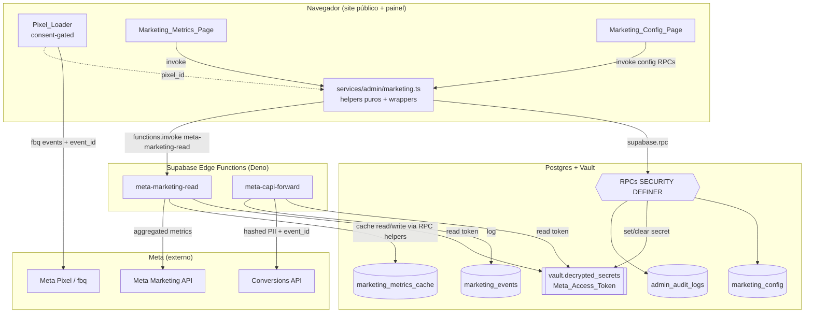
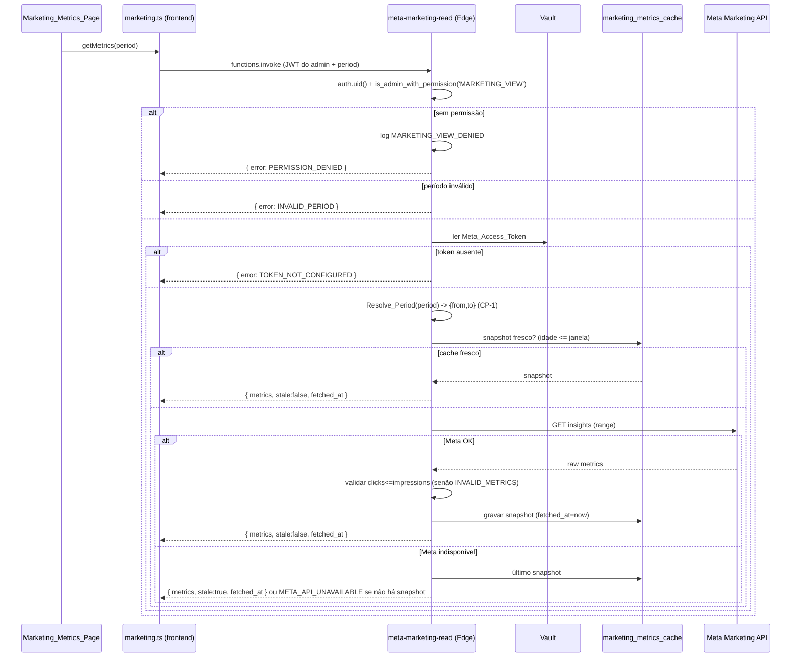
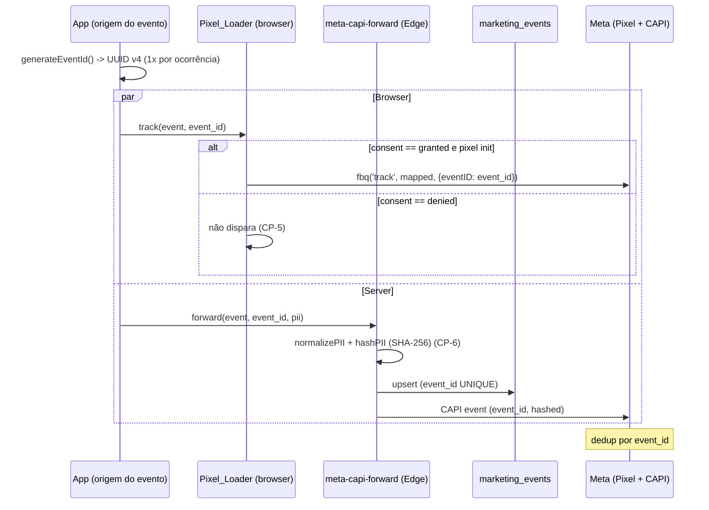

# Design Document — Admin Marketing

## Overview

Este documento descreve o design do módulo **Marketing** do painel administrativo do FreteGO,
acessível em `/admin/marketing`. O módulo conecta o FreteGO à **Meta Marketing API** (leitura de
métricas de Facebook/Instagram Ads) e implementa **Meta Pixel + Conversions API (CAPI)** com
deduplicação por `event_id` e consentimento LGPD.

O design honra integralmente os Requisitos 1–14 e as 7 Propriedades de Correção (CP-1..CP-7) da
`requirements.md`, reusando sem reinventar as fundações já em produção (ver `admin-patterns.md`):

- **admin-foundation (030)**: `is_admin_with_permission`, `Permission_Matrix`,
  `executeAdminMutation` (audit-by-construction), `Stealth_404`, versionamento otimista por
  `updated_at`, RPCs `SECURITY DEFINER` (`SET search_path = public` + `REVOKE ALL FROM PUBLIC` +
  `GRANT EXECUTE TO authenticated`), `Compact_Layout_Pattern`, WCAG AA, gráficos SVG inline.
- **Supabase Vault (042b)**: `vault.create_secret` / `vault.decrypted_secrets` para guardar o
  `Meta_Access_Token` criptografado server-side. A coluna `marketing_config.token_secret_id`
  guarda apenas a **referência** (UUID do segredo), nunca o valor.
- **Edge Functions (padrão `send-push-notification`)**: toda chamada à Meta API passa por Edge
  Functions (`meta-marketing-read`, `meta-capi-forward`). O frontend nunca chama a Meta diretamente
  e nunca recebe o token.

### Decisões de design (confirmadas)

| # | Decisão | Justificativa |
|---|---------|---------------|
| D1 | `marketing_config` é **single-row** (linha vigente única, não append-only como `financial_settings`). | A configuração de integração não exige histórico de snapshots; versionamento otimista basta. Audit-by-construction preserva o histórico de mudanças em `admin_audit_logs`. |
| D2 | O `Meta_Access_Token` vive **somente** no Vault. `marketing_config` guarda `token_secret_id` (uuid). | Token nunca em coluna legível (Req 3.2, 12, CP-7). |
| D3 | Helpers puros (`Resolve_Period`, `Compute_Metrics`, `Rank_Creatives`, `maskToken`, `normalizePII`, `hashPII`, `generateEventId`) vivem em `src/services/admin/marketing.ts` em **TypeScript puro**. As Edge Functions importam/espelham a mesma lógica (Deno) para execução server-side. | Testabilidade via fast-check (PBT roda contra a impl TS); paridade browser/server. |
| D4 | A leitura de métricas passa **exclusivamente** pela Edge `meta-marketing-read`; o service do frontend apenas invoca via `supabase.functions.invoke`. | Token nunca no browser (Req 4.1, 4.2, 12.3). |
| D5 | `event_id` é um **UUID v4** gerado uma única vez por ocorrência de `Tracked_Event` no ponto de origem, e propagado para Pixel (browser) e CAPI (server). | Deduplicação Meta (Req 10, CP-4). |
| D6 | `frete_published` mapeia para o evento custom da Meta **`CustomizeProduct`** (evento de conteúdo padrão). | Documentação explícita exigida por Req 8.5. |
| D7 | `Compute_Metrics` **rejeita** entradas com `clicks > impressions` (lança `INVALID_METRICS`); a Edge também rejeita antes de derivar. | Invariante CTR ≤ 100% (Req 4.10, 5.6, CP-2). |
| D8 | Gráficos exclusivamente **SVG inline** com `<title>`/`<desc>`; sem Recharts/Chart.js. | `project-conventions.md`, Req 5.13, 14.6. |

### Escopo

Somente leitura de métricas + Pixel/CAPI. Fora de escopo: criar/editar/pausar campanhas, budget,
testes A/B, assistente de IA, WhatsApp, Custom Audiences, atribuição multi-touch (ver
`requirements.md` §Fora de escopo).

## Architecture

### Diagrama de componentes



### Fluxo de leitura de métricas (Req 4, 5, 7)



### Fluxo Pixel + CAPI com event_id compartilhado (Req 8, 9, 10, CP-4)



### Camadas

1. **Migration 048** — schema (3 tabelas), RLS, RPCs `SECURITY DEFINER`, seeds, bloco `DO $check$`,
   `-- VERIFY`, + `048_admin_marketing_rollback.sql`.
2. **RBAC** — `MARKETING_VIEW` + `MARKETING_EDIT` adicionadas à `Permission_Matrix` (TS) e ao
   `is_admin_with_permission` (SQL), espelhadas.
3. **Edge Functions** — `meta-marketing-read` (única porta de leitura Meta) e `meta-capi-forward`
   (CAPI server-side).
4. **Service** — `src/services/admin/marketing.ts`: helpers puros + wrappers `executeAdminMutation`
   + invocadores de Edge Functions.
5. **Frontend público** — `Pixel_Loader` (consent-gated) integrado ao site público.
6. **UI do painel** — componentes em `src/components/admin/marketing/`, páginas em
   `src/pages/admin/marketing/`, rotas em `AdminLayoutRoute`, item em `AdminSidebar`.

## Components and Interfaces

### 1. RBAC — Permission_Matrix + is_admin_with_permission

**`src/services/admin/permissions.ts`** — adicionar ao `ADMIN_ACTIONS`:

```ts
// ...existentes...
'MARKETING_VIEW',
'MARKETING_EDIT',
```

E conceder a `SUPER_ADMIN` (já cobre via `() => true`) e `ADMIN` (cobre via `ALL.has(a) &&
!ADMIN_DENY.has(a)` — `MARKETING_*` não está em `ADMIN_DENY`). `FINANCEIRO`, `SUPORTE` e `MODERADOR`
**não** recebem (não estão nos respectivos `*_PERMS` sets) — negação por construção (Req 2.3).

**`is_admin_with_permission` (migration 048, `CREATE OR REPLACE`)** — recriar a função adicionando
`MARKETING_VIEW`/`MARKETING_EDIT` à cláusula de `ADMIN` e mantendo `SUPER_ADMIN` via wildcard. O
`ADMIN` já é "tudo exceto deny-list"; como a função 030 lista explicitamente o que `ADMIN` faz via
`NOT IN (...)`, `MARKETING_*` é automaticamente permitido para `ADMIN`. Para os demais papéis, as
ações de marketing **não** são adicionadas às suas listas — negação por construção, espelhando o TS:

```sql
-- Recriação idempotente garantindo paridade exata com Permission_Matrix.
-- ADMIN: permite tudo exceto USER_DELETE/ADMIN_ROLE_*; MARKETING_* incluído por NOT IN.
-- FINANCEIRO/SUPORTE/MODERADOR: MARKETING_* ausente das listas => negado.
```

### 2. Migration 048 — RPCs

Todas `SECURITY DEFINER`, `SET search_path = public`, com gating de duas camadas
(`auth.uid()` + `is_admin_with_permission`), `REVOKE ALL FROM PUBLIC` + `GRANT EXECUTE TO
authenticated` (admin-patterns §2, §10).

| RPC | Permissão | Tipo | Responsabilidade |
|-----|-----------|------|------------------|
| `marketing_config_get()` | `MARKETING_VIEW` | STABLE | Retorna config vigente com **Masked_Token** + `is_set` (nunca o valor bruto — CP-7). |
| `marketing_config_update(p_ad_account_id, p_pixel_id, p_default_period, p_consent_required, p_expected_updated_at)` | `MARKETING_EDIT` | VOLATILE | Valida `act_<digits>` + pixel numérico + período no domínio; versionamento otimista; UPDATE single-row. |
| `marketing_token_set(p_token, p_expected_updated_at)` | `MARKETING_EDIT` | VOLATILE | `vault.create_secret` (ou update do segredo); grava `token_secret_id`; retorna `is_set=true` + masked. |
| `marketing_token_clear(p_expected_updated_at)` | `MARKETING_EDIT` | VOLATILE | Apaga segredo no Vault; `token_secret_id=NULL`; `is_set=false`. |
| `marketing_cache_read(p_ad_account_id, p_period_key, p_max_age_seconds)` | service-role/Edge | STABLE | Helper de cache: retorna snapshot se idade ≤ janela. |
| `marketing_cache_write(p_ad_account_id, p_period_key, p_snapshot)` | service-role/Edge | VOLATILE | Grava snapshot com `fetched_at=NOW()`. |

> **Nota CP-7**: `marketing_config_get`, `marketing_token_set` e `marketing_token_clear` retornam
> **somente** `{ ..., token_is_set, token_last4 }` — nunca `decrypted_secret`. O valor bruto só é
> lido pelas Edge Functions, server-side, a partir do Vault.

#### Contrato `marketing_config_get` (retorno jsonb)

```jsonc
{
  "ad_account_id": "act_123456789" | null,
  "pixel_id": "987654321" | null,
  "default_period": "today" | "7d" | "30d",
  "consent_required": true,
  "token_is_set": true,
  "token_last4": "ab12" | null,      // Masked_Token: últimos 4 chars; null se !is_set
  "updated_at": "2025-01-08T12:00:00Z" | null,
  "updated_by": "uuid" | null
}
```

#### Versionamento otimista (Req 3.11)

`marketing_config_update`/`token_set`/`token_clear` recebem `p_expected_updated_at`; comparam com
`marketing_config.updated_at` antes do UPDATE; mismatch ⇒ `RAISE EXCEPTION 'STALE_VERSION' USING
ERRCODE = 'P0001'`. Quando a linha ainda não existe (instalação fresh) ou `p_expected_updated_at`
é NULL, o check é relaxado (primeiro save).

### 3. Edge Function `meta-marketing-read`

`supabase/functions/meta-marketing-read/index.ts` (Deno). `verify_jwt: true` — o JWT do admin é
injetado por `supabase.functions.invoke`.

Responsabilidades:
1. Validar caller: extrair `auth.uid()` do JWT; sem JWT ⇒ `PERMISSION_DENIED` (Req 2.7).
2. Verificar `MARKETING_VIEW` via RPC `is_admin_with_permission` (cliente Supabase com o JWT do
   caller, não service-role, para a checagem de permissão). Sem permissão ⇒ registrar
   `MARKETING_VIEW_DENIED` e retornar `PERMISSION_DENIED` (Req 4.3, 4.4).
3. Validar `period ∈ {today,7d,30d}`; fora ⇒ `INVALID_PERIOD` (Req 4.6).
4. Ler `Meta_Access_Token` do Vault (cliente service-role). Ausente ⇒ `TOKEN_NOT_CONFIGURED`
   (Req 4.7).
5. `Resolve_Period(period, now)` ⇒ `{from,to}` (CP-1).
6. Cache: `marketing_cache_read`; se fresco, retornar `{stale:false}`.
7. Senão, chamar Meta Marketing API com o range; validar `clicks ≤ impressions` por registro
   (senão `INVALID_METRICS`, Req 4.10); agregar `Campaign_Metrics` + `Creative_Performance`;
   `Compute_Metrics` para derivadas; `marketing_cache_write`.
8. Meta indisponível: se há snapshot, retornar `{stale:true}` (Req 7.4); senão
   `META_API_UNAVAILABLE` com status de origem (Req 4.8).
9. **Nunca** incluir o token em respostas, logs ou erros (CP-7, Req 12.2/12.4).

Resposta de sucesso:

```jsonc
{
  "ok": true,
  "period": "7d",
  "range": { "from": "...", "to": "..." },
  "campaign": { "spend": 0, "impressions": 0, "clicks": 0, "leads": 0, "conversions": 0,
                "ctr": 0, "cpc": null, "cpl": null },
  "creatives": [ { "creative_id": "...", "name": "...", "spend": 0, "impressions": 0,
                   "clicks": 0, "leads": 0, "ctr": 0, "cpc": null, "cpl": null } ],
  "series": [ { "date": "2025-01-01", "spend": 0, "impressions": 0, "clicks": 0 } ],
  "stale": false,
  "fetched_at": "2025-01-08T12:00:00Z"
}
```

Resposta de erro (estruturada, sem segredos):

```jsonc
{ "ok": false, "error": "TOKEN_NOT_CONFIGURED" | "INVALID_PERIOD" | "META_API_UNAVAILABLE"
  | "INVALID_METRICS" | "PERMISSION_DENIED", "status"?: 503, "stale"?: true }
```

### 4. Edge Function `meta-capi-forward`

`supabase/functions/meta-capi-forward/index.ts` (Deno). `verify_jwt: false` — chamada server-side
(via trigger/pg_net ou service-role), autenticada por Bearer service-role (padrão
`send-push-notification`).

Responsabilidades:
1. Validar Bearer service-role.
2. Validar `event_name ∈ Tracked_Event`; `event_id` UUID v4 válido.
3. `normalizePII` + `hashPII` (SHA-256) de email/phone/visitor/user (CP-6); valores já hasheados
   não são re-hasheados (Req 11.5).
4. `upsert` em `marketing_events` por `event_id` (UNIQUE) — reenvio não duplica (Req 9.8).
5. Enviar evento à Meta CAPI com `event_id` compartilhado + dados hasheados, lendo token do Vault.
6. Falha CAPI ⇒ `send_status='failed'` + erro estruturado sem segredos (Req 9.6).
7. **Nunca** persistir/retornar PII em texto claro nem token (Req 11.6, 12.2, CP-7).

### 5. Service `src/services/admin/marketing.ts`

#### Helpers puros (testáveis via fast-check)

```ts
export type MetricPeriod = 'today' | '7d' | '30d';
export type TrackedEvent =
  | 'page_view' | 'lead' | 'motorista_registration'
  | 'embarcador_registration' | 'frete_published';

export interface PeriodRange { from: string; to: string } // ISO, America/Sao_Paulo

export interface CampaignMetrics {
  spend: number; impressions: number; clicks: number; leads: number; conversions: number;
}
export interface ComputedMetrics {
  ctr: number; cpc: number | null; cpl: number | null;
}
export interface CreativePerformance {
  creative_id: string; name: string;
  spend: number; impressions: number; clicks: number; leads: number;
}

// CP-1 — determinístico, America/Sao_Paulo
export function resolvePeriod(period: MetricPeriod, referenceInstant: Date): PeriodRange;

// CP-2 — nunca lança por div/0; rejeita clicks>impressions com MarketingError(INVALID_METRICS)
export function computeMetrics(m: CampaignMetrics): ComputedMetrics;

// CP-3 — ordem total, desempate estável por creative_id asc, idempotente
export type RankMetric = 'spend' | 'impressions' | 'clicks' | 'ctr' | 'cpc' | 'cpl' | 'leads';
export type RankDirection = 'asc' | 'desc';
export function rankCreatives(
  items: CreativePerformance[], metric: RankMetric, direction: RankDirection
): CreativePerformance[];

// CP-7 — apenas últimos 4 chars; demais mascarados
export function maskToken(token: string): string;

// CP-6 — idempotente; já-hasheado não re-hasheado
export function normalizeEmail(raw: string): string;        // trim + lowercase
export function normalizePhone(raw: string): string;        // dígitos + DDI
export function isPiiHash(value: string): boolean;           // /^[0-9a-f]{64}$/
export async function hashPII(normalized: string): Promise<string>; // SHA-256 hex lower

// CP-4 — UUID v4 por ocorrência
export function generateEventId(): string;
```

> **Paridade browser/server**: `normalizeEmail`, `normalizePhone`, `isPiiHash`, `hashPII` e a lógica
> de mapeamento de eventos existem em TS puro aqui (alvo dos PBTs) e são **espelhadas** na Edge
> `meta-capi-forward` (Deno). O comentário do arquivo documenta essa duplicação intencional.

#### Wrappers de mutação (audit-by-construction)

```ts
export async function updateConfig(payload, expectedUpdatedAt): Promise<MarketingConfig>;   // MARKETING_CONFIG_UPDATED
export async function setToken(token, expectedUpdatedAt): Promise<MarketingConfig>;          // MARKETING_TOKEN_UPDATED
export async function clearToken(expectedUpdatedAt): Promise<MarketingConfig>;               // MARKETING_TOKEN_CLEARED
```

Cada um envolve a RPC via `executeAdminMutation({ action, targetType: 'marketing_config', ... })`.
Os snapshots `before/after` em audit log de token registram **apenas** metadados não sensíveis
(`is_set`, `last4`) — nunca o valor bruto (Req 3.5, 12).

#### Read wrappers (invocam Edge / RPC)

```ts
export async function getConfig(): Promise<MarketingConfig>;                 // RPC marketing_config_get
export async function getMetrics(period: MetricPeriod): Promise<MetricsResult>; // Edge meta-marketing-read
```

`getMetrics` apenas chama `supabase.functions.invoke('meta-marketing-read', { body: { period } })`
e mapeia o erro estruturado para `MarketingError`. **Nenhuma** chamada direta à Meta e **nenhuma**
referência ao token em texto claro no frontend (Req 12.3).

#### Mapeamento de eventos (Req 8.5)

```ts
export const META_EVENT_MAP: Record<TrackedEvent, string> = {
  page_view: 'PageView',
  lead: 'Lead',
  motorista_registration: 'Lead',
  embarcador_registration: 'Lead',
  frete_published: 'CustomizeProduct', // evento de conteúdo (D6)
};
```

### 6. Pixel_Loader (frontend público)

`src/services/marketing/pixelLoader.ts` (módulo público, **não** gated por admin — Req 8.8).

```ts
export type ConsentState = 'granted' | 'denied';

export interface PixelLoaderDeps {
  getConsent: () => ConsentState;
  getPixelId: () => string | null;     // de marketing_config (Req 8.7)
  injectScript?: (pixelId: string) => void; // injeção real; mockável em teste
}

export interface PixelLoader {
  syncConsent(state: ConsentState): void;     // transição -> injeta no máximo 1x (CP-5)
  track(event: TrackedEvent, eventId: string, params?: Record<string, unknown>): void;
  isInitialized(): boolean;
}

export function createPixelLoader(deps: PixelLoaderDeps): PixelLoader;
```

Invariantes (CP-5, Req 8):
- `consent === 'denied'`: nunca injeta script, nunca inicializa `fbq`, nunca dispara evento — mesmo
  se previamente inicializado (Req 8.1, 8.4).
- Transição para `granted`: injeta script **no máximo uma vez** (flag idempotente interna).
- `track` só dispara `fbq` quando inicializado **e** consent `granted`; sempre inclui
  `{ eventID: eventId }` (CP-4, Req 8.3).
- `pixel_id` vem de `getPixelId()` (de `marketing_config`), nunca hardcoded (Req 8.7).

### 7. Componentes UI (`src/components/admin/marketing/`)

| Componente | Responsabilidade | Acessibilidade |
|-----------|------------------|----------------|
| `MarketingKpiCards` | 7 cards: gasto, impressões, cliques, CPL, CPC, CTR, conversões. | Cada card `role="region"` + `aria-label` agregando rótulo+valor (Req 5.15, 14). Grid lado a lado ≥768px, coluna única <768px (Req 5.14, 14.2). |
| `MarketingPeriodSelector` | Hoje/7 dias/30 dias ⇒ `today/7d/30d`; sincroniza query param. | `<label htmlFor>` ou `aria-label` (Req 14.1). |
| `MarketingTrendChart` | SVG inline (polyline) da evolução. **Sem** Recharts/Chart.js. | `<title>`/`<desc>` descrevendo a métrica (Req 5.13, 14.6). |
| `MarketingCreativeRanking` | Melhores e piores via `rankCreatives`; cards single-column <768px. | Empty state `Nenhum criativo no período selecionado.` (Req 6.5). |
| `MarketingEmptyState` | Estado `TOKEN_NOT_CONFIGURED` com link Configurar gated por `MARKETING_EDIT` (Req 5.11). | — |
| `MarketingErrorState` | `META_API_UNAVAILABLE` com botão **Tentar novamente** (Req 5.12). | `role="alert"`. |
| `MarketingStaleIndicator` | Mostra `stale=true` + `fetched_at` (idade dos dados) (Req 7.5). | — |
| `MarketingConfigForm` | Token (masked), Ad Account ID, Pixel ID, período default, toggle consentimento. Read-only sem `MARKETING_EDIT`. | Validação inline + Salvar desabilitado em erro (Req 3.9). |

### 8. Páginas e roteamento

- `src/pages/admin/marketing/MarketingMetricsPage.tsx` — `/admin/marketing` (sem `<h1>` grande,
  Req 1.7).
- `src/pages/admin/marketing/MarketingConfigPage.tsx` — `/admin/marketing/configuracoes`.
- **`AdminLayoutRoute.tsx`**: registrar `<Route path="marketing" .../>` e
  `<Route path="marketing/configuracoes" .../>`. Cada página se auto-gateia: `MarketingMetricsPage`
  exige `MARKETING_VIEW` (senão `<Stealth404 />`), `MarketingConfigPage` exige `MARKETING_EDIT`
  (senão `<Stealth404 />`) — mesmo padrão de `FinanceiroConfiguracoesPage` (Req 1.3–1.6).
- **`AdminSidebar.tsx`**: novo item `{ to: '/admin/marketing', label: 'Marketing', icon, permission:
  'MARKETING_VIEW' }` (Req 1.8). O link "Configurar integração" dentro da página é gated por
  `MARKETING_EDIT` (oculto, não desabilitado — Req 1.9, 2.8).

## Data Models

### Tabela `marketing_config` (single-row)

```sql
CREATE TABLE IF NOT EXISTS marketing_config (
  id               uuid        PRIMARY KEY DEFAULT gen_random_uuid(),
  ad_account_id    text        NULL CHECK (ad_account_id IS NULL OR ad_account_id ~ '^act_[0-9]+$'),
  pixel_id         text        NULL CHECK (pixel_id IS NULL OR pixel_id ~ '^[0-9]+$'),
  default_period   text        NOT NULL DEFAULT '7d'
                                CHECK (default_period IN ('today','7d','30d')),
  consent_required boolean     NOT NULL DEFAULT true,
  token_secret_id  uuid        NULL,   -- referência ao segredo no Vault, NUNCA o valor
  token_last4      text        NULL CHECK (token_last4 IS NULL OR char_length(token_last4) <= 4),
  updated_at       timestamptz NOT NULL DEFAULT NOW(),
  updated_by       uuid        NULL REFERENCES users(id) ON DELETE SET NULL,
  -- garante single-row: sempre id fixo via seed + RPCs operam na linha vigente
  singleton        boolean     NOT NULL DEFAULT true UNIQUE CHECK (singleton = true)
);
```

- `token_secret_id`: UUID retornado por `vault.create_secret`. O valor bruto **nunca** é coluna
  legível (D2, Req 3.2, 12, CP-7).
- `token_last4`: cache dos últimos 4 chars para compor o `Masked_Token` sem reler o Vault no
  `marketing_config_get` (CP-7). `NULL` quando `is_set=false`.
- `singleton`: força linha única (constraint `UNIQUE` + `CHECK`), seed inicial via
  `INSERT ... ON CONFLICT DO NOTHING`.
- RLS: gated por `MARKETING_VIEW`/`MARKETING_EDIT`, mas todo acesso real passa pelas RPCs
  `SECURITY DEFINER` (policy `no_dml` bloqueando DML direto, padrão 035/037).

### Tabela `marketing_events`

```sql
CREATE TABLE IF NOT EXISTS marketing_events (
  id             uuid        PRIMARY KEY DEFAULT gen_random_uuid(),
  event_id       uuid        NOT NULL UNIQUE,         -- compartilhado c/ Pixel (dedup, Req 9.8)
  event_name     text        NOT NULL CHECK (event_name IN
                              ('page_view','lead','motorista_registration',
                               'embarcador_registration','frete_published')),
  visitor_id_hash text       NULL CHECK (visitor_id_hash IS NULL OR visitor_id_hash ~ '^[0-9a-f]{64}$'),
  user_id_hash    text       NULL CHECK (user_id_hash IS NULL OR user_id_hash ~ '^[0-9a-f]{64}$'),
  email_hash      text       NULL CHECK (email_hash IS NULL OR email_hash ~ '^[0-9a-f]{64}$'),
  phone_hash      text       NULL CHECK (phone_hash IS NULL OR phone_hash ~ '^[0-9a-f]{64}$'),
  event_time      timestamptz NOT NULL DEFAULT NOW(),
  send_status     text        NOT NULL DEFAULT 'pending'
                              CHECK (send_status IN ('pending','sent','failed')),
  created_at      timestamptz NOT NULL DEFAULT NOW()
);
CREATE INDEX IF NOT EXISTS idx_marketing_events_event_time ON marketing_events (event_time DESC);
```

- `event_id` `UNIQUE`: reenvio CAPI não duplica o log (Req 9.8); a Edge usa `ON CONFLICT (event_id)`.
- Colunas `*_hash`: somente SHA-256 (64 hex). CHECK reforça o formato (defesa em profundidade,
  CP-6). PII em texto claro **nunca** é persistido (Req 11.6).
- Escrita **somente server-side** (Edge service-role); RLS bloqueia DML por `authenticated`.

### Tabela `marketing_metrics_cache`

```sql
CREATE TABLE IF NOT EXISTS marketing_metrics_cache (
  id            uuid        PRIMARY KEY DEFAULT gen_random_uuid(),
  ad_account_id text        NOT NULL CHECK (ad_account_id ~ '^act_[0-9]+$'),
  period_key    text        NOT NULL CHECK (period_key IN ('today','7d','30d')),
  snapshot      jsonb       NOT NULL,
  fetched_at    timestamptz NOT NULL DEFAULT NOW()
);
CREATE INDEX IF NOT EXISTS idx_marketing_metrics_cache_lookup
  ON marketing_metrics_cache (ad_account_id, period_key, fetched_at DESC);
```

- Indexada por `(ad_account_id, period_key)` (Req 7.1); o `fetched_at DESC` suporta "snapshot mais
  recente".
- `snapshot` guarda o payload agregado (campaign + creatives + series) para reuso (Req 7.2/7.3) e
  fallback `stale` (Req 7.4).
- Escrita/leitura via RPCs helper (`marketing_cache_write`/`marketing_cache_read`) chamadas pela
  Edge service-role.

### Modelo TS (frontend)

```ts
export interface MarketingConfig {
  ad_account_id: string | null;
  pixel_id: string | null;
  default_period: MetricPeriod;
  consent_required: boolean;
  token_is_set: boolean;
  token_last4: string | null;   // Masked_Token
  updated_at: string | null;
  updated_by: string | null;
}

export interface MetricsResult {
  period: MetricPeriod;
  range: PeriodRange;
  campaign: CampaignMetrics & ComputedMetrics;
  creatives: (CreativePerformance & ComputedMetrics)[];
  series: { date: string; spend: number; impressions: number; clicks: number }[];
  stale: boolean;
  fetched_at: string;
}
```

## Correctness Properties

*Uma propriedade é uma característica ou comportamento que deve ser verdadeiro em todas as execuções
válidas do sistema — essencialmente, uma afirmação formal sobre o que o software deve fazer. As
propriedades servem de ponte entre especificações legíveis por humanos e garantias de correção
verificáveis por máquina.*

PBT **se aplica** a este módulo: os núcleos de lógica (`resolvePeriod`, `computeMetrics`,
`rankCreatives`, `maskToken`, `normalizePII`/`hashPII`, `generateEventId`, gate de consentimento e
propagação de `event_id`) são funções puras ou deterministicamente testáveis com grande espaço de
entrada. As 7 propriedades abaixo são **obrigatórias** (sem `*` em `tasks.md`) e mapeiam 1:1 com os
CP-1..CP-7 da `requirements.md`. Após a reflexão de propriedades, cada CP é única e não-redundante
(os critérios 5.7–5.10 são facetas do CP-2; 6.3/6.4 do CP-3; 10.2/10.7 do CP-4; 8.1/8.4/8.6 do
CP-5; 11.1–11.5 do CP-6; 3.3/3.5/9.7/12.x do CP-7).

### Property 1: Mapeamento determinístico de período — CP-1

*Para todo* par `(period, referenceInstant)` com `period ∈ {today, 7d, 30d}`, `resolvePeriod` é
puro e determinístico (mesmo input ⇒ mesmo output) e produz um `Period_Range` com `from <= to`,
`to` igual ao `referenceInstant` normalizado, e `from` correto por período no timezone
`America/Sao_Paulo`: `today` ⇒ início do dia local; `7d` ⇒ `to - 7 dias`; `30d` ⇒ `to - 30 dias`.

**Validates: Requirements 4.5, 5.6**

### Property 2: Derivação correta de métricas com guardas de divisão por zero — CP-2

*Para todo* `Campaign_Metrics` de entrada com `clicks <= impressions`, `computeMetrics` é puro,
nunca lança por divisão por zero, e satisfaz: `ctr == clicks / impressions` quando `impressions > 0`
e `ctr == 0` quando `impressions == 0`; `cpc == spend / clicks` quando `clicks > 0` (incluindo
`cpc == 0` quando `spend == 0` e `clicks > 0`) e `cpc == null` quando `clicks == 0`;
`cpl == spend / leads` quando `leads > 0` e `cpl == null` quando `leads == 0`. *Para todo* input que
viole a invariante `clicks <= impressions`, `computeMetrics` rejeita a entrada como inválida
(`INVALID_METRICS`) em vez de derivar `ctr > 100%`.

**Validates: Requirements 4.10, 5.6, 5.7, 5.8, 5.9, 5.10**

### Property 3: Ordenação total e estável do ranking de criativos — CP-3

*Para toda* lista de `Creative_Performance`, métrica `metric` e direção `direction`, `rankCreatives`
produz uma permutação da entrada (mesmo multiconjunto, sem perdas nem duplicações), ordenada
monotonicamente pela métrica, com desempate estável e determinístico por `creative_id` ascendente
— definindo uma **ordem total**. O primeiro elemento é o "melhor" e o último o "pior" para a direção
escolhida, e a operação é idempotente (reordenar o resultado não altera a ordem).

**Validates: Requirements 6.2, 6.3, 6.4**

### Property 4: Invariante de deduplicação por event_id — CP-4

*Para toda* ocorrência de `Tracked_Event`, o `Event_Id` é um UUID v4 válido, gerado uma única vez,
e o payload entregue ao Pixel (browser) e o payload entregue ao CAPI (server) compartilham
exatamente o mesmo `Event_Id` estável para aquela ocorrência.

**Validates: Requirements 8.3, 9.2, 10.2, 10.3, 10.7**

### Property 5: Porta de consentimento do Pixel — CP-5

*Para todo* `Consent_State` e toda sequência de transições, enquanto `consent == 'denied'` o
`Pixel_Loader` não injeta o script do Pixel, não inicializa `fbq` e não dispara nenhum evento
`fbq` (independentemente do estado de inicialização e do valor de `consent_required`); quando
`consent` transiciona para `granted`, o `Pixel_Loader` injeta o script no máximo uma vez
(idempotente).

**Validates: Requirements 8.1, 8.2, 8.4, 8.6**

### Property 6: Hashing de PII — formato, normalização idempotente e ausência de duplo-hash — CP-6

*Para todo* dado pessoal de entrada, `hashPII` aplicado ao valor normalizado produz uma string de
exatamente 64 caracteres hexadecimais minúsculos e é determinístico (mesmo valor normalizado ⇒ mesmo
hash); a normalização (e-mail: trim + lowercase; telefone: somente dígitos com DDI) é idempotente
(`normalize(normalize(x)) == normalize(x)`); e *para todo* valor que já esteja no formato de
`PII_Hash` (64 hex minúsculos), o pipeline **não** o hasheia novamente.

**Validates: Requirements 9.4, 11.1, 11.2, 11.3, 11.4, 11.5**

### Property 7: Token ausente de qualquer payload voltado ao frontend — CP-7

*Para toda* resposta voltada ao cliente — leitura de configuração (RPC `marketing_config_get`,
`marketing_token_set`, `marketing_token_clear`) e respostas das Edge Functions
(`meta-marketing-read`, `meta-capi-forward`), tanto de sucesso quanto de erro — o payload
serializado não contém o `Meta_Access_Token` em texto claro; apenas o `Masked_Token` (últimos 4
caracteres) e o indicador `is_set` são expostos.

**Validates: Requirements 3.3, 3.5, 4.2, 4.8, 9.6, 9.7, 12.1, 12.2, 12.4**

## Error Handling

### Códigos de erro canônicos (TS)

`MarketingError` (classe espelhando `FinanceiroError`) com `code ∈ MarketingErrorCode` + `details`:

```ts
export type MarketingErrorCode =
  | 'PERMISSION_DENIED'
  | 'STALE_VERSION'
  | 'INVALID_PERIOD'
  | 'INVALID_AD_ACCOUNT_ID'
  | 'INVALID_PIXEL_ID'
  | 'INVALID_METRICS'
  | 'TOKEN_NOT_CONFIGURED'
  | 'META_API_UNAVAILABLE'
  | 'INVALID_INPUT'
  | 'UNKNOWN';
```

Mensagens user-facing pt-BR canônicas (anti-enumeration, neutras):

| Código | Mensagem pt-BR |
|--------|----------------|
| `PERMISSION_DENIED` | `Voce nao tem permissao para acessar esta area.` |
| `STALE_VERSION` | `Outro admin atualizou a configuracao. Recarregando.` |
| `INVALID_PERIOD` | `Periodo invalido.` |
| `INVALID_AD_ACCOUNT_ID` | `Ad Account ID invalido. Use o formato act_<numeros>.` |
| `INVALID_PIXEL_ID` | `Pixel ID invalido. Use somente numeros.` |
| `INVALID_METRICS` | `Metricas invalidas recebidas da Meta.` |
| `TOKEN_NOT_CONFIGURED` | `Integracao nao configurada. Configure o token de acesso.` |
| `META_API_UNAVAILABLE` | `Nao foi possivel obter as metricas agora. Tente novamente.` |
| `INVALID_INPUT` | `Dados invalidos. Verifique os campos preenchidos.` |
| `UNKNOWN` | `Nao foi possivel concluir a operacao. Tente novamente.` |

### Mapeamento Postgres/Edge ↔ TS (`mapMarketingError`)

| Origem | Mapeia para |
|--------|-------------|
| ERRCODE `42501` ou substring `permission_denied` | `PERMISSION_DENIED` |
| substring `STALE_VERSION` (ERRCODE P0001) | `STALE_VERSION` |
| substring `INVALID_PERIOD` | `INVALID_PERIOD` |
| substring `INVALID_AD_ACCOUNT_ID` / `INVALID_PIXEL_ID` | respectivos |
| Edge `{ error: 'TOKEN_NOT_CONFIGURED' }` | `TOKEN_NOT_CONFIGURED` |
| Edge `{ error: 'META_API_UNAVAILABLE', status }` | `META_API_UNAVAILABLE` |
| Edge `{ error: 'INVALID_METRICS' }` | `INVALID_METRICS` |
| default | `UNKNOWN` |

`mapMarketingError` é **idempotente** (não re-embrulha `MarketingError` já tipado) e preserva o
erro original em `details.original` para debug — **sem** expor segredos.

### Degradação e resiliência

- **Cache stale** (Req 7.4): Meta indisponível com snapshot ⇒ retorna o último snapshot com
  `stale=true` em vez de erro; UI exibe `MarketingStaleIndicator` com `fetched_at`. Sem snapshot ⇒
  `META_API_UNAVAILABLE` + `MarketingErrorState` com botão Tentar novamente (Req 5.12).
- **Token ausente** (Req 5.11): `TOKEN_NOT_CONFIGURED` ⇒ `MarketingEmptyState` com link Configurar
  gated por `MARKETING_EDIT`.
- **CAPI falha** (Req 9.6): `marketing_events.send_status='failed'`; erro estruturado sem segredos;
  o registro persiste para reprocessamento/auditoria.
- **Versionamento otimista** (Req 3.11): `STALE_VERSION` ⇒ toast `Outro admin atualizou...` +
  refetch.
- **Segredos em erros** (Req 12.4, CP-7): toda Edge sanitiza mensagens; nunca inclui token nem PII
  em claro em respostas, logs de cliente ou mensagens de erro.

### Postura de segurança (threat model resumido)

- Token só no Vault; lido apenas server-side pelas Edges; nunca em coluna legível, payload, log de
  cliente ou erro (CP-7, Req 12).
- RPCs `SECURITY DEFINER` com `SET search_path = public`, gating duplo (`auth.uid()` +
  `is_admin_with_permission`), `REVOKE ALL FROM PUBLIC` + `GRANT EXECUTE TO authenticated`.
- `meta-marketing-read` exige JWT + `MARKETING_VIEW`; `meta-capi-forward` exige Bearer service-role.
- Leitura negada registra `MARKETING_VIEW_DENIED` (before nulo, after `{user_id, reason}`).
- PII só persiste hasheada (SHA-256); CHECK de formato `^[0-9a-f]{64}$` como última linha de defesa.

## Testing Strategy

### Abordagem dupla

- **Property tests (fast-check)**: as 7 propriedades de correção (CP-1..CP-7), cada uma implementada
  por **um único** teste property-based.
- **Unit/Example tests**: cenários específicos, estados de UI, action codes, edge cases de erro.
- **Integration tests**: comportamento server-side (RPC/Edge/Vault/DB) com 1–3 exemplos.
- **Smoke tests**: migração idempotente (double-apply), índices, seeds, registro de rotas.

### Convenções de PBT (project-conventions.md)

- Biblioteca **fast-check** (já no projeto); **não** implementar PBT do zero.
- **Mínimo 100 iterações** por property test (`{ numRuns: 100 }` ou mais).
- `vi.mock` é **hoisted**: não referenciar variáveis externas no factory; expor spies via
  `(globalThis as Record<string, unknown>).__nomeDoSpy = ...`.
- `fc.stringOf` **não existe**: usar `fc.string({ minLength, maxLength }).filter(...)`.
- Geradores de email/telefone: usar `fc.constantFrom([...templates fixos válidos])` para evitar
  valores aleatórios que falham na validação; misturar com inválidos para edge cases.
- Domínios fechados (períodos, eventos): `fc.constantFrom('today','7d','30d')`,
  `fc.constantFrom('page_view','lead','motorista_registration','embarcador_registration','frete_published')`.
- Gráficos: **SVG inline** apenas; nenhum teste deve importar Recharts/Chart.js.
- Cada property test tagueado com comentário no formato
  **`Feature: admin-marketing, Property {n}: {texto}`**.
- CPs obrigatórios: nunca marcar com `*` em `tasks.md`. Properties de suporte: sempre com `*`.

### Mapeamento property test ↔ arquivo

| CP | Arquivo (sugerido) | Foco |
|----|--------------------|------|
| CP-1 | `src/__tests__/admin/marketing/cp1ResolvePeriod.property.test.ts` | determinismo + ranges America/Sao_Paulo |
| CP-2 | `src/__tests__/admin/marketing/cp2ComputeMetrics.property.test.ts` | derivação + guardas div/0 + invariante clicks≤impressions |
| CP-3 | `src/__tests__/admin/marketing/cp3RankCreatives.property.test.ts` | ordem total + desempate estável + idempotência |
| CP-4 | `src/__tests__/admin/marketing/cp4EventIdShared.property.test.ts` | UUID v4 válido + compartilhado Pixel/CAPI |
| CP-5 | `src/__tests__/admin/marketing/cp5ConsentGate.property.test.ts` | sem script/fbq enquanto denied + injeção única no grant |
| CP-6 | `src/__tests__/admin/marketing/cp6PiiHash.property.test.ts` | formato 64 hex + normalização idempotente + sem duplo-hash |
| CP-7 | `src/__tests__/admin/marketing/cp7TokenNeverLeaks.property.test.ts` | token ausente de toda resposta cliente (sucesso+erro) |

### Geradores principais

```ts
const periodGen = fc.constantFrom<MetricPeriod>('today', '7d', '30d');
const eventGen = fc.constantFrom<TrackedEvent>(
  'page_view','lead','motorista_registration','embarcador_registration','frete_published');
const consentGen = fc.constantFrom<ConsentState>('granted','denied');

// CP-2: clicks <= impressions garantido na geração; ramo de violação testado à parte
const campaignGen = fc.record({
  impressions: fc.nat({ max: 1_000_000 }),
  clicks: fc.nat({ max: 1_000_000 }),
  spend: fc.double({ min: 0, max: 1_000_000, noNaN: true }),
  leads: fc.nat({ max: 100_000 }),
  conversions: fc.nat({ max: 100_000 }),
}).map((m) => ({ ...m, clicks: Math.min(m.clicks, m.impressions) }));

// CP-6: emails/telefones de templates válidos + variações já-hasheadas
const emailGen = fc.constantFrom('Joao@Email.com ', ' MARIA@TESTE.COM', 'user@dominio.com.br');
const phoneGen = fc.constantFrom('+55 (62) 99999-8888', '5511988887777', '(11) 3333-2222');
```

### Property test de suporte (opcionais, marcados com `*` em tasks.md)

- `* Permission_Matrix parity`: para todo `(role, action)` com `action ∈ {MARKETING_VIEW,
  MARKETING_EDIT}`, `hasPermission(role, action)` é verdadeiro sse `role ∈ {SUPER_ADMIN, ADMIN}`
  (Req 2.2, 2.3).
- `* ad_account_id / pixel_id validation`: para todo `act_<digits>` aceito e todo não-correspondente
  rejeitado (Req 3.8); pixel só-dígitos (Req 3.10).
- `* period URL round-trip`: para todo `period` no domínio, `parse(serialize(period)) == period`;
  valores inválidos ⇒ default (Req 5.4, 5.5).
- `* META_EVENT_MAP totalidade`: para todo `TrackedEvent`, retorna o evento Meta documentado
  (page_view⇒PageView; lead/registrations⇒Lead; frete_published⇒CustomizeProduct) (Req 8.5).
- `* KPI aria-label`: para todo `(label, value)`, o card renderizado expõe `role="region"` e
  `aria-label` contendo rótulo e valor (Req 5.15).

### Integration / smoke (não-PBT)

- **RBAC server-side** (Req 2.4–2.7): exemplos SQL por papel via `is_admin_with_permission`; RPC sem
  permissão grava `MARKETING_VIEW_DENIED`; caller anônimo ⇒ `permission_denied`.
- **Vault** (Req 3.2, 3.6, 9.7, 12.2): set/clear de segredo; leitura só server-side; confirmação de
  que `token_secret_id` guarda referência, não valor.
- **Versionamento otimista** (Req 3.11): `expected_updated_at` desatualizado ⇒ `STALE_VERSION`.
- **Cache** (Req 7.2–7.5): snapshot gravado/lido; fresco evita Meta; stale fallback inclui `stale` +
  `fetched_at`.
- **CAPI dedup** (Req 9.5, 9.8): `upsert` por `event_id` UNIQUE não duplica; `send_status` correto.
- **Migration 048** (Req 13): aplicar duas vezes em branch DB sem erro; `DO $check$` falha clara se
  pré-requisitos ausentes; 3 tabelas + índices + RPCs criados; `-- VERIFY` presente; rollback
  documentado não auto-aplicado.
- **UI** (Req 1, 5, 6, 14): testes de render para gating/Stealth404, estados (empty/error/stale),
  responsividade <768px, acessibilidade (`role`, `aria-label`, `<title>/<desc>` no SVG).

### Padrões de sucesso

- `npx tsc --noEmit`: zero erros (TypeScript strict).
- `npm run lint`: zero warnings.
- `npm run build`: limpa.
- Suíte property-based (CP-1..CP-7) verde com ≥100 iterações cada.
