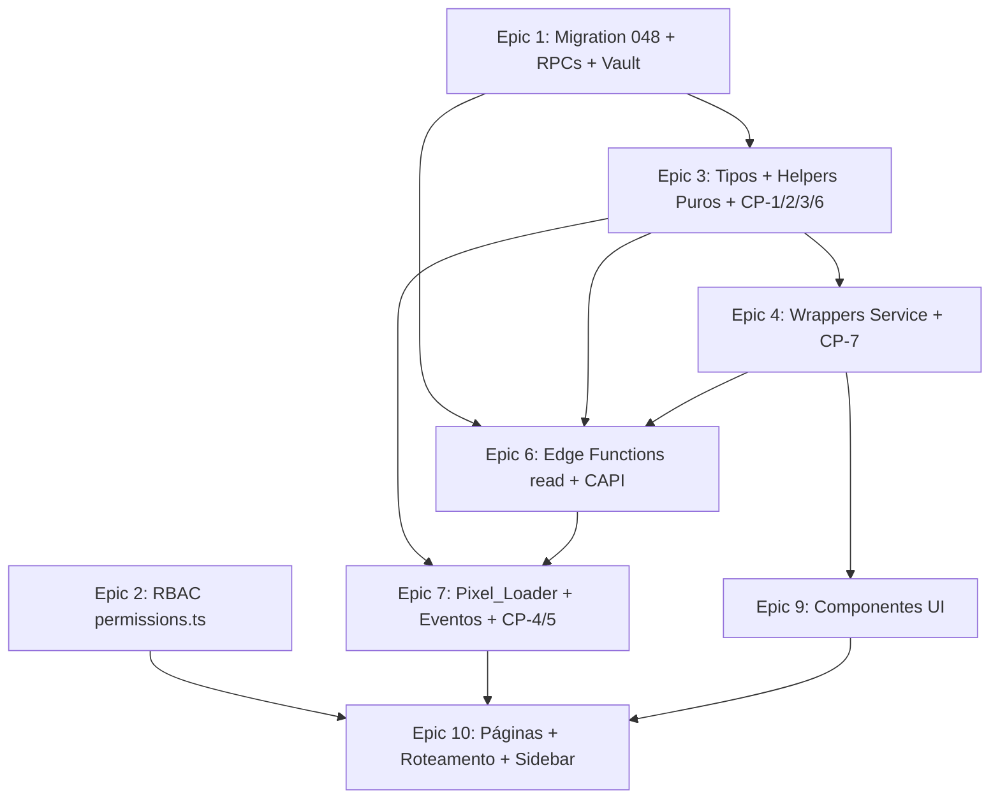

# Implementation Plan

## Overview

Plano de implementação do módulo **Marketing** (Meta Ads) do painel admin, organizado em 11 épicos
incrementais. Cada task referencia requisitos do `requirements.md` (Reqs X.Y) e/ou as propriedades
de correção do `design.md` (CP-N). A ordem honra o build incremental: banco → RBAC → helpers puros →
wrappers de service → Edge Functions → Pixel/CAPI → UI → páginas/roteamento, terminando com o wiring
das rotas e a fiação dos eventos.

Convenções herdadas (não redocumentar — ver `project-conventions.md` e `admin-patterns.md`):
- Migrations idempotentes com `BEGIN/COMMIT`, `DO $check$` defensivo, `-- VERIFY` final + par rollback.
- pt-BR em UI/comentários; action codes, error codes e identifiers SQL/TS em inglês.
- Padrão compacto pós-cleanup (sem `<h1>` grande, cards de KPI compactos, mobile vira coluna única).
- Toda mutação admin passa por `executeAdminMutation`; RPCs `SECURITY DEFINER` com gating duplo
  (`auth.uid()` + `is_admin_with_permission`), `SET search_path = public`, `REVOKE ALL FROM PUBLIC` +
  `GRANT EXECUTE TO authenticated`.
- Versionamento otimista via `updated_at` + `STALE_VERSION`. Leitura negada grava `MARKETING_VIEW_DENIED`.
- Token só no Vault; nunca em coluna legível, payload, log de cliente ou erro (CP-7).
- Gráficos exclusivamente em SVG inline (sem Recharts/Chart.js). UUID/SHA-256 via Web Crypto API
  (sem novas dependências npm).
- Property tests das 7 propriedades obrigatórias (CP-1..CP-7) **NÃO** levam asterisco. Property tests
  de suporte, exemplos, integração e smoke levam `*` e são opcionais.

### Convenções de PBT (fast-check)

- Mínimo 100 iterações por property test (`{ numRuns: 100 }`).
- `vi.mock` é hoisted: expor spies via `(globalThis as Record<string, unknown>).__nomeDoSpy = ...`.
- `fc.stringOf` não existe: usar `fc.string({ minLength, maxLength }).filter(...)`.
- Domínios fechados via `fc.constantFrom('today','7d','30d')` e
  `fc.constantFrom('page_view','lead','motorista_registration','embarcador_registration','frete_published')`.
- Email/telefone via `fc.constantFrom([...templates fixos válidos])`.
- Cada property test tagueado com comentário `Feature: admin-marketing, Property {n}: {texto}`.

## Tasks

- [x] 1. Migration 048 — schema, RLS, RPCs e Vault
  - [x] 1.1 Criar `supabase/migrations/048_admin_marketing.sql` (scaffold + tabelas + RLS)
    - Cabeçalho com objetivo e dependências (030 admin-foundation, 042b push-config-via-vault).
    - Envolver em `BEGIN; ... COMMIT;`.
    - Bloco `DO $check$` defensivo validando: (a) `is_admin_with_permission(text)` existe;
      (b) `admin_audit_logs` existe com `after_data`; (c) extensão `supabase_vault` habilitada
      (`pg_extension` / `vault.create_secret` disponível). Cada falha levanta `EXCEPTION` clara.
    - `CREATE TABLE IF NOT EXISTS marketing_config` single-row: `ad_account_id`
      (`CHECK ~ '^act_[0-9]+$'`), `pixel_id` (`CHECK ~ '^[0-9]+$'`), `default_period`
      (`DEFAULT '7d' CHECK IN ('today','7d','30d')`), `consent_required boolean DEFAULT true`,
      `token_secret_id uuid NULL` (referência Vault), `token_last4` (`CHECK char_length <= 4`),
      `updated_at`, `updated_by uuid REFERENCES users(id) ON DELETE SET NULL`,
      `singleton boolean DEFAULT true UNIQUE CHECK (singleton = true)`.
    - `CREATE TABLE IF NOT EXISTS marketing_events`: `event_id uuid NOT NULL UNIQUE`, `event_name`
      (closed domain CHECK), `visitor_id_hash`/`user_id_hash`/`email_hash`/`phone_hash`
      (`CHECK ~ '^[0-9a-f]{64}$'`), `event_time`, `send_status`
      (`DEFAULT 'pending' CHECK IN ('pending','sent','failed')`), `created_at`.
      `CREATE INDEX IF NOT EXISTS idx_marketing_events_event_time ON marketing_events (event_time DESC)`.
    - `CREATE TABLE IF NOT EXISTS marketing_metrics_cache`: `ad_account_id` (CHECK act_), `period_key`
      (CHECK domínio), `snapshot jsonb NOT NULL`, `fetched_at`.
      `CREATE INDEX IF NOT EXISTS idx_marketing_metrics_cache_lookup ON marketing_metrics_cache
      (ad_account_id, period_key, fetched_at DESC)`.
    - `ENABLE ROW LEVEL SECURITY` nas 3 tabelas + policy `*_no_dml` `FOR ALL USING (false) WITH CHECK
      (false)` (todo acesso via RPC `SECURITY DEFINER`). `COMMENT ON TABLE`/colunas críticas.
    - _Requirements: 7.1, 9.8, 13.1, 13.2, 13.3, 13.4, 13.5_

  - [x] 1.2 Recriar `is_admin_with_permission` com paridade `MARKETING_VIEW`/`MARKETING_EDIT`
    - `CREATE OR REPLACE FUNCTION is_admin_with_permission(text)` mantendo `SUPER_ADMIN` via wildcard
      e `ADMIN` como "tudo exceto deny-list" (`MARKETING_*` incluído automaticamente por não estar na
      deny-list de `USER_DELETE`/`ADMIN_ROLE_*`).
    - `FINANCEIRO`/`SUPORTE`/`MODERADOR`: `MARKETING_*` **ausente** das listas ⇒ negado por construção,
      espelhando exatamente a `Permission_Matrix` em TS.
    - Comentário documentando a paridade 1:1 com `permissions.ts`.
    - _Requirements: 2.2, 2.3, 2.4_

  - [x] 1.3 RPCs de configuração `marketing_config_get` + `marketing_config_update`
    - `marketing_config_get()` `STABLE SECURITY DEFINER`: auth check + `MARKETING_VIEW`; deny ⇒ INSERT
      `MARKETING_VIEW_DENIED` (`before=NULL`, `after={user_id, reason}`) + `RAISE permission_denied`.
      Retorna jsonb com `ad_account_id`, `pixel_id`, `default_period`, `consent_required`,
      `token_is_set`, `token_last4` (Masked_Token), `updated_at`, `updated_by` — **nunca** o valor bruto
      do token (CP-7).
    - `marketing_config_update(p_ad_account_id, p_pixel_id, p_default_period, p_consent_required,
      p_expected_updated_at)` `VOLATILE SECURITY DEFINER`: auth + `MARKETING_EDIT` (deny ⇒
      `permission_denied` sem mutar). Validar `act_<digits>` (`INVALID_AD_ACCOUNT_ID`), pixel numérico
      (`INVALID_PIXEL_ID`), período no domínio (`INVALID_PERIOD`). Versionamento otimista vs
      `updated_at` (mismatch ⇒ `STALE_VERSION` ERRCODE P0001; relaxado quando linha fresh/expected NULL).
      `UPDATE` single-row + `updated_by = auth.uid()`.
    - Ambas: `REVOKE ALL FROM PUBLIC` + `GRANT EXECUTE TO authenticated`.
    - _Requirements: 2.5, 2.6, 2.7, 3.1, 3.8, 3.9, 3.10, 3.11, 3.12, 12.1, 12.2_

  - [x] 1.4 RPCs de token via Vault `marketing_token_set` + `marketing_token_clear`
    - `marketing_token_set(p_token, p_expected_updated_at)` `SECURITY DEFINER`: auth + `MARKETING_EDIT`;
      versionamento otimista; `vault.create_secret` (ou update do segredo existente) → grava
      `token_secret_id` + `token_last4` (últimos 4 chars). Token em branco em save que **não** é remoção
      ⇒ preserva segredo existente (não altera). Retorna `{ token_is_set: true, token_last4 }` — nunca o
      valor bruto (CP-7).
    - `marketing_token_clear(p_expected_updated_at)` `SECURITY DEFINER`: auth + `MARKETING_EDIT`;
      apaga o segredo no Vault, `token_secret_id = NULL`, `token_last4 = NULL`, `token_is_set = false`.
    - `REVOKE ALL FROM PUBLIC` + `GRANT EXECUTE TO authenticated`.
    - _Requirements: 3.2, 3.6, 3.7, 12.1, 12.2_

  - [x] 1.5 RPCs helper de cache `marketing_cache_read` + `marketing_cache_write`
    - `marketing_cache_read(p_ad_account_id, p_period_key, p_max_age_seconds)` `STABLE SECURITY
      DEFINER`: retorna o snapshot mais recente `(ad_account_id, period_key)` se
      `NOW() - fetched_at <= p_max_age_seconds`, incluindo `fetched_at`; senão retorna o último snapshot
      disponível para fallback `stale` (ou NULL se inexistente).
    - `marketing_cache_write(p_ad_account_id, p_period_key, p_snapshot)` `VOLATILE SECURITY DEFINER`:
      `INSERT` snapshot com `fetched_at = NOW()`.
    - Voltadas à service-role/Edge: `REVOKE ALL FROM PUBLIC` + `GRANT EXECUTE TO service_role`
      (e `authenticated` apenas se necessário). Comentar que o consumo real é server-side pela Edge.
    - _Requirements: 7.2, 7.3, 7.4, 7.5_

  - [x] 1.6 Seed singleton + bloco `-- VERIFY`
    - `INSERT INTO marketing_config (default_period, consent_required) VALUES ('7d', true)
      ON CONFLICT DO NOTHING` (garante a linha vigente única).
    - Bloco `-- VERIFY` comentado (`/* ... */`) com SELECTs de smoke: 3 tabelas existem; índices
      presentes; `is_admin_with_permission('MARKETING_VIEW')` reconhecida; linha singleton existe;
      RPCs criadas com grants corretos.
    - _Requirements: 13.3, 13.8_

  - [x] 1.7 Criar `supabase/migrations/048_admin_marketing_rollback.sql`
    - `DROP` reverso (policies → RPCs → índices → tabelas) em ordem de dependência.
    - Comentário avisando que o segredo no Vault deve ser removido manualmente (não auto-aplicado).
    - Documentar que **não** é auto-aplicado; serve de referência.
    - _Requirements: 13.7_

  - [ ]* 1.8 Smoke test de idempotência da migration
    - Doc `supabase/migrations/_test_idempotency_048.sql` aplicando a migration 2x e validando que a
      segunda execução não falha nem duplica objetos (tabelas, índices, policies, RPCs).
    - _Requirements: 13.3_

- [x] 2. RBAC — Permission_Matrix (frontend)
  - [x] 2.1 Adicionar `MARKETING_VIEW` + `MARKETING_EDIT` em `src/services/admin/permissions.ts`
    - Incluir as duas actions no array `ADMIN_ACTIONS`.
    - Confirmar que `ADMIN` já as recebe (não estão em `ADMIN_DENY`) e `SUPER_ADMIN` via wildcard.
    - Confirmar que `FINANCEIRO_PERMS`/`SUPORTE_PERMS`/`MODERADOR_PERMS` **não** as incluem (negação
      por construção). Paridade exata com `is_admin_with_permission` (task 1.2).
    - _Requirements: 2.1, 2.2, 2.3, 2.4_

  - [ ]* 2.2 Property test de suporte — paridade da Permission_Matrix
    - `src/__tests__/admin/marketing/permissionParity.property.test.ts`: para todo
      `(role, action ∈ {MARKETING_VIEW, MARKETING_EDIT})`, `hasPermission(role, action)` é verdadeiro
      sse `role ∈ {SUPER_ADMIN, ADMIN}`.
    - _Requirements: 2.2, 2.3_

- [x] 3. Service — tipos, helpers puros e property tests obrigatórios (CP-1, CP-2, CP-3, CP-6)
  - [x] 3.1 Criar `src/services/admin/marketing.ts` parte 1 — tipos e erros
    - Tipos: `MetricPeriod`, `TrackedEvent`, `PeriodRange`, `CampaignMetrics`, `ComputedMetrics`,
      `CreativePerformance`, `RankMetric`, `RankDirection`, `MarketingConfig`, `MetricsResult`.
    - Classe `MarketingError` com `code: MarketingErrorCode` + `details` (preserva `details.original`
      sem expor segredos). Tabela de mensagens pt-BR canônicas `MARKETING_ERROR_MESSAGES`.
    - `mapMarketingError(err)` idempotente (não re-embrulha `MarketingError` já tipado), mapeando
      ERRCODE/substrings Postgres e erros estruturados das Edges para `MarketingErrorCode`.
    - _Requirements: 3.13, 5.11, 5.12, 7.4, 12.4_

  - [x] 3.2 Helpers puros síncronos em `marketing.ts`
    - `resolvePeriod(period, referenceInstant)` (CP-1): determinístico, `America/Sao_Paulo`,
      `from <= to`, `to == referenceInstant` normalizado, `from` por período.
    - `computeMetrics(m)` (CP-2): `ctr`/`cpc`/`cpl` com guardas de divisão por zero; nunca lança por
      div/0; rejeita `clicks > impressions` lançando `MarketingError('INVALID_METRICS')`.
    - `rankCreatives(items, metric, direction)` (CP-3): ordem total, desempate estável por
      `creative_id` asc, idempotente, permutação da entrada.
    - `maskToken(token)` (CP-7): expõe só os últimos 4 chars.
    - `generateEventId()` (CP-4): UUID v4 via `crypto.randomUUID()`.
    - `META_EVENT_MAP` (Req 8.5): `page_view→PageView`, `lead`/registrations`→Lead`,
      `frete_published→CustomizeProduct`.
    - _Requirements: 4.5, 4.10, 5.6, 5.7, 5.8, 5.9, 5.10, 6.2, 6.3, 6.4, 8.5, 10.7_

  - [x] 3.3 Helpers de PII (assíncronos via Web Crypto) em `marketing.ts`
    - `normalizeEmail(raw)`: trim + lowercase (idempotente).
    - `normalizePhone(raw)`: somente dígitos com DDI (idempotente).
    - `isPiiHash(value)`: `/^[0-9a-f]{64}$/`.
    - `hashPII(normalized)`: SHA-256 hex minúsculo via `crypto.subtle.digest`; determinístico; valor já
      em formato de hash **não** é re-hasheado (detecção por `isPiiHash`).
    - _Requirements: 9.4, 11.1, 11.2, 11.3, 11.4, 11.5_

  - [x] 3.4 Property test CP-1 — Mapeamento determinístico de período (obrigatório)
    - `src/__tests__/admin/marketing/cp1ResolvePeriod.property.test.ts`.
    - **Property 1: Mapeamento determinístico de período**
    - Determinismo (mesmo input ⇒ mesmo output), `from <= to`, `to == referenceInstant` normalizado,
      `from` correto por período no fuso `America/Sao_Paulo`. `{ numRuns: 100 }`.
    - **Validates: Requirements 4.5, 5.6**

  - [x] 3.5 Property test CP-2 — Derivação de métricas com guardas de div/0 (obrigatório)
    - `src/__tests__/admin/marketing/cp2ComputeMetrics.property.test.ts`.
    - **Property 2: Derivação correta de métricas com guardas de divisão por zero**
    - Gerador `campaignGen` com `clicks = Math.min(clicks, impressions)`; ramo de violação
      (`clicks > impressions`) testado à parte esperando `INVALID_METRICS`. Verifica `ctr`/`cpc`/`cpl`
      incluindo `cpc == 0` quando `spend == 0` e `clicks > 0`, e `null` para denominador zero.
      `{ numRuns: 100 }`.
    - **Validates: Requirements 4.10, 5.6, 5.7, 5.8, 5.9, 5.10**

  - [x] 3.6 Property test CP-3 — Ordenação total e estável do ranking (obrigatório)
    - `src/__tests__/admin/marketing/cp3RankCreatives.property.test.ts`.
    - **Property 3: Ordenação total e estável do ranking de criativos**
    - Permutação (mesmo multiconjunto), monotonicidade pela métrica, desempate estável por
      `creative_id` asc, idempotência (`rank(rank(x)) == rank(x)`). `{ numRuns: 100 }`.
    - **Validates: Requirements 6.2, 6.3, 6.4**

  - [x] 3.7 Property test CP-6 — Hashing de PII: formato, normalização idempotente, sem duplo-hash (obrigatório)
    - `src/__tests__/admin/marketing/cp6PiiHash.property.test.ts`.
    - **Property 6: Hashing de PII — formato, normalização idempotente e ausência de duplo-hash**
    - `emailGen`/`phoneGen` por `fc.constantFrom([...templates válidos])`. Verifica 64 hex minúsculos,
      determinismo, `normalize(normalize(x)) == normalize(x)`, e que valor já-hash não é re-hasheado.
      `{ numRuns: 100 }`.
    - **Validates: Requirements 9.4, 11.1, 11.2, 11.3, 11.4, 11.5**

  - [ ]* 3.8 Property tests de suporte (opcionais)
    - `* validação ad_account_id/pixel_id`: `act_<digits>` aceito, não-correspondente rejeitado; pixel
      só-dígitos (Reqs 3.8, 3.10).
    - `* round-trip de período na URL`: `parse(serialize(period)) == period`; inválido ⇒ default
      (Reqs 5.4, 5.5).
    - `* totalidade do META_EVENT_MAP`: para todo `TrackedEvent`, retorna o evento Meta documentado
      (Req 8.5).
    - `* idempotência de mapMarketingError` (não re-embrulha erro já tipado).
    - _Requirements: 3.8, 3.10, 5.4, 5.5, 8.5_

- [x] 4. Service — wrappers de mutação/leitura e property test CP-7
  - [x] 4.1 Wrappers de mutação (audit-by-construction) em `marketing.ts`
    - `updateConfig(payload, expectedUpdatedAt)` → RPC `marketing_config_update` via
      `executeAdminMutation({ action: 'MARKETING_CONFIG_UPDATED', targetType: 'marketing_config' })`.
    - `setToken(token, expectedUpdatedAt)` → RPC `marketing_token_set` via `executeAdminMutation`
      (`action: 'MARKETING_TOKEN_UPDATED'`); `before/after` registram apenas `is_set`/`last4`
      (metadados não sensíveis).
    - `clearToken(expectedUpdatedAt)` → RPC `marketing_token_clear` via `executeAdminMutation`
      (`action: 'MARKETING_TOKEN_CLEARED'`).
    - Erros mapeados por `mapMarketingError`; `STALE_VERSION` propagado tipado.
    - _Requirements: 3.4, 3.5, 3.6, 3.11, 12.1_

  - [x] 4.2 Read wrappers em `marketing.ts`
    - `getConfig()` → RPC `marketing_config_get`, mapeando para `MarketingConfig` (apenas
      `token_last4` + `token_is_set`, nunca valor bruto).
    - `getMetrics(period)` → `supabase.functions.invoke('meta-marketing-read', { body: { period } })`,
      mapeando erro estruturado (`TOKEN_NOT_CONFIGURED`/`META_API_UNAVAILABLE`/`INVALID_PERIOD`/
      `INVALID_METRICS`/`PERMISSION_DENIED`) para `MarketingError` e retornando `MetricsResult`
      (com `stale` + `fetched_at`). **Nenhuma** chamada direta à Meta nem referência ao token em claro.
    - _Requirements: 3.3, 4.1, 5.3, 5.6, 5.11, 5.12, 7.4, 7.5, 12.3_

  - [x] 4.3 Property test CP-7 — Token ausente de toda resposta voltada ao cliente (obrigatório)
    - `src/__tests__/admin/marketing/cp7TokenNeverLeaks.property.test.ts`.
    - **Property 7: Token ausente de qualquer payload voltado ao frontend**
    - Para tokens arbitrários, valida que o payload serializado de `getConfig` e dos mapeadores de
      resposta das Edges (sucesso e erro) nunca contém o token em claro — só `token_last4` (Masked) +
      `token_is_set`. `maskToken(token)` nunca inclui mais que os últimos 4 chars. `{ numRuns: 100 }`.
    - **Validates: Requirements 3.3, 3.5, 4.2, 4.8, 9.6, 9.7, 12.1, 12.2, 12.4**

  - [ ]* 4.4 Unit tests de mapeamento de erro e mensagens
    - `mapMarketingError` cobrindo cada código + idempotência; mensagens pt-BR canônicas; preservação
      de `details.original` sem segredos.
    - _Requirements: 5.11, 5.12, 12.4_

- [x] 5. Checkpoint — service e helpers
  - Garantir que `npx tsc --noEmit`, `npm run lint` e `npm run build` passam; os property tests
    obrigatórios CP-1, CP-2, CP-3, CP-6 (3.4–3.7) e CP-7 (4.3) verdes. Perguntar ao usuário em caso de
    dúvida.

- [x] 6. Edge Functions — leitura Meta e CAPI
  - [x] 6.1 Helpers Deno espelhados de `marketing.ts`
    - `supabase/functions/_shared/marketing.ts` (Deno) espelhando `resolvePeriod`, `computeMetrics`,
      `normalizeEmail`/`normalizePhone`/`isPiiHash`/`hashPII`, `META_EVENT_MAP` e validações de domínio
      (period/event_name/UUID v4). Comentário documentando a duplicação intencional (paridade
      browser/server) com os PBTs rodando contra a impl TS de `src/services/admin/marketing.ts`.
    - _Requirements: 4.5, 4.10, 11.1, 11.2, 11.3_

  - [x] 6.2 Edge `meta-marketing-read` (`verify_jwt: true`)
    - `supabase/functions/meta-marketing-read/index.ts`: extrair `auth.uid()` do JWT; nulo ⇒
      `PERMISSION_DENIED`. Checar `MARKETING_VIEW` via `is_admin_with_permission` (cliente com JWT do
      caller); deny ⇒ registrar `MARKETING_VIEW_DENIED` + `PERMISSION_DENIED`.
    - Validar `period ∈ {today,7d,30d}` (senão `INVALID_PERIOD`). Ler `Meta_Access_Token` do Vault
      (service-role); ausente ⇒ `TOKEN_NOT_CONFIGURED`.
    - `resolvePeriod(period, now)`; `marketing_cache_read` (fresco ⇒ `stale:false`); senão chamar Meta
      Marketing API com o range, validar `clicks <= impressions` por registro (senão `INVALID_METRICS`),
      agregar `Campaign_Metrics` + `Creative_Performance` + `series`, derivar via `computeMetrics`,
      `marketing_cache_write`.
    - Meta indisponível: snapshot existente ⇒ `{ stale:true, fetched_at }`; sem snapshot ⇒
      `META_API_UNAVAILABLE` com status de origem. **Nunca** incluir token em resposta/log/erro (CP-7).
    - _Requirements: 2.5, 2.7, 4.1, 4.2, 4.3, 4.4, 4.5, 4.6, 4.7, 4.8, 4.9, 4.10, 7.2, 7.3, 7.4, 7.5, 12.2_

  - [x] 6.3 Edge `meta-capi-forward` (`verify_jwt: false`)
    - `supabase/functions/meta-capi-forward/index.ts`: validar Bearer service-role. Validar
      `event_name ∈ Tracked_Event` e `event_id` UUID v4 válido.
    - `normalizePII` + `hashPII` (SHA-256) de email/phone/visitor/user; valores já-hash não
      re-hasheados (CP-6). `upsert` em `marketing_events` `ON CONFLICT (event_id) DO NOTHING/UPDATE`
      (dedup, Req 9.8).
    - Enviar evento à Meta CAPI com `event_id` compartilhado + dados hasheados, lendo token do Vault.
      Falha CAPI ⇒ `send_status='failed'` + erro estruturado sem segredos. **Nunca** persistir/retornar
      PII em claro nem token (CP-6, CP-7).
    - _Requirements: 9.1, 9.2, 9.3, 9.4, 9.5, 9.6, 9.7, 9.8, 11.6, 12.2_

  - [ ]* 6.4 Testes de integração das Edges (opcionais)
    - Exemplos: gating server-side (`MARKETING_VIEW_DENIED`, caller anônimo ⇒ `permission_denied`);
      Vault set/clear/leitura só server-side; cache fresco evita Meta + stale fallback inclui `stale`
      + `fetched_at`; CAPI dedup por `event_id` UNIQUE; sanitização de erros sem token.
    - _Requirements: 2.5, 2.7, 7.2, 7.3, 7.4, 9.5, 9.8, 12.2_

- [x] 7. Pixel_Loader, fiação de eventos e property tests obrigatórios (CP-4, CP-5)
  - [x] 7.1 Criar `src/services/marketing/pixelLoader.ts`
    - `createPixelLoader(deps: { getConsent, getPixelId, injectScript? }): PixelLoader` com
      `syncConsent(state)`, `track(event, eventId, params?)`, `isInitialized()`.
    - Invariantes (CP-5): `consent === 'denied'` nunca injeta script, nunca inicializa `fbq`, nunca
      dispara evento — mesmo se previamente inicializado e independente de `consent_required`;
      transição para `granted` injeta o script **no máximo uma vez** (flag idempotente).
    - `track` só dispara `fbq` quando inicializado **e** `granted`; sempre inclui `{ eventID: eventId }`
      (CP-4). `pixel_id` vem de `getPixelId()` (de `marketing_config`), nunca hardcoded.
    - _Requirements: 8.1, 8.2, 8.3, 8.4, 8.6, 8.7_

  - [x] 7.2 Property test CP-5 — Porta de consentimento do Pixel (obrigatório)
    - `src/__tests__/admin/marketing/cp5ConsentGate.property.test.ts`.
    - **Property 5: Porta de consentimento do Pixel**
    - Sequências arbitrárias de transições de consentimento; `injectScript` mockado via
      `(globalThis as Record<string, unknown>).__injectSpy`. Enquanto `denied`: zero injeções, zero
      `fbq`, zero eventos; no `granted`: injeção única (idempotente). `{ numRuns: 100 }`.
    - **Validates: Requirements 8.1, 8.2, 8.4, 8.6**

  - [x] 7.3 Property test CP-4 — Invariante de deduplicação por event_id (obrigatório)
    - `src/__tests__/admin/marketing/cp4EventIdShared.property.test.ts`.
    - **Property 4: Invariante de deduplicação por event_id**
    - Para toda ocorrência de `Tracked_Event` (`eventGen`), `generateEventId()` é UUID v4 válido e o
      `eventID` capturado no payload do Pixel é exatamente o mesmo `event_id` passado ao builder do
      payload CAPI. `{ numRuns: 100 }`.
    - **Validates: Requirements 8.3, 9.2, 10.2, 10.3, 10.7**

  - [x] 7.4 Integração do Pixel no site público (não gated)
    - Montar o `Pixel_Loader` no shell do site público, ligando `getConsent` ao estado de
      consentimento LGPD e `getPixelId` à `marketing_config` (via leitura pública do `pixel_id`).
      Disparar `page_view`/`lead` conforme navegação. Sem gating administrativo (Req 8.8).
    - _Requirements: 8.5, 8.7, 8.8, 10.1_

  - [x] 7.5 Fiação dos Tracked_Events de negócio com event_id compartilhado
    - Nos pontos de conclusão de cadastro de motorista, cadastro de embarcador e publicação de frete,
      gerar `generateEventId()` uma única vez e propagá-lo para `pixelLoader.track(...)` (browser) e
      para a Edge `meta-capi-forward` (server) — mesmo `event_id` (CP-4).
    - _Requirements: 9.1, 10.2, 10.3, 10.4, 10.5, 10.6, 10.7_

  - [ ]* 7.6 Testes de exemplo do Pixel/eventos (opcionais)
    - Mapeamento `META_EVENT_MAP` aplicado no `track`; `event_id` propagado idêntico em browser+server;
      `page_view` disparado só pós-consentimento.
    - _Requirements: 8.5, 10.3_

- [x] 8. Checkpoint — Edge Functions e Pixel
  - Garantir `npx tsc --noEmit`, `npm run lint`, `npm run build` limpos e os property tests CP-4 (7.3)
    e CP-5 (7.2) verdes. Perguntar ao usuário em caso de dúvida.

- [x] 9. Componentes UI (`src/components/admin/marketing/`)
  - [x] 9.1 `MarketingKpiCards.tsx`
    - 7 cards: gasto, impressões, cliques, CPL, CPC, CTR, conversões. Cada card `role="region"` +
      `aria-label` agregando rótulo+valor. Grid lado a lado `>=768px`, coluna única `<768px`. Formata
      CTR `0%` quando `impressions==0`; CPC `—` quando `cpc==null`; CPC `0,00` quando `cpc==0`; CPL `—`
      quando `cpl==null`. Estilo de cards do padrão compacto.
    - _Requirements: 5.1, 5.7, 5.8, 5.9, 5.10, 5.14, 5.15, 14.2, 14.5_

  - [x] 9.2 `MarketingPeriodSelector.tsx`
    - Opções Hoje/Últimos 7 dias/Últimos 30 dias ⇒ `today`/`7d`/`30d`; sincroniza query param na URL;
      valor inválido ⇒ aplica default de `marketing_config`. `<label htmlFor>`/`aria-label`.
    - _Requirements: 5.2, 5.3, 5.4, 5.5, 14.1_

  - [x] 9.3 `MarketingTrendChart.tsx`
    - SVG inline (polyline) da evolução de métricas, com `<title>`/`<desc>` acessíveis. **Sem**
      Recharts/Chart.js.
    - _Requirements: 5.13, 14.6_

  - [x] 9.4 `MarketingCreativeRanking.tsx`
    - Melhores e piores via `rankCreatives` pela métrica selecionada; cards single-column `<768px`;
      empty state `Nenhum criativo no período selecionado.`.
    - _Requirements: 6.1, 6.4, 6.5, 6.6_

  - [x] 9.5 Estados: `MarketingEmptyState.tsx`, `MarketingErrorState.tsx`, `MarketingStaleIndicator.tsx`
    - Empty (`TOKEN_NOT_CONFIGURED`) com link Configurar gated por `MARKETING_EDIT` (oculto sem
      permissão). Error (`META_API_UNAVAILABLE`) com botão Tentar novamente e `role="alert"`. Stale
      mostra `stale=true` + `fetched_at` (idade dos dados).
    - _Requirements: 5.11, 5.12, 7.4, 7.5, 14.3_

  - [x] 9.6 `MarketingConfigForm.tsx`
    - Campos: Access Token (masked, mostra `token_last4`/`is_set`), Ad Account ID, Pixel ID, Período
      default, toggle Exigir consentimento. Validação inline (`act_<digits>`, pixel numérico) com
      Salvar desabilitado em erro. Read-only sem `MARKETING_EDIT`. Toast `Configuração salva.`
      (`role="status"`) + refetch no sucesso.
    - _Requirements: 3.1, 3.9, 3.12, 3.13, 14.1, 14.3_

  - [ ]* 9.7 Testes de render dos componentes (opcionais)
    - `role`/`aria-label` dos KPI cards; `<title>/<desc>` no SVG; estados empty/error/stale; coluna
      única `<768px`; Salvar desabilitado em validação inválida.
    - _Requirements: 5.14, 5.15, 6.5, 14.2, 14.5, 14.6_

- [x] 10. Páginas, roteamento e sidebar
  - [x] 10.1 `src/pages/admin/marketing/MarketingMetricsPage.tsx` (`/admin/marketing`)
    - Auto-gating `MARKETING_VIEW` ⇒ `Stealth404` sem permissão. Sem `<h1>` grande (padrão compacto).
      Compõe `MarketingPeriodSelector` + `MarketingKpiCards` + `MarketingTrendChart` +
      `MarketingCreativeRanking` + estados (empty/error/stale). Lê via `getMetrics(period)`;
      período inicial da URL ou default de `marketing_config`. Link Configurar integração gated por
      `MARKETING_EDIT` (oculto, não desabilitado).
    - _Requirements: 1.1, 1.3, 1.4, 1.6, 1.7, 1.9, 5.1, 5.2, 5.3, 5.4, 5.11, 5.12_

  - [x] 10.2 `src/pages/admin/marketing/MarketingConfigPage.tsx` (`/admin/marketing/configuracoes`)
    - Auto-gating `MARKETING_EDIT` ⇒ `Stealth404` sem permissão. Renderiza `MarketingConfigForm` lendo
      `getConfig()` e salvando via `updateConfig`/`setToken`/`clearToken`. Trata `STALE_VERSION`
      (toast + refetch).
    - _Requirements: 1.2, 1.5, 1.6, 3.1, 3.11, 3.13_

  - [x] 10.3 Registrar rotas em `src/components/admin/AdminLayoutRoute.tsx`
    - Adicionar `<Route path="marketing" .../>` e `<Route path="marketing/configuracoes" .../>` dentro
      do bloco `<AdminGuard><AdminShell>`. Atenção à ordem (rota específica antes de eventuais params).
      Importar as 2 páginas.
    - _Requirements: 1.1, 1.2, 1.6_

  - [x] 10.4 Adicionar item Marketing em `src/components/admin/AdminSidebar.tsx`
    - Item `{ to: '/admin/marketing', label: 'Marketing', icon, permission: 'MARKETING_VIEW' }`,
      seguindo o gating de visibilidade dos demais itens.
    - _Requirements: 1.8_

  - [ ]* 10.5 Teste de roteamento/gating (opcional)
    - `marketing` casa com métricas, `marketing/configuracoes` com config; sem `MARKETING_VIEW`/
      `MARKETING_EDIT` ⇒ `Stealth404`; `SUPORTE`/`FINANCEIRO`/`MODERADOR` ⇒ `Stealth404`.
    - _Requirements: 1.3, 1.4, 1.5, 1.6_

- [x] 11. Checkpoint final
  - Garantir `npx tsc --noEmit` zero erros, `npm run lint` zero warnings, `npm run build` limpa e
    `npx vitest --run` com as 7 propriedades obrigatórias (CP-1..CP-7) verdes (opcionais skipadas se
    não implementadas). Perguntar ao usuário em caso de dúvida.

## Notes

- Sub-tasks marcadas com `*` são opcionais (property tests de suporte, exemplos, integração, smoke e
  docs auxiliares). O agente de implementação **NÃO** as executa automaticamente; podem ser puladas
  para um MVP mais rápido.
- As 7 propriedades obrigatórias **NÃO** levam asterisco e bloqueiam merge (ver `requirements.md`
  §Padrões de Sucesso e `design.md` §Correctness Properties): CP-1 (3.4), CP-2 (3.5), CP-3 (3.6),
  CP-6 (3.7), CP-7 (4.3), CP-5 (7.2), CP-4 (7.3).
- Cada property test referencia a propriedade do `design.md` (CP-N) e os requisitos validados, e é
  tagueado com `Feature: admin-marketing, Property {n}: {texto}`.
- Padrões herdados sem modificação (ver `admin-patterns.md`): audit-by-construction via
  `executeAdminMutation`, RBAC server-side via `is_admin_with_permission`, versionamento otimista,
  `Stealth_404`, RPC security posture, migration idempotente com `DO $check$` + `-- VERIFY` + rollback.
- Token só no Vault, lido apenas server-side pelas Edges; nunca em coluna legível, payload, log de
  cliente ou erro (CP-7). UUID/SHA-256 via Web Crypto — sem novas dependências npm. Gráficos SVG inline.
- O arquivo `.config.kiro` já existe no diretório da spec.
- Workflow de spec encerra após a criação do `tasks.md`. Para começar a executar, abra o arquivo e
  clique em "Start task" ao lado de cada item.

## Task Dependency Graph

Visão por épico (humanos). As waves abaixo (JSON) definem o agendamento paralelo: tasks que escrevem
no **mesmo arquivo** (ex.: `marketing.ts` em 3.1→3.2→3.3→4.1→4.2; migration 048 nas 1.x) ficam em
waves distintas/encadeadas; testes vêm após o código que exercitam.



```json
{
  "waves": [
    { "id": 0, "tasks": ["1.1", "2.1", "3.1"] },
    { "id": 1, "tasks": ["1.2", "2.2", "3.2"] },
    { "id": 2, "tasks": ["1.3", "3.3"] },
    { "id": 3, "tasks": ["1.4", "3.4", "3.5", "3.6", "3.7", "3.8", "4.1", "6.1", "7.1"] },
    { "id": 4, "tasks": ["1.5", "4.2", "6.2", "6.3", "7.2", "7.3"] },
    { "id": 5, "tasks": ["1.6", "4.3", "4.4", "6.4", "7.4", "9.1", "9.2", "9.3", "9.4", "9.5", "9.6"] },
    { "id": 6, "tasks": ["1.7", "1.8", "7.5", "7.6", "9.7", "10.1", "10.2"] },
    { "id": 7, "tasks": ["10.3", "10.4", "10.5"] }
  ]
}
```

> **Notas do grafo**: as tasks que escrevem no mesmo arquivo ficam em waves distintas para evitar
> conflito de escrita — `048_admin_marketing.sql` (1.1→1.2→1.3→1.4→1.5→1.6) e `marketing.ts`
> (3.1→3.2→3.3→4.1→4.2) são encadeadas. Os property tests obrigatórios rodam após os helpers que
> exercitam: CP-1/CP-2/CP-3/CP-6 (wave 3, após 3.2/3.3), CP-7 (4.3, wave 5, após os wrappers),
> CP-5/CP-4 (7.2/7.3, wave 4, após o `Pixel_Loader`).
