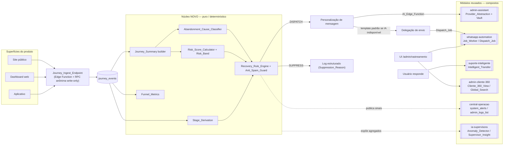
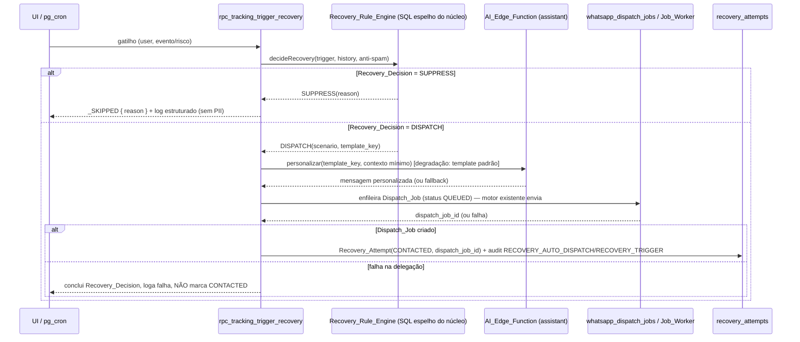

# Design Document — Rastreamento Inteligente (PatGo)

## Overview

O módulo **Rastreamento Inteligente (PatGo)** (`Tracking_Module`) entrega a aba
`/admin/rastreamento` do painel administrativo do FreteGO. Ele **monitora a jornada do usuário**
nas três superfícies (site público, dashboard web e aplicativo), **detecta abandono**, **calcula o
risco de evasão** e **dispara recuperação ativa por WhatsApp** sob controle de um motor de regras
determinístico. O pipeline é sempre **Rastreamento → Motor de Regras → IA → Ação**: a IA só
**personaliza** a mensagem quando o `Recovery_Rule_Engine` autoriza o disparo (`DISPATCH`); ela
nunca decide por conta própria.

### Decisão de escopo: "Módulo focado + reuso"

Este design detalha **apenas o núcleo novo** (ingestão de jornada, núcleo puro de
classificação/score/funil, motor de regras/anti-spam, RPCs/serviços/UI e a migration 124) e mostra
**como ele compõe/delega** aos módulos já em produção, sem recriá-los nem quebrá-los.

| Capacidade | Origem | Papel do Tracking_Module |
| --- | --- | --- |
| Conexão WhatsApp (QR, `WhatsApp_Session`, multi-instância, anti-spam de baixo nível) e **envio** | whatsapp-automation (092–114) | **Delega** o envio criando/enfileirando `Dispatch_Job` no motor `Job_Worker`. Não recria QR/sessão/send. |
| Personalização de mensagem e config da chave de IA | admin-assistant (047) | **Reusa** `Provider_Abstraction` + `AI_Edge_Function` + chave no `Vault`. Não cria nova abstração nem novo cofre. |
| Atendimento por IA / handoff quando o usuário responde | suporte-inteligente (115/115b) | **Compõe** `Intelligent_Transfer`/`Knowledge_Base`. Não recria o console de suporte. |
| Identificação do usuário e navegação ao histórico | admin-cliente-360 (116) | **Reusa** `Cliente_360_View` (`/admin/users/<id>`) e `Global_Search`. Não recria busca nem tela de detalhe. |
| Alertas, logs técnicos, insights e detecção de anomalia | central-operacao (117) + ia-supervisora (118) | **Publica sinais** em `system_alerts`, registra em `admin_audit_logs` e **expõe agregados** para `Anomaly_Detector`/`Supervisor_Insight`. Não recria nada. |
| RBAC server-side, audit-by-construction, versionamento otimista, Stealth_404 | admin-foundation (030) + admin-patterns | **Reusa** `is_admin_with_permission`, `executeAdminMutation`, `STALE_VERSION`, `AdminGuard`. |

### O que é novo vs. delegado/composto

- **Novo (foco desta spec):** captura e persistência de `Journey_Event`; o núcleo puro
  determinístico (`Abandonment_Cause_Classifier`, `Risk_Score_Calculator`, `Stage_Derivation`,
  `Funnel_Metrics`, `Recovery_Rule_Engine`/`Anti_Spam_Guard`); a `At_Risk_List`, o
  `Conversion_Funnel`, o `Recovery_Performance`, a `User_Journey_Timeline`; as RPCs gated, os
  serviços, a página/rota e o item de sidebar; e a **migration 124**.
- **Delegado:** envio de mensagem (whatsapp-automation) e personalização por IA (admin-assistant).
- **Composto:** identificação/navegação (cliente-360), handoff de atendimento (suporte-inteligente),
  alertas/logs/insights (central-operacao + ia-supervisora).

### Privacidade e LGPD

O `payload` de `Journey_Event`, as respostas das RPCs, os logs estruturados e o contexto enviado à
IA são **mínimos e sem PII bruta** (CPF, e-mail, telefone), senhas, tokens ou segredos. A
`AI_Api_Key` vive **somente no Vault** (via Provider_Abstraction), nunca no frontend.

## Architecture



### Camadas

1. **Ingestão (write-only, anônima permitida).** As três superfícies emitem `Journey_Event` para o
   `Journey_Ingest_Endpoint` — uma Edge Function fina sobre a RPC `rpc_tracking_ingest_event`
   (`SECURITY DEFINER`, concedida a `anon` + `authenticated`, caso de uso explicitamente anônimo como
   `is_blacklisted`). A RPC valida o domínio fechado, resolve `user_id` de `auth.uid()` quando há
   sessão (nunca confia em id do cliente) ou usa `visitor_id`, aplica rate-limit e **não retorna
   dado de jornada** (anti-enumeração). A leitura administrativa é uma porta **separada e gated**.
2. **Núcleo puro determinístico (TypeScript).** Sem I/O, total e determinístico, em
   `src/services/admin/rastreamento/`. Espelha a autoridade SQL quando há lógica equivalente no
   banco (padrão herdado de cliente360/operacao/suporte). É o alvo das Correctness Properties.
3. **Persistência + RPCs gated (SQL/migration 124).** Tabelas novas com RLS admin-only, RPCs
   `SECURITY DEFINER` com `is_admin_with_permission`, versionamento otimista e idempotência
   `_SKIPPED`, todas envolvidas por `executeAdminMutation` na camada de serviço.
4. **UI compacta (React + Tailwind).** Página `/admin/rastreamento`, componentes em
   `src/components/admin/rastreamento/`, gráficos em SVG inline.
5. **Delegação/Composição.** Envio (whatsapp), IA (assistant), handoff (suporte), navegação
   (cliente-360), alertas/insights (operacao/ia-supervisora).

## Components and Interfaces

### 1. Ingestão de Journey_Event

- **Edge Function `tracking-ingest`** (`supabase/functions/tracking-ingest/`): recebe lotes pequenos
  de eventos do cliente, valida forma básica e chama `rpc_tracking_ingest_event`. Write-only; resposta
  é sempre `{ ok: true }` (ou `{ ok: false, error: 'INVALID_EVENT_TYPE' }`), sem dados de jornada.
- **`rpc_tracking_ingest_event(p_events jsonb)`** — `SECURITY DEFINER`, `SET search_path = public`,
  `GRANT EXECUTE TO anon, authenticated`. Para cada item: valida `event_type ∈ Journey_Event_Type` e
  `surface ∈ Journey_Surface` (fora do domínio ⇒ rejeita o item com `INVALID_EVENT_TYPE`, sem
  derrubar os válidos), resolve `user_id := auth.uid()` quando presente senão grava `visitor_id`,
  aplica rate-limit por `visitor_id`/origem (descarta excedente sem falhar os demais), persiste o
  evento com `payload` mínimo. Retorna apenas `{ inserted, rejected, throttled }` — nunca jornada.
- **`rpc_tracking_correlate_visitor(p_visitor_id text)`** — `authenticated`. Ao autenticar, correlaciona
  `journey_events` anteriores do `visitor_id` ao `auth.uid()` (backfill `user_id` onde nulo) e registra a
  identidade em `tracking_visitor_identities`.

> Segurança: a leitura administrativa **nunca** passa pela porta anônima. As RPCs de leitura
> (`rpc_tracking_*_list`/`_timeline`/`_funnel`) são gated por `RASTREAMENTO_VIEW`.

### 2. Núcleo puro determinístico — `src/services/admin/rastreamento/`

Todas as funções abaixo são **puras, totais e determinísticas** (sem I/O, sem `Date.now()` interno —
o "agora" é injetado). Espelham a autoridade SQL onde há equivalência.

```ts
// domain.ts — domínios fechados (fonte única de verdade no front; espelha CHECKs da 124)
export const JOURNEY_EVENT_TYPES = [
  'SITE_VISIT','SIGNUP_STARTED','SIGNUP_COMPLETED','SIGNUP_ABANDONED',
  'DOCUMENT_UPLOAD_STARTED','DOCUMENT_UPLOAD_FAILED','DOCUMENT_APPROVED',
  'LOGIN_SUCCEEDED','LOGIN_FAILED','CHECKOUT_STARTED','CHECKOUT_ABANDONED',
  'PAYMENT_STARTED','PAYMENT_FAILED','PAYMENT_SUCCEEDED','SUBSCRIPTION_ACTIVATED',
  'APP_OPENED','APP_CRASH','FREIGHT_VIEWED','FREIGHT_IGNORED','FREIGHT_ACCEPTED',
  'FIRST_FREIGHT_COMPLETED','INACTIVITY_DETECTED','INTERNAL_ERROR','NETWORK_TIMEOUT',
] as const;
export type JourneyEventType = (typeof JOURNEY_EVENT_TYPES)[number];

export const JOURNEY_SURFACES = ['SITE','DASHBOARD','APP'] as const;
export type JourneySurface = (typeof JOURNEY_SURFACES)[number];

// Ordem do funil é significativa (índice = avanço).
export const FUNNEL_ORDER = [
  'VISITOR','SIGNUP_STARTED','SIGNUP_COMPLETED','DOCUMENTS_APPROVED',
  'SUBSCRIPTION_PAID','APP_ACTIVE','FIRST_FREIGHT','RECURRING_USER',
] as const;
export type FunnelStage = (typeof FUNNEL_ORDER)[number];

export const ABANDONMENT_CAUSES = [
  'SIGNUP_ABANDONED','UPLOAD_ERROR','LOGIN_FAILURE','PAYMENT_DECLINED','CHECKOUT_ABANDONED',
  'APP_CRASH','PROLONGED_INACTIVITY','FREIGHTS_IGNORED','INTERNAL_ERROR','NETWORK_TIMEOUT','UNKNOWN',
] as const;
export type AbandonmentCause = (typeof ABANDONMENT_CAUSES)[number];

export const RISK_BANDS = ['LOW','MEDIUM','HIGH','CRITICAL'] as const;
export type RiskBand = (typeof RISK_BANDS)[number];

export const RISK_CATEGORIES = ['SIGNUP_ABANDONED','PAYMENT_PENDING','INACTIVE','COLD_DRIVER','RECURRING_ERROR'] as const;
export type RiskCategory = (typeof RISK_CATEGORIES)[number];

export const RECOVERY_SCENARIOS = ['NEW_SIGNUP_WELCOME','SIGNUP_ABANDONED','PAYMENT_FAILED','USER_INACTIVE','COLD_DRIVER'] as const;
export type RecoveryScenario = (typeof RECOVERY_SCENARIOS)[number];

export const SUPPRESSION_REASONS = [
  'WITHIN_COOLDOWN','MAX_PER_WINDOW_REACHED','DUPLICATE_MESSAGE',
  'CONCURRENT_RECOVERY_ACTIVE','MIN_DELAY_NOT_ELAPSED','NO_ELIGIBLE_SCENARIO',
] as const;
export type SuppressionReason = (typeof SUPPRESSION_REASONS)[number];

export const CONTACT_STATUSES = ['AT_RISK','CONTACTED','REPLIED','CONVERTED'] as const;
export type ContactStatus = (typeof CONTACT_STATUSES)[number];

export const TIME_WINDOWS = ['24h','7d','30d','90d'] as const;
export type TimeWindow = (typeof TIME_WINDOWS)[number];
```

```ts
// journeySummary.ts — derivação determinística (entrada do classificador e do score)
export interface JourneyEvent {
  event_type: JourneyEventType;
  surface: JourneySurface;
  occurred_at: number; // epoch ms
}
export interface JourneySummary {
  current_stage: FunnelStage;
  days_since_last_access: number;
  recent_failures: number;        // falhas (upload/login/payment/network/internal) na janela recente
  frustrated_attempts: number;    // tentativas repetidas frustradas (login/upload)
  freight_refusals: number;       // FREIGHT_IGNORED
  no_conversion: boolean;         // nunca pagou/assinou
  last_relevant_event: JourneyEventType | null;
  signup_started: boolean;
  signup_completed: boolean;
}
export function buildJourneySummary(events: readonly JourneyEvent[], nowMs: number): JourneySummary;
```

```ts
// abandonmentClassifier.ts — Abandonment_Cause_Classifier (CP1)
// Total e determinístico: mapeia o Journey_Summary para exatamente uma causa,
// aplicando uma ORDEM DE PRECEDÊNCIA TOTAL fixa (tiebreaker determinístico);
// retorna 'UNKNOWN' quando nada se aplica.
export const ABANDONMENT_PRECEDENCE: readonly AbandonmentCause[] = [
  'APP_CRASH','PAYMENT_DECLINED','UPLOAD_ERROR','LOGIN_FAILURE','CHECKOUT_ABANDONED',
  'SIGNUP_ABANDONED','NETWORK_TIMEOUT','INTERNAL_ERROR','FREIGHTS_IGNORED','PROLONGED_INACTIVITY','UNKNOWN',
];
export function classifyAbandonmentCause(summary: JourneySummary, inactivityDays: number): AbandonmentCause;
```

```ts
// riskScore.ts — Risk_Score_Calculator + Risk_Band (CP2, CP3, CP4)
export interface RiskFactors {
  days_since_last_access: number; // >= 0
  recent_failures: number;        // >= 0
  frustrated_attempts: number;    // >= 0
  freight_refusals: number;       // >= 0
  no_conversion: 0 | 1;
}
// Pesos fixos NÃO-NEGATIVOS; soma ponderada CLAMPADA a [0,100] (monotônica não-decrescente).
export const RISK_WEIGHTS: Readonly<Record<keyof RiskFactors, number>>;
export function calculateRiskScore(f: RiskFactors): number;        // inteiro em [0,100]
export function deriveRiskBand(score: number): RiskBand;           // total: [0,24]/[25,49]/[50,74]/[75,100]
```

```ts
// stageDerivation.ts — Stage_Derivation (CP5)
// Mapeia o conjunto de eventos para o Funnel_Stage MAIS AVANÇADO alcançado (respeita FUNNEL_ORDER).
export function deriveFunnelStage(events: readonly JourneyEvent[]): FunnelStage;
```

```ts
// funnelMetrics.ts — Funnel_Metrics (CP6, CP7)
export type StageCounts = Record<FunnelStage, number>; // já agregadas por Time_Window (não-crescentes)
export interface FunnelMetrics {
  stage_conversion_rate: Record<FunnelStage, number>;   // [0,1]; 0 quando denominador 0
  stage_abandonment_rate: Record<FunnelStage, number>;  // 1 - conversion quando denom > 0
  overall_conversion_rate: number;                      // [0,1]
  retention_rate: number; churn_rate: number; activation_rate: number;
}
export function computeFunnelMetrics(counts: StageCounts): FunnelMetrics;
```

```ts
// recoveryRuleEngine.ts — Recovery_Rule_Engine + Anti_Spam_Guard (CP8, CP9)
export interface RecoveryTrigger {
  kind: 'EVENT' | 'RISK';
  event_type: JourneyEventType | null;
  user_id: string;
  occurred_at: number;          // epoch ms do gatilho
  is_critical: boolean;
  message_hash: string;         // hash do conteúdo proposto (Dedup)
}
export interface RecoveryHistoryItem {
  scenario: RecoveryScenario; created_at: number; contact_status: ContactStatus;
  message_hash: string; trigger_event_id: string | null; active: boolean;
}
export interface AntiSpamConfig {
  now: number; min_delay_ms: number; cooldown_min_ms: number; cooldown_max_ms: number;
  window_ms: number; max_per_window: number;
}
export type RecoveryDecision =
  | { kind: 'DISPATCH'; scenario: RecoveryScenario; template_key: RecoveryScenario }
  | { kind: 'SUPPRESS'; reason: SuppressionReason };

export function decideRecovery(
  trigger: RecoveryTrigger, history: readonly RecoveryHistoryItem[], cfg: AntiSpamConfig,
): RecoveryDecision;
```

```ts
// atRiskList.ts — filtragem + ordenação total (CP10)
export interface AtRiskRow {
  user_id: string; risk_score: number; risk_band: RiskBand;
  abandonment_cause: AbandonmentCause; risk_category: RiskCategory;
  contact_status: ContactStatus; name: string; phone_masked: string;
}
export interface TrackingFilterInput {
  text?: string; risk_category?: RiskCategory; min_score?: number; max_score?: number;
  problem_type?: AbandonmentCause; from?: number; to?: number; profile?: 'motorista' | 'embarcador';
}
// Resultado é SUBCONJUNTO da entrada, satisfaz TODOS os filtros, ordenação total
// (risk_score DESC, tiebreaker user_id ASC). Faixa min>max ⇒ conjunto vazio (sem erro).
export function filterAndSortAtRisk(rows: readonly AtRiskRow[], f: TrackingFilterInput): AtRiskRow[];
```

```ts
// recoveryPerformance.ts — Recovery_Rate + progressão de status (CP11)
export interface RecoveryCounts { AT_RISK: number; CONTACTED: number; REPLIED: number; CONVERTED: number; }
export function computeRecoveryRate(c: RecoveryCounts): number;        // CONVERTED/CONTACTED, 0 se CONTACTED=0; [0,1]
export function canTransitionContactStatus(from: ContactStatus, to: ContactStatus): boolean; // só avança na ordem
```

```ts
// trackingFilter.ts — sanitização do texto de busca (reusa escapeIlike de cliente360/search)
export { escapeIlike, normalizeQuery } from '../cliente360/search';

// csvExport.ts — CSV no padrão herdado (reusa toCsv/parseCsv/csvEscape de whatsapp/csv) (CP12)
import { toCsv, parseCsv } from '../whatsapp/csv';
export function buildRastreamentoCsvFilename(date?: Date): string;     // rastreamento_<YYYYMMDD>_<HHmm>.csv
export function exportAtRiskCsv(rows: readonly AtRiskRow[], date?: Date): { csv: string; truncated: boolean; filename: string };

// messageTemplates.ts — templates padrão por Recovery_Scenario (fallback de degradação)
export const DEFAULT_TEMPLATES: Readonly<Record<RecoveryScenario, string>>; // pt-BR, sem PII
```

### 3. RPCs `SECURITY DEFINER` (migration 124)

Todas seguem a RPC Security Posture (admin-patterns §10): `SET search_path = public`;
`auth.uid() IS NULL ⇒ permission_denied`; gating `is_admin_with_permission(...)` com **log negativo
`RASTREAMENTO_VIEW_DENIED`** (`before=NULL`, `after={ user_id, reason }`); validação de input;
`REVOKE ALL FROM PUBLIC` + `GRANT EXECUTE TO authenticated` (exceto a porta anônima de ingestão).

| RPC | Permissão | Tipo | Observações |
| --- | --- | --- | --- |
| `rpc_tracking_ingest_event(p_events jsonb)` | — (anon+auth) | escrita write-only | Domínio fechado; sem retorno de jornada (anti-enum). |
| `rpc_tracking_correlate_visitor(p_visitor_id text)` | autenticado | escrita | Backfill `user_id` do `visitor_id`. |
| `rpc_tracking_timeline(p_user_id uuid)` | `RASTREAMENTO_VIEW` | leitura | Eventos asc + `Funnel_Stage` atual. |
| `rpc_tracking_at_risk_list(p_filter jsonb, p_page int, p_page_size int)` | `RASTREAMENTO_VIEW` | leitura | `page_size ∈ {10,50,100}`; ordena risk desc, `user_id` asc; ILIKE escapado. |
| `rpc_tracking_funnel(p_window text)` | `RASTREAMENTO_VIEW` | leitura | Contagens por etapa + `Funnel_Metrics`; janela default se inválida. |
| `rpc_tracking_recovery_performance(p_window text)` | `RASTREAMENTO_VIEW` | leitura | Contadores por `Contact_Status` + `Recovery_Rate`. |
| `rpc_tracking_get_config()` | `RASTREAMENTO_VIEW` | leitura | `Tracking_AI_Config` + `is_set`/máscara do provedor (deriva do Vault, sem valor bruto). |
| `rpc_tracking_mark_contacted(p_user_id uuid, p_expected_updated_at timestamptz)` | `RASTREAMENTO_MANAGE` | mutação | Idempotente `_SKIPPED` (`ALREADY_CONTACTED`); via `executeAdminMutation`. |
| `rpc_tracking_trigger_recovery(p_user_id uuid, p_trigger jsonb)` | `RASTREAMENTO_MANAGE` | mutação | Submete ao engine; `DISPATCH`⇒delega+`Recovery_Attempt`; `SUPPRESS`⇒`_SKIPPED`. |
| `rpc_tracking_update_ai_config(p_patch jsonb, p_expected_updated_at timestamptz)` | `RASTREAMENTO_MANAGE` | mutação | `STALE_VERSION`; delega chave ao Vault do assistant. |
| `rpc_tracking_scan_recovery()` | service_role (pg_cron) | interno | Avalia gatilhos automáticos (ex.: `NEW_SIGNUP_WELCOME` ~10min); `RECOVERY_AUTO_DISPATCH`. |
| `rpc_tracking_publish_alert(p_dedup_key text, p_detail jsonb)` | service_role / `RASTREAMENTO_MANAGE` | interno | Publica em `system_alerts` (compõe central-operacao; sem PII). |

### 4. Camada de serviço — `src/services/admin/rastreamento.ts`

Wrappers finos sobre as RPCs. **Toda mutação** passa por `executeAdminMutation` (audit-by-construction)
com os action codes oficiais. Onde a operação toca a tabela `users`, chama `assertNotMasterNorSelf`
antes do touch (Master_Admin imutável) — embora o `Tracking_Module` opere sobre `recovery_attempts`/
`journey_events`, a guarda é aplicada por construção em qualquer caminho que referencie `users`.

```ts
export async function markContacted(userId: string, expectedUpdatedAt: string): Promise<MarkResult>; // _SKIPPED | ok
export async function triggerRecovery(userId: string, trigger: RecoveryTriggerInput): Promise<TriggerResult>;
export async function updateAiConfig(patch: AiConfigPatch, expectedUpdatedAt: string): Promise<{ updated_at: string }>;
export async function getTrackingConfig(): Promise<TrackingConfigView>;
export async function listAtRisk(filter: TrackingFilterInput, page: number, pageSize: 10|50|100): Promise<AtRiskPage>;
export async function getTimeline(userId: string): Promise<TimelineBundle>;
export async function getFunnel(window: TimeWindow): Promise<FunnelBundle>;
export async function getRecoveryPerformance(window: TimeWindow): Promise<RecoveryBundle>;
```

`triggerRecovery` (caminho `DISPATCH`): (1) constrói o `RecoveryTrigger`; (2) chama
`rpc_tracking_trigger_recovery`, que aplica o `Recovery_Rule_Engine` no servidor (autoridade);
(3) em `DISPATCH`, **personaliza** via `AI_Edge_Function` e **delega** o envio ao whatsapp; em
`SUPPRESS`, retorna `_SKIPPED` com o `Suppression_Reason`.

### 5. Delegação ao whatsapp-automation



- **Como ocorre:** ao `DISPATCH`, a RPC do tracking (rodando como owner, `SECURITY DEFINER`)
  **enfileira** um `Dispatch_Job` no motor durável existente de whatsapp-automation
  (`whatsapp_dispatch_jobs` + `whatsapp_dispatch_recipients`, status `QUEUED`), consumido pelo
  `Job_Worker`/pg_cron (`whatsapp-job-worker`, migrations 099/103/111). **Não** recria QR, sessão,
  anti-spam de baixo nível nem a camada de envio. O botão "WhatsApp" por linha abre a `Conversation`
  existente na `Conversation_Inbox` daquele módulo.
- **Personalização (admin-assistant):** a personalização chama a `AI_Edge_Function` (`assistant-ai`)
  via `Provider_Abstraction`; o contexto é mínimo (`Recovery_Scenario` + campos autorizados, sem PII
  bruta). **Config da chave** reusa o Vault do assistant (`rpc_assistant_set_secret` / seleção de
  `active_provider`); o `Tracking_Module` **não** cria novo cofre.
- **Degradação controlada:** se a IA falha ou o provedor é não implementado, usa o
  `DEFAULT_TEMPLATES[scenario]` e registra erro estruturado, mantendo a recuperação operável (Req 10.5,
  12.6). Se a delegação ao `Job_Worker` falha, conclui o `Recovery_Decision`, loga em separado e
  **não** marca `CONTACTED` (Req 9.12).

### 6. Composição com cliente-360, suporte-inteligente, operacao e ia-supervisora

- **cliente-360:** identificação via `Global_Search`; cada linha/timeline navega a `/admin/users/<id>`
  (abre a `Cliente_360_View` existente). Não recria busca nem detalhe.
- **suporte-inteligente:** quando o usuário responde e precisa de atendimento, compõe o
  `Intelligent_Transfer`/handoff (115/115b).
- **central-operacao:** publica sinais em `system_alerts` (via `rpc_tracking_publish_alert`,
  reusando a tabela e sua disciplina de escrita) e registra ações em `admin_audit_logs`
  (consultável pelo `admin_logs_list`). Não recria alertas nem visualizador de logs.
- **ia-supervisora:** expõe os agregados determinísticos (funil, score, recuperação) para o
  `Anomaly_Detector`/`Supervisor_Insight` comporem; não recria o motor de insights.
- **Degradação:** fontes compostas indisponíveis seguem `Partial_Degradation`; as superfícies
  determinísticas próprias permanecem operáveis (Req 14.4, 14.6).

### 7. UI — página, componentes e rota

- **Rota:** em `src/components/admin/AdminLayoutRoute.tsx`, `<Route path="rastreamento" element={<AdminRastreamentoPage />} />`.
  A página `src/pages/admin/AdminRastreamentoPage.tsx` chama `useAdminPermission('RASTREAMENTO_VIEW')`
  e renderiza `<Stealth404 />` quando negado.
- **Sidebar:** novo item em `AdminSidebar.tsx` (`to: '/admin/rastreamento'`, `label: 'Rastreamento'`,
  `permission: 'RASTREAMENTO_VIEW'`).
- **Componentes** (`src/components/admin/rastreamento/`): `AtRiskTable`, `UserJourneyTimeline`,
  `ConversionFunnelChart` (SVG inline), `RecoveryPerformanceChart` (SVG inline), `TrackingFilterPopover`
  (botão ícone `SlidersHorizontal`), `RecoveryActionsMenu` (gated `RASTREAMENTO_MANAGE`),
  `TrackingAiConfigCard` (gated `RASTREAMENTO_MANAGE`), `KpiCard`.
- **Padrão compacto (project-conventions):** sem `<h1>` grande; filtros em popover (sem painel inline
  largo); paginação `10/50/100` (default `10`); cards de KPI com label `text-[10px] uppercase
  tracking-wider text-gray-500` e valor `text-base sm:text-lg font-semibold`; em `<768px` as tabelas
  viram lista de cards single-column; gráficos em **SVG inline** (sem Recharts/Chart.js).

## Data Models

### Domínios fechados (fixados na migration 124 via CHECK / enum SQL)

`Journey_Event_Type`, `Journey_Surface`, `Funnel_Stage` (ordenado), `Abandonment_Cause`, `Risk_Band`,
`Risk_Category`, `Recovery_Scenario`, `Suppression_Reason`, `Contact_Status`, `Time_Window` —
conforme `domain.ts` acima. Valores fora do conjunto são rejeitados na ingestão/escrita.

### Tabelas novas (todas com RLS habilitada)

```sql
-- journey_events: eventos de jornada (anônimos ou vinculados a user_id).
CREATE TABLE IF NOT EXISTS journey_events (
  id          uuid PRIMARY KEY DEFAULT gen_random_uuid(),
  event_type  text NOT NULL CHECK (event_type IN ( /* Journey_Event_Type fechado */ )),
  surface     text NOT NULL CHECK (surface IN ('SITE','DASHBOARD','APP')),
  user_id     uuid NULL REFERENCES users(id) ON DELETE SET NULL,
  visitor_id  text NULL,                       -- token opaco anônimo
  occurred_at timestamptz NOT NULL DEFAULT now(),
  payload     jsonb NOT NULL DEFAULT '{}'::jsonb, -- mínimo, SEM PII/segredos
  created_at  timestamptz NOT NULL DEFAULT now(),
  CHECK (user_id IS NOT NULL OR visitor_id IS NOT NULL)
);
CREATE INDEX IF NOT EXISTS idx_journey_events_user      ON journey_events (user_id, occurred_at);
CREATE INDEX IF NOT EXISTS idx_journey_events_visitor   ON journey_events (visitor_id, occurred_at);
CREATE INDEX IF NOT EXISTS idx_journey_events_type_time ON journey_events (event_type, occurred_at DESC);

-- tracking_visitor_identities: correlação visitor_id -> user_id ao autenticar.
CREATE TABLE IF NOT EXISTS tracking_visitor_identities (
  visitor_id    text PRIMARY KEY,
  user_id       uuid NOT NULL REFERENCES users(id) ON DELETE CASCADE,
  correlated_at timestamptz NOT NULL DEFAULT now()
);

-- recovery_attempts: tentativas de recuperação (durável; base do anti-spam e do Recovery_Performance).
CREATE TABLE IF NOT EXISTS recovery_attempts (
  id                uuid PRIMARY KEY DEFAULT gen_random_uuid(),
  user_id           uuid NOT NULL REFERENCES users(id) ON DELETE CASCADE,
  recovery_scenario text NOT NULL CHECK (recovery_scenario IN
                      ('NEW_SIGNUP_WELCOME','SIGNUP_ABANDONED','PAYMENT_FAILED','USER_INACTIVE','COLD_DRIVER')),
  channel           text NOT NULL DEFAULT 'WHATSAPP',
  dispatch_job_id   uuid NULL REFERENCES whatsapp_dispatch_jobs(id) ON DELETE SET NULL,
  contact_status    text NOT NULL DEFAULT 'CONTACTED' CHECK (contact_status IN
                      ('AT_RISK','CONTACTED','REPLIED','CONVERTED')),
  trigger_event_id  uuid NULL REFERENCES journey_events(id) ON DELETE SET NULL, -- 1 msg por evento crítico
  message_hash      text NULL,                  -- Dedup (sem conteúdo bruto)
  active            boolean NOT NULL DEFAULT true, -- No_Concurrent
  triggered_by      uuid NULL REFERENCES users(id) ON DELETE SET NULL, -- NULL = automático
  created_at        timestamptz NOT NULL DEFAULT now(),
  updated_at        timestamptz NOT NULL DEFAULT now()
);
CREATE INDEX IF NOT EXISTS idx_recovery_attempts_user_time ON recovery_attempts (user_id, created_at DESC);
CREATE UNIQUE INDEX IF NOT EXISTS uq_recovery_active_per_user
  ON recovery_attempts (user_id) WHERE active;   -- No_Concurrent: <= 1 ativa por usuário
CREATE UNIQUE INDEX IF NOT EXISTS uq_recovery_per_critical_event
  ON recovery_attempts (trigger_event_id) WHERE trigger_event_id IS NOT NULL; -- 1 msg/evento crítico

-- tracking_ai_config: registro único de config da personalização (SEM segredo; chave no Vault).
CREATE TABLE IF NOT EXISTS tracking_ai_config (
  id                     boolean PRIMARY KEY DEFAULT true CHECK (id),
  active_provider        text NOT NULL DEFAULT 'gemini' CHECK (active_provider IN ('claude','gemini','grok','llama')),
  personalization_enabled boolean NOT NULL DEFAULT false,
  inactivity_days        int NOT NULL DEFAULT 14 CHECK (inactivity_days >= 1),
  updated_at             timestamptz NOT NULL DEFAULT now()
);
```

### RLS (admin-only; escrita só por RPC; exceção write-only anônima)

- `journey_events`: `SELECT` somente sob `is_admin_with_permission('RASTREAMENTO_VIEW')`. **Sem** policy
  de `INSERT/UPDATE/DELETE` para `authenticated`/`anon`: a inserção ocorre exclusivamente pela
  `rpc_tracking_ingest_event` (`SECURITY DEFINER`). Isso satisfaz "write-only anônimo restrito" sem
  abrir a tabela ao role `anon` (Req 15.5).
- `tracking_visitor_identities`, `recovery_attempts`, `tracking_ai_config`: `SELECT` sob
  `RASTREAMENTO_VIEW`; DML direto sempre negado (`USING (false) WITH CHECK (false)`), escrita só por RPC.
- Nenhuma policy admite acesso cruzado entre usuários; nenhuma concede leitura a `anon`.

### Action codes (gravados em `admin_audit_logs`)

`RECOVERY_TRIGGER`, `RECOVERY_TRIGGER_SKIPPED`, `RECOVERY_AUTO_DISPATCH`, `RECOVERY_RULE_UPDATE`,
`TRACKING_CONTACT_MARK`, `TRACKING_CONTACT_MARK_SKIPPED`, `TRACKING_AI_CONFIG_UPDATE`,
`RASTREAMENTO_VIEW_DENIED`.

### RBAC — permissões novas

`RASTREAMENTO_VIEW` e `RASTREAMENTO_MANAGE` entram em `ADMIN_ACTIONS` (`permissions.ts`) e na
re-asserção de `is_admin_with_permission` (124), concedidas **apenas** a `SUPER_ADMIN` (wildcard) e
`ADMIN` (allow-all menos deny-list) — negadas por construção a `SUPORTE`/`FINANCEIRO`/`MODERADOR`
(deny-by-default). Caller anônimo (`auth.uid()` nulo) retorna falso (autenticação tem precedência
sobre papel).

## Correctness Properties

*Uma propriedade é uma característica ou comportamento que deve valer para todas as execuções válidas
do sistema — uma afirmação formal sobre o que o software deve fazer. As propriedades são a ponte entre
a especificação legível por humanos e garantias de corretude verificáveis por máquina.*

PBT é aplicável porque o núcleo (`classifier`/`score`/`stage`/`funnel`/`engine`/`anti-spam`/`csv`) é
composto de **funções puras, totais e determinísticas**. As 12 propriedades obrigatórias (sem
asterisco) abaixo concentram-se nesse núcleo, mais duas propriedades transversais derivadas do
Requirement 15 (privacidade e precedência de `permission_denied`). Cada propriedade é implementada por
**um** property test fast-check (mínimo 100 iterações; o projeto usa 200), no arquivo
`cp<N>_<nome>.property.test.ts` em `src/__tests__/admin/rastreamento/`.

### Property 1 (CP1): Abandonment_Cause_Classifier — totalidade + determinismo + precedência total

*Para todo* `Journey_Summary`, `classifyAbandonmentCause` retorna **exatamente um** valor do domínio
fechado `Abandonment_Cause` (incluindo `UNKNOWN` quando nenhuma causa específica se aplica), a mesma
entrada produz sempre a mesma saída, e causas concorrentes são resolvidas por uma ordem de precedência
total fixa (mesmo `summary` nunca produz causas diferentes entre execuções).

**Validates: Requirements 5.1, 5.2, 5.3, 5.4, 5.5, 5.6, 5.7, 5.9**

### Property 2 (CP2): Risk_Score — limites + determinismo

*Para toda* combinação de `Risk_Factor`, `calculateRiskScore` produz um inteiro no intervalo fechado
`[0, 100]` (clamping), e os mesmos fatores produzem sempre o mesmo score (determinismo).

**Validates: Requirements 6.1, 6.2, 6.4, 6.5**

### Property 3 (CP3): Risk_Score — monotonicidade não-decrescente

*Para todo* `Risk_Factor`, aumentar o valor de um fator mantendo os demais constantes nunca diminui o
`Risk_Score` resultante (monotonicidade não-decrescente; decorre de pesos não-negativos + clamp).

**Validates: Requirements 6.3, 6.5**

### Property 4 (CP4): Risk_Band — função total + monotonicidade

*Para todo* `Risk_Score` em `[0, 100]`, `deriveRiskBand` atribui exatamente uma `Risk_Band` (função
total sobre as faixas `[0,24]/[25,49]/[50,74]/[75,100]`), e *para todo* par de scores, um score maior
nunca mapeia para uma `Risk_Band` de severidade menor (monotonicidade).

**Validates: Requirements 6.6, 6.7**

### Property 5 (CP5): Stage_Derivation — domínio fechado + determinismo

*Para todo* conjunto de `Journey_Event`, `deriveFunnelStage` retorna um `Funnel_Stage` do domínio
ordenado (`VISITOR … RECURRING_USER`), igual ao mais avançado alcançado, e é invariante à ordem de
entrada e idempotente (mesmo conjunto ⇒ mesma etapa).

**Validates: Requirements 8.2, 4.3**

### Property 6 (CP6): Conversion_Funnel — monotonicidade do funil

*Para todo* par de `Funnel_Stage` consecutivos na mesma `Time_Window`, a contagem da etapa posterior é
menor ou igual à da etapa anterior (funil não-crescente).

**Validates: Requirements 8.1, 8.3**

### Property 7 (CP7): Funnel_Metrics — limites + complemento + determinismo

*Para todo* conjunto de contagens por etapa, toda taxa de `Funnel_Metrics` está em `[0, 1]`,
`Stage_Conversion_Rate(etapa) + Stage_Abandonment_Rate(etapa) = 1` sempre que o denominador é maior
que 0 (e `Stage_Conversion_Rate = 0` quando o denominador é 0), e o cálculo é determinístico para o
mesmo conjunto.

**Validates: Requirements 8.4, 8.5, 8.6, 8.7**

### Property 8 (CP8): Recovery_Rule_Engine — determinismo + domínio fechado

*Para todo* gatilho, histórico de `Recovery_Attempt` e estado de anti-spam, `decideRecovery` produz um
`Recovery_Decision` determinístico (mesma entrada ⇒ mesma decisão) que usa exclusivamente
`Recovery_Scenario` (em `DISPATCH`) e `Suppression_Reason` (em `SUPPRESS`) dos domínios fechados.

**Validates: Requirements 9.1, 9.2, 9.3**

### Property 9 (CP9): Anti_Spam_Guard — invariantes de supressão + idempotência

*Para todo* gatilho e estado: (a) dentro do `Cooldown` (24–72h do último disparo) a decisão é sempre
`SUPPRESS` com `WITHIN_COOLDOWN`; (b) no máximo **1** mensagem automática é autorizada por evento
crítico para o mesmo usuário (excedente ⇒ `MAX_PER_WINDOW_REACHED` ou `DUPLICATE_MESSAGE`); (c) havendo
`Recovery_Attempt` ativa para o usuário, a decisão é `SUPPRESS` com `CONCURRENT_RECOVERY_ACTIVE`; e
(d) reavaliar o mesmo estado produz a mesma decisão (idempotência).

**Validates: Requirements 9.4, 9.5, 9.6, 9.7, 9.11**

### Property 10 (CP10): At_Risk_List — filtragem (subconjunto) + ordenação total

*Para toda* lista de entrada e todo `Tracking_Filter`, o resultado de `filterAndSortAtRisk` é um
**subconjunto** da entrada, **toda** linha retornada satisfaz **todos** os filtros ativos, a ordenação
é total e determinística (`risk_score` DESC, desempate `user_id` ASC), e uma faixa de `Risk_Score` com
mínimo maior que o máximo produz conjunto vazio (sem erro).

**Validates: Requirements 7.3, 7.5, 13.3, 13.9**

### Property 11 (CP11): Recovery_Rate — limites + progressão monotônica de Contact_Status

*Para todo* conjunto de contadores, `computeRecoveryRate = CONVERTED / CONTACTED` está em `[0, 1]`
(e vale `0` quando `CONTACTED = 0`); e *para todo* par `(from, to)`, `canTransitionContactStatus` só
admite avanço na ordem `AT_RISK → CONTACTED → REPLIED → CONVERTED`, nunca retrocesso.

**Validates: Requirements 11.2, 11.3, 11.6**

### Property 12 (CP12): CSV Export — round-trip

*Para toda* `At_Risk_List` exportada, reanalisar o CSV gerado (`parseCsv(toCsv(rows))`) reproduz
exatamente as mesmas linhas lógicas — incluindo campos com `;`, `"`, `\n` e `\r` — preservando BOM,
separador `;`, escape RFC 4180 e quebra `\r\n` (propriedade de ida e volta do serializador).

**Validates: Requirements 7.11**

### Property 13 (transversal — privacidade): nenhuma saída vaza PII bruta ou segredo

*Para todo* `Journey_Event`/`Journey_Summary`/`Recovery_Decision`/contexto enviado à IA e *para toda*
linha de log estruturado, a serialização da saída nunca contém PII bruta (CPF, e-mail, telefone),
senha, token, chave de IA ou stack trace (verificado por `expectNoSecrets`/`expectStructuredLog`).

**Validates: Requirements 3.6, 3.7, 4.6, 10.4, 12.3, 15.6**

### Property 14 (transversal — precedência): permission_denied tem precedência sobre validação

*Para toda* ação protegida invocada por caller sem a permissão exigida, ainda que com input inválido
simultâneo, o resultado é sempre `permission_denied` (precedência sobre qualquer erro de validação;
verificado por `expectPermissionDenied`).

**Validates: Requirements 2.7, 2.8, 3.10, 15.2**

## Error Handling

### Degradação parcial (Partial_Degradation)

Os fetches agregados (`getTimeline`, `getFunnel`, `getRecoveryPerformance`, `getTrackingConfig`)
carregam cada bloco de forma isolada via `Promise.allSettled`. A falha de um bloco grava
`bundle.errors[bloco] = 'Bloco indisponível.'` e renderiza `<DashboardBlockError onRetry={onRefresh} />`
apenas naquele bloco; os demais seguem normais. Apenas o bloco da entidade-fonte pode lançar
`NOT_FOUND`. Fontes compostas indisponíveis (cliente-360, operacao, ia-supervisora, whatsapp) seguem o
mesmo padrão — as superfícies determinísticas próprias permanecem operáveis (Req 8.9, 11.7, 14.4, 14.6).

### Degradação da IA e da delegação de envio

- **IA indisponível / provedor não implementado:** usa `DEFAULT_TEMPLATES[scenario]` e registra erro
  estruturado; a recuperação permanece operável (Req 10.5, 12.6). Sem provedor configurado, o
  rastreamento/classificação/score/motor determinístico seguem 100% operáveis (Req 12.6).
- **Falha na delegação ao `Job_Worker`:** a avaliação do `Recovery_Decision` é concluída, a falha é
  logada em separado e o `Contact_Status` **não** é marcado como `CONTACTED` (Req 9.12) — sem deixar o
  módulo em estado indefinido.

### Erros tratados, códigos e versionamento

- **`STALE_VERSION`** em `tracking_ai_config` (e em qualquer UPDATE versionada): a UI exibe toast
  `Outro admin atualizou. Recarregando.` e refaz o fetch (admin-patterns §3).
- **Idempotência `_SKIPPED`**: `markContacted` em usuário já `CONTACTED/REPLIED/CONVERTED` retorna
  `{ skipped: true, reason: 'ALREADY_CONTACTED' }` com toast neutro; `triggerRecovery` em `SUPPRESS`
  retorna `{ skipped: true, reason: <Suppression_Reason> }`. Sem nova mutação (admin-patterns §4).
- **Anti-enumeração:** a ingestão e as respostas para identidades inexistentes são indistinguíveis;
  mensagens canônicas pt-BR quando aplicável. A porta de ingestão nunca devolve jornada/contagem.
- **Precedência de `permission_denied`:** falha de permissão + validação simultânea ⇒ sempre
  `permission_denied` (Property 14).

### Observabilidade (logs estruturados, sem PII)

- Logs estruturados contínuos (`level`, `ts`, `event`), nunca com PII/segredo/stack ao cliente
  (`expectStructuredLog`/`expectNoSecrets`). Cada **supressão automática** vira um log estruturado com
  o `Suppression_Reason`, sem conteúdo de mensagem (Req 9.11).
- **Auditoria:** toda mutação grava em `admin_audit_logs` via `executeAdminMutation`. A verificação de
  auditoria só é considerada satisfeita quando o registro está **persistido** (não basta executar o
  processo); a **falha de audit logging não bloqueia** a mutação (testing-governance; helpers
  `expectAuditPersisted` / `expectMutationSucceedsDespiteAuditFailure`). O caminho negativo de RPC
  gated grava `RASTREAMENTO_VIEW_DENIED` (`before=NULL`, `after={ user_id, reason }`).
- **Composição operacional:** condições relevantes publicam sinal em `system_alerts` (dedup_key,
  `detail` sem PII); ações ficam consultáveis no `admin_logs_list`; agregados ficam disponíveis ao
  `Anomaly_Detector`/`Supervisor_Insight`.

## Testing Strategy

Aderência integral ao steering `testing-governance`: **nenhuma feature conclui sem testes completos**
(unit + property + cenários de falha/negativos + validação no frontend E no backend + Regression_Suite
atualizada + documentação técnica). Biblioteca: **fast-check** (já no projeto, `^4.6.0`) sobre
**vitest**.

### Abordagem dupla

- **Unit/exemplo:** exemplos concretos, integração entre componentes e casos de borda — rota/gating,
  Stealth_404, paginação `10/50/100`, estado vazio da timeline, navegação a `/admin/users/<id>`,
  `_SKIPPED`, `STALE_VERSION`, fallback de template, formulário inválido bloqueado com mensagem pt-BR.
- **Property (fast-check):** os invariantes universais do núcleo (CP1–CP12) + as transversais de
  privacidade (Property 13) e precedência (Property 14).
- **Integração (CI, pasta `tests/`):** RLS/isolamento, `auth.uid()` nulo ⇒ `permission_denied`,
  `RASTREAMENTO_VIEW_DENIED` persistido, audit persistido, Master imutável, publicação em
  `system_alerts`, delegação real ao `Job_Worker`. Usam branch Supabase efêmero (não atrasam o commit).

### Convenções fast-check do projeto (obrigatórias)

- `fc.stringOf` **não existe** — usar `fc.string({ minLength, maxLength }).filter(...)` (helper
  `safeText`).
- PII (phone/CPF/CNPJ/email) via `fc.constantFrom` de templates fixos válidos — helpers
  `validPhone`/`validCpf`/`validCnpj`/`validEmail` (e variantes inválidas) de
  `src/__tests__/_helpers/generators.ts`. Nunca valores aleatórios que falham na validação.
- `vi.mock` é hoisted: **não** referenciar variáveis externas no factory; expor spies via
  `(globalThis as Record<string, unknown>).__nomeDoSpy = ...` (ex.: spy da `AI_Edge_Function` e do
  enfileiramento de `Dispatch_Job`).
- Cada property test roda no mínimo 100 iterações (`{ numRuns: 200 }`, como o padrão do projeto) e é
  anotado com `// Feature: admin-rastreamento-inteligente, Property <N>: <texto>`.

### Helpers canônicos reusados (`src/__tests__/_helpers/`)

- `generators.ts` — `validPhone`/`validCpf`/`validCnpj`/`validEmail`, `safeText`, `uuidLike`.
- `authAssertions.ts` — `expectPermissionDenied` / `expectRejectsPermissionDenied` (precedência).
- `antiEnumeration.ts` — `CANONICAL_MESSAGES` + `expectAntiEnumeration` / `expectIndistinguishable`.
- `logAssertions.ts` — `expectNoSecrets` / `expectStructuredLog`.
- `auditAssertions.ts` — `expectAuditPersisted` / `expectMutationSucceedsDespiteAuditFailure` /
  `expectViewDenied`.

### Mapa de arquivos de property test (`src/__tests__/admin/rastreamento/`)

| Arquivo | Propriedade | Núcleo / helpers |
| --- | --- | --- |
| `cp1_abandonment_classifier.property.test.ts` | CP1 | `abandonmentClassifier` |
| `cp2_risk_score_bounds.property.test.ts` | CP2 | `riskScore` |
| `cp3_risk_score_monotonic.property.test.ts` | CP3 | `riskScore` |
| `cp4_risk_band_total.property.test.ts` | CP4 | `riskScore.deriveRiskBand` |
| `cp5_stage_derivation.property.test.ts` | CP5 | `stageDerivation` |
| `cp6_funnel_monotonic.property.test.ts` | CP6 | `funnelMetrics` |
| `cp7_funnel_metrics_bounds.property.test.ts` | CP7 | `funnelMetrics` |
| `cp8_recovery_engine_determinism.property.test.ts` | CP8 | `recoveryRuleEngine` |
| `cp9_anti_spam_guard.property.test.ts` | CP9 | `recoveryRuleEngine` (anti-spam) |
| `cp10_at_risk_list.property.test.ts` | CP10 | `atRiskList` + `validPhone` |
| `cp11_recovery_rate.property.test.ts` | CP11 | `recoveryPerformance` |
| `cp12_csv_roundtrip.property.test.ts` | CP12 | `csvExport` (reusa `whatsapp/csv`) |
| `cp13_no_pii_leak.property.test.ts` | Property 13 | `logAssertions.expectNoSecrets` |
| `cp14_permission_precedence.property.test.ts` | Property 14 | `authAssertions.expectPermissionDenied` |

UI/exemplo: `rastreamentoUI.test.tsx` (Stealth_404, paginação, popover, estado vazio, ocultação de
ações em modo leitura), `rastreamento_service.test.ts` (`_SKIPPED`, `STALE_VERSION`, fallback de IA).

### Critical_Modules (registrar em `tests/coverage.config.ts`)

Os módulos puros do núcleo são declarados como `Critical_Module`, com threshold mínimo verificado por
`scripts/check-coverage.ts` no CI (abaixo do threshold ⇒ build falha). Wrappers de serviço (RPC) e UI
(`.tsx`, validada por build) ficam fora do gate por ora, como no padrão de whatsapp/suporte/cliente360/
operacao/supervisor.

```ts
'src/services/admin/rastreamento/abandonmentClassifier.ts': 95,
'src/services/admin/rastreamento/riskScore.ts': 95,
'src/services/admin/rastreamento/stageDerivation.ts': 95,
'src/services/admin/rastreamento/funnelMetrics.ts': 95,
'src/services/admin/rastreamento/recoveryRuleEngine.ts': 90,
'src/services/admin/rastreamento/atRiskList.ts': 90,
'src/services/admin/rastreamento/recoveryPerformance.ts': 95,
'src/services/admin/rastreamento/csvExport.ts': 90,
```

### Pipeline e regressão (testing-governance)

Qualquer falha de teste — inclusive flaky que só passou após retry — bloqueia merge e deploy; problemas
de infraestrutura da pipeline não bloqueiam automaticamente. Mudança de schema compatível não falha
contrato; só incompatível falha. Os novos property tests são incorporados à `Regression_Suite`.

## Migration 124 — `124_admin_rastreamento_inteligente.sql`

Numeração incremental sem buracos (a maior no disco é `123_marketplace_title_30`; `124` é a próxima
livre). Envolvida em `BEGIN; … COMMIT;`, **idempotente** (admin-patterns §9) e acompanhada do par
documentado `124_admin_rastreamento_inteligente_rollback.sql` (não auto-aplicado). Caso seja necessária
uma segunda migration, usar o sufixo `124b_…`, preservando os números seguintes.

### Estrutura

1. **Bloco `DO $check$` defensivo** — aborta com mensagem clara se faltar uma dependência reusada:
   - `is_admin_with_permission` e `admin_audit_logs` (030);
   - `whatsapp_dispatch_jobs` / `whatsapp_dispatch_recipients` (092) — delegação de envio;
   - extensão `supabase_vault` (042b) e `assistant_config` (047) — config/chave de IA;
   - `admin_global_search` (116) — identificação/composição;
   - `system_alerts` (117) — publicação de sinais.
   `whatsapp`/`operacao` são dependências **macias** na operação (a ausência degrada em runtime), mas
   **duras** na migration por serem alvo de FK/escrita.

2. **RBAC** — `CREATE OR REPLACE FUNCTION is_admin_with_permission(text)` **preservando o corpo
   vigente** (030 + deny-lists de 047/048 + ações de 115/116/117/118) e reconhecendo
   `RASTREAMENTO_VIEW`/`RASTREAMENTO_MANAGE` **por construção** (SUPER_ADMIN wildcard; ADMIN allow-all
   menos deny-list; demais papéis negados). Sem novo ramo de papel.

3. **Tabelas + índices + RLS** — `journey_events`, `tracking_visitor_identities`, `recovery_attempts`,
   `tracking_ai_config` com DDL idempotente (`CREATE TABLE/INDEX IF NOT EXISTS`, `DROP POLICY IF EXISTS`
   antes de `CREATE POLICY`). RLS admin-only (`SELECT` sob `RASTREAMENTO_VIEW`; DML direto negado);
   `journey_events` sem policy de insert (ingestão só por RPC). Trigger `updated_at` idempotente.

4. **RPCs `SECURITY DEFINER`** — todas com `SET search_path = public`, gating + log negativo
   `RASTREAMENTO_VIEW_DENIED`, `REVOKE ALL FROM PUBLIC` + `GRANT EXECUTE TO authenticated` (exceto
   `rpc_tracking_ingest_event`, concedida também a `anon` — caso de uso anônimo explícito como
   `is_blacklisted`). O espelho SQL do `Recovery_Rule_Engine`/`Anti_Spam_Guard` é a autoridade
   server-side (o núcleo TS espelha a mesma lógica).

5. **Composição com `system_alerts` (additiva, não destrutiva)** — para publicar "pico anormal de
   abandono" (Req 14.1) reusando a tabela de 117, a migration aplica uma **ampliação aditiva** do
   domínio fechado `system_alerts.alert_type` (DROP do CHECK seguido de ADD com a **união** dos valores
   atuais + `ABANDONMENT_SPIKE`). É **não destrutiva** (superset; nenhum valor/linha/política/ RPC de
   117 é removido ou alterado em comportamento) e idempotente. O par rollback restaura o CHECK original.
   Esta é a **única** alteração cirúrgica e aditiva a um módulo composto, justificada por 14.1; nenhuma
   tabela/RPC/policy de 092–118 é recriada (Req 14.5, 16.7).

6. **Agendamento** — `rpc_tracking_scan_recovery()` agendada via `pg_cron` de forma **defensiva** (não
   falha sem a extensão; espelha o padrão de 092/047).

7. **Bloco `-- VERIFY` comentado** ao fim, para smoke test manual (inserir evento fora do domínio ⇒
   `INVALID_EVENT_TYPE`; leitura sem permissão ⇒ `RASTREAMENTO_VIEW_DENIED`; `mark_contacted`
   idempotente; `trigger_recovery` em cooldown ⇒ `SUPPRESS WITHIN_COOLDOWN`).

### Par de rollback (`124_..._rollback.sql`, documentado, não auto-aplicado)

`DROP` das RPCs novas, das policies e das tabelas novas (`recovery_attempts`, `tracking_ai_config`,
`tracking_visitor_identities`, `journey_events`), `unschedule` do `pg_cron`, **restauração do CHECK
original** de `system_alerts.alert_type` e reversão da re-asserção de `is_admin_with_permission` para a
versão vigente antes da 124 (sem `RASTREAMENTO_*`). Não toca objetos de 092–118 além da restauração do
CHECK que esta migration ampliou.

### Esboço (idempotente, defensivo)

```sql
BEGIN;

DO $check$
BEGIN
  IF NOT EXISTS (SELECT 1 FROM information_schema.routines
                 WHERE routine_schema='public' AND routine_name='is_admin_with_permission') THEN
    RAISE EXCEPTION 'Migration 030 (admin-foundation) nao aplicada: is_admin_with_permission ausente';
  END IF;
  IF NOT EXISTS (SELECT 1 FROM information_schema.tables
                 WHERE table_schema='public' AND table_name='whatsapp_dispatch_jobs') THEN
    RAISE EXCEPTION 'Migration 092 (whatsapp-automation) nao aplicada: whatsapp_dispatch_jobs ausente';
  END IF;
  IF NOT EXISTS (SELECT 1 FROM information_schema.tables
                 WHERE table_schema='public' AND table_name='system_alerts') THEN
    RAISE EXCEPTION 'Migration 117 (central-operacao) nao aplicada: system_alerts ausente';
  END IF;
  IF NOT EXISTS (SELECT 1 FROM pg_extension WHERE extname='supabase_vault') THEN
    RAISE EXCEPTION 'Extensao supabase_vault (042b) ausente: chave de IA nao pode ser armazenada';
  END IF;
END
$check$;

-- ... RBAC re-assercao (preservando corpo vigente + RASTREAMENTO_VIEW/MANAGE por construcao) ...
-- ... CREATE TABLE IF NOT EXISTS journey_events / tracking_visitor_identities /
--     recovery_attempts / tracking_ai_config (+ indices) ...
-- ... ALTER TABLE ... ENABLE ROW LEVEL SECURITY; DROP POLICY IF EXISTS ...; CREATE POLICY ... ...
-- ... CREATE OR REPLACE FUNCTION rpc_tracking_* (...) SECURITY DEFINER SET search_path=public ... ;
--     REVOKE ALL ... FROM PUBLIC; GRANT EXECUTE ... TO authenticated; (ingest tambem a anon) ...

-- Ampliacao ADITIVA e nao-destrutiva do dominio de system_alerts (Req 14.1):
ALTER TABLE system_alerts DROP CONSTRAINT IF EXISTS system_alerts_alert_type_check;
ALTER TABLE system_alerts ADD CONSTRAINT system_alerts_alert_type_check
  CHECK (alert_type IN ('WHATSAPP_DISCONNECTED','CAMPAIGN_PAUSED','CAMPAIGN_ERROR',
                        'INTEGRATION_FAILURE','SUBSCRIPTION_EXPIRING','CUSTOMER_AWAITING',
                        'ABANDONMENT_SPIKE'));

COMMIT;

/*
-- VERIFY (smoke test manual; nao executado automaticamente)
-- 1) Evento fora do dominio => rejeitado, nao persiste:
--    SELECT rpc_tracking_ingest_event('[{"event_type":"FOO","surface":"SITE"}]'::jsonb);
-- 2) Leitura sem permissao => RASTREAMENTO_VIEW_DENIED em admin_audit_logs.
-- 3) mark_contacted idempotente (segunda chamada => _SKIPPED ALREADY_CONTACTED).
-- 4) trigger_recovery dentro do cooldown => SUPPRESS WITHIN_COOLDOWN.
*/
```

## Rastreabilidade Requisitos → Design

| Requirement | Onde é endereçado |
| --- | --- |
| 1 (rota/gating/UI compacta/navegação) | Components §7; Stealth_404; sidebar; cliente-360 nav |
| 2 (RBAC novo + precedência) | Data Models §RBAC; `permissions.ts`; Property 14 |
| 3 (ingestão segura) | Components §1; Data Models `journey_events` + RLS; Properties 5, 13, 14 |
| 4 (timeline) | Components §7; Property 5; exemplo de estado vazio |
| 5 (Abandonment_Cause_Classifier) | Core `abandonmentClassifier`; Property 1 |
| 6 (Risk_Score/Risk_Band) | Core `riskScore`; Properties 2, 3, 4 |
| 7 (At_Risk_List + CSV) | Core `atRiskList`/`csvExport`; Properties 10, 12; exemplos `_SKIPPED` |
| 8 (Conversion_Funnel) | Core `stageDerivation`/`funnelMetrics`; Properties 5, 6, 7 |
| 9 (Recovery_Rule_Engine + delegação) | Core `recoveryRuleEngine`; Components §5; Properties 8, 9 |
| 10 (Personalização IA) | Components §5; degradação; Properties 13, 14 |
| 11 (Recovery_Performance) | Core `recoveryPerformance`; Property 11 |
| 12 (Config chave IA) | Components §5; `tracking_ai_config`; STALE_VERSION; Property 13 |
| 13 (busca/filtros popover) | Core `trackingFilter`; Components §7; Property 10 |
| 14 (composição alertas/logs/insights) | Components §6; Migration §5 (system_alerts aditivo) |
| 15 (segurança/isolamento/auditoria/master) | RPC posture; RLS; Error Handling; Properties 13, 14 |
| 16 (migration idempotente + rollback) | Migration 124 + par rollback |
| 17 (governança de testes + Critical_Modules) | Testing Strategy + coverage.config.ts |
