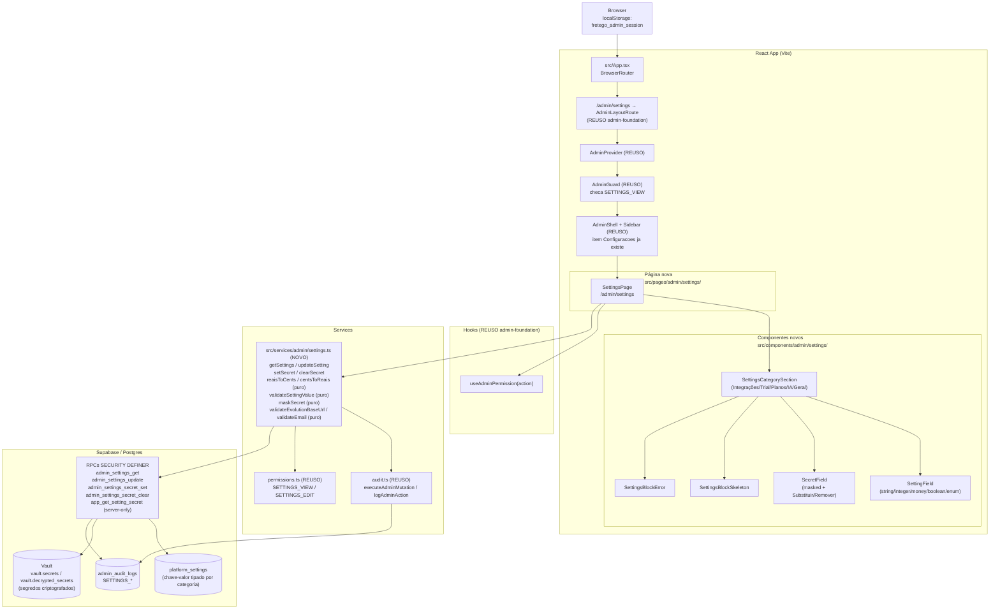
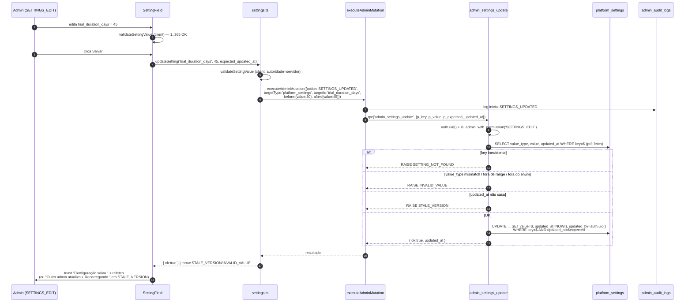
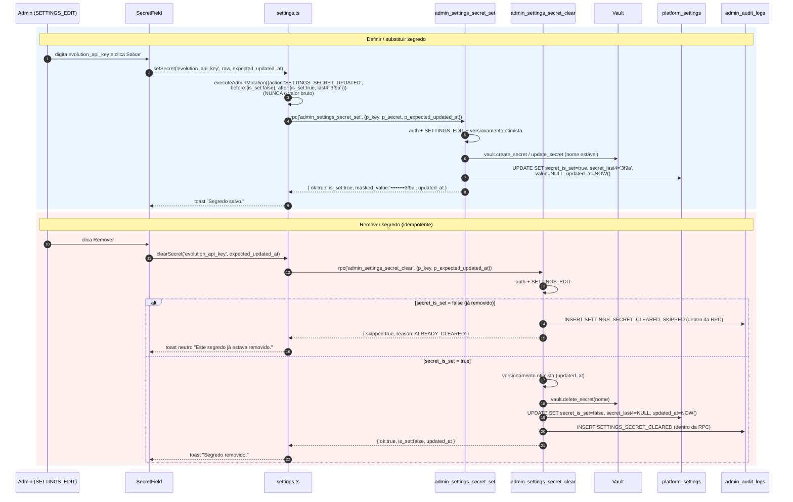

# Design Document

## Overview

Esta spec entrega o **módulo Configurações** do painel administrativo do FreteGO, em `/admin/settings`,
sentado sobre fundações já em produção. O item de menu já existe na `AdminSidebar` (gated por
`SETTINGS_VIEW`), mas a rota nunca foi construída e hoje cai em `Stealth_404`. O escopo é
exclusivamente o módulo Configurações em si: um **armazenamento genérico de settings tipados por
categoria** (`platform_settings`), uma página de administração no padrão compacto pós-cleanup, gating
RBAC em duas camadas (`SETTINGS_VIEW` para ver, `SETTINGS_EDIT` para alterar), auditoria por
construção via `executeAdminMutation`, versionamento otimista com `STALE_VERSION` e tratamento seguro
de segredos via **Supabase Vault** (armazenamento server-side + mascaramento na leitura).

O design é **conservador**: nenhuma dependência npm nova, reaproveita 100% dos padrões
`admin-foundation`/`admin-users`/`admin-fretes`/`admin-blacklist`/`admin-dashboard`/`admin-financeiro`
(ver `admin-patterns.md`), reusa a extensão `supabase_vault` já habilitada na migration 042b e
introduz uma única migration nova (`045_admin_settings.sql`).

A entrega completa inclui:

- **Migration `045_admin_settings.sql`** (idempotente, com par rollback `_rollback.sql` documentado):
  1 tabela (`platform_settings`), 5 RPCs `SECURITY DEFINER` (`admin_settings_get`,
  `admin_settings_update`, `admin_settings_secret_set`, `admin_settings_secret_clear`,
  `app_get_setting_secret` — esta última server-side-only), seeds idempotentes dos valores conhecidos
  e bloco `-- VERIFY` comentado.
- **Service novo** em `src/services/admin/settings.ts`: tipos públicos, helpers puros
  (`reaisToCents`/`centsToReais`, `validateSettingValue`, `maskSecret`, `validateEvolutionBaseUrl`,
  `validateEmail`), e wrappers `getSettings`, `updateSetting`, `setSecret`, `clearSecret`.
- **1 página nova** em `src/pages/admin/settings/SettingsPage.tsx` + registro da rota em
  `AdminLayoutRoute` (gated por `SETTINGS_VIEW`).
- **Componentes novos** em `src/components/admin/settings/`: `SettingsCategorySection`,
  `SettingField`, `SecretField`, `SettingsBlockError`, `SettingsBlockSkeleton`.
- **Property tests** em `src/__tests__/admin/settings/`.
- **Permission_Matrix** sem alteração — `SETTINGS_VIEW` e `SETTINGS_EDIT` já existem desde a migration
  030 (admin-foundation), concedidas a `SUPER_ADMIN` e `ADMIN`. Esta spec **não** adiciona action nova.
- **3 propriedades obrigatórias** (CP-1 segredo nunca vaza / masking; CP-2 validação por
  `Setting_Value_Type`; CP-3 round-trip centavos↔reais) + 3 opcionais.

### Dependências de specs anteriores

| Dependência | Origem | Como reaproveitamos |
|---|---|---|
| `AdminProvider` / `AdminGuard` / `AdminLayoutRoute` / `AdminShell` / `AdminSidebar` / `Stealth_404` | `admin-foundation` (030) | Wrap da rota nova sem alteração; a sidebar **já** tem o item Configurações gated por `SETTINGS_VIEW`. |
| `Permission_Matrix` (`SETTINGS_VIEW`, `SETTINGS_EDIT`) | `permissions.ts` (030) | Reusada sem mudança — gating UI via `useAdminPermission`. Concedidas a `SUPER_ADMIN`/`ADMIN`; negadas a `SUPORTE`/`FINANCEIRO`/`MODERADOR`. |
| `executeAdminMutation` / `logAdminAction` | `audit.ts` (030) | Toda mutação não-idempotente de configuração passa por `executeAdminMutation`. Ver admin-patterns.md §1. |
| `is_admin_with_permission(text)` RPC | Migration 030 | Já reconhece `SETTINGS_VIEW`/`SETTINGS_EDIT` desde 030. Esta spec **não** atualiza a função. |
| Extensão `supabase_vault` + view `vault.decrypted_secrets` | Migration 042b (push-config-via-vault) | Reusada para armazenar `Secret_Setting` (ex.: `evolution_api_key`) server-side, criptografado. |
| Padrão de versionamento otimista (`updated_at` + `STALE_VERSION`) | `admin-blacklist` (035), `admin-financeiro` (037) | Reusado em `updateSetting`, `setSecret`, `clearSecret` (ver admin-patterns.md §3). |
| Padrão `_SKIPPED` (idempotência via audit log dentro da RPC) | `admin-blacklist`, `admin-financeiro` | Reusado em `SETTINGS_SECRET_CLEARED_SKIPPED` (ver admin-patterns.md §4). |
| Padrão `Stealth_404` para acessos sem permissão | `admin-foundation` | Aplicado na rota `/admin/settings` (ver admin-patterns.md §5). |
| Padrão de degradação parcial em fetch agregado | `getMetrics`, `getSummary` | Aplicado na leitura por categoria (`Promise.allSettled`) — falha de uma categoria não derruba a página (ver admin-patterns.md §6). |
| Padrão compacto pós-cleanup (sem `<h1>`, `text-xs px-2.5 py-1`) | `UsersListPage`, `FinanceiroConfiguracoesPage` | Reusado na `SettingsPage` (ver project-conventions.md §Estilo de UI compacto). |
| `admin_audit_logs` | `admin-foundation` | Receptor dos action codes `SETTINGS_*` e do `SETTINGS_VIEW_DENIED`. |
| Numeração de migrations (sem buracos) | `project-conventions.md` | Esta migration é **045** (próxima após 044 trial-e-bloqueio). |
| Rota `/admin/whatsapp` (`AdminWhatsAppPage`) gated por `SETTINGS_VIEW` | já existente | Consumidora **futura** dos `Evolution_Integration_Settings`. Esta spec apenas **armazena** os parâmetros; a página WhatsApp e a integração real ficam fora de escopo. |

### Não-objetivos (reafirmando o "Fora de escopo" do requirements.md)

- **Integração Evolution API / automação de WhatsApp** em si (envio de mensagens, webhooks, teste de
  conexão, gerenciamento de instância). Esta spec apenas **armazena** parâmetros e o segredo; nenhuma
  chamada HTTP à Evolution API é feita. `evolution_connection_status` é somente leitura no painel e
  permanece `'disconnected'` até uma spec futura.
- **Funcionalidades de IA** — apenas a categoria `ai` é reservada como placeholder estruturado.
- **Módulo CRM.**
- **Consumo** dos parâmetros de trial / preços de plano pelas features existentes
  (`trial-e-bloqueio`, `TrialExpiredPage`). Esta spec torna os valores **editáveis e legíveis**; a
  refatoração das features que hoje têm valores fixos para lerem do store é ajuste posterior.
- **Rotação automática de segredos**, cofre externo de terceiros, **versionamento histórico** de cada
  alteração (mantém-se apenas o estado vigente + audit log).
- **Pagamentos (Asaas)** — ver "Questão de escopo em aberto" abaixo.

### Questão de escopo em aberto (decidir na revisão do design)

Os requirements mantêm **pagamentos (Asaas) fora de escopo**: o único placeholder de integração é a
Evolution API (WhatsApp). Como a categoria `integrations` é genérica (chave-valor tipado, sem mudança
de schema para novas chaves), adicionar campos de credencial do Asaas no futuro **não** exige
migration nova — basta semear novas `Setting_Key` (ex.: `asaas_api_key` como `secret`,
`asaas_environment` como `enum`). **Decisão a confirmar com o usuário:** semear já os placeholders do
Asaas na categoria `integrations` (mesmo padrão masked-secret) nesta entrega, ou deixar estritamente
para spec futura. O design abaixo assume **NÃO** semear Asaas agora (alinhado ao requirements), mas a
arquitetura suporta a adição sem retrabalho.

### Princípios arquiteturais

- **Armazenamento genérico tipado.** `platform_settings` é uma tabela chave-valor por categoria, com
  um discriminador `value_type` (`string`/`integer`/`money`/`boolean`/`secret`/`enum`). Adicionar uma
  nova `Setting_Key` é um `INSERT` semente — **sem** alteração de schema (Reqs 5.6, 8.4).
- **Segredo nunca vaza.** O valor bruto de um `Secret_Setting` vive **apenas** no Vault. A coluna de
  valor legível (`value`) é sempre `NULL` para `value_type='secret'`. A leitura retorna somente
  `Masked_Value` (últimos 4 chars) + `is_set`. Nenhuma RPC consumível pelo cliente do painel decifra o
  segredo. Formalizado em **CP-1** (Reqs 4.1, 4.2, 4.8).
- **Autoridade do servidor na validação por tipo.** O cliente replica validações para feedback inline,
  mas a RPC é a autoridade final: rejeita valor incompatível com `value_type`, fora de domínio `enum`,
  ou `Setting_Key` inexistente. Formalizado em **CP-2** (Reqs 10.1–10.4).
- **Gating em duas camadas.** UI esconde controles de edição via `useAdminPermission('SETTINGS_EDIT')`;
  RPCs validam `is_admin_with_permission(...)` server-side e gravam `SETTINGS_VIEW_DENIED` em path
  negativo (ver admin-patterns.md §2 e §5).
- **Versionamento otimista** em toda mutação que muda estado. UI lê `updated_at` antes de editar e
  envia no payload; RPC compara e levanta `STALE_VERSION` em mismatch (ver admin-patterns.md §3).
  Formalizado em **CP-4**.
- **Idempotência forte na remoção de segredo.** `clearSecret` chamado N vezes não muta após a primeira
  e não duplica audit logs de mutação — gera `SETTINGS_SECRET_CLEARED_SKIPPED` distintos. Formalizado
  em **CP-5**.
- **Determinismo numérico.** Conversão centavos↔reais é uma função pura com round-trip exato sobre
  inteiros de centavos. Formalizado em **CP-3** (Reqs 7.1, 7.4).
- **Degradação parcial.** A leitura agrupa por categoria; falha isolada de uma categoria renderiza
  `SettingsBlockError` só naquela seção, mantendo as demais (Req 2.7, admin-patterns.md §6).
- **`Stealth_404`** em todo acesso sem `SETTINGS_VIEW`. Nunca "Acesso negado".
- **Sem deps novas.** Vault nativo; validações com `URL`/regex; `package.json` inalterado.
- **Padrão compacto pós-cleanup** na `SettingsPage` (sem `<h1>` grande, seções por categoria, botões
  `text-xs px-2.5 py-1`).

## Architecture

### Diagrama de alto nível



### Fluxo canônico — carga da página de configurações

```mermaid
sequenceDiagram
    autonumber
    participant Admin as Admin (SETTINGS_VIEW)
    participant Page as SettingsPage
    participant Svc as settings.ts
    participant Get as admin_settings_get
    participant Tbl as platform_settings

    Admin->>Page: navega /admin/settings
    Page->>Page: render skeletons por categoria
    Page->>Svc: getSettings()
    Svc->>Get: rpc('admin_settings_get')
    Get->>Get: auth.uid() check
    Get->>Get: is_admin_with_permission('SETTINGS_VIEW')<br/>(grava SETTINGS_VIEW_DENIED se faltar)
    Get->>Tbl: SELECT * FROM platform_settings ORDER BY category, key
    Get->>Get: para cada secret: NÃO retorna value;<br/>retorna { is_set, masked_value }
    Get-->>Svc: SettingRecord[] (não-secret: value; secret: masked)
    Svc-->>Page: agrupa por categoria
    Page->>Page: render 5 seções (Integrações/Trial/Planos/IA/Geral)
    Note over Page: canEdit = useAdminPermission('SETTINGS_EDIT')<br/>controles de edição só renderizam se canEdit
```

### Fluxo canônico — salvar um valor não-secreto com versionamento otimista



### Fluxo canônico — salvar e remover um segredo (Vault)



### RLS e gating

| Cenário | Resultado |
|---|---|
| MODERADOR / SUPORTE / FINANCEIRO navega para `/admin/settings` | `AdminGuard` → `useAdminPermission('SETTINGS_VIEW')` ⇒ `false` ⇒ `Stealth_404` (Reqs 1.3, 1.4). |
| ADMIN/SUPER_ADMIN navega para `/admin/settings` | `SETTINGS_VIEW` ⇒ `true` ⇒ renderiza `SettingsPage` (Req 1.2). |
| Admin com `SETTINGS_VIEW` mas sem `SETTINGS_EDIT` | Página em modo somente leitura — controles de edição/`Salvar` ocultos (Req 3.1). *(Nota: na matriz atual ambos andam juntos; o gating é defensivo para perfis futuros.)* |
| Usuário comum bypassa UI e chama `admin_settings_get` direto | RPC valida `SETTINGS_VIEW` ⇒ `false` ⇒ INSERT `SETTINGS_VIEW_DENIED` (`before=NULL`, `after={user_id, reason}`) + `RAISE permission_denied` (Reqs 2.5, 2.6). |
| Sessão expirada (`auth.uid()` NULL) chama qualquer RPC | `RAISE permission_denied` (42501) antes do check de role (Reqs 2.6, 3.9). |
| Admin sem `SETTINGS_EDIT` constrói payload manual p/ `admin_settings_update` | RPC bloqueia server-side com `permission_denied` + log `SETTINGS_VIEW_DENIED` (Req 3.8). |
| Cliente tenta ler valor bruto de `evolution_api_key` | Impossível: `admin_settings_get` nunca retorna o raw; `app_get_setting_secret` não é concedida ao fluxo do painel (Req 4.8, CP-1). |
| Leitura de uma categoria falha isolada | `Promise.allSettled` isola; só aquela seção vira `SettingsBlockError` com `Tentar novamente` (Req 2.7). |

## Components and Interfaces

### Árvore de componentes

```
SettingsPage (/admin/settings)
├── (gating: useAdminPermission('SETTINGS_VIEW') → Stealth404 se negado)
├── canEdit = useAdminPermission('SETTINGS_EDIT').allowed
├── SettingsCategorySection (category="integrations", título "Integrações")
│   ├── aviso informativo: "Integração Evolution API ainda não está ativa…" (Req 5.7)
│   ├── SettingField    (evolution_api_base_url, type=string, validação https)
│   ├── SecretField     (evolution_api_key, type=secret)
│   ├── SettingField    (evolution_instance_name, type=string)
│   └── SettingField    (evolution_connection_status, type=enum, readonly)
├── SettingsCategorySection (category="trial", título "Trial")
│   └── SettingField    (trial_duration_days, type=integer, 1..365)
├── SettingsCategorySection (category="plans", título "Planos")
│   ├── SettingField    (plan_price_mensal, type=money, exibido em R$)
│   ├── SettingField    (plan_price_trimestral, type=money)
│   └── SettingField    (plan_price_semestral, type=money)
├── SettingsCategorySection (category="ai", título "IA")
│   ├── aviso informativo: "Configurações de IA serão detalhadas em entrega futura." (Req 8.2)
│   └── estado vazio se nenhuma key definida (Req 8.3)
└── SettingsCategorySection (category="general", título "Geral")
    ├── SettingField    (support_contact_email, type=string, validação e-mail)
    ├── SettingField    (support_contact_phone, type=string)
    └── SettingField    (feature toggles, type=boolean)   ← genérico
```

Estados de carregamento/erro por seção: `SettingsBlockSkeleton` enquanto carrega; `SettingsBlockError`
(`onRetry`) se a categoria falhar isolada.

### Tipos TypeScript principais (`src/services/admin/settings.ts`)

```ts
// ============================================================================
// Domínios fechados
// ============================================================================

export type SettingCategory = 'integrations' | 'trial' | 'plans' | 'ai' | 'general';

export type SettingValueType =
  | 'string'
  | 'integer'
  | 'money'      // inteiro de centavos; UI exibe/edita em reais
  | 'boolean'
  | 'secret'     // valor bruto no Vault; cliente vê apenas máscara
  | 'enum';

export const EVOLUTION_CONNECTION_STATUSES = [
  'disconnected',
  'connecting',
  'connected',
  'error',
] as const;
export type EvolutionConnectionStatus = (typeof EVOLUTION_CONNECTION_STATUSES)[number];

// ============================================================================
// Registro de configuração retornado pela leitura
// ============================================================================

/**
 * Valor canônico de uma configuração não-secreta.
 * - string/enum → string
 * - integer/money → number (money = centavos)
 * - boolean → boolean
 * - secret → SEMPRE null (o bruto nunca chega ao cliente)
 */
export type SettingValue = string | number | boolean | null;

export interface SettingRecord {
  category: SettingCategory;
  key: string;                       // Setting_Key (snake_case, em inglês)
  value_type: SettingValueType;
  /** null para value_type='secret'. */
  value: SettingValue;
  /** Domínio fechado quando value_type='enum'; null caso contrário. */
  enum_options: string[] | null;
  /** true quando o campo é somente leitura no painel (ex.: evolution_connection_status). */
  is_readonly: boolean;
  // --- Campos de segredo (relevantes só quando value_type='secret') ---
  is_secret: boolean;
  /** true se há um segredo armazenado no Vault. */
  is_set: boolean;
  /** Máscara com últimos 4 chars (ex.: "••••••••3f9a"); null se !is_set. */
  masked_value: string | null;
  // --- Metadados ---
  label: string | null;              // rótulo pt-BR opcional
  updated_at: string;                // ISO 8601 — versionamento otimista
  updated_by: string | null;
}

/** Agrupamento conveniente para a UI. */
export type SettingsByCategory = Record<SettingCategory, SettingRecord[]>;

// ============================================================================
// Payloads de mutação
// ============================================================================

export interface UpdateSettingPayload {
  key: string;
  /** Valor já normalizado: money em centavos, integer como number, etc. */
  value: Exclude<SettingValue, null>;
  expected_updated_at: string;       // versionamento otimista
}

export interface SetSecretPayload {
  key: string;
  secret: string;                    // valor bruto — vai ao Vault, nunca ao audit
  expected_updated_at: string;
}

export interface ClearSecretPayload {
  key: string;
  expected_updated_at: string;
}

// ============================================================================
// Resultados
// ============================================================================

export type MutationOk = { ok: true; updated_at: string };
export type SecretSetOk = { ok: true; is_set: true; masked_value: string; updated_at: string };
export type SecretClearOk = { ok: true; is_set: false; updated_at: string };
export type SkippedClear = { skipped: true; reason: 'ALREADY_CLEARED' };

export type ClearSecretResult = SecretClearOk | SkippedClear;

// ============================================================================
// Erros
// ============================================================================

export type SettingsErrorCode =
  | 'PERMISSION_DENIED'
  | 'STALE_VERSION'
  | 'SETTING_NOT_FOUND'
  | 'INVALID_VALUE'        // tipo/range/enum inválido
  | 'INVALID_URL'          // evolution_api_base_url não-https
  | 'INVALID_EMAIL'        // support_contact_email inválido
  | 'READONLY_SETTING'     // tentativa de editar campo readonly (ex.: connection_status)
  | 'NETWORK_ERROR'
  | 'UNKNOWN';

export class SettingsServiceError extends Error {
  constructor(
    public readonly code: SettingsErrorCode,
    message: string,
    public readonly cause?: unknown,
  ) {
    super(message);
    this.name = 'SettingsServiceError';
  }
}

/** Mensagens user-facing canônicas pt-BR. */
export const SETTINGS_ERROR_MESSAGES: Record<SettingsErrorCode, string> = {
  PERMISSION_DENIED: 'Sem permissão para alterar configuração.',
  STALE_VERSION: 'Outro admin atualizou. Recarregando.',
  SETTING_NOT_FOUND: 'Configuração não encontrada.',
  INVALID_VALUE: 'Valor inválido para esta configuração.',
  INVALID_URL: 'Informe uma URL https válida.',
  INVALID_EMAIL: 'Informe um e-mail válido.',
  READONLY_SETTING: 'Esta configuração é somente leitura.',
  NETWORK_ERROR: 'Não foi possível concluir. Verifique sua conexão.',
  UNKNOWN: 'Não foi possível concluir.',
};
```

### Assinaturas do Service

```ts
/** Leitura completa, agrupada por categoria. Degradação parcial via Promise.allSettled
 *  quando a leitura é fatiada por categoria na UI. */
export async function getSettings(): Promise<SettingsByCategory>;

/** Atualiza um valor NÃO-secreto. Valida tipo no cliente (autoridade=servidor),
 *  envolve em executeAdminMutation (action 'SETTINGS_UPDATED'). */
export async function updateSetting(payload: UpdateSettingPayload): Promise<MutationOk>;

/** Define/substitui um Secret_Setting. Bruto vai ao Vault via RPC; audit registra
 *  apenas { is_set, last4 } (action 'SETTINGS_SECRET_UPDATED'). */
export async function setSecret(payload: SetSecretPayload): Promise<SecretSetOk>;

/** Remove um Secret_Setting. Idempotente: já-removido → { skipped:true }.
 *  Audit gravado DENTRO da RPC (SETTINGS_SECRET_CLEARED | _SKIPPED). */
export async function clearSecret(payload: ClearSecretPayload): Promise<ClearSecretResult>;

// ---- Helpers puros (testáveis isoladamente) ----

/** Reais (string ou number) → centavos inteiros. Ex.: "39,00" → 3900; 87 → 8700. */
export function reaisToCents(reais: string | number): number;

/** Centavos inteiros → string em reais com 2 casas. Ex.: 3900 → "39,00". */
export function centsToReais(cents: number): string;

/** Mascara um segredo: mantém os últimos 4 chars, prefixa bullets. Ex.: "abcd1234ef9a" → "••••••••ef9a". */
export function maskSecret(raw: string): string;

/** Valida um valor contra um SettingValueType (+ enum_options/range quando aplicável).
 *  Espelha a validação server-side. */
export function validateSettingValue(
  valueType: SettingValueType,
  value: unknown,
  opts?: { enumOptions?: string[]; min?: number; max?: number },
): { ok: true } | { ok: false; code: SettingsErrorCode };

/** URL absoluta https? */
export function validateEvolutionBaseUrl(url: string): boolean;

/** E-mail válido OU string vazia? */
export function validateEmail(email: string): boolean;
```

### Contratos das RPCs (migration 045)

Todas `SECURITY DEFINER`, `SET search_path = public`, `REVOKE ALL FROM PUBLIC`,
`GRANT EXECUTE TO authenticated` (exceto `app_get_setting_secret` — ver abaixo). Path negativo de
gating grava `SETTINGS_VIEW_DENIED`.

```sql
-- Leitura: retorna jsonb array. Segredos NUNCA incluem o valor bruto.
admin_settings_get() RETURNS jsonb
  -- gating SETTINGS_VIEW
  -- SELECT category,key,value_type,
  --        CASE WHEN value_type='secret' THEN NULL ELSE value END AS value,
  --        enum_options, is_readonly, is_secret, secret_is_set,
  --        CASE WHEN secret_is_set THEN '••••••••'||secret_last4 ELSE NULL END AS masked_value,
  --        label, updated_at, updated_by
  --   FROM platform_settings ORDER BY category, key;

-- Atualiza valor NÃO-secreto, com versionamento otimista e validação por tipo.
admin_settings_update(p_key text, p_value jsonb, p_expected_updated_at timestamptz) RETURNS jsonb
  -- gating SETTINGS_EDIT
  -- pré-fetch: value_type, is_readonly, enum_options, updated_at
  --   key inexistente            ⇒ RAISE 'SETTING_NOT_FOUND'      (P0001)
  --   value_type='secret'        ⇒ RAISE 'INVALID_VALUE'          (use secret_set)
  --   is_readonly                ⇒ RAISE 'READONLY_SETTING'       (P0001)
  --   jsonb_typeof(p_value) != tipo esperado ⇒ RAISE 'INVALID_VALUE'
  --   enum fora do domínio       ⇒ RAISE 'INVALID_VALUE'
  --   (ranges por key validados na RPC: trial 1..365; money 0..1000000)
  -- UPDATE ... SET value=p_value, updated_at=NOW(), updated_by=auth.uid()
  --   WHERE key=p_key AND updated_at=p_expected_updated_at;
  -- ROW_COUNT=0 (e key existe) ⇒ RAISE 'STALE_VERSION'           (P0001)
  -- RETURNS { ok:true, updated_at }

-- Define/substitui segredo no Vault.
admin_settings_secret_set(p_key text, p_secret text, p_expected_updated_at timestamptz) RETURNS jsonb
  -- gating SETTINGS_EDIT; key deve existir e ter value_type='secret' (senão INVALID_VALUE)
  -- versionamento otimista vs updated_at
  -- vault.create_secret(p_secret, vault_name) OU vault.update_secret(id, p_secret) se já existe
  -- UPDATE SET secret_is_set=true, secret_last4=right(p_secret,4), value=NULL, updated_at=NOW()
  -- RETURNS { ok:true, is_set:true, masked_value:'••••••••'||right(p_secret,4), updated_at }

-- Remove segredo. IDEMPOTENTE. Audit gravado DENTRO da RPC.
admin_settings_secret_clear(p_key text, p_expected_updated_at timestamptz) RETURNS jsonb
  -- gating SETTINGS_EDIT
  -- secret_is_set=false ⇒ INSERT SETTINGS_SECRET_CLEARED_SKIPPED; RETURN { skipped:true, reason:'ALREADY_CLEARED' }
  -- secret_is_set=true  ⇒ versionamento otimista; vault.delete_secret(vault_name);
  --                       UPDATE SET secret_is_set=false, secret_last4=NULL, updated_at=NOW();
  --                       INSERT SETTINGS_SECRET_CLEARED; RETURN { ok:true, is_set:false, updated_at }

-- SERVER-ONLY: leitura do segredo bruto para processos de integração futuros.
-- NÃO concedida a 'authenticated'. Apenas postgres/service_role. (Req 4.8)
app_get_setting_secret(p_key text) RETURNS text
  -- SELECT decrypted_secret FROM vault.decrypted_secrets WHERE name = vault_name(p_key);
  -- REVOKE ALL FROM PUBLIC; (sem GRANT a authenticated)
```

## Data Models

### Tabela `platform_settings` (chave-valor tipado por categoria)

```sql
CREATE TABLE IF NOT EXISTS platform_settings (
  id              uuid        PRIMARY KEY DEFAULT gen_random_uuid(),
  category        text        NOT NULL
                              CHECK (category IN ('integrations','trial','plans','ai','general')),
  key             text        NOT NULL,
  value_type      text        NOT NULL
                              CHECK (value_type IN ('string','integer','money','boolean','secret','enum')),
  -- Valor canônico tipado para configurações NÃO-secretas. Genérico via jsonb:
  --   string/enum → 'string'; integer/money → 'number'; boolean → 'boolean'.
  -- Para value_type='secret', value É SEMPRE NULL (o bruto vive no Vault).
  value           jsonb       NULL,
  -- Domínio fechado para value_type='enum' (array de strings). NULL caso contrário.
  enum_options    jsonb       NULL,
  -- Somente leitura no painel (ex.: evolution_connection_status).
  is_readonly     boolean     NOT NULL DEFAULT false,
  -- Metadados de segredo (relevantes quando value_type='secret').
  is_secret       boolean     NOT NULL DEFAULT false,
  secret_is_set   boolean     NOT NULL DEFAULT false,
  secret_last4    text        NULL CHECK (secret_last4 IS NULL OR char_length(secret_last4) <= 4),
  -- Nome estável do segredo no Vault. Padrão: 'platform_setting:'||category||':'||key.
  vault_secret_name text      NULL,
  label           text        NULL,
  updated_at      timestamptz NOT NULL DEFAULT NOW(),
  updated_by      uuid        NULL REFERENCES users(id) ON DELETE SET NULL,

  CONSTRAINT uq_platform_settings_category_key UNIQUE (category, key),

  -- Coerência tipo ↔ jsonb do value (segredo nunca guarda raw legível).
  CONSTRAINT chk_platform_settings_value_type CHECK (
    (value_type = 'secret'  AND value IS NULL)
    OR (value_type IN ('string','enum')   AND (value IS NULL OR jsonb_typeof(value) = 'string'))
    OR (value_type IN ('integer','money') AND (value IS NULL OR jsonb_typeof(value) = 'number'))
    OR (value_type = 'boolean'            AND (value IS NULL OR jsonb_typeof(value) = 'boolean'))
  ),

  -- enum precisa de enum_options array; não-enum não tem options.
  CONSTRAINT chk_platform_settings_enum_options CHECK (
    (value_type = 'enum' AND jsonb_typeof(enum_options) = 'array')
    OR (value_type <> 'enum' AND enum_options IS NULL)
  ),

  -- coerência de flag de segredo
  CONSTRAINT chk_platform_settings_secret_flag CHECK (
    (value_type = 'secret' AND is_secret = true)
    OR (value_type <> 'secret' AND is_secret = false)
  )
);

CREATE INDEX IF NOT EXISTS idx_platform_settings_category
  ON platform_settings (category);

ALTER TABLE platform_settings ENABLE ROW LEVEL SECURITY;

-- Toda interação via RPC SECURITY DEFINER (bypassa RLS). DML direto bloqueado:
-- nem um admin com SETTINGS_VIEW consegue SELECT * direto via PostgREST.
DROP POLICY IF EXISTS platform_settings_no_dml ON platform_settings;
CREATE POLICY platform_settings_no_dml
  ON platform_settings FOR ALL
  USING (false) WITH CHECK (false);

COMMENT ON TABLE  platform_settings              IS 'Configurações da plataforma, chave-valor tipado por categoria (admin-settings 045).';
COMMENT ON COLUMN platform_settings.value        IS 'Valor canônico jsonb para configs não-secretas. SEMPRE NULL quando value_type=secret.';
COMMENT ON COLUMN platform_settings.secret_last4 IS 'Últimos 4 chars do segredo, para mascaramento na leitura. NULL se !secret_is_set.';
COMMENT ON COLUMN platform_settings.vault_secret_name IS 'Nome estável no Vault: platform_setting:<category>:<key>.';
```

**Decisão — `value jsonb` único em vez de colunas tipadas por tipo:** mantém a tabela genérica
(adicionar nova `Setting_Key` é só um `INSERT` semente, sem `ALTER TABLE` — Reqs 5.6, 8.4) e ainda
garante coerência tipo↔valor via `CHECK chk_platform_settings_value_type`. `money` reusa o tipo
`number` (centavos inteiros) — a conversão para reais é responsabilidade do cliente (CP-3).

**Decisão — RLS `USING (false)`:** ninguém lê/escreve direto. Toda leitura/mutação é via RPC
`SECURITY DEFINER`, reduzindo a superfície de ataque e garantindo que o segredo nunca seja exposto por
`SELECT` direto (mesmo a coluna `value` de um secret é `NULL` por construção).

### Uso do Vault para segredos

- O valor bruto de um `Secret_Setting` é armazenado **apenas** em `vault.secrets`, criptografado, sob o
  nome estável `platform_setting:<category>:<key>` (ex.: `platform_setting:integrations:evolution_api_key`).
- `admin_settings_secret_set` chama `vault.create_secret(secret, name, description)` na primeira vez e
  `vault.update_secret(id, secret)` em substituições (resolve o `id` por `name`).
- `admin_settings_secret_clear` remove via `vault.delete_secret`/`DELETE FROM vault.secrets WHERE name=…`.
- A leitura do painel (`admin_settings_get`) **nunca** toca `vault.decrypted_secrets`; só retorna
  `secret_is_set` + `'••••••••'||secret_last4`.
- A única função que decifra (`app_get_setting_secret`) é `SECURITY DEFINER`, **sem** `GRANT EXECUTE TO
  authenticated` — reservada a processos server-side de integração futuros (Req 4.8). Segue o mesmo
  princípio do trigger de push em 042b que lê `vault.decrypted_secrets` server-side.

### Seeds idempotentes (migration 045)

`INSERT ... ON CONFLICT (category, key) DO NOTHING` — não sobrescreve valores já existentes (Req 11.5):

| category | key | value_type | value inicial | observações |
|---|---|---|---|---|
| trial | `trial_duration_days` | integer | `30` | range 1..365 (Reqs 6.1, 6.2) |
| plans | `plan_price_mensal` | money | `3900` | centavos; R$ 39,00 (Req 7.1) |
| plans | `plan_price_trimestral` | money | `8700` | centavos; R$ 87,00 (Req 7.1) |
| plans | `plan_price_semestral` | money | `15000` | centavos; R$ 150,00 (Req 7.1) |
| integrations | `evolution_api_base_url` | string | `''` | validação https no save (Reqs 5.1, 5.3) |
| integrations | `evolution_api_key` | secret | `NULL` | `is_secret=true`, vault (Reqs 5.1, 5.2) |
| integrations | `evolution_instance_name` | string | `''` | (Req 5.1) |
| integrations | `evolution_connection_status` | enum | `'disconnected'` | `is_readonly=true`, options `['disconnected','connecting','connected','error']` (Reqs 5.1, 5.5) |
| general | `support_contact_email` | string | `''` | validação e-mail/ vazio (Reqs 9.1, 9.2) |
| general | `support_contact_phone` | string | `''` | (Req 9.1) |

A categoria `ai` é **reservada** sem seeds (Reqs 8.1, 8.3 — seção sempre exibida, possivelmente vazia).

## Correctness Properties

*Uma propriedade é uma característica ou comportamento que deve ser verdadeiro em todas as
execuções válidas do sistema — essencialmente, uma afirmação formal sobre o que o software deve
fazer. As propriedades servem de ponte entre a especificação legível por humanos e as garantias de
correção verificáveis por máquina.*

PBT **aplica-se** a este módulo: o núcleo da lógica de Configurações é um conjunto de **funções puras**
(validação por tipo, mascaramento de segredo, conversão centavos↔reais, validadores de URL/e-mail,
agrupamento por categoria, decisão de ação de segredo) e de **modelos determinísticos** (versionamento
otimista, idempotência de remoção, combinador de degradação parcial). Cada propriedade abaixo é
universalmente quantificada ("para todo/qualquer") e mapeada às cláusulas de requisito que valida.

Cada propriedade será implementada por **um único** property test em fast-check, com **mínimo de 100
iterações**, tagueada com o comentário `Feature: admin-settings, Property {n}: {texto}`. Convenções de
geradores do projeto (`fc.string({minLength,maxLength}).filter(...)`, `fc.constantFrom([...])` para
formatos válidos de e-mail/URL) aplicam-se conforme `project-conventions.md`.

> Cobertura inversa do prework: critérios classificados como SMOKE/INTEGRATION/EXAMPLE/EDGE_CASE
> **não** geram propriedades (são wiring de rota, configuração de migration, gating server-side,
> renderização condicional ou contraste WCAG) e estão tratados na seção **Testing Strategy**.

### Property 1: Segredo nunca vaza ao cliente (masking)

*Para qualquer* `Secret_Setting` e qualquer valor bruto não vazio, o `SettingRecord` exposto ao cliente
tem `value` igual a `null`, e o `masked_value` — quando `is_set` é verdadeiro — termina exatamente nos
últimos 4 caracteres do valor bruto, com os demais caracteres substituídos por bullets (`•`), de modo
que nenhum caractere do bruto em posição anterior aos últimos 4 aparece no resultado; quando `is_set` é
falso, `masked_value` é `null`. Adicionalmente, nenhum payload de auditoria de segredo
(`SETTINGS_SECRET_UPDATED`) contém o valor bruto, apenas `is_set` e os últimos 4 caracteres.

**Validates: Requirements 2.3, 4.1, 4.2, 4.3, 4.8, 3.3**

### Property 2: Validação por tipo, enum, intervalo e somente leitura

*Para qualquer* par `(value_type, value)`, `validateSettingValue` aceita o valor **se e somente se** ele
é coerente com o `Setting_Value_Type` e respeita as restrições associadas: `string` ⇒ string; `integer`
⇒ inteiro; `money` ⇒ inteiro em centavos no intervalo `0..1000000`; `boolean` ⇒ booleano; `enum` ⇒
pertence ao domínio fechado `enum_options`; e a chave `trial_duration_days` ⇒ inteiro em `1..365`.
Valores incompatíveis com o tipo, fora do intervalo ou fora do domínio `enum` são rejeitados com
`INVALID_VALUE`; tentativas de atualizar uma configuração somente leitura são rejeitadas com
`READONLY_SETTING`. O mesmo validador puro é a fonte de verdade no cliente e o espelho do servidor.

**Validates: Requirements 5.5, 6.2, 7.2, 9.4, 10.1, 10.2, 10.3, 10.5**

### Property 3: Round-trip centavos↔reais

*Para qualquer* inteiro de centavos `c` no intervalo `0..1000000`, vale `reaisToCents(centsToReais(c)) === c`,
e `centsToReais(c)` produz sempre uma string em reais com exatamente duas casas decimais.

**Validates: Requirements 7.1, 7.4**

### Property 4: Versionamento otimista e chave inexistente

*Para qualquer* estado do `Settings_Store` e qualquer `expected_updated_at`, ao chamar `updateSetting`:
se a chave existe e `expected_updated_at` é igual ao `updated_at` atual do registro, a atualização é
aplicada e o `updated_at` avança; se a chave existe mas `expected_updated_at` difere do atual, a operação
é rejeitada com `STALE_VERSION` e o valor e o `updated_at` permanecem inalterados; se a chave não existe
no store, a operação é rejeitada com `SETTING_NOT_FOUND` e nenhum registro novo é criado.

**Validates: Requirements 3.4, 3.6, 10.4**

### Property 5: Idempotência da remoção de segredo e preservação de campo em branco

*Para qualquer* `Secret_Setting`, a primeira chamada de `clearSecret` sobre um segredo com `is_set`
verdadeiro transita `is_set` para falso, limpa o `secret_last4` e produz auditoria `SETTINGS_SECRET_CLEARED`;
qualquer chamada subsequente (com `is_set` já falso) não muta o estado e retorna `{ skipped: true,
reason: 'ALREADY_CLEARED' }`, sem duplicar auditoria de mutação. Além disso, para qualquer estado,
um salvamento que **não** é de remoção com o campo de segredo em branco resolve para a ação `preserve`
(nenhuma escrita no Vault e nenhuma auditoria de alteração de segredo).

**Validates: Requirements 4.4, 4.7**

### Property 6: Validação de URL base da Evolution API

*Para qualquer* string, `validateEvolutionBaseUrl` retorna verdadeiro **se e somente se** a string é uma
URL absoluta cujo esquema é exatamente `https`.

**Validates: Requirements 5.3**

### Property 7: Validação de e-mail de contato (válido ou vazio)

*Para qualquer* string, `validateEmail` retorna verdadeiro **se e somente se** a string é vazia ou está
em um formato de e-mail válido.

**Validates: Requirements 9.2**

### Property 8: Contrato de auditoria de atualização não-secreta

*Para qualquer* atualização de configuração não-secreta (incluindo toggles `boolean`), o
`LogAdminActionInput` capturado por `executeAdminMutation` tem `action` igual a `SETTINGS_UPDATED`,
`targetType` igual a `platform_settings` e `targetId` igual à `Setting_Key` alvo.

**Validates: Requirements 3.2, 9.5**

### Property 9: Agrupamento por categoria sem perda

*Para qualquer* lista de `SettingRecord`, `groupByCategory` particiona os registros de forma que cada
registro aparece exatamente uma vez na lista da sua própria `Setting_Category` (sem perda nem
duplicação), as cinco categorias (`integrations`, `trial`, `plans`, `ai`, `general`) estão sempre
presentes no resultado, e uma categoria sem registros resulta em uma lista vazia válida (sem erro).

**Validates: Requirements 1.7, 8.3**

### Property 10: Degradação parcial por categoria

*Para qualquer* mapa de `Setting_Category` para resultado (sucesso ou falha), o estado de UI derivado
marca como bloco de erro **exatamente** as categorias cujo resultado é falha e como carregadas as
demais; a falha de uma categoria nunca propaga para as outras.

**Validates: Requirements 2.7**

## Error Handling

### Taxonomia de erros e mapeamento RPC → cliente → UI

Todas as RPCs levantam erros tipados via `RAISE EXCEPTION ... USING ERRCODE`, capturados no service e
normalizados para `SettingsServiceError` com um `SettingsErrorCode`. A UI consome o código (nunca a
string crua do Postgres) e exibe a mensagem canônica de `SETTINGS_ERROR_MESSAGES`.

| Origem (RPC RAISE / cenário) | ERRCODE | `SettingsErrorCode` | Mensagem pt-BR (toast/inline) | Reação da UI |
|---|---|---|---|---|
| `permission_denied` (sem SETTINGS_VIEW/EDIT ou `auth.uid()` NULL) | `42501` | `PERMISSION_DENIED` | `Sem permissão para alterar configuração.` | Em leitura, cai em `Stealth_404` (gating de rota); em mutação, toast `alert`. Path negativo grava `SETTINGS_VIEW_DENIED`. |
| `STALE_VERSION` (mismatch de `updated_at`) | `P0001` | `STALE_VERSION` | `Outro admin atualizou. Recarregando.` | Toast `status` + `refetch()` da página (Req 3.7). |
| `SETTING_NOT_FOUND` (key inexistente) | `P0001` | `SETTING_NOT_FOUND` | `Configuração não encontrada.` | Toast `alert`; `refetch()` para ressincronizar (Req 10.4). |
| `INVALID_VALUE` (tipo/range/enum) | `P0001` | `INVALID_VALUE` | `Valor inválido para esta configuração.` | Erro inline no campo + botão `Salvar` desabilitado (Reqs 6.3, 7.3, 10.2). |
| `READONLY_SETTING` (update em campo readonly) | `P0001` | `READONLY_SETTING` | `Esta configuração é somente leitura.` | Campo renderizado desabilitado; defesa server-side (Req 5.5). |
| Validação client de URL falha | — (pré-RPC) | `INVALID_URL` | `Informe uma URL https válida.` | Erro inline + `Salvar` desabilitado (Reqs 5.3, 5.4). |
| Validação client de e-mail falha | — (pré-RPC) | `INVALID_EMAIL` | `Informe um e-mail válido.` | Erro inline + `Salvar` desabilitado (Reqs 9.2, 9.3). |
| Falha de rede / `supabase.rpc` rejeita sem código conhecido | — | `NETWORK_ERROR` | `Não foi possível concluir. Verifique sua conexão.` | Toast `alert`; mantém valores atuais. |
| Qualquer outra exceção não mapeada | — | `UNKNOWN` | `Não foi possível concluir.` | Toast `alert`; loga no console (sem dados sensíveis). |

### Normalização no service

```ts
function toSettingsError(err: unknown): SettingsServiceError {
  const code = (err as { code?: string })?.code;
  const message = (err as { message?: string })?.message ?? '';
  if (code === '42501' || /permission_denied/i.test(message)) {
    return new SettingsServiceError('PERMISSION_DENIED', SETTINGS_ERROR_MESSAGES.PERMISSION_DENIED, err);
  }
  // STALE_VERSION / SETTING_NOT_FOUND / INVALID_VALUE / READONLY_SETTING vêm na message
  // do RAISE (ERRCODE P0001); o prefixo textual é o discriminador.
  for (const c of ['STALE_VERSION','SETTING_NOT_FOUND','INVALID_VALUE','READONLY_SETTING'] as const) {
    if (message.includes(c)) return new SettingsServiceError(c, SETTINGS_ERROR_MESSAGES[c], err);
  }
  if (message.toLowerCase().includes('network') || message.toLowerCase().includes('fetch')) {
    return new SettingsServiceError('NETWORK_ERROR', SETTINGS_ERROR_MESSAGES.NETWORK_ERROR, err);
  }
  return new SettingsServiceError('UNKNOWN', SETTINGS_ERROR_MESSAGES.UNKNOWN, err);
}
```

### Princípios de tratamento

- **Anti-vazamento em erro.** Nenhuma mensagem de erro (toast, inline, log de console ou `_ROLLBACK`
  de auditoria) inclui valor bruto de `Secret_Setting`. O caminho de `setSecret` envolve o bruto apenas
  no parâmetro `p_secret` da RPC; se a mutação falhar, o `executeAdminMutation` grava
  `SETTINGS_SECRET_UPDATED_ROLLBACK` apenas com metadados (`is_set`, `last4`) — reforça **CP-1**.
- **Degradação parcial (Req 2.7).** A leitura por categoria usa `Promise.allSettled`. Uma categoria
  rejeitada vira `bundle.errors[category] = 'Categoria indisponível.'`; a UI renderiza
  `SettingsBlockError onRetry={refetchCategory}` **apenas** naquela seção. As demais categorias seguem
  renderizando normalmente — formalizado em **CP-10**.
- **Falha de auditoria não bloqueia leitura.** `logAdminAction` falho retorna `null` e apenas loga no
  console (padrão herdado de `audit.ts`); a leitura prossegue. Já mutações continuam protegidas pelo
  `_ROLLBACK` do wrapper.
- **`STALE_VERSION` é recuperável, não fatal.** Sempre acompanhado de `refetch()`; o admin reabre a
  edição com o `updated_at` fresco (Reqs 3.5, 3.7).
- **Idempotência não é erro.** `clearSecret` sobre segredo já removido retorna `{ skipped: true }`
  (não lança); a UI mostra toast **neutro** `Este segredo já estava removido.` (`status`, não `alert`).
- **Servidor é autoridade.** Validações client (`INVALID_URL`/`INVALID_EMAIL`/range) são apenas para
  feedback inline; mesmo que burladas, a RPC revalida e rejeita com `INVALID_VALUE` (Req 10.5).

## Testing Strategy

### Abordagem dual (property + exemplo) e camadas

A cobertura combina **property tests** (verificam propriedades universais sobre toda a faixa de
entradas) e **testes de exemplo/unitários** (verificam casos concretos, renderização e fiação). O
prework classificou cada critério de aceitação; abaixo o mapeamento por camada.

#### Camada 1 — Property-based (fast-check, ≥ 100 iterações)

Ferramenta: **fast-check** (já no `package.json`, sem dependência nova). Cada propriedade da seção
**Correctness Properties** vira **um único** property test, tagueado:

`Feature: admin-settings, Property {n}: {texto da propriedade}`

Localização: `src/__tests__/admin/settings/`. Sugestão de arquivos (um `describe` de topo por
propriedade):

| Property | Arquivo sugerido | Foco | Geradores |
|---|---|---|---|
| CP-1 segredo nunca vaza | `secretMasking.property.test.ts` | `maskSecret`, parse de `SettingRecord` secret, input de audit | `fc.string({minLength:1,maxLength:64})` para raw; flag `is_set` |
| CP-2 validação por tipo/enum/range/readonly | `validateSettingValue.property.test.ts` | `validateSettingValue` | `fc.constantFrom(value_types)` × `fc.oneof(string/integer/double/boolean/...)`, enum_options |
| CP-3 round-trip centavos↔reais | `moneyRoundtrip.property.test.ts` | `reaisToCents`/`centsToReais` | `fc.integer({min:0,max:1000000})` |
| CP-4 versionamento otimista + key inexistente | `optimisticVersion.property.test.ts` | modelo puro do store + `updateSetting` (RPC mockada) | estado do store, `expected_updated_at` (igual/diferente), keys ∈/∉ store |
| CP-5 idempotência clear + preserve | `secretClear.property.test.ts` | `clearSecret` (RPC mockada) + `decideSecretAction` | sequências de N chamadas; input vazio/não-vazio |
| CP-6 URL https | `validateUrl.property.test.ts` | `validateEvolutionBaseUrl` | `fc.constantFrom([...https válidas])`, http, relativas, lixo |
| CP-7 e-mail ou vazio | `validateEmail.property.test.ts` | `validateEmail` | `fc.constantFrom([...e-mails válidos])`, inválidos, `''` |
| CP-8 contrato de auditoria | `auditContract.property.test.ts` | `updateSetting` captura `LogAdminActionInput` | keys não-secretas variadas, valores válidos |
| CP-9 agrupamento por categoria | `groupByCategory.property.test.ts` | `groupByCategory` | `fc.array` de `SettingRecord` com category de `fc.constantFrom` |
| CP-10 degradação parcial | `partialDegradation.property.test.ts` | combinador de `Promise.allSettled` → estado de UI | mapa categoria→`fc.boolean()` (ok/falha) |

Regras de geração específicas do projeto (`project-conventions.md`):
- `vi.mock` é hoisted — expor spies via `(globalThis as Record<string, unknown>).__spy = ...`, nunca
  capturar variável externa no factory.
- `fc.stringOf` não existe — usar `fc.string({minLength,maxLength}).filter(...)`.
- E-mails/URLs válidos via `fc.constantFrom([...templates fixos])` para não falhar por aleatoriedade.
- `supabase.rpc` é mockado nas propriedades que tocam o service (CP-1/4/5/8): o mock funciona como
  **model-based** do store/Vault, mantendo as propriedades rápidas e determinísticas (sem rede).

#### Camada 2 — Unitários / exemplo (Vitest + Testing Library)

Cobrem critérios classificados como EXAMPLE/EDGE_CASE no prework (renderização condicional, mapeamento
código→mensagem, fluxo de UI):

- **SettingField**: render de cada `value_type`; erro inline + `Salvar` desabilitado em valor inválido
  (Reqs 5.4, 6.3, 7.3, 9.3); preços exibidos em R$ com 2 casas (Req 7.4); campo `readonly` desabilitado
  (Req 5.5).
- **SecretField**: `is_set=false` ⇒ `Não configurado` (Req 4.5); `is_set=true` ⇒ máscara + `Substituir`/
  `Remover` (Req 4.6); `aria-label` em botões só-ícone (Req 12.4).
- **SettingsPage**: ausência de `<h1>` grande (Req 1.5); seção IA sempre presente com aviso, mesmo
  vazia (Reqs 8.2, 8.3); aviso "Evolution API não está ativa" (Req 5.7); abertura de edição captura
  `updated_at` e o reenvia (Req 3.5); toasts canônicos `Configuração salva.` / STALE / sucesso com
  `role` `status`/`alert` (Reqs 3.7, 3.10, 12.3); labels associados via `htmlFor`/`aria-label`
  (Req 12.1); presença de `trial_duration_days` e dos 3 preços na leitura (Reqs 6.4, 7.5).
- **Mapeamento de erro**: `toSettingsError` traduz cada ERRCODE/cenário no `SettingsErrorCode` e
  mensagem corretos (tabela de Error Handling).

> Manter os unitários enxutos: casos concretos e de borda que **não** são cobertos pelas propriedades.
> A varredura de faixa de entradas é responsabilidade dos property tests.

#### Camada 3 — Gating de rota (exemplo sobre papéis)

- Para cada `AdminRole`, montar `/admin/settings` e asserir `SettingsPage` quando
  `hasPermission(role,'SETTINGS_VIEW')`, senão `Stealth_404` (Reqs 1.2, 1.3, 1.4) — usa a
  `Permission_Matrix` real (pura), sem mock.
- `canEdit` controla visibilidade de edição ⇔ `hasPermission(role,'SETTINGS_EDIT')` (Req 3.1).

#### Camada 4 — Integração (1–3 exemplos, sem PBT)

Comportamento server-side que não varia significativamente com input (gating SQL, Vault, auditoria):

- `admin_settings_get`/`admin_settings_update` com caller **autorizado** vs **negado**: retorno vs
  `RAISE permission_denied`, e gravação de `SETTINGS_VIEW_DENIED` (`before` NULL, `after`
  `{user_id, reason}`) no path negativo (Reqs 2.4, 2.5, 3.8).
- Caller anônimo (`auth.uid()` NULL) ⇒ `permission_denied` (Reqs 2.6, 3.9).
- `admin_settings_secret_set` grava no Vault e a coluna `value` permanece `NULL`; `admin_settings_get`
  retorna só máscara; `app_get_setting_secret` **não** é concedida a `authenticated` (Reqs 4.1, 4.8).
- `admin_settings_secret_clear` chamado 2× ⇒ 1º `SETTINGS_SECRET_CLEARED`, 2º
  `SETTINGS_SECRET_CLEARED_SKIPPED` (Req 4.4, complementa CP-5 no nível SQL).
- **Idempotência da migration (Reqs 11.3, 11.5)**: aplicar `045_admin_settings.sql` duas vezes não
  falha e não duplica/sobrescreve seeds.

#### Camada 5 — Smoke / configuração (execução única)

Checagens one-shot de setup, não adequadas a PBT:

- Migration nomeada `045_admin_settings.sql`; envelopada em `BEGIN; ... COMMIT;`; bloco `DO $check$`
  presente; bloco `-- VERIFY` comentado; par `045_admin_settings_rollback.sql` existe (Reqs 11.1, 11.2,
  11.4, 11.7, 11.8).
- Cada RPC é `SECURITY DEFINER` com `SET search_path = public`, `REVOKE ALL FROM PUBLIC`,
  `GRANT EXECUTE TO authenticated` (exceto `app_get_setting_secret`) (Req 11.6).
- Seeds presentes com tipos/valores corretos: `trial_duration_days=30`, preços `3900/8700/15000`,
  4 chaves Evolution em `integrations`, 2 chaves de contato em `general`; `'ai'` é categoria válida no
  CHECK sem seeds (Reqs 5.1, 5.2, 6.1, 7.1, 8.1, 9.1).
- Inserir nova `Setting_Key` em `integrations`/`ai` sem `ALTER TABLE` (Reqs 5.6, 8.4).
- `AdminSidebar` mantém item Configurações → `/admin/settings` gated por `SETTINGS_VIEW` (Req 1.6).
- Responsividade `<768px` em coluna única e contraste WCAG AA (Reqs 12.2, 12.5): verificação visual/
  manual (não automatizável de forma confiável aqui).

### Configuração e execução

- Runner: **Vitest**. Property tests com `import fc from 'fast-check'` e
  `fc.assert(fc.property(...), { numRuns: 100 })` (mínimo 100 iterações por propriedade).
- Rodar suíte uma única vez (sem watch) em CI: `vitest --run` (e `--run` localmente para validação
  pontual). Watchers não devem ser iniciados pelo agente.
- Cada property test referencia sua propriedade de design no comentário-tag (`Feature: admin-settings,
  Property {n}`), garantindo rastreabilidade design ↔ teste.
- `eslint --fix` + `prettier` rodam no pre-commit (husky + lint-staged); variáveis não usadas em
  geradores devem ser prefixadas com `_` ou removidas.

### Rastreabilidade requisito → teste (resumo)

| Camada | Requisitos cobertos |
|---|---|
| Property (CP-1..CP-10) | 1.7, 2.3, 2.7, 3.2, 3.3, 3.4, 3.6, 4.1, 4.2, 4.3, 4.4, 4.7, 4.8, 5.3, 5.5, 6.2, 7.1, 7.2, 7.4, 8.3, 9.2, 9.4, 9.5, 10.1, 10.2, 10.3, 10.4, 10.5 |
| Unitário/exemplo | 1.5, 3.5, 3.7, 3.10, 4.5, 4.6, 5.4, 5.7, 6.3, 6.4, 7.3, 7.5, 8.2, 9.3, 12.1, 12.3, 12.4 |
| Gating de rota | 1.2, 1.3, 1.4, 3.1 |
| Integração | 2.4, 2.5, 2.6, 3.8, 3.9, 4.1, 4.4, 4.8, 11.3, 11.5 |
| Smoke/config | 1.1, 1.6, 5.1, 5.2, 5.6, 6.1, 7.1, 8.1, 8.4, 9.1, 11.1, 11.2, 11.4, 11.6, 11.7, 11.8, 12.2, 12.5 |
