# Design Document: admin-users

## 1. Overview

Esta spec entrega o **módulo de Gestão de Usuários** do painel administrativo do FreteGO, sentado em cima da fundação já em produção (`admin-foundation`, migration 030). O escopo é exclusivamente de gerenciamento de **usuários comuns** (`motoristas`/`embarcadores`) e **admins** (`is_superuser = true`):

- Migration `031_admin_users.sql` adicionando 3 colunas em `users` (`ban_reason`, `banned_at`, `banned_by`), 4 triggers de proteção (Master_Admin imutável + Last_Super_Admin protegido), 2 funções `SECURITY DEFINER` (`admin_force_logout`, `admin_delete_user`), 1 função `STABLE` (`count_active_super_admins`) e novas policies RLS em 6 tabelas (`users`, `motoristas`, `embarcadores`, `documents`, `notifications`, `chat_messages`).
- Página `/admin/users` (`Users_List_Page`) com paginação 25/página, filtros (`User_Type_Filter`, `User_Status_Filter`), busca semântica (`User_Search`) e ordenação (`User_Sort`), tudo sincronizado com query params da URL.
- Página `/admin/users/:id` (`User_Detail_Page`) com bundle agregado em 6 blocos: cadastro, documentos, localização, fretes, avaliações, chat metadata.
- Página `/admin/users/admins` (`Admins_List_Page`) restrita a `SUPER_ADMIN`, com gestão completa de papéis (grant/revoke), reuso de `subscribeRoleChanges`.
- 9 ações administrativas auditadas: `toggleActive`, `editUser`, `deleteUser`, `requestPasswordReset`, `forceLogout`, `banUser`, `unbanUser`, `bulkToggleActive`, `exportUsersCSV` — todas via `executeAdminMutation`.
- Bulk actions com concorrência limitada (`Promise.allSettled`, máx 5 paralelas, máx 200 alvos), 1 audit log por target.
- Export CSV client-side com escape RFC 4180 e limite de 10.000 linhas.
- Imutabilidade do **Master_Admin** Bruno Henrique (`admin_username = 'Nexus_Vortex99'`) garantida em 3 camadas: UI esconde, service rejeita, trigger SQL falha.
- Proteção do **Last_Super_Admin** garantida em 2 camadas: UI desabilita checkbox, trigger SQL falha.
- Versionamento otimista (`expectedUpdatedAt`) em `editUser`, `toggleActive` e `forceLogout`.

A spec **não** entrega:

- Dashboard cards/gráficos (vai em `admin-dashboard`).
- Conteúdo de mensagens de chat (vai em `admin-suporte` com permissão `SUPORTE_REPLY`).
- CRUD de fretes (vai em `admin-fretes`).
- Banimento de IP/dispositivo (vai em `admin-blacklist`).
- Financeiro (`admin-financeiro`).
- CRM (`admin-crm`).
- Settings (`admin-settings`).

### 1.1 Dependências

| Dependência | Origem | Como reaproveitamos |
|---|---|---|
| `AdminProvider` / `AdminGuard` / `AdminLayoutRoute` | `admin-foundation` | Wrapping em todas as rotas novas, sem modificar |
| `AdminShell` / `AdminSidebar` | `admin-foundation` | Adicionar item "Usuários" já presente é no-op; sub-rotas reusam o mesmo shell |
| `Permission_Matrix` / `hasPermissionForRoles` | `src/services/admin/permissions.ts` | Visibilidade de botões e gating de rotas |
| `executeAdminMutation` / `logAdminAction` | `src/services/admin/audit.ts` | Wrapping de toda mutação nova; sem chamada direta a `supabase.from(...).update(...)` em nenhum service desta spec |
| `grantRole` / `revokeRole` / `subscribeRoleChanges` / `listAdmins` | `src/services/admin/roles.ts` | `Admins_List_Page` consome 1:1, sem reimplementar |
| `is_admin_with_permission(text)` RPC | Migration 030 | Toda nova policy RLS desta spec referencia essa função |
| `validate_admin_session()` | Migration 030 | Reusado por `AdminGuard` (não tocamos) |
| `Stealth404` | `admin-foundation` | Renderizado quando `:id` inválido ou permissão ausente |
| `useAdminPermission(action)` | `src/hooks/useAdminPermission.ts` | Decide visibilidade de cada botão em todas as páginas novas |

### 1.2 Não-objetivos

- Implementar **transação real** em PostgreSQL via cliente Supabase JS (impossível sem RPC custom). Adotamos a estratégia "log → mutate → rollback-log on fail" já usada em `executeAdminMutation`.
- Excluir conteúdo de mensagens de chat (apenas metadata é exposta).
- Auditoria forense pós-evento de SQL direto (caso o Master_Admin seja modificado via psql, isso é detectado por audit forense, não pelo painel).
- Migrar audit logs antigos (`admin_audit_logs` é append-only, não há migração).
- Implementar I18n (todos os textos saem em pt-BR hardcoded; I18n é spec futura).
- Performance otimizada para listas com >100k usuários (limite atual de produção é ~10k; cobre paginação 25/pág e export até 10k).

### 1.3 Princípios arquiteturais

- **Audit-by-construction.** Toda mutação passa por `executeAdminMutation(input, fn)`. O serviço `users.ts` **nunca** chama `.update`, `.delete`, `.insert` diretamente sem o wrapper. Falha em `fn` aciona rollback-log automático (`*_ROLLBACK`).
- **Defesa em profundidade.** Toda mutação destrutiva é validada em 3 camadas: (1) UI esconde botão via `useAdminPermission` + checagens locais (Master/Self); (2) `Users_Service` recusa antes de tocar Supabase; (3) trigger SQL falha o `UPDATE`/`DELETE`. CP-1 e CP-12 cobrem isto.
- **Concorrência otimista.** Edições críticas (`editUser`, `toggleActive`, `forceLogout`) recebem `expectedUpdatedAt` e são executadas com cláusula `WHERE id = $1 AND updated_at = $2`. Se 0 linhas afetadas, dispara `STALE_VERSION`. Bulk actions são exceção: por serem idempotentes, dispensam versionamento.
- **Master_Admin imutável por construção.** Mesmo um `SUPER_ADMIN` autenticado via psql com `service_role` é bloqueado por trigger `BEFORE UPDATE/DELETE` em `users` e `admin_roles`. A única forma de mutar o Master_Admin é via SQL direto **desabilitando os triggers**, o que é detectado em audit forense.
- **RLS como barreira final.** Toda nova policy desta spec usa `is_admin_with_permission('USER_*')`. Mesmo que o front seja bypassado (ex: chamando o cliente Supabase de fora), o banco recusa silenciosamente (`0 linhas afetadas`).
- **Stealth por padrão.** Falha de autorização em `/admin/users/*` renderiza o **mesmo** componente que `Stealth404` da admin-foundation (`NotFoundPage`). Nenhuma divergência visual entre "rota não existe" e "você não tem permissão".

## 2. Arquitetura geral

### 2.1 Diagrama de alto nível

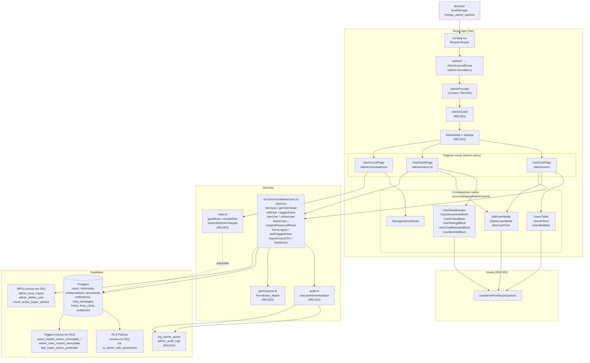

### 2.2 Princípios em ação — fluxo canônico

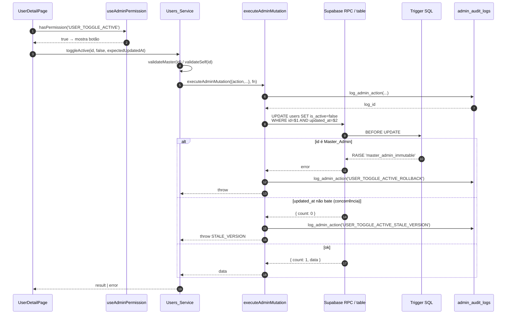

A trigger SQL é a **última barreira**: mesmo que `validateMaster` falhe no service (bug), o trigger ainda bloqueia. CP-12 valida essa redundância.

### 2.3 RLS reforçada

Toda query em `src/services/admin/users.ts` que toca `users`, `motoristas`, `embarcadores`, `documents`, `notifications` ou `chat_messages` é executada com o JWT do admin logado. As novas policies (Req 13) usam `is_admin_with_permission(action)`, que já consulta `admin_roles WHERE user_id = auth.uid() AND revoked_at IS NULL`. O resultado é simétrico em 4 cenários:

| Cenário | Resultado RLS |
|---|---|
| `auth.uid()` é motorista comum | 0 linhas (policy de app comum: `id = auth.uid()`) |
| `auth.uid()` é admin com `USER_VIEW` | Todas as linhas (nova policy admin) |
| `auth.uid()` é admin SUPORTE tentando `DELETE` em `users` | 0 linhas afetadas (silently denied) |
| `auth.uid()` é Master_Admin tentando alterar a si mesmo | trigger falha **antes** da policy (camada anterior) |


## 3. Componentes e Interfaces (TypeScript)

### 3.1 Mapa de arquivos novos

```
supabase/migrations/
├── 031_admin_users.sql                          # migration desta spec
└── 031_admin_users_rollback.sql                 # rollback documentado (não auto-aplicado)

src/services/admin/
└── users.ts                                     # NOVO — service único da spec

src/pages/admin/users/
├── UsersListPage.tsx                            # /admin/users
├── UserDetailPage.tsx                           # /admin/users/:id
└── AdminsListPage.tsx                           # /admin/users/admins

src/components/admin/users/
├── UsersTable.tsx
├── UsersFilters.tsx
├── UsersBulkBar.tsx
├── EditUserModal.tsx
├── DeleteUserModal.tsx
├── BanUserForm.tsx
├── ManageAdminModal.tsx
├── UserDetailHeader.tsx
├── UserDocumentsBlock.tsx
├── UserFretesBlock.tsx
├── UserRatingsBlock.tsx
├── UserChatMetadataBlock.tsx
└── UserBanInfoBlock.tsx

src/__tests__/admin/users/
├── masterImmutable.property.test.ts             # CP-1 (obrigatório)
├── toggleIdempotent.property.test.ts            # CP-2 (obrigatório)
├── auditByConstruction.property.test.ts         # CP-3
├── permissionVisibility.property.test.ts        # CP-4
├── lastSuperAdminProtected.property.test.ts     # CP-5
├── filtersRoundTrip.property.test.ts            # CP-6
├── csvRoundTrip.property.test.ts                # CP-7
├── bulkSkip.property.test.ts                    # CP-8
├── optimisticVersion.property.test.ts           # CP-9
├── searchNormalization.property.test.ts         # CP-10
├── statusClassification.property.test.ts        # CP-11
└── triggerServiceParity.test.ts                 # CP-12 (integração)
```

### 3.2 Wiring no `AdminLayoutRoute`

`src/components/admin/AdminLayoutRoute.tsx` ganha 3 rotas filhas dentro do bloco protegido por `AdminGuard`:

```tsx
// (esqueleto — apenas linhas adicionadas)
import UsersListPage from '../../pages/admin/users/UsersListPage';
import UserDetailPage from '../../pages/admin/users/UserDetailPage';
import AdminsListPage from '../../pages/admin/users/AdminsListPage';

<Route element={<AdminGuard />}>
  <Route element={<AdminShell />}>
    <Route index element={<AdminDashboardPage />} />
    <Route path="users" element={<UsersListPage />} />
    <Route path="users/admins" element={<AdminsListPage />} />
    <Route path="users/:id" element={<UserDetailPage />} />
    <Route path="audit" element={<AdminAuditPage />} />
    <Route path="perfil" element={<AdminProfilePage />} />
  </Route>
</Route>
```

> **Ordem importa.** `users/admins` precisa vir **antes** de `users/:id`, senão o react-router casa `:id = "admins"` e quebra. Validado em teste de roteamento da página.

### 3.3 `AdminSidebar`

O item "Usuários" já existe em `AdminSidebar.tsx` apontando para `/admin/users` com permissão `USER_VIEW` — **nenhuma alteração necessária**. As sub-rotas (`/admin/users/:id` e `/admin/users/admins`) navegam via links contextuais dentro das próprias páginas (botões "Voltar", aba "Admins" no header da listagem).

### 3.4 Contratos públicos: `src/services/admin/users.ts`

```ts
// src/services/admin/users.ts

import type { AdminRole } from './permissions';

// ===================== Tipos públicos =====================

export type UserType = 'motorista' | 'embarcador';
export type UserTypeFilter = 'todos' | UserType;
export type UserStatusFilter = 'todos' | 'ativo' | 'inativo' | 'banido';
export type UserSort = 'created_desc' | 'created_asc' | 'activity_desc' | 'activity_asc';

export interface UsersFilters {
  type: UserTypeFilter;       // default: 'todos'
  status: UserStatusFilter;   // default: 'todos'
  q: string;                  // busca livre, default: ''
  sort: UserSort;             // default: 'created_desc'
  page: number;               // 1-based, default: 1
  pageSize: number;           // fixo 25 nesta spec
}

export interface UserRow {
  id: string;
  user_type: UserType;
  name: string;
  phone: string;
  email: string | null;
  cpf: string | null;          // motorista
  cnpj: string | null;         // embarcador (via embarcadores.cnpj)
  company_name: string | null; // embarcador
  is_active: boolean;
  ban_reason: string | null;
  banned_at: string | null;
  profile_photo_url: string | null;
  created_at: string;
  last_activity_at: string | null;
  updated_at: string;          // usado em versionamento otimista
}

export interface UsersListResult {
  rows: UserRow[];
  total: number;               // total filtrado (sem paginar)
  page: number;
  pageSize: number;
}

// ===================== Detalhe consolidado =====================

export interface UserDocument {
  id: string;
  document_type: string;
  file_name: string;
  uploaded_at: string;
  signed_url: string | null;   // gerada sob demanda no bloco
  expires_at: string | null;
}

export interface UserFreteRow {
  id: string;
  origin: string;
  destination: string;
  status: string;
  created_at: string;
  clicked_at?: string;         // somente para motorista (frete_clicks)
}

export interface UserRatingRow {
  id: string;
  rating: number;
  comment: string | null;
  created_at: string;
  rater_name: string;
}

export interface UserChatMetadata {
  conversation_id: string;
  total_messages: number;
  last_message_at: string | null;
  last_admin_reply_at: string | null;
}

export interface UserDetailBundle {
  user: UserRow;
  location: { latitude: number; longitude: number } | null;
  documents: UserDocument[];
  fretes: UserFreteRow[];
  fretesTotal: number;
  ratings: UserRatingRow[];
  chat: UserChatMetadata[];
  // resultados parciais — cada bloco pode falhar isoladamente
  errors: Partial<Record<'documents' | 'fretes' | 'ratings' | 'chat' | 'location', string>>;
}

// ===================== Bulk =====================

export interface BulkResult {
  success: string[];           // userIds
  skipped: { id: string; reason: BulkSkipReason }[];
  failed: { id: string; reason: string }[];
}

export type BulkSkipReason =
  | 'MASTER_ADMIN_IMMUTABLE'
  | 'SELF_ACTION_FORBIDDEN'
  | 'ALREADY_IN_TARGET_STATE';

// ===================== Erros =====================

export type UsersErrorCode =
  | 'MASTER_ADMIN_IMMUTABLE'
  | 'SELF_ACTION_FORBIDDEN'
  | 'STALE_VERSION'
  | 'LAST_SUPER_ADMIN_PROTECTED'
  | 'NO_RECOVERY_CHANNEL'
  | 'PHONE_ALREADY_USED'
  | 'EMAIL_ALREADY_USED'
  | 'NOT_FOUND'
  | 'PERMISSION_DENIED'
  | 'BULK_LIMIT_EXCEEDED';

export class UsersServiceError extends Error {
  constructor(public code: UsersErrorCode, message?: string, public cause?: unknown) {
    super(message ?? code);
    this.name = 'UsersServiceError';
  }
}

// ===================== Edição =====================

export interface EditUserPayload {
  name: string;
  email: string | null;
  phone: string;
  cpf?: string | null;          // motorista
  cnpj?: string | null;         // embarcador
  company_name?: string | null; // embarcador
}

// ===================== Admins =====================

export interface AdminUserRow {
  id: string;
  name: string;
  admin_username: string | null;
  is_active: boolean;
  is_superuser: boolean;
  roles: AdminRole[];
  is_master: boolean;           // admin_username === 'Nexus_Vortex99'
  last_login_at: string | null; // de admin_audit_logs WHERE action='ADMIN_LOGIN_SUCCESS'
}

// ===================== Assinaturas =====================

export async function listUsers(
  filters: UsersFilters
): Promise<UsersListResult>;

export async function getUserDetail(id: string): Promise<UserDetailBundle>;

export async function editUser(
  id: string,
  data: EditUserPayload,
  expectedUpdatedAt: string
): Promise<UserRow>;

export async function toggleActive(
  id: string,
  targetState: boolean,
  expectedUpdatedAt: string
): Promise<UserRow>;

export async function banUser(
  id: string,
  reason: string,
  expectedUpdatedAt: string
): Promise<UserRow>;

export async function unbanUser(
  id: string,
  expectedUpdatedAt: string
): Promise<UserRow>;

export async function deleteUser(
  id: string,
  options: { confirmedName: string; cancelActiveFretes: boolean }
): Promise<{ deleted: true; cancelledFretes: number }>;

export async function requestPasswordReset(
  id: string
): Promise<{ channel: 'email' | 'sms' }>;

export async function forceLogout(id: string): Promise<{ revokedTokens: number }>;

export async function bulkToggleActive(
  ids: string[],
  targetState: boolean
): Promise<BulkResult>;

export async function exportUsersCSV(
  filters: UsersFilters
): Promise<{ csv: string; totalExported: number; truncated: boolean }>;

export async function listAdmins(): Promise<AdminUserRow[]>;

// ===================== URL ↔ filtros =====================

export function parseUsersFiltersFromQuery(qs: URLSearchParams | string): UsersFilters;
export function serializeUsersFiltersToQuery(filters: UsersFilters): URLSearchParams;

// ===================== Helpers puros (testáveis) =====================

export function classifyUserStatus(u: Pick<UserRow, 'is_active' | 'ban_reason'>):
  'ativo' | 'inativo' | 'banido';

export function normalizeDigits(s: string): string;     // remove tudo exceto \d

export function exportUsersToCsvString(rows: UserRow[]): string;

export function isMasterAdmin(u: { admin_username: string | null }): boolean;
```

### 3.5 Tabela de erros e UI

| Code | Origem | Mensagem UI (toast) |
|---|---|---|
| `MASTER_ADMIN_IMMUTABLE` | service (pre-check) ou trigger | `Master_Admin é imutável.` |
| `SELF_ACTION_FORBIDDEN` | service | `Não é permitido aplicar esta ação na própria conta.` |
| `STALE_VERSION` | service (count = 0 após `WHERE updated_at = ?`) | `Os dados foram alterados por outro admin. Recarregue antes de salvar.` (com botão `Recarregar`) |
| `LAST_SUPER_ADMIN_PROTECTED` | trigger SQL | `Não é possível revogar o último SUPER_ADMIN.` |
| `NO_RECOVERY_CHANNEL` | service | `Usuário não possui email nem telefone válido para reset.` |
| `PHONE_ALREADY_USED` | service (catch unique violation) | `Telefone já cadastrado em outra conta.` |
| `EMAIL_ALREADY_USED` | service (catch unique violation) | `Email já cadastrado em outra conta.` |
| `NOT_FOUND` | service | `Usuário não encontrado.` (se aparecer durante navegação, → Stealth404) |
| `PERMISSION_DENIED` | RLS retornou 0 linhas em mutação | `Operação não permitida.` |
| `BULK_LIMIT_EXCEEDED` | service | `Máximo de 200 por operação.` |

Todas as mensagens são em pt-BR e renderizadas via toast do `react-hot-toast` já em uso no projeto.

### 3.6 Páginas — props e estados

#### `UsersListPage`

```ts
// Sem props (página de rota). Usa useSearchParams() do react-router.
interface UsersListPageState {
  filters: UsersFilters;             // espelho de useSearchParams
  data: UsersListResult | null;
  loading: boolean;
  error: string | null;
  selectedIds: Set<string>;          // bulk selection
  bulkInProgress: { current: number; total: number } | null;
  bulkResult: BulkResult | null;     // mostrado em modal de resumo
  exporting: boolean;
}
```

#### `UserDetailPage`

```ts
// Path param: id (UUID v4).
interface UserDetailPageState {
  bundle: UserDetailBundle | null;
  loading: boolean;
  // Modais
  editing: boolean;
  deleting: boolean;
  banning: boolean;
  resetting: boolean;
  forcingLogout: boolean;
  // Erro top-level (página)
  fatalError: string | null;
}
```

#### `AdminsListPage`

```ts
interface AdminsListPageState {
  rows: AdminUserRow[];
  loading: boolean;
  managingId: string | null;       // id do admin com modal aberto
  realtimeUnsubscribe: (() => void) | null;
}
```

### 3.7 Componentes — contratos resumidos

```ts
// UsersTable
interface UsersTableProps {
  rows: UserRow[];
  loading: boolean;
  selectedIds: Set<string>;
  onToggleSelect: (id: string) => void;
  onToggleSelectAll: (checked: boolean) => void;
  canSelect: boolean;              // permissão USER_TOGGLE_ACTIVE
  isMasterAdminId: (id: string) => boolean;
  isSelfId: (id: string) => boolean;
}

// UsersFilters
interface UsersFiltersProps {
  filters: UsersFilters;
  onChange: (next: UsersFilters) => void;  // sempre reseta page=1 exceto pageSize
  totalFiltered: number;
}

// UsersBulkBar
interface UsersBulkBarProps {
  selectedCount: number;
  onActivate: () => void;
  onDeactivate: () => void;
  onClear: () => void;
  disabled?: boolean;              // selectedCount > 200
  inProgress?: { current: number; total: number };
}

// EditUserModal
interface EditUserModalProps {
  user: UserRow;
  onClose: () => void;
  onSaved: (updated: UserRow) => void;
}

// DeleteUserModal
interface DeleteUserModalProps {
  user: UserRow;
  activeFretesCount: number;       // pré-buscado no Detail
  onClose: () => void;
  onDeleted: () => void;
}

// BanUserForm (dentro do EditUserModal, aba "Moderação")
interface BanUserFormProps {
  user: UserRow;
  onSubmit: (reason: string) => Promise<void>;
  onUnban: () => Promise<void>;
}

// ManageAdminModal
interface ManageAdminModalProps {
  admin: AdminUserRow;
  selfId: string;
  totalActiveSuperAdmins: number;  // de count_active_super_admins()
  onClose: () => void;
  onChanged: () => void;           // re-fetch
}

// UserDetailHeader / UserDocumentsBlock / UserFretesBlock /
// UserRatingsBlock / UserChatMetadataBlock / UserBanInfoBlock
// → recebem o slice correspondente do UserDetailBundle
//   e exibem error/empty/loading isolados
```


## 4. Modelo de dados

### 4.1 Diagrama ER (deltas)

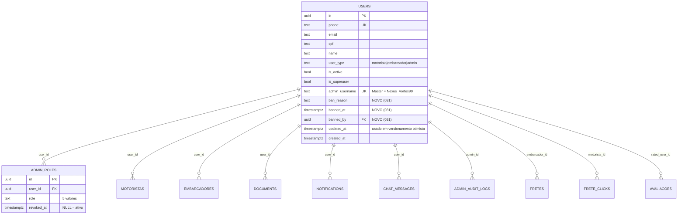

Apenas `users` recebe colunas novas. As policies são adicionadas em `users`, `motoristas`, `embarcadores`, `documents`, `notifications`, `chat_messages` mas o **schema** delas não muda. Os triggers novos vivem em `users` e `admin_roles`.

### 4.2 SQL completo: `031_admin_users.sql`

Toda a migration é envolta em `BEGIN; ... COMMIT;` e idempotente via `IF NOT EXISTS` / `CREATE OR REPLACE` / `DROP POLICY IF EXISTS`. O bloco `-- VERIFY` final faz smoke test.

#### 4.2.1 Cabeçalho e dependências

```sql
-- =====================================================
-- Migration 031: admin-users
--
-- Adiciona o módulo de gestão de usuários sobre a fundação
-- entregue em 030_admin_foundation.sql.
--
-- Componentes:
--   - users.ban_reason / banned_at / banned_by
--   - Triggers Master_Admin imutável (UPDATE / DELETE / admin_roles)
--   - Trigger Last_Super_Admin protegido
--   - count_active_super_admins() STABLE
--   - admin_force_logout(uuid) SECURITY DEFINER
--   - admin_delete_user(uuid) SECURITY DEFINER
--   - Policies RLS adicionais em users, motoristas, embarcadores,
--     documents, notifications, chat_messages
--
-- Dependências: migrations 001..030 aplicadas. Em particular:
--   - users.is_superuser, users.admin_username (030)
--   - admin_roles, admin_audit_logs (030)
--   - is_admin_with_permission(text) (030)
--   - log_admin_action(...) (030)
--
-- IMPORTANTE: Master_Admin é definido pelo username 'Nexus_Vortex99'.
-- Mudanças nesse username devem ser feitas via SQL direto desabilitando
-- temporariamente os triggers, e geram audit forense pós-evento.
--
-- Idempotente: pode ser reaplicada sem erros.
-- =====================================================

BEGIN;

-- Garante que a migration 030 está aplicada
DO $check$
BEGIN
  IF NOT EXISTS (
    SELECT 1 FROM information_schema.routines
    WHERE routine_schema = 'public' AND routine_name = 'is_admin_with_permission'
  ) THEN
    RAISE EXCEPTION 'Migration 030 (admin-foundation) não está aplicada';
  END IF;
END
$check$;
```

#### 4.2.2 Colunas `ban_reason`, `banned_at`, `banned_by` em `users`

```sql
ALTER TABLE users
  ADD COLUMN IF NOT EXISTS ban_reason  TEXT NULL,
  ADD COLUMN IF NOT EXISTS banned_at   TIMESTAMPTZ NULL,
  ADD COLUMN IF NOT EXISTS banned_by   UUID NULL REFERENCES users(id) ON DELETE SET NULL;

-- Constraint de coerência: ban_reason e banned_at andam juntos.
-- (banned_by pode ser NULL se o admin foi posteriormente excluído com SET NULL.)
ALTER TABLE users
  DROP CONSTRAINT IF EXISTS chk_users_ban_consistency;
ALTER TABLE users
  ADD  CONSTRAINT chk_users_ban_consistency
  CHECK (
    (ban_reason IS NULL AND banned_at IS NULL)
    OR
    (ban_reason IS NOT NULL AND banned_at IS NOT NULL)
  );

-- Índice usado no User_Status_Filter='banido'
CREATE INDEX IF NOT EXISTS idx_users_banned
  ON users(id) WHERE ban_reason IS NOT NULL;

-- Tamanho máximo do motivo (Req 18.5)
ALTER TABLE users
  DROP CONSTRAINT IF EXISTS chk_users_ban_reason_length;
ALTER TABLE users
  ADD  CONSTRAINT chk_users_ban_reason_length
  CHECK (ban_reason IS NULL OR char_length(ban_reason) <= 1000);
```

#### 4.2.3 Trigger `users_master_admin_immutable_update`

```sql
-- Bloqueia mudança de campos imutáveis do Master_Admin.
-- Atributos protegidos: is_active, is_superuser, admin_username, name.
-- Reset de senha, ban e force-logout do Master também são bloqueados
-- nas RPCs/services correspondentes (defesa em profundidade).
CREATE OR REPLACE FUNCTION users_master_admin_immutable_update()
RETURNS trigger
LANGUAGE plpgsql
SECURITY DEFINER
SET search_path = public
AS $func$
DECLARE
  v_master_username CONSTANT text := 'Nexus_Vortex99';
BEGIN
  IF OLD.admin_username IS NOT DISTINCT FROM v_master_username THEN
    IF (NEW.is_active        IS DISTINCT FROM OLD.is_active)
    OR (NEW.is_superuser     IS DISTINCT FROM OLD.is_superuser)
    OR (NEW.admin_username   IS DISTINCT FROM OLD.admin_username)
    OR (NEW.name             IS DISTINCT FROM OLD.name)
    OR (NEW.ban_reason       IS DISTINCT FROM OLD.ban_reason)
    OR (NEW.banned_at        IS DISTINCT FROM OLD.banned_at)
    THEN
      -- Audit forense (best-effort: log mesmo que mutação seja revertida em seguida)
      BEGIN
        PERFORM log_admin_action(
          'MASTER_ADMIN_IMMUTABLE_BLOCKED',
          'users',
          OLD.id::text,
          to_jsonb(OLD),
          to_jsonb(NEW),
          NULL, NULL
        );
      EXCEPTION WHEN OTHERS THEN
        -- Não falhar a trigger só pelo log; a barreira é o RAISE abaixo.
        NULL;
      END;
      RAISE EXCEPTION 'master_admin_immutable: cannot modify Master_Admin attributes'
        USING ERRCODE = 'P0001';
    END IF;
  END IF;
  RETURN NEW;
END;
$func$;

DROP TRIGGER IF EXISTS users_master_admin_immutable_update ON users;
CREATE TRIGGER users_master_admin_immutable_update
  BEFORE UPDATE ON users
  FOR EACH ROW EXECUTE FUNCTION users_master_admin_immutable_update();
```

#### 4.2.4 Trigger `users_master_admin_immutable_delete`

```sql
CREATE OR REPLACE FUNCTION users_master_admin_immutable_delete()
RETURNS trigger
LANGUAGE plpgsql
SECURITY DEFINER
SET search_path = public
AS $func$
DECLARE
  v_master_username CONSTANT text := 'Nexus_Vortex99';
BEGIN
  IF OLD.admin_username IS NOT DISTINCT FROM v_master_username THEN
    BEGIN
      PERFORM log_admin_action(
        'MASTER_ADMIN_IMMUTABLE_BLOCKED',
        'users',
        OLD.id::text,
        to_jsonb(OLD),
        jsonb_build_object('attempted', 'DELETE'),
        NULL, NULL
      );
    EXCEPTION WHEN OTHERS THEN NULL;
    END;
    RAISE EXCEPTION 'master_admin_immutable: cannot delete Master_Admin'
      USING ERRCODE = 'P0001';
  END IF;
  RETURN OLD;
END;
$func$;

DROP TRIGGER IF EXISTS users_master_admin_immutable_delete ON users;
CREATE TRIGGER users_master_admin_immutable_delete
  BEFORE DELETE ON users
  FOR EACH ROW EXECUTE FUNCTION users_master_admin_immutable_delete();
```

#### 4.2.5 Trigger `admin_roles_master_immutable`

```sql
-- Bloqueia revogação do papel SUPER_ADMIN do Master_Admin (UPDATE setando revoked_at).
-- Não bloqueia INSERT em outros papéis para o Master, mas todas as permissões já
-- são implicitamente concedidas a SUPER_ADMIN, então grant adicional é no-op
-- (e o índice único uq_admin_roles_active também rejeitaria duplicata).
CREATE OR REPLACE FUNCTION admin_roles_master_immutable()
RETURNS trigger
LANGUAGE plpgsql
SECURITY DEFINER
SET search_path = public
AS $func$
DECLARE
  v_master_id uuid;
BEGIN
  SELECT u.id INTO v_master_id
  FROM users u
  WHERE u.admin_username = 'Nexus_Vortex99'
  LIMIT 1;

  IF v_master_id IS NULL THEN
    -- Master ainda não criado (bootstrap): nada a proteger.
    RETURN NEW;
  END IF;

  IF NEW.user_id = v_master_id
     AND NEW.role = 'SUPER_ADMIN'
     AND NEW.revoked_at IS NOT NULL
     AND OLD.revoked_at IS NULL THEN
    BEGIN
      PERFORM log_admin_action(
        'MASTER_ADMIN_IMMUTABLE_BLOCKED',
        'admin_roles',
        OLD.id::text,
        to_jsonb(OLD),
        to_jsonb(NEW),
        NULL, NULL
      );
    EXCEPTION WHEN OTHERS THEN NULL;
    END;
    RAISE EXCEPTION 'master_admin_immutable: cannot revoke Master_Admin SUPER_ADMIN role'
      USING ERRCODE = 'P0001';
  END IF;

  RETURN NEW;
END;
$func$;

DROP TRIGGER IF EXISTS admin_roles_master_immutable ON admin_roles;
CREATE TRIGGER admin_roles_master_immutable
  BEFORE UPDATE ON admin_roles
  FOR EACH ROW EXECUTE FUNCTION admin_roles_master_immutable();
```

#### 4.2.6 Função `count_active_super_admins()`

```sql
CREATE OR REPLACE FUNCTION count_active_super_admins()
RETURNS integer
LANGUAGE sql
STABLE
SECURITY DEFINER
SET search_path = public
AS $func$
  SELECT COUNT(*)::integer
  FROM admin_roles
  WHERE role = 'SUPER_ADMIN'
    AND revoked_at IS NULL;
$func$;

REVOKE ALL ON FUNCTION count_active_super_admins() FROM PUBLIC;
GRANT EXECUTE ON FUNCTION count_active_super_admins() TO authenticated;
```

#### 4.2.7 Trigger `last_super_admin_protected`

```sql
-- Falha ao tentar revogar o último registro ativo de SUPER_ADMIN.
-- "Último" = ao passar revoked_at de NULL para timestamp,
-- não restará nenhum outro registro com role=SUPER_ADMIN AND revoked_at IS NULL.
-- A trigger usa SELECT FOR UPDATE NOTHING não, mas confia no lock implícito do UPDATE
-- + na trigger executar BEFORE — em alta concorrência ainda há risco de TOCTOU
-- (dois admins revogando 2 SUPER_ADMINs simultaneamente). Mitigação: combinar
-- com um advisory lock (ver §12 Riscos).
CREATE OR REPLACE FUNCTION last_super_admin_protected()
RETURNS trigger
LANGUAGE plpgsql
SECURITY DEFINER
SET search_path = public
AS $func$
DECLARE
  v_remaining integer;
BEGIN
  IF OLD.role = 'SUPER_ADMIN'
     AND OLD.revoked_at IS NULL
     AND NEW.revoked_at IS NOT NULL THEN
    -- Conta excluindo o próprio registro que está sendo revogado.
    SELECT COUNT(*) INTO v_remaining
    FROM admin_roles
    WHERE role = 'SUPER_ADMIN'
      AND revoked_at IS NULL
      AND id <> OLD.id;

    IF v_remaining = 0 THEN
      RAISE EXCEPTION 'last_super_admin_protected: cannot revoke the last active SUPER_ADMIN'
        USING ERRCODE = 'P0001';
    END IF;
  END IF;
  RETURN NEW;
END;
$func$;

DROP TRIGGER IF EXISTS last_super_admin_protected ON admin_roles;
CREATE TRIGGER last_super_admin_protected
  BEFORE UPDATE ON admin_roles
  FOR EACH ROW EXECUTE FUNCTION last_super_admin_protected();
```

#### 4.2.8 Função `admin_force_logout(p_user_id uuid)`

```sql
-- Revoga refresh tokens do usuário-alvo em auth.refresh_tokens.
-- Verifica permissão USER_EDIT do caller. Bloqueia Master_Admin e self.
CREATE OR REPLACE FUNCTION admin_force_logout(p_user_id uuid)
RETURNS void
LANGUAGE plpgsql
SECURITY DEFINER
SET search_path = public, auth
AS $func$
DECLARE
  v_caller     uuid := auth.uid();
  v_target_un  text;
BEGIN
  IF v_caller IS NULL THEN
    RAISE EXCEPTION 'admin_force_logout requires authenticated session';
  END IF;
  IF NOT is_admin_with_permission('USER_EDIT') THEN
    RAISE EXCEPTION 'permission_denied: USER_EDIT required';
  END IF;
  IF p_user_id = v_caller THEN
    RAISE EXCEPTION 'self_action_forbidden';
  END IF;

  SELECT admin_username INTO v_target_un
  FROM users WHERE id = p_user_id;

  IF v_target_un = 'Nexus_Vortex99' THEN
    RAISE EXCEPTION 'master_admin_immutable';
  END IF;

  -- Revoga todos os refresh tokens do usuário.
  UPDATE auth.refresh_tokens
     SET revoked = true
   WHERE user_id = p_user_id
     AND revoked = false;

  PERFORM log_admin_action(
    'USER_FORCE_LOGOUT',
    'users',
    p_user_id::text,
    NULL,
    jsonb_build_object('revoked_at', now()),
    NULL, NULL
  );
END;
$func$;

REVOKE ALL ON FUNCTION admin_force_logout(uuid) FROM PUBLIC;
GRANT EXECUTE ON FUNCTION admin_force_logout(uuid) TO authenticated;
```

> **Nota.** O service `users.ts` chama esta RPC via `supabase.rpc('admin_force_logout', { p_user_id: id })`. O wrapping de `executeAdminMutation` ainda é usado no service para gerar audit log no fluxo TypeScript (defesa em profundidade: se a RPC for invocada diretamente, ela mesma já loga). Resultado: 1 audit log via service + 1 via RPC quando ambos rodam — isto é tolerado e detectado em CP-3 (que aceita "≥1 log com a action").

#### 4.2.9 Função `admin_delete_user(p_user_id uuid)`

```sql
-- Cancela fretes ativos do embarcador (1 audit log por frete) e deleta o usuário
-- via cascade. Bloqueia Master_Admin e self. Returns counters em jsonb.
CREATE OR REPLACE FUNCTION admin_delete_user(p_user_id uuid)
RETURNS jsonb
LANGUAGE plpgsql
SECURITY DEFINER
SET search_path = public
AS $func$
DECLARE
  v_caller         uuid := auth.uid();
  v_target_un      text;
  v_cancelled      integer := 0;
  v_target_type    text;
  v_frete_id       uuid;
BEGIN
  IF v_caller IS NULL THEN
    RAISE EXCEPTION 'admin_delete_user requires authenticated session';
  END IF;
  IF NOT is_admin_with_permission('USER_DELETE') THEN
    RAISE EXCEPTION 'permission_denied: USER_DELETE required';
  END IF;
  IF p_user_id = v_caller THEN
    RAISE EXCEPTION 'self_action_forbidden';
  END IF;

  SELECT admin_username, user_type
    INTO v_target_un, v_target_type
  FROM users WHERE id = p_user_id;

  IF NOT FOUND THEN
    RAISE EXCEPTION 'not_found';
  END IF;

  IF v_target_un = 'Nexus_Vortex99' THEN
    RAISE EXCEPTION 'master_admin_immutable';
  END IF;

  -- Cancela fretes ativos do embarcador, 1 log por frete.
  IF v_target_type = 'embarcador' THEN
    FOR v_frete_id IN
      SELECT id FROM fretes
      WHERE embarcador_id = p_user_id AND status = 'ativo'
      FOR UPDATE
    LOOP
      UPDATE fretes SET status = 'cancelado' WHERE id = v_frete_id;
      v_cancelled := v_cancelled + 1;
      PERFORM log_admin_action(
        'FRETE_AUTO_CANCEL',
        'fretes',
        v_frete_id::text,
        jsonb_build_object('status', 'ativo', 'reason', 'user_delete_cascade'),
        jsonb_build_object('status', 'cancelado'),
        NULL, NULL
      );
    END LOOP;
  END IF;

  -- DELETE com cascade já configurado (motoristas, embarcadores, documents,
  -- notifications, chat_messages, frete_clicks, avaliacoes, admin_roles).
  -- A trigger users_master_admin_immutable_delete é redundante mas mantida.
  DELETE FROM users WHERE id = p_user_id;

  RETURN jsonb_build_object(
    'deleted', true,
    'cancelled_fretes', v_cancelled
  );
END;
$func$;

REVOKE ALL ON FUNCTION admin_delete_user(uuid) FROM PUBLIC;
GRANT EXECUTE ON FUNCTION admin_delete_user(uuid) TO authenticated;
```

#### 4.2.10 Policies RLS adicionais

A estratégia é **policies separadas** (não combinar com OR no `USING` existente) para preservar a policy do app comum intacta. Toda nova policy é `DROP POLICY IF EXISTS` + `CREATE POLICY` para idempotência.

```sql
-- ========== users ==========
DROP POLICY IF EXISTS users_admin_select ON users;
CREATE POLICY users_admin_select ON users
  FOR SELECT TO authenticated
  USING (is_admin_with_permission('USER_VIEW'));

DROP POLICY IF EXISTS users_admin_update ON users;
CREATE POLICY users_admin_update ON users
  FOR UPDATE TO authenticated
  USING (
    is_admin_with_permission('USER_EDIT')
    OR is_admin_with_permission('USER_TOGGLE_ACTIVE')
  )
  WITH CHECK (
    is_admin_with_permission('USER_EDIT')
    OR is_admin_with_permission('USER_TOGGLE_ACTIVE')
  );

DROP POLICY IF EXISTS users_admin_delete ON users;
CREATE POLICY users_admin_delete ON users
  FOR DELETE TO authenticated
  USING (is_admin_with_permission('USER_DELETE'));

-- ========== motoristas / embarcadores ==========
DROP POLICY IF EXISTS motoristas_admin_select ON motoristas;
CREATE POLICY motoristas_admin_select ON motoristas
  FOR SELECT TO authenticated
  USING (is_admin_with_permission('USER_VIEW'));

DROP POLICY IF EXISTS motoristas_admin_update ON motoristas;
CREATE POLICY motoristas_admin_update ON motoristas
  FOR UPDATE TO authenticated
  USING (is_admin_with_permission('USER_EDIT'))
  WITH CHECK (is_admin_with_permission('USER_EDIT'));

DROP POLICY IF EXISTS motoristas_admin_delete ON motoristas;
CREATE POLICY motoristas_admin_delete ON motoristas
  FOR DELETE TO authenticated
  USING (is_admin_with_permission('USER_DELETE'));

DROP POLICY IF EXISTS embarcadores_admin_select ON embarcadores;
CREATE POLICY embarcadores_admin_select ON embarcadores
  FOR SELECT TO authenticated
  USING (is_admin_with_permission('USER_VIEW'));

DROP POLICY IF EXISTS embarcadores_admin_update ON embarcadores;
CREATE POLICY embarcadores_admin_update ON embarcadores
  FOR UPDATE TO authenticated
  USING (is_admin_with_permission('USER_EDIT'))
  WITH CHECK (is_admin_with_permission('USER_EDIT'));

DROP POLICY IF EXISTS embarcadores_admin_delete ON embarcadores;
CREATE POLICY embarcadores_admin_delete ON embarcadores
  FOR DELETE TO authenticated
  USING (is_admin_with_permission('USER_DELETE'));

-- ========== documents ==========
DROP POLICY IF EXISTS documents_admin_select ON documents;
CREATE POLICY documents_admin_select ON documents
  FOR SELECT TO authenticated
  USING (is_admin_with_permission('USER_VIEW'));

-- ========== notifications ==========
DROP POLICY IF EXISTS notifications_admin_select ON notifications;
CREATE POLICY notifications_admin_select ON notifications
  FOR SELECT TO authenticated
  USING (is_admin_with_permission('USER_VIEW'));

-- ========== chat_messages (apenas SELECT — conteúdo só com SUPORTE_REPLY) ==========
DROP POLICY IF EXISTS chat_messages_admin_select ON chat_messages;
CREATE POLICY chat_messages_admin_select ON chat_messages
  FOR SELECT TO authenticated
  USING (is_admin_with_permission('SUPORTE_REPLY'));
-- Para metadados agregados (count, last_message_at), o User_Detail_Page
-- usa uma view ou função SECURITY DEFINER que conta sem expor conteúdo.
-- Esta função vive em uma spec futura (admin-suporte) caso a metadata
-- não possa ser obtida via SELECT direto. Para esta spec, usamos
-- USER_VIEW para exigência mínima:
DROP POLICY IF EXISTS chat_messages_admin_metadata ON chat_messages;
CREATE POLICY chat_messages_admin_metadata ON chat_messages
  FOR SELECT TO authenticated
  USING (
    is_admin_with_permission('USER_VIEW')
    -- Reforço de minimização: o front desta spec apenas lê id, conversation_id,
    -- created_at, sender_id (sem 'content' nem 'attachments') na agregação.
    -- A barreira de conteúdo é responsabilidade da spec admin-suporte.
  );
```

> **Política `chat_messages`.** Esta spec precisa de **metadados** (contagem, datas), o que requer `SELECT` para admins com `USER_VIEW`. Conteúdo (`content`, `attachments`) é minimizado **no front** — o service só requisita as colunas necessárias. A spec `admin-suporte` (futura) tornará a separação física via view/RPC dedicada. Este compromisso é documentado em §12 Riscos.

#### 4.2.11 Bloco `-- VERIFY` final

```sql
-- =====================================================
-- VERIFY: smoke test pós-deploy. Executar manualmente após
-- aplicar a migration. Todos os SELECTs devem retornar
-- conforme esperado nos comentários.
-- =====================================================

-- 1. Colunas novas em users
SELECT column_name, data_type, is_nullable
FROM information_schema.columns
WHERE table_schema = 'public' AND table_name = 'users'
  AND column_name IN ('ban_reason','banned_at','banned_by');
-- Esperado: 3 linhas

-- 2. Triggers Master_Admin
SELECT tgname FROM pg_trigger
WHERE tgname IN (
  'users_master_admin_immutable_update',
  'users_master_admin_immutable_delete',
  'admin_roles_master_immutable',
  'last_super_admin_protected'
);
-- Esperado: 4 linhas

-- 3. Funções novas
SELECT proname FROM pg_proc
WHERE proname IN (
  'count_active_super_admins',
  'admin_force_logout',
  'admin_delete_user',
  'users_master_admin_immutable_update',
  'users_master_admin_immutable_delete',
  'admin_roles_master_immutable',
  'last_super_admin_protected'
);
-- Esperado: 7 linhas

-- 4. Policies RLS adicionais
SELECT schemaname, tablename, policyname
FROM pg_policies
WHERE policyname IN (
  'users_admin_select','users_admin_update','users_admin_delete',
  'motoristas_admin_select','motoristas_admin_update','motoristas_admin_delete',
  'embarcadores_admin_select','embarcadores_admin_update','embarcadores_admin_delete',
  'documents_admin_select','notifications_admin_select',
  'chat_messages_admin_metadata'
)
ORDER BY tablename, policyname;
-- Esperado: 12 linhas

-- 5. count_active_super_admins() devolve >= 1 em produção (Master_Admin existe)
SELECT count_active_super_admins() AS active_super_admins;
-- Esperado: >= 1

COMMIT;
```


## 5. Permission_Matrix aplicada à spec

A `Permission_Matrix` é fonte única (`src/services/admin/permissions.ts`, espelhada em `is_admin_with_permission`). A tabela abaixo materializa **apenas** as ações relevantes a esta spec:

| Ação | SUPER_ADMIN | ADMIN | SUPORTE | FINANCEIRO | MODERADOR |
|---|:---:|:---:|:---:|:---:|:---:|
| `USER_VIEW` (lista, detalhe, admins-list visível?) | ✅ | ✅ | ✅ | ✅ | ✅ |
| `USER_TOGGLE_ACTIVE` (ativar/desativar/banir/desbanir) | ✅ | ✅ | ✅ | ❌ | ❌ |
| `USER_EDIT` (editar dados, force logout, password reset) | ✅ | ✅ | ❌ | ❌ | ❌ |
| `USER_DELETE` (excluir conta) | ✅ | ❌ | ❌ | ❌ | ❌ |
| `ADMIN_ROLE_GRANT` (acessar `/admin/users/admins`, conceder papel) | ✅ | ❌ | ❌ | ❌ | ❌ |
| `ADMIN_ROLE_REVOKE` (revogar papel) | ✅ | ❌ | ❌ | ❌ | ❌ |
| `AUDIT_VIEW` (links cruzados para auditoria) | ✅ | ✅ | ❌ | ✅ | ❌ |
| `SUPORTE_REPLY` (link "Abrir conversa" no bloco Chat — fica disabled aqui) | ✅ | ✅ | ✅ | ❌ | ❌ |

Consequências práticas:

- `MODERADOR` vê a lista, abre detalhe, mas **não vê** nenhum botão de ação destrutiva. Vê o bloco `Banimento` em modo readonly.
- `FINANCEIRO` é equivalente a `MODERADOR` aqui (apenas `USER_VIEW`). Em outras specs ele tem mais poder.
- `SUPORTE` pode ativar/desativar/banir, mas não editar dados nem excluir.
- `ADMIN` é equivalente a `SUPER_ADMIN` exceto em `USER_DELETE` e gestão de papéis.
- `SUPER_ADMIN` vê tudo, incluindo a aba `/admin/users/admins`.

A página `/admin/users/admins` é a **única** do projeto cuja permissão de acesso é `ADMIN_ROLE_GRANT`. Isto está acoplado ao `AdminGuard` indiretamente: o Guard valida sessão; o gating fino é responsabilidade da própria página, que renderiza `<Stealth404 />` quando `!hasPermission('ADMIN_ROLE_GRANT')`.

```tsx
// AdminsListPage.tsx (esqueleto do gating)
const { hasPermission } = useAdminContext();
if (!hasPermission('ADMIN_ROLE_GRANT')) {
  return <Stealth404 />;
}
```

CP-4 valida que a tabela acima é exatamente o que a UI exibe.

## 6. Fluxos

### 6.1 Listagem `/admin/users` com filtros

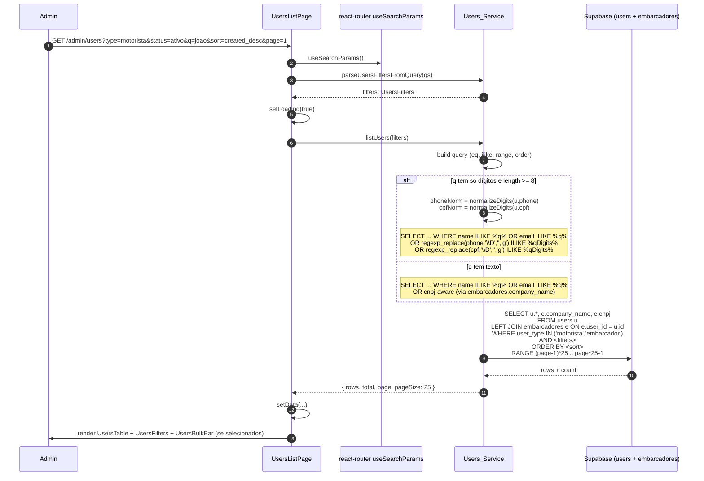

Mudança de filtro:

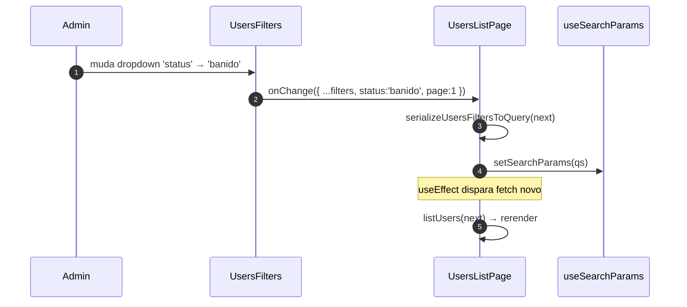

Debounce de 300ms só se aplica ao campo `q` (busca livre). Mudança em dropdowns dispara imediatamente.

### 6.2 Edição com versionamento otimista

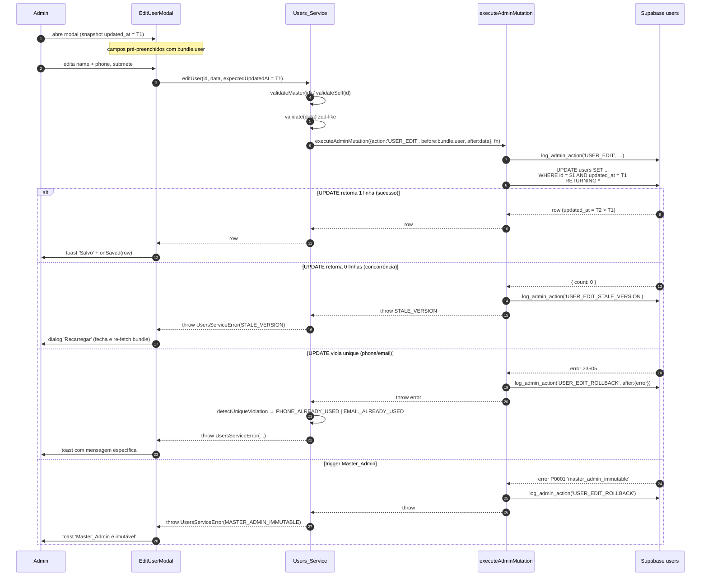

### 6.3 Exclusão com fretes ativos (cascade controlado)

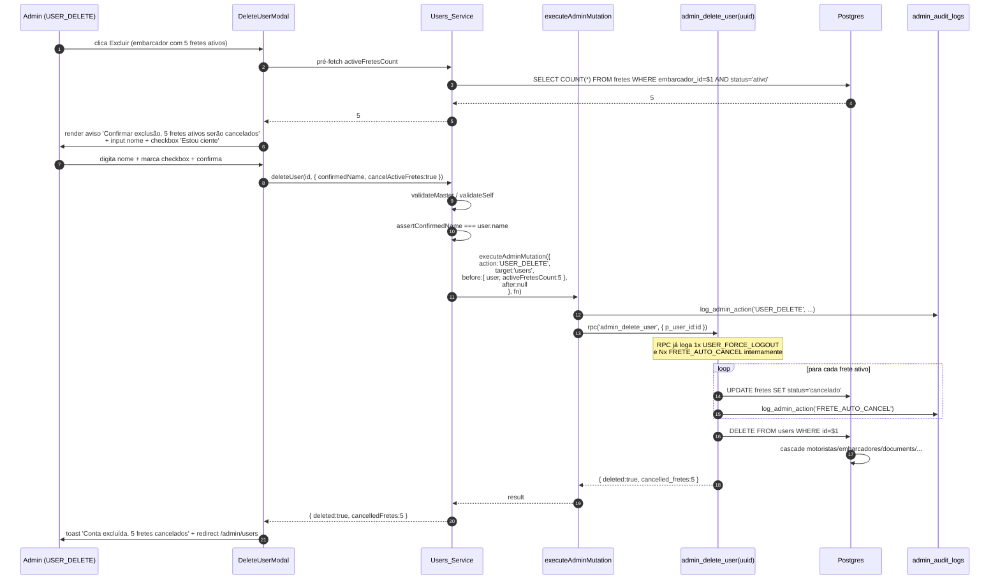

> **Observação sobre logs duplicados.** O fluxo gera potencialmente 2 logs `USER_DELETE` (1 do EAM + 1 da RPC se chamássemos `log_admin_action` lá dentro também). A RPC `admin_delete_user` **não** loga `USER_DELETE` — apenas os eventos derivados (`FRETE_AUTO_CANCEL`). O log principal é responsabilidade do EAM. Esta separação é validada por CP-3.

### 6.4 Tentativa de mutar Master_Admin — 3 camadas de defesa

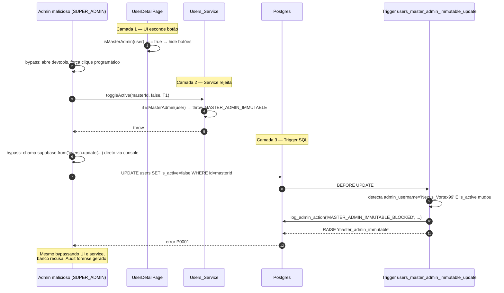

CP-1 valida camadas 1 e 2 (TS). CP-12 valida que camada 3 está em paridade com camada 2 (qualquer ação bloqueada no service também é bloqueada no banco).

### 6.5 Tentativa de revogar Last_Super_Admin

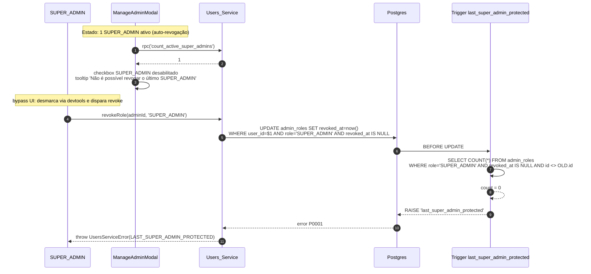

CP-5 valida o invariante: para todo cenário com 1 ativo, revoke falha; para 2+, sucede.

### 6.6 Bulk action

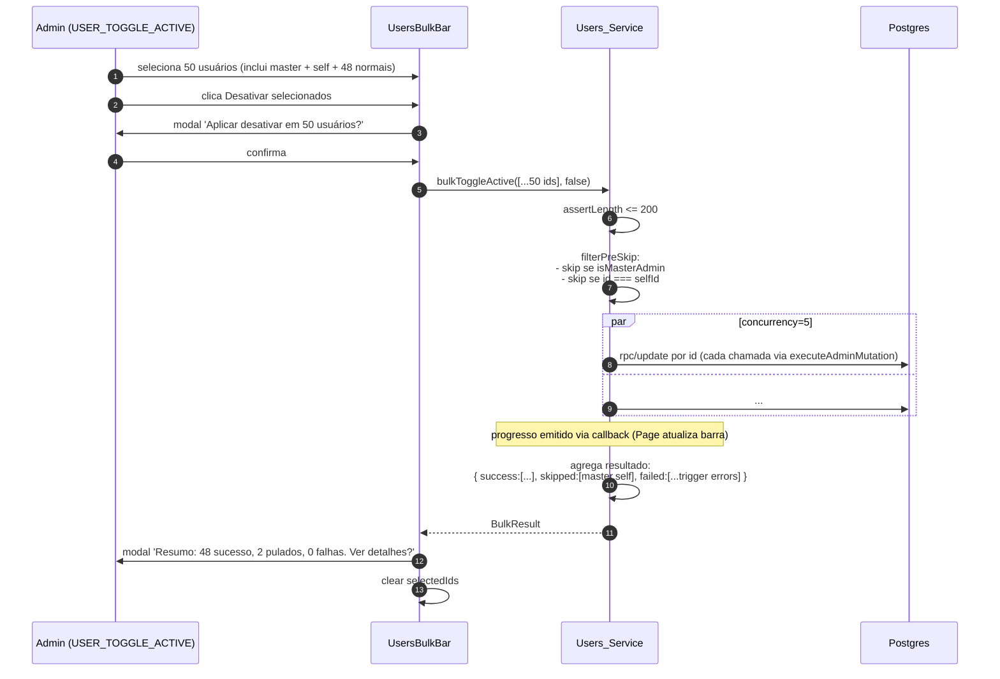

Implementação da concorrência:

```ts
// Esqueleto de bulkToggleActive — pseudo-código
async function bulkToggleActive(ids: string[], targetState: boolean) {
  if (ids.length > 200) throw new UsersServiceError('BULK_LIMIT_EXCEEDED');

  const { masterId, selfId } = await loadGuardIds();
  const tasks = ids.map((id) => async () => {
    if (isMasterAdminId(id, masterId)) return { kind: 'skipped', id, reason: 'MASTER_ADMIN_IMMUTABLE' };
    if (id === selfId) return { kind: 'skipped', id, reason: 'SELF_ACTION_FORBIDDEN' };
    try {
      // toggleActive interno SEM expectedUpdatedAt (idempotente — Req 17.6)
      await executeAdminMutation(
        { action: targetState ? 'USER_TOGGLE_ACTIVE' : 'USER_TOGGLE_ACTIVE',
          targetType: 'users', targetId: id,
          before: { is_active: !targetState }, after: { is_active: targetState } },
        async () => {
          const { error } = await supabase
            .from('users').update({ is_active: targetState }).eq('id', id);
          if (error) throw error;
        }
      );
      return { kind: 'success', id };
    } catch (err) {
      // executeAdminMutation já gravou *_ROLLBACK
      return { kind: 'failed', id, reason: (err as Error).message };
    }
  });

  return await runWithConcurrency(tasks, 5);
}
```

CP-8 valida o invariante de skip de master e self.

### 6.7 Force logout via RPC

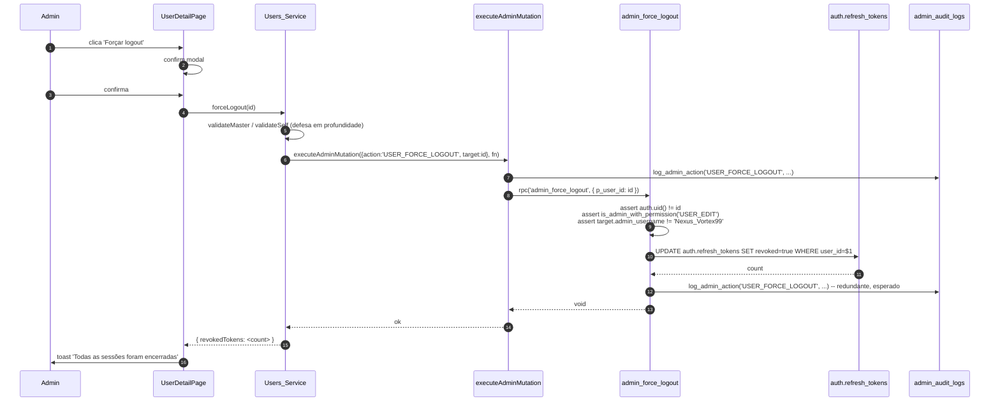


## 7. Detalhamento de UI

Todos os textos abaixo são em pt-BR. Estilo: tema dark do admin (mesmo do `AdminShell`), classes Tailwind já em uso (`bg-gray-950`, `text-gray-200`, `border-gray-800`, etc).

### 7.1 `UsersListPage` — `/admin/users`

```
┌─────────────────────────────────────────────────────────────────────┐
│ Usuários                                       [Admins] [Exportar CSV]│
│ Total: 1.247 usuários (filtrados)                                    │
├─────────────────────────────────────────────────────────────────────┤
│ Tipo: [Todos ▾]  Status: [Todos ▾]  Ordenar: [Mais recentes ▾]      │
│ Buscar: [_______________________________] (ícone lupa)               │
├─────────────────────────────────────────────────────────────────────┤
│ ☐ │ Foto │ Nome           │ Tipo       │ Telefone   │ Status │ ⋯   │
├───┼──────┼────────────────┼────────────┼────────────┼────────┼─────┤
│ ☐ │ 🟢   │ João da Silva  │ Motorista  │ (11) 9...  │ Ativo  │ →   │
│ ☐ │ 🟡   │ Acme Logística │ Embarcador │ (21) 9...  │ Banido │ →   │
│ ...                                                                  │
├─────────────────────────────────────────────────────────────────────┤
│ Página 1 de 50          [<] 1 2 3 ... 50 [>]                         │
└─────────────────────────────────────────────────────────────────────┘
```

**Estados:**

- **Loading inicial.** Skeleton de 25 linhas com `aria-busy="true"` no `<tbody>`. Filtros mantêm-se interativos (mas botões de ação desabilitados).
- **Loading de mudança de filtro.** Mantém linhas anteriores com opacidade 0.5 (não vai para skeleton, evita flicker).
- **Erro de rede.** Banner vermelho `Não foi possível carregar usuários.` + botão `Tentar novamente`.
- **Vazio.** `<div role="status">Nenhum usuário encontrado com os filtros atuais.</div>`.
- **Bulk em progresso.** Barra superior `Processando [K] de [N]...` + spinner. Filtros e tabela bloqueados.
- **Bulk concluído.** Modal `Resumo: 45 sucesso, 3 pulados, 2 falhas` com link `Ver detalhes` que abre lista expansível dos pulados/falhos com motivos.

**Atalhos de teclado:**

- `/` foca o input de busca.
- `Esc` no input de busca limpa o `q`.
- `Shift+Click` em uma linha selecionada estende seleção até a linha clicada.
- `Ctrl+A` quando o foco está na tabela seleciona todos da página atual.

**Acessibilidade:**

- `<table>` com `<caption className="sr-only">Lista de usuários do FreteGO</caption>`.
- `<th scope="col">` em todas as colunas.
- Checkbox de header com `aria-label="Selecionar todos os usuários da página"`.
- Cada checkbox de linha com `aria-label={`Selecionar ${user.name}`}`.
- Botão de exportar com `aria-label="Exportar lista filtrada para CSV"`.
- Linhas focáveis via `tabIndex={0}` com `Enter` para abrir detalhe.

### 7.2 `UserDetailPage` — `/admin/users/:id`

Layout em 2 colunas em desktop (1/3 + 2/3), 1 coluna em mobile:

```
┌─────────────────────────────────────────────────────────────────────┐
│ ← Voltar                                                              │
│ ┌─────────────┐  ┌────────────────────────────────────────────────┐ │
│ │             │  │ João da Silva                    [⏰ Banido]   │ │
│ │   👤 Foto   │  │ Motorista · CPF 123.***.***-12                 │ │
│ │             │  │ Telefone: (11) 99999-9999                       │ │
│ │  [Editar]   │  │ Email: joao@example.com                         │ │
│ │  [Banir]    │  │ Cadastrado em: 12/03/2024                       │ │
│ │  [Reset...]  │  │ Última atividade: há 2 dias                     │ │
│ │  [Logout..]  │  └────────────────────────────────────────────────┘ │
│ │  [Excluir]  │                                                       │
│ └─────────────┘                                                       │
├─────────────────────────────────────────────────────────────────────┤
│ [Documentos] (5)              ▾                                       │
│   • CNH.pdf    (carregado em 12/03/24)  [Ver]                        │
│   • ANTT.pdf   (carregado em 13/03/24)  [Ver]                        │
│   ...                                                                 │
├─────────────────────────────────────────────────────────────────────┤
│ [Localização]                                                         │
│   📍 -23.55, -46.63   (mini-mapa estático)                           │
├─────────────────────────────────────────────────────────────────────┤
│ [Fretes Clicados] (12)         ▾                                      │
│   • 12/03/24  São Paulo → Rio de Janeiro  (ativo)                    │
│   ...                                                                 │
├─────────────────────────────────────────────────────────────────────┤
│ [Avaliações Recebidas] (3.4 ★ · 27 avaliações)  ▾                    │
│   • ★★★★☆  "Pontual e cuidadoso"   — Acme · 03/03/24                 │
├─────────────────────────────────────────────────────────────────────┤
│ [Mensagens] (4 conversas)       ▾                                     │
│   • Conversa #abc · 23 msgs · última 02/04/24    [Abrir conversa*]   │
│     * Disponível na spec admin-suporte                                │
├─────────────────────────────────────────────────────────────────────┤
│ [Banimento] (visível só se banido)                                    │
│   Motivo: Fraude documental                                           │
│   Banido em: 04/04/24 14:32                                           │
│   Por: Bruno Henrique (Master_Admin)                                  │
│   [Desbanir]                                                          │
└─────────────────────────────────────────────────────────────────────┘
```

**Estados:**

- **Loading.** Skeleton em cada bloco isoladamente. Cabeçalho carrega primeiro.
- **Erro parcial.** Cada bloco tem fallback `Não foi possível carregar [bloco]. [Tentar novamente]` sem afetar os outros.
- **Stealth 404.** Renderizado quando `:id` é UUID inválido, ou retorna 404 do `getUserDetail`, ou se `user_type === 'admin'` (admins têm página própria em `/admin/users/admins`).
- **Banimento.** Bloco aparece com borda vermelha discreta `border-red-900/40` quando `ban_reason` está presente.

**Visibilidade dos botões (CP-4):**

| Botão | Permissão | Esconde quando target = master | Esconde quando target = self |
|---|---|---|---|
| Editar | `USER_EDIT` | sim | não |
| Forçar reset de senha | `USER_EDIT` | sim | não |
| Forçar logout | `USER_EDIT` | sim | sim |
| Banir / Desativar | `USER_TOGGLE_ACTIVE` | sim | sim |
| Desbanir / Ativar | `USER_TOGGLE_ACTIVE` | sim | sim |
| Excluir conta | `USER_DELETE` | sim | sim |

### 7.3 `EditUserModal`

Modal centrado com 2 abas: `Dados` e `Moderação`. Aba `Moderação` só visível com `USER_TOGGLE_ACTIVE`.

```
┌────────────────────────────────────────────────┐
│ Editar usuário                              [×]│
│ [Dados] [Moderação]                            │
├────────────────────────────────────────────────┤
│ Nome*       [João da Silva____________]        │
│ Telefone*   [+55 11 99999-9999________]        │
│ Email       [joao@example.com________]        │
│ CPF         [123.456.789-00___________]        │
│                                                 │
│ (somente embarcador)                           │
│ Razão social*  [_______________]               │
│ CNPJ           [_______________]               │
├────────────────────────────────────────────────┤
│                       [Cancelar]  [Salvar]     │
└────────────────────────────────────────────────┘
```

- `role="dialog"`, `aria-modal="true"`, `aria-labelledby="edit-user-title"`.
- Foco inicial em `Cancelar` (Req 20.4).
- Mensagens de erro por campo via `<span role="alert">` abaixo do input.
- Validação antes de submit: `name 3..255`, `email RFC 5322`, `phone /^\+?\d{10,15}$/` após `normalizeDigits`, `cpf` 11 dígitos com módulo 11, `cnpj` 14 dígitos com módulo 11.
- Em caso de `STALE_VERSION`, modal substitui conteúdo por:
  ```
  ⚠ Os dados foram alterados por outro admin.
  Recarregue antes de salvar para ver os dados atuais.
  [Cancelar] [Recarregar]
  ```
  `Recarregar` fecha o modal e dispara `getUserDetail(id)` no parent.

### 7.4 `DeleteUserModal`

```
┌────────────────────────────────────────────────┐
│ ⚠ Excluir conta                             [×]│
├────────────────────────────────────────────────┤
│ Esta ação é irreversível. Todos os dados deste │
│ usuário serão removidos.                       │
│                                                 │
│ (Para embarcadores com fretes ativos:)         │
│ Esta conta possui 5 fretes ativos.              │
│ ☐ Estou ciente de que 5 fretes ativos serão   │
│   cancelados.                                   │
│                                                 │
│ Para confirmar, digite o nome exato:           │
│ "João da Silva"                                 │
│ [____________________________________________] │
├────────────────────────────────────────────────┤
│                  [Cancelar]  [Confirmar exclusão]│
└────────────────────────────────────────────────┘
```

- Botão `Confirmar exclusão` desabilitado até:
  1. Texto digitado === `user.name` (case-sensitive, com trim).
  2. Checkbox `Estou ciente` marcado, se aplicável.
- `aria-describedby` aponta pro parágrafo de aviso vermelho.
- Cor primária do botão: `bg-red-600 hover:bg-red-700`.

### 7.5 `BanUserForm` (aba Moderação do `EditUserModal`)

```
┌────────────────────────────────────────────────┐
│ [Dados] [Moderação ●]                          │
├────────────────────────────────────────────────┤
│ Status: 🟢 Ativo  /  🟡 Banido (mostra atual)   │
│                                                 │
│ Motivo do banimento (max 1000 chars)           │
│ [textarea, 5 linhas, contador 0/1000_________] │
│                                                 │
│ (Se já banido):                                 │
│ Banido em: 04/04/24 por Bruno Henrique          │
├────────────────────────────────────────────────┤
│   [Banir usuário]   ou   [Desbanir usuário]    │
└────────────────────────────────────────────────┘
```

Banir e desbanir disparam audit logs distintos (`USER_BAN` / `USER_UNBAN`) e setam o cluster `(is_active, ban_reason, banned_at, banned_by)` em uma única chamada `editUser`-like com payload restrito.

### 7.6 `ManageAdminModal`

```
┌─────────────────────────────────────────────────┐
│ Gerenciar admin: Maria Souza  (@maria_admin)    │
│                                                  │
│ Status: 🟢 Ativo                                 │
│ Último login: há 4 horas                         │
│                                                  │
│ Papéis:                                          │
│ ☑ SUPER_ADMIN     (apenas você pode revogar)    │
│ ☑ ADMIN                                          │
│ ☐ SUPORTE                                        │
│ ☐ FINANCEIRO                                     │
│ ☐ MODERADOR                                      │
│                                                  │
│ ⚠ (se for o último SUPER_ADMIN ativo):          │
│   SUPER_ADMIN está bloqueado: último ativo       │
├─────────────────────────────────────────────────┤
│                       [Cancelar]  [Aplicar]     │
└─────────────────────────────────────────────────┘
```

- Para Master_Admin: badge `Master`, todos os checkboxes desabilitados, tooltip `Master_Admin: papel imutável.`.
- Para self com `SUPER_ADMIN` único: checkbox `SUPER_ADMIN` desabilitado, tooltip `Não é possível revogar o último SUPER_ADMIN.`.
- Botão `Aplicar` calcula diff e dispara `grantRole`/`revokeRole` em sequência (não paralelo, para preservar ordem em audit log). Cada chamada já passa por `executeAdminMutation` no service `roles.ts`.
- Realtime: ao receber evento de `subscribeRoleChanges` para outro admin que estamos visualizando, atualiza checkboxes em tempo real.

### 7.7 Comportamento de carregamento

- Todos os componentes que fazem fetch inicial usam `useEffect` + `AbortController` para cancelar em unmount.
- Estado `loading` distinto por bloco no `UserDetailPage` permite degradação parcial.
- Sem skeleton para modais (eles abrem com dados já carregados pelo parent).


## 8. Concorrência e versionamento otimista

### 8.1 Modelo

`users.updated_at` (já existente, mantido por trigger genérico do Supabase) é usado como **token de versão**. Toda mutação que altera `users` exige `expectedUpdatedAt: string` (ISO) e executa:

```sql
UPDATE users
   SET <campos>, updated_at = now()
 WHERE id = $1
   AND updated_at = $2   -- expectedUpdatedAt
RETURNING *;
```

Se o `RETURNING` traz 0 linhas (postgrest expõe via `count: 0` ou `data.length === 0`), o service emite `STALE_VERSION`.

### 8.2 Onde se aplica

| Operação | Versionamento? | Motivo |
|---|---|---|
| `editUser` | ✅ | Múltiplos campos editáveis; corrida realista |
| `toggleActive` (ativar/desativar) | ✅ | Bandeira `is_active` é alvo de race com `banUser` |
| `banUser` | ✅ | Define `is_active=false` + `ban_reason` |
| `unbanUser` | ✅ | Limpa `ban_reason` + `is_active=true` |
| `forceLogout` | ✅ | Versão lida do `users.updated_at` no momento de abrir o detalhe |
| `requestPasswordReset` | ❌ | Não muta `users` |
| `deleteUser` | ❌ | Última operação; não há para onde corrigir |
| `bulkToggleActive` | ❌ | **Idempotente** por construção: aplicar `is_active=false` em quem já está `false` é no-op (Req 17.6) |
| `grantRole` / `revokeRole` | ❌ | Mutação em `admin_roles` (não em `users`); a unicidade de `(user_id, role) WHERE revoked_at IS NULL` previne duplicação |

### 8.3 Detecção e UX do `STALE_VERSION`

```ts
// src/services/admin/users.ts (núcleo do detector)
async function applyVersionedUpdate<T extends Record<string, unknown>>(
  id: string,
  patch: T,
  expectedUpdatedAt: string,
  action: string,
  before: unknown,
): Promise<UserRow> {
  return executeAdminMutation(
    { action, targetType: 'users', targetId: id, before, after: patch },
    async () => {
      const { data, error, count } = await supabase
        .from('users')
        .update({ ...patch, updated_at: new Date().toISOString() })
        .eq('id', id)
        .eq('updated_at', expectedUpdatedAt)
        .select()
        .single<UserRow>();

      if (error && error.code === 'PGRST116') {
        // single() lançou: 0 linhas — concorrência
        await logAdminAction({
          action: `${action}_STALE_VERSION`,
          targetType: 'users',
          targetId: id,
          before: { expectedUpdatedAt },
        });
        throw new UsersServiceError('STALE_VERSION');
      }
      if (error) throw error;
      if (!data) throw new UsersServiceError('STALE_VERSION');
      return data;
    }
  );
}
```

UX no modal:

1. Modal mostra erro vermelho `Os dados foram alterados por outro admin.`.
2. Botões trocam para `[Cancelar] [Recarregar]`.
3. `Recarregar` fecha o modal **sem salvar**, e o `UserDetailPage` re-fetch o bundle. O modal pode ser reaberto pelo usuário se ainda quiser editar.

### 8.4 CP-9 valida o invariante

> Para toda sequência `[t1, t2]` com `t1 < t2`, `editUser(u, expectedUpdatedAt=t1)` quando o banco tem `updated_at = t2` falha com `STALE_VERSION` e `users` permanece inalterado.

Implementação do teste usa mocks de banco (in-memory) e gera tuplas `(t1, t2)` aleatórias com `fc.tuple(fc.date(), fc.date()).filter(([a,b]) => a < b)`.

## 9. CSV Export

### 9.1 Formato exato

Cabeçalho fixo (Req 14.3):

```
id,user_type,name,phone,email,cpf_or_cnpj,company_name,is_active,created_at,last_activity_at
```

10 colunas. Cada linha é um `UserRow`; o campo `cpf_or_cnpj` é `cpf` se motorista, `cnpj` (de `embarcadores.cnpj`) se embarcador.

### 9.2 Escape RFC 4180

```ts
// src/services/admin/users.ts
function csvField(v: unknown): string {
  if (v === null || v === undefined) return '';
  const s = typeof v === 'string' ? v : String(v);
  // RFC 4180: campos contendo ',', '"' ou newline devem ser entre aspas duplas;
  // aspas internas são duplicadas.
  if (/[",\r\n]/.test(s)) {
    return `"${s.replace(/"/g, '""')}"`;
  }
  return s;
}

const HEADER = [
  'id','user_type','name','phone','email','cpf_or_cnpj',
  'company_name','is_active','created_at','last_activity_at',
] as const;

export function exportUsersToCsvString(rows: UserRow[]): string {
  const header = HEADER.join(',');
  const body = rows
    .map((r) =>
      [
        r.id,
        r.user_type,
        r.name,
        r.phone,
        r.email,
        r.user_type === 'motorista' ? r.cpf : r.cnpj,
        r.company_name,
        r.is_active ? 'true' : 'false',
        r.created_at,
        r.last_activity_at,
      ]
        .map(csvField)
        .join(',')
    )
    .join('\r\n'); // CRLF é o canônico de RFC 4180
  return `${header}\r\n${body}`;
}
```

### 9.3 Limite de 10.000 linhas e geração client-side

```ts
export async function exportUsersCSV(filters: UsersFilters) {
  const requested = await listUsers({ ...filters, page: 1, pageSize: 10_000 });
  const truncated = requested.total > 10_000;
  const csv = exportUsersToCsvString(requested.rows);

  await executeAdminMutation(
    { action: 'USERS_EXPORT', targetType: null, targetId: null,
      before: null,
      after: { filters, total_exported: requested.rows.length, requested_limit: 10_000 } },
    async () => {/* operação no-op: o "side-effect" é o download client-side */}
  );

  return { csv, totalExported: requested.rows.length, truncated };
}
```

Download disparado pelo componente:

```ts
const blob = new Blob([result.csv], { type: 'text/csv;charset=utf-8' });
const url = URL.createObjectURL(blob);
const a = document.createElement('a');
const ts = new Date().toISOString().replace(/[-:T]/g, '').slice(0, 14);
a.href = url; a.download = `fretego-usuarios-${ts}.csv`;
document.body.appendChild(a); a.click(); a.remove();
URL.revokeObjectURL(url);
```

Se `truncated`, banner avisa: `Export limitado a 10.000 linhas. Refine os filtros para exportar todos.` antes do download.

### 9.4 CP-7 valida round-trip

> Para toda lista `L: UserRow[]` com strings que incluem `,`, `"`, `\n`, `\r`, `parseCsv(exportUsersToCsvString(L))` é deep-equal a `L`, e cada linha tem exatamente 10 campos.

O teste implementa um parser de CSV minimalista in-test (não para produção) que respeita aspas duplas e duplicação interna, gera linhas com `fc.array(fc.record({...}))` e compara via `expect(parsed).toEqual(L)`.

## 10. Search semântica

### 10.1 Normalização

Telefone e CPF/CNPJ são armazenados com máscaras inconsistentes (alguns com `()`, outros sem). A busca precisa ser tolerante:

```ts
export function normalizeDigits(s: string): string {
  return s.replace(/\D/g, '');
}
```

### 10.2 Debounce e disparo

```ts
// UsersListPage usa um custom hook
function useDebouncedValue<T>(value: T, delayMs: number): T {
  const [v, setV] = useState(value);
  useEffect(() => {
    const id = setTimeout(() => setV(value), delayMs);
    return () => clearTimeout(id);
  }, [value, delayMs]);
  return v;
}

const debouncedQ = useDebouncedValue(filters.q, 300);
```

Mudança em `debouncedQ` dispara `listUsers`, mantendo `filters.q` reativo na URL imediatamente (sem debounce na URL, apenas no fetch).

### 10.3 Query Supabase com `or()` e `ilike`

```ts
// listUsers — fragmento da construção de query
let query = supabase
  .from('users')
  .select(`
    id, user_type, name, phone, email, cpf, is_active, ban_reason, banned_at,
    profile_photo_url, created_at, last_activity_at, updated_at,
    embarcadores!left(cnpj, company_name)
  `, { count: 'exact' })
  .in('user_type', ['motorista', 'embarcador']);

if (filters.type !== 'todos') query = query.eq('user_type', filters.type);

switch (filters.status) {
  case 'ativo':
    query = query.eq('is_active', true);
    break;
  case 'inativo':
    query = query.eq('is_active', false).is('ban_reason', null);
    break;
  case 'banido':
    query = query.eq('is_active', false).not('ban_reason', 'is', null);
    break;
}

if (filters.q.trim()) {
  const q = filters.q.trim();
  const qDigits = normalizeDigits(q);
  const isDigitOnly = qDigits.length >= 8 && /^\d+$/.test(q.replace(/[\s().+\-]/g, ''));
  // PostgREST or() com ilike — escape de % e , dentro do or é necessário
  if (isDigitOnly) {
    query = query.or(
      [
        `name.ilike.%${escapeOr(q)}%`,
        // phone e cpf normalizados via expressão SQL:
        // criamos generated columns OU usamos function index. Para esta spec,
        // usamos as colunas regular + matching no front; quando precisamos do
        // unmasked match, recorremos a uma RPC dedicada (fallback abaixo).
        `phone.ilike.%${escapeOr(q)}%`,
        `cpf.ilike.%${escapeOr(q)}%`,
      ].join(',')
    );
    // Fallback adicional: chamada paralela a rpc('users_search_by_digits', { digits: qDigits })
    // que usa regexp_replace(phone,'\\D','') ILIKE para casar números puros.
    // Ver §12 Riscos para discussão de performance.
  } else {
    query = query.or(
      [
        `name.ilike.%${escapeOr(q)}%`,
        `email.ilike.%${escapeOr(q)}%`,
        `embarcadores.company_name.ilike.%${escapeOr(q)}%`,
      ].join(',')
    );
  }
}

// Sort
const orderMap = {
  created_desc: ['created_at', { ascending: false }],
  created_asc: ['created_at', { ascending: true }],
  activity_desc: ['last_activity_at', { ascending: false, nullsFirst: false }],
  activity_asc: ['last_activity_at', { ascending: true, nullsFirst: false }],
} as const;
const [col, opts] = orderMap[filters.sort];
query = query.order(col, opts);

const from = (filters.page - 1) * filters.pageSize;
query = query.range(from, from + filters.pageSize - 1);
```

`escapeOr` escapa `,` e `%` dentro do filtro `or()` do PostgREST:

```ts
function escapeOr(s: string): string {
  return s.replace(/,/g, '\\,').replace(/%/g, '\\%');
}
```

CP-10 valida o invariante: para todo `q` numérico, registros com `phone`/`cpf` cuja versão normalizada contém `q` aparecem no resultado.

## 11. Plano de testes

### 11.1 Mapeamento CP → arquivo

| CP | Arquivo | Tipo | Status na spec |
|---|---|---|---|
| CP-1 | `src/__tests__/admin/users/masterImmutable.property.test.ts` | Property | **Obrigatório** |
| CP-2 | `src/__tests__/admin/users/toggleIdempotent.property.test.ts` | Property | **Obrigatório** |
| CP-3 | `src/__tests__/admin/users/auditByConstruction.property.test.ts` | Property | Opcional |
| CP-4 | `src/__tests__/admin/users/permissionVisibility.property.test.ts` | Property | Opcional |
| CP-5 | `src/__tests__/admin/users/lastSuperAdminProtected.property.test.ts` | Property | Opcional |
| CP-6 | `src/__tests__/admin/users/filtersRoundTrip.property.test.ts` | Round-trip | Opcional |
| CP-7 | `src/__tests__/admin/users/csvRoundTrip.property.test.ts` | Round-trip | Opcional |
| CP-8 | `src/__tests__/admin/users/bulkSkip.property.test.ts` | Property | Opcional |
| CP-9 | `src/__tests__/admin/users/optimisticVersion.property.test.ts` | Property | Opcional |
| CP-10 | `src/__tests__/admin/users/searchNormalization.property.test.ts` | Property | Opcional |
| CP-11 | `src/__tests__/admin/users/statusClassification.property.test.ts` | Property | Opcional |
| CP-12 | `src/__tests__/admin/users/triggerServiceParity.test.ts` | Integração | Opcional |
| CP-13 | (reusar de admin-foundation) | Property | Já existente |

### 11.2 Configuração comum

- **Framework:** Vitest + fast-check (já instalados).
- **Iterações por property:** mínimo `numRuns: 100`. Tags Hypothesis-style nos comentários do teste.
- **Mocks de Supabase:** in-memory store via `vi.mock('../supabase', () => fakeClient)`. Cada teste reseta o store com `beforeEach`.
- **Tag de propriedade.** Cada `fc.assert` carrega comentário:
  ```ts
  // Feature: admin-users, Property 1: Para toda mutação destrutiva
  // aplicada ao Master_Admin, o service rejeita antes de tocar o banco.
  ```

### 11.3 Esqueletos por CP

#### CP-1 (Master_Admin imutável — service)

```ts
import fc from 'fast-check';
import { describe, it, beforeEach, expect } from 'vitest';
import * as users from '../../../services/admin/users';

describe('CP-1: Master_Admin é imutável (service-level)', () => {
  beforeEach(() => seedFakeDb({ master: makeMaster() }));

  it('rejeita toda mutação destrutiva ao Master', async () => {
    const masterId = getMasterId();
    const actions: Array<() => Promise<unknown>> = [
      () => users.toggleActive(masterId, false, 'fakeT'),
      () => users.editUser(masterId, { name: 'X', email: null, phone: '+5511999999999' }, 'fakeT'),
      () => users.deleteUser(masterId, { confirmedName: 'Bruno Henrique', cancelActiveFretes: false }),
      () => users.forceLogout(masterId),
      () => users.requestPasswordReset(masterId),
      () => users.banUser(masterId, 'teste', 'fakeT'),
    ];

    await fc.assert(
      fc.asyncProperty(fc.integer({ min: 0, max: actions.length - 1 }), async (i) => {
        await expect(actions[i]()).rejects.toMatchObject({ code: 'MASTER_ADMIN_IMMUTABLE' });
        // Banco não foi tocado:
        expect(getCallLog().writes).toHaveLength(0);
      }),
      { numRuns: 100 }
    );
  });
});
```

#### CP-2 (Toggle idempotente)

```ts
describe('CP-2: toggleActive é idempotente para mesmo targetState', () => {
  it('aplicar duas vezes resulta no mesmo estado, segunda chamada não muta', async () => {
    await fc.assert(
      fc.asyncProperty(
        fc.uuid(),
        fc.boolean(),
        async (userId, targetState) => {
          seedUser({ id: userId, is_active: !targetState });
          await users.toggleActive(userId, targetState, getCurrentUpdatedAt(userId));
          const stateAfter1 = getDb().users.find((u) => u.id === userId)!.is_active;
          await users.toggleActive(userId, targetState, getCurrentUpdatedAt(userId));
          const stateAfter2 = getDb().users.find((u) => u.id === userId)!.is_active;
          expect(stateAfter1).toBe(targetState);
          expect(stateAfter2).toBe(targetState);
          // Segunda chamada gerou audit log mas count de UPDATE = 0
          // (já estava no estado-alvo)
          expect(getCallLog().updatesAffectingZeroRows).toBeGreaterThanOrEqual(1);
        }
      ),
      { numRuns: 100 }
    );
  });
});
```

#### CP-3 (Audit-by-construction)

Conta `admin_audit_logs` antes/depois de cada mutação bem-sucedida; verifica que cresceu exatamente 1 (com `action` correta) ou exatamente 2 quando há `_ROLLBACK`.

#### CP-4 (Permission_Matrix → visibilidade)

Renderiza `<UserDetailPage>` com `<MockAdminProvider roles={R}>` para cada combinação de papéis e snapshota presença de cada `data-testid="btn-..."`.

#### CP-5 (Last_Super_Admin)

Mock de banco aceita `revokeRole` e expõe `count_active_super_admins()` baseado em estado interno; gera N entre 1 e 5 SUPER_ADMINs ativos e revoga todos exceto um; última revogação falha.

#### CP-6 (Filtros round-trip)

```ts
const filtersArb = fc.record({
  type: fc.constantFrom('todos','motorista','embarcador'),
  status: fc.constantFrom('todos','ativo','inativo','banido'),
  q: fc.string(),
  sort: fc.constantFrom('created_desc','created_asc','activity_desc','activity_asc'),
  page: fc.integer({ min: 1, max: 1000 }),
  pageSize: fc.constant(25),
});

it('round-trip', () => {
  fc.assert(
    fc.property(filtersArb, (f) => {
      const qs = users.serializeUsersFiltersToQuery(f);
      const back = users.parseUsersFiltersFromQuery(qs);
      expect(back).toEqual(f);
    }),
    { numRuns: 100 }
  );
});
```

#### CP-7 (CSV round-trip)

Implementa parser local de CSV (com aspas duplas) e gera rows com strings contendo `,`, `"`, `\n`. Verifica `parseCsv(exportUsersToCsvString(rows))` deep-equal a `rows`.

#### CP-8 (Bulk skip)

Gera lista de UUIDs aleatórios + insere `master` e `self` em posições aleatórias; verifica que `bulkToggleActive(ids)` retorna `skipped` contendo ambos.

#### CP-9 (Versão otimista)

Gera `(t1, t2)` com `t1 < t2`, monta banco com `updated_at = t2` e chama com `expectedUpdatedAt = t1`; espera `STALE_VERSION` e `users` inalterado.

#### CP-10 (Search normaliza)

Gera telefone com máscara aleatória, deriva `qDigits = normalizeDigits(phone)`, chama `listUsers({ q: qDigits })` e verifica que o registro está no resultado. Repete com query mascarada `(11) 99999-9999`.

#### CP-11 (Status classification)

```ts
it('classifyUserStatus particiona', () => {
  fc.assert(
    fc.property(
      fc.boolean(),
      fc.option(fc.string({ minLength: 1 })),
      (is_active, ban_reason) => {
        const c = users.classifyUserStatus({ is_active, ban_reason });
        if (is_active) expect(c).toBe('ativo');
        else if (ban_reason == null) expect(c).toBe('inativo');
        else expect(c).toBe('banido');
      }
    ),
    { numRuns: 100 }
  );
});
```

#### CP-12 (Trigger ↔ service parity — integração)

Roda contra Supabase real (CI tem instância staging). Para cada `AdminAction` aplicada ao Master:

1. Tenta via service: espera `MASTER_ADMIN_IMMUTABLE`.
2. Tenta via SQL direto bypassando service: espera `P0001 master_admin_immutable`.

Marca o teste como `it.runIf(env.SUPABASE_INTEGRATION === 'true')` para não rodar em CI sem credenciais.

#### CP-13 (reuso)

Não cria arquivo novo; aponta para `src/__tests__/admin/permissions.property.test.ts` da admin-foundation, que já cobre `Permission_Matrix` para todas as ações `USER_*`.

### 11.4 Testes não-PBT (exemplo + integração)

Além das CPs, esta spec inclui:

- `UsersListPage.test.tsx` (RTL): renderiza com mock service, verifica filtros, paginação, bulk bar, atalhos de teclado.
- `UserDetailPage.test.tsx` (RTL): renderiza com bundle mockado, verifica visibilidade de botões para cada permissão.
- `EditUserModal.test.tsx`: validação de campos, fluxo `STALE_VERSION` com botão `Recarregar`.
- `migration_031.smoke.test.ts`: aplica a migration em banco efêmero (Postgres docker em CI), roda os SELECTs do bloco `-- VERIFY` e checa contagens.


## Correctness Properties

*A property is a characteristic or behavior that should hold true across all valid executions of a system — essentially, a formal statement about what the system should do. Properties serve as the bridge between human-readable specifications and machine-verifiable correctness guarantees.*

PBT é apropriado aqui porque o coração desta spec é composto de funções puras (`Permission_Matrix`, `classifyUserStatus`, `normalizeDigits`, `exportUsersToCsvString`, `serializeUsersFiltersToQuery`/`parseUsersFiltersFromQuery`), invariantes de segurança universais (Master imutável, Last_Super_Admin, RLS), e propriedades de idempotência/round-trip facilmente testáveis com mocks de Supabase. Onde a propriedade depende de comportamento do banco real (CP-12 trigger ↔ service parity), usamos integração com 1-2 exemplos.

A reflexão de propriedades concluiu que as 13 CPs são independentes e não consolidáveis (ver prework). CP-1 e CP-2 são **obrigatórias** (sairão das tasks como tarefas regulares); as demais são opcionais (asterisco nas tasks).

### Property 1: Master_Admin é imutável (camada service)

*For any* `AdminAction a ∈ {USER_TOGGLE_ACTIVE, USER_EDIT, USER_DELETE, USER_FORCE_LOGOUT, USER_PASSWORD_RESET_REQUESTED, USER_BAN, USER_UNBAN}` e *for any* `Target_User u` com `u.admin_username = 'Nexus_Vortex99'`, `Users_Service.<mutação>(u.id, ...)` falha com `MASTER_ADMIN_IMMUTABLE` antes de tocar o banco (writes count = 0 no fake DB).

**Validates: Requirements 4.7, 5.8, 6.7, 7.7, 8.5, 11.5, 11.6**

### Property 2: Toggle ativo é idempotente

*For any* `userId` válido (não-Master, não-self) e *for any* `targetState ∈ {true, false}`, executar `Users_Service.toggleActive(userId, targetState, currentUpdatedAt)` duas vezes consecutivas com o mesmo `targetState` produz o mesmo estado final em `users.is_active`. A segunda chamada gera audit log mas não altera `users` (`UPDATE` afeta 0 linhas — versionamento otimista detecta no-op).

**Validates: Requirements 4.5, 4.9, 12.5**

### Property 3: Toda mutação gera exatamente 1 audit log

*For any* chamada bem-sucedida a uma das mutações públicas de `Users_Service` (`toggleActive`, `editUser`, `banUser`, `unbanUser`, `deleteUser`, `requestPasswordReset`, `forceLogout`), existe **pelo menos 1** registro novo em `admin_audit_logs` com `action` correspondente, criado dentro do mesmo intervalo da mutação. *For any* chamada que falhe em `fn`, existe `1 log original + 1 log _ROLLBACK` (total 2). Bulk actions geram exatamente 1 log por usuário processado (sucesso ou skip).

**Validates: Requirements 15.1, 15.2, 15.6**

### Property 4: Permission_Matrix decide visibilidade dos botões

*For any* conjunto de papéis `R ⊆ AdminRole` e *for any* `Target_User u`, a presença de cada botão de ação em `UserDetailPage(R, u)` é exatamente `hasPermissionForRoles(R, action)`, exceto: (1) quando `u` é Master_Admin, todos os botões destrutivos estão ocultos independentemente de `R`; (2) quando `u.id === selfId`, os botões `Forçar logout`, `Banir/Desativar`, `Excluir` estão ocultos.

**Validates: Requirements 1.2, 4.3, 6.2, 9.2, 11.6, 13.1, 13.2, 13.3**

### Property 5: Last_Super_Admin não pode ser revogado

*For any* cenário em que existe exatamente 1 registro ativo de `SUPER_ADMIN` em `admin_roles` (independentemente do `user_id`), qualquer tentativa de `revokeRole(targetId, 'SUPER_ADMIN')` para o `targetId` desse registro falha com `LAST_SUPER_ADMIN_PROTECTED` e o registro permanece com `revoked_at IS NULL`.

**Validates: Requirements 10.1, 10.2, 10.3, 10.4, 10.5**

### Property 6: Round-trip de filtros via URL

*For any* `f: UsersFilters` válido com `f.type ∈ {'todos','motorista','embarcador'}`, `f.status ∈ {'todos','ativo','inativo','banido'}`, `f.q ∈ string`, `f.sort ∈ {'created_desc','created_asc','activity_desc','activity_asc'}`, `f.page ∈ ℕ⁺`, `f.pageSize = 25`, `parseUsersFiltersFromQuery(serializeUsersFiltersToQuery(f))` é deep-equal a `f`.

**Validates: Requirements 2.9, 2.10, 2.11**

### Property 7: CSV export é round-trippable conforme RFC 4180

*For any* lista `L: UserRow[]` cujos campos string podem conter `,`, `"`, `\n`, `\r`, e *for any* parser CSV que respeite RFC 4180, `parseCsv(exportUsersToCsvString(L))` é deep-equal a `L` em todos os 10 campos do cabeçalho. Adicionalmente, cada linha do CSV gerado contém exatamente 10 campos.

**Validates: Requirements 14.3, 14.4**

### Property 8: Bulk action pula Master e self

*For any* lista `userIds: string[]` que contém o `master_admin_id` e/ou `self_admin_id`, `bulkToggleActive(userIds, targetState)` retorna `BulkResult` cujo campo `skipped` contém entradas para todos os IDs em `{master_admin_id, self_admin_id} ∩ userIds`, e `users.is_active` permanece inalterado para esses IDs.

**Validates: Requirements 12.5, 12.8**

### Property 9: Versionamento otimista detecta concorrência

*For any* par de timestamps `(t1, t2)` com `t1 < t2`, e *for any* `userId` válido com `users.updated_at = t2` no banco, executar `editUser(userId, payload, expectedUpdatedAt = t1)` falha com `STALE_VERSION` e `users` permanece com `updated_at = t2` e demais campos inalterados.

**Validates: Requirements 17.1, 17.2, 17.3, 17.4, 17.5**

### Property 10: Search normaliza telefone e CPF

*For any* string `q` contendo apenas dígitos com `|q| ≥ 8`, e *for any* `UserRow u` cujo `normalizeDigits(u.phone)` ou `normalizeDigits(u.cpf)` contém `q` como substring, `listUsers({q, ...})` inclui `u` no resultado. Equivalentemente (propriedade metamórfica), *for any* máscara aplicada a `q` (formato `(11) 99999-9999`), o resultado de `listUsers({q: masked})` é igual a `listUsers({q: digits})`.

**Validates: Requirements 2.4, 2.5**

### Property 11: User_Status_Filter classifica corretamente

*For any* `(is_active, ban_reason)`:
- `is_active = true` ⇒ `classifyUserStatus(...) = 'ativo'`.
- `is_active = false ∧ ban_reason IS NULL` ⇒ `classifyUserStatus(...) = 'inativo'`.
- `is_active = false ∧ ban_reason IS NOT NULL` ⇒ `classifyUserStatus(...) = 'banido'`.

A classificação é **total** e **disjunta** (toda combinação cai em exatamente uma categoria).

**Validates: Requirement 18.4**

### Property 12: Trigger SQL e service concordam sobre Master_Admin (integração)

*For any* `AdminAction a` aplicada ao Master_Admin via service ou via SQL direto contra Supabase com migration 031 aplicada, ambos os caminhos falham. Formalmente: `BlockedByService(a) ⊆ BlockedByDB(a)` para todo `a` que mute o Master.

Este é o único teste de **integração** desta spec, marcado como `it.runIf(env.SUPABASE_INTEGRATION === 'true')`. Em CI sem credenciais, é skipado.

**Validates: Requirements 6.12, 11.2, 11.3, 11.4**

### Property 13: Permission_Matrix determinística para USER_* (reuso)

*For any* `(role, action)` com `role ∈ AdminRole` e `action ∈ {USER_VIEW, USER_EDIT, USER_DELETE, USER_TOGGLE_ACTIVE, ADMIN_ROLE_GRANT, ADMIN_ROLE_REVOKE}`, `hasPermission(role, action)` é função pura (mesmo input ⇒ mesmo output, sem side-effects) e o resultado coincide com a tabela §5. Esta propriedade é **herdada** dos testes de `admin-foundation` (`src/__tests__/admin/permissions.property.test.ts`); não duplicamos.

**Validates: Requirements 5 (Permission Matrix aplicada), herdado de admin-foundation**


## 12. Riscos e mitigações

### 12.1 Race condition em revogação concorrente do último SUPER_ADMIN

**Risco.** Dois admins distintos `A` e `B`, ambos `SUPER_ADMIN`, são os únicos ativos. `A` clica `Revogar SUPER_ADMIN do B` exatamente quando `B` clica `Revogar SUPER_ADMIN do A`. A trigger `last_super_admin_protected` faz a checagem `BEFORE UPDATE` em **cada** transação isoladamente — em `READ COMMITTED` (default Postgres), ambas as transações leem `count = 2` excluindo o próprio registro, ambas passam, e o resultado é `0` SUPER_ADMINs ativos.

**Mitigação.**

1. **Advisory lock global** na trigger antes do `SELECT COUNT(*)`:

   ```sql
   PERFORM pg_advisory_xact_lock(hashtext('admin_roles_super_admin_revoke'));
   ```

   Isto força serialização das duas transações; a segunda espera a primeira commitar e então recalcula `count`, falhando.

2. Documentado nesta seção; o ajuste no SQL fica em `031_admin_users.sql` §4.2.7. Smoke test em CI: aplicar 2 revokes em paralelo e esperar exatamente 1 sucesso + 1 falha `last_super_admin_protected`.

**Status.** Mitigação **incluída** na trigger desta spec via `pg_advisory_xact_lock`.

### 12.2 Falha parcial de cascade delete

**Risco.** `admin_delete_user` cancela N fretes via loop `FOR ... LOOP`, depois `DELETE FROM users` que cascateia. Se a trigger `users_master_admin_immutable_delete` ou outro `BEFORE DELETE` falha após o loop, ficamos com fretes cancelados sem usuário deletado (estado inconsistente do ponto de vista do operador, embora consistente do banco — a transação ROLLBACKa tudo).

**Mitigação.**

- A função inteira está implícita em uma transação (PL/pgSQL `SECURITY DEFINER` é atomic). `RAISE EXCEPTION` em qualquer ponto do loop ou no `DELETE` final reverte tudo, incluindo os `UPDATE fretes SET status='cancelado'`.
- Os audit logs `FRETE_AUTO_CANCEL` gerados via `log_admin_action` **também** são revertidos no rollback (porque `log_admin_action` faz `INSERT` na mesma transação).
- O service trata `error` da RPC e exibe toast. Não há ação parcial visível ao operador.

**Status.** Mitigado por design; documentado para clareza.

### 12.3 RLS silenciosa mascarando erros de permissão

**Risco.** Quando o admin tem permissão `USER_VIEW` mas não `USER_EDIT`, e o front (com bug) emite `UPDATE`, o cliente Supabase retorna `count: 0` sem erro. A UI antes interpretava isso como "sucesso" e atualizava o estado local — o usuário via dado novo na tela mas no próximo F5 voltava ao antigo.

**Mitigação.**

- Toda mutação no service desta spec verifica `count` ou usa `.single()` (que erra com `PGRST116` quando 0 linhas) e converte em `UsersServiceError(PERMISSION_DENIED)`.
- Toast genérico `Operação não permitida.` para preservar stealth (não revelar se foi RLS ou trigger).
- Os testes de RLS (não-PBT, integração) cobrem o caso negativo: admin SUPORTE tenta `DELETE`, espera `count: 0`.

**Status.** Mitigado no service; teste de regressão em CP-12 cobre o caminho.

### 12.4 Vazamento de PII em audit logs

**Risco.** `before_data` e `after_data` em `admin_audit_logs` são `jsonb` livres. Em `editUser` colocamos snapshot completo do usuário, incluindo email, CPF, telefone. Auditores legítimos (com `AUDIT_VIEW`) precisam dos dados, mas se o painel de auditoria for visto por papéis com permissão menor (cenário de bug), há vazamento.

**Mitigação.**

1. **Permissão `AUDIT_VIEW` é restrita:** apenas SUPER_ADMIN, ADMIN, FINANCEIRO (ver §5). MODERADOR e SUPORTE **não** veem audit logs.
2. **Obfuscação em campos sensíveis em ações de reset.** `requestPasswordReset` grava `after_data` com email/telefone obfuscados:

   ```ts
   function obfuscateEmail(e: string): string {
     // 'joao@example.com' → 'j**o@e******.com'
     const [local, domain] = e.split('@');
     return `${local[0]}${'*'.repeat(Math.max(0, local.length - 2))}${local.at(-1) ?? ''}@${domain[0]}${'*'.repeat(Math.max(0, domain.length - 5))}${domain.slice(-4)}`;
   }
   function obfuscatePhone(p: string): string {
     const d = normalizeDigits(p);
     return d.length >= 4
       ? `${'*'.repeat(d.length - 4)}${d.slice(-4)}`
       : '****';
   }
   ```

3. **Snapshot completo só em mutações destrutivas/edit** (necessário para forense). Reset/force-logout/toggle gravam apenas o delta (campo alterado).
4. **Retenção de 365 dias** já documentada em `admin-foundation` reduz exposição temporal.

**Status.** Mitigado; obfuscação implementada apenas em `requestPasswordReset` (Req 7.6); demais ações usam permissão de visualização como controle.

### 12.5 CSV export grande pesando o navegador

**Risco.** 10.000 linhas × ~10 campos × média ~50 caracteres = ~5 MB de string. Concatenar com `+=` ou `.join('\n')` em JS é OK até esse tamanho, mas em dispositivos com pouca RAM (mobile) pode causar travamento momentâneo.

**Mitigação.**

1. Limite de 10.000 linhas é firme (Req 14.5).
2. Geração feita em `setTimeout(() => generate(), 0)` para liberar o thread principal antes de iniciar.
3. Botão de export desabilitado (com spinner `aria-busy`) durante geração.
4. Aviso no UI: `Gerando CSV... pode demorar alguns segundos`.
5. Para volumes maiores no futuro: migrar para Edge Function com streaming (não escopo desta spec).

**Status.** Mitigado para o limite atual; melhoria futura documentada.

### 12.6 Conteúdo de chat exposto via policy ampla

**Risco.** A policy `chat_messages_admin_metadata` (§4.2.10) concede `SELECT` em **toda** a tabela para admin com `USER_VIEW`. O front desta spec só pede colunas de metadata, mas um cliente Supabase ad-hoc poderia pedir `content`.

**Mitigação.**

1. Documentado explicitamente em §4.2.10 como compromisso temporário.
2. Spec futura `admin-suporte` substituirá a policy por uma view ou RPC dedicada que **omita** `content`/`attachments` para `USER_VIEW`, e adicionará uma policy separada `chat_messages_content_select` exigindo `SUPORTE_REPLY`.
3. Audit log `AUDIT_VIEW` gerado a cada query em `admin_audit_logs` permite detecção forense de queries fora do padrão.
4. **Recomendação:** durante o ciclo de vida desta spec, monitorar `audit logs` de admins não-SUPORTE acessando volumes anômalos de `chat_messages`.

**Status.** Compromisso aceito; rastreável e isolado a uma única policy que será substituída.

### 12.7 Search com `regexp_replace` em produção

**Risco.** A normalização de telefone/CPF via `regexp_replace(phone,'\\D','','g') ILIKE '%qDigits%'` força full table scan em `users` (sem índice funcional). Em ~10k linhas é tolerável, mas escala mal.

**Mitigação.**

1. Criar índice funcional em migration 031 quando produção exceder 50k linhas (não nesta spec):
   ```sql
   CREATE INDEX idx_users_phone_digits
     ON users (regexp_replace(phone, '\D', '', 'g'));
   ```
2. Para esta spec, search com query digit-only é executado **apenas** no caminho de `q.length >= 8` (fallback raro).
3. Path comum (busca por nome/email) usa `ILIKE` em colunas indexadas (`pg_trgm` extension já habilitada).

**Status.** Aceito para volume atual; migration de índice é incremental.

### 12.8 Bulk action longa expira sessão admin

**Risco.** Bulk de 200 usuários a 5 paralelos = ~40 lotes. Se cada chamada leva 200ms, total ~8s — confortável. Mas se a rede degrada (3s por chamada), bulk pode chegar a 2 minutos. Sessão admin tem timeout de 30min em `admin-foundation`, então sem problema, mas o `lastActivityAt` é atualizado por `mousemove`/`keydown`, não por `fetch`. Se o admin não mexer durante o bulk, sessão pode expirar.

**Mitigação.**

1. `UsersBulkBar` chama `updateAdminSessionActivity()` (já disponível em `admin/auth.ts`) a cada lote concluído (a cada 5 mutações).
2. Modal de progresso mostra `Tempo restante de sessão: M:SS` para o operador entender.

**Status.** Mitigado.

## 13. Estratégia de migration

### 13.1 Idempotência

`031_admin_users.sql` é idempotente:

- `ALTER TABLE ... ADD COLUMN IF NOT EXISTS` para colunas novas.
- `CREATE OR REPLACE FUNCTION` para todas as funções.
- `DROP TRIGGER IF EXISTS` antes de `CREATE TRIGGER`.
- `DROP POLICY IF EXISTS` antes de `CREATE POLICY`.
- `DROP CONSTRAINT IF EXISTS` antes de `ADD CONSTRAINT`.
- `CREATE INDEX IF NOT EXISTS`.

Reaplicar em ambiente já migrado é no-op funcional (apenas custo de re-criar funções/triggers, que é barato).

### 13.2 Ordem de aplicação

```
001..029 (existentes)
030_admin_foundation.sql          ← já em produção
031_admin_users.sql               ← esta spec
   §1 Cabeçalho + check de dependência (falha se 030 ausente)
   §2 Colunas users.ban_*
   §3 Trigger users_master_admin_immutable_update
   §4 Trigger users_master_admin_immutable_delete
   §5 Trigger admin_roles_master_immutable
   §6 count_active_super_admins
   §7 Trigger last_super_admin_protected (com pg_advisory_xact_lock §12.1)
   §8 admin_force_logout
   §9 admin_delete_user
   §10 Policies RLS adicionais
   §11 VERIFY block
COMMIT
```

A ordem das seções é relevante:

- §3, §4, §5 são triggers que dependem de `log_admin_action` (já em 030).
- §7 depende de `count_active_super_admins` (§6).
- §8 e §9 dependem de `is_admin_with_permission` e `log_admin_action` (já em 030).
- §10 depende de `is_admin_with_permission` (já em 030).

Não há dependência circular nem entre seções de 031.

### 13.3 Plano de rollback

Arquivo separado `supabase/migrations/031_admin_users_rollback.sql` (não auto-aplicado; documentado como procedimento manual de emergência):

```sql
-- =====================================================
-- ROLLBACK 031: admin-users
-- ATENÇÃO: aplicar somente se 031 está causando incidente em prod.
-- A reversão de policies RLS pode reabrir acesso indevido em janelas
-- onde apenas a 030 está aplicada — coordenar com plano de mitigação.
-- =====================================================
BEGIN;

-- 1. Remover policies adicionais
DROP POLICY IF EXISTS users_admin_select          ON users;
DROP POLICY IF EXISTS users_admin_update          ON users;
DROP POLICY IF EXISTS users_admin_delete          ON users;
DROP POLICY IF EXISTS motoristas_admin_select     ON motoristas;
DROP POLICY IF EXISTS motoristas_admin_update     ON motoristas;
DROP POLICY IF EXISTS motoristas_admin_delete     ON motoristas;
DROP POLICY IF EXISTS embarcadores_admin_select   ON embarcadores;
DROP POLICY IF EXISTS embarcadores_admin_update   ON embarcadores;
DROP POLICY IF EXISTS embarcadores_admin_delete   ON embarcadores;
DROP POLICY IF EXISTS documents_admin_select      ON documents;
DROP POLICY IF EXISTS notifications_admin_select  ON notifications;
DROP POLICY IF EXISTS chat_messages_admin_metadata ON chat_messages;
DROP POLICY IF EXISTS chat_messages_admin_select  ON chat_messages;

-- 2. Remover funções RPC
DROP FUNCTION IF EXISTS admin_force_logout(uuid);
DROP FUNCTION IF EXISTS admin_delete_user(uuid);
DROP FUNCTION IF EXISTS count_active_super_admins();

-- 3. Remover triggers e suas funções
DROP TRIGGER  IF EXISTS users_master_admin_immutable_update ON users;
DROP FUNCTION IF EXISTS users_master_admin_immutable_update();

DROP TRIGGER  IF EXISTS users_master_admin_immutable_delete ON users;
DROP FUNCTION IF EXISTS users_master_admin_immutable_delete();

DROP TRIGGER  IF EXISTS admin_roles_master_immutable ON admin_roles;
DROP FUNCTION IF EXISTS admin_roles_master_immutable();

DROP TRIGGER  IF EXISTS last_super_admin_protected ON admin_roles;
DROP FUNCTION IF EXISTS last_super_admin_protected();

-- 4. Remover constraints + colunas (CASCADE para limpar índices dependentes)
ALTER TABLE users DROP CONSTRAINT IF EXISTS chk_users_ban_consistency;
ALTER TABLE users DROP CONSTRAINT IF EXISTS chk_users_ban_reason_length;
DROP INDEX IF EXISTS idx_users_banned;

-- ATENÇÃO: dropar colunas perde dados de banimento existentes.
-- Faça backup antes.
ALTER TABLE users DROP COLUMN IF EXISTS banned_by;
ALTER TABLE users DROP COLUMN IF EXISTS banned_at;
ALTER TABLE users DROP COLUMN IF EXISTS ban_reason;

COMMIT;

-- VERIFY rollback:
--   SELECT count(*) FROM pg_proc WHERE proname IN
--     ('admin_force_logout','admin_delete_user','count_active_super_admins');  -- esperado 0
--   SELECT count(*) FROM pg_trigger WHERE tgname IN
--     ('users_master_admin_immutable_update','users_master_admin_immutable_delete',
--      'admin_roles_master_immutable','last_super_admin_protected');           -- esperado 0
```

**Critérios para acionar rollback:**

- Triggers Master_Admin causando bloqueios não relacionados (ex: regression em outra spec).
- Policy nova em `chat_messages` retornando linhas a admins que não deveriam ver.
- `admin_delete_user` corrompendo cascade (cenário extremo).

**Não acionar rollback** quando o problema é:

- UI quebrada (revert do front, não do banco).
- Service TypeScript quebrado (revert do front).
- Race em `last_super_admin_protected` (corrigir trigger in-place, não rollback total).

### 13.4 Verificação pós-deploy

Após aplicar `031_admin_users.sql` em produção:

1. Rodar manualmente o bloco `-- VERIFY` (§4.2.11).
2. Smoke teste:
   ```sql
   -- Master_Admin bloqueado
   UPDATE users SET name = 'tentativa' WHERE admin_username = 'Nexus_Vortex99';
   -- Esperado: ERROR: master_admin_immutable
   ```
3. Smoke teste do count:
   ```sql
   SELECT count_active_super_admins();
   -- Esperado: >= 1 (Master_Admin existe)
   ```
4. Confirmar audit logs estão sendo gravados via UI: aplicar `toggleActive` em um usuário de teste e verificar entrada em `/admin/audit`.
5. Confirmar que `chat_messages_admin_metadata` está apenas concedendo SELECT a admins com `USER_VIEW` (testar com cliente Supabase usando JWT de motorista comum: deve retornar 0 linhas).

---

**Fim do design.** Próximos passos: gerar `tasks.md` quebrando este design em tarefas executáveis (não escopo deste documento).
