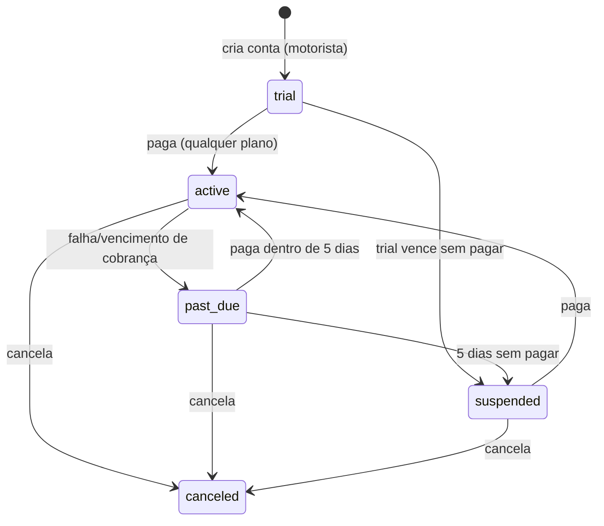

# Design Document — Assinaturas e Pagamento (Asaas)

## Overview

Esta feature adiciona cobrança de mensalidade **apenas para Motoristas** via gateway **Asaas**,
evoluindo o mecanismo de trial existente (migration 044). O design reaproveita ao máximo o que já
existe — colunas `users.trial_ends_at / subscription_status / is_subscribed`, o núcleo puro
`src/utils/trialStatus.ts`, o hub de notificações (041) e o push (042) — e adiciona três tabelas
novas, duas Edge Functions, RPCs SECURITY DEFINER, automação de cobrança e uma área admin.

Princípios que guiam o design:

- **Não quebrar o existente.** O módulo Financeiro de comissão (037) permanece intacto no código;
  apenas é ocultado do menu. As colunas de `users` já existentes são reutilizadas como fonte de
  verdade do estado de acesso.
- **Defense-in-depth.** Toda regra de acesso (suspensão, bloqueio de interação) vale na UI **e** no
  servidor (RLS + guards de RPC). O cliente nunca é autoridade.
- **Segredo no servidor.** A API key do Asaas vive só em Edge Functions (via Supabase Vault/secrets).
- **Idempotência.** Webhook e notificações são idempotentes por construção.
- **Paridade SQL↔TS.** A máquina de estados de acesso tem uma implementação pura em TS espelhada
  pela lógica SQL, validada por property-based testing (mesmo padrão da 044).

## Architecture

```mermaid
flowchart TD
  subgraph Client[App React]
    MP[MotoristaPlanPage<br/>escolha de plano]
    HB[Histórico de cobranças]
    TB[TrialBadge<br/>FREE · N dias / Plus]
    SUS[Aviso de suspensão]
  end

  subgraph Edge[Supabase Edge Functions]
    CS[asaas-create-subscription]
    WH[asaas-webhook]
  end

  subgraph DB[(Postgres + RLS)]
    SUB[subscriptions]
    CH[subscription_charges]
    EVT[asaas_webhook_events]
    USR[(users<br/>subscription_status)]
    NOT[notifications]
  end

  subgraph Cron[pg_cron diário]
    BN[Billing_Notifier]
  end

  ASAAS[(Asaas API<br/>sandbox/prod)]

  MP -->|contratar plano| CS
  CS -->|API key Vault| ASAAS
  CS --> SUB
  CS --> CH
  ASAAS -->|webhook evento| WH
  WH -->|valida token + dedup| EVT
  WH --> SUB
  WH --> CH
  WH --> USR
  WH --> NOT
  BN -->|seleciona só afetados| USR
  BN --> NOT
  HB -->|RPC própria| CH
  TB -->|useSubscriptionStatus| USR
```

## Data Models

> As tabelas abaixo também compõem a seção "Components and Interfaces" (modelo de dados + contratos).

### 1. Modelo de Dados (migration 055)

Numeração: **055_assinaturas_asaas.sql** (última aplicada é 054). Par `055_assinaturas_asaas_rollback.sql`
documentado, não auto-aplicado. Migration idempotente com `DO $check$` defensivos (verifica 044 e 041
aplicadas).

#### Tabela `subscriptions`

Uma linha por Motorista que já contratou (1 assinatura "corrente" por motorista — `UNIQUE(user_id)`).

| Coluna | Tipo | Notas |
|---|---|---|
| `id` | uuid PK | `gen_random_uuid()` |
| `user_id` | uuid UNIQUE NOT NULL | FK `users(id) ON DELETE CASCADE`. 1:1 com motorista |
| `plan` | text NOT NULL | CHECK `IN ('mensal','trimestral','semestral')` |
| `payment_method` | text NOT NULL | CHECK `IN ('credit_card','pix','boleto')` |
| `status` | text NOT NULL | CHECK `IN ('active','past_due','suspended','canceled')`. Espelha/origina `users.subscription_status` |
| `auto_recurring` | boolean NOT NULL DEFAULT false | true quando `payment_method='credit_card'` |
| `started_at` | timestamptz NOT NULL | data da contratação |
| `next_charge_at` | timestamptz NULL | instante da próxima cobrança (fim do ciclo) |
| `past_due_since` | timestamptz NULL | início do grace_period |
| `grace_ends_at` | timestamptz NULL | `past_due_since + 5 days` |
| `canceled_at` | timestamptz NULL | |
| `asaas_customer_id` | text NULL | id do cliente no Asaas |
| `asaas_subscription_id` | text NULL | id da assinatura recorrente no Asaas (cartão) |
| `created_at` / `updated_at` | timestamptz | versionamento otimista |

> **Nota de design:** `users.subscription_status` continua sendo a fonte de verdade lida pelo app
> (RLS, badge, guards) para não reescrever a 044. `subscriptions.status` é mantido em sincronia pelas
> RPCs/webhook e carrega o detalhe (`suspended` não existe no domínio de `users.subscription_status`,
> que só tem `trial|active|past_due|canceled|blocked`). Mapeamento: `suspended` → grava
> `users.subscription_status='blocked'` + `is_subscribed=false`; `active` → `is_subscribed=true`.
> O `access_state` derivado (abaixo) reconcilia os dois.

Índices: `idx_subscriptions_next_charge` em `(next_charge_at)` WHERE `status='active'`;
`idx_subscriptions_grace` em `(grace_ends_at)` WHERE `status='past_due'`;
`idx_subscriptions_status` em `(status)`.

RLS: `subscriptions_select_own` (motorista lê só a própria: `user_id = auth.uid()`), `_no_dml`
(bloqueia INSERT/UPDATE/DELETE direto — só via RPC SECURITY DEFINER / service-role do webhook).
Admin lê via RPC gated.

#### Tabela `subscription_charges`

Uma linha por cobrança (histórico). N por assinatura.

| Coluna | Tipo | Notas |
|---|---|---|
| `id` | uuid PK | |
| `subscription_id` | uuid NOT NULL | FK `subscriptions(id) ON DELETE CASCADE` |
| `user_id` | uuid NOT NULL | desnormalizado p/ RLS simples e índice |
| `amount` | numeric(10,2) NOT NULL CHECK `>= 0` | valor total cobrado |
| `payment_method` | text NOT NULL | CHECK domínio |
| `status` | text NOT NULL | CHECK `IN ('pending','paid','failed','refunded')` |
| `period_start` / `period_end` | timestamptz | ciclo coberto por esta cobrança |
| `asaas_payment_id` | text UNIQUE NULL | id do pagamento no Asaas (idempotência por pagamento) |
| `paid_at` | timestamptz NULL | |
| `created_at` | timestamptz | |

RLS: `charges_select_own` (`user_id = auth.uid()`), `_no_dml`. Índice `(user_id, created_at DESC)`.

#### Tabela `asaas_webhook_events` (idempotência de webhook)

| Coluna | Tipo | Notas |
|---|---|---|
| `id` | uuid PK | |
| `asaas_event_id` | text UNIQUE NOT NULL | id do evento Asaas — chave de idempotência |
| `event_type` | text NOT NULL | ex.: PAYMENT_CONFIRMED |
| `payload` | jsonb NOT NULL | corpo recebido (para auditoria/debug) |
| `processed_at` | timestamptz NOT NULL DEFAULT NOW() | |

RLS habilitada sem policy pública (acesso só service-role). O `UNIQUE(asaas_event_id)` é a barreira
de idempotência: `INSERT ... ON CONFLICT DO NOTHING` → se não inseriu, evento já foi processado.

#### Estrutura FUTURA de Empresa — RESERVADA, FORA DE ESCOPO

Criadas vazias e **sem nenhuma lógica/cobrança/RLS de negócio** nesta spec, apenas para o schema
futuro não exigir reestruturação (Requirement 14):

```sql
-- FUTURO (fora de escopo desta spec): conta empresa que vincula N embarcadores.
CREATE TABLE IF NOT EXISTS companies (
  id uuid PRIMARY KEY DEFAULT gen_random_uuid(),
  name text NOT NULL,
  created_at timestamptz NOT NULL DEFAULT NOW()
);
CREATE TABLE IF NOT EXISTS company_embarcadores (
  company_id uuid NOT NULL REFERENCES companies(id) ON DELETE CASCADE,
  embarcador_id uuid NOT NULL REFERENCES users(id) ON DELETE CASCADE,
  created_at timestamptz NOT NULL DEFAULT NOW(),
  PRIMARY KEY (company_id, embarcador_id)
);
COMMENT ON TABLE companies IS 'FUTURO/fora de escopo (assinaturas-pagamento Req 14): conta empresa. Sem cobranca/regra nesta spec.';
```

### 2. Catálogo de Planos — módulo puro TS

`src/utils/subscriptionPlans.ts` (puro, sem I/O, alvo de property test):

```ts
export type PlanId = 'mensal' | 'trimestral' | 'semestral';
export interface Plan {
  id: PlanId;
  months: number;
  monthlyPrice: number; // R$/mês
  recommended: boolean;
}
export const PLANS: readonly Plan[] = [
  { id: 'mensal',     months: 1, monthlyPrice: 39.90, recommended: false },
  { id: 'trimestral', months: 3, monthlyPrice: 34.90, recommended: false },
  { id: 'semestral',  months: 6, monthlyPrice: 29.90, recommended: true  },
];
/** total = monthlyPrice * months, arredondado a 2 casas (half-away-from-zero). */
export function computePlanTotal(plan: Plan): number { /* round2(monthlyPrice*months) */ }
```

Totais resultantes: mensal **39,90**, trimestral **104,70**, semestral **179,40** (validados por CP).

### 3. Máquina de Estados de Acesso (evolução de `trialStatus.ts`)

Novo domínio derivado `AccessState = 'trial' | 'active' | 'past_due' | 'suspended' | 'canceled'`.



Função pura nova em `trialStatus.ts` (paridade com SQL):

```ts
export interface AccessInput {
  userType: UserTypeLike;
  isSubscribed: boolean;
  subscriptionStatus: SubscriptionStatus; // users.subscription_status
  trialEndsAt: Date | null;
  graceEndsAt: Date | null;               // subscriptions.grace_ends_at
  now?: Date;
}
export function computeAccessState(i: AccessInput): AccessState;
export function canViewFeed(i: AccessInput): boolean;   // suspended => TRUE (vê feed)
export function canInteract(i: AccessInput): boolean;    // suspended => FALSE (não interage)
```

Regras-chave:
- **Não-motorista (embarcador/admin):** `active`-equivalente, `canViewFeed=true`, `canInteract=true`
  (nunca suspenso) — preserva a 044.
- **Motorista trial não vencido:** `trial`, vê e interage.
- **Motorista trial vencido e nunca pagou:** `suspended` → **vê o feed, não interage** (mudança vs.
  044, que escondia o feed). Ver §RLS abaixo.
- **active:** vê e interage. **past_due (dentro do grace):** vê e interage (acesso completo).
- **suspended (grace esgotado):** vê feed, não interage. **canceled:** trata como suspended para acesso.

> **Diferença importante vs. 044:** hoje `is_motorista_trial_blocked=true` **esconde** o feed. O novo
> comportamento é "suspenso vê o feed mas não interage". A RLS de fretes será ajustada para **liberar
> o SELECT do feed** ao motorista suspenso, enquanto os **guards de interação** (toggle_frete_like e
> ações de contato/chat) passam a negar. Isso é uma evolução compatível: o feed deixa de ser escondido,
> e o bloqueio migra para a camada de interação.

#### Ajuste na RLS de fretes e guards

- `fretes_select_policy`: remover a condição que esconde o feed do motorista bloqueado — o feed
  `status='ativo'` volta a ser visível para motorista autenticado (suspenso inclusive). Continuidade
  (conversas próprias), dono e admin permanecem.
- Novo predicado SQL `motorista_can_interact(p_user_id uuid) RETURNS boolean` (STABLE, SECURITY
  DEFINER, search_path=public): espelha `canInteract`. `true` para não-motorista, motorista em
  `trial`/`active`/`past_due`; `false` para `suspended`/`canceled` (trial vencido sem pagar ou grace
  esgotado).
- `toggle_frete_like`: trocar o guard `is_motorista_trial_blocked` por `NOT motorista_can_interact(...)`
  → `RAISE permission_denied` (ERRCODE 42501) com **precedência** sobre validações. Demais RPCs de
  interação (contato/chat) recebem o mesmo guard.

## Components and Interfaces

### 4. Edge Functions

#### `asaas-create-subscription`
- Auth: exige JWT de usuário autenticado (motorista). Lê `auth.uid()`.
- Entrada: `{ plan, payment_method, card?: {...}, cpfCnpj, ... }`.
- Faz: cria/recupera customer no Asaas (`asaas_customer_id`); cria cobrança única (PIX/boleto) ou
  assinatura recorrente (cartão); persiste `subscriptions` + `subscription_charges (pending)` via
  service-role. Retorna `{ checkoutUrl | pixQrCode | boletoUrl, charge_id }`.
- Segredo: `ASAAS_API_KEY` e `ASAAS_BASE_URL` lidos de `Deno.env` (secrets/Vault). Nunca no client.
- Cartão: dados transitam direto p/ Asaas; **não persistimos número do cartão** (Req 3.3).

#### `asaas-webhook`
- Sem JWT de usuário (chamado pelo Asaas). Valida **token de autenticidade** do header
  (`asaas-access-token` configurado no painel Asaas == secret `ASAAS_WEBHOOK_TOKEN`). Falha → 401 sem
  efeito.
- Idempotência: `INSERT INTO asaas_webhook_events(asaas_event_id,...) ON CONFLICT DO NOTHING`; se 0
  linhas, responde 200 sem reprocessar.
- Mapeia eventos: `PAYMENT_CONFIRMED`/`PAYMENT_RECEIVED` → marca charge `paid`, assinatura `active`,
  `is_subscribed=true`, avança `next_charge_at` (+ duração do plano); `PAYMENT_OVERDUE` → `past_due`
  + grace 5 dias + notifica; (suspensão é decidida pelo cron quando grace esgota).
- Toda escrita via service-role (bypassa RLS por design).

### 5. RPCs SQL (SECURITY DEFINER, search_path=public, REVOKE/GRANT)

Motorista:
- `create_subscription_record(...)` — chamada pela Edge (service-role) ou RPC fina; cria linha.
- `list_my_charges()` — STABLE; retorna charges do `auth.uid()`; `permission_denied` se anônimo;
  RLS já garante isolamento (Req 11).
- `cancel_my_subscription()` — marca `canceled` (idempotente se já canceled), cessa renovação.

Transições (chamadas pelo webhook/cron via service-role ou RPC interna):
- `subscription_mark_paid(p_user_id, p_asaas_payment_id, ...)`, `subscription_mark_past_due(...)`,
  `subscription_suspend(...)`, `subscription_reactivate(...)`.

Admin:
- `admin_list_subscriptions(p_group, p_q, p_sort, p_limit, p_offset)` — STABLE; `p_group ∈
  {a_vencer, pagas, inadimplentes}`; gating `is_admin_with_permission('FINANCEIRO_VIEW')` (reusa a
  permissão existente) com audit negativo `SUBSCRIPTION_VIEW_DENIED` e `permission_denied`; paginação
  10/50/100. "Inadimplentes" = `status IN ('past_due','suspended')`.

### 6. Billing_Notifier (automação anti-disparo-em-massa)

Mecanismo: **pg_cron diário** (uma função SQL `run_billing_notifications()` agendada 1x/dia) — não
depende de infra externa e roda no próprio Postgres. (Alternativa: Edge agendada; pg_cron é mais
simples e já disponível no Supabase.)

Seleção **somente dos afetados**:
- Trial vencendo: motoristas com `trial_ends_at` entre `now()+1d` e `now()+2d`, `is_subscribed=false`.
- Falha de pagamento: disparada pelo webhook no momento do `PAYMENT_OVERDUE` (não pelo cron).

Idempotência: `INSERT INTO notifications(... type='plan_trial_expiring')` apoiado no índice único
parcial `uq_notifications_user_plan_unread (user_id, type) WHERE read_at IS NULL AND type LIKE 'plan_%'`
→ `ON CONFLICT DO NOTHING`. Garante **no máximo 1 notificação não lida por usuário por tipo**.

Type codes (todos `plan_*` para casar com o índice e a categoria "atividades" do NotificationsModal):
- `plan_trial_expiring` — falta 1-2 dias de trial.
- `plan_payment_failed` — falha/vencimento de cobrança.
- `plan_charged` — cobrança realizada (valor + data).
- `plan_reactivated` — assinatura reativada.

Push: para cada notificação criada, o trigger existente `trg_notifications_dispatch_push` (042) já
dispara push aos `device_tokens` do usuário — sem trabalho extra.

### 7. UI

- **TrialBadge** (`src/components/TrialBadge.tsx`): passa a usar `computeAccessState`. Trial →
  "FREE · {N} dias restantes" (verde/amarelo/vermelho conforme `selectBadgeTier`); assinante →
  "Profissional" (selo pago). Some para embarcador/admin. Responsivo < 768px.
- **MotoristaPlanPage** (reaproveitar): 3 planos reais, **semestral em destaque**, mostrando preço/mês
  e total. Botão "Assinar" chama `asaas-create-subscription`. Exibe PIX/boleto/cartão.
- **Histórico de cobranças**: seção/rota no menu do motorista listando `list_my_charges()` (valor,
  data, método, status) em pt-BR; estado vazio amigável.
- **Aviso de suspensão**: quando `canInteract=false`, ações interativas (curtir, contato, chat)
  mostram aviso pt-BR "Sua assinatura está suspensa. Regularize para voltar a interagir." + CTA p/
  planos. Feed continua visível.
- **Admin "Assinaturas"**: novo item no `AdminSidebar` (oculta "Financeiro" de comissão); página com
  abas/grupos A Vencer / Pagas / Inadimplentes, busca, filtros, paginação 10/50/100, estilo compacto
  do painel (sem `<h1>`, filtros em popover).

## Correctness Properties

### Property 1: Total dos planos
`computePlanTotal` é determinístico e igual a `monthlyPrice * months` arredondado a 2 casas; valores
fixos 39,90 / 104,70 / 179,40.

**Validates: Requirements 1.2, 1.3, 1.4, 1.5**

### Property 2: Paridade computeAccessState SQL↔TS
Para o mesmo input, o estado derivado em TS e no espelho SQL são idênticos.

**Validates: Requirements 5.1, 5.6, 6.6**

### Property 3: Invariante de suspensão
Para todo input, `suspended ⇒ canViewFeed=true ∧ canInteract=false`; e
`trial/active/past_due ⇒ canInteract=true`.

**Validates: Requirements 6.1, 6.2, 6.6**

### Property 4: Idempotência do webhook
Processar o mesmo `asaas_event_id` N vezes produz o efeito de exatamente 1 processamento.

**Validates: Requirements 12.3**

### Property 5: Idempotência da notificação
N tentativas de criar o mesmo `plan_*` não lido para um usuário resultam em no máximo 1 linha (via
índice único parcial).

**Validates: Requirements 10.4, 10.6**

### Property 6: Precedência de permission_denied
Ação interativa de motorista suspenso com input inválido simultâneo retorna sempre
`permission_denied`.

**Validates: Requirements 6.5, 15.4**

### Property 7: Isolamento (RLS)
Um motorista nunca lê `subscriptions` ou `subscription_charges` de outro usuário.

**Validates: Requirements 11.3, 11.4, 15.5**

Convenções: nunca `fc.stringOf`; PII/IDs via `fc.constantFrom`; `vi.mock` hoisted com
`globalThis.__spy`. Testes puros em `src/__tests__/`; integração (RLS/webhook) em `tests/`.

### 9. Migração Incremental (sem quebrar)

1. Migration 055 cria tabelas novas + predicado `motorista_can_interact` + ajuste de
   `fretes_select_policy` e guard de `toggle_frete_like`, tudo idempotente com `DO $check$`.
2. Reusa colunas de `users` (sem novas colunas obrigatórias). `subscriptions` é a tabela de detalhe.
3. Financeiro de comissão: só ocultar o item no `AdminSidebar` (flag/remover do array de navegação);
   código e rotas permanecem.
4. Par `055_..._rollback.sql` documentado.

### 10. Threat Model (resumo)

| Ameaça | Mitigação |
|---|---|
| Vazamento da API key Asaas | Key só em Edge (Vault/secrets); nunca no bundle client; RPCs não a expõem |
| Webhook spoofing (forjar "pagou") | Validação do `asaas-access-token` no header antes de processar; 401 em falha |
| Replay de webhook | `asaas_webhook_events.asaas_event_id UNIQUE` + `ON CONFLICT DO NOTHING` |
| Acesso cruzado a assinatura/cobrança | RLS `user_id = auth.uid()`; mutação só via SECURITY DEFINER/service-role |
| Escalonamento de acesso via client (forjar "active") | Fonte de verdade no servidor; `motorista_can_interact` checado na RLS/guards; client é só UX |
| Auto-assinar sem pagar | `is_subscribed/active` só são setados pelo webhook após confirmação real do Asaas |
| Dados de cartão | Não persistidos; transitam direto ao Asaas |

## Error Handling

Mapeamento de erros (mensagens user-facing em pt-BR; error codes em inglês):

| Origem | Código interno | Tratamento / mensagem pt-BR |
|---|---|---|
| Ação interativa de motorista suspenso (RPC) | `permission_denied` (42501) | Precede qualquer validação. UI: "Sua assinatura está suspensa. Regularize para voltar a interagir." |
| `auth.uid()` nulo em RPC de assinatura | `permission_denied` | "Faça login para continuar." |
| `payment_method` fora do domínio | `INVALID_INPUT` (P0001) | "Forma de pagamento inválida." |
| Falha ao registrar cartão no Asaas | `ASAAS_CARD_FAILED` | "Não foi possível validar seu cartão. Tente outra forma de pagamento." |
| Webhook com token inválido | HTTP 401 | Sem efeito no estado; nada exibido ao usuário |
| Webhook duplicado (mesmo event id) | — (no-op) | HTTP 200, sem reprocessar |
| Asaas indisponível na contratação | `ASAAS_UNAVAILABLE` | "Pagamento temporariamente indisponível. Tente novamente em instantes." |
| Acesso cruzado a cobrança de outro motorista | `permission_denied` (RLS) | Stealth: lista vazia / negação |
| Admin sem permissão no painel Assinaturas | `permission_denied` + audit `SUBSCRIPTION_VIEW_DENIED` | Stealth_404 |

Princípios: falha do Billing_Notifier (notificação) **não** bloqueia mutação de assinatura; falha de
push não bloqueia a notificação persistida; degradação controlada quando o Asaas está fora
(contratação falha graciosamente, estado não é corrompido).

## Testing Strategy

- **Unitário/puro (`src/__tests__/`)**: `subscriptionPlans` (CP1), `computeAccessState`/`canInteract`/
  `canViewFeed` (CP2, CP3), mapeamento de eventos do webhook (lógica pura), formatação BRL e contagem
  de dias do badge. Property-based com fast-check (`cp<N>_<nome>.property.test.ts`).
- **Integração (`tests/`, só CI, branch Supabase efêmero)**: idempotência real do webhook (CP4),
  idempotência da notificação via índice único (CP5), precedência de `permission_denied` nos guards
  (CP6), isolamento RLS entre motoristas (CP7), transições de estado via RPC.
- **Cenários de falha obrigatórios**: cartão recusado, Asaas fora, webhook forjado, evento duplicado,
  grace esgotado, cancelamento idempotente.
- **Validações frontend E backend**: forma de pagamento, plano, e bloqueio de interação do suspenso
  testados nas duas camadas.
- **Regression_Suite atualizada** a cada funcionalidade entregue; build/lint/tsc/coverage no CI
  bloqueiam merge em caso de falha (governança do projeto). Cobertura mínima mantida nos
  Critical_Modules tocados.

## Decisões em Aberto (a confirmar na implementação)

- Confirmar nomes exatos dos eventos do Asaas (sandbox) durante a integração.
- Definir se "Assinaturas" usa a permissão `FINANCEIRO_VIEW` existente ou cria `SUBSCRIPTION_VIEW`
  nova (proposta: reusar `FINANCEIRO_VIEW` para não criar nova role agora).
