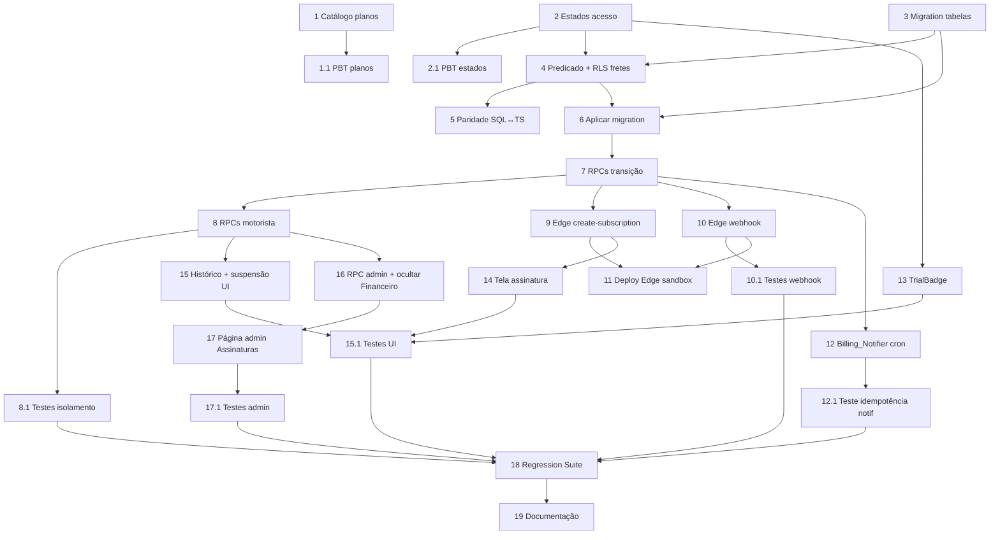

# Implementation Plan — Assinaturas e Pagamento (Asaas)

## Overview

Plano incremental para cobrar mensalidade dos motoristas via Asaas. Cada fase termina com testes
verdes (tsc + vitest + build) antes de seguir. Property tests em `src/__tests__/`
(`cp<N>_<nome>.property.test.ts`); integração em `tests/`. Nada de quebrar o código existente: o
Financeiro de comissão é apenas ocultado, nunca apagado. As fases vão do núcleo puro (sem risco) →
banco → RPCs → Edge Functions Asaas → automação → UI → admin → fechamento.

## Tasks

## Fase 0 — Núcleo puro (sem I/O, sem banco)

- [ ] 1. Catálogo de planos puro
  - Criar `src/utils/subscriptionPlans.ts` com `PlanId`, `PLANS` (mensal 39,90/1m, trimestral
    34,90/3m, semestral 29,90/6m destaque) e `computePlanTotal` (round2 de monthlyPrice*months).
  - _Requirements: 1.1, 1.2, 1.3, 1.4, 1.5, 1.6_

- [ ] 1.1 Property test do catálogo de planos
  - `src/__tests__/cp1_subscription_plans.property.test.ts`: determinismo e totais fixos
    (39,90 / 104,70 / 179,40); `computePlanTotal == monthlyPrice*months` arredondado.
  - _Requirements: 1.2, 1.3, 1.4, 1.5 (Property 1)_

- [ ] 2. Máquina de estados de acesso (evolução de trialStatus.ts)
  - Adicionar a `src/utils/trialStatus.ts`: tipo `AccessState`, `computeAccessState`, `canViewFeed`,
    `canInteract`. Suspenso ⇒ vê feed, não interage; trial/active/past_due ⇒ interage; não-motorista
    nunca suspenso. NÃO remover funções existentes (manter paridade com 044).
  - _Requirements: 5.1, 5.6, 6.1, 6.2, 6.6, 6.7_

- [ ] 2.1 Property tests da máquina de estados
  - `cp3_access_state.property.test.ts`: invariante de suspensão (Property 3) e determinismo
    (Property 2, lado TS).
  - _Requirements: 6.1, 6.2, 6.6 (Property 3); 5.1, 5.6 (Property 2)_

## Fase 1 — Banco (migration 055)

- [ ] 3. Migration 055: tabelas de assinatura
  - `supabase/migrations/055_assinaturas_asaas.sql` idempotente com `DO $check$` (verifica 041/044):
    cria `subscriptions`, `subscription_charges`, `asaas_webhook_events` com CHECKs, índices e RLS
    (`_select_own` + `_no_dml`). Criar `companies`/`company_embarcadores` VAZIAS (futuro, comentadas
    como fora de escopo). Par `055_assinaturas_asaas_rollback.sql` documentado.
  - _Requirements: 11.3, 11.4, 14.1, 14.2, 14.3, 14.4, 15.5_

- [ ] 4. Predicado de interação + ajuste da RLS de fretes
  - Na 055: criar `motorista_can_interact(uuid)` (STABLE, SECURITY DEFINER, search_path=public);
    ajustar `fretes_select_policy` para LIBERAR o feed ao motorista suspenso (feed deixa de ser
    escondido); trocar o guard de `toggle_frete_like` para `NOT motorista_can_interact(...)` →
    `permission_denied` (42501) com precedência. REVOKE/GRANT padrão.
  - _Requirements: 6.1, 6.2, 6.4, 6.5, 6.6, 6.7, 15.1, 15.2, 15.3, 15.4_

- [ ] 5. Espelho SQL de computeAccessState + paridade
  - Garantir que `motorista_can_interact` e o estado derivado batem com o TS. Teste de integração de
    paridade SQL↔TS em `tests/` (Property 2, lado servidor).
  - _Requirements: 5.1, 5.6, 6.6 (Property 2)_

- [ ] 6. Aplicar migration 055 no Supabase e smoke test
  - Aplicar via MCP/apply_migration; rodar bloco VERIFY (tabelas, policies, função existem). Conferir
    advisors de segurança (RLS).
  - _Requirements: 11.3, 11.4, 15.5_

## Fase 2 — RPCs SQL de assinatura

- [ ] 7. RPCs de transição de estado (server-side)
  - Na 055 (ou 055b): `subscription_mark_paid`, `subscription_mark_past_due` (grava grace +5d),
    `subscription_suspend`, `subscription_reactivate`. Sincronizam `subscriptions.status` +
    `users.subscription_status`/`is_subscribed` + `next_charge_at`. SECURITY DEFINER, search_path,
    REVOKE/GRANT.
  - _Requirements: 2.3, 2.4, 4.2, 4.3, 5.1, 5.2, 5.5, 5.6, 7.1, 7.2_

- [ ] 8. RPCs do motorista (histórico e cancelamento)
  - `list_my_charges()` (STABLE, só `auth.uid()`); `cancel_my_subscription()` (idempotente). Service
    `src/services/subscriptions.ts` (TS) que chama as RPCs e mapeia erros pt-BR.
  - _Requirements: 8.1, 8.2, 8.3, 8.4, 11.1, 11.2, 11.3, 11.4, 11.5_

- [ ] 8.1 Testes de isolamento e cancelamento
  - Integração em `tests/`: isolamento RLS entre motoristas (Property 7); cancelamento idempotente;
    precedência de `permission_denied` no guard de interação (Property 6).
  - _Requirements: 6.5, 8.4, 11.3, 11.4, 15.4, 15.5 (Properties 6, 7)_

## Fase 3 — Edge Functions Asaas

- [ ] 9. Edge `asaas-create-subscription`
  - `supabase/functions/asaas-create-subscription/index.ts`: exige JWT do motorista; cria/recupera
    customer; cria cobrança única (PIX/boleto) ou assinatura recorrente (cartão); persiste
    `subscriptions` + `subscription_charges(pending)` via service-role. API key via secret/Vault.
    NÃO persistir número de cartão.
  - _Requirements: 2.1, 2.2, 2.7, 3.1, 3.2, 3.3, 3.5, 12.6, 12.7_

- [ ] 10. Edge `asaas-webhook`
  - `supabase/functions/asaas-webhook/index.ts`: valida `asaas-access-token` (secret) → 401 em
    falha; idempotência via `asaas_webhook_events` (`ON CONFLICT DO NOTHING`); mapeia
    PAYMENT_CONFIRMED/RECEIVED → mark_paid + reactivate; PAYMENT_OVERDUE → mark_past_due + notifica.
  - _Requirements: 4.1, 4.2, 4.4, 5.1, 7.1, 12.1, 12.2, 12.3, 12.4, 12.5_

- [ ] 10.1 Testes do webhook (puros + integração)
  - Pura: mapeamento evento→ação. Integração: idempotência real (Property 4) e rejeição de token
    inválido (sem efeito no estado).
  - _Requirements: 12.1, 12.2, 12.3 (Property 4)_

- [ ] 11. Deploy das Edge Functions (sandbox) + segredos
  - Deploy `asaas-create-subscription` (verify_jwt on) e `asaas-webhook` (verify_jwt off, valida
    token interno). Configurar secrets `ASAAS_API_KEY`, `ASAAS_BASE_URL` (sandbox),
    `ASAAS_WEBHOOK_TOKEN`. Registrar URL do webhook no painel Asaas.
  - _Requirements: 12.6, 12.7_

## Fase 4 — Automação de cobrança/aviso

- [ ] 12. Billing_Notifier (pg_cron diário)
  - Migration 056: função `run_billing_notifications()` que seleciona SOMENTE motoristas com trial
    vencendo em 1-2 dias (`is_subscribed=false`) e insere `notifications(type='plan_trial_expiring')`
    com `ON CONFLICT DO NOTHING` (índice `uq_notifications_user_plan_unread`). Agendar via pg_cron 1x/dia.
    Notificação de falha/cobrança disparada pelo webhook (`plan_payment_failed`, `plan_charged`,
    `plan_reactivated`).
  - _Requirements: 5.4, 7.4, 10.1, 10.2, 10.3, 10.4, 10.5, 10.6_

- [ ] 12.1 Teste de idempotência da notificação
  - Integração: N tentativas do mesmo `plan_*` não lido → ≤ 1 linha (Property 5); seleção não atinge
    usuários fora da janela (anti-disparo-em-massa).
  - _Requirements: 10.3, 10.4, 10.6 (Property 5)_

## Fase 5 — UI do motorista

- [ ] 13. TrialBadge com contador e selo pago
  - Evoluir `src/components/TrialBadge.tsx` para usar `computeAccessState`: "FREE · {N} dias
    restantes" no trial; "Profissional" quando assinante; oculto p/ embarcador/admin; responsivo.
  - _Requirements: 9.1, 9.2, 9.3, 9.4, 9.5_

- [ ] 14. Tela de assinatura (MotoristaPlanPage real)
  - Reescrever `src/pages/MotoristaPlanPage.tsx`: 3 planos reais (semestral em destaque, preço/mês +
    total), seleção de método (cartão/PIX/boleto), chamada à Edge `asaas-create-subscription`,
    feedback de PIX/boleto/cartão. Atualizar `TrialExpiredPage` para apontar aqui.
  - _Requirements: 1.6, 1.7, 2.1, 2.6, 3.1_

- [ ] 15. Histórico de cobranças + aviso de suspensão
  - Seção/rota de histórico (`list_my_charges`), valores pt-BR, estado vazio. Bloqueio de UI nas
    ações interativas quando `canInteract=false` com aviso pt-BR + CTA para planos.
  - _Requirements: 6.3, 11.1, 11.2, 11.5_

- [ ] 15.1 Testes de UI (react-dom + act)
  - Badge (estados trial/pago/oculto), bloqueio de interação do suspenso (envio bloqueado + mensagem
    pt-BR), histórico vazio. Sem @testing-library (usar react-dom/client + act + MemoryRouter).
  - _Requirements: 6.3, 9.1, 9.3, 11.5_

## Fase 6 — Admin Assinaturas

- [ ] 16. RPC admin + ocultar Financeiro
  - `admin_list_subscriptions(p_group, p_q, p_sort, p_limit, p_offset)` (STABLE, gating
    `FINANCEIRO_VIEW`, audit negativo `SUBSCRIPTION_VIEW_DENIED`, Stealth_404). Ocultar item
    "Financeiro" no `AdminSidebar` (sem apagar rotas/código).
  - _Requirements: 13.1, 13.3, 13.5, 13.6, 13.7_

- [ ] 17. Página admin "Assinaturas"
  - Nova página + rota: grupos A Vencer / Pagas / Inadimplentes (`past_due`+`suspended`), busca,
    filtros, paginação 10/50/100, estilo compacto do painel.
  - _Requirements: 13.2, 13.3, 13.4, 13.5_

- [ ] 17.1 Testes do admin
  - Gating/Stealth_404 sem permissão; agrupamento correto; paginação. Integração do audit negativo.
  - _Requirements: 13.6, 13.7_

## Fase 7 — Fechamento

- [ ] 18. Regression_Suite + verificação final
  - Rodar suite completa (tsc + vitest + build), atualizar Regression_Suite com os novos testes,
    conferir cobertura dos Critical_Modules tocados, e advisors de segurança do Supabase.
  - _Requirements: governança de testes (todas as Properties 1–7)_

- [ ] 19. Documentação técnica
  - Documentar variáveis de ambiente do Asaas (sandbox→produção), fluxo de webhook e operação do
    Billing_Notifier em `docs/`. Atualizar steering se necessário.
  - _Requirements: 12.6, 12.7, 14.4_

## Task Dependency Graph

```json
{
  "waves": [
    { "wave": 1, "tasks": ["1", "2", "3"] },
    { "wave": 2, "tasks": ["1.1", "2.1", "4"] },
    { "wave": 3, "tasks": ["5", "6"] },
    { "wave": 4, "tasks": ["7"] },
    { "wave": 5, "tasks": ["8", "9", "10", "12", "13"] },
    { "wave": 6, "tasks": ["8.1", "10.1", "11", "12.1", "14", "16"] },
    { "wave": 7, "tasks": ["15", "17"] },
    { "wave": 8, "tasks": ["15.1", "17.1"] },
    { "wave": 9, "tasks": ["18"] },
    { "wave": 10, "tasks": ["19"] }
  ]
}
```



## Notes

- **Ordem segura:** Fase 0 (núcleo puro) não toca banco nem UI — risco zero, ótimo ponto de partida.
- **Não quebrar:** o item "Financeiro" do admin é só ocultado (task 16); rotas e código de comissão
  (037) permanecem intactos.
- **Segredos do Asaas:** nunca no chat nem no client. Quando chegar na task 11, o dono coloca
  `ASAAS_API_KEY` (sandbox), `ASAAS_BASE_URL` e `ASAAS_WEBHOOK_TOKEN` como secrets do Supabase.
- **Testes em cada fase:** cada bloco com PBT/integração roda antes de avançar (governança do projeto:
  qualquer falha bloqueia o merge).
- **Migrations:** 055 (tabelas + RLS + predicado + RPCs de transição) e 056 (Billing_Notifier/cron),
  ambas com par `_rollback.sql` documentado.
- **Empresa:** apenas schema reservado (task 3), sem lógica — fora de escopo desta entrega.
