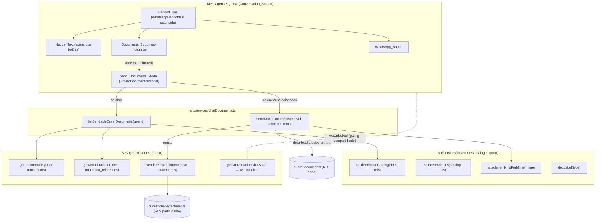

# Design Document

## Overview

Esta feature adiciona, **somente no lado do motorista** da Conversation_Screen
(`src/pages/MensagensPage.tsx`), um botão **"Enviar documentos"** à esquerda do
botão **WhatsApp**, liberado pelo **mesmo** gating (`whatsapp.unlocked` da RPC
`get_conversation_chat_state`). O botão abre o **Send_Documents_Modal**, que lista
os documentos do próprio motorista com checkboxes; ao enviar, cada documento
selecionado vira um **Chat_Attachment** na conversa.

O design é **deliberadamente aditivo e sem mudança de schema**. Ele reusa três
peças existentes:

1. **Gating** — o valor `waUnlocked` já calculado na página (de
   `getConversationChatState`) passa a alimentar também o Documents_Button.
2. **Origem dos documentos** — `getDocumentsByUser` (tabela/bucket `documents`,
   RLS owner-only) e `getMotoristaReferences` (CT-e no bucket `documents`).
3. **Entrega no chat** — `sendFreteAttachment` (bucket `chat-attachments`, RLS de
   participante + pasta do remetente), que já faz upload, insere a mensagem e faz
   rollback do arquivo em caso de falha de insert.

A novidade é uma ponte cliente que **baixa** o arquivo do bucket `documents` e o
**reenvia** ao `chat-attachments`. Como cada ponta é guardada por uma RLS distinta
(ler só o que é meu; escrever só na minha pasta de remetente, em conversa de que
participo), a feature herda **defesa em profundidade** sem nenhum código de
servidor novo.

### Decisões de design

| Decisão | Rationale |
| --- | --- |
| Ponte **download + re-upload no cliente** (sem RPC/Edge nova) | As RLS de `documents` (dono) e `chat-attachments` (remetente+participante) já impedem acesso cruzado. Server-side exigiria service-role e reabriria a superfície de segurança. Menos código, menos risco. |
| Camada **pura** `driverDocsCatalog.ts` isolada | Permite property-based testing do núcleo (catálogo/labels/seleção/classificação) sem montar React nem mockar rede. |
| Novo service `chatDocuments.ts` (não tocar `chatFrete.ts`) | `chatFrete.ts` é Critical_Module; reusamos `sendFreteAttachment` por import sem alterá-lo, evitando churn de cobertura. |
| Reusar `waUnlocked` em vez de novo gate | Garante paridade exata com o WhatsApp (Req 2) e zero divergência de limiar. |
| Documents_Button só para `userType === 'motorista'` | Escopo pedido; embarcador permanece sem regressão (Req 1.3, 10.5). |
| `profile_photo` excluído do catálogo | É avatar, não documento (mesma regra do painel admin `UserDocumentsBlock`). |
| Referência enviável só com `cte_file_path` | "Apenas documentos/arquivos, nada escrito" — o texto da referência não é enviado (Req 5.3). |

## Architecture



### Fluxo de envio (resumo)

1. Motorista (Unlocked) clica em **Enviar documentos** → abre o modal.
2. Modal chama `listSendableDriverDocuments(user.id)` → `getDocumentsByUser` +
   `getMotoristaReferences` → `buildSendableCatalog` monta o Document_Catalog.
3. Motorista marca os checkboxes e clica **Enviar (N)**.
4. `sendDriverDocuments` percorre os itens selecionados (pool de concorrência ~3):
   para cada um, baixa o arquivo do bucket `documents` (RLS: só o dono baixa),
   monta um `File`, e chama `sendFreteAttachment` (RLS: grava em
   `<conv>/<sender=self>/...`, insere a mensagem, rollback em falha).
5. As mensagens aparecem para os dois lados via `subscribeToFreteMessages`
   (realtime já existente). Sucesso total fecha o modal; falha parcial mantém
   aberto listando o que falhou.

## Components and Interfaces

### Camada pura: `src/services/driverDocsCatalog.ts`

Núcleo determinístico e testável por property-based. Não importa Supabase nem
React. Importa apenas tipos (`DocumentType` de `./documents`).

```ts
import type { DocumentType } from './documents';

/** Grupo visual do catálogo, na ordem canônica do projeto. */
export type DocGroupKey = 'perfil' | 'tracao' | 'carroceria' | 'outros' | 'referencias';

/** Item enviável unificado (documento OU CT-e de referência). */
export interface SendableDocument {
  /** Id estável e único: `doc:<documentId>` ou `ref:<referenceId>`. */
  id: string;
  kind: 'document' | 'reference_cte';
  docType?: DocumentType;            // presente quando kind === 'document'
  groupKey: DocGroupKey;
  label: string;                     // rótulo pt-BR (nunca vazio)
  sourcePath: string;                // caminho no bucket `documents` (file_path/cte_file_path)
  fileName: string;                  // nome do arquivo p/ o anexo
  mimeType: string | null;           // conhecido p/ documents; null p/ CT-e (inferir por extensão)
}

/** Entradas mínimas (subconjuntos de DocumentMetadata / MotoristaReference). */
export interface CatalogDocInput {
  id: string; documentType: DocumentType; filePath: string;
  fileName: string; mimeType: string | null;
}
export interface CatalogRefInput {
  id: string; companyName: string; ctePath: string | null; cteName: string | null;
}

/** Rótulo pt-BR canônico por tipo (reusa os rótulos do painel). */
export const DRIVER_DOC_LABELS: Record<string, string>;

/** Rótulo total: tipo conhecido → rótulo; desconhecido → fallback legível (nunca vazio). */
export function docLabel(type: string): string;

/** image sse mime começa com `image/`; demais (PDF/etc.) → file. */
export function attachmentKindForMime(mime: string | null): 'image' | 'file';

/**
 * Monta o Document_Catalog (puro):
 *  - 1 item por documento, EXCETO `profile_photo`;
 *  - 1 item por referência COM `ctePath`; referências sem CT-e são omitidas;
 *  - todo item tem `sourcePath` não-vazio e `label` não-vazio;
 *  - ordenado por grupo canônico (perfil → tracao → carroceria → outros → referencias).
 */
export function buildSendableCatalog(
  docs: CatalogDocInput[],
  refs: CatalogRefInput[]
): SendableDocument[];

/** Subconjunto exato: retorna os itens cujo id ∈ selectedIds (sem duplicar). */
export function selectSendables(
  catalog: SendableDocument[],
  selectedIds: ReadonlySet<string> | string[]
): SendableDocument[];
```

Mapa de grupos (reaproveita `UserDocumentsBlock` para consistência de rótulos):

| groupKey | título pt-BR | tipos / origem |
| --- | --- | --- |
| `perfil` | Perfil | `cnh`, `foto_segurando_cnh`, `comprovante_endereco_motorista`, `comprovante_endereco_proprietario` |
| `tracao` | Tração (cavalo) | `crlv_cavalo`, `rntrc_cavalo`, `foto_frente_caminhao`, `foto_caminhao_completo` |
| `carroceria` | Carroceria | `crlv_carreta_1..4`, `rntrc_carreta_1..2` |
| `outros` | Outros | `documento_proprietario`, `contrato_arrendamento`, `cpf`, `antt`, `vehicle_registration`, `vehicle_insurance` |
| `referencias` | Referências | CT-e de `motorista_references` (label `Referência: <empresa> (CT-e)`) |

`profile_photo` **não** mapeia para nenhum grupo: é filtrado em `buildSendableCatalog`.

### Service: `src/services/chatDocuments.ts`

```ts
import { getDocumentsByUser } from './documents';
import { getMotoristaReferences } from './motorista';
import { sendFreteAttachment, type FreteMessage } from './chatFrete';
import { supabase } from './supabase';
import {
  buildSendableCatalog, attachmentKindForMime, type SendableDocument,
} from './driverDocsCatalog';

/** Carrega documentos + referências do motorista e devolve o catálogo pronto. */
export async function listSendableDriverDocuments(userId: string): Promise<SendableDocument[]>;

export interface SendResult {
  sent: SendableDocument[];
  failed: { item: SendableDocument; reason: string }[];
}

/**
 * Envia os documentos selecionados para a conversa como Chat_Attachment.
 * Para cada item: baixa do bucket `documents` (RLS: só o dono), monta File e
 * chama `sendFreteAttachment` (RLS: grava em <conv>/<senderId>/...). Pool de
 * concorrência pequeno (~3). Falhas são isoladas por item (não abortam o lote).
 */
export async function sendDriverDocuments(
  conversationId: string,
  senderId: string,
  items: SendableDocument[]
): Promise<SendResult>;
```

Download seguro (núcleo de `sendDriverDocuments`, por item):

```ts
const { data: blob, error } = await supabase.storage
  .from('documents')
  .download(item.sourcePath);                 // RLS nega se não for do dono
if (error || !blob) throw new Error('download_failed');
const mime = item.mimeType ?? blob.type ?? 'application/octet-stream';
const file = new File([blob], item.fileName, { type: mime });
const kind = attachmentKindForMime(mime);     // 'image' | 'file'
return sendFreteAttachment(conversationId, senderId, file, kind, ''); // sem texto
```

### Componente: `src/components/EnviarDocumentosModal.tsx`

```tsx
interface EnviarDocumentosModalProps {
  open: boolean;
  conversationId: string;
  userId: string;          // id do motorista autenticado (origem dos documentos)
  unlocked: boolean;       // espelha waUnlocked; defesa extra contra envio fora do gate
  onClose: () => void;
  onSent?: (result: SendResult) => void;
}
```

Responsabilidades e estados internos:

- **load**: ao `open`, chama `listSendableDriverDocuments(userId)`; estados
  `loading` / `error` (com retry) / `empty` (sem Sendable_Document) / `ready`.
- **seleção**: `selectedIds: Set<string>`; toggle por item; "Selecionar todos" /
  "Limpar"; ação de envio desabilitada quando `selectedIds.size === 0`.
- **render**: lista agrupada (`groupKey`) com checkbox + rótulo + miniatura
  (imagem via signed URL preguiçosa) ou ícone de arquivo (PDF/outros).
- **envio**: `sending`; chama `selectSendables(catalog, selectedIds)` e
  `sendDriverDocuments(...)`. Sucesso total → `onSent` + `onClose`. Falha parcial
  → mantém aberto, marca itens em `failedIds` com aviso pt-BR e permite reenviar
  só os que falharam.
- **acessibilidade**: `role="dialog"`, `aria-modal="true"`, foco inicial no
  título/fechar, Esc fecha, overlay clicável para fechar, trap de foco; bloqueia
  scroll de fundo. Mobile-first (ocupa a largura, some o fundo).
- **guarda**: se `!unlocked`, não envia (exibe aviso "os botões ainda não estão
  liberados") — paridade com o gating da barra.

### Extensão da `Handoff_Bar` (em `MensagensPage.tsx`)

`WhatsappHandoffBar` ganha props opcionais, preservando o comportamento atual do
embarcador quando `showDocuments` é `false`:

```tsx
function WhatsappHandoffBar({
  unlocked, error, onOpen,
  showDocuments = false,          // true só p/ motorista
  onOpenDocuments,                // abre o Send_Documents_Modal
}: {
  unlocked: boolean; error: string | null; onOpen: () => void;
  showDocuments?: boolean; onOpenDocuments?: () => void;
}) { /* ... */ }
```

Layout:

- **Embarcador (`showDocuments === false`)**: inalterado — nudge à esquerda
  (`Converse um pouco para liberar o WhatsApp.`) + WhatsApp_Button à direita.
- **Motorista (`showDocuments === true`)**: Nudge_Text **acima**
  (`Converse um pouco para liberar os botões.` / liberado:
  `Vocês já podem conversar no WhatsApp e enviar documentos.`) e, abaixo, uma
  linha `flex gap-2` com dois botões `flex-1`: **Enviar documentos** (esquerda,
  ícone de documento) e **WhatsApp** (direita, verde). Ambos desabilitados
  enquanto `!unlocked`.

### Integração na `MensagensPage`

- Novo estado `const [docsModalOpen, setDocsModalOpen] = useState(false)`.
- Resetar `setDocsModalOpen(false)` ao trocar de conversa e em `handleClose`.
- Passar à barra: `showDocuments={user?.userType === 'motorista'}` e
  `onOpenDocuments={() => waUnlocked && setDocsModalOpen(true)}`.
- Renderizar `<EnviarDocumentosModal open={docsModalOpen} conversationId={activeId!}
  userId={user!.id} unlocked={waUnlocked} onClose={() => setDocsModalOpen(false)} />`.
- Nenhum refetch manual: as mensagens enviadas chegam pelo realtime já assinado
  (`subscribeToFreteMessages`), com o dedup por `id` existente.

## Data Models

Sem mudança de schema. Modelos novos são **apenas em memória** (TypeScript):

### `SendableDocument`
| Campo | Tipo | Origem | Uso |
| --- | --- | --- | --- |
| `id` | `string` | `doc:<id>` ou `ref:<id>` | chave estável do checkbox/seleção |
| `kind` | `'document' \| 'reference_cte'` | derivado | escolhe a origem do arquivo |
| `docType` | `DocumentType?` | `documents.document_type` | rótulo/agrupamento |
| `groupKey` | `DocGroupKey` | mapa de grupos | seção no modal |
| `label` | `string` | `docLabel`/empresa | exibição pt-BR |
| `sourcePath` | `string` | `file_path`/`cte_file_path` | download do bucket `documents` |
| `fileName` | `string` | `file_name`/`cte_file_name` | nome do anexo no chat |
| `mimeType` | `string \| null` | `documents.mime_type` | classificação image/file |

### `SendResult`
| Campo | Tipo | Significado |
| --- | --- | --- |
| `sent` | `SendableDocument[]` | enviados com sucesso (1 Chat_Attachment cada) |
| `failed` | `{ item, reason }[]` | falharam (download/upload/insert); demais seguem |

### Tabela de derivação do catálogo (fonte da verdade das propriedades)

| Entrada | Vai para o catálogo? | groupKey | sourcePath |
| --- | --- | --- | --- |
| documento `cnh`/`crlv_*`/`contrato_arrendamento`/... | sim | conforme mapa | `file_path` |
| documento `profile_photo` | **não** (avatar) | — | — |
| referência com `ctePath != null` | sim | `referencias` | `cte_file_path` |
| referência com `ctePath == null` | **não** | — | — |

## Correctness Properties

*Uma propriedade é uma afirmação que deve valer em todas as execuções válidas —
ponte entre a spec legível e garantias verificáveis por máquina.* O alvo é a
camada pura `src/services/driverDocsCatalog.ts`. Toda a lógica de catálogo,
seleção e classificação de anexo deriva dessas funções, então verificá-las cobre
o núcleo de Req 5, 6, 7 e parte de 9. Critérios de UI (render/tema/ARIA) ficam em
testes de exemplo conforme a Testing Strategy.

### Property 1: Catálogo contém apenas documentos próprios e enviáveis

*Para quaisquer* listas de documentos e referências, todo item de
`buildSendableCatalog(docs, refs)`: (a) tem `sourcePath` não-vazio e `label`
não-vazio; (b) **nunca** corresponde a um documento `profile_photo`; (c) se
`kind === 'reference_cte'`, a referência de origem tinha `ctePath` não-nulo.
Reciprocamente, todo documento não-`profile_photo` e toda referência com
`ctePath` produzem exatamente um item. A contagem do catálogo é
`#(docs com type ≠ profile_photo) + #(refs com ctePath)`.

**Validates: Requirements 5.2, 5.3, 9.1**

### Property 2: Rótulo total/determinístico e identidade estável

*Para qualquer* `DocumentType` do domínio fechado, `docLabel(type)` é uma string
não-vazia em pt-BR; para tipos conhecidos retorna o rótulo canônico (nunca o enum
cru). Construir o catálogo duas vezes a partir da mesma entrada produz itens com
os **mesmos ids** e a mesma ordem (determinismo), garantindo estabilidade do
estado de seleção por checkbox.

**Validates: Requirements 5.4, 6.1**

### Property 3: Seleção é subconjunto exato (inclui o caso de um único item)

*Para qualquer* catálogo e *qualquer* conjunto de ids selecionados,
`selectSendables(catalog, ids)` retorna exatamente os itens cujo `id ∈ ids`: um
subconjunto do catálogo, sem duplicatas e sem nenhum item fora da seleção. Em
particular, selecionar um único id retorna exatamente aquele item ("enviar só a
CNH"); selecionar todos retorna todo o catálogo; ids inexistentes são ignorados.

**Validates: Requirements 6.2, 6.4**

### Property 4: Classificação de anexo por MIME

*Para qualquer* string MIME (ou `null`), `attachmentKindForMime(mime)` é `'image'`
se e somente se o MIME começa com `image/`; qualquer outro valor (PDF, `null`,
desconhecido) resulta em `'file'`. Determinístico e total.

**Validates: Requirement 7.3**

## Error Handling

| Cenário | Tratamento | Resultado de UI |
| --- | --- | --- |
| Falha ao listar documentos (`getDocumentsByUser`/refs) | Modal captura e expõe estado `error` | Aviso pt-BR + botão "Tentar novamente"; conversa intacta (Req 5.8) |
| Motorista sem nenhum Sendable_Document | `buildSendableCatalog` → `[]` | Estado vazio orientando concluir cadastro; "Enviar" desabilitado (Req 5.6) |
| Nenhum item selecionado | Guard na UI | "Enviar" desabilitado (Req 6.3) |
| Download de um item negado/falho (RLS/rede) | `sendDriverDocuments` isola o item em `failed` | Item marcado como falho; demais enviados (Req 8.1, 8.3, 9.1) |
| Upload/insert de um item falha | `sendFreteAttachment` faz rollback do arquivo; item vai p/ `failed` | Sem anexo órfão; falha parcial reportada (Req 8.2, 8.4) |
| Envio acionado fora de `unlocked` | Guard no modal e na barra | Não envia; aviso "botões ainda não liberados" (Req 8.5) |
| Caller não é participante | RLS de `chat-attachments` / RPC de estado negam | Falha segura, sem vazamento (Req 9.3) |
| Frete indisponível (input bloqueado) | Handoff_Bar não é renderizada | Documents_Button some junto, como o WhatsApp hoje (Req 10.4) |

Princípios:

- **Isolamento por item**: o lote de envio nunca aborta inteiro por causa de um
  item; cada falha é contida e reportada (`SendResult.failed`).
- **Fail-safe no gate**: incerteza sobre `unlocked` mantém os botões
  desabilitados (nunca liberar por engano) — Req 2.5.
- **RLS como fronteira**: a impossibilidade de enviar documento de terceiro não
  depende de checagem no cliente; depende das RLS de `documents` (download do
  dono) e `chat-attachments` (upload na pasta do remetente + participante). O
  cliente é apenas a camada de conveniência.
- **Sem segredos em log**: erros logam código/mensagem genérica, nunca caminhos
  de arquivo, URLs assinadas ou conteúdo de documento (Req 9.4).

## Testing Strategy

### Abordagem em camadas

- **Property-based (fast-check)** sobre `driverDocsCatalog.ts` — as 4 propriedades
  universais. Roda no pre-commit e no CI.
- **Integração (mock Supabase)** sobre `chatDocuments.ts` — `listSendableDriverDocuments`
  e `sendDriverDocuments` (download + reuso de `sendFreteAttachment`, isolamento de
  falha por item, pool de concorrência).
- **Exemplo/UI** sobre `EnviarDocumentosModal` e a `Handoff_Bar` — render
  condicional, textos fixos, seleção, estados (loading/empty/error/partial),
  acessibilidade.
- **Segurança/RLS (integração CI, `tests/`)** — garante que um usuário só baixa os
  próprios arquivos de `documents` e que anexos vão para `<conv>/<self>/...`.

### Property-based (convenções do projeto)

- Arquivo `src/__tests__/cp1_driver_docs_catalog.property.test.ts` (convenção
  `cp<N>_<nome>.property.test.ts`), mínimo **100 iterações** por propriedade.
- Geradores: `fc.constantFrom(...VALID_DOCUMENT_TYPES)` para tipo; `fc.boolean()`
  para presença de `ctePath`; `fc.subarray(catalogIds)` para seleção;
  `fc.constantFrom('image/png','image/jpeg','application/pdf','', null)` para MIME.
  **Nunca** `fc.stringOf`; PII/nomes via `fc.constantFrom` quando preciso.
- Cada teste tagueado com a propriedade do design:
  - **Feature: chat-enviar-documentos, Property 1: Catálogo só documentos próprios e enviáveis**
  - **Feature: chat-enviar-documentos, Property 2: Rótulo total/determinístico e identidade estável**
  - **Feature: chat-enviar-documentos, Property 3: Seleção é subconjunto exato**
  - **Feature: chat-enviar-documentos, Property 4: Classificação de anexo por MIME**

### Integração (mock Supabase)

- `vi.mock` é **hoisted**: expor spies via
  `(globalThis as Record<string, unknown>).__spy = ...`, sem referenciar variáveis
  externas no factory.
- `listSendableDriverDocuments`: junta documentos + referências e aplica o catálogo
  (exclui `profile_photo`, exige `ctePath`).
- `sendDriverDocuments`: baixa de `documents` por `sourcePath` e chama
  `sendFreteAttachment` com `kind` correto e texto vazio; erro de download de um
  item ⇒ `failed` só dele, demais em `sent`; valida concorrência limitada.

### Exemplo/UI

- `Handoff_Bar`: motorista vê dois botões `flex-1` (Enviar documentos à esquerda,
  WhatsApp à direita) e nudge acima com `Converse um pouco para liberar os botões.`;
  embarcador vê layout atual com texto só do WhatsApp (não-regressão); ambos
  botões desabilitados quando `!unlocked` (Req 1, 2, 3, 10.5).
- `EnviarDocumentosModal`: estados loading/empty/error/partial; checkbox por item;
  "Enviar (N)" reflete a contagem e desabilita com 0; Esc/overlay fecham;
  `role="dialog"`/`aria-modal` presentes (Req 4, 5, 6, 8).

### Segurança / cenários negativos (testing-governance)

- Estender `tests/security/*` e/ou `src/__tests__/security/*`: um usuário não-dono
  recebe erro ao baixar arquivo de `documents` de outro; anexo só é legível por
  participante; o path gravado é `<conv>/<senderId=self>/...`.
- Catálogo nunca inclui `profile_photo` nem referência sem CT-e (anti-vazamento).
- `noSecretLeak`/log: nenhum caminho ou URL assinada em logs de erro.
- Contrato/schema: **sem** mudança de schema ⇒ `tests/contract/schemaCompat.test.ts`
  permanece verde sem alteração (Req 10.1).
- Regression_Suite: incorporar todos os novos testes ao conjunto do CI.

### Cobertura / Critical_Modules

`chatFrete.ts` (Critical_Module) **não é alterado** — apenas importado; sua
cobertura é preservada. Os módulos novos (`driverDocsCatalog.ts`,
`chatDocuments.ts`) entram com cobertura própria (property + integração).

### Não-aplicável a PBT

Render visual, tema escuro e foco/ARIA são verificações de exemplo/snapshot — não
há "for all input → P" significativo; cobertos por testes de exemplo e inspeção.
