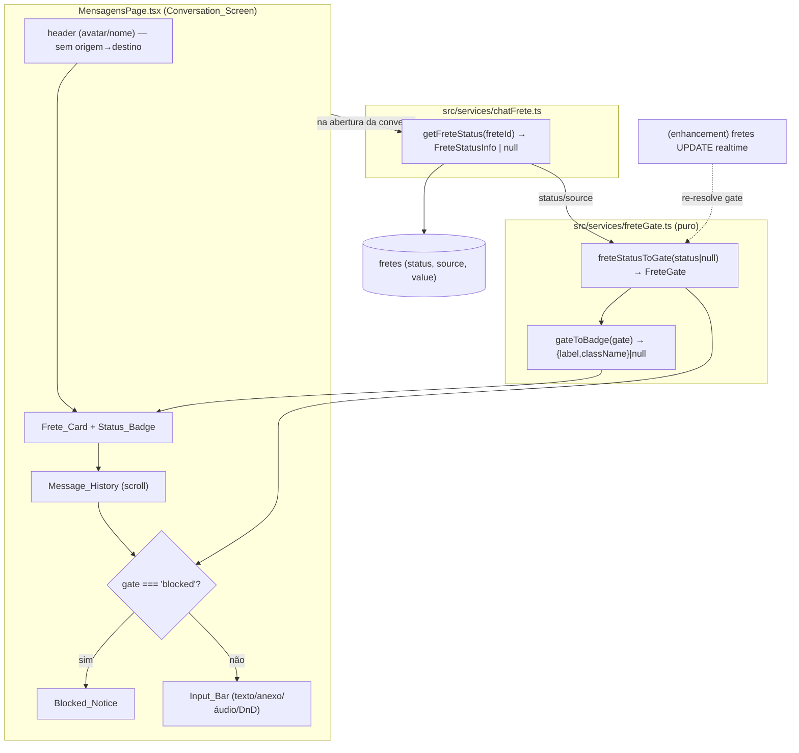

# Design Document

## Overview

Esta feature é um refinamento de UI da tela de conversa de frete
(`src/pages/MensagensPage.tsx`) somado a uma nova regra de negócio de **gating**
da conversa conforme o estado do frete vinculado. Inspirada na tela de chat do
OLX, ela promove a linha minúscula de origem→destino do cabeçalho para um card
destacado (`Frete_Card`) com selo de status (`Status_Badge`), e bloqueia a barra
de input (`Input_Bar`) quando o frete não está mais ativo, preservando o
histórico legível.

O escopo é **deliberadamente cirúrgico**: o chat (envio de texto, anexos, áudio,
drag-and-drop, tiquinhos, "digitando…") **já existe e é reaproveitado sem
reescrita**. Os pontos de alteração são:

1. Uma camada pura de mapeamento (`freteStatusToGate` + mapeamento do badge) que
   converte o estado do frete em uma decisão de UI (`active` / `blocked` /
   `unknown`). Essa camada é isolada e testável por property-based testing.
2. Uma recuperação de status leve no `Chat_Service` (`getFreteStatus`) chamada na
   abertura da conversa.
3. Edições mínimas e localizadas no `MensagensPage.tsx`: inserir `Frete_Card`
   entre o `<header>` e a área de mensagens, remover a linha origem→destino
   redundante do header, e trocar o `<footer>` (Input_Bar) por `Blocked_Notice`
   quando `gate === 'blocked'`.

### Decisões de design

| Decisão | Rationale |
| --- | --- |
| Mapeadores puros isolados em `src/services/freteGate.ts` | Permite property-based testing sem montar componente React; mantém `MensagensPage` (arquivo grande, compartilhado) com edições mínimas. |
| `getFreteStatus(freteId)` nova função no `chatFrete.ts` em vez de estender o join de `getUserConversations` | O status precisa ser **fresco na abertura** (Req 7.1). O join da lista é carregado uma vez no load da página; uma busca dedicada por conversa aberta é mais correta e barata. |
| Gating derivado de um único `gate: FreteGate` | Garante consistência: badge, bloqueio de input e drag-and-drop derivam todos da mesma fonte (Req 2/4/6 não podem divergir). |
| `'comunidade'` e `freteId === null` tratados como `unknown` (não bloqueia) | Req 3.4 e 6.2: Status_Indisponivel mantém o input habilitado e omite o badge. |
| Realtime de status (Req 7.2) como enhancement WHERE-gated | Comportamento central = buscar status na abertura. A assinatura realtime de `fretes` UPDATE é uma melhoria opcional documentada, sem ser pré-requisito do core. |

## Architecture



### Fluxo na abertura da conversa

1. Usuário seleciona conversa → `activeId` muda (lógica existente).
2. No effect de carregamento (junto de `getFreteMessages` / `getConversationPeer`),
   se `conv.freteId` não é nulo, chama `getFreteStatus(freteId)`.
3. O componente deriva `status` efetivo: `info && info.source !== 'comunidade' ? info.status : null`.
4. `gate = freteStatusToGate(status)`.
5. `Frete_Card` renderiza origem→destino (+ valor quando disponível) e
   `Status_Badge` a partir de `gateToBadge(gate)`.
6. O footer renderiza `Input_Bar` quando `gate !== 'blocked'`, senão `Blocked_Notice`.

## Components and Interfaces

### Novo módulo puro: `src/services/freteGate.ts`

```ts
import type { FreteStatus, FreteSource } from './fretes';

/** Decisão de UI derivada do estado do frete da conversa. */
export type FreteGate = 'active' | 'blocked' | 'unknown';

/**
 * Mapeador puro central. Converte o status do frete (ou null quando
 * indisponível) na decisão de gating da conversa.
 *  - 'ativo'                  → 'active'
 *  - 'encerrado' | 'cancelado'→ 'blocked'
 *  - null                     → 'unknown' (Status_Indisponivel)
 */
export function freteStatusToGate(status: FreteStatus | null): FreteGate {
  if (status === null) return 'unknown';
  return status === 'ativo' ? 'active' : 'blocked';
}

/**
 * Resolve o status efetivo considerando a origem do frete. Frete Comunidade
 * (`source === 'comunidade'`) nunca bloqueia — é tratado como indisponível.
 */
export function effectiveStatus(
  info: { status: FreteStatus; source?: FreteSource } | null
): FreteStatus | null {
  if (!info) return null;
  if (info.source === 'comunidade') return null;
  return info.status;
}

/** `true` se a conversa deve bloquear o input. Bloqueia somente em 'blocked'. */
export function isInputBlocked(gate: FreteGate): boolean {
  return gate === 'blocked';
}

export interface BadgeView {
  label: string;
  /** classes Tailwind (tema escuro via overrides globais do index.css). */
  className: string;
}

/**
 * Mapeia o gate para a aparência do Status_Badge.
 *  - 'active'  → verde  "Ativo"
 *  - 'blocked' → vermelho "Desativado"
 *  - 'unknown' → null (badge omitido)
 */
export function gateToBadge(gate: FreteGate): BadgeView | null {
  switch (gate) {
    case 'active':
      return { label: 'Ativo', className: 'bg-green-100 text-green-700 border border-green-200' };
    case 'blocked':
      return { label: 'Desativado', className: 'bg-red-100 text-red-700 border border-red-200' };
    case 'unknown':
      return null;
  }
}
```

Observação sobre tema escuro: as classes `bg-green-50/100`, `text-green-700`,
`bg-red-50/100`, `text-red-700`, `border-*-200` já têm overrides globais em
`src/index.css` (`html[data-theme='dark'] ...`), então o badge fica correto no
dark sem variantes `dark:` adicionais (Req 1.5, 2.x).

### `src/services/chatFrete.ts` — nova função `getFreteStatus`

```ts
export interface FreteStatusInfo {
  status: FreteStatus;          // 'ativo' | 'encerrado' | 'cancelado'
  source: FreteSource | null;   // 'embarcador' | 'comunidade' | null
  value: number | null;         // valor do frete p/ exibir no Frete_Card (Req 1.3)
}

/**
 * Recupera o status (e metadados leves) do frete vinculado à conversa.
 * Retorna null em qualquer falha (Status_Indisponivel — Req 3.5).
 */
export async function getFreteStatus(freteId: string): Promise<FreteStatusInfo | null> {
  try {
    const { data, error } = await supabase
      .from('fretes')
      .select('status, source, value')
      .eq('id', freteId)
      .single();
    if (error || !data) return null;
    return {
      status: data.status as FreteStatus,
      source: (data.source as FreteSource) ?? null,
      value: data.value != null ? Number(data.value) : null,
    };
  } catch {
    return null;
  }
}
```

Importa o tipo `FreteStatus`/`FreteSource` de `./fretes` (já exportados). A função
**não lança** — encapsula falhas como `null`, alinhado a Req 3.5.

### `src/pages/MensagensPage.tsx` — edições cirúrgicas

Estado novo (mínimo):

```ts
const [freteGate, setFreteGate] = useState<FreteGate>('unknown');
const [freteValue, setFreteValue] = useState<number | null>(null);
```

1. **No effect que troca de conversa** (onde já roda `getFreteMessages` +
   `getConversationPeer`): adicionar a busca de status condicionada a `freteId`.

```ts
const conv = conversations.find((c) => c.id === activeId);
const freteId = conv?.freteId ?? null;
const info = freteId ? await getFreteStatus(freteId) : null;
if (cancelled) return;
setFreteGate(freteStatusToGate(effectiveStatus(info)));
setFreteValue(info?.value ?? null);
```

   No branch de reset (sem `activeId`) e no `handleClose`: `setFreteGate('unknown')`,
   `setFreteValue(null)`.

2. **Frete_Card** — novo subcomponente renderizado entre o `</header>` e a `<div>`
   de mensagens. Recebe `origin`, `destination`, `value`, `gate`.

3. **Header** — remover o bloco `active?.frete && (<p>origin → destination</p>)`
   (Req 1.4). Os demais subtítulos do peer (empresa/veículo) permanecem.

4. **Footer / Input_Bar** — envolver o conteúdo do `<footer>` em
   `isInputBlocked(freteGate)`:
   - `true` → renderizar `Blocked_Notice` (não renderiza inputs/botões).
   - `false` → render atual inalterado.

5. **Drag-and-drop** — gate adicional nos handlers que iniciam upload, para
   cobrir Req 4.4 mesmo que o footer não esteja montado:
   - `handleDragEnter` / `handleDragOver`: `if (!activeId || isInputBlocked(freteGate)) return;`
   - `handleDrop`: `if (!activeId || isInputBlocked(freteGate)) return;` antes do loop.

6. **Gravação de áudio** — `startRecording`: `if (recording || isInputBlocked(freteGate)) return;`
   (defesa extra; o botão nem é renderizado quando bloqueado).

### Novo subcomponente `Frete_Card` (no mesmo arquivo)

```tsx
function FreteCard({
  origin, destination, value, gate,
}: { origin?: string; destination?: string; value: number | null; gate: FreteGate }) {
  if (!origin && !destination) return null; // sem frete vinculado → sem card
  const badge = gateToBadge(gate);
  return (
    <div className="flex items-center gap-2 px-3 py-2 border-b border-gray-200 bg-gray-50/60 shrink-0">
      <div className="flex-1 min-w-0">
        <p className="text-[13px] font-semibold text-gray-800 truncate">
          {origin} <span className="text-gray-400">→</span> {destination}
        </p>
        {value != null && (
          <p className="text-[11px] text-green-700 font-medium">
            {value.toLocaleString('pt-BR', { style: 'currency', currency: 'BRL' })}
          </p>
        )}
      </div>
      {badge && (
        <span className={`text-[10px] font-semibold rounded-full px-2 py-0.5 shrink-0 ${badge.className}`}>
          {badge.label}
        </span>
      )}
    </div>
  );
}
```

### Novo subcomponente `Blocked_Notice` (no mesmo arquivo)

```tsx
function BlockedNotice() {
  return (
    <footer className="border-t border-gray-200 bg-gray-50 p-3 shrink-0 text-center">
      <p className="text-[12px] text-gray-500">Este frete não está mais ativo.</p>
    </footer>
  );
}
```

## Data Models

### `FreteGate`
```ts
type FreteGate = 'active' | 'blocked' | 'unknown';
```

### `FreteStatusInfo` (retorno de `getFreteStatus`)
| Campo | Tipo | Origem | Uso |
| --- | --- | --- | --- |
| `status` | `FreteStatus` | `fretes.status` | mapeado por `freteStatusToGate` |
| `source` | `FreteSource \| null` | `fretes.source` | `'comunidade'` → indisponível |
| `value` | `number \| null` | `fretes.value` | valor exibido no Frete_Card (Req 1.3) |

### Tabela de derivação do gate

| Entrada | `effectiveStatus` | `freteStatusToGate` | Badge | Input |
| --- | --- | --- | --- | --- |
| `freteId === null` (não chama fetch) | `null` | `unknown` | omitido | habilitado |
| `info === null` (falha de fetch) | `null` | `unknown` | omitido | habilitado |
| `source === 'comunidade'` | `null` | `unknown` | omitido | habilitado |
| `status === 'ativo'` | `'ativo'` | `active` | verde "Ativo" | habilitado |
| `status === 'encerrado'` | `'encerrado'` | `blocked` | vermelho "Desativado" | bloqueado |
| `status === 'cancelado'` | `'cancelado'` | `blocked` | vermelho "Desativado" | bloqueado |

Essa tabela é a fonte única de verdade do comportamento e a base direta das
propriedades de correção.

## Correctness Properties

*Uma propriedade é uma característica ou comportamento que deve ser verdadeiro em
todas as execuções válidas do sistema — uma afirmação formal sobre o que o
sistema deve fazer. Propriedades servem de ponte entre a especificação legível
por humanos e garantias de correção verificáveis por máquina.*

O alvo das propriedades é a camada pura `src/services/freteGate.ts`
(`freteStatusToGate`, `effectiveStatus`, `isInputBlocked`, `gateToBadge`). Toda a
lógica de gating do chat (badge, bloqueio de input, drag-and-drop, áudio) deriva
exclusivamente dessas funções, então verificá-las cobre o núcleo de Req 2, 3, 4,
6 e 7. As demais criteria são de UI (render/layout/tema) e ficam para testes de
exemplo/snapshot conforme a Testing Strategy.

### Property 1: Mapeamento completo de status → gate → badge

*Para qualquer* `FreteStatus` (`'ativo'`, `'encerrado'`, `'cancelado'`):
`freteStatusToGate(status)` retorna `'active'` se e somente se `status === 'ativo'`,
e `'blocked'` para `'encerrado'` ou `'cancelado'`; e o badge correspondente é
`{ label: 'Ativo', verde }` quando o gate é `'active'` e
`{ label: 'Desativado', vermelho }` quando o gate é `'blocked'`. Como a derivação
é função pura do status corrente, re-resolver após uma atualização de status em
tempo real produz o mesmo resultado que resolver na abertura (Req 7.2).

**Validates: Requirements 2.2, 2.3, 3.2, 3.3, 7.2**

### Property 2: Status_Indisponivel nunca bloqueia e omite o badge

*Para qualquer* entrada indisponível — `info === null` (frete sem vínculo ou
falha de recuperação) ou `info.source === 'comunidade'` — `effectiveStatus(info)`
retorna `null`, `freteStatusToGate(null)` retorna `'unknown'`,
`gateToBadge('unknown')` retorna `null` (badge omitido) e `isInputBlocked('unknown')`
é `false` (input habilitado).

**Validates: Requirements 2.5, 3.4, 6.2**

### Property 3: Bloqueio do input se e somente se gate é 'blocked'

*Para qualquer* `FreteGate`, `isInputBlocked(gate)` é `true` se e somente se
`gate === 'blocked'`. Consequentemente, `'active'` e `'unknown'` mantêm a
Input_Bar habilitada (texto, anexo, áudio, drag-and-drop) e apenas `'blocked'`
aciona o Blocked_Notice e o bloqueio de todos os canais de entrada.

**Validates: Requirements 4.1, 4.2, 4.3, 4.4, 4.5, 6.1, 6.3**

### Property 4: Independência do papel do usuário

*Para qualquer* `FreteStatus` (ou entrada indisponível), o gate, o badge e a
decisão de bloqueio derivados são determinados unicamente pelo status do frete —
as funções de mapeamento não recebem o papel do usuário (motorista/embarcador)
como parâmetro, logo o resultado é idêntico para ambos os lados da mesma conversa.

**Validates: Requirements 2.4, 4.7**

## Error Handling

| Cenário | Tratamento | Resultado de UI |
| --- | --- | --- |
| `freteId === null` (conversa sem frete) | Não chama `getFreteStatus`; `effectiveStatus(null)` | gate `unknown`: sem badge, input habilitado (Req 3.4, 6.2) |
| Falha de rede/RLS em `getFreteStatus` | `try/catch` interno retorna `null`; nunca lança (Req 3.5) | gate `unknown`: sem badge, input habilitado |
| Frete de origem `'comunidade'` | `effectiveStatus` retorna `null` por `source` | gate `unknown`: sem badge, input habilitado (Req 3.4) |
| Valor do frete ausente (`value == null`) | Render condicional no Frete_Card | linha de valor omitida (Req 1.3) |
| Conversa sem origem e sem destino | `FreteCard` retorna `null` | card não renderizado |
| Status muda enquanto a conversa está aberta | Core: refletido na próxima abertura. Enhancement realtime re-resolve o gate via mapeador puro | badge/bloqueio atualizam de forma consistente (Req 7.2) |

Princípios:
- **Fail-safe para `unknown`**: qualquer incerteza sobre o status resolve para
  `unknown` (input habilitado, sem badge) — nunca bloqueia o usuário por engano.
- `getFreteStatus` **não propaga exceções** ao componente; encapsula erros como
  `null`, mantendo o effect de carregamento de conversa robusto.
- O gating é **defesa em profundidade**: além de não renderizar a Input_Bar
  quando bloqueado, os handlers de drag-and-drop, anexo e áudio checam
  `isInputBlocked(freteGate)` antes de iniciar qualquer upload/gravação.

## Testing Strategy

### Abordagem dupla

- **Property-based tests**: validam as 4 propriedades universais sobre a camada
  pura `freteGate.ts` (domínio fechado de `FreteStatus` + casos indisponíveis).
- **Unit/Example tests**: validam render condicional, textos fixos, estrutura de
  UI e os early-returns dos handlers.
- **Integration tests (mock)**: validam `getFreteStatus` (query e mapeamento) e o
  fetch-on-open do componente.

### Property-based testing (fast-check)

Aplica-se à camada pura `src/services/freteGate.ts`. Convenções do projeto
(`testing-governance.md` / `project-conventions.md`):

- Biblioteca: **fast-check** (já no projeto). Não reimplementar PBT do zero.
- Gerador do domínio: `fc.constantFrom('ativo', 'encerrado', 'cancelado')` para
  `FreteStatus`; `fc.constantFrom('active', 'blocked', 'unknown')` para `FreteGate`;
  `fc.constantFrom('embarcador', 'comunidade')` para `FreteSource`. **Não** usar
  `fc.stringOf` (inexistente no projeto).
- Mínimo **100 iterações** por property test.
- Arquivo: `src/__tests__/cp1_frete_gate.property.test.ts` (convenção
  `cp<N>_<nome>.property.test.ts`), roda no pre-commit e no CI.
- Cada teste tagueado com comentário referenciando a propriedade do design:
  - **Feature: chat-frete-conversa, Property 1: Mapeamento completo de status → gate → badge**
  - **Feature: chat-frete-conversa, Property 2: Status_Indisponivel nunca bloqueia e omite o badge**
  - **Feature: chat-frete-conversa, Property 3: Bloqueio do input se e somente se gate é 'blocked'**
  - **Feature: chat-frete-conversa, Property 4: Independência do papel do usuário**

### Unit / Example tests

- `FreteCard`: exibe origem→destino no formato correto (1.2); exibe/oculta valor
  conforme `value` (1.3); renderiza badge na mesma região (2.1); retorna `null`
  sem frete vinculado.
- `BlockedNotice`: exibe exatamente `Este frete não está mais ativo.` (4.6).
- Render da Conversation_Screen: Frete_Card aparece entre header e mensagens
  (1.1); o header não contém mais a linha origem→destino redundante (1.4); com
  `gate === 'blocked'` a Input_Bar é substituída pelo Blocked_Notice (4.1) e a
  Message_History permanece visível e rolável com anexos abríveis (5.1, 5.2, 5.3).
- Handlers: com `gate === 'blocked'`, `handleDrop` não chama `handleAttach`/upload
  (4.4) e `startRecording` faz early-return (4.5).

### Integration tests (mock Supabase)

- `getFreteStatus`: consulta `fretes` por `id` selecionando `status, source, value`
  e mapeia corretamente (3.1); em erro do Supabase resolve `null` sem lançar (3.5).
- Componente: ao abrir conversa com `freteId`, chama `getFreteStatus` e reflete o
  status no badge e no estado do input (7.1). Enhancement realtime (Req 7.2):
  1-2 exemplos de evento `fretes` UPDATE re-resolvendo o gate.
- `vi.mock` é hoisted: expor spies via `(globalThis as Record<string, unknown>).__spy = ...`,
  nunca referenciar variáveis externas no factory.

### Cenários negativos / limites (testing-governance)

- Falha de recuperação de status → `unknown` (não bloqueia, sem badge).
- Frete comunidade e `freteId` nulo → `unknown`.
- `value` nulo / `value` zero → linha de valor coerente.
- Regression_Suite: incorporar os novos testes ao conjunto que roda no CI.

### Não-aplicável a PBT

Tema escuro (1.5) e legibilidade mobile (1.6) são verificações visuais/snapshot —
não há "for all input → P" significativo; cobertas por inspeção visual e pelo uso
de classes neutras já tratadas pelos overrides `data-theme='dark'` do `index.css`.
