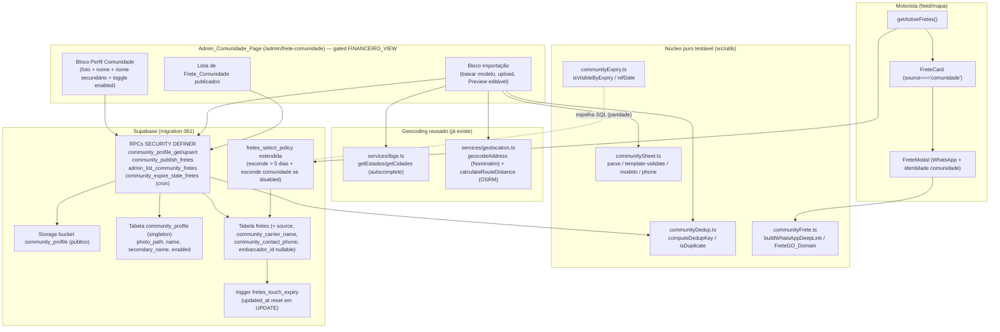

# Design Document — Frete Comunidade

## Overview

A feature **Frete Comunidade** é uma muleta de lançamento: um perfil-fantasma global,
controlado só pelo admin, que publica em lote fretes coletados em grupos de WhatsApp de
caminhoneiro. Esses fretes entram na MESMA tabela `fretes` e aparecem no MESMO feed/mapa do
motorista, sem filtro especial, com uma identidade visual própria ("Frete Comunidade") e um
botão WhatsApp no lugar do Chat. A feature é desligável via flag global.

O design persegue dois objetivos de risco:

1. **Não quebrar o fluxo atual de embarcador/motorista.** A tabela `fretes` ganha apenas
   colunas novas com defaults seguros; a RLS de leitura (`fretes_select_policy`, migration
   044) é estendida — nunca substituída na sua semântica essencial. Os fretes existentes
   recebem `source = 'embarcador'` por default.
2. **Reaproveitar o que já existe.** Geocoding por cidade reusa o exato mecanismo do
   `FreteForm` do embarcador (IBGE para autocomplete + Nominatim para coordenadas + OSRM/
   Haversine para km). O painel admin reusa `executeAdminMutation`, `is_admin_with_permission`,
   Stealth_404, Compact_Layout_Pattern e o estilo de RPC de `admin_list_subscriptions` (060).
   O upload de foto reusa o padrão de bucket público de `commodity_icons`/`anuncios`.

Esta feature toca também DUAS regras transversais que valem para **todos** os fretes
(comunidade e embarcador): **Auto_Expiracao** em 5 dias (Req 11) e **Dedup_Frete** na criação
(Req 12). Ambas são implementadas com cuidado para serem aditivas e idempotentes.

### Constantes de design

| Constante | Valor | Onde |
| --- | --- | --- |
| `FreteGO_Domain` | `https://www.fretegobr.com.br` | `src/utils/communityFrete.ts` (nova) |
| `EXPIRY_DAYS` | `5` | SQL (migration) + `src/utils/communityExpiry.ts` (espelho TS) |
| `MAX_IMPORT_ROWS` | `200` | `src/utils/communitySheet.ts` + RPC |
| `COMMUNITY_BUCKET` | `community_profile` (bucket público) | Storage |
| Permissão de leitura | `FINANCEIRO_VIEW` | reuso (ver Decisão D1) |
| Permissão de escrita | `FINANCEIRO_EDIT` | reuso (ver Decisão D1) |

### Decisões em aberto (com recomendação do design)

- **D1 — Permissão admin.** *Recomendação:* reusar `FINANCEIRO_VIEW` (ver/listar) e
  `FINANCEIRO_EDIT` (publicar/editar perfil/toggle), exatamente como `admin_list_subscriptions`
  e `/admin/anuncios` já fazem. Evita migration na Permission_Matrix e já cobre SUPER_ADMIN,
  ADMIN e FINANCEIRO. Audit negativo: `COMMUNITY_VIEW_DENIED`.
- **D2 — `embarcador_id` do Frete_Comunidade.** *Recomendação:* **tornar `fretes.embarcador_id`
  nullable** e gravar `NULL` em Frete_Comunidade, em vez de criar um embarcador-fantasma.
  Justificativa em Data Models (menor risco que um id fixo, sem poluir `embarcadores`, sem
  quebrar FK). Guardas explícitas acompanham a mudança.
- **D3 — Parsing de planilha XLSX.** *Recomendação:* **MVP só CSV** (zero dependência nova,
  reusa todo o padrão de CSV do projeto e é 100% testável por property test puro). O requisito
  pede CSV/XLSX; o design marca XLSX como incremento de fase 2 via **SheetJS (`xlsx`)** atrás de
  um adaptador `parseXlsxToMatrix()` que converte XLSX → matriz de strings e entrega ao MESMO
  parser puro. Decisão registrada; a UI aceita `.csv` e `.xlsx` mas o handler de `.xlsx` no MVP
  exibe orientação para exportar como CSV se a lib não estiver presente.
- **D4 — Auto_Expiracao: filtro vs job.** *Recomendação:* **(a) filtro na leitura** (RLS +
  `getActiveFretes`) como fonte de verdade da visibilidade — sem depender de cron — **mais (b)**
  um cron diário idempotente (`community_expire_stale_fretes`) que muda `status` para
  `encerrado` apenas como limpeza/observabilidade. A visibilidade NUNCA depende do job ter
  rodado.

## Architecture



### Camadas e responsabilidades

- **Núcleo puro (TS, sem I/O):** parsing/validação de planilha, dedup, expiração e deep-link.
  É onde mora a lógica testável por property-based tests (governança de testes).
- **Serviços (`src/services/admin/comunidade.ts`):** orquestram RPCs, `executeAdminMutation`,
  parse/serialize de filtros (espelho de `subscriptions.ts`), e o geocoding em lote no preview.
- **RPCs SQL:** fonte de verdade de autorização, dedup server-side e publicação atômica.
- **RLS + trigger:** garantem visibilidade (expiração + flag) e reset de expiração na edição,
  sem confiar no cliente.

## Components and Interfaces

### Núcleo puro — `src/utils/communitySheet.ts`

```ts
/** Colunas do Modelo_Planilha, na ordem EXATA (Req 4.2). Rótulos pt-BR. */
export const COMMUNITY_SHEET_HEADER = [
  'transportadora',
  'origem',
  'destino',
  'local de carregamento',
  'local de descarregamento',
  'valor',
  'tipo de produto',
  'telefone (whatsapp)',
] as const;

export const MAX_IMPORT_ROWS = 200;

/** Uma linha lida da planilha (campos crus + normalizados). */
export interface ImportRow {
  rowNumber: number;            // 1-based, para apresentação
  carrierName: string;
  origin: string;               // cidade abreviada vinda do grupo (a resolver)
  destination: string;
  originDetail: string;         // local de carregamento
  destinationDetail: string;    // local de descarregamento
  value: number | null;         // parseado; null se inválido
  product: string;
  phoneRaw: string;
  phoneNormalized: string;      // só dígitos (sanitizePhone)
}

export type FieldError =
  | 'REQUIRED'        // campo obrigatório vazio
  | 'INVALID_VALUE'   // valor não numérico ou <= 0
  | 'INVALID_PHONE';  // telefone BR inválido (não 10/11 dígitos com DDD)

export interface ImportRowValidation {
  ok: boolean;
  fieldErrors: Partial<Record<keyof ImportRow, FieldError>>;
}

/** Resultado do parse estrutural + linha a linha. */
export interface ParseResult {
  templateOk: boolean;          // Template_Validation (Req 5.9/5.10)
  headerReceived: string[];
  rows: ImportRow[];
  rowValidations: ImportRowValidation[];
  errors: string[];             // erros de arquivo/template em pt-BR
  truncated: boolean;           // > MAX_IMPORT_ROWS
}

/** Parser puro: recebe a matriz já lida (CSV → linhas → células). */
export function parseCommunityMatrix(matrix: string[][]): ParseResult;

/** Conveniência: parse direto de texto CSV (BOM-tolerante, ';' separador). */
export function parseCommunityCsv(text: string): ParseResult;

/** Template_Validation isolado (cabeçalho/ordem/colunas exatos). */
export function validateTemplate(headerCells: string[]): boolean;

/** Revalida uma única linha (usado no preview ao editar célula). */
export function validateImportRow(row: ImportRow): ImportRowValidation;

/** Gera o Modelo_Planilha em CSV (BOM UTF-8 + ';' + '\r\n' + 1 linha exemplo). */
export function buildModeloPlanilhaCsv(): string;

/** Normaliza telefone BR para apenas dígitos (reusa sanitizePhone). */
export function normalizeCommunityPhone(raw: string): string;
```

Notas:
- `parseCommunityCsv` reusa o estilo de `parseImportCsv`/`parseCsvLine` da blacklist (BOM,
  `;`, CRLF/LF, RFC 4180). `buildModeloPlanilhaCsv` reusa o padrão de `buildImportTemplateCsv`.
- `normalizeCommunityPhone` delega a `sanitizePhone` (`src/utils/phoneFormat.ts`);
  `isValidPhoneBR` define 10/11 dígitos.
- **Adaptador XLSX (D3):** `parseXlsxToMatrix(file): Promise<string[][]>` (em
  `src/services/admin/comunidade.ts`) converte XLSX → matriz e chama `parseCommunityMatrix`.
  No MVP pode lançar `INVALID_FILE_TYPE`/orientação se a lib `xlsx` não estiver instalada.

### Núcleo puro — `src/utils/communityDedup.ts`

```ts
export interface DedupFields {
  origin: string;
  destination: string;
  originDetail: string;
  destinationDetail: string;
  value: number;
  product: string;
  carrierName: string;
  contactPhone: string;
}

/** Normalização textual canônica: trim + colapso de espaços + lowercase + sem acento. */
export function normalizeDedupText(s: string): string;

/**
 * Dedup_Key determinística sobre TODOS os campos (Req 7.3, 12.6).
 * value entra como número canônico (2 casas); phone só dígitos.
 */
export function computeDedupKey(f: DedupFields): string;

/** true sse as duas tuplas COMPLETAS coincidem após normalização. */
export function isDuplicate(a: DedupFields, b: DedupFields): boolean;
```

### Núcleo puro — `src/utils/communityExpiry.ts`

```ts
export const EXPIRY_DAYS = 5;

/** Data de referência: updated_at (ver Data Models). */
export function expiryReferenceDate(frete: { updatedAt: Date }): Date;

/** Visível sse now < ref + 5 dias (Req 11.1/11.5). Espelha o predicado SQL. */
export function isVisibleByExpiry(refDate: Date, now: Date): boolean;

/** Dias restantes (>= 0) para exibição na lista admin (Req 3.3). */
export function daysUntilExpiry(refDate: Date, now: Date): number;
```

### Núcleo puro — `src/utils/communityFrete.ts`

```ts
export const FRETEGO_DOMAIN = 'https://www.fretegobr.com.br';

/** Mensagem fixa do WhatsApp (Req 10.7), inclui FreteGO_Domain. */
export function buildCommunityWhatsAppMessage(): string;

/**
 * WhatsApp_Deep_Link bem-formado: https://wa.me/55<digits>?text=<encoded>.
 * Retorna null se o telefone normalizado não for BR válido (Req 10.8).
 */
export function buildWhatsAppDeepLink(contactPhone: string): string | null;
```

### Serviço — `src/services/admin/comunidade.ts`

Espelha `subscriptions.ts` (tipos, `mapError`, parse/serialize de filtros) e usa
`executeAdminMutation` (audit-by-construction).

```ts
export interface CommunityProfile {
  photoPath: string | null;
  photoUrl: string | null;   // resolvido via getPublicUrl
  name: string;
  secondaryName: string;
  enabled: boolean;          // flag de desligamento (Req 14)
  updatedAt: string;
}

export interface CommunityFreteRow {
  id: string; origin: string; destination: string;
  value: number; product: string | null;
  carrierName: string | null; contactPhone: string | null;
  refDate: string; daysLeft: number; createdAt: string;
}

export interface PublishRowInput {
  carrierName: string; origin: string; destination: string;
  originDetail: string; destinationDetail: string;
  value: number; product: string; contactPhone: string;
  originLat: number; originLng: number;
  destinationLat: number; destinationLng: number;
  distanceKm: number;
  dedupAction?: 'insert' | 'update' | 'skip';
  existingFreteId?: string | null;   // para update de duplicado
}

export interface PublishResult { published: number; updated: number; skipped: number; errors: number; }

export async function getCommunityProfile(): Promise<CommunityProfile | null>;
export async function upsertCommunityProfile(input: {...}, expectedUpdatedAt?: string): Promise<void>;
export async function uploadCommunityPhoto(file: File): Promise<string>;  // bucket community_profile
export async function setCommunityEnabled(enabled: boolean, expectedUpdatedAt: string): Promise<void>;
export async function listCommunityFretes(filters: CommunityFretesFilters): Promise<CommunityFretesListResult>;
export async function publishCommunityFretes(rows: PublishRowInput[]): Promise<PublishResult>;

// parse/serialize de filtros (espelho de subscriptions.ts) + DEFAULT_*_FILTERS
```

O **geocoding em lote do preview** vive no serviço (não na RPC): para cada `ImportRow` com
cidade selecionada via City_Autocomplete, chama `geocodeAddress` (Nominatim) e
`calculateRouteDistance`/`calculateDistance` (OSRM/Haversine) — exatamente como o `FreteForm`.
O resultado (`originLat/Lng`, `destinationLat/Lng`, `distanceKm`) é anexado à linha antes de
`publishCommunityFretes`.

### UI Admin

- **`src/pages/admin/comunidade/CommunityListPage.tsx`** — página principal (Compact_Layout_Pattern,
  sem `<h1>`). Camada 1 de gating: `useAdminPermission('FINANCEIRO_VIEW')` → `Stealth404`.
  Três blocos: Perfil, Importação, Lista.
- **`src/components/admin/comunidade/CommunityProfileForm.tsx`** — upload de foto + nome +
  nome secundário + toggle `enabled`; validação no front (1–120 / 0–160; MIME ∈ {png,jpeg,webp},
  ≤ 5 MB).
- **`src/components/admin/comunidade/CommunityImportPanel.tsx`** — botão "Baixar modelo", upload
  CSV/XLSX, dispara parser e abre o preview.
- **`src/components/admin/comunidade/CommunityPreviewTable.tsx`** — Preview_Import editável célula
  a célula; cada linha com status (válida / erro / duplicada / cidade pendente), City_Autocomplete
  nos campos de cidade (origem/destino), resumo de contagens, escolha excluir/atualizar por
  duplicado, botão "Publicar" (desabilitado enquanto não houver linha válida+resolvida).
- **`src/components/admin/comunidade/CommunityCityAutocomplete.tsx`** — encapsula o padrão de
  IBGE (estados/cidades) + geocoding já usado no `FreteForm` (UF + cidade → `geocodeAddress`).
- **`src/components/admin/comunidade/CommunityFretesTable.tsx`** — lista paginada 10/50/100; em
  `<768px` vira cards de coluna única.

### UI Motorista (condicional a `source === 'comunidade'`)

- **`FreteCard.tsx`**: quando `frete.source === 'comunidade'`, renderiza no topo a foto do
  Comunidade_Profile + título "Frete Comunidade" + subtítulo "Frete sugerido pela comunidade".
  O restante do card (rota, produto, valor, km) permanece idêntico (não-regressão).
- **`FreteModal.tsx`**: cabeçalho mostra a identidade comunidade + `community_carrier_name`;
  o botão "Chat" é substituído por "WhatsApp" que abre `buildWhatsAppDeepLink(contactPhone)`.
  Sem telefone válido ⇒ oculta o botão e mostra "Contato indisponível" (Req 10.8). O lado
  esquerdo (rota, valor, produto, frete-retorno) é o mesmo do Frete_Normal (Req 10.3).

O Comunidade_Profile (foto/nome/subtítulo) é lido uma vez no feed (cache em memória) via uma
leitura pública de `community_profile` — ver Data Models (Decisão de leitura).

## Data Models

### Tabela `fretes` — colunas novas (migration 061)

| Coluna | Tipo | Regras |
| --- | --- | --- |
| `source` | `text NOT NULL DEFAULT 'embarcador'` | `CHECK (source IN ('embarcador','comunidade'))`. Fretes existentes ganham `'embarcador'` pelo default — sem backfill manual. |
| `community_carrier_name` | `text NULL` | `CHECK (community_carrier_name IS NULL OR char_length(trim(community_carrier_name)) BETWEEN 1 AND 120)`. Obrigatório quando `source='comunidade'` (CHECK condicional abaixo). |
| `community_contact_phone` | `text NULL` | `CHECK (community_contact_phone IS NULL OR community_contact_phone ~ '^[0-9]{10,11}$')`. Armazenado normalizado (só dígitos). |

CHECK condicional de coerência (garante integridade do Frete_Comunidade):

```sql
ALTER TABLE fretes ADD CONSTRAINT fretes_community_coherence CHECK (
  source = 'embarcador'
  OR (
    source = 'comunidade'
    AND community_carrier_name IS NOT NULL
    AND char_length(trim(community_carrier_name)) BETWEEN 1 AND 120
  )
);
```

Índice parcial para a listagem admin e o filtro de feed:

```sql
CREATE INDEX IF NOT EXISTS idx_fretes_source_comunidade
  ON fretes (created_at DESC) WHERE source = 'comunidade';
```

### `embarcador_id` nullable (Decisão D2)

Estado atual: `embarcador_id uuid NOT NULL` com FK `fretes_embarcador_id_fkey → embarcadores.id`,
e a RLS `fretes_select_policy` usa `embarcador_id = auth.uid()`.

**Decisão:** tornar `embarcador_id` **nullable** e gravar `NULL` no Frete_Comunidade.

```sql
ALTER TABLE fretes ALTER COLUMN embarcador_id DROP NOT NULL;
```

Por que esta opção tem **menor risco** que um embarcador-fantasma fixo:
- Um id fixo exigiria criar uma linha em `embarcadores` (que tem FK para `users` em
  `embarcadores_id_fkey → users.id`), logo um `users` fantasma com `user_type='embarcador'` —
  isso contaminaria contagens de usuários, dashboards, antifraude e blacklist.
- `NULL` é inerte para a RLS: `embarcador_id = auth.uid()` é simplesmente `NULL = uuid` ⇒
  `NULL` (falso), então a cláusula do dono nunca casa para comunidade — exatamente o desejado
  (o Frete_Comunidade só aparece pelo ramo `status='ativo'`).
- A FK continua válida (FK permite `NULL`). Triggers/serviços que assumem `embarcador_id`
  não-nulo são poucos e protegidos por guarda (ver abaixo).

Guardas que acompanham a mudança (mapeadas na investigação):
- `getEmbarcadorProfile(frete.embarcadorId)` no `FreteModal`: já é chamado em `try/catch`; para
  `source==='comunidade'` o modal **não** chama esse fetch (curto-circuito por `source`).
- `getOrCreateFreteConversation(... frete.embarcadorId)` (botão Chat): não é alcançável em
  comunidade porque o botão Chat é substituído por WhatsApp.
- `recordFreteClick` / `incrementFreteViews`: independem de `embarcador_id`.
- Trigger de financeiro no encerramento de frete (repasse): a investigação deve confirmar; o
  design recomenda guardar `IF NEW.source = 'comunidade' THEN RETURN NEW; END IF;` no início de
  qualquer trigger que dependa de `embarcador_id` (Frete_Comunidade não gera repasse).

### Tabela nova `community_profile` (singleton)

Espelha o padrão singleton de `marketing_config` (UNIQUE + CHECK).

```sql
CREATE TABLE IF NOT EXISTS community_profile (
  id            uuid PRIMARY KEY DEFAULT gen_random_uuid(),
  singleton     boolean NOT NULL DEFAULT true UNIQUE CHECK (singleton = true),
  photo_path    text NULL CHECK (photo_path IS NULL OR char_length(photo_path) <= 500),
  name          text NOT NULL DEFAULT '' CHECK (char_length(name) <= 120),
  secondary_name text NOT NULL DEFAULT '' CHECK (char_length(secondary_name) <= 160),
  enabled       boolean NOT NULL DEFAULT true,   -- flag de desligamento (Req 14)
  updated_at    timestamptz NOT NULL DEFAULT now(),
  updated_by    uuid NULL REFERENCES users(id) ON DELETE SET NULL
);
INSERT INTO community_profile (singleton, name, secondary_name, enabled)
VALUES (true, '', '', true) ON CONFLICT DO NOTHING;
```

**Decisão de leitura (como o card/modal obtêm foto+nome+subtítulo):** o subtítulo "Frete
sugerido pela comunidade" é **constante** (não vem da tabela). Foto e nome vêm do
`community_profile` vigente. Como são uma única linha global e idêntica para todos os fretes,
o feed lê o perfil **uma vez** (não desnormaliza por frete) e o reusa para todos os cards
`source='comunidade'`. Para isso a tabela tem **leitura pública** (RLS SELECT para
`authenticated` e `anon`) apenas dos campos não sensíveis — não há PII no perfil (é uma marca).
Escrita só via RPC `SECURITY DEFINER`.

```sql
ALTER TABLE community_profile ENABLE ROW LEVEL SECURITY;
DROP POLICY IF EXISTS community_profile_public_read ON community_profile;
CREATE POLICY community_profile_public_read ON community_profile
  FOR SELECT TO anon, authenticated USING (true);
DROP POLICY IF EXISTS community_profile_no_dml ON community_profile;
CREATE POLICY community_profile_no_dml ON community_profile
  FOR ALL TO authenticated USING (false) WITH CHECK (false);
```

A flag `enabled` mora aqui (Req 14) — uma flag global no mesmo singleton evita uma tabela de
config extra.

### Data_Referencia_Expiracao

**Decisão:** usar a coluna existente **`updated_at`** como Data_Referencia_Expiracao.
- Inicia em `created_at` (a investigação confirma `updated_at DEFAULT now()`, igual a
  `created_at` na criação) — satisfaz Req 11.3.
- Reinicia para `NOW()` a cada edição via trigger (Req 11.4 / 7.7).

Trigger de reset (cobre qualquer UPDATE de campo do frete; o serviço de update do embarcador
hoje **não** seta `updated_at`, então o trigger garante o reset de forma uniforme):

```sql
CREATE OR REPLACE FUNCTION fretes_touch_expiry()
RETURNS trigger LANGUAGE plpgsql AS $fn$
BEGIN
  NEW.updated_at := now();
  RETURN NEW;
END
$fn$;

DROP TRIGGER IF EXISTS trg_fretes_touch_expiry ON fretes;
CREATE TRIGGER trg_fretes_touch_expiry
  BEFORE UPDATE ON fretes
  FOR EACH ROW EXECUTE FUNCTION fretes_touch_expiry();
```

Visibilidade no feed = `status = 'ativo' AND now() < updated_at + INTERVAL '5 days'`.
Predicado espelhado em TS (`isVisibleByExpiry`) para property tests.

### Auto_Expiracao no feed (RLS) — extensão aditiva

A `fretes_select_policy` (migration 044) é **reescrita preservando toda a semântica atual** e
adicionando dois predicados no ramo do feed `'ativo'`: (i) janela de 5 dias; (ii) ocultação de
comunidade quando a feature está desabilitada.

```sql
DROP POLICY IF EXISTS fretes_select_policy ON fretes;
CREATE POLICY fretes_select_policy ON fretes
FOR SELECT USING (
  embarcador_id = auth.uid()                                   -- dono (NULL nunca casa p/ comunidade)
  OR EXISTS (SELECT 1 FROM users WHERE id = auth.uid() AND user_type = 'admin')
  OR EXISTS (SELECT 1 FROM conversations c
             WHERE c.frete_id = fretes.id AND c.motorista_id = auth.uid())  -- continuidade
  OR (
    status = 'ativo'
    AND NOT is_motorista_trial_blocked(auth.uid())
    AND now() < updated_at + INTERVAL '5 days'                  -- Auto_Expiracao (Req 11.1/11.5)
    AND (
      source <> 'comunidade'                                    -- normal: sempre
      OR EXISTS (SELECT 1 FROM community_profile cp WHERE cp.enabled)  -- comunidade: só se habilitado (Req 14.2)
    )
  )
);
```

> Observação de não-regressão: para o **dono** e o **admin**, a expiração NÃO esconde o frete
> (eles veem por outros ramos), apenas o feed público do motorista respeita os 5 dias — o que é
> o comportamento desejado (o admin precisa ver/gerenciar fretes expirados na lista).

### Job de limpeza (cron idempotente, observabilidade)

```sql
CREATE OR REPLACE FUNCTION community_expire_stale_fretes()
RETURNS jsonb LANGUAGE plpgsql SECURITY DEFINER SET search_path = public
AS $fn$
DECLARE v_count int;
BEGIN
  UPDATE fretes SET status = 'encerrado'
   WHERE status = 'ativo' AND now() >= updated_at + INTERVAL '5 days';
  GET DIAGNOSTICS v_count = ROW_COUNT;     -- idempotente: 2ª passada => 0 linhas (Req 11.6)
  RETURN jsonb_build_object('expired', v_count);
END
$fn$;
```

Agendado via `pg_cron` diário (se disponível no projeto). A correção da visibilidade não
depende deste job — ele apenas materializa o `status` para a lista admin e métricas.

### Dedup — índice único funcional + checagem na RPC

**Decisão:** checagem de duplicidade **na RPC/serviço** (mensagem anti-enumeração controlada) +
**índice único funcional normalizado como rede de segurança**, restrito a fretes **ativos** e
com os campos de comunidade presentes (para não afetar fretes de embarcador legados, que têm
`community_*` nulos e cairiam todos na mesma chave `NULL`).

```sql
CREATE UNIQUE INDEX IF NOT EXISTS uq_fretes_dedup_active
ON fretes (
  lower(regexp_replace(btrim(origin), '\s+', ' ', 'g')),
  lower(regexp_replace(btrim(destination), '\s+', ' ', 'g')),
  lower(regexp_replace(btrim(coalesce(origin_detail,'')), '\s+', ' ', 'g')),
  lower(regexp_replace(btrim(coalesce(destination_detail,'')), '\s+', ' ', 'g')),
  round(value, 2),
  lower(regexp_replace(btrim(coalesce(product,'')), '\s+', ' ', 'g')),
  lower(regexp_replace(btrim(coalesce(community_carrier_name,'')), '\s+', ' ', 'g')),
  regexp_replace(coalesce(community_contact_phone,''), '\D', '', 'g')
)
WHERE status = 'ativo';
```

> A normalização SQL (`btrim` + colapso de espaços + `lower` + `round(value,2)` + só-dígitos do
> phone) é o **espelho** de `computeDedupKey` em TS. Os property tests de paridade garantem que
> as duas implementações concordam. A normalização SQL não remove acentos; para manter paridade,
> `normalizeDedupText` em TS **também não** remove acentos no caminho do índice (decisão: o
> `unaccent` exigiria a extensão; manter ASCII-tolerant igual nos dois lados). O autocomplete de
> cidade já entrega nomes canônicos do IBGE, reduzindo divergência de acentuação na prática.

A criação geral (Req 12) é guardada **na borda de escrita**: como `createFrete` insere direto na
tabela `fretes` (sem RPC), o índice único é a rede de segurança que bloqueia o INSERT duplicado;
o serviço `createFrete` passa a capturar o erro de unique violation (`23505`) e traduzir para a
mensagem canônica anti-enumeração (sem revelar o frete existente). Em comunidade, a RPC
`community_publish_fretes` faz a checagem ANTES (para reportar `skipped`) e ainda assim respeita o
índice.

### Storage — bucket `community_profile`

Bucket público (igual `commodity_icons`/`anuncios`), upload via
`supabase.storage.from('community_profile').upload(path, file)` e leitura via `getPublicUrl`.
Path: `<timestamp>_<rand>.<ext>`. MIME validado no front e no `uploadCommunityPhoto`
(png/jpeg/webp, ≤ 5 MB) → `INVALID_FILE_TYPE` em violação.

## Correctness Properties

*A property is a characteristic or behavior that should hold true across all valid executions
of a system — essentially, a formal statement about what the system should do. Properties serve
as the bridge between human-readable specifications and machine-verifiable correctness
guarantees.*

PBT é aplicável aqui porque o núcleo da feature (parser de planilha, validação de linha,
dedup, expiração, normalização de telefone e deep-link) são **funções puras** com espaço de
entrada grande e invariantes universais. UI, RLS, RPCs e integração com Supabase/Nominatim NÃO
são alvo de property test — vão para unit/integration (ver Testing Strategy).

A análise de prework consolidou as invariantes para eliminar redundância: toda a família de
dedup (Req 7.1–7.3, 7.8, 12.1, 12.3, 12.4, 12.6) colapsa numa única property abrangente; toda a
família de expiração (Req 11.1, 11.2, 11.5, 11.6, 3.3) colapsa em outra; a pré-condição de
City_Resolution (Req 6.7, 8.3, 15.4, 15.5, 15.8) em outra.

### Property 1: Round-trip do Modelo_Planilha

*Para qualquer* lista de `ImportRow` válidas geradas, serializar essas linhas no formato do
Modelo_Planilha (CSV BOM UTF-8 + `;` + `\r\n`, mesma ordem de colunas) e em seguida parsear o
resultado com `parseCommunityCsv` produz linhas equivalentes (mesmos campos após normalização)
e `templateOk = true`.

**Validates: Requirements 4.2, 4.3, 4.4, 5.2, 5.3**

### Property 2: Template_Validation é exata (positivo e negativo)

*Para qualquer* sequência de cabeçalho, `validateTemplate(header)` retorna `true` se e somente
se `header` é exatamente igual a `COMMUNITY_SHEET_HEADER` (mesmas colunas, mesma ordem, mesmos
rótulos após trim/lowercase); qualquer coluna faltando, sobrando, renomeada ou fora de ordem
resulta em `false` e o parse sinaliza `INVALID_TEMPLATE`.

**Validates: Requirements 5.9, 5.10**

### Property 3: Validação de linha é determinística e completa

*Para qualquer* `ImportRow`, `validateImportRow(row).ok` é `true` se e somente se todos os oito
campos obrigatórios estão presentes (não vazios após trim), `value` é numérico e maior que
zero, e o telefone normalizado é um número BR válido (10 ou 11 dígitos com DDD); caso contrário
`ok` é `false` e existe ao menos um `fieldError` apontando o campo ofensor. Revalidar a mesma
linha produz sempre o mesmo resultado.

**Validates: Requirements 5.3, 5.4, 5.5, 5.6, 5.7, 6.3**

### Property 4: Dedup por tupla completa, simétrico, idempotente e estável

*Para quaisquer* dois conjuntos de `DedupFields`, `isDuplicate(a, b)` é `true` se e somente se
TODOS os componentes coincidem após a normalização canônica (texto com trim + colapso de
espaços + caixa-baixa; `value` comparado numericamente com 2 casas; telefone só dígitos); se ao
menos um componente difere, é `false`. A relação é simétrica (`isDuplicate(a,b) ===
isDuplicate(b,a)`), `computeDedupKey` é idempotente sob renormalização (`key(normalize(x)) ===
key(x)`) e estável (entradas equivalentes sempre colidem na mesma chave), valendo igualmente
para Frete_Comunidade e Frete_Normal e para duplicados internos do mesmo arquivo.

**Validates: Requirements 7.1, 7.2, 7.3, 7.8, 12.1, 12.3, 12.4, 12.6**

### Property 5: Auto_Expiracao — visibilidade e idempotência

*Para qualquer* frete e qualquer instante `now`, `isVisibleByExpiry(refDate, now)` é `true` se e
somente se `now < refDate + 5 dias`; reiniciar a `refDate` para um instante posterior reabre a
janela de visibilidade; `daysUntilExpiry(refDate, now)` é sempre `>= 0` e coerente com a
visibilidade; e reaplicar a regra de expiração sobre um frete já expirado não altera o estado
final (idempotência), independentemente de `source`.

**Validates: Requirements 3.3, 11.1, 11.2, 11.5, 11.6**

### Property 6: Telefone BR determinístico e WhatsApp_Deep_Link bem-formado

*Para qualquer* string de telefone, `normalizeCommunityPhone` é idempotente e produz apenas
dígitos; e `buildWhatsAppDeepLink(phone)` retorna uma URL `https://wa.me/55<digits>?text=...`
cujo texto contém `FreteGO_Domain` quando o telefone normalizado é BR válido (10/11 dígitos), e
retorna `null` exatamente quando o telefone normalizado é inválido.

**Validates: Requirements 5.7, 10.7, 10.8**

### Property 7: City_Resolution é pré-condição de publicação

*Para qualquer* `ImportRow`, ela é elegível para publicação se e somente se está válida
(`validateImportRow().ok`) E ambas as cidades de origem e destino estão resolvidas (possuem
coordenadas) E não foi marcada como excluída; uma linha com cidade pendente nunca é elegível, e
o cálculo de km só é exigido/usado quando origem e destino estão resolvidas.

**Validates: Requirements 6.7, 8.3, 15.4, 15.5, 15.8**

## Error Handling

Todos os códigos internos em inglês; mensagens user-facing em pt-BR. Mensagens de duplicidade
seguem o padrão canônico anti-enumeração (não revelam dados do frete existente).

| Código interno | Onde | Mensagem pt-BR (user-facing) |
| --- | --- | --- |
| `INVALID_FILE_TYPE` | upload de foto / planilha (MIME/ext fora do permitido) | "Tipo de arquivo inválido. Envie um arquivo no formato permitido." |
| `INVALID_TEMPLATE` | Template_Validation falha | "A planilha não está no formato do modelo. Baixe o modelo correto e tente novamente." |
| `EMPTY_SHEET` | planilha sem linhas de dados | "A planilha não contém fretes." |
| `INVALID_INPUT` | validação de linha/parâmetro (campo obrigatório, valor, telefone) | "Há linhas com erros. Corrija os campos destacados antes de publicar." (resumo) / motivo por campo na célula |
| `NO_PROFILE` | publicar sem Comunidade_Profile | "Configure o perfil comunidade antes de publicar." |
| `FEATURE_DISABLED` | publicar com `enabled = false` | "A feature Frete Comunidade está desativada." |
| `CITY_UNRESOLVED` | publicar linha com cidade pendente | "Resolva as cidades de origem e destino antes de publicar esta linha." |
| `DEDUP_BLOCKED` | criação/publish de frete idêntico (unique violation 23505) | "Não foi possível concluir o cadastro." (canônica anti-enumeração) |
| `STALE_VERSION` | upsert de perfil / toggle com `updated_at` divergente | "Outro admin atualizou. Recarregando." |
| `permission_denied` (42501) | RPC sem `FINANCEIRO_VIEW`/`FINANCEIRO_EDIT` ou sem `auth.uid()` | "Você não tem permissão para acessar esta área." (UI faz Stealth_404 no acesso à página) |
| `UNKNOWN` | falha inesperada | "Não foi possível concluir a operação. Tente novamente." |

Regras de precedência e robustez:
- **Autorização tem precedência** sobre validação: uma RPC sem permissão lança
  `permission_denied` (+ audit `COMMUNITY_VIEW_DENIED`) ANTES de qualquer validação de input.
- **Upload:** MIME inválido falha como `INVALID_FILE_TYPE`; falhas antes da conclusão (rede/
  limite/timeout) não exigem validação extra.
- **Publicação em lote (Req 8.9):** falha de uma linha individual é contabilizada em `errors` e
  o processamento continua (pool de concorrência 5, limite 200 itens — padrão de bulk admin).
- **DEDUP_BLOCKED:** a UI nunca exibe dados do frete pré-existente; dados parciais podem existir
  temporariamente antes de cleanup (comportamento oficial de anti-enumeração).

## Testing Strategy

Aderente à `testing-governance.md`: nenhuma feature conclui sem unit + property (onde há
invariante) + cenários negativos + validações front e back + Regression_Suite atualizada.

### Dupla abordagem

- **Property tests (núcleo puro)** — em `src/__tests__/`, convenção
  `cp<N>_<nome>.property.test.ts`, mínimo **100 iterações** por property, tag
  `Feature: frete-comunidade, Property <n>: <texto>`. Usam os helpers canônicos
  (`generators.ts` — `fc.constantFrom` para phone; `fc.string({minLength,maxLength}).filter`
  em vez de `fc.stringOf`).
  - P1 → `cp1_community_sheet_roundtrip.property.test.ts` (gerar modelo → parse → linhas equivalentes).
  - P2 → `cp2_community_template_validation.property.test.ts` (cabeçalho divergente ⇒ INVALID_TEMPLATE).
  - P3 → `cp3_community_row_validation.property.test.ts`.
  - P4 → `cp4_community_dedup.property.test.ts` (tupla completa; simetria; idempotência; estabilidade).
  - P5 → `cp5_community_expiry.property.test.ts` (visibilidade + idempotência do reprocessamento).
  - P6 → `cp6_community_phone_deeplink.property.test.ts`.
  - P7 → `cp7_community_city_precondition.property.test.ts`.
  - **Paridade TS↔SQL do dedup (P4/12.6):** teste de paridade que aplica a normalização SQL
    (via consulta) e `computeDedupKey` em TS sobre os mesmos inputs e exige concordância — em
    `tests/` (precisa do banco).

- **Unit tests (exemplos/edge)** — em `src/__tests__/`:
  - `buildModeloPlanilhaCsv` produz BOM + `;` + `\r\n` + cabeçalho pt-BR + 1 linha exemplo (4.3/4.4).
  - Limite de 200 linhas / planilha vazia / linha sem dados (5.11, 5.12).
  - Validação de comprimento de nome (2.4/2.5) e `community_carrier_name` (9.6) — edge cases.
  - Mensagens pt-BR canônicas (anti-enumeração) via `antiEnumeration.ts` helper.

- **Integration tests** — em `tests/` (branch Supabase efêmero, só no CI):
  - RLS de feed: comunidade aparece para motorista quando ativo+dentro de 5 dias+enabled;
    some quando expirado ou `enabled=false`; dono/admin não-regridem (Req 10.1, 11, 14).
  - `community_publish_fretes`: insert/update/skip, pool 5, resiliência por linha, `NO_PROFILE`,
    `FEATURE_DISABLED`, audit `COMMUNITY_FRETES_PUBLISHED` persistido (Req 8).
  - Gating: `permission_denied` + audit `COMMUNITY_VIEW_DENIED` persistido (Req 1.4/1.5).
  - `embarcador_id` nullable não quebra: criação de frete de embarcador, Chat, repasse
    financeiro, dashboards (Req 9.8 — não-regressão).
  - Trigger `fretes_touch_expiry`: UPDATE reseta `updated_at` (Req 11.4/7.7).
  - Índice único `uq_fretes_dedup_active`: INSERT duplicado falha 23505 ⇒ `DEDUP_BLOCKED`;
    diferença em 1 campo passa (Req 12).
  - Smoke da migration 061: idempotência (rodar 2x) + colunas/CHECKs presentes (Req 9.7).

- **UI tests** — padrão `react-dom`/`act` (sem `@testing-library`, convenção do projeto):
  FreteCard/FreteModal condicionais a `source` (identidade comunidade, botão WhatsApp vs Chat),
  Preview editável (revalidação ao editar, botão Publicar desabilitado sem linha elegível),
  Stealth_404 sem permissão.

### Configuração de property tests

- Biblioteca: **fast-check** (já no projeto). Não reimplementar PBT.
- Mínimo 100 iterações; cada teste referencia a property do design via tag de comentário.
- Geradores de telefone via `fc.constantFrom([...templates BR válidos])`; texto via
  `fc.string({minLength,maxLength}).filter(...)`.

## Migração incremental e não-regressão

### Como os dados existentes se comportam

- `source` entra com `DEFAULT 'embarcador'` ⇒ os 54 fretes atuais ficam `'embarcador'` sem
  backfill manual; `community_carrier_name`/`community_contact_phone` ficam `NULL`.
- `embarcador_id` passa a permitir `NULL`, mas todos os fretes existentes continuam com seu
  `embarcador_id` atual — nada muda para eles. A RLS `embarcador_id = auth.uid()` continua
  funcionando para o dono; `NULL = uid` é falso, então o ramo do dono nunca casa para
  comunidade (correto).
- `updated_at` já existe (`DEFAULT now()`); a Data_Referencia_Expiracao reusa essa coluna. O
  trigger `fretes_touch_expiry` passa a resetá-la em qualquer UPDATE — antes o serviço de
  update do embarcador não setava `updated_at` explicitamente, então o trigger é um ganho de
  consistência (e habilita o reset exigido pelo Req 11.4) sem alterar o caminho de criação.

### Por que Auto_Expiracao e Dedup geral (Req 11/12) NÃO quebram o fluxo atual

- **Auto_Expiracao** é adicionada como predicado APENAS no ramo de feed `status='ativo'` da
  `fretes_select_policy`. Dono e admin enxergam por ramos próprios (sem janela de 5 dias), então
  a gestão de fretes antigos no painel admin não regride. O job de limpeza é idempotente e
  opcional para a correção (a visibilidade já está garantida pela leitura).
- **Dedup geral** é um índice único **parcial** (`WHERE status='ativo'`) e **funcional sobre
  campos normalizados que incluem `community_*`**. Fretes de embarcador legados têm
  `community_*` nulos; como a Dedup_Key inclui esses componentes (coalesce para `''`), dois
  fretes de embarcador só colidem se TODOS os demais campos (origem, destino, detalhes, valor,
  produto) também coincidirem — exatamente a regra de "frete idêntico" do Req 12. Risco residual:
  se já existirem dois fretes ativos idênticos hoje, a criação do índice único falharia; a
  migration faz um `DO $check$` defensivo detectando colisões pré-existentes e, se houver, cria
  o índice como **não-único** + registra aviso (decisão conservadora) OU aborta para correção
  manual. *Recomendação:* checar colisões antes (a investigação aponta 54 linhas, baixo risco) e
  criar o índice único.

### Threat model (curto)

- **Telefone exposto é intencional.** O `community_contact_phone` é o canal de contato do
  Frete_Comunidade; aparece para motoristas logados via deep-link WhatsApp. Não é PII de usuário
  do FreteGO — é o contato comercial da transportadora anunciante, coletado publicamente em
  grupos. Aceito por design (Req 10).
- **Foto via storage público.** O `community_profile` é uma marca/identidade, não contém PII.
  Bucket público é adequado (igual `anuncios`/`commodity_icons`). Upload validado por MIME/tamanho.
- **Gating admin.** Toda escrita passa por RPC `SECURITY DEFINER` com `is_admin_with_permission`
  (`FINANCEIRO_VIEW` para ver, `FINANCEIRO_EDIT` para mutar), `REVOKE ALL FROM PUBLIC` +
  `GRANT EXECUTE TO authenticated`, audit negativo `COMMUNITY_VIEW_DENIED` e Stealth_404 na UI.
- **Anti-enumeração no dedup.** Bloqueio por duplicidade nunca revela o frete existente (mensagem
  canônica), conforme `testing-governance.md`.
- **`community_profile` leitura pública.** Exposta a `anon`/`authenticated` só em SELECT e só de
  campos não sensíveis (foto/nome/subtítulo/enabled). Sem DML público.

## RPCs (resumo de assinatura e postura)

Todas: `LANGUAGE plpgsql SECURITY DEFINER SET search_path = public`, checam `auth.uid()` e
`is_admin_with_permission`, com `REVOKE ALL FROM PUBLIC` + `GRANT EXECUTE TO authenticated`, e
audit negativo `COMMUNITY_VIEW_DENIED` no caminho sem permissão.

| RPC | Permissão | Audit (sucesso) | Notas |
| --- | --- | --- | --- |
| `community_profile_get()` | `FINANCEIRO_VIEW` | — (leitura) | Retorna o singleton (admin). Feed usa a RLS pública, não esta RPC. |
| `community_profile_upsert(p_name, p_secondary, p_photo_path, p_enabled, p_expected_updated_at)` | `FINANCEIRO_EDIT` | `COMMUNITY_PROFILE_UPDATED` | Versionamento otimista (`STALE_VERSION`). Valida 1..120 / 0..160. Via `executeAdminMutation`. |
| `community_publish_fretes(p_payload jsonb)` | `FINANCEIRO_EDIT` | `COMMUNITY_FRETES_PUBLISHED` | Insert/update/skip por linha; checa `NO_PROFILE`, `FEATURE_DISABLED`, `CITY_UNRESOLVED`; retorna `{published, updated, skipped, errors}`. Respeita índice único (dedup). |
| `admin_list_community_fretes(p_q, p_sort, p_limit, p_offset)` | `FINANCEIRO_VIEW` | — | `STABLE`. Espelha `admin_list_subscriptions` (060): paginação, filtros, `{rows,total,limit,offset}`. Calcula `daysLeft` server-side. |
| `community_expire_stale_fretes()` | (cron / sem auth de usuário) | — | Idempotente; `status→encerrado` para ativos > 5 dias. Agendado por `pg_cron` diário. |

> Observação de fronteira: a criação geral de frete do embarcador (`createFrete`) continua
> inserindo direto na tabela `fretes` (sem RPC). O Dedup geral (Req 12) é garantido pelo índice
> único parcial; o serviço passa a traduzir `23505` → `DEDUP_BLOCKED` (mensagem canônica). Caso a
> investigação futura prefira centralizar, um trigger `BEFORE INSERT` poderia computar/checar a
> Dedup_Key, mas o índice único é mais simples, atômico e suficiente — **recomendação: índice
> único** (sem trigger de dedup).
