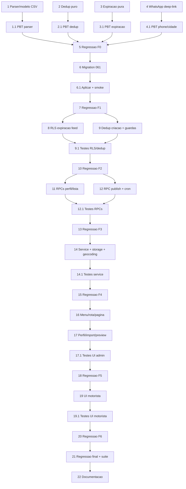

# Implementation Plan — Frete Comunidade

## Overview

Plano incremental para a feature Frete Comunidade (muleta de lançamento que abastece o feed
com fretes coletados em grupos, publicados em lote por planilha CSV no painel admin). Também
entrega duas regras transversais que valem para **TODOS os fretes** (embarcador real +
comunidade): **Auto-expiração em 5 dias** (reset ao editar) e **bloqueio de duplicado**.

Política de execução (exigência do dono — nível sênior, sem atalho):

- **Testes em toda funcionalidade**: cada tarefa de código de produção tem uma sub-tarefa de
  testes dedicada (unit + property-based onde há invariante do design, P1–P7). Property tests em
  `src/__tests__/` (`cp<N>_<nome>.property.test.ts`, mínimo 100 iterações; convenções fast-check
  do projeto — nunca `fc.stringOf`; phone via `fc.constantFrom`).
- **Regressão a cada fase**: ao fim de CADA fase, rodar a suíte COMPLETA (`tsc --noEmit` +
  `vitest run` de TODOS os testes novos e antigos + `npm run build`) e confirmar verde; rodar a
  suíte de novo para garantir que nada ficou flaky. Nenhuma fase avança com teste vermelho.
- **Checkpoint/revert**: ao fim de cada fase verde, fazer commit (git) como ponto de reversão,
  mensagem pt-BR `feat(frete-comunidade): ...`. Só commitar; push conforme o dono pedir.
- **CSV-only no MVP**: parser e modelo só CSV. XLSX fica como item de fase futura (marcado `*`).
- **Acesso só admin**: tudo no painel admin (gating `FINANCEIRO_VIEW` para ver, `FINANCEIRO_EDIT`
  para publicar/editar). Sem pagamento envolvido.
- **Não quebrar o existente**: RLS estendida de forma aditiva; `embarcador_id` nullable com
  guardas; fretes atuais viram `source='embarcador'` por default.

## Tasks

## Fase 0 — Núcleo puro (sem I/O, sem banco) — risco zero

- [ ] 1. Parser e modelo da planilha (CSV)
  - Criar `src/utils/communitySheet.ts`: `COMMUNITY_SHEET_HEADER` (ordem: transportadora, origem,
    destino, local de carregamento, local de descarregamento, valor, tipo de produto, telefone),
    `parseCommunityMatrix`, `parseCommunityCsv` (BOM-tolerante, `;`, CRLF/LF, RFC 4180),
    `validateTemplate`, `validateImportRow`, `buildModeloPlanilhaCsv` (BOM UTF-8 + `;` + `\r\n` +
    cabeçalho pt-BR + 1 linha exemplo), `normalizeCommunityPhone` (delega a `phoneFormat`),
    `MAX_IMPORT_ROWS = 200`.
  - _Requirements: 4.2, 4.3, 4.4, 5.2, 5.3, 5.4, 5.5, 5.6, 5.7, 5.9, 5.10, 5.11, 5.12_

- [ ] 1.1 Property tests do parser/modelo
  - `cp1_community_sheet_roundtrip.property.test.ts` (P1: gerar modelo → parsear reproduz linhas
    equivalentes); `cp2_community_template_validation.property.test.ts` (P2: cabeçalho divergente
    ⇒ `INVALID_TEMPLATE`); `cp3_community_row_validation.property.test.ts` (P3: validação de linha
    determinística e completa). + unit: BOM/`;`/`\r\n`, limite 200, planilha vazia.
  - _Requirements: 4.2, 4.3, 4.4, 5.3–5.7, 5.9–5.12 (Properties 1, 2, 3)_

- [ ] 2. Dedup puro (todos os campos)
  - Criar `src/utils/communityDedup.ts`: `normalizeDedupText` (trim + colapso de espaços +
    lowercase), `computeDedupKey` (todos os campos: origem, destino, origin_detail,
    destination_detail, value 2 casas, product, carrierName, contactPhone só dígitos),
    `isDuplicate` (true só quando tupla COMPLETA coincide).
  - _Requirements: 7.1, 7.2, 7.3, 7.8, 12.1, 12.3, 12.4, 12.6_

- [ ] 2.1 Property test do dedup
  - `cp4_community_dedup.property.test.ts` (P4: tupla completa, simétrico, idempotente, estável;
    difere em ≥1 campo ⇒ não duplicado).
  - _Requirements: 7.1–7.3, 7.8, 12.1, 12.3, 12.4, 12.6 (Property 4)_

- [ ] 3. Expiração pura (transversal, todos os fretes)
  - Criar `src/utils/communityExpiry.ts`: `EXPIRY_DAYS = 5`, `expiryReferenceDate` (usa
    `updated_at`), `isVisibleByExpiry` (now < ref + 5d), `daysUntilExpiry` (>= 0).
  - _Requirements: 3.3, 11.1, 11.2, 11.3, 11.5, 11.6_

- [ ] 3.1 Property test da expiração
  - `cp5_community_expiry.property.test.ts` (P5: visibilidade sse now < ref+5d; reset reabre
    janela; idempotência do reprocessamento; independe de source).
  - _Requirements: 3.3, 11.1, 11.2, 11.5, 11.6 (Property 5)_

- [ ] 4. Deep-link WhatsApp + domínio
  - Criar `src/utils/communityFrete.ts`: `FRETEGO_DOMAIN`, `buildCommunityWhatsAppMessage`
    (mensagem fixa com domínio), `buildWhatsAppDeepLink` (`https://wa.me/55<digits>?text=...`;
    `null` se telefone inválido).
  - _Requirements: 5.7, 10.7, 10.8_

- [ ] 4.1 Property tests telefone + deep-link e pré-condição de cidade
  - `cp6_community_phone_deeplink.property.test.ts` (P6: normalização idempotente; deep-link
    bem-formado com domínio; `null` quando inválido); `cp7_community_city_precondition.property.test.ts`
    (P7: linha só elegível se válida + origem/destino resolvidas + não excluída).
  - _Requirements: 5.7, 6.7, 8.3, 10.7, 10.8, 15.4, 15.5, 15.8 (Properties 6, 7)_

- [ ] 5. Regressão + checkpoint da Fase 0
  - Rodar `tsc --noEmit` + `vitest run` (TODOS os testes) + `npm run build`; repetir a suíte 1x
    para checar estabilidade. Com tudo verde, commit `feat(frete-comunidade): nucleo puro (planilha, dedup, expiracao, whatsapp) + property tests`.
  - _Requirements: governança de testes_

## Fase 1 — Banco (migration 061)

- [ ] 6. Migration 061: colunas, perfil singleton e trigger
  - `supabase/migrations/061_frete_comunidade.sql` idempotente com `DO $check$` (verifica `fretes`,
    `is_admin_with_permission`): ADD `source text NOT NULL DEFAULT 'embarcador' CHECK (...)`,
    `community_carrier_name text NULL`, `community_contact_phone text NULL`, CHECK condicional de
    coerência comunidade; `ALTER COLUMN embarcador_id DROP NOT NULL`; índice parcial
    `idx_fretes_source_comunidade`; tabela `community_profile` (singleton, foto/nome/nome
    secundário/`enabled`) com RLS leitura pública + `_no_dml`; trigger `fretes_touch_expiry`
    (reset `updated_at` em UPDATE); índice único funcional `uq_fretes_dedup_active` (WHERE
    status='ativo') com `DO $check$` defensivo para colisões pré-existentes; bucket
    `community_profile`. Par `061_frete_comunidade_rollback.sql` documentado.
  - _Requirements: 2.2, 9.2, 9.3, 9.4, 9.5, 9.7, 11.3, 11.4, 14.1_

- [ ] 6.1 Aplicar migration + smoke + advisors
  - Aplicar via MCP/apply_migration; rodar bloco VERIFY (colunas, CHECKs, índices, policies,
    trigger, bucket existem); conferir advisors de segurança (RLS). Teste de integração de
    idempotência (rodar a migration 2x sem erro) em `tests/`.
  - _Requirements: 9.7_

- [ ] 7. Regressão + checkpoint da Fase 1
  - Suíte completa 2x verde; commit `feat(frete-comunidade): migration 061 (colunas, perfil, trigger, dedup index)`.
  - _Requirements: governança de testes_

## Fase 2 — RLS, expiração no feed e dedup na criação geral

- [ ] 8. Expiração no feed (RLS aditiva) + visibilidade da feature
  - Reescrever `fretes_select_policy` preservando toda a semântica atual e adicionando, no ramo
    `status='ativo'`: `now() < updated_at + INTERVAL '5 days'` (Auto_Expiracao) e ocultação de
    comunidade quando `community_profile.enabled = false`. Dono/admin não-regridem.
  - _Requirements: 11.1, 11.2, 11.5, 14.2_

- [ ] 9. Dedup na criação geral + guarda de source em triggers dependentes
  - `createFrete` (`src/services/fretes.ts`) traduz unique-violation `23505` do índice de dedup
    para `DEDUP_BLOCKED` com mensagem canônica anti-enumeração. Se houver trigger de repasse
    financeiro dependente de `embarcador_id`, adicionar guarda `IF NEW.source='comunidade' THEN
    RETURN NEW`. Garantir que `getActiveFretes` retorna os campos community.
  - _Requirements: 12.2, 12.3, 12.4, 12.5, 9.8_

- [ ] 9.1 Testes de RLS, expiração e dedup (integração)
  - Em `tests/`: comunidade aparece para motorista (ativo + < 5 dias + enabled), some quando
    expirado/`enabled=false`; não-regressão do embarcador (criar frete, dono vê o próprio);
    INSERT duplicado falha 23505 ⇒ `DEDUP_BLOCKED`; diferença em 1 campo passa; trigger
    `fretes_touch_expiry` reseta `updated_at` no UPDATE.
  - _Requirements: 11.1, 11.4, 12.2, 12.3, 14.2, 9.8_

- [ ] 10. Regressão + checkpoint da Fase 2
  - Suíte completa 2x verde; commit `feat(frete-comunidade): expiracao no feed + dedup na criacao (geral)`.
  - _Requirements: governança de testes_

## Fase 3 — RPCs SQL de assinatura do módulo comunidade

- [ ] 11. RPCs de perfil e listagem
  - Na 061 (ou 061b): `community_profile_get()` (FINANCEIRO_VIEW), `community_profile_upsert(...)`
    (FINANCEIRO_EDIT, versionamento otimista `STALE_VERSION`, valida 1..120 / 0..160, audit
    `COMMUNITY_PROFILE_UPDATED`), `admin_list_community_fretes(p_q, p_sort, p_limit, p_offset)`
    (STABLE, espelha `admin_list_subscriptions`, calcula `daysLeft`). REVOKE/GRANT, audit negativo
    `COMMUNITY_VIEW_DENIED`, `auth.uid()` guard.
  - _Requirements: 1.4, 1.5, 2.3, 2.4, 2.5, 3.1, 3.2, 3.3_

- [ ] 12. RPC de publicação em lote + cron de expiração
  - `community_publish_fretes(p_payload jsonb)` (FINANCEIRO_EDIT): insert/update/skip por linha,
    pool de concorrência 5, bloqueios `NO_PROFILE`/`FEATURE_DISABLED`/`CITY_UNRESOLVED`, grava
    `source='comunidade'` + carrier + phone normalizado + coords + distance_km; resiliência por
    linha (uma falha não derruba o lote); audit `COMMUNITY_FRETES_PUBLISHED`; retorna
    `{published, updated, skipped, errors}`. `community_expire_stale_fretes()` idempotente
    (status→encerrado para ativos > 5 dias) + agendamento pg_cron diário*.
  - _Requirements: 8.1, 8.2, 8.3, 8.4, 8.5, 8.6, 8.7, 8.8, 8.9, 7.6, 7.7, 11.6_

- [ ] 12.1 Testes das RPCs (integração)
  - Em `tests/`: gating + `permission_denied` + audit `COMMUNITY_VIEW_DENIED` persistido;
    publish insert/update/skip, `NO_PROFILE`, `FEATURE_DISABLED`, audit
    `COMMUNITY_FRETES_PUBLISHED` persistido; isolamento/idempotência do cron.
  - _Requirements: 1.4, 1.5, 8.2, 8.7, 8.9 (Property 7 lado servidor)_

- [ ] 13. Regressão + checkpoint da Fase 3
  - Suíte completa 2x verde; commit `feat(frete-comunidade): RPCs de perfil, publicacao em lote e cron`.
  - _Requirements: governança de testes_

## Fase 4 — Service TS + Storage + geocoding

- [ ] 14. Service admin/comunidade + upload + geocoding em lote
  - `src/services/admin/comunidade.ts`: tipos, `mapError`, parse/serialize de filtros (espelho de
    `subscriptions.ts`), `getCommunityProfile`/`upsertCommunityProfile`, `uploadCommunityPhoto`
    (bucket `community_profile`, valida MIME png/jpeg/webp ≤ 5 MB → `INVALID_FILE_TYPE`),
    `setCommunityEnabled`, `listCommunityFretes`, `publishCommunityFretes`. Geocoding em lote do
    preview reusando `services/ibge.ts` + `services/geolocation.ts` (autocomplete + coords +
    distance_km), idêntico ao FreteForm do embarcador.
  - _Requirements: 2.1, 2.6, 2.7, 3.1, 8.1, 8.6, 15.1, 15.2, 15.3, 15.7_

- [ ] 14.1 Testes do service
  - Unit: `mapError` (códigos → pt-BR canônico, anti-enumeração), filtros round-trip
    (parse↔serialize), validação de foto (MIME/limite). `vi.mock` hoisted com spies via
    `globalThis` (convenção do projeto).
  - _Requirements: 2.6, 3.2_

- [ ] 15. Regressão + checkpoint da Fase 4
  - Suíte completa 2x verde; commit `feat(frete-comunidade): service admin + storage + geocoding em lote`.
  - _Requirements: governança de testes_

## Fase 5 — UI Admin

- [ ] 16. Menu, rota e página principal
  - `AdminSidebar`: item "Frete Comunidade" gated (`FINANCEIRO_VIEW`); rota `frete-comunidade` em
    `AdminLayoutRoute`; `src/pages/admin/comunidade/CommunityListPage.tsx` (Stealth404,
    Compact_Layout_Pattern, sem `<h1>`), com blocos Perfil + Importação + Lista.
  - _Requirements: 1.1, 1.2, 1.3, 1.6, 3.4, 3.5_

- [ ] 17. Perfil, importação e preview editável
  - `CommunityProfileForm` (foto + nome + nome secundário + toggle `enabled`; validação front);
    `CommunityImportPanel` (baixar modelo, upload CSV, dispara parser); `CommunityPreviewTable`
    (editável célula a célula, revalida ao editar, status por linha válida/erro/duplicada/cidade
    pendente, resumo de contagens, escolha excluir/atualizar duplicado, botão Publicar
    desabilitado sem linha elegível); `CommunityCityAutocomplete` (IBGE + geocoding);
    `CommunityFretesTable` (lista 10/50/100, mobile cards).
  - _Requirements: 2.1, 2.8, 2.9, 4.1, 5.1, 5.8, 5.11, 6.1, 6.2, 6.3, 6.4, 6.5, 6.6, 6.7, 7.4, 7.5, 8.1, 8.4, 8.6, 8.7, 14.3, 15.1, 15.4, 15.5, 15.6, 15.8_

- [ ] 17.1 Testes de UI Admin (react-dom/act)
  - Gating → Stealth404 sem `FINANCEIRO_VIEW`; preview revalida ao editar célula; botão Publicar
    desabilitado sem linha elegível; contagem de duplicados; download do modelo. Sem
    @testing-library (react-dom/client + act + MemoryRouter).
  - _Requirements: 1.3, 6.3, 6.7, 7.4, 8.1_

- [ ] 18. Regressão + checkpoint da Fase 5
  - Suíte completa 2x verde; commit `feat(frete-comunidade): painel admin (perfil, import, preview editavel)`.
  - _Requirements: governança de testes_

## Fase 6 — UI Motorista

- [ ] 19. Card e modal condicionais a source='comunidade'
  - `FreteCard`: quando `source==='comunidade'`, exibe foto do perfil + "Frete Comunidade" +
    "Frete sugerido pela comunidade". `FreteModal`: identidade comunidade + `community_carrier_name`;
    botão "WhatsApp" no lugar do "Chat" com `buildWhatsAppDeepLink`; curto-circuito do fetch de
    `embarcador_id`; oculta WhatsApp e mostra "Contato indisponível" sem telefone. Feed lê o
    `community_profile` (cache em memória).
  - _Requirements: 10.1, 10.2, 10.3, 10.4, 10.5, 10.6, 10.7, 10.8_

- [ ] 19.1 Testes de UI Motorista (react-dom/act)
  - Card/modal comunidade vs normal (identidade + transportadora); botão WhatsApp abre deep-link
    correto; sem telefone oculta o botão; frete normal mantém Chat (não-regressão).
  - _Requirements: 10.2, 10.4, 10.5, 10.6, 10.8_

- [ ] 20. Regressão + checkpoint da Fase 6
  - Suíte completa 2x verde; commit `feat(frete-comunidade): UI do motorista (card/modal comunidade + WhatsApp)`.
  - _Requirements: governança de testes_

## Fase 7 — Fechamento

- [ ] 21. Regressão final + Regression_Suite + cobertura + advisors
  - Rodar suíte completa (tsc + vitest + build) 2x; atualizar `tests/README.md` (Regression_Suite)
    com os novos cp tests; conferir cobertura dos Critical_Modules tocados; advisors de segurança
    Supabase.
  - _Requirements: governança de testes (Properties 1–7)_

- [ ] 22. Documentação técnica
  - `docs/frete-comunidade.md`: formato da planilha CSV (colunas/exemplo), fluxo de importação
    (download → upload → preview editável → geocoding → publicar), regra de auto-expiração (geral,
    5 dias, reset ao editar), dedup (todos os campos), toggle de habilitar/desabilitar, e operação
    do cron. Commit final.
  - _Requirements: 4.2, 11, 12, 14_

## Fase 8 — Futuro (NÃO implementar agora)

- [ ] 23.* Suporte a XLSX na importação
  - Adaptador `parseXlsxToMatrix` via SheetJS (`xlsx`) → matriz → MESMO parser puro. Marcado como
    incremento (decisão D3: MVP é CSV-only).
  - _Requirements: 5.1 (parte XLSX)_

- [ ] 24.* Algoritmo de recomendação do feed
  - Escopo futuro registrado no Req 13 (preferências do motorista, compatibilidade de caminhão,
    embaralhamento). NÃO faz parte desta entrega; frete comunidade dispara tudo para todos.
  - _Requirements: 13.1, 13.2, 13.3_

## Task Dependency Graph

```json
{
  "waves": [
    { "wave": 1, "tasks": ["1", "2", "3", "4"] },
    { "wave": 2, "tasks": ["1.1", "2.1", "3.1", "4.1"] },
    { "wave": 3, "tasks": ["5"] },
    { "wave": 4, "tasks": ["6"] },
    { "wave": 5, "tasks": ["6.1"] },
    { "wave": 6, "tasks": ["7"] },
    { "wave": 7, "tasks": ["8", "9"] },
    { "wave": 8, "tasks": ["9.1"] },
    { "wave": 9, "tasks": ["10"] },
    { "wave": 10, "tasks": ["11", "12"] },
    { "wave": 11, "tasks": ["12.1"] },
    { "wave": 12, "tasks": ["13"] },
    { "wave": 13, "tasks": ["14"] },
    { "wave": 14, "tasks": ["14.1"] },
    { "wave": 15, "tasks": ["15"] },
    { "wave": 16, "tasks": ["16", "17"] },
    { "wave": 17, "tasks": ["17.1"] },
    { "wave": 18, "tasks": ["18"] },
    { "wave": 19, "tasks": ["19"] },
    { "wave": 20, "tasks": ["19.1"] },
    { "wave": 21, "tasks": ["20"] },
    { "wave": 22, "tasks": ["21", "22"] }
  ]
}
```



## Notes

- **Ordem segura:** Fase 0 (núcleo puro) não toca banco nem UI — risco zero, ótimo ponto de
  partida e base testável para tudo que vem depois.
- **Não quebrar:** a `fretes_select_policy` é estendida de forma ADITIVA (expiração + flag de
  feature só no ramo do feed); `embarcador_id` vira nullable com guardas; fretes existentes
  recebem `source='embarcador'` por default. O fluxo atual de embarcador/motorista permanece.
- **Auto-expiração é GERAL:** vale para TODOS os fretes (embarcador real + comunidade), não só
  comunidade. Implementada por filtro na leitura (fonte de verdade) + cron diário de limpeza
  idempotente.
- **Dedup é GERAL:** bloqueia só quando TODOS os campos coincidem; difere em 1 campo ⇒ permite.
- **CSV-only no MVP:** XLSX fica na Fase 8 (`*`), sem implementar agora.
- **Acesso só admin:** gating `FINANCEIRO_VIEW`/`FINANCEIRO_EDIT`, Stealth_404, audit negativo
  `COMMUNITY_VIEW_DENIED`. Sem pagamento.
- **Testes + regressão + commit por fase (exigência do dono):** cada funcionalidade com testes
  dedicados; ao fim de cada fase, suíte completa (novos + antigos) rodada 2x e verde antes de
  avançar; commit de checkpoint para permitir revert.
- **Migrations:** 061 (colunas + perfil + trigger + dedup index) com par `_rollback`. Próxima
  livre após 060.
- **CPs obrigatórios sem asterisco; opcionais com `*`** (XLSX, agendamento pg_cron quando a
  extensão não estiver disponível no ambiente).
