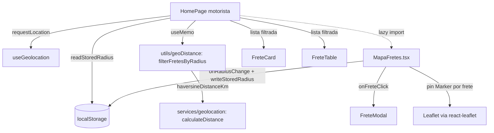

# Design Document — Home Map Radius

## 1. Visão Geral

Esta feature transforma a `HomePage` no painel operacional do
motorista, sem alterar nada do embarcador ou do visitante. A
entrega adiciona ao **ramo motorista**:

- Mapa fixo no topo com pins clicáveis e expandir/recolher.
- Geolocalização via hook existente `useGeolocation`.
- Filtro de raio (50/100/200/500 km) com persistência em
  `localStorage`.
- Filtro client-side da lista de fretes pelo raio escolhido.
- Banner orientativo quando a permissão de localização é negada.

A entrega é dividida em **três frentes coordenadas**:

### Frente Utilitários (puros)

Um único módulo novo `src/utils/geoDistance.ts` com:

- `haversineDistanceKm(p1, p2)` — **re-exporta** `calculateDistance`
  do `services/geolocation.ts` para padronizar o ponto de uso pelos
  consumidores novos. A função real continua morando no service
  (Haversine já existente, já com PBT). Decisão de design
  intencional: **opção (a)** descrita no glossário do
  requirements — sem alterar a assinatura externa de
  `calculateDistance`. O service continua expondo a função para os
  consumidores antigos (`fretes.ts` calcula distância de rota mas
  pode no futuro reusar).
- `filterFretesByRadius(fretes, motoristaPoint, radiusKm)` —
  função pura nova que combina Haversine + critérios de exclusão
  para fretes com coordenadas inválidas, com fallback explícito
  quando `motoristaPoint` é nulo.
- `readStoredRadius(raw)` / `writeStoredRadius(value)` — helpers
  puros que encapsulam a leitura/escrita do `localStorage` com
  guards (valor inválido, `localStorage` indisponível, lixo).

Esses utilitários são testáveis por PBT sem dependência de React.

### Frente Componente (lazy)

Um único componente novo `src/components/MapaFretes.tsx` que
encapsula:

- `MapContainer` do react-leaflet com `TileLayer` do OSM.
- Banner amarelo de permissão (re-prompt).
- Botão expandir/recolher.
- Chips de raio (50/100/200/500).
- Pins (`Marker`) para cada frete dentro do raio, com `divIcon`
  HTML colorido por status (verde para ativo, cinza para
  encerrado).
- Popup com rota, valor formatado e distância motorista→origem.

O componente é importado por `React.lazy(() => import('./MapaFretes'))`
**dentro** do bloco motorista da `HomePage`, garantindo que o chunk
do Leaflet não entre no bundle inicial de visitantes/embarcadores.
O CSS `leaflet/dist/leaflet.css` é importado **dentro** de
`MapaFretes.tsx`, não em `index.css` ou `main.tsx`, para que ele
também caia no chunk lazy.

### Frente HomePage (wiring)

A `HomePage` ganha uma divisão lógica baseada em
`user?.userType === 'motorista'`. No ramo motorista:

- Hook `useGeolocation` instanciado e disparado uma vez na
  montagem.
- Estado `radiusKm` com hidratação de localStorage via
  `readStoredRadius`.
- `useMemo` que aplica `filterFretesByRadius` à lista vinda do
  servidor.
- `<Suspense>` com fallback skeleton + `<MapaFretes ... />`
  recebendo props simples.
- Botão "Ver mapa" original removido (substituído pelo mapa fixo).
- Banner amarelo `showCalcBanner` continua igual.

Para visitantes e embarcadores, o ramo atual da `HomePage` segue
**bit a bit idêntico** ao código de hoje, incluindo o botão
"Ver mapa" e o `InteractiveMap` original.

### Diagrama de fluxo



---

## 2. Glossário Técnico

| Termo do requirements           | Artefato de código                                       |
| ------------------------------- | -------------------------------------------------------- |
| HomePage                        | `src/pages/HomePage.tsx` (estendida)                     |
| MapaFretes                      | NOVO `src/components/MapaFretes.tsx`                     |
| MapaFretesLazy                  | `React.lazy(() => import('./MapaFretes'))` dentro da HomePage |
| InteractiveMap                  | `src/components/InteractiveMap.tsx` (REUSADO sem alteração; usado apenas no ramo não-motorista) |
| useGeolocationHook              | `src/hooks/useGeolocation.ts` (REUSADO sem alteração)    |
| GeolocationService              | `src/services/geolocation.ts` (REUSADO; função `calculateDistance` re-exportada via novo módulo) |
| GeoDistanceUtil                 | NOVO `src/utils/geoDistance.ts`                          |
| FretesService                   | `src/services/fretes.ts` (REUSADO; sem alteração nesta feature) |
| FreteCard / FreteTable / FreteModal / FreteFiltersComponent | REUSADOS sem alteração                            |
| AppHeader                       | REUSADO sem alteração                                    |
| RadiusOptions_km                | constante `[50, 100, 200, 500]` exportada de `geoDistance.ts` |
| RadiusDefault_km                | constante `100` exportada de `geoDistance.ts`            |
| LocalStorageRadiusKey           | `'fretego-motorista-radius'`                             |
| ParaDepoisDoc                   | `.kiro/PARA_DEPOIS.md` (entrada nova adicionada no topo) |

### Decisões explícitas

**Decisão 1 — Reuso de `calculateDistance`.** Conforme recomendação
do prompt, opção (a): o novo `utils/geoDistance.ts` re-exporta
`calculateDistance` do service como `haversineDistanceKm`. A
função real continua morando em `services/geolocation.ts` e
mantém sua assinatura pública intacta (Req 6.7, 6.8, 11.3, 11.4).
**Não** vamos refatorar `geolocation.ts` para importar do
`utils/`; o sentido natural de dependência do projeto é
`utils → services → pages`, e inverter introduziria churn em um
arquivo já estável e testado. O custo é uma re-export de 1 linha;
o benefício é zero migration risk e zero alteração no PBT
existente em `geolocation.property.test.ts`.

**Decisão 2 — Pins via `divIcon`.** Em vez de baixar PNGs de
marker do Leaflet (já vimos isso quebrar com bundlers em
`InteractiveMap.tsx` — workaround de `mergeOptions` com URLs CDN),
o `MapaFretes` usa `L.divIcon({ html, className })` com SVG inline
colorido por status. Vantagens: sem dependência de URLs externas,
cor definida por classe Tailwind, menor footprint visual no
bundle.

**Decisão 3 — CSS do Leaflet no chunk lazy.** O import de
`leaflet/dist/leaflet.css` fica **dentro** do `MapaFretes.tsx`
(arquivo lazy), não em `main.tsx` ou `index.css`. O Vite agrupa
o CSS importado por um módulo no mesmo chunk lógico do JS — o
CSS só é carregado quando o JS do mapa é carregado, ou seja,
apenas para motoristas (Req 10.4).

**Decisão 4 — Coexistir InteractiveMap e MapaFretes.** O ramo
não-motorista segue usando `InteractiveMap` via botão "Ver mapa"
(comportamento atual). O ramo motorista deixa de mostrar o botão
"Ver mapa" e passa a mostrar `MapaFretes` fixo no topo. Os dois
componentes coexistem no código (Req 11.4); só o consumo difere.

**Decisão 5 — PARA_DEPOIS.md: substituir a entrada antiga de
"API de pedágios"** pela nova mais completa (com quatro opções
pesquisadas e estratégia curto prazo). A entrada antiga de
`2026-05-22 — API de pedágios` é **substituída**, não duplicada,
porque o conteúdo novo cobre tudo o que a antiga dizia e mais.
As três outras entradas existentes (forma de pagamento, dashboard
admin, aprovação de documentos) permanecem inalteradas. Req 8.7
deixa essa decisão para o design — escolhemos consolidar para
manter o backlog limpo.

---

## 3. Arquitetura por Requirement

### Req 1 — Mapa fixo apenas no ramo motorista

- **Arquivos:** `HomePage.tsx`, `MapaFretes.tsx`.
- **Render condicional:** dentro de `<main>`, antes do bloco de
  filtros, adicionar:

  ```tsx
  {isMotorista && (
    <Suspense fallback={<MapaSkeleton />}>
      <MapaFretes
        fretes={fretes}
        motoristaPoint={geo.point}
        radiusKm={radiusKm}
        onRadiusChange={handleRadiusChange}
        onFreteClick={handleFreteClick}
        geolocationStatus={geo.status}
        onRequestLocation={geo.requestLocation}
      />
    </Suspense>
  )}
  ```

- **Estado expandir/recolher:** controlado **dentro** do
  `MapaFretes` (estado local `expanded: boolean`). HomePage não
  precisa saber se o mapa está expandido. Heights aplicados via
  classe Tailwind condicional:

  ```ts
  const heightClass = expanded
    ? 'h-[60vh]'
    : 'h-[180px] md:h-[220px]';
  ```

- **Botão "Ver mapa" original:** no ramo motorista, **não
  renderizar** o botão `Ver mapa`/`Ver lista`. Manter para os
  outros perfis.
- **Wiring de visibilidade do botão:** envolver o `<button>` no
  JSX em `{!isMotorista && <button ...>Ver mapa</button>}`.

### Req 2 — Solicitação automática de geolocalização

- **Arquivos:** `HomePage.tsx`.
- **Hook:** `const geo = useGeolocation();`
- **Disparo único na montagem:**

  ```ts
  useEffect(() => {
    if (!isMotorista) return;
    geo.requestLocation();
    // eslint-disable-next-line react-hooks/exhaustive-deps
  }, [isMotorista]);
  ```

  O `eslint-disable` é justificado: queremos disparar uma vez por
  montagem do ramo motorista; `geo.requestLocation` é estável via
  `useCallback`, mas não queremos disparar se ele recriar.

- **Estados em `MapaFretes`:**
  - `'idle'` ou `'loading'` → renderiza skeleton (sem mapa nem
    pins; banner não aparece).
  - `'success'` → renderiza mapa, recentralizado em `point`, pins
    da lista filtrada.
  - `'denied'` → banner amarelo + mensagem extra
    "Permissão bloqueada — habilite nas configurações do
    navegador.".
  - `'error'` → banner amarelo (sem mensagem extra).
- **Re-prompt:** botão "Ativar localização" chama
  `onRequestLocation()` (prop), que mapeia para
  `geo.requestLocation()` na HomePage.

### Req 3 — Filtro por raio com persistência

- **Arquivos:** `HomePage.tsx` (estado), `MapaFretes.tsx` (UI),
  `geoDistance.ts` (helpers puros).
- **Helpers puros (testáveis por PBT):**

  ```ts
  // src/utils/geoDistance.ts
  export const RADIUS_OPTIONS_KM = [50, 100, 200, 500] as const;
  export type RadiusOption = (typeof RADIUS_OPTIONS_KM)[number];
  export const RADIUS_DEFAULT_KM: RadiusOption = 100;
  export const RADIUS_STORAGE_KEY = 'fretego-motorista-radius';

  /**
   * Hidrata o raio a partir de uma string (vinda do localStorage).
   * Para qualquer entrada — string válida, inválida, lixo ou null —
   * retorna sempre um membro de RADIUS_OPTIONS_KM.
   */
  export function readStoredRadius(raw: string | null): RadiusOption {
    if (raw === null) return RADIUS_DEFAULT_KM;
    const n = Number(raw);
    if (!Number.isFinite(n)) return RADIUS_DEFAULT_KM;
    if ((RADIUS_OPTIONS_KM as readonly number[]).includes(n)) {
      return n as RadiusOption;
    }
    return RADIUS_DEFAULT_KM;
  }

  /**
   * Tenta gravar o valor em localStorage. Engole erros (Safari
   * privado, quota cheia, indisponível). É seguro chamar em SSR
   * via guard de `typeof window`.
   */
  export function writeStoredRadius(value: RadiusOption): void {
    try {
      if (typeof window === 'undefined') return;
      window.localStorage.setItem(RADIUS_STORAGE_KEY, String(value));
    } catch {
      // localStorage indisponível — silencioso (Req 3.5)
    }
  }
  ```

- **Hidratação na HomePage:**

  ```ts
  const [radiusKm, setRadiusKm] = useState<RadiusOption>(() => {
    if (typeof window === 'undefined') return RADIUS_DEFAULT_KM;
    return readStoredRadius(window.localStorage.getItem(RADIUS_STORAGE_KEY));
  });
  const handleRadiusChange = useCallback((next: RadiusOption) => {
    setRadiusKm(next);
    writeStoredRadius(next);
  }, []);
  ```

- **UI dentro do MapaFretes:**

  ```tsx
  <div className="flex gap-2 overflow-x-auto">
    {RADIUS_OPTIONS_KM.map((r) => (
      <button
        key={r}
        type="button"
        onClick={() => onRadiusChange(r)}
        className={`min-h-[44px] px-3 rounded-full border text-base sm:text-sm ${
          r === radiusKm
            ? 'bg-blue-600 text-white border-blue-600'
            : 'bg-white text-gray-700 border-gray-300 hover:bg-gray-50'
        }`}
      >
        {r} km
      </button>
    ))}
  </div>
  ```

- **Ajuste de zoom ao mudar raio:** `useEffect` dentro do
  `MapaFretes` que escuta `[radiusKm, motoristaPoint]` e chama
  `map.fitBounds(circleBounds(point, radiusKm), { padding: [40, 40] })`
  quando ambos disponíveis. O bounds do círculo é calculado via
  `L.circle(point, radiusKm * 1000).getBounds()` ou aritmética
  simples (1° lat ≈ 111 km).

### Req 4 — Filtro client-side da lista por raio

- **Arquivos:** `geoDistance.ts` (função pura),
  `HomePage.tsx` (consumo via `useMemo`).
- **Função pura:**

  ```ts
  // src/utils/geoDistance.ts
  import type { GeographicPoint } from '../types';
  import { calculateDistance } from '../services/geolocation';
  import type { Frete } from '../services/fretes';

  // Opção (a) recomendada: re-export sem duplicar lógica.
  export const haversineDistanceKm = calculateDistance;

  function hasValidLocation(p: GeographicPoint): boolean {
    return (
      Number.isFinite(p.latitude) &&
      Number.isFinite(p.longitude) &&
      !(p.latitude === 0 && p.longitude === 0)
    );
  }

  /**
   * Filtra fretes por proximidade ao motorista. Quando
   * `motoristaPoint` é null (geolocalização inativa), devolve
   * a lista original sem alteração — fallback explícito do Req 4.2/7.1.
   *
   * Quando `motoristaPoint` está presente, retorna apenas fretes
   * cuja origem é (i) válida (lat/lng finitos e não-zero) e
   * (ii) está dentro do raio.
   */
  export function filterFretesByRadius<T extends { originLocation: GeographicPoint }>(
    fretes: T[],
    motoristaPoint: GeographicPoint | null,
    radiusKm: number,
  ): T[] {
    if (motoristaPoint === null) return fretes;
    return fretes.filter((f) => {
      if (!hasValidLocation(f.originLocation)) return false;
      return haversineDistanceKm(motoristaPoint, f.originLocation) <= radiusKm;
    });
  }
  ```

- **Consumo memoizado:**

  ```ts
  const motoristaPoint = geo.status === 'success' ? geo.point : null;
  const visibleFretes = useMemo(
    () => filterFretesByRadius(fretes, motoristaPoint, radiusKm),
    [fretes, motoristaPoint, radiusKm],
  );
  ```

  `visibleFretes` substitui `fretes` em todos os renders
  downstream (cards, tabela, paginação, contador).

### Req 5 — Pins de fretes plotados na origem

- **Arquivos:** `MapaFretes.tsx`.
- **DivIcon por status:**

  ```ts
  function pinIcon(status: 'ativo' | 'encerrado' | string): L.DivIcon {
    const color =
      status === 'ativo'
        ? '#16a34a' /* tailwind green-600 */
        : '#9ca3af' /* tailwind gray-400 */;
    return L.divIcon({
      className: 'mapafretes-pin',
      iconSize: [22, 28],
      iconAnchor: [11, 28],
      popupAnchor: [0, -24],
      html: `<svg width="22" height="28" viewBox="0 0 22 28" xmlns="http://www.w3.org/2000/svg">
        <path fill="${color}" stroke="#ffffff" stroke-width="1.5"
              d="M11 0a11 11 0 0 0-11 11c0 7.5 11 17 11 17s11-9.5 11-17A11 11 0 0 0 11 0z"/>
        <circle cx="11" cy="11" r="4" fill="#ffffff"/>
      </svg>`,
    });
  }
  ```

- **Render dos pins:**

  ```tsx
  {visibleFretes.map((f) => (
    <Marker
      key={f.id}
      position={[f.originLocation.latitude, f.originLocation.longitude]}
      icon={pinIcon(f.status)}
      eventHandlers={{ click: () => onFreteClick(f) }}
    >
      <Popup>
        <div className="min-w-[180px]">
          <p className="font-semibold text-gray-800">{f.origin} → {f.destination}</p>
          <p className="text-green-700 font-bold">{formatBRL(f.value)}</p>
          {motoristaPoint && (
            <p className="text-gray-600 text-xs">
              {fmtDistanceKm(haversineDistanceKm(motoristaPoint, f.originLocation))} km de você
            </p>
          )}
        </div>
      </Popup>
    </Marker>
  ))}
  ```

  - `formatBRL` usa o mesmo `Intl.NumberFormat('pt-BR', { style: 'currency', currency: 'BRL' })` do `FreteCard`.
  - `fmtDistanceKm` formata 1 casa decimal com `toLocaleString('pt-BR', { minimumFractionDigits: 1, maximumFractionDigits: 1 })`.
  - `key={f.id}` mantém o pin estável entre re-renders (Req 12.4).
- **Callback de clique:** `onFreteClick` recebe o frete e
  encaminha para `handleFreteClick` da HomePage — que já
  incrementa `viewsCount` e abre o `FreteModal`.

### Req 6 — Distância via Haversine no cliente

- **Arquivos:** `src/utils/geoDistance.ts` (NOVO).
- **Reuso direto:** `haversineDistanceKm = calculateDistance`
  do `services/geolocation.ts`. A função real **não é
  duplicada**. Os PBTs existentes em `geolocation.property.test.ts`
  continuam válidos. Adicionamos um novo PBT pequeno em
  `geoDistance.property.test.ts` para validar que o ponto de
  consumo (a re-export) preserva as propriedades — paranóia
  defensiva contra alguém substituir a re-export por uma
  implementação ad-hoc no futuro.
- **Consumidores nesta feature:**
  - `filterFretesByRadius` (Req 4.1).
  - Popup de pin no `MapaFretes` (Req 5.6).
- **Sem chamadas de rede para distância** — Haversine é
  matemática pura, ~O(1) por par de pontos (Req 6.7, 12.5).

### Req 7 — Fallback sem localização ativa

- **Arquivos:** `HomePage.tsx`, `MapaFretes.tsx`.
- **Lista intacta quando geo inativa:** `motoristaPoint === null`
  é o único parâmetro que `filterFretesByRadius` precisa para
  devolver a lista sem alterar; a HomePage seleciona `null` quando
  `geo.status !== 'success'`.
- **Mapa em estado neutro:** quando `motoristaPoint` é null E
  `geo.status` é `denied`/`error`, o `MapaFretes` renderiza com
  centro em `[-14.235, -51.9253]` e zoom 4 (igual ao
  `InteractiveMap` atual), **sem** pins. Quando `loading`/`idle`,
  renderiza skeleton em vez do mapa.
- **Banner amarelo:** renderizado **dentro** do `MapaFretes`,
  posicionado absolute no topo do container (`absolute top-2 left-2 right-2`)
  ou imediatamente abaixo, conforme caber no layout. Mensagem
  exata:
  - Linha 1: "Ative a localização para ver fretes próximos a você"
  - Botão: "Ativar localização"
  - Linha extra (apenas em `denied`): "Permissão bloqueada — habilite nas configurações do navegador."
- **Demais fluxos seguem normais:** cards, tabela, paginação,
  modal, filtros do `FreteFiltersComponent`,
  `DieselDashboardInput`, banner amarelo `showCalcBanner`.

### Req 8 — Atualização de `.kiro/PARA_DEPOIS.md`

- **Arquivo:** `.kiro/PARA_DEPOIS.md`.
- **Operação:** substituir a entrada existente
  `## 2026-05-22 — API de pedágios` por uma nova entrada com
  data atual (data do dia da implementação) e título
  "API de pedágios — opções pesquisadas e estratégia curto prazo"
  (ou similar). As outras três entradas existentes
  (`Forma de pagamento integrada`, `Dashboard administrativo do
  dono`, `Sistema de aprovação de documentos`) permanecem
  inalteradas, na mesma ordem.
- **Conteúdo da nova entrada:**

  ```markdown
  ## YYYY-MM-DD — API de pedágios — opções pesquisadas e estratégia curto prazo

  Cálculo automático de pedágios baseado na rota (origem →
  destino) e no número de eixos do caminhão do motorista. Hoje o
  painel de fretes exibe pedágio como `—` (placeholder).

  ### Opções pesquisadas

  - **TollGuru** — API paga (~US$260/mês para 20k chamadas);
    cobertura BR confirmada.
  - **QualP** — líder do mercado BR, sem self-service; integração
    requer contato comercial direto.
  - **AWS Location Service `CalculateRoute`** — pay-per-use
    (~US$0,50/1000 requests) com opção de incluir pedágios.
  - **Tabela estática de pedágios** — base local de praças por BR
    (GO/SP/MG/MT/MS) e número de eixos como mitigação.

  ### Estratégia curto prazo (mitigação)

  Manter o placeholder `—` no `FreteCard` até a entrega da próxima
  feature dedicada. A primeira iteração da integração deve usar a
  **tabela estática** das BRs principais (GO/SP/MG/MT/MS) por
  número de eixos como aproximação, sem chamada de API. A
  integração paga (TollGuru ou AWS) entra em uma segunda
  iteração após validar volume real de uso.
  ```

- **Não-implementação:** nenhuma chamada a TollGuru, QualP, AWS,
  etc., é feita nesta feature (Req 8.6).

### Req 9 — Responsividade mobile

- **Arquivos:** `MapaFretes.tsx`.
- **Padrão de classes Tailwind:**
  - Container: `w-full rounded-lg overflow-hidden` + altura
    `h-[180px] md:h-[220px]` no estado compacto, `h-[60vh]`
    expandido.
  - Chips de raio: `min-h-[44px] px-3 text-base sm:text-sm`,
    `flex gap-2 overflow-x-auto`.
  - Banner: `flex flex-col sm:flex-row items-start sm:items-center
    gap-2 p-3 bg-yellow-50 border border-yellow-200 rounded-md
    text-sm sm:text-xs`. Em ≤ 375 px, vira coluna automaticamente.
  - Botões: todos com `min-h-[44px]` (chips, "Ativar localização",
    "Expandir mapa"/"Recolher mapa").
  - Sem CSS novo em `index.css` — apenas Tailwind utilitários.
- **Pinch-zoom preservado:** `MapContainer` recebe os defaults do
  Leaflet (`dragging`, `touchZoom`, `doubleClickZoom` permanecem
  habilitados; nenhum desses atributos é negado).
- **Fontes 16 px no mobile:** todos os inputs/labels novos usam
  `text-base sm:text-sm` para evitar zoom acidental do iOS.

### Req 10 — Carregamento dinâmico

- **Arquivos:** `HomePage.tsx`, `MapaFretes.tsx`.
- **Lazy import:** no topo de `HomePage.tsx`:

  ```tsx
  import { lazy, Suspense } from 'react';
  const MapaFretes = lazy(() => import('../components/MapaFretes'));
  ```

  Usar `lazy` da raiz do `react` (não `React.lazy` namespaced)
  para casar com o estilo de imports da base de código atual.
- **Suspense fallback:**

  ```tsx
  function MapaSkeleton() {
    return (
      <div className="w-full h-[180px] md:h-[220px] rounded-lg bg-gray-100 animate-pulse mb-6" />
    );
  }
  ```

- **Render condicional:** o `<Suspense>` envolve apenas o ramo
  motorista. Para visitantes/embarcadores, o componente nunca é
  referenciado, então o chunk não é baixado.
- **CSS do Leaflet no chunk lazy:** `import 'leaflet/dist/leaflet.css';`
  fica como primeira linha de `MapaFretes.tsx` (Decisão 3).
- **Verificação dos chunks:** após `npm run build`, inspecionar
  `dist/assets/`. Esperado:
  - Um chunk `MapaFretes-<hash>.js` que importa `leaflet` e
    `react-leaflet`.
  - Um chunk de CSS associado contendo a folha do Leaflet.
  - O entry chunk principal **não** deve conter referências a
    `leaflet`. Validação por `grep -r "leaflet" dist/assets/index-*.js`
    devolvendo vazio (manual, na seção 8).

### Req 11 — Não-regressão

- **Arquivos imutáveis (Req 11.1, 11.4):**
  - `src/pages/EmbarcadorPerfilPage.tsx`
  - `src/pages/EmbarcadorPage.tsx`
  - `src/services/embarcador.ts`
  - `src/components/FreteForm.tsx`
  - `src/components/LogoUploadField.tsx`
  - `src/services/verification.ts`
  - `src/components/InteractiveMap.tsx`
- **Sem mudança de assinatura (Req 11.2, 11.3):**
  - `src/services/fretes.ts` — não alterado nesta feature.
  - `src/hooks/useGeolocation.ts` — não alterado.
  - `src/services/geolocation.ts` — `calculateDistance` e demais
    funções permanecem com mesma assinatura.
  - `FreteCard`, `FreteTable`, `FreteModal`, `AppHeader`,
    `ViewToggle`, `DieselDashboardInput`, `useViewPreference`,
    `useIsMobile`, `useDocumentTitle`, `useAuth`,
    `getMotoristaCalcContext` — não alterados.
- **Suite de testes existente (Req 11.7):** continua passando.
  Esta feature adiciona 3 novos arquivos de PBT em
  `src/__tests__/` sem tocar nos existentes.

### Req 12 — Performance

- **Arquivos:** `HomePage.tsx`, `MapaFretes.tsx`.
- **Memoização:** `useMemo` em `visibleFretes` evita recomputar
  Haversine em re-renders sem mudança de `[fretes, motoristaPoint, radiusKm]`.
- **Pins estáveis:** `<Marker key={f.id} />` mantém Leaflet
  reusando markers existentes quando apenas a lista muda
  parcialmente.
- **Lazy chunk:** o motorista paga o custo de Leaflet apenas se
  abrir a HomePage (~120 KB gzipped, aceitável). Visitante e
  embarcador não pagam.
- **Sem novas chamadas de rede:** o cálculo de distância é
  client-side; o filtro é client-side; nenhum endpoint adicional
  é introduzido.

---

## 4. Schema Changes

**Nenhuma migration é criada nesta feature.** Os campos
`originLocation` (lat/lng) já existem em `fretes` desde a Migration
inicial. Toda a lógica de filtro/pin opera sobre o payload já
retornado por `getActiveFretes`.

---

## 5. Componentes React

### `src/components/MapaFretes.tsx` (NOVO)

```tsx
import 'leaflet/dist/leaflet.css';
import { useEffect, useMemo, useRef, useState } from 'react';
import { MapContainer, Marker, Popup, TileLayer, useMap } from 'react-leaflet';
import L from 'leaflet';
import type { Frete } from '../services/fretes';
import type { GeographicPoint } from '../types';
import type { GeolocationStatus } from '../hooks/useGeolocation';
import {
  RADIUS_OPTIONS_KM,
  type RadiusOption,
  haversineDistanceKm,
} from '../utils/geoDistance';

interface MapaFretesProps {
  fretes: Frete[];
  motoristaPoint: GeographicPoint | null;
  radiusKm: RadiusOption;
  onRadiusChange: (next: RadiusOption) => void;
  onFreteClick: (frete: Frete) => void;
  geolocationStatus: GeolocationStatus;
  onRequestLocation: () => void;
}

export default function MapaFretes(props: MapaFretesProps) {
  const [expanded, setExpanded] = useState(false);
  // ... estados, handlers, render conforme as decisões da seção 3.
}

// Componente filho que reage a mudanças de point/radius para
// recalcular bounds via map.fitBounds.
function MapAutoCenter({ point, radiusKm }: { point: GeographicPoint | null; radiusKm: number }) {
  const map = useMap();
  useEffect(() => {
    if (!point) return;
    const circle = L.circle([point.latitude, point.longitude], { radius: radiusKm * 1000 });
    map.fitBounds(circle.getBounds(), { padding: [40, 40] });
  }, [point, radiusKm, map]);
  return null;
}
```

A estrutura interna fica delimitada por comentários:
`// ─── Banner de permissão ───`,
`// ─── Chips de raio ───`,
`// ─── Mapa Leaflet ───`,
`// ─── Pins ───`.

### Sem outros componentes novos

- `MapaSkeleton` é apenas uma `<div>` inline declarada na própria
  HomePage (5 linhas, não merece arquivo separado).
- `FreteModal`, `FreteCard`, `FreteTable`, `FreteFilters` e
  `AppHeader` continuam intocados.

---

## 6. Serviços / Funções Novas

### `src/utils/geoDistance.ts` (NOVO)

```ts
import type { GeographicPoint } from '../types';
import { calculateDistance } from '../services/geolocation';

export const RADIUS_OPTIONS_KM = [50, 100, 200, 500] as const;
export type RadiusOption = (typeof RADIUS_OPTIONS_KM)[number];
export const RADIUS_DEFAULT_KM: RadiusOption = 100;
export const RADIUS_STORAGE_KEY = 'fretego-motorista-radius';

/**
 * Re-exporta `calculateDistance` do service como `haversineDistanceKm`.
 * Centraliza o ponto de uso para os consumidores novos sem duplicar
 * a lógica que já existe em `services/geolocation.ts`.
 */
export const haversineDistanceKm: (p1: GeographicPoint, p2: GeographicPoint) => number =
  calculateDistance;

export function readStoredRadius(raw: string | null): RadiusOption;
export function writeStoredRadius(value: RadiusOption): void;

export function filterFretesByRadius<T extends { originLocation: GeographicPoint }>(
  fretes: T[],
  motoristaPoint: GeographicPoint | null,
  radiusKm: number,
): T[];
```

### `src/services/geolocation.ts` (REUSADO sem alteração)

Continua exportando `calculateDistance`, `geocodeAddress`,
`reverseGeocode`, `calculateRouteDistance` exatamente como hoje.

### `src/hooks/useGeolocation.ts` (REUSADO sem alteração)

API pública: `point`, `address`, `status`, `error`,
`requestLocation`, `setManualLocation`, `clearLocation`. Nada
muda.

---

## 7. Mudanças em Componentes Existentes

| Arquivo                  | Mudança                                                                                                                     |
| ------------------------ | --------------------------------------------------------------------------------------------------------------------------- |
| `src/pages/HomePage.tsx` | Estende: divisão lógica por `isMotorista`; `useGeolocation()`; estado `radiusKm` com `readStoredRadius`/`writeStoredRadius`; `useMemo` aplicando `filterFretesByRadius`; lazy `MapaFretes` em `<Suspense>`; remoção do botão "Ver mapa" no ramo motorista; substitui usos de `fretes` por `visibleFretes` no render do ramo motorista. Para visitantes/embarcadores, render permanece bit a bit idêntico. |
| `.kiro/PARA_DEPOIS.md`   | Substitui a entrada existente "API de pedágios" pela nova versão com 4 opções + estratégia curto prazo. Demais entradas inalteradas. |

Arquivos **proibidos** (não tocar — Req 11):

- `src/pages/EmbarcadorPerfilPage.tsx`
- `src/pages/EmbarcadorPage.tsx`
- `src/services/embarcador.ts`
- `src/components/FreteForm.tsx`
- `src/components/LogoUploadField.tsx`
- `src/services/verification.ts`
- `src/components/InteractiveMap.tsx`
- `src/services/fretes.ts` (sem necessidade de alteração nesta feature)
- `src/services/geolocation.ts` (apenas reuso)
- `src/hooks/useGeolocation.ts` (apenas reuso)

---

## Correctness Properties

*Uma propriedade é uma característica ou comportamento que deve
valer em todas as execuções válidas do sistema — uma afirmação
formal sobre o que o sistema deve fazer. Propriedades servem como
ponte entre especificações em linguagem natural e garantias de
correção verificáveis por máquina.*

### Property 1: Filtro por raio respeita a invariante de distância e o fallback nulo

*Para qualquer* lista de fretes `F`, ponto do motorista
`M ∈ GeographicPoint ∪ {null}` e raio `R > 0`,
`filterFretesByRadius(F, M, R)` satisfaz simultaneamente:

- Se `M === null`, o resultado é exatamente `F` (mesma referência
  ou mesma sequência de elementos).
- Se `M !== null`, todos os fretes do resultado têm coordenadas
  finitas, não-zeradas e satisfazem
  `haversineDistanceKm(M, frete.originLocation) <= R`.
- O resultado é sempre um subconjunto preservando a ordem da lista
  original.

**Validates: Requirements 4.1, 4.2, 4.6, 4.7, 7.1**

### Property 2: Filtro por raio é monotônico em R

*Para qualquer* lista de fretes `F`, ponto do motorista `M` e
raios `R1 <= R2`,
`filterFretesByRadius(F, M, R1)` é subconjunto (preservando ordem)
de `filterFretesByRadius(F, M, R2)`.

**Validates: Requirements 3.6, 4.1**

### Property 3: Distância de Haversine é simétrica e zero em pontos iguais

*Para quaisquer* dois pontos `p1, p2 ∈ GeographicPoint` com
latitudes em `[-90, 90]` e longitudes em `[-180, 180]`:

- `haversineDistanceKm(p1, p2) === haversineDistanceKm(p2, p1)`
  (com tolerância numérica de ponto flutuante).
- `haversineDistanceKm(p1, p1) === 0`.
- `haversineDistanceKm(p1, p2) >= 0` e é finito.

**Validates: Requirements 6.3, 6.4, 6.5, 6.6**

### Property 4: Raio armazenado é sempre um valor válido

*Para qualquer* string `raw` (ou `null`),
`readStoredRadius(raw)` retorna um membro de `RADIUS_OPTIONS_KM`
(`[50, 100, 200, 500]`).
*Adicionalmente*, para qualquer `R ∈ RADIUS_OPTIONS_KM`,
`readStoredRadius(String(R)) === R` (round-trip da serialização).

**Validates: Requirements 3.3, 3.4, 3.5**

---

## 8. Estratégia de Validação

### Smoke tests manuais (caminho-feliz por requirement)

1. **Visitante (deslogado)** abre `/` → vê home igual a hoje
   (filtros, cards/tabela, botão "Ver mapa" funcional, sem mapa
   fixo, sem chips de raio).
2. **Embarcador** logado abre `/` → mesmo conteúdo de hoje
   (sem mapa fixo, sem `DieselDashboardInput`, sem chips de
   raio).
3. **Motorista** logado abre `/` em desktop:
   - Browser pede permissão de localização imediatamente.
   - Permite → mapa centraliza no motorista, chips de raio
     aparecem com `100` selecionado.
   - Pins verdes para fretes ativos aparecem dentro do raio.
   - Lista (cards/tabela) reflete apenas fretes dentro do raio.
   - Trocar para 50 km → menos pins, lista encurta.
   - Trocar para 500 km → mais pins, lista cresce.
   - Recarregar página → último raio escolhido persiste.
4. **Motorista nega permissão** → mapa centraliza no Brasil
   (lat -14, lng -52), banner amarelo aparece com botão
   "Ativar localização" e mensagem extra "Permissão bloqueada".
   Lista mostra todos os fretes ativos (sem filtro de raio).
5. **Motorista clica em "Ativar localização"** após negar →
   tenta re-prompt. Se browser já bloqueou definitivamente,
   estado fica em `denied` e o banner permanece.
6. **Motorista clica em pin** → `FreteModal` abre com detalhes
   do frete; `viewsCount` incrementa. (Reuso de
   `handleFreteClick`.)
7. **Motorista clica em "Expandir mapa"** → mapa cresce para
   60vh; rótulo do botão muda para "Recolher mapa". Clicar de
   novo volta ao compacto.
8. **Mobile (DevTools 375 px)** logado como motorista:
   - Mapa em 180 px de altura.
   - Chips de raio horizontais sem overflow horizontal.
   - Banner em duas linhas, sem cortes.
   - Pinch-zoom do mapa funciona.
   - Botões com altura ≥ 44 px.
9. **Verificação do bundle** (Req 10.4):
   - Rodar `npm run build`.
   - Inspecionar `dist/assets/`. Confirmar:
     - Existe um chunk `MapaFretes-*.js` separado.
     - `grep -l "leaflet" dist/assets/index-*.js` é vazio
       (entry sem leaflet).
     - O chunk de Leaflet é carregado apenas quando o motorista
       acessa a página (verificável via Network tab).
10. **Pedágio em PARA_DEPOIS.md**:
    - Abrir `.kiro/PARA_DEPOIS.md` após edição.
    - Conferir que a entrada antiga "API de pedágios" foi
      substituída pela nova com as 4 opções + estratégia de
      curto prazo.
    - Conferir que as outras 3 entradas existentes seguem
      inalteradas e na mesma ordem.

### PBTs (com `fast-check`, já no projeto)

- **`src/utils/geoDistance.ts` — `filterFretesByRadius`**
  - **Property 1 (invariante e fallback):** ver seção
    "Correctness Properties" acima.
  - **Property 2 (monotonicidade em R):** ver seção
    "Correctness Properties" acima.
  - Geradores: lista de fretes com coordenadas aleatórias
    (incluindo `lat=0/lng=0`, NaN), ponto de motorista válido ou
    null, raio em `[1, 1000]`.
- **`src/utils/geoDistance.ts` — `haversineDistanceKm`**
  - **Property 3 (Haversine puro):** ver seção
    "Correctness Properties". Geradores: pontos com latitude
    `[-90, 90]` e longitude `[-180, 180]`.
- **`src/utils/geoDistance.ts` — `readStoredRadius`**
  - **Property 4 (raio válido sempre):** ver seção
    "Correctness Properties". Geradores: strings arbitrárias e
    valores numéricos arbitrários.

### Não-regressão automática

Os seguintes testes **devem** continuar passando após a feature:

- `auth.test.ts`
- `inputValidator.property.test.ts`
- `passwordHash.test.ts` / `.property.test.ts`
- `passwordValidation.test.ts` / `.property.test.ts`
- `pisValidation.property.test.ts`
- `plateValidation.property.test.ts`
- `tripSuggestion.property.test.ts`
- `yearValidation.property.test.ts`
- `sectionCounter.property.test.ts`
- `calculoFrete.property.test.ts`
- `freteFilters.property.test.ts`
- `geolocation.property.test.ts`
- `fileValidation.property.test.ts`
- `textCase.property.test.ts`
- `phoneFormat.property.test.ts`
- `cep.property.test.ts`
- `security/*.test.ts`

### Não-regressão manual do embarcador e do visitante

- [ ] Visitante deslogado abre `/` → mesmo layout de hoje.
- [ ] Login como embarcador → home renderiza tabela/cards
      normalmente, sem mapa fixo.
- [ ] Cadastrar novo frete via `FreteForm` (não tocado).
- [ ] Editar perfil em `EmbarcadorPerfilPage` (não tocado).
- [ ] Upload de logo via `LogoUploadField` (não tocado).
- [ ] Verificação de e-mail do embarcador (modal não tocado).
- [ ] Botão "Ver mapa" no perfil visitante/embarcador continua
      funcional (abre `InteractiveMap` original).

---

## 9. Riscos e Mitigações

| Risco                                                                    | Mitigação                                                                                                                                                                                   |
| ------------------------------------------------------------------------ | ------------------------------------------------------------------------------------------------------------------------------------------------------------------------------------------- |
| `leaflet/dist/leaflet.css` vazar para o entry chunk                      | Importar o CSS **dentro** do `MapaFretes.tsx`. Verificar via `npm run build` que o chunk de mapa contém o CSS e o entry não. Smoke 9.                                                       |
| `divIcon` HTML com SVG quebrar em algum browser exótico                  | SVG é amplamente suportado (IE9+, todos modernos). Em fallback extremo, voltar para PNG via `iconUrl` (mesmo padrão do `InteractiveMap`).                                                  |
| `fitBounds` com raio grande sair fora dos limites do mundo               | `L.circle.getBounds()` lida com latitudes extremas via `LatLngBounds`. Em pontos próximos do polo, o bounds pode ficar truncado mas não quebra; aceitamos o comportamento padrão.           |
| `useGeolocation` retornar `'success'` mas com `point === null`           | Defensivo: `motoristaPoint = (geo.status === 'success' && geo.point) ? geo.point : null` em vez de só checar status. Garantia explícita.                                                    |
| Lista grande (>500 fretes) + 500 km → muitos pins lentos                 | Aceitável para v1. Em iteração futura, podemos clusterizar pins (`react-leaflet-markercluster`). Não é blocker.                                                                              |
| `localStorage` indisponível (Safari privado)                             | `writeStoredRadius` engole erros silenciosamente. `readStoredRadius` cai em `RADIUS_DEFAULT_KM` quando não há valor. Sem efeito visível além de não persistir entre sessões.                |
| Persistência de raio inválido (lixo no localStorage)                     | `readStoredRadius` valida a entrada contra `RADIUS_OPTIONS_KM` e cai em default. PBT (Property 4) garante.                                                                                  |
| Re-prompt de geolocalização não funcionar (browser bloqueou)             | Mensagem extra "Permissão bloqueada — habilite nas configurações do navegador." instrui o usuário a ir nas configurações. Sem promessa de auto-resolver.                                    |
| Layout shift quando o mapa lazy carrega                                  | Skeleton com mesma altura (`h-[180px] md:h-[220px]`) é renderizado durante `<Suspense>`. Usuário não vê pulo.                                                                                |
| `leaflet` chunks invalidados em cada deploy                              | Aceitável. Cache-busting via hash no nome do arquivo é o padrão do Vite.                                                                                                                    |
| Confusão entre `InteractiveMap` (antigo) e `MapaFretes` (novo)            | Documentação inline em ambos os arquivos. `InteractiveMap` permanece para o ramo não-motorista. `MapaFretes` é dedicado ao motorista.                                                       |
| `calculateDistance` mudar de assinatura no futuro                        | A re-export `haversineDistanceKm = calculateDistance` herda a assinatura. Se o service mudar, o utils precisa ajustar — mas o tipo do export está fixado em `(p1, p2) => number`.         |

---

## 10. Resumo de Arquivos

### Criados

- `src/utils/geoDistance.ts`
- `src/components/MapaFretes.tsx`
- `src/__tests__/geoDistance.property.test.ts`
- `src/__tests__/radiusStorage.property.test.ts`

### Modificados

- `src/pages/HomePage.tsx` — divisão lógica por `isMotorista`,
  hook de geolocalização, estado de raio, lazy `MapaFretes`,
  remoção do botão "Ver mapa" no ramo motorista.
- `.kiro/PARA_DEPOIS.md` — entrada antiga "API de pedágios"
  substituída pela versão expandida com 4 opções + estratégia.

### Reusados sem alteração

- `src/services/geolocation.ts`
- `src/hooks/useGeolocation.ts`
- `src/services/fretes.ts`
- `src/components/InteractiveMap.tsx` (continua usado pelo ramo
  não-motorista)
- `src/components/FreteCard.tsx`
- `src/components/FreteTable.tsx`
- `src/components/FreteModal.tsx`
- `src/components/FreteFilters.tsx`
- `src/components/AppHeader.tsx`
- `src/components/DieselDashboardInput.tsx`
- `src/types/index.ts`

### Proibidos (Req 11)

- `src/pages/EmbarcadorPerfilPage.tsx`
- `src/pages/EmbarcadorPage.tsx`
- `src/services/embarcador.ts`
- `src/services/verification.ts`
- `src/components/ModalVerificacaoEmail.tsx`
- `src/components/LogoUploadField.tsx`
- `src/components/FreteForm.tsx`
