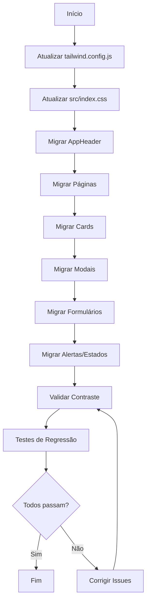

# Documento de Design - Layout/Theme (Dark → Light Mode)

## Visão Geral

Este documento detalha a arquitetura técnica para migração do tema visual do FreteGO de dark mode para light mode. A migração envolve atualização de configurações do Tailwind CSS, estilos globais e classes CSS em todos os componentes da aplicação.

### Objetivos
- Migrar de fundo escuro (gray-950/900/800) para fundo cinza claro (gray-100/50)
- Adaptar cores de texto de claro para escuro mantendo legibilidade
- Preservar cores de destaque (azul, verde, vermelho, amarelo)
- Manter todas as funcionalidades existentes
- Garantir acessibilidade com contraste adequado (WCAG 4.5:1)

## Arquitetura

### Estratégia de Migração

A migração será realizada em camadas, do mais global para o mais específico:

```
┌─────────────────────────────────────────────────────────────┐
│  1. tailwind.config.js - Paleta de cores customizada        │
├─────────────────────────────────────────────────────────────┤
│  2. src/index.css - Estilos globais (:root, body)           │
├─────────────────────────────────────────────────────────────┤
│  3. Componentes de Layout (AppHeader, páginas)              │
├─────────────────────────────────────────────────────────────┤
│  4. Componentes de UI (Cards, Modais, Forms, Botões)        │
├─────────────────────────────────────────────────────────────┤
│  5. Estados e Alertas                                       │
└─────────────────────────────────────────────────────────────┘
```

### Mapeamento de Cores (Dark → Light)

```
┌────────────────────┬────────────────────┬─────────────────────┐
│ Elemento           │ Dark Mode (Atual)  │ Light Mode (Novo)   │
├────────────────────┼────────────────────┼─────────────────────┤
│ Fundo página       │ bg-gray-950        │ bg-gray-100         │
│ Fundo card         │ bg-gray-900        │ bg-white            │
│ Fundo seção        │ bg-gray-800        │ bg-gray-50          │
│ Fundo input        │ bg-gray-800/700    │ bg-white            │
│ Borda principal    │ border-gray-800    │ border-gray-200     │
│ Borda input        │ border-gray-700/600│ border-gray-300     │
│ Texto principal    │ text-white         │ text-gray-800       │
│ Texto secundário   │ text-gray-400      │ text-gray-600       │
│ Texto terciário    │ text-gray-500      │ text-gray-500       │
│ Placeholder        │ placeholder-gray-500│ placeholder-gray-400│
│ Label              │ text-gray-400      │ text-gray-700       │
│ Hover fundo        │ hover:bg-gray-700  │ hover:bg-gray-100   │
│ Hover texto        │ hover:text-white   │ hover:text-gray-900 │
└────────────────────┴────────────────────┴─────────────────────┘
```

### Cores Preservadas (Sem Alteração)

| Elemento | Classe | Motivo |
|----------|--------|--------|
| Logo FreteGO | text-blue-500 | Identidade visual |
| Botão primário | bg-blue-600 | Ação principal |
| Botão sucesso | bg-green-600 | Ação positiva |
| Botão perigo | bg-red-600 | Ação destrutiva |
| Focus ring | ring-blue-500 | Acessibilidade |
| Backdrop modal | bg-black/75 | Destaque do modal |

## Componentes e Interfaces

### Arquivos a Serem Modificados

```
src/
├── index.css                    # Estilos globais
├── components/
│   ├── AppHeader.tsx            # Header principal
│   ├── FreteCard.tsx            # Card de frete
│   ├── FreteModal.tsx           # Modal de detalhes
│   ├── FreteForm.tsx            # Formulário de frete
│   ├── FreteFilters.tsx         # Filtros de busca
│   ├── FreteCalculator.tsx      # Calculadora
│   ├── LoginForm.tsx            # Formulário de login
│   ├── RegisterForm.tsx         # Formulário de cadastro
│   ├── ChatWidget.tsx           # Widget de chat
│   ├── DocumentUpload.tsx       # Upload de documentos
│   ├── NotificationBell.tsx     # Notificações
│   ├── RatingDisplay.tsx        # Exibição de avaliações
│   ├── RatingForm.tsx           # Formulário de avaliação
│   ├── TripSuggestion.tsx       # Sugestão de viagem
│   ├── InteractiveMap.tsx       # Mapa interativo
│   ├── ErrorBoundary.tsx        # Tratamento de erros
│   └── ProtectedRoute.tsx       # Rota protegida
├── pages/
│   ├── HomePage.tsx             # Página inicial
│   ├── LoginPage.tsx            # Página de login
│   ├── RegisterPage.tsx         # Página de cadastro
│   ├── EmbarcadorPage.tsx       # Dashboard embarcador
│   ├── EmbarcadorPerfilPage.tsx # Perfil embarcador
│   ├── EmbarcadorPlanPage.tsx   # Planos embarcador
│   ├── MotoristaPerfilPage.tsx  # Perfil motorista
│   ├── MotoristaPlanPage.tsx    # Planos motorista
│   ├── ConfiguracoesPage.tsx    # Configurações
│   ├── AdminPage.tsx            # Painel admin
│   ├── SecurityDashboardPage.tsx# Dashboard segurança
│   └── HoneypotPage.tsx         # Página honeypot
└── tailwind.config.js           # Configuração Tailwind
```

### Padrões de Substituição por Componente

#### 1. Páginas (Layout Base)
```tsx
// ANTES
<div className="min-h-screen bg-gray-950">

// DEPOIS
<div className="min-h-screen bg-gray-100">
```

#### 2. Cards
```tsx
// ANTES
<div className="bg-gray-900 border border-gray-800 rounded-lg">

// DEPOIS
<div className="bg-white border border-gray-200 rounded-lg shadow-sm">
```

#### 3. Seções Internas
```tsx
// ANTES
<div className="bg-gray-800 p-4 rounded-lg">

// DEPOIS
<div className="bg-gray-50 p-4 rounded-lg">
```

#### 4. Inputs
```tsx
// ANTES
<input className="bg-gray-800 border border-gray-700 text-white placeholder-gray-500" />

// DEPOIS
<input className="bg-white border border-gray-300 text-gray-800 placeholder-gray-400" />
```

#### 5. Selects
```tsx
// ANTES
<select className="bg-gray-700 border border-gray-600 text-white">

// DEPOIS
<select className="bg-white border border-gray-300 text-gray-800">
```

#### 6. Botões Secundários
```tsx
// ANTES
<button className="bg-gray-700 text-white hover:bg-gray-600">

// DEPOIS
<button className="bg-gray-200 text-gray-800 hover:bg-gray-300">
```

#### 7. Dropdowns
```tsx
// ANTES
<div className="bg-gray-800 border border-gray-700">

// DEPOIS
<div className="bg-white border border-gray-200 shadow-lg">
```

#### 8. Alertas de Erro
```tsx
// ANTES
<div className="bg-red-900/50 border border-red-700 text-red-200">

// DEPOIS
<div className="bg-red-50 border border-red-200 text-red-700">
```

#### 9. Alertas de Sucesso
```tsx
// ANTES
<div className="bg-green-900/50 border border-green-700 text-green-200">

// DEPOIS
<div className="bg-green-50 border border-green-200 text-green-700">
```

#### 10. Status Badges
```tsx
// ANTES (ativo)
<span className="bg-green-900/50 text-green-300 border-green-700">

// DEPOIS (ativo)
<span className="bg-green-100 text-green-700 border-green-300">
```

## Modelos de Dados

Não há alterações em modelos de dados. A migração é puramente visual/CSS.

## Propriedades de Corretude

*Uma propriedade é uma característica ou comportamento que deve ser verdadeiro em todas as execuções válidas de um sistema - essencialmente, uma declaração formal sobre o que o sistema deve fazer.*

### Property 1: Contraste de Texto Adequado

*Para qualquer* combinação de cor de texto e cor de fundo definida no sistema de design, o ratio de contraste calculado DEVE ser maior ou igual a 4.5:1 conforme WCAG AA.

**Valida: Requisitos 10.1**

### Verificações de Exemplo (Não-PBT)

Os demais critérios de aceitação são verificados através de testes de exemplo e smoke tests:

| Critério | Tipo de Teste | Verificação |
|----------|---------------|-------------|
| 1.1-1.3 | Smoke | Configuração Tailwind contém cores esperadas |
| 2.1-2.3 | Smoke | CSS global define estilos corretos |
| 3.1-3.4 | Example | Componentes renderizam com classes corretas |
| 4.1-4.4 | Example | AppHeader usa classes light mode |
| 5.1-5.4 | Example | Inputs usam classes light mode |
| 6.1-6.3 | Example | Modais usam classes light mode |
| 7.1-7.4 | Example | Botões usam classes corretas |
| 8.1-8.4 | Example | Alertas usam classes light mode |
| 9.1-9.4 | Integration | Funcionalidades preservadas (E2E) |
| 10.2-10.3 | Example | Indicadores de foco e informação presentes |

## Tratamento de Erros

### Riscos e Mitigações

| Risco | Impacto | Mitigação |
|-------|---------|-----------|
| Classe CSS esquecida | Visual inconsistente | Busca global por padrões dark mode |
| Contraste insuficiente | Acessibilidade | Validação de contraste WCAG |
| Funcionalidade quebrada | UX degradada | Testes de regressão |
| Hover states incorretos | Feedback visual ruim | Revisão de todos os hover: |

### Checklist de Validação

- [ ] Todas as ocorrências de `bg-gray-950` substituídas
- [ ] Todas as ocorrências de `bg-gray-900` substituídas
- [ ] Todas as ocorrências de `bg-gray-800` substituídas
- [ ] Todas as ocorrências de `text-white` em contexto de texto principal substituídas
- [ ] Todas as ocorrências de `text-gray-400` em labels substituídas
- [ ] Todas as ocorrências de `border-gray-800` substituídas
- [ ] Todas as ocorrências de `border-gray-700` substituídas
- [ ] Cores de destaque (blue, green, red, yellow) preservadas
- [ ] Focus rings preservados
- [ ] Backdrop de modais preservado

## Estratégia de Testes

### Abordagem de Testes

Esta feature é primariamente uma migração de estilos CSS, portanto:

1. **Smoke Tests**: Verificar configurações de arquivos (tailwind.config.js, index.css)
2. **Testes de Exemplo**: Verificar classes CSS em componentes renderizados
3. **Testes de Integração E2E**: Verificar funcionalidades preservadas
4. **Teste de Propriedade**: Verificar contraste de cores (único PBT aplicável)

### Testes Unitários (Exemplos)

```typescript
// Verificar que componentes usam classes light mode
describe('FreteCard', () => {
  it('deve usar fundo branco com borda gray-200', () => {
    render(<FreteCard frete={mockFrete} onClick={jest.fn()} />);
    const card = screen.getByRole('article');
    expect(card).toHaveClass('bg-white', 'border-gray-200');
  });
});
```

### Teste de Propriedade (Contraste)

```typescript
// Property test para contraste de cores
import { fc } from 'fast-check';

// Feature: layout-theme, Property 1: Contraste de Texto Adequado
describe('Contraste de Cores', () => {
  const colorPairs = [
    { text: '#1f2937', bg: '#f3f4f6' }, // gray-800 on gray-100
    { text: '#374151', bg: '#ffffff' }, // gray-700 on white
    { text: '#4b5563', bg: '#f9fafb' }, // gray-600 on gray-50
  ];

  it.each(colorPairs)(
    'deve ter contraste >= 4.5:1 para texto $text em fundo $bg',
    ({ text, bg }) => {
      const ratio = calculateContrastRatio(text, bg);
      expect(ratio).toBeGreaterThanOrEqual(4.5);
    }
  );
});
```

### Testes de Regressão Visual

Recomenda-se usar ferramentas como:
- **Chromatic** ou **Percy** para snapshot visual
- **Playwright** para testes E2E de funcionalidade

### Ordem de Execução dos Testes

1. Smoke tests de configuração
2. Testes unitários de componentes
3. Teste de propriedade de contraste
4. Testes E2E de funcionalidade

## Diagrama de Migração



## Referências

- [WCAG 2.1 Contrast Requirements](https://www.w3.org/WAI/WCAG21/Understanding/contrast-minimum.html)
- [Tailwind CSS Color Palette](https://tailwindcss.com/docs/customizing-colors)
- [WebAIM Contrast Checker](https://webaim.org/resources/contrastchecker/)
