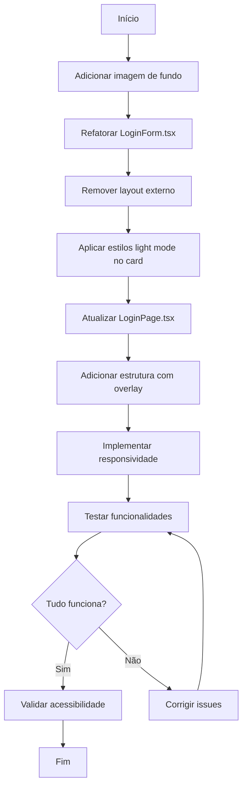

# Documento de Design - Login Redesign

## Visão Geral

Este documento detalha a arquitetura técnica para o redesign da página de login do FreteGO. A mudança principal é substituir o layout atual (tela dividida com marketing à esquerda) por um design com imagem de fundo temática, overlay semi-transparente e card centralizado.

### Objetivos
- Adicionar imagem de fundo temática (caminhão/estrada) na página de login
- Implementar overlay escuro semi-transparente para legibilidade
- Criar card com fundo sólido para o formulário
- Manter responsividade (desktop: card centralizado, mobile: card com fundo semi-transparente)
- Preservar todas as funcionalidades existentes do formulário
- Seguir o tema light do sistema

## Arquitetura

### Estrutura de Componentes

```
┌─────────────────────────────────────────────────────────────┐
│  LoginPage.tsx                                              │
│  ├── Wrapper (min-h-screen, relative)                       │
│  │   ├── Background Image (absolute, inset-0)               │
│  │   ├── Overlay (absolute, inset-0, bg-black/50)           │
│  │   └── Content Container (relative, flex center)          │
│  │       └── LoginForm.tsx (Card com formulário)            │
└─────────────────────────────────────────────────────────────┘
```

### Mudança de Responsabilidade

**Antes:**
- `LoginForm.tsx`: Continha todo o layout (marketing + formulário)
- `LoginPage.tsx`: Apenas wrapper simples

**Depois:**
- `LoginForm.tsx`: Apenas o card do formulário (sem layout externo)
- `LoginPage.tsx`: Gerencia layout com imagem de fundo, overlay e posicionamento

### Arquivos a Serem Modificados

```
src/
├── components/
│   └── LoginForm.tsx    # Remover layout externo, manter apenas card
├── pages/
│   └── LoginPage.tsx    # Adicionar imagem de fundo, overlay, centralização
└── public/ ou src/assets/
    └── login-bg.jpg     # Nova imagem de fundo (a ser adicionada)
```

## Componentes e Interfaces

### LoginPage.tsx - Novo Layout

```tsx
// Estrutura do novo layout
<div className="min-h-screen relative">
  {/* Imagem de fundo */}
  
  
  {/* Overlay semi-transparente */}
  <div className="absolute inset-0 bg-black/50" />
  
  {/* Container centralizado */}
  <div className="relative min-h-screen flex items-center justify-center p-4">
    <LoginForm onSubmit={handleLogin} onRegisterClick={() => navigate('/register')} />
  </div>
</div>
```

### LoginForm.tsx - Card Refatorado

```tsx
// Estrutura do card (sem layout externo)
<div className="w-full max-w-md bg-white md:bg-white bg-white/95 rounded-2xl shadow-xl p-8">
  {/* Logo */}
  <div className="text-center mb-6">
    <h1 className="text-2xl font-bold text-blue-500">FreteGO</h1>
  </div>
  
  {/* Título */}
  <h2 className="text-2xl font-bold text-gray-800 mb-6">Entrar</h2>
  
  {/* Formulário */}
  <form>
    {/* Honeypot field (mantido) */}
    {/* Campo telefone */}
    {/* Campo senha */}
    {/* Botão submit */}
    {/* Link cadastro */}
  </form>
</div>
```

### Mapeamento de Classes CSS

#### Card do Formulário
| Elemento | Antes (Dark) | Depois (Light) |
|----------|--------------|----------------|
| Container | `bg-gray-900 border-gray-800` | `bg-white shadow-xl` (desktop) / `bg-white/95` (mobile) |
| Título | `text-white` | `text-gray-800` |
| Labels | `text-gray-400` | `text-gray-700` |
| Inputs | `bg-gray-800 border-gray-700 text-white` | `bg-white border-gray-300 text-gray-800` |
| Placeholder | `placeholder-gray-500` | `placeholder-gray-400` |
| Erro | `bg-red-900/50 border-red-700 text-red-300` | `bg-red-50 border-red-200 text-red-700` |
| Botão primário | `bg-blue-600 text-white` | `bg-blue-600 text-white` (mantido) |
| Link cadastro | `text-blue-400` | `text-blue-600` |

### Responsividade

```
┌─────────────────────────────────────────────────────────────┐
│  DESKTOP (md: >= 768px)                                     │
│  ┌─────────────────────────────────────────────────────┐    │
│  │  Imagem de fundo (100% viewport)                    │    │
│  │  ┌───────────────────────────────────────────────┐  │    │
│  │  │  Overlay (bg-black/50)                        │  │    │
│  │  │           ┌─────────────────┐                 │  │    │
│  │  │           │  Card (bg-white)│                 │  │    │
│  │  │           │  max-w-md       │                 │  │    │
│  │  │           │  centralizado   │                 │  │    │
│  │  │           └─────────────────┘                 │  │    │
│  │  └───────────────────────────────────────────────┘  │    │
│  └─────────────────────────────────────────────────────┘    │
└─────────────────────────────────────────────────────────────┘

┌─────────────────────────────────────────────────────────────┐
│  MOBILE (< 768px)                                           │
│  ┌─────────────────────────────────────────────────────┐    │
│  │  Imagem de fundo (100% viewport)                    │    │
│  │  ┌───────────────────────────────────────────────┐  │    │
│  │  │  Overlay (bg-black/50)                        │  │    │
│  │  │  ┌─────────────────────────────────────────┐  │  │    │
│  │  │  │  Card (bg-white/95)                     │  │  │    │
│  │  │  │  w-full mx-4                            │  │  │    │
│  │  │  │  semi-transparente                      │  │  │    │
│  │  │  │  mostra imagem por trás                 │  │  │    │
│  │  │  └─────────────────────────────────────────┘  │  │    │
│  │  └───────────────────────────────────────────────┘  │    │
│  └─────────────────────────────────────────────────────┘    │
└─────────────────────────────────────────────────────────────┘
```

## Modelos de Dados

Não há alterações em modelos de dados. O redesign é puramente visual/CSS.

## Propriedades de Corretude

### Property 1: Preservação de Funcionalidade do Formulário

*Para qualquer* entrada válida de telefone (10-11 dígitos) e senha (não vazia), o formulário DEVE processar o submit corretamente e chamar a função onSubmit com as credenciais formatadas.

**Valida: Requisitos 6.1, 6.2, 6.3**

### Property 2: Contraste de Texto no Card

*Para qualquer* combinação de cor de texto e cor de fundo no Card_Formulário, o ratio de contraste calculado DEVE ser maior ou igual a 4.5:1 conforme WCAG AA.

**Valida: Requisitos 2.4, 8.1**

### Verificações de Exemplo (Não-PBT)

| Critério | Tipo de Teste | Verificação |
|----------|---------------|-------------|
| 1.1-1.4 | Example | Imagem de fundo renderiza corretamente |
| 2.1-2.3 | Example | Overlay cobre toda a área |
| 3.1-3.5 | Example | Card tem estilos corretos |
| 4.1-4.3 | Example | Layout desktop centralizado |
| 5.1-5.4 | Example | Layout mobile responsivo |
| 6.4-6.7 | Example | Funcionalidades preservadas |
| 7.1-7.5 | Example | Cores seguem tema light |
| 8.2-8.4 | Example | Acessibilidade mantida |

## Tratamento de Erros

### Fallback de Imagem

```tsx
// Fallback caso a imagem não carregue
const [imageError, setImageError] = useState(false);

 setImageError(true)}
  className={imageError ? 'hidden' : 'absolute inset-0 w-full h-full object-cover'}
/>

{/* Fallback: fundo sólido cinza claro */}
{imageError && (
  <div className="absolute inset-0 bg-gray-200" />
)}
```

### Riscos e Mitigações

| Risco | Impacto | Mitigação |
|-------|---------|-----------|
| Imagem pesada | Performance | Otimizar imagem (WebP, compressão) |
| Imagem não carrega | Visual quebrado | Fallback para fundo sólido |
| Contraste insuficiente | Acessibilidade | Overlay com opacidade adequada |
| Funcionalidade quebrada | UX degradada | Testes de regressão |

## Estratégia de Testes

### Testes de Exemplo

```typescript
describe('LoginPage', () => {
  it('deve renderizar imagem de fundo', () => {
    render(<LoginPage />);
    const img = screen.getByRole('presentation');
    expect(img).toHaveAttribute('src', '/login-bg.jpg');
  });

  it('deve renderizar overlay semi-transparente', () => {
    render(<LoginPage />);
    const overlay = document.querySelector('.bg-black\\/50');
    expect(overlay).toBeInTheDocument();
  });
});

describe('LoginForm', () => {
  it('deve usar fundo branco no card', () => {
    render(<LoginForm onSubmit={jest.fn()} />);
    const card = screen.getByRole('form').parentElement;
    expect(card).toHaveClass('bg-white');
  });

  it('deve manter validação de telefone', async () => {
    render(<LoginForm onSubmit={jest.fn()} />);
    const phoneInput = screen.getByPlaceholderText('(00) 0 0000-0000');
    fireEvent.change(phoneInput, { target: { value: '123' } });
    fireEvent.submit(screen.getByRole('form'));
    expect(await screen.findByText(/10 ou 11 dígitos/)).toBeInTheDocument();
  });
});
```

### Testes de Propriedade

```typescript
import { fc } from 'fast-check';

// Property 1: Preservação de Funcionalidade
describe('LoginForm - Property Tests', () => {
  it('deve processar qualquer telefone válido corretamente', () => {
    fc.assert(
      fc.property(
        fc.stringOf(fc.constantFrom('0','1','2','3','4','5','6','7','8','9'), { minLength: 10, maxLength: 11 }),
        fc.string({ minLength: 1 }),
        async (phone, password) => {
          const onSubmit = jest.fn();
          render(<LoginForm onSubmit={onSubmit} />);
          
          fireEvent.change(screen.getByPlaceholderText('(00) 0 0000-0000'), { target: { value: phone } });
          fireEvent.change(screen.getByPlaceholderText('••••••'), { target: { value: password } });
          fireEvent.submit(screen.getByRole('form'));
          
          await waitFor(() => {
            expect(onSubmit).toHaveBeenCalledWith({ phone, password });
          });
        }
      )
    );
  });
});

// Property 2: Contraste de Cores
describe('Contraste de Cores', () => {
  const colorPairs = [
    { text: '#1f2937', bg: '#ffffff' }, // gray-800 on white
    { text: '#374151', bg: '#ffffff' }, // gray-700 on white
    { text: '#1f2937', bg: '#f9fafb' }, // gray-800 on gray-50
  ];

  it.each(colorPairs)(
    'deve ter contraste >= 4.5:1 para texto $text em fundo $bg',
    ({ text, bg }) => {
      const ratio = calculateContrastRatio(text, bg);
      expect(ratio).toBeGreaterThanOrEqual(4.5);
    }
  );
});
```

## Imagem de Fundo

### Especificações da Imagem

- **Tema**: Caminhão em estrada, paisagem de transporte/logística
- **Formato recomendado**: WebP com fallback JPG
- **Dimensões mínimas**: 1920x1080px
- **Tamanho máximo**: 200-300KB (otimizado)
- **Posicionamento**: object-cover para manter proporções

### Opções de Implementação

1. **Imagem local**: Salvar em `public/login-bg.jpg`
2. **CDN**: Usar URL de CDN para melhor cache
3. **Placeholder**: Usar serviço como Unsplash para desenvolvimento

```tsx
// Exemplo com Unsplash (desenvolvimento)
const BG_IMAGE = 'https://images.unsplash.com/photo-1601584115197-04ecc0da31d7?w=1920&q=80';

// Produção: usar imagem local otimizada
const BG_IMAGE = '/login-bg.jpg';
```

## Diagrama de Implementação


