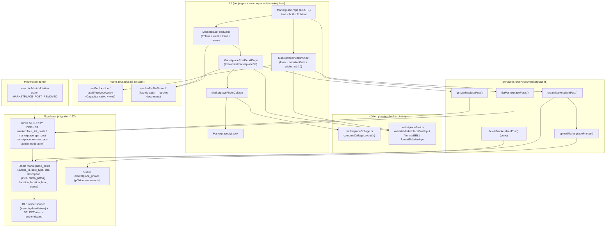

# Design Document — Marketplace

## Overview

O **Marketplace** é uma vitrine de anúncios entre usuários do FreteGO (motoristas e
embarcadores), no estilo do Marketplace do Facebook. Qualquer usuário autenticado publica um
anúncio (`venda` ou `noticia`) com título, descrição curta, de 1 a 10 fotos e a sua localização
(obrigatória, puxada do dispositivo). Os anúncios aparecem num feed e podem ser abertos num
detalhe com galeria (colagem estilo Facebook + lightbox em tela cheia). Toda apresentação exibe a
foto e o nome do autor. O contato/mensagem entre interessado e anunciante **fica para fase
futura**.

O design persegue três objetivos:

1. **Reaproveitar a casca existente.** A rota `/motorista/marketplace`, a página
   `MarketplacePage` (header, busca, abas, cidade via `useEffectiveLocation`, botão "Publicar"
   stub e estado vazio) e o slot "Marketplace" na `MotoristaBottomNav` **já existem** — esta spec
   os preenche com backend e UI, sem duplicar. Geolocalização reusa `useGeolocation`/
   `useEffectiveLocation` (com caminho nativo Capacitor). Foto do autor reusa
   `resolveProfilePhotoUrl`. Upload de fotos reusa o padrão de bucket público de
   `anuncios_images`, com a variação de **paths prefixados pelo dono** (como `documents`) para
   habilitar RLS por dono.

2. **Conteúdo de usuário com RLS por dono, não audit de admin.** A publicação é feita pelo
   próprio usuário; a autorização é **RLS** (`author_id = auth.uid()`), não `is_admin_with_permission`.
   O wrapper `executeAdminMutation` **só** entra no caminho de **moderação do admin** (remover
   anúncio abusivo). Isso evita confundir a governança de admin com conteúdo de usuário.

3. **Núcleo puro testável.** Layout da colagem, validação do anúncio, formatação BRL e idade
   relativa são **funções puras** em `src/utils` — onde mora a lógica coberta por property tests.
   RLS, RPCs, Storage, geolocalização e UI vão para unit/integration/component tests.

### Constantes de design

| Constante | Valor | Onde |
| --- | --- | --- |
| `MARKETPLACE_BUCKET` | `marketplace_photos` (bucket público, 5 MiB, image/*) | Storage |
| `MAX_PHOTOS` | `10` | `src/utils/marketplacePost.ts` + CHECK SQL |
| `MIN_PHOTOS` | `1` | `src/utils/marketplacePost.ts` + CHECK SQL |
| `MAX_PHOTO_BYTES` | `5 * 1024 * 1024` (5 MiB) | bucket + `uploadMarketplacePhotos` |
| `ALLOWED_PHOTO_MIME` | `image/jpeg, image/png, image/webp, image/gif` | bucket + validação |
| `TITLE_MAX` | `120` | util + CHECK SQL |
| `DESCRIPTION_MAX` | `2000` | util + CHECK SQL |
| `COLLAGE_MAX_TILES` | `4` | `src/utils/marketplaceCollage.ts` |
| `CARD_DESCRIPTION_LINES` | `2` (line-clamp-2) | CSS no `MarketplaceFeedCard` |
| `FEED_PAGE_SIZE` | `20` (paginação por offset) | service + RPC |

### Decisões em aberto (com recomendação do design)

- **D1 — Acesso de motorista E embarcador.** O dono disse que "cada embarcador pode postar", e a
  casca atual está no app do motorista (`/motorista/marketplace`, gated por
  `MotoristaProtectedRoute`). *Recomendação:* o **backend** aceita **qualquer usuário autenticado**
  (`author_id → users.id`, RLS `author_id = auth.uid()`), servindo motorista e embarcador desde o
  dia 1. Na **UI**, manter a rota existente funcionando para o motorista (já há o slot na bottom
  nav) e **adicionar um ponto de entrada no app do embarcador** (link/botão para a mesma página).
  A rota é gated por `ProtectedRoute` (qualquer logado), não por `MotoristaProtectedRoute`. O local
  exato do botão no embarcador é detalhe de UI (Fase de UI).

- **D2 — Tipo do anúncio e valor.** O dono quer vender itens **e** postar notícias. *Recomendação:*
  um único `post_type text CHECK IN ('venda','noticia')` com `price numeric NULL`. `venda` exibe o
  valor; `noticia` não tem valor. Simples, cobre os dois casos descritos e mantém um só fluxo.
  Default `venda` (uso principal). *Alternativa:* só "valor opcional" sem tipo — descartada por
  perder a distinção visual que o dono descreveu.

- **D3 — Fotos: coluna `text[]` vs tabela filha.** *Recomendação:* **`photo_paths text[]`** na
  própria linha do post, com `CHECK (array_length BETWEEN 1 AND 10)`. As fotos são sempre
  carregadas junto do post, a ordem é o índice do array, e evita join/segunda RLS. *Alternativa:*
  tabela filha `marketplace_post_photos` (ordenada) — mais "normalizada", porém mais peças para o
  MVP. Fica registrada como evolução se surgir necessidade (ex.: metadados por foto).

- **D4 — Bucket público vs privado.** *Recomendação:* **bucket público** `marketplace_photos`
  (igual `anuncios_images`), leitura via `getPublicUrl` — sem custo de signed URL por imagem no
  feed. Escrita restrita por **Owner_Scoped_RLS** (prefixo do path = `auth.uid()`). A foto do
  **autor** continua vindo do bucket privado `documents` (resolvida via `resolveProfilePhotoUrl`),
  pois é dado de perfil já existente. *Trade-off:* fotos de anúncio são conteúdo público entre
  usuários logados — aceitável; nenhum dado sensível é exposto.

- **D5 — Leitura do feed: RPC `SECURITY DEFINER` para o join do autor.** O feed precisa de
  `users.name` + `users.profile_photo_url` do autor. *Recomendação:* expor a leitura via RPCs
  `marketplace_list_posts(p_limit, p_offset)` e `marketplace_get_post(p_id)`
  (`SECURITY DEFINER`, `STABLE`, gated a `authenticated`), que retornam o post + nome + path da
  foto do autor (sem PII além de nome e foto). Isso evita ampliar a RLS da tabela `users` e
  mantém a junção controlada no servidor. As **escritas** (criar/remover) continuam por
  acesso direto à tabela com RLS (espelhando `uploadDocument`). *Alternativa:* `select` direto com
  `users(name, profile_photo_url)` embutido — descartada por depender da RLS de `users`.

- **D6 — Apresentação das fotos (colagem vs carrossel).** O dono descreveu **os dois**: colagem
  "quebrada" estilo Facebook (3 fotos + "+N") **e** carrossel "1 de 13" que amplia ao tocar.
  *Recomendação:* **Feed_Card** usa só a **Primeira_Foto** (igual à referência de lista do
  Facebook); o **Post_Detail** usa a **Photo_Collage** (até 4 quadros, overlay "+N"); tocar em
  qualquer quadro abre o **Photo_Lightbox** (carrossel em tela cheia, contador "X de N", amplia,
  botão voltar). Assim ambos os comportamentos descritos são atendidos sem conflito.

- **D7 — Cor do botão.** O dono mencionou um "botãozinho vermelho". A convenção do projeto usa
  **verde** (`green-600`) para ação primária, e a casca já traz "Publicar" em verde.
  *Recomendação:* manter o **verde** do projeto para consistência; "adicionar foto" pode ter um
  realce próprio. Detalhe estético, ajustável depois.

## Architecture



### Camadas e responsabilidades

- **Núcleo puro (TS, sem I/O):** layout da colagem, validação do anúncio, formatação BRL e idade
  relativa. Onde moram as property tests.
- **Serviço (`src/services/marketplace.ts`):** orquestra upload (com rollback), criação direta na
  tabela (RLS), leitura via RPCs, remoção pelo dono, e mapeia erros para mensagens pt-BR.
- **RLS + RPCs SQL:** fonte de verdade de autorização (dono escreve só o que é dele; leitura só a
  autenticados) e da junção controlada do autor no feed.
- **UI:** feed, formulário de publicação com gate de localização forçada, detalhe com colagem +
  lightbox.

## Components and Interfaces

### Núcleo puro — `src/utils/marketplaceCollage.ts`

```ts
export const COLLAGE_MAX_TILES = 4;

export interface CollageTile {
  photoIndex: number;     // índice na lista de fotos (0-based)
  overlayCount: number;   // 0, exceto no último quadro quando há fotos ocultas
}

export interface CollageLayout {
  /** Nº de quadros exibidos = min(photoCount, 4). */
  tiles: CollageTile[];
  /** Fotos não exibidas = max(0, photoCount - 4); aparece como "+N" no último quadro. */
  overlayCount: number;
  /** Dica de arranjo para o CSS: 1 | 2 | 3 | 4 (4 cobre 4+). */
  variant: 1 | 2 | 3 | 4;
}

/**
 * Layout determinístico da Photo_Collage (Req 8.1-8.3).
 * Invariantes (Property 1): tiles.length === min(n, 4); overlayCount === max(0, n-4);
 * todo tile.photoIndex ∈ [0, n); apenas o último tile pode ter overlayCount > 0.
 */
export function computeCollageLayout(photoCount: number): CollageLayout;
```

### Núcleo puro — `src/utils/marketplacePost.ts`

```ts
export const TITLE_MAX = 120;
export const DESCRIPTION_MAX = 2000;
export const MIN_PHOTOS = 1;
export const MAX_PHOTOS = 10;
export const MAX_PHOTO_BYTES = 5 * 1024 * 1024;
export const ALLOWED_PHOTO_MIME = ['image/jpeg', 'image/png', 'image/webp', 'image/gif'] as const;

export type PostType = 'venda' | 'noticia';

/** Metadados de uma foto candidata (sem o binário) para validação pura. */
export interface PhotoMeta { mime: string; sizeBytes: number; }

export interface MarketplacePostInput {
  postType: PostType;
  title: string;
  description: string;
  price: number | null;       // null para 'noticia'; > 0 para 'venda' com valor
  photos: PhotoMeta[];        // 1..10
  hasLocation: boolean;       // Post_Location resolvida? (Forced_Location)
}

export type PostFieldError =
  | 'TITLE_REQUIRED' | 'TITLE_TOO_LONG'
  | 'DESCRIPTION_TOO_LONG'
  | 'INVALID_PRICE'
  | 'NO_PHOTOS' | 'TOO_MANY_PHOTOS' | 'INVALID_FILE_TYPE' | 'PHOTO_TOO_LARGE'
  | 'LOCATION_REQUIRED';

export interface PostValidation {
  ok: boolean;
  fieldErrors: Partial<Record<keyof MarketplacePostInput, PostFieldError>>;
}

/**
 * Validação pura e determinística (Req 3, 4). ok === true sse:
 * título 1..120 (após trim), descrição 0..2000, price (null) | (> 0),
 * fotos 1..10 todas com MIME permitido e <= 5 MiB, e hasLocation === true.
 */
export function validateMarketplacePostInput(input: MarketplacePostInput): PostValidation;

/** "R$ 65.000" / "R$ 1.250,50" — agrupamento pt-BR; centavos só quando != 0. */
export function formatBRL(value: number): string;

/** Relative_Age em pt-BR: "hoje" | "há 1 dia" | "há N dias" | "há N h" (Req 7.5). */
export function formatRelativeAge(createdAt: Date, now: Date): string;
```

> `formatBRL` usa `Intl.NumberFormat('pt-BR', { style: 'currency', currency: 'BRL' })` com pós-
> tratamento para suprimir centavos `,00` (o exemplo do dono mostra "R$ 65.000"). Não há util de
> moeda no projeto hoje, então este é o ponto canônico.

### Serviço — `src/services/marketplace.ts`

```ts
export interface MarketplacePost {
  id: string;
  authorId: string;
  authorName: string;
  authorPhotoPath: string | null;   // resolvido na UI via resolveProfilePhotoUrl
  postType: PostType;
  title: string;
  description: string;
  price: number | null;
  photoUrls: string[];              // URLs públicas (getPublicUrl), ordenadas
  point: GeographicPoint | null;    // { latitude, longitude }
  locationLabel: string;
  status: 'ativo' | 'removido';
  createdAt: string;
}

export interface CreateMarketplacePostInput {
  postType: PostType;
  title: string;
  description: string;
  price: number | null;
  photos: File[];                   // 1..10 (binários)
  point: GeographicPoint;           // obrigatório (Forced_Location)
  locationLabel: string;
}

export class MarketplaceError extends Error {
  constructor(message: string, public code: string, public httpStatus = 400) { super(message); }
}

/** Sobe as fotos no Marketplace_Bucket em `<userId>/<ts>_<rand>.<ext>` (Req 5.1, 5.2). */
export async function uploadMarketplacePhotos(userId: string, files: File[]): Promise<string[]>;

/**
 * Valida (reusa validateMarketplacePostInput), sobe fotos, insere o post (RLS author_id =
 * auth.uid()). Em falha de DB, faz rollback removendo as fotos já enviadas (Req 5.4).
 */
export async function createMarketplacePost(input: CreateMarketplacePostInput): Promise<MarketplacePost>;

/** Feed paginado via RPC marketplace_list_posts (Req 6). */
export async function listMarketplacePosts(opts?: { limit?: number; offset?: number }): Promise<MarketplacePost[]>;

/** Detalhe via RPC marketplace_get_post (Req 7). */
export async function getMarketplacePost(id: string): Promise<MarketplacePost | null>;

/** Remoção pelo dono: UPDATE status='removido' WHERE author_id = auth.uid() (Req 11.1). */
export async function deleteMarketplacePost(id: string): Promise<void>;
```

`mapError` traduz códigos para pt-BR: `INVALID_FILE_TYPE` → "Envie apenas imagens (JPG, PNG, WebP
ou GIF).", `PHOTO_TOO_LARGE` → "Cada foto deve ter até 5 MB.", `LOCATION_REQUIRED` → "Ative a
localização para publicar.", `TOO_MANY_PHOTOS` → "Você pode adicionar no máximo 10 fotos."

### UI — páginas e componentes

- **`src/pages/MarketplacePage.tsx`** (EXISTE — estender): carregar o feed via
  `listMarketplacePosts`, renderizar `MarketplaceFeedCard` em grade (2 colunas; coluna única em
  `<768px`), manter o header/busca/abas/cidade já existentes, e ligar o botão "Publicar" para
  abrir o `MarketplacePublishSheet`. Estado vazio já existente é reusado.
- **`src/components/marketplace/MarketplaceFeedCard.tsx`** — Primeira_Foto (aspecto fixo,
  `object-cover`), valor em BRL + título (quando `venda`), descrição `line-clamp-2`, e a
  Author_Identity (avatar via `resolveProfilePhotoUrl` + nome). Tocar navega para o detalhe.
- **`src/components/marketplace/MarketplacePublishSheet.tsx`** — formulário (bottom sheet/modal):
  seletor de Post_Type, "Título", "Descrição", "Valor" (só `venda`), **picker de até 10 fotos**
  (input `capture` para câmera + galeria, espelhando `MotoristaPerfilPage`/`DocSlot`), pré-visualização
  reordenável, e o `MarketplaceLocationGate`. Botão "Publicar" desabilitado enquanto
  `validateMarketplacePostInput` não passar (inclui `hasLocation`).
- **`src/components/marketplace/MarketplaceLocationGate.tsx`** — usa `useGeolocation`: tenta
  `requestLocation()` ao montar; em `success` mostra o rótulo (cidade/UF via `reverseGeocode`) e
  libera; em `denied`/`insecure`/`error` mostra orientação pt-BR + botão "Ativar localização" /
  "Tentar de novo" e mantém o publish bloqueado (Req 4.3-4.5).
- **`src/pages/MarketplacePostDetailPage.tsx`** (nova, rota `/motorista/marketplace/:id`) —
  `MarketplacePhotoCollage` no topo, Author_Identity, valor, Relative_Age, rótulo de localização,
  descrição completa, e (para o dono) ação "Remover anúncio". Estado "anúncio indisponível" quando
  `getMarketplacePost` retorna `null`.
- **`src/components/marketplace/MarketplacePhotoCollage.tsx`** — consome `computeCollageLayout`;
  renderiza até 4 quadros e o overlay "+N"; cada quadro abre o lightbox no índice tocado.
- **`src/components/marketplace/MarketplaceLightbox.tsx`** — overlay full-screen: carrossel
  touch-swipe (espelha a mecânica de `AnunciosCarousel`), contador "X de N", toque amplia
  (zoom/contain ↔ cover), botão de voltar/fechar; trava o scroll do body enquanto aberto.

### Roteamento

`src/App.tsx`: o detalhe entra como rota lazy `marketplace/:id`. *Recomendação (D1):* tornar as
rotas do Marketplace acessíveis a qualquer autenticado (`ProtectedRoute`), preservando o slot do
motorista. Ponto de entrada do embarcador adicionado na Fase de UI.

## Data Models

### Tabela nova `marketplace_posts` (migration 122)

```sql
CREATE TABLE IF NOT EXISTS marketplace_posts (
  id             uuid PRIMARY KEY DEFAULT gen_random_uuid(),
  author_id      uuid NOT NULL REFERENCES users(id) ON DELETE CASCADE,
  post_type      text NOT NULL DEFAULT 'venda' CHECK (post_type IN ('venda','noticia')),
  title          text NOT NULL CHECK (char_length(btrim(title)) BETWEEN 1 AND 120),
  description    text NOT NULL DEFAULT '' CHECK (char_length(description) <= 2000),
  price          numeric(12,2) NULL CHECK (price IS NULL OR price > 0),
  photo_paths    text[] NOT NULL CHECK (
                   array_length(photo_paths, 1) BETWEEN 1 AND 10
                   AND array_position(photo_paths, NULL) IS NULL
                 ),
  location       geography(POINT) NOT NULL,
  location_label text NOT NULL DEFAULT '' CHECK (char_length(location_label) <= 160),
  status         text NOT NULL DEFAULT 'ativo' CHECK (status IN ('ativo','removido')),
  created_at     timestamptz NOT NULL DEFAULT now(),
  updated_at     timestamptz NOT NULL DEFAULT now()
);

-- Coerência: 'noticia' não tem valor; 'venda' pode ter ou não.
ALTER TABLE marketplace_posts ADD CONSTRAINT marketplace_posts_price_coherence CHECK (
  post_type = 'venda' OR price IS NULL
);

CREATE INDEX IF NOT EXISTS idx_marketplace_posts_feed
  ON marketplace_posts (created_at DESC) WHERE status = 'ativo';
CREATE INDEX IF NOT EXISTS idx_marketplace_posts_author
  ON marketplace_posts (author_id, created_at DESC);
-- Para futura busca por proximidade (escopo futuro), índice GIST disponível:
CREATE INDEX IF NOT EXISTS idx_marketplace_posts_location
  ON marketplace_posts USING gist (location) WHERE status = 'ativo';
```

Trigger de `updated_at` (espelha `trg_anuncios_updated_at`):

```sql
CREATE OR REPLACE FUNCTION trg_marketplace_posts_updated_at()
RETURNS trigger LANGUAGE plpgsql AS $fn$
BEGIN NEW.updated_at := now(); RETURN NEW; END $fn$;

DROP TRIGGER IF EXISTS marketplace_posts_set_updated_at ON marketplace_posts;
CREATE TRIGGER marketplace_posts_set_updated_at
  BEFORE UPDATE ON marketplace_posts
  FOR EACH ROW EXECUTE FUNCTION trg_marketplace_posts_updated_at();
```

### RLS — Owner_Scoped (conteúdo de usuário)

```sql
ALTER TABLE marketplace_posts ENABLE ROW LEVEL SECURITY;

-- SELECT: só autenticados; ativos para todos, o dono vê os próprios (inclusive removido),
-- admin vê tudo (moderação). NÃO exposto a anon (Req 10.6).
DROP POLICY IF EXISTS marketplace_posts_select ON marketplace_posts;
CREATE POLICY marketplace_posts_select ON marketplace_posts
  FOR SELECT TO authenticated
  USING (
    status = 'ativo'
    OR author_id = auth.uid()
    OR EXISTS (SELECT 1 FROM users u WHERE u.id = auth.uid() AND u.user_type = 'admin')
  );

-- INSERT: o usuário só publica como ele mesmo, sempre 'ativo' (Req 10.1, 10.2).
DROP POLICY IF EXISTS marketplace_posts_insert ON marketplace_posts;
CREATE POLICY marketplace_posts_insert ON marketplace_posts
  FOR INSERT TO authenticated
  WITH CHECK (author_id = auth.uid() AND status = 'ativo');

-- UPDATE: o dono altera o próprio (ex.: soft-delete) (Req 10.3, 11.1).
DROP POLICY IF EXISTS marketplace_posts_update_owner ON marketplace_posts;
CREATE POLICY marketplace_posts_update_owner ON marketplace_posts
  FOR UPDATE TO authenticated
  USING (author_id = auth.uid())
  WITH CHECK (author_id = auth.uid());

-- DELETE físico: só o dono (a UI usa soft-delete; DELETE fica disponível por simetria).
DROP POLICY IF EXISTS marketplace_posts_delete_owner ON marketplace_posts;
CREATE POLICY marketplace_posts_delete_owner ON marketplace_posts
  FOR DELETE TO authenticated
  USING (author_id = auth.uid());
```

> A **moderação do admin** (remover anúncio de terceiro) NÃO usa uma policy de UPDATE para admin;
> ela passa pela RPC `marketplace_remove_post` (`SECURITY DEFINER`) que checa
> `is_admin_with_permission(...)` e é chamada via `executeAdminMutation` (audit). Assim a tabela
> não precisa de uma policy de UPDATE ampla para admin, e a remoção administrativa fica auditada.

### Storage — bucket `marketplace_photos` (público, owner-write)

```sql
INSERT INTO storage.buckets (id, name, public, file_size_limit, allowed_mime_types)
VALUES ('marketplace_photos','marketplace_photos', true, 5242880,
        ARRAY['image/jpeg','image/png','image/webp','image/gif'])
ON CONFLICT (id) DO UPDATE SET
  public = EXCLUDED.public,
  file_size_limit = EXCLUDED.file_size_limit,
  allowed_mime_types = EXCLUDED.allowed_mime_types;

-- Leitura: pública (bucket público; serve getPublicUrl).
DROP POLICY IF EXISTS marketplace_photos_select ON storage.objects;
CREATE POLICY marketplace_photos_select ON storage.objects
  FOR SELECT TO authenticated, anon
  USING (bucket_id = 'marketplace_photos');

-- INSERT/UPDATE/DELETE: só no próprio prefixo `<auth.uid()>/...` (Req 10.4).
DROP POLICY IF EXISTS marketplace_photos_insert ON storage.objects;
CREATE POLICY marketplace_photos_insert ON storage.objects
  FOR INSERT TO authenticated
  WITH CHECK (
    bucket_id = 'marketplace_photos'
    AND (storage.foldername(name))[1] = auth.uid()::text
  );

DROP POLICY IF EXISTS marketplace_photos_update ON storage.objects;
CREATE POLICY marketplace_photos_update ON storage.objects
  FOR UPDATE TO authenticated
  USING (bucket_id = 'marketplace_photos' AND (storage.foldername(name))[1] = auth.uid()::text)
  WITH CHECK (bucket_id = 'marketplace_photos' AND (storage.foldername(name))[1] = auth.uid()::text);

DROP POLICY IF EXISTS marketplace_photos_delete ON storage.objects;
CREATE POLICY marketplace_photos_delete ON storage.objects
  FOR DELETE TO authenticated
  USING (bucket_id = 'marketplace_photos' AND (storage.foldername(name))[1] = auth.uid()::text);
```

### RPCs `SECURITY DEFINER`

```sql
-- Feed: posts ativos + autor (nome + path de foto). STABLE, paginado.
CREATE OR REPLACE FUNCTION marketplace_list_posts(p_limit int DEFAULT 20, p_offset int DEFAULT 0)
RETURNS TABLE (
  id uuid, author_id uuid, author_name text, author_photo_path text,
  post_type text, title text, description text, price numeric,
  photo_paths text[], lat double precision, lng double precision,
  location_label text, created_at timestamptz
)
LANGUAGE sql STABLE SECURITY DEFINER SET search_path = public AS $fn$
  SELECT mp.id, mp.author_id, u.name, u.profile_photo_url,
         mp.post_type, mp.title, mp.description, mp.price,
         mp.photo_paths,
         ST_Y(mp.location::geometry), ST_X(mp.location::geometry),
         mp.location_label, mp.created_at
    FROM marketplace_posts mp
    JOIN users u ON u.id = mp.author_id
   WHERE mp.status = 'ativo'
   ORDER BY mp.created_at DESC
   LIMIT greatest(1, least(p_limit, 100)) OFFSET greatest(0, p_offset);
$fn$;

-- Detalhe: um post ativo (ou do próprio autor) + autor.
CREATE OR REPLACE FUNCTION marketplace_get_post(p_id uuid)
RETURNS TABLE (... mesmas colunas ...)
LANGUAGE sql STABLE SECURITY DEFINER SET search_path = public AS $fn$
  SELECT ... FROM marketplace_posts mp JOIN users u ON u.id = mp.author_id
   WHERE mp.id = p_id AND (mp.status = 'ativo' OR mp.author_id = auth.uid());
$fn$;

-- Moderação admin: oculta um post (soft-delete) com checagem de permissão + audit no caller.
CREATE OR REPLACE FUNCTION marketplace_remove_post(p_id uuid)
RETURNS jsonb LANGUAGE plpgsql SECURITY DEFINER SET search_path = public AS $fn$
DECLARE v_caller uuid := auth.uid();
BEGIN
  IF v_caller IS NULL THEN
    RAISE EXCEPTION 'permission_denied: missing auth.uid()' USING ERRCODE = '42501';
  END IF;
  IF NOT is_admin_with_permission('USER_EDIT') THEN
    INSERT INTO admin_audit_logs(admin_id, action, target_type, target_id, before_data, after_data)
    VALUES (v_caller, 'MARKETPLACE_VIEW_DENIED', 'marketplace_posts', p_id, NULL,
            jsonb_build_object('user_id', v_caller, 'reason', 'permission_denied'));
    RAISE EXCEPTION 'permission_denied: USER_EDIT required' USING ERRCODE = '42501';
  END IF;
  UPDATE marketplace_posts SET status = 'removido' WHERE id = p_id AND status = 'ativo';
  RETURN jsonb_build_object('ok', true);
END $fn$;

REVOKE ALL ON FUNCTION marketplace_list_posts(int,int)  FROM PUBLIC;
REVOKE ALL ON FUNCTION marketplace_get_post(uuid)        FROM PUBLIC;
REVOKE ALL ON FUNCTION marketplace_remove_post(uuid)     FROM PUBLIC;
GRANT EXECUTE ON FUNCTION marketplace_list_posts(int,int) TO authenticated;
GRANT EXECUTE ON FUNCTION marketplace_get_post(uuid)      TO authenticated;
GRANT EXECUTE ON FUNCTION marketplace_remove_post(uuid)   TO authenticated;
```

> `is_admin_with_permission('USER_EDIT')` reusa a permissão existente para moderação (o
> `design` pode trocar para uma permissão dedicada se o dono preferir). O audit segue
> `admin-patterns.md` (item 1): a moderação é envolvida por `executeAdminMutation` no serviço
> admin, e o caminho negativo grava `MARKETPLACE_VIEW_DENIED`.

### Migration idempotente + rollback

`supabase/migrations/122_marketplace.sql` abre com `DO $check$` defensivo (verifica `users` e
`is_admin_with_permission`), usa `CREATE TABLE/INDEX IF NOT EXISTS`, `CREATE OR REPLACE FUNCTION`,
`DROP POLICY IF EXISTS` antes de `CREATE POLICY`, `INSERT ... ON CONFLICT DO NOTHING` no bucket, e
fecha com bloco `-- VERIFY` comentado. Par `122_marketplace_rollback.sql` documentado (DROP das
policies/RPCs/trigger/tabela e do bucket), não auto-aplicado.

## Correctness Properties

*A property is a characteristic or behavior that should hold true across all valid executions of
a system — essentially, a formal statement about what the system should do. Properties serve as
the bridge between human-readable specifications and machine-verifiable correctness guarantees.*

PBT é aplicável aqui porque o núcleo (layout da colagem, validação do anúncio, formatação BRL e
idade relativa) são **funções puras** com espaço de entrada grande e invariantes universais. RLS,
RPCs, Storage, geolocalização e UI NÃO são alvo de property test — vão para
unit/integration/component (ver Testing Strategy).

### Property 1: Photo_Collage determinística

*Para qualquer* `n` (quantidade de fotos, 1..10), `computeCollageLayout(n)` retorna exatamente
`min(n, 4)` quadros; `overlayCount === max(0, n - 4)`; todo `tile.photoIndex` está em `[0, n)` e os
índices são distintos e crescentes a partir de 0; apenas o último quadro pode ter
`overlayCount > 0`; e `variant` é `1|2|3|4` coerente com `min(n,4)`. O resultado é determinístico
(mesma entrada ⇒ mesma saída).

**Validates: Requirements 8.1, 8.2, 8.3**

### Property 2: Validação de anúncio completa e determinística

*Para qualquer* `MarketplacePostInput`, `validateMarketplacePostInput(input).ok` é `true` se e
somente se: `title` tem 1..120 após trim; `description` tem 0..2000; `price` é `null` ou um número
finito `> 0`; há de 1 a 10 fotos, todas com `mime ∈ ALLOWED_PHOTO_MIME` e `sizeBytes <= 5 MiB`; e
`hasLocation === true`. Caso contrário `ok` é `false` e existe ao menos um `fieldError` apontando o
campo ofensor (incluindo `LOCATION_REQUIRED` quando faltar localização, `INVALID_FILE_TYPE`/
`PHOTO_TOO_LARGE` por foto e `TOO_MANY_PHOTOS` acima de 10). Revalidar a mesma entrada produz
sempre o mesmo resultado.

**Validates: Requirements 3.1, 3.2, 3.3, 3.4, 3.5, 3.6, 3.7, 3.8, 4.4, 4.5**

### Property 3: Relative_Age monotônica e não-negativa

*Para qualquer* par `(createdAt, now)` com `createdAt <= now`, `formatRelativeAge` produz um rótulo
pt-BR cuja "quantidade" é não-negativa; a idade é monotônica não-decrescente conforme `now` avança;
e os limites de fronteira são respeitados (mesmo dia ⇒ "hoje" ou "há N h"; 1 dia ⇒ "há 1 dia";
k dias ⇒ "há k dias"). A função é determinística.

**Validates: Requirements 7.5**

### Property 4: Formatação BRL estável

*Para qualquer* valor `v >= 0` finito, `formatBRL(v)` começa com "R$ ", agrupa os milhares no
padrão pt-BR (separador de milhar `.`), omite a parte decimal quando `v` é inteiro e a inclui com
duas casas (separador `,`) quando há centavos; a função é determinística e idempotente sob
reformatação do mesmo número.

**Validates: Requirements 6.4, 7.4**

> **Cobertura de Requirements sem property:** os requisitos de RLS/isolamento (Req 10), upload e
> rollback (Req 5), forçar localização em runtime (Req 4.1-4.3), feed/detalhe/lightbox (Req 6, 7,
> 8.4-8.8), identidade do autor (Req 9), moderação (Req 11) e migration/não-regressão (Req 12) são
> validados por testes de **integração** (RLS/RPC/Storage no `tests/`) e **componente**
> (react-dom/act), descritos abaixo — não por property tests.

## Testing Strategy

Conforme `testing-governance.md`: nenhuma feature conclui sem testes completos (unit + property
onde há invariante, caminhos de falha, validações FE+BE, regressão atualizada, docs).

- **Property tests** (`src/__tests__/marketplace/`, `cp<N>_*.property.test.ts`, ≥ 100 iterações,
  convenções fast-check do projeto — nunca `fc.stringOf`; texto via `safeText`):
  - `cp1_marketplace_collage.property.test.ts` (Property 1).
  - `cp2_marketplace_validation.property.test.ts` (Property 2).
  - `cp3_marketplace_relative_age.property.test.ts` (Property 3).
  - `cp4_marketplace_brl.property.test.ts` (Property 4).
- **Unit tests**: `mapError` (códigos → pt-BR canônico), montagem do path de upload
  (`<userId>/<ts>_<rand>.<ext>`), parsing de `point` (lat/lng) do retorno da RPC. `vi.mock`
  hoisted com spies via `globalThis` (convenção do projeto).
- **Component tests** (react-dom/client + `act` + `MemoryRouter`, sem @testing-library):
  Feed_Card (valor/título/`line-clamp`/autor), `MarketplaceLocationGate` (denied ⇒ orientação +
  publish bloqueado; success ⇒ libera), `MarketplacePublishSheet` (botão desabilitado enquanto
  inválido; > 10 fotos bloqueado com mensagem), `MarketplacePhotoCollage` (4 quadros + "+N";
  tocar abre lightbox), `MarketplaceLightbox` (contador "X de N", voltar).
- **Integration tests** (`tests/`, CI, branch Supabase efêmero):
  - **RLS/isolamento (Req 10):** usuário A não cria post com `author_id` de B (negado); A não
    edita/remove post de B; SELECT só a autenticados; Storage só aceita upload no prefixo do
    próprio uid.
  - **Upload + rollback (Req 5):** falha de insert remove as fotos órfãs; MIME inválido ⇒
    `INVALID_FILE_TYPE`; foto > 5 MB rejeitada.
  - **RPCs (Req 6, 7, 11):** `marketplace_list_posts` retorna só ativos ordenados; paginação;
    `marketplace_get_post` esconde removido de terceiros; `marketplace_remove_post` exige
    permissão (sem ela ⇒ `permission_denied` + audit `MARKETPLACE_VIEW_DENIED` persistido em
    `admin_audit_logs`), com ela ⇒ status `removido` + audit `MARKETPLACE_POST_REMOVED`.
  - **Migration:** idempotência (rodar 2x sem erro) + advisors de segurança (RLS habilitada).
- **Não-regressão (Req 12):** suíte completa (tsc + vitest + build) verde 2x ao fim de cada fase;
  Regression_Suite (`tests/README.md`) atualizada com os novos `cp` tests; cobertura dos
  Critical_Modules tocados mantida.
