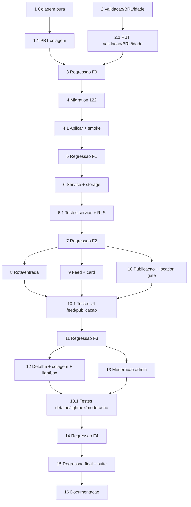

# Implementation Plan — Marketplace

## Overview

Plano incremental para a feature Marketplace (vitrine de anúncios entre usuários: publicar com
título + descrição + até 10 fotos + localização obrigatória; feed; detalhe com colagem estilo
Facebook + lightbox). Reaproveita a casca existente (`/motorista/marketplace`, `MarketplacePage`,
slot na `MotoristaBottomNav`), os hooks de geolocalização (`useGeolocation`/`useEffectiveLocation`,
Capacitor nativo) e `resolveProfilePhotoUrl`. Mensagem/contato, busca/categorias funcionais e
edição ficam para fase futura.

Política de execução (exigência do dono — nível sênior, sem atalho):

- **Testes em toda funcionalidade**: cada tarefa de código de produção tem uma sub-tarefa de
  testes dedicada (unit + property-based onde há invariante, P1–P4; component com react-dom/act;
  integração no `tests/`). Property tests em `src/__tests__/marketplace/`
  (`cp<N>_<nome>.property.test.ts`, mínimo 100 iterações; convenções fast-check do projeto — nunca
  `fc.stringOf`; texto via `safeText`; `vi.mock` hoisted com spies via `globalThis`).
- **Regressão a cada fase**: ao fim de CADA fase, rodar a suíte COMPLETA (`tsc --noEmit` +
  `vitest run` de TODOS os testes novos e antigos + `npm run build`) e confirmar verde; rodar a
  suíte de novo para garantir que nada ficou flaky. Nenhuma fase avança com teste vermelho.
- **Checkpoint/revert**: ao fim de cada fase verde, fazer commit (git) como ponto de reversão,
  mensagem pt-BR `feat(marketplace): ...`. Só commitar; push conforme o dono pedir.
- **Conteúdo de usuário, não admin**: publicar/remover-próprio é por RLS (`author_id = auth.uid()`),
  SEM `executeAdminMutation`. O wrapper de audit só entra na **moderação do admin**.
- **Localização obrigatória**: sem Post_Location válida o botão "Publicar" fica desabilitado e a
  publicação é bloqueada com `LOCATION_REQUIRED`.
- **Não quebrar o existente**: a casca do Marketplace é estendida, não duplicada; o fluxo atual de
  motorista/embarcador permanece sem regressão.

## Tasks

## Fase 0 — Núcleo puro (sem I/O, sem banco) — risco zero

- [ ] 1. Layout da colagem (Photo_Collage)
  - Criar `src/utils/marketplaceCollage.ts`: `COLLAGE_MAX_TILES = 4`, tipos `CollageTile`/
    `CollageLayout`, `computeCollageLayout(photoCount)` retornando `min(n,4)` quadros,
    `overlayCount = max(0, n-4)`, `variant` 1|2|3|4 e índices válidos/distintos.
  - _Requirements: 8.1, 8.2, 8.3_

- [ ] 1.1 Property test da colagem
  - `cp1_marketplace_collage.property.test.ts` (P1: `tiles.length === min(n,4)`; `overlayCount ===
    max(0,n-4)`; índices em `[0,n)`, distintos e crescentes; só o último quadro com overlay;
    determinístico). + unit: n=1,2,3,4,5,10.
  - _Requirements: 8.1, 8.2, 8.3 (Property 1)_

- [ ] 2. Validação do anúncio + formatadores
  - Criar `src/utils/marketplacePost.ts`: constantes (`TITLE_MAX`, `DESCRIPTION_MAX`, `MIN_PHOTOS`,
    `MAX_PHOTOS`, `MAX_PHOTO_BYTES`, `ALLOWED_PHOTO_MIME`), tipos `PostType`/`PhotoMeta`/
    `MarketplacePostInput`/`PostFieldError`/`PostValidation`, `validateMarketplacePostInput`
    (título 1..120, descrição 0..2000, price null|>0, 1..10 fotos com MIME/limite, `hasLocation`),
    `formatBRL` (agrupa milhares pt-BR; sem centavos quando inteiro), `formatRelativeAge`
    (hoje/há 1 dia/há N dias/há N h).
  - _Requirements: 3.1, 3.2, 3.3, 3.4, 3.5, 3.6, 3.7, 3.8, 4.4, 4.5, 6.4, 7.4, 7.5_

- [ ] 2.1 Property tests de validação, BRL e idade
  - `cp2_marketplace_validation.property.test.ts` (P2: ok sse todas as regras; cada violação aponta
    o campo; `LOCATION_REQUIRED`/`INVALID_FILE_TYPE`/`PHOTO_TOO_LARGE`/`TOO_MANY_PHOTOS`;
    determinística); `cp3_marketplace_relative_age.property.test.ts` (P3: não-negativa, monotônica,
    fronteiras); `cp4_marketplace_brl.property.test.ts` (P4: prefixo "R$ ", agrupamento, centavos
    condicionais, idempotente). + unit dos caminhos negativos.
  - _Requirements: 3.1–3.8, 4.4, 4.5, 6.4, 7.4, 7.5 (Properties 2, 3, 4)_

- [ ] 3. Regressão + checkpoint da Fase 0
  - `tsc --noEmit` + `vitest run` (TODOS) + `npm run build`; repetir a suíte 1x para estabilidade.
    Com tudo verde, commit `feat(marketplace): nucleo puro (colagem, validacao, BRL, idade) + property tests`.
  - _Requirements: governança de testes_

## Fase 1 — Banco (migration 122)

- [ ] 4. Migration 122: tabela, índices, trigger, RLS, bucket e RPCs
  - `supabase/migrations/122_marketplace.sql` idempotente com `DO $check$` (verifica `users`,
    `is_admin_with_permission`): `CREATE TABLE marketplace_posts` (author_id FK, post_type CHECK
    venda/noticia, title 1..120, description 0..2000, price `>0` nullable, `photo_paths text[]`
    1..10 sem NULL, `location geography(POINT) NOT NULL`, location_label, status ativo/removido),
    CHECK de coerência de preço, índices (feed parcial, author, GIST de location), trigger
    `trg_marketplace_posts_updated_at`; RLS owner-scoped (SELECT autenticado ativo/dono/admin,
    INSERT `author_id=auth.uid()` + status ativo, UPDATE/DELETE do dono); bucket público
    `marketplace_photos` (5 MiB, image/*) + policies de Storage por prefixo `<auth.uid()>/`; RPCs
    `marketplace_list_posts`, `marketplace_get_post` (SECURITY DEFINER STABLE, join autor) e
    `marketplace_remove_post` (admin USER_EDIT + audit negativo `MARKETPLACE_VIEW_DENIED`);
    REVOKE/GRANT. Bloco `-- VERIFY` comentado. Par `122_marketplace_rollback.sql` documentado.
  - _Requirements: 5.1, 5.5, 10.1, 10.2, 10.3, 10.4, 10.6, 11.1, 11.3, 11.5, 12.1, 12.2_

- [ ] 4.1 Aplicar migration + smoke + advisors
  - Aplicar via MCP/apply_migration; rodar bloco VERIFY (tabela, CHECKs, índices, policies, trigger,
    bucket, RPCs existem); conferir advisors de segurança (RLS habilitada, RPCs com search_path).
    Teste de integração de idempotência (rodar a migration 2x sem erro) em `tests/`.
  - _Requirements: 12.1, 12.2_

- [ ] 5. Regressão + checkpoint da Fase 1
  - Suíte completa 2x verde; commit `feat(marketplace): migration 122 (tabela, RLS, bucket, RPCs)`.
  - _Requirements: governança de testes_

## Fase 2 — Service TS + Storage + geolocalização

- [ ] 6. Service `marketplace.ts` (upload com rollback, criar, listar, detalhe, remover)
  - Criar `src/services/marketplace.ts`: tipos `MarketplacePost`/`CreateMarketplacePostInput`,
    `MarketplaceError` + `mapError` (códigos → pt-BR canônico), `uploadMarketplacePhotos`
    (`<userId>/<ts>_<rand>.<ext>`, valida MIME/limite → `INVALID_FILE_TYPE`/`PHOTO_TOO_LARGE`),
    `createMarketplacePost` (reusa `validateMarketplacePostInput`, sobe fotos, INSERT direto com
    RLS, rollback das fotos em falha de DB), `listMarketplacePosts`/`getMarketplacePost` (via RPCs,
    monta `point` de lat/lng e `photoUrls` via `getPublicUrl`), `deleteMarketplacePost` (UPDATE
    status='removido' do dono).
  - _Requirements: 3.5, 3.6, 3.7, 4.6, 5.1, 5.2, 5.3, 5.4, 5.5, 6.2, 7.1, 7.8, 10.1, 11.1, 11.2_

- [ ] 6.1 Testes do service
  - Unit: `mapError` (todos os códigos → pt-BR), montagem do path de upload, parse de lat/lng →
    `point`, ordenação/`photoUrls`. `vi.mock` do supabase hoisted com spies via `globalThis`.
    Integração (`tests/`): upload+rollback em falha de insert; MIME inválido ⇒ `INVALID_FILE_TYPE`;
    foto > 5 MB rejeitada; A não cria post como B (RLS); A não remove post de B; `list` só ativos;
    `get` esconde removido de terceiro.
  - _Requirements: 5.4, 5.5, 10.2, 10.3, 11.2_

- [ ] 7. Regressão + checkpoint da Fase 2
  - Suíte completa 2x verde; commit `feat(marketplace): service (upload+rollback, criar, feed, detalhe, remover) + RLS`.
  - _Requirements: governança de testes_

## Fase 3 — UI Feed + Publicação (com localização forçada)

- [ ] 8. Rota e ponto de entrada (motorista + embarcador)
  - `src/App.tsx`: registrar rota lazy `marketplace/:id` (detalhe) e ajustar o acesso do
    Marketplace para qualquer autenticado (`ProtectedRoute`), preservando o slot do motorista
    (Decisão D1). Adicionar ponto de entrada do Marketplace no app do embarcador.
  - _Requirements: 1.1, 1.2, 1.3, 1.4, 1.5_

- [ ] 9. Feed: `MarketplacePage` + `MarketplaceFeedCard`
  - Estender `src/pages/MarketplacePage.tsx`: carregar feed via `listMarketplacePosts`, grade 2
    colunas (coluna única `<768px`), estado vazio reusado, ligar "Publicar" ao
    `MarketplacePublishSheet`. Criar `src/components/marketplace/MarketplaceFeedCard.tsx`
    (Primeira_Foto `object-cover`, valor BRL + título quando `venda`, descrição `line-clamp-2`,
    Author_Identity via `resolveProfilePhotoUrl` com avatar placeholder; toca → detalhe).
  - _Requirements: 1.1, 6.1, 6.2, 6.3, 6.4, 6.5, 6.6, 6.7, 6.8, 9.1, 9.2, 9.3, 9.4_

- [ ] 10. Publicação: `MarketplacePublishSheet` + `MarketplaceLocationGate`
  - `MarketplaceLocationGate` (usa `useGeolocation`: tenta `requestLocation` ao montar; success ⇒
    mostra cidade/UF e libera; denied/insecure/error ⇒ orientação pt-BR + "Ativar localização"/
    "Tentar de novo" e mantém bloqueado). `MarketplacePublishSheet`: seletor Post_Type, Título,
    Descrição, Valor (só `venda`), picker de até 10 fotos (câmera `capture` + galeria, prévia
    reordenável, bloqueia 11ª com mensagem), "Publicar" desabilitado enquanto
    `validateMarketplacePostInput` falhar (inclui `hasLocation`); ao publicar chama
    `createMarketplacePost` e atualiza o feed.
  - _Requirements: 2.1, 2.2, 2.3, 2.4, 2.5, 2.6, 3.8, 4.1, 4.2, 4.3, 4.4, 4.5, 5.1, 5.2_

- [ ] 10.1 Testes de UI Feed + Publicação (react-dom/act)
  - Feed_Card (valor/título/`line-clamp`/autor + placeholder sem foto); `MarketplaceLocationGate`
    (denied ⇒ orientação + publish bloqueado; success ⇒ libera); `MarketplacePublishSheet` (botão
    desabilitado enquanto inválido; 11ª foto bloqueada com mensagem; submit inválido bloqueia +
    mensagem pt-BR). Sem @testing-library (react-dom/client + act + MemoryRouter).
  - _Requirements: 2.6, 3.8, 4.4, 4.5, 6.4, 6.5, 9.3_

- [ ] 11. Regressão + checkpoint da Fase 3
  - Suíte completa 2x verde; commit `feat(marketplace): feed + publicacao com localizacao forcada`.
  - _Requirements: governança de testes_

## Fase 4 — UI Detalhe + Galeria + Moderação admin

- [ ] 12. Detalhe + colagem + lightbox
  - `src/pages/MarketplacePostDetailPage.tsx` (`/motorista/marketplace/:id`): `getMarketplacePost`,
    `MarketplacePhotoCollage` no topo, Author_Identity, valor BRL, `formatRelativeAge`, rótulo de
    localização, descrição completa, ação "Remover anúncio" para o dono (`deleteMarketplacePost`),
    estado "anúncio indisponível" quando `null`. `MarketplacePhotoCollage` (consome
    `computeCollageLayout`, até 4 quadros + "+N", toca abre lightbox no índice).
    `MarketplaceLightbox` (carrossel touch-swipe espelhando `AnunciosCarousel`, contador "X de N",
    toque amplia, botão voltar, trava scroll do body).
  - _Requirements: 7.1, 7.2, 7.3, 7.4, 7.5, 7.6, 7.7, 7.8, 8.4, 8.5, 8.6, 8.7, 8.8, 9.1, 11.1, 11.2_

- [ ] 13. Moderação admin (remoção auditada)
  - No serviço admin, envolver `marketplace_remove_post` com `executeAdminMutation` (action
    `MARKETPLACE_POST_REMOVED`, targetType `marketplace_posts`); expor a ação de remover na UI
    admin apropriada com gating (`useAdminPermission('USER_EDIT')`), seguindo `admin-patterns.md`.
  - _Requirements: 11.3, 11.4, 11.5_

- [ ] 13.1 Testes de Detalhe, lightbox e moderação
  - Component (react-dom/act): colagem 4 quadros + "+N" e toque abre lightbox; lightbox contador
    "X de N" + voltar; detalhe mostra valor/idade/localização/descrição/autor; "Remover" só para o
    dono. Integração (`tests/`): `marketplace_remove_post` sem permissão ⇒ `permission_denied` +
    audit `MARKETPLACE_VIEW_DENIED` persistido; com permissão ⇒ status `removido` + audit
    `MARKETPLACE_POST_REMOVED` persistido.
  - _Requirements: 7.5, 8.2, 8.6, 8.8, 11.3, 11.4, 11.5_

- [ ] 14. Regressão + checkpoint da Fase 4
  - Suíte completa 2x verde; commit `feat(marketplace): detalhe + galeria (colagem/lightbox) + moderacao admin`.
  - _Requirements: governança de testes_

## Fase 5 — Fechamento

- [ ] 15. Regressão final + Regression_Suite + cobertura + advisors
  - Rodar suíte completa (tsc + vitest + build) 2x; atualizar `tests/README.md` (Regression_Suite)
    com os novos `cp` tests; conferir cobertura dos Critical_Modules tocados; advisors de segurança
    Supabase (RLS, search_path das RPCs).
  - _Requirements: governança de testes (Properties 1–4), 12.3_

- [ ] 16. Documentação técnica
  - `docs/marketplace.md`: modelo de dados (tabela + bucket + RPCs), fluxo de publicação (abrir →
    localização forçada → fotos até 10 → publicar), regras de validação (FE+BE), apresentação das
    fotos (colagem + lightbox), RLS por dono e moderação admin. Commit final.
  - _Requirements: 3, 4, 8, 10, 11_

## Fase 6 — Futuro (NÃO implementar agora)

- [ ] 17.* Mensagem/contato entre interessado e anunciante
  - Escopo futuro (Req 13.1): definir canal de contato (chat interno / WhatsApp / etc.).

- [ ] 18.* Busca e categorias funcionais do feed
  - Escopo futuro (Req 13.2): ligar a barra de busca e as abas "Para você"/"Categorias" a filtros
    reais (ex.: por texto, tipo, proximidade via índice GIST já criado).

- [ ] 19.* Edição de anúncio publicado
  - Escopo futuro (Req 13.3): formulário de edição reusando a validação pura e a RLS de UPDATE do
    dono já existentes.

## Task Dependency Graph

```json
{
  "waves": [
    { "wave": 1, "tasks": ["1", "2"] },
    { "wave": 2, "tasks": ["1.1", "2.1"] },
    { "wave": 3, "tasks": ["3"] },
    { "wave": 4, "tasks": ["4"] },
    { "wave": 5, "tasks": ["4.1"] },
    { "wave": 6, "tasks": ["5"] },
    { "wave": 7, "tasks": ["6"] },
    { "wave": 8, "tasks": ["6.1"] },
    { "wave": 9, "tasks": ["7"] },
    { "wave": 10, "tasks": ["8", "9", "10"] },
    { "wave": 11, "tasks": ["10.1"] },
    { "wave": 12, "tasks": ["11"] },
    { "wave": 13, "tasks": ["12", "13"] },
    { "wave": 14, "tasks": ["13.1"] },
    { "wave": 15, "tasks": ["14"] },
    { "wave": 16, "tasks": ["15", "16"] }
  ]
}
```



## Notes

- **Ordem segura:** Fase 0 (núcleo puro) não toca banco nem UI — risco zero e base testável para
  tudo que vem depois.
- **Conteúdo de usuário, RLS por dono:** publicar/remover-próprio é por `author_id = auth.uid()`,
  sem `executeAdminMutation`. O audit-by-construction só entra na **moderação do admin**
  (`MARKETPLACE_POST_REMOVED`), seguindo `admin-patterns.md`.
- **Localização forçada:** sem Post_Location válida ⇒ "Publicar" desabilitado + bloqueio
  `LOCATION_REQUIRED`. Reusa `useGeolocation` (Capacitor nativo + web).
- **Fotos:** `photo_paths text[]` (1..10) na própria linha (Decisão D3); bucket público
  `marketplace_photos` com escrita só no prefixo do dono (Decisão D4); foto do autor continua via
  `resolveProfilePhotoUrl` (bucket `documents`).
- **Apresentação (Decisão D6):** Feed_Card = 1ª foto; Post_Detail = colagem (até 4 + "+N") → toca
  abre lightbox (carrossel "X de N", amplia, voltar).
- **Acesso (Decisão D1):** backend aceita qualquer autenticado (motorista + embarcador); UI
  mantém o slot do motorista e adiciona entrada no embarcador.
- **Migrations:** 122 (tabela + RLS + bucket + RPCs) com par `_rollback`. Última aplicada: 121.
- **Testes + regressão + commit por fase (exigência do dono):** cada funcionalidade com testes
  dedicados; ao fim de cada fase, suíte completa rodada 2x e verde antes de avançar; commit de
  checkpoint para permitir revert.
- **CPs obrigatórios sem asterisco; opcionais/futuro com `*`** (mensagem, busca/categorias,
  edição).
