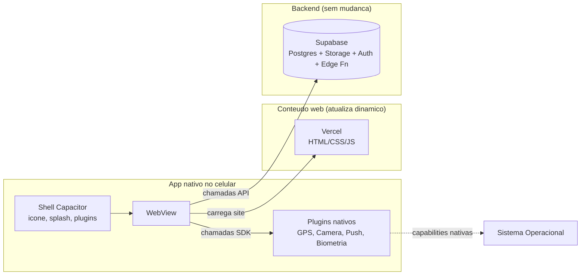
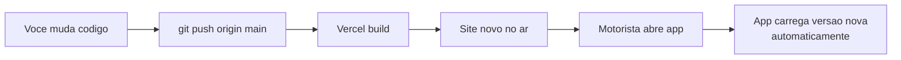

# Design — Mobile App via Capacitor

## Overview

Empacotamento do FreteGO atual (Vite + React + Supabase) em um app
nativo Android (e iOS no futuro) usando o **Capacitor**.

A motivação é dupla:

1. Distribuir o produto fora do navegador, com ícone na tela do celular,
   acesso a GPS/câmera/push nativo, sem depender do Chrome estar aberto.
2. Ter um caminho oficial pra Play Store e App Store sem reescrever o
   projeto em Flutter, React Native ou Kotlin/Swift.

A **estratégia central** é "app shell": o invólucro nativo é fixo, mas o
conteúdo (HTML/CSS/JS) é carregado do Vercel a cada abertura. Isso
significa que a maioria absoluta das atualizações segue saindo via
`git push origin main`, sem precisar de novo build / nova revisão na
loja.

Phase 1 entrega o caminho mínimo: Android via APK distribuído por
WhatsApp/link, push notification funcionando, GPS nativo, câmera nativa.
Phase 2 cobre Play Store, App Store (iOS) e biometria.

## Architecture



### Fluxo de atualização



A única exceção é mudança em "shell nativo" (ícone, splash, plugin novo,
permissão nova). Aí precisa rebuild + redistribuir APK / re-submeter
loja. Frequência esperada: 3-6 vezes por ano.

## Components and Interfaces

### 1. Capacitor core

**Arquivos novos no projeto:**

```
FreteGO/
├── capacitor.config.ts        ← config principal (appId, appName, webDir)
├── android/                   ← projeto Android nativo (gerado)
│   └── app/
│       ├── build.gradle
│       ├── src/main/AndroidManifest.xml
│       └── src/main/res/      ← icones, splash
├── ios/                       ← projeto iOS nativo (gerado, Phase 2)
└── src/                       ← código React, sem mudança
```

**`capacitor.config.ts`** define:

```ts
import type { CapacitorConfig } from '@capacitor/cli';

const config: CapacitorConfig = {
  appId: 'br.com.fretego.app',
  appName: 'FreteGO',
  webDir: 'dist',                     // saída do vite build
  server: {
    url: 'https://fretego.com.br',    // Phase 1: app shell aponta pra prod
    cleartext: false,                 // só HTTPS
  },
  plugins: {
    SplashScreen: {
      launchShowDuration: 1500,
      backgroundColor: '#16a34a',
    },
    StatusBar: { style: 'DARK' },
  },
};

export default config;
```

**Estratégia de servidor remoto vs bundled:** Phase 1 usa `server.url`
apontando pro Vercel. Vantagem: atualização instantânea sem rebuild.
Desvantagem: app não funciona offline (mas o produto também não
faz sentido offline, então tudo bem).

Phase 2 pode mudar para bundle local (`webDir: 'dist'` com `dist/`
embarcado no APK) se quiser modo offline ou app em telas onde
conexão é ruim.

### 2. Plugins nativos

Lista mínima Phase 1:

| Plugin | Pacote | Uso |
|--------|--------|-----|
| Geolocation | `@capacitor/geolocation` | GPS nativo (substitui browser geo) |
| Camera | `@capacitor/camera` | Tirar foto / escolher da galeria |
| Push Notifications | `@capacitor/push-notifications` | Push real via FCM/APN |
| Status Bar | `@capacitor/status-bar` | Cor da barra de status |
| Splash Screen | `@capacitor/splash-screen` | Logo ao abrir |
| Preferences | `@capacitor/preferences` | localStorage nativo persistente |
| App | `@capacitor/app` | Detecta abertura, deep links |

Phase 2:

| Plugin | Uso |
|--------|-----|
| `@capacitor/biometric-auth` | Login por impressão digital / Face ID |
| `@capacitor/share` | Compartilhar frete via apps nativos |
| `@capacitor/filesystem` | Cache offline de imagens |
| `@capacitor/network` | Detectar offline → mostrar banner |

### 3. Camadas de adaptação no código

A maior parte do código React **não muda**. Mas alguns arquivos vão
ganhar uma "ponte" que detecta se está rodando no app nativo ou no
browser, e usa o plugin correto.

**Exemplo: GPS**

```ts
// src/services/geolocation.ts (refatoração futura)
import { Capacitor } from '@capacitor/core';
import { Geolocation } from '@capacitor/geolocation';

export async function getCurrentPosition() {
  if (Capacitor.isNativePlatform()) {
    // Plugin nativo (Capacitor)
    const pos = await Geolocation.getCurrentPosition({
      enableHighAccuracy: true,
      timeout: 10000,
    });
    return { latitude: pos.coords.latitude, longitude: pos.coords.longitude };
  }
  // Fallback: API do browser (já existe hoje)
  return new Promise((resolve, reject) => {
    navigator.geolocation.getCurrentPosition(
      (pos) => resolve({ latitude: pos.coords.latitude, longitude: pos.coords.longitude }),
      reject
    );
  });
}
```

Mesmo padrão para Camera e Push. O resto do app continua chamando
`getCurrentPosition()` sem se importar com o ambiente.

### 4. Push Notifications

Stack:

```
notifications (tabela Supabase)
        ↓
trigger SQL (já existe)
        ↓
Edge Function nova: send-push-notification
        ↓
FCM (Android) / APN (iOS)
        ↓
celular do usuário recebe push
        ↓
ao tocar → abre app na rota correta (deep link)
```

**Tabela nova `device_tokens`** (Phase 1.5):

```sql
CREATE TABLE device_tokens (
  id          uuid PRIMARY KEY DEFAULT gen_random_uuid(),
  user_id     uuid NOT NULL REFERENCES users(id) ON DELETE CASCADE,
  token       text NOT NULL,
  platform    text NOT NULL CHECK (platform IN ('android','ios','web')),
  app_version text NULL,
  created_at  timestamptz NOT NULL DEFAULT NOW(),
  last_seen_at timestamptz NOT NULL DEFAULT NOW(),
  UNIQUE(user_id, token)
);
```

App registra o token quando logado. Edge Function consulta a tabela e
dispara push pra todos os tokens do user destinatário toda vez que
uma `notifications` row é inserida.

## Data Models

Esta spec **não introduz mudanças no modelo de dados** Phase 1.

Phase 1.5 adiciona `device_tokens` (acima) quando push for ativado.

## Distribuição

### Phase 1.A — APK por WhatsApp/link (sem loja)

**Comando:**
```bash
cd android
./gradlew assembleDebug
# saída: android/app/build/outputs/apk/debug/app-debug.apk
```

**Distribuição:**
- Hospedar o `.apk` num bucket público do Supabase (ou Vercel public/).
- Compartilhar link.
- Usuário baixa e instala manualmente (precisa habilitar
  "fontes desconhecidas" nas configs do Android, mas é um clique).

**Custo:** zero. **Tempo:** < 1 dia depois do Capacitor configurado.

**Ideal para:** primeiros 5-50 motoristas teste, validação de produto.

### Phase 1.B — Play Store (Android)

**Pré-requisitos:**
- Conta Google Play Console (USD 25 uma vez na vida).
- Chave de assinatura release (gerada localmente via `keytool`,
  guardada em local seguro — perder essa chave inviabiliza
  atualizações futuras).

**Comando:**
```bash
cd android
./gradlew bundleRelease
# saída: android/app/build/outputs/bundle/release/app-release.aab
```

**Submissão:**
- Sobe `.aab` no Play Console.
- Preenche metadados (descrição, screenshots, política de
  privacidade obrigatória, classificação etária).
- Manda pra revisão. Aprovação típica: 1-3 dias.
- Publicado.

**Custo:** USD 25 uma vez. **Tempo:** 1 semana de prep + 1-3 dias revisão.

### Phase 2 — App Store (iOS)

**Pré-requisitos:**
- Apple Developer Program (USD 99/ano).
- Mac (físico ou cloud — Codemagic, GitHub Actions macOS).
- Certificados Apple (Developer + Distribution).
- Provisioning profiles.

**Comando (no Mac):**
```bash
cd ios/App
pod install
xcodebuild -workspace App.xcworkspace -scheme App archive
# Em seguida: exportArchive → gera .ipa
```

**Submissão:**
- Sobe `.ipa` via App Store Connect.
- Apple revisa: 1-7 dias, podem rebote 2-3 vezes pedindo ajustes
  (privacy policy, login com Apple, etc.).
- Publicado.

**Custo:** USD 99/ano + Mac. **Tempo:** 2 semanas de prep + revisão.

## Atualizações Pós-Distribuição

### Mudanças "OTA" (over-the-air, sem rebuild)

95% das atualizações.

**Tipo:** mudança em código React (HTML/CSS/JS) — novo botão, nova
tela, fix de bug, mudança de cor, nova rota.

**Fluxo:**
1. `git push origin main`.
2. Vercel atualiza (~1 min).
3. Ao reabrir o app, motorista vê a versão nova.

**Não precisa rebuild de APK.** Não precisa subir loja. Não precisa
revisão Apple/Google.

### Mudanças "binárias" (precisam rebuild)

5% das atualizações.

**Tipos:**
- Trocar ícone do app.
- Trocar splash.
- Adicionar plugin Capacitor novo (ex: leitor de NFC).
- Mudar permissões (ex: pedir acesso a contatos).
- Atualizar Android SDK (obrigatório anualmente pra Play Store).

**Fluxo:**
1. Mexer em config nativo.
2. Rebuild APK/AAB/IPA.
3. Distribuir (link novo OU resubmeter loja).
4. Aguardar revisão.
5. Usuário recebe notificação "atualização disponível" no celular.

## Erros e Edge Cases

| Cenário | Tratamento |
|---------|-----------|
| App offline ao abrir | Phase 1: tela "Sem conexão. Tente novamente." Phase 2: cache local opcional. |
| Token push expira | Edge Function detecta erro e remove token de `device_tokens`. |
| User desinstala app | Token fica órfão. Cleanup periódico via cron job (Phase 2). |
| Versão nativa muito antiga (incompatível com nova feature server-side) | Server retorna `426 Upgrade Required`. App mostra modal "Atualize o app pra continuar". |
| Permissão de GPS negada | Igual ao web hoje (banner "Localização bloqueada"). |
| Apple rebote review | Cada rebote → ajusta + resubmete (1 ciclo extra de 1-7 dias). |

## Segurança

- App shell carrega via HTTPS apenas (`cleartext: false`).
- Token push é UUID per device, não exposto na UI.
- Auth Supabase reusa o JWT já emitido — sem mudança.
- Plugin Camera respeita permissão Android/iOS — usuário precisa
  autorizar uma vez.
- APK release é assinado com keystore privada — qualquer rebuild
  não-assinado é rejeitado pela Play Store.

## Decisões de Design

### D1. Capacitor vs React Native vs PWA

**Decidido: Capacitor.**

- React Native exige reescrita (3-6 meses).
- PWA: iOS limitado, Apple não permite PWA na App Store.
- Capacitor: 100% reuso, suporte nativo a Android e iOS, push real,
  caminho pra ambas as lojas.

### D2. App shell remoto vs bundle local

**Decidido: app shell remoto (apontando pra Vercel).**

- Atualizações OTA instantâneas.
- Reduz drasticamente frequência de builds nativos.
- Trade-off aceitável: app não funciona offline.

Bundle local fica como Phase 2 se houver necessidade de offline-first.

### D3. Distribuir APK por link antes de Play Store

**Decidido: sim, fase 1.A.**

- Validação rápida com motoristas reais.
- Custo zero.
- Permite ajustar bugs antes de gastar com Play Store + ciclos de revisão.

### D4. Phase 1 só Android

**Decidido: sim.**

- iOS exige Mac + USD 99/ano + processo Apple mais lento.
- Android cobre 80% do mercado brasileiro de motoristas.
- iOS entra na Phase 2 quando produto estiver maduro.

### D5. Plugin de mapa: continua Leaflet web ou nativo?

**Decidido: continua Leaflet (web).**

- Já funciona, tem 14 categorias commodities + GPS + radius filter.
- Performance aceitável dentro da WebView.
- Plugin nativo (Mapbox SDK, Google Maps SDK) custaria refactor
  significativo sem ganho proporcional.

Migração para mapa nativo só se Phase 2 detectar gargalo de performance.

## Custos Reais

| Item | Phase 1.A (APK link) | Phase 1.B (Play Store) | Phase 2 (App Store) |
|------|---------------------|------------------------|---------------------|
| Capacitor + plugins | grátis | grátis | grátis |
| Google Play Console | — | USD 25 (R$ 140) **uma vez** | — |
| Apple Developer Program | — | — | USD 99/ano (R$ 550) |
| Mac (cloud build) | — | — | USD 0-30/mês |
| Mac próprio (alternativa) | — | — | R$ 4-7k uma vez |
| Hospedagem APK | grátis (Supabase Storage) | — | — |
| Push Notifications (FCM) | grátis | grátis | grátis |
| Push Notifications (APN) | — | — | incluso na Apple Dev |

## Roadmap Sugerido

### Phase 1.A: Fundação (1-2 semanas)
1. Instalar Capacitor + plugins essenciais.
2. Configurar `capacitor.config.ts` com server remoto.
3. Adicionar ícone e splash da FreteGO.
4. Adaptar GPS, Camera, Status Bar.
5. Testar APK debug em celular real.
6. Distribuir pra 5-10 motoristas teste.

### Phase 1.5: Push Notifications (1 semana)
1. Migration para `device_tokens`.
2. Edge Function `send-push-notification`.
3. Trigger SQL ao inserir em `notifications`.
4. Plugin de push no app + registro de token.
5. Deep link ao tocar na notificação.

### Phase 1.B: Play Store (1-2 semanas)
1. Criar conta Google Play Console.
2. Gerar keystore release.
3. Configurar build release.
4. Gerar AAB.
5. Preparar assets (screenshots, ícone alta resolução, descrição).
6. Política de privacidade publicada (página `/politica-privacidade`).
7. Submeter pra revisão.
8. Aprovação + publicação.

### Phase 2: App Store iOS (2-3 semanas)
1. Apple Developer Program.
2. Setup ambiente macOS (próprio ou cloud).
3. Configurar certificados.
4. `npx cap add ios`.
5. Configurar Info.plist (privacy descriptions).
6. Gerar IPA.
7. Submeter App Store Connect.
8. Aguardar revisão Apple.

### Phase 3 (futuro): Otimizações
- Login biométrico.
- Cache offline básico (modo "ler ofertas").
- Compartilhamento nativo de fretes.
- Atalhos do app na home (Android shortcuts, iOS quick actions).
- Live Activities (iOS) / Ongoing Notifications (Android) para
  acompanhamento de frete em andamento.
