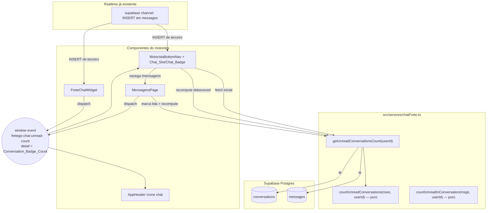

# Design Document

## Overview

Esta feature adiciona o `Chat_Slot` à `MotoristaBottomNav`, entre "Início" e "Mapa",
navegando para `/mensagens`, com um `Chat_Badge` que conta **conversas distintas com
mensagens não lidas** (`Conversation_Badge_Count`) — não o total de mensagens. O badge
atualiza em tempo real via o `Realtime_Channel` já existente e é decrementado/zerado
conforme o motorista lê as conversas.

O escopo é contido: uma alteração de layout na `MotoristaBottomNav` (de 5 para 6 slots),
**uma nova função de serviço** (`getUnreadConversationsCount`) com helpers puros
testáveis, e o **alinhamento do contrato do `Unread_Count_Event`** para que todos os
indicadores de chat do app (header e bottom nav) passem a significar a mesma coisa:
conversas não lidas.

### Decisões de design e racional

1. **Contagem por conversa, não por mensagem (decisão central).** A função existente
   `getTotalUnreadCount` retorna o total de *mensagens* não lidas. Criamos
   `getUnreadConversationsCount`, que retorna o número de *conversas distintas* com ao
   menos uma mensagem não lida. A lógica de contagem distinta é extraída para um helper
   **puro** (`countUnreadConversations`) para permitir property-based testing barato,
   sem I/O.

2. **Contrato único do `Unread_Count_Event` = conversas (decisão de consistência).**
   Hoje `fretego-chat-unread-count` carrega contagem de *mensagens* e é consumido pelo
   `AppHeader` (badge do ícone de chat) e produzido por `MensagensPage` e
   `FreteChatWidget`. Como o ícone de chat do header e o novo `Chat_Slot` ficam visíveis
   simultaneamente para o motorista, manter semânticas diferentes mostraria, por exemplo,
   "5" no header (mensagens) e "2" no rodapé (conversas). Para evitar essa inconsistência
   (explicitamente vetada nos requisitos), **redefinimos o payload do evento como o
   `Conversation_Badge_Count`** e migramos os produtores/consumidores para
   `getUnreadConversationsCount`. O contrato passa a ser: *o `detail` do evento é sempre
   o número de conversas não lidas, autoritativo, e qualquer consumidor reflete o valor
   recebido* (Req 5.3).

3. **Recompute autoritativo em vez de incremento manual frágil.** Em vez de manter um
   contador `+1/-1` espalhado (propenso a divergência entre mensagens e conversas), os
   produtores recomputam o valor autoritativo via `getUnreadConversationsCount` quando há
   um gatilho (mensagem nova de terceiro / marcação de leitura) e propagam pelo evento.
   Como a contagem é de conversas distintas, a idempotência de Req 5.2 (segunda mensagem
   não lida na mesma conversa não altera o badge) e o "+1" de Req 5.1 caem naturalmente
   do recompute, sem bookkeeping manual. Recompute em rajada é coalescido por debounce.

4. **Sem polling.** Todas as atualizações vêm do `Realtime_Channel` (INSERT em
   `messages`) já assinado pelo projeto e do `Unread_Count_Event` (Req 5.4).

5. **Layout `grid-cols-6` com sizing reduzido.** Seis slots cabem na pílula flutuante
   reduzindo ícone (`w-6 h-6` → `w-5 h-5`) e rótulo (`text-[10px]` → `text-[9px]`),
   preservando o estilo pílula (`bg-gray-900`, `rounded-3xl`), o auto-hide-on-scroll e a
   borda âmbar.

## Architecture



### Fluxos principais

- **Carga inicial do badge:** `MotoristaBottomNav` chama `getUnreadConversationsCount`
  para o motorista autenticado e exibe o `Chat_Badge` se `> 0`.
- **Mensagem nova (terceiro):** o `Realtime_Channel` (INSERT em `messages`) dispara →
  o componente recomputa o `Conversation_Badge_Count` (debounce ~250 ms) e atualiza o
  badge. Recompute de conversas distintas garante idempotência.
- **Leitura:** ao abrir uma `Unread_Conversation`, `MensagensPage` chama
  `markFreteMessagesAsRead`, recomputa via `getUnreadConversationsCount` e dispara o
  `Unread_Count_Event` com o novo valor → `Chat_Badge` decrementa/zera.
- **Reflexo do evento:** qualquer componente inscrito reflete o valor recebido (Req 5.3).

## Components and Interfaces

### 1. `Chat_Service` — `src/services/chatFrete.ts` (alteração: nova função + helpers)

```ts
/** Linha mínima de mensagem usada na contagem (subset de `messages`). */
export interface UnreadMessageRow {
  conversationId: string;
  senderId: string;
  readAt: string | null;
}

/**
 * Helper PURO: número de CONVERSAS distintas com ao menos uma mensagem não lida
 * pelo usuário (remetente != usuário E read_at nulo). Sem I/O — testável por PBT.
 */
export function countUnreadConversations(
  rows: UnreadMessageRow[],
  userId: string
): number {
  const unread = new Set<string>();
  for (const r of rows) {
    if (r.senderId !== userId && r.readAt === null) {
      unread.add(r.conversationId);
    }
  }
  return unread.size;
}

/**
 * Helper PURO: número de mensagens não lidas pelo usuário DENTRO de uma conversa.
 * Usado pelo item da lista da Mensagens_Page (Req 4).
 */
export function countUnreadInConversation(
  rows: UnreadMessageRow[],
  userId: string
): number {
  let n = 0;
  for (const r of rows) {
    if (r.senderId !== userId && r.readAt === null) n++;
  }
  return n;
}

/**
 * Conversation_Badge_Count do motorista: nº de conversas distintas não lidas.
 * Reusa o mesmo padrão de `getTotalUnreadCount` (mesmo client/tabelas), mas
 * deduplica por conversation_id via o helper puro.
 */
export async function getUnreadConversationsCount(userId: string): Promise<number> {
  const { data: convs } = await supabase
    .from('conversations')
    .select('id')
    .or(`motorista_id.eq.${userId},embarcador_id.eq.${userId}`);

  if (!convs || convs.length === 0) return 0;

  const ids = convs.map((c) => c.id);
  const { data, error } = await supabase
    .from('messages')
    .select('conversation_id, sender_id, read_at')
    .in('conversation_id', ids)
    .neq('sender_id', userId)
    .is('read_at', null);

  if (error) return 0; // degradação silenciosa: Req 6.3

  const rows: UnreadMessageRow[] = (data ?? []).map((m) => ({
    conversationId: m.conversation_id as string,
    senderId: m.sender_id as string,
    readAt: (m.read_at as string | null) ?? null,
  }));
  return countUnreadConversations(rows, userId);
}
```

**Abordagem de query e performance.** O filtro `.neq('sender_id', userId).is('read_at',
null)` já restringe o resultado no servidor às linhas relevantes (não lidas, de
terceiros); a deduplicação por `conversation_id` é feita em memória via `Set` (O(n) sobre
poucas linhas, já que somente não lidas chegam). É o mesmo formato/escopo de
`getTotalUnreadCount`, então não há regressão de custo. A RLS de `conversations`/`messages`
garante que apenas conversas em que o motorista participa retornam (Req 7.2, 7.3). Caso o
volume cresça, o passo natural de otimização (fora do escopo) é uma RPC
`SECURITY DEFINER` com `SELECT count(DISTINCT conversation_id) ...` retornando o número
direto — documentado aqui como evolução, não implementado agora.

### 2. `MotoristaBottomNav` — `src/components/MotoristaBottomNav.tsx` (alteração)

Responsabilidades adicionadas:
- Renderizar o `Chat_Slot` (ícone de balão + rótulo "Chat") como **2º item**.
- Manter `chatUnread: number` (Conversation_Badge_Count) e renderizar o `Chat_Badge`.
- Buscar o valor inicial via `getUnreadConversationsCount(user.id)`.
- Assinar o `Realtime_Channel` (INSERT em `messages`) e recomputar (debounced) quando o
  remetente não é o motorista.
- Ouvir o `Unread_Count_Event` e refletir o valor recebido (Req 5.3).
- Navegar para `/mensagens` no clique (Req 2.1); manter na página sem reload se já estiver
  em `/mensagens` (Req 2.4 — `navigate` do React Router não recarrega).

Layout:
- Container muda de `grid-cols-5` → `grid-cols-6`.
- Ordem: Início, Chat, Mapa, ANTT, Marketplace, Menu.
- Sizing reduzido para caber 6 slots em telas pequenas: ícones `w-5 h-5`, rótulos
  `text-[9px]`, `gap` e `py` levemente menores. Estilo pílula e auto-hide preservados.

Estado ativo: `isChatActive = location.pathname === '/mensagens'` → aplica `text-green-400`
(mesmo padrão dos demais slots, Req 1.6).

Esboço do `Chat_Slot` (badge sobreposto, espelhando o padrão do dot de pendência do Menu):

```tsx
const isChatActive = location.pathname === '/mensagens';
const badgeLabel = chatUnread > 9 ? '9+' : String(chatUnread);

<button
  type="button"
  onClick={() => navigate('/mensagens')}
  className={`flex flex-col items-center justify-center gap-0.5 py-1 ${
    isChatActive ? 'text-green-400' : 'text-gray-300'
  }`}
  aria-label={chatUnread > 0 ? `Chat - ${badgeLabel} conversas não lidas` : 'Chat'}
>
  <span className="relative">
    <svg className="w-5 h-5" fill="none" stroke="currentColor" viewBox="0 0 24 24" strokeWidth={1.8}>
      <path strokeLinecap="round" strokeLinejoin="round"
        d="M8 12h.01M12 12h.01M16 12h.01M21 12c0 4.418-4.03 8-9 8a9.863 9.863 0 01-4.255-.949L3 20l1.395-3.72C3.512 15.042 3 13.574 3 12c0-4.418 4.03-8 9-8s9 3.582 9 8z" />
    </svg>
    {chatUnread > 0 && (
      <span
        className="absolute -top-1 -right-2 min-w-[15px] h-[15px] px-1 rounded-full bg-red-500 text-white text-[9px] font-bold flex items-center justify-center border border-gray-900"
        aria-hidden="true"
      >
        {badgeLabel}
      </span>
    )}
  </span>
  <span className={`text-[9px] ${isChatActive ? 'font-bold' : 'font-medium'}`}>Chat</span>
</button>
```

### 3. `MensagensPage` — `src/pages/MensagensPage.tsx` (alteração mínima)

- Trocar a fonte do dispatch do evento de `getTotalUnreadCount` →
  `getUnreadConversationsCount` (o evento passa a carregar conversas, conforme contrato).
- O contador por item da lista (Req 4) já existe via `conv.unreadCount`
  (`getUserConversations` calcula mensagens não lidas por conversa). O design formaliza
  esse cálculo no helper puro `countUnreadInConversation` para teste; o comportamento
  visual atual (badge azul com a contagem por conversa; omitido quando 0) já satisfaz
  Req 4.1/4.2/4.3.

### 4. `AppHeader` — `src/components/AppHeader.tsx` (alteração de alinhamento)

- Em `refreshCounts`, trocar `getTotalUnreadCount` → `getUnreadConversationsCount` para o
  badge de chat, de modo que o ícone do header e o `Chat_Slot` mostrem o mesmo número
  (consistência). O consumo do evento permanece igual (já reflete `detail` numérico).

### 5. `FreteChatWidget` — `src/components/FreteChatWidget.tsx` (alteração de alinhamento)

- Trocar a contagem inicial e o recompute para `getUnreadConversationsCount`.
- Substituir o incremento por mensagem (`setTotalUnread((c) => c + 1)`) por **recompute
  autoritativo** (debounced) no handler de INSERT, e dispatch do evento com o valor de
  conversas. Isso mantém o widget consistente com o novo contrato e torna o incremento
  idempotente (Req 5.2).

## Data Models

Nenhuma mudança de schema. A feature lê tabelas existentes.

| Tabela | Colunas relevantes | Uso |
|---|---|---|
| `conversations` | `id`, `motorista_id`, `embarcador_id`, `updated_at` | Identificar conversas do motorista; ordenação por `updated_at` desc (Req 2.2) |
| `messages` | `conversation_id`, `sender_id`, `read_at` | Determinar `Unread_Conversation` (sender != motorista AND read_at null) |

Tipo derivado em runtime (não persistido):

- `UnreadMessageRow { conversationId; senderId; readAt }` — subset usado pelos helpers
  puros de contagem.
- `Conversation_Badge_Count: number` — valor exibido no `Chat_Badge` e payload do
  `Unread_Count_Event` (`CustomEvent<number>`).

### Contrato do `Unread_Count_Event`

```ts
// Nome: 'fretego-chat-unread-count'
// detail: number  → Conversation_Badge_Count (conversas distintas não lidas)
// Autoritativo: consumidores refletem exatamente o valor recebido.
new CustomEvent<number>('fretego-chat-unread-count', { detail: count });
```

## Correctness Properties

*A property is a characteristic or behavior that should hold true across all valid
executions of a system — essentially, a formal statement about what the system should do.
Properties serve as the bridge between human-readable specifications and machine-verifiable
correctness guarantees.*

A lógica testável desta feature é a **contagem de conversas não lidas** e o **reducer do
conjunto de conversas não lidas** (modelo `Set<conversationId>`), além da **formatação do
badge**. Layout, navegação e renderização condicional são cobertos por testes de exemplo
(ver Testing Strategy), não por property-based testing.

### Property 1: Contagem é o número de conversas distintas não lidas

*Para qualquer* lista de mensagens (cada uma com `conversationId`, `senderId`, `readAt`) e
qualquer `motoristaId`, `countUnreadConversations` retorna exatamente o número de
`conversationId` **distintos** que possuem ao menos uma mensagem com `senderId != motoristaId`
e `readAt == null`. Mensagens do próprio motorista ou já lidas nunca contribuem, e múltiplas
mensagens não lidas na mesma conversa contam como 1.

**Validates: Requirements 3.1, 3.2, 3.3, 3.6**

### Property 2: Contagem por conversa conta apenas mensagens não lidas de terceiros

*Para qualquer* lista de mensagens de uma conversa e qualquer `motoristaId`,
`countUnreadInConversation` retorna exatamente a quantidade de mensagens com
`senderId != motoristaId` e `readAt == null`, e retorna 0 quando não há nenhuma.

**Validates: Requirements 4.1, 4.2, 4.3**

### Property 3: Formatação do badge satura em "9+"

*Para qualquer* inteiro `n >= 0`, a formatação do `Chat_Badge` produz: cadeia vazia/ausência
de badge quando `n == 0`; o próprio número como texto quando `1 <= n <= 9`; e exatamente
`"9+"` quando `n > 9`.

**Validates: Requirements 3.5, 3.4**

### Property 4: Inserção de mensagem não lida é incremento idempotente por conversa

*Para qualquer* conjunto `S` de conversas não lidas e qualquer `conversationId c` cuja nova
mensagem tem remetente diferente do motorista: aplicar a inserção resulta em `S' = S ∪ {c}`.
Logo `|S'| = |S| + 1` quando `c ∉ S` (conversa antes lida) e `|S'| = |S|` quando `c ∈ S`
(conversa já não lida).

**Validates: Requirements 5.1, 5.2**

### Property 5: Marcar conversa como lida decrementa em exatamente 1 (ou mantém)

*Para qualquer* conjunto `S` de conversas não lidas e qualquer `conversationId c`, marcar `c`
como lida resulta em `S' = S \ {c}`. Logo `|S'| = |S| - 1` quando `c ∈ S` e `|S'| = |S|`
quando `c ∉ S`.

**Validates: Requirements 5.5**

### Property 6: O Conversation_Badge_Count é sempre um inteiro não negativo igual ao tamanho do conjunto

*Para qualquer* sequência de operações de inserção (mensagem de terceiro) e marcação de
leitura aplicada a partir de um conjunto inicial qualquer, o `Conversation_Badge_Count`
resultante é igual ao tamanho do conjunto de conversas não lidas e nunca é negativo. Quando o
conjunto fica vazio, o count é 0 (sem badge).

**Validates: Requirements 5.6, 6.1, 6.2**

## Error Handling

| Cenário | Tratamento | Requisito |
|---|---|---|
| Erro de rede/serviço ao computar o badge | `getUnreadConversationsCount` captura o erro e resolve `0`; o `Chat_Badge` fica oculto e a navegação do `Chat_Slot` para `/mensagens` é preservada | 6.3 |
| Sem conversas / sem não lidas | Helpers retornam `0`; nenhum badge é renderizado | 6.1, 6.2 |
| Falha no recompute em rajada de realtime | Recompute é debounced; falha individual é ignorada (catch) mantendo o último valor válido; sem crash de UI | 5.4 |
| `CustomEvent.detail` ausente/não numérico | Consumidor ignora valores não numéricos (guard `typeof detail === 'number'`), preservando o estado atual | 5.3 |
| Usuário não-motorista | `MotoristaBottomNav` não é montada; nenhuma consulta de badge é feita | 7.1 |

Princípios:
- **Degradação graciosa:** erro de contagem nunca quebra a navegação nem oculta o
  `Chat_Slot` (apenas o badge some).
- **Sem polling:** todas as atualizações são orientadas a eventos/realtime (Req 5.4).
- **Escopo por RLS:** a query só retorna conversas do motorista; o servidor é a fonte de
  verdade de autorização (Req 7.2, 7.3).

## Testing Strategy

Abordagem dupla: **property-based** para a lógica pura de contagem/reducer e **example-based**
para UI, navegação, eventos e degradação.

### Property-based tests (fast-check, mín. 100 iterações)

Biblioteca: `fast-check` + Vitest (já no projeto). Local: `src/__tests__/` seguindo a
convenção `cp<N>_<nome>.property.test.ts`. Reusar helpers de `src/__tests__/_helpers/`
(`generators.ts`); **não** usar `fc.stringOf` (usar `fc.string({minLength,maxLength})`);
gerar `conversationId`/`senderId` via `fc.uuid()` ou `fc.constantFrom([...])` para criar
colisões intencionais entre conversas. Cada teste tagueado com:
`// Feature: motorista-chat-nav, Property <N>: <texto>`.

- **Property 1** → gerar `UnreadMessageRow[]` com mistura de remetentes (incluindo o
  motorista), `readAt` nulo/preenchido e `conversationId` repetidos; conferir
  `countUnreadConversations` contra o `Set` de referência.
- **Property 2** → gerar mensagens de uma conversa; conferir `countUnreadInConversation`.
- **Property 3** → para `n` em `fc.nat()`, conferir `formatBadge(n)` (`''`/`str(n)`/`'9+'`).
- **Property 4** → reducer `applyIncomingMessage(set, c, senderIsMotorista)`; conferir
  transição/idempotência do tamanho do conjunto.
- **Property 5** → reducer `applyMarkRead(set, c)`; conferir decremento/no-op.
- **Property 6** → gerar sequência aleatória de operações; invariante `count == set.size`
  e `count >= 0`; conjunto vazio ⇒ 0.

### Unit / component tests (example-based)

- Render `MotoristaBottomNav` (motorista): existe item "Chat"; ordem dos 6 slots; classe
  `grid-cols-6`; aria-label pt-BR (Req 1.1–1.5).
- Estado ativo em `/mensagens` (Req 1.6).
- Clique no `Chat_Slot` chama `navigate('/mensagens')` (Req 2.1, 2.4).
- Badge: oculto quando count 0; visível com número; `"9+"` quando >9 (Req 3.4, 6.1).
- Consumo do `Unread_Count_Event`: dispatch `detail=k` → badge reflete `k`; ignora
  `detail` não numérico (Req 5.3).
- Degradação: mock de erro do Supabase → `getUnreadConversationsCount` resolve 0 e a
  navegação continua (Req 6.3).
- Não-motorista → componente não monta (Req 7.1).
- `MensagensPage`: item da lista mostra contador por conversa e o omite quando 0
  (Req 4.1, 4.3).

### Integration tests (CI, `tests/`)

- RLS de escopo: motorista não recebe conversas alheias na contagem (Req 7.3).
- Fluxo realtime end-to-end: INSERT de mensagem de terceiro incrementa o badge sem reload;
  marcar lida decrementa (Req 5.1, 5.5) — usando branch Supabase efêmero.

### Decisões de teste herdadas (governança)

- Formulário/ação inválida só "passa" se o envio for bloqueado **e** houver mensagem pt-BR
  (não se aplica diretamente aqui — feature read-only de badge).
- Qualquer flaky que só passa após retry bloqueia merge; testes de realtime devem ser
  determinísticos (mock do canal quando possível).
- Ao tocar `chatFrete.ts` (módulo crítico de chat), manter a cobertura mínima configurada
  em `tests/coverage.config.ts`.
