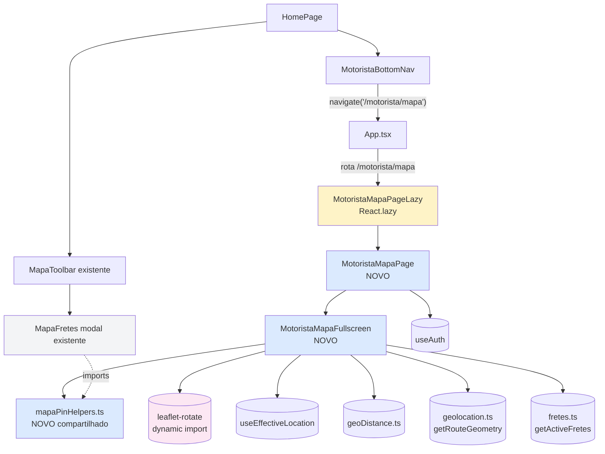
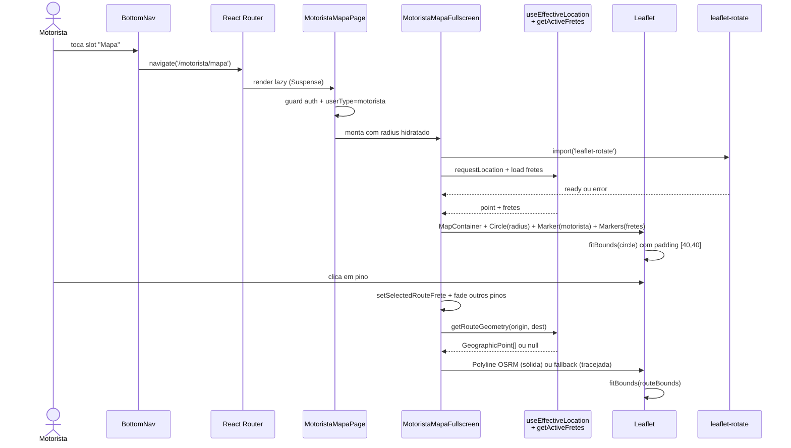
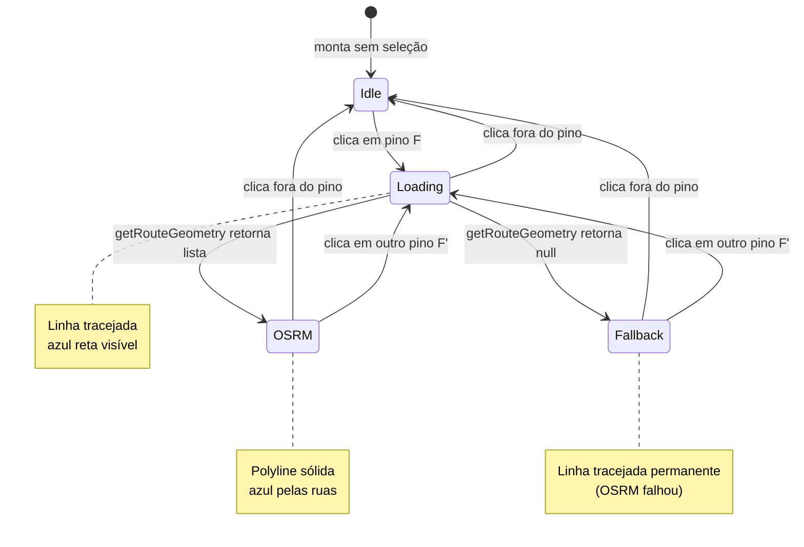
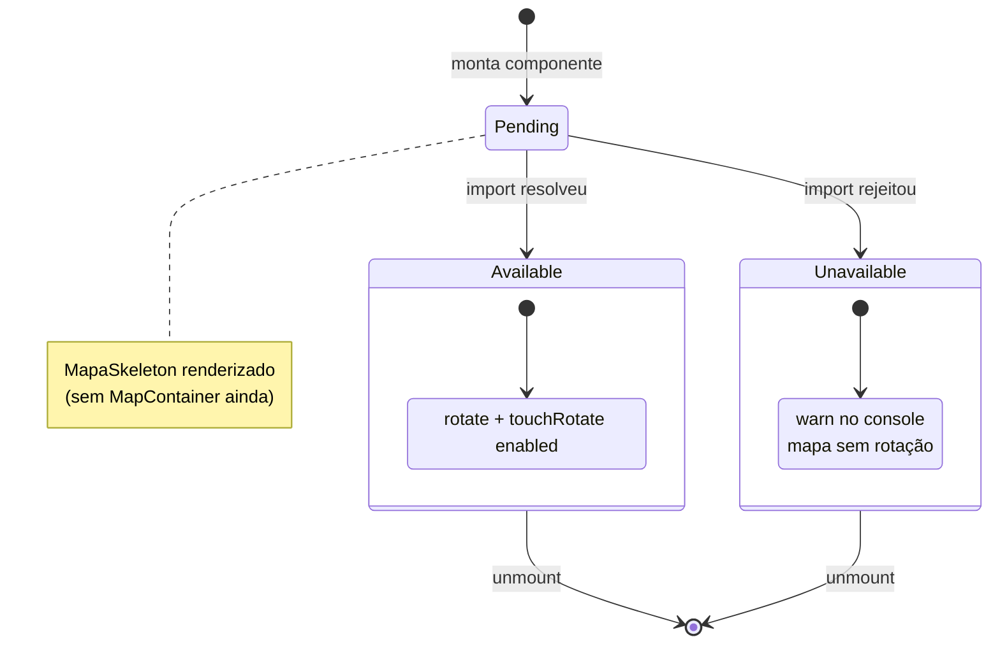

# Design Document — motorista-mapa-fullscreen

## Overview

Esta feature substitui o slot **Chat** do `MotoristaBottomNav` por
**Mapa**, que abre uma rota dedicada `/motorista/mapa` com o
componente `MotoristaMapaFullscreen` ocupando 100% da viewport.
O componente reutiliza ao máximo a infra já existente:
`useEffectiveLocation` (GPS + override), `geoDistance.ts` (raio
+ filtro), `getRouteGeometry` (OSRM), tile server OSM público e
helpers de pin do `MapaFretes`. Adiciona uma única dependência
nova — `leaflet-rotate@~0.2.x` — carregada **dinamicamente** dentro
do próprio módulo lazy, com fallback gracioso se o import falhar.

A feature é exclusiva do ramo motorista. Embarcador e visitante
não veem o `MotoristaBottomNav`, então não enxergam essa entrada.
O `MapaFretes` modal (invocado pelo `MapaToolbar` na home) **não
é alterado** — segue funcionando exatamente como hoje. A nova
página é uma **entrada paralela**, não uma substituição.

## Architecture

### Diagrama de componentes



### Fluxo de dados na rota `/motorista/mapa`



## Decisões técnicas

### 1. Plugin de rotação: `leaflet-rotate@~0.2.7`

**Versão pinada:** `"leaflet-rotate": "~0.2.7"` no `package.json`
(allow patch updates dentro de 0.2.x; bloqueia minor/major).

**Por que essa lib:**
- Última versão estável compatível com Leaflet 1.9.x (que o
  projeto usa).
- ~10 KB minified, lazy-loaded dentro do chunk do mapa.
- Adiciona `rotate`, `touchRotate`, `bearing` ao `L.Map.options`
  via monkey-patch. Não afeta react-leaflet.

**Estratégia de import:**

```ts
// Dentro de MotoristaMapaFullscreen.tsx
import L from 'leaflet';
import 'leaflet/dist/leaflet.css';

// ⚠ NÃO usar import estático de leaflet-rotate
// porque incorpora ao chunk inicial do componente.

const [rotateAvailability, setRotateAvailability] =
  useState<RotateAvailability>('pending');

useEffect(() => {
  let cancelled = false;
  // O import injeta os métodos no `L.Map.prototype`.
  // Tem que rodar ANTES do MapContainer montar pra valer.
  import('leaflet-rotate')
    .then(() => {
      if (!cancelled) setRotateAvailability('available');
    })
    .catch((err) => {
      if (cancelled) return;
      console.warn(
        '[MotoristaMapaFullscreen] leaflet-rotate indisponível — rotação desabilitada',
        err
      );
      setRotateAvailability('unavailable');
    });
  return () => {
    cancelled = true;
  };
}, []);

// Render condicional:
if (rotateAvailability === 'pending') {
  return <MapaSkeleton />;
}
return (
  <MapContainer
    {...(rotateAvailability === 'available'
      ? { rotate: true, touchRotate: true, bearing: 0 }
      : {})}
    // demais props...
  />
);
```

**Trade-off:** o mapa fica num skeleton até o plugin resolver.
Em conexão típica isso é < 200ms (já está no chunk lazy junto com
o componente). Em rede ruim ou falha, cai pro `unavailable` e
renderiza sem rotação. Aceitável.

**Alternativa rejeitada:** carregar o plugin dentro de um
`useEffect` **após** o `MapContainer` montar e tentar
`map.invalidateSize() + map.options.rotate = true`. Esse caminho
não funciona porque o Leaflet não suporta upgrade de mapas
existentes — as opções são fixadas no construtor. Logo, esperar
o plugin antes de montar é a única opção robusta.

### 2. Helpers de pin compartilhados

**Decisão:** extrair `pinIcon`, `destIcon`, `motoristaIcon` para
`src/components/mapa/pinHelpers.ts`.

```ts
// src/components/mapa/pinHelpers.ts
import L from 'leaflet';

export type PinKind = 'frete-ativo' | 'frete-encerrado' | 'destino' | 'motorista';
export type PinOpacity = 1 | 0.3;

const PIN_COLORS: Record<PinKind, string> = {
  'frete-ativo': '#16a34a',
  'frete-encerrado': '#9ca3af',
  destino: '#ea580c',
  motorista: '#2563eb',
};

export function makePinIcon(kind: PinKind, opacity: PinOpacity = 1): L.DivIcon {
  const color = PIN_COLORS[kind];
  const opacityAttr = opacity === 1 ? '' : `opacity="${opacity}"`;
  return L.divIcon({
    className: `mapa-pin mapa-pin-${kind}`,
    iconSize: [18, 22],
    iconAnchor: [9, 22],
    popupAnchor: [0, -20],
    html: `<svg width="18" height="22" viewBox="0 0 22 28" xmlns="http://www.w3.org/2000/svg" ${opacityAttr}>
      <path fill="${color}" stroke="#ffffff" stroke-width="1.5"
            d="M11 0a11 11 0 0 0-11 11c0 7.5 11 17 11 17s11-9.5 11-17A11 11 0 0 0 11 0z"/>
      <circle cx="11" cy="11" r="4" fill="#ffffff"/>
    </svg>`,
  });
}

export function makeMotoristaIcon(): L.DivIcon {
  return L.divIcon({
    className: 'mapa-pin-motorista',
    iconSize: [22, 22],
    iconAnchor: [11, 11],
    html: `<div style="
      width:22px;height:22px;border-radius:50%;
      background:#16a34a;border:3px solid #fff;
      box-shadow:0 0 0 2px rgba(22,163,74,.35), 0 1px 4px rgba(0,0,0,.4);
    "></div>`,
  });
}
```

**Migração do `MapaFretes`:** trocar as funções inline `pinIcon`
e `destIcon` por imports do helper. Comportamento visual idêntico
porque o SVG é o mesmo.

**Migração do `InteractiveMap`:** sem mudança nessa feature
(continua usando o ícone default do Leaflet — não vale o churn).

### 3. Estrutura de estado de `MotoristaMapaFullscreen`

```ts
interface MotoristaMapaFullscreenState {
  // Localização efetiva (vem do hook)
  point: GeographicPoint | null;
  geoStatus: GeolocationStatus;

  // Raio (compartilhado com feed via localStorage)
  radiusKm: RadiusOption;

  // Lista de fretes ativos (vem do service)
  fretes: Frete[];
  fretesLoading: boolean;

  // Frete selecionado (clique no pino)
  selectedRouteFrete: Frete | null;
  routeGeometry: GeographicPoint[] | null;
  routeState: RouteState; // 'idle' | 'loading' | 'osrm' | 'fallback'

  // Plugin de rotação
  rotateAvailability: RotateAvailability; // 'pending' | 'available' | 'unavailable'

  // Banner de "sem fretes no raio" (efêmero, 6s)
  noFretesBannerVisible: boolean;
}
```

**Derivações memoizadas:**

```ts
// Pinos a renderizar = fretes filtrados pelo raio
const visibleFretes = useMemo(
  () => (point ? filterFretesByRadius(fretes, point, radiusKm) : []),
  [fretes, point, radiusKm]
);

// Bounds do círculo (pra fitBounds)
const circleBounds = useMemo(
  () => (point ? L.circle([point.latitude, point.longitude], {
    radius: radiusKm * 1000,
  }).getBounds() : null),
  [point, radiusKm]
);
```

**Refs:**
- `mapRef: useRef<L.Map | null>(null)` — referência ao mapa
  Leaflet, capturada via `whenReady`. Usado para chamar
  `fitBounds` imperativamente quando o frete selecionado muda.
- `osrmAbortRef: useRef<{ cancelled: boolean } | null>(null)` —
  flag de cancelamento da chamada OSRM em vôo. Cada novo
  `selectedRouteFrete` cria um novo objeto e marca o anterior
  como `cancelled = true`.

### 4. Diagrama de estados da seleção de pino



### 5. Diagrama de estados do plugin de rotação



### 6. Estrutura de arquivos novos

```
src/
  components/
    mapa/
      pinHelpers.ts             # NOVO
      MotoristaMapaFullscreen.tsx  # NOVO
    MotoristaBottomNav.tsx      # MODIFICADO (slot Chat → Mapa)
    MapaFretes.tsx              # MODIFICADO (importa pinHelpers; sem mudança visual)
  pages/
    MotoristaMapaPage.tsx       # NOVO
    HomePage.tsx                # MODIFICADO (remove prop chatBadge)
  App.tsx                       # MODIFICADO (rota /motorista/mapa)
```

**Por que `components/mapa/`:** isolar o domínio de mapa
(componentes + helpers) num namespace evita poluir o nível raiz
de `components/`. O `MapaFretes.tsx` antigo continua na raiz por
compatibilidade (não vou movê-lo nessa feature pra evitar churn).

### 7. Roteamento e guards

```tsx
// src/App.tsx (trecho)
const MotoristaMapaPage = lazy(() => import('./pages/MotoristaMapaPage'));

// dentro de <Routes>:
<Route
  path="/motorista/mapa"
  element={
    <Suspense fallback={<RouteLoadingFallback />}>
      <MotoristaMapaPage />
    </Suspense>
  }
/>
```

**Guard interno** (em `MotoristaMapaPage`):

```tsx
export default function MotoristaMapaPage() {
  const { user, isAuthenticated, isLoading } = useAuth();
  const navigate = useNavigate();

  // Loading inicial do auth: mostra skeleton.
  if (isLoading) return <MapaSkeleton />;

  // Não logado: redirect /login.
  if (!isAuthenticated) {
    return <Navigate to="/login" replace />;
  }

  // Logado mas não-motorista: redirect /.
  if (user?.userType !== 'motorista') {
    return <Navigate to="/" replace />;
  }

  return (
    <div className="flex flex-col h-screen w-screen overflow-hidden">
      <MapaTopBar />
      <MotoristaMapaFullscreen className="flex-1" />
    </div>
  );
}
```

### 8. UX e responsividade

**Header próprio (`MapaTopBar`):**
- Sticky top, altura 48px.
- Botão "Voltar" (chevron-left) à esquerda → `navigate(-1)`.
- Título "Mapa de fretes" centralizado.
- Sem `AppHeader`, sem `MotoristaBottomNav`.

**Seletor de raio:**
- Canto superior direito do mapa, z-50, bg-white/95 + backdrop blur.
- Mobile (< 640px): chips horizontais [50] [100] [200] [500] km.
- Desktop: dropdown compacto "Raio: 100 km ▾".

**Indicação de localização:**
- Canto inferior esquerdo do mapa, z-50.
- Pequeno chip "📍 GPS" ou "📍 Local: <label>" baseado em
  `effectiveLoc.source`.

**Card flutuante de frete selecionado:**
- Bottom-2, centralizado, max-w-md.
- Mostra rota, valor BRL, distância motorista→origem em km, botão
  "Ver detalhes" (abre `FreteModal`).
- Botão ✕ no canto superior direito limpa a seleção.

**Mobile-first:**
- Pinch-zoom nativo do Leaflet preservado.
- `dragging`, `touchZoom`, `doubleClickZoom` ativos.
- `zoomControl={false}` no mobile (evita poluir UI); ativo em
  `lg:` via prop.

### 9. Tratamento de bordas

| Cenário | Comportamento |
|---|---|
| Sem GPS, status `idle`/`loading` | Overlay leve "Localizando..." + mapa BR_CENTER zoom 4 |
| Sem GPS, status `denied`/`error`/`insecure` | Banner amarelo + botão "Como ativar" (modal de instruções por browser/SO igual ao do `MapaFretes`) |
| Lista de fretes vazia no raio | Banner discreto rodapé por 6s: "Nenhum frete dentro do raio atual. Aumente o raio para ver mais ofertas." |
| OSRM timeout/falha | Linha tracejada permanente + log warn (sem alerta UI) |
| `leaflet-rotate` falha import | Mapa abre sem rotação + warn no console |
| `fitBounds` antes do mapa montado | Re-tenta no próximo ciclo via `setTimeout(0)` (mesmo padrão do `MapaFretes`) |
| Usuário re-clica mesmo pino | Idempotente (Property D): mantém estado, não refaz request OSRM |
| Frete sem `destinationLocation` válida | Pino aparece, mas clique não traça rota; card mostra valor sem distância destino |

### 10. Compartilhamento de raio com o feed

**Cenário:** motorista no `/` muda raio para 200 km via
`MapaToolbar`. Vai pra `/motorista/mapa`.

**Comportamento:**
1. `MapaToolbar` chama `writeStoredRadius(200)` →
   `localStorage[RADIUS_STORAGE_KEY] = '200'`.
2. Motorista navega pra `/motorista/mapa`.
3. `MotoristaMapaFullscreen` monta e chama
   `readStoredRadius(localStorage.getItem(RADIUS_STORAGE_KEY))`
   → retorna `200`.
4. Mapa abre com raio 200km já hidratado.

**Cenário inverso:** motorista muda raio no mapa fullscreen,
volta pra `/`. Idem — `HomePage` lê do mesmo localStorage no
mount. **Sem novos eventos custom**, sem `BroadcastChannel`,
sem `Context API`. Persistência via `localStorage` é suficiente
porque a navegação entre rotas remonta os componentes e re-lê
o storage.

## Plano de testes

Mapeamento das propriedades do requirements.md:

| Property | Tipo | Cobertura | Localização |
|---|---|---|---|
| A — Filtro raio invariante | PBT (já existe) | Reusar `home-map-radius/cp-radius-filter` | `src/__tests__/home-map-radius/` |
| B — Seleção singleton | PBT novo | `motoristaMapa.singleton.property.test.ts` | `src/__tests__/motorista-mapa/` |
| C — Round-trip raio↔storage | PBT (já existe) | Reusar | idem |
| D — Idempotência seleção | PBT novo | `motoristaMapa.idempotence.property.test.ts` | idem |
| E — Confluence ordem | PBT novo | `motoristaMapa.confluence.property.test.ts` | idem |
| F — fitBounds enquadra raio | PBT novo (math only) | `motoristaMapa.fitBounds.property.test.ts` (testa cálculo de bounds geográficos sem Leaflet headless) | idem |
| G — OSRM mock metamorfic | PBT novo | `motoristaMapa.osrm.property.test.ts` (mock fetch) | idem |
| H — Fade restaura ao limpar | PBT novo | `motoristaMapa.fadeRestore.property.test.ts` | idem |
| I — Hit-area independente | Example | `motoristaMapa.hitArea.test.tsx` (RTL) | idem |
| J — Anti-properties | Example tests | Cobertos pontualmente em integration tests | idem |

**Não vão ter**:
- Teste e2e do plugin `leaflet-rotate` (não confiável em jsdom).
- Teste real de OSRM (mock obrigatório).
- Teste de tile loading (mock).

## Trade-offs e alternativas consideradas

### Por que não reaproveitar `MapaFretes` em modo fullscreen?

`MapaFretes` foi desenhado pra ser **modal embutido** no feed
(altura variável, expandir/recolher, toolbar inline). Adaptá-lo
pra fullscreen exigiria:
- Adicionar prop `fullscreen` que liga/desliga vários blocos.
- Lidar com header próprio só no modo fullscreen.
- Suportar plugin de rotação só no modo fullscreen.

A complexidade combinatória fica alta e o `MapaFretes` cresce
em superfície. Preferi um componente novo focado em fullscreen,
extraindo apenas os helpers de pin que dá pra compartilhar sem
fricção.

### Por que não usar Mapbox GL ou Google Maps?

- **Custo:** ambos têm tier pago acima de N requests/mês.
  OSRM + OSM tiles são gratuitos pro volume atual do FreteGO.
- **Bundle:** Mapbox GL adiciona 200+ KB; Leaflet (já em uso)
  adiciona ~40 KB. Manter Leaflet preserva consistência com o
  `MapaFretes` e o `InteractiveMap`.
- **Rotação:** ambos têm rotação nativa, mas `leaflet-rotate`
  cobre o requisito a custo de 10 KB extras lazy.

### Por que não fazer push do raio via `BroadcastChannel`?

Passou a ser overkill. O ciclo "muda raio → navega → remonta
componente → lê localStorage" cobre o caso real (não tem mudança
em paralelo entre duas abas comuns nesse fluxo).
`BroadcastChannel` é interessante quando há sync **simultâneo**
sem remount; aqui não há.

### Por que `React.lazy` por rota e não por componente?

`React.lazy` por rota arrasta tudo que a rota usa para o chunk:
`MotoristaMapaPage` + `MotoristaMapaFullscreen` + Leaflet +
`leaflet-rotate` + helpers. Granularidade adicional (ex.:
componente lazy dentro da página lazy) não traz ganho mensurável
porque o motorista que entrou na rota vai querer ver o mapa
sempre.

## Migrations / impacto em código existente

Esta feature **não tem migrations de banco de dados** — é puro
front-end + roteamento.

**Mudanças permitidas em arquivos existentes:**

| Arquivo | Mudança |
|---|---|
| `App.tsx` | Adiciona rota `/motorista/mapa` lazy |
| `src/components/MotoristaBottomNav.tsx` | Slot 3 vira "Mapa", remove prop `chatBadge` e badge numérico |
| `src/components/MapaFretes.tsx` | Trocar `pinIcon`/`destIcon` inline por imports de `mapa/pinHelpers.ts` (zero mudança visual) |
| `src/pages/HomePage.tsx` | Remove `chatBadge={0}` da invocação do `MotoristaBottomNav` |
| `package.json` | Adiciona `leaflet-rotate@~0.2.7` |

**Arquivos novos:**

| Arquivo | Função |
|---|---|
| `src/pages/MotoristaMapaPage.tsx` | Página com guard auth + header + render do componente |
| `src/components/mapa/MotoristaMapaFullscreen.tsx` | Mapa Leaflet fullscreen com toda a lógica |
| `src/components/mapa/pinHelpers.ts` | `makePinIcon`, `makeMotoristaIcon` reutilizáveis |

## Métricas de aceitação técnica

- Bundle inicial **não** cresce (Leaflet permanece no chunk lazy
  do mapa). Validação manual via `vite build` e inspeção dos
  chunks.
- Bundle do chunk `motorista-mapa` cresce ≤ 15 KB com
  `leaflet-rotate` incluído.
- Página renderiza primeiro paint < 1500ms em rede 4G simulada
  (Lighthouse).
- Tiles do OSM carregados < 3000ms após o primeiro paint, com
  100 fretes plotados.
- Build TypeScript sem erros.
- Build `vite build` sem erros novos (warnings de CSS pré-existentes
  são aceitos).
- Lint `eslint --fix` sem novos erros.
