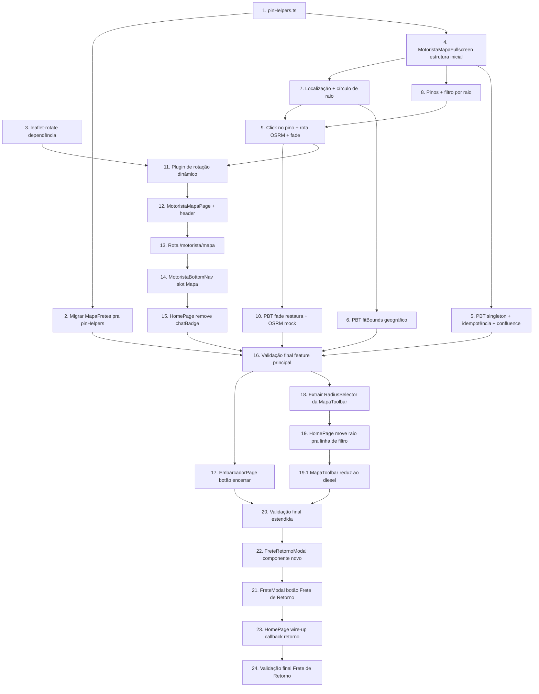

# Implementation Plan — motorista-mapa-fullscreen

## Overview

Cada tarefa é uma unidade incremental e testável que materializa
um pedaço do design.md desta feature. Sub-tarefas são mecânicas
e detalham os passos. Property tests usam `fast-check` seguindo
as convenções do projeto (ver `.kiro/steering/project-conventions.md`).
Referências `_Requirements: X.Y_` e `_Properties: P_` ligam tarefas
aos `requirements.md` e às correctness properties.

A entrega é dividida em 24 tarefas leaf, executáveis em 16 ondas
paralelas máximas (ver Task Dependency Graph). O caminho crítico
da feature principal é `helpers → fullscreen base → mapa+pinos →
click+rota → page → rota → bottom nav → home → validação`. As
tasks 17–20 (cleanup de UX adicional) executam **após** a
validação final da feature principal. As tasks 21–24 (Frete de
Retorno) executam **após** o cleanup, em sequência sobre o
`FreteModal`.

## Task Dependency Graph



```json
{
  "waves": [
    { "wave": 1, "tasks": ["1", "3"] },
    { "wave": 2, "tasks": ["2", "4"] },
    { "wave": 3, "tasks": ["5", "7", "8"] },
    { "wave": 4, "tasks": ["6", "9"] },
    { "wave": 5, "tasks": ["10", "11"] },
    { "wave": 6, "tasks": ["12"] },
    { "wave": 7, "tasks": ["13", "14", "15"] },
    { "wave": 8, "tasks": ["16"] },
    { "wave": 9, "tasks": ["17", "18"] },
    { "wave": 10, "tasks": ["19"] },
    { "wave": 11, "tasks": ["19.1"] },
    { "wave": 12, "tasks": ["20"] },
    { "wave": 13, "tasks": ["22"] },
    { "wave": 14, "tasks": ["21"] },
    { "wave": 15, "tasks": ["23"] },
    { "wave": 16, "tasks": ["24"] }
  ]
}
```

## Tasks

- [x] 1. Criar `src/components/mapa/pinHelpers.ts` com helpers de
  ícones reutilizáveis
  - Criar pasta `src/components/mapa/`.
  - Definir tipo `PinKind = 'frete-ativo' | 'frete-encerrado' |
    'destino' | 'motorista'` e tipo `PinOpacity = 1 | 0.3`.
  - Definir mapa `PIN_COLORS` interno: `frete-ativo: '#16a34a'`,
    `frete-encerrado: '#9ca3af'`, `destino: '#ea580c'`,
    `motorista: '#2563eb'`.
  - Exportar `makePinIcon(kind: PinKind, opacity?: PinOpacity):
    L.DivIcon` — gera o SVG de pino com cor por kind, suporta
    opacidade via atributo `opacity` no `<svg>` raiz.
  - Exportar `makeMotoristaIcon(): L.DivIcon` — bolinha verde
    redonda (22×22) com borda branca e halo translúcido. Sem
    SVG: usa `<div>` com `border-radius: 50%` e box-shadow para
    o halo.
  - Importar `L` de `leaflet` apenas dentro deste arquivo (sem
    re-export).
  - Garantir que iconAnchor de pinos é `[9, 22]` (ponta do pin
    coincide com a coordenada).
  - Sem testes unitários nesta task; o uso correto é validado
    nas tasks 2 e 8 indiretamente.
  - _Requirements: 5.6, 6.6_

- [x] 2. Migrar `MapaFretes.tsx` para usar `pinHelpers.ts` sem
  mudança visual
  - Remover funções inline `pinIcon` e `destIcon` de
    `src/components/MapaFretes.tsx`.
  - Importar `makePinIcon` e usar
    `makePinIcon(f.status === 'ativo' ? 'frete-ativo' :
    'frete-encerrado')` na renderização dos `<Marker>` de fretes.
  - Importar e usar `makePinIcon('destino')` no marker de
    destino quando há rota traçada (não há motorista nessa
    invocação).
  - Rodar `npm run build` e validar que não há erros TS.
  - Validar visualmente em `npm run dev` que pinos do feed
    abertos via "Ver mapa" aparecem idênticos ao estado atual
    (cor verde para ativos, cinza para encerrados, laranja
    para destino).
  - _Requirements: 12.1, 12.5_

- [x] 3. Adicionar dependência `leaflet-rotate@~0.2.7`
  - Adicionar no `package.json` em `dependencies`:
    `"leaflet-rotate": "~0.2.7"`.
  - Rodar `npm install` para sincronizar `package-lock.json`.
  - Validar que o pacote foi instalado em `node_modules/leaflet-rotate/`.
  - Não importar em nenhum arquivo ainda — o import é
    dinâmico e fica na task 11.
  - _Requirements: 9.1_

- [x] 4. Criar `src/components/mapa/MotoristaMapaFullscreen.tsx`
  com estrutura mínima (sem mapa funcional ainda)
  - Criar arquivo em `src/components/mapa/MotoristaMapaFullscreen.tsx`.
  - Importar `useState`, `useEffect`, `useMemo`, `useRef` do
    `react`.
  - Importar tipos `Frete`, `RadiusOption` dos services.
  - Definir e exportar tipos locais `RouteState =
    'idle' | 'loading' | 'osrm' | 'fallback'` e
    `RotateAvailability = 'pending' | 'available' | 'unavailable'`.
  - Definir interface `MotoristaMapaFullscreenProps` com
    `className?: string`.
  - Definir o componente com states iniciais conforme design:
    `radiusKm` (hidratado de `readStoredRadius`), `fretes` (vazio),
    `selectedRouteFrete: null`, `routeGeometry: null`,
    `routeState: 'idle'`, `rotateAvailability: 'pending'`,
    `noFretesBannerVisible: false`.
  - Criar refs `mapRef = useRef<L.Map | null>(null)` e
    `osrmAbortRef = useRef<{ cancelled: boolean } | null>(null)`.
  - Renderizar placeholder visual: `<div className="relative
    w-full h-full bg-gray-100">Mapa em construção</div>`.
  - Exportar default.
  - Não importar `leaflet` ainda — fica nas tasks 7+.
  - Compila sem erros TS.
  - _Requirements: 3.4_

- [x] 5. Property tests — seleção é singleton + idempotência +
  confluence + fade restaura
  - Criar `src/__tests__/motorista-mapa/cp-singleton.property.test.ts`.
  - Modelar estado mínimo: `{ selectedRouteFrete: Frete | null,
    pins: Frete[] }` e função pura
    `getPinState(pin: Frete, state): 'default' | 'selected' |
    'faded'`.
  - Property B (singleton): para qualquer estado, no máximo um
    pino tem state `'selected'`. Quando há selected, todos
    os outros pinos visíveis estão em `'faded'`.
  - Property D (idempotência):
    `select(f); select(f); === select(f)` em termos de estado
    final observável.
  - Property E (confluence):
    `select(fA); select(fB); === select(fB)` independente de
    `select(fA)` ter ocorrido antes.
  - Property H (fade restaura): após `clear()`, todos os pinos
    voltam para `'default'`.
  - Usar `fc.constantFrom([...])` com 3-5 fretes mock fixos pra
    estabilidade. Não gerar coordenadas aleatórias — não é
    relevante pra essa propriedade.
  - Garantir 100+ runs por property; sem `vi.mock` (testa só
    funções puras de estado).
  - _Properties: B, D, E, H_

- [x] 6. Property test — fitBounds matemático enquadra o raio
  - Criar `src/__tests__/motorista-mapa/cp-fitbounds.property.test.ts`.
  - Implementar helper local `circleBoundsGeo(point: { lat:
    number, lng: number }, radiusKm: number): { north: number,
    south: number, east: number, west: number }` usando aproximação
    geográfica (1 grau lat ≈ 111 km, 1 grau lng ≈ 111 km × cos(lat)).
  - Property F (fitBounds enquadra raio): para qualquer ponto
    com `lat ∈ [-60, 60]` (evitar polo onde longitude diverge)
    e qualquer `radiusKm ∈ [50, 100, 200, 500]`, todos os pontos
    sobre o círculo (amostrar 16 ângulos de 0 a 2π) caem dentro
    do bounds calculado, com tolerância de 5% (overshoot
    aceitável; undershoot não).
  - Não importar `leaflet` — apenas testa o cálculo geográfico.
  - Garantir 100+ runs.
  - _Properties: F_

- [x] 7. `MotoristaMapaFullscreen` — render do mapa Leaflet com
  localização + círculo de raio
  - Adicionar imports: `MapContainer`, `TileLayer`, `Marker`,
    `Circle`, `useMap` de `react-leaflet`; `L` de `leaflet`;
    `'leaflet/dist/leaflet.css'`.
  - Adicionar imports: `useEffectiveLocation` de
    `'../../hooks/useEffectiveLocation'`.
  - Renderizar `MapContainer` com `center` derivado de `point` ou
    `BR_CENTER = [-14.235, -51.9253]`, `zoom = point ? 8 : 4`,
    `style={{ height: '100%', width: '100%' }}`,
    `zoomControl={false}`, `attributionControl={false}`.
  - Renderizar `<TileLayer url="https://{s}.tile.openstreetmap.org/{z}/{x}/{y}.png" />`.
  - Quando `point !== null`: renderizar `<Circle center={[lat,
    lng]} radius={radiusKm * 1000}` com pathOptions:
    `color: '#16a34a'`, `weight: 2`, `fillColor: '#16a34a'`,
    `fillOpacity: 0.08` />`.
  - Quando `point !== null`: renderizar `<Marker position={[lat,
    lng]} icon={makeMotoristaIcon()} />`.
  - Criar componente interno `MapAutoFit` que usa `useMap()` e,
    em `useEffect([point, radiusKm, map])`, chama
    `map.fitBounds(circle.getBounds(), { padding: [40, 40] })`
    via `setTimeout(0)` defensivo (mesmo padrão do `MapaFretes`).
  - Capturar referência ao mapa via `whenReady={(e) =>
    { mapRef.current = e.target; }}` na `MapContainer`.
  - Hidratar `radiusKm` no estado inicial via
    `readStoredRadius(localStorage.getItem(RADIUS_STORAGE_KEY))`.
  - Sem GPS: mostrar overlay "Localizando..." quando
    `geoStatus IN { 'idle', 'loading' }`. Banner amarelo "Ative a
    localização" quando `geoStatus IN { 'denied', 'error',
    'insecure' }`. Reusar visual do `MapaFretes` (fonte 11px,
    bg-yellow-50 border-yellow-300).
  - Validar manualmente em `npm run dev` na rota temporária `/motorista/mapa-test`
    (criar rota provisória só para teste, remover na task 13).
  - _Requirements: 4.1, 4.2, 4.3, 4.4, 4.5, 4.6, 8.1, 8.2, 8.4, 8.6, 10.1_

- [x] 8. `MotoristaMapaFullscreen` — pinos de fretes filtrados
  por raio + seletor de raio
  - Importar `getActiveFretes` de `../../services/fretes`,
    `filterFretesByRadius`, `RADIUS_OPTIONS_KM`, `writeStoredRadius`
    de `../../utils/geoDistance`, `makePinIcon` de `./pinHelpers`.
  - Adicionar `useEffect` para carregar fretes via
    `getActiveFretes()` no mount + escutar realtime channel
    igual ao da `HomePage` (debounced refetch silencioso).
  - Computar `visibleFretes = useMemo(() => point ?
    filterFretesByRadius(fretes, point, radiusKm) : [], [...])`.
  - Renderizar `<Marker>` para cada item de `visibleFretes`,
    com `key={frete.id}`, `position=[origin.lat, origin.lng]`,
    `icon={makePinIcon(frete.status === 'ativo' ? 'frete-ativo'
    : 'frete-encerrado')}`. Sem popup nesta task.
  - Renderizar seletor de raio flutuante no canto superior
    direito do mapa: `<div className="absolute top-2 right-2
    z-[400]">` com chips para cada `r in RADIUS_OPTIONS_KM`,
    handler chama `setRadiusKm(r); writeStoredRadius(r);`.
  - Mobile (< 640px) usa chips horizontais, desktop pode
    usar dropdown compacto (não obrigatório nesta task; chips
    funcionam em ambos).
  - Banner de "Nenhum frete dentro do raio atual" no rodapé
    quando `point !== null && visibleFretes.length === 0`,
    auto-some após 6s via `setTimeout`.
  - Excluir do filtro fretes com coordenadas inválidas
    (`hasValidLocation` já em `geoDistance.ts` cuida disso).
  - _Requirements: 5.1, 5.2, 5.3, 5.4, 5.5, 5.6, 5.7, 5.8, 10.2_

- [x] 9. `MotoristaMapaFullscreen` — click no pino, rota OSRM,
  fade dos demais pinos, card flutuante
  - Importar `getRouteGeometry` de `../../services/geolocation`.
  - Adicionar handler `onPinClick(frete: Frete)`:
    1. Marcar `osrmAbortRef.current` antigo como
       `cancelled = true`.
    2. Criar novo objeto `{ cancelled: false }` e atribuir a
       `osrmAbortRef.current`.
    3. `setSelectedRouteFrete(frete);
       setRouteState('loading'); setRouteGeometry(null);`.
    4. Chamar `getRouteGeometry(frete.originLocation,
       frete.destinationLocation)` em await.
    5. Se a flag não foi cancelada: `geom !== null` →
       `setRouteGeometry(geom); setRouteState('osrm');` senão →
       `setRouteState('fallback');`.
  - Adicionar `eventHandlers={{ click: () => onPinClick(frete) }}`
    em cada `<Marker>` da task 8.
  - Renderizar `<Polyline>` quando `selectedRouteFrete !==
    null`: positions vem de `routeGeometry` se não-nulo, senão
    fallback `[[origin], [dest]]`. PathOptions:
    `color: '#2563eb'`, `weight: 4`, `opacity: 0.85`,
    `dashArray: '8 4'` quando `routeState IN { 'loading',
    'fallback' }`.
  - Renderizar `<Marker>` extra de destino quando há seleção,
    com `icon={makePinIcon('destino')}`.
  - Computar opacidade dos pinos via parâmetro do `makePinIcon`:
    quando `selectedRouteFrete !== null`, pinos não-selecionados
    recebem `0.3`; o selecionado recebe `1`.
  - Adicionar componente interno `FitRoute` que recebe
    `routeBounds` e chama `map.fitBounds(bounds, { padding:
    [40, 40] })` quando muda — mesmo padrão de `MapaFretes`.
  - Adicionar `eventHandlers={{ click: clearSelection }}` no
    `MapContainer` (via `useMapEvents` em componente filho).
    Implementar `clearSelection()` que zera estado e cancela
    OSRM em vôo.
  - Renderizar card flutuante no rodapé (`absolute bottom-2
    left-2 right-2`) com rota, valor BRL, distância
    motorista→origem, botão "Ver detalhes" (chama prop
    `onFreteClick` ou abre `FreteModal` integrado), botão
    "✕" que chama `clearSelection`.
  - Botão "Ver detalhes" abre `FreteModal` (importar do
    `../FreteModal`) controlado por estado local.
  - _Requirements: 6.1, 6.2, 6.3, 6.4, 6.5, 6.6, 6.7, 6.8, 6.9, 7.1, 7.2, 7.3, 7.4, 7.5, 7.6_

- [x] 10. Property test — metamorphic OSRM (mock fetch)
  - Criar `src/__tests__/motorista-mapa/cp-osrm.property.test.ts`.
  - Property G (OSRM mock metamorfic): usar `vi.mock` para
    mockar `getRouteGeometry`. Para qualquer `Frete` válido:
    - Quando o mock retorna `GeographicPoint[]` não-vazio,
      o estado final do componente é
      `routeState === 'osrm'` e `routeGeometry !== null`.
    - Quando o mock retorna `null`, o estado final é
      `routeState === 'fallback'` e `routeGeometry === null`.
  - Usar `fc.constantFrom` para fretes mock e `fc.constantFrom`
    para os dois cenários do mock (sucesso/falha) — não gerar
    geometria aleatória.
  - Lembrar das convenções do projeto: `vi.mock` é hoisted, NÃO
    referenciar variáveis externas no factory; usar
    `(globalThis as Record<string, unknown>).__getRouteGeometryMock`
    se precisar de spy compartilhado.
  - 100+ runs.
  - _Properties: G_

- [x] 11. `MotoristaMapaFullscreen` — plugin de rotação dinâmico
  com fallback
  - No topo do componente, antes de renderizar
    `MapContainer`, adicionar `useEffect` que faz
    `import('leaflet-rotate')`:
    ```ts
    useEffect(() => {
      let cancelled = false;
      import('leaflet-rotate')
        .then(() => {
          if (!cancelled) setRotateAvailability('available');
        })
        .catch((err) => {
          if (cancelled) return;
          console.warn(
            '[MotoristaMapaFullscreen] leaflet-rotate indisponível — rotação desabilitada',
            err
          );
          setRotateAvailability('unavailable');
        });
      return () => { cancelled = true; };
    }, []);
    ```
  - Renderizar `<MapaSkeleton />` (componente local com
    `<div className="bg-gray-100 animate-pulse w-full h-full" />`)
    quando `rotateAvailability === 'pending'`.
  - Após carregar (available ou unavailable), renderizar
    `MapContainer` com props condicionais:
    `{...(rotateAvailability === 'available' ? { rotate: true,
    touchRotate: true, bearing: 0 } : {})}`.
  - Validar manualmente em mobile (testar gesto de 2 dedos no
    DevTools com touch emulation OU em celular real). Logar
    no console o estado final do `rotateAvailability` para
    inspeção.
  - _Requirements: 9.1, 9.2, 9.3, 9.4, 9.5, 9.6, 9.7, 9.8_

- [x] 12. Criar `src/pages/MotoristaMapaPage.tsx` com guard de
  auth e header próprio
  - Criar arquivo `src/pages/MotoristaMapaPage.tsx`.
  - Importar `useAuth`, `useNavigate`, `Navigate` do react-router.
  - Importar `MotoristaMapaFullscreen` lazy:
    `const MotoristaMapaFullscreen = lazy(() => import('../components/mapa/MotoristaMapaFullscreen'));`
  - Renderizar guard:
    1. `isLoading` → skeleton.
    2. `!isAuthenticated` → `<Navigate to="/login" replace />`.
    3. `user.userType !== 'motorista'` → `<Navigate to="/" replace />`.
    4. OK → renderizar página.
  - Container: `<div className="flex flex-col h-screen w-screen
    overflow-hidden bg-gray-100">`.
  - Header próprio: 48px de altura, sticky top, com botão Voltar
    (chevron-left) à esquerda chamando `navigate(-1)` (e fallback
    pra `/` quando não há histórico via
    `window.history.length <= 1`) e título "Mapa de fretes".
  - Body: `<Suspense fallback={<MapaSkeleton />}><MotoristaMapaFullscreen
    className="flex-1" /></Suspense>`.
  - Sem `AppHeader`, sem `MotoristaBottomNav` na rota.
  - Usar `useDocumentTitle('Mapa de fretes')` se o hook existir
    no projeto.
  - _Requirements: 2.4, 2.5, 2.6, 3.1, 3.2, 3.3, 3.4_

- [x] 13. Adicionar rota `/motorista/mapa` em `App.tsx`
  - Abrir `src/App.tsx`.
  - Adicionar `const MotoristaMapaPage = lazy(() =>
    import('./pages/MotoristaMapaPage'));` junto com os demais
    lazy imports já existentes no arquivo.
  - Adicionar `<Route path="/motorista/mapa" element={
      <Suspense fallback={<RouteLoadingFallback />}>
        <MotoristaMapaPage />
      </Suspense>
    } />` antes do catch-all `<Route path="*" />`.
  - Reusar o mesmo `RouteLoadingFallback` (ou equivalente) já em
    uso pelas outras rotas lazy. Se não houver um, usar
    `<div className="min-h-screen flex items-center justify-center
    text-gray-500 text-sm">Carregando...</div>`.
  - Remover a rota provisória `/motorista/mapa-test` da task 7
    se ainda existir.
  - Validar `npm run build` sem erros TS.
  - _Requirements: 2.1, 2.2, 2.3, 2.7, 2.8, 11.1, 11.2_

- [x] 14. `MotoristaBottomNav` — substituir slot Chat por Mapa
  - Abrir `src/components/MotoristaBottomNav.tsx`.
  - Remover prop `chatBadge` da interface `Props`.
  - Remover do componente o estado e a lógica do badge numérico.
  - Substituir o slot 3 (Chat) por:
    - `aria-label="Mapa"`.
    - Ícone SVG de pino/mapa (location pin):
      `<svg ... ><path d="M12 2C8.13 2 5 5.13 5 9c0 5.25 7 13
      7 13s7-7.75 7-13c0-3.87-3.13-7-7-7zm0 9.5a2.5 2.5 0 010-5
      2.5 2.5 0 010 5z" /></svg>`.
    - Rótulo "Mapa".
    - Handler `onClick={() => navigate('/motorista/mapa')}`.
  - Aplicar estado visual ativo (cor verde igual ao slot Início)
    quando `useLocation().pathname === '/motorista/mapa'`.
  - Preservar slot Início (com `goHome`), Negociar, Menu e o
    botão flutuante de megafone exatamente como hoje (sem
    mudança de classes/handlers).
  - Validar manualmente em `npm run dev` que clicar no slot
    Mapa navega para `/motorista/mapa`.
  - _Requirements: 1.1, 1.2, 1.3, 1.4, 1.5, 1.6, 1.7, 1.8_

- [x] 15. `HomePage.tsx` — remover prop `chatBadge` da invocação
  do `MotoristaBottomNav`
  - Abrir `src/pages/HomePage.tsx`.
  - Localizar `<MotoristaBottomNav chatBadge={0} />`.
  - Trocar para `<MotoristaBottomNav />`.
  - Validar `npm run build` sem erros TS (TypeScript vai garantir
    via tipagem de `Props`).
  - _Requirements: 1.3, 12.1_

- [x] 16. Validação final
  - Rodar `npm run build` — deve compilar sem erros TS.
  - Rodar `npm test -- --run` (vitest single-shot) — todos os
    testes do projeto passam, incluindo as PBT novas.
  - Rodar `npx eslint --fix src/components/mapa/ src/pages/MotoristaMapaPage.tsx src/components/MotoristaBottomNav.tsx`
    para limpar warnings de estilo.
  - Inspecionar o output do `vite build`: chunk
    `MotoristaMapaPage` deve existir separado, não dentro do
    bundle principal. Tamanho esperado ≤ 60 KB gzipped (Leaflet
    ~45 KB + leaflet-rotate ~3 KB + componente ~10 KB).
  - Smoke test manual em `npm run dev`:
    1. Login como motorista.
    2. Bottom nav mostra "Início, Negociar, Mapa, Menu".
    3. Clica em "Mapa" → abre `/motorista/mapa` em fullscreen.
    4. Mapa centra no GPS (ou banner amarelo se sem GPS).
    5. Círculo do raio aparece em volta do motorista.
    6. Pinos verdes dos fretes aparecem dentro do raio.
    7. Muda raio para 200 km → mapa reenquadra, mais pinos
       aparecem.
    8. Clica num pino → linha tracejada aparece imediatamente,
       depois vira sólida (rota OSRM).
    9. Outros pinos ficam com 30% de opacidade.
    10. Clica em "✕" do card → seleção limpa, opacidade restaura.
    11. Volta pra `/` → bottom nav OK, raio persistido.
    12. Tela do feed: "Ver mapa" abre o modal `MapaFretes`
        antigo (não-regressão).
  - _Requirements: 12.6, 13.1, 13.2_

- [x] 17. `EmbarcadorPage` — botão de cancelar/encerrar inline na
  coluna Ações (mobile e tabela)
  - Abrir `src/pages/EmbarcadorPage.tsx` e localizar a coluna
    "Ações" do `<FreteTable>` (botões Editar + Excluir).
  - Adicionar entre Editar e Excluir um terceiro botão circular
    com ícone de "no entry" (proibido) — círculo com travinha no
    meio (SVG inline ou ícone `Ban`/`StopCircle` do projeto):
    `<svg viewBox="0 0 24 24"><circle cx="12" cy="12" r="9" />
    <line x1="6" y1="6" x2="18" y2="18" /></svg>` em
    `text-orange-600 hover:bg-orange-50 rounded`.
  - O botão SHALL ser visível apenas quando
    `frete.status === 'ativo'` (encerrado/cancelado já não
    podem ser encerrados de novo).
  - `aria-label="Encerrar frete"` e `title="Encerrar frete"`.
  - Ao clicar:
    1. Disparar `confirm('Tem certeza que deseja encerrar este
       frete? Ele sairá da listagem dos motoristas.')`.
    2. Se confirmado, chamar `updateFrete(frete.id,
       { status: 'encerrado' })` e atualizar o estado local
       da lista (otimista).
    3. Em erro, exibir toast/alert com a mensagem.
  - **Mobile (cards)**: a `EmbarcadorPage` já renderiza um
    pequeno overlay no `FreteCard` com botão de excluir no canto
    direito quando `isMobile`. Adicionar nesse mesmo bloco um
    segundo botão à esquerda do excluir, com o mesmo ícone e
    handler de encerrar (mesmo flow `confirm()` + `updateFrete`).
  - Validar manualmente em `npm run dev`:
    1. Lista do embarcador → cada frete ativo mostra três
       botões na coluna Ações: Editar, Encerrar, Excluir.
    2. Clicar em Encerrar pede confirmação; OK move o frete
       pra aba "Encerrados/Cancelados".
    3. Frete encerrado não mostra mais o botão de encerrar.
  - _Requirements: nenhum (feature complementar não coberta
    pelo requirements.md original — adição direta)_

- [x] 18. `MapaToolbar` — extrair seletor de raio para uso
  externo
  - Abrir `src/components/MapaToolbar.tsx`.
  - Extrair o bloco do seletor de raio (botão + dropdown) em
    componente exportado nomeado `RadiusSelector` no mesmo
    arquivo OU em arquivo novo
    `src/components/RadiusSelector.tsx`.
  - O `RadiusSelector` recebe `radiusKm: RadiusOption` e
    `onRadiusChange: (r: RadiusOption) => void` como props,
    sem dependências do mapa.
  - O `MapaToolbar` continua existindo, mas agora consumindo
    o `RadiusSelector` internamente. Sem mudança visual neste
    arquivo.
  - Validar `npm run build` sem erros TS.
  - _Requirements: aditivo a 10.1, 10.2 (raio compartilhado)_

- [x] 19. `HomePage` — mover seletor de raio para a linha
  "Fretes Disponíveis · (N) · Filtro" e reduzir altura do
  topbar do diesel
  - Abrir `src/pages/HomePage.tsx` no ramo motorista.
  - Adicionar `<RadiusSelector />` ao lado direito da linha de
    cabeçalho da listagem, junto com o `FreteFiltersComponent`
    compact:
    ```tsx
    <div className="ml-auto flex items-center gap-2">
      <RadiusSelector
        radiusKm={radiusKm}
        onRadiusChange={handleRadiusChange}
      />
      <FreteFiltersComponent
        onFilterChange={handleFilterChange}
        totalResults={visibleFretes.length}
        compact
      />
    </div>
    ```
  - Remover o seletor de raio da `MapaToolbar` (passa a só
    mostrar o slot do diesel + botão "Ver mapa"). Como o botão
    "Ver mapa" também sumirá com a feature principal (motorista
    usa bottom nav agora), a `MapaToolbar` ficará reduzida ao
    diesel — ver subtarefa 19.1.
  - _Requirements: aditivo a 10.1, 10.2_

- [x] 19.1 `MapaToolbar` — reduzir a barra apenas ao slot do
  diesel (sticky centralizado)
  - Remover o seletor de raio do JSX da `MapaToolbar` (movido
    pra HomePage na task 19).
  - Remover o botão "Ver mapa" da `MapaToolbar` (substituído
    pelo slot Mapa do bottom nav na task 14). O modal e seus
    states locais (`mapOpen`, `MapaFretes` lazy import) ficam
    obsoletos — remover também.
  - O componente passa a renderizar apenas o `middleSlot`
    (diesel) centralizado horizontalmente:
    `<div className="sticky top-14 sm:top-16 z-30 bg-gray-100
    -mx-3 sm:-mx-4 px-3 sm:px-4 py-1.5 mb-2 flex items-center
    justify-center w-auto">{middleSlot}</div>`.
  - Remover o `border-b border-gray-200/60` do container
    sticky — fica sem a "listrazinha fininha".
  - Reduzir o padding vertical de `py-2` para `py-1.5` para
    compactar a altura.
  - Reduzir `mb-3` para `mb-2`.
  - Manter o sticky `top-14 sm:top-16` para o diesel
    permanecer fixo no topo durante o scroll, conforme pedido
    do usuário.
  - Atualizar o JSDoc do componente refletindo o novo escopo
    (apenas slot de diesel; raio e mapa migraram).
  - Validar visualmente em `npm run dev`:
    1. Topbar do motorista mostra só o input de diesel
       centralizado, sem linha divisória embaixo.
    2. Ao rolar a lista de fretes, o diesel fica grudado no
       topo (abaixo do AppHeader).
    3. A linha "Fretes Disponíveis (N) · [Raio] · [Filtro]"
       fica logo abaixo, com Raio e Filtro alinhados à direita.
  - _Requirements: aditivo (UX cleanup pedido pelo usuário)_

- [x] 20. Validação final estendida (após tasks 17-19.1)
  - Rodar `npm run build` — build limpo sem erros TS.
  - Rodar `npm test -- --run` — todos os testes passam.
  - Smoke test manual adicional:
    1. **Embarcador (task 17)**: lista de fretes mostra três
       ações por linha (Editar · Encerrar · Excluir). Encerrar
       pede confirmação e move pra aba Encerrados.
    2. **Motorista — topbar (task 19.1)**: ao abrir o feed,
       só aparece o input de diesel sticky no topo (sem
       linha cinza embaixo, sem botão "Ver mapa", sem seletor
       de raio).
    3. **Motorista — linha de filtros (task 19)**: a linha de
       cabeçalho "Fretes Disponíveis (N)" tem o seletor de
       raio + botão de filtro alinhados à direita.
    4. **Motorista — bottom nav**: slot Mapa funciona, abre
       `/motorista/mapa` (cobertura task 14).
    5. **Não-regressão embarcador**: feed do embarcador mostra
       lista igual e botões Editar/Excluir continuam
       funcionando.
  - _Requirements: 12.6, 13.1, 13.2 (estendido)_

- [x] 21. `FreteModal` — substituir "Fechar" por "Frete de
  Retorno" e abrir modal de busca por destino
  - Abrir `src/components/FreteModal.tsx` e localizar o bloco
    "Action Buttons" (linha com botões Fechar / WhatsApp /
    Chat / etc.).
  - Remover o botão `Fechar` (cinza, primeiro da fila). O fluxo
    de fechar continua via botão `✕` no canto superior direito
    do modal e via clique no backdrop, ambos já existentes —
    nenhuma funcionalidade é perdida.
  - Adicionar novo botão "Frete de Retorno" como **primeiro
    item** da fila (à esquerda do botão `Chat` quando
    visível):
    - `aria-label="Buscar fretes de retorno"`.
    - Visível apenas quando
      `isAuthenticated && user?.userType === 'motorista' &&
      profileComplete === true` (mesma condição do botão Chat).
    - Estilo em `bg-purple-600 hover:bg-purple-700 text-white
      text-xs font-medium px-3 py-1.5 rounded flex items-center
      gap-1` (cor distinta do Chat azul e do WhatsApp verde
      pra dar destaque).
    - Ícone SVG inline de "rota de volta" (seta circular ou
      duas setas opostas). Sugestão: ícone `arrow-uturn-left`
      do Heroicons.
    - Rótulo: "Frete de Retorno" (mobile) /
      "Procurar retorno" (desktop): condicionalmente
      `<span className="hidden sm:inline">Procurar retorno</span><span className="sm:hidden">Retorno</span>`.
    - `onClick` chama `setReturnSearchOpen(true)` (estado
      local novo).
  - Adicionar estado local `const [returnSearchOpen, setReturnSearchOpen] = useState(false);`.
  - Renderizar `<FreteRetornoModal>` (componente novo, ver
    task 22) condicionalmente quando `returnSearchOpen === true`,
    passando como props o frete original (`frete`) — o componente
    extrai dele o `destinationLocation` e o `destination`
    (label da cidade).
  - Quando o motorista escolhe um frete dentro do
    `FreteRetornoModal`, fechar ambos: `setReturnSearchOpen(false)`
    + `onClose()` do `FreteModal`, e abrir o `FreteModal` do
    novo frete via callback (delegar ao componente pai —
    `HomePage` — usar o `localStorage['fretego-open-frete']`
    pattern já existente para abrir o modal do novo frete após
    a navegação).
  - Validar `npm run build` sem erros TS.
  - _Requirements: nenhum (feature complementar não coberta
    pelo requirements.md original)_

- [x] 22. Criar `src/components/FreteRetornoModal.tsx` com busca
  por raio a partir do destino
  - Criar arquivo `src/components/FreteRetornoModal.tsx`.
  - Interface de props:
    ```ts
    interface FreteRetornoModalProps {
      open: boolean;
      onClose: () => void;
      origemFrete: Frete;  // o frete cujo destino vira a nova origem
      onSelectRetorno: (frete: Frete) => void;
    }
    ```
  - Estado local:
    - `radiusKm: 50 | 100` (default 50).
    - `fretes: Frete[]` (resultado).
    - `loading: boolean`.
    - `error: string | null`.
  - Carregamento ao abrir:
    1. Validar se `origemFrete.destinationLocation` tem
       coordenadas válidas (NaN ou 0/0 → exibir mensagem
       "Destino sem coordenadas — não é possível buscar
       retornos").
    2. Chamar `getActiveFretes()` para carregar todos os
       fretes ativos (ou usar `findNearbyFretes` se já existir
       e suportar passar lat/lng arbitrário em vez do GPS).
       Verificar `services/fretes.ts` — `findNearbyFretes` já
       aceita `latitude, longitude, radiusKm`, então é só
       chamar com as coords do destino.
    3. Filtrar a lista pra excluir o próprio `origemFrete.id`
       (sem sentido sugerir o frete atual como retorno).
  - Recarregar quando `radiusKm` muda.
  - Layout:
    - Modal fullscreen no mobile, centralizado em
      `max-w-2xl` no desktop, com mesma animação de slide do
      `FreteModal` (translate-y-full → translate-y-0 no mobile,
      fade no desktop).
    - Header com z-10 mostrando o título exatamente como o
      usuário pediu:
      `Fretes disponíveis no destino {origemFrete.destination} - Raio de {radiusKm} km`.
    - Subtítulo discreto: "Encontre cargas próximas para evitar
      voltar vazio".
    - Botão `✕` no canto superior direito.
    - Toggle de raio com 2 chips: `[50 km] [100 km]`,
      destacando o ativo em verde (mesma cor do raio do feed).
    - Lista de fretes encontrados, cada item renderizado
      como um card compacto com:
      - Origem → Destino (com km do retorno).
      - Distância do destino do frete original até a origem
        do retorno (via `haversineDistanceKm`).
      - Valor BRL.
      - Botão "Ver detalhes" que chama
        `onSelectRetorno(frete)` e fecha esse modal.
    - Estado de loading: 3 skeletons de card cinza.
    - Estado vazio: card amarelo com texto
      `"Nenhum frete de retorno encontrado em {radiusKm} km
      de {cidade}. Tente aumentar o raio para 100 km."`.
    - Estado de erro: card vermelho com botão "Tentar
      novamente".
  - Acessibilidade:
    - `role="dialog"`, `aria-modal="true"`,
      `aria-label="Fretes de retorno"`.
    - ESC fecha o modal.
    - Focus trap básico (o `✕` recebe foco ao abrir).
  - Performance:
    - Memoizar a lista filtrada com `useMemo` em
      `[fretes, origemFrete.id]`.
    - Cancelar request anterior ao trocar o raio (flag
      `cancelled` em ref, mesmo padrão do OSRM no
      `MotoristaMapaFullscreen`).
  - Validar `npm run build` e `getDiagnostics` sem erros TS.
  - _Requirements: nenhum (feature complementar)_

- [x] 23. `HomePage` — wire-up do `FreteRetornoModal` para abrir
  o `FreteModal` do frete escolhido
  - Abrir `src/pages/HomePage.tsx`.
  - Adicionar callback ao `FreteModal`: quando o motorista
    escolhe um frete de retorno, o callback recebe o `Frete`
    selecionado e:
    1. Fecha o `FreteModal` atual (`setIsModalOpen(false)`).
    2. Aguarda 1 frame via `requestAnimationFrame` para a
       animação de fechar terminar.
    3. Define `setSelectedFrete(novoFrete);
       setIsModalOpen(true);` para abrir o detalhe do frete
       de retorno.
    4. Incrementa views via `incrementFreteViews(novoFrete.id)`
       (mesmo padrão do `handleFreteClick` existente).
  - Passar esse callback ao `FreteModal` via prop nova
    `onSelectFreteRetorno?: (frete: Frete) => void`.
  - O `FreteModal` repassa essa prop ao `FreteRetornoModal`
    como `onSelectRetorno`.
  - Embarcador (não-motorista) não recebe a prop nem o botão
    de Frete de Retorno — comportamento já filtrado pela
    condição na task 21.
  - Validar manualmente em `npm run dev`:
    1. Motorista clica num frete → abre detalhe.
    2. Clica em "Frete de Retorno" → abre o modal de
       busca por destino, raio 50 km.
    3. Troca pra 100 km → recarrega lista.
    4. Clica em "Ver detalhes" de um item da lista de
       retornos → fecha ambos os modais e abre o detalhe
       do novo frete escolhido (sem flicker visível).
    5. Pode encadear: dentro desse novo frete, clicar em
       "Frete de Retorno" de novo (busca a partir do destino
       desse frete). Sem stack overflow ou state preso.
  - _Requirements: nenhum (feature complementar)_

- [x] 24. Validação final — Frete de Retorno
  - Rodar `npm run build` sem erros TS.
  - Rodar `npm test -- --run` — todos os testes passam.
  - Smoke test manual completo:
    1. **Botão visível**: motorista logado vê "Frete de
       Retorno" ao abrir detalhe de qualquer frete ativo.
    2. **Botão escondido pra embarcador**: embarcador não vê.
    3. **Busca correta**: o modal de retorno busca a partir
       do destino do frete original, não da localização do
       motorista.
    4. **Raio**: toggle 50/100 km recarrega a lista.
    5. **Exclusão do próprio frete**: o frete original não
       aparece na lista de retornos.
    6. **Estado vazio**: quando não há fretes no raio,
       mostra a mensagem amigável com sugestão de aumentar.
    7. **Encadeamento**: motorista pode clicar em "Frete de
       Retorno" várias vezes consecutivas em fretes diferentes,
       sem bug de modal preso.
    8. **Não-regressão `FreteModal`**: o botão `✕` no canto
       superior direito continua fechando o modal. Click no
       backdrop também fecha. ESC fecha.
  - _Requirements: nenhum (feature complementar — validação
    direta)_

## Notes

### Decisões pinadas que vieram do design.md

- **Versão do plugin de rotação:** `leaflet-rotate@~0.2.7` (allow
  patch dentro de 0.2.x; bloqueia minor/major). Adicionado na
  task 3 e consumido via `import('leaflet-rotate')` dinâmico
  na task 11.
- **Helpers de pin compartilhados:** vivem em
  `src/components/mapa/pinHelpers.ts` e são consumidos pelo
  `MotoristaMapaFullscreen` (novo) e pelo `MapaFretes` (existente,
  migrado na task 2). Sem mudança visual no `MapaFretes`.
- **Persistência de raio:** mesmo `localStorage[RADIUS_STORAGE_KEY]`
  do feed. Sem `BroadcastChannel`, sem novos eventos.
- **Cancelamento OSRM:** via flag `cancelled` em `useRef`. Cada
  novo `selectedRouteFrete` marca o anterior cancelado.
- **Lazy chain:** `App → React.lazy(MotoristaMapaPage) →
  MotoristaMapaFullscreen → import('leaflet-rotate')`. Nenhum
  import estático arrasta Leaflet ou o plugin pro entry chunk.

### Convenções do projeto a respeitar

- **`vi.mock` é hoisted:** NÃO referenciar variáveis externas no
  factory. Usar `(globalThis as Record<string, unknown>).__nomeSpy`
  para spies compartilhados em testes (task 10).
- **`fc.stringOf` não existe:** se precisar gerar string, usar
  `fc.string({ minLength, maxLength }).filter(...)`.
- **Geradores de coordenadas:** usar `fc.constantFrom` com
  templates fixos quando não há motivo pra aleatoriedade — vale
  pras tasks 5, 6, 10.
- **`while (true)` proibido:** usar `for (;;)`.
- **Variáveis não usadas:** prefixar com `_` ou remover.
- **CRLF warnings no Windows:** esperado, ignorar.

### Itens fora do escopo

- Não vai testar `leaflet-rotate` no jsdom (cobertura via
  smoke manual na task 11 + 16).
- Não vai testar tile loading do OSM.
- Não vai testar OSRM real (mock obrigatório na task 10).
- Não vai mover `MapaFretes.tsx` para `src/components/mapa/`
  nesta feature (manter na raiz pra evitar churn).
- Não vai migrar `InteractiveMap.tsx` pra usar `pinHelpers`
  nesta feature (não vale o trabalho — usa ícones default
  do Leaflet).

### O que validar manualmente ao final

A task 16 detalha o smoke test completo (12 passos). O ponto
mais crítico de não-regressão é o passo 12: "Ver mapa" no feed
deve continuar abrindo o modal `MapaFretes` antigo, sem
mudanças visuais.
