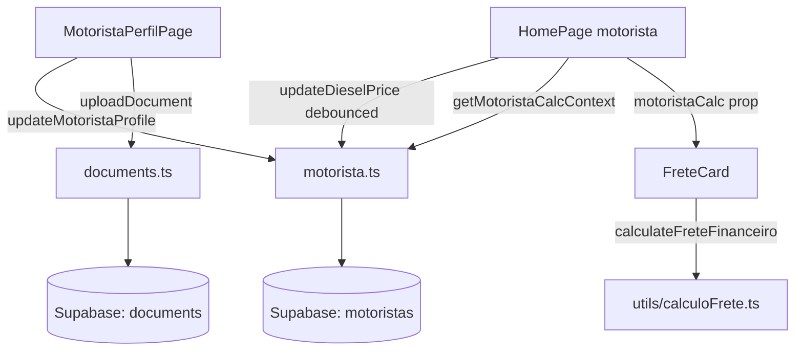

# Design Document — Motorista Onboarding & Painel

## 1. Visão Geral

Esta feature reorganiza o perfil do motorista e adiciona cálculos
financeiros ao vivo no painel do motorista, sem tocar no fluxo do
embarcador. A entrega é dividida em **três frentes coordenadas**:

### Frente Schema (Migration 017)

Migration **idempotente** que apenas adiciona colunas e expande a
lista do CHECK constraint de `documents.document_type`. Nenhum
`DROP`, `RENAME` ou alteração de tipo. As novas colunas em
`motoristas` são todas anuláveis com defaults seguros, garantindo
compatibilidade total com motoristas legados:

- `vehicle_year_manufacture INTEGER`
- `vehicle_year_model INTEGER`
- `km_per_liter NUMERIC(4,1)`
- `trailer_axles INTEGER`
- `cargo_capacity_ton NUMERIC(5,1)`
- `diesel_price NUMERIC(5,2)`
- `is_owner BOOLEAN DEFAULT TRUE`

A coluna existente `motoristas.vehicle_year` permanece intacta; a
migration apenas faz **backfill** copiando seu valor para
`vehicle_year_manufacture` quando este último é nulo. O CHECK de
`documents.document_type` é recriado preservando os 19 tipos atuais e
adicionando `'documento_proprietario'`.

### Frente Backend / Services

A frente de serviços **só estende** os módulos do motorista. Nenhuma
assinatura pública existente é alterada — apenas novos campos
opcionais e novas funções:

- `src/services/motorista.ts`:
  - Tipo `MotoristaProfile` ganha campos opcionais novos (`vehicleYearManufacture`, `vehicleYearModel`, `kmPerLiter`, `trailerAxles`, `cargoCapacityTon`, `dieselPrice`, `isOwner`).
  - Tipo `UpdateMotoristaProfileData` ganha os mesmos campos opcionais.
  - Função existente `getMotoristaProfile` é estendida para devolver os campos novos.
  - Função existente `updateMotoristaProfile` aceita os novos campos.
  - **Novas funções** `updateDieselPrice(userId, price)` e `getMotoristaCalcContext(userId)` para o uso debounced no dashboard.
- `src/services/documents.ts`:
  - Adiciona `'documento_proprietario'` à constante `VALID_DOCUMENT_TYPES`.
  - **Nenhuma** função pública é alterada (assinaturas e nomes preservados).
- `src/utils/calculoFrete.ts` (NOVO): função pura
  `calculateFreteFinanceiro(input)` reutilizável tanto no `FreteCard`
  quanto em testes.

### Frente UI

- `MotoristaPerfilPage.tsx`: refatoração para 3 seções
  (Dados Pessoais, Veículo, Proprietário) com toggle "O caminhão NÃO é meu" controlando a Seção 3.
- `DieselDashboardInput.tsx` (NOVO): input centralizado no header da
  HomePage do motorista, com debounce de 600 ms.
- `FreteCard.tsx`: ganha **prop opcional** `motoristaCalc` — sem ela, o
  comportamento permanece bit a bit idêntico ao atual.
- `HomePage.tsx`: no ramo `userType === 'motorista'`, renderiza o
  `DieselDashboardInput` no header e propaga `motoristaCalc` para
  cada `FreteCard`.

### Diagrama de fluxo



---

## 2. Glossário Técnico

| Termo do requirements             | Artefato de código                                               |
| --------------------------------- | ---------------------------------------------------------------- |
| MotoristaPerfilPage               | `src/pages/MotoristaPerfilPage.tsx` (refatorado)                 |
| HomePageMotorista                 | ramo `userType === 'motorista'` em `src/pages/HomePage.tsx`      |
| MotoristaService                  | `src/services/motorista.ts` (estendido)                          |
| DocumentsService                  | `src/services/documents.ts` (1 constante estendida)              |
| VerificationService               | `src/services/verification.ts` (REUSADO sem alteração)           |
| ModalVerificacaoEmail             | `src/components/ModalVerificacaoEmail.tsx` (REUSADO sem alteração) |
| CapitalizeName                    | `src/utils/textCase.ts` (REUSADO)                                |
| FreteCard                         | `src/components/FreteCard.tsx` (props opcionais novas)           |
| DieselDashboardInput              | NOVO `src/components/DieselDashboardInput.tsx`                   |
| ParaDepoisFile                    | NOVO `.kiro/PARA_DEPOIS.md`                                      |
| Migration 017                     | NOVO `supabase/migrations/017_motorista_painel_fields.sql`       |
| Cálculo financeiro puro           | NOVO `src/utils/calculoFrete.ts`                                 |
| Validação de placa                | NOVO em `src/utils/calculoFrete.ts` ou `src/utils/plateValidation.ts` |

---

## 3. Arquitetura por Requirement

### Req 1 — Capitalização do nome

- **Arquivos:** `MotoristaPerfilPage.tsx`, `motorista.ts`.
- **Mecanismo:** o handler `onBlur` do input "Nome" aplica
  `capitalizeName` ao state local; ao salvar, `updateMotoristaProfile`
  reaplica `capitalizeName(name)` antes do `update` no Supabase
  (defesa em profundidade contra colagens de valores em caixa-alta).
- **Trecho representativo:**
  ```ts
  // motorista.ts
  if (data.name !== undefined) {
    userUpdate.name = capitalizeName(data.name);
  }
  ```
- **Não-regressão:** `capitalizeName` já é exportada e usada pelo
  embarcador. Nenhuma alteração na função.

### Req 2 — Verificação de e-mail por OTP

- **Arquivos:** `MotoristaPerfilPage.tsx`. **Não toca** em
  `verification.ts` nem em `ModalVerificacaoEmail.tsx`.
- **Mecanismo:** botão "Verificar e-mail" só é exibido se o e-mail
  digitado é diferente do e-mail verificado já carregado de
  `getVerificationStatus()`. Em sucesso, abre o modal existente; em
  `RATE_LIMITED`, bloqueia o botão por 60 s via `setTimeout`.
- **Estado local:** `emailVerifiedAtServer` (carregado no mount) +
  `emailDirty` (true se input ≠ valor do servidor) decidem o
  selo "verificado".
- **Trecho representativo:**
  ```tsx
  <button
    type="button"
    disabled={!emailDirty || rateLimitedUntil > Date.now()}
    onClick={async () => {
      try {
        await sendEmailVerificationCode(email);
        setShowVerifModal(true);
      } catch (e) {
        if (e instanceof VerificationError && e.code === 'RATE_LIMITED') {
          setRateLimitedUntil(Date.now() + 60_000);
        }
        setError(e.message);
      }
    }}
  >
    Verificar e-mail
  </button>
  ```

### Req 3 — Placa Mercosul

- **Arquivos:** `MotoristaPerfilPage.tsx` + helper em
  `src/utils/plateValidation.ts` (NOVO).
- **Função `formatPlate(value)`** — remove não-alfanuméricos,
  transforma em maiúsculas e limita a 7 chars:
  ```ts
  export function formatPlate(value: string): string {
    return (value ?? '')
      .toUpperCase()
      .replace(/[^A-Z0-9]/g, '')
      .slice(0, 7);
  }
  ```
- **Função `isValidMercosulPlate(value): boolean`**:
  ```ts
  const PLATE_REGEX = /^[A-Z]{3}[0-9][A-Z0-9][0-9]{2}$/;
  export function isValidMercosulPlate(value: string): boolean {
    return PLATE_REGEX.test(formatPlate(value));
  }
  ```
- **Exemplos**:
  - `ABC1D23` → válido (Mercosul novo)
  - `ABC1234` → válido (formato antigo, ainda casa o regex)
  - `ABCD123` → inválido (4ª posição é letra, não dígito)
  - `AB12D34` → inválido (apenas 2 letras iniciais)
  - `abc1d23` → após `formatPlate` vira `ABC1D23` → válido
- **Integração:** `onChange` do input chama
  `setPlate(formatPlate(e.target.value))`. Antes de salvar, o submit
  bloqueia se `!isValidMercosulPlate(plate)`.

### Req 4 — Reorganização em 3 seções

- **Arquivos:** `MotoristaPerfilPage.tsx`.
- **Abordagem:** **cards-stack vertical** (mais simples, sem
  bibliotecas de tabs). Cada seção é um cartão `<section>`. Estado
  vivo em React (não há rota nem URL hash por seção). Toggle
  "O caminhão NÃO é meu (é de outro proprietário)" controla
  visibilidade da Seção 3 via state booleano `isNotOwner`.
- **Layout:**
  ```
  ┌─ Dados Pessoais ───────────────────────┐
  │ nome, e-mail (com botão verificar),    │
  │ cpf, [pis no fim], docs pessoais       │
  └────────────────────────────────────────┘
  ┌─ Veículo ──────────────────────────────┐
  │ tipo, placa, modelo (select+outro),    │
  │ ano fab, ano modelo, km/l, eixos, cap, │
  │ diesel, docs do veículo                │
  └────────────────────────────────────────┘
  [ ] O caminhão NÃO é meu (proprietário)
  ┌─ Proprietário (se toggle ON) ──────────┐
  │ docs do proprietário                   │
  └────────────────────────────────────────┘
  ```
- **Contador "X/Y" por seção:** computado a partir de
  `documents` e da lista de tipos da seção:
  ```ts
  const personalTypes = ['cnh', 'foto_segurando_cnh', 'comprovante_endereco_motorista'];
  const personalCount = personalTypes.filter(t => documents[t]).length;
  ```
- **Persistência do toggle:** `is_owner = !isNotOwner` é gravado em
  `motoristas.is_owner` no submit.

### Req 5 — Modelo por lista pré-definida

- **Arquivos:** `MotoristaPerfilPage.tsx`.
- **Constante `MODELOS_CAMINHAO`** definida no topo do arquivo (ordem
  fixa). O `<select>` mostra todos + opção "Outro". Quando seleção é
  "Outro", revela `<input maxLength={60}>` para "Especifique o
  modelo".
- **Persistência:** ambos os caminhos gravam **uma única coluna**
  `motoristas.vehicle_model` com o texto exato. Não há flag adicional
  no banco; "Outro" é apenas um detalhe de UX.

### Req 6 — Anos separados

- **Arquivos:** `MotoristaPerfilPage.tsx`, `motorista.ts`, Migration 017.
- **Validação cliente:** `vehicle_year_manufacture` e
  `vehicle_year_model` são `<input type="number" min={1980}
  max={ano+2}>`. Validação extra em JS: ano modelo ≥ ano fab.
- **Migration:** ambos são `INTEGER NULL`. Backfill copia
  `vehicle_year` para `vehicle_year_manufacture` se nulo (preservando
  a coluna antiga viva, sem `DROP`).

### Req 7 — Câmera vs arquivo

- **Arquivos:** `MotoristaPerfilPage.tsx`.
- **Mecanismo:** **dois `<label>` + `<input type="file" hidden>` por
  slot**. Um com `capture="environment"` (câmera traseira), outro
  sem. O botão "Abrir câmera" dispara o input com `capture`; "Escolher
  arquivo" dispara o input sem `capture`.
- **Trecho representativo:**
  ```tsx
  <input
    ref={cameraRef}
    type="file"
    accept="image/*"
    capture="environment"
    hidden
    onChange={onPick}
  />
  <input
    ref={fileRef}
    type="file"
    accept={isPhotoOnly ? 'image/*' : 'image/*,application/pdf'}
    hidden
    onChange={onPick}
  />
  <button onClick={() => cameraRef.current?.click()}>📷 Abrir câmera</button>
  <button onClick={() => fileRef.current?.click()}>📎 Escolher arquivo</button>
  ```
- **Comportamento desktop:** `capture="environment"` é tratado como
  hint pelo navegador; em desktop **degrada graciosamente** para o
  seletor padrão de arquivos, sem erro nem alert. Documentar isso em
  comentário `// fallback: navegadores desktop ignoram `capture` e abrem o seletor de arquivos.`
- **Validações:** size > 5 MB → erro local antes do `uploadDocument`.
  Mime fora do `accept` do slot → erro local.

### Req 8 — Compactação visual

- **Arquivos:** `MotoristaPerfilPage.tsx`.
- **Mudanças classes Tailwind:**
  - `p-5` → `p-4` nos cartões.
  - `space-y-6` → `space-y-4` no `<form>`.
  - `space-y-4` interno → `space-y-3`.
  - Inputs e labels passam a `text-sm` consistente.
  - Grid `grid-cols-1 md:grid-cols-2 gap-3` (ao invés de `gap-4`).
  - Barra de progresso vira `h-2` (já está, manter).

### Req 9 — Campo PIS com aviso amarelo

- **Arquivos:** `MotoristaPerfilPage.tsx` (substitui o `<PisSection>`
  atual incorporando-o ao form).
- **Lógica de validação:**
  - Vazio → exibe aviso amarelo, **não** bloqueia salvar.
  - Comprimento ≠ 11 → erro vermelho, **bloqueia** salvar.
  - 11 dígitos exatos → aceita.
- **Persistência:** continua sendo upsert em `motorista_pis` (tabela
  já existente), agora dentro do mesmo submit do perfil.

### Req 10 — Campos operacionais (km/l, eixos, capacidade)

- **Arquivos:** `MotoristaPerfilPage.tsx`, `motorista.ts`,
  Migration 017.
- **Validação cliente:** ranges definidos como constantes (`KM_RANGE
  = [1, 10]`, etc). Mensagem genérica "Valor fora do intervalo
  permitido" abaixo do campo.
- **Banner amarelo "complete consumo, eixos, capacidade":** exibido
  quando algum dos três está vazio, **sem** bloquear salvar.

### Req 11 — Diesel debounced (perfil + dashboard)

- **Arquivos:** `DieselDashboardInput.tsx` (NOVO), `motorista.ts`,
  `HomePage.tsx`, `MotoristaPerfilPage.tsx`.
- **Hook utilitário `useDebouncedCallback`** — criado dentro do
  próprio arquivo do componente (sem dependência externa). Uso de
  `setTimeout` simples + `clearTimeout` no `useEffect` cleanup:
  ```ts
  function useDebouncedCallback<T extends (...args: any[]) => any>(fn: T, delay: number) {
    const ref = useRef<number | null>(null);
    useEffect(() => () => {
      if (ref.current) window.clearTimeout(ref.current);
    }, []);
    return (...args: Parameters<T>) => {
      if (ref.current) window.clearTimeout(ref.current);
      ref.current = window.setTimeout(() => fn(...args), delay);
    };
  }
  ```
- **Propagação entre perfil e dashboard:** decisão de design — usar
  **leitura direta do banco** ao montar cada uma das duas páginas
  (sem Context global). Cada página é stand-alone e o `motoristas`
  é a fonte da verdade. Isso evita um Context que cruza páginas e
  mantém o blast radius pequeno. **Trade-off aceito:** se o usuário
  edita o diesel no perfil em uma aba e tem o dashboard aberto em
  outra, a outra aba não atualiza até refresh — comportamento
  aceitável para v1.
- **Recálculo no dashboard:** ao salvar com sucesso, o
  `DieselDashboardInput` chama um callback `onSaved(newPrice)` que
  atualiza um estado em `HomePage`, que por sua vez é passado como
  prop `motoristaCalc.dieselPrice` para todos os `FreteCard`. Sem
  reload da lista do servidor.
- **Erro de persistência:** `try/catch` no callback debounced; em
  erro, restaura o valor anterior e dispara um toast simples
  (state-driven, sem biblioteca extra).
- **AbortController:** a chamada Supabase **não** suporta
  `AbortController` nativamente em todos os métodos. Mitigação: usar
  um **token monotônico** (`requestId++`) e descartar respostas
  antigas:
  ```ts
  const myReq = ++lastReqRef.current;
  await updateDieselPrice(userId, price);
  if (myReq !== lastReqRef.current) return; // resposta velha
  onSaved(price);
  ```

### Req 12 — Cálculo financeiro

- **Arquivos:** `src/utils/calculoFrete.ts` (NOVO), `FreteCard.tsx`.
- **Função pura:**
  ```ts
  export interface CalculoFreteInput {
    distanceKm: number;
    kmPerLiter: number;
    dieselPrice: number;
    freteValue: number;
  }
  export interface CalculoFreteOutput {
    litros: number;       // 2 casas
    custoDiesel: number;  // R$
    pedagio: null;        // placeholder até req futuro
    lucroLiquido: number; // freteValue - custoDiesel
  }
  export function calculateFreteFinanceiro(i: CalculoFreteInput): CalculoFreteOutput {
    const litros = round2(i.distanceKm / i.kmPerLiter);
    const custoDiesel = round2(litros * i.dieselPrice);
    return {
      litros,
      custoDiesel,
      pedagio: null,
      lucroLiquido: round2(i.freteValue - custoDiesel),
    };
  }
  ```
- **`FreteCard`** recebe **prop opcional** `motoristaCalc`:
  ```ts
  interface MotoristaCalcContext {
    kmPerLiter: number | null;
    dieselPrice: number | null;
  }
  interface FreteCardProps {
    frete: Frete;
    onClick: () => void;
    hidePhone?: boolean;
    motoristaCalc?: MotoristaCalcContext; // NOVO
  }
  ```
  Se `motoristaCalc` é `undefined` → render igual ao atual
  (não-regressão). Se está presente:
  - Sem `kmPerLiter` ou `dieselPrice` → renderiza link "Configure seu veículo".
  - Sem `distanceKm` no frete → renderiza "Distância não disponível".
  - Tudo presente → renderiza bloco de 6 linhas.

### Req 13 — Aviso quando dados incompletos

- **Arquivos:** `HomePage.tsx`, `FreteCard.tsx`.
- **Lógica:** o ramo `userType === 'motorista'` da `HomePage` carrega
  `getMotoristaCalcContext(userId)` no mount; se `kmPerLiter` ou
  `dieselPrice` faltam, renderiza um banner amarelo com link para o
  perfil. O mesmo `motoristaCalc` é passado a cada `FreteCard`, que
  exibe o link individualmente. Quando os valores são preenchidos no
  perfil e o usuário volta, o `useEffect` do mount recarrega o
  contexto. Para atualização sem reload no fluxo dashboard→edita
  diesel→volta, o `DieselDashboardInput` já dispara `onSaved` que
  atualiza o state local — banner some sem reload.

### Req 14 — Backlog "Para Depois"

- **Arquivo:** `.kiro/PARA_DEPOIS.md` (NOVO).
- **Formato:**
  ```markdown
  # Para Depois

  Backlog de tarefas adiadas. Entradas mais recentes no topo.

  ## YYYY-MM-DD — <título curto>

  <descrição>
  ```
- **Itens iniciais** (data do dia da implementação):
  - "Sistema de aprovação de documentos (admin aprova/rejeita CNH, CRLV, etc)"
  - "Dashboard administrativo do dono (acesso a tudo e todos)"
  - "Forma de pagamento do embarcador integrada (Mercado Pago, Stripe, etc)"
  - "API de pedágios — cálculo automático baseado na rota e número de eixos do caminhão"

### Req 15 — Migration 017

- Detalhes na seção 4. Idempotente, não-destrutiva.

### Req 16 — Não-regressão

- Lista de **arquivos imutáveis** (ver Req 16.2 dos requirements):
  EmbarcadorPerfilPage.tsx, EmbarcadorPage.tsx, embarcador.ts,
  fretes.ts, verification.ts, ModalVerificacaoEmail.tsx,
  LogoUploadField.tsx, FreteForm.tsx.
- **Estratégia automática:** os testes existentes do embarcador
  (auth, fileValidation, freteFilters, geolocation, inputValidator,
  passwordHash, passwordValidation, security/*, tripSuggestion)
  continuam rodando no CI. A feature **não** os altera.
- **Estratégia manual:** smoke list documentada em "8. Estratégia de
  Validação".

---

## 4. Schema Changes

### Migration 017 — `017_motorista_painel_fields.sql`

```sql
-- ============================================================================
-- Migration 017: Campos do painel do motorista
-- ============================================================================
-- Idempotente. Apenas ADD COLUMN IF NOT EXISTS e expansão do CHECK em
-- documents.document_type. NÃO altera embarcadores, fretes ou users.
-- ============================================================================

BEGIN;

-- 1. Novas colunas em motoristas (todas anuláveis ou com default seguro)
ALTER TABLE motoristas ADD COLUMN IF NOT EXISTS vehicle_year_manufacture INTEGER;
ALTER TABLE motoristas ADD COLUMN IF NOT EXISTS vehicle_year_model       INTEGER;
ALTER TABLE motoristas ADD COLUMN IF NOT EXISTS km_per_liter             NUMERIC(4,1);
ALTER TABLE motoristas ADD COLUMN IF NOT EXISTS trailer_axles            INTEGER;
ALTER TABLE motoristas ADD COLUMN IF NOT EXISTS cargo_capacity_ton       NUMERIC(5,1);
ALTER TABLE motoristas ADD COLUMN IF NOT EXISTS diesel_price             NUMERIC(5,2);
ALTER TABLE motoristas ADD COLUMN IF NOT EXISTS is_owner                 BOOLEAN DEFAULT TRUE;

-- 2. Backfill: copiar vehicle_year legado para vehicle_year_manufacture
UPDATE motoristas
   SET vehicle_year_manufacture = vehicle_year
 WHERE vehicle_year_manufacture IS NULL
   AND vehicle_year IS NOT NULL;

-- 3. Expandir CHECK de documents.document_type para incluir
--    'documento_proprietario' (preserva todos os 19 tipos atuais).
ALTER TABLE documents DROP CONSTRAINT IF EXISTS documents_document_type_check;
ALTER TABLE documents
  ADD CONSTRAINT documents_document_type_check
  CHECK (document_type IN (
    'cpf', 'cnh', 'antt',
    'vehicle_registration', 'vehicle_insurance', 'profile_photo',
    'crlv_cavalo', 'crlv_carreta_1', 'crlv_carreta_2',
    'crlv_carreta_3', 'crlv_carreta_4',
    'rntrc_cavalo', 'rntrc_carreta_1', 'rntrc_carreta_2',
    'foto_segurando_cnh', 'foto_frente_caminhao',
    'comprovante_endereco_proprietario',
    'comprovante_endereco_motorista',
    'foto_caminhao_completo',
    'documento_proprietario'
  ));

-- 4. Range checks defensivos (idempotentes via IF NOT EXISTS via DO block)
DO $$
BEGIN
  IF NOT EXISTS (
    SELECT 1 FROM information_schema.constraint_column_usage
    WHERE table_schema = 'public'
      AND table_name = 'motoristas'
      AND constraint_name = 'motoristas_km_per_liter_check'
  ) THEN
    ALTER TABLE motoristas
      ADD CONSTRAINT motoristas_km_per_liter_check
      CHECK (km_per_liter IS NULL OR (km_per_liter >= 1.0 AND km_per_liter <= 10.0));
  END IF;

  IF NOT EXISTS (
    SELECT 1 FROM information_schema.constraint_column_usage
    WHERE table_schema = 'public'
      AND table_name = 'motoristas'
      AND constraint_name = 'motoristas_trailer_axles_check'
  ) THEN
    ALTER TABLE motoristas
      ADD CONSTRAINT motoristas_trailer_axles_check
      CHECK (trailer_axles IS NULL OR (trailer_axles >= 2 AND trailer_axles <= 9));
  END IF;

  IF NOT EXISTS (
    SELECT 1 FROM information_schema.constraint_column_usage
    WHERE table_schema = 'public'
      AND table_name = 'motoristas'
      AND constraint_name = 'motoristas_diesel_price_check'
  ) THEN
    ALTER TABLE motoristas
      ADD CONSTRAINT motoristas_diesel_price_check
      CHECK (diesel_price IS NULL OR (diesel_price >= 1.00 AND diesel_price <= 20.00));
  END IF;
END $$;

COMMIT;
```

**Pontos críticos:**

- Nenhum `DROP COLUMN`, `RENAME` ou `ALTER TYPE`.
- `vehicle_year` permanece intacta (compatibilidade com código antigo
  que ainda lê o campo).
- O CHECK constraint de `documents.document_type` é recriado como
  **superconjunto** do anterior — qualquer linha existente continua
  válida.
- Múltiplas execuções da migration produzem o mesmo schema final.

---

## 5. Componentes React Novos

### `DieselDashboardInput`

```ts
interface DieselDashboardInputProps {
  userId: string;
  initialValue: number | null;
  onSaved: (newValue: number) => void;
  onError?: (msg: string) => void;
}
```

- **Comportamento:** input numérico controlado, estilizado em
  destaque (centro do header). Range visual `1.00`–`20.00`, step
  `0.01`.
- **Debounce:** 600 ms via `useDebouncedCallback` interno.
- **Padrão de race-condition:** token monotônico
  (`lastReqRef.current`) para descartar respostas antigas.
- **Reversão em erro:** mantém o último valor confirmado em
  `lastSavedRef`; em falha, faz `setValue(lastSavedRef.current)` e
  chama `onError`.
- **Cleanup:** `clearTimeout` no unmount para não disparar request
  após o componente sumir.

### `PlacaInput` (decisão: **inline**, não componente separado)

A formatação e validação de placa ficam **inline** no
`MotoristaPerfilPage`, com helpers em `src/utils/plateValidation.ts`.
Criar um componente seria sobre-engenharia para um único caso de uso.
Pode ser extraído depois se a placa aparecer em outro lugar.

### `MotoristaSecaoTabs` — **decisão: NÃO criar**

Cards-stack vertical resolve o requirement 4 com menos código. Tabs
introduziriam state de aba ativa, ARIA roles e teclado para
navegação — sem benefício real para 3 seções num formulário curto.

---

## 6. Serviços / Funções Novas

### `src/services/motorista.ts` (estendido)

```ts
export interface MotoristaProfile {
  id: string;
  userId: string;
  vehicleType: string;
  vehiclePlate?: string;
  vehicleModel?: string;
  vehicleYear?: number;                 // legado, preservado
  // Novos:
  vehicleYearManufacture?: number;
  vehicleYearModel?: number;
  kmPerLiter?: number;
  trailerAxles?: number;
  cargoCapacityTon?: number;
  dieselPrice?: number;
  isOwner?: boolean;
  createdAt: Date;
  updatedAt: Date;
}

export async function updateDieselPrice(
  userId: string,
  price: number
): Promise<void> { /* update motoristas.diesel_price */ }

export interface MotoristaCalcContext {
  kmPerLiter: number | null;
  dieselPrice: number | null;
}

export async function getMotoristaCalcContext(
  userId: string
): Promise<MotoristaCalcContext> { /* select km_per_liter, diesel_price */ }
```

### `src/utils/calculoFrete.ts` (NOVO)

```ts
export function round2(n: number): number {
  return Math.round(n * 100) / 100;
}
export function formatCurrencyBRL(n: number): string {
  return new Intl.NumberFormat('pt-BR', { style: 'currency', currency: 'BRL' }).format(n);
}
export function calculateFreteFinanceiro(input: CalculoFreteInput): CalculoFreteOutput { /* ... */ }
```

### `src/utils/plateValidation.ts` (NOVO)

```ts
export function formatPlate(value: string): string;
export function isValidMercosulPlate(value: string): boolean;
```

---

## 7. Mudanças em Componentes Existentes

| Arquivo                          | Mudança                                                                                                          |
| -------------------------------- | ---------------------------------------------------------------------------------------------------------------- |
| `MotoristaPerfilPage.tsx`        | Refatoração completa em 3 seções; toggle "não é meu"; selects e validações novas; PIS inline com aviso amarelo. |
| `HomePage.tsx`                   | No ramo `userType === 'motorista'`: header com `DieselDashboardInput`; banner amarelo se faltam dados de cálculo; passa `motoristaCalc` a cada `FreteCard`. |
| `FreteCard.tsx`                  | Aceita prop opcional `motoristaCalc`; sem ela, render permanece bit a bit idêntico.                              |
| `motorista.ts`                   | `MotoristaProfile` e `UpdateMotoristaProfileData` ganham campos novos opcionais; `getMotoristaProfile` e `updateMotoristaProfile` passam a tratar os novos campos; novas funções `updateDieselPrice` e `getMotoristaCalcContext`. |
| `documents.ts`                   | Adiciona `'documento_proprietario'` em `VALID_DOCUMENT_TYPES`. Funções públicas inalteradas.                     |

Arquivos **proibidos** (não tocar — Req 16):

- `EmbarcadorPerfilPage.tsx`, `EmbarcadorPage.tsx`
- `embarcador.ts`, `fretes.ts`, `verification.ts`
- `ModalVerificacaoEmail.tsx`, `LogoUploadField.tsx`, `FreteForm.tsx`

---

## 8. Estratégia de Validação

### PBT sugeridos (com `fast-check`, já no projeto)

- **Validação de placa Mercosul:**
  - `formatPlate` é idempotente.
  - `isValidMercosulPlate(formatPlate(s))` para qualquer string `s`
    casa exatamente o regex `^[A-Z]{3}[0-9][A-Z0-9][0-9]{2}$`.
  - Round-trip: para qualquer placa válida `p`, `formatPlate(p) === p`.
- **Cálculo financeiro `calculateFreteFinanceiro`:**
  - `litros >= 0` para qualquer input com `distanceKm >= 0` e
    `kmPerLiter > 0`.
  - `custoDiesel >= 0` para qualquer `dieselPrice >= 0`.
  - `lucroLiquido = freteValue - custoDiesel` (igualdade exata, com
    tolerância de arredondamento de 1 centavo).
  - `lucroLiquido` pode ser negativo (frete não-rentável é resultado
    válido).
- **Capitalização de nome:** já coberto indiretamente pelo
  `textCase.ts`; não precisa novo PBT.
- **`MotoristaCalcContext` ausência:** propriedade "sem `motoristaCalc`,
  o output de `FreteCard` é igual ao output anterior" — testável via
  `react-testing-library` snapshot pré e pós-refator.

### Smoke tests manuais (caminho-feliz por requirement)

1. Fazer login como motorista.
2. Editar nome em caixa-alta → ao salvar, retorna capitalizado.
3. Mudar e-mail → botão "Verificar e-mail" aparece → modal abre →
   código fictício recebido → confirmar.
4. Digitar placa `abc1d23` → vira `ABC1D23` → salva.
5. Digitar placa `ABCD123` → erro abaixo do campo, salvar bloqueado.
6. Marcar "O caminhão NÃO é meu" → seção "Proprietário" aparece com
   slots.
7. Selecionar "Outro" no modelo → campo de texto aparece.
8. Ano modelo < ano fab → erro, bloqueia salvar.
9. Upload via "Abrir câmera" no celular → câmera traseira abre.
10. Upload via "Escolher arquivo" → seletor padrão abre.
11. Deixar PIS vazio → aviso amarelo, salvar **OK**.
12. PIS com 5 dígitos → erro vermelho, salvar **bloqueado**.
13. No dashboard, alterar diesel → recálculo do `FreteCard` em <1 s.
14. No dashboard com km/l vazio → banner amarelo + link nos cards.
15. Conferir `.kiro/PARA_DEPOIS.md` criado com 4 entradas.

### Não-regressão do embarcador (smoke list manual)

- [ ] Login como embarcador → home renderiza tabela/cards normalmente.
- [ ] Cadastrar novo frete via `FreteForm` (não tocado).
- [ ] Editar perfil em `EmbarcadorPerfilPage` (não tocado).
- [ ] Upload de logo via `LogoUploadField` (não tocado).
- [ ] Verificação de e-mail do embarcador (modal não tocado).
- [ ] Visitante (deslogado) abrindo home → cards exibem "Login para
      ver" como hoje, sem cálculo financeiro.

---

## 9. Riscos e Mitigações

| Risco                                                            | Mitigação                                                                                                                 |
| ---------------------------------------------------------------- | ------------------------------------------------------------------------------------------------------------------------- |
| Mudanças no `FreteCard` quebram embarcador                       | Prop `motoristaCalc` opcional; ramo `if (!motoristaCalc) renderAtual()` no início.                                        |
| Migration afeta tabela usada pelo embarcador                     | Apenas `ADD COLUMN IF NOT EXISTS` em `motoristas`; CHECK de `documents.document_type` recriado como superconjunto.        |
| Debounce do diesel cria condição de corrida                      | Token monotônico `lastReqRef`; cleanup do timer no unmount; reversão visual em erro.                                      |
| Modal/serviço de e-mail do embarcador alterado por engano        | Lista explícita de arquivos proibidos (Req 16.2). Code review checklist obriga checar diff.                               |
| Câmera em desktop                                                | `capture="environment"` cai automaticamente no seletor de arquivo no desktop, sem erro nem alert.                         |
| `vehicle_year` legado + `vehicle_year_manufacture` divergentes   | Backfill na migration garante consistência inicial; UI sempre prioriza `vehicle_year_manufacture` mas escreve em ambos enquanto coexistirem (regra simples documentada no service). |
| `documento_proprietario` quebra outros usos do CHECK             | CHECK recriado como superconjunto: todos os tipos antigos continuam aceitos.                                              |
| Hook `useDebouncedCallback` mal feito vaza timers                | Cleanup garantido com `useEffect(() => () => clearTimeout(ref.current), [])`.                                              |
| `.kiro/PARA_DEPOIS.md` em conflito com outras specs              | Arquivo na raiz de `.kiro/`, fora de `specs/`. Não há outro arquivo com mesmo nome no repo.                                |

---

## 10. Correctness Properties

*Uma propriedade é uma característica ou comportamento que deve valer
em todas as execuções válidas do sistema — uma afirmação formal
sobre o que o software deve fazer. Propriedades servem de ponte
entre especificações lidas por humanos e garantias de correção
verificáveis automaticamente.*

As propriedades abaixo são candidatas a teste com `fast-check`
(já presente no projeto). Cada uma é universalmente quantificada e
mapeia explicitamente para os requirements que valida.

### Property 1: Validação de placa Mercosul

*Para qualquer* string arbitrária `s`, `formatPlate(s)` produz uma
string composta apenas de `[A-Z0-9]` com no máximo 7 caracteres, e
`isValidMercosulPlate(s)` é equivalente a aplicar o regex Mercosul
(`^[A-Z]{3}[0-9][A-Z0-9][0-9]{2}$`) sobre `formatPlate(s)`.

**Validates: Requirements 3.1, 3.2, 3.3, 3.4**

### Property 2: Cálculo financeiro do frete

*Para quaisquer* valores `distanceKm > 0`, `kmPerLiter > 0`,
`dieselPrice >= 0` e `freteValue >= 0`,
`calculateFreteFinanceiro({ distanceKm, kmPerLiter, dieselPrice, freteValue })`
retorna `{ litros, custoDiesel, lucroLiquido }` tais que:

- `litros >= 0`
- `custoDiesel >= 0`
- `Math.abs((custoDiesel + lucroLiquido) - freteValue) <= 0.02`
  (igualdade aritmética com tolerância de dois arredondamentos)
- `Math.abs(litros * dieselPrice - custoDiesel) <= 0.02`

**Validates: Requirements 12.2, 12.3, 12.5**

### Property 3: Não-regressão estrutural do FreteCard

*Para qualquer* `Frete` `f`, o output (DOM/snapshot) de
`<FreteCard frete={f} onClick={…} />` (sem a prop opcional
`motoristaCalc`) é estruturalmente idêntico ao baseline capturado
antes desta feature. Em particular, nenhum elemento textual ou
classe CSS é adicionado, removido ou alterado.

**Validates: Requirements 12.7, 16.3, 16.4**

### Property 4: Migration 017 é não-destrutiva e idempotente

*Para qualquer* número `N >= 1` de aplicações sequenciais da
migration `017_motorista_painel_fields.sql` sobre um banco que já
tenha as migrations 001–016 aplicadas, valem simultaneamente:

- **Idempotência:** o `information_schema.columns` resultante após
  `N` aplicações é idêntico ao resultante após uma única aplicação.
- **Superconjunto do CHECK:** o conjunto de tipos válidos em
  `documents.document_type` após a migration contém todos os 19
  tipos pré-existentes mais `'documento_proprietario'`, e nenhum
  outro foi removido.
- **Backfill preservador:** todo `motorista` que tinha
  `vehicle_year` não-nulo antes da migration mantém esse mesmo valor
  intacto e passa a ter `vehicle_year_manufacture` igual ao valor
  antigo (quando antes era NULL).
- **Imutabilidade do embarcador:** o schema das tabelas
  `embarcadores`, `fretes` e `users` é bit a bit idêntico antes e
  depois da migration.

**Validates: Requirements 15.1, 15.2, 15.3, 15.4, 15.5, 16.2**

### Property 5: Capitalização do nome na persistência

*Para qualquer* string `s` passada como `name` em
`updateMotoristaProfile(userId, { name: s })`, o valor enviado ao
Supabase como `users.name` é exatamente `capitalizeName(s)`.

**Validates: Requirements 1.2, 1.3**

### Property 6: PIS — normalização e validação

*Para qualquer* string `s`:

- `normalizePis(s)` retorna uma string composta apenas de dígitos,
  com no máximo 11 caracteres.
- `isPisValidForSave(normalizePis(s))` é verdadeiro **se e somente
  se** `normalizePis(s).length` é `0` ou `11`.

**Validates: Requirements 9.2, 9.3, 9.4**

### Property 7: Validação de pares de anos

*Para quaisquer* inteiros `fab` e `modelo`,
`isValidYearPair(fab, modelo)` é verdadeiro **se e somente se**
`fab` está em `AnoFabricacao_Range`, `modelo` está em
`AnoModelo_Range` e `modelo >= fab`.

**Validates: Requirements 6.2, 6.3, 6.4**

### Property 8: Contador de documentos por seção

*Para qualquer* lista de tipos de documento `tipos: string[]` e
qualquer mapa `docs: Record<string, DocRecord>`, o contador
exibido ao lado do título da seção é igual a
`tipos.filter(t => Boolean(docs[t])).length`. Em particular, o
contador de uma seção depende **apenas** dos seus próprios tipos —
mudanças em tipos de outras seções nunca afetam o contador.

**Validates: Requirement 4.7**

---

## 11. Error Handling

### Erros do MotoristaService

- **Falha de rede no Supabase**: `updateMotoristaProfile` propaga
  `Error` com mensagem amigável; o `MotoristaPerfilPage` exibe o
  erro no topo do form sem perder valores digitados.
- **Falha em `updateDieselPrice`**: o `DieselDashboardInput`
  reverte o input para o último valor confirmado e exibe toast.
- **Resposta velha sobrepondo nova** (race condition do debounce):
  descartada via token monotônico, sem efeito visível.

### Erros do DocumentsService

- **Tipo inválido** (`INVALID_DOCUMENT_TYPE`): defesa em
  profundidade no service. UI já valida antes, mas o service
  rejeita explicitamente.
- **Upload falha** (`UPLOAD_FAILED`, `DATABASE_ERROR`): toast
  amigável; documento anterior preservado.
- **Tamanho > 5 MB / mime inválido**: validação local no
  `MotoristaPerfilPage` antes do `uploadDocument` — não há roundtrip.

### Erros de validação no submit

Todas as validações cliente-side rodam **antes** do request:
- placa Mercosul,
- nome não vazio,
- ano modelo ≥ ano fab,
- PIS = vazio ou 11 dígitos,
- ranges de km/l, eixos, capacidade, diesel,
- e-mail verificado se foi alterado.

A primeira falha é exibida no topo do form (`role="alert"`) e o
foco é movido para o primeiro campo inválido.

### Erros de Migration

A migration usa `BEGIN/COMMIT`. Falha em qualquer step aborta a
transação inteira. Defesa adicional: cada `ALTER TABLE ADD COLUMN`
usa `IF NOT EXISTS`; o `DROP CONSTRAINT` usa `IF EXISTS`. Se aplicada
em ordem errada (sem 016), a migration falha de forma explícita
(coluna referenciada não existe).

---

## 12. Testing Strategy

### Abordagem dual

- **Testes unitários** para casos específicos, edge cases e erros.
- **Testes de propriedade** com `fast-check` para as propriedades
  universais listadas na seção 10.

PBT é apropriado para esta feature porque há funções puras com
domínio amplo (validação de placa, normalização de PIS, cálculo
financeiro, validação de anos), além de invariantes estruturais
(não-regressão do FreteCard, idempotência da migration). Não
aplicamos PBT a UI rendering layout (Req 8) nem a integrações com
Supabase em si — para essas usamos exemplos e smoke manuais.

### Configuração dos testes de propriedade

- Mínimo de **100 iterações** por propriedade (`numRuns: 100`).
- Cada teste tagueado com:
  ```
  // Feature: motorista-onboarding-painel, Property N: <texto>
  ```
- Bibliotecas: `vitest` + `fast-check` (ambas já no `package.json`).

### Plano de implementação dos testes

| Property | Arquivo de teste | Tipo |
| -------- | ---------------- | ---- |
| 1 — Placa Mercosul | `src/__tests__/plateValidation.property.test.ts` | PBT puro |
| 2 — Cálculo financeiro | `src/__tests__/calculoFrete.property.test.ts` | PBT puro |
| 3 — Não-regressão FreteCard | `src/__tests__/freteCard.regression.test.tsx` | snapshot + PBT sobre `Frete` |
| 4 — Migration idempotente | `src/__tests__/migration017.test.ts` (manual em ambiente Supabase local) | integração |
| 5 — Capitalização persistência | `src/__tests__/motoristaService.property.test.ts` | PBT com mock do supabase |
| 6 — PIS | `src/__tests__/pisValidation.property.test.ts` | PBT puro |
| 7 — Pares de anos | `src/__tests__/yearValidation.property.test.ts` | PBT puro |
| 8 — Contador por seção | `src/__tests__/sectionCounter.property.test.ts` | PBT puro |

### Testes unitários (exemplos)

- `MotoristaPerfilPage`:
  - render inicial com dados mockados,
  - toggle "não é meu" mostra/esconde Seção 3,
  - submit com PIS vazio salva (não bloqueia),
  - submit com PIS de 5 dígitos bloqueia.
- `DieselDashboardInput`:
  - debounce: digitar `5.50`, esperar 600 ms, confirmar
    `updateDieselPrice` chamado uma vez,
  - erro reverte valor.
- `FreteCard`:
  - sem `motoristaCalc`: renderiza igual ao snapshot baseline,
  - com `motoristaCalc` mas sem `kmPerLiter`: link "Configure seu
    veículo".

### Testes manuais (smoke)

Lista detalhada na seção 8 (15 itens caminho-feliz + 6 itens de
não-regressão do embarcador).

### Não-regressão automática

Os testes existentes do embarcador (`auth`, `fileValidation`,
`freteFilters`, `geolocation`, `inputValidator`, `passwordHash`,
`passwordValidation`, `security/*`, `tripSuggestion`) **não são
alterados**. O CI deve continuar reportando 100% de aprovação. O
build TypeScript (`npm run build`) precisa passar sem erros novos.

