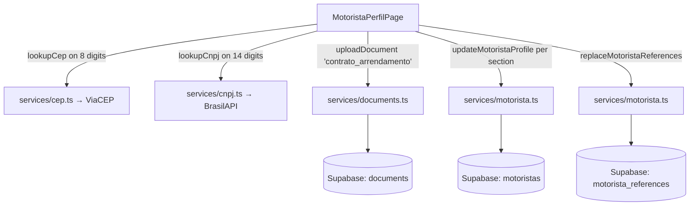

# Design Document — Motorista Perfil Extras

## 1. Visão Geral

Esta feature **estende** o perfil do motorista entregue pela spec
`motorista-onboarding-painel`. A `MotoristaPerfilPage` continua
sendo cards-stack vertical de seções; a entrega adiciona nelas:
campos novos, lookups externos (ViaCEP e BrasilAPI), upload de PDF
e mudança de UX para salvar por seção. Nenhum arquivo do embarcador
é tocado.

A entrega é dividida em **três frentes coordenadas**:

### Frente Schema (Migration 018)

Migration **idempotente** que apenas adiciona colunas em
`motoristas`, cria a tabela `motorista_references` e expande a
lista do CHECK em `documents.document_type`. Nenhum `DROP`,
`RENAME` ou alteração de tipo existente. O CHECK é recriado como
superconjunto preservando os 20 tipos atuais (incluindo o
`'documento_proprietario'` adicionado pela Migration 017) e
acrescentando `'contrato_arrendamento'`.

Resumo:

- `motoristas.address_cep TEXT`
- `motoristas.address_street TEXT`
- `motoristas.address_number TEXT`
- `motoristas.address_complement TEXT`
- `motoristas.address_neighborhood TEXT`
- `motoristas.address_city TEXT`
- `motoristas.address_uf TEXT`
- `motoristas.rg_number TEXT`
- `motoristas.owner_cnpj TEXT`
- `motoristas.owner_company_name TEXT`
- `motoristas.owner_pis_number TEXT`
- `motoristas.owner_is_driver BOOLEAN DEFAULT FALSE`
- Tabela `motorista_references(id, user_id, company_name, phone, created_at)`
- Índice `idx_motorista_references_user_id`
- RLS + políticas para `motorista_references`
- CHECK em `documents.document_type` recriado com superconjunto
  incluindo `'contrato_arrendamento'`.

### Frente Backend / Services

A frente de serviços **só estende** os módulos do motorista.
Nenhuma assinatura pública existente é alterada — apenas novos
campos opcionais e novas funções utilitárias:

- `src/services/cep.ts` (NOVO): `sanitizeCep`, `formatCep`,
  `lookupCep`, `CepLookupError` — espelha o padrão de
  `cnpj.ts`.
- `src/utils/phoneFormat.ts` (NOVO): `sanitizePhone`,
  `formatPhoneBR` — funções puras reusáveis.
- `src/services/motorista.ts`:
  - `MotoristaProfile` ganha campos opcionais novos: `addressCep`,
    `addressStreet`, `addressNumber`, `addressComplement`,
    `addressNeighborhood`, `addressCity`, `addressUf`, `rgNumber`,
    `ownerCnpj`, `ownerCompanyName`, `ownerPisNumber`,
    `ownerIsDriver`.
  - `UpdateMotoristaProfileData` ganha os mesmos campos opcionais.
  - `getMotoristaProfile` é estendido para devolver os novos campos
    do banco.
  - `updateMotoristaProfile` aceita os novos campos e mapeia para
    snake_case.
  - **Novas funções**:
    - `getMotoristaReferences(userId): Promise<MotoristaReference[]>`
    - `replaceMotoristaReferences(userId, refs): Promise<void>` —
      DELETE + INSERT em transação lógica (RPC ou client com try/catch
      claro).
- `src/services/documents.ts`: adiciona
  `'contrato_arrendamento'` à constante `VALID_DOCUMENT_TYPES`.
  **Nenhuma** assinatura pública é alterada.
- `src/services/cnpj.ts`: **REUSO TOTAL**, sem alteração.
- `src/utils/textCase.ts`: **REUSO** de `capitalizeName`, sem
  alteração.

### Frente UI

- `MotoristaPerfilPage.tsx`:
  - Seção "Dados Pessoais" ganha CEP + endereço completo + RG +
    bloco de referências profissionais.
  - Seção "Proprietário" ganha CNPJ com lookup, nome da empresa
    (disabled), PIS do proprietário, botão "Sou eu o proprietário",
    além dos slots de documentos já existentes.
  - **Nova seção 4** "Contrato de Arrendamento" (cartão) — visível
    apenas se `isNotOwner === true`.
  - Refator de UX: 4 botões "Salvar" por seção em vez de um único.
  - Estado dirty isolado por seção via 4 flags
    (`dirtyDadosPessoais`, `dirtyVeiculo`, `dirtyProprietario`,
    `dirtyContrato`).
  - Responsividade: classes mobile em todos os componentes novos.

### Diagrama de fluxo



---

## 2. Glossário Técnico

| Termo do requirements                  | Artefato de código                                         |
| -------------------------------------- | ---------------------------------------------------------- |
| MotoristaPerfilPage                    | `src/pages/MotoristaPerfilPage.tsx` (estendido)            |
| MotoristaService                       | `src/services/motorista.ts` (estendido)                    |
| DocumentsService                       | `src/services/documents.ts` (1 constante estendida)        |
| CepService                             | NOVO `src/services/cep.ts`                                 |
| CnpjService                            | `src/services/cnpj.ts` (REUSADO sem alteração)             |
| PhoneFormat                            | NOVO `src/utils/phoneFormat.ts`                            |
| CapitalizeName                         | `src/utils/textCase.ts` (REUSADO)                          |
| PisValidator                           | função pura existente da spec anterior (REUSADA)           |
| MotoristaReferencesTable               | NOVA tabela `motorista_references`                         |
| MotoristaAddressColumns                | novas colunas em `motoristas`                              |
| Migration018                           | NOVO `supabase/migrations/018_motorista_perfil_extras.sql` |
| ContratoArrendamentoSection            | NOVA seção dentro de `MotoristaPerfilPage`                 |
| SecaoSalvarButton                      | padrão de botão por seção dentro de `MotoristaPerfilPage`  |

---

## 3. Arquitetura por Requirement

### Req 1 — CEP com lookup automático (ViaCEP)

- **Arquivos:** `src/services/cep.ts` (NOVO),
  `MotoristaPerfilPage.tsx`.
- **Helpers puros (cep.ts):**
  ```ts
  export function sanitizeCep(value: string): string {
    return (value ?? '').replace(/\D/g, '');
  }
  export function formatCep(value: string): string {
    const digits = sanitizeCep(value).slice(0, 8);
    if (digits.length <= 5) return digits;
    return `${digits.slice(0, 5)}-${digits.slice(5)}`;
  }
  export function isValidCepFormat(value: string): boolean {
    return /^[0-9]{8}$/.test(sanitizeCep(value));
  }
  ```
- **Lookup:**
  ```ts
  export interface CepData {
    cep: string;
    logradouro: string;
    bairro: string;
    localidade: string; // cidade
    uf: string;
  }
  export class CepLookupError extends Error {
    constructor(message: string, public code: 'NOT_FOUND' | 'INVALID' | 'NETWORK' | 'UNKNOWN') {
      super(message);
      this.name = 'CepLookupError';
    }
  }
  export async function lookupCep(cep: string): Promise<CepData> {
    const digits = sanitizeCep(cep);
    if (digits.length !== 8) {
      throw new CepLookupError('CEP deve ter 8 dígitos.', 'INVALID');
    }
    let res: Response;
    try {
      res = await fetch(`https://viacep.com.br/ws/${digits}/json/`);
    } catch {
      throw new CepLookupError('Falha de rede ao consultar o CEP.', 'NETWORK');
    }
    if (!res.ok) {
      throw new CepLookupError(`Erro ao consultar CEP (status ${res.status}).`, 'UNKNOWN');
    }
    const data = await res.json();
    if (data?.erro === true) {
      throw new CepLookupError('CEP não encontrado.', 'NOT_FOUND');
    }
    return {
      cep: data.cep,
      logradouro: data.logradouro ?? '',
      bairro: data.bairro ?? '',
      localidade: data.localidade ?? '',
      uf: data.uf ?? '',
    };
  }
  ```
- **Disparo no UI:** `useEffect` que observa `addressCep`; quando
  `sanitizeCep(addressCep).length === 8` E o valor difere do último
  CEP consultado, chama `lookupCep` com guard de loading. Erro
  preserva valores anteriores.
- **Token monotônico anti race-condition:** padrão idêntico ao do
  `DieselDashboardInput` da spec anterior — `lastReqRef.current++`,
  descarta resposta velha.
- **Não dispara duas vezes para o mesmo CEP:** `lastQueriedCepRef`
  memoriza o último valor consultado; só chama de novo se mudar.

### Req 2 — RG + endereço completo

- **Arquivos:** `MotoristaPerfilPage.tsx`, `motorista.ts`, Migration
  018.
- **Inputs:**
  - "RG" — texto livre, `maxLength={20}`, opcional.
  - "Logradouro" — texto, opcional.
  - "Número" — texto alfanumérico, `maxLength={10}`.
  - "Complemento" — texto, opcional.
  - "Bairro" — texto, opcional.
  - "Cidade" — texto, opcional.
  - "UF" — texto, `maxLength={2}`, `onChange` aplica `.toUpperCase()`.
- **Persistência:** todos em colunas próprias em `motoristas`. Sem
  validação de obrigatoriedade — a UI permite salvar com qualquer
  combinação vazia.

### Req 3 — Referências profissionais (lista dinâmica)

- **Arquivos:** `MotoristaPerfilPage.tsx`, `motorista.ts`, Migration
  018.
- **Estado local:**
  ```ts
  interface MotoristaReferenceLocal {
    id: string;          // tempId ou uuid do banco
    companyName: string;
    phone: string;       // dígitos sanitizados
    persisted: boolean;  // true se veio do banco
  }
  const [references, setReferences] = useState<MotoristaReferenceLocal[]>([]);
  ```
- **Add/remove:**
  ```ts
  const addReference = () => setReferences(prev => [...prev,
    { id: `tmp_${Date.now()}_${prev.length}`, companyName: '', phone: '', persisted: false }
  ]);
  const removeReference = (id: string) =>
    setReferences(prev => prev.filter(r => r.id !== id));
  ```
- **Validação no save da seção "Dados Pessoais":**
  - Para cada `r` em `references`:
    - Se `r.companyName.trim() === '' && r.phone.trim() === ''` →
      ignorar (linha vazia, será descartada no save).
    - Se `r.companyName.trim() !== ''` exige
      `[10,11].includes(sanitizePhone(r.phone).length)` (telefone
      válido) — senão, erro inline.
    - Se `r.phone.trim() !== ''` exige
      `r.companyName.trim() !== ''` — senão, erro inline.
- **Persistência (replace-all):**
  ```ts
  // motorista.ts
  export async function replaceMotoristaReferences(
    userId: string,
    refs: { companyName: string; phone: string }[]
  ): Promise<void> {
    // 1) deletar todas as refs do user
    const { error: delErr } = await supabase
      .from('motorista_references')
      .delete()
      .eq('user_id', userId);
    if (delErr) throw new Error(delErr.message);
    // 2) inserir as não-vazias
    const rows = refs
      .filter(r => r.companyName.trim() !== '')
      .map(r => ({ user_id: userId, company_name: capitalizeName(r.companyName.trim()), phone: r.phone }));
    if (rows.length > 0) {
      const { error: insErr } = await supabase.from('motorista_references').insert(rows);
      if (insErr) throw new Error(insErr.message);
    }
  }
  ```
- **Observação de atomicidade:** o pattern delete-then-insert
  client-side não é atômico; em caso de falha do INSERT após DELETE
  bem-sucedido, o user fica sem refs. Mitigação **aceita para v1**:
  o submit faz refetch após o erro para mostrar o estado real do
  banco. Uma RPC SQL `replace_motorista_references` pode ser
  implementada em uma feature futura para garantir atomicidade
  server-side.

### Req 4 — CNPJ + nome da empresa proprietária

- **Arquivos:** `MotoristaPerfilPage.tsx` (REUSO de `cnpj.ts`).
- **Disparo:** `useEffect` ou handler `onChange` no campo CNPJ:
  quando `sanitizeCnpj(value).length === 14` E o valor difere do
  último consultado, chama `lookupCnpj`. Mesmo padrão de token
  monotônico do CEP.
- **UI:** campo "Nome da empresa" sempre `disabled`. Texto auxiliar
  "Preenchido automaticamente pela Receita" abaixo. Em `NOT_FOUND`,
  exibir mensagem inline e manter valor anterior. Em
  `NETWORK`/`UNKNOWN`, exibir mensagem genérica.
- **Persistência:** `owner_cnpj` recebe os 14 dígitos sanitizados;
  `owner_company_name` recebe `data.razaoSocial || data.nomeFantasia`.

### Req 5 — PIS na seção Proprietário

- **Arquivos:** `MotoristaPerfilPage.tsx` (REUSO da validação do PIS
  da spec anterior).
- **Estado local:** `ownerPis: string`.
- **Validação no save da seção "Proprietário":** mesma da spec
  anterior, mas aplicada a `ownerPis` em vez de `pis`. Vazio →
  aviso amarelo, salva. Não-vazio com tamanho ≠ 11 → erro vermelho,
  bloqueia.
- **Persistência:** `motoristas.owner_pis_number`.

### Req 6 — Botão "Sou eu o proprietário"

- **Arquivos:** `MotoristaPerfilPage.tsx`.
- **Mecanismo:** state copy puro:
  ```ts
  const handleSouEuProprietario = () => {
    setOwnerName(name);
    setOwnerCpf(cpf);
    setOwnerRg(rgNumber);
    setOwnerPis(pis);
    setOwnerAddressCep(addressCep);
    setOwnerAddressStreet(addressStreet);
    setOwnerAddressNumber(addressNumber);
    setOwnerAddressComplement(addressComplement);
    setOwnerAddressNeighborhood(addressNeighborhood);
    setOwnerAddressCity(addressCity);
    setOwnerAddressUf(addressUf);
    setOwnerPhone(motoristaPhone);
    setOwnerIsDriver(true);
    setDirtyProprietario(true);
  };
  ```
  Sem efeito sobre `isNotOwner`. Sem efeito sobre os campos
  originais do motorista.
- **Idempotência:** clicar duas vezes seguidas produz o mesmo
  estado (já que copia dos mesmos valores fonte).
- **Persistência:** flag `owner_is_driver` em
  `motoristas.owner_is_driver`. O resto dos campos vai junto com o
  save normal da seção "Proprietário" (em colunas separadas como
  `owner_*`).

> **Nota de design:** os campos do "Proprietário" originalmente eram
> apenas slots de documento (`comprovante_endereco_proprietario` e
> `documento_proprietario`). Esta feature transforma essa seção em
> um formulário completo com campos espelhados aos do motorista.
> Os slots de documento existentes são preservados; os novos campos
> de texto são adicionados acima deles.

### Req 7 — Seção "Contrato de Arrendamento"

- **Arquivos:** `MotoristaPerfilPage.tsx`, `documents.ts`, Migration
  018.
- **Slot único:** `'contrato_arrendamento'`. Render no `DocSlot`
  existente (mesmo componente da spec anterior), com
  `accept="application/pdf"`. **Não usar** `accept="image/*,application/pdf"`
  e **não usar** o botão "📷 Câmera" (esconder em PDF-only).
- **Validação no upload:**
  - `file.type !== 'application/pdf'` → "Apenas arquivos PDF são
    aceitos para o contrato de arrendamento." e abort.
  - `file.size > MaxFileSize_Contrato` → "Arquivo muito grande.
    Máximo permitido: 5MB." e abort.
- **Pequena adaptação no `DocSlot`:** quando o slot tem
  `accept === 'application/pdf'` (apenas PDF), esconder o botão
  "📷 Câmera" e mostrar apenas "📎 Anexar contrato (PDF)".
- **Persistência:** o `uploadDocument` já gerencia o resto. O
  documento entra com `status='pendente'` (default da tabela).

### Req 8 — Salvar por seção

- **Arquivos:** `MotoristaPerfilPage.tsx`.
- **Estado:**
  ```ts
  const [dirty, setDirty] = useState({
    dadosPessoais: false,
    veiculo: false,
    proprietario: false,
    contrato: false,
  });
  const [saving, setSaving] = useState({ dadosPessoais: false, ... });
  const [sectionFeedback, setSectionFeedback] = useState<Record<string, { type: 'success'|'error'; msg: string }>>({});
  ```
- **Marcação de dirty:** cada `onChange` da seção chama
  `setDirty(prev => ({ ...prev, [section]: true }))`. Ao final do
  save bem-sucedido, volta para `false`.
- **Função separada por seção:**
  ```ts
  const handleSaveDadosPessoais = async () => { /* validação + update + replaceRefs */ };
  const handleSaveVeiculo = async () => { /* validação + update */ };
  const handleSaveProprietario = async () => { /* validação + update */ };
  const handleSaveContrato = async () => { /* apenas reset dirty */ };
  ```
- **Quebrar o submit único atual:** o `<form onSubmit={handleSave}>`
  vira uma `<div>` ou `<form onSubmit={(e) => e.preventDefault()}>`
  apenas para evitar submit acidental por Enter; cada botão chama
  seu handler diretamente.
- **Cross-validation entre seções:** **NÃO há**. Cada save é
  isolado. Exemplo: placa inválida não bloqueia salvar dados
  pessoais.

### Req 9 — Responsividade mobile (≤ 375 px)

- **Arquivos:** `MotoristaPerfilPage.tsx`.
- **Padrão de classes Tailwind aplicado nos novos componentes:**
  - Inputs novos: `text-base sm:text-sm` (16 px no mobile, 14 px no
    desktop).
  - Grid de endereço: `grid grid-cols-1 sm:grid-cols-2 gap-3`.
  - Cartões: `p-3 sm:p-4`.
  - Botões: `min-h-[44px] px-4`.
  - Lista de referências em mobile: cada item em
    `<div className="flex flex-col gap-2 p-3 border rounded-lg bg-gray-50">`
    com botão remover em posição absoluta no canto superior direito
    (`absolute top-2 right-2`).
  - Em ≥ 640 px (sm), referências viram linha horizontal: `sm:flex-row sm:items-end`.
- **Sem CSS novo** — apenas classes Tailwind utilitárias. Nenhuma
  media query manual em `index.css`.

### Req 10 — Migration 018

- Detalhes na seção 4. Idempotente, não-destrutiva, com RLS para
  `motorista_references`.

### Req 11 — Não-regressão

- Lista de **arquivos imutáveis** (Req 11.1):
  `EmbarcadorPerfilPage.tsx`, `EmbarcadorPage.tsx`, `embarcador.ts`,
  `fretes.ts`, `verification.ts`, `ModalVerificacaoEmail.tsx`,
  `LogoUploadField.tsx`, `FreteForm.tsx`.
- **Estratégia automática:** o suite existente
  (`auth.test.ts`, `inputValidator.property.test.ts`,
  `passwordHash.test.ts`, `passwordValidation.test.ts`,
  `pisValidation.property.test.ts`, `plateValidation.property.test.ts`,
  `tripSuggestion.property.test.ts`, `yearValidation.property.test.ts`,
  `sectionCounter.property.test.ts`, `calculoFrete.property.test.ts`,
  `freteFilters.property.test.ts`, `geolocation.property.test.ts`,
  `fileValidation.property.test.ts`, `textCase.property.test.ts`,
  `security/*`) continua passando no CI. A feature **não** os
  altera.
- **Estratégia manual:** smoke list documentada na seção 8.

### Req 12 — Reuso de utilitários

- **`capitalizeName`** já existente — REUSADO em "Nome da empresa"
  (referências) e "Nome do proprietário".
- **`phoneFormat`** — `RegisterForm.tsx` e `LoginForm.tsx` têm cópias
  locais inline; `EmbarcadorPerfilPage.tsx` tem uma cópia local
  chamada `formatPhoneDisplay` mas não a exporta. Nenhum utilitário
  público existe. **Decisão:** criar `src/utils/phoneFormat.ts`
  como utilitário público novo. Não tocar nos consumidores antigos
  para evitar regressão (Req 11.1 e 11.5).

---

## 4. Schema Changes

### Migration 018 — `018_motorista_perfil_extras.sql`

```sql
-- ============================================================================
-- Migration 018: Motorista Perfil Extras
-- ============================================================================
-- Idempotente. Apenas ADD COLUMN IF NOT EXISTS, CREATE TABLE IF NOT EXISTS,
-- CREATE INDEX IF NOT EXISTS e expansão do CHECK em documents.document_type.
-- NÃO altera embarcadores, fretes ou users.
--
-- Implementa a spec `.kiro/specs/motorista-perfil-extras/`:
--   * Endereço completo + RG na seção Dados Pessoais
--   * CNPJ + nome da empresa proprietária + PIS proprietário
--   * Tabela motorista_references (lista dinâmica)
--   * Adição do tipo de documento `contrato_arrendamento`
-- ============================================================================

BEGIN;

-- ============================================================================
-- 1. NOVAS COLUNAS EM motoristas (Req 10.1)
-- ============================================================================
-- Todas anuláveis exceto owner_is_driver, que tem default seguro.

ALTER TABLE motoristas ADD COLUMN IF NOT EXISTS address_cep           TEXT;
ALTER TABLE motoristas ADD COLUMN IF NOT EXISTS address_street        TEXT;
ALTER TABLE motoristas ADD COLUMN IF NOT EXISTS address_number        TEXT;
ALTER TABLE motoristas ADD COLUMN IF NOT EXISTS address_complement    TEXT;
ALTER TABLE motoristas ADD COLUMN IF NOT EXISTS address_neighborhood  TEXT;
ALTER TABLE motoristas ADD COLUMN IF NOT EXISTS address_city          TEXT;
ALTER TABLE motoristas ADD COLUMN IF NOT EXISTS address_uf            TEXT;
ALTER TABLE motoristas ADD COLUMN IF NOT EXISTS rg_number             TEXT;
ALTER TABLE motoristas ADD COLUMN IF NOT EXISTS owner_cnpj            TEXT;
ALTER TABLE motoristas ADD COLUMN IF NOT EXISTS owner_company_name    TEXT;
ALTER TABLE motoristas ADD COLUMN IF NOT EXISTS owner_pis_number      TEXT;
ALTER TABLE motoristas ADD COLUMN IF NOT EXISTS owner_is_driver       BOOLEAN DEFAULT FALSE;

-- Range check defensivo: UF com 2 letras maiúsculas quando preenchido.
DO $
BEGIN
  IF NOT EXISTS (
    SELECT 1 FROM information_schema.constraint_column_usage
     WHERE table_schema    = 'public'
       AND table_name      = 'motoristas'
       AND constraint_name = 'motoristas_address_uf_check'
  ) THEN
    ALTER TABLE motoristas
      ADD CONSTRAINT motoristas_address_uf_check
      CHECK (address_uf IS NULL OR address_uf ~ '^[A-Z]{2}$');
  END IF;
END $;

-- ============================================================================
-- 2. TABELA motorista_references (Req 10.2, 10.3)
-- ============================================================================

CREATE TABLE IF NOT EXISTS motorista_references (
  id           UUID PRIMARY KEY DEFAULT gen_random_uuid(),
  user_id      UUID NOT NULL REFERENCES users(id) ON DELETE CASCADE,
  company_name TEXT NOT NULL,
  phone        TEXT NOT NULL,
  created_at   TIMESTAMPTZ NOT NULL DEFAULT now()
);

CREATE INDEX IF NOT EXISTS idx_motorista_references_user_id
  ON motorista_references(user_id);

-- ============================================================================
-- 3. RLS DE motorista_references (Req 10.5)
-- ============================================================================

ALTER TABLE motorista_references ENABLE ROW LEVEL SECURITY;

DROP POLICY IF EXISTS motorista_references_select_own ON motorista_references;
CREATE POLICY motorista_references_select_own
  ON motorista_references FOR SELECT
  USING (user_id = auth.uid());

DROP POLICY IF EXISTS motorista_references_insert_own ON motorista_references;
CREATE POLICY motorista_references_insert_own
  ON motorista_references FOR INSERT
  WITH CHECK (user_id = auth.uid());

DROP POLICY IF EXISTS motorista_references_delete_own ON motorista_references;
CREATE POLICY motorista_references_delete_own
  ON motorista_references FOR DELETE
  USING (user_id = auth.uid());

-- ============================================================================
-- 4. EXPANDIR CHECK DE documents.document_type (Req 7.9, 10.4)
-- ============================================================================
-- Recriação como SUPERCONJUNTO: 20 tipos atuais (incluindo
-- documento_proprietario da Migration 017) + contrato_arrendamento.

ALTER TABLE documents
  DROP CONSTRAINT IF EXISTS documents_document_type_check;

ALTER TABLE documents
  ADD CONSTRAINT documents_document_type_check
  CHECK (document_type IN (
    'cpf', 'cnh', 'antt',
    'vehicle_registration', 'vehicle_insurance', 'profile_photo',
    'crlv_cavalo', 'crlv_carreta_1', 'crlv_carreta_2',
    'crlv_carreta_3', 'crlv_carreta_4',
    'rntrc_cavalo', 'rntrc_carreta_1', 'rntrc_carreta_2',
    'foto_segurando_cnh', 'foto_frente_caminhao',
    'comprovante_endereco_proprietario',
    'comprovante_endereco_motorista',
    'foto_caminhao_completo',
    'documento_proprietario',
    'contrato_arrendamento'
  ));

COMMIT;
```

**Pontos críticos:**

- Nenhum `DROP COLUMN`, `RENAME` ou `ALTER TYPE`.
- Todos os `ADD COLUMN` com `IF NOT EXISTS`.
- `CREATE TABLE` e `CREATE INDEX` com `IF NOT EXISTS`.
- Políticas de RLS com `DROP POLICY IF EXISTS` antes de `CREATE
  POLICY` (idempotência).
- O CHECK constraint de `documents.document_type` é recriado como
  **superconjunto** do anterior — qualquer linha existente continua
  válida.
- Múltiplas execuções da migration produzem o mesmo schema final.

---

## 5. Componentes React

### Sem componentes novos

A feature **não cria** nenhum componente novo. Toda a UI nova fica
inline em `MotoristaPerfilPage.tsx` para minimizar surface área e
evitar abstrações prematuras. Os blocos são bem delimitados por
comentários `// ─── Endereço ───`, `// ─── Referências ───`,
`// ─── Contrato ───`.

**Decisão consciente:** se algum desses blocos crescer ou ganhar
casos de uso fora dessa página, extraímos. Por ora, inline.

---

## 6. Serviços / Funções Novas

### `src/services/cep.ts` (NOVO)

```ts
export interface CepData {
  cep: string;
  logradouro: string;
  bairro: string;
  localidade: string;
  uf: string;
}

const VIA_CEP_BASE = 'https://viacep.com.br/ws';

export function sanitizeCep(value: string): string;
export function formatCep(value: string): string;
export function isValidCepFormat(value: string): boolean;

export class CepLookupError extends Error {
  constructor(
    message: string,
    public code: 'NOT_FOUND' | 'INVALID' | 'NETWORK' | 'UNKNOWN'
  );
}

export async function lookupCep(cep: string): Promise<CepData>;
```

### `src/utils/phoneFormat.ts` (NOVO)

```ts
/**
 * Remove tudo que não for dígito.
 */
export function sanitizePhone(value: string): string {
  return (value ?? '').replace(/\D/g, '');
}

/**
 * Formata um telefone BR no padrão `(DD) NNNN-NNNN` (10 dígitos)
 * ou `(DD) N NNNN-NNNN` (11 dígitos) conforme o usuário digita.
 * Valores parciais retornam o mesmo prefixo aplicado.
 */
export function formatPhoneBR(value: string): string {
  const d = sanitizePhone(value).slice(0, 11);
  if (d.length === 0) return '';
  if (d.length <= 2) return `(${d}`;
  if (d.length <= 6) return `(${d.slice(0, 2)}) ${d.slice(2)}`;
  if (d.length <= 10) return `(${d.slice(0, 2)}) ${d.slice(2, 6)}-${d.slice(6)}`;
  return `(${d.slice(0, 2)}) ${d.slice(2, 3)} ${d.slice(3, 7)}-${d.slice(7)}`;
}
```

### `src/services/motorista.ts` (estendido)

```ts
// Tipos novos:
export interface MotoristaReference {
  id: string;
  userId: string;
  companyName: string;
  phone: string;
  createdAt: Date;
}

// MotoristaProfile e UpdateMotoristaProfileData ganham campos
// opcionais novos:
//   addressCep, addressStreet, addressNumber, addressComplement,
//   addressNeighborhood, addressCity, addressUf, rgNumber,
//   ownerCnpj, ownerCompanyName, ownerPisNumber, ownerIsDriver

// Funções novas:
export async function getMotoristaReferences(
  userId: string
): Promise<MotoristaReference[]>;

export async function replaceMotoristaReferences(
  userId: string,
  refs: { companyName: string; phone: string }[]
): Promise<void>;
```

`getMotoristaProfile` e `updateMotoristaProfile` recebem extensões
puramente aditivas (mais campos no SELECT/UPDATE), sem alterar
assinaturas externas.

---

## 7. Mudanças em Componentes Existentes

| Arquivo                          | Mudança                                                                                                                |
| -------------------------------- | ---------------------------------------------------------------------------------------------------------------------- |
| `MotoristaPerfilPage.tsx`        | Estende: CEP + endereço + RG + referências em "Dados Pessoais"; CNPJ + nome empresa + PIS + botão "Sou eu" em "Proprietário"; nova seção "Contrato de Arrendamento"; 4 botões "Salvar" por seção; classes mobile-first; reuso do `DocSlot` interno. |
| `motorista.ts`                   | `MotoristaProfile` e `UpdateMotoristaProfileData` ganham campos novos opcionais (endereço, RG, owner_*); novas funções `getMotoristaReferences` e `replaceMotoristaReferences`. |
| `documents.ts`                   | Adiciona `'contrato_arrendamento'` em `VALID_DOCUMENT_TYPES`. Funções públicas inalteradas.                            |
| `cnpj.ts`                        | **Sem alteração**. Apenas REUSO via `lookupCnpj`/`formatCnpj`/`sanitizeCnpj`.                                          |
| `textCase.ts`                    | **Sem alteração**. Apenas REUSO via `capitalizeName`.                                                                  |

Arquivos **proibidos** (não tocar — Req 11):

- `EmbarcadorPerfilPage.tsx`, `EmbarcadorPage.tsx`
- `embarcador.ts`, `fretes.ts`, `verification.ts`
- `ModalVerificacaoEmail.tsx`, `LogoUploadField.tsx`, `FreteForm.tsx`

---

## 8. Estratégia de Validação

### Smoke tests manuais (caminho-feliz por requirement)

1. Aplicar Migration 018 duas vezes consecutivas — segunda execução
   não falha (idempotência).
2. Login como motorista; abrir `/perfil/motorista`.
3. Em "Dados Pessoais": digitar CEP `01310-100` → endereço (Av.
   Paulista, Bela Vista, São Paulo, SP) preenche automaticamente;
   campos "Número" e "Complemento" continuam vazios.
4. CEP `00000-000` → mensagem "CEP não encontrado." e demais
   campos preservam estado.
5. Preencher "Número" e "Complemento" manualmente; preencher RG;
   clicar em "Salvar" da seção "Dados Pessoais" → verde "Seção
   salva."; recarregar página e conferir persistência.
6. Adicionar 2 referências profissionais (botão "+ Adicionar
   referência"); preencher só o nome de uma → bloqueia salvar com
   "Telefone inválido…"; preencher telefone com 11 dígitos → salva
   ok; clicar 🗑 em uma das duas → remove sem confirmação;
   clicar "Salvar" → conferir no banco que `motorista_references`
   reflete exatamente o estado.
7. Em "Veículo": validações da spec anterior continuam funcionando
   (placa Mercosul, ano fab/modelo, ranges); botão "Salvar" da
   seção persiste apenas os campos do veículo.
8. Marcar "O caminhão NÃO é meu" → seção "Proprietário" expande e
   seção "Contrato de Arrendamento" aparece como cartão separado.
9. Em "Proprietário": digitar CNPJ válido → "Nome da empresa"
   preenche disabled; PIS proprietário com 5 dígitos → erro
   bloqueia; PIS vazio → aviso amarelo, salva; clicar "Sou eu o
   proprietário" → todos os campos ficam preenchidos com os do
   motorista mas editáveis; alterar um deles e salvar.
10. Em "Contrato de Arrendamento": tentar upload de imagem JPG →
    "Apenas arquivos PDF…"; upload de PDF de 10 MB → "Arquivo
    muito grande…"; upload de PDF válido < 5 MB → entra com
    `status='pendente'` na tabela `documents`.
11. Mobile (DevTools 375 px): conferir inputs `text-base`, single
    column, botões ≥ 44 px de altura, sem overflow horizontal.

### PBT sugeridos (com `fast-check`, já no projeto)

- **`src/utils/phoneFormat.ts`:**
  - **Idempotência da sanitização:**
    `sanitizePhone(sanitizePhone(s)) === sanitizePhone(s)`.
  - **Formatador preserva dígitos:**
    `sanitizePhone(formatPhoneBR(s)) === sanitizePhone(s).slice(0, 11)`.
- **`src/services/cep.ts`:**
  - **Idempotência da sanitização de CEP:**
    `sanitizeCep(sanitizeCep(s)) === sanitizeCep(s)`.
  - **Round-trip de formatação:**
    `sanitizeCep(formatCep(d)) === d` para qualquer string de 0–8
    dígitos `d`.
  - **Limite de tamanho:** `sanitizeCep(s).length <= 8` quando
    aplicado à saída de `formatCep`.
  - **Validação:** `isValidCepFormat(s)` ⇔
    `sanitizeCep(s).length === 8` (gerado com strings arbitrárias).
- **Botão "Sou eu o proprietário":**
  - **Idempotência:** clicar duas vezes seguidas produz o mesmo
    estado (`state(click(click(s))) === state(click(s))`).
  - **Cópia exata:** após clique, todos os campos
    `CamposCopia_SouEuOProprietario` no estado de proprietário são
    `===` aos campos correspondentes do motorista.

### Não-regressão automática

Os seguintes testes **devem** continuar passando após a feature:

- `auth.test.ts`
- `inputValidator.property.test.ts`
- `passwordHash.test.ts` / `.property.test.ts`
- `passwordValidation.test.ts` / `.property.test.ts`
- `pisValidation.property.test.ts`
- `plateValidation.property.test.ts`
- `tripSuggestion.property.test.ts`
- `yearValidation.property.test.ts`
- `sectionCounter.property.test.ts`
- `calculoFrete.property.test.ts`
- `freteFilters.property.test.ts`
- `geolocation.property.test.ts`
- `fileValidation.property.test.ts`
- `textCase.property.test.ts`
- `security/*.test.ts`

### Não-regressão manual do embarcador

- [ ] Login como embarcador → home renderiza tabela/cards
      normalmente.
- [ ] Cadastrar novo frete via `FreteForm` (não tocado).
- [ ] Editar perfil em `EmbarcadorPerfilPage` (não tocado).
- [ ] Upload de logo via `LogoUploadField` (não tocado).
- [ ] Verificação de e-mail do embarcador (modal não tocado).

---

## 9. Riscos e Mitigações

| Risco                                                                 | Mitigação                                                                                                                                                                                |
| --------------------------------------------------------------------- | ---------------------------------------------------------------------------------------------------------------------------------------------------------------------------------------- |
| ViaCEP fora do ar trava o save de Dados Pessoais                      | Lookup é fire-and-forget; em erro, exibe mensagem mas não bloqueia salvar. Motorista pode digitar endereço manualmente.                                                                  |
| Replace-all de referências (DELETE+INSERT) não-atômico                | Se INSERT falha após DELETE, refazer fetch do banco para mostrar estado real e exibir erro claro. Aceito para v1; RPC SQL atômica fica como follow-up.                                  |
| RLS de `motorista_references` configurada errado                      | Política de SELECT/INSERT/DELETE com `auth.uid() = user_id`; DROP POLICY IF EXISTS antes de CREATE POLICY garante idempotência. Smoke test manual conferindo que outro user não vê refs alheias. |
| Botão "Sou eu o proprietário" sobrescreve dados que o user não queria | Confirmação implícita: o botão tem rótulo claro e o user vê os campos serem preenchidos imediatamente. Se errou, basta editar de novo. Não há toast de "já preenchido".                  |
| 4 botões "Salvar" causam confusão                                     | Cada botão fica DENTRO do cartão da seção, com label "Salvar" e feedback verde/vermelho próximo. Estado dirty deixa claro qual seção tem mudança.                                       |
| CHECK constraint de `documents.document_type` quebra docs existentes | Recriação como SUPERCONJUNTO — todos os tipos antigos continuam permitidos. Validado por smoke test 1 (aplicar 2× a migration).                                                          |
| Mobile: zoom no foco do input no iOS                                  | `text-base` (16 px) em todos os inputs novos. Já é a regra do iOS para evitar zoom.                                                                                                      |
| ViaCEP retorna campos com caixa-baixa em logradouro                   | Aceitar como está — ViaCEP é a fonte da verdade. Não aplicar `capitalizeName` em logradouro porque o padrão é "Avenida Paulista" e queremos manter.                                      |

---

## 10. Resumo de Arquivos

### Criados

- `supabase/migrations/018_motorista_perfil_extras.sql`
- `src/services/cep.ts`
- `src/utils/phoneFormat.ts`

### Modificados

- `src/pages/MotoristaPerfilPage.tsx`
- `src/services/motorista.ts`
- `src/services/documents.ts`

### Reusados sem alteração

- `src/services/cnpj.ts`
- `src/utils/textCase.ts`
- `src/components/AppHeader.tsx` (já consumido pela página)

### Proibidos (Req 11)

- `src/pages/EmbarcadorPerfilPage.tsx`
- `src/pages/EmbarcadorPage.tsx`
- `src/services/embarcador.ts`
- `src/services/fretes.ts`
- `src/services/verification.ts`
- `src/components/ModalVerificacaoEmail.tsx`
- `src/components/LogoUploadField.tsx`
- `src/components/FreteForm.tsx`
