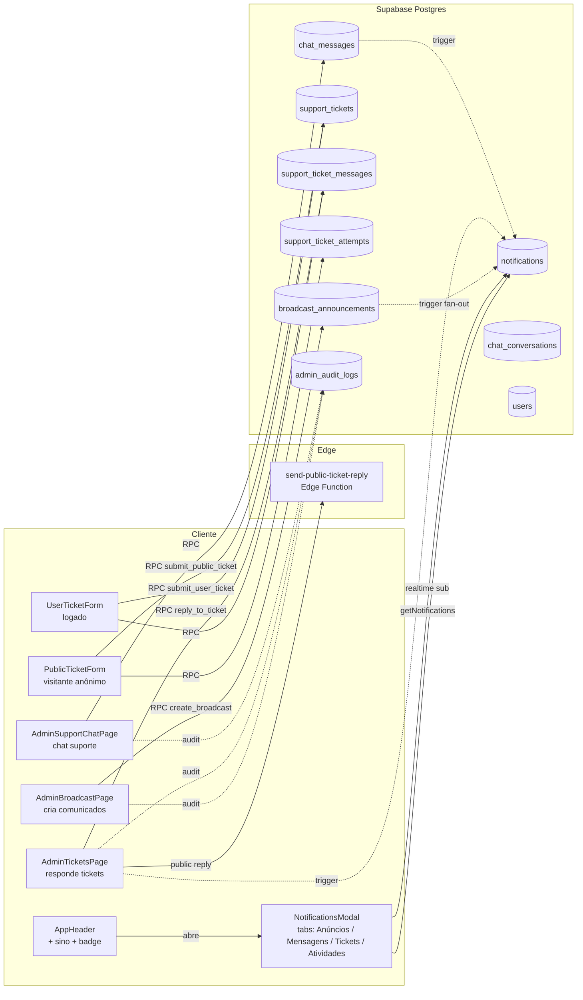

# Design Document — Notifications_Hub

## Overview

Esta spec entrega um Notifications_Hub unificado para o FreteGO. O escopo
amplia o `NotificationsModal.tsx` (já em produção para motorista) para:

1. **Replicar header com sininho no embarcador** (mesma UX, sem mapa/raio/diesel).
2. **Broadcast de comunicado** pelo admin com targeting por papel
   (`motorista`, `embarcador`, `empresa`-em-breve), entrando na aba Anúncios.
3. **Chat de suporte** (usuário ↔ admin) na aba Mensagens.
4. **Tickets de suporte** abríveis por usuário logado e por visitante anônimo
   da landing page.
5. **Catch-all em Atividades** para likes em frete, avaliações e alertas de
   plano.

A arquitetura aproveita ao máximo o que já existe:
- Tabela `notifications` (migration 001) é a **única fonte de verdade** para
  tudo que aparece no modal (incluindo broadcast, chat de suporte e tickets,
  via fan-out e triggers).
- Tabelas `chat_conversations`/`chat_messages` (migrations 001/008/009) já
  modelam o chat de suporte usuário↔admin — só precisamos garantir RLS,
  realtime e disparar `notifications` em cada mensagem.
- Convenções de admin: `executeAdminMutation`, `is_admin_with_permission`,
  Stealth_404, master imutável (`Nexus_Vortex99`), versionamento otimista
  com `STALE_VERSION`, audit-by-construction.

Tudo segue **Phase 1**: envio imediato, sem rascunho/agendamento, sem anexo
em ticket. Phase 2 (futura): rascunho, agendamento, expiração de broadcast,
anexos.

## Architecture

### Componentes lógicos



### Fluxo de classificação por aba

A categorização acontece **só no cliente**, em `NotificationsModal.categorize()`,
seguindo o contrato de prefixos do Requirement 3. O servidor não sabe nem
precisa saber de "abas" — ele só grava o `type` correto. Isso permite que
o contrato evolua sem migration.

```
type starts with → bucket
─────────────────────────────────────────
broadcast_         → Anúncios
anuncio_           → Anúncios
frete_like_        → Atividades   (mais específico que frete_, vence)
frete_             → Anúncios
chat_support_      → Mensagens    (mais específico que chat_, vence)
chat_              → Mensagens
message_, msg_     → Mensagens
ticket_            → Tickets
support_, suporte_ → Tickets
plan_              → Atividades   (fallback)
rating_            → Atividades   (fallback)
system_            → Atividades   (fallback)
qualquer outro     → Atividades
```

A função `categorize` do componente itera os prefixos do mais longo para o
mais curto, retornando no primeiro match.

### Camadas de gating (RBAC + RLS)

Toda interação admin/sensível passa por **duas camadas**:

| Camada | Onde | O que valida |
|--------|------|--------------|
| UI | `useAdminPermission(action)` | esconde botão se sem perm |
| RPC SECURITY DEFINER | `is_admin_with_permission(action)` | gera `42501` + audit log negativo se cliente bypass |
| RLS | policies por tabela | bloqueia SELECT/INSERT direto |

Novas RPCs SECURITY DEFINER seguem padrão do projeto: `SET search_path = public`,
checagem `auth.uid() IS NULL`, `is_admin_with_permission(...)` quando admin,
log negativo `<MODULE>_VIEW_DENIED` em path negativo, `REVOKE ALL FROM PUBLIC`,
`GRANT EXECUTE TO authenticated` (ou `anon, authenticated` em
`submit_public_ticket`).

## Components and Interfaces

### 1. Componentes React

#### `NotificationsModal.tsx` (já existe — extensão)

**Mudanças:**
- Aba **Mensagens** passa a unir notificações de chat (`chat_message`,
  `chat_support_*`) em uma única lista, ordenadas por `created_at DESC`.
- Aba **Tickets** ganha botão `Abrir novo ticket` que abre `<UserTicketForm>`
  inline ou em modal filho.
- Aba **Mensagens** ganha botão `Falar com suporte` que abre/cria a
  Support_Conversation e navega para `/suporte/chat`.
- Função `categorize` atualizada conforme contrato versionado (Requirement 3).
- Toggle de som persiste em `localStorage['fretego-notif-sound']` (já existe).

**Props:** sem mudança de API.

#### `AppHeader.tsx` (já existe — extensão)

- Sininho aparece para `userType in ['motorista', 'embarcador']` (já passou
  a aparecer na implementação atual).
- Badge usa `notifUnread + chatUnread` somando ambos, truncado em `9+`.
- Seções específicas de motorista (raio, diesel) já moram fora deste arquivo
  via `MapaToolbar` na HomePage; AppHeader não muda para embarcador.

#### `AdminBroadcastPage.tsx` (novo)

Rota: `/admin/comunicados`.
- Lista de broadcasts em tabela compacta seguindo padrão admin (filtros em
  popover, paginação 10/50/100).
- Botão `+ Novo comunicado` abre `<BroadcastFormModal>`.
- Colunas: título, audiência (chips), `recipients_count`, `dispatched_at`,
  `created_by` (nome admin), ações (`Ver detalhes`).
- Permissão: `FINANCEIRO_EDIT`.

Por que reusar `FINANCEIRO_EDIT`: a permissão já é a usada pelo módulo
de Anúncios (banners e categorias). O usuário gosta do agrupamento
"o admin que controla anúncios também controla comunicados".

Alternativa rejeitada: criar `BROADCAST_VIEW`/`BROADCAST_EDIT` próprios.
Adiciona complexidade de seed/role sem benefício real para Phase 1.

#### `BroadcastFormModal.tsx` (novo)

Campos:
- `title` (input, 1-120 chars).
- `body` (textarea, 1-2000 chars, contador no canto).
- `link` (input opcional, 0-500 chars, validador URL leve).
- `target_audience`: 3 checkboxes — `Motoristas`, `Embarcadores`,
  `Empresas (em breve)`.
  - `Empresas` aparece **disabled** com tooltip "Em breve" em Phase 1.
- Botão `Enviar agora` (Phase 1 não tem rascunho).
- Confirmação modal: "Enviar para X destinatários estimados? Não dá pra
  desfazer." com `recipients_count` estimado em pré-fetch.

#### `AdminTicketsPage.tsx` (novo)

Rota: `/admin/suporte/tickets`.
- Lista de tickets em tabela com filtros (status, prioridade, data).
- Coluna `De`: nome do user logado ou `<Visitante> guest_name (guest_email)`
  para públicos.
- Permissão: `SUPORTE_VIEW`.

#### `AdminTicketDetailPage.tsx` (novo)

Rota: `/admin/suporte/tickets/:id`.
- Painel de mensagens estilo email/chat.
- Caixa de resposta no rodapé.
  - Para ticket de visitante: aviso "Esta resposta será enviada por email
    para `guest_email`".
  - Botões `Responder` / `Marcar como resolvido`.
- Permissão: `SUPORTE_REPLY` para responder, `SUPORTE_VIEW` para ler.

#### `UserTicketForm.tsx` (novo, usuário logado)

- Modal aberto pelo Notifications_Modal aba Tickets.
- Campos: `subject`, `body`, `priority` (low/normal/high).
- Submit chama `submit_user_ticket` RPC.

#### `PublicTicketForm.tsx` (novo, visitante anônimo)

- Componente exposto na landing page (rota `/contato` ou modal flutuante).
- Campos: `guest_name`, `guest_email`, `subject`, `body` + honeypot
  `website_url` (campo oculto via `display: none`).
- Captcha leve: rate-limit por IP no servidor + honeypot.
- Submit chama `submit_public_ticket` RPC (chamável por `anon`).

#### `AdminSupportChatPage.tsx` (novo)

Rota: `/admin/suporte/chat`.
- Lista de Support_Conversations no painel esquerdo, conversa selecionada
  no painel direito.
- Permissão: `SUPORTE_VIEW`/`SUPORTE_REPLY`.

### 2. Services TypeScript

#### `services/notifications.ts` (já existe — extensão)

Adiciona:
```ts
export type NotificationCategory = 'anuncios' | 'mensagens' | 'tickets' | 'atividades';

export function categorizeNotification(type: string): NotificationCategory;
```

Mantém: `getNotifications`, `getUnreadNotifications`,
`getUnreadNotificationCount`, `markNotificationAsRead`,
`markAllNotificationsAsRead`. Sem mudança de assinatura.

#### `services/admin/broadcasts.ts` (novo)

```ts
export type TargetAudience = 'motorista' | 'embarcador' | 'empresa';

export interface Broadcast {
  id: string;
  title: string;
  body: string;
  link: string | null;
  targetAudience: TargetAudience[];
  status: 'sent' | 'draft' | 'scheduled'; // Phase 1 só usa 'sent'
  recipientsCount: number | null;
  dispatchedAt: string | null;
  createdBy: string;
  createdAt: string;
  updatedAt: string;
}

export async function listBroadcasts(opts?: { limit?: number; offset?: number }): Promise<{ items: Broadcast[]; total: number }>;
export async function getBroadcastDetail(id: string): Promise<Broadcast & { recipientsByType: Record<TargetAudience, number> }>;
export async function createBroadcast(input: {
  title: string;
  body: string;
  link?: string | null;
  targetAudience: TargetAudience[];
}): Promise<Broadcast>;
export async function previewBroadcastRecipients(audience: TargetAudience[]): Promise<number>;
```

`createBroadcast` usa `executeAdminMutation` com action `BROADCAST_CREATE`,
chama RPC `rpc_create_broadcast`, e a RPC dispara o fan-out em transação.

#### `services/admin/tickets.ts` (novo)

```ts
export type TicketStatus = 'open' | 'in_progress' | 'resolved';
export type TicketPriority = 'low' | 'normal' | 'high';

export interface SupportTicket {
  id: string;
  userId: string | null;          // null = público anônimo
  guestName: string | null;
  guestEmail: string | null;
  subject: string;
  status: TicketStatus;
  priority: TicketPriority;
  resolvedAt: string | null;
  resolvedBy: string | null;
  createdAt: string;
  updatedAt: string;
}

export interface TicketMessage {
  id: string;
  ticketId: string;
  authorId: string | null;        // null = público anônimo (autor original)
  body: string;
  isAdmin: boolean;
  emailSentAt: string | null;     // só para respostas a tickets públicos
  createdAt: string;
}

// User
export async function submitUserTicket(input: { subject: string; body: string; priority?: TicketPriority }): Promise<SupportTicket>;
export async function listMyTickets(): Promise<SupportTicket[]>;
export async function getMyTicket(id: string): Promise<{ ticket: SupportTicket; messages: TicketMessage[] }>;
export async function postMyTicketReply(ticketId: string, body: string): Promise<TicketMessage>;

// Public (anon)
export async function submitPublicTicket(input: {
  guestName: string;
  guestEmail: string;
  subject: string;
  body: string;
  websiteUrl?: string; // honeypot — sempre vazio em uso real
}): Promise<{ submitted: true }>; // resposta opaca

// Admin
export async function listAdminTickets(filters: {
  status?: TicketStatus;
  priority?: TicketPriority;
  guestOnly?: boolean;
  limit?: number;
  offset?: number;
}): Promise<{ items: SupportTicket[]; total: number }>;
export async function getAdminTicketDetail(id: string): Promise<{ ticket: SupportTicket; messages: TicketMessage[] }>;
export async function replyToTicket(ticketId: string, body: string, expectedUpdatedAt: string): Promise<TicketMessage>;
export async function resolveTicket(ticketId: string, expectedUpdatedAt: string): Promise<SupportTicket>;
```

`replyToTicket` e `resolveTicket` usam `executeAdminMutation` com actions
`SUPORTE_REPLY` / `SUPORTE_TICKET_RESOLVE`. Para tickets públicos,
`replyToTicket` chama internamente a Edge Function `send-public-ticket-reply`
e atualiza `email_sent_at`.

#### `services/admin/supportChat.ts` (novo)

```ts
export interface SupportConversation {
  id: string;
  userId: string;
  status: 'aberta' | 'em_andamento' | 'resolvida';
  lastMessageAt: string;
  unreadCount: number; // do ponto de vista do caller
}

export interface SupportChatMessage {
  id: string;
  conversationId: string;
  senderId: string;
  message: string;
  isAdmin: boolean;
  readAt: string | null;
  createdAt: string;
}

// User logado
export async function openMySupportConversation(): Promise<SupportConversation>;
export async function postSupportMessage(message: string): Promise<SupportChatMessage>;
export async function getMySupportMessages(): Promise<SupportChatMessage[]>;

// Admin
export async function listSupportConversations(filters: {
  status?: SupportConversation['status'];
  limit?: number;
  offset?: number;
}): Promise<{ items: SupportConversation[]; total: number }>;
export async function getSupportConversationMessages(conversationId: string): Promise<SupportChatMessage[]>;
export async function postAdminReply(conversationId: string, message: string, expectedUpdatedAt: string): Promise<SupportChatMessage>;
export async function resolveSupportConversation(conversationId: string, expectedUpdatedAt: string): Promise<void>;
```

### 3. Edge Function

#### `send-public-ticket-reply`

Único Edge Function novo. Verify JWT habilitado (chamada vem de RPC admin
SECURITY DEFINER usando service-role).

Input:
```json
{
  "ticket_id": "uuid",
  "guest_name": "string",
  "guest_email": "string",
  "subject": "string",
  "body": "string",
  "admin_name": "string"
}
```

Comportamento:
1. Valida `guest_email` formato.
2. Renderiza template HTML simples com header FreteGO, corpo da resposta,
   rodapé com link "Responder" que volta para `/contato?ticket=<id>`.
3. Envia via provider de email (Resend ou similar — escolha já feita pelo
   projeto, reusa env var `RESEND_API_KEY` ou equivalente).
4. Retorna `{ ok: true, message_id: string }` em sucesso.
5. Em falha, retorna `{ ok: false, error: string }`. A RPC chamadora
   marca `support_ticket_messages.email_sent_at = NULL` e exibe toast
   ao admin: "Resposta salva mas email não enviou. Veja em Tickets."

Provider concreto: a escolha entre Resend, SendGrid ou SES fica para
implementação. A Edge Function abstrai isso por trás do contrato acima.

## Data Models

Migration única **041_notifications_hub.sql** com toda essa estrutura,
seguindo as convenções do projeto (idempotente, BEGIN/COMMIT, validação
defensiva, par rollback `041_notifications_hub_rollback.sql`).

### Tabela `notifications` (estende a existente)

```sql
ALTER TABLE notifications
  ADD COLUMN IF NOT EXISTS broadcast_id uuid NULL
    REFERENCES broadcast_announcements(id) ON DELETE SET NULL,
  ADD COLUMN IF NOT EXISTS ticket_id uuid NULL
    REFERENCES support_tickets(id) ON DELETE SET NULL;

-- Índice único parcial pra dedup de broadcast: 1 row por (user, broadcast)
CREATE UNIQUE INDEX IF NOT EXISTS uq_notifications_user_broadcast
  ON notifications (user_id, broadcast_id)
  WHERE broadcast_id IS NOT NULL;

-- Índice único parcial pra dedup de plano: 1 row não-lida por (user, type) em plan_*
CREATE UNIQUE INDEX IF NOT EXISTS uq_notifications_user_plan_unread
  ON notifications (user_id, type)
  WHERE read_at IS NULL AND type LIKE 'plan_%';

-- Índice de leitura por user + categoria (via prefixo)
CREATE INDEX IF NOT EXISTS idx_notifications_user_created
  ON notifications (user_id, created_at DESC);
```

### Tabela `broadcast_announcements` (nova)

```sql
CREATE TABLE IF NOT EXISTS broadcast_announcements (
  id              uuid PRIMARY KEY DEFAULT gen_random_uuid(),
  title           text NOT NULL CHECK (char_length(title) BETWEEN 1 AND 120),
  body            text NOT NULL CHECK (char_length(body) BETWEEN 1 AND 2000),
  link            text NULL CHECK (link IS NULL OR char_length(link) <= 500),
  target_audience text[] NOT NULL CHECK (
    array_length(target_audience, 1) >= 1
    AND target_audience <@ ARRAY['motorista','embarcador','empresa']::text[]
  ),
  status          text NOT NULL DEFAULT 'sent' CHECK (status IN ('sent','draft','scheduled')),
  recipients_count int NULL,
  dispatched_at   timestamptz NULL,
  created_by      uuid NOT NULL REFERENCES users(id) ON DELETE SET NULL,
  created_at      timestamptz NOT NULL DEFAULT NOW(),
  updated_at      timestamptz NOT NULL DEFAULT NOW()
);

CREATE INDEX idx_broadcasts_created ON broadcast_announcements (created_at DESC);
```

### Tabela `support_tickets` (nova)

```sql
CREATE TABLE IF NOT EXISTS support_tickets (
  id           uuid PRIMARY KEY DEFAULT gen_random_uuid(),
  user_id      uuid NULL REFERENCES users(id) ON DELETE SET NULL,
  guest_name   text NULL CHECK (guest_name IS NULL OR char_length(guest_name) BETWEEN 2 AND 80),
  guest_email  text NULL CHECK (
    guest_email IS NULL
    OR guest_email ~ '^[^@\s]+@[^@\s]+\.[^@\s]+$'
  ),
  subject      text NOT NULL CHECK (char_length(subject) BETWEEN 3 AND 120),
  status       text NOT NULL DEFAULT 'open' CHECK (status IN ('open','in_progress','resolved')),
  priority     text NOT NULL DEFAULT 'normal' CHECK (priority IN ('low','normal','high')),
  resolved_at  timestamptz NULL,
  resolved_by  uuid NULL REFERENCES users(id) ON DELETE SET NULL,
  created_at   timestamptz NOT NULL DEFAULT NOW(),
  updated_at   timestamptz NOT NULL DEFAULT NOW(),
  -- exclusivo: ou user_id ou guest_email/guest_name
  CONSTRAINT chk_user_xor_guest CHECK (
    (user_id IS NOT NULL AND guest_name IS NULL AND guest_email IS NULL)
    OR (user_id IS NULL AND guest_name IS NOT NULL AND guest_email IS NOT NULL)
  )
);

CREATE INDEX idx_tickets_user ON support_tickets (user_id, created_at DESC);
CREATE INDEX idx_tickets_status ON support_tickets (status, created_at DESC);
```

### Tabela `support_ticket_messages` (nova)

```sql
CREATE TABLE IF NOT EXISTS support_ticket_messages (
  id            uuid PRIMARY KEY DEFAULT gen_random_uuid(),
  ticket_id     uuid NOT NULL REFERENCES support_tickets(id) ON DELETE CASCADE,
  author_id     uuid NULL REFERENCES users(id) ON DELETE SET NULL, -- NULL = visitante anônimo na mensagem inicial
  body          text NOT NULL CHECK (char_length(body) BETWEEN 1 AND 5000),
  is_admin      boolean NOT NULL DEFAULT false,
  email_sent_at timestamptz NULL,  -- para respostas a tickets públicos
  created_at    timestamptz NOT NULL DEFAULT NOW()
);

CREATE INDEX idx_ticket_messages_ticket ON support_ticket_messages (ticket_id, created_at);
```

### Tabela `support_ticket_attempts` (nova)

```sql
CREATE TABLE IF NOT EXISTS support_ticket_attempts (
  id           uuid PRIMARY KEY DEFAULT gen_random_uuid(),
  ip           inet NOT NULL,
  guest_email  text NULL,
  bot_detected boolean NOT NULL DEFAULT false,
  rate_limited boolean NOT NULL DEFAULT false,
  ticket_id    uuid NULL REFERENCES support_tickets(id) ON DELETE SET NULL,
  created_at   timestamptz NOT NULL DEFAULT NOW()
);

CREATE INDEX idx_ticket_attempts_ip_time ON support_ticket_attempts (ip, created_at DESC);
```

Usada pelo rate-limit do `submit_public_ticket`: a RPC consulta últimas
N tentativas no último 1h por IP e bloqueia se > 5.

### `chat_conversations` / `chat_messages` (já existem em 001/009)

Reuso direto. Schema atual:

```
chat_conversations
  id, user_id (UNIQUE), status ('aberta','em_andamento','resolvida'),
  created_at, updated_at

chat_messages
  id, conversation_id, sender_id, message, is_admin (default false),
  read_at, created_at
```

A spec adiciona apenas:
- `chat_messages.replica_identity FULL` (se já não estiver) para realtime.
- Trigger `chat_messages_notify_on_insert` que insere `notifications` com
  `chat_support_user_message` ou `chat_support_admin_reply`.
- Policy de UPDATE mais estrita: usuário só atualiza `read_at` em mensagens
  dele.

## Triggers e RPCs (lado SQL)

### Trigger `broadcast_fanout_after_insert`

Em `AFTER INSERT ON broadcast_announcements`:
1. SELECT `id` de cada `users` ativo cujo `user_type = ANY(NEW.target_audience)`.
2. INSERT em `notifications` em batch de 1000 por `unnest(...)`:
   ```
   INSERT INTO notifications (user_id, type, title, message, link, broadcast_id)
   SELECT u.id, 'broadcast_general', NEW.title, NEW.body, NEW.link, NEW.id
     FROM users u
    WHERE u.is_active = true AND u.user_type = ANY (NEW.target_audience)
   ON CONFLICT (user_id, broadcast_id) WHERE broadcast_id IS NOT NULL DO NOTHING;
   ```
3. UPDATE `broadcast_announcements` SET `recipients_count = N`,
   `dispatched_at = NOW()` WHERE id = NEW.id.

Em volume alto (>10k destinatários), a RPC `rpc_create_broadcast` chama
o trigger via INSERT mas o batch é feito em loop PL/pgSQL.

### Trigger `chat_messages_notify_on_insert`

Em `AFTER INSERT ON chat_messages`:
- Se `NEW.is_admin = false` (mensagem do user → admin):
  insere `notifications` com `type = 'chat_support_user_message'` para
  todos admins ativos com permissão `SUPORTE_VIEW`.
- Se `NEW.is_admin = true` (resposta do admin):
  insere `notifications` para o `user_id` da conversa com
  `type = 'chat_support_admin_reply'`.

### Trigger `support_ticket_messages_notify_on_insert`

Similar:
- Se autor é admin: notifica `support_tickets.user_id` (se houver) com
  `ticket_replied`.
- Se autor é user/visitante e é a primeira mensagem do ticket: notifica
  todos admins com `SUPORTE_VIEW` com `ticket_created`.

### RPC `rpc_create_broadcast(p_title, p_body, p_link, p_target_audience)`

`SECURITY DEFINER`, exigida `is_admin_with_permission('FINANCEIRO_EDIT')`.
1. Validações de tamanho/audience.
2. INSERT em `broadcast_announcements` com `created_by = auth.uid()`.
3. Trigger faz fan-out.
4. Retorna `{ id, recipients_count, dispatched_at }`.

`executeAdminMutation` no client envolve com action `BROADCAST_CREATE`,
target_type `broadcast_announcements`.

### RPC `submit_user_ticket(p_subject, p_body, p_priority)`

`SECURITY DEFINER`, `auth.uid() IS NOT NULL`. Insere `support_tickets`
+ primeira mensagem em transação. Retorna ticket criado.

### RPC `submit_public_ticket(p_guest_name, p_guest_email, p_subject, p_body, p_website_url)`

`SECURITY DEFINER`, callable por `anon, authenticated`.
1. **Honeypot**: se `p_website_url` não-vazio, INSERT em
   `support_ticket_attempts` com `bot_detected=true` e RETURN sucesso opaco
   `{ submitted: true }` sem criar ticket.
2. **Rate-limit por IP**: `inet_client_addr()` é o IP. Conta tentativas
   válidas (não-bot, não-rate-limited) na última hora. Se > 5, INSERT em
   `support_ticket_attempts` com `rate_limited=true` e RAISE genérico.
3. INSERT em `support_tickets` com `user_id = NULL`, `guest_name`, `guest_email`.
4. INSERT primeira mensagem em `support_ticket_messages` com `author_id = NULL`,
   `is_admin = false`.
5. INSERT em `support_ticket_attempts` com `ticket_id` resolvido.
6. Trigger `support_ticket_messages_notify_on_insert` notifica admins.
7. RETURN `{ submitted: true }` (não retorna o ticket pra evitar enumeração).

### RPC `reply_to_ticket(p_ticket_id, p_body, p_expected_updated_at)`

`SECURITY DEFINER`, `is_admin_with_permission('SUPORTE_REPLY')`.
1. Pre-check: SELECT do ticket.
2. Versionamento otimista (`STALE_VERSION` se `updated_at` divergir).
3. INSERT mensagem com `is_admin=true`, `author_id = auth.uid()`.
4. UPDATE `support_tickets.status` para `in_progress` se `open`,
   `updated_at = NOW()`.
5. Se ticket é público (`user_id IS NULL`): client chama Edge Function;
   RPC retorna ticket atualizado e o client posta o resultado de email
   via UPDATE `email_sent_at`.

### RPC `resolve_ticket(p_ticket_id, p_expected_updated_at)`

`SECURITY DEFINER`, `is_admin_with_permission('SUPORTE_REPLY')`.
1. Idempotência `_SKIPPED` se status já é `resolved`.
2. UPDATE com versionamento otimista.
3. Notifica `user_id` com `ticket_resolved` (se não-público).

### RPC `resolve_support_conversation(p_conversation_id, p_expected_updated_at)`

Idem `resolve_ticket` mas em `chat_conversations`.

## Realtime

Canais Supabase Realtime já habilitados em `chat_messages` (migration 026
`replica_identity FULL`) e em `notifications` (via `useNotificationsRealtime`
hook).

Adicionar:
- `replica_identity FULL` em `support_ticket_messages` para realtime no
  AdminTicketDetailPage.
- `replica_identity FULL` em `broadcast_announcements` (não realtime, mas
  para consistência caso futuramente queiramos "ao vivo").

Som: `NotificationsModal` já toca som ao receber `INSERT` em `notifications`
do user atual, e respeita `localStorage['fretego-notif-sound']`. Sem mudança.

## Error Handling

Padrões já adotados pelo projeto, reusados:

| Cenário | Erro |
|---------|------|
| Usuário sem permissão | `permission_denied` (42501) + audit `<MODULE>_VIEW_DENIED` |
| `expected_updated_at` divergente | `STALE_VERSION` (P0001) → toast "Outro admin atualizou. Recarregando." |
| Status já no destino (resolve) | `{ skipped: true, reason: 'ALREADY_RESOLVED' }` + audit `_SKIPPED` |
| Validação de input | Erro 400 amigável user-facing, RPC retorna detalhe técnico |
| Rate-limit ticket público | `{ submitted: true }` opaco (anti-enumeration) + audit `PUBLIC_TICKET_RATE_LIMITED` |
| Honeypot | `{ submitted: true }` opaco + audit `PUBLIC_TICKET_BOT_DETECTED` |
| Master admin alvo | `assertNotMasterNorSelf` lança 403 antes de qualquer mutação |
| Edge Function falha | Resposta persiste, `email_sent_at = NULL`, toast "Resposta salva mas email não enviou. Veja em Tickets." |

Mensagens user-facing canônicas seguem o padrão pt-BR anti-enumeration:
- `Não foi possível enviar agora. Tente novamente mais tarde.`
- `Não foi possível concluir.`

## RLS Policies

### `notifications` (mantém policy de SELECT por owner já existente)

Adicionar:
- Negar INSERT direto a `authenticated` e `anon`. Inserções só via RPC
  SECURITY DEFINER ou trigger.

### `broadcast_announcements`

```sql
ALTER TABLE broadcast_announcements ENABLE ROW LEVEL SECURITY;

-- SELECT só admin com FINANCEIRO_VIEW
CREATE POLICY broadcasts_select_admin ON broadcast_announcements
  FOR SELECT TO authenticated
  USING (is_admin_with_permission('FINANCEIRO_VIEW') OR is_admin_with_permission('FINANCEIRO_EDIT'));

-- INSERT/UPDATE/DELETE só FINANCEIRO_EDIT
CREATE POLICY broadcasts_mutate_admin ON broadcast_announcements
  FOR ALL TO authenticated
  USING (is_admin_with_permission('FINANCEIRO_EDIT'))
  WITH CHECK (is_admin_with_permission('FINANCEIRO_EDIT'));
```

### `support_tickets`

```sql
ALTER TABLE support_tickets ENABLE ROW LEVEL SECURITY;

-- SELECT: dono do ticket OU admin com SUPORTE_VIEW
CREATE POLICY tickets_select_owner ON support_tickets
  FOR SELECT TO authenticated
  USING (user_id = auth.uid() OR is_admin_with_permission('SUPORTE_VIEW'));

-- INSERT direto bloqueado (só via RPC submit_user_ticket / submit_public_ticket)
-- não criamos policy de INSERT — RLS bloqueia por padrão sem policy

-- UPDATE só admin SUPORTE_REPLY
CREATE POLICY tickets_update_admin ON support_tickets
  FOR UPDATE TO authenticated
  USING (is_admin_with_permission('SUPORTE_REPLY'))
  WITH CHECK (is_admin_with_permission('SUPORTE_REPLY'));
```

### `support_ticket_messages`

```sql
ALTER TABLE support_ticket_messages ENABLE ROW LEVEL SECURITY;

-- SELECT: dono do ticket OU admin SUPORTE_VIEW
CREATE POLICY ticket_msgs_select ON support_ticket_messages
  FOR SELECT TO authenticated
  USING (
    EXISTS (
      SELECT 1 FROM support_tickets t
       WHERE t.id = support_ticket_messages.ticket_id
         AND (t.user_id = auth.uid() OR is_admin_with_permission('SUPORTE_VIEW'))
    )
  );

-- INSERT só via RPC (sem policy de INSERT)
```

### `support_ticket_attempts`

Sem RLS pública — só admins via RPC. INSERT só via SECURITY DEFINER.

### `chat_conversations` / `chat_messages` (existentes)

Aditivo: garantir policies pra admin (SUPORTE_VIEW/REPLY) verem todas as
conversas, e usuário só ver a sua própria.

## Segurança e Privacidade

- `guest_email` e `guest_name` nunca são expostos a `anon`. Edge Function
  recebe via service-role.
- Audit log nunca grava `guest_email` em texto claro — só `guest_email_hash`
  via `digest(... , 'sha256')` se for necessário rastrear.
- Honeypot é o único campo `display: none` no PublicTicketForm; bots o
  preenchem automaticamente, humanos não.
- Rate-limit por IP (não por email — email pode ser falsificado).
- `submit_public_ticket` é uma RPC SECURITY DEFINER, então o `inet_client_addr()`
  reflete o real proxy do Supabase. Em produção, X-Forwarded-For seria
  honrado pelo PostgREST.

## Performance

- Fan-out de broadcast em batch de 1000 inserts via SQL `INSERT ... SELECT`
  é eficiente até ~50k usuários sem timeout. Acima disso, a RPC pode ser
  promovida a Edge Function que chama loop em chunks.
- Índice único parcial em `notifications(user_id, broadcast_id)` garante
  idempotência sem custo de leitura significativo (parcial: só linhas
  com broadcast_id NOT NULL).
- Realtime: `notifications` já tem replica identity adequada; nada novo.

## Decisões de Design

### D1. Por que `notifications` única em vez de tabela por categoria?

**Decidido: `notifications` única.**

Já é como o sistema funciona hoje. Uma única lista é mais simples para
ordenar, paginar, marcar como lido, e o frontend já lê dela. Categorização
só client-side via prefixo do `type`.

Alternativa rejeitada: `broadcast_recipients`, `chat_notifications`,
`ticket_notifications`. Multiplica complexidade sem ganho — a UNIONLE no
frontend custaria mais.

### D2. Por que `chat_conversations` não vira `support_conversations`?

**Decidido: reusar `chat_conversations` existente.**

Tabela já modela exatamente o caso (user ↔ admin pool, status). Migration
008/009 já tem RLS funcional. Renomear seria churn sem benefício.

### D3. Por que `target_audience` é text[] em vez de tabela `broadcast_targets`?

**Decidido: text[].**

Set fixo pequeno (motorista, embarcador, empresa). Não há atributos
adicionais por audience no broadcast. CHECK constraint garante valores
válidos. Tabela auxiliar seria over-engineering.

### D4. Por que tickets públicos compartilham tabela com tickets de user?

**Decidido: tabela única `support_tickets` com `user_id NULL` para públicos.**

Mesmas colunas (subject, body, priority, status, mensagens). RLS distingue
o caller. Simplifica admin_panel (uma listagem só, com filtro `Apenas visitantes`).

CHECK constraint garante consistência: ou `user_id` ou `guest_name+guest_email`.

### D5. Por que Edge Function para email em vez de SQL `pg_notify`?

**Decidido: Edge Function.**

Edge Functions já são o canal padrão do projeto pra integrações externas.
SQL não envia email diretamente (sem extensão). Colocar lógica de
provider de email no client é inseguro (vaza API key).

### D6. Por que reusar `FINANCEIRO_EDIT` para broadcast?

**Decidido: `FINANCEIRO_EDIT`.**

Já é a permissão usada para o módulo Anúncios (banners e categorias).
"Anunciador" do projeto FreteGO conceitualmente engloba banners,
categorias e comunicados. Criar `BROADCAST_*` agora seria fragmentar.

Phase 2 pode introduzir granularidade se necessário (ex: separar
"comunicados de marketing" de "alertas de sistema").

## Testes

Property-based tests (fast-check) seguindo padrão do projeto:

### `cp1_broadcast_fanout_idempotent.property.test.ts`

Para qualquer (`title`, `body`, `audience`), criar broadcast 2x com mesmo
ID e verificar que `notifications` total não duplica (índice único parcial).

### `cp2_ticket_versioning.property.test.ts`

Property: `expected_updated_at` antigo lança `STALE_VERSION`, `expected_updated_at`
correto mantém audit log e UPDATE.

### `cp3_public_ticket_honeypot.property.test.ts`

Para qualquer `website_url` não-vazio gerado, `submit_public_ticket` retorna
`{ submitted: true }` mas não cria ticket. Audit grava `bot_detected=true`.

### `cp4_categorize_prefixes.property.test.ts`

Para cada `type` válido conforme contrato R3, `categorizeNotification(type)`
retorna a categoria documentada. Para qualquer string aleatória que não
match, retorna `'atividades'`.

## Ordem de implementação (resumo para tasks.md)

1. **Migration 041**: tabelas + RLS + triggers + RPCs.
2. **Services TS**: `broadcasts.ts`, `tickets.ts`, `supportChat.ts`.
3. **Componentes admin**: `AdminBroadcastPage`, `AdminTicketsPage`,
   `AdminTicketDetailPage`, `AdminSupportChatPage`.
4. **Componentes user**: `UserTicketForm`, `PublicTicketForm`.
5. **Edge Function**: `send-public-ticket-reply`.
6. **Extensão `NotificationsModal`**: nova `categorize`, botões
   `Falar com suporte` / `Abrir ticket`.
7. **Extensão `AppHeader`**: garantir sininho para embarcador (já está,
   só validar).
8. **Sidebar admin**: adicionar item "Comunicados" e "Suporte" (sub-items
   Tickets e Chat).
9. **Property tests**.
10. **Checkpoint**: tsc, vitest, build, smoke manual ponta-a-ponta.

Detalhamento atômico de cada item vai no `tasks.md`.
