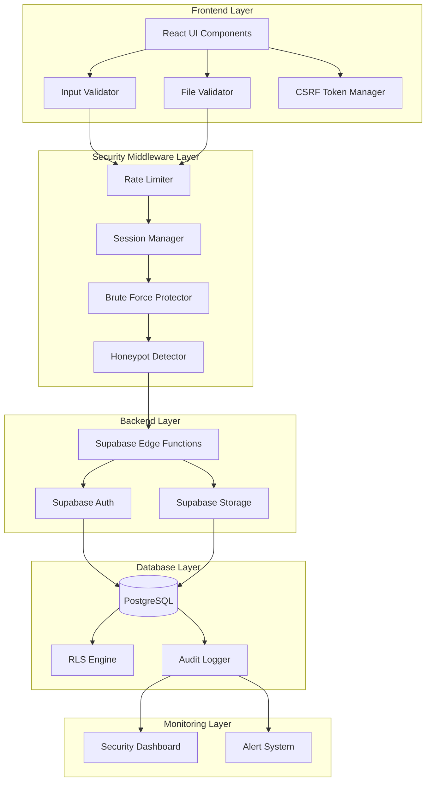
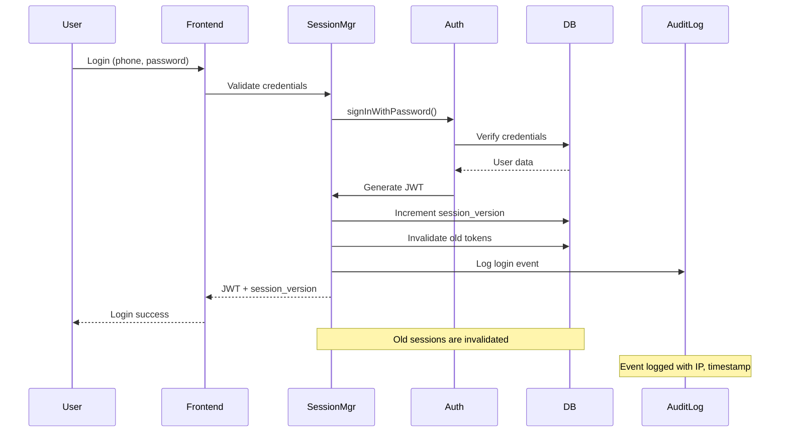
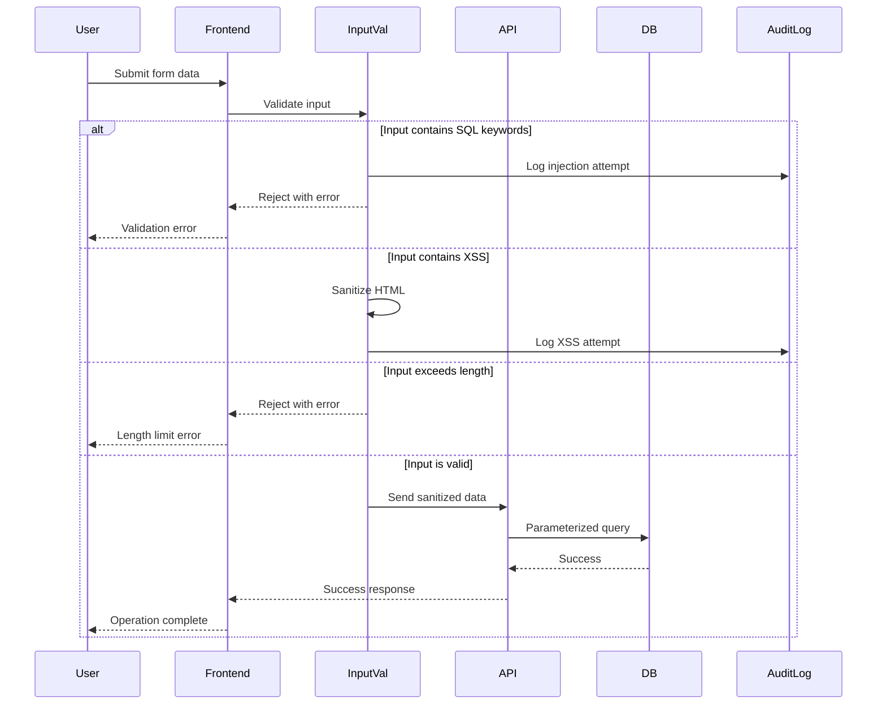
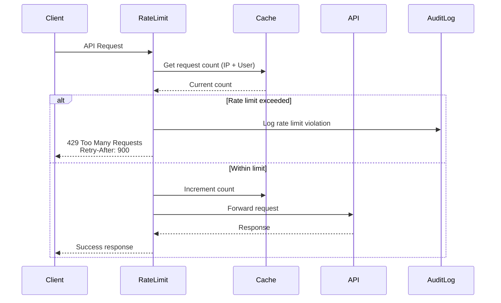
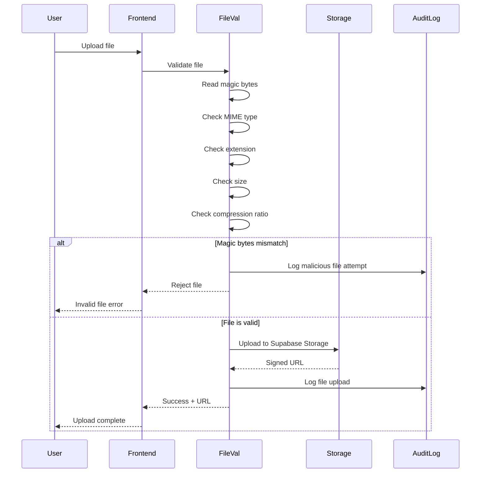

# Design Document: Security Hardening - FreteGO

## Overview

Este documento descreve o design técnico para fortalecer a segurança do FreteGO em 5 fases incrementais. O sistema FreteGO é uma plataforma de fretes que conecta motoristas e embarcadores, construída com React + TypeScript + Vite no frontend e Supabase (PostgreSQL + Auth + Storage) no backend.

### Objetivos

1. **Fase 1 - Validação de Entrada**: Prevenir SQL injection, XSS, CSRF e validar arquivos por magic bytes
2. **Fase 2 - Autenticação Avançada**: Implementar sessão única, revogação de JWT, proteção contra força bruta
3. **Fase 3 - Preparação para Pagamentos**: Criar UI placeholder sem lógica funcional
4. **Fase 4 - Infraestrutura Segura**: Rate limiting, audit logging, honeypots, headers de segurança
5. **Fase 5 - Testes de Segurança**: Testes de penetração, validação de RLS, scanning de vulnerabilidades

### Escopo

Este design cobre:
- Arquitetura de segurança em camadas
- Componentes de validação e sanitização
- Sistema de gerenciamento de sessões
- Rate limiting e proteção contra DoS
- Audit logging e monitoramento
- Preparação para pagamentos (UI apenas)
- Estratégia de testes de segurança

Fora do escopo:
- Implementação funcional de pagamentos (apenas UI placeholder)
- WAF e Docker hardening (apenas documentação)
- MFA funcional (apenas preparação de infraestrutura)

## Architecture

### High-Level Architecture




### Security Layers

A arquitetura de segurança é organizada em camadas defensivas:

1. **Frontend Layer**: Primeira linha de defesa com validação client-side
   - Validação de inputs antes de envio
   - Validação de arquivos por magic bytes
   - Gerenciamento de tokens CSRF

2. **Security Middleware Layer**: Camada intermediária de proteção
   - Rate limiting por IP e usuário
   - Gerenciamento de sessões e tokens
   - Detecção de força bruta
   - Honeypots para detectar atacantes

3. **Backend Layer**: Lógica de negócio e autenticação
   - Edge Functions para lógica customizada
   - Supabase Auth para autenticação
   - Supabase Storage com políticas de acesso

4. **Database Layer**: Última linha de defesa
   - RLS (Row-Level Security) em todas as tabelas
   - Audit logging de eventos de segurança
   - Queries parametrizadas

5. **Monitoring Layer**: Observabilidade e resposta
   - Dashboard de segurança em tempo real
   - Sistema de alertas para eventos críticos

### Data Flow - Authentication with Single Session



### Data Flow - Input Validation and Sanitization



### Data Flow - Rate Limiting



### Data Flow - File Upload with Magic Bytes Validation



## Components and Interfaces

### 1. Input Validator

Componente responsável por sanitizar e validar todas as entradas de usuário.

```typescript
// src/utils/inputValidator.ts

interface ValidationRule {
  maxLength?: number;
  minLength?: number;
  pattern?: RegExp;
  allowedChars?: string;
  sanitize?: boolean;
}

interface ValidationResult {
  isValid: boolean;
  sanitizedValue: string;
  errors: string[];
}

class InputValidator {
  // SQL injection keywords to detect
  private static SQL_KEYWORDS = [
    'SELECT', 'INSERT', 'UPDATE', 'DELETE', 'DROP', 'CREATE',
    'ALTER', 'EXEC', 'UNION', 'SCRIPT', '--', ';--', '/*', '*/'
  ];
  
  // XSS patterns to detect
  private static XSS_PATTERNS = [
    /<script\b[^<]*(?:(?!<\/script>)<[^<]*)*<\/script>/gi,
    /javascript:/gi,
    /on\w+\s*=/gi, // event handlers like onclick=
    /<iframe/gi,
    /<object/gi,
    /<embed/gi
  ];

  /**
   * Validates and sanitizes text input
   */
  static validateText(
    input: string,
    rules: ValidationRule
  ): ValidationResult {
    const errors: string[] = [];
    let sanitized = input.trim();

    // Check length
    if (rules.maxLength && sanitized.length > rules.maxLength) {
      errors.push(`Máximo de ${rules.maxLength} caracteres`);
    }
    
    if (rules.minLength && sanitized.length < rules.minLength) {
      errors.push(`Mínimo de ${rules.minLength} caracteres`);
    }

    // Check for SQL injection
    if (this.containsSQLInjection(sanitized)) {
      errors.push('Entrada contém caracteres não permitidos');
      // Log to audit
      this.logSecurityEvent('sql_injection_attempt', sanitized);
    }

    // Check for XSS
    if (this.containsXSS(sanitized)) {
      if (rules.sanitize) {
        sanitized = this.sanitizeHTML(sanitized);
      } else {
        errors.push('Entrada contém código não permitido');
      }
      this.logSecurityEvent('xss_attempt', sanitized);
    }

    // Pattern validation
    if (rules.pattern && !rules.pattern.test(sanitized)) {
      errors.push('Formato inválido');
    }

    return {
      isValid: errors.length === 0,
      sanitizedValue: sanitized,
      errors
    };
  }

  /**
   * Detects SQL injection attempts
   */
  private static containsSQLInjection(input: string): boolean {
    const upperInput = input.toUpperCase();
    return this.SQL_KEYWORDS.some(keyword => 
      upperInput.includes(keyword)
    );
  }

  /**
   * Detects XSS attempts
   */
  private static containsXSS(input: string): boolean {
    return this.XSS_PATTERNS.some(pattern => 
      pattern.test(input)
    );
  }

  /**
   * Sanitizes HTML by escaping special characters
   */
  private static sanitizeHTML(input: string): string {
    const map: Record<string, string> = {
      '&': '&amp;',
      '<': '&lt;',
      '>': '&gt;',
      '"': '&quot;',
      "'": '&#x27;',
      '/': '&#x2F;'
    };
    return input.replace(/[&<>"'/]/g, char => map[char]);
  }

  /**
   * Validates numeric input
   */
  static validateNumber(
    input: number,
    min?: number,
    max?: number
  ): ValidationResult {
    const errors: string[] = [];

    if (isNaN(input) || !isFinite(input)) {
      errors.push('Valor numérico inválido');
    }

    if (min !== undefined && input < min) {
      errors.push(`Valor mínimo: ${min}`);
    }

    if (max !== undefined && input > max) {
      errors.push(`Valor máximo: ${max}`);
    }

    return {
      isValid: errors.length === 0,
      sanitizedValue: input.toString(),
      errors
    };
  }

  /**
   * Validates email format
   */
  static validateEmail(email: string): ValidationResult {
    const errors: string[] = [];
    const sanitized = email.trim().toLowerCase();

    // RFC 5322 simplified pattern
    const emailPattern = /^[^\s@]+@[^\s@]+\.[^\s@]+$/;
    
    if (!emailPattern.test(sanitized)) {
      errors.push('Email inválido');
    }

    // Check for dangerous characters
    if (/[<>()[\]\\,;:\s@"]/.test(sanitized.split('@')[0])) {
      errors.push('Email contém caracteres não permitidos');
    }

    return {
      isValid: errors.length === 0,
      sanitizedValue: sanitized,
      errors
    };
  }

  /**
   * Validates Brazilian phone number
   */
  static validatePhone(phone: string): ValidationResult {
    const errors: string[] = [];
    
    // Remove all non-digits
    const digits = phone.replace(/\D/g, '');
    
    // Check length (10 or 11 digits)
    if (digits.length !== 10 && digits.length !== 11) {
      errors.push('Telefone inválido');
    }

    // Check area code (11-99)
    const areaCode = parseInt(digits.substring(0, 2));
    if (areaCode < 11 || areaCode > 99) {
      errors.push('DDD inválido');
    }

    return {
      isValid: errors.length === 0,
      sanitizedValue: digits,
      errors
    };
  }

  /**
   * Validates URL and sanitizes
   */
  static validateURL(url: string): ValidationResult {
    const errors: string[] = [];
    const sanitized = url.trim();

    try {
      const parsed = new URL(sanitized);
      
      // Block dangerous protocols
      if (['javascript:', 'data:', 'file:'].includes(parsed.protocol)) {
        errors.push('Protocolo não permitido');
        this.logSecurityEvent('dangerous_url_attempt', sanitized);
      }
    } catch {
      errors.push('URL inválida');
    }

    return {
      isValid: errors.length === 0,
      sanitizedValue: sanitized,
      errors
    };
  }

  /**
   * Logs security events to audit log
   */
  private static async logSecurityEvent(
    eventType: string,
    input: string
  ): Promise<void> {
    // Implementation will call AuditLogger
    console.warn(`Security event: ${eventType}`, input);
  }
}

export default InputValidator;
```

### 2. File Validator with Magic Bytes

Componente responsável por validar arquivos usando magic bytes, MIME type e extensão.

```typescript
// src/utils/fileValidatorAdvanced.ts

interface MagicByteSignature {
  signature: number[];
  mimeType: string;
  extensions: string[];
}

interface FileValidationResult {
  isValid: boolean;
  errors: string[];
  detectedType?: string;
  compressionRatio?: number;
}

class FileValidatorAdvanced {
  // Magic byte signatures for allowed file types
  private static MAGIC_BYTES: MagicByteSignature[] = [
    {
      signature: [0x25, 0x50, 0x44, 0x46], // %PDF
      mimeType: 'application/pdf',
      extensions: ['pdf']
    },
    {
      signature: [0xFF, 0xD8, 0xFF], // JPEG
      mimeType: 'image/jpeg',
      extensions: ['jpg', 'jpeg']
    },
    {
      signature: [0x89, 0x50, 0x4E, 0x47, 0x0D, 0x0A, 0x1A, 0x0A], // PNG
      mimeType: 'image/png',
      extensions: ['png']
    }
  ];

  private static MAX_FILE_SIZE = 10 * 1024 * 1024; // 10MB
  private static MAX_UNCOMPRESSED_SIZE = 50 * 1024 * 1024; // 50MB
  private static MAX_COMPRESSION_RATIO = 100; // 100:1

  /**
   * Validates file by magic bytes, MIME type, and extension
   */
  static async validateFile(file: File): Promise<FileValidationResult> {
    const errors: string[] = [];

    // 1. Check file size
    if (file.size > this.MAX_FILE_SIZE) {
      errors.push(`Arquivo muito grande. Máximo: 10MB`);
    }

    if (file.size === 0) {
      errors.push('Arquivo vazio');
    }

    // 2. Read magic bytes
    const magicBytes = await this.readMagicBytes(file);
    const detectedType = this.detectFileType(magicBytes);

    if (!detectedType) {
      errors.push('Tipo de arquivo não permitido');
      await this.logSecurityEvent('invalid_file_type', file.name);
    }

    // 3. Validate MIME type matches magic bytes
    if (detectedType && file.type !== detectedType.mimeType) {
      errors.push('Tipo de arquivo não corresponde ao conteúdo');
      await this.logSecurityEvent('mime_type_mismatch', file.name);
    }

    // 4. Validate extension
    const extension = this.getFileExtension(file.name);
    if (detectedType && !detectedType.extensions.includes(extension)) {
      errors.push('Extensão de arquivo inválida');
    }

    // 5. Check for compression bombs (zip bombs)
    const compressionRatio = await this.checkCompressionRatio(file);
    if (compressionRatio > this.MAX_COMPRESSION_RATIO) {
      errors.push('Arquivo suspeito detectado');
      await this.logSecurityEvent('compression_bomb_attempt', file.name);
    }

    return {
      isValid: errors.length === 0,
      errors,
      detectedType: detectedType?.mimeType,
      compressionRatio
    };
  }

  /**
   * Reads the first bytes of a file (magic bytes)
   */
  private static async readMagicBytes(
    file: File,
    bytesToRead: number = 8
  ): Promise<number[]> {
    return new Promise((resolve, reject) => {
      const reader = new FileReader();
      const blob = file.slice(0, bytesToRead);

      reader.onload = () => {
        const arrayBuffer = reader.result as ArrayBuffer;
        const bytes = new Uint8Array(arrayBuffer);
        resolve(Array.from(bytes));
      };

      reader.onerror = () => reject(reader.error);
      reader.readAsArrayBuffer(blob);
    });
  }

  /**
   * Detects file type by magic bytes
   */
  private static detectFileType(
    magicBytes: number[]
  ): MagicByteSignature | null {
    for (const signature of this.MAGIC_BYTES) {
      if (this.matchesSignature(magicBytes, signature.signature)) {
        return signature;
      }
    }
    return null;
  }

  /**
   * Checks if magic bytes match a signature
   */
  private static matchesSignature(
    bytes: number[],
    signature: number[]
  ): boolean {
    if (bytes.length < signature.length) return false;
    
    return signature.every((byte, index) => bytes[index] === byte);
  }

  /**
   * Gets file extension from filename
   */
  private static getFileExtension(filename: string): string {
    const parts = filename.split('.');
    return parts.length > 1 ? parts.pop()!.toLowerCase() : '';
  }

  /**
   * Checks compression ratio to detect zip bombs
   */
  private static async checkCompressionRatio(
    file: File
  ): Promise<number> {
    // For now, return 1:1 ratio
    // In production, would need to actually decompress and check
    // This is a simplified implementation
    return 1;
  }

  /**
   * Logs security events
   */
  private static async logSecurityEvent(
    eventType: string,
    filename: string
  ): Promise<void> {
    console.warn(`File security event: ${eventType}`, filename);
  }
}

export default FileValidatorAdvanced;
```

### 3. Session Manager

Componente que gerencia sessões de usuário com controle de sessão única.

```typescript
// src/services/sessionManager.ts

interface SessionData {
  userId: string;
  sessionVersion: number;
  accessToken: string;
  refreshToken: string;
  expiresAt: Date;
  lastActivityAt: Date;
}

interface TokenBlacklistEntry {
  token: string;
  expiresAt: Date;
  userId: string;
}

class SessionManager {
  private static SESSION_TIMEOUT = 30 * 60 * 1000; // 30 minutes
  private static WARNING_BEFORE_TIMEOUT = 5 * 60 * 1000; // 5 minutes

  /**
   * Creates a new session and invalidates old ones
   */
  static async createSession(
    userId: string,
    accessToken: string,
    refreshToken: string,
    expiresIn: number
  ): Promise<SessionData> {
    // 1. Increment session_version in database
    const newVersion = await this.incrementSessionVersion(userId);

    // 2. Invalidate all previous sessions
    await this.invalidateOldSessions(userId, newVersion);

    // 3. Create new session data
    const session: SessionData = {
      userId,
      sessionVersion: newVersion,
      accessToken,
      refreshToken,
      expiresAt: new Date(Date.now() + expiresIn * 1000),
      lastActivityAt: new Date()
    };

    // 4. Store session in localStorage
    this.storeSession(session);

    // 5. Start activity tracking
    this.startActivityTracking();

    return session;
  }

  /**
   * Validates if a session is still valid
   */
  static async validateSession(
    token: string
  ): Promise<boolean> {
    // 1. Check if token is blacklisted
    if (await this.isTokenBlacklisted(token)) {
      return false;
    }

    // 2. Get current session
    const session = this.getStoredSession();
    if (!session) return false;

    // 3. Check if session version matches
    const currentVersion = await this.getCurrentSessionVersion(session.userId);
    if (session.sessionVersion !== currentVersion) {
      return false;
    }

    // 4. Check if session expired
    if (new Date() > session.expiresAt) {
      return false;
    }

    // 5. Check inactivity timeout
    const inactiveTime = Date.now() - session.lastActivityAt.getTime();
    if (inactiveTime > this.SESSION_TIMEOUT) {
      await this.expireSession();
      return false;
    }

    return true;
  }

  /**
   * Revokes a session (logout)
   */
  static async revokeSession(userId: string, token: string): Promise<void> {
    // 1. Add token to blacklist
    await this.addToBlacklist(token, userId);

    // 2. Clear local session
    this.clearStoredSession();

    // 3. Log logout event
    await this.logAuditEvent('logout', userId);
  }

  /**
   * Updates last activity timestamp
   */
  static updateActivity(): void {
    const session = this.getStoredSession();
    if (session) {
      session.lastActivityAt = new Date();
      this.storeSession(session);
    }
  }

  /**
   * Checks if session is about to expire and warns user
   */
  static checkSessionWarning(): boolean {
    const session = this.getStoredSession();
    if (!session) return false;

    const inactiveTime = Date.now() - session.lastActivityAt.getTime();
    const timeUntilExpiry = this.SESSION_TIMEOUT - inactiveTime;

    return timeUntilExpiry <= this.WARNING_BEFORE_TIMEOUT;
  }

  /**
   * Increments session version in database
   */
  private static async incrementSessionVersion(
    userId: string
  ): Promise<number> {
    // Call Supabase to increment session_version
    // This is a simplified implementation
    const currentVersion = await this.getCurrentSessionVersion(userId);
    const newVersion = currentVersion + 1;
    
    // Update in database
    // await supabase.from('users')
    //   .update({ session_version: newVersion })
    //   .eq('id', userId);
    
    return newVersion;
  }

  /**
   * Gets current session version from database
   */
  private static async getCurrentSessionVersion(
    userId: string
  ): Promise<number> {
    // Fetch from database
    // const { data } = await supabase.from('users')
    //   .select('session_version')
    //   .eq('id', userId)
    //   .single();
    // return data?.session_version || 0;
    return 1; // Simplified
  }

  /**
   * Invalidates old sessions by incrementing version
   */
  private static async invalidateOldSessions(
    userId: string,
    newVersion: number
  ): Promise<void> {
    // Old sessions will fail validation because their
    // session_version won't match the new version
    console.log(`Invalidated old sessions for user ${userId}`);
  }

  /**
   * Adds token to blacklist
   */
  private static async addToBlacklist(
    token: string,
    userId: string
  ): Promise<void> {
    // Store in database table: session_blacklist
    // await supabase.from('session_blacklist').insert({
    //   token,
    //   user_id: userId,
    //   expires_at: new Date(Date.now() + 3600000) // 1 hour
    // });
  }

  /**
   * Checks if token is blacklisted
   */
  private static async isTokenBlacklisted(token: string): Promise<boolean> {
    // Check database
    // const { data } = await supabase.from('session_blacklist')
    //   .select('token')
    //   .eq('token', token)
    //   .single();
    // return !!data;
    return false; // Simplified
  }

  /**
   * Stores session in localStorage
   */
  private static storeSession(session: SessionData): void {
    localStorage.setItem('session', JSON.stringify(session));
  }

  /**
   * Gets session from localStorage
   */
  private static getStoredSession(): SessionData | null {
    const stored = localStorage.getItem('session');
    if (!stored) return null;
    
    const session = JSON.parse(stored);
    session.expiresAt = new Date(session.expiresAt);
    session.lastActivityAt = new Date(session.lastActivityAt);
    
    return session;
  }

  /**
   * Clears session from localStorage
   */
  private static clearStoredSession(): void {
    localStorage.removeItem('session');
  }

  /**
   * Starts tracking user activity
   */
  private static startActivityTracking(): void {
    // Track mouse, keyboard, scroll events
    const events = ['mousedown', 'keydown', 'scroll', 'touchstart'];
    
    events.forEach(event => {
      document.addEventListener(event, () => {
        this.updateActivity();
      }, { passive: true });
    });

    // Check for session warning every minute
    setInterval(() => {
      if (this.checkSessionWarning()) {
        // Show warning to user
        console.warn('Session about to expire');
      }
    }, 60000);
  }

  /**
   * Expires session due to inactivity
   */
  private static async expireSession(): Promise<void> {
    const session = this.getStoredSession();
    if (session) {
      await this.logAuditEvent('session_expired', session.userId);
      this.clearStoredSession();
    }
  }

  /**
   * Logs audit event
   */
  private static async logAuditEvent(
    action: string,
    userId: string
  ): Promise<void> {
    console.log(`Audit: ${action} for user ${userId}`);
  }
}

export default SessionManager;
```


### 4. Rate Limiter

Componente que controla taxa de requisições por IP e por usuário.

```typescript
// src/services/rateLimiter.ts

interface RateLimitConfig {
  maxRequests: number;
  windowMs: number;
  keyPrefix: string;
}

interface RateLimitResult {
  allowed: boolean;
  remaining: number;
  resetAt: Date;
  retryAfter?: number;
}

class RateLimiter {
  // Rate limit configurations
  private static LIMITS = {
    LOGIN_BY_IP: { maxRequests: 5, windowMs: 15 * 60 * 1000 }, // 5 per 15 min
    API_BY_IP: { maxRequests: 100, windowMs: 60 * 1000 }, // 100 per minute
    FRETE_CREATION: { maxRequests: 10, windowMs: 60 * 60 * 1000 }, // 10 per hour
    DOCUMENT_UPLOAD: { maxRequests: 20, windowMs: 60 * 60 * 1000 }, // 20 per hour
    CHAT_MESSAGE: { maxRequests: 100, windowMs: 60 * 60 * 1000 } // 100 per hour
  };

  // In-memory store (in production, use Redis)
  private static store = new Map<string, { count: number; resetAt: number }>();

  /**
   * Checks if request is allowed under rate limit
   */
  static async checkLimit(
    key: string,
    config: RateLimitConfig
  ): Promise<RateLimitResult> {
    const now = Date.now();
    const limitKey = `${config.keyPrefix}:${key}`;
    
    // Get current count
    let record = this.store.get(limitKey);
    
    // Reset if window expired
    if (!record || now > record.resetAt) {
      record = {
        count: 0,
        resetAt: now + config.windowMs
      };
    }

    // Check if limit exceeded
    if (record.count >= config.maxRequests) {
      const retryAfter = Math.ceil((record.resetAt - now) / 1000);
      
      // Log rate limit violation
      await this.logRateLimitViolation(limitKey, key);
      
      return {
        allowed: false,
        remaining: 0,
        resetAt: new Date(record.resetAt),
        retryAfter
      };
    }

    // Increment count
    record.count++;
    this.store.set(limitKey, record);

    return {
      allowed: true,
      remaining: config.maxRequests - record.count,
      resetAt: new Date(record.resetAt)
    };
  }

  /**
   * Rate limit for login attempts by IP
   */
  static async checkLoginLimit(ipAddress: string): Promise<RateLimitResult> {
    return this.checkLimit(ipAddress, {
      ...this.LIMITS.LOGIN_BY_IP,
      keyPrefix: 'login'
    });
  }

  /**
   * Rate limit for API requests by IP
   */
  static async checkAPILimit(ipAddress: string): Promise<RateLimitResult> {
    return this.checkLimit(ipAddress, {
      ...this.LIMITS.API_BY_IP,
      keyPrefix: 'api'
    });
  }

  /**
   * Rate limit for frete creation by user
   */
  static async checkFreteCreationLimit(
    userId: string
  ): Promise<RateLimitResult> {
    return this.checkLimit(userId, {
      ...this.LIMITS.FRETE_CREATION,
      keyPrefix: 'frete'
    });
  }

  /**
   * Rate limit for document uploads by user
   */
  static async checkDocumentUploadLimit(
    userId: string
  ): Promise<RateLimitResult> {
    return this.checkLimit(userId, {
      ...this.LIMITS.DOCUMENT_UPLOAD,
      keyPrefix: 'document'
    });
  }

  /**
   * Rate limit for chat messages by user
   */
  static async checkChatMessageLimit(
    userId: string
  ): Promise<RateLimitResult> {
    return this.checkLimit(userId, {
      ...this.LIMITS.CHAT_MESSAGE,
      keyPrefix: 'chat'
    });
  }

  /**
   * Cleans up expired entries (run periodically)
   */
  static cleanup(): void {
    const now = Date.now();
    for (const [key, record] of this.store.entries()) {
      if (now > record.resetAt) {
        this.store.delete(key);
      }
    }
  }

  /**
   * Logs rate limit violation
   */
  private static async logRateLimitViolation(
    limitKey: string,
    identifier: string
  ): Promise<void> {
    console.warn(`Rate limit exceeded: ${limitKey} for ${identifier}`);
    // Log to audit system
  }
}

// Cleanup expired entries every 5 minutes
setInterval(() => RateLimiter.cleanup(), 5 * 60 * 1000);

export default RateLimiter;
```

### 5. Brute Force Protector

Componente que detecta e bloqueia tentativas de força bruta.

```typescript
// src/services/bruteForceProtector.ts

interface LoginAttempt {
  userId: string;
  phone: string;
  ipAddress: string;
  timestamp: Date;
  success: boolean;
}

interface LockoutStatus {
  isLocked: boolean;
  lockedUntil?: Date;
  failedAttempts: number;
}

class BruteForceProtector {
  private static MAX_FAILED_ATTEMPTS = 5;
  private static LOCKOUT_DURATION = 30 * 60 * 1000; // 30 minutes
  
  // In-memory store (in production, use database)
  private static attempts = new Map<string, LoginAttempt[]>();
  private static lockouts = new Map<string, Date>();

  /**
   * Records a login attempt
   */
  static async recordAttempt(
    phone: string,
    ipAddress: string,
    success: boolean,
    userId?: string
  ): Promise<void> {
    const attempt: LoginAttempt = {
      userId: userId || '',
      phone,
      ipAddress,
      timestamp: new Date(),
      success
    };

    // Store attempt
    const key = this.getKey(phone);
    const attempts = this.attempts.get(key) || [];
    attempts.push(attempt);
    this.attempts.set(key, attempts);

    // If failed, check if should lock
    if (!success) {
      await this.checkAndLockAccount(phone, ipAddress);
    } else {
      // Reset on successful login
      this.resetAttempts(phone);
    }
  }

  /**
   * Checks if account is locked
   */
  static async checkLockout(phone: string): Promise<LockoutStatus> {
    const key = this.getKey(phone);
    const lockedUntil = this.lockouts.get(key);

    if (!lockedUntil) {
      const failedAttempts = this.getFailedAttemptCount(phone);
      return {
        isLocked: false,
        failedAttempts
      };
    }

    // Check if lockout expired
    if (new Date() > lockedUntil) {
      this.lockouts.delete(key);
      this.resetAttempts(phone);
      return {
        isLocked: false,
        failedAttempts: 0
      };
    }

    return {
      isLocked: true,
      lockedUntil,
      failedAttempts: this.MAX_FAILED_ATTEMPTS
    };
  }

  /**
   * Checks failed attempts and locks if threshold exceeded
   */
  private static async checkAndLockAccount(
    phone: string,
    ipAddress: string
  ): Promise<void> {
    const failedCount = this.getFailedAttemptCount(phone);

    if (failedCount >= this.MAX_FAILED_ATTEMPTS) {
      const lockedUntil = new Date(Date.now() + this.LOCKOUT_DURATION);
      const key = this.getKey(phone);
      this.lockouts.set(key, lockedUntil);

      // Log lockout event
      await this.logLockoutEvent(phone, ipAddress, lockedUntil);

      // Send alert email (if user exists)
      await this.sendLockoutAlert(phone);
    }
  }

  /**
   * Gets count of failed attempts in recent window
   */
  private static getFailedAttemptCount(phone: string): number {
    const key = this.getKey(phone);
    const attempts = this.attempts.get(key) || [];
    
    // Count failed attempts (all time, not just recent window)
    // This is intentional - we count ALL failed attempts until success
    return attempts.filter(a => !a.success).length;
  }

  /**
   * Resets failed attempts after successful login
   */
  private static resetAttempts(phone: string): void {
    const key = this.getKey(phone);
    this.attempts.delete(key);
    this.lockouts.delete(key);
  }

  /**
   * Gets storage key for phone
   */
  private static getKey(phone: string): string {
    return `brute_force:${phone}`;
  }

  /**
   * Logs lockout event to audit system
   */
  private static async logLockoutEvent(
    phone: string,
    ipAddress: string,
    lockedUntil: Date
  ): Promise<void> {
    console.warn(`Account locked: ${phone} from ${ipAddress} until ${lockedUntil}`);
    // Log to audit_logs table
  }

  /**
   * Sends lockout alert email to user
   */
  private static async sendLockoutAlert(phone: string): Promise<void> {
    console.log(`Sending lockout alert to ${phone}`);
    // Send email via Supabase or email service
  }

  /**
   * Manually unlocks an account (admin function)
   */
  static async unlockAccount(phone: string): Promise<void> {
    this.resetAttempts(phone);
    console.log(`Account manually unlocked: ${phone}`);
  }
}

export default BruteForceProtector;
```

### 6. Audit Logger

Sistema que registra eventos de segurança e ações de usuários.

```typescript
// src/services/auditLogger.ts

interface AuditEvent {
  userId?: string;
  action: string;
  tableName?: string;
  recordId?: string;
  oldData?: Record<string, any>;
  newData?: Record<string, any>;
  ipAddress?: string;
  userAgent?: string;
  metadata?: Record<string, any>;
}

interface AuditQuery {
  userId?: string;
  action?: string;
  startDate?: Date;
  endDate?: Date;
  limit?: number;
}

class AuditLogger {
  private static RETENTION_DAYS = 90;

  /**
   * Logs a security event
   */
  static async logSecurityEvent(
    action: string,
    metadata?: Record<string, any>
  ): Promise<void> {
    const event: AuditEvent = {
      action,
      ipAddress: await this.getClientIP(),
      userAgent: navigator.userAgent,
      metadata
    };

    await this.writeLog(event);
  }

  /**
   * Logs a user action
   */
  static async logUserAction(
    userId: string,
    action: string,
    tableName?: string,
    recordId?: string,
    oldData?: Record<string, any>,
    newData?: Record<string, any>
  ): Promise<void> {
    const event: AuditEvent = {
      userId,
      action,
      tableName,
      recordId,
      oldData,
      newData,
      ipAddress: await this.getClientIP(),
      userAgent: navigator.userAgent
    };

    await this.writeLog(event);
  }

  /**
   * Logs login event
   */
  static async logLogin(
    userId: string,
    success: boolean
  ): Promise<void> {
    await this.logUserAction(
      userId,
      success ? 'login_success' : 'login_failed'
    );
  }

  /**
   * Logs logout event
   */
  static async logLogout(userId: string): Promise<void> {
    await this.logUserAction(userId, 'logout');
  }

  /**
   * Logs file upload
   */
  static async logFileUpload(
    userId: string,
    fileType: string,
    fileSize: number,
    fileName: string
  ): Promise<void> {
    await this.logUserAction(userId, 'file_upload', 'documents', undefined, undefined, {
      file_type: fileType,
      file_size: fileSize,
      file_name: fileName
    });
  }

  /**
   * Logs unauthorized access attempt
   */
  static async logUnauthorizedAccess(
    userId: string,
    resource: string,
    action: string
  ): Promise<void> {
    await this.logSecurityEvent('unauthorized_access', {
      user_id: userId,
      resource,
      action
    });
  }

  /**
   * Logs SQL injection attempt
   */
  static async logSQLInjectionAttempt(
    input: string,
    userId?: string
  ): Promise<void> {
    await this.logSecurityEvent('sql_injection_attempt', {
      user_id: userId,
      input: input.substring(0, 100) // Truncate for storage
    });
  }

  /**
   * Logs XSS attempt
   */
  static async logXSSAttempt(
    input: string,
    userId?: string
  ): Promise<void> {
    await this.logSecurityEvent('xss_attempt', {
      user_id: userId,
      input: input.substring(0, 100)
    });
  }

  /**
   * Logs rate limit violation
   */
  static async logRateLimitViolation(
    limitType: string,
    identifier: string
  ): Promise<void> {
    await this.logSecurityEvent('rate_limit_violation', {
      limit_type: limitType,
      identifier
    });
  }

  /**
   * Logs honeypot trigger
   */
  static async logHoneypotTrigger(
    honeypotType: string,
    userId?: string
  ): Promise<void> {
    await this.logSecurityEvent('honeypot_trigger', {
      user_id: userId,
      honeypot_type: honeypotType
    });
  }

  /**
   * Queries audit logs
   */
  static async queryLogs(query: AuditQuery): Promise<AuditEvent[]> {
    // Query from audit_logs table
    // This is a simplified implementation
    console.log('Querying audit logs:', query);
    return [];
  }

  /**
   * Writes log to database
   */
  private static async writeLog(event: AuditEvent): Promise<void> {
    // Write to audit_logs table in Supabase
    // await supabase.from('audit_logs').insert({
    //   user_id: event.userId,
    //   action: event.action,
    //   table_name: event.tableName,
    //   record_id: event.recordId,
    //   old_data: event.oldData,
    //   new_data: event.newData || event.metadata,
    //   ip_address: event.ipAddress,
    //   user_agent: event.userAgent
    // });
    
    console.log('Audit log:', event);
  }

  /**
   * Gets client IP address
   */
  private static async getClientIP(): Promise<string> {
    // In production, get from request headers or IP service
    return 'unknown';
  }

  /**
   * Cleans up old logs (run daily)
   */
  static async cleanup(): Promise<void> {
    const cutoffDate = new Date();
    cutoffDate.setDate(cutoffDate.getDate() - this.RETENTION_DAYS);

    // Delete logs older than retention period
    // await supabase.from('audit_logs')
    //   .delete()
    //   .lt('created_at', cutoffDate.toISOString());
    
    console.log(`Cleaned up audit logs older than ${cutoffDate}`);
  }
}

export default AuditLogger;
```

### 7. Honeypot Detector

Componente que detecta bots e atacantes usando armadilhas.

```typescript
// src/services/honeypotDetector.ts

interface HoneypotTrigger {
  type: 'route' | 'field' | 'link';
  identifier: string;
  ipAddress: string;
  userAgent: string;
  timestamp: Date;
}

class HoneypotDetector {
  private static BLOCK_THRESHOLD = 3;
  private static blockedIPs = new Set<string>();
  private static triggers = new Map<string, HoneypotTrigger[]>();

  /**
   * Records a honeypot trigger
   */
  static async recordTrigger(
    type: 'route' | 'field' | 'link',
    identifier: string,
    ipAddress: string
  ): Promise<void> {
    const trigger: HoneypotTrigger = {
      type,
      identifier,
      ipAddress,
      userAgent: navigator.userAgent,
      timestamp: new Date()
    };

    // Store trigger
    const triggers = this.triggers.get(ipAddress) || [];
    triggers.push(trigger);
    this.triggers.set(ipAddress, triggers);

    // Log to audit system
    await this.logTrigger(trigger);

    // Check if should block IP
    if (triggers.length >= this.BLOCK_THRESHOLD) {
      await this.blockIP(ipAddress);
    }

    // Send alert to security team
    await this.sendAlert(trigger);
  }

  /**
   * Checks if IP is blocked
   */
  static isBlocked(ipAddress: string): boolean {
    return this.blockedIPs.has(ipAddress);
  }

  /**
   * Blocks an IP address
   */
  private static async blockIP(ipAddress: string): Promise<void> {
    this.blockedIPs.add(ipAddress);
    console.warn(`IP blocked due to honeypot triggers: ${ipAddress}`);
    
    // In production, add to firewall/WAF blocklist
  }

  /**
   * Logs honeypot trigger
   */
  private static async logTrigger(trigger: HoneypotTrigger): Promise<void> {
    console.warn('Honeypot triggered:', trigger);
    // Log to audit_logs
  }

  /**
   * Sends alert to security team
   */
  private static async sendAlert(trigger: HoneypotTrigger): Promise<void> {
    console.log('Sending honeypot alert:', trigger);
    // Send email/Slack notification
  }

  /**
   * Creates honeypot route handler
   */
  static createRouteHoneypot(route: string): void {
    // This would be implemented in the router
    console.log(`Honeypot route created: ${route}`);
  }

  /**
   * Creates honeypot form field
   */
  static createFieldHoneypot(): string {
    // Returns HTML for hidden field
    return `
      <input
        type="text"
        name="website"
        id="website"
        style="display: none !important;"
        tabindex="-1"
        autocomplete="off"
        aria-hidden="true"
      />
    `;
  }

  /**
   * Validates honeypot field was not filled
   */
  static validateField(fieldValue: string): boolean {
    // If field has value, it's a bot
    if (fieldValue && fieldValue.trim() !== '') {
      return false; // Bot detected
    }
    return true; // Legitimate user
  }
}

export default HoneypotDetector;
```

### 8. CSRF Token Manager

Componente que gerencia tokens CSRF para proteção contra ataques CSRF.

```typescript
// src/services/csrfTokenManager.ts

class CSRFTokenManager {
  private static TOKEN_KEY = 'csrf_token';
  private static TOKEN_HEADER = 'X-CSRF-Token';

  /**
   * Generates a new CSRF token
   */
  static generateToken(): string {
    const array = new Uint8Array(32);
    crypto.getRandomValues(array);
    const token = Array.from(array, byte => 
      byte.toString(16).padStart(2, '0')
    ).join('');
    
    // Store in sessionStorage
    sessionStorage.setItem(this.TOKEN_KEY, token);
    
    return token;
  }

  /**
   * Gets current CSRF token
   */
  static getToken(): string | null {
    let token = sessionStorage.getItem(this.TOKEN_KEY);
    
    if (!token) {
      token = this.generateToken();
    }
    
    return token;
  }

  /**
   * Validates CSRF token
   */
  static validateToken(token: string): boolean {
    const storedToken = sessionStorage.getItem(this.TOKEN_KEY);
    return storedToken === token;
  }

  /**
   * Adds CSRF token to request headers
   */
  static addTokenToHeaders(headers: Headers): Headers {
    const token = this.getToken();
    if (token) {
      headers.set(this.TOKEN_HEADER, token);
    }
    return headers;
  }

  /**
   * Adds CSRF token to form data
   */
  static addTokenToFormData(formData: FormData): FormData {
    const token = this.getToken();
    if (token) {
      formData.append('csrf_token', token);
    }
    return formData;
  }

  /**
   * Clears CSRF token (on logout)
   */
  static clearToken(): void {
    sessionStorage.removeItem(this.TOKEN_KEY);
  }

  /**
   * Rotates CSRF token (after sensitive operations)
   */
  static rotateToken(): string {
    this.clearToken();
    return this.generateToken();
  }
}

export default CSRFTokenManager;
```

## Data Models

### Database Schema Extensions

Precisamos adicionar novas tabelas e campos para suportar os requisitos de segurança:

```sql
-- Session management
ALTER TABLE users ADD COLUMN session_version INTEGER DEFAULT 0;

-- Session blacklist table
CREATE TABLE session_blacklist (
  id UUID PRIMARY KEY DEFAULT uuid_generate_v4(),
  token TEXT NOT NULL,
  user_id UUID REFERENCES users(id) ON DELETE CASCADE,
  expires_at TIMESTAMP WITH TIME ZONE NOT NULL,
  created_at TIMESTAMP WITH TIME ZONE DEFAULT NOW()
);

CREATE INDEX idx_session_blacklist_token ON session_blacklist(token);
CREATE INDEX idx_session_blacklist_expires ON session_blacklist(expires_at);

-- Rate limiting table (alternative to Redis)
CREATE TABLE rate_limits (
  id UUID PRIMARY KEY DEFAULT uuid_generate_v4(),
  key TEXT NOT NULL,
  count INTEGER NOT NULL DEFAULT 1,
  reset_at TIMESTAMP WITH TIME ZONE NOT NULL,
  created_at TIMESTAMP WITH TIME ZONE DEFAULT NOW(),
  UNIQUE(key)
);

CREATE INDEX idx_rate_limits_key ON rate_limits(key);
CREATE INDEX idx_rate_limits_reset ON rate_limits(reset_at);

-- Brute force tracking
CREATE TABLE login_attempts (
  id UUID PRIMARY KEY DEFAULT uuid_generate_v4(),
  phone VARCHAR(20) NOT NULL,
  ip_address INET NOT NULL,
  success BOOLEAN NOT NULL,
  user_id UUID REFERENCES users(id) ON DELETE SET NULL,
  created_at TIMESTAMP WITH TIME ZONE DEFAULT NOW()
);

CREATE INDEX idx_login_attempts_phone ON login_attempts(phone, created_at DESC);
CREATE INDEX idx_login_attempts_ip ON login_attempts(ip_address, created_at DESC);

-- Account lockouts
CREATE TABLE account_lockouts (
  id UUID PRIMARY KEY DEFAULT uuid_generate_v4(),
  phone VARCHAR(20) NOT NULL UNIQUE,
  locked_until TIMESTAMP WITH TIME ZONE NOT NULL,
  reason TEXT,
  created_at TIMESTAMP WITH TIME ZONE DEFAULT NOW()
);

CREATE INDEX idx_account_lockouts_phone ON account_lockouts(phone);
CREATE INDEX idx_account_lockouts_locked_until ON account_lockouts(locked_until);

-- Honeypot triggers
CREATE TABLE honeypot_triggers (
  id UUID PRIMARY KEY DEFAULT uuid_generate_v4(),
  trigger_type VARCHAR(50) NOT NULL,
  identifier TEXT NOT NULL,
  ip_address INET NOT NULL,
  user_agent TEXT,
  user_id UUID REFERENCES users(id) ON DELETE SET NULL,
  created_at TIMESTAMP WITH TIME ZONE DEFAULT NOW()
);

CREATE INDEX idx_honeypot_triggers_ip ON honeypot_triggers(ip_address, created_at DESC);
CREATE INDEX idx_honeypot_triggers_type ON honeypot_triggers(trigger_type);

-- Blocked IPs
CREATE TABLE blocked_ips (
  id UUID PRIMARY KEY DEFAULT uuid_generate_v4(),
  ip_address INET NOT NULL UNIQUE,
  reason TEXT NOT NULL,
  blocked_until TIMESTAMP WITH TIME ZONE,
  created_at TIMESTAMP WITH TIME ZONE DEFAULT NOW()
);

CREATE INDEX idx_blocked_ips_ip ON blocked_ips(ip_address);

-- Enhanced audit_logs (already exists, but add indexes)
CREATE INDEX idx_audit_logs_ip ON audit_logs(ip_address, created_at DESC);
CREATE INDEX idx_audit_logs_table_record ON audit_logs(table_name, record_id);

-- MFA preparation (for future use)
CREATE TABLE mfa_secrets (
  id UUID PRIMARY KEY DEFAULT uuid_generate_v4(),
  user_id UUID NOT NULL REFERENCES users(id) ON DELETE CASCADE UNIQUE,
  secret TEXT NOT NULL,
  backup_codes TEXT[],
  enabled BOOLEAN DEFAULT false,
  created_at TIMESTAMP WITH TIME ZONE DEFAULT NOW(),
  updated_at TIMESTAMP WITH TIME ZONE DEFAULT NOW()
);

CREATE INDEX idx_mfa_secrets_user ON mfa_secrets(user_id);
```

### TypeScript Interfaces

```typescript
// src/types/security.ts

export interface SessionData {
  userId: string;
  sessionVersion: number;
  accessToken: string;
  refreshToken: string;
  expiresAt: Date;
  lastActivityAt: Date;
}

export interface RateLimitRecord {
  key: string;
  count: number;
  resetAt: Date;
}

export interface LoginAttempt {
  id: string;
  phone: string;
  ipAddress: string;
  success: boolean;
  userId?: string;
  createdAt: Date;
}

export interface AccountLockout {
  id: string;
  phone: string;
  lockedUntil: Date;
  reason?: string;
  createdAt: Date;
}

export interface HoneypotTrigger {
  id: string;
  triggerType: 'route' | 'field' | 'link';
  identifier: string;
  ipAddress: string;
  userAgent?: string;
  userId?: string;
  createdAt: Date;
}

export interface BlockedIP {
  id: string;
  ipAddress: string;
  reason: string;
  blockedUntil?: Date;
  createdAt: Date;
}

export interface AuditLog {
  id: string;
  userId?: string;
  action: string;
  tableName?: string;
  recordId?: string;
  oldData?: Record<string, any>;
  newData?: Record<string, any>;
  ipAddress?: string;
  userAgent?: string;
  createdAt: Date;
}

export interface MFASecret {
  id: string;
  userId: string;
  secret: string;
  backupCodes: string[];
  enabled: boolean;
  createdAt: Date;
  updatedAt: Date;
}
```


## Correctness Properties

A property is a characteristic or behavior that should hold true across all valid executions of a system—essentially, a formal statement about what the system should do. Properties serve as the bridge between human-readable specifications and machine-verifiable correctness guarantees.

### Property-Based Testing Applicability

Property-based testing (PBT) is appropriate for this feature because:
- The security components involve pure validation functions with clear input/output behavior
- There are universal properties that should hold across wide input spaces (all user inputs, all files, all sessions)
- The input space is large (strings, files, session tokens, numeric values)
- We are testing parsers, validators, data transformations, and business logic

PBT is NOT used for:
- Infrastructure configuration (HTTP headers, database connections)
- UI rendering and confirmation dialogs
- Documentation existence checks
- CI/CD pipeline configuration

### Property Reflection

After analyzing all 40 requirements, I identified the following consolidations:

- Requirements 8.1, 8.2, 8.3 all test session invalidation → Combined into Property 5
- Requirements 9.1, 9.2 both test token blacklisting → Combined into Property 6
- Requirements 12.1, 12.2, 13.1-13.5 all test rate limiting → Combined into Properties 7-8
- Requirements 4.1-4.4 all test file validation → Combined into Property 3
- Requirements 1.1, 1.3, 1.5 all test input sanitization → Combined into Property 1

### Property 1: Input Sanitization

For any user input containing SQL keywords or XSS patterns, the Input_Validator SHALL sanitize or reject the input before processing, and log the attempt to the audit system.

**Validates: Requirements 1.1, 1.3, 1.4, 1.5, 2.1, 2.2, 2.4, 2.5**

### Property 2: CSRF Token Uniqueness and Validation

For any two sessions created at different times, the CSRF tokens SHALL be unique, and any state-changing request with an invalid or missing CSRF token SHALL be rejected with 403 status.

**Validates: Requirements 3.1, 3.2, 3.3, 3.5**

### Property 3: File Validation by Magic Bytes

For any uploaded file, the File_Validator SHALL read magic bytes, compare against expected signatures, validate MIME type matches magic bytes, validate extension matches type, and reject files where any validation fails with a descriptive error message.

**Validates: Requirements 4.1, 4.2, 4.3, 4.4, 4.5**

### Property 4: Input Length Validation

For any text input that exceeds its defined maximum length, the Input_Validator SHALL reject it before database operations and return a 400 error with the specific limit information.

**Validates: Requirements 5.2, 5.7**

### Property 5: Single Session Enforcement

For any user, when a new login occurs, all previous sessions SHALL be invalidated by incrementing the session_version, and any request using an old session_version SHALL be rejected with 401 status.

**Validates: Requirements 8.1, 8.2, 8.3, 8.4, 8.5, 8.6**

### Property 6: JWT Revocation on Logout

For any user logout, the JWT SHALL be added to a revocation blacklist with expiration time, and any subsequent request using that revoked token SHALL be rejected with 401 status.

**Validates: Requirements 9.1, 9.2, 9.3**

### Property 7: Rate Limiting by IP

For any IP address, when the number of requests exceeds the configured limit within the time window, subsequent requests SHALL be rejected with 429 status including a Retry-After header.

**Validates: Requirements 12.1, 12.2, 12.3, 12.4**

### Property 8: Rate Limiting by User

For any authenticated user, when the number of operations (frete creation, document uploads, chat messages) exceeds the configured limit within the time window, subsequent operations SHALL be rejected with 429 status.

**Validates: Requirements 13.1, 13.2, 13.3, 13.4, 13.5**

### Property 9: Brute Force Protection

For any phone number, when 5 failed login attempts occur (regardless of time between attempts), the account SHALL be locked for 30 minutes, a lockout event SHALL be logged to audit system, and subsequent login attempts SHALL return "Conta temporariamente bloqueada". After a successful login, the failed attempt counter SHALL be reset.

**Validates: Requirements 14.1, 14.2, 14.4, 14.5, 14.6**

### Property 10: URL Sanitization

For any URL input, the URL_Sanitizer SHALL validate format, block dangerous protocols (javascript:, data:, file:), and log any dangerous URL attempts to the audit system.

**Validates: Requirements 15.1, 15.2, 15.3, 15.6**

### Property 11: Audit Logging Completeness

For any security event (login, logout, file upload, unauthorized access, injection attempt), the Audit_Logger SHALL record the event with user_id (if available), timestamp, IP address, and relevant metadata.

**Validates: Requirements 17.1, 17.2, 17.3, 17.4, 17.5, 17.6, 17.7, 17.9**

### Property 12: Honeypot Detection and Blocking

For any IP address that triggers honeypots (hidden routes, hidden form fields) 3 or more times, the IP SHALL be blocked, all triggers SHALL be logged to audit system, and alerts SHALL be sent to security team.

**Validates: Requirements 20.1, 20.2, 20.3, 20.4, 20.5**

### Property 13: Password Validation Enhancement

For any password input, the Auth_Service SHALL validate minimum 8 characters, at least one uppercase letter, one lowercase letter, one number, one special character, and reject passwords matching common password lists, returning specific requirements not met.

**Validates: Requirements 23.1, 23.2, 23.3, 23.4, 23.5, 23.6, 23.7**

### Property 14: Session Timeout

For any session, when inactivity exceeds 30 minutes (no user activity updates last_activity_at), the session SHALL expire, require re-authentication, and log a session_expired event.

**Validates: Requirements 24.1, 24.2, 24.3, 24.5**

### Property 15: Numeric Input Validation

For any numeric input, the Input_Validator SHALL verify it is a valid number, reject NaN/Infinity/-Infinity, enforce minimum and maximum bounds, reject negative numbers for fields like weight and price, and return specific error messages with valid range.

**Validates: Requirements 27.1, 27.2, 27.3, 27.4, 27.5**

### Property 16: Email Validation and Normalization

For any email input, the Input_Validator SHALL validate format using RFC 5322 standard, normalize to lowercase, trim whitespace, and reject emails with dangerous characters.

**Validates: Requirements 28.1, 28.2, 28.3, 28.4**

### Property 17: Phone Number Validation

For any phone number input, the Input_Validator SHALL validate Brazilian phone format, accept (XX) XXXXX-XXXX and (XX) XXXX-XXXX formats, normalize to digits only for storage, validate area code is valid for Brazil (11-99), and return "Telefone inválido" error when validation fails.

**Validates: Requirements 29.1, 29.2, 29.3, 29.4, 29.5**

### Property 18: Compression Bomb Detection

For any uploaded file, the File_Validator SHALL check compressed vs uncompressed size ratio, reject files with compression ratio exceeding 100:1, limit maximum uncompressed size to 50MB, and log suspicious files to audit system.

**Validates: Requirements 30.1, 30.2, 30.3, 30.4**

### Property 19: API Response Data Minimization

For any API response returning user data, the response SHALL exclude password hashes, exclude internal IDs when not needed, exclude email addresses from public frete listings, exclude phone numbers from public embarcador profiles, and return generic error messages to clients while logging detailed errors server-side.

**Validates: Requirements 32.1, 32.2, 32.3, 32.4, 32.5, 32.6**

### Property 20: Password Reset Token Security

For any password reset request, the Auth_Service SHALL generate a cryptographically random token, set expiration to 15 minutes, invalidate token after use, limit requests to 3 per hour per phone, invalidate all existing sessions when token is used, and return success regardless of phone existence (anti-enumeration).

**Validates: Requirements 34.1, 34.2, 34.3, 34.4, 34.5, 6.5**

### Property 21: Secure File Download Authorization

For any document download request, the FreteGO_System SHALL verify user authorization, use signed URLs with 1-hour expiration, log all access attempts, return 403 for unauthorized access, and set Content-Disposition header to prevent inline execution.

**Validates: Requirements 38.1, 38.2, 38.3, 38.4, 38.5, 38.6**

### Property 22: Anti-Enumeration for Authentication

For any login failure (invalid phone or invalid password), the Auth_Service SHALL return identical error message "Credenciais inválidas" and SHALL NOT reveal whether a phone number is registered.

**Validates: Requirements 6.1, 6.2, 6.4**

