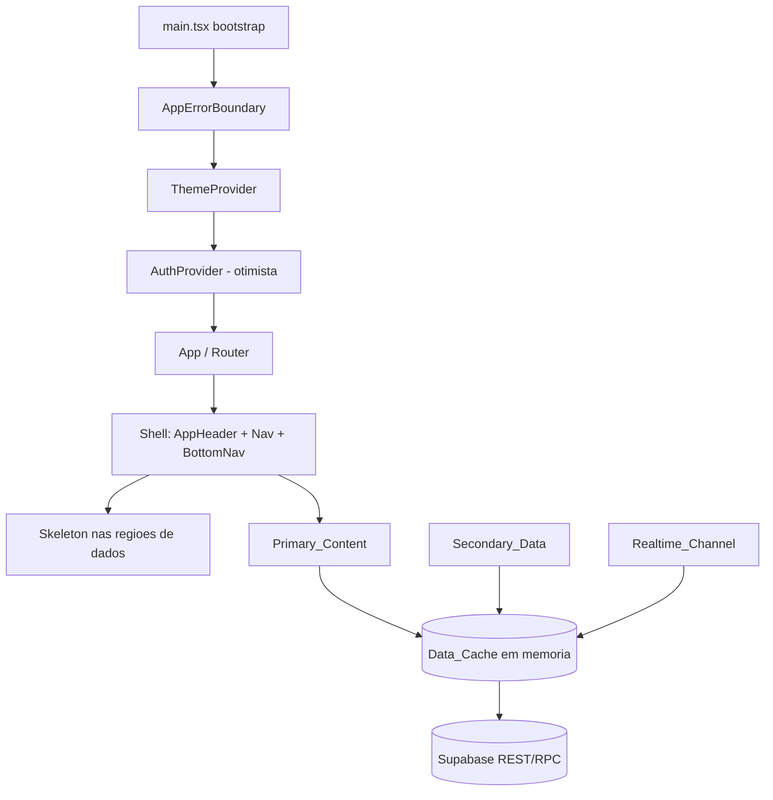
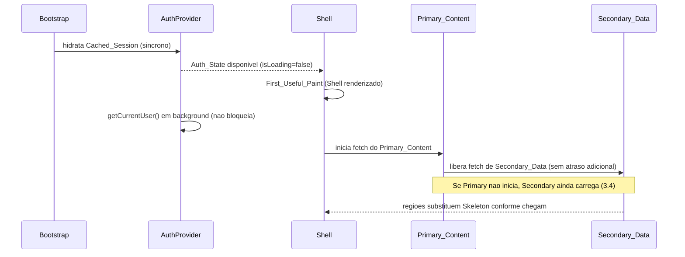
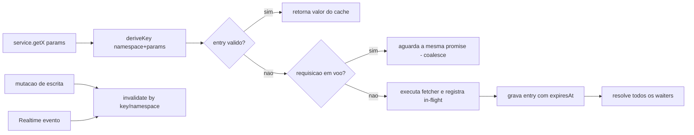

# Design Document

## Overview

Esta feature otimiza a inicialização e a percepção de velocidade do FreteGO sem alterar
nenhuma regra de negócio, fluxo, layout ou contrato de API. A estratégia se apoia em quatro
pilares, todos **incrementais e retrocompatíveis**:

1. **Auth otimista não bloqueante** — o `AuthProvider` deixa de bloquear o primeiro paint
   esperando `getCurrentUser()`. Ele hidrata o estado a partir da `Cached_Session`
   (`localStorage`) e valida a sessão em segundo plano, sem deslogar o usuário em falha de
   rede.
2. **Shell + Skeleton localizado** — a estrutura visual da tela (header, navegação, bottom
   nav) renderiza imediatamente; somente as regiões de dados exibem Skeleton, nunca a tela
   inteira.
3. **Data_Cache em memória com dedupe** — uma camada de cache opt-in, por serviço, que
   coalesce requisições concorrentes, reutiliza dados entre navegações e se mantém
   consistente com escritas e com o `Realtime_Channel`. As assinaturas públicas dos serviços
   **não mudam**.
4. **Code splitting incremental** — conversão segura de `Eager_Components` em
   `Lazy_Components`, ajuste fino de `manualChunks` e lazy loading de imagens/conteúdo abaixo
   da dobra.

A regra-mãe é a **não-regressão**. Cada decisão abaixo registra explicitamente como o
`Behavior_Baseline` é preservado e, quando há risco, qual a alternativa mais segura adotada.

### Princípios de design (derivados da regra-mãe)

- **Opt-in por camada de serviço**: o Data_Cache é introduzido envolvendo chamadas existentes
  (`getActiveFretes`, `getMotoristaCalcContext`, etc.) sem mudar suas assinaturas observáveis.
  Um serviço não migrado continua funcionando exatamente como antes.
- **Fail-safe para o estado anterior**: em qualquer dúvida (erro de rede, cache miss, falha de
  chunk), o sistema converge para o comportamento atual (buscar da fonte, manter sessão,
  recarregar componente).
- **Sem novas dependências de runtime obrigatórias**: a solução usa apenas APIs do navegador
  (`IntersectionObserver`, `loading="lazy"`), React (`lazy`/`Suspense`) e um cache caseiro
  pequeno e testável. Não introduzimos React Query/SWR (evita reescrever fluxos e contratos).

### Resultado da avaliação de PBT

PBT **se aplica** ao núcleo desta feature. O `Data_Cache` é lógica pura com invariantes claras
(idempotência de leitura, equivalência cache↔fonte, coalescência, invalidação) e a função de
ordenação de carregamento é determinística sobre um estado de prioridades. Essas partes têm
Correctness Properties dedicadas.

As partes de UI (Shell, Skeleton, lazy de imagens, conversão eager→lazy) e de build
(`manualChunks`) **não** são alvo de PBT — usam testes de exemplo, testes de
render/roteamento e verificação de build, conforme a seção Testing Strategy.

## Architecture

### Visão de alto nível



### Ordem de carregamento (Requirement 3)

A ordem estrita é **Auth_State → Shell → Primary_Content → Secondary_Data**. Ela é modelada
por um valor de prioridade por estágio de carregamento, usado tanto para orquestrar disparos
quanto para tornar a ordem testável:



A prioridade é um enum ordenável: `AUTH(0) < SHELL(1) < PRIMARY(2) < SECONDARY(3)`. O
orquestrador (`loadOrchestrator`) garante que um estágio só seja liberado quando o anterior
foi disparado, exceto a regra de degradação 3.4 (Secondary pode iniciar mesmo se Primary não
chegou a iniciar). Essa função é pura e testável (ver Correctness Properties).

### Estratégia de auth otimista (Requirement 1)

Estado atual: `AuthProvider` inicia com `isLoading = true` e **sempre** aguarda
`getCurrentUser()` (chamada de rede) antes de liberar `isLoading = false`. Isso bloqueia o
primeiro paint mesmo quando há sessão salva.

Estado proposto (retrocompatível):

1. **Hidratação síncrona**: no init, ler `fretego_user` + `fretego_access_token` do
   `localStorage`. Se presentes e parseáveis, `setUser(cachedUser)` **imediatamente** e
   `setIsLoading(false)` no mesmo ciclo. → First_Useful_Paint sem rede (1.1, 1.2).
2. **Validação em background**: disparar `getCurrentUser()` sem `await` bloqueante. Quando
   resolver:
   - retornou usuário válido → `setUser(fresh)` e atualizar `localStorage` (refresh
     transparente, igual ao `refreshUser` atual);
   - retornou `null` (sessão inválida) → `clearAuthData()` e `setUser(null)` (1.3);
   - **lançou erro de rede** → preservar o estado derivado da Cached_Session; **não**
     deslogar (1.4).
3. **Sem Cached_Session**: `setUser(null)` + `setIsLoading(false)` sem nenhuma
   `Supabase_Query` (1.5).
4. **Auto-refresh 50min**: o `useEffect` de `setInterval(50 * 60 * 1000)` é **preservado
   integralmente** (1.6).

Distinção crítica entre "sessão inválida" e "erro de rede": hoje `getCurrentUser()` retorna
`null` tanto para sessão inválida quanto para erro de rede (o `catch` interno engole o erro).
Para satisfazer 1.3 vs 1.4 sem mudar o contrato de `getCurrentUser`, o `AuthProvider` usará um
verificador interno que diferencia os casos:

- `null` ⇒ tratado como **indeterminado/erro** quando não há confirmação positiva de invalidez
  → **preserva** a sessão (alternativa mais segura, evita logout indevido — 12.8);
- somente uma indicação explícita de sessão inválida (ex.: `supabase.auth.getUser()` retorna
  erro de autenticação claro, não erro de transporte) dispara o `clearAuthData()`.

Essa diferenciação fica encapsulada num helper `verifySessionForBootstrap()` que **não altera**
`getCurrentUser` (preserva contrato — 12.6) e é usado apenas pelo `AuthProvider`.

> Risco/alternativa segura: se a diferenciação rede-vs-inválido não for confiável em algum
> cenário, o default é **preservar** a sessão (nunca deslogar por engano), pois o auto-refresh
> e o próximo uso autenticado corrigem o estado naturalmente.

### Padrão Shell + Skeleton (Requirements 2, 9)

- O Shell (AppHeader, navegação, MotoristaBottomNav, containers de layout) renderiza
  independentemente do estado dos dados.
- A HomePage hoje troca **a tela inteira** por `WelcomeLoading` enquanto `isLoading`. O design
  move o indicador para **dentro da região do feed**: o Shell (header, carrosséis, toolbar,
  filtros) permanece visível e interativo; apenas a grade de fretes mostra um
  `FreteListSkeleton` (2.3, 9.1, 9.3).
- `LazyRoute` mantém um fallback visível (não tela branca) — 2.5. O fallback atual usa
  `bg-gray-950`; será alinhado ao fundo das telas internas (`bg-gray-100`) para evitar flash
  de cor divergente, **sem** alterar conteúdo/rotas.

> Risco/alternativa segura: a substituição de `WelcomeLoading` por skeleton localizado é feita
> preservando o mesmo "vazio inicial" para usuários sem dados. Onde `WelcomeLoading` tem papel
> de marca (boas-vindas do motorista), ele é mantido como Skeleton da região, não removido.

### Code splitting e build (Requirements 5, 11)

- **Eager → Lazy seguros**: `LoginPage`, `RegisterPage`, `NotFoundPage`, `LandingPage` e
  componentes globais (`FreteChatWidget` já é lazy) são candidatos. `HomePage` é
  Primary_Content do root autenticado/`/fretes` e pode ser convertida com cuidado mantendo o
  fallback de Shell. Cada conversão preserva a rota e o comportamento de navegação (5.4, 5.6,
  12.2).
- **Error recovery de chunk** (5.5): um wrapper `lazyWithRetry` tenta reimportar uma vez em
  falha de `import()` e, persistindo, renderiza um estado de erro recuperável local (botão
  "Tentar novamente" / recarregar a rota) sem derrubar a aplicação.
- **manualChunks** (11.1, 11.2): preserva os grupos existentes (`vendor`, `supabase`,
  `leaflet`, `forms`) e isola bibliotecas pesadas não críticas ao First_Useful_Paint. O
  `leaflet` já está isolado; o ajuste é garantir que nenhum chunk crítico importe estaticamente
  o `leaflet`/mapas (HomePage já usa `lazy(InteractiveMap)` e `MapaToolbar`).
- **Verificação** (11.3, 11.4): `npm run build` + `tsc` devem passar sem novos erros; o
  resultado de execução permanece equivalente ao baseline.

### Lazy de imagens e abaixo da dobra (Requirement 8)

- Imagens não críticas recebem `loading="lazy"` e `decoding="async"`, preservando
  `width`/`height`/aspect-ratio para evitar layout shift (8.2, 8.3, 8.4).
- Componentes abaixo da dobra (ex.: carrosséis decorativos, blocos secundários) são montados
  sob demanda via um wrapper `DeferUntilVisible` baseado em `IntersectionObserver`, com
  fallback que reserva o espaço para não deslocar layout (8.1, 8.4).

### Data_Cache — arquitetura (Requirements 6, 7)

O `Data_Cache` é um módulo único em memória (`src/services/cache/dataCache.ts`) com escopo de
sessão (vive enquanto a aba/app está aberta). Ele é **agnóstico de Supabase**: recebe uma
função fetcher e uma chave.



Conceitos:

- **Cache_Entry**: `{ value, storedAt, expiresAt }`. Válido sse `now < expiresAt`.
- **Chave estável**: `deriveKey(namespace, params)` serializa os parâmetros de forma
  determinística e independente da ordem das propriedades (canonicalização de objeto). Mesma
  semântica de parâmetros ⇒ mesma chave.
- **In-flight dedupe / coalescência** (6.2): um `Map<key, Promise>` guarda a promise em voo.
  Solicitações concorrentes com a mesma chave recebem a **mesma** promise — uma única
  requisição de rede.
- **TTL / expiração** (6.3): cada namespace define um TTL. Após expirar, a próxima leitura
  refaz o fetch.
- **Invalidação por escrita** (6.4): operações de escrita chamam `invalidate(key)` ou
  `invalidateNamespace(namespace)` para os dados afetados.
- **Integração realtime** (6.6, 7.4): handlers do `Realtime_Channel` invalidam (ou atualizam)
  as entradas do namespace correspondente, mantendo a consistência. O comportamento de refetch
  silencioso com debounce 500ms da HomePage é **preservado**; o cache apenas é invalidado antes
  do refetch para garantir dado fresco.
- **Persistência na navegação** (7.1, 7.2, 7.3): por viver em memória de módulo, entradas
  válidas sobrevivem à troca de telas do React Router; reentrar numa tela com entry válido
  exibe o dado imediatamente sem nova rede.

**Integração opt-in sem mudar contratos** (6.5, 12.6): cada serviço migrado envolve sua
chamada atual:

```ts
// antes
export async function getActiveFretes(filters: FreteFilters): Promise<Frete[]> { /* fetch */ }

// depois (mesma assinatura observável)
export async function getActiveFretes(filters: FreteFilters): Promise<Frete[]> {
  return dataCache.getOrFetch(
    deriveKey('fretes:active', filters),
    () => fetchActiveFretesFromSupabase(filters),
    { ttlMs: FRETES_TTL_MS }
  );
}
```

O valor retornado é **equivalente** ao que a query retornaria diretamente (6.5, 12.5). Em
qualquer falha do cache, o fetcher original é chamado — fail-safe ao baseline.

> Risco/alternativa segura: dados sensíveis a tempo real (feed de fretes) usam TTL curto +
> invalidação por realtime. Se houver dúvida de staleness para um namespace, o default é TTL
> baixo ou bypass (cache desabilitado para aquele namespace), preservando o comportamento atual.

## Components and Interfaces

### 1. `dataCache` (`src/services/cache/dataCache.ts`)

```ts
export interface CacheEntry<T> {
  value: T;
  storedAt: number;   // epoch ms
  expiresAt: number;  // epoch ms
}

export interface GetOrFetchOptions {
  ttlMs: number;
  /** Quando true, ignora entry válido e força refetch (mantendo dedupe). */
  forceRefresh?: boolean;
}

export interface DataCache {
  /** Retorna do cache se válido; senão coalesce/fetch e armazena. */
  getOrFetch<T>(key: string, fetcher: () => Promise<T>, opts: GetOrFetchOptions): Promise<T>;
  /** Lê sem disparar fetch. */
  peek<T>(key: string): CacheEntry<T> | undefined;
  /** Invalida uma chave específica. */
  invalidate(key: string): void;
  /** Invalida todas as chaves de um namespace (prefixo). */
  invalidateNamespace(namespace: string): void;
  /** Sobrescreve/atualiza um valor (ex.: aplicar patch de realtime). */
  set<T>(key: string, value: T, ttlMs: number): void;
  /** Limpa todo o cache (ex.: logout). */
  clear(): void;
}
```

### 2. `deriveKey` (`src/services/cache/cacheKey.ts`)

```ts
/** Chave estável e independente da ordem das propriedades dos params. */
export function deriveKey(namespace: string, params?: unknown): string;
```

Canonicaliza `params` (ordena chaves de objeto recursivamente, normaliza `undefined`) e produz
`"namespace|<json-canonico>"`.

### 3. `loadOrchestrator` (`src/services/loadOrchestrator.ts`)

```ts
export type LoadStage = 'auth' | 'shell' | 'primary' | 'secondary';
export const STAGE_PRIORITY: Record<LoadStage, number>; // auth<shell<primary<secondary

/** Decide quais estágios podem disparar dado o conjunto já iniciado. */
export function nextStartableStages(started: ReadonlySet<LoadStage>): LoadStage[];
```

Função pura que codifica a ordem de prioridade e a regra de degradação 3.4. Base testável da
ordem de carregamento.

### 4. `verifySessionForBootstrap` (em `src/hooks/useAuth.tsx` ou helper auth)

```ts
type SessionVerification =
  | { kind: 'valid'; user: User }
  | { kind: 'invalid' }            // sessão explicitamente inválida ⇒ limpar
  | { kind: 'network-error' };     // erro de transporte ⇒ preservar Cached_Session
```

### 5. `lazyWithRetry` (`src/utils/lazyWithRetry.tsx`)

```ts
/** React.lazy com 1 retry de import() e estado de erro recuperável (Req 5.5). */
export function lazyWithRetry<T extends React.ComponentType<unknown>>(
  factory: () => Promise<{ default: T }>
): React.LazyExoticComponent<T>;
```

### 6. `DeferUntilVisible` (`src/components/perf/DeferUntilVisible.tsx`)

Wrapper com `IntersectionObserver` que monta `children` quando próximo da viewport,
reservando espaço via placeholder dimensionado (Req 8.1, 8.4).

### 7. `FreteListSkeleton` (e skeletons de região)

Placeholders restritos à região do Primary_Content/Secondary_Data, substituindo a tela cheia
`WelcomeLoading` na HomePage (Req 2.3, 9.x).

### Componentes afetados (preservando contrato)

- `src/main.tsx`: inalterado na estrutura de providers; `installGlobalErrorCapture()` segue em
  module scope.
- `src/hooks/useAuth.tsx`: init otimista + background verify; auto-refresh preservado.
- `src/App.tsx`: `LazyRoute` com fallback alinhado; conversões eager→lazy via `lazyWithRetry`.
- `src/pages/HomePage.tsx`: Shell sempre visível + skeleton de região; fetches paralelos via
  `Promise.allSettled`; serviços passam pelo `dataCache`.
- `vite.config.ts`: ajuste fino de `manualChunks` preservando grupos atuais.

## Data Models

### Cache_Entry

| Campo | Tipo | Descrição |
|------|------|-----------|
| `value` | `T` | Valor cacheado (equivalente ao retorno da fonte) |
| `storedAt` | `number` | Epoch ms da gravação |
| `expiresAt` | `number` | Epoch ms de expiração (`storedAt + ttlMs`) |

Validade: `isValid(entry, now) = now < entry.expiresAt`.

### Namespaces de cache (inicial)

| Namespace | Origem | TTL sugerido | Invalidação |
|-----------|--------|--------------|-------------|
| `fretes:active` | `getActiveFretes(filters)` | curto (ex.: 30s) | escrita de frete + realtime `fretes` |
| `motorista:calcContext` | `getMotoristaCalcContext(userId)` | médio | salvar veículo/diesel do motorista |
| `likes:idsByUser` | `getLikedFreteIds(userId)` | médio | toggle de like |
| `community:publicProfile` | `getCommunityPublicProfile()` | longo | mudança de perfil público |

TTLs e listas são parâmetros de configuração; valores definitivos são afinados na implementação
sem mudar a API do cache.

### LoadStage / prioridade

| Stage | Prioridade | Significado |
|-------|-----------|-------------|
| `auth` | 0 | Auth_State resolvido |
| `shell` | 1 | Shell renderizado (First_Useful_Paint) |
| `primary` | 2 | Primary_Content em carregamento |
| `secondary` | 3 | Secondary_Data em carregamento |

### Auth_State (inalterado no contrato)

`{ user: User | null, isLoading: boolean, isAuthenticated: boolean }` — mesma forma exposta
hoje por `useAuth`. Apenas a **dinâmica de preenchimento** muda (otimista).

## Correctness Properties

*Uma propriedade é uma característica ou comportamento que deve ser verdadeiro em todas as
execuções válidas de um sistema — essencialmente, uma afirmação formal sobre o que o sistema
deve fazer. Propriedades servem de ponte entre especificações legíveis por humanos e garantias
de correção verificáveis por máquina.*

As propriedades abaixo cobrem o núcleo de lógica pura desta feature (Data_Cache, hidratação de
auth, ordem de carregamento e agregação paralela). Partes de UI e build são validadas por
testes de exemplo/render e verificação de build (ver Testing Strategy).

### Property 1: Hidratação otimista de auth

*Para qualquer* `Cached_Session` válida persistida em `localStorage` (`fretego_user` +
`fretego_access_token` parseáveis), a inicialização do `AuthProvider` deve produzir
`isAuthenticated = true` e `isLoading = false` de forma síncrona, sem aguardar nem depender da
conclusão de qualquer `Supabase_Query` de verificação.

**Validates: Requirements 1.1, 1.2**

### Property 2: Verificação inválida limpa a sessão

*Para qualquer* estado hidratado a partir de uma `Cached_Session`, quando a verificação em
segundo plano retorna o resultado explícito "sessão inválida", o estado final deve ser
`user = null` (`isAuthenticated = false`) e a `Cached_Session` deve ser removida do
`localStorage`.

**Validates: Requirements 1.3**

### Property 3: Erro de rede preserva a sessão

*Para qualquer* estado hidratado a partir de uma `Cached_Session`, quando a verificação em
segundo plano falha por erro de rede/transporte, o `Auth_State` deve permanecer idêntico ao
derivado da `Cached_Session` (usuário **não** é deslogado) e a `Cached_Session` é preservada.

**Validates: Requirements 1.4**

### Property 4: Invariante da ordem de carregamento

*Para qualquer* conjunto de estágios já iniciados, a função de orquestração nunca libera um
estágio de prioridade maior antes que seu predecessor obrigatório tenha sido iniciado:
`primary` nunca inicia sem `auth`; `secondary` nunca inicia sem `shell`. A única exceção
permitida é a degradação: quando `auth` e `shell` já iniciaram e `primary` não chega a iniciar,
`secondary` ainda é liberável.

**Validates: Requirements 3.1, 3.2, 3.3, 3.4, 13.4**

### Property 5: Falhas parciais não bloqueiam sucessos

*Para qualquer* conjunto de `Supabase_Query` independentes executadas em paralelo com um
subconjunto arbitrário de falhas, todo resultado bem-sucedido deve ser processado e exposto, e
nenhuma falha de um subconjunto deve impedir a entrega dos demais resultados.

**Validates: Requirements 4.3, 3.6**

### Property 6: Independência de ordem do estado agregado

*Para qualquer* conjunto de resultados de `Supabase_Query` independentes, o estado final
agregado exibido é o mesmo independentemente da ordem em que as requisições são resolvidas
(equivalente ao `Behavior_Baseline`).

**Validates: Requirements 4.4**

### Property 7: Cache hit não dispara requisição

*Para qualquer* chave com um `Cache_Entry` válido (`now < expiresAt`), uma solicitação ao
`Data_Cache` retorna o valor cacheado sem invocar o fetcher (sem nova requisição de rede),
inclusive ao reentrar numa tela após navegação.

**Validates: Requirements 6.1, 7.1, 7.2, 7.3**

### Property 8: Coalescência de requisições concorrentes

*Para qualquer* número de solicitações concorrentes com a mesma chave enquanto não há
`Cache_Entry` válido, o `Data_Cache` invoca o fetcher exatamente uma vez e todas as
solicitações resolvem com o mesmo valor.

**Validates: Requirements 6.2**

### Property 9: Invalidação e expiração forçam nova busca

*Para qualquer* chave, após a entrada expirar (`now >= expiresAt`) ou ser invalidada (por
escrita, por invalidação de namespace, ou por evento de `Realtime_Channel`), a próxima
solicitação ao `Data_Cache` invoca o fetcher novamente e não retorna o valor obsoleto.

**Validates: Requirements 6.3, 6.4, 6.6**

### Property 10: Equivalência e idempotência de leitura

*Para qualquer* valor produzido pelo fetcher (a fonte), uma solicitação em cache miss retorna
um valor equivalente ao que a `Supabase_Query` retornaria diretamente; e leituras repetidas de
um `Cache_Entry` válido retornam sempre o mesmo valor.

**Validates: Requirements 6.5, 13.2**

### Property 11: Chave de cache estável e independente da ordem dos parâmetros

*Para qualquer* par de conjuntos de parâmetros semanticamente equivalentes (mesmas
propriedades e valores, em qualquer ordem), `deriveKey` produz a mesma chave; e parâmetros que
diferem em qualquer valor produzem chaves diferentes.

**Validates: Requirements 6.1, 6.2**

## Error Handling

A estratégia de erros prioriza **convergir para o comportamento atual** (fail-safe ao
baseline) em vez de propagar falhas novas.

| Cenário | Tratamento | Requisito |
|--------|-----------|-----------|
| Falha de rede na verificação de sessão | Preservar `Auth_State` da Cached_Session; não deslogar | 1.4 |
| Sessão explicitamente inválida | `clearAuthData()` + `user = null` | 1.3 |
| `localStorage` corrompido/ilegível | Tratar como ausência de sessão (`user = null`, sem rede), sem lançar | 1.5 |
| Falha de `import()` de Chunk | `lazyWithRetry`: 1 retry; persistindo, estado de erro recuperável local, app permanece vivo | 5.5 |
| Falha parcial de Secondary_Data | `Promise.allSettled`; degradação só na região afetada; Shell+Primary intactos | 3.6, 4.3 |
| Falha do fetcher dentro do cache | Não armazenar entry; propagar erro ao chamador exatamente como hoje; limpar in-flight | 6.5, 12.6 |
| Erro em handler de Realtime | Invalidação best-effort; em dúvida, invalida (força refetch) em vez de servir stale | 6.6 |
| Falha de geolocalização / fetch de feed | Comportamento atual da HomePage preservado (lista vazia/sem erro intrusivo) | 12.5 |

Princípios:

- O `Data_Cache` **nunca** mascara erros do fetcher: em falha, a in-flight é removida para não
  "cachear" rejeição, e o erro sobe igual ao fluxo atual.
- Nenhuma falha de otimização (cache, lazy, defer) pode derrubar o Shell ou o Primary_Content.
- Invalidação em caso de dúvida é sempre preferível a servir dado potencialmente obsoleto.

## Testing Strategy

### Abordagem dupla

- **Testes de propriedade (fast-check)**: validam as invariantes universais do núcleo de lógica
  pura (Data_Cache, hidratação de auth, ordem de carregamento, agregação paralela).
- **Testes de exemplo/unit e render**: validam comportamento de UI (Shell, Skeleton, lazy de
  imagens, defer abaixo da dobra), roteamento, caminhos negativos concretos e preservação do
  baseline.
- **Verificação de build**: `npm run build` + `tsc` sem novos erros; inspeção de `manualChunks`.

### Aplicabilidade de PBT

PBT **se aplica** ao Data_Cache, ao orquestrador de ordem, à hidratação de auth e à agregação
de resultados — todos são lógica pura/determinística com invariantes claras. PBT **não se
aplica** a:

- Render de Shell/Skeleton e Suspense → testes de render (Testing Library).
- `manualChunks` e separação de bundle → verificação de build/inspeção (smoke).
- Lazy de imagens e `DeferUntilVisible` → testes de exemplo com `IntersectionObserver` mockado.
- Audit_Report → entregável de documentação (revisão).
- Preservação de rotas/guardas/RBAC/cálculos → reutilizar a Regression_Suite existente.

### Configuração de testes de propriedade

- Biblioteca: **fast-check** (já adotada no projeto). Não reimplementar PBT do zero.
- Mínimo de **100 iterações** por teste de propriedade (`{ numRuns: 100 }`).
- Local: `src/__tests__/`, convenção `cp<N>_<nome>.property.test.ts` (Req 13.5).
- Cada teste anotado com o cabeçalho de rastreabilidade:
  `Feature: startup-performance-optimization, Property {N}: {texto da propriedade}`.
- Cada propriedade de correção implementada por **um único** teste de propriedade.
- Convenções do projeto: `fc.constantFrom` para dados estruturados; **não** usar `fc.stringOf`
  (usar `fc.string({ minLength, maxLength }).filter(...)`); `vi.mock` hoisted expõe spies via
  `(globalThis as Record<string, unknown>).__nomeDoSpy`.

### Mapeamento Propriedade → arquivo de teste (sugerido)

| Propriedade | Arquivo |
|-------------|---------|
| P1, P2, P3 | `cp1_authOptimisticHydration.property.test.ts` |
| P4 | `cp2_loadOrchestratorOrder.property.test.ts` |
| P5, P6 | `cp3_parallelAggregation.property.test.ts` |
| P7, P8 | `cp4_dataCacheHitAndCoalesce.property.test.ts` |
| P9 | `cp5_dataCacheInvalidation.property.test.ts` |
| P10 | `cp6_dataCacheEquivalence.property.test.ts` |
| P11 | `cp7_cacheKeyStability.property.test.ts` |

### Testes unitários e de exemplo

- **Cache (Req 13.1)**: unit para derivação de chave, expiração por TTL, `invalidate`,
  `invalidateNamespace`, `set`, `clear`, e remoção de in-flight em erro.
- **Caminhos negativos (Req 13.3)**: falha de rede no verify (P3), falha de chunk
  (`lazyWithRetry` falha→retry e falha persistente), falha parcial de Secondary_Data.
- **UI/render**: Shell presente com Primary/Secondary pendentes (2.1–2.3); fallback de
  `LazyRoute` visível (2.5); skeleton restrito à região (9.1–9.4); `DeferUntilVisible` com
  `IntersectionObserver` mockado (8.1); `loading="lazy"` e dimensões preservadas em imagens
  (8.2–8.4).
- **Roteamento/não-regressão**: cada rota do baseline (públicas, protegidas, admin, honeypot)
  resolve para o componente esperado após lazy (5.4, 5.6, 12.2); auto-refresh 50min via fake
  timers (1.6).
- **Reutilização da Regression_Suite**: cálculos de frete, raio (`geoDistance`), trial, RBAC e
  auth existentes devem permanecer verdes (12.1, 12.3, 12.5, 12.7).

### Verificação de build (Req 11)

- `manualChunks` mantém `vendor`, `supabase`, `leaflet`, `forms` (11.1).
- Nenhum chunk crítico importa estaticamente `leaflet`/mapas (11.2).
- `npm run build` e `tsc` sem novos erros (11.4); execução equivalente ao baseline (11.3),
  validada pela Regression_Suite (12.7).

### Governança

Conforme `testing-governance.md`, a feature só é concluída com: testes unit + property,
cenários de falha, validações, Regression_Suite atualizada e documentação técnica. Os testes
de código puro ficam em `src/__tests__/`; integrações/E2E/performance, quando necessárias, em
`tests/`.
