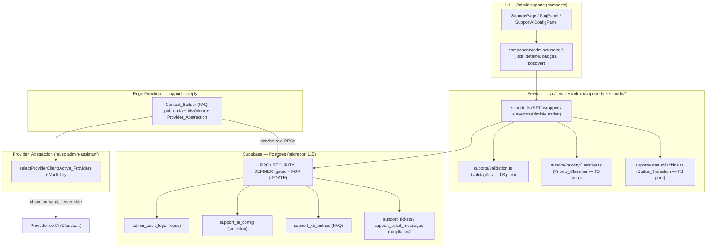
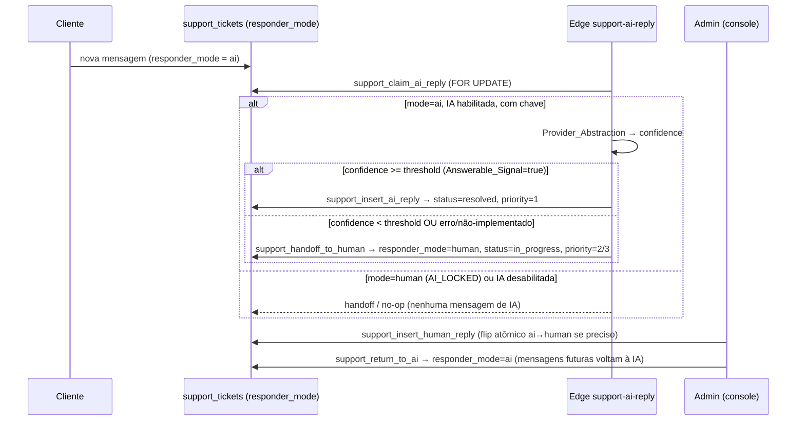

# Design Document — Central de Suporte Inteligente (`suporte-inteligente`)

## Visão geral (Overview)

A **Central de Suporte Inteligente** (`Support_Console`) entrega o console administrativo de
atendimento em `/admin/suporte`, construído **por cima** das tabelas de suporte já existentes
(`support_tickets`, `support_ticket_messages`) entregues por `notifications-hub` (migration 041), e
**reusando** a camada de provedor de IA (`Provider_Abstraction`) entregue por `admin-assistant`
(migration 047). O console permite ao dono atender clientes com o máximo de automação: a
**Support_AI** responde primeiro, fundamentada na **Base de Conhecimento (FAQ)**; quando não há
resposta segura, ocorre **Transferência Inteligente (Handoff)** para o humano; o botão **"Retornar
para IA"** devolve o controle. O fluxo é governado por uma **máquina de estados de cinco status**, um
**classificador de prioridade determinístico** de três níveis e uma **exclusão mútua IA×humano**
atômica que garante um único responsável por atendimento a cada instante.

Esta entrega adere integralmente aos steerings `project-conventions`, `admin-patterns` e
`testing-governance`. Texto e mensagens user-facing em **pt-BR**; action codes, error codes e
identifiers em **inglês** (UPPER_SNAKE). As Correctness Properties do painel são **obrigatórias**
(CP1..CP5, sem asterisco); propriedades adicionais são **opcionais** (marcadas com `*`).

### Princípios de reuso (não duplicar, não quebrar)

| Origem | O que é reusado | Como esta spec amplia |
| --- | --- | --- |
| `notifications-hub` (041) | `support_tickets`, `support_ticket_messages`, triggers de notificação, `has_admin_permission(p_user_id, p_action)`, permissões `SUPORTE_VIEW`/`SUPORTE_REPLY`, RLS de owner/admin | **Amplia** o domínio de `status` (3→5 estados de forma compatível), adiciona colunas de modo/prioridade/handoff e RPCs do console |
| `admin-assistant` (047) | `Provider_Abstraction` (`assistantProvider.ts` + Edge `assistant-ai`), `Active_Provider` em `assistant_config`, chaves no **Vault** (`assistant_provider_key_<provider>`) | **Reusa** a mesma camada de provedor; a Edge `support-ai-reply` invoca o mesmo contrato, **sem** nova abstração nem nova chave |
| `admin-foundation` (030) + steering `admin-patterns` | AdminGuard, `Stealth_404`, `useAdminPermission`, `is_admin_with_permission`, `executeAdminMutation`, versionamento otimista, `_SKIPPED`, RPC security posture, master `Nexus_Vortex99` imutável | Aplicado sem reinvenção em todas as RPCs/serviços/UI desta spec |
| `whatsapp-automation` (102/109) | Padrão de **exclusão mútua sob lock** (`SELECT ... FOR UPDATE`), claim idempotente de auto-reply de IA, transição de modo IA↔humano com `_SKIPPED` | Adaptado para `responder_mode` em `support_tickets` (mecanismo de CP1) |

---

## Arquitetura (Architecture)

### Camadas



A regra de ouro: **toda decisão de leitura/escrita sensível é decidida no servidor** (RLS + RPC
`SECURITY DEFINER`). O frontend nunca decide autorização sozinho (gating em duas camadas) e nunca vê
a chave do provedor (lida apenas server-side pela Edge).

### Fluxo IA → humano → IA



### Mecanismo de exclusão mútua IA×humano (base de CP1)

Cada `support_ticket` mantém **um único** `responder_mode ∈ {ai, human}`. Toda operação que pode
inserir mensagem ou trocar o responsável (claim de IA, resposta humana, handoff, return_to_ai) abre a
transação com `SELECT responder_mode FROM support_tickets WHERE id = p_ticket_id FOR UPDATE`,
**serializando** decisões concorrentes na linha do atendimento (mesmo padrão de `whatsapp` 102/109):

- **IA tentando inserir** com `responder_mode = human` ⇒ erro `AI_LOCKED`, mensagem **não**
  persistida (Req 8.2, 8.3).
- **Humano respondendo** com `responder_mode = ai` ⇒ a RPC executa o **Handoff atomicamente**
  (`ai → human`) **antes** de aceitar a resposta (Req 7.6, 8.4).
- **Handoff/Return_To_AI** trocam o modo sob o mesmo lock, com idempotência `_SKIPPED` (Req 7.5,
  9.4).

Como toda inserção de IA reconfere `responder_mode = ai` sob o lock no mesmo passo que insere, nenhuma
`Atendimento_Message` de IA pode ser persistida durante um intervalo em que o modo esteja `human`
(invariante de CP1, Req 8.5).

### Áreas que exigiram pesquisa (e achados que informam o design)

- **Padrão de auto-reply de IA sob lock**: `migration 102` (`whatsapp_claim_ai_reply` /
  `whatsapp_finalize_ai_reply`) e `migration 109` (`whatsapp_transition_conversation_mode`) já
  implementam exatamente a exclusão mútua IA×humano com `FOR UPDATE`, claim idempotente e `_SKIPPED`.
  O design de CP1/handoff/return_to_ai **espelha** esse padrão validado em produção, adaptando o
  domínio `conversation_mode` para `responder_mode` em `support_tickets`.
- **Provider_Abstraction**: `src/services/admin/assistantProvider.ts` define `AiProviderClient`,
  `selectProviderClient(provider)` e os clientes (`ClaudeClient` funcional, `GeminiClient` funcional,
  `NotImplementedClient` para os demais retornando `provider_not_implemented` sem tocar segredo). A
  Edge `assistant-ai` espelha esse contrato no runtime Deno e lê a chave do **Vault**
  (`assistant_provider_key_<provider>`) via service-role. A Edge `support-ai-reply` **reusa** o mesmo
  módulo e a mesma convenção de Vault — nenhuma nova abstração.
- **Schema de suporte existente** (`migration 041`): `support_tickets(status IN
  ('open','in_progress','resolved'))`, `support_ticket_messages(is_admin boolean, author_id uuid
  NULL)`, triggers `support_ticket_messages_notify` / `support_tickets_resolved_notify`, trigger
  `support_tickets_set_updated_at`, RLS de owner/admin. A amplificação é **aditiva e compatível**.
- **Permission matrix** (`permissions.ts` + `is_admin_with_permission` 047): a forma de conceder
  ações novas por papel (allowlist de `SUPORTE`, deny-list do `ADMIN`, wildcard `SUPER_ADMIN`) é
  reusada para `FAQ_VIEW`/`FAQ_EDIT`/`SUPORTE_AI_CONFIG`.

---

## Modelo de dados (Data Models) — migration 115

Numeração confirmada: a maior migration no disco é `114`; esta spec ocupa **115**
(`115_suporte_inteligente.sql`) com par documentado `115_suporte_inteligente_rollback.sql`. Os
números 116/117/118 ficam reservados às próximas specs; uma eventual segunda migration desta entrega
usaria sufixo de letra `115b_...`.

A migration é **idempotente** (`CREATE TABLE IF NOT EXISTS`, `CREATE OR REPLACE FUNCTION`,
`CREATE INDEX IF NOT EXISTS`, `DROP POLICY IF EXISTS` antes de `CREATE POLICY`, `ADD COLUMN IF NOT
EXISTS`), envolvida em `BEGIN; ... COMMIT;`, com bloco defensivo `DO $check$` validando dependências
(030/041/047) antes de qualquer DDL.

### 1. Bloco defensivo `DO $check$`

```sql
DO $check$
BEGIN
  IF NOT EXISTS (SELECT 1 FROM information_schema.routines
                 WHERE routine_schema='public' AND routine_name='is_admin_with_permission') THEN
    RAISE EXCEPTION 'Migration 030 (admin-foundation) nao aplicada: is_admin_with_permission ausente';
  END IF;
  IF NOT EXISTS (SELECT 1 FROM information_schema.tables
                 WHERE table_schema='public' AND table_name='support_tickets') THEN
    RAISE EXCEPTION 'Migration 041 (notifications-hub) nao aplicada: support_tickets ausente';
  END IF;
  IF NOT EXISTS (SELECT 1 FROM information_schema.tables
                 WHERE table_schema='public' AND table_name='support_ticket_messages') THEN
    RAISE EXCEPTION 'Migration 041 (notifications-hub) nao aplicada: support_ticket_messages ausente';
  END IF;
  -- Provider_Abstraction: assistant_config (Active_Provider) + Vault (admin-assistant 047)
  IF NOT EXISTS (SELECT 1 FROM information_schema.tables
                 WHERE table_schema='public' AND table_name='assistant_config') THEN
    RAISE EXCEPTION 'Migration 047 (admin-assistant) nao aplicada: assistant_config ausente';
  END IF;
END
$check$;
```

### 2. Amplificação de `support_tickets` (aditiva e compatível, Req 3.2, 13.3, 13.4)

```sql
-- 2.1 Colunas novas com defaults compatíveis (não exigem reescrita das linhas existentes)
ALTER TABLE support_tickets
  ADD COLUMN IF NOT EXISTS responder_mode     text        NOT NULL DEFAULT 'ai'
    CHECK (responder_mode IN ('ai','human'));
ALTER TABLE support_tickets
  ADD COLUMN IF NOT EXISTS priority_level     smallint    NOT NULL DEFAULT 1
    CHECK (priority_level BETWEEN 1 AND 3);
ALTER TABLE support_tickets
  ADD COLUMN IF NOT EXISTS handoff_at         timestamptz NULL;
ALTER TABLE support_tickets
  ADD COLUMN IF NOT EXISTS returned_to_ai_at  timestamptz NULL;

-- 2.2 Amplificação compatível do domínio de status (3 -> 5 estados)
--     Drop-then-add com nome estável => idempotente em reaplicação. As linhas
--     existentes em open/in_progress/resolved permanecem válidas; a checagem
--     apenas ACRESCENTA waiting_customer e closed (Req 3.2).
ALTER TABLE support_tickets DROP CONSTRAINT IF EXISTS support_tickets_status_check;
ALTER TABLE support_tickets ADD  CONSTRAINT support_tickets_status_check
  CHECK (status IN ('open','in_progress','waiting_customer','resolved','closed'));

CREATE INDEX IF NOT EXISTS idx_tickets_responder_mode ON support_tickets (responder_mode, created_at DESC);
CREATE INDEX IF NOT EXISTS idx_tickets_priority       ON support_tickets (priority_level, created_at DESC);
```

> **Decisão — `priority_level` default `1`**: um Atendimento novo entra no caminho **IA-primeiro**
> (`responder_mode = 'ai'`), que corresponde ao Nível 1 (IA resolve via Base de Conhecimento, Req
> 10.6). O `Priority_Classifier` **reclassifica deterministicamente** para `2` (IA não resolve →
> Handoff) ou `3` (`Critical_Category`) assim que o `Answerable_Signal`/categoria é conhecido,
> gravando `SUPORTE_PRIORITY_CHANGE`. Default `1` mantém coerência com `responder_mode` e nunca deixa
> o ticket "preso" porque o handoff por baixa confiança/IA desabilitada já reclassifica para `2`.

### 3. Marcação de origem da mensagem em `support_ticket_messages` (Req 6.4; escolha compatível)

A tabela já tem `is_admin boolean` e `author_id uuid NULL`. Para distinguir **IA vs humano** sem
quebrar o schema, adiciona-se `author_kind` com default compatível e **backfill** não destrutivo:

```sql
ALTER TABLE support_ticket_messages
  ADD COLUMN IF NOT EXISTS author_kind text NOT NULL DEFAULT 'user'
    CHECK (author_kind IN ('user','admin','ai'));

-- Backfill único e não destrutivo a partir do is_admin existente:
UPDATE support_ticket_messages
   SET author_kind = CASE WHEN is_admin THEN 'admin' ELSE 'user' END
 WHERE author_kind = 'user' AND is_admin = true;
```

- Mensagem de IA: `author_kind = 'ai'`, `is_admin = true` (lado-suporte para os triggers de
  notificação já existentes), `author_id = NULL` (sem humano). O trigger
  `support_ticket_messages_notify` usa `coalesce(v_admin_name,'Suporte')`, exibindo "Suporte
  respondeu" ao cliente — comportamento correto, sem alteração no trigger.
- Mensagem humana: `author_kind = 'admin'`, `is_admin = true`, `author_id = auth.uid()`.
- Mensagem do cliente: `author_kind = 'user'`, `is_admin = false`.

### 4. Nova tabela `support_kb_entries` (Base de Conhecimento / FAQ, Req 5.1)

```sql
CREATE TABLE IF NOT EXISTS support_kb_entries (
  id                uuid PRIMARY KEY DEFAULT gen_random_uuid(),
  question          text NOT NULL CHECK (char_length(question) BETWEEN 3 AND 300),
  answer            text NOT NULL CHECK (char_length(answer) BETWEEN 1 AND 5000),
  category          text NOT NULL
    CHECK (category IN ('geral','financeiro','tecnico','administrativo','conta','planos')),
  publication_state text NOT NULL DEFAULT 'rascunho'
    CHECK (publication_state IN ('rascunho','publicada')),
  created_by        uuid NULL REFERENCES users(id) ON DELETE SET NULL,
  created_at        timestamptz NOT NULL DEFAULT NOW(),
  updated_at        timestamptz NOT NULL DEFAULT NOW()
);
CREATE INDEX IF NOT EXISTS idx_kb_category    ON support_kb_entries (category, created_at DESC);
CREATE INDEX IF NOT EXISTS idx_kb_publication ON support_kb_entries (publication_state, created_at DESC);
```

> **Exposição à IA (Req 5.7)**: a Support_AI consome **exclusivamente** entradas com
> `publication_state = 'publicada'`. Nenhum outro marcador exclui uma entrada publicada — é o único
> critério de exposição.

### 5. Nova tabela `support_ai_config` (singleton, Req 6.8; sem segredos)

```sql
CREATE TABLE IF NOT EXISTS support_ai_config (
  id                   boolean PRIMARY KEY DEFAULT true CHECK (id),   -- single-row pattern
  enabled              boolean NOT NULL DEFAULT true,
  confidence_threshold numeric(3,2) NOT NULL DEFAULT 0.70
    CHECK (confidence_threshold >= 0 AND confidence_threshold <= 1),
  support_model        text NOT NULL DEFAULT 'claude-3-5-sonnet-latest',
  updated_at           timestamptz NOT NULL DEFAULT NOW()
);
INSERT INTO support_ai_config (id) VALUES (true) ON CONFLICT (id) DO NOTHING;  -- seed idempotente
```

Sem coluna de segredo: a chave do provedor permanece no **Vault** da `Provider_Abstraction`
(`assistant_provider_key_<provider>`), lida apenas server-side pela Edge. `confidence_threshold` é o
`Confidence_Threshold` configurável `[0,1]`; `support_model` é o modelo de suporte; `enabled` liga/
desliga a IA de atendimento ao cliente.

### 6. RBAC — ações novas (`FAQ_VIEW`, `FAQ_EDIT`, `SUPORTE_AI_CONFIG`)

`CREATE OR REPLACE FUNCTION is_admin_with_permission(text)` **preservando** o corpo atual (047) e
acrescentando as concessões por papel (Req 4.2, 4.3, 4.4):

```sql
-- SUPER_ADMIN: wildcard (já cobre tudo).
-- ADMIN: allow-all menos deny-list (NÃO incluir FAQ_*/SUPORTE_AI_CONFIG na deny-list => ADMIN recebe).
-- SUPORTE: allowlist + 'FAQ_VIEW' (NÃO recebe FAQ_EDIT nem SUPORTE_AI_CONFIG).
OR (a.role = 'SUPORTE' AND p_action IN
     ('USER_VIEW','USER_TOGGLE_ACTIVE','FRETE_VIEW',
      'SUPORTE_VIEW','SUPORTE_REPLY','CRM_VIEW','FAQ_VIEW'))
```

Espelho no frontend `src/services/admin/permissions.ts`: acrescentar `FAQ_VIEW`, `FAQ_EDIT`,
`SUPORTE_AI_CONFIG` a `ADMIN_ACTIONS`; `FAQ_VIEW` a `SUPORTE_PERMS`; **não** incluir as três em
`ADMIN_DENY` (assim `ADMIN` as recebe pelo allow-all). Deny-by-default preservado: `hasPermission`
retorna `false` para qualquer string fora do enum (Req 4.6).

### 7. RLS (Req 11.1, 11.2, 11.5; isolamento por `auth.uid()`)

`support_tickets` / `support_ticket_messages` mantêm as policies de `notifications-hub` (SELECT do
owner via `user_id = auth.uid()` **ou** admin via `is_admin_with_permission('SUPORTE_VIEW')`; UPDATE
de admin via `SUPORTE_REPLY`). Mutações de IA/handoff/status passam por RPCs `SECURITY DEFINER` (não
dependem das policies de UPDATE direto).

```sql
ALTER TABLE support_kb_entries ENABLE ROW LEVEL SECURITY;
DROP POLICY IF EXISTS kb_select_view ON support_kb_entries;
CREATE POLICY kb_select_view ON support_kb_entries FOR SELECT TO authenticated
  USING (is_admin_with_permission('FAQ_VIEW'));
DROP POLICY IF EXISTS kb_mutate_edit ON support_kb_entries;
CREATE POLICY kb_mutate_edit ON support_kb_entries FOR ALL TO authenticated
  USING (is_admin_with_permission('FAQ_EDIT'))
  WITH CHECK (is_admin_with_permission('FAQ_EDIT'));

ALTER TABLE support_ai_config ENABLE ROW LEVEL SECURITY;
DROP POLICY IF EXISTS ai_config_select ON support_ai_config;
CREATE POLICY ai_config_select ON support_ai_config FOR SELECT TO authenticated
  USING (is_admin_with_permission('SUPORTE_VIEW'));
DROP POLICY IF EXISTS ai_config_mutate ON support_ai_config;
CREATE POLICY ai_config_mutate ON support_ai_config FOR ALL TO authenticated
  USING (is_admin_with_permission('SUPORTE_AI_CONFIG'))
  WITH CHECK (is_admin_with_permission('SUPORTE_AI_CONFIG'));
```

`trg_set_updated_at` (já existente em 041) é anexado a `support_kb_entries` e `support_ai_config` para
manter `updated_at` no versionamento otimista.

### 8. Trigger de auto-transição por mensagem do cliente (Req 3.10)

`AFTER INSERT ON support_ticket_messages` quando `NEW.author_kind = 'user'`: se o ticket está em
`waiting_customer` ou `resolved`, transiciona para `in_progress` (transições permitidas pela máquina
de estados). Idempotente e escopado ao próprio ticket; não toca tickets `closed`.

---

## Componentes e interfaces (Components and Interfaces)

### A. Núcleo de lógica pura (TS testável isoladamente)

Em `src/services/admin/suporte/` — funções puras, determinísticas, sem I/O (alvo de unit + property):

#### A.1 `statusMachine.ts` — `Status_Transition` + `Status_Display_Map`

```ts
export type TicketStatus = 'open' | 'in_progress' | 'waiting_customer' | 'resolved' | 'closed';

/** Tabela de transições válidas (Req 3.4, 3.5). closed = terminal. */
export const STATUS_TRANSITIONS: Readonly<Record<TicketStatus, readonly TicketStatus[]>> = {
  open:             ['in_progress', 'waiting_customer', 'resolved', 'closed'],
  in_progress:      ['waiting_customer', 'resolved', 'closed'],
  waiting_customer: ['in_progress', 'resolved', 'closed'],
  resolved:         ['in_progress', 'closed'],
  closed:           [], // terminal
};

/** true sse (from→to) pertence ao conjunto permitido. from===to NÃO é transição válida. */
export function isValidTransition(from: TicketStatus, to: TicketStatus): boolean;

/** Mapeamento determinístico status → rótulo pt-BR + marcador (Req 3.3). */
export const STATUS_DISPLAY_MAP: Readonly<Record<TicketStatus, { label: string; marker: string }>> = {
  open:             { label: 'Novo',               marker: '🟢' },
  in_progress:      { label: 'Em andamento',       marker: '🟡' },
  waiting_customer: { label: 'Aguardando cliente', marker: '🔵' },
  resolved:         { label: 'Resolvido',          marker: '⚪' },
  closed:           { label: 'Fechado',            marker: '🔴' },
};
```

Tabela de transições (✅ válida, ❌ recusada com `INVALID_STATUS_TRANSITION`, ⟳ mesmo status →
`_SKIPPED ALREADY_<STATUS>`, terminal):

| De \ Para | open | in_progress | waiting_customer | resolved | closed |
| --- | :---: | :---: | :---: | :---: | :---: |
| **open** | ⟳ | ✅ | ✅ | ✅ | ✅ |
| **in_progress** | ❌ | ⟳ | ✅ | ✅ | ✅ |
| **waiting_customer** | ❌ | ✅ | ⟳ | ✅ | ✅ |
| **resolved** | ❌ | ✅ | ❌ | ⟳ | ✅ |
| **closed** | ❌ | ❌ | ❌ | ❌ | ⟳ (terminal) |

#### A.2 `priorityClassifier.ts` — `Priority_Classifier` (Req 10.2–10.5)

```ts
export type CriticalCategory = 'financeiro' | 'tecnico' | 'administrativo';
export type PriorityLevel = 1 | 2 | 3;

/** Função pura e determinística. */
export function classifyPriority(
  answerableSignal: boolean,
  criticalCategory: CriticalCategory | null
): PriorityLevel;
```

Tabela de decisão de prioridade:

| `Critical_Category` | `Answerable_Signal` | `Priority_Level` |
| --- | --- | :---: |
| presente (`financeiro`/`tecnico`/`administrativo`) | qualquer | **3** |
| ausente | `true` | **1** |
| ausente | `false` | **2** |

#### A.3 `validation.ts` — validações puras (espelhadas no backend, Req 12.2)

```ts
export function validateFaqQuestion(q: string): boolean;        // 3..300 chars (trim)
export function validateFaqAnswer(a: string): boolean;          // 1..5000 chars
export function isValidCategory(c: string): c is FaqCategory;    // domínio fechado
export function isValidConfidenceThreshold(n: number): boolean;  // número finito em [0,1]
export function deriveAnswerableSignal(confidence: number, threshold: number): boolean; // confidence >= threshold
```

#### A.4 Reducer de exclusão mútua (modelo testável de CP1)

`responderModeReducer.ts` modela, em memória, o efeito das operações sobre `{ responder_mode, status,
messages[] }` espelhando a semântica das RPCs. Permite testar o invariante de CP1 (model-based) sem
I/O:

```ts
type Op =
  | { kind: 'customer_message' }
  | { kind: 'ai_reply_attempt' }     // só persiste se mode==='ai'; senão AI_LOCKED
  | { kind: 'human_reply' }          // flip atômico ai→human antes de aceitar
  | { kind: 'handoff' }              // ai→human idempotente
  | { kind: 'return_to_ai' };        // human→ai idempotente
export function applyOp(state: TicketModel, op: Op): TicketModel;
```

### B. RPCs `SECURITY DEFINER` (postura padrão do projeto)

Todas seguem a RPC Security Posture (`admin-patterns` §10): header `SET search_path = public`;
`auth.uid() IS NULL ⇒ RAISE permission_denied (42501)`; `is_admin_with_permission(...)` com **log
negativo** (`SUPORTE_VIEW_DENIED` para suporte, `FAQ_VIEW_DENIED` para FAQ — `before=NULL`,
`after={user_id, reason}`) antes de abortar; validações de domínio fechado/ranges; versionamento
otimista (`expected_updated_at` ⇒ `STALE_VERSION`); idempotência `_SKIPPED`; `REVOKE ALL FROM PUBLIC`
+ `GRANT EXECUTE TO authenticated` (RPCs do Edge: `GRANT ... TO service_role`). O audit **positivo** de
mutação é gravado pela camada TS via `executeAdminMutation`; o `_SKIPPED` grava o log **dentro** da
RPC (sem `executeAdminMutation`).

| RPC | Gating | Lock | Retorno | Notas |
| --- | --- | --- | --- | --- |
| `support_change_status(p_ticket_id, p_target_status, p_expected_updated_at)` | `SUPORTE_REPLY` | `FOR UPDATE` | `{ ok, updated_at }` \| `{ skipped, reason:'ALREADY_<STATUS>' }` | mesmo status ⇒ `_SKIPPED`; transição fora do conjunto ⇒ `INVALID_STATUS_TRANSITION`; `closed` terminal; audit `SUPORTE_STATUS_CHANGE` (TS) |
| `support_set_priority(p_ticket_id, p_level, p_expected_updated_at)` | `SUPORTE_REPLY` | `FOR UPDATE` | `{ ok, updated_at }` \| `{ skipped, reason:'ALREADY_LEVEL_<n>' }` | valida `p_level ∈ {1,2,3}`; audit `SUPORTE_PRIORITY_CHANGE` |
| `support_handoff_to_human(p_ticket_id, p_expected_updated_at)` | `SUPORTE_REPLY` (ou service-role via Edge) | `FOR UPDATE` | `{ ok, updated_at }` \| `{ skipped, reason:'ALREADY_HUMAN' }` | set `responder_mode=human`, `handoff_at=NOW()`; insere mensagem de aviso pt-BR **best-effort** (Req 7.7: falha de inserção não bloqueia o handoff); transiciona p/ `in_progress` salvo `closed`; audit `SUPORTE_HANDOFF` |
| `support_return_to_ai(p_ticket_id, p_expected_updated_at)` | `SUPORTE_REPLY` | `FOR UPDATE` | `{ ok, updated_at }` \| `{ skipped, reason:'ALREADY_AI' }` | set `responder_mode=ai`, `returned_to_ai_at=NOW()`; preserva todas as mensagens; audit `SUPORTE_RETURN_TO_AI` |
| `support_insert_human_reply(p_ticket_id, p_body, p_expected_updated_at)` | `SUPORTE_REPLY` | `FOR UPDATE` | `{ ok, message_id, updated_at }` | se `responder_mode=ai`, executa Handoff **atômico** antes de inserir (Req 7.6); insere `author_kind='admin'` |
| `support_claim_ai_reply(p_ticket_id, p_idempotency_key)` | **service-role** | `FOR UPDATE` | `{ decision:'ALLOW'\|'BLOCKED'\|'DUPLICATE', enabled, confidence_threshold }` | `mode=human` ⇒ `BLOCKED/AI_LOCKED`; IA desabilitada ⇒ `BLOCKED`; claim idempotente por `idempotency_key` (nunca responde 2×) |
| `support_insert_ai_reply(p_ticket_id, p_body, p_expected_updated_at)` | **service-role** | `FOR UPDATE` | `{ ok, message_id }` \| `AI_LOCKED` | reconfere `responder_mode=ai` sob lock (CP1); insere `author_kind='ai'`, `is_admin=true`, `author_id=NULL`; `status→resolved`, `priority=1`; audit `SUPORTE_AI_REPLY` (sem segredos) |
| `support_create_faq(p_question, p_answer, p_category, p_publication_state)` | `FAQ_EDIT` | — | `{ id, updated_at }` | valida ranges/domínio; audit `FAQ_CREATE` |
| `support_update_faq(p_id, p_patch, p_expected_updated_at)` | `FAQ_EDIT` | — | `{ ok, updated_at }` \| `STALE_VERSION` | audit `FAQ_UPDATE` |
| `support_delete_faq(p_id)` | `FAQ_EDIT` | — | `{ ok }` \| `{ skipped, reason:'ALREADY_REMOVED' }` | audit `FAQ_DELETE` |
| `support_update_ai_config(p_patch, p_expected_updated_at)` | `SUPORTE_AI_CONFIG` | — | `{ ok, updated_at }` \| `STALE_VERSION` | valida `confidence_threshold ∈ [0,1]`; audit `SUPORTE_AI_CONFIG_UPDATE` |
| `support_admin_list_tickets(p_filters, p_limit, p_offset)` | `SUPORTE_VIEW` | — | `{ items[], total }` | leitura gated; log negativo `SUPORTE_VIEW_DENIED`; backstop por RLS |
| `support_list_faq(p_filters, p_limit, p_offset)` | `FAQ_VIEW` | — | `{ items[], total }` | leitura gated; log negativo `FAQ_VIEW_DENIED` |

Tipos de retorno TS (espelham `admin-patterns` §4):

```ts
type MutationResult =
  | { ok: true; updatedAt: string }
  | { skipped: true; reason: 'ALREADY_HUMAN' | 'ALREADY_AI' | 'ALREADY_REMOVED'
      | `ALREADY_${Uppercase<TicketStatus>}` | `ALREADY_LEVEL_${PriorityLevel}` };
```

### C. Edge Function `support-ai-reply` (reuso da Provider_Abstraction)

Única camada que toca a chave do provedor no fluxo de suporte. `verify_jwt` apropriado; chamadas
internas usam service-role. Passos:

1. Recebe `{ ticketId, idempotencyKey }`.
2. `support_claim_ai_reply` (sob lock): `BLOCKED` (mode=human/`AI_LOCKED` ou IA desabilitada) ⇒
   aciona `support_handoff_to_human` e encerra; `DUPLICATE` ⇒ no-op; `ALLOW` ⇒ segue.
3. **Context_Builder**: lê `support_kb_entries WHERE publication_state='publicada'` + histórico do
   próprio Atendimento (`support_ticket_messages`) — fundamentação exclusiva (Req 6.2).
4. Lê `Active_Provider` de `assistant_config` e `support_model`/`confidence_threshold` de
   `support_ai_config`; lê a chave do **Vault** (`assistant_provider_key_<provider>`) via service-role
   (nunca exposta ao frontend, Req 6.3).
5. Invoca `selectProviderClient(provider)` da `Provider_Abstraction` (sem nova abstração). O prompt
   pede resposta estruturada `{ answer, confidence, grounded }`.
6. **`Answerable_Signal`** = `confidence >= confidence_threshold` **e** `grounded`. Verdadeiro ⇒
   `support_insert_ai_reply` (status→resolved, priority=1, audit `SUPORTE_AI_REPLY`). Falso ⇒
   `support_handoff_to_human` (priority=2).
7. **Degradação** (Req 6.9, 12.4): `provider_not_implemented`/`provider_call_failed`/`missing_api_key`
   ou parsing inválido ⇒ trata como não-respondível ⇒ Handoff humano + log estruturado **sem
   segredos**. O Atendimento e suas mensagens permanecem intactos.

### D. Service layer — `src/services/admin/suporte.ts`

Wrappers finos sobre as RPCs. Mutações via `executeAdminMutation` (audit-by-construction); leituras
mapeiam linhas DB→tipos. Mapeamento de erros tipado (`SuporteError` com `code`), reusando o padrão de
`tickets.ts` (`mapPostgresError`): `42501`→`PERMISSION_DENIED`, `STALE_VERSION`,
`INVALID_STATUS_TRANSITION`, `AI_LOCKED`, `INVALID_INPUT`, etc., com mensagens user-facing pt-BR.

### E. UI / Componentes — `src/components/admin/suporte/` + página em `src/pages/admin/suporte/`

Padrão **compacto** (`project-conventions`): sem `<h1>` grande; filtros em **popover** via botão
`SlidersHorizontal`; paginação `10/50/100` (default `10`); botões `text-xs px-2.5 py-1`; mobile vira
**cards single-column**.

| Componente | Papel |
| --- | --- |
| `SuporteListPage` | rota `/admin/suporte` (AdminGuard + `SUPORTE_VIEW` ⇒ senão `Stealth_404`); orquestra lista, filtros e paginação |
| `SuporteFiltersPopover` | filtros (status, prioridade, `responder_mode`, intervalo de datas, busca); **só dispara busca no botão "Aplicar"** (Req 2.5, 2.10) |
| `SuporteTicketTable` / `SuporteTicketCard` | lista compacta (desktop tabela; mobile cards) com data, hora, nome, e-mail, WhatsApp, plano, prioridade, status |
| `SuporteStatusBadge` | renderiza `STATUS_DISPLAY_MAP` (rótulo pt-BR + marcador) |
| `SuportePriorityBadge` | marcador de **alta prioridade** destacado no Nível 3 (Req 10.8) |
| `SuporteTicketDetail` | thread do atendimento; seletor de status; resposta humana; botão **"Retornar para IA"** gated por `SUPORTE_REPLY` e visível só quando `responder_mode=human` (Req 9.1, 9.6) |
| `FaqPanel` / `FaqTable` / `FaqEditorModal` | CRUD da FAQ; controles de criar/editar/remover gated por `FAQ_EDIT`; somente-leitura para `FAQ_VIEW` (Req 5.6); popover + paginação |
| `SupportAiConfigPanel` | habilitar/desabilitar IA, `confidence_threshold` (slider 0–1), modelo; gated por `SUPORTE_AI_CONFIG` |

Comportamentos: **sem inserção em tempo real** do novo Atendimento — só refresh manual (Req 2.8);
**degradação parcial** de blocos agregados via `Promise.allSettled` + `DashboardBlockError` com
"Tentar novamente" (Req 2.9); **validação no frontend espelhando o backend** (Req 12.2, 12.3) —
único bloqueio de envio é a validação de input (Req 12.3, 12.7).

---

## Correctness Properties

*Uma propriedade é uma característica ou comportamento que deve valer em todas as execuções válidas do
sistema — uma afirmação formal sobre o que o software deve fazer. As propriedades são a ponte entre a
especificação legível por humanos (os critérios de aceitação em EARS) e garantias de corretude
verificáveis por máquina (testes baseados em propriedade com fast-check).*

As propriedades abaixo derivam do prework de critérios de aceitação. Critérios classificados como
EXAMPLE, EDGE_CASE, INTEGRATION ou SMOKE são cobertos pela estratégia de testes (exemplo, edge,
integração e smoke) e não geram propriedades universais. As redundâncias foram consolidadas conforme
a reflexão de propriedades. **CP1..CP5 são obrigatórias (sem asterisco)**; CP6*..CP12* são opcionais.

Cada propriedade é implementada por **um único** teste de propriedade fast-check (mín. **100**
iterações), arquivo em `src/__tests__/admin/suporte/`, tag
`// Feature: suporte-inteligente, Property N: <texto>`.

### Property 1 (CP1): Exclusão mútua IA×humano

*Para qualquer* sequência finita de operações sobre um Atendimento (mensagem de cliente, tentativa de
resposta de IA, resposta humana, Handoff e Return_To_AI), nenhuma `Atendimento_Message` gerada por IA
é persistida enquanto `responder_mode = human`, e toda resposta humana iniciada com `responder_mode =
ai` transiciona atomicamente para `human` antes de ser aceita — de modo que existe sempre um único
responsável vigente.

**Validates: Requirements 7.1, 7.6, 8.1, 8.2, 8.3, 8.4, 8.5, 9.2**

- Arquivo: `cp1_exclusao_mutua.property.test.ts`
- Alvo: `suporte/responderModeReducer.ts` (`applyOp`) — model-based sobre `fc.array(opGen)`.
- Geradores: `opGen = fc.constantFrom({kind:'customer_message'}, {kind:'ai_reply_attempt'},
  {kind:'human_reply'}, {kind:'handoff'}, {kind:'return_to_ai'})`; corpo via `safeText` (`generators.ts`).
- Asserção do invariante: ao aplicar a sequência, em nenhum estado intermediário há mensagem
  `author_kind='ai'` inserida quando `responder_mode==='human'`; `ai_reply_attempt` sob `human`
  resulta em `AI_LOCKED` (sem persistência); `human_reply` sob `ai` produz `handoff_at` setado antes
  da mensagem.

### Property 2 (CP2): Transições de status válidas e `closed` terminal

*Para qualquer* par `(from, to)` no domínio fechado `{open, in_progress, waiting_customer, resolved,
closed}`, `isValidTransition(from, to)` é verdadeiro **se e somente se** `to ∈ STATUS_TRANSITIONS[from]`;
em particular, com `from = closed` o resultado é sempre falso (estado terminal), e qualquer transição
fora do conjunto é recusada com `INVALID_STATUS_TRANSITION` preservando o status atual.

**Validates: Requirements 3.1, 3.4, 3.5, 3.6**

- Arquivo: `cp2_transicoes_status.property.test.ts`
- Alvo: `suporte/statusMachine.ts` (`isValidTransition`).
- Geradores: `statusGen = fc.constantFrom('open','in_progress','waiting_customer','resolved','closed')`.

### Property 3 (CP3): Precedência de `permission_denied`

*Para qualquer* chamada a uma ação protegida desta spec por um caller sem a permissão exigida, o
resultado é `permission_denied` **mesmo** na presença simultânea de erros de validação de input, e
independentemente do papel do caller (incluindo `ADMIN`), preservando o deny-by-default.

**Validates: Requirements 4.8, 9.6, 11.3**

- Arquivo: `cp3_permission_denied.property.test.ts`
- Alvo: camada de service/guard (mock da RPC lançando `permission_denied` mesmo com input inválido).
- Geradores: input inválido aleatório (`safeText`, números fora de range) + papel sem permissão.
- Helper: `authAssertions.expectPermissionDenied` / `expectRejectsPermissionDenied`.

### Property 4 (CP4): Idempotência de Handoff e Return_To_AI

*Para qualquer* Atendimento, aplicar Handoff quando `responder_mode` já é `human` (ou Return_To_AI
quando já é `ai`) não altera o estado além da primeira aplicação e retorna `_SKIPPED` com motivo
`ALREADY_HUMAN`/`ALREADY_AI`; reaplicar a operação é idempotente (`f(f(x)) == f(x)`).

**Validates: Requirements 7.5, 9.4**

- Arquivo: `cp4_idempotencia_handoff.property.test.ts`
- Alvo: `suporte/responderModeReducer.ts` (Handoff/Return_To_AI).
- Geradores: estado inicial aleatório (`responder_mode`, `status`) + número de reaplicações.

### Property 5 (CP5): Classificação determinística de prioridade

*Para quaisquer* entradas `(answerableSignal: boolean, criticalCategory: CriticalCategory | null)`,
`classifyPriority` é determinística (mesmas entradas ⇒ mesmo `Priority_Level`) e total no domínio
`{1,2,3}`: `criticalCategory` presente ⇒ `3` (independe de `answerableSignal`); ausente e
`answerableSignal=true` ⇒ `1`; ausente e `answerableSignal=false` ⇒ `2`.

**Validates: Requirements 10.1, 10.2, 10.3, 10.4, 10.5, 10.10**

- Arquivo: `cp5_priority_classifier.property.test.ts`
- Alvo: `suporte/priorityClassifier.ts` (`classifyPriority`).
- Geradores: `fc.boolean()` + `fc.option(fc.constantFrom('financeiro','tecnico','administrativo'), { nil: null })`.

### Property 6* (opcional): Status_Display_Map total

*Para qualquer* `TicketStatus`, o render de status retorna exatamente o rótulo pt-BR e o marcador
definidos em `STATUS_DISPLAY_MAP` (função total sobre o domínio fechado).

**Validates: Requirements 2.4, 3.3**

- Arquivo: `cp6_status_display_map.property.test.ts` · Alvo: `statusMachine.STATUS_DISPLAY_MAP`.

### Property 7* (opcional): Correção de filtro, ordenação e paginação

*Para qualquer* conjunto de Atendimentos e *para qualquer* `Support_Filter` aplicado com `pageSize ∈
{10,50,100}`, todo item retornado satisfaz **todos** os critérios ativos (status, prioridade,
`responder_mode`, intervalo de datas, busca), a página tem no máximo `pageSize` itens e a ordenação
inicial é não-crescente por `created_at`.

**Validates: Requirements 2.5, 2.6, 2.7**

- Arquivo: `cp7_filtro_listagem.property.test.ts` · Alvo: função pura de filtro/paginação do service.

### Property 8* (opcional): Answerable_Signal por threshold

*Para quaisquer* `confidence` e `confidence_threshold` em `[0,1]`, `deriveAnswerableSignal(confidence,
threshold)` é verdadeiro **se e somente se** `confidence >= threshold`.

**Validates: Requirements 6.4, 6.5**

- Arquivo: `cp8_answerable_signal.property.test.ts` · Alvo: `validation.deriveAnswerableSignal`.

### Property 9* (opcional): Exposição da Base de Conhecimento à IA

*Para qualquer* conjunto de `FAQ_Entry` com estados variados, o contexto montado para a Support_AI
inclui uma entrada **se e somente se** `publication_state = 'publicada'`.

**Validates: Requirements 5.7, 6.2**

- Arquivo: `cp9_kb_exposicao.property.test.ts` · Alvo: seletor puro de FAQ publicada do Context_Builder.

### Property 10* (opcional): Validação de FAQ e de configuração da IA

*Para qualquer* entrada, a validação aceita **se e somente se** pergunta ∈ [3,300], resposta ∈
[1,5000], `category` no domínio fechado e `confidence_threshold` número finito em `[0,1]`; a mesma
regra vale no frontend e no backend.

**Validates: Requirements 5.2, 6.8, 12.2**

- Arquivo: `cp10_validacao_faq.property.test.ts` · Alvo: `validation.ts`.

### Property 11* (opcional): RBAC determinístico e deny-by-default

*Para qualquer* `AdminRole` e *para qualquer* ação, `hasPermission` corresponde à Permission_Matrix
(FAQ_VIEW concedida a SUPORTE/ADMIN/SUPER_ADMIN; FAQ_EDIT/SUPORTE_AI_CONFIG só ADMIN/SUPER_ADMIN) e
retorna falso para qualquer string fora do domínio de ações.

**Validates: Requirements 4.3, 4.6**

- Arquivo: `cp11_rbac_matrix.property.test.ts` · Alvo: `permissions.hasPermission`.

### Property 12* (opcional): Não-vazamento de chave/PII em logs e audit

*Para qualquer* payload contendo chave de provedor e/ou PII do cliente, as saídas destinadas a logs
estruturados e a `admin_audit_logs` não contêm o valor bruto do segredo nem PII bruta.

**Validates: Requirements 6.6, 11.9**

- Arquivo: `cp12_nao_vazamento.property.test.ts` · Alvo: construtores de log/audit do service.
- Helper: `logAssertions.expectNoSecrets` / `expectStructuredLog`.

---

## Error Handling

Padrões reusados do projeto (notifications-hub / admin-assistant / admin-patterns):

| Cenário | Tratamento |
| --- | --- |
| `auth.uid()` nulo | `RAISE permission_denied` (42501) em toda RPC gated |
| Sem permissão | log `SUPORTE_VIEW_DENIED`/`FAQ_VIEW_DENIED` (`before=NULL`, `after={user_id, reason}`) → `permission_denied` (precedência sobre validação — Req 11.3) |
| `expected_updated_at` divergente | `STALE_VERSION` (P0001) → toast "Outro admin atualizou. Recarregando." + refetch |
| Transição de status inválida | `INVALID_STATUS_TRANSITION` (P0001) → mantém status atual; mensagem pt-BR |
| Mesmo status / já no modo / já removida | `{ skipped:true, reason:'ALREADY_<…>' }` + audit `_SKIPPED` na própria RPC; toast neutro |
| IA tenta inserir sob `responder_mode=human` | `AI_LOCKED` (P0001) → nenhuma mensagem persistida; Edge encerra sem responder |
| Provider indisponível / não-implementado / sem chave | degrada para Handoff humano (Req 6.9, 12.4); log estruturado **sem segredos**; Atendimento e mensagens preservados |
| Falha ao inserir mensagem de aviso no Handoff | conclui handoff (`responder_mode=human`) e loga; não bloqueia (Req 7.7) |
| Dado duplicado sujeito a enumeração | mensagem **canônica anti-enumeração** (`antiEnumeration.CANONICAL_MESSAGES`) — Req 12.5 |
| Falha de bloco agregado na lista | degradação parcial via `Promise.allSettled` + `DashboardBlockError` (Req 2.9) |
| Master `Nexus_Vortex99` alvo | aborta antes de qualquer mutação em `users` (Req 11.8) |
| Falha de audit logging | **não** bloqueia a mutação (decisão oficial `testing-governance`) |

Mensagens técnicas em inglês (error codes); user-facing em pt-BR canônicas. Validação de input é a
**única** condição que bloqueia o envio de formulário (Req 12.3, 12.7).

---

## Testing Strategy

Abordagem dupla (`testing-governance` + `project-conventions`): **property-based** (fast-check) para
invariantes universais e **exemplo/edge/integração/smoke** para o restante. PBT **aplica-se** a esta
spec (máquina de estados, classificador, validações e invariante de exclusão mútua são lógica pura/
determinística).

### Biblioteca e configuração PBT
- **fast-check** via **Vitest** (não implementar PBT do zero); mín. **100** iterações por propriedade
  (`fc.assert(fc.property(...), { numRuns: 100 })`).
- Cada propriedade ⇒ **um** teste, tag `// Feature: suporte-inteligente, Property N: <texto>`.
- Convenções obrigatórias: `vi.mock` hoisted (spies via `(globalThis as Record<string, unknown>).__spy`);
  `fc.stringOf` **não existe** (usar `fc.string({minLength,maxLength}).filter(...)`); PII/email/phone
  via `fc.constantFrom` (templates fixos).
- **Helpers canônicos reusados** (`src/__tests__/_helpers/`): `generators.ts` (`safeText`,
  `validEmail`, `validPhone`, `uuidLike`); `authAssertions.ts` (`expectPermissionDenied`,
  `expectRejectsPermissionDenied`); `antiEnumeration.ts` (`CANONICAL_MESSAGES`,
  `expectAntiEnumeration`); `logAssertions.ts` (`expectNoSecrets`, `expectStructuredLog`).
- Geradores locais de domínio: `statusGen`, `responderModeGen`, `criticalCategoryGen`, `categoryGen`,
  `confidenceGen` (`fc.double({min:0, max:1, noNaN:true})`), `opGen` (sequência de operações de CP1).

### Mapa Propriedade → arquivo (em `src/__tests__/admin/suporte/`)
| Propriedade | Arquivo | Alvo |
| --- | --- | --- |
| CP1 | `cp1_exclusao_mutua.property.test.ts` | `responderModeReducer.applyOp` (model-based) |
| CP2 | `cp2_transicoes_status.property.test.ts` | `statusMachine.isValidTransition` |
| CP3 | `cp3_permission_denied.property.test.ts` | service/guard + `authAssertions` |
| CP4 | `cp4_idempotencia_handoff.property.test.ts` | `responderModeReducer` (handoff/return_to_ai) |
| CP5 | `cp5_priority_classifier.property.test.ts` | `priorityClassifier.classifyPriority` |
| CP6* | `cp6_status_display_map.property.test.ts` | `statusMachine.STATUS_DISPLAY_MAP` |
| CP7* | `cp7_filtro_listagem.property.test.ts` | filtro/paginação puro |
| CP8* | `cp8_answerable_signal.property.test.ts` | `validation.deriveAnswerableSignal` |
| CP9* | `cp9_kb_exposicao.property.test.ts` | seletor de FAQ publicada |
| CP10* | `cp10_validacao_faq.property.test.ts` | `validation.ts` |
| CP11* | `cp11_rbac_matrix.property.test.ts` | `permissions.hasPermission` |
| CP12* | `cp12_nao_vazamento.property.test.ts` | construtores de log/audit + `logAssertions` |

### Testes unitários (exemplo/edge)
`statusMachine` (transições e display map), `priorityClassifier`, `validation` (FAQ, confidence),
render de `SuporteStatusBadge`/`SuportePriorityBadge`, lógica de filtro; render gated (Stealth_404,
sidebar, ausência de `<h1>`, popover, paginação default 10), guest "Sem plano", form bloqueado/erro
pt-BR.

### Cenários de falha (negativos)
`INVALID_STATUS_TRANSITION`; `STALE_VERSION`; `AI_LOCKED`; provider indisponível → handoff;
`permission_denied` com validação simultânea (precedência); anti-enumeração em dado duplicado;
idempotência `_SKIPPED` (status/handoff/return/FAQ delete); falha de inserção de aviso no handoff.

### Testes de integração (`tests/`, branch Supabase efêmero — só CI)
RLS de isolamento entre usuários (owner não vê tickets de outro; admin gated por `SUPORTE_VIEW`);
FAQ RLS (`FAQ_VIEW`/`FAQ_EDIT`); RPCs gated com `SUPORTE_VIEW_DENIED`/`FAQ_VIEW_DENIED` persistido;
paridade `is_admin_with_permission` ↔ matriz para ações novas + caller anônimo;
`support_ai_config` mutável só com `SUPORTE_AI_CONFIG`; Edge `support-ai-reply` lê a chave do Vault e
é a **única** a tocá-la; audit persistido em `admin_audit_logs`; master imutável; idempotência da
migration 115 e amplificação de `status` sem invalidar linhas legadas.

### Smoke (execução única)
Presença/forma da migration 115 + par rollback; bloco `DO $check$`; GRANT/REVOKE sem `anon`; seed do
`support_ai_config`; RPC security posture.

### Validação em duas pontas e Regression_Suite
Toda validação ocorre no **frontend e no backend** (mesma regra — Req 12.2). Os testes unit/property/
falha desta spec são **incorporados à Regression_Suite** (Req 12.6, `testing-governance`); ao tocar
qualquer Critical_Module, a cobertura mínima é mantida.

---

## Segurança e observabilidade

- **Isolamento por `auth.uid()`**: RLS em `support_tickets`/`support_ticket_messages` (owner ou admin
  `SUPORTE_VIEW`) e em `support_kb_entries`/`support_ai_config` (gated por `FAQ_VIEW`/`FAQ_EDIT`/
  `SUPORTE_VIEW`/`SUPORTE_AI_CONFIG`). Nenhum cliente vê dados de outro (Req 11.1, 11.4, 11.5).
- **Gating em duas camadas**: UI (`useAdminPermission`) + RPC `is_admin_with_permission` com log
  negativo; o servidor decide (`admin-patterns` §2, §10).
- **Master imutável**: `Nexus_Vortex99` protegido — mutações em `users` abortam antes do touch
  (Req 11.8).
- **Segredos**: a chave do provedor permanece no **Vault** (`assistant_provider_key_<provider>`),
  lida apenas server-side pela Edge `support-ai-reply`; nunca chega ao frontend; `support_ai_config`
  não guarda segredo (Req 6.3, 11.9).
- **Não-vazamento**: chave e PII bruta nunca entram em `admin_audit_logs`, logs estruturados ou traces
  (Req 6.6, 11.9 — validado por `expectNoSecrets`/CP12*). Logs estruturados são contínuos.
- **Audit-by-construction**: toda mutação admin via `executeAdminMutation` com action codes em inglês
  UPPER_SNAKE (`SUPORTE_STATUS_CHANGE`, `SUPORTE_PRIORITY_CHANGE`, `SUPORTE_HANDOFF`,
  `SUPORTE_RETURN_TO_AI`, `SUPORTE_AI_REPLY`, `SUPORTE_AI_CONFIG_UPDATE`, `FAQ_CREATE`, `FAQ_UPDATE`,
  `FAQ_DELETE`); `_SKIPPED` e `*_VIEW_DENIED` gravados nas próprias RPCs (Req 11.7).
