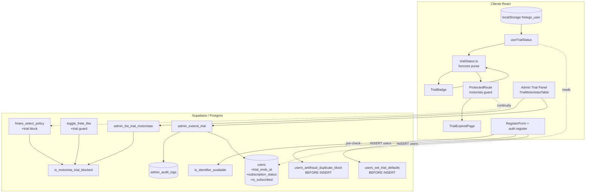

# Design Document — trial-e-bloqueio

## Overview

Esta feature adiciona ao FreteGO um período de teste gratuito (trial) de 30 dias **exclusivo para
motoristas**, com:

1. **Estado de trial** derivado de três colunas novas em `users` (`trial_ends_at`,
   `subscription_status`, `is_subscribed`).
2. **Contador visual** (`TrialBadge`) no `AppHeader`, com tiers de cor por urgência.
3. **Bloqueio de acesso** (`TrialExpiredPage`) para motoristas com trial expirado e sem
   assinatura, integrado ao `ProtectedRoute` das rotas de motorista.
4. **Continuidade de fretes em andamento**: o motorista bloqueado conclui fretes já aceitos e seu
   chat, mas não aceita novos.
5. **Anti-fraude no cadastro**: rejeita CPF, telefone ou e-mail já cadastrados, com mensagem
   canônica.
6. **Reforço no servidor (defense-in-depth)**: RLS/RPC negam dados protegidos a motoristas
   bloqueados.
7. **Painel admin**: visualizar status de trial por motorista, filtrar, listar prestes-a-expirar e
   estender trial manualmente com versionamento otimista e auditoria.

A regra-mãe de bloqueio é uma função pura e total:

> Um motorista está **bloqueado** quando `user_type = 'motorista'` **E** `trial_ends_at <= now`
> **E** `is_subscribed = false`. Embarcadores e admins **nunca** são bloqueados.

`subscription_status` é um **rótulo informativo** (em `'trial'`, `'active'`, `'past_due'`,
`'canceled'`, `'blocked'`); a fonte de verdade do bloqueio é o predicado acima (`trial_ends_at` +
`is_subscribed` + `user_type`), nunca o rótulo isolado. Isso evita divergência entre o rótulo
persistido e o estado real do relógio.

### Escopo (faithful ao requirements.md)

Esta spec implementa **somente** trial, bloqueio e anti-fraude. Cobrança real (Asaas, checkout,
webhook, planos pagos funcionais, dashboard financeiro de receita) está **fora** de escopo. O botão
"Assinar" leva à página existente `/motorista/plano` (placeholder "Em Breve"). Nenhuma coluna
específica de Asaas/plano é criada aqui. `is_subscribed` permanece `false` para todos.

### Alinhamento com convenções existentes

O design reutiliza, sem reinventar, os padrões consolidados do projeto:

- **Audit-by-construction** via `executeAdminMutation` (toda mutação admin).
- **RBAC server-side** em duas camadas via `is_admin_with_permission` (`USER_VIEW` para ver,
  `USER_EDIT` para estender — sem inventar permissão nova).
- **Versionamento otimista** `updated_at` + `STALE_VERSION`.
- **Master Admin imutável** (`admin_username = 'Nexus_Vortex99'`) — abortar antes do touch.
- **Stealth_404** para acesso admin sem permissão.
- **Migration idempotente** com `DO $check$` defensivo + par `_rollback.sql` (próximo número
  livre: **044**).
- **RPC security posture** (`SET search_path = public`, `auth.uid()` guard, `REVOKE/GRANT`).
- **Defesa em profundidade no signup** seguindo o mesmo modelo do trigger `users_blacklist_block`
  (BEFORE INSERT em `users`) + pré-check client (como `checkBlacklistGate`).
- **pt-BR** para texto user-facing; **inglês** para action/error codes e identificadores SQL.

## Architecture

### Camadas e fluxo



### Princípio de design: uma única regra, dois pontos de aplicação

A regra de bloqueio é codificada **duas vezes em paridade** — uma no cliente (TypeScript puro,
`isBlocked`/`computeTrialState`) para UX imediata, e uma no servidor (`is_motorista_trial_blocked`
em SQL) para autoridade. O cliente nunca é a fonte de verdade: mesmo que o front-end seja
manipulado, a RLS e os RPCs negam o acesso. Isso espelha a paridade já existente entre
`blacklistNormalize` (TS) e `blacklist_normalize` (SQL).

### Estratégia de bloqueio no roteamento

`ProtectedRoute` ganha um modo opcional de guarda de trial. Em vez de espalhar a checagem por
todas as rotas, introduzimos um wrapper fino `MotoristaProtectedRoute` (composição sobre
`ProtectedRoute`) que:

1. Exige autenticação (delegado ao `ProtectedRoute` atual).
2. Usa `useTrialStatus`. Se `isExpired === true` (motorista bloqueado), renderiza
   `TrialExpiredPage` **no lugar** do conteúdo.
3. Caso contrário, renderiza o conteúdo normalmente.

Rotas de motorista cobertas pelo bloqueio: a Home (`/`, quando o usuário é motorista — tratada
internamente pela própria HomePage, ver Components), `/perfil/motorista` continua acessível (o
motorista precisa poder ver/gerenciar a conta e assinar), `/mensagens`, `/assistente`. A página
`/motorista/plano` (alvo do botão "Assinar") **nunca** é bloqueada. O detalhamento de quais rotas
recebem o guard fica em Components and Interfaces.

### Continuidade de fretes em andamento

O modelo de dados atual não possui um campo explícito "frete aceito". A representação mais fiel de
um **frete em andamento de um motorista** é a existência de uma **`conversations`** ligando aquele
`frete_id` ao `motorista_id` — o chat só nasce quando motorista e embarcador entram em contato
sobre um frete específico. Portanto:

- **Frete em andamento (aceito)** := existe `conversations` com `frete_id = X` e
  `motorista_id = auth.uid()`.
- Motorista bloqueado **pode** ler/atualizar esses fretes específicos e seus chats (continuidade).
- Motorista bloqueado **não pode** ver a lista de fretes `ativo` gerais nem criar novo
  like/conversa (novo aceite).

Essa escolha evita criar um novo conceito de "aceite" fora de escopo e usa a estrutura existente.

## Components and Interfaces

### 1. Núcleo puro — `src/utils/trialStatus.ts` (novo)

Módulo **sem dependências de I/O** (sem `supabase`, sem React), alvo primário de property-based
testing. Espelha em TS a lógica SQL de `is_motorista_trial_blocked`.

```ts
export type UserTypeLike = 'motorista' | 'embarcador' | 'admin';

export type SubscriptionStatus =
  | 'trial'
  | 'active'
  | 'past_due'
  | 'canceled'
  | 'blocked';

export const SUBSCRIPTION_STATUSES: readonly SubscriptionStatus[] = [
  'trial', 'active', 'past_due', 'canceled', 'blocked',
] as const;

export interface TrialComputationInput {
  userType: UserTypeLike;
  trialEndsAt: Date | null;
  isSubscribed: boolean;
  subscriptionStatus: SubscriptionStatus;
  now?: Date; // default new Date(); injetável para testes
}

export interface TrialState {
  daysLeft: number;          // inteiro >= 0
  isExpired: boolean;        // true => motorista bloqueado
  isSubscribed: boolean;
  status: SubscriptionStatus;
}

export type BadgeTier = 'hidden' | 'green' | 'yellow' | 'red' | 'red-pulse';

const DAY_MS = 86_400_000;

/** days_left = max(0, ceil((trialEndsAt - now) / 86400000)). null => 0. */
export function computeDaysLeft(trialEndsAt: Date | null, now: Date): number;

/** Estado completo. Embarcador/Admin => { daysLeft: 0, isExpired: false, ... }. */
export function computeTrialState(input: TrialComputationInput): TrialState;

/** Tier de cor do badge a partir de daysLeft e isSubscribed/userType. */
export function selectBadgeTier(args: {
  userType: UserTypeLike;
  isSubscribed: boolean;
  daysLeft: number;
}): BadgeTier;
```

Regras (derivadas dos Requirements 2, 4):

- `computeDaysLeft`: `trialEndsAt == null` ⇒ `0`; senão
  `Math.max(0, Math.ceil((trialEndsAt.getTime() - now.getTime()) / DAY_MS))`.
- `computeTrialState`:
  - Se `userType !== 'motorista'` ⇒ `{ daysLeft: 0, isExpired: false, isSubscribed, status }`
    (Req 3.3, 7).
  - Senão `daysLeft = computeDaysLeft(...)`; `isExpired = (trialEndsAt != null && trialEndsAt <= now && !isSubscribed)` (Req 2.4, 5.1).
- `selectBadgeTier`:
  - `userType !== 'motorista'` ⇒ `'hidden'` (Req 4.2).
  - `isSubscribed === true` ⇒ `'hidden'` (Req 4.3).
  - `daysLeft === 0` ⇒ `'hidden'` (Req 4.8).
  - `daysLeft > 10` ⇒ `'green'` (Req 4.4).
  - `5 <= daysLeft <= 10` ⇒ `'yellow'` (Req 4.5).
  - `1 < daysLeft < 5` ⇒ `'red'` (Req 4.6).
  - `daysLeft === 1` ⇒ `'red-pulse'` (Req 4.7).

### 2. Hook — `src/hooks/useTrialStatus.ts` (novo)

```ts
export interface UseTrialStatusResult {
  daysLeft: number;
  isExpired: boolean;
  isSubscribed: boolean;
  status: SubscriptionStatus;
}

export function useTrialStatus(): UseTrialStatusResult;
```

Comportamento:

- Lê o usuário atual via `useAuth()`. Os campos de trial (`trialEndsAt`, `subscriptionStatus`,
  `isSubscribed`) passam a integrar o tipo `User` (ver Data Models) e são persistidos no cache
  `fretego_user`.
- Quando `useAuth().user == null`, faz **fallback** para o cache local `fretego_user`
  (`localStorage`) para derivar `userType` e os campos de trial (Req 3.4). Se também não houver
  cache, retorna `{ daysLeft: 0, isExpired: false, isSubscribed: false, status: 'trial' }`
  (Req 3.5).
- Delega 100% do cálculo a `computeTrialState` (núcleo puro). O hook não contém lógica de datas
  própria — apenas seleção de fonte de dados + memoização com `useMemo` sobre os campos do usuário.
- `now` usa `new Date()` no momento do render.

### 3. `src/components/TrialBadge.tsx` (novo)

- Consome `useTrialStatus()` + `selectBadgeTier(...)`.
- `tier === 'hidden'` ⇒ retorna `null` (não renderiza nada).
- Caso contrário renderiza pílula com texto **`Teste grátis: {daysLeft} dias`** (Req 4.1) e classes
  Tailwind por tier:
  - `green`: `bg-green-100 text-green-700 border-green-200`
  - `yellow`: `bg-yellow-100 text-yellow-700 border-yellow-200`
  - `red`: `bg-red-100 text-red-700 border-red-200`
  - `red-pulse`: idem `red` + `animate-pulse`
- Responsivo `<768px`: texto `text-[11px]`, padding compacto `px-2.5 py-1`, segue o estilo das
  outras pílulas do header (Req 4.9). Inclui `role="status"` e `aria-live="polite"` para
  acessibilidade.

### 4. `src/components/AppHeader.tsx` (alteração)

- Importar e renderizar `<TrialBadge />` no cluster da direita do header (junto da pílula de
  localização e do sino), antes do sino. O `TrialBadge` se auto-oculta para não-motoristas e
  assinantes, então o `AppHeader` não precisa de lógica condicional adicional.

### 5. `src/pages/TrialExpiredPage.tsx` (novo)

- Tela de bloqueio responsiva (`<768px`) renderizada **no lugar** do conteúdo das rotas de
  motorista bloqueadas.
- Mensagem: **"Seu teste expirou. Assine para continuar."** (Req 5.3).
- Botão **"Assinar"** que navega para `/motorista/plano` via `useNavigate` (Req 5.4).
- Tabela informativa de planos (Req 5.5), valores apenas exibidos (sem cobrança):
  - Mensal — **R$ 39,00/mês**
  - Trimestral — **R$ 87,00** (R$ 29,00/mês, pago de uma vez)
  - Semestral — **R$ 150,00** (R$ 25,00/mês, pago de uma vez)
- Constante exportável `PLAN_INFO` para reuso/teste de presença dos valores.

### 6. Roteamento — `src/components/ProtectedRoute.tsx` + `MotoristaProtectedRoute` (alteração/novo)

`ProtectedRoute` permanece responsável só por autenticação. Adiciona-se um wrapper:

```tsx
// src/components/MotoristaProtectedRoute.tsx
export function MotoristaProtectedRoute({ children }: { children: React.ReactNode }) {
  return (
    <ProtectedRoute>
      <TrialGate>{children}</TrialGate>
    </ProtectedRoute>
  );
}
```

`TrialGate` usa `useTrialStatus()`: se `isExpired` renderiza `<TrialExpiredPage />`, senão
`children`. Em `App.tsx`, as rotas de motorista sujeitas a bloqueio trocam `ProtectedRoute` por
`MotoristaProtectedRoute`:

- `/mensagens`, `/assistente` ⇒ `MotoristaProtectedRoute`.
- `/motorista/plano`, `/perfil/motorista`, `/configuracoes` ⇒ permanecem `ProtectedRoute` (acesso
  garantido para o motorista poder assinar/gerenciar conta).
- `/` (HomePage) trata o bloqueio internamente (ver abaixo), pois é rota pública compartilhada
  com visitantes/embarcadores.

> Nota: o `TrialGate` é inerte para embarcadores/admins porque `useTrialStatus` retorna
> `isExpired: false` para esses tipos (Req 7). Mesmo assim, as rotas marcadas como "motorista" só
> são acessadas por motoristas na navegação real.

### 7. HomePage — bloqueio do feed de fretes (alteração)

`HomePage` é compartilhada. Quando `user?.userType === 'motorista'` e `useTrialStatus().isExpired`,
a HomePage renderiza `<TrialExpiredPage />` no lugar do feed de fretes (Req 5.6), sem disparar
`getActiveFretes`. Visitantes, embarcadores e motoristas ativos seguem o fluxo normal.

### 8. Chat — bloqueio com continuidade (alteração)

`MensagensPage`/`FreteChatWidget` ficam atrás do `MotoristaProtectedRoute`. Porém, a continuidade
(Req 6.2) exige que conversas de fretes **já em andamento** permaneçam acessíveis. Como o bloqueio
de chat acontece no nível da rota `/mensagens`, e a regra de continuidade é primariamente
garantida no servidor (RLS de `conversations`/`messages` + `fretes`), o cliente:

- Mantém o acesso à lista de conversas existentes mesmo bloqueado **se** o produto exigir. Para
  esta spec, seguimos o requirements: o motorista bloqueado **pode** acessar o chat de fretes em
  andamento. Implementação: a rota `/mensagens` **não** recebe `TrialGate`; em vez disso, o
  `FreteChatWidget`/lista filtra para mostrar somente conversas vinculadas a fretes em andamento do
  motorista quando ele está bloqueado, e o envio de novas mensagens é permitido apenas nessas
  conversas. A negação de novos contatos é garantida no servidor.

> Decisão: priorizamos a **autoridade do servidor** para continuidade (RLS), e o cliente apenas
> reflete o que o servidor permite. Assim evitamos lógica de continuidade duplicada e frágil no
> front. O bloqueio "duro" (TrialExpiredPage) aplica-se ao **feed de fretes** e às telas de
> descoberta/assistente; o chat de fretes em andamento permanece funcional.

### 9. Anti-fraude no cadastro (alteração de `auth.register` + `RegisterForm`)

- **Pré-check (UX)**: antes do `INSERT`, `auth.register` chama
  `is_identifier_available('phone'|'cpf'|'email', value)` para cada identificador informado. Se
  qualquer um indisponível, lança `AuthError` com a mensagem canônica.
- **Autoridade (atomicidade)**: o trigger `users_antifraud_duplicate_block` (BEFORE INSERT em
  `users`) garante que **nenhum** registro seja criado em caso de duplicidade, independentemente do
  resultado de qualquer checagem isolada (Req 8.5). `auth.register` mapeia o erro do trigger para a
  mensagem canônica e executa o rollback compensatório já existente (delete em `users` + signOut).
- **Mensagem canônica** (Req 8.2–8.4): **"Este CPF/telefone/e-mail já está cadastrado."** —
  exportada como constante `DUPLICATE_IDENTIFIER_MESSAGE`.

> Observação de segurança: ao contrário do login (anti-enumeration genérico), o requirements pede
> explicitamente uma mensagem específica de duplicidade no cadastro. Mantemos exatamente o texto
> canônico solicitado.

### 10. Serviço admin — `src/services/admin/trial.ts` (novo)

Espelha a estrutura de `src/services/admin/users.ts`. Funções puras (filtros/URL/classificação) +
funções de I/O via RPC.

```ts
export type TrialStatusFilter = 'todos' | 'em_trial' | 'expirado' | 'assinante';
export type TrialSort = 'days_left_asc' | 'days_left_desc' | 'created_desc';

export interface TrialFilters {
  status: TrialStatusFilter;
  aboutToExpire: boolean;   // days_left <= 5 e > 0
  q: string;
  sort: TrialSort;
  page: number;
  pageSize: number;         // 10 | 50 | 100, default 10
}

export interface TrialMotoristaRow {
  id: string;
  name: string;
  phone: string;
  trial_ends_at: string | null;
  subscription_status: SubscriptionStatus;
  is_subscribed: boolean;
  days_left: number;        // computado pelo servidor (now() autoritativo)
  trial_state: 'em_trial' | 'expirado' | 'assinante';
  updated_at: string;       // para versionamento otimista
  admin_username: string | null;
}

export interface TrialListResult {
  rows: TrialMotoristaRow[];
  total: number;
  page: number;
  pageSize: number;
}

export type TrialErrorCode =
  | 'STALE_VERSION' | 'MASTER_PROTECTED' | 'NOT_FOUND'
  | 'NOT_MOTORISTA' | 'INVALID_INPUT' | 'PERMISSION_DENIED';

export const TRIAL_ERROR_MESSAGES: Record<TrialErrorCode, string>;

// Leitura (USER_VIEW). RPC admin_list_trial_motoristas.
export function listTrialMotoristas(filters: TrialFilters): Promise<TrialListResult>;

// Mutação (USER_EDIT) via executeAdminMutation -> RPC admin_extend_trial.
export function extendTrial(
  userId: string,
  newTrialEndsAt: string,      // ISO
  expectedUpdatedAt: string
): Promise<{ ok: true; updated_at: string }>;

// Helpers puros (URL <-> filtros), espelhando blacklist/users.
export function parseTrialFiltersFromQuery(qs: URLSearchParams | string): TrialFilters;
export function serializeTrialFiltersToQuery(f: TrialFilters): URLSearchParams;
```

`extendTrial` usa `executeAdminMutation` com `action: 'TRIAL_EXTEND'`, `targetType: 'users'`,
`targetId: userId`, `before/after` com o `trial_ends_at` antigo/novo. Trata `STALE_VERSION` com
toast "Outro admin atualizou. Recarregando." + refetch (padrão da casa).

### 11. UI admin (novos componentes/página)

- `src/pages/admin/trial/TrialListPage.tsx` — listagem compacta (sem `<h1>`, filtros em popover
  `SlidersHorizontal`, paginação `10/50/100`). Gate `useAdminPermission('USER_VIEW')` ⇒ caso
  negado, `<Stealth404 />` (Req 10.4). Degrada exibindo dados mesmo se o estilo compacto não puder
  ser mantido (Req 10.6).
- `src/components/admin/trial/TrialMotoristasTable.tsx` — tabela/cards mobile com status e
  dias restantes (Req 10.1). Coluna de status com badge (em trial / expirado / assinante).
- `src/components/admin/trial/TrialFilters.tsx` — popover com filtro por status + toggle
  "prestes a expirar" (Req 10.2, 10.3).
- `src/components/admin/trial/ExtendTrialModal.tsx` — date picker do novo `trial_ends_at`; lê
  `updated_at` ao abrir e reenvia (versionamento otimista). Botão desabilitado para Master Admin.
- `src/components/admin/AdminSidebar.tsx` — novo item de menu "Trial" (`/admin/trial`, permission
  `USER_VIEW`).
- `src/components/admin/AdminLayoutRoute.tsx` — nova rota `trial` ⇒ `TrialListPage`.

### 12. Tipos — `src/types/index.ts` (alteração)

`User` ganha os campos de trial (opcionais para retrocompatibilidade do cache):

```ts
export interface User {
  // ...campos existentes...
  trialEndsAt?: Date | null;
  subscriptionStatus?: SubscriptionStatus;
  isSubscribed?: boolean;
}
```

`auth.ts` (`login`, `register`, `getCurrentUser`, `refreshToken`) passa a mapear
`trial_ends_at`, `subscription_status`, `is_subscribed` do `users` para o objeto `User`.

## Data Models

### Alterações em `users` (Migration 044)

| Coluna                | Tipo          | Default                              | Notas |
|-----------------------|---------------|--------------------------------------|-------|
| `trial_ends_at`       | `timestamptz` | preenchido por trigger p/ motoristas | Instante de expiração do trial. |
| `subscription_status` | `text`        | `'trial'`                            | Domínio fechado via `CHECK`. Rótulo informativo. |
| `is_subscribed`       | `boolean`     | `false`                              | Assinatura paga ativa (sempre `false` nesta spec). |

`CHECK` de domínio fechado:

```sql
CHECK (subscription_status IN ('trial','active','past_due','canceled','blocked'))
```

Índices:

- `idx_users_trial_motoristas` — parcial em `(trial_ends_at)` `WHERE user_type = 'motorista'`
  (acelera listagem/filtros admin e a checagem de bloqueio).

**Granção do trial (Req 1)** — trigger `users_set_trial_defaults` (BEFORE INSERT):

- Se `NEW.user_type = 'motorista'` e `NEW.trial_ends_at IS NULL` ⇒
  `NEW.trial_ends_at := COALESCE(NEW.created_at, NOW()) + INTERVAL '30 days'`.
- `subscription_status`/`is_subscribed` já têm default `'trial'`/`false`.
- Para embarcador/admin não força `trial_ends_at` (sem efeito sobre acesso — Req 1.4).

**Backfill** (dentro da 044):

```sql
UPDATE users
   SET trial_ends_at = created_at + INTERVAL '30 days'
 WHERE user_type = 'motorista' AND trial_ends_at IS NULL;
```

> NOTA OPERACIONAL (destaque para decisão de negócio): motoristas antigos (criados há mais de 30
> dias) ficarão imediatamente classificados como bloqueados pelo backfill fiel ao requisito
> (`created_at + 30 dias`). Se o lançamento exigir uma janela de carência para a base existente,
> recomenda-se uma 044b posterior que estenda `trial_ends_at` para `now() + N dias` apenas para
> contas pré-existentes. O design mantém o comportamento fiel ao requirements (contagem a partir
> de `created_at`); a carência é uma decisão de produto fora do escopo funcional desta spec.

### Predicado de bloqueio no servidor — `is_motorista_trial_blocked`

```sql
CREATE OR REPLACE FUNCTION is_motorista_trial_blocked(p_user_id uuid)
RETURNS boolean
LANGUAGE sql STABLE SECURITY DEFINER
SET search_path = public
AS $func$
  SELECT EXISTS (
    SELECT 1 FROM users u
    WHERE u.id = p_user_id
      AND u.user_type = 'motorista'
      AND u.is_subscribed = false
      AND u.trial_ends_at IS NOT NULL
      AND u.trial_ends_at <= NOW()
  );
$func$;
```

`NULL`/embarcador/admin/assinante ⇒ `false`. Usada por RLS de `fretes` e pelos RPCs.

### Continuidade — relação frete↔conversa

Frete em andamento de um motorista := `EXISTS (SELECT 1 FROM conversations c WHERE c.frete_id =
fretes.id AND c.motorista_id = auth.uid())`. Não há nova tabela; reusa `conversations` (Migration
008).

### RLS de `fretes` (substitui `fretes_select_policy`)

```sql
DROP POLICY IF EXISTS fretes_select_policy ON fretes;
CREATE POLICY fretes_select_policy ON fretes
FOR SELECT
USING (
  embarcador_id = auth.uid()
  OR EXISTS (SELECT 1 FROM users WHERE id = auth.uid() AND user_type = 'admin')
  OR EXISTS (SELECT 1 FROM conversations c
              WHERE c.frete_id = fretes.id AND c.motorista_id = auth.uid())  -- continuidade (Req 9.4)
  OR (status = 'ativo' AND NOT is_motorista_trial_blocked(auth.uid()))        -- feed bloqueado p/ trial expirado (Req 9.1)
);
```

A policy admin separada (`fretes_admin_select`, migration 032) permanece. Políticas permissivas se
combinam por OR; o efeito é: motorista bloqueado **não** enxerga o feed `ativo`, mas **continua**
enxergando fretes com conversa própria.

### Anti-fraude — checagem isolada e trigger atômico

**RPC de disponibilidade (Req 8.7 — booleano independente):**

```sql
CREATE OR REPLACE FUNCTION is_identifier_available(p_type text, p_value text)
RETURNS boolean
LANGUAGE plpgsql STABLE SECURITY DEFINER
SET search_path = public
AS $func$
DECLARE v_norm text; v_exists boolean;
BEGIN
  IF p_type = 'phone' THEN
    v_norm := regexp_replace(p_value, '\D', '', 'g');
    IF length(v_norm) IN (12,13) AND left(v_norm,2) = '55' THEN v_norm := substring(v_norm,3); END IF;
    SELECT EXISTS(SELECT 1 FROM users WHERE regexp_replace(phone,'\D','','g') = v_norm) INTO v_exists;
  ELSIF p_type = 'cpf' THEN
    v_norm := regexp_replace(p_value, '\D', '', 'g');
    SELECT EXISTS(SELECT 1 FROM users WHERE regexp_replace(coalesce(cpf,''),'\D','','g') = v_norm AND v_norm <> '') INTO v_exists;
  ELSIF p_type = 'email' THEN
    v_norm := lower(trim(p_value));
    SELECT EXISTS(SELECT 1 FROM users WHERE lower(trim(coalesce(email,''))) = v_norm AND v_norm <> '') INTO v_exists;
  ELSE
    RAISE EXCEPTION 'invalid_identifier_type: %', p_type USING ERRCODE = 'P0001';
  END IF;
  RETURN NOT v_exists;  -- true = disponível; sem criar conta (independente do bloqueio de criação)
END;
$func$;
-- GRANT EXECUTE TO anon, authenticated (pré-signup, como is_blacklisted).
```

**Trigger atômico (Req 8.1–8.6):**

```sql
CREATE OR REPLACE FUNCTION users_antifraud_duplicate_block()
RETURNS trigger
LANGUAGE plpgsql SECURITY DEFINER
SET search_path = public
AS $func$
DECLARE v_norm text;
BEGIN
  -- phone
  IF NEW.phone IS NOT NULL THEN
    v_norm := regexp_replace(NEW.phone, '\D', '', 'g');
    IF EXISTS (SELECT 1 FROM users
                WHERE id <> NEW.id
                  AND regexp_replace(phone,'\D','','g') = v_norm) THEN
      RAISE EXCEPTION 'duplicate_identifier:phone' USING ERRCODE = 'P0001';
    END IF;
  END IF;
  -- cpf
  IF NEW.cpf IS NOT NULL AND regexp_replace(NEW.cpf,'\D','','g') <> '' THEN
    v_norm := regexp_replace(NEW.cpf, '\D', '', 'g');
    IF EXISTS (SELECT 1 FROM users
                WHERE id <> NEW.id
                  AND regexp_replace(coalesce(cpf,''),'\D','','g') = v_norm) THEN
      RAISE EXCEPTION 'duplicate_identifier:cpf' USING ERRCODE = 'P0001';
    END IF;
  END IF;
  -- email
  IF NEW.email IS NOT NULL AND lower(trim(NEW.email)) <> '' THEN
    v_norm := lower(trim(NEW.email));
    IF EXISTS (SELECT 1 FROM users
                WHERE id <> NEW.id
                  AND lower(trim(coalesce(email,''))) = v_norm) THEN
      RAISE EXCEPTION 'duplicate_identifier:email' USING ERRCODE = 'P0001';
    END IF;
  END IF;
  RETURN NEW;
END;
$func$;
-- DROP TRIGGER IF EXISTS users_antifraud_duplicate_block ON users; CREATE TRIGGER ... BEFORE INSERT.
```

A atomicidade (Req 8.5) vem de a checagem ser um único `BEFORE INSERT`: qualquer duplicidade
aborta a transação inteira antes de qualquer linha persistir. O resultado da RPC isolada
`is_identifier_available` (Req 8.7) não influencia esse aborto.

### RPC admin de listagem — `admin_list_trial_motoristas`

`SECURITY DEFINER`, `SET search_path = public`, guard `auth.uid()`, gating `USER_VIEW` com audit
negativo `TRIAL_VIEW_DENIED`. Parâmetros: `p_status text`, `p_about_to_expire boolean`,
`p_q text`, `p_sort text`, `p_limit int`, `p_offset int`. Calcula no servidor (autoridade do
`now()`):

```sql
days_left := GREATEST(0, CEIL(EXTRACT(EPOCH FROM (trial_ends_at - NOW())) / 86400.0))::int;
trial_state := CASE
  WHEN is_subscribed THEN 'assinante'
  WHEN trial_ends_at IS NOT NULL AND trial_ends_at <= NOW() THEN 'expirado'
  ELSE 'em_trial' END;
```

Filtro "prestes a expirar" ⇒ `days_left <= 5 AND days_left > 0` (Req 10.3). Retorna linhas +
`total` para paginação. Apenas `user_type = 'motorista'`.

### RPC admin de extensão — `admin_extend_trial`

```sql
CREATE OR REPLACE FUNCTION admin_extend_trial(
  p_user_id uuid,
  p_new_trial_ends_at timestamptz,
  p_expected_updated_at timestamptz
) RETURNS jsonb
LANGUAGE plpgsql SECURITY DEFINER SET search_path = public
AS $func$
DECLARE
  v_caller uuid := auth.uid();
  v_existing record;
  v_new_updated_at timestamptz;
BEGIN
  IF v_caller IS NULL THEN
    RAISE EXCEPTION 'permission_denied: missing auth.uid()' USING ERRCODE = '42501';
  END IF;
  IF NOT is_admin_with_permission('USER_EDIT') THEN
    INSERT INTO admin_audit_logs(admin_id, action, target_type, target_id, before_data, after_data)
    VALUES (v_caller, 'TRIAL_VIEW_DENIED', NULL, NULL, NULL,
            jsonb_build_object('user_id', v_caller, 'reason', 'permission_denied'));  -- audit negativo (Req 11.6)
    RAISE EXCEPTION 'permission_denied: USER_EDIT required' USING ERRCODE = '42501';
  END IF;

  IF p_new_trial_ends_at IS NULL OR p_new_trial_ends_at <= NOW() THEN
    RAISE EXCEPTION 'INVALID_INPUT: nova data deve ser futura' USING ERRCODE = 'P0001';
  END IF;

  SELECT id, user_type, admin_username, trial_ends_at, updated_at
    INTO v_existing FROM users WHERE id = p_user_id FOR UPDATE;
  IF NOT FOUND THEN
    RAISE EXCEPTION 'NOT_FOUND' USING ERRCODE = 'P0001';
  END IF;
  IF v_existing.admin_username = 'Nexus_Vortex99' THEN          -- Master imutável (Req 11.5), antes do touch
    RAISE EXCEPTION 'MASTER_PROTECTED' USING ERRCODE = 'P0001';
  END IF;
  IF v_existing.user_type <> 'motorista' THEN
    RAISE EXCEPTION 'NOT_MOTORISTA' USING ERRCODE = 'P0001';
  END IF;
  IF v_existing.updated_at <> p_expected_updated_at THEN        -- versionamento otimista (Req 11.2, 11.3)
    RAISE EXCEPTION 'STALE_VERSION: expected % got %', p_expected_updated_at, v_existing.updated_at
      USING ERRCODE = 'P0001';
  END IF;

  UPDATE users
     SET trial_ends_at = p_new_trial_ends_at,
         subscription_status = 'trial',   -- rótulo coerente; bloqueio é derivado de trial_ends_at + is_subscribed
         updated_at = NOW()
   WHERE id = p_user_id
     AND updated_at = p_expected_updated_at
   RETURNING updated_at INTO v_new_updated_at;

  RETURN jsonb_build_object('ok', true, 'updated_at', v_new_updated_at);
END;
$func$;
-- REVOKE ALL FROM PUBLIC; GRANT EXECUTE TO authenticated.
```

Estender `trial_ends_at` para o futuro torna `is_motorista_trial_blocked` falso na próxima
avaliação (Req 11.4), sem necessidade de campo de bloqueio explícito.

### Migration 044 — inventário de componentes

`044_trial_e_bloqueio.sql` (idempotente, `DO $check$` exigindo migration 030/031/008) +
`044_trial_e_bloqueio_rollback.sql`:

1. `ALTER TABLE users ADD COLUMN IF NOT EXISTS ...` (3 colunas) + `CHECK` de domínio.
2. Índice parcial `idx_users_trial_motoristas`.
3. Trigger `users_set_trial_defaults` (BEFORE INSERT).
4. Backfill de `trial_ends_at` para motoristas.
5. `is_motorista_trial_blocked(uuid)`.
6. Substituição de `fretes_select_policy` (com continuidade + bloqueio).
7. `is_identifier_available(text,text)` + GRANT anon/authenticated.
8. Trigger `users_antifraud_duplicate_block` (BEFORE INSERT).
9. Guard de trial em `toggle_frete_like` (CREATE OR REPLACE adicionando o check
   `is_motorista_trial_blocked` ⇒ `RAISE 'trial_blocked'`).
10. `admin_list_trial_motoristas(...)` (USER_VIEW + audit negativo).
11. `admin_extend_trial(...)` (USER_EDIT + master + versionamento + audit negativo).
12. `REVOKE/GRANT` em todas as funções; bloco `-- VERIFY` comentado ao final.

## Correctness Properties

*A property is a characteristic or behavior that should hold true across all valid executions of a
system — essentially, a formal statement about what the system should do. Properties serve as the
bridge between human-readable specifications and machine-verifiable correctness guarantees.*

As propriedades abaixo derivam da prework de critérios de aceite. O alvo primário é o núcleo puro
`src/utils/trialStatus.ts` (cálculo de dias, predicado de bloqueio, seleção de tier de badge) e os
predicados de autorização espelhados em TS para os RPCs/RLS (testados como modelo puro, com smoke
de integração separado). Critérios marcados como EXAMPLE/INTEGRATION/SMOKE na prework são cobertos
por unit/integration tests (ver Testing Strategy), não por PBT.

### Property 1: Cálculo de dias restantes

*For any* par de instantes `(trialEndsAt, now)` com `trialEndsAt` não-nulo,
`computeDaysLeft(trialEndsAt, now)` SHALL ser igual a
`max(0, ceil((trialEndsAt - now) / 86400000))`, SHALL ser sempre um inteiro `>= 0`, SHALL ser
`>= 1` sempre que `trialEndsAt > now`, e SHALL ser `0` sempre que `trialEndsAt <= now`. Para
`trialEndsAt` nulo o resultado SHALL ser `0`.

**Validates: Requirements 2.1, 2.2, 2.3**

### Property 2: Predicado de bloqueio e isenção

*For any* usuário com `(userType, trialEndsAt, isSubscribed, subscriptionStatus, now)`,
`computeTrialState(...).isExpired` SHALL ser `true` **se e somente se**
`userType === 'motorista' && trialEndsAt != null && trialEndsAt <= now && isSubscribed === false`.
Em particular, para qualquer `userType` em `{embarcador, admin}` e quaisquer valores de
`trialEndsAt`/`isSubscribed`/`subscriptionStatus`, `isExpired` SHALL ser `false` e `daysLeft` SHALL
ser `0`; e para qualquer motorista assinante (`isSubscribed === true`), `isExpired` SHALL ser
`false`. A versão SQL `is_motorista_trial_blocked` SHALL retornar `true` exatamente sob o mesmo
predicado (paridade) e `false` para não-motoristas.

**Validates: Requirements 1.4, 2.4, 5.1, 7.1, 7.2, 9.3**

### Property 3: Seleção de tier do TrialBadge (função total)

*For any* `(userType, isSubscribed, daysLeft)` com `daysLeft >= 0` inteiro, `selectBadgeTier(...)`
SHALL retornar exatamente: `'hidden'` quando `userType !== 'motorista'`, ou `isSubscribed === true`,
ou `daysLeft === 0`; `'green'` quando motorista não-assinante e `daysLeft > 10`; `'yellow'` quando
`5 <= daysLeft <= 10`; `'red'` quando `1 < daysLeft < 5`; `'red-pulse'` quando `daysLeft === 1`. A
função SHALL ser total (todo input produz exatamente um tier).

**Validates: Requirements 4.2, 4.3, 4.4, 4.5, 4.6, 4.7, 4.8, 7.4**

### Property 4: Concessão do trial (created_at + 30 dias)

*For any* instante `createdAt`, a função pura `computeTrialEndsAt(createdAt)` (espelho do trigger
`users_set_trial_defaults`) SHALL retornar exatamente `createdAt + 30 * 86400000 ms`.

**Validates: Requirements 1.1**

### Property 5: Continuidade de fretes em andamento

*For any* conjunto de fretes onde um subconjunto possui uma `conversation` ligada ao motorista
chamador, e *for any* estado de bloqueio do motorista, o predicado de autorização de leitura/escrita
(`canAccessFrete(frete, caller)`, espelho da `fretes_select_policy` e das RLS de
`conversations`/`messages`) SHALL permitir acesso a **todo** frete que possua conversa do chamador,
independentemente do bloqueio e do papel, e ao chat vinculado a esse frete.

**Validates: Requirements 6.1, 6.2, 9.4**

### Property 6: Negação de novo aceite por motorista bloqueado

*For any* motorista bloqueado (com ou sem fretes em andamento) e *for any* frete `ativo` sem
conversa própria, a tentativa de criar um novo aceite (predicado de guarda de `toggle_frete_like`)
SHALL ser rejeitada; e o feed de fretes `ativo` sem conversa própria SHALL ser negado na leitura.

**Validates: Requirements 5.6, 6.3, 9.1, 9.2**

### Property 7: Rejeição atômica de cadastro duplicado

*For any* base de usuários pré-existente e *for any* submissão de cadastro cujos identificadores
contenham pelo menos um CPF, telefone ou e-mail já em uso (em qualquer forma normalizada
equivalente), a operação de cadastro SHALL ser rejeitada com a mensagem canônica
`"Este CPF/telefone/e-mail já está cadastrado."` e a contagem de linhas em `users` SHALL permanecer
inalterada (nenhum registro criado), independentemente do resultado de qualquer checagem isolada de
disponibilidade.

**Validates: Requirements 8.1, 8.2, 8.3, 8.4, 8.5**

### Property 8: Disponibilidade quando todos os identificadores são únicos

*For any* trio `(cpf, telefone, email)` em que nenhum consta em conta existente,
`is_identifier_available` SHALL retornar `true` para cada um e o cadastro SHALL poder prosseguir.

**Validates: Requirements 8.6**

### Property 9: Checagem isolada de disponibilidade é booleana e sem efeito colateral

*For any* identificador e tipo válido, `is_identifier_available(type, value)` SHALL retornar
`NOT exists(value)` (booleano), SHALL não criar nenhuma conta, e a contagem de `users` SHALL
permanecer inalterada após a chamada — resultado distinto e independente do efeito de bloqueio de
criação da Property 7.

**Validates: Requirements 8.7**

### Property 10: Filtro de status de trial no painel admin

*For any* conjunto de motoristas de backing e *for any* filtro de status escolhido em
`{em_trial, expirado, assinante}`, todas as linhas retornadas por `admin_list_trial_motoristas`
SHALL ter `trial_state` igual ao status solicitado, e nenhuma linha com status diferente SHALL ser
incluída (o predicado de classificação `classifyTrialState` é a fonte da derivação).

**Validates: Requirements 10.2**

### Property 11: Lista de prestes-a-expirar

*For any* conjunto de motoristas de backing, o resultado do filtro "prestes a expirar" SHALL ser
exatamente o conjunto de motoristas cujo `days_left` satisfaz `0 < days_left <= 5`.

**Validates: Requirements 10.3**

### Property 12: Versionamento otimista na extensão de trial

*For any* par `(expectedUpdatedAt, currentUpdatedAt)`, `admin_extend_trial` SHALL aplicar a
atualização **se e somente se** `expectedUpdatedAt === currentUpdatedAt`; caso contrário SHALL
rejeitar com erro `STALE_VERSION` sem alterar o registro.

**Validates: Requirements 11.2, 11.3**

### Property 13: Extensão para o futuro desbloqueia

*For any* motorista bloqueado, após `admin_extend_trial` definir `trial_ends_at` para um instante
estritamente futuro, `is_motorista_trial_blocked` SHALL retornar `false` na avaliação seguinte
(composição do predicado de bloqueio com a extensão).

**Validates: Requirements 11.4**

## Error Handling

### Cliente (núcleo puro e hook)

- `computeDaysLeft`/`computeTrialState`/`selectBadgeTier` são **totais**: nunca lançam. Entrada
  `trialEndsAt` nula ⇒ `daysLeft = 0`. `subscriptionStatus` fora do domínio (cache corrompido) ⇒
  tratado como `'trial'` para fins de exibição; o bloqueio nunca depende do rótulo.
- `useTrialStatus`: se a leitura do cache `fretego_user` falhar (JSON inválido), captura e retorna
  o default seguro `{ daysLeft: 0, isExpired: false, isSubscribed: false, status: 'trial' }`
  (fail-open para não bloquear indevidamente; a autoridade é o servidor).

### Cadastro (anti-fraude)

- Pré-check `is_identifier_available`: em erro de rede/timeout, segue o padrão **fail-open** do
  `checkBlacklistGate` (não bloqueia o usuário no cliente; o trigger é a barreira final).
- Trigger `users_antifraud_duplicate_block` lança `duplicate_identifier:<campo>`; `auth.register`
  mapeia **qualquer** variante para a mensagem canônica `DUPLICATE_IDENTIFIER_MESSAGE` e dispara o
  rollback compensatório existente (`delete users` + `signOut`) para não deixar usuário órfão em
  `auth.users`.

### RPCs admin

- `auth.uid()` nulo ⇒ `permission_denied` (`42501`).
- Sem `USER_VIEW`/`USER_EDIT` ⇒ `permission_denied` + audit negativo `TRIAL_VIEW_DENIED`
  (`before=NULL`, `after={user_id, reason}`); UI traduz para `<Stealth404 />`.
- `STALE_VERSION` (`P0001`) ⇒ toast "Outro admin atualizou. Recarregando." + refetch.
- `MASTER_PROTECTED` ⇒ operação abortada antes do touch; toast informativo.
- `NOT_MOTORISTA` ⇒ extensão recusada (trial só se aplica a motoristas).
- `NOT_FOUND` ⇒ toast "Usuário não encontrado."
- `INVALID_INPUT` (data não-futura) ⇒ validação no modal antes do envio + recusa no servidor.
- Tabela `TRIAL_ERROR_MESSAGES` mapeia cada código para texto pt-BR.

### RLS / feed

- Falha de `getActiveFretes` por RLS não é mascarada como lista vazia (o serviço já propaga erro,
  ver `fretes.ts`); a HomePage exibe estado de erro via `ErrorBoundary`. Para motorista bloqueado,
  o caminho normal é **não** chamar `getActiveFretes` (HomePage renderiza `TrialExpiredPage`),
  evitando ruído de erro.

## Testing Strategy

### Abordagem dual

- **Property-based tests** (fast-check, mínimo 100 iterações): cobrem as 13 propriedades acima,
  focadas no núcleo puro `trialStatus.ts` e nos predicados de autorização/filtro espelhados em TS.
- **Unit/example tests** (Vitest): cobrem renderização (`TrialBadge`, `TrialExpiredPage`),
  delegação do hook, shape do contrato, conteúdo estático (mensagens/valores de plano), navegação,
  e edge cases (3.5 sem auth/sem cache).
- **Integration/smoke tests**: cobrem wiring de RPC/audit (11.1, 11.6), gating RBAC/Stealth404
  (10.4), defaults de schema (1.2, 1.3), e a paridade SQL↔TS dos predicados (1–3 execuções reais
  ou via mocks do `supabase`).

### Biblioteca e configuração PBT

- Biblioteca: **fast-check** (`^4.6.0`, já no projeto). Não implementar PBT do zero.
- Mínimo **100 iterações** por property test (`{ numRuns: 100 }` ou mais, como nos testes
  existentes que usam 200).
- Cada property test referencia sua propriedade de design via tag em comentário:
  **`Feature: trial-e-bloqueio, Property {n}: {texto}`**.
- Cada propriedade é implementada por **um único** property test.
- Convenções do projeto (steering): `fc.stringOf` não existe (usar
  `fc.string({minLength,maxLength}).filter(...)`); geradores de CPF/telefone/email usam
  `fc.constantFrom([...templates fixos válidos])` para evitar valores que falham na validação;
  `vi.mock` é hoisted — expor spies via `(globalThis as Record<string, unknown>).__spy`.

### Geradores (resumo)

- **Datas**: `fc.date({ min, max })` para `now` e `trialEndsAt`, cobrindo passado, futuro e a
  fronteira de igualdade (incluir casos `trialEndsAt === now` e diferenças sub-dia para exercitar o
  `ceil`).
- **userType**: `fc.constantFrom('motorista','embarcador','admin')`.
- **subscriptionStatus**: `fc.constantFrom(...SUBSCRIPTION_STATUSES)`.
- **daysLeft** (Property 3): `fc.nat({ max: 400 })` cobrindo todas as faixas de tier, com inclusão
  explícita das fronteiras 0, 1, 5, 10, 11.
- **Identificadores** (Properties 7–9): `fc.constantFrom` de CPFs/telefones/emails válidos fixos,
  com variações de formatação (pontos/traços/DDI 55) para validar normalização.
- **Backing admin** (Properties 10–11): `fc.array` de motoristas com `trial_ends_at` variados;
  modelo de referência calcula `days_left`/`trial_state` puramente para comparação.

### Localização dos testes

- `src/__tests__/trialStatus.property.test.ts` — Properties 1–4 (núcleo puro).
- `src/__tests__/trialBadge.property.test.ts` — Property 3 (tier) + render examples (4.1, 4.9).
- `src/__tests__/trialAuthz.property.test.ts` — Properties 5, 6, 13 (predicados de autorização
  espelhados).
- `src/__tests__/antifraude.property.test.ts` — Properties 7, 8, 9 (modelo de duplicidade).
- `src/__tests__/admin/trial/trialFilters.property.test.ts` — Properties 10, 11 (filtros puros).
- `src/__tests__/admin/trial/extendTrial.property.test.ts` — Property 12 (versionamento otimista,
  via modelo do predicado de aceite/rejeição).
- Exemplos/integration: `src/__tests__/admin/trial/*.test.ts`, `useTrialStatus.test.ts`,
  `trialExpiredPage.test.tsx`, e smokes de migration (VERIFY manual no `.sql`).

### Paridade SQL↔TS

As funções puras TS (`isBlocked`, `computeDaysLeft`, `classifyTrialState`, normalização de
identificador) são a especificação executável dos predicados SQL (`is_motorista_trial_blocked`,
`admin_list_trial_motoristas`, `is_identifier_available`). Testes de paridade (mesma família dos
testes `blacklistNormalize` TS↔SQL existentes) garantem que cliente e servidor concordam, evitando
divergência entre UX e autoridade.
