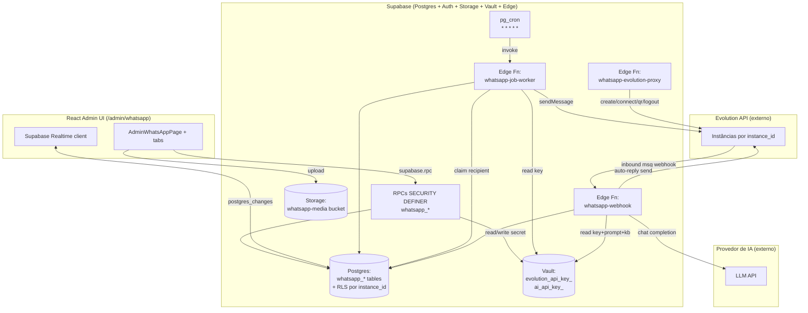
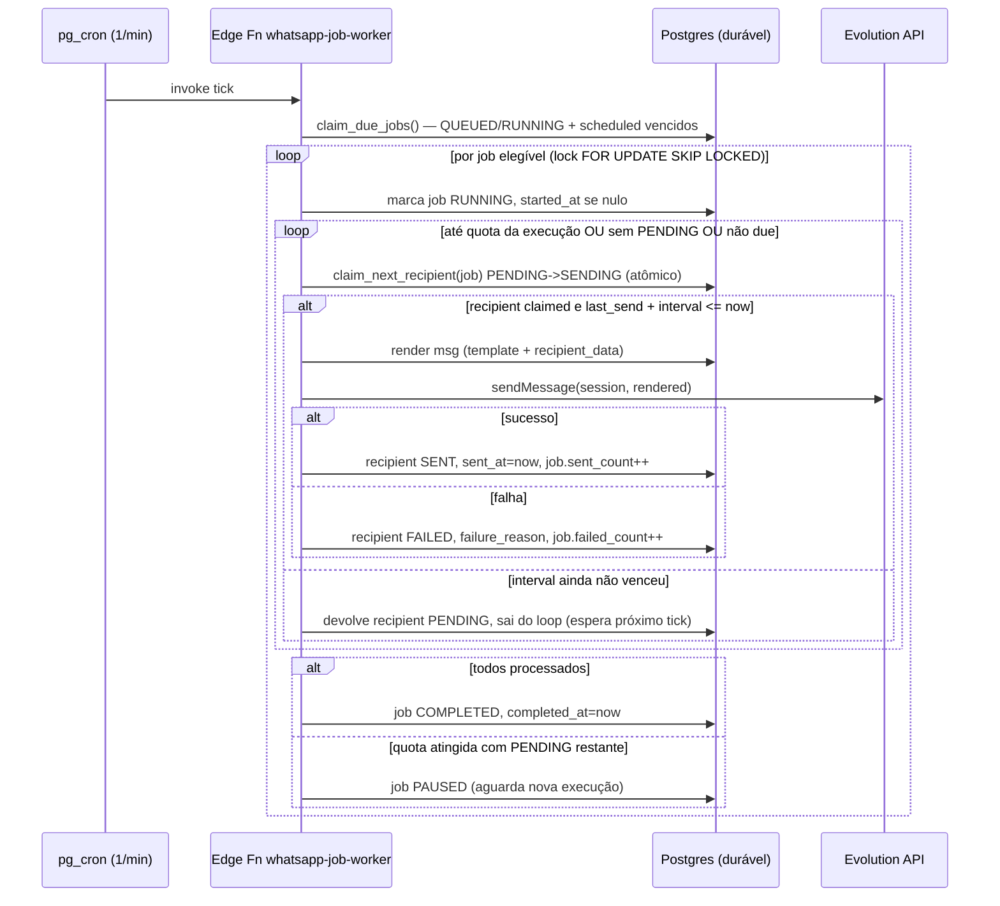
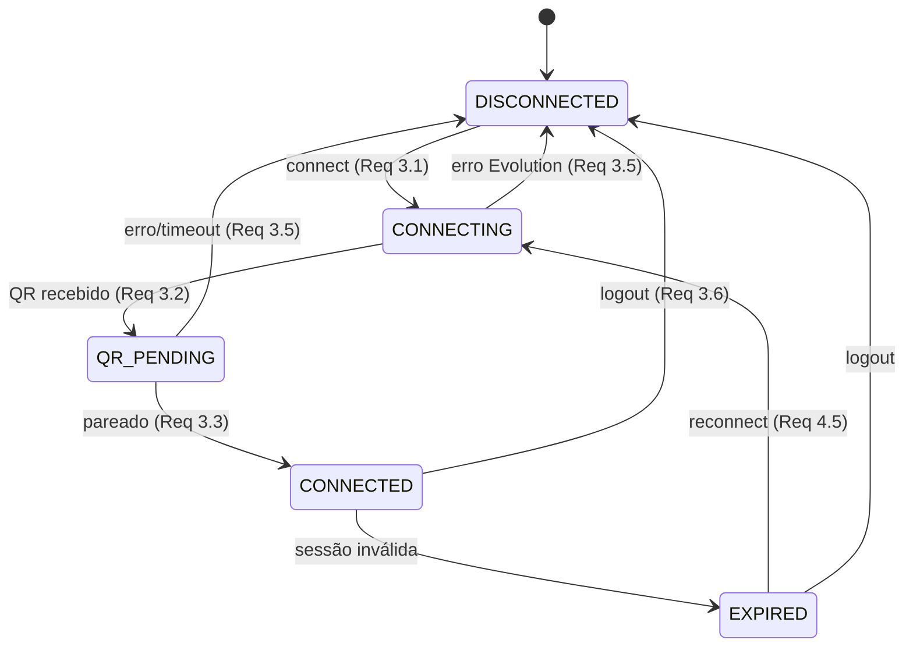
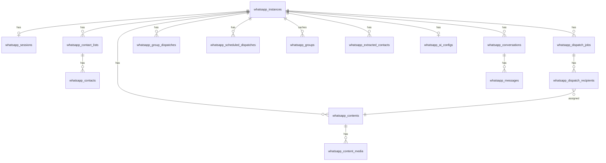
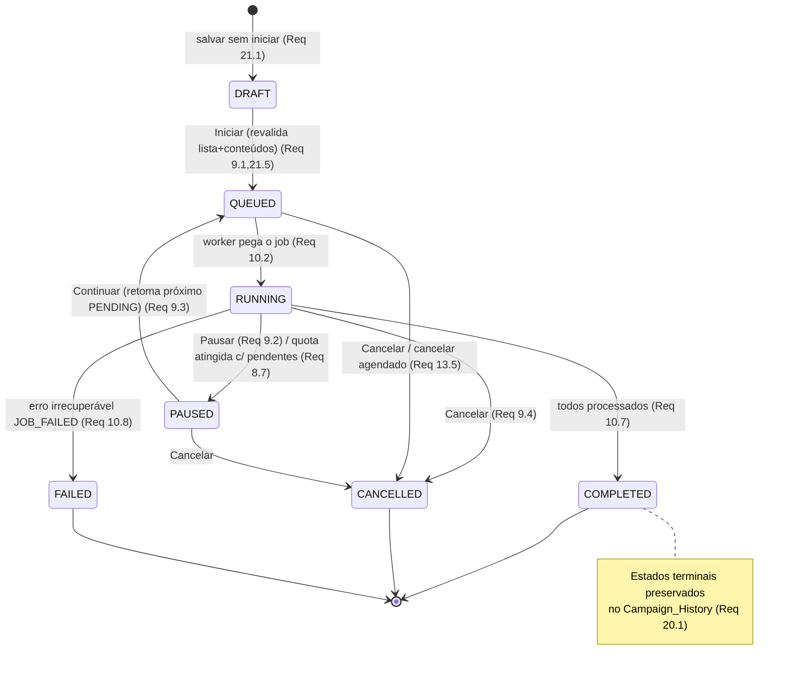
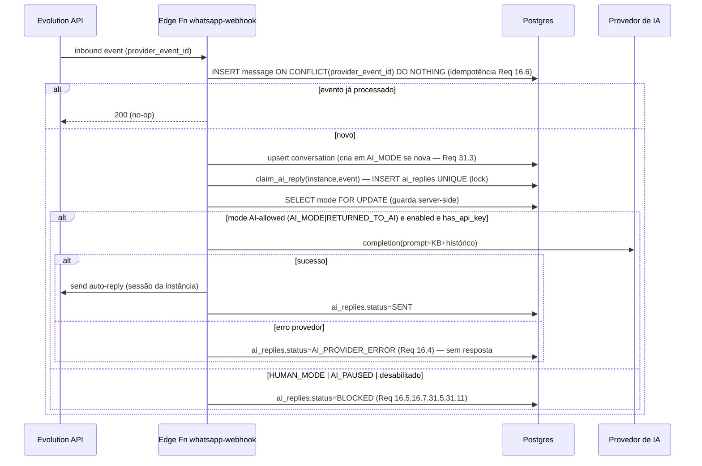
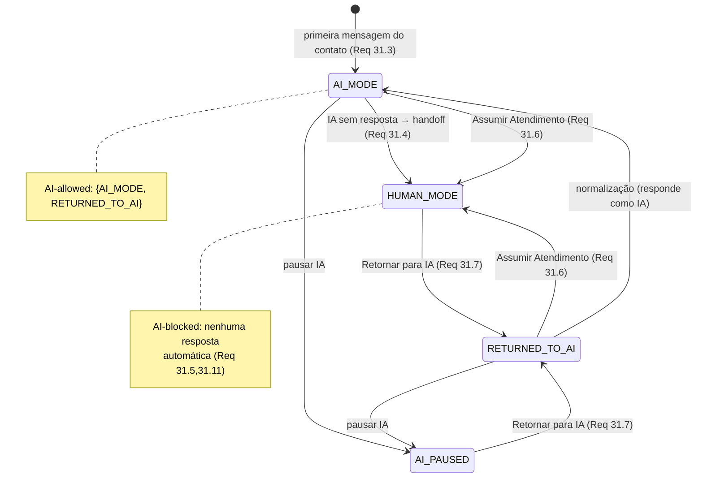

# Design Document — WhatsApp Automation

## Overview

O **WhatsApp_Module** substitui o placeholder de `AdminWhatsAppPage` em
`/admin/whatsapp` por uma central completa de automação de WhatsApp do painel admin
do FreteGO, integrada à **Evolution API**. O módulo é **multi-instância, ilimitado e
data-driven** desde a concepção (Req 2, 29): nenhuma camada (schema, RPC, RLS,
Job_Worker, UI) codifica a quantidade de instâncias — toda entidade é chaveada por
`instance_id` e a quantidade exibida deriva de `Max_Instances` (valor inicial 5).

O processamento de disparos (massa, grupo, programado) é **server-side e durável**:
a fila vive em Postgres, e um **Job_Worker implementado como Supabase Edge Function
acionada por `pg_cron`** drena a fila em background. Isso garante que um disparo
continue mesmo que o admin feche a aba/navegador (Req 10) **e** que sobreviva ao
reinício do servidor (Req 27), pois o estado de verdade é o banco — não a memória de
um processo. Cada `Dispatch_Recipient` é uma unidade durável de trabalho com
idempotência própria (sem envio duplicado).

A conexão é **única por instância** (Req 3, 4): o admin lê o QR uma vez e a
`WhatsApp_Session` autenticada é reutilizada por todos os módulos da instância
(Disparo em Massa, Grupo, Programados, IA, Extrator). Segredos sensíveis
(`Evolution_Api_Key`, `AI_Api_Key`) ficam no **Supabase Vault**, escopados por
`instance_id`, nunca em colunas nem em respostas (Req 3.7, 14, 18.7).

O módulo herda integralmente os padrões do painel admin: `executeAdminMutation`
(audit-by-construction), RBAC em duas camadas com `is_admin_with_permission`,
versionamento otimista `updated_at`/`STALE_VERSION`, idempotência `_SKIPPED`,
`Stealth404`, e RPCs `SECURITY DEFINER` com `SET search_path = public` +
`REVOKE ALL FROM PUBLIC` + `GRANT EXECUTE TO authenticated`. Mensagens user-facing em
pt-BR; action/error codes em inglês. Todas as alterações de schema entram na
migration **044**, idempotente, com par `044_whatsapp_automation_rollback.sql`.

### Mapa de requisitos → seções de design

| Área | Requisitos | Seção |
|------|-----------|-------|
| Gating / RBAC | 1 | Components, Security Posture |
| Multi-instância / isolamento | 2, 29 | Architecture, Data Models, Properties |
| Conexão / sessão única | 3, 4 | Architecture (Sessão), Components |
| Disparo em massa (lista, conteúdos, distribuição, ritmo) | 5, 6, 7, 8 | Dispatch Engine |
| Controles / estado / durabilidade / progresso | 9, 10, 11 | Dispatch State Machine, Realtime |
| Grupo / programados | 12, 13 | Dispatch Engine, Scheduler |
| IA (chave, base, auto-reply, isolamento, prompt) | 14, 15, 16, 26 | AI Service |
| Extrator | 17 | Contact Extractor |
| Integração / segredos | 18 | Security Posture, Migration |
| Dashboard / histórico / drafts / fila / erros | 19, 20, 21, 22, 23 | Read Surfaces |
| CSV / variáveis / estatísticas | 24, 25, 28 | CSV, Message Rendering, Statistics |
| Recovery | 27 | Recovery Process |
| Inbox / handoff IA↔humano | 30, 31 | Conversation Subsystem, Conversation_Mode SM |

## Architecture

### Visão de alto nível



### Decisão central: por que durabilidade via Postgres + pg_cron + Edge Function

O requisito-chave (Req 10.2, 27) é processamento que sobrevive ao fechamento do
browser **e** ao reinício do servidor. Há três alternativas:

1. **Worker em memória no browser** — descartado: morre ao fechar a aba.
2. **Worker long-running em servidor dedicado** — descartado: o FreteGO não mantém
   um processo Node persistente próprio; e um processo em memória perde estado no
   restart.
3. **Fila durável em Postgres + Edge Function agendada por `pg_cron`** — **adotado**.

Na alternativa adotada, **o banco é a única fonte de verdade**. O `pg_cron` invoca a
Edge Function `whatsapp-job-worker` a cada minuto (tick). Cada tick é *stateless*:
lê o estado durável, faz uma fatia de trabalho respeitando `Send_Interval`/quota, e
persiste o progresso. Se o tick morrer no meio, o próximo tick retoma do próximo
`Dispatch_Recipient PENDING` (Req 10.4, 27.2). Não existe estado em memória a
recuperar — a "recuperação" é simplesmente o comportamento normal do próximo tick
(Recovery_Process, Req 27).

> Nota de configuração: o agendamento por `pg_cron` chamando `net.http_post`
> (extensão `pg_net`) para a Edge Function, com o secret de invocação no Vault. Como
> os ticks são curtos, o pacing por `Send_Interval` é feito **olhando o relógio**, não
> dormindo dentro do tick (ver Dispatch Engine → Pacing).

### Modelo de execução do Job_Worker (tick)



### Isolamento multi-instância (invariante central)

Toda tabela do módulo carrega `instance_id uuid NOT NULL REFERENCES
whatsapp_instances(id)`. O isolamento é garantido em **três camadas redundantes**:

1. **RLS** em cada tabela: políticas `USING`/`WITH CHECK` que exigem
   `is_admin_with_permission('SETTINGS_VIEW')` (leitura) /`'SETTINGS_EDIT'` (escrita) e
   restringem por `instance_id` pertencente a uma instância válida.
2. **Filtragem por `instance_id` nas RPCs** `SECURITY DEFINER`: toda RPC recebe
   `p_instance_id` e injeta `WHERE instance_id = p_instance_id` em todo SELECT/UPDATE;
   entidades-filho são sempre validadas contra o `instance_id` do pai (ex.: um
   `dispatch_recipient` só é tocado se seu `dispatch_job` pertence a `p_instance_id`).
3. **Anti-enumeração**: `instance_id` inexistente/sem acesso ⇒ Canonical_Message
   `Não foi possível concluir a operação.` (Req 2.8, 30.8), sem revelar existência.

**Invariante de isolamento total (Req 2.7, 26.5, 31.18):** para quaisquer instâncias
distintas A e B, nenhuma entidade de A é lida/retornada/usada em operação de B. Como
toda RPC é parametrizada por `p_instance_id` e todo acesso a filho passa pelo pai com
mesmo `instance_id`, o resultado de qualquer operação depende exclusivamente de linhas
com aquele `instance_id` — propriedade verificável (ver Correctness Properties P1).

### Sessão única por instância



Existe **no máximo uma** `whatsapp_session` por `instance_id` (constraint `UNIQUE
(instance_id)`), reutilizada por todos os módulos (Req 4.1, 4.2). O nome de instância
na Evolution API é derivado deterministicamente do `instance_id` (ex.:
`frego_wa_<instance_id>`), garantindo que cada módulo use a sessão da própria
instância (Req 4.6, 10.9).

## Components and Interfaces

### Estrutura de pastas (convenção FreteGO)

```
src/
  pages/admin/whatsapp/
    AdminWhatsAppPage.tsx            # shell: Instance_Panel + tabs (substitui placeholder)
  components/admin/whatsapp/
    InstancePanel.tsx                # Req 2, 29 (data-driven)
    ConnectionCard.tsx               # QR + status (Req 3)
    InstanceDashboard.tsx            # Req 19
    BulkDispatchTab.tsx              # Req 5-11
    GroupDispatchTab.tsx             # Req 12
    ScheduledDispatchTab.tsx         # Req 13
    AIServiceTab.tsx                 # Req 14,15,26
    ConversationInbox.tsx            # Req 30,31
    ContactExtractorTab.tsx          # Req 17
    ExecutionQueue.tsx               # Req 22
    CampaignHistory.tsx              # Req 20
    DraftsList.tsx                   # Req 21
    ErrorLog.tsx                     # Req 23
    ContentEditor.tsx / MediaUploader.tsx / MessagePreview.tsx  # Req 6,25
  services/admin/whatsapp/
    instances.ts  session.ts  contacts.ts  contents.ts
    dispatch.ts   groups.ts   scheduled.ts  ai.ts
    conversations.ts  extractor.ts  stats.ts  csv.ts
    distribution.ts  render.ts  validation.ts   # lógica pura (property-tested)
  hooks/
    useWhatsAppInstance.ts  useRealtimeDispatch.ts
supabase/
  functions/
    whatsapp-job-worker/index.ts
    whatsapp-webhook/index.ts
    whatsapp-evolution-proxy/index.ts
  migrations/
    044_whatsapp_automation.sql
    044_whatsapp_automation_rollback.sql
src/__tests__/admin/whatsapp/          # unit + property (cpN_*.property.test.ts)
tests/whatsapp/                        # integração Supabase / Evolution mock
```

### Camada de serviços (TypeScript)

Mutações usam `executeAdminMutation`; leituras chamam RPCs diretamente. Tipos de
resultado seguem o padrão de skip/stale do painel.

```ts
// resultado canônico de mutação
type MutationResult<T> =
  | { ok: true; data: T; updated_at: string }
  | { skipped: true; reason: string };           // _SKIPPED (Req 9.5, 23.5, 31.15)
// erros lançados: 'permission_denied' | 'STALE_VERSION' | 'INVALID_STATE_TRANSITION'
//               | 'INVALID_CONVERSATION_MODE' | 'JOB_FAILED' | Canonical_Message

// dispatch.ts (exemplos)
function createDispatchJob(instanceId: string, input: DispatchInput): Promise<MutationResult<DispatchJob>>;
function transitionDispatch(instanceId: string, jobId: string,
  action: 'START'|'PAUSE'|'RESUME'|'CANCEL', expectedUpdatedAt: string): Promise<MutationResult<DispatchJob>>;
function resendFailed(instanceId: string, jobId: string): Promise<MutationResult<DispatchJob>>;  // Req 23

// distribution.ts / render.ts — PURO, sem I/O (alvo de property tests)
function assignContents(recipients: Recipient[], contents: Content[],
  mode: DistributionMode, blockSize: number): Assignment[];                   // Req 7
function renderMessage(template: string, data: RecipientData): string;        // Req 25
function normalizeNumbers(raw: string): { valid: string[]; invalid: string[] }; // Req 5,24
function estimatedCompletionMs(pending: number, intervalSec: number): number; // Req 28
function toCsv(rows: string[][]): string;                                     // Req 24
```

### RPCs (servidor) — lista resumida

Todas: `SECURITY DEFINER`, `SET search_path = public`, checam `auth.uid()` e
`is_admin_with_permission(...)`, `REVOKE ALL FROM PUBLIC` + `GRANT EXECUTE TO
authenticated`, e recebem `p_instance_id` (exceto `whatsapp_list_instances`). Ver
seção Security Posture para a tabela completa de permissões.

### Edge Functions

- **whatsapp-job-worker** — tick do drenador de fila (acima). `verify_jwt = false`
  (acionada por `pg_cron`/secret interno; valida secret próprio no header).
- **whatsapp-webhook** — recebe eventos inbound da Evolution API; idempotência por
  `provider_event_id`; resolve `instance_id` pela instância Evolution; persiste
  mensagem e dispara o caminho de auto-reply respeitando `Conversation_Mode`.
  `verify_jwt = false` (chamada externa por webhook; valida assinatura/token Evolution).
- **whatsapp-evolution-proxy** — proxy autenticado (`verify_jwt = true`) para
  connect/QR/status/logout e listagem de grupos/participantes, lendo a
  `Evolution_Api_Key` do Vault por instância (a chave nunca trafega ao browser).

> Segurança: as funções com `verify_jwt = false` são endpoints expostos. Mitigação:
> `whatsapp-job-worker` exige um header secreto (Vault) que só o `pg_cron` conhece;
> `whatsapp-webhook` valida o token/assinatura configurado na Evolution API. Ambas
> tratam o corpo recebido como **dado não confiável** e nunca ecoam segredos.

## Data Models

### ENUM / domínios de status

```sql
-- domínios fechados (CHECK constraints, validados também no backend)
session_status   : 'DISCONNECTED' | 'CONNECTING' | 'QR_PENDING' | 'CONNECTED' | 'EXPIRED'
dispatch_status  : 'DRAFT' | 'QUEUED' | 'RUNNING' | 'PAUSED' | 'COMPLETED' | 'CANCELLED' | 'FAILED'
recipient_status : 'PENDING' | 'SENDING' | 'SENT' | 'FAILED' | 'SKIPPED'
distribution_mode: 'BLOCK' | 'INTERLEAVED'
dispatch_kind    : 'BULK' | 'GROUP'
media_type       : 'IMAGE' | 'VIDEO' | 'AUDIO' | 'DOCUMENT'
conversation_mode: 'AI_MODE' | 'HUMAN_MODE' | 'AI_PAUSED' | 'RETURNED_TO_AI'
msg_direction    : 'INBOUND' | 'OUTBOUND'
```

### Diagrama entidade-relacionamento



### Tabelas (migration 044)

Convenção comum a TODAS: `id uuid PK default gen_random_uuid()`,
`instance_id uuid NOT NULL REFERENCES whatsapp_instances(id) ON DELETE CASCADE`
(exceto a própria `whatsapp_instances`), `created_at timestamptz default now()`,
`updated_at timestamptz default now()` (com trigger de touch), e índice em
`(instance_id, ...)`. RLS habilitada em todas.

```sql
-- 1) Instâncias (data-driven; Max_Instances é COUNT de linhas habilitadas — Req 29)
whatsapp_instances(
  id, label text NOT NULL,                  -- "WhatsApp 1", ...
  display_order int NOT NULL,               -- ordenação no painel (não é limite)
  enabled boolean NOT NULL default true,
  evolution_instance_name text NOT NULL UNIQUE,  -- derivado de id
  created_at, updated_at,
  UNIQUE(display_order)
)
-- seed inicial: 5 linhas habilitadas. Aumentar = inserir linhas (sem DDL). Req 29.3

-- 2) Sessão única por instância (Req 3,4)
whatsapp_sessions(
  id, instance_id UNIQUE,                   -- <= 1 sessão por instância (Req 4.2)
  status session_status NOT NULL default 'DISCONNECTED',
  qr_code text,                             -- transitório; limpo ao conectar
  last_connected_at timestamptz, updated_at
)  -- Evolution_Api_Key NÃO fica aqui — vai no Vault (Req 3.7,18.7)

-- 3) Listas de contatos e contatos (Req 5,24)
whatsapp_contact_lists(id, instance_id, name text, created_at, updated_at)
whatsapp_contacts(
  id, instance_id, list_id REFERENCES whatsapp_contact_lists,
  phone text NOT NULL,                      -- E.164 normalizado
  recipient_data jsonb NOT NULL default '{}',  -- {nome,empresa,...} do CSV (Req 25.3)
  UNIQUE(list_id, phone)                    -- dedup por lista (Req 5.3)
)

-- 4) Conteúdos e mídias (Req 6)
whatsapp_contents(
  id, instance_id, dispatch_job_id REFERENCES whatsapp_dispatch_jobs NULL,
  body text,                                -- template com Message_Variables (Req 25.7)
  position int NOT NULL,                    -- ordem para INTERLEAVED/BLOCK (Req 7.3)
  is_valid boolean NOT NULL default true    -- texto OU >=1 mídia (Req 6.5)
)
whatsapp_content_media(
  id, instance_id, content_id REFERENCES whatsapp_contents ON DELETE CASCADE,
  media_type media_type NOT NULL,
  storage_path text NOT NULL,               -- bucket whatsapp-media
  mime_type text NOT NULL                   -- validado, INVALID_FILE_TYPE (Req 6.3)
)

-- 5) Jobs e destinatários (Req 7-11,20,23)
whatsapp_dispatch_jobs(
  id, instance_id,
  kind dispatch_kind NOT NULL,              -- BULK | GROUP
  status dispatch_status NOT NULL default 'DRAFT',
  distribution_mode distribution_mode,      -- null para GROUP
  block_size int,                           -- para BLOCK (Req 7.2)
  send_interval_sec int NOT NULL CHECK (send_interval_sec > 0),  -- Req 8.2
  execution_quota int CHECK (execution_quota >= 1),              -- Req 8.4
  total_count int NOT NULL default 0,
  sent_count int NOT NULL default 0,
  failed_count int NOT NULL default 0,
  skipped_count int NOT NULL default 0,
  exec_sent_count int NOT NULL default 0,   -- enviados na execução corrente (quota — Req 8.5)
  source_job_id uuid,                        -- duplicar/reenviar/failed-resend (Req 20,23)
  started_at timestamptz, completed_at timestamptz,  -- Execution_Duration (Req 20.10)
  last_send_at timestamptz,                  -- pacing (Req 8.6)
  failure_code text,                         -- JOB_FAILED (Req 10.8)
  created_at, updated_at,
  INDEX (instance_id, status)
)
whatsapp_dispatch_recipients(
  id, instance_id, dispatch_job_id REFERENCES whatsapp_dispatch_jobs ON DELETE CASCADE,
  target_kind text NOT NULL,                 -- 'CONTACT' | 'GROUP'
  phone text,                                -- para CONTACT
  group_jid text,                            -- para GROUP
  recipient_data jsonb NOT NULL default '{}',-- snapshot p/ render (Req 25.2)
  assigned_content_id uuid REFERENCES whatsapp_contents,  -- exatamente 1 (Req 7.4)
  seq int NOT NULL,                          -- ordem determinística de processamento
  status recipient_status NOT NULL default 'PENDING',
  sent_at timestamptz,
  failure_reason text,                       -- pt-BR, sem segredos (Req 23.1,23.8)
  provider_message_id text,
  UNIQUE(dispatch_job_id, seq),
  INDEX (dispatch_job_id, status)            -- claim do próximo PENDING (Req 10.4)
)

-- 6) Disparo em grupo e agendados (Req 12,13)
whatsapp_group_dispatches(
  id, instance_id, dispatch_job_id REFERENCES whatsapp_dispatch_jobs,
  group_jids text[] NOT NULL                 -- 1+ grupos (Req 12.2)
)
whatsapp_scheduled_dispatches(
  id, instance_id, dispatch_job_id REFERENCES whatsapp_dispatch_jobs,
  scheduled_at timestamptz NOT NULL,         -- futuro (Req 13.2)
  executed_at timestamptz,                   -- null = pendente
  INDEX (instance_id, scheduled_at) WHERE executed_at IS NULL
)

-- 7) Cache de grupos (Req 12.1,17.1)
whatsapp_groups(
  id, instance_id, group_jid text NOT NULL, name text, participant_count int,
  fetched_at timestamptz, UNIQUE(instance_id, group_jid)
)

-- 8) Extração de contatos (Req 17)
whatsapp_extracted_contacts(
  id, instance_id, extraction_id uuid NOT NULL, source_group_jid text,
  phone text NOT NULL, is_valid boolean NOT NULL default true,
  INDEX (instance_id, extraction_id)
)

-- 9) Config de IA por instância (Req 14,15,26) — segredo no Vault
whatsapp_ai_configs(
  id, instance_id UNIQUE,
  enabled boolean NOT NULL default false,
  ai_prompt text,                            -- persona (Req 26)
  knowledge_base text,                       -- grande volume (Req 15.2)
  has_api_key boolean NOT NULL default false,-- indicador; chave fica no Vault (Req 14.2)
  handoff_message text,                      -- AI_Handoff_Message (Req 31.4)
  updated_at
)

-- 10) Conversas e mensagens (Req 30,31)
whatsapp_conversations(
  id, instance_id, contact_phone text NOT NULL,
  mode conversation_mode NOT NULL default 'AI_MODE',  -- Req 31.3
  last_message_preview text, last_message_at timestamptz,
  responder_lock text,                       -- 'AI' | 'HUMAN' — lock do responsável único
  updated_at,
  UNIQUE(instance_id, contact_phone),        -- 1 conversa por contato/instância
  INDEX (instance_id, last_message_at DESC)
)
whatsapp_messages(
  id, instance_id, conversation_id REFERENCES whatsapp_conversations ON DELETE CASCADE,
  direction msg_direction NOT NULL,
  body text, provider_event_id text,         -- idempotência webhook (Req 16.6,31.12)
  created_at,
  UNIQUE(instance_id, provider_event_id),    -- dedup de eventos inbound
  INDEX (conversation_id, created_at)
)

-- 11) Idempotência de auto-reply (garante <=1 resposta por evento)
whatsapp_ai_replies(
  id, instance_id, provider_event_id text NOT NULL,
  conversation_id REFERENCES whatsapp_conversations,
  status text NOT NULL,                       -- 'SENT' | 'BLOCKED' | 'AI_PROVIDER_ERROR'
  UNIQUE(instance_id, provider_event_id)      -- Req 16.6,31.12
)
```

### Uso do Vault (segredos por instância)

| Segredo | Nome no Vault | Origem | Requisito |
|---------|---------------|--------|-----------|
| Evolution_Api_Key | `whatsapp_evolution_key_<instance_id>` | proxy/connect | 3.7, 18.7 |
| AI_Api_Key | `whatsapp_ai_key_<instance_id>` | AIServiceTab → RPC | 14.1, 18.7 |
| Worker invoke secret | `whatsapp_worker_secret` | pg_cron header | infra |

As RPCs gravam segredos via `vault.create_secret`/`vault.update_secret` e nunca os
selecionam para retorno. `whatsapp_ai_configs.has_api_key`/`whatsapp_sessions` expõem
apenas o indicador booleano (Req 14.2, 14.5).

### Storage

Bucket privado `whatsapp-media`, caminho `<instance_id>/<content_id>/<filename>`.
Acesso por signed URL apenas; políticas escopadas por `instance_id` no path. MIME
validado no upload (Req 6.3, `INVALID_FILE_TYPE`).

## Dispatch Engine

### Estado do Dispatch_Job



Transições inválidas (ex.: continuar `COMPLETED`/`CANCELLED`) ⇒ `INVALID_STATE_
TRANSITION` (Req 9.7). Transição já aplicada (ex.: pausar `PAUSED`) ⇒
`{ skipped:true, reason }` + log `_SKIPPED` (Req 9.5). Toda transição usa
`expected_updated_at` (otimista) ⇒ `STALE_VERSION` (Req 9.6). A transição válida é
auditada via `executeAdminMutation` com `instance_id` (Req 9.8).

### Distribuição de conteúdos (Req 7) — função pura `assignContents`

Atribui **exatamente um** `Content` a cada `Dispatch_Recipient` (Req 7.4), na ordem
registrada dos contents (`position`):

- **INTERLEAVED** (Req 7.3): `content[i] = contents[i mod contents.length]` para o
  i-ésimo recipient (rodízio).
- **BLOCK** (Req 7.2, 7.5): blocos sequenciais de tamanho `block_size`; recipient `i`
  recebe `contents[floor(i / block_size) mod contents.length]` — quando os contatos
  excedem a soma dos blocos, a sequência de contents reinicia do primeiro (Req 7.5).

A atribuição é persistida em `dispatch_recipients.assigned_content_id` **antes** do
início do processamento (Req 7.6). Como a função é total e o índice de content é
sempre `mod contents.length`, todo recipient recebe exatamente um content válido
(propriedade P5).

### Pacing e quota (Req 8)

- `Send_Interval` predefinido (30s/45s/1/2/5/10/15min) ou personalizado; `<= 0` ou
  não numérico ⇒ `Informe um intervalo válido.` (Req 8.2). `Execution_Quota < 1` ou
  não numérica ⇒ `Informe uma quantidade válida.` (Req 8.4). Validado no front e
  revalidado no backend (Req 8.8).
- **Pacing sem dormir**: cada tick só envia ao próximo recipient se
  `now >= last_send_at + send_interval_sec` (Req 8.6). Caso contrário, o tick encerra
  e aguarda o próximo. Isso respeita o intervalo de forma durável, sem manter um
  processo bloqueado.
- **Quota por execução**: o worker incrementa `exec_sent_count` e para de enviar
  quando `exec_sent_count >= execution_quota`; se restam `PENDING`, o job vai para
  `PAUSED` (Req 8.5, 8.7). "Continuar" zera `exec_sent_count` e re-enfileira (Req 9.3).
  Garante `enviados na execução <= quota` (propriedade P6).

### Idempotência por destinatário (Req 10.4, 10.5)

O claim do próximo destinatário é atômico:

```sql
UPDATE whatsapp_dispatch_recipients
   SET status='SENDING'
 WHERE id = (SELECT id FROM whatsapp_dispatch_recipients
              WHERE dispatch_job_id=p_job AND status='PENDING'
              ORDER BY seq FOR UPDATE SKIP LOCKED LIMIT 1)
RETURNING *;
```

Só destinatários `PENDING` são elegíveis; ao enviar, vira `SENT` (com
`provider_message_id`). Um destinatário já `SENT` nunca é reenviado, mesmo após
restart ou re-tick (Req 10.5, 27.2). Falha ⇒ `FAILED` + `failure_reason`, e o worker
prossegue (Req 10.6). `Failed_Resend` cria novo job só com os `FAILED` de origem
(Req 23.3) e nunca reenvia os que estavam `SENT` (Req 23.4) — propriedade P3.

### Renderização de variáveis (Req 25) — função pura `renderMessage`

Resolvida **por destinatário no momento do envio** a partir de `recipient_data`
(`telefone` vem do `phone`); o template armazenado nunca é alterado (Req 25.7). Regras:

- `{{nome}}`, `{{telefone}}`, `{{empresa}}` substituídas pelo valor correspondente
  (Req 25.1, 25.2).
- Variável suportada ausente/vazia ⇒ string vazia (ou fallback configurado), **nunca**
  o marcador literal (Req 25.4).
- Variável desconhecida ⇒ removida (string vazia), sem abortar (Req 25.5).
- **Invariante**: a `Rendered_Message` nunca contém `{{...}}` literal (propriedade P8).
- A UI mostra pré-visualização com dados de exemplo, indicando variáveis reconhecidas
  (Req 25.6).

### Disparo em Grupo (Req 12) e Programados (Req 13)

Grupo e massa compartilham o mesmo motor durável (`dispatch_jobs` + `recipients`),
mudando apenas `kind` e o tipo de `target` (Req 12.6). Lista de grupos vem do cache
`whatsapp_groups` alimentado pelo proxy Evolution (Req 12.1). Seleção vazia ⇒
`Selecione ao menos um grupo.` (Req 12.7).

`Scheduled_Dispatch` exige data/hora futura (passado ⇒ `Informe uma data e hora
futuras.`, Req 13.2), destinatários/grupos e ≥1 content válido (Req 13.1). No tick, o
worker faz `QUEUED` qualquer scheduled com `scheduled_at <= now AND executed_at IS
NULL` (Req 13.3); se o servidor esteve indisponível, executa na primeira varredura
seguinte (Req 13.6, 27.4) — não há perda porque o gatilho é uma consulta de tempo, não
um timer em memória.

## Recovery Process (Req 27)

Não há processo separado de recuperação: por construção, o tick do worker **é** o
recovery. A cada minuto ele reconsulta o estado durável:

- `QUEUED`/`RUNNING` ⇒ retoma do próximo `PENDING` (Req 27.2), pulando `SENT`.
- `PAUSED` ⇒ permanece `PAUSED` aguardando o admin (Req 27.3), progresso preservado.
- `Scheduled` vencidos durante indisponibilidade ⇒ executados na varredura seguinte
  (Req 27.4), nenhum agendamento é perdido (Req 27.5).
- Job com estado persistido inconsistente ⇒ marca **somente aquele** job `FAILED`
  com `JOB_FAILED`, registra o motivo e segue com os demais (Req 27.6).
- Cada job/scheduled é retomado usando exclusivamente a sessão e os dados do seu
  próprio `instance_id` (Req 27.7, 10.9).

## AI Service (Req 14, 15, 16, 26, 30, 31)

### Configuração isolada por instância

`whatsapp_ai_configs` (1 por instância) guarda `enabled`, `ai_prompt`,
`knowledge_base`, `handoff_message` e `has_api_key`; a `AI_Api_Key` vive no Vault
escopada por `instance_id` (Req 14.1, 26.1). Salvamentos:

- Chave vazia ⇒ `Informe uma chave de API válida.` (Req 14.3); substituir sobrescreve
  no Vault e audita sem gravar o valor (Req 14.4).
- `ai_prompt` vazio ⇒ `Informe um prompt válido.` (Req 26.3); `knowledge_base` acima do
  limite ⇒ `O conteúdo excede o limite permitido.` (Req 15.3), sem truncar em silêncio
  (Req 15.2).
- Updates usam `expected_updated_at` ⇒ `STALE_VERSION` (Req 15.4, 26.6); auditados
  (Req 15.5, 26.7); validados front+back (Req 15.6, 26.8).
- Sem chave configurada ⇒ auto-reply desabilitado e pendência indicada (Req 14.5).
- **Isolamento de config**: a geração usa sempre prompt/chave/KB da **mesma**
  instância que recebeu a mensagem (Req 16.1, 26.4); nunca de outra (Req 26.5).

### Caminho de auto-reply (webhook)



A resposta é enviada pela sessão da própria instância (Req 16.2) e opera isolada das
abas de disparo (Req 16.3). Erro do provedor ⇒ `AI_PROVIDER_ERROR`, sem resposta
(Req 16.4). A unicidade `whatsapp_ai_replies(instance_id, provider_event_id)` garante
**no máximo uma** resposta por mensagem do cliente (Req 16.6, 31.12) — propriedade P9.

### Conversation_Mode — máquina de estados (Req 31)



**Invariante de responsável único (Req 31.2):** cada Conversation tem exatamente um
responsável — IA ou humano. Garantido server-side: o auto-reply só ocorre quando o
modo é AI-allowed (`AI_MODE`/`RETURNED_TO_AI`); nos modos `HUMAN_MODE`/`AI_PAUSED` o
envio automático é recusado **mesmo com a IA habilitada** (Req 31.5, 31.10, 31.11). A
verificação do modo é feita sob lock (`SELECT ... FOR UPDATE` na conversation) no mesmo
caminho que decide enviar, eliminando a corrida entre handoff/takeover e auto-reply —
propriedade P2.

Transições:
- `Human_Takeover` ⇒ `HUMAN_MODE` imediato, IA travada (Req 31.6).
- Handoff automático da IA ⇒ envia `AI_Handoff_Message` e trava em `HUMAN_MODE`
  (Req 31.4).
- `Return_To_AI` ⇒ `RETURNED_TO_AI`/`AI_MODE`, IA volta usando o histórico preservado
  (Req 31.7, 31.8, 31.19).
- Manuais usam `expected_updated_at` ⇒ `STALE_VERSION` (Req 31.14); já-aplicada ⇒
  `_SKIPPED` (Req 31.15); fora do domínio ⇒ `INVALID_CONVERSATION_MODE` (Req 31.20).
- Toda transição é auditada com modo anterior/novo e `instance_id` (Req 31.13).
- Ações de transição só aparecem com `SETTINGS_EDIT` e são revalidadas no servidor
  (Req 31.16). Cada conversa é independente (Req 31.17) e pertence a um único
  `instance_id` (Req 31.18). Histórico nunca é apagado nas transições (Req 31.19).

### Conversation Inbox (Req 30)

Lista todas as Conversations da Active_Instance com contato, prévia, horário e
indicador de modo (🤖/👤/⏸/🔄) (Req 30.1, 30.2); abre histórico cronológico completo
(Req 30.3); oferece "Assumir Atendimento" com `SETTINGS_EDIT` (Req 30.4). Atualiza em
tempo real via Realtime (Req 30.5). Escopo estrito por `instance_id` (Req 30.6);
leitura revalida `SETTINGS_VIEW` (Req 30.7); id de conversa inexistente/cruzado ⇒
`Não foi possível concluir a operação.` (Req 30.8); takeover auditado (Req 30.9).

## Contact Extractor (Req 17)

Com sessão `CONNECTED`, lista todos os grupos da instância (Req 17.1), permite busca
por nome (Req 17.2) e seleção de um ou vários grupos (Req 17.3). A extração:

- Para grupos grandes, processa **em lotes/páginas** sem perder participantes,
  refletindo progresso (Req 17.14).
- **Degradação parcial** (Req 17.12): falha de um grupo não aborta a extração; conclui
  com os bem-sucedidos e sinaliza quais falharam (padrão `Promise.allSettled`).
- Indisponibilidade total ⇒ `Não foi possível concluir a operação.` (Req 17.13).
- Estatísticas: total encontrado, total único (após dedup) e nº de grupos analisados
  (Req 17.8). Dedup opcional remove repetidos entre grupos (Req 17.9). Inválidos são
  excluídos da `Dispatch_Ready_List` e do total único (Req 17.10).
- **Dispatch_Ready_List**: string de números únicos válidos separados por vírgula, sem
  espaços (Req 17.6) — distinta do CSV (Req 17.7). Ações de copiar e exportar texto.
- Seleção vazia ⇒ `Selecione ao menos um grupo.` (Req 17.11). Opera só sobre grupos da
  Active_Instance (Req 17.15). Auditado com `instance_id` e nº de grupos (Req 17.16).

A construção da Dispatch_Ready_List (`dedupValid → join(',')`) é pura e property-tested
(P7: dedup idempotente, sem espaços, sem inválidos).

## Read Surfaces (Dashboard, Fila, Histórico, Drafts, Erros) e Realtime

### Atualização em tempo real

Estratégia primária: **Supabase Realtime** (`postgres_changes`) assinando, **filtrado
por `instance_id`**, as tabelas `whatsapp_dispatch_jobs`, `whatsapp_dispatch_
recipients`, `whatsapp_sessions`, `whatsapp_conversations` e `whatsapp_messages`. A UI
atualiza progresso, contadores, fila e inbox sem reload (Req 11.2, 19.6, 22.3, 30.5).
Fallback de robustez: **polling leve** (refetch a cada ~10s) quando o canal Realtime
cai, e botão de atualização manual que relê do estado persistido (Req 11.3, 19.7). O
percentual de progresso = `processados / total` (Req 11.4); resumo final ao
`COMPLETED` (Req 11.5).

### Instance_Dashboard (Req 19)

Uma RPC de leitura `whatsapp_get_dashboard(p_instance_id)` revalida `SETTINGS_VIEW`
(Req 19.9) e retorna, escopados ao `instance_id` (Req 19.8): status da conexão;
enviadas hoje (`recipients SENT` com `sent_at` no dia — Req 19.2); com erro (`FAILED`
— Req 19.3); fila atual (`jobs QUEUED+RUNNING` — Req 19.4); agendadas (`scheduled`
futuros pendentes — Req 19.5); em andamento (`RUNNING` — Req 19.10); concluídos hoje
(`COMPLETED` com `completed_at` no dia — Req 19.11); `Replies_Received` (inbound no dia
— Req 19.12); `Active_Conversations` (conversas em qualquer modo ativo — Req 19.13).
Usa `Promise.allSettled`/degradação parcial por bloco (padrão admin §6).

### Execution_Queue (Req 22)

Agrupa jobs por estado com o mapa de rótulos: Aguardando→`QUEUED`, Em
execução→`RUNNING`, Pausada→`PAUSED`, Agendada→Scheduled, Concluída→`COMPLETED`,
Cancelada→`CANCELLED`, Erro→`FAILED` (Req 22.1, 22.8). Cada item mostra estado,
progresso (enviados/total) e data relevante (Req 22.2). Ações de controle conforme
estado, só com `SETTINGS_EDIT` (Req 22.5). Leitura revalida `SETTINGS_VIEW` (Req 22.6),
escopo por `instance_id` (Req 22.4), grupo Erro visível (Req 22.7), realtime (Req 22.3).

### Campaign_History (Req 20)

Jobs em estado terminal são preservados sem exclusão automática (Req 20.1). Lista com
data/hora, qtd de contatos, conteúdos, status final, `Execution_Duration`, enviados e
erros (Req 20.2, 20.9). `Execution_Duration = completed_at − started_at` (Req 20.10).
Detalhe escopado à instância (Req 20.3, 20.6). Ações **Duplicar** (novo `DRAFT`,
Req 20.4), **Reenviar** (novo job `QUEUED`, preserva o original, Req 20.5) e
**Reutilizar/Editar como nova** (novo `DRAFT` para edição, Req 20.11) gravam
`source_job_id` e são auditadas com `instance_id` + origem (Req 20.7, 20.12). Leitura
revalida `SETTINGS_VIEW` (Req 20.8).

### Drafts (Req 21) e Error_Log (Req 23)

Draft = job `DRAFT` sem habilitar worker (Req 21.1); lista com datas e resumo
(Req 21.2); edição de conteúdos/lista/modo/intervalo/quota mantendo `DRAFT`
(Req 21.3) com `expected_updated_at`/`STALE_VERSION` (Req 21.4). "Iniciar" revalida
lista e conteúdos no backend e vai a `QUEUED` (Req 21.5); inválido ⇒ Canonical
correspondente, mantém `DRAFT` (Req 21.6). Auditado (Req 21.7), escopo por instância
(Req 21.8). Error_Log lista `FAILED` com número e `failure_reason` em pt-BR sem
segredos (Req 23.1, 23.2, 23.8); "Reenviar só os que falharam" cria Failed_Resend
(Req 23.3); sem `FAILED` ⇒ `{skipped:true, reason:'NO_FAILED_RECIPIENTS'}` + `_SKIPPED`
(Req 23.5); criação auditada com origem e qtd (Req 23.6); escopo por instância
(Req 23.7).

## CSV Import/Export (Req 24)

`CSV_Import` lê `Contact_Number` + colunas de `Recipient_Data` mapeadas, aplica as
mesmas regras do Req 5 (normalização, E.164, dedup — Req 24.2) e adiciona à lista da
instância (Req 24.1). Linha inválida ⇒ reportada (nº + motivo) e excluída, nunca
descartada em silêncio (Req 24.3). Arquivo não-CSV ou sem coluna de número ⇒ `Não foi
possível importar o arquivo.` (Req 24.4). Conclui com total lido/importado/inválido
(Req 24.5). Validação front + back antes de persistir (Req 24.9). Escopo por instância
(Req 24.10).

`CSV_Export` segue a convenção herdada (helper compartilhado do projeto): BOM UTF-8
`\uFEFF`, separador `;`, escape RFC 4180 (aspas duplas em campos com `"`, `;`, `\n`,
`\r`; aspa interna duplicada), quebra `\r\n` (Req 24.6); trunca em 10000 linhas com
`truncated:true` no audit (Req 24.7); filename `whatsapp_<YYYYMMDD>_<HHmm>.csv`
(Req 24.8). O escaping é função pura property-tested (P10). Distinto da
Dispatch_Ready_List separada por vírgula (Req 17.7).

## Statistics (Req 28)

`Dispatch_Statistics` por job (em `QUEUED`/`RUNNING`/`PAUSED`): total enviado
(`SENT`), com erro (`FAILED`), pendente (`PENDING`), concluído (`SENT+FAILED+SKIPPED`)
(Req 28.1, 28.2). `Estimated_Completion_Time = pending × send_interval_sec`
(Req 28.3); sem `PENDING` ⇒ zero (Req 28.4) — função pura `estimatedCompletionMs`,
property-tested (P11). Recalcula em tempo real (Req 28.5); escopo por instância
(Req 28.6).

## Correctness Properties

*Uma propriedade é uma característica ou comportamento que deve valer em todas as
execuções válidas do sistema — uma afirmação formal sobre o que o software deve fazer.
Propriedades são a ponte entre a especificação legível por humanos e garantias de
correção verificáveis por máquina.*

As propriedades abaixo são alvo de **property-based testing com `fast-check`**, mínimo
100 iterações cada, em `src/__tests__/admin/whatsapp/` (lógica pura) seguindo a
convenção `cpN_<nome>.property.test.ts`. Convenções obrigatórias do projeto: **não**
usar `fc.stringOf` (usar `fc.string({minLength,maxLength}).filter`); telefones via
`fc.constantFrom([...templates E.164 válidos])`; `vi.mock` hoisted com spies expostos
via `globalThis`. As propriedades que envolvem o servidor (P1, P2, P3, P6, P9, P13)
são testadas contra um **modelo em memória** da lógica (store + reducers) que espelha
as RPCs/worker; a verificação fim-a-fim contra o banco fica em `tests/whatsapp/`.

### Property 1: Isolamento total entre instâncias

*Para toda* coleção de entidades distribuída entre instâncias arbitrárias (qualquer
quantidade ≥ 2) e *para todo* par de instâncias distintas A e B, qualquer operação de
leitura ou escrita escopada a `instance_id = A` produz resultado que depende
exclusivamente de linhas com `instance_id = A`, e nunca lê, retorna ou altera qualquer
entidade de B.

**Validates: Requirements 2.6, 2.7, 26.5, 30.6, 31.18, 29.4**

### Property 2: Responsável único (sem auto-reply em modo não-AI-allowed)

*Para toda* Conversation e *para toda* mensagem inbound, o AI_Service envia uma
resposta automática **se e somente se** o `Conversation_Mode` pertence ao conjunto
AI-allowed (`AI_MODE` ou `RETURNED_TO_AI`) e o AI_Service está habilitado; em
`HUMAN_MODE` ou `AI_PAUSED` nenhuma resposta automática é enviada, mesmo com a IA
habilitada — garantindo que IA e humano nunca respondam simultaneamente.

**Validates: Requirements 16.7, 31.2, 31.5, 31.10, 31.11**

### Property 3: Idempotência por destinatário (nenhum envio duplicado)

*Para todo* Dispatch_Job e *para toda* sequência de ticks do worker (incluindo
reentrâncias, interrupções e reinícios), cada Dispatch_Recipient é enviado à
Evolution_API no máximo uma vez: um destinatário já `SENT` nunca é reenviado. O
Failed_Resend reprocessa exatamente o conjunto de destinatários `FAILED` do disparo de
origem, sem incluir nenhum `SENT`.

**Validates: Requirements 10.4, 10.5, 23.3, 23.4, 27.2**

### Property 4: Normalização, deduplicação e validação de contatos

*Para toda* entrada de texto contendo números separados por vírgula, quebra de linha
ou ambos, a Contact_List resultante contém apenas números válidos no formato E.164
normalizado (sem pontuação/espaços), sem duplicados, e a contagem de inválidos
corresponde exatamente aos números rejeitados. Os mesmos invariantes valem para o
CSV_Import.

**Validates: Requirements 5.1, 5.2, 5.3, 5.5, 24.2**

### Property 5: Distribuição atribui exatamente um conteúdo por destinatário

*Para toda* Contact_List não vazia e *para todo* conjunto de Contents (≥ 1) com
`block_size` ≥ 1, a distribuição atribui exatamente um Content (pertencente ao
conjunto) a cada Dispatch_Recipient. No modo `INTERLEAVED` o i-ésimo recipient recebe
`contents[i mod M]`; no modo `BLOCK` recebe `contents[floor(i/block_size) mod M]`,
reiniciando a sequência quando os contatos excedem a soma dos blocos.

**Validates: Requirements 7.2, 7.3, 7.4, 7.5**

### Property 6: A quota nunca é excedida por execução

*Para todo* Dispatch_Job com `Execution_Quota = q` e *para toda* execução, o número de
mensagens efetivamente enviadas naquela execução é ≤ q; se restam destinatários
`PENDING` ao atingir q, o job termina a execução em `PAUSED`.

**Validates: Requirements 8.5, 8.7**

### Property 7: Dispatch_Ready_List é única, sem espaços e sem inválidos

*Para toda* Contact_Extraction (com repetições entre grupos e números inválidos), a
Dispatch_Ready_List é a junção por vírgula dos Contact_Numbers válidos e únicos, sem
espaços e sem números inválidos; aplicar a deduplicação duas vezes produz o mesmo
resultado que aplicá-la uma vez (idempotência).

**Validates: Requirements 17.6, 17.9, 17.10**

### Property 8: Renderização nunca vaza marcador literal

*Para todo* template de Content e *para todo* Recipient_Data (possivelmente parcial), a
Rendered_Message não contém nenhum marcador `{{...}}` literal: variáveis suportadas são
substituídas pelo valor (ou string vazia/fallback quando ausentes) e variáveis
desconhecidas são removidas, sem abortar o envio.

**Validates: Requirements 25.2, 25.4, 25.5**

### Property 9: Idempotência do auto-reply por evento de webhook

*Para todo* evento inbound identificado por `provider_event_id` e *para todo* número de
reentregas do mesmo evento, o AI_Service gera no máximo uma resposta automática para
aquele evento (e apenas quando o modo é AI-allowed).

**Validates: Requirements 16.6, 31.12**

### Property 10: Escaping de CSV conforme a convenção do projeto

*Para todo* conjunto de campos contendo caracteres especiais (`;`, `"`, `\n`, `\r`),
cada célula é escapada conforme RFC 4180 (campo entre aspas duplas quando necessário,
aspa interna duplicada), com separador `;` e quebra `\r\n`; o parse do CSV gerado
reconstrói exatamente os campos originais (round-trip).

**Validates: Requirements 24.6**

### Property 11: Fórmula do tempo estimado de conclusão

*Para todo* `pending` ≥ 0 e *para todo* `send_interval_sec` > 0, o
Estimated_Completion_Time é igual a `pending × send_interval_sec`; quando `pending = 0`
o resultado é zero.

**Validates: Requirements 28.3, 28.4**

### Property 12: Percentual de progresso é uma razão válida

*Para todo* Dispatch_Job com `total` > 0, o percentual concluído é igual a
`processados / total` e pertence ao intervalo [0, 1], onde processados =
`SENT + FAILED + SKIPPED`.

**Validates: Requirements 11.4, 28.2**

### Property 13: No máximo uma sessão por instância

*Para toda* sequência de operações de conexão/desconexão sobre uma instância, existe no
máximo uma WhatsApp_Session associada àquele `instance_id`, reutilizada por todos os
módulos da instância.

**Validates: Requirements 4.2**

### Property 14: O pacing respeita o Send_Interval

*Para todo* instante `now`, último envio `last_send_at` e intervalo `s` > 0, o worker
decide enviar a próxima mensagem **se e somente se** `now ≥ last_send_at + s`.

**Validates: Requirements 8.6**

## Error Handling

- **Permissão (Req 1):** `auth.uid()` ausente ou permissão faltando ⇒
  `permission_denied` com **precedência** sobre qualquer erro de validação simultâneo
  (helper `expectPermissionDenied`). Caminho negativo grava `WHATSAPP_VIEW_DENIED`
  (`before=NULL`, `after={user_id,reason}`). UI usa `Stealth404` (Req 1.2).
- **Anti-enumeração (Req 2.8, 18.5, 30.8):** instância/registro/conversa
  inexistente, cruzado entre instâncias, ou duplicidade ⇒ Canonical_Message
  `Não foi possível concluir a operação.` (helper `expectAntiEnumeration` /
  `CANONICAL_MESSAGES`), sem revelar existência.
- **Canonical_Messages específicas (pt-BR):** `Não foi possível conectar o WhatsApp.`
  (3.5), `Conecte o WhatsApp antes de iniciar o disparo.` (3.8, 4.5), `Informe ao
  menos um contato válido.` (5.7, 21.6), `Informe um intervalo válido.` (8.2),
  `Informe uma quantidade válida.` (8.4), `Selecione ao menos um grupo.` (12.7,
  17.11), `Informe uma data e hora futuras.` (13.2), `Informe uma chave de API
  válida.` (14.3), `O conteúdo excede o limite permitido.` (15.3), `Informe um prompt
  válido.` (26.3), `Não foi possível importar o arquivo.` (24.4).
- **Error/Action codes (inglês):** `INVALID_FILE_TYPE` (6.3), `STALE_VERSION`
  (otimista), `INVALID_STATE_TRANSITION` (9.7), `INVALID_CONVERSATION_MODE` (31.20),
  `JOB_FAILED` (10.8, 27.6), `AI_PROVIDER_ERROR` (16.4), `NO_FAILED_RECIPIENTS`
  (23.5, via `_SKIPPED`).
- **Idempotência `_SKIPPED`:** transições já aplicadas (9.5, 31.15) e resend sem
  falhas (23.5) retornam `{skipped:true, reason}` e gravam log `_SKIPPED` dentro da
  RPC, sem usar `executeAdminMutation`.
- **Degradação parcial (Req 17.12, 19, padrão admin §6):** `Promise.allSettled` em
  blocos do dashboard e na extração por grupo; um bloco/grupo que falha não derruba o
  agregado — sinaliza o erro do bloco e segue.
- **Segredos:** `failure_reason` e logs em pt-BR sem expor tokens/segredos da
  Evolution/IA (Req 23.8, 14.2, 3.7); cobertos por `expectNoSecrets`.
- **Falha de audit não bloqueia mutação** (governança): o `_ROLLBACK` log é
  best-effort; a mutação principal segue seu próprio resultado.

## Testing Strategy

Abordagem dupla, conforme a governança de testes do FreteGO:

**Testes unitários (exemplos, edge cases, erros) — `src/__tests__/admin/whatsapp/`:**
- Gating/RBAC: `permission_denied` com precedência; `Stealth404`; `WHATSAPP_VIEW_DENIED`.
- Validações com Canonical_Message (front e back) para cada caso acima.
- Transições de estado inválidas (`INVALID_STATE_TRANSITION`,
  `INVALID_CONVERSATION_MODE`), repetidas (`_SKIPPED`) e `STALE_VERSION`.
- `INVALID_FILE_TYPE`, `AI_PROVIDER_ERROR`, `JOB_FAILED`, `NO_FAILED_RECIPIENTS`.
- Anti-enumeração com `CANONICAL_MESSAGES`; `expectNoSecrets` em logs/`failure_reason`.

**Testes de propriedade (`fast-check`, ≥ 100 iterações) — `src/__tests__/admin/whatsapp/`:**
Um teste por propriedade P1–P14, cada um anotado com a tag:
`// Feature: whatsapp-automation, Property <N>: <texto>`. Mapeamento:
- `cp1_instance_isolation.property.test.ts` → P1
- `cp2_single_responder.property.test.ts` → P2
- `cp3_recipient_idempotency.property.test.ts` → P3
- `cp4_contact_normalization.property.test.ts` → P4
- `cp5_content_distribution.property.test.ts` → P5
- `cp6_execution_quota.property.test.ts` → P6
- `cp7_dispatch_ready_list.property.test.ts` → P7
- `cp8_message_render.property.test.ts` → P8
- `cp9_webhook_idempotency.property.test.ts` → P9
- `cp10_csv_escaping.property.test.ts` → P10
- `cp11_eta.property.test.ts` → P11
- `cp12_progress_percent.property.test.ts` → P12
- `cp13_single_session.property.test.ts` → P13
- `cp14_pacing_interval.property.test.ts` → P14

Geradores: reusar `src/__tests__/_helpers/generators.ts` (telefones via
`fc.constantFrom` de templates E.164 válidos; texto via `fc.string({...}).filter`,
nunca `fc.stringOf`). Mocks de `supabase`/Evolution/LLM via `vi.mock` hoisted, com
spies em `globalThis` (ex.: `(globalThis as Record<string,unknown>).__evoSendSpy`).
As propriedades de servidor (P1, P2, P3, P6, P9, P13) rodam contra um modelo em
memória que reproduz a lógica das RPCs/worker (reducers puros), mantendo o teste
rápido e determinístico.

**Integração / E2E / performance — `tests/whatsapp/`:**
- RLS real: tentar acesso cruzado entre instâncias retorna vazio/erro (reforça P1).
- Ciclo durável: criar job, simular tick via `pg_cron`/invoke, verificar retomada após
  "restart" (truncar processo) sem reenvio (reforça P3/Recovery — Req 27).
- Webhook idempotente contra a Edge Function com replay do mesmo `provider_event_id`.
- Connect/QR/status contra um mock da Evolution API.
- Extração em lotes de grupo grande (Req 17.14) — desempenho/memória.

**Governança:** cenários de falha (caminhos negativos, limites), validação front+back,
e atualização da Regression_Suite são obrigatórios antes de concluir a feature.

## Migration 044 + Rollback

- `supabase/migrations/044_whatsapp_automation.sql`: idempotente, dentro de
  `BEGIN/COMMIT`, com bloco `DO $check$` defensivo verificando pré-requisitos
  (`is_admin_with_permission` da migration 030). DDL idempotente: `CREATE TABLE IF NOT
  EXISTS`, `CREATE INDEX IF NOT EXISTS`, `CREATE OR REPLACE FUNCTION`, `DROP POLICY IF
  EXISTS` antes de `CREATE POLICY`, `INSERT ... ON CONFLICT DO NOTHING` no seed das 5
  instâncias iniciais e no bucket `whatsapp-media`. Cria os ENUM/domínios (ou CHECKs),
  todas as tabelas com `instance_id`, índices, FKs, RLS + políticas por instância, as
  RPCs `SECURITY DEFINER` (com `SET search_path=public`, `REVOKE ALL FROM PUBLIC`,
  `GRANT EXECUTE TO authenticated`), e o agendamento `pg_cron` do worker. Bloco
  `-- VERIFY` comentado ao final para smoke manual.
- `supabase/migrations/044_whatsapp_automation_rollback.sql`: par documentado (não
  auto-aplicado) que desfaz objetos na ordem inversa (`DROP` de cron job, RPCs,
  políticas, tabelas, domínios e bucket), preservando dados de outras migrations.
- **Data-driven (Req 29):** `Max_Instances` = número de linhas habilitadas em
  `whatsapp_instances`. Elevar de 5 para 10/20+ é apenas `INSERT` de novas linhas —
  nenhuma alteração de schema, RPC, RLS, Job_Worker ou UI; nenhuma camada codifica o
  número de instâncias (Req 29.3, 29.5).
- **Não disruptiva (Req 18.1):** reusa a rota `/admin/whatsapp` e o item de menu
  existentes, substituindo apenas o conteúdo de `AdminWhatsAppPage`; nenhuma outra rota
  do painel é alterada.
